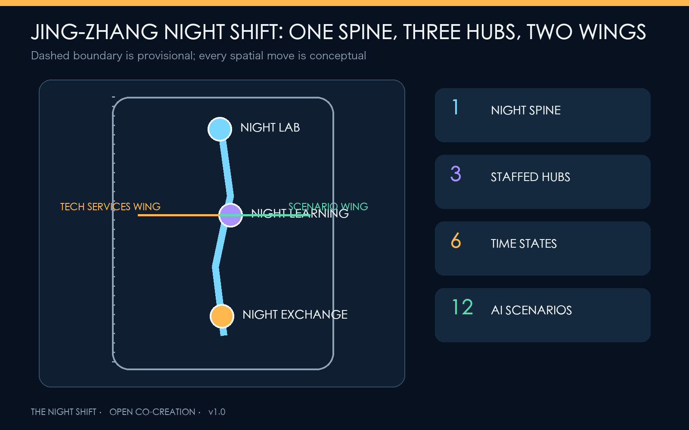
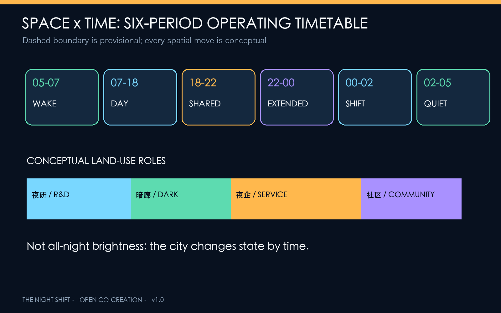
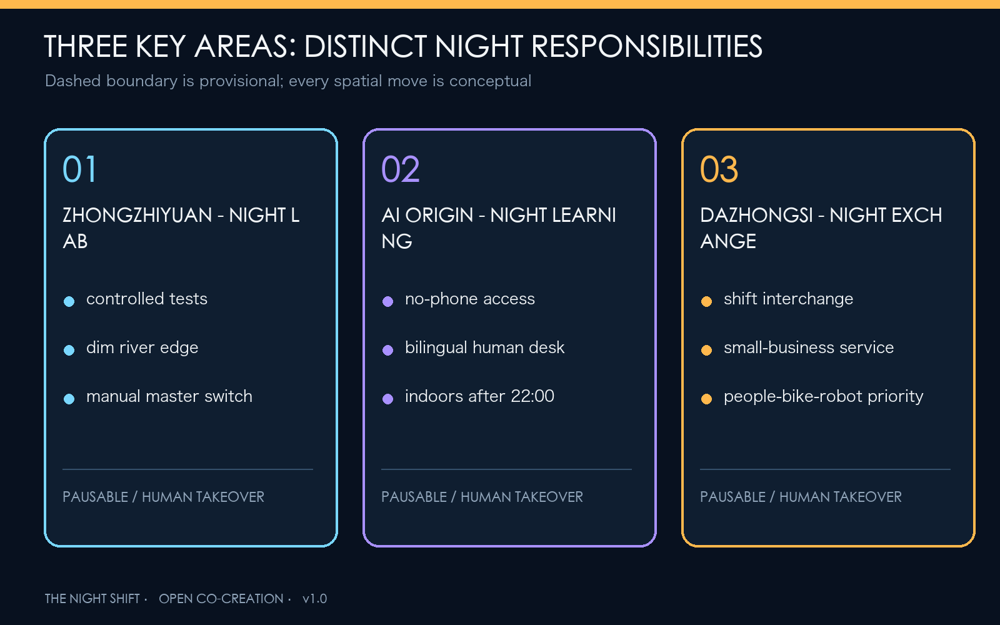
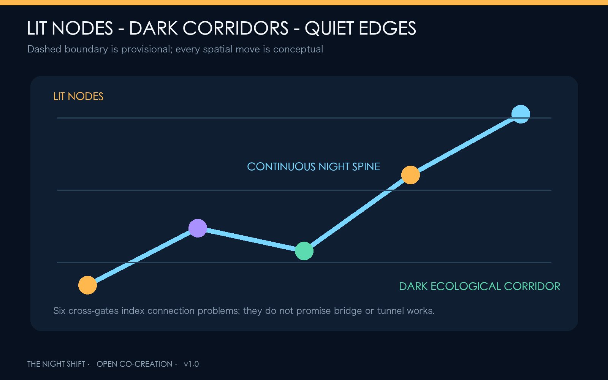
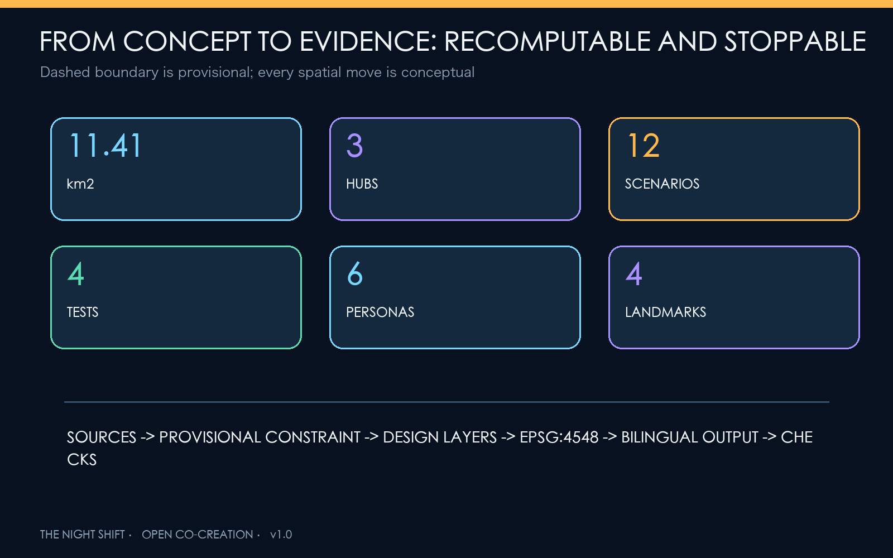

# JING-ZHANG NIGHT SHIFT / THE NIGHT SHIFT

## Let innovation work late and the city sleep well

This is not a proposal to make the night brighter. It is an urban operating protocol that lets people choose to work, travel, rest, or remain in darkness. The Jing-Zhang Railway Heritage Park becomes a night spine connecting Night Lab Yard at Zhongzhiyuan, Night Learning Commons at the Beijing AI Origin Community, and Night Exchange at Dazhongsi. A six-period timetable coordinates research, mobility, services, events, sleep, and ecology. Every spatial move is a Conceptual Recommendation and material for professional teams to deepen; it is not approved planning or a government implementation commitment [source:AGENT-TASKBOOK].

## Design Basis and Source List

The 9 May 2026 official prequalification announcement defines the three scope levels, three key areas, and design tasks. The repository's cleared Agent taskbook, local standard snapshots, and Source Registry provide the remaining controls [source:OFFICIAL-ANNOUNCEMENT] [standard:PROJECT-OFFICIAL-ANNOUNCEMENT]. Land-use terminology follows the national classification logic. Urban Design integrates public space, heritage, and character. Without approved Regulatory Detailed Planning data, FAR, height, road redlines, and parcel-level demolition decisions remain pending official data [standard:MNR-LAND-USE-CLASSIFICATION-GUIDE] [standard:MOHURD-CONTROL-DETAILED-PLANNING].

Official exact polygons are not public. This package uses the repository's provisional rough geometry only for generation, display, and intake checks. A documented uncertainty remains between that geometry and the mapped built heritage park, so every figure renders the boundary as a low-contrast dashed constraint and triggers full recalculation when official data arrives [source:BOUNDARY-SOURCE] [data:geometry/site_boundary.geojson#SITE-001] [metric:site_area_sqm].

Six international references contribute mechanisms rather than local claims: London plans explicitly for 18:00-06:00 and cross-agency governance; New South Wales combines regulation, precincts, night workers, mobility, and inclusion; Helsinki's AI Register explains city AI systems and collects feedback; Singapore AI Verify turns governance into tests and sandboxes; Testbed Seoul 2.0 opens urban settings to AI and robot validation; Helsinki's waterfront lighting principles recognize light-sensitive species. Night innovation therefore requires time, responsibility, data, and exit rules, not merely longer opening hours [source:EXT-LONDON-NIGHT] [source:EXT-NSW-24H] [source:EXT-HELSINKI-AI-REGISTER].

## Three-Level Scope Framework

The 43.6 km2 Coordinated Research Area asks who works at night, which services need later hours, which communities need quiet, and which ecological edges must remain dark. The approximately 11.4 km2 Overall Design Area organizes temporal zones, Walking and Cycling Network links, a low-light green spine, worker services, and renewal projects. The three Key-Area Detailed Design Areas test distinct night-time prototypes [depth:three_level_scope_framework] [data:geometry/key_areas.geojson#PROV-KEY-001].

The structure is "one spine, three yards, two wings, six periods." The night spine links heritage, park, and transit. Night Lab Yard validates technology; Night Learning Commons supports talent, learning, and human service; Night Exchange supports commerce, interchange, and AI-native business. The Zhongguancun Technology Services Wing provides computing, legal, financial, and international back-office support. The Xiaoyue River Scenario Enablement Wing supports low-light ecology and daily-life trials. The six-period timetable overlays operations without creating a statutory boundary [depth:overall_spatial_structure].

| Period | Urban state | Core rule |
| --- | --- | --- |
| 05:00-07:00 Wake | cleaning, commute preparation, ecology recovery | lower activity noise; keep travel continuous |
| 07:00-18:00 Day | learning, research, community service | standard daytime mode |
| 18:00-22:00 Shared | culture, sport, families, demonstrations | public activity with zoned sound and light |
| 22:00-00:00 Extended | late research, learning, commerce | open worker transport and human service together |
| 00:00-02:00 Night Shift | essential research, logistics, care | registered nodes only; low noise and low light |
| 02:00-05:00 Quiet Night | sleep and dark ecology | close nonessential activity; preserve human takeover |

## Coordinated Research Area: Industry and Future City Research

The proposal defines 24-hour capability as public infrastructure for Haidian's AI ecosystem. Models may train at night, but public space need not remain brightly lit. Enterprises may collaborate late, but night workers need transport, food, rest, toilets, health support, and human service. Automated scenarios must degrade when drift, harassment, false alarms, or equipment failure occur. The five functions form a research-validation-service-governance-communication loop across the Three Zones and Two Wings [source:AGENT-TASKBOOK] [depth:overall_spatial_structure].

| Global case | Transferable mechanism | Jing-Zhang application |
| --- | --- | --- |
| London Night Time Strategy | separate night planning, audits, coordination | co-review with residents and workers |
| NSW 24-Hour Economy Strategy 2024 | precinct operations, workers, mobility, inclusion | joint operating ledger for night hubs |
| Helsinki AI Register | disclose city AI use, responsibility, feedback | public card for every night AI scenario |
| Singapore AI Verify | standard tests and assurance sandbox | controlled validation gate at Night Lab Yard |
| Testbed Seoul 2.0 | citywide experimentation linked to adoption | risk-tiered release across three hubs |
| Helsinki shoreline lighting principles | night landscape and light-sensitive species | dark ecological edges along waterways |

The name is JING-ZHANG NIGHT SHIFT / THE NIGHT SHIFT. Its mark combines a railway timetable line with an interrupted lunar phase: the line means continuous public passage; the gap means the city may switch off and rest. Midnight navy is the ground, duty amber marks human service, verification cyan marks testable AI, and dark-ecology green marks no-light or minimum-light areas. The identity does not borrow corporate marks [source:AGENT-TASKBOOK].

## Overall Design Area: Urban Renewal and Regulatory-Plan-Level Urban Design

The Overall Design Area is not a single nightlife district. It uses a gradient of bright nodes, dark corridors, quiet interfaces, and adaptable ground floors. The conceptual Land-Use Plan fully partitions the provisional boundary: research and night testing to the west, heritage park and low-light open space through the middle, industry and night commerce in the east-middle, and community services along the east [data:geometry/land_use.geojson#LU-001] [metric:green_ratio] [depth:land_use_layout].

Renewal follows "retain first, adapt second, add last." Existing ground floors, foyers, arcades, and reversible components can host rest, meetings, meals, and human service. Residential interfaces receive shielding, noise control, and curfews. New footprints are conceptual and require ownership, survey, daylight, fire, and regulatory confirmation [data:geometry/buildings.geojson#BLDG-NS-001] [metric:building_footprint_area_sqm] [depth:retain_renovate_demolish].

## Detailed Design of Key Areas

### Zhongzhiyuan: NIGHT LAB YARD

A controlled night validation courtyard tests models, low-speed robots, adaptive lighting, and edge devices in an enclosed, reversible setting before any public-path trial. The Qinghe edge remains warm, dim, and shielded from water and homes. Program elements include a shared night lab, AI assurance room, worker supply station, and dark riverbank [data:geometry/key_areas.geojson#PROV-KEY-001] [source:EXT-SG-AI-VERIFY].

### Beijing AI Origin Community: NIGHT LEARNING COMMONS

At the campus-park-community interface, no-phone night learning rooms, bilingual human-service desks, open-source courses, and project launches share adaptable interiors. After 22:00, events move indoors while outdoor space preserves quiet passage and rest. AI learning and health navigation must retain paper, phone, or human alternatives and cannot require an account for basic public service [data:geometry/key_areas.geojson#PROV-KEY-002] [standard:BARRIER-FREE-ENVIRONMENT-LAW].

### Dazhongsi: NIGHT EXCHANGE

A night arrival hall coordinates shift-worker interchange, late food, small-business support, smart-device demonstration, and international exchange. Delivery robots are tested only on delimited routes and schedules, with walking, cycling, accessibility, and courier stopping taking priority. No underground connection or road engineering feasibility is claimed [data:geometry/key_areas.geojson#PROV-KEY-003] [depth:traffic_rail_slow_parking].

## AI Innovation Ecosystem, Personas, and AI+ Scenarios

Six personas define the night city: late researchers need quiet collaboration and transport; cleaners, security staff, couriers, and carers need rest, toilets, food, and dignity; residents need a predictable quiet night; older, disabled, and no-smartphone users need human alternatives; international visitors need bilingual access without a local account; small businesses need low-cost tools without platform lock-in [standard:ELDERLY-SMART-TECH-PLAN-2020-45].

| # | Scenario card | Type | Space and operation | Human/exit boundary |
| --- | --- | --- | --- | --- |
| 01 | Adaptive lighting sandbox | test | Night Lab Yard, timed dimming and glare feedback | manual master switch; no facial recognition |
| 02 | Low-speed delivery robot night trial | test | delimited loop and night curb | pedestrian priority; stop after incident |
| 03 | AI sound mediation | test | event-residential interface | aggregate levels only; no recorded speech |
| 04 | Demand-responsive night shuttle | test | three hubs and transit nodes | human dispatch; no personal travel profile |
| 05 | Night-worker service station | service | hot food, water, rest, toilet, charging | free basics and staffed hours |
| 06 | 24-hour open-source room | innovation | indoor commons at AI Origin | booking after midnight; light/noise control |
| 07 | Late health navigation | health | community and transit desk | no diagnosis; human/phone referral |
| 08 | Identity-free safe walk | mobility | night spine and six cross-gates | no face recognition or stored route |
| 09 | Dark ecology observation | ecology | river and park dark corridor | environmental data only; seasonal pause |
| 10 | Jing-Zhang night heritage guide | culture | low-luminance signs and audio | fully offline option; heritage first |
| 11 | Small-business night copilot | enterprise | Dazhongsi and neighborhood retail | merchant controls data and can exit |
| 12 | Event load and evacuation assistant | operation | shared-period event nodes | advisory only; humans command |

Five release gates apply: real need, data minimization, night-impact review, human takeover, and exit/recovery. Every pilot discloses purpose, operator, input categories, retention, fault phone, and stop criteria. AI assists but does not replace planning approval, clinical diagnosis, policing, or emergency command [standard:GENERATIVE-AI-INTERIM-MEASURES] [metric:scenario_card_count] [metric:testing_scenario_count].

## Land Use, Building Scale, and Retain-Renovate-Demolish Strategy

Four conceptual land-use zones create a complete topology without replacing approved Regulatory Detailed Planning. Three illustrative footprints host night assurance, human learning service, and interchange operations; they verify internal consistency, not confirmed development scale [data:geometry/land_use.geojson#LU-002] [data:geometry/buildings.geojson#BLDG-NS-002] [metric:building_density].

Retain-Renovate-Demolish decisions pass three gates: verify safety, ownership, and heritage; test whether acoustic/light adaptation, reversible furniture, and shared hours can meet the need; only then study additional volume if regulations allow. Building Height, FAR, setback, and roof equipment remain pending official data [depth:height_massing_character] [metric:floor_area_ratio].

## Transport, Rail, Municipal Infrastructure, and Public Services

A north-south night spine and six cross-gates connect key areas, transit, communities, and the two wings. Cross-gates index a problem to solve after road-redline, signal, station, and field audits; they do not promise new bridges or tunnels [data:geometry/roads.geojson#ROAD-NIGHT-SPINE] [metric:night_route_length_m].

Night safety is not unlimited lighting or surveillance. Routes use continuous, low-glare, warm, targeted light: bright nodes, dark corridors, quiet edges. Public-service nodes retain human call, paper guidance, and physical credentials. District power, master switches, asset registers, bypasses, and recovery modes are reserved conceptually, while capacity, utilities, and fire safety require professional data [depth:municipal_new_infrastructure].

## Blue-Green Network, Public Space, and Urban Character

The Jing-Zhang Railway Heritage Park becomes a heritage spine that can be lit or dark. Qinghe, Xiaoyue River, and continuous green space prioritize dark ecology: directional warm light only where movement requires it, with upward light, spill, and blue content limited, then dimmed further in the quiet-night period. Darkness does not mean unsafe absence; route choice, edge definition, reflectors, nearby staffed nodes, and clear exits preserve legibility [source:EXT-HELSINKI-SHORE-LIGHT] [source:EXT-DARKSKY-LIGHTING] [metric:dark_refuge_area_sqm].

Four landmarks avoid giant screens: Midnight Clock uses physical split-flap panels to show open scenarios and human owners; Herringbone Night Beacon recalls railway engineering with low luminance; Open-Source Night School Wall records reusable public code and contributors; Dark Adaptation Garden lets visitors understand nocturnal ecology without a screen. The cultural proposition shifts from "the railway brought standardized time" to "the AI city must be accountable for its operating hours" [standard:MOHURD-URBAN-DESIGN-MEASURES] [metric:landmark_count].

## Renewal Projects, Implementation Policy, and Phasing

| Project | Scope | Prerequisite | Phase |
| --- | --- | --- | --- |
| N01 Night baseline audit | walking, light, sound, service, ecology | access and participation | near term |
| N02 One spine, six gates | continuous route and cross-links | road and transport data | near-mid |
| N03 Three worker stations | water, rest, toilet, human service | site rights and operating funds | near |
| N04 Night Lab sandbox | four validation scenarios | safety, ethics, permissions | mid |
| N05 Night Learning ground floors | late learning, bilingual and no-phone service | campus-city and fire review | mid |
| N06 Night Exchange foyer | interchange, small business, public hall | transit, traffic, ownership | mid |
| N07 Dark ecological corridor | zoned and seasonal lighting | ecology, heritage, water data | mid-long |
| N08 Public night ledger | pilots, complaints, shutdown, repair | operator and data rules | continuous |

The sequence is measure, install lightly, then build; indoors before outdoors; human before automatic. Early work uses audits, temporary signs, staffed service, and reversible trials. Later work depends on official data and specialist review. Annual operations may include a Night City Audit Week, Dark Ecology Month, Global AI Night Test, and Open-Source Night School season, plus worker roundtables and shutdown drills. The conversion path is challenge-test-public trial-human review-procurement or incubation assessment-annual review, never event attendance equals investment success [data:geometry/phasing.geojson#PHASE-001] [depth:phasing_implementation] [source:EXT-SEOUL-TESTBED].

## Metrics, Area Recalculation, and Compliance Matrix

Spatial metrics are recalculated from GeoJSON in EPSG:4548. The provisional Overall Design Area is about 11.41 km2. Area ratios and route lengths inherit provisional-boundary uncertainty; green space, public space, footprints, and night routes test internal consistency and are not statutory controls or construction quantities [metric:site_area_sqm] [metric:green_space_area_sqm] [metric:public_space_area_sqm].

The proposal contains 12 scenario cards, including four validation scenarios, six personas, four landmarks, and three night hubs. These are auditable content commitments. Success is not lighting duration or surveillance coverage; it is access to necessary night services, resolvable complaints, stoppable scenarios, resident sleep, and preserved darkness [metric:persona_count] [metric:night_hub_count] [depth:metrics_recalculation].

The Compliance Matrix covers all 23 mandatory announcement and Agent tasks. The Professional Standards Matrix separates mandatory sources, policy references, and gaps. The Design Depth Matrix maps 15 deliverable-depth items. Passing deterministic checks means the package is readable, traceable, and recomputable; it does not mean approval.

## Risk, Copyright, and Compliance

Risks include provisional geometry; missing building, ownership, regulatory, road, utility, heritage, and service baselines; missing field measurements for light and noise; unknown operators and funding; and privacy, discrimination, false alarm, and maintenance risks from sensing. Responses are full-package recalculation, night audits, tiered permission, data minimization, no facial recognition, human takeover, stop thresholds, annual disclosure, and asset retirement [depth:risk_missing_data] [data:geometry/constraints.geojson#CONSTRAINT-NIGHT-001].

The package uses public or cleared text, provisional repository geometry, and original diagrams. External cases are qualitative references. Figures, HTML, and PDFs are generated locally from the same geometry, metrics, and narrative; there are no commercial map tiles, remote fonts, trackers, or unlicensed images. Original text and graphics are CC-BY-4.0; the organizer's formal IP terms still govern the open call.

## References

- Official announcement, Agent taskbook, site package, Source Registry, and local professional-standard snapshots: see `sources.json`.
- London City Hall, Night Time Strategy Guidance [source:EXT-LONDON-NIGHT].
- NSW Government, 24-Hour Economy Strategy 2024 [source:EXT-NSW-24H].
- City of Helsinki, AI Register [source:EXT-HELSINKI-AI-REGISTER].
- Singapore IMDA, AI Verify [source:EXT-SG-AI-VERIFY].
- Seoul Metropolitan Government, Testbed Seoul 2.0 [source:EXT-SEOUL-TESTBED].
- City of Helsinki, shoreline lighting principles [source:EXT-HELSINKI-SHORE-LIGHT].
