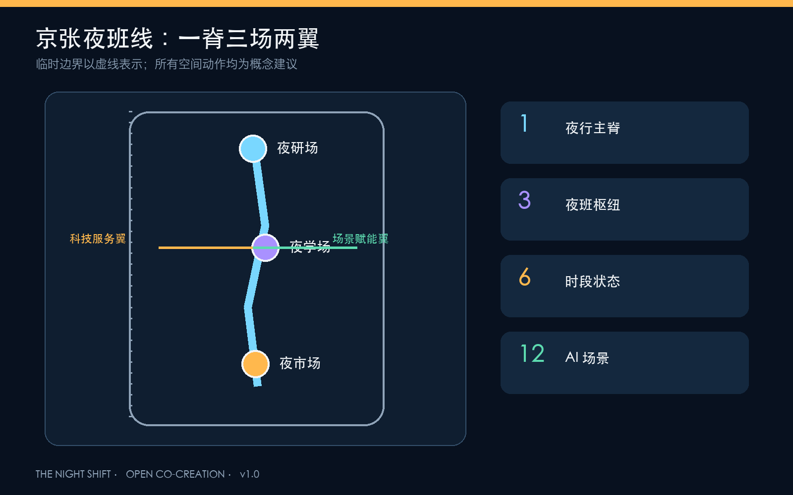
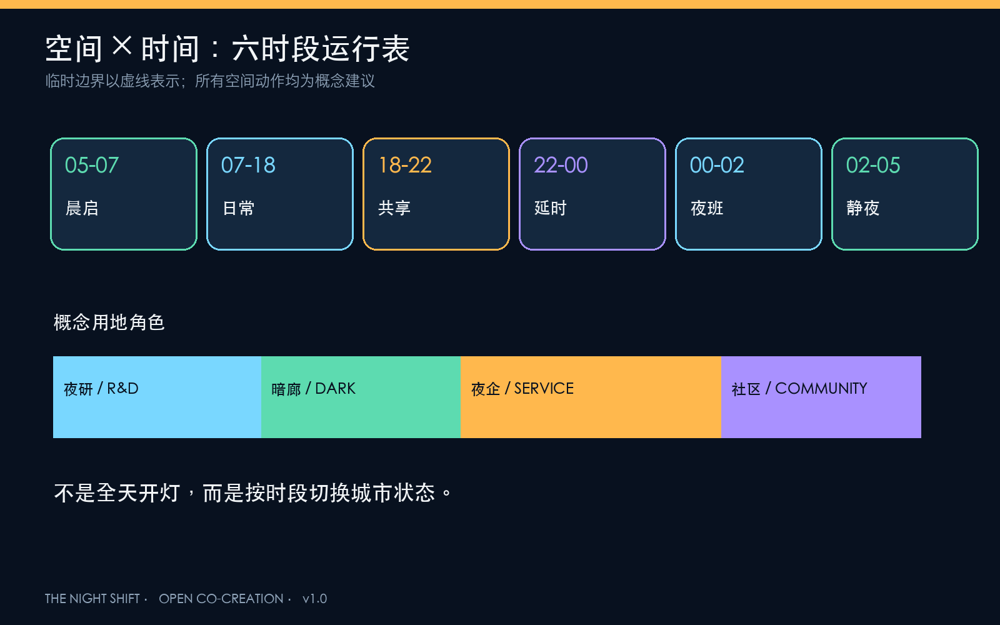
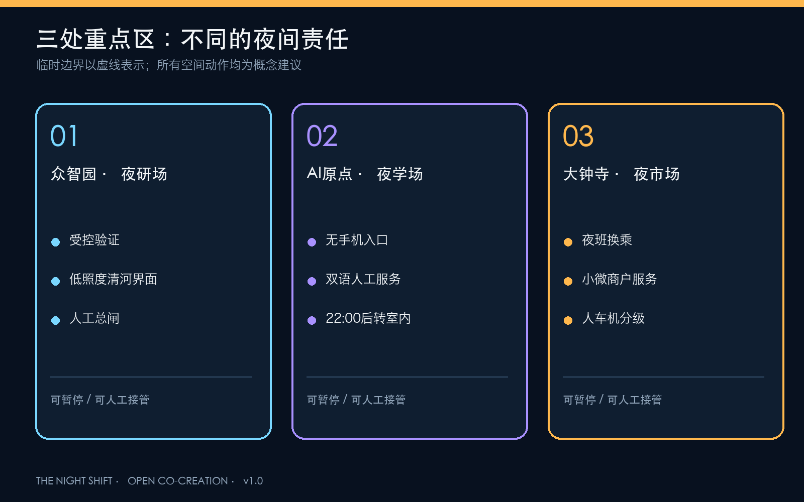
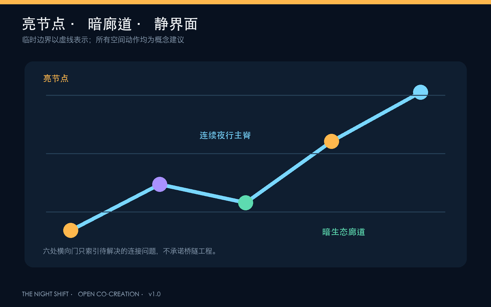
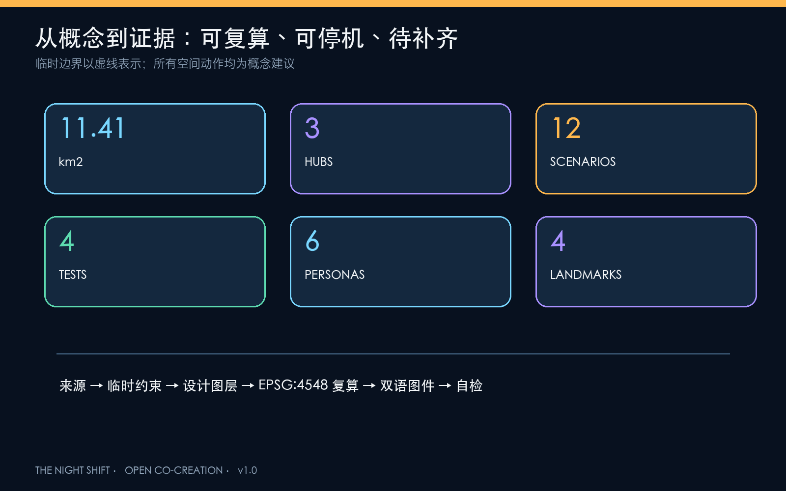

# 京张夜班线 / THE NIGHT SHIFT

## 让创新晚睡，让城市好眠

这不是一份把夜晚照得更亮的方案，而是一套让不同人有权选择“工作、通行、休息或保持黑暗”的城市运行协议。方案以京张铁路遗址公园为夜行主脊，把众智园、北京 AI 原点社区、大钟寺分别组织为“夜研场、夜学场、夜市场”，用六时段运行表协调研发、交通、服务、活动、睡眠和生态。所有空间动作均为概念建议、参考方案和可供专业团队深化研究的材料，不替代正式规划，不构成政府审定或实施承诺 [source:AGENT-TASKBOOK]。

## 设计依据与资料清单

方案以 2026 年 5 月 9 日官方资格预审公告确定的三层范围、三处重点区与设计任务为主控依据，并采用仓库中已清权的 Agent 任务书、专业标准快照和公开资料登记表 [source:OFFICIAL-ANNOUNCEMENT] [standard:PROJECT-OFFICIAL-ANNOUNCEMENT]。用地分类遵循国土空间用途分类逻辑，城市设计强调公共空间、历史文化与整体风貌；在缺少批准控规时，容积率、高度、道路红线和地块级拆改留全部保持“待正式数据补齐” [standard:MNR-LAND-USE-CLASSIFICATION-GUIDE] [standard:MOHURD-CONTROL-DETAILED-PLANNING]。

当前官方精确红线与三处重点区 polygon 尚未公开。本包沿用仓库临时粗略边界，仅用于生成、展示与 intake 自检；该边界与公开 OSM 已建遗址公园存在待裁决的空间不确定性，因此图中始终以低对比虚线表达，并在官方数据到位后整体重算 [source:BOUNDARY-SOURCE] [data:geometry/site_boundary.geojson#SITE-001] [metric:site_area_sqm]。

国际案例只用于机制转化，不作为海淀现状或投资承诺：伦敦把 18:00-06:00 纳入独立的夜间规划和跨部门协作；新南威尔士州把监管、片区、夜班劳动、交通与包容性合并进 24 小时经济战略；赫尔辛基 AI Register 提供城市 AI 系统公开说明与反馈入口；新加坡 AI Verify 把模型治理转为可测试工具与沙盒；首尔 Testbed Seoul 2.0 将城市空间开放给 AI、机器人等真实场景验证；赫尔辛基滨水照明原则提醒夜景必须兼顾光敏物种。它们共同指向一个结论：夜间创新不是延长营业时间，而是建立时段、责任、数据与退出机制 [source:EXT-LONDON-NIGHT] [source:EXT-NSW-24H] [source:EXT-HELSINKI-AI-REGISTER]。

## 三层范围工作框架

统筹研究范围关注 43.6 平方公里“三区两翼”的夜间创新生态：谁在夜间工作、哪些服务必须延时、哪些社区需要安静、哪些生态界面必须保持暗。总体设计范围关注约 11.4 平方公里的时段分区、慢行接驳、低照度绿脊、夜班服务与更新项目。三处重点区则验证三种不同的夜间原型 [depth:three_level_scope_framework] [data:geometry/key_areas.geojson#PROV-KEY-001]。

总体结构为“一脊三场两翼六时段”：一条夜行主脊连接遗产、公园和轨道；夜研场负责受控测试与标准治理，夜学场负责人才、学习和人工服务，夜市场负责夜间消费、换乘与智能原生业态；中关村科技服务翼提供算力、法务、资本与国际协作后台，小月河场景赋能翼承担低照度生态与生活场景；六时段把一昼夜分为恢复、日常、共享、延时、静夜、晨启。该结构是运营叠层，不新增法定红线 [depth:overall_spatial_structure]。

| 时段 | 城市状态 | 核心规则 |
| --- | --- | --- |
| 05:00-07:00 晨启 | 清扫、通勤准备、生态恢复 | 降低活动音量，保留连续通行 |
| 07:00-18:00 日常 | 教学、研发、社区服务 | 日间常规模式 |
| 18:00-22:00 共享 | 文化、运动、亲子、路演 | 公共活动优先，分区控制声光 |
| 22:00-00:00 延时 | 夜研、夜学、夜间消费 | 夜班交通与人工服务同步开放 |
| 00:00-02:00 夜班 | 必要研发、物流、照护 | 只开放登记节点，低噪低照度 |
| 02:00-05:00 静夜 | 睡眠与暗生态优先 | 非必要活动关闭，设施可人工接管 |

## 统筹研究范围产业与未来城市研究

“京张夜班线”把 24 小时能力定义为海淀 AI 生态的一项公共基础能力：模型可以夜间训练，但公共空间不必全天高亮；企业可以延时协作，但夜班劳动者必须获得交通、餐食、休息、厕所、健康与人工服务；场景可以自动运行，但出现漂移、骚扰、错误告警或设备故障时必须降级。五大功能由此形成“研发-验证-服务-治理-传播”闭环，并通过三区两翼传导 [source:AGENT-TASKBOOK] [depth:overall_spatial_structure]。

| 全球案例 | 可转化机制 | 京张应用 |
| --- | --- | --- |
| 伦敦 Night Time Strategy | 夜间单独规划、夜间审计、跨部门协调 | 建立夜间策略与居民/劳动者共审 |
| NSW 24-Hour Economy Strategy 2024 | 片区运营、夜班劳动、交通与包容性并列 | 夜班枢纽实行联合运营台账 |
| Helsinki AI Register | 城市 AI 用途、责任与反馈公开 | 每个夜间 AI 场景设置公开说明卡 |
| Singapore AI Verify | 标准化测试与专业测试沙盒 | 众智园“夜研场”设置受控验证门 |
| Testbed Seoul 2.0 | 城市空间开放实证并连接市场转化 | 三场按风险等级逐级开放 |
| Helsinki shoreline lighting principles | 滨水夜景兼顾光敏物种 | 清河、小月河设置暗生态界面 |

品牌主名为“京张夜班线”，英文名 THE NIGHT SHIFT。标志以铁路时刻表的一条竖线与一段缺口月相构成：竖线代表连续公共通行，缺口代表城市有权熄灯和休息。主色“深夜蓝”用于背景，“值守琥珀”用于人工服务与安全节点，“检验青”用于可验证 AI，“暗生态绿”用于不照明或最低照明区。视觉系统不借用企业标志，字体仅使用系统许可字体 [source:AGENT-TASKBOOK]。

## 总体设计范围城市更新与控规深度城市设计

总体设计不是把全部范围改造成夜经济街区，而是形成“亮节点、暗廊道、静界面、可变首层”的精细梯度。概念用地分区完整覆盖临时总体设计边界：西侧偏研发与夜间测试，中部保留遗产公园和低照度开敞空间，东中部承载产业服务与夜间商业，东侧承载社区服务和生活配套 [data:geometry/land_use.geojson#LU-001] [metric:green_ratio] [depth:land_use_layout]。

建筑更新采用“先留、再改、后增”的方法：优先以既有首层、架空层、门厅和可逆构件容纳夜班休息、共享会议、餐食与人工服务；靠近居住界面的建筑采用遮光、低噪和定时熄灯；新增体量仅作概念示意，待权属、现状普查、日照、消防和控规条件核实后再判断 [data:geometry/buildings.geojson#BLDG-NS-001] [metric:building_footprint_area_sqm] [depth:retain_renovate_demolish]。

## 重点区域详细设计

### 众智园：夜研场 / NIGHT LAB YARD

以花园型研发街区为基础，提出“受控夜间验证院”：模型、低速机器人、智能照明和端侧设备先在围合可撤回的测试空间运行，再进入公共路径；外部清河界面保持暖色低照度，测试灯光不得向水体与居住界面溢出。空间抓手包括夜研共享厅、AI 保障实验室、夜班补给站和清河暗岸 [data:geometry/key_areas.geojson#PROV-KEY-001] [source:EXT-SG-AI-VERIFY]。

### 北京 AI 原点社区：夜学场 / NIGHT LEARNING COMMONS

围绕高校、园区和社区交界，设置可无手机使用的夜学客厅、双语人工服务台、开源课程与成果发布空间。22:00 后活动收进室内，室外只保留连续通行与安静停留；每项 AI 教育或健康导航均提供纸质、电话或人工替代，不以注册账号作为获得公共服务的前提 [data:geometry/key_areas.geojson#PROV-KEY-002] [standard:BARRIER-FREE-ENVIRONMENT-LAW]。

### 大钟寺：夜市场 / NIGHT EXCHANGE

围绕轨道接驳与四象限步行联系，形成“夜间到达大厅”：夜班换乘、延时餐食、小微商户服务、智能终端展示和国际路演共享一套可调整首层界面。机器人配送只在限定路线和时段测试，优先保障步行、骑行、无障碍与骑手停靠，不作地下连通或道路工程可行性结论 [data:geometry/key_areas.geojson#PROV-KEY-003] [depth:traffic_rail_slow_parking]。

## AI 创新生态、人才画像与 AI+ 场景

六类用户共同定义夜间城市，而不是由“夜生活消费者”单一代表：夜间研发者需要安静协作与通勤；保洁、安保、配送和照护者需要休息、卫生间、热食与劳动尊严；周边居民需要可预期的静夜；老年人、残障人士和无智能手机者需要人工替代；国际访客需要无本地账号的双语入口；小微商户需要低成本工具而不是被平台锁定 [standard:ELDERLY-SMART-TECH-PLAN-2020-45]。

| # | 场景卡 | 类型 | 空间与运营 | 人工/退出边界 |
| --- | --- | --- | --- | --- |
| 01 | 自适应照明沙盒 | 测试验证 | 夜研场，分时调光与眩光反馈 | 人工总闸；不使用人脸识别 |
| 02 | 低速配送机器人夜测 | 测试验证 | 限定闭环与夜间路缘 | 行人绝对优先；事故即停 |
| 03 | AI 声环境调解实验 | 测试验证 | 活动界面与居住边界 | 只采聚合声级，不录对话 |
| 04 | 夜间需求响应接驳 | 测试验证 | 三场与轨道节点 | 人工调度；无单独行程画像 |
| 05 | 夜班劳动者服务站 | 公共服务 | 热食、饮水、休息、厕所、充电 | 免费基础服务，人工值守 |
| 06 | 24 小时开源协作厅 | 创新服务 | 原点社区室内共享空间 | 00:00 后预约，控制声光 |
| 07 | 延时健康导航 | 医疗服务 | 社区与轨道服务台 | 不诊断；提供人工与电话转介 |
| 08 | 无身份安全伴行 | 出行服务 | 夜行主脊与六处横向门 | 不做人脸识别，不保留轨迹 |
| 09 | 暗生态观测 | 生态治理 | 清河、小月河与公园暗廊 | 只采环境数据，季节性停测 |
| 10 | 京张夜间文化导览 | 文化体验 | 低亮度导视与音频节点 | 可完全离线；文保优先 |
| 11 | 小微商户夜间 Copilot | 企业服务 | 大钟寺与社区商业 | 数据归商户，可人工纠错退出 |
| 12 | 活动负荷与疏散助手 | 公共运营 | 共享时段活动节点 | 只做提示，最终指挥由人负责 |

场景放行采用五道门：真实需求、数据最小化、夜间影响评估、人工接管、退出与恢复。每次试点必须公布用途、运营方、输入数据类别、保留期限、故障电话和停止条件；AI 只提供辅助判断，不替代规划审批、医疗诊断、治安执法或应急指挥 [standard:GENERATIVE-AI-INTERIM-MEASURES] [metric:scenario_card_count] [metric:testing_scenario_count]。

## 用地、建筑规模与拆改留方案

四类概念用地形成完整拓扑分区，但不替代批准控规。三座示意性建筑基底分别承载夜研保障、夜学人工服务与夜市换乘运营；其面积仅用于图层一致性和空间量级检验，不代表确认建设规模 [data:geometry/land_use.geojson#LU-002] [data:geometry/buildings.geojson#BLDG-NS-002] [metric:building_density]。

拆改留判定采用三步门槛：先核现状安全、权属和文保；再评估是否能通过室内声光改造、可逆家具和共享时段满足需求；只有在既有空间无法承载且控规允许时，才进入新增体量研究。建筑高度、容积率、退线与屋顶设备均待正式资料补齐 [depth:height_massing_character] [metric:floor_area_ratio]。

## 交通、轨道、市政与公共服务设施

交通结构由一条南北夜行主脊和六处横向“夜行门”组成，连接三处重点区、轨道节点、社区与两翼。夜行门不是承诺新建桥隧，而是待道路红线、信号配时、站点边界和现场审计后选择地面过街、既有通道优化或其他方式的概念索引 [data:geometry/roads.geojson#ROAD-NIGHT-SPINE] [metric:night_route_length_m]。

夜间安全不等于无限照明或全面监控。路径采用连续、低眩光、暖色和重点照明；节点亮、廊道暗、边界静，避免明暗反差制造盲区。公共服务节点保留人工呼叫、纸质导览和现金/实体凭证的可能性。市政层面预留分区电源、总闸、设备台账、故障旁路和恢复模式，但能源负荷、管线与消防结论必须由专业资料验证 [depth:municipal_new_infrastructure]。

## 蓝绿空间、公共空间与城市风貌

京张遗址公园不是全天候活动舞台，而是“可亮也可暗”的遗产公共脊。清河、小月河及连续绿地采用暗生态优先：仅在必要通行面提供定向暖光，控制上射光、溢出光与蓝光；凌晨静夜时段进一步降级。暗处不以取消照明制造危险，而通过路线选择、护栏边界、反光标识、邻近人工节点和清晰出口保持可读 [source:EXT-HELSINKI-SHORE-LIGHT] [source:EXT-DARKSKY-LIGHTING] [metric:dark_refuge_area_sqm]。

四处 AI 朝圣与荣誉节点均避免“巨型屏幕城市”：①“零点钟”用实体翻牌显示当夜开放场景与人工负责人；②“人字夜航标”以低亮度双向信号纪念京张工程精神；③“开源夜校墙”永久记录可复用公共代码与贡献者；④“暗适应花园”让访客在不被屏幕占据的环境中理解夜间生态。文化叙事从“铁路把时间标准带进城市”转译为“AI 城市必须对自己的运行时段负责” [standard:MOHURD-URBAN-DESIGN-MEASURES] [metric:landmark_count]。

## 更新项目清单、实施政策与分期计划

| 项目 | 内容 | 前置条件 | 分期 |
| --- | --- | --- | --- |
| N01 夜间基线审计 | 步行、照明、噪声、服务与生态共同调查 | 现场许可、公众参与 | 近期 |
| N02 一脊六门 | 连续夜行路线与六处横向联系索引 | 道路红线、交通专项 | 近期-中期 |
| N03 三座夜班服务站 | 饮水、休息、厕所、人工服务 | 场地产权、运营经费 | 近期 |
| N04 夜研场沙盒 | 四类测试验证场景 | 安全、伦理与主管部门许可 | 中期 |
| N05 夜学场共享首层 | 延时学习、双语与无手机服务 | 校地协作、消防 | 中期 |
| N06 夜市场换乘前厅 | 夜班接驳、小微服务与公共大厅 | 轨道、交通、权属 | 中期 |
| N07 暗生态廊道 | 河岸与公园分区照明、季节性静默 | 生态、文保、水务资料 | 中期-长期 |
| N08 夜间公开账本 | 场景、投诉、停机与修复记录 | 运营主体和数据规则 | 全周期 |

分期采用“先测量、后轻装、再建设；先室内、后室外；先人工、再自动”的顺序。一期完成夜间审计、临时导视、人工服务和可撤回测试；二期在正式数据与专项论证支持下建设三场和六门；长期按年度评估决定保留、调整或退役。以上均为实施研究建议，不构成财政、招商、建设或活动承诺 [data:geometry/phasing.geojson#PHASE-001] [depth:phasing_implementation]。

年度运营建议包括：春季“夜间城市审计周”、夏季“暗生态月”、秋季“全球 AI 夜测大会”、冬季“开源夜校季”；每月夜班劳动者圆桌和场景停机演练；GitHub 公开 issue 与线下服务台共同接收反馈。成果转化路径为“命题-受控测试-公共试用-人工复核-采购/孵化评估-年度复盘”，不以活动客流直接等同于招商成效 [source:EXT-SEOUL-TESTBED]。

## 指标体系、面积复算与合规矩阵

空间指标由提交 GeoJSON 在 EPSG:4548 中复算。临时总体设计范围约 11.41 平方公里，图中所有比例与长度都继承临时边界的不确定性；绿地、公共空间、建筑基底和夜行路线用于检查方案内部一致性，不能作为审定控规或工程量 [metric:site_area_sqm] [metric:green_space_area_sqm] [metric:public_space_area_sqm]。

方案设置 12 张场景卡、其中 4 项测试验证，6 类用户画像、4 处地标和 3 座夜班枢纽；这些数量是方案内容的可审计承诺。成功不是“亮灯时长”或“监控覆盖率”，而是夜间必要服务可达、投诉可处理、场景可停机、居民可睡眠、生态可保持暗 [metric:persona_count] [metric:night_hub_count] [depth:metrics_recalculation]。

`compliance_matrix.json` 覆盖公告与 agent.1-agent.6 全部 23 项必答任务；`standard_matrix.json` 区分强制标准、参考政策与数据缺口；`design_depth_matrix.json` 对 15 项成果深度逐项定位。机器校验通过只表示包可读、可查、可复算，不代表方案获批或专业结论成立。

## 风险、版权与合规说明

主要风险包括：临时边界偏差；现状建筑、权属、控规、道路、市政、文保与公共设施底数缺失；夜间照明和噪声缺少现场基线；场景运营主体与资金未确定；感知设备可能产生隐私、歧视、误报和维护风险。对应措施是整包复算、现场夜间审计、分级许可、数据最小化、无脸识别、人工接管、停机阈值、年度公开与资产退役计划 [depth:risk_missing_data] [data:geometry/constraints.geojson#CONSTRAINT-NIGHT-001]。

本包只使用公开或清权文字资料、仓库临时几何和本次原创图件；外部案例仅作定性参考。五张图、网页与 PDF 由本地脚本从同一几何、指标和文本生成，不含商业地图底图、远程字体、跟踪代码或未经授权图像。方案文本与原创图件以 CC-BY-4.0 开放；正式征集知识产权安排仍以主办方文件为准。

## 参考资料

- 项目官方公告、Agent 任务书、场地包、来源登记表与专业标准本地快照，详见 `sources.json`。
- London City Hall, Night Time Strategy Guidance [source:EXT-LONDON-NIGHT]。
- NSW Government, 24-Hour Economy Strategy 2024 [source:EXT-NSW-24H]。
- City of Helsinki, AI Register [source:EXT-HELSINKI-AI-REGISTER]。
- Singapore IMDA, AI Verify [source:EXT-SG-AI-VERIFY]。
- Seoul Metropolitan Government, Testbed Seoul 2.0 [source:EXT-SEOUL-TESTBED]。
- City of Helsinki, shoreline lighting principles [source:EXT-HELSINKI-SHORE-LIGHT]。
