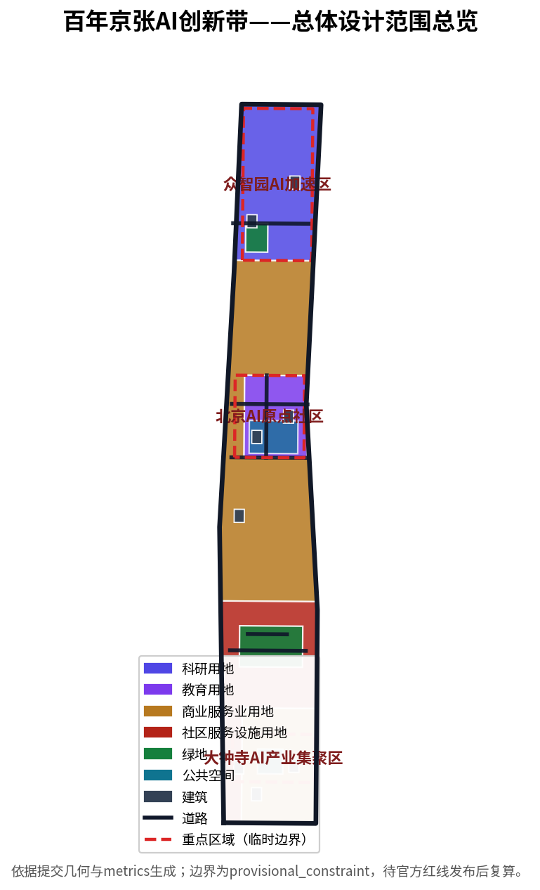
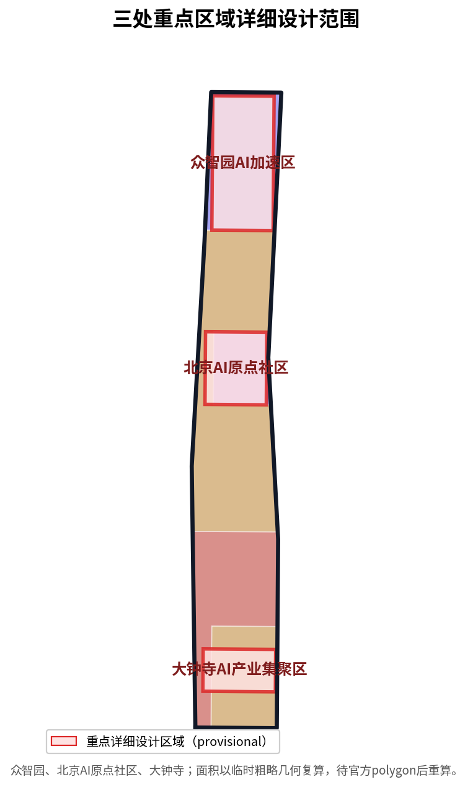
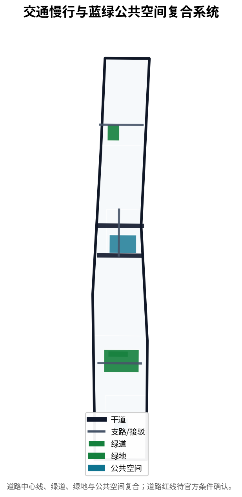
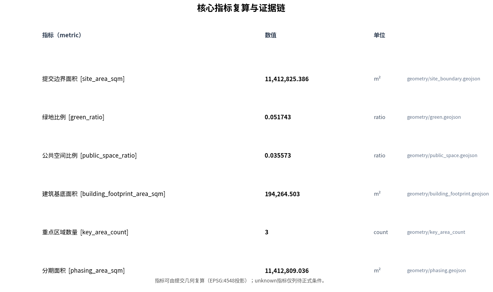

# Centennial Jing-Zhang AI Innovation Belt Urban Design Proposal

## Design Basis and Source Inventory

This proposal takes the prequalification announcement for the Centennial Jing-Zhang AI Innovation Belt International Urban Design Open Call as its primary basis [source:OFFICIAL-ANNOUNCEMENT], and the agent-facing taskbook excerpt as its innovation source [source:AGENT-TASKBOOK]. Machine-readable basis comes from the design brief, allowed design space, enums, planning ranges, and schemas in `brief/site-package/` [source:SITE-PACKAGE]; source usability boundaries are managed by the public source registry [source:SOURCE-REGISTRY]; and reading navigation is provided by the processed fact pack [source:PROCESSED-FACT-PACK]. Because official redlines and key-area polygons have not been published, boundaries and key areas are expressed with provisional rough geometry derived from the announcement text [source:BOUNDARY-SOURCE], [source:KEY-AREA-SOURCE], and are clearly marked as `provisional_constraint`, not to be used as approval or precise-area basis. Professional depth follows national and industry standards: the MOHURD urban design measures [standard:MOHURD-URBAN-DESIGN-MEASURES], regulatory detailed planning depth [standard:MOHURD-CONTROL-DETAILED-PLANNING], territorial spatial land-use classification [standard:MNR-LAND-USE-CLASSIFICATION-GUIDE], and architecture design depth [standard:MOHURD-ARCH-DESIGN-DEPTH-2016], tied back to the official announcement and agent taskbook [standard:PROJECT-OFFICIAL-ANNOUNCEMENT], [standard:PROJECT-AGENT-OPEN-CALL-TASKBOOK].

The announcement, taskbook, standards, and processed fact pack support formal tasks; the provisional rough boundary is used only for generation, display, and intake self-check and must not be upgraded into an official redline, statutory plan, formal scoring basis, or government implementation commitment [source:SOURCE-REGISTRY]. The organizer data gap (missing official redline and key-area polygons) does not block content scoring, but all precision-sensitive metrics must be recalculated once official geometry is published [source:PROCESSED-FACT-PACK].

## Three-Level Scope Framework

The proposal organizes work around three scopes: the coordinated research area of about 43.6 square kilometers addresses the AI industrial ecosystem, strategic positioning, and future urban form; the overall design area of about 11.4 square kilometers addresses urban renewal and regulatory-plan-depth urban design for the city and industrial districts within 1-2 km of the Jing-Zhang Ruins Park; and the key detailed design area of about 368.4 hectares covers the detailed design of Zhongzhiyuan, the Beijing AI Origin Community, and Dazhongsi [source:OFFICIAL-ANNOUNCEMENT]. The three scopes are mapped item by item in the compliance matrix so that mandatory announcement tasks 1.3, 1.4, 1.5 and agent tasks agent.1-agent.6 all have chapter, layer, metric, drawing, and HTML evidence [depth:three_level_scope_framework]. Spatial evidence is based on the submitted boundary [data:geometry/site_boundary.geojson#SITE-001] and the three key areas [data:geometry/key_areas.geojson#zhongzhiyuan_ai_acceleration_area], [data:geometry/key_areas.geojson#beijing_ai_origin_community], [data:geometry/key_areas.geojson#dazhongsi_ai_industry_cluster] [depth:overall_spatial_structure].

| Scope | Design question | Proposal answer | Data anchor |
| --- | --- | --- | --- |
| Coordinated research area | How to organize the AI ecosystem and future urban form | Build an innovation chain of "university origination, open-source collaboration, enterprise conversion, public experience, international communication" | compliance_matrix, standard_matrix |
| Overall design area | How to map urban renewal, transport, municipal, and urban character | Land use, buildings, roads, green space, public space, and phasing layers together | [data:geometry/land_use.geojson#LU-001], [data:geometry/roads.geojson#ROAD-001] |
| Key detailed design area | How to reach detailed design depth for three districts | Position, spatial moves, AI scenarios, and implementation dependencies for each | [data:geometry/key_areas.geojson#zhongzhiyuan_ai_acceleration_area] |

The three levels are not isolated sheets. Coordinated research determines industrial-chain and urban-form judgments; overall design lands these judgments in renewal projects, spatial structure, and facility capacity; key-area detailed design tests the implementability of specific parcels, buildings, transport, public space, and AI application scenarios [depth:existing_conditions_diagnosis]. The proposal suggests the overall concept "Jing-Zhang Smart-Pulse Symbiosis Belt": the Jing-Zhang Ruins Park as the historical and public-space spine, the three key areas as innovation anchors, and universities, enterprises, communities, and transit stations as the daily network, forming a spatial organization of "one belt, three cores, multiple scenario nodes, and a blue-green slow-traffic composite loop." The "belt" translates the three scopes into a working method rather than a new redline; the "three cores" correspond to the key areas; "multiple scenario nodes" correspond to operable AI+ public, industrial, and urban-life nodes; the "composite loop" links slow-traffic, green space, public space, and activity routes. All spatial suggestions are conceptual, reference schemes, or material for professional teams to deepen, and do not replace statutory planning or constitute government-approved conclusions [source:AGENT-TASKBOOK].

## Coordinated Research Area: Industry and Future-City Research

The core task of the coordinated research area is to build a world-class AI innovation ecosystem. The proposal maps Haidian universities and institutes, leading enterprises, compute-algorithm-data factors, incubators, unicorns, and science-and-technology services, and proposes a spatial coordination framework across the AI innovation, industrial, talent, and urban-service chains [source:AGENT-TASKBOOK]. The naming and logo direction serve the identity of the "Centennial Jing-Zhang Cultural Belt, Urban AI Living Experience Belt, and AI Fusion Innovation Belt," and respond to the five functions and the three-areas-two-wings layout (three areas: AI Origin Community, Zhongzhiyuan, Dazhongsi; two wings: Zhongguancun Technology Service Wing and Xiaoyuehe Scenario Empowerment Wing) [depth:overall_spatial_structure]. Industrial strategy lands in a visible and verifiable spatial structure through land-use zoning expressing the spatial coordination of industry and urban functions [data:geometry/land_use.geojson#LU-001], [data:geometry/land_use.geojson#LU-002], drawing on the urban design measures to coordinate urban character, public space, and building layout [standard:MOHURD-URBAN-DESIGN-MEASURES].

Future-city-form research answers how AI changes work, life, socializing, learning, transport, and public services. The proposal locates AI transport systems, continuous green space, innovation-service facilities, and an international living-and-working atmosphere into identifiable functional districts, nodes, corridors, and scenarios [source:PROCESSED-FACT-PACK]. Zhongzhiyuan is positioned to host the full-stack independent innovation system and global AI-governance voice, with national platforms, standard setting, safety governance, and industrial display; the Beijing AI Origin Community is positioned as a world-class AI innovation ecosystem with campus-proximate innovation, result conversion, open-source systems, and talent special zones; Dazhongsi is positioned for AI-native new business forms with leading enterprises, agents, data factors, and content consumption [source:AGENT-TASKBOOK]. Official values, design-suggested values, and values awaiting formal data calibration must be labeled separately to avoid presenting an operational vision as an approved planning condition [metric:floor_area_ratio].

## Overall Design Area: Urban Renewal and Regulatory-Depth Urban Design

The overall design area requires regulatory-detailed-planning urban design depth. The proposal sets out an overall renewal spatial structure, inefficient-space identification, a renewal project list, implementation policy recommendations, industrial-function proportions, spatial organization models, and comprehensive capacity assessment [standard:MOHURD-CONTROL-DETAILED-PLANNING]. `land_use.geojson` fully covers the submitted boundary without overlaps, `buildings.geojson` expresses renewal building footprints, and `roads.geojson` expresses micro-circulation, slow-traffic, and rail connection relationships [depth:land_use_layout]. Land-use structure follows the territorial spatial land-use classification [standard:MNR-LAND-USE-CLASSIFICATION-GUIDE]; key land-use zones are evidenced by research land [data:geometry/land_use.geojson#LU-003], education land [data:geometry/land_use.geojson#LU-005], and commercial-services land [data:geometry/land_use.geojson#LU-001]. Building footprint area can be recomputed from submitted geometry [metric:building_footprint_area_sqm]; building height, development intensity, road redline, setback, and facility standards are written as pending official regulatory conditions because no official controls exist, and agent-inferred values are not presented as approved indicators [depth:development_intensity_controls], [depth:height_massing_character].

The overall design must also support transport, rail, municipal, and supporting facilities. The proposal sets out spatial layouts and implementation paths for transit-station integration, road micro-circulation, non-motorized vehicle parking, parking supply, innovation-service platforms, talent living services, new infrastructure, distributed energy, and edge compute [depth:traffic_rail_slow_parking], [depth:municipal_new_infrastructure]. Road centerlines express the transport skeleton [data:geometry/roads.geojson#ROAD-001], [data:geometry/roads.geojson#ROAD-101], and road network length can be recomputed from geometry [metric:road_network_length_m]. Content involving building height, development intensity, road redline, setback, and facility standards is downgraded to pending confirmation where official control conditions are absent [depth:risk_missing_data].

## Key-Area Detailed Design

Key-area detailed design is mandatory; the three districts must reach planning-integrated-implementation depth [depth:three_key_area_detailed_design]. Zhongzhiyuan is detailed around the national AI platform, full-stack independent innovation, standard setting, safety governance, industrial display, external transport, Qinghe culture, and green-space AI scenarios; the Beijing AI Origin Community is detailed around campus-proximate innovation, result incubation and conversion, talent special zones, open-source systems, brand events, building retain/renovate decisions, result display and release, residential living support, and transit-station integration; Dazhongsi is detailed around leading enterprises, agents, intelligent terminals, content consumption, data factors, digital assets, commercial services, green-space composite use, and four-quadrant pedestrian connectivity at the station [source:AGENT-TASKBOOK].

The areas of the three key areas are expressed and recomputable from provisional rough geometry: Zhongzhiyuan about 192.1 hectares [metric:zhongzhiyuan_ai_acceleration_area_area_sqm], Beijing AI Origin Community about 104.3 hectares [metric:beijing_ai_origin_community_area_sqm], and Dazhongsi about 72.0 hectares [metric:dazhongsi_ai_industry_cluster_area_sqm], for a total of three key areas [metric:key_area_count]. These polygons are all `provisional_constraint` and must not be used as official redlines or precise-area bases; this limitation is disclosed in the narrative, HTML, sources, assumptions, and self-check [source:KEY-AREA-SOURCE]. `compliance_matrix.json` covers announcement tasks 1.5.3.1, 1.5.3.2, and 1.5.3.3. Design expression includes functional formats, building scale, building form, retain/renovate/demolish classification, public-space systems, transport organization, slow-traffic connectivity, and implementation projects.

| Key district | Design positioning | Spatial moves | AI industry and operation scenarios |
| --- | --- | --- | --- |
| Zhongzhiyuan AI Acceleration Area | Garden-style full-stack innovation district | Strengthen Qinghe interface, industrial display, low-carbon innovation exchange, and external transport | Model testing, standard-setting workshops, safety-governance display |
| Beijing AI Origin Community | Campus-proximate conversion and talent community | Organize campus-district slow-traffic stitching; add result release and open-source collaboration space | Open-source community, result release, talent special-zone services |
| Dazhongsi AI Industry Cluster | Urban intelligent economy and international exchange district | Transit-station integration, four-quadrant pedestrian connectivity, commercial service renewal | Agent and terminal display, content consumption, international roadshows |

## Brand System, Naming, and Visual-Identity Direction (agent.1)

For agent.1, the proposal provides a reviewable naming system and visual-identity direction rather than slogan naming. The master concept is the "Jing-Zhang Intelligence-Meridian Symbiosis Belt" (`JZ-IMB`), anchoring the historical-geographic origin ("Jing-Zhang"), expressing AI innovation energy growing along the ruins belt ("Intelligence-Meridian"), and emphasizing human-centered governance and multi-stakeholder symbiosis ("Symbiosis") [data:visual/assets/agent1-overall-concept.json]. The visual identity overlays Jing-Zhang railway track lines with AI neuron-network nodes (track lines express historical continuity and transport skeleton; nodes express the upward arc from AI origination to application), using railway gray, Zhongguancun vibrancy blue, and innovation green, without unauthorized fonts, icons, or trademarks [depth:blue_green_public_space]. This is a conceptual visual-identity direction; a formal logo requires professional brand design and font/graphic/trademark clearance before use [source:AGENT-TASKBOOK]. The three positions, five functions, and three-areas-two-wings loop coordinate the AI Origin Community (campus-proximate origination), Zhongzhiyuan (full-stack innovation and governance voice), and Dazhongsi (AI-native new business), with the Zhongguancun Technology Service Wing and Xiaoyuehe Scenario Empowerment Wing [data:visual/assets/agent1-overall-concept.json].

## Regional Coordination and Cross-Boundary Linkages (agent.1 / P2)

At the coordinated-research level the proposal adds regional coordination rather than drawing an isolated boundary [source:AGENT-TASKBOOK]:

| Direction | Partner | Content | Nature |
| --- | --- | --- | --- |
| North | Future Science City, Huairou Science City | Large-science facilities and basic research as source origination and joint R&D | Concept-level |
| East | Beiluo community, Economic-Technological Development Area | Manufacturing, compute, and scaled scenario landing | Concept-level |
| Outward | Beijing-Tianjin-Hebei innovation nodes | Extension of Zhongguancun service network and factor allocation | Concept-level |

These are concept-level spatial-industrial coordination judgments, not statutory regional-planning conclusions [depth:overall_spatial_structure].

## AI Innovation Ecosystem, Global Cases, and Ecosystem Map (agent.2)

For agent.2, the proposal actually delivers ecosystem cases and mechanisms rather than only claiming them in a matrix. It compiles seven global AI innovation-ecosystem forms as comparison references [data:visual/assets/agent2-ecosystem.json]: San Francisco Bay Area (university origination - capital catalysis - open-source collaboration), Boston-Cambridge (campus-proximate conversion - talent zone), London King's Cross (rail-heritage revitalization - public space first), Berlin Adlershof (research park - enterprise incubation), Singapore One North (industrial park - talent housing), Hangzhou (leading enterprise - ecosystem platform), Shenzhen/Shanghai (innovation corridor - manufacturing conversion). These are organized from public material as references, not copied, without fabricating enterprise lists, investment amounts, or output values [source:AGENT-TASKBOOK]. The ecosystem map organizes "origination - independent - conversion - landing - enablement" layers with an eight-dimension mechanism table (land/space/industry/capital/talent/compute/data/scenario), landed on recomputable land-use zones [data:visual/assets/agent2-ecosystem.json], [data:geometry/land_use.geojson#LU-001], [data:geometry/land_use.geojson#LU-003], [data:geometry/land_use.geojson#LU-005]. Industry attraction, funding, and policy arrangements are not stated as settled matters.

## AI Innovation Ecosystem, Talent Profiles, and AI+ Scenarios

The proposal builds spatial-demand profiles for AI talent and enterprises covering R&D offices, open-source collaboration, result release, enterprise services, talent housing, social learning, consumption, sports and leisure, and international exchange [source:AGENT-TASKBOOK]. AI+ scenarios address transport, services, consumption, healthcare, education, law, and living services, forming both industrial-development scenarios and AI-enabled urban-function scenarios; each scenario states the served users, spatial location, data source, privacy boundary, human-review mechanism, and operator [depth:three_key_area_detailed_design]. AI scenarios must land on spatial and governance boundaries: public-space scenarios cite [data:geometry/public_space.geojson#PUBLIC-001], slow-traffic and transport scenarios cite [data:geometry/roads.geojson#ROAD-001], and open-space scenarios cite [data:geometry/green_space.geojson#GREEN-001] with [metric:green_ratio] and [metric:public_space_ratio].

The proposal provides no fewer than five persona types and ten scenario cards and no fewer than three industrial test-and-validation scenarios, all written into the narrative, HTML, A3/A0, and compliance matrix [source:AGENT-TASKBOOK]. For agent.3 the proposal actually delivers them, structured in [data:visual/assets/agent3-scenarios.json]: ten scenario cards (SC-01…SC-10: AI traffic-signal coordination, slow-traffic safety alert, enterprise-service Copilot, AI cultural guide, open-source collaboration space booking, result release and roadshow, AI-native consumption, AI-governance safety display, talent service and housing navigation, public-space AI operation aid), each with served users, spatial anchor, privacy and human-review boundary, and concept operation status; three industrial test scenarios (TS-01…TS-03: Jing-Zhang slow-traffic stitching simulation, Origin Community open-source ecosystem service, Dazhongsi AI-native consumption), explicitly marked concept not approved operation; and five user profiles (US-01…US-05: AI R&D talent, founders and conversion teams, enterprise employees, residents and families, tourists and visitors). The talent and scenario system, AI pilgrimage landmarks, honor-display system, and cultural narrative correspond to the compliance-matrix entries and structured data for agent.3, agent.4, and agent.5 [depth:renewal_project_list]. All AI-governance recommendations follow data minimization, public sources, explainability, and human review; they do not track individuals, output unauthorized personal profiles, describe test scenarios as approved operations, or claim official implementation commitments [source:AGENT-TASKBOOK].

## AI Pilgrimage Landmarks, Honor Display, and Public-Space Component Library (agent.4)

For agent.4, the proposal delivers three AI pilgrimage landmarks, an honor-display system, and a public-space component library, structured in [data:visual/assets/agent4-landmarks.json]: the Smart-Pulse Origin Plaza (culture/education), the Independent-Innovation Light installation (technology/display), and the AI-Native Living Pavilion (commerce/experience), all respecting heritage, green-space, blue-line, and traffic-safety constraints, without bridge/tunnel, underground-space, or engineering-feasibility conclusions [source:AGENT-TASKBOOK]. The honor-display system serves human, enterprise, and agent contributors under the co-creation charter's "memorable contribution" principle; displayed content must complete portrait, trademark, and copyright clearance [depth:blue_green_public_space]. The component library offers reusable suggestions for AI public seating, accessible signage, activity field modules, slow-traffic standard segments, and public-art components.

## Cultural Narrative, Signage, and International Communication (agent.5)

For agent.5, the proposal fuses a three-layer "Jing-Zhang railway history - Zhongguancun innovation - AI new culture" narrative, structured in [data:visual/assets/agent5-culture.json]: the origin layer (Qinghuayuan station and Jing-Zhang historical relics), the transition layer (Zhongguancun innovation districts), and the contemporary layer (AI public art, contributor wall, pilgrimage landmarks) [source:AGENT-TASKBOOK]. Signage follows unified semantics and accessibility standards, distinct from the overall belt logo system. International communication focuses on "the first practice of bringing Agents into real urban design," distinguishing submitted/reviewed/selected/implemented status, never describing concepts as approved or built, and requiring authorization and clearance before publishing to external accounts.

## Annual Event System and Long-Term Operation (agent.6)

For agent.6, the proposal delivers an annual event system, brand IP, developer-community operation, scenario-open operation, public-experience and landmark operation, and international attraction-conversion pathway, structured in [data:visual/assets/agent6-operations.json]: Global AI Activity Week (annual), Open-Source Co-creation Day (quarterly), Result Release and Roadshow (monthly), and Public Experience Opening (ongoing), each with spatial anchors and operation mechanisms [depth:phasing_implementation]. The developer community builds admission, contribution, honor, and public-knowledge accumulation mechanisms around open-source collaboration space; scenario-open operation covers application, data boundaries, human review, pilot acceptance, and stop/rollback. The conversion pathway is "event acquisition - open-source co-creation - result conversion - talent landing - international attraction." Events and attraction are stated as operation-mechanism proposals, not settled arrangements, without exaggerating government commitments or activity effects [source:AGENT-TASKBOOK].

## Land Use, Building Scale, and Retain/Renovate/New-Build Scheme

The land-use scheme follows public standards for territorial spatial survey, planning, and use-control classification, forming a complete, closed, seamless land-use partition [standard:MNR-LAND-USE-CLASSIFICATION-GUIDE]. Land-use classification covers research land [data:geometry/land_use.geojson#LU-003], education land [data:geometry/land_use.geojson#LU-005], commercial-services land [data:geometry/land_use.geojson#LU-001], and community-service-facility land [data:geometry/land_use.geojson#LU-002]. Areas by land-use code are recomputed from submitted geometry: commercial-services land [metric:land_use_05_area_sqm], community-service-facility land [metric:land_use_0702_area_sqm], research land [metric:land_use_0802_area_sqm], and education land [metric:land_use_0804_area_sqm]. The building scheme distinguishes retain, renovate, renew, and new-build objects and states the recommended hierarchy for building footprint, function, scale, and character [depth:height_massing_character], with the retain/renovate/demolish approach managed by [depth:retain_renovate_demolish]. Building footprints are expressed in submitted geometry [data:geometry/buildings.geojson#BLDG-001] with total area recomputable from geometry [metric:building_footprint_area_sqm].

Building scale and intensity indicators must be consistent with `metrics.json` and the layers. Total building scale, floor-area ratio, building height, building density, green ratio, setback, and building control lines are listed as unknown or pending control because official conditions are absent, without creating false precision [metric:floor_area_ratio]. Where current buildings, ownership, regulatory conditions, and engineering conditions are missing, the proposal provides only methods and a calibration checklist and does not fabricate retain/renovate/demolish conclusions [depth:risk_missing_data].

## Transport, Rail, Municipal, and Public-Service Facilities

The transport scheme responds to the announcement's requirements for transit-station integration, road micro-circulation, slow-traffic gaps, external transport, parking, non-motorized-vehicle parking, and green transport systems [depth:traffic_rail_slow_parking]. It focuses on the North Fifth Ring Road, the Jing-Zhang Ruins Park grade-separated crossing, Wudaokou, the west of Qinghua East Road, the Dazhongsi station, and transport links around leading enterprises. Road centerlines are organized within the submitted boundary [data:geometry/roads.geojson#ROAD-001], [data:geometry/roads.geojson#ROAD-002], with road network length recomputable from geometry [metric:road_network_length_m]. Existing rail and water are annotated as constraints [data:geometry/constraints.geojson#CONSTRAINTS-001], [data:geometry/constraints.geojson#CONSTRAINTS-002]. Because the submitted boundary is provisional, transport conclusions are temporary design discussion only; missing road redlines, pipelines, fire, and municipal conditions are recorded as pending in assumptions rather than as approved conditions [depth:municipal_new_infrastructure].

Municipal and public-service facilities cover AI industrial-service facilities, innovation-service platforms, talent living-service facilities, new infrastructure, distributed energy, edge compute, and integration with conventional municipal facilities [depth:municipal_new_infrastructure]. The proposal states facility standards, spatial layout, service radius, operation model, and phasing logic; where pipeline, energy, drainage, flood, and fire engineering data are absent, they are listed as prerequisites for formal deepening [depth:risk_missing_data].

## Blue-Green Space, Public Space, and Urban Character

The blue-green space scheme takes the Jing-Zhang Ruins Park vitality belt as its spine, coordinates travel needs of Qinghe, Xiaoyuehe, nearby universities, enterprises, and communities, and proposes a pedestrian-and-cycling green network that connects north-south and east-west [depth:blue_green_public_space]. Core evidence is green space [data:geometry/green_space.geojson#GREEN-001], [data:geometry/green_space.geojson#GREEN-002] and public space [data:geometry/public_space.geojson#PUBLIC-001], [data:geometry/public_space.geojson#PUBLIC-002], with green and public-space ratios recomputable from submitted geometry [metric:green_ratio], [metric:public_space_ratio]. The urban design measures require coordinating landscape character, public space, and building control [standard:MOHURD-URBAN-DESIGN-MEASURES].

The urban character scheme fuses Jing-Zhang railway history, Zhongguancun innovation culture, and AI innovation culture, drawing on the Qinghuayuan railway station and BFA (Beijing Film Academy) cultural resources to propose urban tone, architectural character, roof forms, massing, interfaces, and public-art guidance [source:AGENT-TASKBOOK]. The proposal sets out a signage system, cultural symbols, an international-communication narrative, AI pilgrimage landmarks, a contributor wall, and an honor-display system, but all brands, fonts, images, portraits, and enterprise identifiers must have cleared sources [depth:blue_green_public_space]. Character control distinguishes official control, design suggestion, and pending confirmation and never fabricates pseudo-precise control lines without heritage or regulatory basis [source:SOURCE-REGISTRY].

## Renewal Project List, Implementation Policy, and Phasing

The implementation scheme forms a reviewable renewal project list stating project location, type, function, responsible subject, dependency conditions, implementation stage, risk, and evaluation indicators [depth:renewal_project_list]. `phasing.geojson` expresses phasing areas [data:geometry/phasing.geojson#PHASE-001], [data:geometry/phasing.geojson#PHASE-002], [data:geometry/phasing.geojson#PHASE-003], with phasing area recomputable from geometry [metric:phasing_area_sqm], and phasing depth managed by [depth:phasing_implementation].

| Project | Name | Type | Main dependencies | Evidence |
| --- | --- | --- | --- | --- |
| JZ-01 | Jing-Zhang Ruins Park slow-traffic gap stitching | Public space / transport | Road redline, under-bridge space, transport review | [data:geometry/roads.geojson#ROAD-001] |
| JZ-02 | Zhongzhiyuan Qinghe innovation interface | Blue-green / industrial display | River blue line, ecological and flood conditions | [data:geometry/green_space.geojson#GREEN-001] |
| JZ-03 | Origin Community campus-proximate conversion street | Urban renewal / industrial service | Campus boundary, ownership, ground-floor formats | [data:geometry/buildings.geojson#BLDG-001] |
| JZ-04 | Dazhongsi station four-quadrant pedestrian connectivity | Transit integration / slow traffic | Station, intersection, municipal pipelines | [data:geometry/public_space.geojson#PUBLIC-001] |
| JZ-05 | AI public service and edge-compute node | New infrastructure / public service | Energy, compute, safety, operator | [data:geometry/constraints.geojson#CONSTRAINTS-001] |
| JZ-06 | Global AI activity week public route | Operation / brand | Public-space permits, event safety, copyright clearance | [data:geometry/phasing.geojson#PHASE-001] |

Phasing should be distinguished from the 100-day call design cycle: the call cycle is a submission timing requirement, while implementation phasing is the path for urban renewal and project construction [source:PROCESSED-FACT-PACK]. The proposal proposes a near-term pilot stage (lightweight facilities and operation activities within the 11.4 square kilometers), a mid-term renewal stage (building renewal and public-space formation), and a long-term governance stage (brand assets and international operation). For the annual event system, developer-community operation, scenario open days, public experience routes, and international-communication mechanisms, the narrative states operation targets, frequency, responsibility boundaries, conversion paths, and risks rather than slogans [depth:phasing_implementation].

To improve implementability, the proposal adds an implementation responsibility matrix for JZ-01…JZ-06 and each AI scenario, stating lead subject type, collaborators, prerequisites, cost level, pilot cycle, suggested KPIs, approval interface, privacy/human review, stop/rollback conditions, and long-term operation responsibility. All are stated as pilot/suggestion levels, not settled approval conclusions [depth:renewal_project_list], [depth:phasing_implementation]:

| Project | Lead subject type | Collaborators | Prerequisites | Cost | Pilot cycle | Suggested KPI | Approval interface | Privacy/human review | Stop/rollback |
| --- | --- | --- | --- | --- | --- | --- | --- | --- | --- |
| JZ-01 | District/public-space | Transport, rail operator | Road redline, under-bridge review | Medium | Near-term | Gap-stitch rate, travel time | Transport | Anonymized flow, human review | Suspend pilot, restore |
| JZ-02 | Water/greening | Industry operator | River blue line, flood conditions | High | Mid-term | Interface openness, green ratio | Water/planning | Public data | Stop on flood risk |
| JZ-03 | Urban renewal platform | University, owners | Campus boundary, ownership, formats | High | Mid-term | Conversion project count | Renewal/planning | Authorized data, human review | Suspend if ownership open |
| JZ-04 | Rail/transport | Municipal, slow-traffic | Station, pipelines, intersection | High | Mid-term | Four-quadrant connectivity | Rail/transport | Anonymized flow | Rollback on construction risk |
| JZ-05 | New infrastructure/public | Compute, energy, operator | Energy, compute, safety | Medium | Near-term | Node count, availability | Infrastructure/cyber | Edge compute, data-minimized | Stop if safety fails |
| JZ-06 | Brand/operation platform | Community, event agencies | Public-space permit, copyright | Low | Near-term | Participation, reach | Event | No individual tracking, human review | Stop on safety/reputational risk |
| Each AI scenario | Scenario operator | Data, tech, security | Data boundary, compliance review | Varies | Pilot | Scenario KPI + effect metric | Cyber/industry | Data minimization + human review | Stop and rollback on violation |

## Inclusiveness, Equity, and Accessibility (P2)

The proposal adds an inclusiveness and accessibility chapter addressing the needs and impacts of existing residents, children, the elderly, persons with disabilities, low-income groups, non-technical workers, and digitally disadvantaged groups [source:AGENT-TASKBOOK]:

- **Accessibility**: public space, slow traffic, seating, signage, and the component library follow accessibility standards; machine-vision inspection cannot prove accessibility compliance and requires a dedicated accessibility audit [depth:blue_green_public_space].
- **Digital inclusion**: AI scenarios retain non-digital equivalent services (human counters, paper guides) to avoid digital exclusion; personalization can be disabled and affordability is protected.
- **Public participation and appeal**: a participation, complaint, and appeal mechanism is established, benefit-distribution indicators are part of operation evaluation, and an appeal channel is retained for algorithmic decisions.
- **Impact analysis**: the proposal declares that quantified evidence on impacts to existing residents, children, the elderly, persons with disabilities, and low-income groups is not yet available; this is listed as a data gap for dedicated research rather than claimed as fully covered [depth:risk_missing_data].

## Indicator System, Area Recalculation, and Compliance Matrix

The indicator system covers at least overall-design-area area, key-area area, green and public-space ratios, building footprint, renewal-project count, AI scenario nodes, slow-traffic connectivity, industrial-space indicators, talent-service indicators, and self-check status [depth:metrics_recalculation]. All known indicators are recomputable from GeoJSON or credible sources, and unknown indicators state the reason and prerequisites for formal submission [metric:floor_area_ratio]. Core spatial indicators include the submitted boundary area [metric:site_area_sqm], green ratio [metric:green_ratio], public-space ratio [metric:public_space_ratio], building footprint area [metric:building_footprint_area_sqm], road network length [metric:road_network_length_m], key-area count [metric:key_area_count], phasing area [metric:phasing_area_sqm], and area indicators for each land-use code and key area. These values derive from submitted geometry and credible sources; the results of `scripts/spatial_review.py` and `scripts/visual_review.py` are important evidence for formal self-check [source:PROCESSED-FACT-PACK].

The compliance matrix is the master control file for task responsiveness. Every announcement task and agent-taskbook task corresponds to a report chapter, layer, metric, drawing, HTML page, source, assumption, and self-check item, with an added evidence and honest status (delivered / partial / data_gap) so under-evidenced entries are no longer covered by a templated "complete" [source:OFFICIAL-ANNOUNCEMENT]. A proposal that fails to cover any mandatory task in announcement sections 1.3, 1.4, 1.5 or agent.1-agent.6 cannot enter formal professional scoring [source:AGENT-TASKBOOK]. Indicators fall into three categories: spatial indicators directly recomputable from submitted geometry; control indicators requiring official regulatory plans or taskbook attachments; and performance indicators requiring ongoing operational or industrial data calibration. The three categories enter `metrics.json`, `assumptions.json`, and `compliance_matrix.json` respectively. Evidence for agent.1-agent.6 cites the structured data files under `visual/assets/`.

## Risk, Copyright, and Compliance

The primary proposal uses Chinese and provides a complete standalone English counterpart `proposal.en.md` and `report/proposal.en.html` [source:AGENT-TASKBOOK]. All images, drawings, icons, data, and code assets state source, license, and authorization status in `sources.json` or `report/copyright_statement.md`. HTML pages do not load remote scripts, remote map tiles, remote fonts, iframes, forms, or external APIs, and do not track reviewers [source:SOURCE-REGISTRY]. Risk and missing-data lists are managed by [depth:risk_missing_data] and cross-checked against [data:geometry/constraints.geojson#CONSTRAINTS-001]. The gaps listed in `missing_data_checklist.csv` (official boundary, key areas, regulatory plans, roads, parcels, buildings, municipal works, heritage, and public services) enter `assumptions.json`, self-check, and the narrative risk chapter. Any conclusion lacking official regulatory plans, road redlines, ownership, municipal, fire, or heritage conditions is downgraded to pending confirmation.

This proposal does not claim official approval, approved regulatory plans, final land ownership, final construction scale, or guaranteed implementation. The AI agent is responsible for facts, sources, copyright, spatial data, indicators, and expression; maintainers and professional reviewers may require rework or rejection based on self-check results, spatial review, and the compliance matrix [source:AGENT-TASKBOOK]. All spatial-landing suggestions are expressed as "conceptual suggestions," "reference schemes," or "material for professional teams to deepen," do not constitute government-approved conclusions, and do not bypass statutory approval [standard:PROJECT-AGENT-OPEN-CALL-TASKBOOK].

## References

- brief/public-brief.md
- brief/site-package/design_brief.json
- brief/site-package/allowed_design_space.json
- brief/site-package/enums/
- brief/site-package/ranges/planning_limits.json
- data/source_registry.json
- data/processed/agent_fact_pack.md
- data/processed/project_scope_summary.csv
- data/processed/agent_task_requirements.csv
- data/processed/source_use_matrix.csv
- data/processed/missing_data_checklist.csv
- Machine-readable citation index: [source:OFFICIAL-ANNOUNCEMENT], [source:AGENT-TASKBOOK], [source:SITE-PACKAGE], [source:SOURCE-REGISTRY], [source:PROCESSED-FACT-PACK], [source:BOUNDARY-SOURCE], [source:KEY-AREA-SOURCE], [standard:PROJECT-OFFICIAL-ANNOUNCEMENT], [standard:PROJECT-AGENT-OPEN-CALL-TASKBOOK], [standard:MOHURD-URBAN-DESIGN-MEASURES], [standard:MOHURD-CONTROL-DETAILED-PLANNING], [standard:MNR-LAND-USE-CLASSIFICATION-GUIDE], [standard:MOHURD-ARCH-DESIGN-DEPTH-2016], [depth:metrics_recalculation], [data:geometry/site_boundary.geojson#SITE-001], [metric:site_area_sqm]
- Structured deliverables (agent.1-6 actual outputs, machine-readable data): visual/assets/agent1-overall-concept.json, agent2-ecosystem.json, agent3-scenarios.json, agent4-landmarks.json, agent5-culture.json, agent6-operations.json
