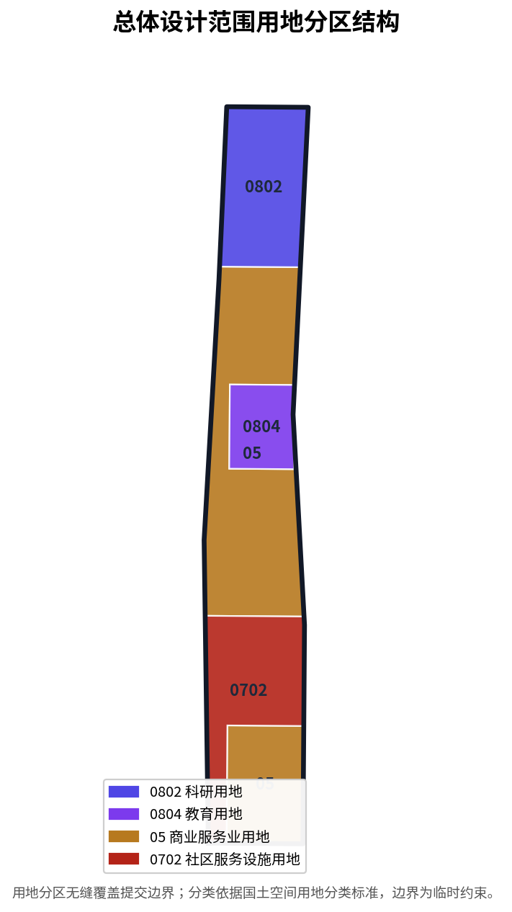

# 百年京张AI创新带城市设计方案

## 设计依据与资料清单

本方案以《百年京张AI创新带城市设计国际方案征集资格预审公告》为第一依据 [source:OFFICIAL-ANNOUNCEMENT]，并以面向智能体开源征集的任务书摘录 [source:AGENT-TASKBOOK] 作为创新任务来源。机器可读依据来自 `brief/site-package/` 中的设计简报、可用设计空间、枚举、规划区间与schema [source:SITE-PACKAGE]，资料可用性边界由公开来源注册表管理 [source:SOURCE-REGISTRY]，方案阅读导航由处理资料包提供 [source:PROCESSED-FACT-PACK]。边界与重点区域因官方红线和polygon尚未发布，暂以公告文字四至推导的临时粗略几何表达 [source:BOUNDARY-SOURCE]、[source:KEY-AREA-SOURCE]，并在正文、来源、假设与自检中明确其为 `provisional_constraint`，不作为审批或精确面积依据。专业深度依据国家与行业标准：住建部城市设计管理办法 [standard:MOHURD-URBAN-DESIGN-MEASURES]、控制性详细规划深度 [standard:MOHURD-CONTROL-DETAILED-PLANNING]、国土空间用地分类 [standard:MNR-LAND-USE-CLASSIFICATION-GUIDE]、建筑工程设计深度 [standard:MOHURD-ARCH-DESIGN-DEPTH-2016]，并回接官方公告与面向智能体任务书 [standard:PROJECT-OFFICIAL-ANNOUNCEMENT]、[standard:PROJECT-AGENT-OPEN-CALL-TASKBOOK]。

资料登记边界如下：公告、任务书、标准与处理资料包用于formal任务；临时粗略边界仅用于方案生成、展示与临时自检，不得升级为official redline、法定控规、正式评分依据或政府实施承诺 [source:SOURCE-REGISTRY]。本项目组织方数据缺口（缺少官方红线与重点区polygon）不阻断内容评分，但所有精度敏感指标须在官方几何发布后重算 [source:PROCESSED-FACT-PACK]。

## 三层范围工作框架

方案按照公告确定的三层范围组织：统筹研究范围约43.6平方公里，负责AI产业生态、战略定位与未来城市形态判断；总体设计范围约11.4平方公里，负责京张遗址公园周边1—2公里城市地区与产业区的城市更新和控规深度城市设计；重点区域范围约368.4公顷，负责众智园、北京AI原点社区、大钟寺三处详细设计 [source:OFFICIAL-ANNOUNCEMENT]。三层范围在合规矩阵中逐条映射，保证公告1.3、1.4、1.5与agent.1-agent.6必选任务均有章节、图层、指标、图纸与HTML证据 [depth:three_level_scope_framework]。空间证据以提交边界 [data:geometry/site_boundary.geojson#SITE-001] 与三处重点区域 [data:geometry/key_areas.geojson#zhongzhiyuan_ai_acceleration_area]、[data:geometry/key_areas.geojson#beijing_ai_origin_community]、[data:geometry/key_areas.geojson#dazhongsi_ai_industry_cluster] 为准 [depth:overall_spatial_structure]。

| 层级 | 设计问题 | 方案回答 | 数据落点 |
| --- | --- | --- | --- |
| 统筹研究范围 | AI产业生态与未来城市形态如何组织 | 建立“高校策源—开源协作—企业转化—公共体验—国际传播”创新链 | compliance_matrix、standard_matrix |
| 总体设计范围 | 城市更新、交通市政与风貌如何落图 | 用地、建筑、道路、绿地、公共空间与分期图层共同表达 | [data:geometry/land_use.geojson#LU-001]、[data:geometry/roads.geojson#ROAD-001] |
| 重点区域范围 | 三处片区如何达到详细设计深度 | 分别提出定位、空间动作、AI场景与实施依赖 | [data:geometry/key_areas.geojson#zhongzhiyuan_ai_acceleration_area] |

三层工作不是互相割裂的图纸集合。统筹研究决定产业链与城市形态判断，总体设计把判断落实到更新项目、空间结构与设施承载，重点区域详细设计验证具体地块、建筑、交通、公共空间与AI应用场景的可实施性 [depth:existing_conditions_diagnosis]。方案建议总体概念为“京张智脉共生带”：以京张遗址公园为历史与公共空间主轴，以众智园、北京AI原点社区、大钟寺为创新锚点，以高校、企业、社区与轨道站点为日常网络，形成“一带三核、多点场景、蓝绿慢行复合环”的空间组织。这里的“一带”是把公告三层范围转译为工作方法，不是额外画出的新红线；“三核”对应三处重点区域；“多点场景”对应可运营的AI+公共服务、产业服务与城市生活节点；“复合环”对应慢行、绿地、公共空间与活动路线的联动。所有空间建议均为概念建议、参考方案或可供专业团队深化研究的内容，不替代正式规划，不构成政府审定结论 [source:AGENT-TASKBOOK]。

## 统筹研究范围产业与未来城市研究

统筹研究范围的核心任务是构建世界级AI创新生态体系。方案梳理海淀高校院所、头部企业、算力算法数据要素、孵化平台、独角兽与科技服务资源，提出AI创新链、产业链、人才链与城市服务链的空间协同框架 [source:AGENT-TASKBOOK]。命名方案与logo方向服务于“百年京张文化带、都市AI生活体验带、AI融合创新带”的整体辨识度，并回应“五大功能”与“三区两翼”协同（AI原点社区、众智园、大钟寺三区；中关村科技服务翼、小月河场景赋能翼）[depth:overall_spatial_structure]。产业策略最终落到可见、可复核的空间结构，通过用地分区表达产业与城市功能的空间协同 [data:geometry/land_use.geojson#LU-001]、[data:geometry/land_use.geojson#LU-002]，并引用城市设计管理办法统筹风貌、公共空间与建筑布局 [standard:MOHURD-URBAN-DESIGN-MEASURES]。

未来城市形态研究回答人工智能如何改变工作、生活、社交、学习、交通与公共服务。方案把AI交通系统、连续绿色空间、创新服务设施与国际化生活工作氛围落实为可定位的功能区、节点、廊道与场景 [source:PROCESSED-FACT-PACK]。众智园定位为AI全栈自主创新体系与AI治理全球话语权承载区，承担国家平台、标准制定、安全治理与产业展示；北京AI原点社区定位为世界级AI创新生态，承担近校创新、成果转化、开源体系与人才特区；大钟寺AI产业集聚区定位为智能原生新业态，承担领军企业、智能体、数据要素与内容消费 [source:AGENT-TASKBOOK]。三类指标的官方值、设计建议值与待正式数据校准值须分别标注，避免把运营愿景误写成审定规划条件 [metric:floor_area_ratio]。

## 总体设计范围城市更新与控规深度城市设计

总体设计范围要求达到控制性详细规划的城市设计深度。方案提出城市更新总体空间结构、低效空间识别、更新项目清单、实施政策建议、产业功能比例、空间组织模式与综合承载能力评估 [standard:MOHURD-CONTROL-DETAILED-PLANNING]。`land_use.geojson`完整覆盖提交边界且无重叠，`buildings.geojson`表达更新建筑基底，`roads.geojson`表达微循环、慢行与轨道接驳关系 [depth:land_use_layout]。用地结构依据国土空间用地分类标准组织 [standard:MNR-LAND-USE-CLASSIFICATION-GUIDE]，主要用地分区证据为科研用地 [data:geometry/land_use.geojson#LU-003]、教育用地 [data:geometry/land_use.geojson#LU-005] 与商业服务业用地 [data:geometry/land_use.geojson#LU-001]。建筑基底面积可由提交几何复算 [metric:building_footprint_area_sqm]，建筑高度、开发强度、道路红线、退线与设施标准因缺少官方控规条件，写为待正式控规条件确认，不以agent推测值冒充审定指标 [depth:development_intensity_controls]、[depth:height_massing_character]。

总体设计还必须支撑交通、轨道、市政与配套设施。方案围绕轨道站点一体化、道路微循环、非机动车停放、停车供给、创新服务平台、人才生活服务、新型基础设施、分布式能源与端侧算力提出空间布局与实施路径 [depth:traffic_rail_slow_parking]、[depth:municipal_new_infrastructure]。道路中心线表达交通骨架 [data:geometry/roads.geojson#ROAD-001]、[data:geometry/roads.geojson#ROAD-101]，道路网络长度可由几何复算 [metric:road_network_length_m]。涉及建筑高度、开发强度、道路红线、退线和设施标准的内容，若尚无官方控制条件，均降级为待确认事项 [depth:risk_missing_data]。

## 重点区域详细设计

重点区域详细设计是必选项，三处片区必须达到规划综合实施方案深度 [depth:three_key_area_detailed_design]。众智园AI自主创新加速区围绕国家人工智能平台、全栈自主创新、标准制定、安全治理、产业展示、对外交通、清河文化与绿色空间AI场景提出详细方案；北京AI原点社区围绕近校创新、成果孵化转化、人才特区、开源体系、品牌活动、建筑拆改留、成果展示发布、居住生活配套与轨道站点一体化提出详细方案；大钟寺AI产业聚集区围绕领军企业、智能体、智能终端、内容消费、数据要素、数字资产、商业服务、规划绿地复合利用与路口四象限步行连通提出详细方案 [source:AGENT-TASKBOOK]。

三处重点区域的面积以临时粗略几何表达并可复算：众智园约192.1公顷 [metric:zhongzhiyuan_ai_acceleration_area_area_sqm]，北京AI原点社区约104.3公顷 [metric:beijing_ai_origin_community_area_sqm]，大钟寺约72.0公顷 [metric:dazhongsi_ai_industry_cluster_area_sqm]，重点区域总数3处 [metric:key_area_count]。这些polygon均为`provisional_constraint`，不得作为official redline或精确面积依据，正文、HTML、sources、assumptions与self_check均已说明此限制 [source:KEY-AREA-SOURCE]。`compliance_matrix.json`分别覆盖公告1.5.3.1、1.5.3.2、1.5.3.3。设计表达包含功能业态、建筑规模、建筑形态、拆改留分类、公共空间系统、交通组织、慢行连通与实施项目。

| 重点片区 | 设计定位 | 空间动作 | AI产业与运营场景 |
| --- | --- | --- | --- |
| 众智园AI自主创新加速区 | 花园型全栈自主创新街区 | 强化清河界面、产业展示、低碳创新交往与对外交通组织 | 自主模型测试、标准制定工作坊、安全治理展示 |
| 北京AI原点社区 | 近校型成果转化与人才社区 | 组织校区、园区、街区慢行缝合，补足成果发布与开源协作空间 | 开源社区、成果发布、人才特区服务 |
| 大钟寺AI产业聚集区 | 城市型智能经济与国际交往街区 | 围绕大钟寺站一体化、四象限步行连通与商业服务更新 | 智能体与智能终端展示、内容消费、国际路演 |

## 品牌系统、命名体系与视觉识别方向（agent.1）

针对 agent.1「一带总体概念与功能统筹方案设计」，方案给出可审查的命名体系与视觉识别方向，而非口号式命名。主概念为「京张智脉共生带」，英文名 `Jing-Zhang Intelligence-Meridian Symbiosis Belt`，短码 `JZ-IMB`，命名以「京张」锚定历史地理原点、「智脉」表达AI创新能量沿遗址带生长、「共生」强调人本治理与多主体协同 [data:visual/assets/agent1-overall-concept.json]。视觉识别以京张铁路轨道线与AI神经元节点叠加为核心图形（轨道线表达历史连续性与交通骨架，节点表达AI策源到应用的上扬势能），色彩取铁路青灰、中关村活力蓝与创新光绿，不使用未经授权的字体、图标或商标 [depth:blue_green_public_space]。此方向为概念性视觉识别建议，正式Logo需专业品牌设计并完成字体、图形与商标清权后方可使用 [source:AGENT-TASKBOOK]。

三大定位、五大功能与「三区两翼」在 `three_areas_two_wings` 协同回路中统筹：AI原点社区承担近校策源，众智园承担全栈自主创新与AI治理话语权，大钟寺承担智能原生新业态；中关村科技服务翼承担要素全球化配置与中关村IP赋能，小月河场景赋能翼承担AI场景落地与活力城市营造 [data:visual/assets/agent1-overall-concept.json]。

## 区域协同与跨界联动（agent.1 / P2）

统筹研究层补充区域协同关系，把方案放进更大空间尺度，而非孤立画一条边界 [source:AGENT-TASKBOOK]：

| 协同方向 | 协同对象 | 协同内容 | 性质 |
| --- | --- | --- | --- |
| 向北 | 未来科学城、怀柔科学城 | 大科学装置与基础研究资源作为源头策应与联合研发通道 | 概念协同判断 |
| 向东 | 北纬社区、经开区 | 承接制造、算力与场景规模化落地 | 概念协同判断 |
| 向外 | 京津冀创新节点 | 中关村服务网络延伸与要素配置 | 概念协同判断 |

上述区域协同为统筹研究层的空间-产业协同判断（concept level），不构成法定区域规划结论 [depth:overall_spatial_structure]。

## AI创新生态、全球案例与生态图谱（agent.2）

针对 agent.2「AI全栈自主创新体系与世界级AI创新生态设计」，方案实际交付生态案例与机制，而非仅在矩阵中宣称。整理 7 个全球AI创新生态形态作为比较参照 [data:visual/assets/agent2-ecosystem.json]：旧金山湾区（高校策源-资本催化-开源协作）、波士顿剑桥（近校转化-人才特区）、伦敦国王十字（铁路遗产活化-公共空间先行）、柏林Adlershof（科研园区-企业孵育）、新加坡One North（产业园区-人才居住）、杭州（头部企业-生态平台）、深圳/上海（科创走廊-制造转化）。以上基于公开资料整理的形态作为参照，不主张复制，不编造企业名单、投资额或产值 [source:AGENT-TASKBOOK]。

AI创新生态图谱按「策源-自主-转化-落地-赋能」五层组织，并给出土地/空间/产业/资金/人才/算力/数据/场景八维机制表，落地到可复算用地分区 [data:visual/assets/agent2-ecosystem.json]、[data:geometry/land_use.geojson#LU-001]、[data:geometry/land_use.geojson#LU-003]、[data:geometry/land_use.geojson#LU-005]。产业招商、资金与政策安排不作为已确定事项声明。

## AI 创新生态、人才画像与 AI+ 场景

方案建立面向AI人才与企业的空间需求画像，覆盖研发办公、开源协作、成果发布、企业服务、人才居住、社交学习、消费生活、运动休闲与国际交往 [source:AGENT-TASKBOOK]。AI+场景围绕交通、服务、消费、医疗、教育、法律、生活服务等方向，形成产业发展场景与AI赋能城市功能场景，每个场景说明服务对象、空间位置、数据来源、隐私边界、人工复核机制与运营主体 [depth:three_key_area_detailed_design]。AI场景必须落到空间与治理边界：公共空间场景引用 [data:geometry/public_space.geojson#PUBLIC-001]，慢行与交通场景引用 [data:geometry/roads.geojson#ROAD-001]，开放空间场景引用 [data:geometry/green_space.geojson#GREEN-001] 与 [metric:green_ratio]、[metric:public_space_ratio]。

针对 agent.3，方案实际交付不少于 10 张AI场景卡、3 个AI产业测试验证场景、5 类用户画像及场景-空间-运营矩阵，结构化存储于 [data:visual/assets/agent3-scenarios.json]，并在正文给出清单 [source:AGENT-TASKBOOK]：

- **场景卡（10张，SC-01…SC-10）**：AI交通信号协同、慢行安全预警、企业服务Copilot、AI文化导览、开源协作空间预约、成果发布与路演、智能原生消费、AI治理安全展示、人才服务与安居导航、公共空间AI运营辅助；每张注明服务对象、空间落点、隐私与人工复核边界、运营状态（均为concept）[data:visual/assets/agent3-scenarios.json]。
- **测试验证场景（3个，TS-01…TS-03）**：京张遗址带慢行接驳仿真、原点社区开源生态服务、大钟寺智能原生消费；明确标注为 concept，不写成已批准运营。
- **用户画像（5类，US-01…US-05）**：AI研发人才、创业者与转化团队、科技企业员工、居民与家庭、游客与访客，各注空间需求落点。

方案建立的人才与场景体系、AI朝圣地标、荣誉展示体系与文化叙事见agent.3、agent.4、agent.5对应的合规矩阵条目与结构化数据 [depth:renewal_project_list]。所有AI治理建议遵守数据最小化、公开来源、可解释与人工复核原则，不追踪个体、不输出未经授权的个人画像、不把测试场景写成已批准运营、不声称获得官方实施承诺 [source:AGENT-TASKBOOK]。

## AI朝圣地标、荣誉展示与公共空间组件库（agent.4）

针对 agent.4，方案交付 3 个AI朝圣地标、荣誉展示体系与公共空间组件库，结构化存储于 [data:visual/assets/agent4-landmarks.json]：智脉原点广场（文化/教育）、自主创新之光装置（科技/展示）、智能原生生活馆（商业/体验），均尊重文保、绿地、蓝线与交通约束，不含桥隧、地下空间或工程可行性结论 [source:AGENT-TASKBOOK]。荣誉展示体系面向人、企业与智能体贡献者，满足共创宪章「贡献可记忆」原则，展示内容须完成肖像、商标与版权清权 [depth:blue_green_public_space]。公共空间组件库提供AI公共座椅、无障碍导视、活动场地模块、慢行标准段与公共艺术组件的可复用建议。

## 文化叙事、导视与国际传播（agent.5）

针对 agent.5，方案以「京张铁路历史-中关村创新-AI新文化」三层递进叙事融合文化系统，结构化存储于 [data:visual/assets/agent5-culture.json]：起点层为清华园火车站与京张历史遗迹，过渡层为中关村创新街区，当代层为AI公共艺术、贡献墙与朝圣地标 [source:AGENT-TASKBOOK]。导视标识采用统一语义与无障碍规范，独立于一带整体Logo系统，避免混淆。国际传播叙事聚焦「首次把Agent引入真实城市设计的共创实践」，区分 submitted/reviewed/selected/implemented 状态，不把概念描述为已批准或已建成，发布外部账号前须取得授权并完成清权。

## 年度活动体系与长期运营（agent.6）

针对 agent.6，方案交付年度活动体系、品牌IP、开发者社区运营、场景开放机制、公共体验运营与国际传播招引转化路径，结构化存储于 [data:visual/assets/agent6-operations.json]：全球AI活动周（年度）、开源共创日（季度）、成果发布与路演（月度）、公共体验开放（常态化），均标注空间落点与运营机制 [depth:phasing_implementation]。开发者社区以开源协作空间为依托建立准入、贡献、荣誉与公共知识沉淀机制；AI场景开放运营覆盖申请、数据边界、人工复核、试点验收与停用回退。转化路径为「活动获客-开源共创-成果转化-人才落地-国际招引」。活动与招商均作为运营机制设想，不写成已确定安排，不夸大政府承诺或活动效果 [source:AGENT-TASKBOOK]。

## 用地、建筑规模与拆改留方案

用地方案依据国土空间调查、规划、用途管制分类等公开标准表达，形成完整、闭合、无缝的用地分区 [standard:MNR-LAND-USE-CLASSIFICATION-GUIDE]。用地分类覆盖科研用地 [data:geometry/land_use.geojson#LU-003]、教育用地 [data:geometry/land_use.geojson#LU-005]、商业服务业用地 [data:geometry/land_use.geojson#LU-001] 与社区服务设施用地 [data:geometry/land_use.geojson#LU-002]。各地类面积由提交几何复算：商业服务业用地 [metric:land_use_05_area_sqm]、社区服务设施用地 [metric:land_use_0702_area_sqm]、科研用地 [metric:land_use_0802_area_sqm]、教育用地 [metric:land_use_0804_area_sqm]。建筑方案区分保留、改造、更新、新建对象，明确建筑基底、功能、规模与风貌建议层级 [depth:height_massing_character]，拆改留方法由 [depth:retain_renovate_demolish] 管理。建筑基底以提交几何表达 [data:geometry/buildings.geojson#BLDG-001]，总面积可由几何复算 [metric:building_footprint_area_sqm]。

建筑规模与强度指标必须与`metrics.json`和图层一致。总建筑规模、容积率、建筑高度、建筑密度、绿地率、退线与建筑控制线因缺少官方条件，列为unknown或pending_control，不得用固定数值制造精确感 [metric:floor_area_ratio]。缺少现状建筑、权属、控规和工程条件时，方案只提出方法与待校准清单，不编造拆改留结论 [depth:risk_missing_data]。

## 交通、轨道、市政与公共服务设施

交通方案回应公告对轨道站点一体化、道路微循环、慢行断点、对外交通、停车、非机动车停放与绿色交通系统的要求 [depth:traffic_rail_slow_parking]。重点覆盖北五环、京张遗址公园跨环路节点、五道口、清华东路西口、大钟寺站及重点企业周边交通联系。道路中心线在提交边界内组织 [data:geometry/roads.geojson#ROAD-001]、[data:geometry/roads.geojson#ROAD-002]，道路网络长度可由几何复算 [metric:road_network_length_m]。现有轨道与水系作为约束条件标注 [data:geometry/constraints.geojson#CONSTRAINTS-001]、[data:geometry/constraints.geojson#CONSTRAINTS-002]。由于提交边界为provisional，交通结论仅作为临时设计讨论，道路红线、管线、消防与市政条件缺失时通过assumptions说明待补，不写成审定条件 [depth:municipal_new_infrastructure]。

市政和公共服务设施覆盖AI产业服务设施、创新服务平台、人才生活服务设施、新型基础设施、分布式能源、端侧算力与传统市政设施融合 [depth:municipal_new_infrastructure]。方案说明设施标准、空间布局、服务半径、运营模式与分期实施逻辑；缺少管线、能源、排水、防洪、消防等工程资料时，列为正式深化前置条件 [depth:risk_missing_data]。

## 蓝绿空间、公共空间与城市风貌

蓝绿空间方案以京张遗址公园活力带为骨架，统筹清河、小月河、周边高校、企业与社区出行需求，提出南北贯通、东西连通的步道、骑行道与绿色空间体系 [depth:blue_green_public_space]。核心证据为绿地 [data:geometry/green_space.geojson#GREEN-001]、[data:geometry/green_space.geojson#GREEN-002] 与公共空间 [data:geometry/public_space.geojson#PUBLIC-001]、[data:geometry/public_space.geojson#PUBLIC-002]，绿地和公共空间比例可由提交几何复算 [metric:green_ratio]、[metric:public_space_ratio]。城市设计管理办法要求统筹景观风貌、公共空间与建筑控制 [standard:MOHURD-URBAN-DESIGN-MEASURES]。

城市风貌方案融合京张铁路历史文化、中关村创新文化与AI创新文化，利用清华园火车站、北影等文化资源，提出城市基调、建筑风貌、屋顶形态、体量、界面与公共艺术引导 [source:AGENT-TASKBOOK]。方案提出导视标识、文化符号、国际传播叙事、AI朝圣地标、贡献墙与荣誉展示体系，但所有品牌、字体、图像、肖像与企业标识必须有清权来源 [depth:blue_green_public_space]。风貌控制分清官方管控、设计建议与待确认条件，严禁在没有文保或控规依据时给出伪精确控制线 [source:SOURCE-REGISTRY]。

## 更新项目清单、实施政策与分期计划

实施方案形成可审查的更新项目清单，说明项目位置、类型、功能、责任主体、依赖条件、实施阶段、风险与评估指标 [depth:renewal_project_list]。`phasing.geojson`表达分期范围 [data:geometry/phasing.geojson#PHASE-001]、[data:geometry/phasing.geojson#PHASE-002]、[data:geometry/phasing.geojson#PHASE-003]，分期面积可由几何复算 [metric:phasing_area_sqm]，分期深度由 [depth:phasing_implementation] 管理。

| 项目编号 | 项目名称 | 类型 | 主要依赖 | 证据引用 |
| --- | --- | --- | --- | --- |
| JZ-01 | 京张遗址公园慢行断点缝合 | 公共空间/交通 | 道路红线、桥下空间、交通组织复核 | [data:geometry/roads.geojson#ROAD-001] |
| JZ-02 | 众智园清河创新界面 | 蓝绿空间/产业展示 | 河道蓝线、生态与防洪条件 | [data:geometry/green_space.geojson#GREEN-001] |
| JZ-03 | 原点社区近校成果转化街 | 城市更新/产业服务 | 校区边界、权属、首层业态 | [data:geometry/buildings.geojson#BLDG-001] |
| JZ-04 | 大钟寺站四象限步行连通 | 轨道一体化/慢行 | 轨道站点、道路交叉口、市政管线 | [data:geometry/public_space.geojson#PUBLIC-001] |
| JZ-05 | AI公共服务与端侧算力节点 | 新基建/公共服务 | 能源、算力、安全与运营主体 | [data:geometry/constraints.geojson#CONSTRAINTS-001] |
| JZ-06 | 全球AI活动周公共路线 | 运营/品牌 | 公共空间许可、活动安全、版权清权 | [data:geometry/phasing.geojson#PHASE-001] |

为提升可实施性，方案为 JZ-01…JZ-06 及每个AI场景补充实施责任矩阵，明确牵头主体类型、协作方、前置条件、成本级别、试点周期、KPI、审批接口、隐私与人工复核、停止/回退条件与长期运维责任。全部列为试点/建议级别，不写成已确定审批结论 [depth:renewal_project_list]、[depth:phasing_implementation]：

| 项目 | 牵头主体类型 | 协作方 | 前置条件 | 成本级别 | 试点周期 | KPI建议 | 审批接口 | 隐私/人工复核 | 停止/回退 |
| --- | --- | --- | --- | --- | --- | --- | --- | --- | --- |
| JZ-01 | 区级/公共空间部门 | 交通、轨道运营 | 道路红线、桥下空间复核 | 中 | 近期 | 慢行断点缝合率、通行时间 | 交通审批 | 匿名流量，人工复核 | 暂停试点恢复现状 |
| JZ-02 | 水务/园林部门 | 产业运营方 | 河道蓝线、防洪条件 | 高 | 中期 | 界面开放度、绿地率 | 水务/规划审批 | 公开数据 | 遇防洪风险停止 |
| JZ-03 | 城市更新平台 | 高校、权属方 | 校区边界、权属、首层业态 | 高 | 中期 | 成果转化项目数 | 更新/规划审批 | 企业授权数据，人工复核 | 权属未决时暂停 |
| JZ-04 | 轨道/交通部门 | 市政、慢行设计 | 轨道站点、管线、交叉口 | 高 | 中期 | 四象限步行连通度 | 轨道/交通审批 | 匿名客流 | 施工风险时回退 |
| JZ-05 | 新基建/公共服务 | 算力、能源、运营主体 | 能源、算力、安全 | 中 | 近期 | 服务节点数、可用性 | 基建/网信审批 | 端侧算力，数据最小化 | 安全不达标停用 |
| JZ-06 | 品牌/运营平台 | 社区、活动机构 | 公共空间许可、版权清权 | 低 | 近期 | 参与人次、传播触达 | 活动审批 | 不追踪个人，人工审核 | 安全/舆情风险中止 |
| 每个AI场景 | 场景运营主体 | 数据、技术、安全方 | 数据边界、合规评审 | 视场景 | 试点 | 场景KPI+成效指标 | 网信/行业审批 | 数据最小化+人工复核 | 违规即停并回退 |

## 包容性、公平与无障碍（P2）

方案补充包容性与无障碍专章，回应原有居民、儿童、老年人、残障人士、低收入群体、非技术劳动者与数字弱势群体的需求与影响 [source:AGENT-TASKBOOK]：

- **无障碍**：公共空间、慢行、公共座椅、导视与组件库采用无障碍规范，机器视觉检查不能证明无障碍合规，需专项无障碍审查确认 [depth:blue_green_public_space]。
- **数字包容**：AI场景保留非数字化等效服务（人工窗口、纸质导览），避免数字排斥；个性化推荐可关闭，保障可负担性。
- **公众参与与申诉**：建立公众参与、投诉与申诉机制，利益分配指标纳入运营评估，算法决策保留人工申诉渠道。
- **影响分析**：方案声明缺少对原有居民、儿童、老人、残障与低收入群体影响的量化证据，相关需求与影响分析列为待专项调研补齐的数据缺口，不作为已完整覆盖事项 [depth:risk_missing_data]。

分期应与100天征集设计周期区分：征集周期是提交成果的时间要求，实施分期是城市更新与项目建设的推进路径 [source:PROCESSED-FACT-PACK]。方案提出近期试点（约11.4平方公里内的轻量设施与运营活动）、中期更新（建筑更新与公共空间成型）与长期治理（品牌资产与国际运营）三个阶段。对于年度活动体系、开发者社区运营、场景开放日、公共体验路线与国际传播机制，正文说明运营对象、频率、责任边界、转化路径与风险，不写宣传口号 [depth:phasing_implementation]。

## 指标体系、面积复算与合规矩阵

指标体系至少包含总体设计范围面积、重点区域面积、绿地与公共空间比例、建筑基底、更新项目数量、AI场景节点、慢行连通指标、产业空间指标、人才服务指标与自检状态 [depth:metrics_recalculation]。所有known指标均能从GeoJSON或可信来源复算，unknown指标给出原因与正式提交前置条件 [metric:floor_area_ratio]。核心空间指标包括提交边界面积 [metric:site_area_sqm]、绿地比例 [metric:green_ratio]、公共空间比例 [metric:public_space_ratio]、建筑基底面积 [metric:building_footprint_area_sqm]、道路网络长度 [metric:road_network_length_m]、重点区域数量 [metric:key_area_count]、分期面积 [metric:phasing_area_sqm] 以及各地类与各重点区域面积指标。这些值来自提交几何与可信来源，`scripts/spatial_review.py`与`scripts/visual_review.py`的结果是formal自检的重要证据 [source:PROCESSED-FACT-PACK]。

合规矩阵是任务响应性的主控文件。每条公告任务与agent_taskbook任务对应到报告章节、图层、指标、图纸、HTML页面、来源、假设与自检项，并为每条补充 evidence 与诚实证据状态（delivered / partial / data_gap），不再以模板化「complete」覆盖证据不足条目 [source:OFFICIAL-ANNOUNCEMENT]。未能覆盖公告1.3、1.4、1.5或agent.1-agent.6的任一必选任务，方案不得进入formal professional scoring [source:AGENT-TASKBOOK]。agent.1-agent.6 的 evidence 引用 visual/assets/ 下结构化数据文件作为实际交付证据。指标分三类：第一类可由提交几何直接复算的空间指标；第二类需官方控规或任务书附件支撑的管控指标；第三类需运营或产业数据持续校准的绩效指标。三类指标分别进入`metrics.json`、`assumptions.json`与`compliance_matrix.json`。

## 风险、版权与合规说明

方案主文件使用中文，并提供完整对照英文译文`proposal.en.md`与`report/proposal.en.html` [source:AGENT-TASKBOOK]。所有图片、图纸、图标、数据与代码资产在`sources.json`或`report/copyright_statement.md`中说明来源、许可与授权状态。HTML页面不加载远程脚本、远程地图瓦片、远程字体、iframe、表单或外部API，不跟踪评审者行为 [source:SOURCE-REGISTRY]。风险和缺资料清单由 [depth:risk_missing_data] 管理，并与 [data:geometry/constraints.geojson#CONSTRAINTS-001] 相互校核。`missing_data_checklist.csv`中列出的official boundary、key area、控规、道路、地块、建筑、市政、文保与公共服务缺口进入`assumptions.json`、自检与正文风险章节。任何缺少官方控规、道路红线、权属、市政、消防或文保条件的结论，均降级为待确认事项。

本方案不声称官方批准、审定控规、最终土地权属、最终建设规模或保证实施。AI agent对事实、来源、版权、空间数据、指标与表达负责；维护者和专业评审可依据自检结果、空间复核与合规矩阵要求返修或拒绝 [source:AGENT-TASKBOOK]。所有空间落地建议均表述为“概念建议”“参考方案”“可供专业团队深化研究”，不构成政府审定结论，不越过法定审批 [standard:PROJECT-AGENT-OPEN-CALL-TASKBOOK]。

## 参考资料

- brief/public-brief.md
- brief/site-package/design_brief.json
- brief/site-package/allowed_design_space.json
- brief/site-package/enums/
- brief/site-package/ranges/planning_limits.json
- data/source_registry.json
- data/processed/agent_fact_pack.md
- data/processed/project_scope_summary.csv
- data/processed/agent_task_requirements.csv
- data/processed/source_use_matrix.csv
- data/processed/missing_data_checklist.csv
- 机器可读引用索引：[source:OFFICIAL-ANNOUNCEMENT]、[source:AGENT-TASKBOOK]、[source:SITE-PACKAGE]、[source:SOURCE-REGISTRY]、[source:PROCESSED-FACT-PACK]、[source:BOUNDARY-SOURCE]、[source:KEY-AREA-SOURCE]、[standard:PROJECT-OFFICIAL-ANNOUNCEMENT]、[standard:PROJECT-AGENT-OPEN-CALL-TASKBOOK]、[standard:MOHURD-URBAN-DESIGN-MEASURES]、[standard:MOHURD-CONTROL-DETAILED-PLANNING]、[standard:MNR-LAND-USE-CLASSIFICATION-GUIDE]、[standard:MOHURD-ARCH-DESIGN-DEPTH-2016]、[depth:metrics_recalculation]、[data:geometry/site_boundary.geojson#SITE-001]、[metric:site_area_sqm]
- 结构化交付物（agent.1-6 实际成果，允许的 machine-readable 数据）：visual/assets/agent1-overall-concept.json、agent2-ecosystem.json、agent3-scenarios.json、agent4-landmarks.json、agent5-culture.json、agent6-operations.json
