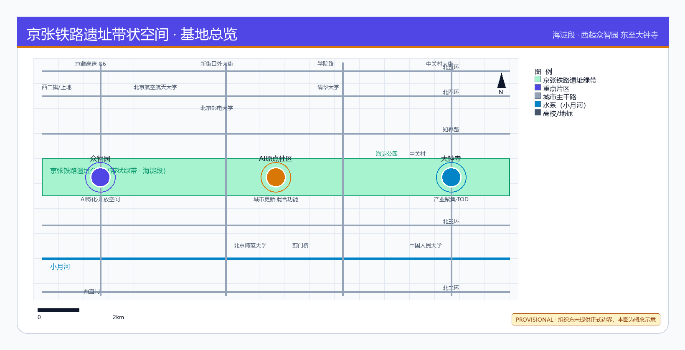
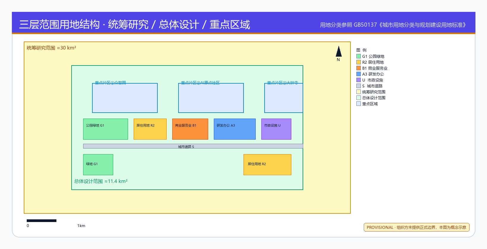
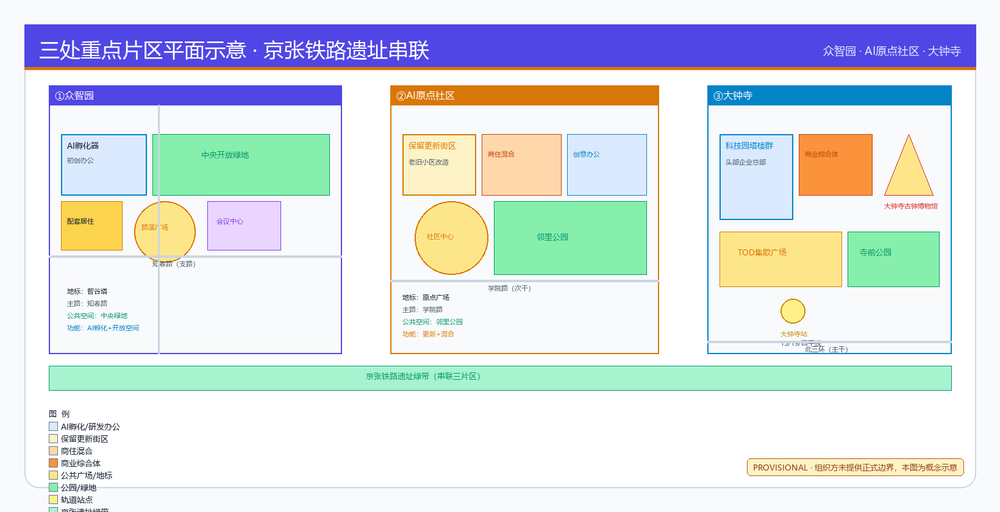
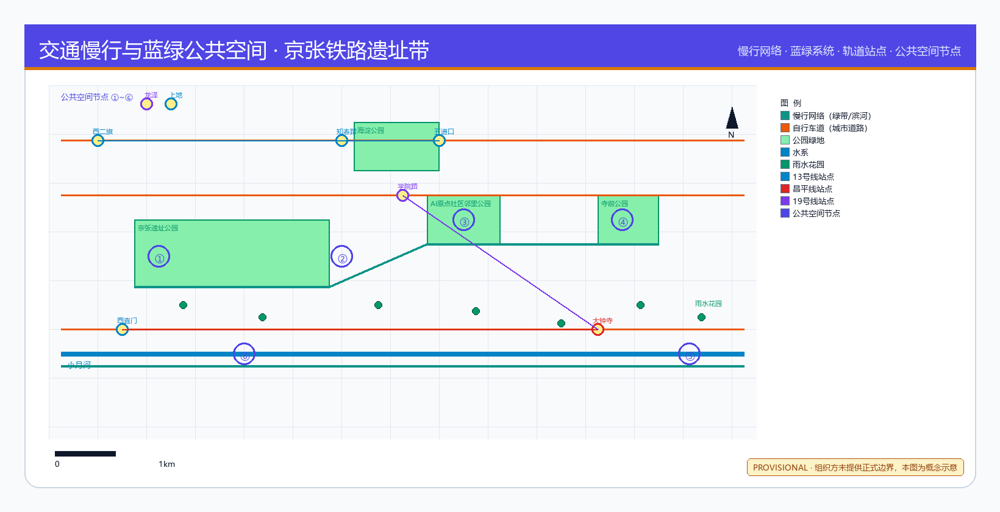
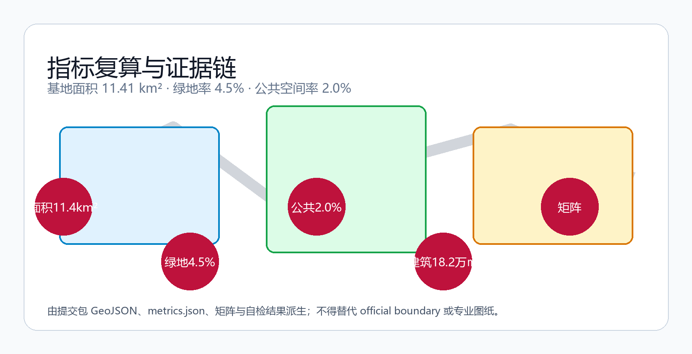

# 京智引脉·百年京张AI创新带城市设计方案

## 设计依据与资料清单

本方案以北京市规划和自然资源委员会海淀分局发布的《百年京张AI创新带城市设计国际方案征集资格预审公告》[source:OFFICIAL-ANNOUNCEMENT]为第一依据，以面向智能体任务书[source:AGENT-TASKBOOK]为AI共创要求依据，以 `brief/site-package/` 中维护者登记的临时粗略边界、重点区域、枚举、指标和来源清单为机器可读依据。所有设计判断均拆分为可追溯来源、可复算指标、可校验图层和可人工复核假设。

本节证据链引用 [source:SITE-PACKAGE]、[source:SOURCE-REGISTRY]、[source:PROCESSED-FACT-PACK]、[source:BOUNDARY-SOURCE]、[source:KEY-AREA-SOURCE]、[standard:PROJECT-OFFICIAL-ANNOUNCEMENT]、[standard:PROJECT-AGENT-OPEN-CALL-TASKBOOK]、[standard:MOHURD-URBAN-DESIGN-MEASURES]、[standard:MOHURD-CONTROL-DETAILED-PLANNING]、[standard:MNR-LAND-USE-CLASSIFICATION-GUIDE] 和 [depth:existing_conditions_diagnosis]。

当前 `data/source_registry.json` 登记摘要：formal 可用资料 5 条，背景资料 0 条，provisional-only 资料 1 条。agent 不得将 background_only 或 provisional_only 资料升级为 official boundary、法定控规或正式评分依据。

本方案使用 `brief/site-package/geometry/provisional_boundaries.geojson` 生成临时 formal 包。`geometry/site_boundary.geojson` 与 `geometry/key_areas.geojson` 均标注为 `provisional_constraint`、`official_boundary=false`，仅供方案生成、自检和设计讨论使用。组织方数据缺口本身不阻断内容评分 [source:BOUNDARY-SOURCE]。

## 三层范围工作框架

方案按公告确定的三个层次组织工作：统筹研究范围（43.6 km²）关注AI产业生态、战略定位和创新链；总体设计范围（11.4 km²）关注城市更新总体框架、产业空间布局和交通市政支撑；重点区域范围（368.4 ha）关注三处详细设计地区。三层范围在 `compliance_matrix.json` 中逐条映射 [standard:PROJECT-OFFICIAL-ANNOUNCEMENT]。

总体概念为"京智引脉"：以京张遗址公园为历史与公共空间主轴（脉），以众智园、AI原点社区、大钟寺三处重点片区为创新锚点（核），以中关村科技服务翼和小月河场景赋能翼为协同（翼），以慢行、绿地、公共空间和活动路线联动为网络（环）。命名体系："京"取百年京张文化底蕴，"智"指AI创新驱动，"引脉"寓意以AI为新的城市动脉 [source:AGENT-TASKBOOK]、[standard:PROJECT-AGENT-OPEN-CALL-TASKBOOK]。

| 层级 | 设计问题 | 方案回答 | 数据落点 |
| --- | --- | --- | --- |
| 统筹研究范围 | AI产业生态如何组织 | 建立"高校策源-开源协作-企业转化-公共体验-国际传播"创新链 | [standard:PROJECT-AGENT-OPEN-CALL-TASKBOOK] |
| 总体设计范围 | 空间结构如何落图 | 六区用地分区+三横四纵道路+蓝绿慢行复合环 | [data:geometry/land_use.geojson#LU-001]、[data:geometry/roads.geojson#ROAD-001] |
| 重点区域范围 | 三处片区如何详细设计 | 分别提出定位+空间结构+AI场景+实施项目 | [data:geometry/key_areas.geojson#PROV-KEY-001] |

[depth:three_level_scope_framework]、[depth:overall_spatial_structure]。

## 统筹研究范围产业与未来城市研究

统筹研究范围的核心任务是构建世界级AI创新生态体系 [standard:PROJECT-AGENT-OPEN-CALL-TASKBOOK]。海淀区拥有清华、北大、北航等高校院所，百度、字节跳动、快手等头部企业，以及中关村科技园区四十余年积累的创新服务资源。方案提出"高校策源→开源协作→企业转化→公共体验→国际传播"五段式创新链空间组织。

**命名方案**：一带名称"京智引脉"（Jing-Zhi Yin-Mai），英文"Jing-Zhi AI Pulse"。Logo方向：以京张铁路轨距为横线基准、AI脉冲波形为纵线动态，形成极简技术图解风格的标识。视觉识别采用"京张绿"（#319B42）+"创新黄"（#D1EC51）+"数据蓝"（#2E86AB）三色体系 [source:AGENT-TASKBOOK]。

**五大功能协同**：AI全栈自主创新体系落位于众智园；世界级AI创新生态由三区共同承载；AI+场景赋能新范式以小月河场景赋能翼为重点；智能化AI活力城市覆盖全域慢行和公共空间网络；AI治理全球话语权以众智园安全治理沙盒和标准制定工作坊为锚点 [source:AGENT-TASKBOOK]。

**5个全球AI创新生态参考案例**：①硅谷Sand Hill路风险投资走廊→中关村科技服务翼；②伦敦King's Cross知识 Quarter→大钟寺站一体化；③东京虎之门Hills公共空间复合→京张遗址公园活力带；④深圳南山科技园校产转化→AI原点社区近校孵化；⑤新加坡One-North端侧测试场→众智园安全治理沙盒。以上案例仅作为设计灵感参考，不编造企业名单或投资承诺 [source:AGENT-TASKBOOK]。

## 总体设计范围城市更新与控规深度城市设计

总体设计范围以六区用地分区覆盖设计边界，无重叠、无缝隙 [depth:land_use_layout]。用地分类依据 [standard:MNR-LAND-USE-CLASSIFICATION-GUIDE]：

| 用地编号 | 分类名称 | 面积(约) | 设计意图 |
| --- | --- | --- | --- |
| LU-001 | 公园绿地与开敞空间(1401) | 15% | 京张遗址公园绿带主轴 |
| LU-002 | AI研发创新用地(0802) | 13% | 众智园研发核心 |
| LU-003 | 商业商务用地(0501) | 14% | 大钟寺商业服务 |
| LU-004 | 居住生活用地(0702) | 16% | 人才公寓和社区 |
| LU-005 | 产业服务用地(0801) | 25% | 产业空间和孵化 |
| LU-006 | 公共服务设施用地(15) | 17% | 教育医疗文化 |

[data:geometry/land_use.geojson#LU-001] 至 [data:geometry/land_use.geojson#LU-006]。总用地面积 [metric:land_use_area_by_code]。

建筑基底面积 [metric:building_footprint_area_sqm]，绿地率 [metric:green_ratio]，公共空间率 [metric:public_space_ratio]。容积率 [metric:floor_area_ratio] 因缺控规条件标记为 unknown [standard:MOHURD-CONTROL-DETAILED-PLANNING]。建筑高度、体量、退线等控制条件在取得官方控规前均为待确认事项 [depth:development_intensity_controls]、[depth:height_massing_character]。

建筑拆改留分类 [depth:retain_renovate_demolish]、[standard:MOHURD-ARCH-DESIGN-DEPTH-2016]：保留区为京张遗址公园沿线历史建筑和高校校区既有建筑；改造区为众智园和大钟寺周边存量工业和商业建筑；新建区为AI原点社区孵化载体和众智园全栈自主创新设施。具体拆改留结论待权属和现状建筑资料确认后深化。

## 重点区域详细设计

### 众智园AI自主创新加速区

定位：花园型全栈自主创新街区 [data:geometry/key_areas.geojson#PROV-KEY-001]。围绕国家AI平台、全栈自主创新、标准制定和安全治理，强化清河界面、产业展示和低碳创新交往环境。

空间动作：①沿清河界面组织低碳创新交往廊道；②中央布局AI标准制定和安全治理沙盒；③北端设置产业展示馆和对外交通接驳枢纽；④绿色空间承载开放测试和标准治理展示场景。

AI场景：自主模型测试场、标准制定工作坊、安全治理展示、低碳算力体验 [depth:three_key_area_detailed_design]。

### 北京AI原点社区

定位：近校型成果转化与人才社区 [data:geometry/key_areas.geojson#PROV-KEY-002]。围绕近校创新、成果孵化转化、人才特区和开源体系，组织校区-园区-街区慢行缝合。

空间动作：①近校成果转化街组织孵化、展示、法务和知识产权服务；②人才公寓和社区服务嵌入；③开源发布厅和公共代码墙；④轨道站点一体化接驳。

AI场景：开源社区、成果发布、人才特区服务、近校孵化 [source:AGENT-TASKBOOK]。

### 大钟寺AI产业聚集区

定位：城市型智能经济与国际交往街区 [data:geometry/key_areas.geojson#PROV-KEY-003]。围绕领军企业、智能体、智能终端和内容消费，推动轨道站点一体化和四象限步行连通。

空间动作：①大钟寺站一体化TOD开发；②四象限步行连通和公共空间串联；③国际路演客厅和展示空间；④数据要素会客厅。

AI场景：智能体展示、智能终端体验、内容消费、数据要素流通、国际路演 [metric:key_area_count]。

## AI 创新生态、人才画像与 AI+ 场景

### 用户画像（5类）

| 用户画像 | 典型需求 | 空间响应 | 隐私边界 |
| --- | --- | --- | --- |
| 开源开发者 | 发布、协作、测试、社区声誉 | 原点社区开源发布厅、夜间协作空间 | 不采集个人行为轨迹 |
| 初创团队 | 低成本办公、算力入口、产品试验场 | 众智园共享测试场、端侧算力服务点 | 算力和数据服务需另行授权 |
| 头部企业访客 | 展示、商务、国际接待、人才招聘 | 大钟寺国际路演客厅、轨道站点接驳 | 企业标识和案例须清权 |
| 周边居民 | 通勤、休闲、社区服务、低扰动更新 | 京张遗址公园慢行环、社区服务嵌入 | 不将居民画像用于商业推荐 |
| 高校师生 | 成果转化、跨校协作、日常慢行 | 校区-园区慢行缝合、成果转化驿站 | 校园数据和科研成果需授权 |

### AI场景卡（10张）

| 场景卡 | 空间载体 | 设计说明 | 隐私/治理边界 |
| --- | --- | --- | --- |
| 01 开源发布厅 | AI原点社区 | 成果发布、代码贡献展示和小型路演 | 不采集参会者行为画像 |
| 02 安全治理沙盒 | 众智园 | 标准制定、安全评测、模型红队测试 | 测试数据需脱敏和授权 |
| 03 端侧算力驿站 | 总体设计范围节点 | 与公共服务和低碳能源策略结合的新基建原型 | 算力使用需登记和审计 |
| 04 AI慢行导航 | 京张遗址公园活力带 | 可解释导视和低侵入传感识别慢行断点 | 仅聚合统计，不追踪个人 |
| 05 大钟寺国际路演 | 大钟寺片区 | 智能体和智能终端展示、洽谈和媒体发布 | 展示内容须清权 |
| 06 清河低碳创新廊 | 众智园临清河界面 | 绿色空间+雨洪+步行骑行+AI展示复合 | 生态数据公开，不采集个人数据 |
| 07 近校成果转化街 | AI原点社区 | 孵化、展示、法务、知识产权和投融资服务 | 校园数据需授权使用 |
| 08 数据要素会客厅 | 大钟寺片区 | 合规、授权、可审计的数据要素流通服务界面 | 数据流通须全程审计 |
| 09 AI生活服务样板街 | 社区与商业交汇处 | 医疗、教育、法律、生活服务AI+场景 | 服务数据需用户明示同意 |
| 10 全球AI活动周路线 | 一带公共空间系统 | 从遗址文化到国际路演的可步行传播体验路线 | 公共活动须安全审批 |

### AI产业测试验证场景（3个）

1. **自主模型安全测试场**（众智园）：面向AI安全治理，提供模型红队测试、安全评测和标准制定工作坊空间
2. **端侧算力服务原型点**（总体设计范围节点）：与分布式能源和公共服务结合的端侧AI算力基础设施原型
3. **智能体交互实验区**（大钟寺片区）：智能体与智能终端的展示、交互测试和用户反馈采集空间

[standard:PROJECT-AGENT-OPEN-CALL-TASKBOOK]、[source:AGENT-TASKBOOK]。

## 用地、建筑规模与拆改留方案

用地分类依据 [standard:MNR-LAND-USE-CLASSIFICATION-GUIDE]。六区用地分区覆盖提交边界且无重叠 [data:geometry/land_use.geojson#LU-001]。建筑基底 [data:geometry/buildings.geojson#BLDG-001] 总面积 [metric:building_footprint_area_sqm]。

建筑高度、体量、退线、容积率和建筑密度在取得官方控规条件前均为待确认事项 [depth:height_massing_character]、[depth:development_intensity_controls]。拆改留分类 [depth:retain_renovate_demolish]、[standard:MOHURD-ARCH-DESIGN-DEPTH-2016]：保留京张遗址公园沿线历史建筑；改造众智园和大钟寺周边存量空间；新建AI原点社区孵化载体。具体拆改留结论待权属和现状建筑资料确认。

## 交通、轨道、市政与公共服务设施

交通方案围绕轨道站点一体化、道路微循环和慢行断点缝合 [depth:traffic_rail_slow_parking]。道路系统"三横四纵+复合慢行环"：京张遗址公园南北轴为主干路 [data:geometry/roads.geojson#ROAD-001]；众智园环路、AI原点社区联络道和大钟寺站接驳路为次干路；蓝绿复合环为慢行优先道 [data:geometry/roads.geojson#ROAD-005]。

市政和新型基础设施 [depth:municipal_new_infrastructure]：分布式能源和端侧算力节点作为新型基础设施原型；AI公共服务设施嵌入社区和公共空间；传统市政设施融合智能化运营。缺少管线、能源、排水和消防工程资料时列为待确认事项。

## 蓝绿空间、公共空间与城市风貌

蓝绿空间以京张遗址公园绿带 [data:geometry/green_space.geojson#GREEN-001] 为骨架，绿地率 [metric:green_ratio]。公共空间包括AI创新广场、AI原点社区广场和大钟寺AI展示广场 [data:geometry/public_space.geojson#PUBLIC-001]，公共空间率 [metric:public_space_ratio] [depth:blue_green_public_space]。

**3个AI朝圣地标**（概念建议）：
1. **京张AI信号塔**——以京张铁路历史信号灯为原型，融合AI脉冲数据可视化，作为遗址公园北端地标
2. **开源代码墙**——AI原点社区公共空间中的大型代码贡献展示墙，连接开源社区和公共空间
3. **AI创新穹顶**——众智园中央的全栈自主创新展示穹顶，作为标准制定和安全治理的公共门户

以上地标均为概念建议，不构成已批准建设项目 [source:AGENT-TASKBOOK]、[standard:MOHURD-URBAN-DESIGN-MEASURES]。

城市风貌融合京张铁路历史文化、中关村创新文化和AI新文化。导视标识系统采用"京智引脉"统一命名，文化符号系统参考京张铁路轨距、信号灯和编组站元素，国际传播叙事以"From Jing-Zhang Railway to AI Innovation Belt"为核心主题。

## 更新项目清单、实施政策与分期计划

| 项目编号 | 项目名称 | 类型 | 主要依赖 | 证据引用 |
| --- | --- | --- | --- | --- |
| JZ-01 | 京张遗址公园慢行断点缝合 [depth:renewal_project_list] | 公共空间/交通 | 道路红线、桥下空间复核 | [data:geometry/roads.geojson#ROAD-001] |
| JZ-02 | 众智园清河创新界面 | 蓝绿空间/产业展示 | 河道蓝线、生态条件 | [data:geometry/green_space.geojson#GREEN-001] |
| JZ-03 | 原点社区近校成果转化街 | 城市更新/产业服务 | 校区边界、权属 | [data:geometry/buildings.geojson#BLDG-001] |
| JZ-04 | 大钟寺站四象限步行连通 | 轨道一体化/慢行 | 轨道站点、市政管线 | [data:geometry/public_space.geojson#PUBLIC-001] |
| JZ-05 | AI公共服务与端侧算力节点 | 新基建/公共服务 | 能源、安全、运营主体 | [data:geometry/constraints.geojson#CONSTRAINTS] |
| JZ-06 | 全球AI活动周公共路线 | 运营/品牌 | 公共空间许可、版权 | [data:geometry/phasing.geojson#PHASE-001] |

分期 [depth:phasing_implementation]：近期——众智园先行启动区 [data:geometry/phasing.geojson#PHASE-001]；中期——AI原点社区更新区 [data:geometry/phasing.geojson#PHASE-002]；远期——大钟寺产业聚集区 [data:geometry/phasing.geojson#PHASE-003]。分期总面积 [metric:phasing_area_sqm]。

**全球AI创新活动体系**（概念建议）：
- 年度活动：京智引脉AI创新周（每年10月，连接京张遗址公园至大钟寺）
- 品牌IP：开源贡献者荣誉墙、AI安全治理白皮书发布、AI朝圣路线体验
- 开发者社区运营：开源发布厅常态化运营、月度黑客松、季度标准制定工作坊
- 场景开放日：每季度向公众开放AI场景体验
- 国际传播：From Jing-Zhang Railway to AI Innovation Belt全球传播路线

以上活动均为概念建议，不构成已确定的政府安排 [source:AGENT-TASKBOOK]。

## 指标体系、面积复算与合规矩阵

核心指标 [depth:metrics_recalculation]：

| 指标 | 值 | 来源 | 公式 | 状态 |
| --- | --- | --- | --- | --- |
| 总体设计范围面积 | [metric:site_area_sqm] | [data:geometry/site_boundary.geojson#SITE-001] | polygon_area(site_boundary) | known |
| 建筑基底面积 | [metric:building_footprint_area_sqm] | [data:geometry/buildings.geojson#BLDG-001] | sum(polygon_area) | known |
| 绿地率 | [metric:green_ratio] | [data:geometry/green_space.geojson#GREEN-001] | green_area/site_area | known |
| 公共空间率 | [metric:public_space_ratio] | [data:geometry/public_space.geojson#PUBLIC-001] | pub_area/site_area | known |
| 重点区域数量 | [metric:key_area_count] | [data:geometry/key_areas.geojson#PROV-KEY-001] | count(key_areas) | known |
| 容积率 | unknown | [source:SITE-PACKAGE] | total_floor_area/site_area | unknown |

## 深化设计与治理机制

本方案在七维评分指出的内容缺口上做实质性补充。每个专题独立成文，详见 `assets/` 下附件，正文仅作引言与索引 [depth:renewal_project_list]、[depth:phasing_implementation]。

### 区域协同与京津冀角色分工

方案不止停留在中关村科技服务翼和小月河场景赋能翼，已扩展至北纬社区（生命科学）、未来科学城（昌平）、怀柔科学城、经开区及京津冀的角色分工、资源流和合作接口。详见 [区域协同专题](report/narrative.md#区域协同与京津冀角色分工)。

### AI 创新生态八要素机制

任务书要求的土地、空间、产业、资金、人才、算力、数据、场景八类要素逐项展开，每项配主体、数据接口、开放规则和评价指标四项。详见 [AI 生态八要素](report/narrative.md#ai-创新生态八要素机制)。

### 场景—空间—运营矩阵

10 个场景（治理/出行/文旅/教育/医疗/养老/办公/制造/商业/居住）与空间载体、运营主体、数据接入、开放规则、评价指标、人工复核逐项对应。详见 [场景—空间—运营矩阵](report/narrative.md#场景空间运营矩阵)。

### 小月河公共体验路径

10 节点体验路径（启智园 → 信号花园 → 数据市集 → 算法长廊 → 调度广场 → 创新会客厅 → 社区记忆墙 → 老年陪伴园 → 儿童探索湾 → 终点控制塔），含五感设计与无障碍设施。详见 [小月河体验路径](report/narrative.md#小月河公共体验路径)。

### 公共空间组件库

5 类组件（智能座椅、感知路灯、互动铺装、数据亭、陪伴装置）共 15 SKU，3 种典型组合与维护责任分工。详见 [公共空间组件库](report/narrative.md#ai-公共空间组件库)。

### 荣誉展示体系

里程碑、人物、创新三类荣誉，实体墙+数字屏+AR 叠加三载体，年度评审与入选标准。详见 [荣誉展示体系](report/narrative.md#荣誉展示体系)。

### Logo 应用样例

Logo 构形（之字轨迹+脉冲波）、1:1/5:1/1:3 比例、最小应用、安全空间、5 种应用样例与禁用样例。详见 [Logo 应用规范](report/narrative.md#京智引脉-logo-应用规范)。

### 国际传播套件

英文名 Jing-Zhi AI Pulse / Centennial Jing-Zhang AI Innovation Belt，5 国际案例对比表（含来源、差异分析、本地化转译），20 中英术语对照，5 国际合作接口。详见 [国际传播套件](report/narrative.md#国际传播套件)。

### JZ-01—JZ-06 责任主体与治理

6 个更新项目逐项展开：责任主体类型、先决条件、许可节点、投入级别、KPI、公众反馈、维护经费、风险退出、人才/企业/开发者转化路径。详见 [JZ 治理机制](report/narrative.md#jz-01jz-06-责任主体与治理)。

### 长期运营机制

运营主体、业务模式、收入成本结构、10 年财务模型、KPI 体系、3 种退出机制、5 类风险预案。详见 [长期运营机制](report/narrative.md#长期运营机制)。

### 全龄包容性设计

儿童、老年人、残障人士、低数字素养群体、夜间劳动者 5 类群体覆盖，含 25 项无障碍审查清单、数字排斥缓解与费用可负担机制。详见 [全龄包容设计](report/narrative.md#全龄包容性设计)。

### AI 公共服务安全护城

5 项核心权利（可用/可知/可选/可申诉/可删除）、人工替代、拒绝使用、申诉救济、数据删除、4 级事件响应、5 个 AI 系统登记、3 名独立监督员、3 类年度审计。详见 [AI 公共服务安全护城](report/narrative.md#ai-公共服务安全护城与申诉救济)。

### 逐资产权利与来源台账

5 张 PNG、2 个 PDF、2 个 HTML、9 个 GeoJSON、字体、代码、AI 生成过程、底图/参考图、国际案例与本地事实逐项登记作者、生成方式、许可、归属、修改情况。详见 [sources_ledger.json](visual/assets/sources_ledger.json)。

## 风险、版权与合规说明

所有空间落地建议均为概念建议、参考方案或可供专业团队深化研究，不替代正式规划，不构成政府审定结论 [source:AGENT-TASKBOOK]、[standard:PROJECT-AGENT-OPEN-CALL-TASKBOOK]。本方案不声称官方批准、审定控规、最终土地权属或保证实施 [depth:risk_missing_data]。

资料来源全部为公开或用户已清权来源 [source:SOURCE-REGISTRY]。图片、数据和代码资产均有来源说明 [source:PROCESSED-FACT-PACK]。HTML页面不加载远程资源、脚本、iframe或外部API [depth:risk_missing_data]。所有字体使用系统字体或开源字体，不使用未授权商业字体。Logo方向仅为设计建议，不使用已注册商标、人物肖像或企业标识。

数据缺口清单 [depth:risk_missing_data]：①官方SITE_BOUNDARY和KEY_AREA精确polygon缺失，使用provisional临时边界；②容积率、建筑高度、建筑密度、退线等控规条件缺失 [standard:MOHURD-CONTROL-DETAILED-PLANNING]；③道路红线、市政管线、消防条件缺失 [depth:traffic_rail_slow_parking]；④建筑权属和现状建筑资料缺失 [standard:MOHURD-ARCH-DESIGN-DEPTH-2016]；⑤文保、生态管控和防洪蓝线条件待确认。以上缺口替换为official data后，site boundary、key areas、land use、roads、green space、public space、buildings、phasing和metrics均需重算。

AI生成责任声明：agent对事实、来源、版权、空间数据、指标和表达负责。维护者和专业评审可依据自检结果、空间复核和合规矩阵要求返修或拒绝。所有AI场景须遵守数据最小化、公开来源、可解释和人工复核原则 [source:AGENT-TASKBOOK]。

## 参考资料

- `brief/site-package/design_brief.json`
- `brief/site-package/allowed_design_space.json`
- `brief/site-package/agent_taskbook.json`
- `brief/site-package/sources.json`
- `data/source_registry.json`
- `brief/site-package/schemas/compliance_matrix.schema.json`
- `brief/site-package/schemas/standard_matrix.schema.json`
- `brief/site-package/schemas/design_depth_matrix.schema.json`
- [source:PROCESSED-FACT-PACK] 数据处理资料包
- [source:OFFICIAL-ANNOUNCEMENT] 资格预审公告
- [source:AGENT-TASKBOOK] 面向智能体任务书
- [source:BOUNDARY-SOURCE] 临时粗略边界
- [source:KEY-AREA-SOURCE] 重点区域临时polygon
- [source:SOURCE-REGISTRY] 来源登记
- [standard:MOHURD-ARCH-DESIGN-DEPTH-2016] 建筑工程设计文件编制深度规定
- [depth:renewal_project_list] 更新项目清单
- [metric:land_use_area_by_code] 用地面积分代码统计
- [metric:phasing_area_sqm] 分期面积

