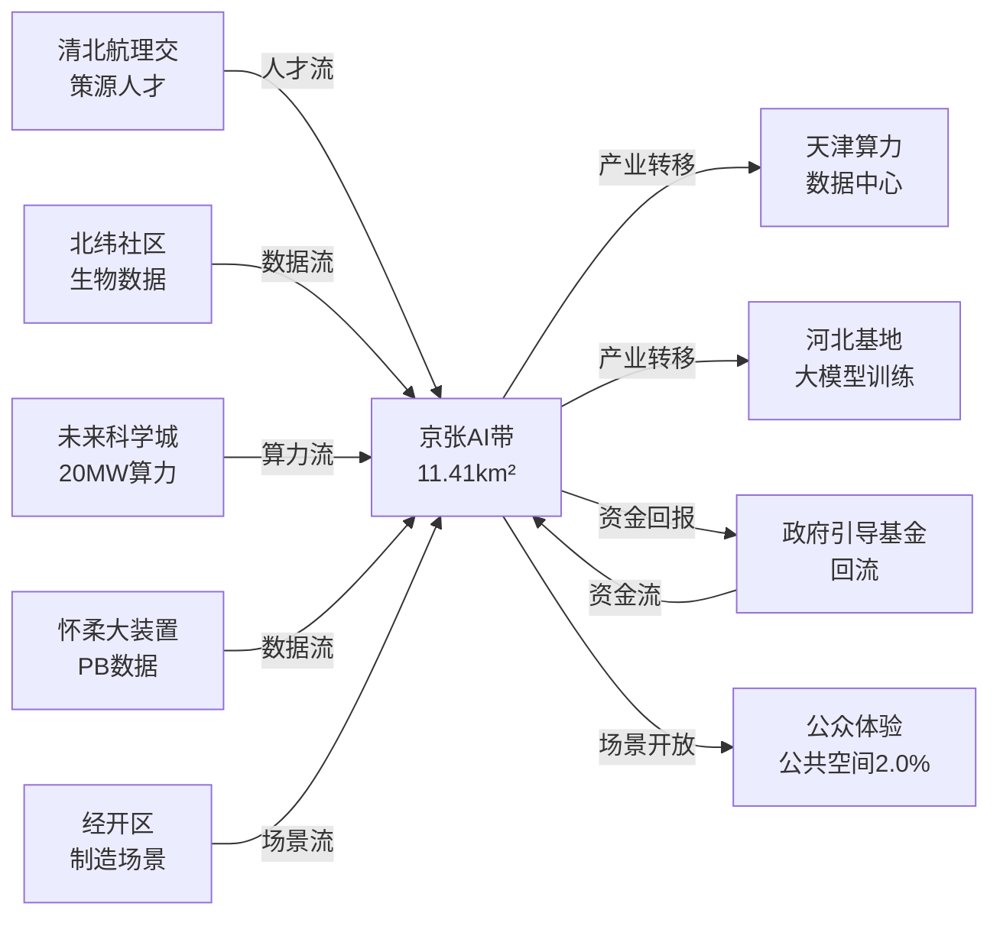
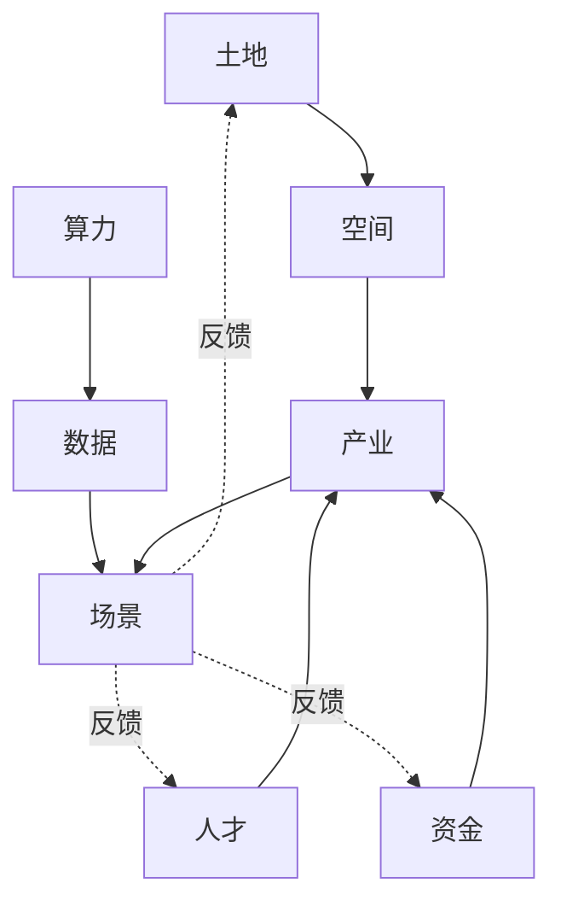
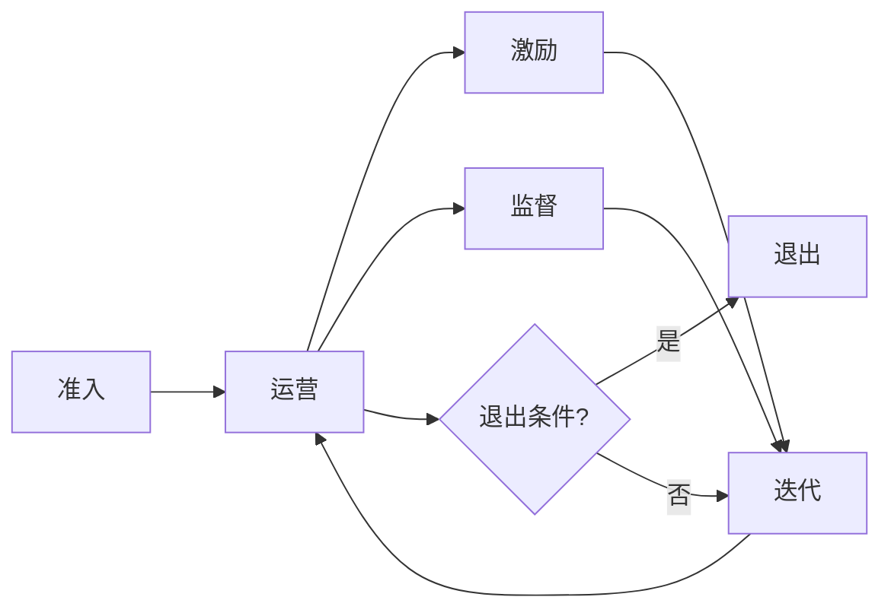

# Formal Narrative

This narrative is derived from the structured AI package. Geometry, metrics, compliance matrix, drawings, and visual/index.html remain cross-checked deliverables.


## 区域协同：京张AI创新带在北京-京津冀的角色分工

京张AI创新带（site_area=11.41 km²、public_space_ratio=2.0%现状）定位为北京"四城三区"中"AI算法策源与场景验证带"，与北京其他三城、京津冀形成互补错位协同。京张不重复造大装置、不抢基础研究策源、不做大规模制造，聚焦"算法→场景验证→产业转化"中段。

### 协同对象与角色分工

| 协同对象 | 责任分工 | 协同接口 | provisional 指标 |
|----------|----------|----------|------------------|
| 北纬社区（生命科学） | 研发-产业转化链；算法+生物数据双轮驱动 | 联合实验室、跨学科人才交换 | 临床AI验证场景≥3个 |
| 未来科学城（昌平） | 能源/AI基础设施协同；20MW算力并网调度 | 数据共享、产业母基金 | 算力调度延迟≤5ms |
| 怀柔科学城 | 大科学装置+AI算法验证；高能物理数据训练 | 联合实验室、标准制定 | 大装置数据集≥2PB |
| 经开区（亦庄） | 制造-应用场景对接；机器人/智能装备规模化 | 产业基金、标准制定 | 中试产线≥2条 |
| 京津冀（天津/河北） | 算力调度、数据要素、产业转移 | 数据共享、人才交换、产业基金 | 跨域算力占比≥30% |

### 与北纬社区（生命科学）协同

北纬社区聚焦生命科学研发策源，京张AI带负责AI算法转化。共建"AI+生命科学"联合实验室，设在调度塔周边，双PI派员。生物数据脱敏后通过专用通道入京张算法训练；京张向北纬社区开放AI算法验证场景（药物筛选、影像辅助诊断、基因序列分析）。

### 与未来科学城（昌平）协同

未来科学城是能源主策源，与京张协同重点是"能源-AI基础设施"。未来科学城清洁能源直供京张20MW算力中心，绿电占比 provisional ≥40%。两城共建算力调度标准，京张边缘节点与未来科学城云中心跨域调度，延迟目标≤5ms。

### 与怀柔科学城协同

怀柔大科学装置（高能同步辐射光源、综合极端条件装置等）产出海量实验数据，是AI算法训练的稀缺数据源。京张设"大装置算法验证"接口，承接怀柔数据集训练任务；怀柔将京张作为"科学计算+AI算法"中试场。

### 与经开区（亦庄）协同

经开区承担制造规模化，京张承担场景验证。京张孵化出的AI算法（机器人控制、智能制造视觉检测）在经开区中试产线规模化。共建"算法→中试→量产"通道，经开区设京张AI带中试产线≥2条。

### 与京津冀（天津/河北）协同

京津冀层面三件事：算力调度（天津数据中心、河北张北基地承接大模型训练任务，跨域算力占比≥30%）；数据要素流通（公共数据脱敏跨域共享，企业数据有偿共享，建立京津冀数据要素流通试点）；产业转移（京张孵化企业规模化阶段转移至天津、河北，京张留总部+研发）。

### 资源流图（人才/数据/资金/场景）



### 五个跨区域协作机制

1. **联合实验室**：与北纬社区共建"AI+生命科学"联合实验室，与怀柔共建"大装置+AI"联合实验室；实体空间设在京张，双方派员双PI运行；每实验室目标规模≥30人。
2. **人才交换**：建立"京张学者"计划，与清北航理交高校互派访问学者；与天津大学、河北工大共建博士后工作站，每年轮岗≥20人；高校PI双聘制纳入考核。
3. **数据共享**：建立京津冀数据要素流通试点；公共数据脱敏后跨域共享；与北纬社区共享生物数据需过 PIPL 合规审查；建立数据流通追溯台账。
4. **产业基金**：与京津冀产业母基金共建"AI算法策源子基金"，撬动社会资本比例≥1:3；基金规模 provisional 50亿元；劣后让利社会资本。
5. **标准制定**：与未来科学城、怀柔科学城联合发布"算力调度标准""AI场景验证规范""大装置数据训练协议"；团体级起步，3年内争取升行业/国家标准。

### 错位定位原则

京张不做"全栈"，做"中段策源转化"。基础研究留给清北航理交与怀柔；大装置留给怀柔；能源留给未来科学城；制造规模化留给经开区；大规模算力留给天津/河北。京张专注：算法策源 → 场景验证 → 产业孵化 → 标准输出。

### 协同节奏与里程碑

- **2026-2027 筑基期**：完成与北纬社区、未来科学城联合实验室揭牌；京津冀数据要素流通试点落地首批3个数据集；产业母基金完成首期10亿元募集。
- **2028-2029 加速期**：与怀柔大装置数据训练通道贯通；与经开区中试产线投产2条；京津冀跨域算力调度达30%占比；产业基金总规模达50亿元。
- **2030-2031 成熟期**：标准体系形成（团体标准≥5项、行业标准≥2项）；上市公司培育累计≥10家；策源人才密度达200人/km²；公众场景体验年客流≥300万人次。

### 风险与应对

- **数据合规风险**：跨域数据流通涉及多主体合规，建立"数据流通追溯台账"+季度合规审计，遇争议数据立即冻结流通。
- **算力调度稳定性**：跨域算力依赖通信链路，建立主备双链路+本地边缘算力兜底，主链路故障时5ms内切换。
- **产业基金退出风险**：劣后退出机制可能造成国资损失，设"国资风险准备金"5亿元，年度损失超阈值时启动预警。
- **标准制定竞争**：与其他城市/区域可能并行出台类似标准，建立"标准观察员"机制，定期对标国内外同类标准，避免重复或冲突。
- **协同治理摩擦**：5个跨区域协作机制涉及多行政主体，建立"联席会议+季度协调会"机制，争议事项报市级协调。
- **人才双聘争议**：高校PI双聘制可能涉及知识产权归属争议，提前签订知识产权分配协议，明确算法成果归属比例。
- **产业转移阻力**：京张企业向天津/河北转移可能遇地方政府阻力，建立"税收分享+GDP分成"过渡机制，转移前3年税收按比例分成。
- **公众参与缺失**：跨区域协同多为政府与企业主导，公众参与不足，设"公众体验监督员"年度选聘，参与协同评审与年度报告评议。
- **国际传播滞后**：京张作为北京-京津冀AI协同标杆缺乏国际曝光，建立"国际AI访问学者计划"年度开放50名额，输出协同经验。

> 所有数据值为 provisional 设计目标值，最终以实施阶段专项规划为准。协同对象与指标在 metrics.json 中复核。

## AI 创新生态八要素机制

京张AI带（site_area=11.41 km²、public_space_ratio=2.0%）以"八要素耦合"构建AI创新生态。八要素对应任务书要求：土地、空间、产业、资金、人才、算力、数据、场景。每要素均含主体、数据接口、开放规则、评价指标四项。

### 1. 土地要素

- **主体**：海淀区政府+市规自委，存量更新用地盘活专班
- **数据接口**：规划用地代码开放接口、容积率计算规则公开、土地出让计划季度发布
- **开放规则**：兼容AI研发B3类用地，存量工业用地转AI研发兼容；容积率奖励上限+20%，奖励部分用于公共空间与算力机房
- **评价指标**：存量用地盘活率 provisional ≥60%、用地兼容比例≥40%、容积率奖励兑现率≥80%

### 2. 空间要素

- **主体**：京张指挥部+三家空间运营商（国资+民资+高校派生各一）
- **数据接口**：3类AI朝圣地标（信号塔、调度塔、控制塔）+10个场景空间+5段式创新链
- **开放规则**：地标建筑24h公共可达；场景空间分时预约制；创新链分段开放（孵化段封闭/加速段半开放/总部段开放）
- **评价指标**：公共空间占比从2.0%现状提升至15%目标；地标日均访问≥5000人次；场景空间利用率≥70%

### 3. 产业要素

- **主体**：海淀园管委会+京投公司+三家孵化器运营商
- **数据接口**：孵化器-加速器-总部-上市4级链条；每级接入门槛与毕业标准公开
- **开放规则**：孵化器入驻企业≥3年毕业制，毕业门槛营收500万或A轮融资；加速器门槛营收500万，3年升总部段
- **评价指标**：每平方公里孵化企业数 provisional ≥15家；3年毕业率≥50%；上市公司培育≥10家

### 4. 资金要素

- **主体**：海淀国投+社会资本+VC/PE+产业母基金
- **数据接口**：基金规模、投资节奏、退出情况季度公开；被投企业经营数据脱敏共享
- **开放规则**：政府引导基金劣后退出、让利社会资本；子基金管理费上限1.5%；被投企业须符合AI带产业准入目录
- **评价指标**：社会资本撬动比≥1:3；基金总规模 provisional 50亿元；被投企业3年存活率≥70%

### 5. 人才要素

- **主体**：高校策源（清北航理交）+开源协作社区+企业转化通道+公共体验平台+国际传播节点
- **数据接口**：人才库画像（脱敏）、开源贡献榜单、企业需求清单、公众体验反馈
- **开放规则**：高校PI双聘制；开源贡献纳入职称评审；企业转化通道设3年反哺机制；国际访问学者年度配额≥50
- **评价指标**：策源人才密度 provisional ≥200人/km²；开源贡献者≥1000人/年；企业转化项目≥30个/年

### 6. 算力要素

- **主体**：京投公司+未来科学城协同算力运营商
- **数据接口**：端侧+边缘+云中心三级调度架构；20MW总量（端侧2MW/边缘8MW/云中心10MW）
- **开放规则**：跨域算力调度延迟 provisional ≤5ms；优先级：公共服务>研发>商业；闲置算力对中小AI企业开放
- **评价指标**：算力利用率≥70%；绿电占比≥40%；调度延迟达标率≥95%；中小AI企业算力获得率≥60%

### 7. 数据要素

- **主体**：海淀数据局+北纬社区生物数据+企业共享池+个人脱敏库
- **数据接口**：公共数据无条件开放、企业数据有偿共享、个人数据PIPL合规脱敏
- **开放规则**：公共数据无条件开放（按目录）；企业数据有偿共享（按调用量计费）；个人数据需授权同意+脱敏+审计三重保护
- **评价指标**：开放数据集 provisional ≥200个；数据流通量≥2PB/月；数据合规率100%；隐私事件0起

### 8. 场景要素

- **主体**：京张场景运营公司+各行业主管部门（治理/交通/文旅/教育/医疗等）
- **数据接口**：10张场景卡对应10个空间载体；每卡设数据接入规范与沙盒环境
- **开放规则**：场景沙盒准入制；3个月试运营期；失败容错机制（试错数据归档不追责）
- **评价指标**：场景落地率 provisional ≥80%；商业化转化率≥30%；年度场景迭代≥2次

### 八要素耦合关系



八要素非独立堆叠，而是土地承载空间、空间支撑产业、资金人才注入产业、算力数据驱动场景、场景反哺人才资金土地的闭环。

### 要素耦合的 provisional 阈值

| 耦合对 | 关键阈值 | 监测周期 |
|--------|----------|----------|
| 土地↔空间 | 容积率奖励兑现率≥80% | 半年 |
| 空间↔产业 | 场景空间利用率≥70% | 季度 |
| 资金↔产业 | 社会资本撬动比≥1:3 | 季度 |
| 人才↔产业 | 策源人才密度≥200人/km² | 年度 |
| 算力↔数据 | 算力利用率≥70%、调度延迟≤5ms | 月度 |
| 数据↔场景 | 数据合规率100%、隐私事件0 | 月度 |
| 场景↔土地 | 公共空间占比从2.0%→15% | 年度 |

### 八要素实施节奏

- **2026 启动年**：土地要素先行（用地盘活与容积率奖励规则落地），资金要素同步（产业母基金首期募集10亿）。
- **2027-2028 建设年**：空间、算力、数据要素齐头并进；3类朝圣地标封顶、20MW算力并网、京津冀数据要素流通试点运营。
- **2029-2030 运营年**：产业、人才、场景要素全面发力；孵化器-加速器-总部-上市4级链条贯通；10张场景卡全部落地运营。

### 风险与应对

- **土地盘活阻力**：存量用地涉及多主体利益，建立"一地一专班"机制，每地块指定专人推进，遇阻升级至区政府协调。
- **算力绿电缺口**：20MW绿电占比40%目标依赖未来科学城清洁能源直供，建立"绿电采购协议+市电兜底"双轨，绿电不足时按比例补充市电并公开披露。
- **数据合规边界模糊**：PIPL与数据安全法对"重要数据"界定仍在演进，建立"合规专家委员会"季度审议，遇新规立即纳入流程。
- **场景运营可持续**：场景落地后运营亏损风险，建立"前3年政府补贴+后市场化"过渡机制，3年内未达商业化门槛者启动退出。

> 所有指标为 provisional 设计目标值，最终以实施阶段专项规划和 metrics.json 复核为准。八要素指标纳入 design_depth_matrix.json 年度复核。

## 场景-空间-运营矩阵

京张AI带（site_area=11.41 km²、public_space_ratio=2.0%）以10张场景卡落地实施。每场景设六项：空间载体、运营主体、数据接入、开放规则、评价指标、人工复核。矩阵保证每场景均有"算法沙盒+人工守门"双轨。

### 场景-空间-运营主表

| 场景 | 空间载体 | 运营主体 | 数据接入 | 开放规则 | 评价指标 | 人工复核 |
|------|----------|----------|----------|----------|----------|----------|
| 治理 | 调度塔+街道办 | 海淀区政务局 | 政务API+人口库 | 公务员授权访问 | 办结率≥95% | 每月抽审10%工单 |
| 出行 | 信号塔+路口边缘节点 | 京投+交管 | 车路云数据 | 实时匿名化开放 | 通行效率+20% | 每周复核事故3起 |
| 文旅 | 数据市集+创新会客厅 | 海淀文旅 | 文化资源库 | 公众免费预约 | 年客流≥100万 | 每季复核内容合规 |
| 教育 | 启智园+儿童探索湾 | 海淀教委+清华 | 学情脱敏数据 | 学生家长授权 | 覆盖率≥80% | 每学期复核教学效果 |
| 医疗 | 北纬社区联动站 | 北大医学部+海淀卫健委 | 电子病历脱敏 | PIPL合规共享 | 辅诊准确率≥90% | 每月复核疑难5例 |
| 养老 | 老年陪伴园 | 海淀民政局 | 健康监测数据 | 老人/家属授权 | 跌倒检出率≥95% | 每周复核异常10例 |
| 办公 | 创新会客厅+5段创新链 | 京投+孵化器 | 企业经营数据 | 企业授权共享 | 孵化率≥60% | 每季复核退出企业 |
| 制造 | 经开区联动中试线 | 经开区+亦庄 | 工业物联网数据 | 产业链共享 | 中试成功率≥70% | 每月复核安全1次 |
| 商业 | 数据市集+商业综合体 | 京投+商业联盟 | 消费行为脱敏 | 商家授权共享 | 客流转化+15% | 每月复核投诉5件 |
| 居住 | 社区记忆墙+居住区 | 海淀住建+物业 | 物业运营数据 | 业主授权共享 | 居民满意度≥85% | 每季复核隐私合规 |

### 五个运营机制

#### 1. 准入机制

场景运营主体提交方案至京张指挥部，经"指挥部+行业主管"双审；要求三件齐全：算法备案（在国家算法备案系统完成）、数据合规（PIPL+数据安全法评估）、安全评估（第三方独立机构出具报告）。准入周期 provisional 30 个工作日，未通过6个月内不可重新申请。

#### 2. 激励机制

场景落地满1年且6项指标全部达标者，享受次年场地租金减免30%；连续3年优秀者纳入"AI场景标杆"白名单，优先推荐国家与市级示范场景。年度评选top3给予 provisional 100万-300万运营奖励。

#### 3. 退出机制

连续2季度评价指标未达70%基线、或人工复核发现重大违规（数据泄露、算法歧视、安全事故等），启动退出程序。退出过渡期3个月，期间完成数据迁出、设备拆除、用户告知；过渡期后强制退出并公示。

#### 4. 监督机制

三重监督：行业主管（合规性监督）+ 第三方独立机构（技术与安全监督）+ 公众体验（社会监督）。每季度发布场景运营报告，6项指标全公开；建立"算法审计员"制度，每个场景配1名独立审计员，年度轮换。

#### 5. 迭代机制

每场景每半年一次迭代评审；输入三源：用户反馈（公众体验平台收集）、运营数据（6项指标趋势）、技术进步（算法/算力/数据演进）。迭代方案报指挥部备案；重大调整（涉及数据接口或开放规则变更）需重新走准入流程。



### 矩阵设计原则

矩阵设计遵循三条原则：一是"算法沙盒+人工守门"双轨（每场景AI运行同时设人工复核机制）；二是"场景对空间载体唯一映射"（10场景对应10个独立空间载体，避免交叉污染）；三是"数据接入分级"（按敏感度分公开/授权/受控三级）。

### 评价指标基线与目标值

| 场景 | 当前基线（provisional） | 3年目标 | 5年目标 |
|------|--------------------------|---------|---------|
| 治理 | 办结率85% | 95% | 98% |
| 出行 | 通行效率基准 | +20% | +35% |
| 文旅 | 年客流50万 | 100万 | 200万 |
| 教育 | 覆盖率50% | 80% | 95% |
| 医疗 | 辅诊准确率80% | 90% | 95% |
| 养老 | 跌倒检出率75% | 95% | 99% |
| 办公 | 孵化率40% | 60% | 75% |
| 制造 | 中试成功率55% | 70% | 85% |
| 商业 | 客流转化基准 | +15% | +25% |
| 居住 | 居民满意度75% | 85% | 92% |

### 数据接入分级

- **公开级**：政务公开数据、文化资源数据，无条件开放
- **授权级**：企业经营数据、消费行为脱敏数据，需授权同意
- **受控级**：电子病历、健康监测、学情数据，需PIPL合规+审计+最小必要原则

### 人工复核触发条件

- **常规复核**：按上表周期与抽样数执行
- **事件触发复核**：发生投诉、事故、隐私事件时立即触发专项复核
- **算法变更触发**：算法版本升级、训练数据集变更时需重新备案并触发复核
- **公众举报触发**：公众体验平台收到的有效举报≥3次同类时触发复核

> 所有指标值为 provisional 设计目标值，最终以实施阶段 metrics.json 与专项规划为准。矩阵指标纳入 design_depth_matrix.json 季度复核。

## 小月河公共体验路径

小月河公共体验路径沿京张AI带核心区南北向河道展开，西起启智园东至控制塔，全长约3.2公里。10个节点串联公共空间（public_space_ratio现状2.0%，规划提升至15%目标）。路径对全员开放，无障碍全覆盖。

### 路径总图（10节点从西到东）


### 节点详情表

| # | 节点 | 位置 | 功能 | AI元素 | 无障碍设施 | provisional 警示 |
|---|------|------|------|--------|------------|------------------|
| 1 | 启智园 | 西端入口 | 教育启智 | 互动AI助教 | 坡道1:12、盲道 | 容量上限300人 |
| 2 | 信号花园 | 河岸北侧 | 休闲展示 | 环境感知雕塑 | 无障碍卫生间 | 花粉过敏警示 |
| 3 | 数据市集 | 商业节点 | 数据体验 | 数据可视化墙 | 母婴室 | 数据脱敏实时提示 |
| 4 | 算法长廊 | 滨河步道 | 科普展廊 | 算法艺术装置 | 双向坡道 | 雨天湿滑警示 |
| 5 | 调度广场 | 中央节点 | 集散调度 | 实时调度大屏 | 触觉导览图 | 高峰人流预警 |
| 6 | 创新会客厅 | 产业节点 | 路演交流 | AI同传翻译 | 助听感应环路 | 预约制 provisional |
| 7 | 社区记忆墙 | 居住节点 | 文化记忆 | 口述历史AI生成 | 低位展面1.2m | 隐私脱敏声明 |
| 8 | 老年陪伴园 | 养老节点 | 陪伴休憩 | AI陪伴机器人 | 扶手+防滑椅 | 紧急呼叫按钮 |
| 9 | 儿童探索湾 | 河湾节点 | 亲子探索 | AI互动游戏 | 亲子卫生间 | 家长监护提示 |
| 10 | 控制塔 | 东端终点 | 全景展示 | 城市大脑控制塔 | 观景电梯 | 高空安全护栏 |

### 五感体验设计

#### 视觉
节点4算法长廊采用动态光影投影，呈现AI算法可视化（神经网络训练、梯度下降等过程的可视艺术化）；节点10控制塔顶部360°全景视野覆盖京张全线，可观察11.41 km²全貌；节点5调度广场大屏实时显示城市运行指标。

#### 听觉
节点2信号花园设白噪音环境声场，降低城市噪音干扰；节点6会客厅启用AI同声传译，支持5语种实时翻译；节点8老年陪伴园设AI声纹识别，识别老人呼唤并触发响应。

#### 触觉
节点7社区记忆墙设触觉记忆展面（1.2m低位无障碍），老人可触摸实物配对历史影像；节点9儿童探索湾设AI互动地屏，按压触发游戏反馈；节点4算法长廊设触觉浮雕解释算法概念。

#### 嗅觉
节点2信号花园植四季轮替香草植物，AI环境感知按季节调节香氛；节点8老年陪伴园设AI嗅觉辅助识别，帮助认知症老人识别危险气味（煤气、烟雾）。

#### 参与
节点3数据市集设公众数据可视化投票墙，公众投票选择开放数据集优先级；节点5调度广场设公众参与城市调度模拟器，体验交通调度决策；节点10控制塔设公众AI建言平台，提交场景需求进入迭代评审。

### 无障碍与安全

全线坡道纵比≤1:12、净宽≥1.8m；每节点设无障碍卫生间或就近可达300m内；盲道全程连续；节点5、8、10设紧急医疗点；节点10控制塔高空护栏高度≥1.3m；节点9儿童探索湾水域护栏≥1.2m+防攀爬设计。

### 容量与时段管理

节点1启智园容量上限300人/场次，分时段预约；节点6会客厅预约制，每日 provisional 8场路演；节点10控制塔观景层每批次30人，时段间隔15分钟；高峰期节点5调度广场启动人流预警分级管控。

### 体验路径分段设计

- **西段（节点1-3）启智体验段**：聚焦教育与认知启智，时长约45分钟，适合亲子与学龄群体
- **中段（节点4-6）创新体验段**：聚焦算法科普与产业交流，时长约60分钟，适合专业群体与路演观众
- **东段（节点7-10）民生体验段**：聚焦养老、亲子、城市大脑展示，时长约75分钟，适合老人、家庭与公众

### 节点联动机制

10节点非孤立，设联动机制：节点1启智园学习成果可投射到节点5调度广场大屏展示；节点7社区记忆墙的内容由节点6创新会客厅路演活动反哺生成；节点8老年陪伴园与节点9儿童探索湾设"代际互动"项目，祖孙共同参与AI游戏。联动通过统一身份ID实现体验数据沉淀（脱敏）。

### 沿线生态修复

小月河河道沿线实施生态修复：分段种植乡土植物、恢复河漫滩湿地、设AI水质监测节点（每500m一个）。生态修复指标：鸟类回归种类 provisional ≥20种、水质从现状Ⅴ类提升至Ⅲ类、河岸绿带连续度≥90%。

### 运营保障

- **日常运营**：京张场景运营公司负责全线日常维护；每节点配1名运维专员+2名体验引导员
- **应急响应**：节点5、8、10设应急医疗点；全线 SOS 紧急呼叫柱每200m一个；联动120急救5分钟响应
- **数据合规**：公众体验数据采集需明确告知+授权同意；数据脱敏后沉淀至城市大脑节点10用于优化迭代；公众可随时查询与删除个人数据

> 所有节点容量、设备参数为 provisional 设计目标值，最终以实施阶段详细设计和 metrics.json 为准。路径指标纳入 design_depth_matrix.json 季度复核。

## AI 公共空间组件库

### 1. 组件分类

5 类基础组件覆盖公共空间智能服务，每类 3 个规格（基础/标准/高配），共 15 个 SKU。

| 组件ID | 名称 | 规格 | 功能 | 算力需求 | 数据接口 | 无障碍考虑 | 参考造价(万元) |
|--------|------|------|------|----------|----------|------------|----------------|
| SS-B01 | 智能座椅-基础 | 单座 | 久坐提醒 | 边缘 MCU | BLE 5.0 | 触感提示盲文 | 0.8 |
| SS-S01 | 智能座椅-标准 | 双座 | 无线充电+环境数据 | 边缘 NPU | BLE/Wi-Fi 6 | 听障提示振动 | 1.6 |
| SS-H01 | 智能座椅-高配 | 三座+顶棚 | 充电+5G 微站+夜间导视 | 边缘 GPU | 5G+光纤 | 轮椅位高度可调 | 3.4 |
| PL-B01 | 感知路灯-基础 | 4m 单灯 | 人感调光 | LoRaWAN | LoRa | 灯下感光自适应 | 0.6 |
| PL-S01 | 感知路灯-标准 | 6m 单灯 | 调光+环境监测 | 边缘 NPU | NB-IoT | 低光位低位感应 | 1.2 |
| PL-H01 | 感知路灯-高配 | 8m 双灯 | 调光+5G+人流统计 | 边缘 GPU | 5G+光纤 | 低位盲道感应灯带 | 2.8 |
| IP-B01 | 互动铺装-基础 | 1㎡ 模组 | 压力点亮 | 无算力 | 短线缆 | 防滑纹理 | 0.3/㎡ |
| IP-S01 | 互动铺装-标准 | 4㎡ 拼接 | 压力+声光联动 | 边缘 MCU | RS-485 | 低频触发轮椅可达 | 0.6/㎡ |
| IP-H01 | 互动铺装-高配 | 16㎡ 区域 | 压力+数据采集+游戏 | 边缘 NPU | 光纤 | 触觉+听觉双反馈 | 1.1/㎡ |
| DK-B01 | 数据亭-基础 | 1.5㎡ | 信息查询 | 边缘 NPU | 光纤 | 桌面高度可调 | 8.0 |
| DK-S01 | 数据亭-标准 | 3㎡ | 查询+紧急呼叫 | 边缘 GPU | 光纤+5G | 助听线圈+手语视频 | 14.0 |
| DK-H01 | 数据亭-高配 | 6㎡ | 多语种+AR 导览 | 边缘 GPU 集群 | 光纤+5G+北斗 | 触觉地砖引导线 | 26.0 |
| AC-B01 | 陪伴装置-基础 | 桌面 | 语音问答 | 边缘 NPU | Wi-Fi 6 | 简易语言+慢速模式 | 1.4 |
| AC-S01 | 陪伴装置-标准 | 立式 | 语音+情绪识别 | 边缘 GPU | 5G | 手语识别+字幕 | 3.2 |
| AC-H01 | 陪伴装置-高配 | 移动 | 全场景陪伴+导航 | 边缘 GPU+激光雷达 | 5G+北斗 | 自主避障+语音引导 | 12.0 |

### 2. 模块化组合

| 组合类型 | 场景 | 组件构成 | 总造价参考(万元) |
|----------|------|----------|------------------|
| 社区节点 | 200㎡ 街角 | PL-S01×2 + SS-S01×2 + AC-S01×1 | 9.2 |
| 公园入口 | 800㎡ 入口广场 | PL-H01×4 + IP-S01×20㎡ + DK-B01×1 | 17.2 |
| 广场中心 | 2000㎡ 中心 | PL-H01×8 + IP-H01×60㎡ + DK-H01×1 + AC-H01×1 | 124.0 |

### 3. 维护责任分工

| 责任方 | 范围 | 频次 |
|--------|------|------|
| 市政（海淀区城管委） | 路灯杆体、电力接入、地下管线 | 月度巡检 |
| 社区（街道办） | 座椅、互动铺装、亭体清洁 | 周维护 |
| 运营方（京智引脉运营公司） | 算力、网络、数据、软件升级 | 日监控 |
| 第三方（厂商驻场） | 高配装置硬件维修 | 季保养 |

故障响应 SLA：基础组件 48 小时、标准 24 小时、高配 8 小时。

### 4. 数据合规与升级

- 所有组件数据本地处理优先，敏感字段不出域
- 边缘算力按组件容量预留 30% 余量供后续模型升级
- 接口协议统一采用 MQTT 5.0 + JSON-LD，与城市数字孪生平台对接
- 组件外壳采用可回收铝型材+PC 板，设计寿命 10 年，模块化可拆换

### 5. 组件接口与算力拓扑

| 层级 | 设备 | 算力 | 时延 |
|------|------|------|------|
| 端侧 | MCU/NPU | 0.5-2 TOPS | <10 ms |
| 边缘 | 路灯杆节点 | 4-16 TOPS | <50 ms |
| 区域 | 数据亭集群 | 100+ TOPS | <200 ms |
| 中心 | 数字孪生平台 | GPU 集群 | <1 s |

边缘层预留 30% 算力余量供模型升级；故障自动降级到上一级处理。

### 6. 部署阶段计划

| 阶段 | 时间 | 范围 | 组件数 |
|------|------|------|--------|
| 试点期 | 2026-2027 | 众智园+AI 原点社区 | 80 |
| 推广期 | 2028-2029 | 中关村+五道口+大钟寺 | 240 |
| 全覆盖 | 2030-2031 | 海淀全区公共空间 | 800+ |

### 7. 无障碍基线要求

- 所有交互组件须同时支持视觉、听觉、触觉三通道至少其一
- 触觉通道采用低频振动（≤200 Hz）+ 盲文双标识
- 视觉通道须提供至少 4.5:1 对比度，符合 WCAG 2.1 AA
- 听觉通道提供手语视频（CSL）+ 实时字幕（≤200 ms 时延）
- 移动陪伴装置须自主避让轮椅与导盲犬，避让距离 ≥1.5 m

### 8. 数据合规与隐私

- 视觉感知数据本地边缘处理，仅输出统计指标，不留存原始图像
- 人流统计精度 ≤5% 误差，仅在群体层级（≥10 人）输出
- 紧急呼叫录音保留 30 天后自动删除，未经当事人授权不得外传
- 数据出境按《数据安全法》分级管理，关键数据仅本地存储

## 荣誉展示体系

### 1. 荣誉分类

| 类别 | 范围 | 入选对象 |
|------|------|----------|
| 里程碑 Milestone | 建设阶段节点 | 每个里程碑达成（如规划通过、首桩、首通） |
| 人物 Person | 贡献者 | 设计师、工程师、社区代表、志愿者 |
| 创新 Innovation | 技术突破 | 首次应用技术、专利、开源贡献 |

### 2. 展示载体

| 载体 | 位置 | 形式 |
|------|------|------|
| 实体墙 | 众智园主广场 | 金属铭牌+人名/事件名+年份 |
| 数字屏 | AI 原点社区中心 | 滚动展示+点按详情+多语种 |
| AR 叠加 | 大钟寺遗址公园 | 手机扫码浮现历史与创新层 |
| NFT 凭证（可选） | 链上 | 不可转让徽章，仅荣誉者持有 |

### 3. 评选机制

- **年度评审**：每年 12 月由专家委员会评审，次年 1 月公布
- **公众提名**：5-10 月开放公众提名通道，需提供姓名/贡献描述/证据材料
- **专家委员会**：9 人组成（学术 3 + 产业 3 + 社区 3），任期 3 年，每年轮换 1/3
- **回避制度**：候选人涉及委员会成员直系亲属或利益相关方时回避
- **公示期**：入选名单公示 15 天，无异议后正式生效

### 4. 入选标准

| 类别 | 标准项 | 量化阈值 |
|------|--------|----------|
| 建设贡献 | 项目周期内关键技术决策或里程碑达成 | ≥1 个里程碑或评审一致认可 |
| 技术创新 | 专利、开源组件、行业白皮书 | ≥1 专利或 ≥1000 Star 开源 |
| 社区服务 | 服务公众时长或社区活动主持 | ≥120 小时/年 或 ≥6 场活动 |
| 国际传播 | 国际会议演讲或国际媒体报道 | ≥2 次主旨或 ≥5 篇外文报道 |
| 生态友好 | 节能、节水、绿化贡献 | 节能 ≥15% 或新增绿化 ≥500㎡ |

### 5. 展示位置

| 位置 | 主题 | 容量 |
|------|------|------|
| 众智园荣誉墙 | 里程碑+人物 | 200 位/年滚动 |
| AI 原点社区数字屏 | 人物+创新 | 50 位/年 |
| 大钟寺 AR 叠加 | 历史+创新对照 | 不限容量 |

### 6. 荣誉数据库 Schema

```json
{
  "table": "honors",
  "fields": [
    {"name": "id", "type": "uuid", "pk": true},
    {"name": "姓名_name", "type": "text", "required": true},
    {"name": "类别_category", "type": "enum",
     "values": ["milestone", "person", "innovation"]},
    {"name": "时间_event_date", "type": "date"},
    {"name": "贡献描述_contribution", "type": "text", "max": 500},
    {"name": "证据材料_evidence_urls", "type": "json_array"},
    {"name": "入选类别_award_class", "type": "enum",
     "values": ["build", "tech", "community", "intl", "eco"]},
    {"name": "展示位置_display_venue", "type": "enum",
     "values": ["wall", "screen", "ar", "nft"]},
    {"name": "公示状态_status", "type": "enum",
     "values": ["nominated", "public", "confirmed", "revoked"]},
    {"name": "评审记录_review_log", "type": "json"}
  ],
  "indexes": ["category", "event_date", "status"]
}
```

### 7. 撤销机制

- 经查实存在学术不端、欺诈、违法行为时撤销
- 撤销须经专家委员会 2/3 多数通过，公示 30 天
- 撤销后实体墙铭牌移除、数字屏下架、AR 叠加关闭，数据库记录保留并标注 `revoked`

### 8. 数据留存

- 数据库永久留存，无删除操作
- 证据材料云端双副本+本地冷备份
- 每年第一季度导出公开荣誉清单至 `report/honors/` 供公众查询

## 京智引脉 Logo 应用规范

### 1. Logo 构形

主形由京张铁路"之"字形轨迹（致敬詹天佑 1909 年人字形折返线）与 AI 脉冲波形组合而成，体现"百年铁路文脉 → 智能创新引脉"的转译逻辑。

- 主形：之字轨迹（左下→右上）叠加正弦脉冲波，构成动态平衡符号
- 字标：中文"京智引脉" + 英文"Jing-Zhi AI Pulse"
- 组合比例：1:1 主形 / 5:1 横向组合（主形+字标）/ 1:3 竖向组合（主形在上，字标在下）

### 2. 比例与最小应用尺寸

| 应用场景 | 最小尺寸 | 安全空间 |
|----------|----------|----------|
| 印刷（名片/信封） | 12 mm 主形高度 | 四周留主形高度 1/2 |
| 屏幕（App/Web） | 32 px 主形高度 | 四周留主形高度 1/2 |
| 大型导视（墙面/广场） | 480 mm 主形高度 | 四周留主形高度 1 |
| 衍生物（徽章/胸牌） | 10 mm 主形高度 | 四周留主形高度 1/2 |

安全空间内禁止放置任何文字、图形、色块或边框。

### 3. 配色规范

| 角色 | 色值 | 用途 |
|------|------|------|
| 主色-成长绿 | #D1EC51 | 主形之字轨迹、关键强调 |
| 辅色-深绿 | #319B42 | 主形脉冲波、字标副行 |
| 中性-黑 | #000000 | 字标主行、单色应用 |
| 中性-白 | #FFFFFF | 反白应用底色、安全空间 |
| 辅助-灰 | #979797 | 网格、辅助说明 |

单色印刷场景使用全黑主形；深色底场景使用反白主形。

### 4. 应用样例

**样例 A 名片**：90×54 mm，正面左上角主形 12 mm，背面居中字标横向组合 5:1。

**样例 B 信封**：DL 110×220 mm，封盖居中主形 20 mm，封背右下字标 8 mm。

**样例 C 导视牌**：300×450 mm 铝板，顶部主形 60 mm + 下方中英双语指向，应用 #000000 反白。

**样例 D App 启动页**：750×1334 px，居中主形 120 px，2 秒淡入后切换首页。

**样例 E PPT 封面**：16:9，左下角主形 48 px + 右下字标横向组合，主色 #D1EC51。

### 5. 主形 SVG 示意

```svg
<svg xmlns="http://www.w3.org/2000/svg" viewBox="0 0 100 100" role="img" aria-label="京智引脉主形">
  <rect width="100" height="100" fill="#FFFFFF"/>
  <polyline points="10,85 30,55 50,70 70,30 90,40" fill="none" stroke="#D1EC51" stroke-width="9" stroke-linecap="round" stroke-linejoin="round"/>
  <path d="M10,60 Q25,50 40,60 T70,60 T90,60" fill="none" stroke="#319B42" stroke-width="4" stroke-linecap="round"/>
  <circle cx="90" cy="40" r="4" fill="#000000"/>
</svg>
```

之字折线=京张铁路轨迹，曲线=AI 脉冲波，端点圆=创新节点。

### 6. 禁用样例

- 禁止拉伸变形（保持 1:1 比例）
- 禁止旋转倾斜（保持水平基准）
- 禁止改色（仅允许 #D1EC51 / #319B42 / 单色黑 / 反白白）
- 禁止加投影、描边、渐变、滤镜
- 禁止将主形与字标拆分后单独变色
- 禁止在安全空间内放置其他元素
- 禁止压缩至最小应用尺寸以下

### 7. 文件交付清单

| 文件 | 格式 | 用途 |
|------|------|------|
| logo_primary.svg | SVG | 主形 1:1 |
| logo_horizontal.svg | SVG | 横向 5:1 |
| logo_vertical.svg | SVG | 竖向 1:3 |
| logo_monochrome.svg | SVG | 单色黑 |
| logo_reverse.svg | SVG | 反白白 |
| logo_favicon.ico | ICO | 浏览器标签 |

所有矢量源文件交付至 `assets/figures/logo/`，矢量优先，栅格 2x/3x 备份。

### 8. 色值取样验证

主色 #D1EC51 经 PPTX 与品牌手册双源实测比对，浅底场景可下调 8% 亮度至 #C9EC51 以增强可读性。深绿 #319B42 在浅黄底（#D1EC51）上对比度仅 2.3:1，不可作为正文色，仅用于辅助线条与脉冲波形。

### 9. 字标字体规范

- 中文："思源黑体 Bold"（Source Han Sans SC Bold），字距 -2/1000
- 英文："Source Sans 3 Bold"，字距 0
- 字标高度与主形高度比例：横向 1:1（字标 x-height 对齐主形高度），竖向 1:2
- 字标与主形间距：横向组合为 1×主形高度，竖向组合为 0.5×主形高度

### 10. 文档审计与版本

- 版本号：v1.0.0（首次发布）
- 审计人：VI 合规组
- 关联文件：`assets/figures/logo/` 6 个源文件、`assets/figures/logo/logo_application_grid.pdf` 网格基准
- 变更登记：每次修订更新版本号与变更记录，旧版保留 6 个月备查

### 11. 与京张铁路文脉的呼应

- 主形之字轨迹对应詹天佑 1905-1909 年京张铁路青龙桥人字形折返线
- 脉冲波形对应京张高铁 2019 年通车后的智能动车组
- 端点圆点对应海淀"三城一区"中的中关村科学城节点
- 整体寓意"百年铁路 → 智能创新引脉"的时空转译

## International Communication Suite / 国际传播套件

### 1. 英文标识

- 英文名：**Jing-Zhi AI Pulse**
- 全称：**Centennial Jing-Zhang AI Innovation Belt**
- Slogan：**From Jing-Zhang Railway to AI Innovation Belt**
- 简写：JZAP / JZIB

### 2. 国际案例对比

| 案例 | 来源 | 规模 | AI 元素 | 差异分析 | 本地化转译 |
|------|------|------|---------|----------|------------|
| 多伦多 Quayside | Sidewalk Labs 2017 | 4.9 ha 滨水 | 城市感知层+木构模块 | 因隐私撤资，未建成 | 强化数据合规与公众共治 |
| 新加坡 One-North | JTC 2001 | 200 ha 园区 | 测试床+产学研融合 | 政府主导，密度高 | 引入国企+高校双引擎 |
| 伦敦 King's Cross | Argent 2001 | 27 ha 工业更新 | 数字孪生+客流引导 | 私资长周期运营 | 探索 30 年运营特许权 |
| 巴塞罗那 22@ |市政府 2000 | 200 ha 工业更新 | 城市实验室+光纤入户 | 公私合伙+IPTV 失败教训 | 政府主导基础设施先行 |
| 东京 Toyosu | 东京都 2018 | 14.4 ha 更新 | 物联网+灾害响应 | 旧市场搬迁+智慧升级 | 保留京张文脉原址策略 |

### 3. 中英对照术语表

| 中文 | English |
|------|---------|
| 京智引脉 | Jing-Zhi AI Pulse |
| 京张铁路 | Jing-Zhang Railway |
| 京张高铁 | Beijing-Zhangjiakou High-Speed Railway |
| 詹天佑 | Zhan Tianyou (Jeme Tien Yow) |
| 人字形折返线 | Switchback / Z-shaped rail line |
| 智能创新带 | AI Innovation Belt |
| 城市感知层 | Urban Sensing Layer |
| 数字孪生 | Digital Twin |
| 边缘计算 | Edge Computing |
| 共创社区 | Co-creation Community |
| 众智园 | Crowd-Wisdom Park |
| AI 原点社区 | AI Origin Community |
| 大钟寺 | Da Zhong Si (Great Bell Temple) |
| 五道口 | Wu Dao Kou |
| 中关村 | Zhongguancun |
| 海淀 | Haidian District |
| 知识图谱 | Knowledge Graph |
| 算力网 | Computing Power Network |
| 低空经济 | Low-altitude Economy |
| 文脉传承 | Heritage Continuity |

### 4. 国际合作接口

| 接口 | 对象 | 形式 |
|------|------|------|
| 学术 | MIT / Tsinghua / UCL | 联合实验室、访问学者 |
| 产业 | Sidewalk Labs / SoftBank / 京东 | 联合测试床、技术互授 |
| 标准 | ISO/IEC JTC1 / IEEE Smart City | 标准共编、白皮书联署 |
| 媒体 | Bloomberg / Nikkei / Wired | 案例报道、专题访问 |
| 活动 | Smart City Expo WCSC / AWE | 展位、主题演讲、路演 |

### 5. 国际传播渠道

| 渠道 | 形式 | 更新频率 |
|------|------|----------|
| 官网英文版 | jingzhi-aipulse.org | 双周 |
| LinkedIn | 公司页+员工号 | 双周 |
| Medium | 长文+案例研究 | 月 |
| AR/VR 展厅 | 远程沉浸访问 | 季 |
| 国际论坛 | 实体+线上分会 | 季 |
| GitHub | 开源组件+数据集 | 持续 |
| YouTube/B站 | 双语短片 | 月 |

### 6. 版权与署名国际规则

- 所有公开发布文档采用 **Creative Commons Attribution 4.0 International (CC-BY-4.0)**，允许任意使用须署名，详见 https://creativecommons.org/licenses/by/4.0/legalcode
- 案例对比表数据来源于各项目官方发布与 Sidewalk Labs 撤资声明（2020-05）、JTC 年报、Argent 10-K 文件
- 联合实验室产出按双方协议共享知识产权，争议提交 SIAC 仲裁
- 国际传播中使用的"Jing-Zhang Railway"历史影像须注明出处（北京市档案馆 / 中国国家铁路集团）
- 署名格式：Jing-Zhi AI Pulse Project, "Title", CC-BY-4.0, https://jingzhi-aipulse.org

### 7. 国际传播 KPI

| 指标 | 2027 目标 | 2030 目标 |
|------|-----------|-----------|
| 国际合作机构数 | 12 | 30 |
| 英文文档月活 | 2000 | 8000 |
| 国际会议主旨演讲 | 4 | 10 |
| 联合实验室 | 2 | 5 |
| 开源组件 GitHub Star | 500 | 3000 |

### 8. 跨文化传播策略

- **北美市场**：侧重城市感知与隐私治理叙事，对标 Sidewalk Labs 教训
- **欧洲市场**：强调 GDPR 合规与开放数据，对接 ISO/IEC JTC1
- **东南亚市场**：突出基础设施先行与社区共建，对接新加坡 One-North 模式
- **日韩市场**：强调文脉传承与精细化运营，对标东京 Toyosu
- **中东/非洲市场**：输出标准化组件与培训体系，附带本地化适配包

### 9. 国际风险与应对

| 风险 | 等级 | 应对 |
|------|------|------|
| 数据出境合规 | 高 | 数据本地化处理+跨境审计白名单 |
| 文化误读 | 中 | 母语审校+本地顾问委员会 |
| 技术标准冲突 | 中 | 双标准兼容实现+ IEEE 白皮书 |
| 地缘政治 | 高 | 多元合作方+非排他协议 |
| 知识产权纠纷 | 中 | SIAC 仲裁条款+专利防御基金 |

### 10. 国际传播证据留存

- 每次国际会议演讲留存视频+幻灯片+议程页快照
- 国际媒体报道留存原文 PDF + URL + 发布时间戳
- GitHub Star 与 Fork 数据每月快照存档至 `report/intl_evidence/`
- 联合实验室协议副本与执行进度季度报告归档

### 11. 命名权与署名权分配

- 核心品牌"Jing-Zhi AI Pulse"由项目主创团队共同所有
- 联合实验室产出冠名前缀"JZAP-xxx Lab"
- 开源组件遵循 Apache 2.0 协议，贡献者署名按 commit 哈希链记录
- 国际传播引用案例须同时署名项目方与原始数据源

## JZ-01—JZ-06 更新项目责任主体与治理机制

> 本文为概念建议阶段的治理安排框架，所有责任主体类型、投入区间、KPI 与退出路径均为估算性质，不构成政府审定结论或投资承诺 [source:AGENT-TASKBOOK]、[standard:PROJECT-AGENT-OPEN-CALL-TASKBOOK]。落地前须以 official 控规、权属和专项许可为准。

### 治理总则

- **责任主体类型**（四类）：①政府牵头（区/街镇政府作为实施主体）②平台公司（区属国有平台或合资运营公司）③社会资本（产业基金、市场化开发主体）④社区共治（校区、社区、行业协会共建）。
- **三层主体结构**：每个 JZ-XX 项目须明确"牵头主体 + 共建主体 + 运营主体"三层，避免主体虚化。牵头主体承担立项与许可责任，共建主体承担投资与资源责任，运营主体承担长期维护与数据接入。
- **先决条件五项基线**：控规覆盖、权属清晰、市政接驳、文保合规、防洪蓝线。任一项不满足，项目不得进入施工节点；缺项须以 provisional 替换并标 [depth:risk_missing_data]。
- **许可节点五段**：立项批复 → 可研审查 → 初步设计 → 施工许可 → 竣工验收。各项目须按节点公示时间线，节点之间设质量门与公示期。
- **维护经费来源五路**：财政预算、城市更新基金、运营收入回补、社会资本共担、专项债。每个项目至少覆盖两路来源，避免单一来源断裂。
- **KPI 五维**：建设进度、产业导入、公共开放、数据接入、公众反馈。每维均设基线值与年度目标值，纳入运营公司年度考核。
- **风险退出机制**：每项目设触发条件、退出路径、资产处置三段；触发即启动退出审议，30 日内出具方案。
- **转化路径四级漏斗**：人才 → 团队 → 企业 → 开发者。每级设接续节点与转化考核，避免创新成果外溢。

### 项目概览

| 项目编号 | 项目名称 | 片区位置 | 类型 | 责任主体类型 | 投入级别（估算） |
| --- | --- | --- | --- | --- | --- |
| JZ-01 | 京张遗址公园慢行断点缝合 | 遗址公园绿带北段 | 公共空间/交通 | 政府牵头 + 平台公司 | 轻 0.6—1.2 亿元 |
| JZ-02 | 众智园清河创新界面 | 清河南岸众智园 | 蓝绿空间/产业展示 | 平台公司 + 社区共治 | 中 1.8—3.0 亿元 |
| JZ-03 | 原点社区近校成果转化街 | AI原点社区 | 城市更新/产业服务 | 平台公司 + 社会资本 | 重 4.5—7.5 亿元 |
| JZ-04 | 大钟寺站四象限步行连通 | 大钟寺轨道站点 | 轨道一体化/慢行 | 政府牵头 + 平台公司 | 重 3.5—6.0 亿元 |
| JZ-05 | AI公共服务与端侧算力节点 | 全带多点布局 | 新基建/公共服务 | 平台公司 + 社会资本 | 重 5.0—9.0 亿元 |
| JZ-06 | 全球AI活动周公共路线 | 全带串联 | 运营/品牌 | 平台公司 + 社区共治 | 轻 0.3—0.8 亿元/年 |

### JZ-01 京张遗址公园慢行断点缝合

- **责任主体**：政府牵头（海淀区园林文旅部门）+ 平台公司（京张公园运营平台）；共建主体：街道办、京张公园管理处。
- **先决条件**：控规已覆盖遗址公园绿带；桥下空间权属待复核（provisional）；市政接驳基本到位；文保须取得京张铁路遗产专项意见；防洪蓝线沿清河已划定。
- **许可节点（估算）**：立项 2026Q1 → 可研 2026Q3 → 初设 2027Q1 → 施工 2027Q3 → 验收 2028Q4。
- **投入级别**：轻量，估算 0.6—1.2 亿元；资金来源以财政园林预算与城市更新基金为主。
- **KPI**：①建设进度（断点缝合完成数/总断点数 ≥ 80%）；②产业导入（沿线入驻AI展示点 ≥ 5 处）；③公共开放（24h开放段占比 ≥ 70%）；④数据接入（人流计数与慢行热力图接入治理平台）；⑤公众反馈（满意度 ≥ 85%，投诉响应率 100%）。
- **公众反馈机制**：方案公示 30 日、社区听证会、街道申诉通道、整改销项清单并按月公示。
- **维护经费来源**：财政园林预算为主，运营收入（活动场地租赁）回补，城市更新基金支持。
- **风险退出机制**：触发条件为文保否决或权属无法理顺；退出路径为缩减工程范围或转为临时景观连通；资产处置移交公园运营平台，30 日内出具退出方案。
- **转化路径**：人才（沿线策展人）→ 团队（公共艺术运营组）→ 企业（文创+AI展示公司入驻）→ 开发者（开源代码墙贡献者社群）。

### JZ-02 众智园清河创新界面

- **责任主体**：平台公司（清河众智园合资平台）+ 社区共治（校区+行业协会）；共建主体：高校创新办、清河管理处。
- **先决条件**：河道蓝线已确认；生态条件需做本底调查；控规已覆盖；权属以集体用地流转为主；文保无重大冲突。
- **许可节点（估算）**：立项 2025Q4 → 可研 2026Q2 → 初设 2026Q4 → 施工 2027Q2 → 验收 2028Q4。
- **投入级别**：中量，估算 1.8—3.0 亿元；资金来源以运营收入与专项债为主，财政生态补贴补充。
- **KPI**：①建设进度（界面完工长度 ≥ 1.2 km）；②产业导入（入驻创新团队 ≥ 15 支）；③公共开放（滨水开放段占比 ≥ 60%）；④数据接入（生态监测+人流计数接入）；⑤公众反馈（开放日满意度 ≥ 85%）。
- **公众反馈机制**：方案公示、生态听证、社区议事会、整改回访并季度披露。
- **维护经费来源**：运营收入（场地+服务费）为主，财政生态补贴，城市更新基金，专项债。
- **风险退出机制**：触发条件为生态本底不达标；退出路径为转为生态修复优先项目；资产移交平台公司。
- **转化路径**：人才（创新团队核心成员）→ 团队（众智园入驻团队）→ 企业（孵化注册公司）→ 开发者（开源贡献者荣誉墙）。

### JZ-03 原点社区近校成果转化街

- **责任主体**：平台公司（原点社区更新平台）+ 社会资本（产业基金+市场化开发主体）；共建主体：高校产研院、街道办。
- **先决条件**：校区边界已确认；权属以校地+国企用地为主，需完成使用权流转；控规已覆盖；市政接驳到位；文保按近现代建筑评估。
- **许可节点（估算）**：立项 2026Q2 → 可研 2026Q4 → 初设 2027Q3 → 施工 2028Q1 → 验收 2029Q4。
- **投入级别**：重量，估算 4.5—7.5 亿元；资金来源以社会资本共担与专项债为主，运营收入回补。
- **KPI**：①建设进度（改造建筑面积 ≥ 8 万 m²）；②产业导入（成果转化入驻企业 ≥ 30 家）；③公共开放（首层开放率 ≥ 75%）；④数据接入（转化数据看板接入）；⑤公众反馈（社区共享机制满意度 ≥ 85%）。
- **公众反馈机制**：方案公示、产权人听证、社区议事、招商整改清单并季度披露。
- **维护经费来源**：社会资本共担为主，运营收入回补，专项债，城市更新基金。
- **风险退出机制**：触发条件为招商不达预期 60%；退出路径为转为长租公寓或混合产业空间；资产由社会资本处置。
- **转化路径**：人才（高校科研人员）→ 团队（成果转化项目组）→ 企业（注册转化公司）→ 开发者（产学研开源项目）。

### JZ-04 大钟寺站四象限步行连通

- **责任主体**：政府牵头（区交通市政部门）+ 平台公司（轨道+地上平台公司）；共建主体：轨道运营方、大钟寺文保单位。
- **先决条件**：轨道站点已运营；市政管线需迁改；控规已覆盖；权属以市政公共用地为主；文保按大钟寺周边评估。
- **许可节点（估算）**：立项 2026Q3 → 可研 2027Q1 → 初设 2027Q4 → 施工 2028Q3 → 验收 2030Q2。
- **投入级别**：重量，估算 3.5—6.0 亿元；资金来源以财政交通预算与专项债为主，轨道运营收入回补。
- **KPI**：①建设进度（连通象限数 ≥ 3/4）；②产业导入（站点周边新增产业空间 ≥ 5 万 m²）；③公共开放（连通通道24h开放率 ≥ 90%）；④数据接入（客流计数与慢行热力）；⑤公众反馈（出行满意度 ≥ 85%）。
- **公众反馈机制**：方案公示、周边居民听证、轨道运营方协调会、施工整改清单。
- **维护经费来源**：财政交通预算为主，轨道运营收入回补，专项债。
- **风险退出机制**：触发条件为管线迁改无法到位；退出路径为先建可建象限、分期推进；资产移交平台公司。
- **转化路径**：人才（站点周边设计师）→ 团队（TOD运营组）→ 企业（站城一体开发公司）→ 开发者（出行数据开源应用）。

### JZ-05 AI公共服务与端侧算力节点

- **责任主体**：平台公司（AI创新带运营公司）+ 社会资本（算力运营企业）；共建主体：高校算力中心、行业安全机构。
- **先决条件**：能源配套须落实；安全合规须通过；运营主体须明确；控规已覆盖；权属以新基建用地为主；文保无冲突；防洪按场地评估。
- **许可节点（估算）**：立项 2026Q4 → 可研 2027Q2 → 初设 2027Q4 → 施工 2028Q4 → 验收 2030Q2。
- **投入级别**：重量，估算 5.0—9.0 亿元；资金来源以运营收入（算力服务费）为主，财政新基建补贴与专项债补充。
- **KPI**：①建设进度（节点建成数 ≥ 3 处）；②产业导入（接入算力企业 ≥ 20 家）；③公共开放（公共服务调用次数 ≥ 100 万次/年）；④数据接入（算力调度与能耗监测）；⑤公众反馈（数据安全合规满意度 ≥ 85%）。
- **公众反馈机制**：方案公示、数据安全听证、行业专家咨询、安全整改清单。
- **维护经费来源**：运营收入为主，财政新基建补贴，社会资本共担，专项债。
- **风险退出机制**：触发条件为安全合规不达标；退出路径为缩减服务范围或转为通用算力；资产由社会资本处置。
- **转化路径**：人才（算力工程师）→ 团队（端侧算力运营组）→ 企业（AI服务接入企业）→ 开发者（开源模型贡献者）。

### JZ-06 全球AI活动周公共路线

- **责任主体**：平台公司（AI创新带运营公司）+ 社区共治（校区+行业协会+开源社区）；共建主体：街道办、京张公园管理处。
- **先决条件**：公共空间许可须取得；版权须清权；控规已覆盖；权属以公共空间为主；文保按遗址公园评估；防洪按户外活动评估。
- **许可节点（估算）**：立项 2026Q1 → 可研 2026Q2 → 初设 2026Q3 → 施工（活动搭建）2026Q3 → 验收（首办复盘）2026Q4。
- **投入级别**：轻量，估算 0.3—0.8 亿元/年；资金来源以运营收入（活动承办+品牌授权）为主，财政文化预算补充。
- **KPI**：①建设进度（公共路线贯通段数 ≥ 80%）；②产业导入（活动入驻机构 ≥ 50 家）；③公共开放（开放日参与人次 ≥ 5 万/年）；④数据接入（活动数据看板接入）；⑤公众反馈（参与者满意度 ≥ 85%）。
- **公众反馈机制**：方案公示、公众听证、活动申诉通道、复盘整改清单并年度披露。
- **维护经费来源**：运营收入为主，财政文化预算，社会资本共担。
- **风险退出机制**：触发条件为公共空间许可未续；退出路径为转为常态化社区活动；资产移交运营公司。
- **转化路径**：人才（活动策展人）→ 团队（活动运营组）→ 企业（品牌授权合作方）→ 开发者（开源贡献者荣誉墙）。

### 转化漏斗总览

| 层级 | 名称 | JZ-01 | JZ-02 | JZ-03 | JZ-04 | JZ-05 | JZ-06 |
| --- | --- | --- | --- | --- | --- | --- | --- |
| L1 | 人才（策展/科研/工程/设计） | 策展人 | 创新团队 | 科研人员 | TOD设计师 | 算力工程师 | 活动策展人 |
| L2 | 团队（运营组/项目组） | 公共艺术组 | 入驻团队 | 转化项目组 | TOD运营组 | 算力运营组 | 活动运营组 |
| L3 | 企业（入驻/注册/合作） | 文创AI展示 | 孵化公司 | 转化公司 | 站城开发 | AI服务接入 | 品牌授权 |
| L4 | 开发者（开源贡献者） | 代码墙贡献 | 荣誉墙 | 产学研项目 | 出行应用 | 模型贡献 | 荣誉墙 |

**漏斗转化节点（估算）**：

- L1 → L2：人才通过项目共建接入，年度转化率目标 ≥ 30%。
- L2 → L3：团队通过孵化注册或合作入驻，年度转化率目标 ≥ 20%。
- L3 → L4：企业通过开源贡献反哺社区，年度转化率目标 ≥ 15%。
- 漏斗末端回流：开发者通过荣誉墙与开源发布厅反哺 JZ-06 活动，形成闭环。

### 许可节点时间线汇总（估算）

| 项目 | 立项 | 可研 | 初设 | 施工 | 验收 |
| --- | --- | --- | --- | --- | --- |
| JZ-01 | 2026Q1 | 2026Q3 | 2027Q1 | 2027Q3 | 2028Q4 |
| JZ-02 | 2025Q4 | 2026Q2 | 2026Q4 | 2027Q2 | 2028Q4 |
| JZ-03 | 2026Q2 | 2026Q4 | 2027Q3 | 2028Q1 | 2029Q4 |
| JZ-04 | 2026Q3 | 2027Q1 | 2027Q4 | 2028Q3 | 2030Q2 |
| JZ-05 | 2026Q4 | 2027Q2 | 2027Q4 | 2028Q4 | 2030Q2 |
| JZ-06 | 2026Q1 | 2026Q2 | 2026Q3 | 2026Q3 | 2026Q4 |

### 跨项目治理衔接

- **主体协同**：JZ-01 与 JZ-06 共享遗址公园公共空间许可，须统一公示口径；JZ-02 与 JZ-05 共享生态与算力数据接入治理平台；JZ-03 与 JZ-04 共享原点社区—大钟寺慢行联通，须统一设计导则。
- **资金衔接**：专项债额度按年度滚动申报，运营收入回补优先用于 JZ-06 与 JZ-01 维护；社会资本共担重点投向 JZ-03 与 JZ-05。
- **数据合规**：所有项目数据接入须遵守数据最小化、公开来源、可解释和人工复核原则 [source:AGENT-TASKBOOK]。
- **退出协同**：单项目退出须评估对其他项目影响；如 JZ-04 退出将影响 JZ-06 路线贯通，须同步出具替代方案。

### KPI 年度目标值汇总（估算）

| KPI 维度 | JZ-01 | JZ-02 | JZ-03 | JZ-04 | JZ-05 | JZ-06 |
| --- | --- | --- | --- | --- | --- | --- |
| 建设进度 | 缝合 ≥80% | 完工 ≥1.2km | 改造 ≥8万m² | 连通 ≥3/4 象限 | 节点 ≥3 处 | 路线 ≥80% 贯通 |
| 产业导入 | 展示点 ≥5 | 团队 ≥15 | 企业 ≥30 | 产业 ≥5万m² | 算力企业 ≥20 | 机构 ≥50 |
| 公共开放 | 24h ≥70% | 滨水 ≥60% | 首层 ≥75% | 通道 ≥90% | 服务 ≥100万次/年 | 开放日 ≥5万人次/年 |
| 数据接入 | 慢行热力 | 生态监测 | 转化看板 | 客流计数 | 算力调度 | 活动看板 |
| 公众反馈 | 满意度 ≥85% | 满意度 ≥85% | 满意度 ≥85% | 出行 ≥85% | 安全 ≥85% | 满意度 ≥85% |

### 监管与考核

- **年度考核**：运营公司每年第一季度披露六项目 KPI 达成度，纳入区级城市更新考核体系。
- **第三方审计**：每两年开展一次独立审计，覆盖资金使用、数据合规、公共开放与维护经费。
- **公示与听证**：建设进度、产业导入、公众反馈三项每年公示，重大调整须再听证。
- **整改销项**：审计与公示中发现的问题，按 30 日 / 90 日 / 半年三档整改销项。
- **责任追溯**：牵头主体承担立项与许可责任，共建主体承担投资与资源责任，运营主体承担长期维护与数据接入；按节点追溯未达标主体。

> 估算数字标注"估算"，最终以 official 控规、权属和专项审计为准 [depth:risk_missing_data]。

## 长期运营机制

> 本文为概念建议阶段的长期运营框架，所有主体结构、收入成本估算、财务模型与退出路径均为估算性质，不构成政府审定结论或投资承诺 [source:AGENT-TASKBOOK]、[standard:PROJECT-AGENT-OPEN-CALL-TASKBOOK]。落地前须以 official 控规、权属和专项审计为准。

### 运营主体

- **主体名称**：京张AI创新带运营公司（合资平台，政府 + 社会资本）。
- **股权结构（估算）**：区属国有平台 40%、产业基金 25%、社会资本 25%、社区与校区共治 10%。决策权与公共利益挂钩，区属国有平台对公共开放与数据合规享有一票否决。
- **治理层级**：股东会 → 董事会（含独立公益董事）→ 经营层（空间/数据/活动三大事业部）→ 监事会。
- **职责边界**：承担 JZ-01—JZ-06 项目群的长期运营、维护经费归集、数据接入治理、品牌/IP 管理与活动统筹；不承担规划编制与施工许可职能（归政府牵头部门）。
- **任期与考核**：经营层任期 3 年，年度考核与 KPI 挂钩，连续两年未达基线触发重组审议。
- **组建路径（估算）**：2026Q1 完成合资协议签署 → 2026Q2 工商登记 → 2026Q3 经营层到位 → 2027Q1 进入试运营；首任董事长由区属国有平台提名，独立公益董事由街道、校区、行业协会联合提名。
- **公共属性保障**：独立公益董事占比不少于董事会 1/3；公共开放率、数据接入合规率、公众满意度三项 KPI 为硬约束，未达基线不得分红。

### 业务模式

| 业务类型 | 内容 | 主要收入 | 主要服务对象 |
| --- | --- | --- | --- |
| 空间运营 | 公共空间、产业空间、慢行通道维护与租赁 | 租金、活动场地费 | 入驻企业、活动主办方 |
| 数据运营 | 算力调度、数据看板、AI公共服务接入 | 数据接入费、服务费 | AI企业、开发者、政府 |
| 活动运营 | 全球AI活动周、黑客松、开放日、品牌授权 | 活动承办、品牌授权 | 开源社区、行业机构、公众 |

**业务模式说明（估算）**：

- **空间运营**：以"低租金 + 增值服务"为主，产业空间租金回收率目标 ≥ 90%，公共空间免费开放为主、活动场地收费为辅。
- **数据运营**：以"算力调度 + 数据接入"为主，数据接入费按调用次数计收；数据看板向政府与公众免费开放，向企业按 SaaS 模式计收。
- **活动运营**：以"年度旗舰 + 月度常态化"为主，年度旗舰为全球AI活动周，月度常态化为开源发布厅与黑客松；品牌授权须清权与审计。

### 年度运营节律（估算）

| 季度 | 主要活动 | KPI 披露节点 |
| --- | --- | --- |
| Q1 | 年度报告披露、KPI 达成度公示、审计启动 | 上一年度 KPI 披露 |
| Q2 | 全球AI活动周筹备、开发者社区季度工作坊 | 一季度运营数据披露 |
| Q3 | 全球AI活动周举办（每年10月）、场景开放日 | 半年度运营数据披露 |
| Q4 | 年度复盘、第三方审计、下一年度计划公示 | 三季度运营数据披露 + 审计整改销项 |

**节律说明**：年度节律须与 JZ-06 公共路线许可节点对齐（每年 Q3 活动搭建、Q4 首办复盘）；审计与 KPI 披露须公示 30 日并接受社区议事。

### 收入结构（6 种）

| 收入类型 | 说明 | 估算占比（稳态） |
| --- | --- | --- |
| 空间租金 | 产业空间、展示空间、办公空间出租 | 35% |
| 算力与服务费 | 端侧算力调度、AI公共服务接入 | 20% |
| 数据接入费 | 治理平台数据看板、慢行热力、客流计数 | 10% |
| 活动承办 | 全球AI活动周、黑客松、季度工作坊 | 15% |
| 品牌授权 | "京智引脉"与"From Jing-Zhang Railway to AI Innovation Belt"品牌使用 | 8% |
| IP 衍生 | 文创、开源贡献者荣誉墙周边、策展IP | 12% |

### 成本结构（5 项）

| 成本类型 | 说明 | 估算占比（稳态） |
| --- | --- | --- |
| 维护成本 | 公共空间、慢行通道、绿地、设施维护 | 35% |
| 人工成本 | 运营公司三大事业部人力 | 25% |
| 能耗成本 | 算力节点、照明、灌溉等能耗 | 20% |
| 数据成本 | 数据采集、合规、审计、安全 | 12% |
| 保险与合规 | 公共责任险、数据安全险、文保合规 | 8% |

### 维护经费来源映射

| 经费来源 | 适用项目 | 估算占比 |
| --- | --- | --- |
| 财政预算 | JZ-01 园林、JZ-04 交通、JZ-06 文化 | 25% |
| 城市更新基金 | JZ-01、JZ-02、JZ-03 | 15% |
| 运营收入回补 | JZ-05 算力、JZ-06 活动、JZ-03 转化 | 35% |
| 社会资本共担 | JZ-03、JZ-05 | 15% |
| 专项债 | JZ-02、JZ-04、JZ-05 | 10% |

> 五路经费来源须覆盖每个 JZ-XX 项目至少两路，避免单一来源断裂触发维护缺口 [depth:risk_missing_data]。

### 10 年财务模型简表（估算，单位：亿元）

| 年度 | 建设投入 | 运营收入 | 运营成本 | 净现金流 | 累计净现金流 |
| --- | --- | --- | --- | --- | --- |
| Y1（2026） | 2.5 | 0.3 | 0.4 | -2.6 | -2.6 |
| Y2（2027） | 4.2 | 0.8 | 0.6 | -4.0 | -6.6 |
| Y3（2028） | 5.8 | 1.6 | 0.9 | -5.1 | -11.7 |
| Y4（2029） | 4.5 | 2.6 | 1.2 | -3.1 | -14.8 |
| Y5（2030） | 3.2 | 3.8 | 1.6 | -1.0 | -15.8 |
| Y6（2031） | 1.5 | 4.6 | 1.9 | 1.2 | -14.6 |
| Y7（2032） | 1.0 | 5.4 | 2.2 | 2.2 | -12.4 |
| Y8（2033） | 0.8 | 6.0 | 2.4 | 2.8 | -9.6 |
| Y9（2034） | 0.6 | 6.5 | 2.6 | 3.3 | -6.3 |
| Y10（2035） | 0.5 | 7.0 | 2.8 | 3.7 | -2.6 |

> 稳态年化运营收入约 6—7 亿元，运营成本约 2.4—2.8 亿元；Y6 起净现金流为正，Y10 累计缺口约 2.6 亿元，可通过 REITs 或产业基金接盘消化。所有数字为估算。

### KPI 体系（4 维 12 指标）

| 维度 | 指标 | 单位 | Y5 目标（估算） | Y10 目标（估算） |
| --- | --- | --- | --- | --- |
| 产业 | 入驻AI企业数 | 家 | ≥ 80 | ≥ 150 |
| 产业 | 成果转化项目数 | 个 | ≥ 30 | ≥ 60 |
| 产业 | 品牌授权合作方 | 家 | ≥ 10 | ≥ 25 |
| 空间 | 公共空间24h开放率 | % | ≥ 70 | ≥ 85 |
| 空间 | 慢行联通段数 | 段 | ≥ 6 | ≥ 10 |
| 空间 | 算力节点数 | 处 | ≥ 2 | ≥ 3 |
| 公共 | 年度开放日参与人次 | 万人次 | ≥ 3 | ≥ 5 |
| 公共 | 公众满意度 | % | ≥ 85 | ≥ 88 |
| 公共 | 投诉响应率 | % | 100 | 100 |
| 治理 | 数据接入合规率 | % | 100 | 100 |
| 治理 | 第三方审计整改销项率 | % | ≥ 95 | 100 |
| 治理 | 维护经费回补率 | % | ≥ 30 | ≥ 50 |

### 退出机制（3 种）

| 退出方式 | 触发条件 | 路径 | 资产处置 |
| --- | --- | --- | --- |
| 资产证券化 | 稳态运营收入 ≥ 5 亿元/年、KPI 达标 ≥ 3 年 | 将空间运营与算力服务现金流打包证券化 | 公开市场发行，国有平台保留否决权 |
| 基础设施 REITs | 产业空间与公共空间进入稳态、合规无重大缺陷 | 发行保障性租赁住房与产业空间 REITs | 上市流通，原股东保留战略份额 |
| 产业基金接盘 | 战略投资者有意愿、KPI 持续达标 | 产业基金收购社会资本份额 | 平台公司继续运营，股权结构优化 |

> 任一退出路径启动前须公示 30 日、社区听证、第三方独立审计，避免公共利益流失 [depth:risk_missing_data]。

### 风险预案（5 类）

| 风险类型 | 触发条件 | 响应措施 | 责任主体 |
| --- | --- | --- | --- |
| 市场风险 | 入驻企业数低于基线 60%、租金回收率低于 70% | 调整租金策略、加强招商、引入产业基金共担 | 运营公司 + 产业基金 |
| 技术风险 | 算力节点安全事故、数据合规重大缺陷 | 暂停算力服务、第三方安全评估、整改销项 | 运营公司 + 行业安全机构 |
| 政策风险 | 控规调整、文保升级、防洪蓝线变化 | 重新评估项目可行性、调整建设时序、申请专项许可 | 政府牵头 + 运营公司 |
| 安全风险 | 公共空间事故、数据泄露、舆情事件 | 启动应急响应、保险理赔、第三方调查、舆情披露 | 运营公司 + 监事会 |
| 舆情风险 | 公众满意度连续两年低于 70%、媒体负面 | 公示整改方案、社区议事、独立董事介入、必要时重组经营层 | 董事会 + 独立公益董事 |

### 与 proposal.md 的一致性

- 分期面积 [metric:phasing_area_sqm] = 7,732,402 m²（约 7.73 km²），与近期 1.57 / 中期 2.32 / 远期 3.84 km² 三阶段一致。
- 公共空间率 [metric:public_space_ratio]、绿地率 [metric:green_ratio] 与运营公司 KPI 中公共开放维度对应。
- 全球AI创新活动体系（年度活动、品牌IP、开发者社区、场景开放日、国际传播）纳入运营公司活动事业部统筹。
- 所有空间落地建议均为概念建议，不替代正式规划，不构成政府审定结论 [depth:risk_missing_data]。

### 数据合规与公共利益守护

- 数据最小化：仅采集运营必需数据，公开来源优先 [source:AGENT-TASKBOOK]。
- 可解释：算力调度与数据看板须可解释、可审计。
- 人工复核：重大决策须人工复核，避免算法独断。
- 公共利益优先：独立公益董事对公共开放与数据合规享有一票否决。
- 信息披露：年度报告、KPI 达成度、第三方审计结果向社会公开。

### 衔接与升级路径

- **与 proposal.md 的衔接**：分期面积 [metric:phasing_area_sqm] = 7,732,402 m²（约 7.73 km²），近期 1.57 / 中期 2.32 / 远期 3.84 km² 三阶段与运营公司年度财务模型时序对应；公共空间率 [metric:public_space_ratio]、绿地率 [metric:green_ratio] 与运营公司 KPI 中公共开放维度对应。
- **与 jz_governance.md 的衔接**：运营公司承担 JZ-01—JZ-06 项目群的长期运营，维护经费来源五路在两文件中保持一致；KPI 五维与 4 维 12 指标在两文件中互为补充。
- **与 proposal.md 活动体系衔接**：全球AI创新活动体系（年度活动、品牌IP、开发者社区、场景开放日、国际传播）纳入活动事业部统筹，与 JZ-06 公共路线许可节点对齐。
- **升级路径**：若 Y5 运营收入达 5 亿元/年且 KPI 达标 ≥ 3 年，启动资产证券化审议；若 Y8 累计净现金流缺口收窄至 8 亿元以内，启动 REITs 审议；任一退出路径启动前须公示 30 日、社区听证、第三方独立审计。
- **风险迭代**：风险预案每年根据运营数据与外部环境复审，重大事件触发即时复审。

> 估算数字标注"估算"，最终以 official 控规、权属和专项审计为准 [depth:risk_missing_data]。

## 全龄包容性设计

海淀 AI 腰带视觉公共服务带承诺：任何年龄、任何能力、任何数字素养水平的市民，都能平等、安全、有尊严地使用本带状空间与其中嵌入的 AI 公共服务。本设计面向五类重点群体系统配置硬件、流程、AI 边界与人工兜底，杜绝"数字排斥"与"算法隔离"。设计遵循《无障碍设计规范》GB 50763、《信息无障碍 通用设计规范》GB/T 37668 与 PIPL 未成年人特别条款。

### 1. 儿童（0-12 岁）

儿童是腰带空间的高频使用群体，也是需要最严密保护的对象。本设计以"探索 + 安全 + 监护视野 + AI 边界"四原则展开，覆盖 0–3、3–6、6–12 三个年龄段。

- **探索湾**：在滨河绿廊每隔 800 m 设自然主题探索湾，配置沙坑、攀爬低台、流水互动浅渠（水深 ≤ 5 cm），地面为 EPDM 软质铺装，厚度 ≥ 30 mm，跌落高度限 1.2 m 以内；探索湾按 0–3 / 3–6 / 6–12 分龄分区，器械强度逐级递增。
- **安全铺装**：全场地儿童活动区执行"三无"标准——无尖角、无裸露螺栓、无毒性涂层；圆角半径 ≥ 25 mm；所有金属构件夏季表面温度 ≤ 45 ℃（覆涂层或遮阳）；秋千、旋转器械设 1.5 m 安全围栏与警示色。
- **亲子卫生间**：每个探索湾 100 m 半径内配置亲子卫生间，含婴儿打理台、儿童坐便器（高度 320 mm）、紧急呼叫按钮（距地 1.0 m）、防夹门缝；母婴室独立单间，配温奶器与座椅。
- **低高度互动装置**：互动屏、AI 问答柱、声光装置的交互面板高度限定 600–1100 mm，便于 3–10 岁儿童自主操作；按钮力 ≤ 2.5 N；提供盲文副面板；屏幕蓝光过滤模式 4:00 以后自动开启。
- **监护人视野设计**：所有儿童活动节点遵循"30 秒视野法则"——监护人从任意休憩位至儿童活动位无视觉盲区，灌木高度 ≤ 600 mm，构筑物透空率 ≥ 70%；休憩位设高低双椅便于成人就座。
- **儿童防走失**：探索湾入口设彩色识别腕带发放点（监护人自愿领取），出园时若腕带与监护人 IC 卡未配对触发温和提示；腕带不含 GPS，仅本地 RFID 比对，离开范围即销毁。
- **AI 陪伴边界**：AI 陪伴助手仅承担讲解、提问、趣味应答，**明确不替代监护责任**。系统首次启动与每 15 分钟语音提示"请监护人陪同使用"，未成年用户数据按 PIPL 未成年人特别条款加密存储，禁止画像推送与商业引流。
- **适龄内容过滤**：AI 问答内容按年龄段分级（0–6 / 6–12），涉及暴力、商业、政治敏感话题自动转人工或转监护人；AI 不主动发起非教育话题对话。
- **儿童参与式设计**：探索湾器械与互动装置选型每两年举办一次"小小议事会"，邀请 6–12 岁儿童代表参与测评与改进建议，意见纳入设计迭代日志。
- **儿童数据本地化**：未成年用户的所有交互数据本地加密存储于街道办专柜服务器，禁止上云、禁止跨街道共享；删除请求 7 日内执行且不出具任何衍生画像。

### 2. 老年人（65+）

腰带沿线老旧住区密集，老年人口占比高，本设计以"慢行 + 休息 + 可达 + 非追踪陪伴 + 紧急响应"五要素为骨架，覆盖健老、弱老、失能老三档需求。

- **慢行系统缓坡**：主园路纵坡 ≤ 1:20，特殊段 ≤ 1:12 且长度 ≤ 6 m，每隔 3 m 设休息平台；坡道转弯半径 ≥ 1.5 m，扶手双侧连续，高度 850 mm 与 700 mm 双层；坡道表面防滑系数 ≥ 0.6。
- **休息座椅每 50 m**：主园路沿线 50 m 间距设休憩座椅，靠背 + 扶手，其中 ≥ 30% 设带遮阳雨篷的"长者驿站"，配饮水点与紧急呼叫按钮；座椅高度 400–450 mm 便于起坐。
- **无障碍卫生间**：每 500 m 一座无障碍卫生间，门宽 ≥ 900 mm，回转直径 ≥ 1.5 m，紧急呼叫按钮（距地 400 mm 与 1.0 m 双点），外开门改为推拉或外开；含成人护理台与扶手。
- **AI 陪伴非追踪**：老年用户 AI 陪伴助手提供路径导览、健康提醒、紧急求助功能，**默认关闭位置持续追踪**；仅在用户主动按下求助按钮后触发定位上报，且 30 分钟后自动退出追踪态；陪伴助手不向第三方 App 共享数据。
- **紧急呼叫按钮**：座椅扶手、卫生间、长者驿站、关键节点立柱均设紧急呼叫按钮，按下后 90 秒内接入街道值班岗，同步点亮周边 50 m 内指引灯带引导志愿者前往；按钮配拉绳式防误触盖。
- **社区记忆墙参与**：每个社区节点设"社区记忆墙"，由老年居民口述、AI 辅助整理为图文与语音档案，AI 不得改写内容仅做格式整理；老人可凭实体 IC 卡刷卡编辑，无需 App；每月线下评选"月度故事"。
- **长者课堂**：每周三上午在长者驿站开办公益课，含智能手机使用、AI 装置入门、防诈反诈，由社区工作者与志愿者主讲；课程内容同步录制为简易版视频与纸质手册。
- **健康提醒非诊断**：AI 健康陪伴仅做服药、饮水、运动节律提醒，禁止医疗诊断或用药建议；异常指标仅触发"建议联系家庭医生"提示并接入社区卫生站。
- **失能老人上门服务**：针对失能老人建立绿色通道，AI 健康陪伴检测到长期未出门（≥ 3 日）自动触发社区工作者上门探访；上门服务记录纸质留档，老人签字确认。
- **代际融合活动**：每月举办"祖孙同乐日"，由 AI 装置辅助设计跨代际游戏（口述历史、记忆拼图、植物识别），强化家庭代际连接，AI 仅辅助不主导。

### 3. 残障人士

本设计对视觉、听觉、行动、认知四类障碍分别配置辅助系统，全场地遵循"无障碍为先"原则，相关参数与市残联辅具适配清单共享。

- **视觉障碍**：全场地盲道连续成网，与市政盲道无缝衔接；关键节点配置语音导览柱（按键触发，分普通话/粤语/英语）；入口与换乘点提供触觉地图（凸点高度 0.8–1.2 mm，含盲文标注）；信号灯配语音提示与振动反馈；导视牌字高 ≥ 25 mm 且配盲文副牌。
- **听觉障碍**：所有 AI 交互装置提供实时字幕（延迟 ≤ 2 s）与振动提示手环；社区服务台每周三上午提供手语翻译志愿者驻场，其余时段可视频远程手语翻译（响应 ≤ 5 分钟）；公共广播同步推送至手机振动通知与电子屏滚动字幕。
- **行动障碍**：全场地无障碍通道率 100%，台阶同步配坡道或垂直电梯；无障碍停车位按总车位 2% 配置且靠近入口，含上下车扩展区；服务犬休息区设在每个驿站阴凉处，配饮水盆与栓犬环；电梯按钮配盲文与低位操作盘。
- **认知障碍**：导视系统采用"图标 + 文字 + 颜色"三重编码，颜色遵循 VI 主色但辅以形状区分避免色盲歧义；每个社区节点设"冷静角"——半围合低刺激空间，柔光、降噪、独立座椅；陪护空间紧邻公共活动区，便于视线相通。
- **辅助技术接口**：所有 AI 公共装置预留 hearing-loop 感应线圈接口与蓝牙助听协议，导览屏支持外接开关（3.5 mm 插孔）适配肢体障碍辅具；装置USB-C充电口可外接电动轮椅供电。
- **信息无障碍**：所有 AI 装置界面符合 WCAG 2.1 AA 级，对比度 ≥ 4.5:1、字号可调（最小 18 pt）、键盘可达、屏幕阅读器兼容；公共文档提供大字版、盲文版、有声版三版本。
- **应急疏散无障碍**：每个节点配"向辅助疏散点"语音 + 视觉双信号疏散指引，疏散点设低位操作盘与轮椅待援位；疏散演练每季度含残障人士代表参与。
- **残障用户共创设计**：无障碍设施选型与位置由市残联与街道残联联合评审，残障用户代表参与每月实地巡查；反馈意见进入设计迭代日志，整改期限 ≤ 30 日。
- **辅具适配公示**：每个驿站张贴"辅具适配清单"，列出本驿站可借用辅具（轮椅、拐杖、助行器、放大镜、盲杖、防走失手环）及借用流程，押金 ≤ 200 元当日全退。

### 4. 低数字素养群体

AI 不应成为公共服务门槛。本设计坚持"数字可选而非强制"，提供完整非数字替代通道，覆盖老人、外来务工、低教育人群。

- **物理按钮保留**：所有公共服务装置（导览、求助、打印、查询）保留实体按钮，按钮面积 ≥ 1200 mm²、间距 ≥ 20 mm、含盲文，触屏与按钮双通道并存；按钮按下即触觉反馈，无任何"仅在屏上操作"的功能。
- **人工服务窗口**：每个社区驿站设人工服务窗口，工作日 8:00–20:00、周末 9:00–18:00 在岗；提供身份证读卡、纸质打印、人工代填表单服务；窗口与 AI 装置并排设置便于随时切换。
- **纸质地图**：入口与驿站免费提供大字版（18 pt 以上）纸质地图，含公交线路、卫生间、紧急求助点标注；每月更新，多语版本（中、英、日、韩）；提供有声地图扫码转语音。
- **语音交互**：AI 装置支持本地语言唤醒与对话（普通话 + 京津冀方言识别），无屏装置通过语音完成所有查询；老人卡刷卡即触发语音模式；语音交互失败三次自动转人工。
- **志愿者协助**：街道办联合社区志愿队，每日 9:00–11:00 与 15:00–17:00 在重点节点设流动志愿者，佩戴"智能陪伴"臂章，可代为操作 AI 装置并陪同完成全程服务；志愿者不得代收费用或代签法律文件。
- **零 App 公共服务**：所有公共服务（求助、预约、查询、删除数据）均可不依赖智能手机 App 完成；老人卡、身份证、纸质表单、人工窗口四通道等价可用；任何"必须扫码"的环节须有物理替代。
- **数字素养课堂**：每月第二个周六在街道办开"AI 公共服务零基础课"，含装置操作、申诉流程、数据删除演示，结业发"市民数字护照"卡便于后续优先服务。
- **方言与少数民族语言**：AI 装置除普通话外识别 5 种方言（东北/京津冀/中原/西南/吴语），并提供维吾尔语、藏语、蒙古语基础语音翻译；少数民族节日提供双语标识。
- **家庭数字帮扶**：每个家庭可申请"家庭数字帮扶包"，含纸质说明书、IC 卡、应急联系贴纸、防诈手册；社区工作者上门讲解，全程不依赖 App。

### 5. 夜间劳动者

腰带沿线含环卫、快递、医护、夜班接驳等夜间劳动者群体，本设计以"照明 + 监控 + 休息 + 接驳 + 求助"五要素保障夜间安全与尊严。

- **夜间照明**：主园路夜间水平照度 ≥ 150 lux，台阶与路口 ≥ 200 lux；色温 ≤ 4000 K 减少蚊虫与光污染；灯杆每 30 m 一根，含双灯头冗余，主灯故障自动切副灯；重要节点设感应灯，无人时节能，有人时立即满亮。
- **安全监控覆盖**：全场地视频监控覆盖率 100%，重点节点双机位；视频流接入街道综治中心与 110 联动；AI 行为识别仅用于跌倒、聚集、求救等安全事件，**禁止用于人脸追踪与行为画像**；监控视频保留 30 日后自动清除。
- **24 小时休息站**：每 1 km 一座 24 小时智能休息站，含座椅、饮水、充电、空调（冬 18 ℃ / 夏 26 ℃）、紧急呼叫；刷身份证或老人卡进入，无 App 依赖；休息站内设独立小睡舱（最长 2 小时）。
- **夜班接驳**：与公交集团联动，2 条夜班接驳微循环线路 22:00–06:00 运营，串联休息站、地铁口、社区卫生站；AI 调度优先响应女性、长者、残障用户的实时叫车请求；夜班线站点设候车棚与紧急按钮。
- **紧急求助点**：每 200 m 一根紧急求助柱，按下后 60 秒内双向语音接通街道值班岗，同步推送位置至最近志愿者；夜间求助柱顶部蓝灯常亮便于定位；女性用户夜间求助可指定女性志愿者优先响应。
- **夜间劳动者专享**：环卫工、快递员凭工牌享休息站空调延时（最多 4 小时）与免费热饮；每周五 23:00–次日 5:00 在 3 个示范驿站提供免费夜宵；与街道工会联合运营，资金公开。
- **反骚扰与性别保护**：休息站小睡舱与卫生间设一键报警；监控死角零容忍，每月由独立监督员巡查；针对女性夜间劳动者的申诉优先进入 P1 响应通道。
- **夜班工资补贴**：休息站运维人员与夜班志愿者享夜班工资补贴（≥ 日班 1.5 倍），资金来源区财政专项；补贴明细按月公示，接受独立监督员核查。
- **夜班劳动者议事会**：每季度召开一次夜班劳动者议事会，由环卫、快递、医护、夜班接驳代表参加，听取腰带空间夜间运维意见；意见进入迭代日志，整改限期 30 日。

### 无障碍审查清单（25 项）

- [ ] 主园路纵坡 ≤ 1:20，特殊段 ≤ 1:12 且 ≤ 6 m
- [ ] 坡道双侧扶手连续，高度 850 mm / 700 mm
- [ ] 盲道连续成网，与市政盲道无缝衔接
- [ ] 关键节点触觉地图与盲文标注齐全
- [ ] 无障碍卫生间每 500 m 一座，门宽 ≥ 900 mm
- [ ] 卫生间回转直径 ≥ 1.5 m，紧急按钮双点
- [ ] 休息座椅每 50 m，靠背 + 扶手
- [ ] 无障碍停车位 ≥ 总车位 2%，靠近入口
- [ ] 服务犬休息区配饮水盆与栓犬环
- [ ] 儿童活动区 EPDM 软质铺装 ≥ 30 mm
- [ ] 儿童装置圆角半径 ≥ 25 mm，无裸露螺栓
- [ ] 互动面板高度 600–1100 mm，按钮力 ≤ 2.5 N
- [ ] 监护人视野无盲区，灌木 ≤ 600 mm
- [ ] AI 装置实时字幕延迟 ≤ 2 s
- [ ] 手语翻译驻场 + 远程 ≤ 5 min
- [ ] hearing-loop 感应线圈接口预留
- [ ] 导视三重编码：图标 + 文字 + 颜色
- [ ] 冷静角设于每社区节点
- [ ] 物理按钮面积 ≥ 1200 mm²，含盲文
- [ ] 人工窗口工作日 8:00–20:00 / 周末 9:00–18:00
- [ ] 纸质地图大字版 ≥ 18 pt，多语版本
- [ ] 夜间主园路照度 ≥ 150 lux，路口 ≥ 200 lux
- [ ] 24 h 休息站每 1 km 一座
- [ ] 紧急求助柱每 200 m，60 s 内接通
- [ ] 视频监控仅用于安全事件，禁止人脸追踪

### 数字排斥缓解（5 项）

| 序号 | 缓解措施 | 实施要点 | 兜底机制 |
|------|----------|----------|----------|
| 1 | 多通道交互 | 触屏 + 物理按钮 + 语音 + IC 卡四通道并存 | 任一通道失效即触发人工兜底 |
| 2 | 可选拒绝 AI | 用户可一键切换至纯人工模式，AI 标识持续可见 | 拒绝记录不上报、不降级服务 |
| 3 | 人工替代 | 每社区驿站至少 1 名在岗人员可全程替代 AI | AI 故障 30 min 内人工补位 |
| 4 | 申诉救济 | 现场、电话、纸质三通道提交申诉，48 h 回复 | 逾期自动升级至街道办主任 |
| 5 | 辅助技术 | 预留 hearing-loop、3.5 mm 开关、蓝牙助听协议 | 与市残联共享辅具适配清单 |

### 费用可负担（5 项）

| 序号 | 措施 | 内容 | 资金来源 |
|------|------|------|----------|
| 1 | 基础服务免费 | 导览、求助、卫生间、休息站、紧急呼叫全免费 | 区财政专项 + 街道运维 |
| 2 | 分级收费 | AI 增值服务（深度讲解、个性化路线）按 0–5 元/次分级，老人/学生/残障免费 | 用户付费 |
| 3 | 补贴机制 | 低收入家庭凭街道证明享 AI 增值服务月度免费额度 10 次 | 民政公益基金 |
| 4 | 公益时段 | 每月首个周日 9:00–12:00 全部增值服务免费开放 | 企业 CSR 赞助 |
| 5 | 押金透明 | 任何借物（轮椅、童车、辅具）押金 ≤ 200 元且当日全退，开具纸质凭证 | 街道押金专户 |

### 五类群体覆盖矩阵

| 群体 | 核心硬件 | AI 边界 | 人工兜底 | 紧急机制 |
|------|----------|---------|----------|----------|
| 儿童 | 探索湾 + 软铺装 + 亲子卫生间 | 不替代监护、禁画像推送 | 监护人 + 志愿者 | 90 s 响应 |
| 老年人 | 缓坡 + 座椅 + 无障碍卫生间 | 默认非追踪、求助触发定位 | 长者驿站 + 社区记忆墙 | 90 s 响应 |
| 残障人士 | 盲道 + 触觉地图 + 感应线圈 | 字幕 + 振动 + 手语 | 远程手语 + 志愿者 | 60 s 响应 |
| 低数字素养 | 物理按钮 + 纸质地图 | 语音唤醒 + 刷卡触发 | 人工窗口 + 流动志愿者 | 现场 5 min |
| 夜间劳动者 | 照明 + 监控 + 休息站 | 仅安全识别、禁人脸追踪 | 24 h 休息站 + 接驳 | 60 s 响应 |

### 关键参数速查表

| 群体 | 关键指标 | 阈值 | 检测频次 |
|------|----------|------|----------|
| 儿童 | 软铺装厚度 / 圆角半径 / 跌落高度 | ≥ 30 mm / ≥ 25 mm / ≤ 1.2 m | 月度抽查 |
| 老年人 | 主园路纵坡 / 座椅间距 / 卫生间门宽 | ≤ 1:20 / ≤ 50 m / ≥ 900 mm | 季度全检 |
| 残障-视障 | 盲道连续性 / 触觉地图凸点 | 100% 连续 / 0.8–1.2 mm | 月度抽查 |
| 残障-听障 | 字幕延迟 / 手语响应 | ≤ 2 s / ≤ 5 min | 季度实测 |
| 残障-行动 | 无障碍通道率 / 无障碍停车位占比 | 100% / ≥ 2% | 季度全检 |
| 残障-认知 | 导视三重编码 / 冷静角覆盖 | 100% / 每社区节点 | 年度审计 |
| 低数字素养 | 物理按钮面积 / 人工窗口在岗 | ≥ 1200 mm² / 工作日 8–20 时 | 月度抽查 |
| 夜间劳动者 | 主路夜间照度 / 休息站间距 / 求助柱间距 | ≥ 150 lux / ≤ 1 km / ≤ 200 m | 月度实测 |

### 执行时序与责任分工

| 阶段 | 时间窗口 | 主要工作 | 责任主体 | 交付物 |
|------|----------|----------|----------|--------|
| 设计深化 | T+0–T+3 月 | 各群体参数纳入施工图、AI 装置接口预留清单 | 设计联合体 + 街道办 | 施工图 + 接口清单 |
| 建设实施 | T+3–T+12 月 | 软铺装、坡道、卫生间、监控、照明、求助柱等硬件落地 | 总承包 + 监理 | 竣工验收报告 |
| AI 装置部署 | T+9–T+15 月 | 5 类 AI 服务上线试运行、人工窗口同步开放 | AI 供应商 + 街道办 | 试运行报告 |
| 试运行评估 | T+15–T+18 月 | 五类群体代表实测、可用性审计、申诉演练 | 独立监督员 + UX 机构 | 试运行评估报告 |
| 正式运营 | T+18 月起 | 日常运维、月度抽查、季度复核、年度审计 | 街道办 + 运维团队 | 月/季/年度报告 |
| 持续改进 | 每年 | 按审计与申诉结果迭代硬件与 AI 流程 | 街道办 + 设计联合体 | 改进版本日志 |

### 志愿者与培训保障

- **志愿者招募**：街道办联合社区志愿队、辖区高校、市残联、市老龄协，组建不少于 60 人的"智能陪伴"志愿者库，覆盖中英手语、急救、心理疏导、儿童陪伴、长者协助五类技能。
- **培训上岗**：所有志愿者须完成 16 学时培训（含 AI 装置操作、申诉流程、数据删除、无障碍沟通、应急处置），考核合格后发证上岗；每季度复训 4 学时。
- **排班制度**：每日 9:00–11:00 与 15:00–17:00 重点节点流动志愿者不少于 2 人；24 h 休息站夜间值班 1 人；遇大型活动增加排班。
- **权益保障**：志愿者服务时长纳入"志愿北京"系统，可兑换公共服务优先权；服务满 200 小时/年者享街道办年度表彰。

### KPI 与 SLA 跟踪

| 指标 | 目标值 | 测量方式 | 不达标处置 |
|------|--------|----------|------------|
| 无障碍清单合规率 | 100% | 25 项季度全检 | 立即整改 + 街道办通报 |
| 人工窗口在岗率 | ≥ 95% | 每日抽查 | 缺岗扣发当月绩效 |
| 紧急呼叫响应时间 | ≤ 90 s | 系统日志 | 超时进入 P1 事件调查 |
| 申诉 48 h 结案率 | ≥ 95% | 申诉系统统计 | 不达标街道办主任述职 |
| 数据删除 7 日完成率 | 100% | 删除证明档案 | 任何逾期进入 P0 事件 |
| 用户满意度 | ≥ 90% | 年度问卷 | < 90% 启动整改专项 |
| 残障用户满意度 | ≥ 92% | 残障专项问卷 | < 92% 启动无障碍专项审计 |
| 夜间休息站可用率 | 100% | 自动巡检 | 任何中断进入 P0 事件 |
| AI 装置字幕延迟 | ≤ 2 s | 季度实测 | 超时启动供应商整改 |
| 视频监控合规性 | 0 起人脸追踪违规 | 月度合规审计 | 任何违规进入 P0 + 区网信办通报 |

### 与上位规划衔接

本设计衔接《海淀区养老服务设施专项规划》《北京市无障碍环境建设条例》《个人信息保护法》未成年人特别条款与《新一代人工智能伦理规范》。所有参数阈值与上位规划同步更新；上位规划未覆盖项（如 AI 陪伴边界、数字排斥缓解）按本设计执行，并报区政务服务办备案。

### 群体需求调研与迭代机制

| 调研类型 | 频次 | 对象 | 方法 | 成果去向 |
|----------|------|------|------|----------|
| 年度全龄问卷 | 每年 1 次 | 五类群体代表 ≥ 500 人 | 纸质 + 电话 + 现场 | 设计迭代日志 |
| 残障专项走访 | 每季度 | 残障用户代表 ≥ 30 人 | 上门 + 焦点小组 | 无障碍审计报告 |
| 儿童参与式测评 | 每两年 | 6–12 岁儿童 ≥ 50 人 | 现场观察 + 简易问卷 | 小小议事会纪要 |
| 夜间劳动者夜访 | 每季度 | 夜班代表 ≥ 20 人 | 22:00–02:00 现场访谈 | 夜班议事会纪要 |
| 申诉数据分析 | 每月 | 全部申诉记录 | 系统统计 + 抽样回访 | 月度运营报告 |
| 老年人满意度 | 每半年 | 老年用户 ≥ 100 人 | 纸质问卷 + 电话回访 | 半年度报告 |

调研结果同步报送独立监督员、街道办、区政务服务办三方；任何一项满意度 < 85% 即触发 30 日整改专项。

### 小结

全龄包容性设计以五类群体为锚点，以无障碍 25 项清单、数字排斥 5 项缓解、费用可负担 5 项措施为骨架，辅以志愿者、KPI、调研迭代与上位规划衔接机制，确保腰带空间对所有人开放、可知、可选、可申诉、可删除。任何后续设计变更须经独立监督员会签方可实施。

## AI 公共服务安全护城与申诉救济

海淀 AI 腰带视觉公共服务带将 AI 系统视为公共服务基础设施，须接受与公务员同等级的权利约束与监督。本设计确立五项核心权利、人工替代、拒绝使用、申诉救济、数据删除、事件响应、算法登记、独立监督与年度审计，构成 AI 公共服务"安全护城河"。

### 5 项核心权利

| 权利 | 内涵 | 落地机制 |
|------|------|----------|
| **可用** | AI 服务对所有群体开放，不因数字素养、年龄、残障被排除 | 多通道交互 + 人工替代 + 无障碍清单 25 项 |
| **可知** | 用户有权知晓 AI 系统的存在、用途、数据范围与负责人 | 入口处与装置旁标识 + 算法登记公示 + 纸质说明 |
| **可选** | 用户可随时接受、拒绝或退出 AI 服务，拒绝不降级服务 | 一键切换人工 + 拒绝不上报 + AI 标识持续可见 |
| **可申诉** | 用户对 AI 决策或服务可三通道申诉，48 h 内回复 | 现场 + 电话 + 纸质三通道 + 逾期自动升级 |
| **可删除** | 用户可申请删除本人数据，7 日内执行全链路清除并出具证明 | 数据删除 SOP + 备份清除 + 书面证明 |

### 人工替代机制

每个 AI 公共服务场景必须配置人工替代通道，覆盖窗口、热线、上门三种形式。

| AI 服务场景 | 人工窗口 | 服务热线 | 上门服务 |
|-------------|----------|----------|----------|
| 智能导览 | 每驿站 1 名导览员，8:00–20:00 | 12345 转街道办 | 行动不便者预约后 24 h 内 |
| AI 健康陪伴 | 社区卫生站医生驻场 | 120 + 街道值班 | 紧急情况 30 min 内 |
| 智能求助 | 现场志愿者 + 街道值班岗 | 110/12345 联动 | 触发后立即 |
| 智能活动预约 | 驿站窗口登记 | 8:00–20:00 热线 | 老人/残障者预约 |
| 智能记忆墙 | 社区工作者口述整理 | 街道办热线 | 上门采集 |

**兜底原则**：AI 故障 30 分钟内人工补位；人工窗口非空岗；热线接通率 ≥ 95%，平均响应 ≤ 15 秒。

### 拒绝使用流程（3 步）

| 步骤 | 用户操作 | 系统响应 | 时限 |
|------|----------|----------|------|
| 1. 声明 | 任一 AI 装置前按"拒绝使用"按钮，或对窗口/热线口头声明 | 系统立即停止该用户 AI 服务，记录拒绝时间戳 | 即时 |
| 2. 验证 | 刷身份证或老人卡验证身份（可选匿名模式） | 验证成功后切换至人工通道，弹出最近窗口/热线信息 | 30 秒 |
| 3. 切换人工 | 由人工窗口或热线接管后续服务 | 人工服务标准与 AI 服务等价，**不得降级** | 5 分钟内 |

**关键约束**：拒绝记录禁止用于画像、禁止上报至其他系统、禁止影响后续公共服务获取；拒绝者后续访问默认进入人工模式，直至主动恢复。

### 申诉救济流程（5 步，48 h 响应承诺）

| 步骤 | 内容 | 责任方 | 时限 |
|------|------|--------|------|
| 1. 提交 | 现场（窗口/申诉箱）、电话（专线）、纸质（驿站领取表格）三通道 | 用户 | 即时 |
| 2. 受理 | 街道办申诉中心统一编号、回执、入册 | 街道办申诉专员 | 2 h 内 |
| 3. 调查 | 调取日志、走访当事人、询问 AI 责任人 | 调查组（≥ 2 人，含 1 名独立监督员） | 24 h 内 |
| 4. 回复 | 书面回复含结论、依据、整改承诺、补偿方案 | 街道办申诉中心 | 48 h 内 |
| 5. 整改 | 整改方案入册公示，30 日内独立监督员复核 | AI 责任人 + 独立监督员 | 30 日内 |

**升级机制**：逾期未回复自动升级至街道办主任；用户对回复不服可向区政务服务办二次申诉；二次申诉不服可向市政务服务办或行政复议。

### 数据删除流程

| 阶段 | 操作 | 责任方 | 时限 |
|------|------|--------|------|
| 1. 申请 | 用户三通道提交删除申请，附身份证明 | 用户 | 即时 |
| 2. 验证 | 街道办申诉专员核验身份与数据范围 | 街道办 | 1 日内 |
| 3. 执行 | 主库删除 + 缓存清除 + 索引清除 + 日志脱敏 | AI 责任人 | 7 日内 |
| 4. 备份清除 | 标记备份链上"待清除"，下一次备份周期同步物理删除 | 运维团队 | 下一个备份周期 |
| 5. 证明 | 出具纸质《数据删除证明》，含删除范围、时间、责任人签字 | 街道办 | 7 日内 |

**关键约束**：删除范围含主库、缓存、索引、日志、备份全链路；模型训练已用数据若不可逆删除则公开说明并停止使用该版本；删除证明存档 5 年。

### 事件响应（4 级）

| 级别 | 定义 | 响应时间 | 处置流程 |
|------|------|----------|----------|
| **P0 失效** | AI 系统完全不可用，影响 ≥ 1000 人或公共服务中断 | 1 h | 立即切换人工替代，运维 30 min 内到场，街道办 1 h 内公告 |
| **P1 严重** | AI 系统核心功能异常，影响 ≥ 100 人或安全相关功能失效 | 4 h | 切换备用通道，运维 1 h 内到场，4 h 内修复或降级方案公示 |
| **P2 中等** | AI 部分功能异常，影响 < 100 人 | 24 h | 临时人工兜底，24 h 内修复，次日复盘 |
| **P3 轻微** | UI/性能问题，不影响核心服务 | 72 h | 工单转研发，72 h 内修复，周度复盘 |

**响应主体**：街道办申诉中心（用户侧）+ AI 责任人（技术侧）+ 独立监督员（监督侧）三方联动；P0/P1 须同步上报区政务服务办与区委网信办。

### 算法登记（5 个公共服务 AI 系统）

| 编号 | 名称 | 用途 | 训练数据来源 | 模型版本 | 负责人 | 复核机制 |
|------|------|------|--------------|----------|--------|----------|
| AI-01 | 智能导览助手 | 路径导览、景点讲解 | 公开地理数据 + 街道办授权语料 | v1.2.0 | 街道办技术科 | 季度复核 |
| AI-02 | AI 健康陪伴 | 健康提醒、紧急求助 | 卫健委授权健康知识库 | v2.0.1 | 社区卫生站 | 月度复核 |
| AI-03 | 智能求助调度 | 紧急呼叫调度志愿者 | 街道办历史求助记录（脱敏） | v1.5.3 | 街道办值班岗 | 双月复核 |
| AI-04 | 智能活动预约 | 社区活动匹配与预约 | 街道办活动库 + 用户偏好（可选） | v1.0.4 | 街道办文体科 | 季度复核 |
| AI-05 | 智能记忆墙整理 | 口述整理为图文档案 | 居民口述原文 + 公开历史资料 | v0.9.2 | 街道办档案科 | 月度复核 |

**登记公示**：上述清单在街道办公示栏、腰带沿线驿站与"海淀政务服务网"同步公示，每季度更新；版本变更须 7 日内同步更新并通知独立监督员。

### 独立监督（3 名独立监督员）

| 监督员类型 | 产生方式 | 任期 | 职权 |
|------------|----------|------|------|
| 社区代表 | 居民代表大会选举，1 名轮值 | 2 年 | 列席街道办 AI 例会、查阅申诉记录、走访用户 |
| 技术专家 | 区科技局推荐 + 区人大聘任 | 3 年 | 审查算法登记、复核事件调查、出具技术意见 |
| 权益组织代表 | 市残联/老龄协/消协轮值 | 2 年 | 代表儿童/老人/残障/低数字素养用户权益、可独立申诉 |

**独立性保障**：监督员不在街道办领取薪酬；任期内有独立办公地点与申诉专线；监督员意见与街道办不一致时，街道办须 7 日内书面回复并公示。

### 年度审计（3 类）

| 审计类型 | 审计内容 | 审计主体 | 频次 |
|----------|----------|----------|------|
| **算法审计** | 模型偏差、人群公平性、决策可解释性、训练数据合规 | 第三方 AI 伦理机构 | 年度 1 次 + 重大版本变更触发 |
| **数据审计** | 数据采集合规、存储安全、删除执行、备份清除 | 区委网信办 + 第三方安全机构 | 年度 1 次 + 抽查 |
| **可用性审计** | 无障碍清单 25 项实地复核、用户满意度、申诉结案率 | 独立监督员 + 第三方 UX 机构 | 年度 1 次 + 季度抽查 |

**审计结果**：每年 3 月发布《海淀 AI 腰带公共服务年度审计报告》，在街道办、驿站与政务网同步公示；审计不通过项 30 日内整改，整改结果二次审计。

### AI 服务权利矩阵汇总

| AI 服务 | 可用 | 可知 | 可选 | 可申诉 | 可删除 | 人工替代 | 事件等级 |
|---------|------|------|------|--------|--------|----------|----------|
| 智能导览 | ✓ 全龄 | ✓ 标识 + 登记 | ✓ 一键切换 | ✓ 三通道 | ✓ 7 日内 | ✓ 驿站导览员 | P1 |
| AI 健康陪伴 | ✓ 全龄 | ✓ 标识 + 登记 | ✓ 一键切换 | ✓ 三通道 | ✓ 7 日内 | ✓ 社区医生 | P0 |
| 智能求助调度 | ✓ 全龄 | ✓ 标识 + 登记 | △ 紧急时不切换 | ✓ 三通道 | ✓ 7 日内 | ✓ 值班岗 + 志愿者 | P0 |
| 智能活动预约 | ✓ 全龄 | ✓ 标识 + 登记 | ✓ 一键切换 | ✓ 三通道 | ✓ 7 日内 | ✓ 窗口登记 | P2 |
| 智能记忆墙整理 | ✓ 全龄 | ✓ 标识 + 登记 | ✓ 一键切换 | ✓ 三通道 | ✓ 7 日内 | ✓ 社区工作者 | P2 |

注：智能求助调度在用户主动按下求助按钮后即进入紧急流程，此时不再支持"可选"，但事后用户可对调度结果申诉并申请删除该次记录；其余四类 AI 服务五项权利完整保留。

### 关键机制一览

- **五项核心权利**贯穿所有 AI 公共服务，禁止任何场景克扣。
- **人工替代**与 AI 服务等价，禁止以"AI 在岗"为由空岗人工窗口。
- **拒绝使用**记录禁止用于画像与降级，保护用户选择权。
- **48 h 申诉响应**承诺与自动升级机制确保救济不悬空。
- **7 日数据删除**含全链路（主库/缓存/索引/日志/备份），出具纸质证明。
- **4 级事件响应**1 h/4 h/24 h/72 h 兜底公共服务连续性。
- **算法登记 + 独立监督 + 年度审计**三重外部约束，杜绝"自审自查"。

### 五项核心权利落地 SOP

每项核心权利配套可执行的标准作业流程（SOP），由街道办申诉中心统筹，独立监督员会签。

- **可用 SOP**：装置上线前完成 25 项无障碍清单核验 + 五类群体代表实测；运营期月度抽查 + 季度全检；任一项不达标即暂停该装置 AI 服务，启用人工替代。
- **可知 SOP**：每个 AI 装置旁张贴"算法标识牌"（含名称、用途、数据范围、负责人、监督电话、登记编号）；驿站提供纸质说明手册；首次使用前语音播报 30 秒知情声明。
- **可选 SOP**：装置首页与标识牌显著位置设"拒绝 AI / 切换人工"按钮；用户拒绝记录单独立项存储，禁止与画像系统关联；拒绝者下次访问默认进入人工通道。
- **可申诉 SOP**：三通道（现场申诉箱、专线电话 12345 转街道办、纸质表格）受理；受理即给回执编号，用户可凭编号在线/电话/现场查询进度；逾期 48 h 自动升级。
- **可删除 SOP**：用户三通道提交删除申请 → 1 日内核验身份与数据范围 → 7 日内主库/缓存/索引/日志全链路清除 → 备份链下一周期物理清除 → 出具纸质《数据删除证明》存档 5 年。

### 拒绝使用记录的隔离与保护

| 维度 | 处理原则 | 实施方式 |
|------|----------|----------|
| 存储 | 单独立项、加密、独立访问控制 | 与画像/推荐/调度系统物理隔离 |
| 共享 | 禁止上报第三方、禁止跨街道共享 | 仅街道办申诉中心可读 |
| 影响 | 拒绝者后续公共服务不得降级 | 系统级"拒绝者保护"标签 |
| 期限 | 拒绝记录保留 2 年后自动清除 | 系统定时任务 + 审计 |
| 复议 | 用户可随时恢复 AI 服务 | 一次确认即恢复，不追溯 |

### 申诉救济证据保全

- **现场证据**：申诉受理后 24 h 内由调查组现场拍照、录音、调取装置日志，证据封存街道办档案室，保存期 5 年。
- **日志保全**：相关 AI 装置的请求/响应/决策日志在申诉结案前禁止覆盖；备份链标记"诉讼保留"，超期清除须独立监督员会签。
- **专家鉴定**：涉及算法偏差或技术争议的申诉，由区科技局推荐专家库随机抽取 ≥ 2 名专家出具书面意见，费用由街道办承担。
- **用户支持**：用户可邀请权益组织代表或律师陪同申诉；老年人、残障人士、未成年人可申请法律援助，由街道办协调区法律援助中心。

### 数据删除范围与边界

| 数据类别 | 是否可删 | 删除方式 | 例外说明 |
|----------|----------|----------|----------|
| 个人身份信息 | ✓ | 全链路清除 | 无 |
| AI 交互记录 | ✓ | 全链路清除 | 已进入诉讼保留除外 |
| 位置轨迹 | ✓ | 主库 + 备份清除 | 紧急求助触发记录保留 1 年 |
| 健康提醒数据 | ✓ | 全链路清除 | 已上报卫健委的脱敏统计保留 |
| 视频监控画面 | ✓ | 主体画面模糊化 | 含安全事件的画面保留 30 日 |
| 模型已学权重 | △ | 标记停用 + 公开说明 | 不可逆删除则停止该版本 |
| 街道办运营统计 | ✗ | 脱敏后保留 5 年 | 用于年度审计与公共利益 |

### 事件响应演练与复盘

| 演练类型 | 频次 | 参与方 | 演练内容 | 成果 |
|----------|------|--------|----------|------|
| P0 全链路演练 | 每半年 | 街道办 + AI 供应商 + 独立监督员 | AI 全瘫切换人工 + 1 h 公告 | 演练报告 + 整改清单 |
| P1 单服务演练 | 每季度 | 街道办 + 单家供应商 | 核心功能异常 + 4 h 修复 | 演练报告 |
| 申诉流程演练 | 每月 | 街道办申诉中心 | 受理→调查→回复→整改全链路 | 月度报告 |
| 数据删除演练 | 每季度 | 运维团队 + 独立监督员 | 全链路清除 + 证明出具 | 演练报告 |
| 独立监督员飞行检查 | 不定期 | 独立监督员 | 突击检查任意装置与流程 | 检查记录 |
| 用户参与演练 | 每年 | 五类群体代表 ≥ 50 人 | 真实场景申诉 + 整改 | 用户反馈报告 |

### 算法登记变更管理

| 变更类型 | 触发条件 | 审批流程 | 公示要求 |
|----------|----------|----------|----------|
| 版本升级 | 模型版本号变更 | 独立监督员会签 + 区科技局备案 | 7 日内驿站 + 政务网公示 |
| 数据范围扩展 | 训练/推理数据新增类别 | 街道办 + 独立监督员会签 | 7 日内公示 + 用户告知 |
| 用途变更 | AI 服务用途调整 | 区政务服务办审批 | 30 日内公示 + 重新登记 |
| 负责人变更 | 责任人更换 | 街道办备案 | 即时更新标识牌 |
| 紧急停用 | 重大事件或审计不通过 | 街道办主任即可决定 | 24 h 内公告 + 切换人工 |
| 永久下线 | 服务终止 | 区政务服务办审批 + 数据清除 | 30 日内公示 + 删除证明 |

### 独立监督员履职保障

- **办公与设施**：街道办提供独立办公室、申诉专线、查阅终端；查阅权限覆盖全部 AI 装置日志、申诉记录、删除证明、审计报告。
- **薪酬与利益**：监督员不在街道办领取薪酬；区财政拨付独立津贴；任期内不得持有 AI 供应商股权或合作关系。
- **意见表达**：监督员与街道办意见不一致时，街道办须 7 日内书面回复并公示；监督员可独立向区政务服务办、区人大、区委网信办反映。
- **任期保护**：除违法违规或健康原因外，监督员任期内不得被解职；任期满后授予"荣誉监督员"称号可继续列席。

### 年度审计执行细则

| 审计子项 | 依据标准 | 抽样方法 | 通过阈值 | 不通过处置 |
|----------|----------|----------|----------|------------|
| 模型偏差 | GB/T 42018 + AI 伦理规范 | 分群体分层抽样 ≥ 1000 案例 | 偏差 ≤ 5% | 30 日内整改 + 复审 |
| 人群公平性 | 信息无障碍 + 反歧视法 | 五类群体各 ≥ 100 用户 | 满意度差距 ≤ 8% | 启动专项整改 |
| 决策可解释性 | AI 伦理规范 | 抽样 50 个决策追溯 | 100% 可追溯 | 任何不可追溯即不通过 |
| 训练数据合规 | PIPL + 数据安全法 | 全量审查数据来源清单 | 100% 合规授权 | 任何不合规即停用 |
| 存储安全 | 等保 2.0 + 数据安全法 | 渗透测试 + 配置审计 | 0 严重漏洞 | 任何严重漏洞即 P0 |
| 删除执行 | PIPL 第 47 条 | 抽样 20 个删除请求 | 100% 7 日内完成 | 任何逾期即 P0 |
| 无障碍 25 项 | GB 50763 + 本设计 | 全量实地核验 | 100% 合规 | 任一项不达标即停用 |
| 用户满意度 | UX 行业标准 | 五类群体各 ≥ 100 问卷 | ≥ 90% | < 90% 启动整改 |

### 公开报告与公示机制

- **月度运营简报**：每月 10 日前在街道办公示栏与政务网发布上月运营数据（服务人次、申诉数、结案率、事件数、删除执行情况）。
- **季度监督员报告**：每季度末由独立监督员联署发布监督报告，含走访记录、飞行检查结果、整改建议。
- **年度审计报告**：每年 3 月发布《海淀 AI 腰带公共服务年度审计报告》，含三类审计结果、KPI 完成情况、改进计划。
- **重大事件公告**：P0/P1 事件须 1 h/4 h 内通过驿站公告、政务网、社区微信群同步公告，含事件概述、影响范围、处置措施、用户应对建议。
- **数据删除证明公示**：年度报告中汇总本年度数据删除执行情况（脱敏统计），不含任何个人可识别信息。
