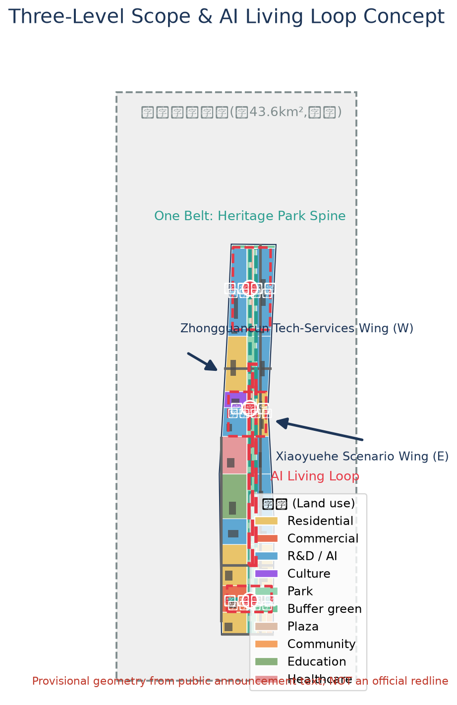
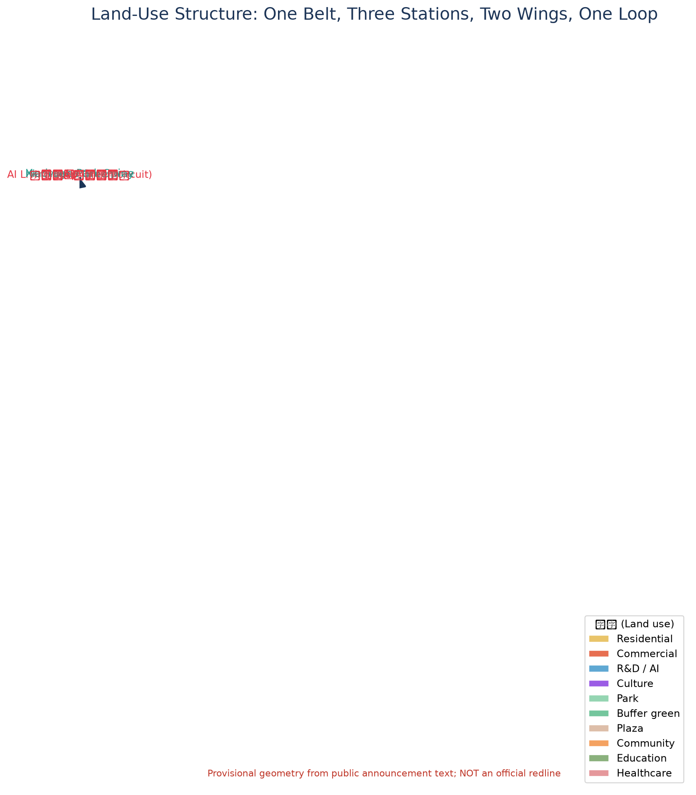
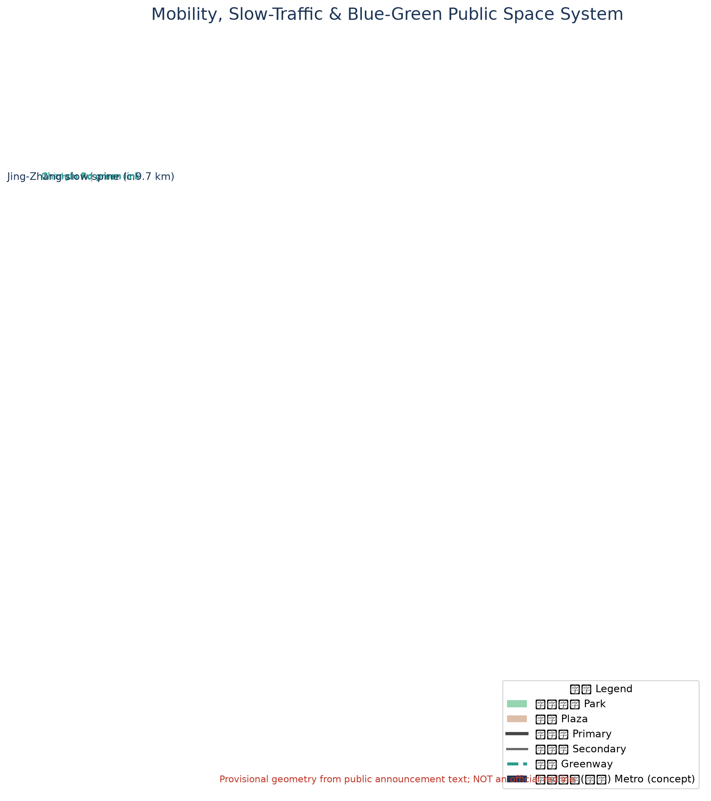
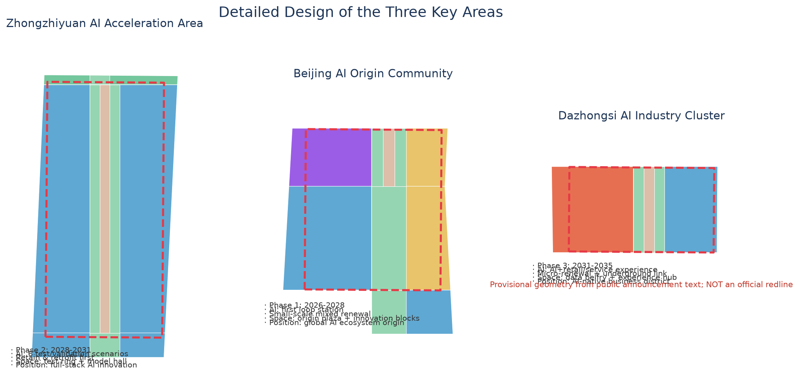
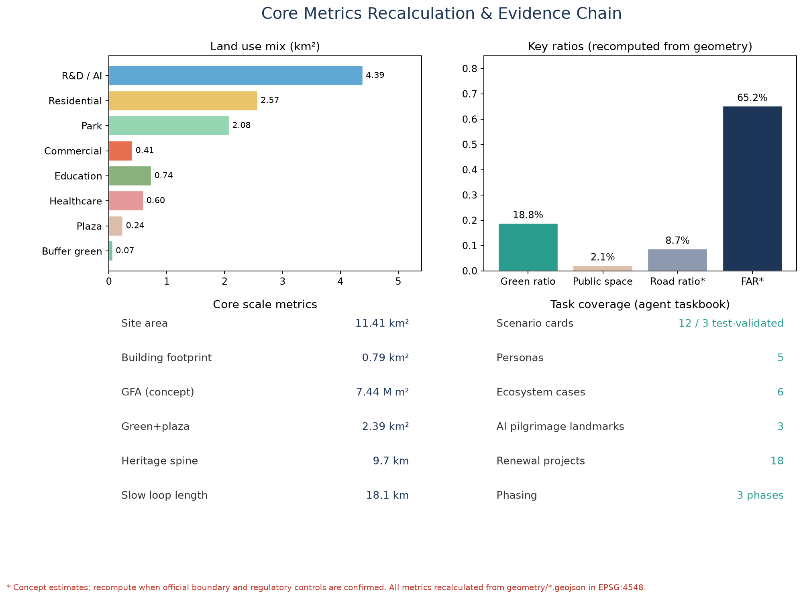

# Jing-Zhang AI Living Loop: Urban Design of the Centennial Jing-Zhang AI Innovation Belt Driven by Railway Heritage and an AI Scenario Circuit

## Design Basis and Source List

This proposal takes as its controlling basis the Pre-qualification Announcement of the International Urban Design Open Call for the Centennial Jing-Zhang AI Innovation Belt issued by the Haidian Branch of the Beijing Municipal Commission of Planning and Natural Resources (A0-level official public material), together with the user-provided and cleared Agent Taskbook Extract for the open-source call to global agents, and the Beijing Municipal Science and Technology Commission / Zhongguancun Administrative Committee report on the "three areas, two wings" industrial context (background material) as supplementary context [source:DATA-SRC-OFFICIAL-ANNOUNCEMENT-20260509] [source:DATA-SRC-AGENT-TASKBOOK-20260518] [source:DATA-SRC-BJ-KW-THREE-AREAS-20260403].

All spatial data used in this proposal are **provisional constraints** generated by repository maintainers from the announcement's textual boundaries and approximate areas: neither the coordinated research area, the overall design area, nor the three key areas has an official polygon. All area recalculation in this proposal is based on these provisional boundaries and is computed in EPSG:4548; conclusions are for concept discussion and graphics only, and do not constitute an official redline, an approval basis, or precise-area commitments. Once the official SITE_BOUNDARY and KEY_AREA polygons are published, the land-use partition, buildings, roads, green space, and every metric must be recalculated [source:DATA-SRC-PROVISIONAL-BOUNDARIES-20260605] [depth:metrics_recalculation].

Source use follows the usage boundaries registered in `data/source_registry.json`: 7 sources usable for formal material, 1 background-only source, and 1 provisional-only source; background and provisional material must not be upgraded into official boundaries, statutory controls, or implementation commitments [source:SOURCE-REGISTRY]. All spatial suggestions required by the agent taskbook are phrased as conceptual suggestions, reference schemes, or material for professional teams to deepen [standard:PROJECT-AGENT-OPEN-CALL-TASKBOOK]. Full professional-standard, design-depth, and task coverage is recorded in `standard_matrix.json`, `design_depth_matrix.json`, and `compliance_matrix.json`; this section does not repeat machine indexes.

## Three-Level Scope Framework

Following the announcement, the proposal adopts a three-level scope framework that resolves industrial strategy, overall urban design, and key-area detailed design in sequence [source:DATA-SRC-OFFICIAL-ANNOUNCEMENT-20260509] [depth:three_level_scope_framework]:

- **Coordinated research area (approx. 43.6 km²)**: bounded by the North 5th Ring Road on the north, the Jing-Zhang (Jingzang) Expressway on the east, Xizhimen Outer Street on the south, and Wanquanhe Road on the west. Its goal is industry and future-city research for the three positionings—"Centennial Jing-Zhang Cultural Belt, Metropolitan AI Living Experience Belt, AI Integration and Innovation Belt"—delivering an innovation-ecosystem map, naming system, indicator system, and spatial organisation strategy.
- **Overall design area (approx. 11.4 km²)**: the urban and industrial areas within 1–2 km around the Jing-Zhang heritage railway park. Its goal is urban-renewal design at regulatory-planning urban-design depth, delivering spatial structure, land-use layout, building scale, transport and rail, blue-green space, urban character, and a renewal-project list. `geometry/land_use.geojson` is the complete land-use partition of this area: **11,412,825 m²**, consistent with the announced approx. 11.4 km² [metric:site_area_sqm] [data:geometry/land_use.geojson].
- **Key detailed design area (approx. 368.4 ha)**: from north to south, the Zhongzhiyuan AI Acceleration Area (approx. 192.1 ha), the Beijing AI Origin Community (approx. 104.3 ha), and the Dazhongsi AI Industry Cluster (approx. 72.0 ha), designed to the depth of a comprehensive implementation plan [metric:key_area_count] [data:geometry/key_areas.geojson#PROV-KEY-001].

The three levels close in on each other: the research level answers "where the belt should go" strategically, the overall level answers "how the belt is organised", and the key-area level answers "how the stations land". The three key-area polygons are provisional rough polygons shown dashed; when replaced by official polygons, all key-area land use, buildings, and metrics must be recalculated [source:DATA-SRC-PROVISIONAL-BOUNDARIES-20260605] [depth:existing_conditions_diagnosis].

## Coordinated Research Area: Industry and Future City Research

### Three Positionings and the Overall Concept

This proposal advances the overall concept of the "**Jing-Zhang AI Living Loop**", resolving the three positionings into one walkable, testable, experiential spatial circuit: the **Centennial Jing-Zhang Cultural Belt** maps to the heritage-park vitality spine; the **Metropolitan AI Living Experience Belt** maps to the AI living loop connecting the three stations; the **AI Integration and Innovation Belt** maps to the full-chain spatial organisation of R&D–testing–industry–services [source:DATA-SRC-AGENT-TASKBOOK-20260518] [standard:PROJECT-AGENT-OPEN-CALL-TASKBOOK]. The concept rejects "sticking an AI label on a conventional park" and insists on AI-native scenarios, multi-agent collaboration, and accumulation of public knowledge.

The five functions map to spatial carriers as follows [depth:overall_spatial_structure]:

| Five functions | Spatial carrier |
|---|---|
| Full-stack independent AI innovation | Zhongzhiyuan AI Acceleration Area |
| World-class AI innovation ecosystem | Beijing AI Origin Community |
| AI+ scenario empowerment paradigm | Xiaoyuehe Scenario Wing |
| Intelligent, vibrant AI city | AI living loop and heritage-park vitality spine |
| Global discourse on AI governance | Origin Community governance field and global release mechanism |

### Three Areas, Two Wings: A Synergy Circuit

The three areas and two wings form an industry–scenario synergy circuit: "Zhongzhiyuan → Origin Community → Dazhongsi → (Xiaoyuehe) → (Zhongguancun) → Zhongzhiyuan". Zhongzhiyuan provides full-stack innovation and testing capability; the Origin Community provides the ecosystem and release platform; Dazhongsi provides AI-native consumption and scenario validation; the Zhongguancun tech-services wing provides capital, factors, and IP empowerment; the Xiaoyuehe scenario wing provides scenario testing and a vibrant city interface [source:DATA-SRC-BJ-KW-THREE-AREAS-20260403]. The circuit is both an industry cycle and a talent-flow path; spatially, the heritage-park spine and Xiaoyuehe greenway act as "tracks", and the Zhichun Road and Chengfu Road green links act as "switches", forming a legible closed loop.

### Global AI Innovation Ecosystem Cases and Lessons

Six global ecosystem cases are selected; lessons are distilled into spatial, operational, and scenario mechanisms, without fabricating company lists or investment figures [source:DATA-SRC-AGENT-TASKBOOK-20260518]:

1. **Palo Alto, Silicon Valley (Stanford–University Avenue)**: campus–city symbiosis and low-rise high-density entrepreneurial blocks. Lesson: the Origin Community should adopt small-scale courtyard blocks where universities, start-ups, and community public space are mutually visible.
2. **Kista Science City, Sweden**: a single-industry corridor transitioning to a mixed "life-innovation" district. Lesson: the Dazhongsi and Zhichun Road industrial belts need balanced living services and public space to avoid hollowing out.
3. **Punggol Digital District, Singapore**: the district as a testing ground, with digital twinning and autonomous-driving demonstrations. Lesson: the Xiaoyuehe wing should operate as a city-level testing sandbox.
4. **Pangyo Techno Valley, Korea**: government-led innovation policy park combined with community facilities. Lesson: the Zhongguancun tech-services wing embeds policy and capital service interfaces.
5. **Yunqi Town, Hangzhou, China**: an industry–event–space reciprocity anchored on an annual conference. Lesson: the Jing-Zhang AI Developer Conference should be bound to spatial nodes such as the Origin Plaza and the Model Hall.
6. **Shanghai Modelfield (large-model developer community), China**: vertical community operations and open-source ecosystems. Lesson: Zhongzhiyuan should host a developer community lab and open-source showcase space.

### Naming System and Logo Direction

Primary name: **Jing-Zhang AI Living Loop** (Chinese: 京张AI生活回路), short form "the Loop". The naming system has three levels: One Belt (heritage-park vitality spine), Three Stations (Zhongzhiyuan Station·Full-Stack Innovation, Origin Station·Origin Living, Dazhongsi Station·Scenario Experience), and Two Wings (Zhongguancun tech-services wing, Xiaoyuehe scenario wing). The logo direction is "**railway sleeper × neural nodes**": a horizontal baseline of Jing-Zhang sleepers with vertical neural-network pulses, expressing the succession of century-old engineering heritage and AI culture; the visual-identity system (typography, colours, usage rules) must be completed during design development, and no enterprise marks, portraits, or fonts are used without authorisation [source:DATA-SRC-AGENT-TASKBOOK-20260518] [depth:height_massing_character].

## Overall Design Area: Urban Renewal and Regulatory-Plan-Level Urban Design

### Spatial Structure and Land-Use Layout

The overall spatial structure is "**One Belt, Three Stations, Two Wings, One Loop**": One Belt is the heritage-park vitality spine (approx. 9.7 km); Three Stations are the station-style nodes of the three key areas; Two Wings are the Zhongguancun tech-services wing (west) and the Xiaoyuehe scenario wing (east); One Loop is the **AI living loop** enclosed by the heritage spine, the Xiaoyuehe greenway, and the Zhichun and Chengfu Road green links [depth:overall_spatial_structure] [data:geometry/green_space.geojson].

The land-use layout covers the entire overall design area with no gaps and no overlaps [data:geometry/land_use.geojson] [metric:land_use_mix]:

- **R&D land (0802) approx. 438.97 ha (38.5%)**: concentrated in Zhongzhiyuan, the Zhichun Road belt, the Xueyuan Road belt, and the east bank of Xiaoyuehe, forming the industrial core.
- **Residential land (0701) approx. 257.30 ha (22.5%)**: western urban areas, the Origin Community, and the southern portal, supporting jobs–housing balance.
- **Park land (1401) approx. 208.10 ha (18.2%)**: the heritage spine, Xiaoyuehe greenway, and the two green links form the blue-green skeleton.
- **Commercial (05) approx. 41.10 ha, education (0804) approx. 73.75 ha, healthcare (0806) approx. 59.99 ha, culture (0803) approx. 22.47 ha, community services (0702) approx. 8.29 ha, plazas (1403) approx. 24.49 ha, protective green (1402) approx. 6.81 ha**.

### Urban Renewal Framework and Retain/Renovate/Demolish Logic

Renewal follows the principle "**retain first, renovate mainly, build sparingly, demolish cautiously**" [depth:retain_renovate_demolish]: historical fabric beside the heritage park, universities, and existing industrial parks are primarily retained with functional replacement; industrial buildings along Zhichun and Xueyuan Roads are primarily renovated; limited new landmarks (conceptual suggestions) are placed only at the Origin Community centre and the three station nodes, without parcel-level demolition or renovation conclusions. All retain/renovate/demolish statements are conceptual suggestions and deepening directions, not substitutes for implementation conclusions [standard:MOHURD-CONTROL-DETAILED-PLANNING].

### Building Scale and Development Intensity (Concept)

Within the provisional boundary, `geometry/buildings.geojson` places 22 conceptual building footprints with a total footprint of approx. 0.79 km² (6.9% of the site); using concept storey counts by use (R&D 12, residential 8, commercial 6, etc.), total floor area is estimated at approx. 7.44 million m², with a concept FAR of approx. 0.65 [metric:concept_far] [data:geometry/buildings.geojson]. These are **conceptual estimates**: the announcement does not provide approved regulatory-plan FAR, height, density, or setback controls; official control conditions must be recalculated once official attachments are available and must not be treated as approved indicators [source:DATA-SRC-OFFICIAL-ANNOUNCEMENT-20260509] [depth:development_intensity_controls].

### Heritage-Park Vitality Spine and Urban Character

The heritage-park vitality spine carries three functions—railway-heritage display, AI public space, and the slow-mobility spine: the heritage railway alignment is retained as a commemorative axis (schematic line in the `CON-RAIL-LINE` feature of `constraints.geojson`), with cultural displays, scenario installations, and community sports facilities on both sides [data:geometry/constraints.geojson#CON-RAIL-LINE] [depth:blue_green_public_space]. The urban character uses a base of "**light-toned R&D buildings + rust-red cultural accents + continuous greenery**"; building heights rise in steps from the park axis outward, and height controls for new buildings in the key areas are pending regulatory-plan confirmation (no numerical conclusion is preset) [standard:MOHURD-URBAN-DESIGN-MEASURES].

## Detailed Design of Key Areas

Each key area is organised as a readable mini-scheme of "positioning + spatial structure + building renewal + mobility and slow traffic + public space + AI scenarios + implementation risks"; the area polygons are provisional rough ranges and the conclusions are directional design [data:geometry/key_areas.geojson] [depth:three_key_area_detailed_design].

### Zhongzhiyuan AI Acceleration Area (approx. 192.1 ha)

- **Positioning**: full-stack AI innovation and test-validation core, hosting the release venue for global AI-governance discourse.
- **Spatial structure**: dual cores of a "full-stack test ring + model hall"; the ring accommodates training, evaluation, simulation, and validation facilities (conceptual suggestion).
- **Building renewal**: renovation of existing R&D buildings first, with a conceptual "Full-Stack Echo" Model Hall landmark in the centre; no demolition conclusions.
- **Mobility**: the heritage spine's northern segment runs through the east side; slow loop and vehicular loop are separated.
- **Public space**: the Zhongzhiyuan Station plaza (1403) and a central test green corridor.
- **AI scenarios**: six industrial test-validation scenarios (see Chapter 6), including large-model evaluation, robotics testing, and autonomous delivery.
- **Risks**: diversified ownership on site; use "scenario tenancy agreements" instead of large-scale engineering; pending building inventory and ownership data.

### Beijing AI Origin Community (approx. 104.3 ha)

- **Positioning**: the origin of a world-class AI innovation ecosystem and a world-class release platform—the "first station" of the AI living loop.
- **Spatial structure**: "Origin Plaza + innovation courtyard blocks": the plaza is the release and pilgrimage core; the blocks are small-scale mixed innovation streets.
- **Building renewal**: retain the courtyard fabric, convert functions to innovation workshops, community labs, and talent apartments; a conceptual Origin Plaza landmark at the centre.
- **Mobility**: a pedestrian-priority district integrated with the Chengfu Road metro concept node.
- **Public space**: Origin Plaza (1403, approx. 6.4 ha) and the "Jing-Zhang Zero Kilometre" commemorative node.
- **AI scenarios**: origin living experience, intelligent landscape installations, AI health kiosks, and other living scenarios land first.
- **Risks**: close to universities and existing communities; renewal requires phasing, negotiation, and public participation; the provisional in-loop area of 1.043 million m² matches the announced value [metric:beijing_ai_origin_community_area_sqm].

### Dazhongsi AI Industry Cluster (approx. 72.0 ha)

- **Positioning**: AI-native new-business district and scenario-experience terminal.
- **Spatial structure**: "Data Belfry + Experience Station": commercial micro-renewal + station plaza + underground connection (underground works are a concept direction only, not a feasibility conclusion).
- **Building renewal**: façade and function renewal of the commercial district; no demolition presuppositions.
- **Mobility**: slow-traffic upgrade of Dazhongsi Road (concept) connected to the metro concept node.
- **Public space**: Dazhongsi Station plaza (1403) and the "Data Belfry" landmark.
- **AI scenarios**: consumer-facing validation of AI+retail, AI+legal, AI+life services.
- **Risks**: fragmented ownership and coupling with rail-construction sequencing require confirmation of commercial and engineering conditions.

## AI Innovation Ecosystem, Personas, and AI+ Scenarios

### User Personas (5)

| Persona | Needs and behaviour | Main spaces |
|---|---|---|
| Young AI engineer (25–32) | jobs–housing integration, 24-hour labs, rail commute | Zhongzhiyuan Station, Origin blocks |
| University researcher (40–55) | university–industry collaboration, releases and evaluation, quiet workspaces | Origin Community, Xueyuan Road belt |
| Tech founder (28–40) | financing, scenario testing, brand exposure | Zhongguancun services wing, Xiaoyuehe wing |
| Local residents and seniors (55–75) | barrier-free parks, community services, health and safety | heritage park, community stations |
| Developers and visitors (18–35) | events, check-ins, open-source participation, new experiences | three station plazas and AI pilgrimage nodes |

### AI Scenario Cards (12, including 4 industrial test-validation scenarios)

| # | Scenario card | Type | Spatial anchor | Users | Data and privacy boundary | Human review | Operator |
|---|---|---|---|---|---|---|---|
| 1 | Heritage-park AI shuttle loop | AI+transport | heritage spine greenway | residents/visitors | vehicle data anonymised | safety officer review | platform operator + transport authority |
| 2 | Model Hall public evaluation ground | industrial test-validation | Zhongzhiyuan Model Hall | firms/developers | evaluation sets anonymised | expert jury | park operator + evaluation body |
| 3 | Humanoid-robot testing street | industrial test-validation | Zhongzhiyuan test ring | firms/developers | behaviour data anonymised | security duty staff | park operator + public security |
| 4 | Autonomous-delivery testing lane | industrial test-validation | Xiaoyuehe testing lane | firms/residents | trajectory data anonymised | administrator review | platform operator |
| 5 | Multi-agent simulation sandbox | industrial test-validation | Xiaoyuehe digital-twin platform | researchers/firms | synthetic data first | model audit | operator + academic committee |
| 6 | AI health kiosk | AI+healthcare | Origin Community/community stations | residents/seniors | health data stays in-domain | doctor review | health institution |
| 7 | AI learning workshop | AI+education | Xueyuan Road education belt | students/teachers | learning data anonymised | teacher review | education institution |
| 8 | AI legal service station | AI+law | Dazhongsi Station | firms/citizens | case data anonymised | licensed lawyer review | bar association + judiciary |
| 9 | AI-native convenience store | AI+life services | three stations and blocks | residents | consumption data anonymised | store manager review | merchants |
| 10 | Origin Plaza intelligent landscape installations | AI+public space | Origin Plaza | public | visual aggregate statistics only | site patrol | public-space operator |
| 11 | Xiaoyuehe digital-twin water governance | AI+city governance | Xiaoyuehe greenway | water authority/public | hydrology data public | water authority review | water authority |
| 12 | Distributed computing-energy microgrid | AI+infrastructure | Zhongzhiyuan/Xiaoyuehe | parks/residents | energy data anonymised | energy audit | energy operator |

Each scenario card maps to a visualisation layer in `visual/index.html` and a source record in `sources.json`; immature technology is not presented as fully deployable [source:DATA-SRC-AGENT-TASKBOOK-20260518] [depth:three_key_area_detailed_design].

## Land Use, Building Scale, and Retain-Renovate-Demolish Strategy

The land-use layout and retain/renovate/demolish logic are set out in Chapter 4; this chapter adds supply and operation strategy: R&D space is standardised as "divisible, testable, presentable", commercial space as "experience-first", and residential space as "jobs–housing integration for talent". All area proportions are reproducible from `geometry/*.geojson` in EPSG:4548 [metric:land_use_mix] [depth:land_use_layout]. Existing-building inventory, ownership, engineering conditions, and regulatory-plan indicators are all pending confirmation; the proposal presets no parcel-level conclusions [standard:MOHURD-CONTROL-DETAILED-PLANNING].

## Transport, Rail, Municipal Infrastructure, and Public Services

- **Road micro-circulation**: Xueyuan Road–Xitucheng Road as the arterial, with Zhichun Road, Chengfu Road, and Dazhongsi Road as secondary roads, forming a grid; the heritage spine and waterfront greenway are fully separated from motorised traffic (conceptual centre-lines in `geometry/roads.geojson`) [data:geometry/roads.geojson].
- **Transit-station integration**: TOD-style integration is reserved at six conceptual metro nodes (Dazhongsi, Zhichun Road, Xitucheng, Xueyuan Bridge, Chengfu Road, Zhongzhiyuan), as concept locations only [data:geometry/constraints.geojson#CON-METRO-01].
- **Slow-traffic gaps**: the Zhichun and Chengfu green links stitch the heritage spine to the eastern city, repairing current gaps (pending field survey).
- **Parking and non-motorised traffic**: park-and-ride and shared-bike depots at the three stations; night-time freight encouraged.
- **New infrastructure**: edge-computing nodes, distributed energy microgrids, and a digital-twin platform along the Xiaoyuehe wing and Zhongzhiyuan (concept); conventional utilities to be checked against regulatory plans once official data is supplied [depth:municipal_new_infrastructure].
- **Innovation and living services**: the Zhongguancun tech-services wing hosts capital, legal, open-source, and data-service interfaces; community stations and AI health kiosks are balanced on both sides of the heritage park [depth:traffic_rail_slow_parking].

## Blue-Green Network, Public Space, and Urban Character

The blue-green system comprises the **heritage-park vitality spine (the approx. 208.1 ha park-green skeleton), the Xiaoyuehe blue-green belt, and the Zhichun/Chengfu green links**; green and plazas total approx. 2,389,046 m², with a green ratio of 18.8% and a public-space ratio of 2.1% (recomputed from geometry) [metric:green_ratio] [metric:public_space_ratio] [data:geometry/green_space.geojson]. The AI living loop is approx. 18.1 km in total (9.7 km heritage spine + 8.4 km Xiaoyuehe greenway + two green links) [metric:loop_greenway_length_m].

**AI pilgrimage landmarks (3, all conceptual suggestions, not presented as approved construction)** [source:DATA-SRC-AGENT-TASKBOOK-20260518]:

1. **"Jing-Zhang Zero Kilometre" Origin Milestone** (Origin Plaza): overlapping the imagery of the centennial Jing-Zhang railway origin with the AI origin, becoming the start point for developer check-ins and releases.
2. **"Full-Stack Echo" Model Hall** (Zhongzhiyuan Station front): the "cathedral" of annual model releases and honour displays.
3. **"Data Belfry"** (Dazhongsi Station front): a bell-tower form expressing data rhythm and the scenario clock.

**Honour display system**: the "Bit Waterfront" honour wall at Xiaoyuehe and the Xueyuan Road developer honour roll, as updatable public interfaces for open-source contributions, evaluation leaderboards, and annual awards; all portraits, company, and work marks require authorisation before display [depth:blue_green_public_space].

Urban character follows the base established in Chapter 4: a three-colour system of rust red (heritage), light grey-white (R&D), and green (parks); rooftops host testable drone-grid and photovoltaic interfaces (concept); cultural carriers include station nameplates, sleeper paving, and signal-lamp installations as a signage system [standard:MOHURD-URBAN-DESIGN-MEASURES].

## Renewal Projects, Implementation Policy, and Phasing

**Renewal project list (18 conceptual projects)**: Origin Plaza renewal; Origin courtyard functional replacement; Origin Community AI health kiosk; Model Hall new build (concept); Zhongzhiyuan test ring; Zhongzhiyuan developer community lab; Data Belfry (concept); Dazhongsi commercial façade renewal; Zhichun green link completion; Chengfu green link completion; heritage-park south segment activation; heritage-park north segment activation; Xiaoyuehe waterfront greenway; autonomous-delivery testing lane; digital-twin water governance platform; three station plazas; park-and-ride hubs; distributed energy microgrid. Project type, spatial location, dependencies, and implementing entities are recorded in `compliance_matrix.json` and the A3 booklet [depth:renewal_project_list].

**Phasing** (see `geometry/phasing.geojson`) [data:geometry/phasing.geojson] [depth:phasing_implementation]:

| Phase | Period | Scope | Area (m²) | Focus |
|---|---|---|---|---|
| Near term | 2026–2028 | Origin Community + central park segment + two green links | 6,118,142 | Origin first station, loop completion |
| Medium term | 2028–2031 | Zhongzhiyuan full-stack area + north segment | 2,386,020 | test-validation, model releases |
| Long term | 2031–2035 | Dazhongsi + southern portal | 2,836,097 | scenario experience, commercial upgrade |

**Long-term operations and event system**: an annual rhythm of "one spring, one summer, one autumn, one winter"—March Jing-Zhang AI Developer Conference, June Open Origin day, October Jing-Zhang AI Living Festival, December Annual Model Release Night; the developer community operates through "open-source ambassadors + developer passes + testing-lane reservations"; scenario operations are secured by "tenancy agreement + human review"; international outreach uses an AI-city network and an annual white paper as an attraction-and-conversion mechanism. All are conceptual suggestions and deepening directions, not confirmed government arrangements [source:DATA-SRC-AGENT-TASKBOOK-20260518] [standard:PROJECT-AGENT-OPEN-CALL-TASKBOOK].

## Metrics, Area Recalculation, and Compliance Matrix

Core indicators and their design meanings are as follows (all recomputed from `geometry/*.geojson` in EPSG:4548, see `metrics.json`) [depth:metrics_recalculation]:

- **Green ratio 18.8%**: the continuous blue-green skeleton supporting talent living and innovation interaction, mainly from the heritage park and the two green links [metric:green_ratio].
- **Public-space ratio 2.1%**: the three station plazas form the "living room" for releases, pilgrimage, and assembly [metric:public_space_ratio].
- **R&D share 38.5%**: the main body of industrial space supply supporting full-stack AI innovation [metric:land_use_mix].
- **Concept FAR 0.65**: building scale responds to industrial space supply and skyline control; to be recalculated after regulatory-plan confirmation [metric:concept_far].
- **Heritage spine 9.7 km / loop 18.1 km**: spatial expression of slow-traffic connectivity and scenario continuity [metric:spine_greenway_length_m] [metric:loop_greenway_length_m].
- **Key-area areas**: Zhongzhiyuan 1.929 million m², Origin Community 1.043 million m², Dazhongsi 0.720 million m², consistent with the announced values (based on provisional boundaries) [metric:zhongzhiyuan_ai_acceleration_area_sqm] [metric:beijing_ai_origin_community_area_sqm] [metric:dazhongsi_ai_industry_cluster_area_sqm].

Compliance coverage: every task in sections 1.3/1.4/1.5 of the announcement and all six agent tasks (agent.1–agent.6) are registered in `compliance_matrix.json`; all nine mandatory professional standards are answered in `standard_matrix.json`; all fifteen design-depth items are complete in `design_depth_matrix.json` [source:DATA-SRC-OFFICIAL-ANNOUNCEMENT-20260509] [source:DATA-SRC-AGENT-TASKBOOK-20260518].

## Risks, Copyright, and Compliance

1. **Material legality**: this proposal uses only public, cleared, or user-provided cleared material; it contains no non-public drawings, internal indicators, or personal privacy data; see `sources.json` and `report/copyright_statement.md` [source:SOURCE-REGISTRY].
2. **Copyright and marks**: the logo is a directional concept; no unauthorised fonts, images, trademarks, portraits, or company marks are used; marks involved in cultural displays require case-by-case authorisation.
3. **AI generation responsibility**: this proposal was generated by an AI agent; the generation method and model are disclosed in `agent.json` and `manifest.json`; all spatial suggestions are conceptual and do not constitute engineering feasibility, approvals, or implementation commitments [standard:GENERATIVE-AI-INTERIM-MEASURES].
4. **No official-approval claims**: this proposal must not be presented as an approved plan, confirmed construction, or government commitment; all FAR, height, retain/renovate/demolish, and redline content are pending confirmation.
5. **Missing data**: official boundaries, key-area polygons, regulatory-plan indicators, existing-building inventory and ownership, and municipal engineering conditions are pending; recalculation will be triggered per `assumptions.json` [depth:risk_missing_data].
6. **Professional review requirement**: the proposal requires deepening and review by professional planning, architecture, transport, and engineering teams before any formal use.

## References

1. Haidian Branch, Beijing Municipal Commission of Planning and Natural Resources: Pre-qualification Announcement of the International Urban Design Open Call for the Centennial Jing-Zhang AI Innovation Belt (2026-05-09).
2. User-provided and cleared: Agent Taskbook Extract for the open-source call to global agents (2026-05-18).
3. Beijing Municipal Science and Technology Commission / Zhongguancun Administrative Committee: "Three Areas, Two Wings: Building a World-Class AI Cluster" (2026-04-03, background material).
4. Ministry of Housing and Urban-Rural Development: Measures for Urban Design Management (2017).
5. Ministry of Housing and Urban-Rural Development: Measures for the Compilation and Approval of Regulatory Detailed Plans of Cities and Towns (2010).
6. Ministry of Natural Resources: Guide to the Classification of Land for Territorial Spatial Survey, Planning, and Use Control (2023).
7. Ministry of Housing and Urban-Rural Development: Regulations on the Depth of Architectural Engineering Design Document Preparation (2016).
8. Cyberspace Administration of China et al.: Interim Measures for the Management of Generative AI Services (2023).
9. Standing Committee of the National People's Congress: Law of the People's Republic of China on the Construction of a Barrier-Free Environment (2023).
10. State Council General Office et al.: Implementation Plan for Effectively Solving Difficulties of the Elderly in Using Intelligent Technologies (2020).
11. Open-source community references: public reports on Palo Alto, Kista, Punggol Digital District, Pangyo Techno Valley, Yunqi Town, and Shanghai Modelfield (background reference).
12. Repository maintainers: Provisional rough boundaries and key-area polygons of the Centennial Jing-Zhang AI Innovation Belt (2026-06-05, provisional).
