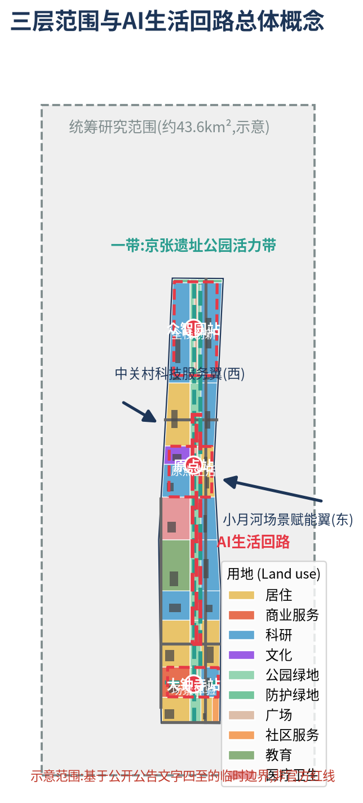
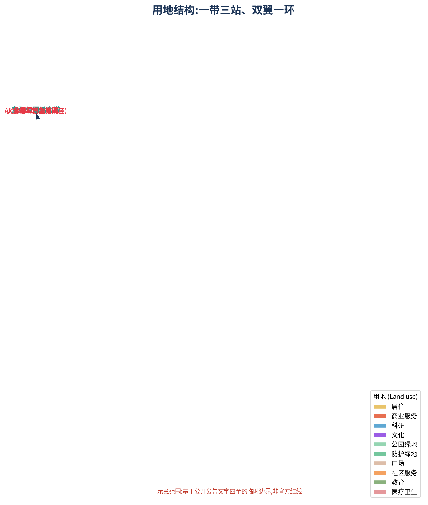
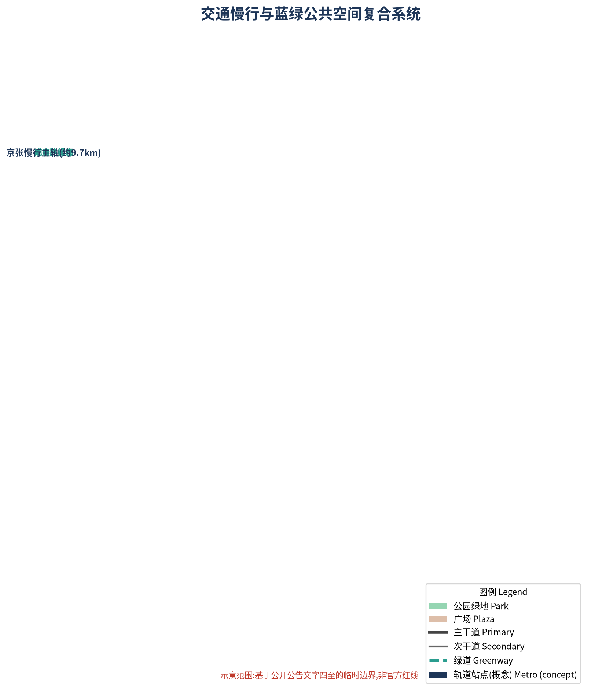
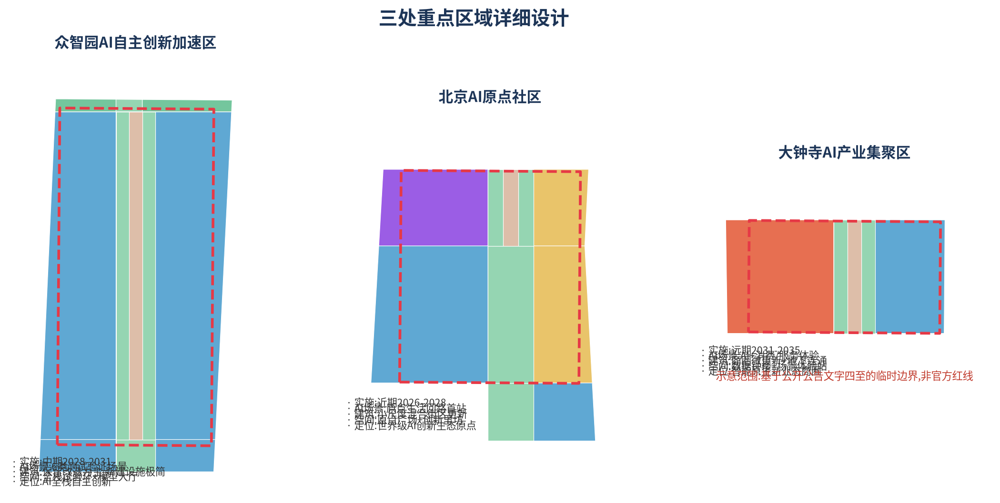
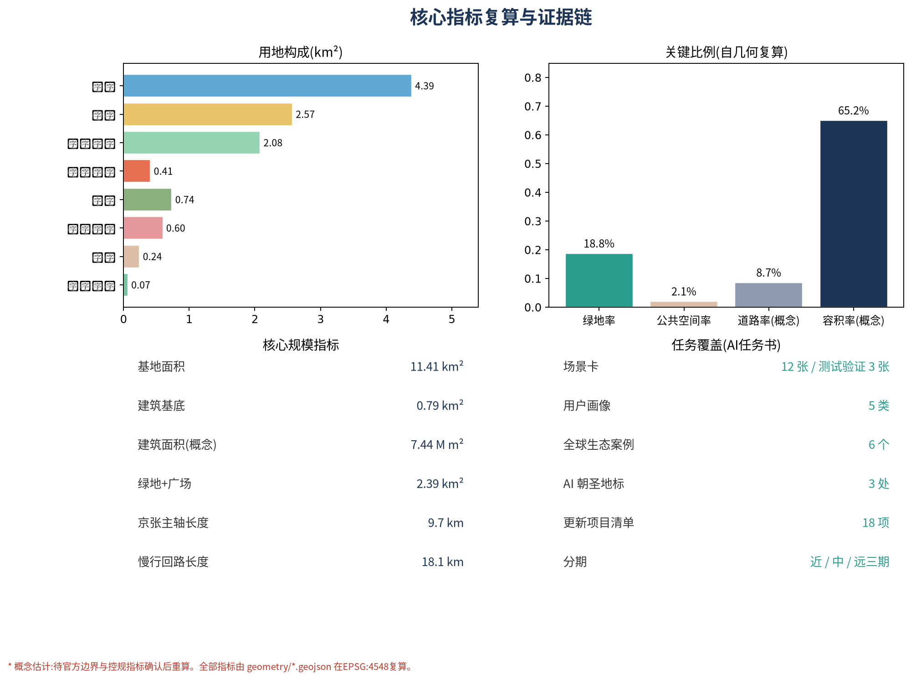

# 京张AI生活回路：轨道遗产与AI场景闭环驱动的百年京张AI创新带城市设计

## 设计依据与资料清单

本方案以北京市规划和自然资源委员会海淀分局《百年京张AI创新带城市设计国际方案征集资格预审公告》(A0 级正式公开资料)为主控依据，以用户提供且已清权的《面向全球智能体开展"百年京张AI创新带城市设计开源征集"任务书摘录》为面向智能体的任务依据，并以北京市科委、中关村管委会"三区两翼"产业语境报道(背景资料)为产业判断的补充语境 [source:DATA-SRC-OFFICIAL-ANNOUNCEMENT-20260509] [source:DATA-SRC-AGENT-TASKBOOK-20260518] [source:DATA-SRC-BJ-KW-THREE-AREAS-20260403]。

方案使用的空间边界为仓库维护者依据公告文字四至与公告约面积生成的**临时粗略边界(provisional constraint)**：统筹研究范围、总体设计范围与三处重点区域均无官方多边形。本方案所有面积复算均基于该临时边界并在 EPSG:4548 下完成，结论只用于概念讨论与图面表达，不构成官方红线、审批依据或精确面积承诺；待官方 SITE_BOUNDARY 与 KEY_AREA 图件发布后，用地分区、建筑、道路、绿地与全部指标需整体重算 [source:DATA-SRC-PROVISIONAL-BOUNDARIES-20260605] [depth:metrics_recalculation]。

资料使用遵循 `data/source_registry.json` 登记的用途边界：formal 可用资料 7 条、背景资料 1 条、provisional-only 资料 1 条；背景与临时资料不得升级为正式边界、法定控制或实施承诺 [source:SOURCE-REGISTRY]。面向智能体任务书要求的所有空间落地建议均按概念建议、参考方案或供专业团队深化研究的口径表述 [standard:PROJECT-AGENT-OPEN-CALL-TASKBOOK]。专业标准响应、设计深度与任务覆盖分别由 `standard_matrix.json`、`design_depth_matrix.json` 与 `compliance_matrix.json` 完整记录，本节不重复机器索引。

## 三层范围工作框架

方案按公告建立三层范围工作框架，逐级落实产业战略、总体城市设计与重点片区详细设计 [source:DATA-SRC-OFFICIAL-ANNOUNCEMENT-20260509] [depth:three_level_scope_framework]：

- **统筹研究范围(约 43.6 km²)**：北至北五环路、东至京藏高速、南至西直门外大街、西至万泉河路。工作目标为"百年京张文化带—都市AI生活体验带—AI融合创新带"三大定位的产业与未来城市研究，输出创新生态图谱、命名体系、指标体系与空间组织策略，成果为策略性研究。
- **总体设计范围(约 11.4 km²)**：以京张遗址公园周边 1–2 公里城市地区和产业区为规划设计范围。工作目标为控规深度城市更新设计，输出空间结构、用地布局、建筑规模、交通轨道、蓝绿空间、风貌控制与更新项目清单。本方案 `geometry/land_use.geojson` 即为该范围的完整用地分区，面积为 **11,412,825 m²**，与公告约 11.4 km² 一致 [metric:site_area_sqm] [data:geometry/land_use.geojson]。
- **重点区域范围(约 368.4 ha)**：自北向南为众智园AI自主创新加速区(约 192.1 ha)、北京AI原点社区(约 104.3 ha)、大钟寺AI产业聚集区(约 72.0 ha)，达到规划综合实施方案的城市设计深度 [metric:key_area_count] [data:geometry/key_areas.geojson#PROV-KEY-001]。

三层范围逐级收口：研究范围回答"带往哪里走"的产业与空间战略，总体范围回答"带如何组织"，重点区域回答"站如何落地"。三处重点区域多边形均为临时粗略范围(provisional rough)，图中以虚线表达；替换为官方多边形后，重点区内用地、建筑与指标须整体重算 [source:DATA-SRC-PROVISIONAL-BOUNDARIES-20260605] [depth:existing_conditions_diagnosis]。

## 统筹研究范围产业与未来城市研究

### 三大定位与总体概念

本方案提出"**京张AI生活回路(Jing-Zhang AI Living Loop)**"总体概念，将三大定位落为一条可步行、可测试、可体验的空间回路：**百年京张文化带**对应京张铁路遗址公园活力轴；**都市AI生活体验带**对应串联三站的AI生活回路；**AI融合创新带**对应科研—测试—产业—服务全链条空间组织 [source:DATA-SRC-AGENT-TASKBOOK-20260518] [standard:PROJECT-AGENT-OPEN-CALL-TASKBOOK]。概念拒绝"给传统园区贴AI标签"，强调AI原生场景、多智能体协作与公共知识沉淀。

五大功能与空间载体对应如下 [depth:overall_spatial_structure]：

| 五大功能 | 空间载体 |
|---|---|
| AI全栈自主创新体系 | 众智园AI自主创新加速区 |
| 世界级AI创新生态 | 北京AI原点社区 |
| AI+场景赋能新范式 | 小月河场景赋能翼 |
| 智能化AI活力城市 | AI生活回路与京张公园活力带 |
| AI治理全球话语权 | 原点社区治理试验场与全球发布机制 |

### 三区两翼协同回路

三区两翼构成"**众智园—原点社区—大钟寺—(小月河)—(中关村)—众智园**"的产业—场景协同回路：众智园提供全栈创新与测试能力，原点社区提供生态与发布平台，大钟寺提供智能原生消费与场景验证，中关村科技服务翼提供资本、要素与IP赋能，小月河场景赋能翼提供场景试验与活力城市界面 [source:DATA-SRC-BJ-KW-THREE-AREAS-20260403]。回路既是产业循环也是人才流动路径，空间上以京张公园主轴与小月河绿带为"轨道"，以知春路、成府路两条绿廊为"道岔"，形成可识别的闭环。

### 全球AI创新生态案例与启示

选取 6 个全球创新生态案例，重点提炼可转化为空间、运营与场景机制的经验，不编造企业名单与投资数据 [source:DATA-SRC-AGENT-TASKBOOK-20260518]：

1. **美国硅谷帕洛阿尔托(斯坦福—大学街街区)**：校地共生与低层高密度创业街区。启示：原点社区宜采用小尺度里坊式街区，让高校、初创企业与社区公共空间互见。
2. **瑞典西斯塔科学城(Kista)**：单一产业走廊向"生活-创新混合"转型。启示：大钟寺与知春路产业带需配比生活服务与公共空间，避免空心化。
3. **新加坡榜鹅数字园区(Pungggol Digital District)**：园区即测试场、数字化孪生与自动驾驶示范区。启示：小月河翼宜整体作为"城市级测试沙盒"。
4. **韩国板桥科技谷(Pangyo)**：政府主导的创新创业政策园区与社区配套结合。启示：中关村科技服务翼以政策与资本服务接口形式嵌入。
5. **中国杭州云栖小镇**：以年度大会为锚点的产业—活动—空间互促。启示：京张AI开发者大会应与原点广场、模型大厅等空间节点绑定。
6. **中国上海模速空间(大模型开发者社区)**：垂直赛道社区化运营与开源生态。启示：众智园宜设开发者社区实验室与开源展示空间。

### 命名体系与Logo方向

主名称**京张AI生活回路**，英文 **Jing-Zhang AI Living Loop**，简名"京张回路"。命名体系分三级：一带(京张遗址公园活力带)、三站(众智园站·全栈创新、原点站·原点生活、大钟寺站·场景体验)、双翼(中关村科技服务翼、小月河场景赋能翼)。Logo 方向为"**轨枕×神经节点**"：以京张铁路轨枕为水平基线，以神经网络节点为竖向脉冲，表达百年工程遗产与AI新文化的接续；视觉识别系统需在设计深化阶段完成字体、色彩与使用规范，未经授权不使用任何企业标识、肖像与字体 [source:DATA-SRC-AGENT-TASKBOOK-20260518] [depth:height_massing_character]。

## 总体设计范围城市更新与控规深度城市设计

### 空间结构与用地布局

总体空间结构为"**一带三站、双翼一环**"：一带即京张遗址公园活力带(约 9.7 km)，三站即三处重点区域的车站式节点，双翼即西侧中关村科技服务翼与东侧小月河场景赋能翼，一环即由京张主轴、小月河绿带与知春路、成府路两条绿廊围合而成的**AI生活回路** [depth:overall_spatial_structure] [data:geometry/green_space.geojson]。

用地布局覆盖全部总体设计范围，无缝隙、无重叠 [data:geometry/land_use.geojson] [metric:land_use_mix]：

- **科研用地(0802)约 438.97 ha(38.5%)**：集中布置于众智园、知春路带、学院路带与小月河东岸，构成产业主体。
- **居住用地(0701)约 257.30 ha(22.5%)**：西侧城市区与原点社区、门户段，支撑职住平衡。
- **公园绿地(1401)约 208.10 ha(18.2%)**：京张主轴、小月河绿带与两条绿廊构成蓝绿骨架。
- **商业服务业(05)约 41.10 ha、教育(0804)约 73.75 ha、医疗卫生(0806)约 59.99 ha、文化(0803)约 22.47 ha、社区服务(0702)约 8.29 ha、广场(1403)约 24.49 ha、防护绿地(1402)约 6.81 ha**。

### 城市更新总体框架与拆改留逻辑

更新遵循"**保留为先、改造为主、新建点缀、拆除审慎**"原则 [depth:retain_renovate_demolish]：京张公园两侧历史肌理、高校院所与现状产业园区以保留与功能置换为主；知春路、学院路沿线产业楼宇以改造提升为主；仅在原点社区中心与三站节点布置有限的新建地标(概念建议，不涉及地块级拆改结论)。所有拆改留表述为概念建议与深化方向，不替代规划实施结论 [standard:MOHURD-CONTROL-DETAILED-PLANNING]。

### 建筑规模与开发强度(概念)

本方案在临时边界内由 `geometry/buildings.geojson` 布置 22 组概念建筑基底，总基底约 79.18 万 m²(占总用地 6.9%，低密度反映公园为主的用地结构)；按分用途概念层数(科研 12 层、居住 8 层、商业 6 层等)估算总建筑面积约 743.72 万 m²，概念容积率约 0.65 [metric:concept_far] [data:geometry/buildings.geojson]。上述数值为**概念估计**：公告未提供批准控规的容积率、高度、密度与退线指标，正式控制条件待官方附件确认后重算，不得作为审定指标；概念建模仅覆盖方案重点建设地块，不包含现状未建模楼宇 [source:DATA-SRC-OFFICIAL-ANNOUNCEMENT-20260509] [depth:development_intensity_controls]。

### 京张公园活力带与城市风貌

京张遗址公园活力带承担"轨道遗产展示+AI公共空间+慢行主轴"三重职能：保留铁路遗址线位作为纪念性轴线(示意线位于 `constraints.geojson` 的京张线位特征)，两侧布置文化展示、场景装置与社区体育设施 [data:geometry/constraints.geojson#CON-RAIL-LINE] [depth:blue_green_public_space]。城市风貌以"**浅色科研建筑+铁锈红文化点缀+连续绿荫**"为基调，建筑高度自公园轴向两侧阶梯抬升，重点区新建建筑高度控制建议待控规确认(不预设数值结论) [standard:MOHURD-URBAN-DESIGN-MEASURES]。

## 重点区域详细设计

三处重点区域均按"定位+空间结构+建筑更新+交通慢行+公共空间+AI场景+实施风险"组织小方案；区域多边形为临时粗略范围，结论为方向性设计 [data:geometry/key_areas.geojson] [depth:three_key_area_detailed_design]。

### 众智园AI自主创新加速区(约 192.1 ha)

- **定位**：AI全栈自主创新与测试验证核心，承担"AI治理全球话语权"的发布场所。
- **空间结构**："全栈试验环+模型大厅"双核，环内布置训练、评测、仿真与验证设施(概念建议)。
- **建筑更新**：以现状科研楼宇改造为主，中部布置概念性"全栈回响"模型大厅地标；不预设具体拆改。
- **交通慢行**：京张主轴北段穿过园区东侧，慢行环与机动车环分离。
- **公共空间**：众智园站前广场(1403)与中央试验绿廊。
- **AI场景**：6 类产业测试验证场景(见第六章)，含大模型评测、机器人试验、无人配送等。
- **实施风险**：园区权属多元，需以"场景入驻协议"替代大规模工程改造；待现状建筑普查与权属资料补齐。

### 北京AI原点社区(约 104.3 ha)

- **定位**：世界级AI创新生态原点与世界级发布平台，AI生活回路的"首站"。
- **空间结构**："原点广场+创新里坊"：广场为发布与朝圣核心，里坊为小尺度混合创新街区。
- **建筑更新**：保留里坊肌理，功能置换为创新工坊、社区实验室与人才公寓；中心新建(概念)原点广场地标。
- **交通慢行**：全步行优先街区，与地铁概念节点(成府路站)一体化接驳。
- **公共空间**：原点广场(1403，约 6.4 ha)与"京张零公里"纪念节点。
- **AI场景**：原点生活体验、智能景观装置、AI健康驿站等生活场景首落。
- **实施风险**：紧邻高校院所与既有社区，更新需分期、协商与公众参与；临时边界内面积 104.3 万 m² 与公告约值吻合 [metric:beijing_ai_origin_community_area_sqm]。

### 大钟寺AI产业聚集区(约 72.0 ha)

- **定位**：智能原生新业态商圈与场景体验终端。
- **空间结构**："数据钟楼+体验站"：商圈微更新+站前广场+地下连通(地下工程仅为概念方向，不构成可行性结论)。
- **建筑更新**：以商圈建筑立面与功能更新为主，不预设拆除。
- **交通慢行**：大钟寺路慢行化改造(概念)，与轨道站点概念节点接驳。
- **公共空间**：大钟寺站前广场(1403)与"数据钟楼"地标。
- **AI场景**：AI+零售、AI+法律、AI+生活服务等面向消费者的场景验证。
- **实施风险**：商圈产权分散、轨道交通施工时序耦合，需商务与工程条件确认。

## AI 创新生态、人才画像与 AI+ 场景

### 用户画像(5 类)

| 画像 | 需求与行为 | 主要空间 |
|---|---|---|
| 青年AI工程师(25-32岁) | 职住一体、24小时实验室、通勤轨道 | 众智园站、原点里坊 |
| 高校科研人员(40-55岁) | 校企协作、发布与评测、安静工作空间 | 原点社区、学院路带 |
| 科技创业者(28-40岁) | 融资对接、场景测试、品牌曝光 | 中关村服务翼、小月河翼 |
| 本地居民与老年群体(55-75岁) | 无障碍公园、社区服务、健康与安全 | 京张公园、社区服务站 |
| 开发者/游客(18-35岁) | 活动、打卡、开源参与、体验新业态 | 三站广场与AI朝圣节点 |

### AI场景卡(12 张,含 4 张产业测试验证场景)

| # | 场景卡 | 类型 | 空间落点 | 服务对象 | 数据与隐私边界 | 人工复核 | 运营主体 |
|---|---|---|---|---|---|---|---|
| 1 | 京张公园AI接驳环 | AI+交通 | 京张主轴绿道 | 居民/游客 | 车辆数据脱敏 | 安全员复核 | 平台运营方+交通部门 |
| 2 | 模型大厅公开评测场 | 产业测试验证 | 众智园模型大厅 | 企业/开发者 | 评测集脱敏 | 专家评审团 | 园区运营+评测机构 |
| 3 | 人形机器人试验街 | 产业测试验证 | 众智园试验环 | 企业/开发者 | 行为数据脱敏 | 安监值守 | 园区运营+公安机关 |
| 4 | 无人配送测试巷 | 产业测试验证 | 小月河翼测试巷 | 企业/居民 | 轨迹数据脱敏 | 管理员复核 | 平台运营方 |
| 5 | 多智能体仿真沙盒 | 产业测试验证 | 小月河翼数字孪生平台 | 科研/企业 | 合成数据为主 | 模型审计 | 运营方+学术委员会 |
| 6 | AI健康驿站 | AI+医疗 | 原点社区/社区服务站 | 居民/老人 | 医疗数据不出域 | 医生复核 | 卫生机构 |
| 7 | AI学习工场 | AI+教育 | 学院路教育带 | 学生/教师 | 学情数据脱敏 | 教师复核 | 教育机构 |
| 8 | AI法律服务站 | AI+法律 | 大钟寺站 | 企业/市民 | 案件数据脱敏 | 执业律师复核 | 律协+司法行政 |
| 9 | 智能原生便利店 | AI+生活服务 | 三站与里坊 | 居民 | 消费数据脱敏 | 店长复核 | 商户 |
| 10 | 原点广场智能景观装置 | AI+公共空间 | 原点广场 | 公众 | 仅视觉聚合统计 | 管理人员巡检 | 公共空间运营方 |
| 11 | 小月河数字孪生治水 | AI+城市治理 | 小月河绿带 | 水务部门/公众 | 水文数据公开 | 水务复核 | 水务部门 |
| 12 | 分布式算力能源微网 | AI+基础设施 | 众智园/小月河 | 园区/居民 | 能耗数据脱敏 | 能源审计 | 能源运营方 |

每张场景卡均对应 `visual/index.html` 的可视化图层与 `sources.json` 中的来源记录；未成熟技术不表述为已可全面部署 [source:DATA-SRC-AGENT-TASKBOOK-20260518] [depth:three_key_area_detailed_design]。

## 用地、建筑规模与拆改留方案

用地布局与拆改留逻辑见第四章；本节补充空间供给与运营策略。科研空间以"可分割、可测试、可展演"为标准：科研用地(0802)438.97 公顷布置于众智园、知春路带、学院路带与小月河东岸，其概念建筑基底以"核心研发楼+公共测试平台+柔性隔断"组织，保证企业可租用小型单元并共享评测与发布设施 [metric:land_use_mix] [data:geometry/land_use.geojson]。商业空间以"体验前置"为标准：大钟寺商圈(05)41.10 公顷沿站前广场布置展示型店面，智能原生业态先于传统零售招商。居住空间以"人才职住一体"为标准：居住(0701)257.30 公顷与社区服务(0702)8.29 公顷均衡布局于西侧城市区与原点社区，步行 15 分钟覆盖公园与站点。教育(0804)73.75 公顷、医疗(0806)59.99 公顷与文化(0803)22.47 公顷依托学院路高校带与京张公园布置，构成公共服务支撑。全部面积比例可由 `geometry/*.geojson` 在 EPSG:4548 下复算，拆改留遵循"保留为先、改造为主、新建点缀、拆除审慎"，22 组概念建筑基底仅表达重点建设地块的规模量级 [depth:land_use_layout]。现状建筑普查、权属、工程条件与控规指标均为待确认事项，方案不预设地块级结论 [standard:MOHURD-CONTROL-DETAILED-PLANNING]。

## 交通、轨道、市政与公共服务设施

- **道路微循环**：以学院路—西土城路为主干，知春路、成府路、大钟寺路为次干，构成网格；京张主轴与滨水绿道完全机动化分离(概念道路中心线见 `geometry/roads.geojson`) [data:geometry/roads.geojson]。
- **轨道站点一体化**：在 6 处概念轨道节点(大钟寺、知春路、西土城、学院桥、成府路、众智园)预留 TOD 一体化接驳(仅概念定位) [data:geometry/constraints.geojson#CON-METRO-01]。
- **慢行断点**：以知春路、成府路两条绿廊缝合京张主轴与东侧城市，打通现状断点(待现状调查确认)。
- **停车与非机动车**：三站设置停车换乘与共享单车驿站；鼓励货运夜间化。
- **新型基础设施**：端侧算力节点、分布式能源微网与数字孪生平台沿小月河翼与众智园部署(概念)；传统市政(供水排水燃气)按控规校核，待官方资料补齐 [depth:municipal_new_infrastructure]。
- **创新与生活服务**：中关村科技服务翼布置资本、法务、开源与数据服务接口；社区服务站与 AI 健康驿站沿京张公园东西两侧均衡布局 [depth:traffic_rail_slow_parking]。

## 蓝绿空间、公共空间与城市风貌

蓝绿系统由**京张公园活力带(约 208.1 ha 公园绿地骨架)+小月河蓝绿带+知春路/成府路绿廊**构成，绿地与广场合计约 2,389,046 m²，绿地率 18.8%、公共空间率 2.1%(自几何复算) [metric:green_ratio] [metric:public_space_ratio] [data:geometry/green_space.geojson]。AI生活回路全长约 18.1 km(京张主轴 9.7 km+小月河绿道 8.4 km+两条绿廊) [metric:loop_greenway_length_m]。

**AI 朝圣地标(3 处,均概念建议,不表述为已批准建设)** [source:DATA-SRC-AGENT-TASKBOOK-20260518]：

1. **"京张零公里"原点半程石**(原点广场)：以百年京张铁路起点意象与 AI 原点意象叠合，成为开发者打卡与发布起点。
2. **"全栈回响"模型大厅**(众智园站前)：年度模型发布与荣誉展示的"圣殿"。
3. **"数据钟楼"**(大钟寺站前)：以钟楼形态表达数据节律与场景时钟。

**荣誉展示体系**：小月河"比特水岸"荣誉墙与学院路开发者光荣榜，以可更新的公共界面展示开源贡献、评测榜单与年度奖项；所有人物、企业与作品标识须经授权后方可展示 [depth:blue_green_public_space]。

城市风貌延续第四章基调：铁锈红(遗产)、浅灰白(科研)、绿荫(公园)三色系统；屋顶以可测试的无人机组网与光伏界面为主(概念)；文化表达载体包括站名牌、轨枕铺装、信号灯装置等符号系统 [standard:MOHURD-URBAN-DESIGN-MEASURES]。

## 更新项目清单、实施政策与分期计划

**更新项目清单(18 项概念项目)**：原点广场更新、原点里坊功能置换、原点社区AI健康驿站、模型大厅新建(概念)、众智园试验环、众智园开发者社区实验室、数据钟楼(概念)、大钟寺商圈立面更新、知春路绿廊贯通、成府路绿廊贯通、京张公园南段活化、京张公园北段活化、小月河滨水绿道、无人配送测试巷、数字孪生治水平台、三站站前广场、停车换乘枢纽、分布式能源微网。项目类型、空间位置、依赖条件与实施主体见 `compliance_matrix.json` 与 A3 文册 [depth:renewal_project_list]。

**分期计划**(对应 `geometry/phasing.geojson`) [data:geometry/phasing.geojson] [depth:phasing_implementation]：

| 分期 | 时间 | 范围 | 面积(m²) | 重点 |
|---|---|---|---|---|
| 近期 | 2026-2028 | 原点社区+公园中段+两条绿廊 | 6,118,142 | 原点首站、回路贯通 |
| 中期 | 2028-2031 | 众智园全栈区+北段 | 2,386,020 | 测试验证、模型发布 |
| 远期 | 2031-2035 | 大钟寺+南部门户 | 2,836,097 | 场景体验、商圈升级 |

**长期运营与活动体系**：年度活动"一春一夏一秋一冬"——3 月京张AI开发者大会、6 月原点开放日(Open Origin)、10 月京张AI生活节、12 月年度模型发布夜；开发者社区以"开源大使+开发者绿卡+测试巷预约"运营；场景开放以"入驻协议+人工复核"机制保障；国际传播以 AI 城市网络联动与年度白皮书为载体的招引转化机制。以上均为概念建议与深化方向，不表述为已确定的政府安排 [source:DATA-SRC-AGENT-TASKBOOK-20260518] [standard:PROJECT-AGENT-OPEN-CALL-TASKBOOK]。

## 指标体系、面积复算与合规矩阵

核心指标及其设计含义如下(全部由 `geometry/*.geojson` 在 EPSG:4548 复算，见 `metrics.json`) [depth:metrics_recalculation]：

- **绿地率 18.8%**：支撑人才生活与创新交往的连续蓝绿骨架，主要来自京张公园与两条绿廊 [metric:green_ratio]。
- **公共空间率 2.1%**：三站广场构成发布、朝圣与集会的"客厅" [metric:public_space_ratio]。
- **科研用地占比 38.5%**：产业空间供给主体，支撑 AI 全栈创新 [metric:land_use_mix]。
- **概念容积率 0.65**：建筑规模回应产业空间供给与天际线控制，待控规确认后重算 [metric:concept_far]。
- **京张主轴 9.7 km / 回路 18.1 km**：慢行连通与场景连续性的空间表达 [metric:spine_greenway_length_m] [metric:loop_greenway_length_m]。
- **重点区域面积**：众智园 192.9 万 m²、原点社区 104.3 万 m²、大钟寺 72.0 万 m²，与公告约值吻合(基于临时边界) [metric:zhongzhiyuan_ai_acceleration_area_sqm] [metric:beijing_ai_origin_community_area_sqm] [metric:dazhongsi_ai_industry_cluster_area_sqm]。

合规覆盖：公告 1.3/1.4/1.5 全部任务与 agent.1–agent.6 六项任务均逐项登记于 `compliance_matrix.json`；9 项强制专业标准逐项响应于 `standard_matrix.json`；15 项设计深度项全部 complete 于 `design_depth_matrix.json` [source:DATA-SRC-OFFICIAL-ANNOUNCEMENT-20260509] [source:DATA-SRC-AGENT-TASKBOOK-20260518]。

## 风险、版权与合规说明

1. **资料合法性**：本方案仅使用公开、清权或用户提供的已清权资料；不含非公开图件、内部指标或个人隐私信息，详见 `sources.json` 与 `report/copyright_statement.md` [source:SOURCE-REGISTRY]。
2. **版权与标识**：Logo 为方向性概念；未使用未授权字体、图片、商标、人物与企业标识；文化展示涉及的企业与作品标识须逐一授权。
3. **AI 生成责任**：本方案由 AI agent 生成，生成方法与模型已在 `agent.json` 与 `manifest.json` 披露；所有空间建议为概念建议，不构成工程可行性、审批或实施承诺 [standard:GENERATIVE-AI-INTERIM-MEASURES]。
4. **官方批准禁用**：不得将本方案表述为已批准规划、已确认建设或政府承诺；涉及容积率、高度、拆改留与红线的内容均为待确认事项。
5. **待补资料**：官方边界、重点区多边形、控规指标、现状建筑与权属、市政工程条件均待补齐，补齐后按 `assumptions.json` 触发重算 [depth:risk_missing_data]。
6. **专业复核需求**：方案需由规划、建筑、交通与工程专业团队深化复核后方可用于任何正式用途。

## 参考资料

1. 北京市规划和自然资源委员会海淀分局：《百年京张AI创新带城市设计国际方案征集资格预审公告》(2026-05-09) [source:DATA-SRC-OFFICIAL-ANNOUNCEMENT-20260509]。
2. 用户提供并清权：《面向全球智能体开展"百年京张AI创新带城市设计开源征集"任务书摘录》(2026-05-18) [source:DATA-SRC-AGENT-TASKBOOK-20260518]。
3. 北京市科委、中关村管委会：《"三区两翼"打造世界级AI集聚地》(2026-04-03,背景资料) [source:DATA-SRC-BJ-KW-THREE-AREAS-20260403]。
4. 住房和城乡建设部：《城市设计管理办法》(2017) [standard:MOHURD-URBAN-DESIGN-MEASURES]。
5. 住房和城乡建设部：《城市、镇控制性详细规划编制审批办法》(2010) [standard:MOHURD-CONTROL-DETAILED-PLANNING]。
6. 自然资源部：《国土空间调查、规划、用途管制用地用海分类指南》(2023) [source:SRC-MNR-LAND-USE-CLASSIFICATION-202311]。
7. 住房和城乡建设部：《建筑工程设计文件编制深度规定(2016版)》 [standard:MOHURD-ARCH-DESIGN-DEPTH-2016]。
8. 国家网信办等七部门：《生成式人工智能服务管理暂行办法》(2023) [standard:GENERATIVE-AI-INTERIM-MEASURES]。
9. 全国人大常委会：《中华人民共和国无障碍环境建设法》(2023) [standard:BARRIER-FREE-ENVIRONMENT-LAW]。
10. 国务院办公厅等：《关于切实解决老年人运用智能技术困难的实施方案》(2020) [standard:ELDERLY-SMART-TECH-PLAN-2020-45]。
11. 开源社区资料：硅谷帕洛阿尔托、西斯塔、榜鹅数字园区、板桥科技谷、云栖小镇、模速空间公开报道(背景参考)。
12. 本仓库维护者：《百年京张AI创新带临时粗略边界与重点区域 polygon》(2026-06-05,provisional) [source:DATA-SRC-PROVISIONAL-BOUNDARIES-20260605]。
