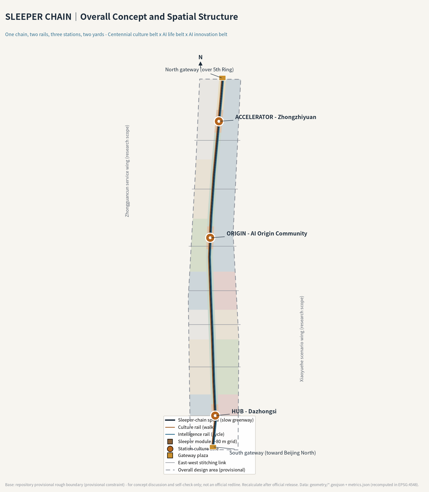
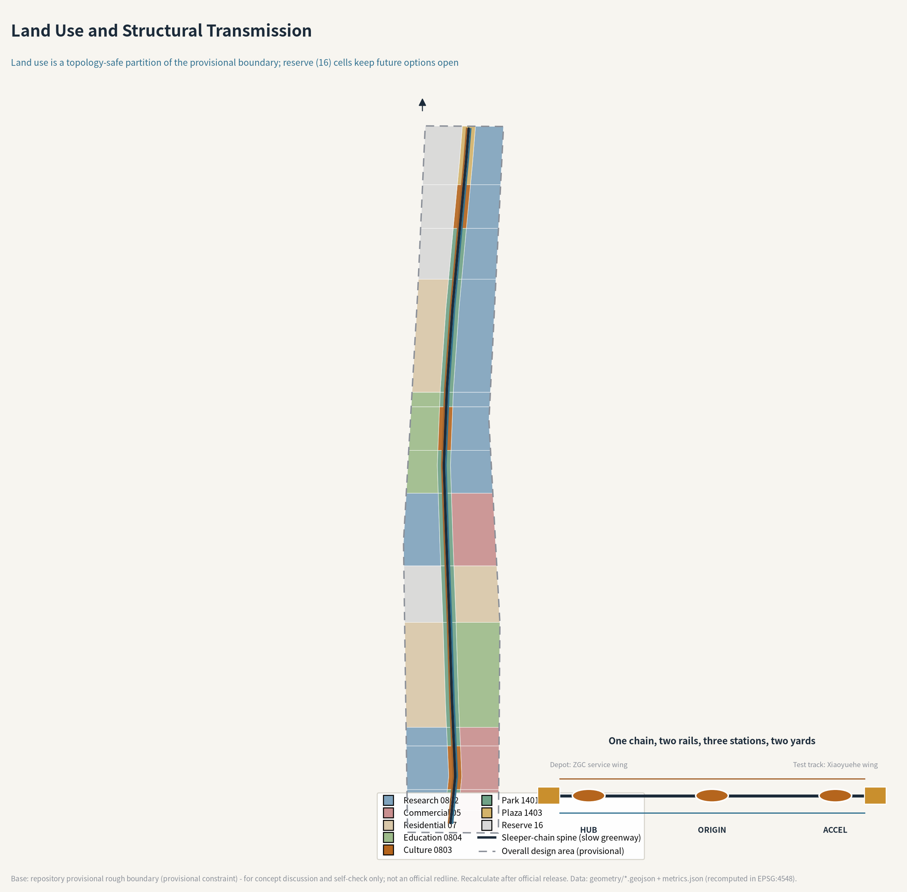
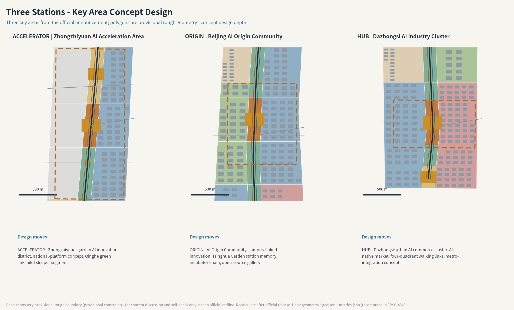
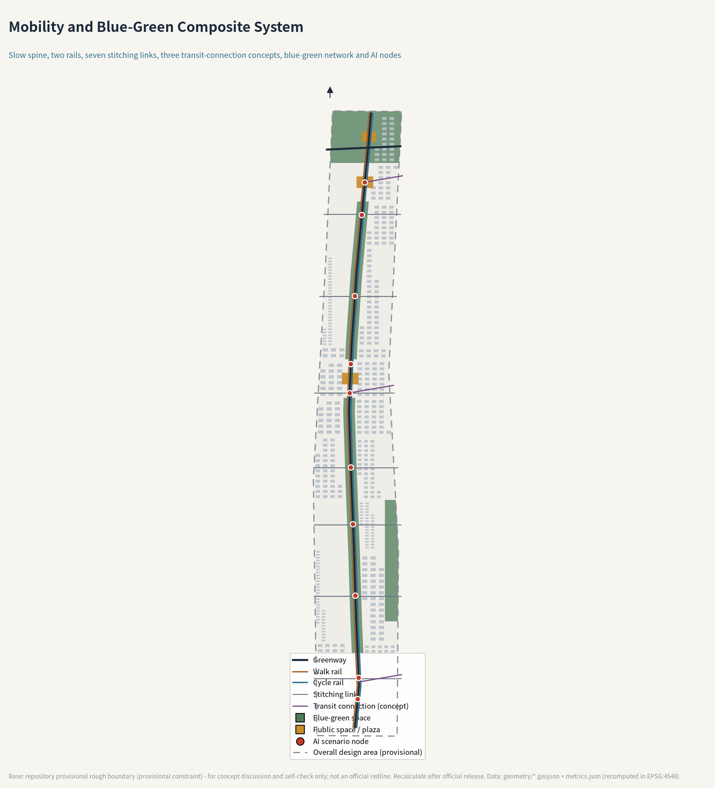
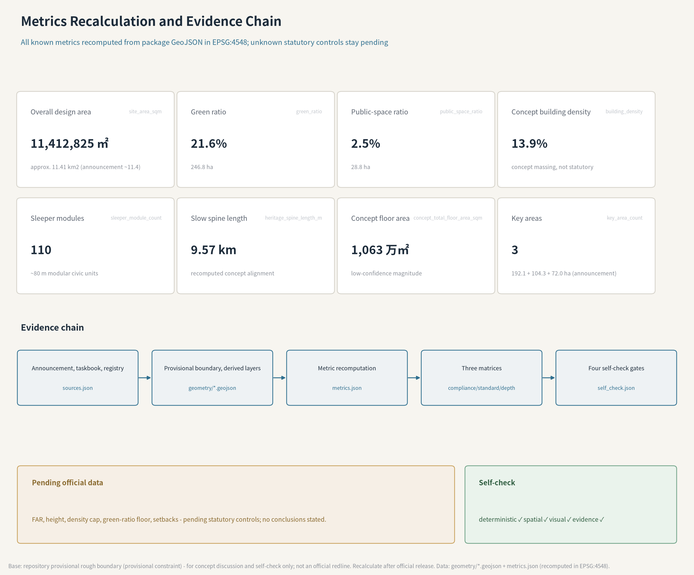

# SLEEPER CHAIN - Centennial Jing-Zhang AI Innovation Belt Urban Design

> A sleeper never decides where the train goes, yet it makes every passage possible. This proposal promotes the quietest component of the Jing-Zhang Railway into the public-space prototype of the innovation belt: a century ago, sleepers carried the trains of the first trunk railway designed and built by Chinese engineers; a century later, manufacturable, maintainable and name-engravable sleeper modules carry every contributor of the AI era.

## Design Basis and Source List

The primary authority for this proposal is the official pre-qualification announcement issued by the Haidian Branch of the Beijing Municipal Commission of Planning and Natural Resources: the three scope levels, the approximate areas of 43.6 and 11.4 square kilometres and 368.4 hectares, the names and order of the three key areas, and the design purposes and tasks in sections 1.3-1.5 are all taken from that announcement [source:OFFICIAL-ANNOUNCEMENT]. The agent-facing co-creation requirements - ten principles, three positionings, five functions, three areas and two wings, six agent tasks and the unified boundary clause - come from the cleared taskbook summary [source:AGENT-TASKBOOK].

Professional judgement follows three mandatory public standards: the urban-design measures for public space and city character [standard:MOHURD-URBAN-DESIGN-MEASURES], the regulatory-planning rule that known controls must be separated from pending items [standard:MOHURD-CONTROL-DETAILED-PLANNING], and the national land-use classification logic [standard:MNR-LAND-USE-CLASSIFICATION-GUIDE]. Land-use codes follow the registered project subset rather than invented categories [source:SITE-PACKAGE].

The site geometry must be stated honestly: the repository does not yet hold an official redline or precise key-area polygons, so this proposal uses the maintainer-published provisional rough boundary whose attributes explicitly state `official_boundary=false` and forbid redline or precise-area use [source:BOUNDARY-SOURCE] [source:KEY-AREA-SOURCE]. Community review has flagged two known deviations: the provisional Dazhongsi key-area centroid sits about 2.3 km south of the real Dazhongsi station (Issue #1029), and the provisional overall design boundary stays about 412 m away from the OSM-mapped heritage park (Issue #846) [source:ISSUE-846-1029]. Every spatial statement in this proposal is therefore worded as a concept proposal, a reference scheme, or material for professional teams to deepen; once the official polygons are released, all derived layers and metrics will be recomputed as registered in the assumptions [source:ASSUMPTIONS-REGISTER].

Source usability follows the three-way split of the public registry: the announcement, the taskbook summary and the three ministerial standards are formal-ready; the Haidian "1+X+1" industrial layout and the Beijing "three areas and two wings" coverage are background only; the provisional boundary supports generation, visualization and self-check only [source:SOURCE-REGISTRY] [source:PROCESSED-FACT-PACK]. AI scenario service boundaries follow the public texts of the interim generative-AI measures, the Barrier-Free Environment Law and the elderly smart-technology policy plan [standard:GENERATIVE-AI-INTERIM-MEASURES] [standard:BARRIER-FREE-ENVIRONMENT-LAW] [standard:ELDERLY-SMART-TECH-PLAN-2020-45]. The exhaustive machine index lives in `sources.json`; this section keeps only claim-adjacent anchors.

## Three-Level Scope Framework

The three scopes implement the announcement level by level [depth:three_level_scope_framework]. The coordinated research area covers about 43.6 square kilometres (5th Ring Road to the north, Jingzang Expressway to the east, Xizhimenwai Street to the south, Wanquanhe Road to the west); this proposal treats it as industry and synergy research without statutory geometry. The overall design area covers about 11.4 square kilometres and carries the spatial deliverables: the submitted boundary recomputes to 11,412,825 sqm, roughly 0.11% off the announced figure [metric:site_area_sqm]. The key detailed-design area totals 368.4 hectares and comprises, from north to south, the Zhongzhiyuan AI acceleration area (about 192.1 ha), the Beijing AI Origin Community (about 104.3 ha) and the Dazhongsi AI industry cluster (about 72.0 ha); the three provisional polygons do not overlap and sit inside the submitted boundary [data:geometry/key_areas.geojson#PROV-KEY-001] [metric:key_area_count].

The transmission logic between scopes is "industry judgement, then spatial structure, then district verification": the research scope decides which functions deserve space; the overall design scope translates them into land use, corridors, facilities and renewal projects; the key areas verify implementability. This answers both the announcement's three-level division and the taskbook's three-areas-two-wings synergy loop [source:OFFICIAL-ANNOUNCEMENT] [source:AGENT-TASKBOOK].

The limits of provisional geometry must be stated at framework level: all scope polygons are rough; areas serve as magnitude checks, not scoring-grade recomputation. Once official polygons arrive, land use, green space, public space, buildings, roads, phasing and every derived metric will be recomputed under EPSG:4548 [data:geometry/site_boundary.geojson#SITE-001] [depth:metrics_recalculation].

## Coordinated Research Area: Industry and Future City Research

The announcement asks this layer to answer two questions: how to build a world-class AI innovation ecosystem, and what urban form fits AI [source:OFFICIAL-ANNOUNCEMENT]. The answer of this proposal is the concept SLEEPER CHAIN.

**Concept and naming.** In the railway's technical heritage, rails decide direction while sleepers decide capacity. The roughly 0.6 m sleeper spacing has barely changed in a century; what changed is the weight and speed it carries. An innovation belt needs exactly this kind of modularized bearing: the spatial module stays constant while the functions above keep updating. The Chinese name "枕木长链" translates as SLEEPER CHAIN. The three key areas are named as stations in railway semantics - HUB (Dazhongsi), ORIGIN (AI Origin Community) and ACCELERATOR (Zhongzhiyuan) - while the two wings are named as yards: the Zhongguancun technology-service wing acts as the depot (factor configuration and maintenance), and the Xiaoyuehe scenario wing acts as the test track (scenario testing and opening). The naming copies no existing city, park or company name; lettering and graphics are self-made [depth:overall_spatial_structure].

**Logo and visual identity direction.** The mark is a recumbent "I-beam" glyph: at once the cross-section of a rail and a plan sketch of two sleepers holding one rail; extended horizontally it becomes the chain, stacked vertically it becomes a monument. The palette pairs sleeper brown (wooden bearing) with signal blue (intelligent dispatch), plus sleeper gold reserved for the honour system. One rule matters: no official colour block may ever cover the contributor-name zone. This is a concept identity only, not a trademark or licensing claim.

**Positionings and functions in space.** The Centennial Jing-Zhang culture belt runs on the Culture Rail (the western walking line); the urban AI life-experience belt runs on the Intelligence Rail (the eastern cycling line); the AI fusion-innovation belt sits in the three stations, two yards and the flanking industry blocks. Among the five functions, the full-stack independent AI system and global AI-governance voice anchor at ACCELERATOR, the world-class innovation ecology anchors at ORIGIN, and the AI+ scenario paradigm and vibrant AI city unfold along the whole Intelligence Rail - so the three positionings, five functions and three-areas-two-wings form a spatially identifiable loop [source:AGENT-TASKBOOK].

**Global cases (5-8) and what they transfer.** Six cases were studied; mechanisms transfer, forms do not: London King's Cross proves that railway heritage and knowledge institutions can coexist, and its Coal Drops Yard component-based retrofit is a direct reference for sleeper modules; Kendall Square proves that campus-adjacent districts need a technology-transfer front desk rather than more laboratories; Stanford and Sand Hill Road prove capital services should be a short walk from research; Helsinki Kalasatama proves a city-scale testbed needs public application, monitoring and exit mechanisms; Singapore Punggol proves a digital twin must bind governance responsibility instead of only display; Tokyo's station-centric fabric proves a station deck is first a public walking system [source:GLOBAL-CASES]. These six lessons translate into the sleeper component library, the ORIGIN incubation chain, the depot enterprise-service desk, the test-section open-and-exit protocol, the honour-wall twin accountability, and walking-first station design.

**Future urban form.** The AI-era difference is not facades but verifiable operation: every intelligent service entering public space should run like a train - with a timetable, a responsible operator and scheduled stops. The Sleeper Chain materializes that timetable as a 9.57 km slow spine and 110 sleeper modules on a roughly 80 m grid [metric:heritage_spine_length_m] [metric:sleeper_module_count].

## Overall Design Area: Urban Renewal and Regulatory-Plan-Level Urban Design

The announcement requires regulatory-plan urban-design depth here, while forbidding concept proposals from posing as statutory conclusions [source:OFFICIAL-ANNOUNCEMENT] [standard:MOHURD-CONTROL-DETAILED-PLANNING]. The method of this proposal is to make structure, functional mix and renewal targets solid, and to mark FAR, height and parcel-level retain-renovate-demolish conclusions as pending official data.

**Spatial structure: one chain, two rails, three stations, two yards.** The land-use plan is not hand-drawn colour blocks: the submitted provisional boundary is partitioned under EPSG:4548 into 42 seamless cells by noded cut lines. A central corridor about 180 m wide forms the sleeper-chain spine (park green 1401, three culture 0803 nodes, two plaza 1403 gateways), while the flanks assign research 0802, commercial 05, residential 07, education 0804 and reserve 16 across seven functional bands [data:geometry/land_use.geojson#LU-001] [depth:land_use_layout]. The reserve cells are a deliberate choice: the Xitucheng and Qinghe reserves keep future options open, echoing the announcement's call for adaptive, evolvable urban form.

**Renewal framework.** Renewal releases inefficient space along the corridor: concept building footprints total about 1.581 million sqm, a concept density of about 13.9% [metric:building_footprint_area_sqm] [metric:building_density]; the concept floor area estimate is about 10.63 million sqm, used only for industry-space magnitude discussion [metric:concept_total_floor_area_sqm]. Retain-renovate-demolish stays at category strategy: retain and reactivate corridor and station memory components, adapt existing buildings in industry blocks, propose demolition only for inefficient mass that blocks connectivity and has no retention condition, and concentrate new build around the three station cores - all as concept proposals pending ownership, existing-building and regulatory data [depth:retain_renovate_demolish].

**Heritage-park vitality belt and character.** Announcement 1.5.2.4 asks for north-south continuity, east-west links, breakpoint fixes and landmark nodes at both ends [source:OFFICIAL-ANNOUNCEMENT]. The slow spine runs north-south; seven stitching links answer the century-old severance [metric:cross_link_count]; gateway plazas anchor both ends - the south one continues the arrival narrative toward Beijing North, the north one looks over the 5th Ring toward the Qinghe green corridor. The character theme is "between steel and wood": steel for the order of rail and intelligence, wood for the warmth of sleepers and park. Numeric controls for height, roof form and colour remain pending regulatory conditions [depth:height_massing_character].

## Detailed Design of Key Areas

The three key areas are the three stations of the chain, each forming a complete sub-scheme of positioning, structure, renewal, transport, public space, scenarios and risk [depth:three_key_area_detailed_design]. The provisional polygons live in the key-area layer with announcement areas [data:geometry/key_areas.geojson#PROV-KEY-002].

**ACCELERATOR (Zhongzhiyuan AI acceleration area, about 192.1 ha).** A garden-type AI innovation district carrying the full-stack system and governance-voice functions. Research cells dominate; the western reserve meets the Qinghe green corridor; the culture core hosts a full-stack display ring and a standards-and-governance window; a 5th-Ring-oriented transit-connection concept improves external access; on-site green combines stormwater retention with outdoor testing [data:geometry/key_areas.geojson#PROV-KEY-001]. The main risk is the longest renewal cycle, so it sits in the long-term climbing phase.

**ORIGIN (Beijing AI Origin Community, about 104.3 ha).** A campus-linked AI innovation district: education cells on the west meet the universities, research cells on the east take incubation and transfer, and the culture core keeps the Tsinghua Garden station memory with the open-source gallery and the first segment of the developer promenade. Slow mobility improves campus-park links; metro-station integration concepts address Wudaokou and East Qinghua Road West; implementation follows low-disturbance organic renewal.

**HUB (Dazhongsi AI industry cluster, about 72.0 ha).** An urban AI innovation district focused on agents, intelligent terminals and content consumption. The concept overlays the culture core with an AI-native market so that consumption space doubles as scenario feedback; four-quadrant walking connectivity and bicycle parking at the Dazhongsi junction are addressed as concept directions; planned green is proposed for compound green-plus-test use [data:geometry/key_areas.geojson#PROV-KEY-003]. Given the known positional deviation of this provisional polygon (see Design Basis), all node-level statements remain directional.

## AI Innovation Ecosystem, Personas, and AI+ Scenarios

Ecosystem design answers who innovates on the chain. Six personas are defined: fundamental researchers (universities and institutes), agent entrepreneurs, engineers of resident companies, neighbourhood residents, visiting developers and tourists, and city-governance operators. Personas drive scenario placement: researchers need quiet promenades and data sandboxes; entrepreneurs need low-cost test slots and a policy front desk; residents need an undisturbed park and human-backed services [standard:PROJECT-AGENT-OPEN-CALL-TASKBOOK].

**Ten scenario cards** (each with location, users, operating data, privacy boundary, human review and operator; all are concept scenarios that people can switch off and exit):

1. **AI cultural guide on the rail** - along the Culture Rail for tourists and residents; public history material and location triggers only, no face capture; operated by the park operator; maps to ai-cultural-guide.
2. **Walk-priority signal lab** - Wudaokou south segment for pedestrians and cyclists; junction sensing outputs flow statistics only; weekly human review; maps to ai-traffic-walkability.
3. **Low-speed robot delivery segment** - from HUB to Xueyuan South along the Intelligence Rail for local merchants; speed-capped robots with human take-over points; maps to robot-delivery-low-speed.
4. **Enterprise-service depot desk** - in front of the ACCELERATOR culture core for companies and startups; policy, space and compute requests dispatched as traceable tickets; maps to enterprise-service-copilot.
5. **AI health slow-mobility station** - Xueyuan South park for residents; body-check data stays local with minimal upload and a staffed counter; maps to ai-health-service-navigation.
6. **Public-safety review kiosk** - Origin Community segment for governance operators; algorithms only prompt, humans decide, and handling records are queryable; maps to public-safety-operations-review.
7. **Open-source gallery** - corridor between ORIGIN and ACCELERATOR for developers and the public; exhibits rotate under licence and attribution lists.
8. **Name-engraved sleeper honour wall** - in front of the ORIGIN culture core for all contributors; GitHub IDs are engraved only after owner confirmation, queryable and revocable.
9. **Qinghe riverside AI classroom** - northern riverside green for universities and communities; by reservation, minors always accompanied by staff.
10. **AI-native market** - around the HUB culture core for consumers and companies; stalls double as test slots with visible "under test" signage.

The **three industry test-and-validation scenarios** are: the walk-priority signal lab (field validation of signal and perception algorithms), the low-speed robot delivery segment (mixed-traffic rules and take-over protocol), and the honour-wall digital-twin pilot (end-to-end registration, display and revocation). All test scenarios follow one test-section protocol: public application, posted boundaries, data minimization, human fallback, scheduled retest, and immediate stoppage on demand [standard:GENERATIVE-AI-INTERIM-MEASURES]. Accessibility and elderly inclusion keep staffed channels and on-site guidance in public-service scenarios [standard:BARRIER-FREE-ENVIRONMENT-LAW] [standard:ELDERLY-SMART-TECH-PLAN-2020-45].

## Land Use, Building Scale, and Retain-Renovate-Demolish Strategy

The 42 land-use cells fully cover the submitted boundary without overlap, and their composition recomputes directly: park green and plaza cells total about 2.47 million sqm (green ratio about 21.6%), research, commercial, residential and education cells distribute along the two flanks, and two reserve cells keep future options [metric:green_ratio] [metric:green_space_area_sqm]. The green and public-space layers measure concept green and public space, including corridor and riverside-link segments [data:geometry/green_space.geojson#GS-001].

Building scale is expressed only as magnitude and structure: concept footprints of about 1.581 million sqm and a concept floor area of about 10.63 million sqm are estimated from the concept building layer and concept floor counts at low confidence [metric:building_footprint_area_sqm] [metric:concept_total_floor_area_sqm]. Statutory indicators - FAR, height, density cap, green-ratio floor and setbacks - remain pending official data and form no conclusion here [metric:floor_area_ratio] [depth:development_intensity_controls].

The retain-renovate-demolish logic is categorical: retain memory-bearing components first, adapt industry-compatible buildings, propose demolition only for inefficient mass that blocks connectivity, and concentrate new build near the three station cores - a category strategy, not parcel conclusions [depth:retain_renovate_demolish]. The supply strategy is life-cycle oriented: sleeper modules and reserve cells let space open cheaply first and upgrade as the industry matures.

## Transport, Rail, Municipal Infrastructure, and Public Services

Slow mobility leads: the 9.57 km spine is a greenway-class corridor, the Culture Rail walking line and Intelligence Rail cycling line flank it, seven stitching links cross the railway corridor as concept alignments, and three transit-connection concepts serve Dazhongsi, Wudaokou/East Qinghua Road West and the 5th Ring direction [data:geometry/roads.geojson#RD-SPINE] [depth:traffic_rail_slow_parking]. The four-quadrant walking connectivity and bicycle parking at Dazhongsi are answered with plaza-ring and grade-separated concept directions; no engineering conclusion is drawn.

Municipal and new infrastructure follow the "sleeper as infrastructure" idea: each module reserves standard interfaces for water, power, communications and edge computing, so distributed energy and edge compute sit inside replaceable public-space components instead of new land take [depth:municipal_new_infrastructure]. Public services anchor at the three stations - enterprise-service desk at ACCELERATOR, incubation front desk at ORIGIN, AI-native market and citizen services at HUB - forming a three-desk network linked by one chain. Parking and static traffic are expressed as directional suggestions pending formal traffic assessment.

## Blue-Green Network, Public Space, and Urban Character

The blue-green skeleton combines the spine park band with two riverside link greens; concept green space totals about 2.468 million sqm [metric:green_space_area_sqm]. The Qinghe and Xiaoyuehe rivers are addressed as concept link segments; statutory blue lines and waterfront controls await official data [depth:blue_green_public_space].

The public-space operating system is the sleeper module: a roughly 34 m by 16 m modular platform integrating seating, lighting, display racks, sensing and service interfaces, repeated about 110 times along the chain [metric:sleeper_module_count]. It is three infrastructures at once: the standard part of the component library, the mounting slot for test scenarios, and the carrier of the honour system.

**AI pilgrimage landmarks (three, all concept proposals).** First, the name-engraved sleeper honour wall in front of the ORIGIN culture core: contributors' GitHub IDs are engraved on physical sleepers and mirrored in an online twin, answering the open call's memorial ambition - a century later, the names carved here are those of every participant. Second, the open-source gallery: sleeper modules act as display racks for open models, datasets and city proposals, rotating under licence and attribution lists. Third, the developer promenade: a milestone-walk on the Culture Rail from the 1909 opening to the year agents joined urban design. All three landmarks are registered in the concept-node inventory [data:geometry/public_space.geojson#SLP-001]. Urban character follows the "between steel and wood" theme, and landmarks avoid entertainment-driven treatment [depth:height_massing_character].

## Renewal Projects, Implementation Policy, and Phasing

Renewal projects are organized in three phases; the phasing extents are concept proposals, not schedule commitments [data:geometry/phasing.geojson#PH-1] [depth:phasing_implementation]:

- **Phase 1, first-open section (2026-2028)**, south and central-south segments: P1 first sleeper-module installation and component-library finalization; P2 HUB culture core and AI-native market phase one; P3 two demonstration stitching links; P4 publication of the test-section protocol and launch of the three test scenarios.
- **Phase 2, switchback section (2028-2031)**, Wudaokou and Origin Community segments: P5 ORIGIN culture core and open-source gallery; P6 incubation-block renewal; P7 developer promenade and first honour-wall segment; P8 campus-park slow-mobility completion.
- **Phase 3, climbing section (2031-2035)**, Xueyuan Road and Zhongzhiyuan segments: P9 ACCELERATOR culture core and full-stack display ring; P10 Qinghe riverside link and north gateway; P11 rolling evaluation and activation mechanism for the two reserve cells.

Three policy mechanisms are suggested: sleeper modules and test slots use open-design procurement so any compliant manufacturer can produce and maintain them; the test-section protocol is co-governed by the operator, the subdistrict and professional teams with published results; honour-wall registration, engraving and revocation rules are community-governed and kept consistent with the online twin. All are mechanism suggestions, not government arrangements [depth:renewal_project_list].

**Global event system and long-term operation (agent.6).** The annual calendar follows a railway working diagram: the Jing-Zhang open-source culture week in spring (publishing the year's honour sleepers), the AI scenario installation festival in summer (open days on test segments), the Sleeper Hackathon in autumn (a global component-and-scenario competition), and the Two-Rails annual conference in winter (governance and operation review). The developer community runs a promenade-residency loop of application, residency and public sharing. The conversion pathway is experience, test, then tenancy: a visitor scans a scenario card to enter a test application, and a test team can convert into a service-desk tenancy ticket. All events are proposals and none are stated as confirmed arrangements.

## Metrics, Area Recalculation, and Compliance Matrix

Metrics come in three layers [depth:metrics_recalculation]. First, announcement-calibre figures: the three scopes and three key areas cite announcement values with provisional-geometry deviation flagged [metric:site_area_sqm]. Second, package-recomputed metrics: submitted boundary area, green and public-space areas and ratios, concept building footprint and density, sleeper count, spine length and stitching-link count - all reproducible from package GeoJSON under EPSG:4548 with formulas and source files registered [metric:public_space_ratio]. Third, pending-official-data metrics: FAR, height, density cap, green-ratio floor and setbacks stay unknown until statutory controls are published and never appear as numbers on any drawing [metric:floor_area_ratio].

Industry-vision indicators (AI innovation index, talent density, output scale) belong to the "study and propose" direction of announcement 1.5.2.1; this proposal contributes only the indicator framework and the data-collection mechanism (via the enterprise-service desk and test-section ledgers) and fabricates no values [source:OFFICIAL-ANNOUNCEMENT].

For task coverage, every mandatory announcement item in sections 1.3, 1.4 and 1.5 and every agent task agent.1-agent.6 maps in the compliance matrix to sections, layers, metrics, drawings and the display page; professional-standard responses live in the standard matrix and design-depth evidence in the design-depth matrix. The four self-check gates - deterministic format, spatial review, visual packaging and professional evidence - are recorded in `self_check.json` and published on the display page.

## Risk, Copyright, and Compliance

Key risks and countermeasures are registered in the risk matrix on a 1-5 scale: provisional-boundary deviation (high, hedged by a full recomputation plan), public acceptance of test scenarios (medium, hedged by the test-section protocol and human fallback), operations cost of component-based public space (medium, hedged by standard parts and open procurement), data privacy (medium, data minimization and local retention), technology maturity (medium, graded opening of test scenarios), and equity and inclusion (medium, staffed channels and non-digital entries) [depth:risk_missing_data].

Copyright and compliance: all figures in this package are derived from package GeoJSON and metrics with open-source fonts; no unauthorized image, trademark, portrait or paper figure is used; no official approval, redline, regulatory plan or implementation commitment is claimed; no non-public material or personal data is used. The author takes responsibility for the facts, citations and expression of AI-generated content. The full statement lives in `report/copyright_statement.md` [source:SITE-PACKAGE].

## References

The materials that genuinely shaped this proposal are listed below; the exhaustive machine index is `sources.json` plus the three matrices [source:SOURCE-REGISTRY]:

1. Haidian Branch of Beijing Municipal Commission of Planning and Natural Resources: Pre-qualification Announcement of the Centennial Jing-Zhang AI Innovation Belt Urban Design International Competition, 2026-05-09.
2. Taskbook Summary for the Global Agent Open Call of the Centennial Jing-Zhang AI Innovation Belt (user-provided cleared document), 2026-05-18.
3. Ministry of Housing and Urban-Rural Development: Urban Design Management Measures, 2017.
4. Ministry of Housing and Urban-Rural Development: Measures for the Preparation and Approval of Regulatory Detailed Planning of Cities and Towns.
5. Ministry of Natural Resources: Guide to Land-Use and Sea-Use Classification for Territorial Survey, Planning and Control, 2023.
6. Beijing Municipal Science and Technology Commission and Zhongguancun Administrative Committee: coverage of the three-areas-two-wings world-class AI cluster, 2026-04-03 (background).
7. Haidian District People's Government: release of the Haidian "1+X+1" modern industrial system, 2026-03-02 (background).
8. Cyberspace Administration of China and six other departments: Interim Measures for the Management of Generative Artificial Intelligence Services, 2023.
9. Standing Committee of the National People's Congress: Barrier-Free Environment Construction Law of the PRC, 2023.
10. Repository community data-review discussions: Issue #846 (provisional boundary vs heritage park deviation) and Issue #1029 (Dazhongsi provisional key-area positional deviation), 2026-08.
