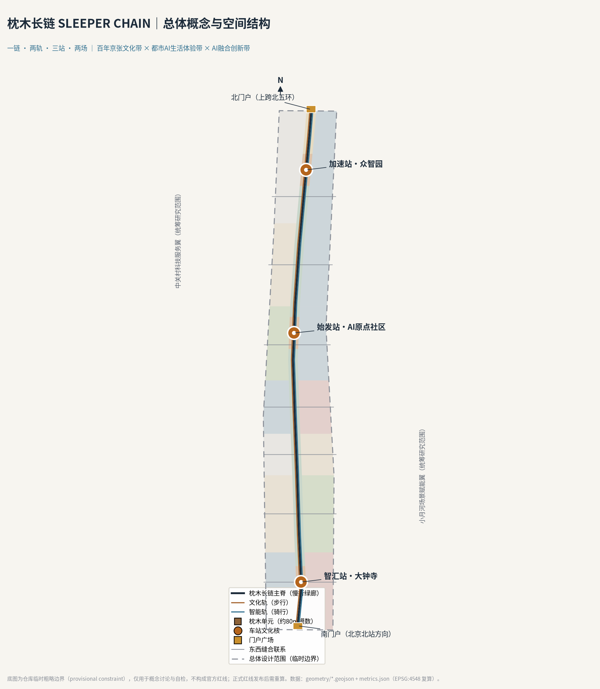
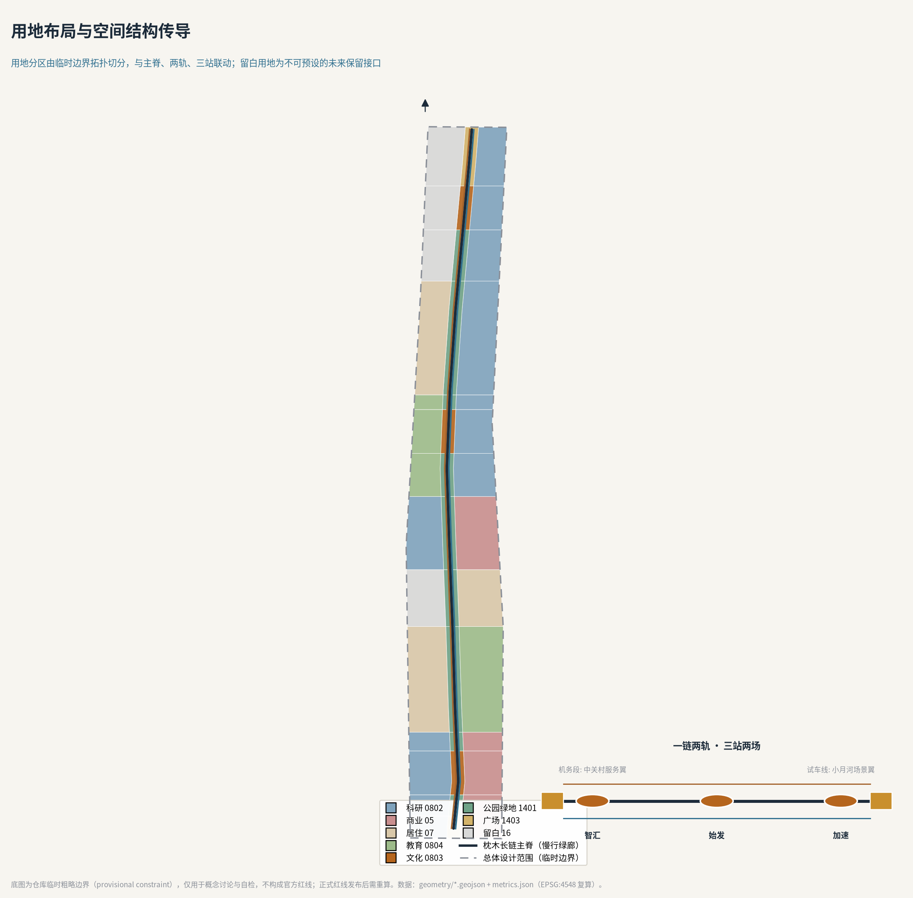
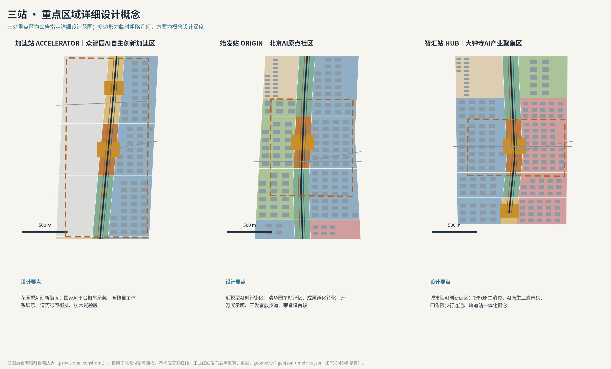
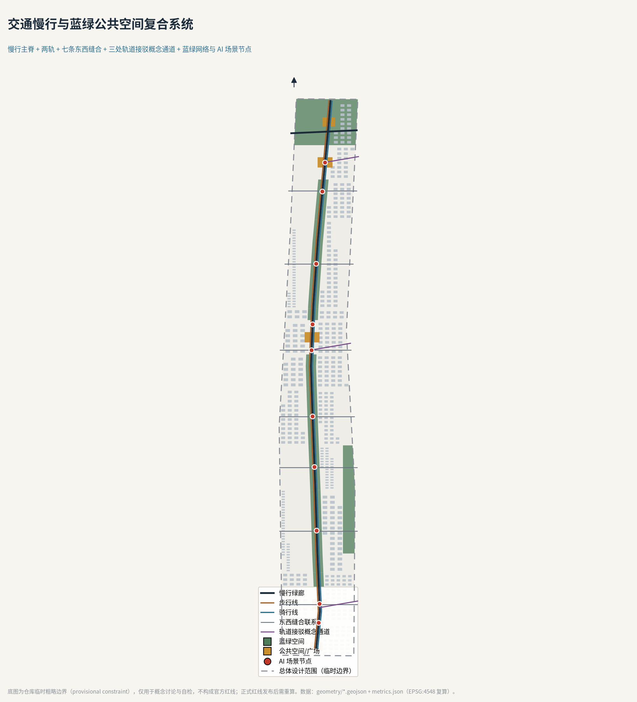
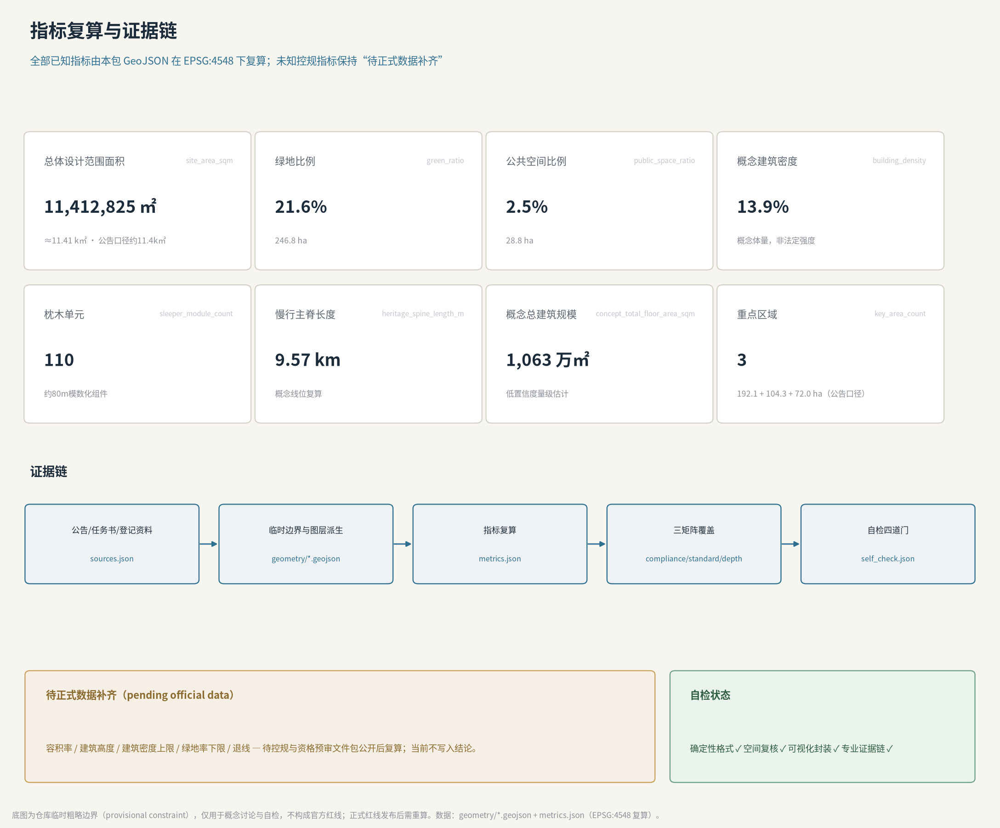

# 枕木长链 SLEEPER CHAIN——百年京张AI创新带城市设计

> 一根枕木从不决定列车去向，却让每一次通过成为可能。本方案把京张铁路最沉默的构件立为创新带的公共空间原型：百年之前，枕木承载了中国第一条自主设计干线铁路的列车；百年之后，一节节可制造、可维护、可刻名的"枕木单元"，承载 AI 时代每一位贡献者。

## 设计依据与资料清单

本方案以北京市规划和自然资源委员会海淀分局《百年京张AI创新带城市设计国际方案征集资格预审公告》为第一权威依据：三层范围、约 43.6 / 11.4 平方公里与 368.4 公顷的面积口径、三处重点区名称与排序、1.3—1.5 节的设计目的与任务均直接引自公告 [source:OFFICIAL-ANNOUNCEMENT]。面向智能体的共创要求——十条共创原则、三大定位、五大功能、三区两翼、六项智能体任务与统一边界条款——来自已清权的任务书摘录 [source:AGENT-TASKBOOK]。

专业判断遵循三条强制性公开标准：城市设计对公共空间与风貌的统筹要求 [standard:MOHURD-URBAN-DESIGN-MEASURES]、控规编制中"已知控制条件与待确认事项必须区分"的口径 [standard:MOHURD-CONTROL-DETAILED-PLANNING]、以及国土空间用地用海分类逻辑 [standard:MNR-LAND-USE-CLASSIFICATION-GUIDE]。用地代码采用仓库登记的分类子集，不自造分类 [source:SITE-PACKAGE]。

场地几何的现状必须诚实交代：仓库尚未取得官方红线与三处重点区精确多边形，本方案使用维护者发布的临时粗略边界（provisional constraint），其属性明确写着 `official_boundary=false`、不得作为红线或精确面积依据 [source:BOUNDARY-SOURCE] [source:KEY-AREA-SOURCE]。社区核查还提示两处已知偏差：临时大钟寺重点区质心较真实大钟寺站偏南约 2.3 公里（Issue #1029），临时总体设计范围与 OSM 测绘的遗址公园存在约 412 米的最近距离（Issue #846）[source:ISSUE-846-1029]。因此本方案全部空间结论一律表述为"概念建议、参考方案、可供专业团队深化研究"，正式红线发布后按既定清单整体复算，详见假设登记 [source:ASSUMPTIONS-REGISTER]。

资料使用边界遵循公开登记表的三分法：公告、任务书摘录、三项住建部与自然资源部标准为 formal 可用；海淀"1+X+1"产业布局与北京"三区两翼"报道只作背景；临时边界只支撑生成、可视化与自检 [source:SOURCE-REGISTRY] [source:PROCESSED-FACT-PACK]。AI 场景的服务边界参照生成式人工智能服务管理暂行办法、无障碍环境建设法与老年人智能技术政策文件的公开文本 [standard:GENERATIVE-AI-INTERIM-MEASURES] [standard:BARRIER-FREE-ENVIRONMENT-LAW] [standard:ELDERLY-SMART-TECH-PLAN-2020-45]。完整来源的机器索引见 `sources.json`，本节的判断只保留与结论相邻的少量锚点。

## 三层范围工作框架

三层范围按公告口径逐级落实 [depth:three_level_scope_framework]。统筹研究范围约 43.6 平方公里（北至北五环路、东至京藏高速、南至西直门外大街、西至万泉河路），本方案在其中做产业生态与协同研究，不生成法定几何；总体设计范围约 11.4 平方公里，是本方案空间成果的主战场，其提交边界复算面积为 11,412,825 平方米，与公告口径约 11.4 平方公里的偏差约 0.11% [metric:site_area_sqm]；重点区域范围 368.4 公顷，自北向南为众智园 AI 自主创新加速区（约 192.1 公顷）、北京 AI 原点社区（约 104.3 公顷）、大钟寺 AI 产业集聚区（约 72.0 公顷），三处临时多边形互不重叠且均落在提交边界内 [data:geometry/key_areas.geojson#PROV-KEY-001] [metric:key_area_count]。

三层之间的传导逻辑是"产业判断→空间结构→片区验证"：统筹研究范围决定"什么产业功能值得进来"；总体设计范围把功能转译为用地、廊道、设施与更新项目；重点区域验证具体片区的空间可实施性。这一框架同时回应公告 1.4 的三层划分与任务书对"三区两翼"协同回路的要求 [source:OFFICIAL-ANNOUNCEMENT] [source:AGENT-TASKBOOK]。

使用临时边界的限制必须在框架层面说清：三层范围多边形均为粗略几何，面积只作规模感对照，不作评分级精确复算依据；官方多边形发布后，用地分区、绿地、公共空间、建筑、道路、分期与全部派生指标须在同一投影（EPSG:4548）下重算 [data:geometry/site_boundary.geojson#SITE-001] [depth:metrics_recalculation]。

## 统筹研究范围产业与未来城市研究

公告要求这一层回答两个问题：世界级 AI 创新生态体系如何构建，适配 AI 的未来城市形态是什么 [source:OFFICIAL-ANNOUNCEMENT]。本方案的答案是概念「枕木长链 SLEEPER CHAIN」。

**总体概念与命名体系。** 京张铁路的技术遗产里，钢轨决定方向，枕木决定承载。一根枕木的模数（约 0.6 米间距）在一百多年里几乎没有变过，变的是它承载的重量与速度。创新带需要的正是这种"模数化的承载"：空间的模数不变，上面生长的功能持续更新。主名称「枕木长链」，英文名 SLEEPER CHAIN；三处重点区按铁路语义命名为"三站"——智汇站（大钟寺）、始发站（AI 原点社区）、加速站（众智园）；两翼命名为"两场"——中关村科技服务翼为"机务段"（要素配置与维护），小月河场景赋能翼为"试车线"（场景测试与开放）。命名不照搬任何现有城市、园区或企业名称，字体与图形均为自制 [depth:overall_spatial_structure]。

**Logo 与视觉识别方向。** 标识原型是一枚侧卧的"工"字：既是钢轨横断面，也是两根轨枕夹一轨的俯视简笔；横向延展即成长链，纵向堆叠即成碑。主色取"轨枕褐"（木质承载）与"信号蓝"（智能调度），辅以"枕木金"用于荣誉体系。视觉系统规定：任何官方色块不得覆盖贡献者刻名区；标识在导视、场景卡与数字孪生界面中保持同一模数网格。该方向仅为概念识别，不构成商标或授权承诺。

**三大定位与五大功能的落位。** 百年京张文化带落在"文化轨"（西侧步行线）；都市 AI 生活体验带落在"智能轨"（东侧骑行线）；AI 融合创新带落在三站两场与两侧产业街坊。五大功能中，AI 全栈自主创新体系与 AI 治理全球话语权锚定加速站，世界级 AI 创新生态锚定始发站，AI+场景赋能新范式与智能化 AI 活力城市沿智能轨全线展开——三大定位、五大功能与"三区两翼"由此形成可指认的空间回路 [source:AGENT-TASKBOOK]。

**全球案例的转化（5—8 个）。** 本方案研究六个案例并只转化机制、不复制形态：伦敦国王十字知识区证明"铁路遗产+知识机构"可以共生，其 Coal Drops Yard 的构件式更新正是枕木单元的参照；波士顿肯德尔广场证明高校毗邻区需要"成果转化前台"而非单纯实验室；斯坦福—沙山路证明资本服务应与研发空间步行可达；赫尔辛基 Kalasatama 证明城市级测试平台需要公开的申请、监测与退出机制；新加坡榜鹅数码区证明数字孪生必须绑定治理责任而非只做展示；东京站城一体证明轨道站上盖首先是公共步行系统 [source:GLOBAL-CASES]。六条经验分别转译为：枕木单元组件库、始发站孵化链、机务场企业服务编组台、测试段开放—退出协议、荣誉墙数字孪生责任制、三站步行优先设计。

**未来城市形态判断。** AI 时代的城市差异不在立面而在"可验证的运行"：每一项进入公共空间的智能服务都应像列车一样有运行图、有责任人、有停靠站。枕木长链把这条运行图物化为 9.57 公里的慢行主脊与约 80 米模数的 110 处枕木单元 [metric:heritage_spine_length_m] [metric:sleeper_module_count]。

## 总体设计范围城市更新与控规深度城市设计

公告要求本层达到控制性详细规划的城市设计深度，同时严禁把概念建议写成法定结论 [source:OFFICIAL-ANNOUNCEMENT] [standard:MOHURD-CONTROL-DETAILED-PLANNING]。本方案的做法是：空间结构、功能比例、更新对象做深做实；容积率、建筑高度、拆改留地块结论一律记为"待正式数据补齐"。

**空间结构：一链两轨三站两场。** 用地分区不是手绘色块，而是把提交的临时边界在 EPSG:4548 下用节点化切线拓扑切分为 42 个无缝单元：中央约 180 米宽的廊道为枕木长链主脊带（公园绿地 1401、三处文化用地 0803 节点、两处广场 1403 门户），两翼按七个功能带分配科研 0802、商业 05、居住 07、教育 0804 与留白 16 [data:geometry/land_use.geojson#LU-001] [depth:land_use_layout]。留白用地是本方案的刻意设计：西土城与清河两片留白不预设功能，为不可预知的技术与制度变化保留接口，这与"自适应、可进化"的公告要求同构。

**更新总体框架。** 更新对象按"低效空间释放"逻辑组织：临廊道两侧的产业街坊承担 AI 研发与成果转化的空间供给，概念建筑基底合计约 158.1 万平方米，对应概念建筑密度约 13.9% [metric:building_footprint_area_sqm] [metric:building_density]；按概念层数估算的总建筑规模约 1,063 万平方米，仅用于产业空间量级讨论 [metric:concept_total_floor_area_sqm]。拆改留只做到分类策略层：保留并活化廊道与站点记忆构件，改造适配产业街坊的既有建筑，拆除仅限无法适配且无阻更新条件的低效体量，新建集中于三站文化核周边——全部分类均为概念建议，待权属、现状建筑与控规资料补齐后由专业机构复核 [depth:retain_renovate_demolish]。

**遗址公园活力带与风貌。** 公告 1.5.2.4 要求南北贯通、东西连通、聚焦断点与南北端节点 [source:OFFICIAL-ANNOUNCEMENT]。本方案以慢行主脊贯通南北，以七条东西缝合联系回答"被铁路切开百年的两侧" [metric:cross_link_count]；南北两端各设门户广场，南端衔接北京北站方向的抵达叙事，北端以上跨北五环的眺望门户衔接清河绿廊。风貌基调定为"钢木之间"：钢是铁路与智能的秩序，木是枕木与公园的体温；建筑高度、屋顶形态与色彩的具体管控数值待控规条件补齐，本节只给方向性引导 [depth:height_massing_character]。

## 重点区域详细设计

三处重点区是长链上的三座"车站"，各自形成"定位+结构+更新+交通+公共空间+场景+风险"的完整小方案 [depth:three_key_area_detailed_design]。三区临时多边形见关键区图层，面积口径以公告为准 [data:geometry/key_areas.geojson#PROV-KEY-002]。

**加速站（众智园 AI 自主创新加速区，约 192.1 公顷）。** 定位花园型 AI 创新街区，承载 AI 全栈自主创新体系与治理话语权功能。空间上以科研单元为主、西侧留白衔接清河方向绿廊，文化核设置"全栈展示环"与标准治理窗口；对外交通以五环方向接驳概念通道改善，案内绿地兼具雨水调蓄与户外测试功能 [data:geometry/key_areas.geojson#PROV-KEY-001]。风险点是北段更新周期最长，被安排在远期"登高段"实施。

**始发站（北京 AI 原点社区，约 104.3 公顷）。** 定位近校型 AI 创新街区，围绕高校原始创新策源布置孵化与转化单元：西侧教育单元衔接高校，东侧科研单元承接成果转化，文化核保留"清华园车站记忆"叙事并布置开源成果展示廊与开发者散步道首段。慢行上优化校区—园区联系，围绕五道口、清华东路西口站点提出一体化概念；实施上采用低扰动、有机更新策略，避免大拆大建。

**智汇站（大钟寺 AI 产业聚集区，约 72.0 公顷）。** 定位城市型 AI 创新街区，聚焦智能体、智能终端与内容消费等 AI 原生业态。概念上把文化核与智能原生市集叠合，让消费空间同时成为场景反馈入口；针对大钟寺站路口提出四象限步行连通与非机动车静态交通的概念组织方向；规划绿地的复合利用以"绿地+测试位"方式建议 [data:geometry/key_areas.geojson#PROV-KEY-003]。风险点是该临时多边形与真实大钟寺站位的已知偏差（见设计依据节），所有节点结论只作方向性设计。

## AI 创新生态、人才画像与 AI+ 场景

生态设计回答"谁在长链上创新"。本方案给出六类用户画像：原始创新研究者（高校与院所）、智能体创业者、入驻企业工程师、周边社区居民、来访开发者与游客、城市治理运营者。画像直接决定场景布置：研究者要安静的散步道与数据沙箱，创业者要低成本的测试位与政策前台，居民要不被打扰的公园与人工兜底的服务 [standard:PROJECT-AGENT-OPEN-CALL-TASKBOOK]。

**十张场景卡**（每张含空间位置、服务对象、运行数据、隐私边界、人工复核与运营主体；均为人可关闭、可退出的概念场景）：

1. **AI 文化导览·随车讲解**——文化轨全线，服务游客与居民；只用公开史料与定位触发，不采集人脸；运营主体为公园运营方；对应场景库 ai-cultural-guide。
2. **慢行优先信号实验**——五道口南段，服务行人与骑行者；路口感知只产出流量统计；人工复核每周进行；对应 ai-traffic-walkability。
3. **低速机器人配送段**——智汇站至学院南智能轨段，服务街区商户；机器人限速并设人工接管点；对应 robot-delivery-low-speed。
4. **企业服务编组台**——加速站文化核前区，服务企业与创业团队；政策、空间、算力需求按工单分发，结果公开可查；对应 enterprise-service-copilot。
5. **AI 健康慢行驿站**——学院南公园，服务居民；体测数据本地留存、最小化上传，保留人工窗口；对应 ai-health-service-navigation。
6. **公共安全复核亭**——原点社区段，服务治理运营者；算法只提示、人来决定，处置记录可查询；对应 public-safety-operations-review。
7. **开源成果展示廊**——始发站至加速站廊道，服务开发者与公众；展品按授权清单轮换，署名完整。
8. **刻名枕木荣誉墙**——始发站文化核前区，服务全体贡献者；GitHub ID 经本人确认后上墙，可查询、可撤销。
9. **清河露天 AI 课堂**——北段滨水绿带，服务高校与社区；预约制，未成年人活动全程人工陪同。
10. **智能原生市集**——智汇站文化核周边，服务消费者与企业；摊位即测试位，明示"正在测试"标识。

其中**三个产业测试验证场景**为：慢行优先信号实验段（交通信号与感知算法的实地验证）、低速机器人配送测试段（人机混行规则与接管协议验证）、荣誉墙数字孪生联调场（贡献登记—展示—撤销全流程验证）。三个测试场景都遵循同一条"测试段协议"：申请公开、边界公示、数据最小化、人工兜底、到期复测、可随时叫停 [standard:GENERATIVE-AI-INTERIM-MEASURES]。无障碍与老年友好按公共服务场景保留人工通道与现场指导 [standard:BARRIER-FREE-ENVIRONMENT-LAW] [standard:ELDERLY-SMART-TECH-PLAN-2020-45]。

## 用地、建筑规模与拆改留方案

用地分区 42 个单元完整覆盖提交边界、互不重叠，其构成可直接复算：公园绿地与广场约 247 万平方米（绿地比例约 21.6%），科研、商业、居住、教育四类建设单元沿两翼功能带分布，留白用地两片 [metric:green_ratio] [metric:green_space_area_sqm]。需要强调，绿地与公共空间图层的统计口径为概念绿地与概念公共空间，含廊道与滨水衔接段 [data:geometry/green_space.geojson#GS-001]。

建筑规模只表达"量级与结构"：概念建筑基底约 158.1 万平方米、概念总建筑规模约 1,063 万平方米，均由概念建筑图层与概念层数估算，置信度低 [metric:building_footprint_area_sqm] [metric:concept_total_floor_area_sqm]。容积率、建筑高度、建筑密度上限、绿地率下限与退线等法定控制指标，因官方控规条件未公开，统一记为待正式数据补齐，不在本方案形成结论 [metric:floor_area_ratio] [depth:development_intensity_controls]。

拆改留的分类逻辑以"承载记忆者优先保留、适配产业者改造、阻断连通且低效者建议拆除、三站文化核周边集约新建"为原则，仅为分类策略而非地块结论 [depth:retain_renovate_demolish]。空间供给策略强调全生命周期：枕木单元与留白用地让空间可以先以低成本方式开放，再随产业成熟度滚动升级。

## 交通、轨道、市政与公共服务设施

交通系统的主语是慢行：9.57 公里主脊为绿道级慢行廊道，文化轨步行线与智能轨骑行线分列两侧，七条东西缝合联系按概念线位穿越铁路廊道，三处轨道接驳概念通道分别服务大钟寺站、五道口/清华东路西口与五环方向 [data:geometry/roads.geojson#RD-SPINE] [depth:traffic_rail_slow_parking]。公告点名的大钟寺路口四象限步行连通与非机动车停放，在智汇站详细设计中以广场环与地下/立体连通的概念方向回应，具体工程形式不做结论。

市政与新基建按"枕木即基础设施"的思路整合：枕木单元预留给排水、电力、通信与边端算力的标准接口，把分布式能源与端侧算力的"新型服务设施"装进可更换的公共空间组件，而不是新增占地 [depth:municipal_new_infrastructure]。公共服务设施沿三站布置：企业服务编组台（加速站）、孵化转化前台（始发站）、智能原生市集与市民服务（智汇站），形成"三站前台、一链串联"的设施网络。停车与静态交通以轨道站一体化与街区配建的方向性建议表达，待正式交通影响评价复核。

## 蓝绿空间、公共空间与城市风貌

蓝绿系统的骨架是主脊公园带与两条滨水衔接绿带：概念绿地合计约 246.8 万平方米 [metric:green_space_area_sqm]。清河、小月河以概念衔接段回应公告的蓝绿要求，正式蓝线与滨水控制待官方资料校核 [depth:blue_green_public_space]。

公共空间的操作系统是枕木单元：约 34 米长、16 米宽的模数化平台，集成座椅、照明、展架、感知与接口基座，全线约 110 处 [metric:sleeper_module_count]。它同时是三件基础设施：公共空间组件库的标准件、测试场景的安装位、荣誉体系的载体。

**AI 朝圣地标（三处以上，均为概念建议）。** 第一处「刻名枕木荣誉墙」：位于始发站文化核前区，把开源贡献者的 GitHub ID 刻上实体枕木，与线上数字孪生同步，回应征集的纪念体系设想——百年之后，这里刻的是每一位参与者的名字。第二处「开源成果展示廊」：以枕木模块为展架的常设展廊，展品为开源模型、数据集与城市方案，按授权与署名清单轮换。第三处「开发者散步道」：文化轨上的里程碑年表步道，从 1909 年京张通车到智能体参与城市设计的每一年。三处地标均由本方案的概念节点清单登记 [data:geometry/public_space.geojson#SLP-001]。城市风貌遵循"钢木之间"基调，地标不做娱乐化、网红化处理 [depth:height_massing_character]。

## 更新项目清单、实施政策与分期计划

更新项目按三期组织，分期范围为概念建议而非时序承诺 [data:geometry/phasing.geojson#PH-1] [depth:phasing_implementation]：

- **近期·先通段（2026—2028）**：南段（智汇站片区）与中南段。项目 P1 枕木单元首段铺装与组件库定型；P2 智汇站文化核与智能原生市集一期；P3 东西缝合联系示范段两条；P4 测试段协议出台与三个测试场景上线。
- **中期·展线段（2028—2031）**：五道口与原点社区段。项目 P5 始发站文化核与开源成果展示廊；P6 孵化转化街坊更新；P7 开发者散步道与荣誉墙首段；P8 校区—园区慢行贯通。
- **远期·登高段（2031—2035）**：学院路与众智园段。项目 P9 加速站文化核与全栈展示环；P10 清河滨水绿带衔接与北门户；P11 两片留白用地的滚动评估与启用决策机制。

实施政策建议三条：其一，枕木单元与测试位采用"组件采购+开放设计"机制，标准图纸公开，任何合规厂商可生产维护；其二，测试段协议由运营方、街道与专业团队共管，测试结论公开；其三，荣誉墙的登记、上墙与撤销规则由社区共治，与线上孪生保持一致。以上均为政策机制建议，不构成政府安排 [depth:renewal_project_list]。

**全球活动体系与长期运营（agent.6）。** 年度活动按铁路运行图组织："京张开源文化周"（春，发布年度荣誉枕木）、"AI 场景实装节"（夏，测试段集中开放日）、"枕木黑客松"（秋，面向全球开发者的组件与场景竞赛）、"双轨年会"（冬，治理与运营复盘）。开发者社区以"散步道驻留计划"运营：申请—驻留—公开分享的循环。招引转化路径是"体验→测试→入驻"：游客在场景卡上扫码即可进入测试申请，测试团队可转化为企业服务编组台的入驻工单。所有活动均为设想，未表述为已确定安排。

## 指标体系、面积复算与合规矩阵

指标体系分三层 [depth:metrics_recalculation]。第一层是公告口径指标：三层范围与三处重点区面积，直接引用公告值并标注临时几何偏差 [metric:site_area_sqm]。第二层是本包复算指标：提交边界面积、绿地与公共空间面积及比例、概念建筑基底与密度、枕木单元数、主脊长度、缝合联系数，全部可从本包 GeoJSON 在 EPSG:4548 下复算，公式与来源文件逐项登记 [metric:public_space_ratio]。第三层是待正式数据补齐指标：容积率、建筑高度、建筑密度上限、绿地率下限、退线，在官方控规公开前保持 unknown，不进入任何图面数字 [metric:floor_area_ratio]。

产业愿景类指标（AI 创新指数、人才密度、产值规模）属于公告 1.5.2.1 要求的"研提"方向，本方案只给出指标框架与数据采集机制建议（依托企业服务编组台与测试段台账），不编造数值 [source:OFFICIAL-ANNOUNCEMENT]。

任务覆盖方面，公告 1.3、1.4、1.5 全部必选条目与智能体任务 agent.1—agent.6 在任务覆盖矩阵中逐条映射到章节、图层、指标、图纸与展示页；专业标准响应见专业标准矩阵，设计深度证据见设计深度矩阵。四道自检门（确定性格式、空间复核、可视化封装、专业证据链）的通过状态记录在 `self_check.json` 并在展示页公示。

## 风险、版权与合规说明

主要风险与对策已在风险矩阵中按 1—5 分登记：临时边界偏差（高，以全量复算预案对冲）、测试场景的公众接受度（中，以测试段协议与人工兜底对冲）、组件化公共空间的运维成本（中，以标准件与开放采购对冲）、数据隐私（中，数据最小化与本地留存）、技术成熟度（中，测试场景分级开放）、公平包容（中，保留人工通道与非数字入口）[depth:risk_missing_data]。

版权与合规：本方案全部图件由本包 GeoJSON 与指标派生，字体采用开源字体；不使用任何未授权图片、商标、人物肖像或论文图像；不声称任何官方批准、红线、控规或实施承诺；不使用非公开资料与个人隐私数据。AI 生成内容的事实、引用与表达由作者负责。详细声明见 `report/copyright_statement.md` [source:SITE-PACKAGE]。

## 参考资料

真正影响本方案判断的材料如下；完整机器索引以 `sources.json` 与三个矩阵为准 [source:SOURCE-REGISTRY]：

1. 北京市规划和自然资源委员会海淀分局：《百年京张AI创新带城市设计国际方案征集资格预审公告》，2026-05-09。
2. 《面向全球智能体开展"百年京张AI创新带城市设计开源征集"的任务书摘录》（用户提供清权文件），2026-05-18。
3. 住房和城乡建设部：《城市设计管理办法》，2017。
4. 住房和城乡建设部：《城市、镇控制性详细规划编制审批办法》。
5. 自然资源部：《国土空间调查、规划、用途管制用地用海分类指南》，2023。
6. 北京市科学技术委员会、中关村科技园区管理委员会："三区两翼"打造世界级 AI 集聚地报道，2026-04-03（背景）。
7. 北京市海淀区人民政府：海淀区"1+X+1"现代化产业体系发布，2026-03-02（背景）。
8. 国家互联网信息办公室等七部门：《生成式人工智能服务管理暂行办法》，2023。
9. 全国人民代表大会常务委员会：《中华人民共和国无障碍环境建设法》，2023。
10. 仓库社区数据核查讨论：Issue #846（临时边界与遗址公园偏差）、Issue #1029（大钟寺临时重点区位置偏差），2026-08。
