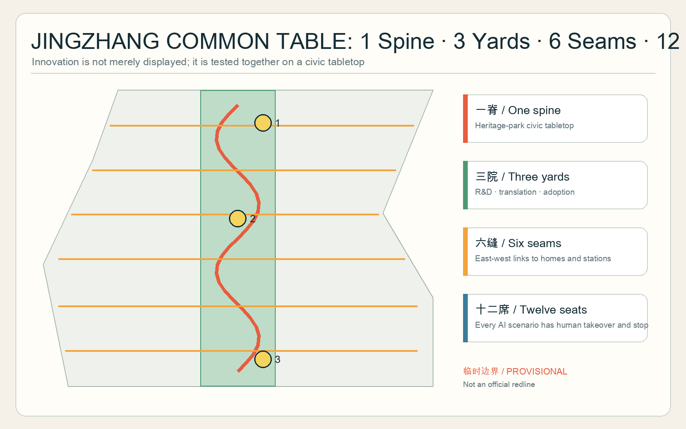
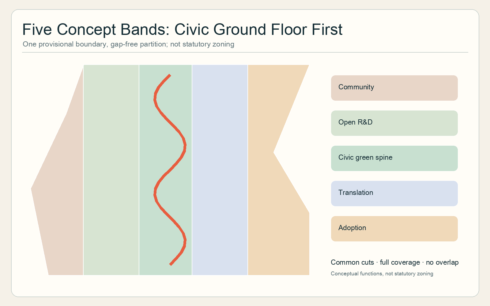
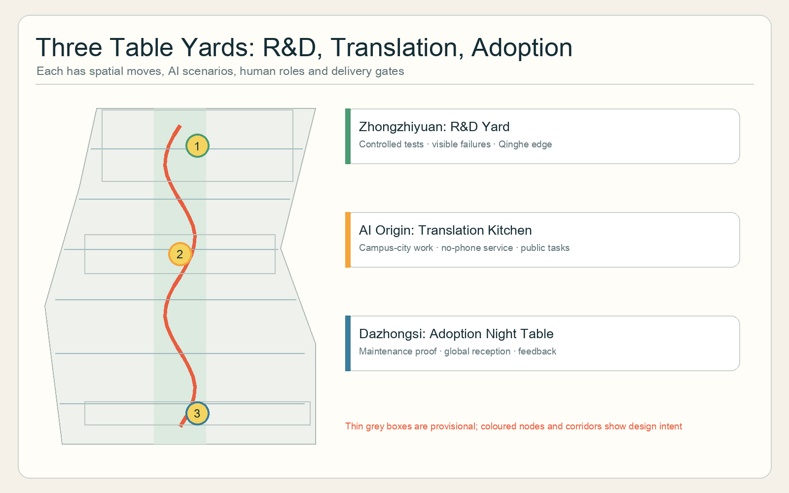
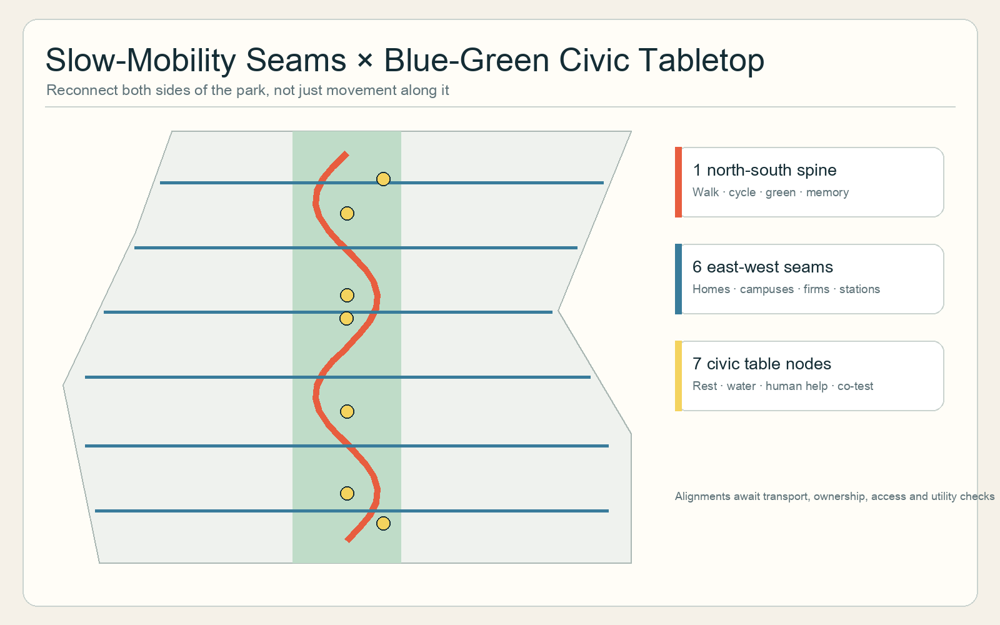
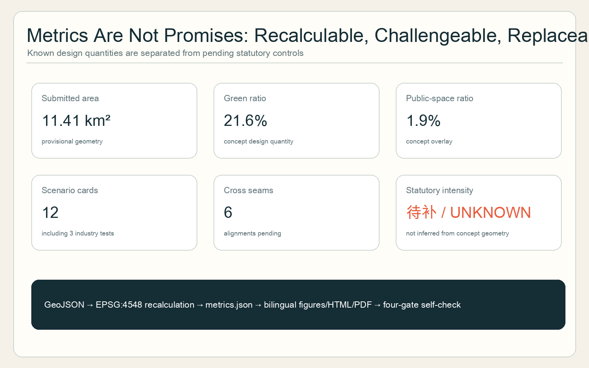

# JINGZHANG COMMON TABLE

> Put innovators and neighbours at the same table. The “table” is not a food-retail slogan but an urban section: park-facing ground floors, seats without purchase, staffed help and publicly challengeable AI trials form the smallest civic unit of the innovation belt.

## Design Basis and Source List

The official announcement and Agent taskbook define the assignment; the repository source registry determines what may support formal claims; local snapshots of professional standards structure the design depth.[source:OFFICIAL-ANNOUNCEMENT] [source:AGENT-TASKBOOK] [standard:PROJECT-OFFICIAL-ANNOUNCEMENT] No official exact site or key-area polygons are available. Maintainer-supplied provisional geometry is therefore used only for structure, graphics and intake checks. It is not an official redline and cannot support statutory land use, precise area, FAR, height, road redlines or building-by-building intervention claims.[source:BOUNDARY-SOURCE] [data:geometry/site_boundary.geojson#SITE-001]

GeoJSON, metrics and matrices have authority over prose; prose explains judgments; figures and HTML make them legible. International cases supply transferable collaboration mechanisms only, never local controls. Every reported area describes this provisional submitted geometry and must be recalculated when official data arrives.[source:SOURCE-REGISTRY] [assumption:A-BOUNDARY-001]

## Three-Level Scope Framework

The 43.6 km² coordinated research area addresses ecosystem and regional coordination; the approximately 11.4 km² overall design area addresses urban structure, ground floors, mobility and blue-green systems around the heritage park; the three key areas, approximately 368.4 ha in the announcement, test spatial prototypes.[depth:three_level_scope_framework] [metric:site_area_sqm] The levels do not enlarge one drawing. They translate a research–translation–adoption–feedback loop into one north-south civic spine, six east-west seams and three detailed table yards.[data:geometry/roads.geojson#ROAD-001] [depth:overall_spatial_structure]

All provisional boundaries appear as quiet dashed constraints. Official polygons must trigger recutting of land use, roads, green space, public space, buildings and phases, full metric recalculation and regeneration of every bilingual visual.[data:geometry/key_areas.geojson#PROV-KEY-001] [assumption:A-CONTROLS-001]

## Coordinated Research Area: Industry and Future City Research

The identity is JINGZHANG COMMON TABLE. Two railway lines unfold into a tabletop: rust red carries railway memory, civic green marks everyday life, and yellow dots mark equal encounters. The three required positionings become a Memory Table, Everyday Table and Co-testing Table; the five functions become seats for R&D, ecosystem, scenarios, urban vitality and governance.[source:AGENT-TASKBOOK] [standard:PROJECT-AGENT-OPEN-CALL-TASKBOOK]

The structure is one spine, three yards, six seams, twelve seats and two wings. The heritage-park spine provides a continuous no-purchase civic interface. Zhongzhiyuan hosts R&D co-testing, the AI Origin Community translates research into usable services, and Dazhongsi supports adoption. Six seams reconnect communities, campuses, firms and stations. The Zhongguancun wing provides legal, capital and IP services; the Xiaoyue River wing provides resident feedback and real-world conditions.[data:geometry/public_space.geojson#PUBLIC-001] [metric:cross_seam_count]

| Global case | Verified lesson | Reference translation to Jing-Zhang |
| --- | --- | --- |
| Kendall Square | Mixed use, open space, active ground floors and community input support innovation | Open part of R&D ground floors to public encounter and interpretation [source:CASE-KENDALL] |
| Singapore one-north | Clusters, living labs and informal Science Cafe exchange coexist | Separate controlled tests from everyday civic space at Zhongzhiyuan [source:CASE-ONE-NORTH] |
| Barcelona 22@ | Urban, economic and social renewal includes a Food Lab interface | Link food technology, communities and circular operations through a public kitchen [source:CASE-22AT] |
| STATION F | Diverse programs share a large campus and food-supported informal exchange | Create an adoption night table and international reception at Dazhongsi [source:CASE-STATIONF] |
| Helsinki Maria 01 | A former hospital became a community-driven startup campus incrementally | Prefer adaptive reuse and small pilots before assuming demolition [source:CASE-MARIA01] |
| Punggol Digital District | University, business, residents, services and a hawker centre form a living lab | Require public-usability testing before campus research enters daily service [source:CASE-PUNGGOL] |

The cases show that innovation needs low-threshold shared-life interfaces as well as R&D density. Transfer still requires fieldwork, ownership checks and operational co-design; it is neither copying nor an implementation commitment.

## Overall Design Area: Urban Renewal and Regulatory-Plan-Level Urban Design

“Civic ground floor first” organizes five conceptual longitudinal bands: community services, open R&D, the central heritage-park civic spine, campus-city translation, and adoption/global exchange. All are cut from the same provisional boundary and form a gap-free partition; they model functional relationships rather than statutory zoning.[data:geometry/land_use.geojson#LU-001] [standard:MNR-LAND-USE-CLASSIFICATION-GUIDE] [depth:land_use_layout]

The urban form uses long table, small yard and cross seam. The north-south spine remains green and walkable; three permeable yards host larger gatherings; six shared streets connect ground floors across the park. Conceptual footprints test enclosure, permeability and ground-floor openness only. Existing buildings, ownership, heritage and controls are missing, so floor area, FAR, height, density and retain-renovate-demolish decisions remain pending official data.[data:geometry/buildings.geojson#BLDG-001] [depth:development_intensity_controls]

Priority is first to secure seating, water, toilets, shade, lighting, accessibility and staffed help; second to pilot reversible open ground floors and shared kitchens; and only then to discuss structural works after statutory conditions are known. Every AI scenario needs a visible purpose, minimum data, human takeover, complaint channel, stop threshold and asset exit plan.[assumption:A-AI-001] [standard:MOHURD-URBAN-DESIGN-MEASURES]

## Detailed Design of Key Areas

### Zhongzhiyuan: R&D Long Table Yard

The concept puts the results of closed tests onto a public table. A low-disturbance green walking edge faces Qinghe; a reservable, isolatable robotics and food-tech yard occupies the interior; a park-facing ground floor shows test purposes, failures and human takeover. Existing ground floors and yards are preferred, while any retain or renovation decision awaits survey, ownership and safety evidence.[data:geometry/key_areas.geojson#PROV-KEY-001] [data:geometry/public_space.geojson#PUBLIC-001]

### Beijing AI Origin Community: Translation Public Kitchen

The concept translates papers and models into services residents can use or refuse. A no-purchase public kitchen and learning table connect campus, firms, community and rail access. Services must pass tasks with older people, children, disabled users, night workers and people without smartphones before an open day. The kitchen is shared infrastructure for translation, nutrition learning, civic discussion and human help—not a food mall.[data:geometry/key_areas.geojson#PROV-KEY-002] [depth:three_key_area_detailed_design]

### Dazhongsi: Adoption Night Table

The concept seats procurement, operations and real use together. One cross seam links the station quadrants to night reception, an adoption clinic, international demos and resident feedback. Every exhibited AI must state its maintainer, service hours, non-AI equivalent and asset destination after exit. Station integration, junction works and ground-floor extents await transport, ownership and utility review.[data:geometry/key_areas.geojson#PROV-KEY-003] [metric:public_table_yard_count]

## AI Innovation Ecosystem, Personas, and AI+ Scenarios

Six personas guide tasks rather than personal profiling: researchers need quiet work and controlled tests; startups need low-cost trials, legal help and first users; operators need maintainable and exit-ready adoption evidence; residents and night workers need rest, water, directions and help without purchase; older, young and disabled people need multimodal information and human alternatives; international visitors need bilingual orientation and an entry into everyday city life.[assumption:A-AI-001] [standard:BARRIER-FREE-ENVIRONMENT-LAW]

| Card | Type and place | Users / data | Human review and stop condition |
| --- | --- | --- | --- |
| SC-01 Open-source menu | Ecosystem; belt-wide | Developers/public project records | Licence review; remove unknown provenance |
| SC-02 Table matching | Ecosystem; Origin | Voluntary skills and questions | No face recognition; anonymous and deletable |
| SC-03 Robot serving co-test | **Industry test**; Zhongzhiyuan | Test staff/device logs | Barrier, emergency stop, marshal; stop on escape |
| SC-04 Double allergen check | **Industry test**; Zhongzhiyuan | Recipes/supplier records | Cook confirms; missing data means no safety claim |
| SC-05 No-phone ordering | Public service; Origin | No account required | Paper menu, cash and human window remain |
| SC-06 Multilingual nutrition explanation | Learning; Origin | Public nutrition references | Professional sampling; no medical diagnosis |
| SC-07 Food-surplus forecast | **Industry test**; two wings | Aggregated stock/weight | Daily audit; food safety overrides optimisation |
| SC-08 Adoption night clinic | Adoption; Dazhongsi | Vendor maintenance evidence | Operator-resident-buyer joint sign-off |
| SC-09 Quiet-seat prompt | Public space; spine | Non-identifying environment readings | No recording; remove after persistent error/complaint |
| SC-10 Accessible tabletop navigation | Mobility; seams | Public path/barrier records | Human inspection; static signs always remain |
| SC-11 Railway memory table | Culture; spine | Cleared history/oral consent | Editorial review; remove withdrawn material |
| SC-12 Public-return receipt | Governance; three yards | Aggregated energy/use/complaints | Quarterly disclosure; shrink or stop unmet pilots |

All cards bind place, data limits, human roles and stop rules. SC-03, SC-04 and SC-07 are controlled industry tests and cannot launch directly in open public space.[metric:scenario_node_count] [data:geometry/public_space.geojson#PUBLIC-002]

## Land Use, Building Scale, and Retain-Renovate-Demolish Strategy

Five conceptual uses partition the provisional site without gaps. The central park spine remains open while public service, R&D, learning/translation and adoption bands flank it. Ratios are reproducible but describe a design structure, not statutory land use.[data:geometry/land_use.geojson#LU-003] [depth:metrics_recalculation]

Conceptual footprints test adaptable ground floors, cross seams and yards.[metric:building_footprint_area_sqm] Because building survey, structural safety, leases, ownership, fire egress, heritage, utilities and controls are absent, no real building is assigned demolition or new construction. Later work must give each building a retain–light repair–adaptive reuse–pending evidence card.[depth:retain_renovate_demolish] [assumption:A-CONTROLS-001]

## Transport, Rail, Municipal Infrastructure, and Public Services

One north-south spine and six east-west seams form the slow-mobility concept. A seam is a connectivity task, not an approved road alignment: each needs checks of stations, kerbs, signals, cycle parking, night light, accessible detours and entrances.[data:geometry/roads.geojson#ROAD-002] [metric:cross_seam_count] Motor traffic, parking and transit operations await road redlines and surveys.[depth:traffic_rail_slow_parking]

“Utilities first, smart plugins second” requires water, toilets, power, drainage, waste separation, fire safety and staffed help before edge compute, booking, environmental prompts or robots. Extraction, food safety, gas/electricity, waste, energy and fire approvals are deployment gates; AI optimisation cannot replace statutory inspection.[depth:municipal_new_infrastructure] [assumption:A-OPERATIONS-001]

## Blue-Green Network, Public Space, and Urban Character

A central green ribbon and five table gardens form the conceptual blue-green structure; three key yards and four stops form the civic sequence.[data:geometry/green_space.geojson#GREEN-001] [metric:green_ratio] Green and public-space ratios are provisional design quantities, not statutory ratios.[metric:public_space_ratio]

Four pilgrimage and honour components are proposed: a Zhongzhiyuan “Failed Recipe Wall” records stopped tests; the Origin “Centennial Table” places railway history, Zhongguancun innovation and future questions together; a Dazhongsi “Adoption Bell” rings only after a real maintenance cycle; route-wide “Contribution Seats” credit open-source, community and maintenance work rather than advertising. Repairable wood, weathering steel and reused components are suggested; the logo shows rails unfolding into a table. Exact sites, heritage relationships and engineering await professional work.[standard:MOHURD-URBAN-DESIGN-MEASURES] [source:AGENT-TASKBOOK]

## Renewal Projects, Implementation Policy, and Phasing

| Project | Phase | Minimum move | Gate to advance |
| --- | --- | --- | --- |
| P1 Six-seam audit | Near | Field audit of walking, access, night and stations | Transport and ownership confirmation |
| P2 Three 20-seat civic tables | Near | Movable tables, shade, water, staffed help | Three-month use/complaint review |
| P3 Zhongzhiyuan co-test yard | Near/mid | Containment, emergency stop, observation | Safety, food and fire permissions |
| P4 Origin public kitchen | Mid | Community co-design, no-phone service, translation | Operator and food-service permission |
| P5 Dazhongsi adoption night table | Mid | Adoption clinic, night help, global reception | Station and commercial-floor coordination |
| P6 Open ground-floor network | Mid/long | Adaptive reuse and cross-block permeability | Building-by-building structure/ownership/fire review |
| P7 Two-wing scenario network | Long | Legal-capital interfaces and community feedback | Cross-actor data and operating agreement |

The three phases are spatially recorded but not promised construction. A project advances only when dependencies, pilot evaluation and public issue closure pass their gates.[data:geometry/phasing.geojson#PHASE-001] [depth:phasing_implementation]

The annual concept is “Four Seasons, Open Table”: spring questions, summer controlled co-tests, autumn global adoption week and winter public-return audit; monthly community meals and maintainer nights; quarterly use, complaint, takeover and stop reports. Brand, events, recruitment, budget and operators await authorisation.[assumption:A-OPERATIONS-001] [depth:renewal_project_list]

## Metrics, Area Recalculation, and Compliance Matrix

Site area, conceptual footprint, green ratio and public-space ratio are recalculated from GeoJSON in EPSG:4548; three key areas, six seams, three yards and twelve cards use stable IDs.[metric:site_area_sqm] [metric:green_ratio] [metric:public_space_ratio] Statutory FAR, height, density, setbacks, road redlines and capacity remain unknown and cannot be inferred from concept geometry.[assumption:A-CONTROLS-001]

The compliance matrix connects announcement sections 1.3–1.5 and agent.1–agent.6 to evidence. Standard and depth matrices distinguish addressed items from official files still needed and cover diagnosis, scope, land use, buildings, transport, infrastructure, blue-green, key areas, projects, phases, metrics and risks.[depth:professional_standard_response] Passing these gates means reviewable packaging, not quality, selection, approval or implementation.

## Risk, Copyright, and Compliance

The package excludes confidential data and never uses commercial-map screenshots, OSM inference or generated imagery as boundary or metric evidence. Figures are deterministically drawn from package GeoJSON, metrics and matrices. Case studies are linked summaries without copied images, logos or layouts. See `report/copyright_statement.md`.[source:SITE-PACKAGE] [depth:risk_missing_data]

Unmitigated risks include provisional geometry, no field validation of existing conditions/ownership/user demand, unknown food/fire/transport/utility/structural conditions, and AI privacy, bias, misinformation and maintenance burdens. Every spatial move is a conceptual suggestion/reference scheme for professional deepening—not planning approval, engineering feasibility, investment, recruitment, event or government commitment.[assumption:A-BOUNDARY-001] [assumption:A-AI-001]

## References

- Beijing Haidian planning authority, official qualification announcement, 2026.
- Agent-facing open-call taskbook excerpt, 2026.
- Ministry of Housing and Urban-Rural Development, Measures for Urban Design Administration.
- Ministry of Natural Resources, land-use classification guide.
- MIT Kendall Square Initiative; JTC one-north; Barcelona City Council, Barcelona Impulsa.
- STATION F; Maria 01; Smart Nation Singapore, Punggol Digital District.[source:CASE-PUNGGOL]
