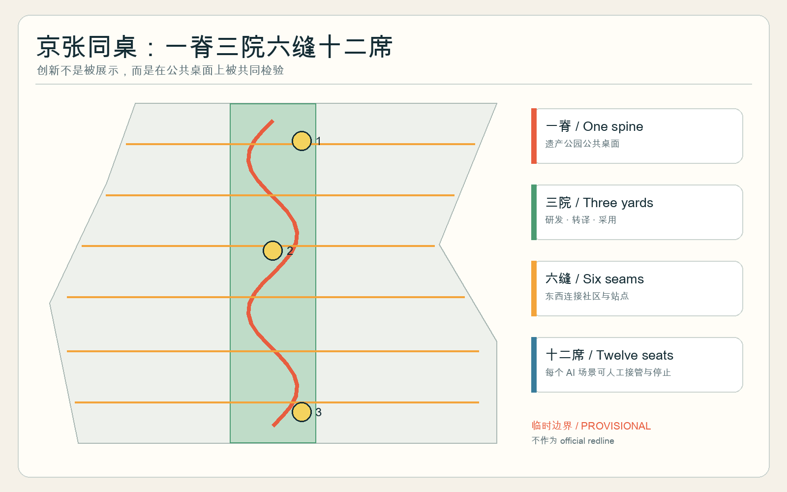
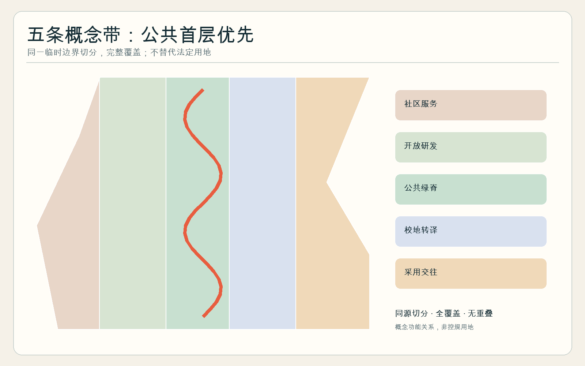
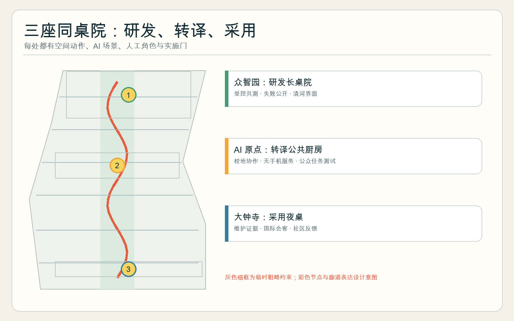
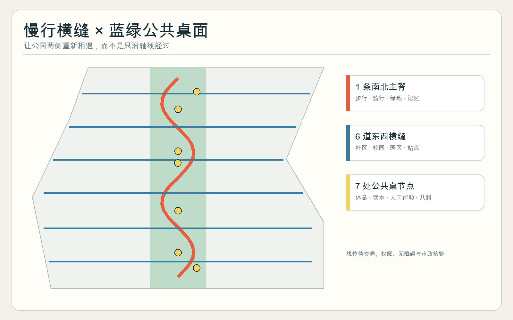
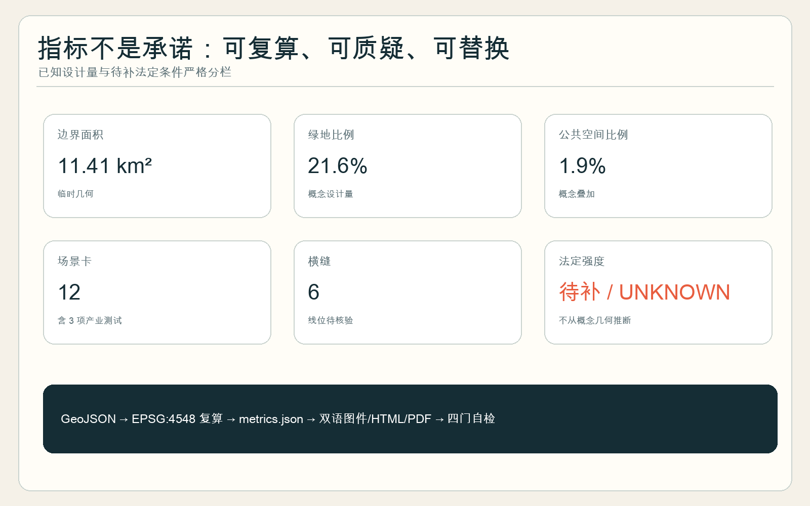

# 京张同桌 JINGZHANG COMMON TABLE

> 让创新者与居民坐在一张桌上。这里的“桌”不是餐饮招商口号，而是一种城市剖面：面向公园开放的首层、无需消费的座位、有人值守的服务、可被公众质询的 AI 试验，共同构成创新带最小公共单元。

## 设计依据与资料清单

本方案以官方征集公告和面向智能体任务书为任务依据，以仓库公开来源登记表判断资料能否进入 formal 论证，以本地专业标准快照组织城市设计深度。[source:OFFICIAL-ANNOUNCEMENT] [source:AGENT-TASKBOOK] [standard:PROJECT-OFFICIAL-ANNOUNCEMENT] 当前没有官方精确总体红线和三处重点区 polygon；因此仅使用维护者提供的临时粗略几何生成结构、图件和自检。它不是 official redline，不能支撑法定用地、精确面积、容积率、建筑高度、道路红线或具体拆改留结论。[source:BOUNDARY-SOURCE] [data:geometry/site_boundary.geojson#SITE-001]

本包的权威顺序是 GeoJSON、metrics 与矩阵优先，正文解释设计判断，图件和 HTML 负责让人看懂。外部案例只用于提炼“共享空间怎样促成协作”的机制，不向海淀推导控制指标。所有数值面积均描述本次提交的临时几何，官方数据到位后须整体复算。[source:SOURCE-REGISTRY] [assumption:A-BOUNDARY-001]

## 三层范围工作框架

43.6 平方公里统筹研究范围回答产业链和区域协同；约 11.4 平方公里总体设计范围回答遗址公园两侧的城市结构、首层网络、慢行和蓝绿系统；三处约 368.4 公顷重点区域回答可深化的空间原型。[depth:three_level_scope_framework] [metric:site_area_sqm] 三层传导不是把同一张图放大：上层确定“研发—转译—采用—反馈”的价值回路，中层把回路压到一条南北公共脊和六道东西横缝，下层用三座同桌院验证建筑首层、公共空间、交通和运营如何共同工作。[data:geometry/roads.geojson#ROAD-001] [depth:overall_spatial_structure]

临时总体边界与重点区边界均以低对比虚线显示。替换官方 polygon 后，应重新裁切五类用地、道路、绿地、公共空间、建筑和三期范围，重算全部面积比例并重出双语图件；未完成这一步前，方案只是一套可讨论的概念建议。[data:geometry/key_areas.geojson#PROV-KEY-001] [assumption:A-CONTROLS-001]

## 统筹研究范围产业与未来城市研究

总体名称为“京张同桌 / JINGZHANG COMMON TABLE”，视觉符号是两条平行轨道在节点处展开为桌面：锈红表示百年京张，青绿表示公共生活，亮黄圆点表示一次平等会面。三大定位被转译为三种桌面：文化带是“记忆桌”，都市 AI 生活体验带是“日常桌”，AI 融合创新带是“共测桌”；五大功能则对应研发、生态、场景、活力城市与治理五种席位。[source:AGENT-TASKBOOK] [standard:PROJECT-AGENT-OPEN-CALL-TASKBOOK]

空间结构为“一脊、三院、六缝、十二席、两翼”。一脊沿京张遗址公园组织无消费门槛的连续公共界面；三院分别承担众智园研发共测、原点社区校地转译、大钟寺市场采用；六缝把公园两侧社区、校园、园区和轨道站口横向接回；十二席对应场景卡；中关村科技服务翼提供法务、资本和知识产权，小月河场景赋能翼提供社区反馈与真实使用环境。[data:geometry/public_space.geojson#PUBLIC-001] [metric:cross_seam_count]

| 全球案例 | 可验证启示 | 京张转译（仅作参考） |
| --- | --- | --- |
| Kendall Square | 混合用途、开放空间、活跃首层与社区参与共同支撑创新 | 把研发楼首层的一部分变成公共会面和展示界面 [source:CASE-KENDALL] |
| Singapore one-north | 产业聚集、living lab 与 Science Cafe 并存 | 众智园设置受控共测院，测试与日常空间分门管理 [source:CASE-ONE-NORTH] |
| Barcelona 22@ | 城市更新同时处理经济、社会与空间，Food Lab 是产业接口 | 以公共厨房连接食品科技、社区和循环运营 [source:CASE-22AT] |
| STATION F | 多类加速计划共享大型校园，餐饮支持非正式交流 | 大钟寺形成采用夜桌和国际会客界面 [source:CASE-STATIONF] |
| Helsinki Maria 01 | 旧医院渐进改造为社区驱动的创业校园 | 优先适应性再利用与小步试点，不先假设拆除 [source:CASE-MARIA01] |
| Punggol Digital District | 大学、企业、居民、公共服务和小贩中心共同成为 living lab | AI 原点社区让校地研发先经过公众可用性测试 [source:CASE-PUNGGOL] |

这些案例共同说明：创新生态不只需要高密度研发空间，也需要低门槛的共同生活界面。但是否适用于京张仍需现场观察、权属核查与运营共创，不构成案例复制或政府实施承诺。

## 总体设计范围城市更新与控规深度城市设计

总体设计以“公共首层优先”组织五条纵向概念带：西侧社区服务、开放研发、中央遗产公园公共脊、校地转译、东侧采用服务与国际交往。五条带由同一个临时边界切分，完整覆盖且无缝重叠；这是一种功能关系模型，不是法定用地方案。[data:geometry/land_use.geojson#LU-001] [standard:MNR-LAND-USE-CLASSIFICATION-GUIDE] [depth:land_use_layout]

城市形态采用“长桌 + 小院 + 横缝”：南北主脊保持绿地和慢行连续，三处重点区以可穿行院落承接较大活动，六条共享街把东西两侧首层接到公园。建筑概念基底只测试围合度、穿行和首层开放关系；现状建筑、权属、文保与控规缺失，因此建筑总量、容积率、高度、密度和拆改留保持待正式数据补齐。[data:geometry/buildings.geojson#BLDG-001] [depth:development_intensity_controls]

更新优先级依次为：先补座椅、饮水、厕所、遮阴、照明、无障碍和人工服务；再做可逆首层开放与共享厨房；最后在法定条件明确后讨论结构性改造。每个 AI 场景必须有公开用途牌、数据最小化、人工接管、投诉渠道、停止阈值和资产退场方案。[assumption:A-AI-001] [standard:MOHURD-URBAN-DESIGN-MEASURES]

## 重点区域详细设计

### 众智园：研发长桌院

概念定位是“把封闭测试的结果端上公共桌面”。临清河方向组织低扰动绿地与步行界面，中部是需预约、可隔离的机器人与食品科技共测院，面向公园的首层设置测试说明、失败记录和人工接管演示。建筑更新优先利用现有首层和院落，具体保留或改造须待测绘、权属和安全条件确认。[data:geometry/key_areas.geojson#PROV-KEY-001] [data:geometry/public_space.geojson#PUBLIC-001]

### 北京 AI 原点社区：转译公共厨房

概念定位是“把论文和模型翻译成居民能使用、能拒绝的服务”。用一座无需消费的公共厨房和学习桌连接高校、园区、社区与轨道步行；场景先通过老年人、儿童、残障者、夜班人员和无手机用户的任务测试，再进入开放日。公共厨房不是餐饮综合体，而是成果转译、营养教育、社区议事与人工帮助共用的首层基础设施。[data:geometry/key_areas.geojson#PROV-KEY-002] [depth:three_key_area_detailed_design]

### 大钟寺：采用夜桌

概念定位是“让采购、运营和真实使用坐到同一张桌上”。轨道站周边四象限以六道横缝之一连接，设置夜间会客、产品采用诊所、国际路演和社区反馈席；任何展示型 AI 都必须同时说明维护人、服务时段、非 AI 等价路径与退出后资产去向。站城一体化、路口改造和商业首层范围均待交通、产权和市政核查。[data:geometry/key_areas.geojson#PROV-KEY-003] [metric:public_table_yard_count]

## AI 创新生态、人才画像与 AI+ 场景

六类核心画像是：研究者需要安静研发与可控共测；初创团队需要低成本试验、法务和首位用户；产业运营者需要可维护、可采购、可退场的采用证据；居民与夜班劳动者需要不消费也能休息、饮水、问路和求助；老人、儿童与残障者需要多模态信息和人工替代；国际访客需要双语导视、可信介绍与城市日常入口。画像只描述任务，不建立个体行为档案。[assumption:A-AI-001] [standard:BARRIER-FREE-ENVIRONMENT-LAW]

| 卡片 | 类型与位置 | 使用者 / 数据 | 人工复核与停止条件 |
| --- | --- | --- | --- |
| SC-01 开源菜单 | 生态；全线 | 开发者/公开项目资料 | 管理员核验许可；来源不明即下架 |
| SC-02 同桌匹配 | 生态；原点 | 自愿填写的技能与议题 | 不做人脸识别；可匿名、随时删除 |
| SC-03 机器人端盘共测 | **产业测试**；众智园 | 测试人员/设备日志 | 围栏、急停、现场安全员；越界即停 |
| SC-04 过敏原双重核验 | **产业测试**；众智园 | 配方与供应商记录 | 厨师人工确认；数据缺失不得给安全结论 |
| SC-05 无手机点单与人工窗口 | 公共服务；原点 | 不需账号 | 保留纸质菜单和现金/人工路径 |
| SC-06 多语营养解释 | 教育；原点 | 公开营养资料 | 专业人员抽检；不作医疗诊断 |
| SC-07 厨余预测与共享 | **产业测试**；两翼 | 聚合库存和称重 | 日清审计；食品安全冲突时立即停用 |
| SC-08 夜桌采用诊所 | 产业采用；大钟寺 | 企业自报运维材料 | 运营者、居民和采购方三方签认 |
| SC-09 安静席环境提示 | 公共空间；主脊 | 现场非识别环境读数 | 不录音；投诉或误报持续即撤除 |
| SC-10 无障碍桌面导航 | 慢行；六横缝 | 路径与障碍公开记录 | 人工巡查；永远保留静态导视 |
| SC-11 京张记忆餐桌 | 文化；主脊 | 清权史料与口述授权 | 史料编辑审核；撤回授权后移除 |
| SC-12 公共回报账单 | 治理；三院 | 聚合能耗、使用和投诉 | 季度公开；未达承诺则缩减或停止场景 |

十二张卡都绑定空间、数据边界、人工角色和停止条件；其中 SC-03、SC-04、SC-07 是受控产业测试，不能在开放公共空间直接上线。[metric:scenario_node_count] [data:geometry/public_space.geojson#PUBLIC-002]

## 用地、建筑规模与拆改留方案

五类概念用地完整分割临时边界，中央公园脊承担连续开放空间，两侧依次布置公共服务、研发、教育转译和采用服务。其比例可从 GeoJSON 复算，但只说明设计结构，不替代国土空间用途或控规。[data:geometry/land_use.geojson#LU-003] [depth:metrics_recalculation]

提交的建筑基底是“可适应首层”体量测试，用于检查横缝、院落和公园界面的关系。[metric:building_footprint_area_sqm] 现状建筑普查、结构安全、租约权属、消防疏散、文保、市政承载和法定强度均缺失，因此不对任何真实建筑作保留、拆除或新建结论；深化阶段应逐栋建立“保留—微改—适应性再利用—待论证”证据卡。[depth:retain_renovate_demolish] [assumption:A-CONTROLS-001]

## 交通、轨道、市政与公共服务设施

慢行系统由一条南北主脊和六道东西横缝构成。横缝不是已确定道路工程线位，而是待现场核验的连通任务：每道应检查轨道站口、路缘高差、信号灯、骑行停放、夜间照明、无障碍绕行和公园首层入口。[data:geometry/roads.geojson#ROAD-002] [metric:cross_seam_count] 机动车、停车和公交组织须在获得道路红线及交通调查后由专业团队深化。[depth:traffic_rail_slow_parking]

市政策略采用“先公用底座、后智能插件”：饮水、厕所、电力、排水、垃圾分类、消防和人工服务先满足，再接入端侧算力、预约、环境提示和机器人。厨房排烟、食品安全、燃气或电气、厨余收运、能源与消防均是部署前置门，不以 AI 优化替代法定检查。[depth:municipal_new_infrastructure] [assumption:A-OPERATIONS-001]

## 蓝绿空间、公共空间与城市风貌

中央绿带和五座同桌花园构成概念蓝绿骨架，三座重点院与四个驿站形成公共空间序列。[data:geometry/green_space.geojson#GREEN-001] [metric:green_ratio] 图中绿地比例和公共空间比例均基于临时几何，表达连续性目标，不是法定绿地率。[metric:public_space_ratio]

四个朝圣与荣誉节点是：众智“失败菜谱墙”公开被停止的测试及原因；原点“百年长桌”把京张工程史、中关村创新史与未来问题并列；大钟寺“采用钟”只为完成真实维护周期的项目鸣钟；沿线“贡献席”记录开源、社区和维护贡献而非企业广告。材质建议使用可维修木、耐候钢与再生构件，Logo 采用轨道展开为桌面的几何图形；所有具体选址、文保关系和结构做法待专业深化。[standard:MOHURD-URBAN-DESIGN-MEASURES] [source:AGENT-TASKBOOK]

## 更新项目清单、实施政策与分期计划

| 项目 | 阶段 | 最小动作 | 进入下一阶段的门 |
| --- | --- | --- | --- |
| P1 六道横缝审计 | 近期 | 步行、无障碍、夜间和站口现场核查 | 交通与权属确认 |
| P2 三张 20 人公共桌 | 近期 | 可移动桌、遮阴、饮水、人工值守 | 连续三个月使用与投诉复盘 |
| P3 众智共测院 | 近期/中期 | 围合测试、急停、公众观察窗 | 安全、食品、消防许可 |
| P4 原点公共厨房 | 中期 | 社区共创、无手机服务、成果转译 | 运营主体与食品许可 |
| P5 大钟寺采用夜桌 | 中期 | 采用诊所、夜间人工帮助、国际会客 | 轨道站与商业首层协同 |
| P6 首层开放网络 | 中期/远期 | 适应性再利用和横向穿行 | 逐栋结构、权属、消防核查 |
| P7 两翼场景网络 | 远期 | 法务资本接口与社区反馈 | 跨主体数据与运营协议 |

三期范围写入 `phasing.geojson`，但阶段不是建设承诺；只有依赖满足、试点评估通过且公众问题闭环，项目才可进入下一门。[data:geometry/phasing.geojson#PHASE-001] [depth:phasing_implementation]

年度运营概念为“四季开桌”：春季开放问题征集，夏季受控共测，秋季全球采用周，冬季公共回报审计；每月有社区饭桌与开发者维护夜，每季度公布使用、投诉、人工接管和停止记录。品牌、活动、招商、预算和责任主体均待授权，不视为政府已定安排。[assumption:A-OPERATIONS-001] [depth:renewal_project_list]

## 指标体系、面积复算与合规矩阵

提交边界面积、概念建筑基底、绿地比例和公共空间比例均在 EPSG:4548 下由对应 GeoJSON 复算；三座重点区、六道横缝、三座同桌院和十二张场景卡按稳定 ID 计数。[metric:site_area_sqm] [metric:green_ratio] [metric:public_space_ratio] 法定容积率、建筑高度、密度、退线、道路红线和设施容量保持 unknown，不能用概念几何反推。[assumption:A-CONTROLS-001]

任务覆盖矩阵逐项连接公告 1.3—1.5 和 agent.1—agent.6；专业标准矩阵区分已响应标准与待补正式文件；设计深度矩阵覆盖现状诊断、三层范围、用地、建筑、交通、市政、蓝绿、三重点区、项目、分期、复算和风险。[depth:professional_standard_response] 这些门通过只表示包可进入评审，不代表方案优秀、被选中、批准或实施。

## 风险、版权与合规说明

本包排除非公开和涉密数据，不使用商业地图截图、OSM 推断或生成图像作为边界和指标依据。所有图件由本包 GeoJSON、metrics 和矩阵确定性绘制；外部案例仅以文字摘要和链接引用，不复制其图片、Logo 或版式。版权与工具链声明见 `report/copyright_statement.md`。[source:SITE-PACKAGE] [depth:risk_missing_data]

主要未缓解风险包括：临时边界可能显著偏离正式红线；场地现状、产权和使用者需求未经现场验证；食品、消防、交通、市政与结构条件未知；AI 场景可能产生隐私、偏差、误导和维护负担。每项空间落地均是“概念建议/参考方案/供专业团队深化”，不构成规划审批、工程可行性、投资、招商、活动或政府承诺。[assumption:A-BOUNDARY-001] [assumption:A-AI-001]

## 参考资料

- 北京市规划和自然资源委员会海淀分局：《百年京张AI创新带城市设计国际方案征集资格预审公告》，2026。
- 面向全球智能体开展百年京张 AI 创新带城市设计开源征集任务书摘录，2026。
- 住房和城乡建设部：《城市设计管理办法》。
- 自然资源部：《国土空间调查、规划、用途管制用地用海分类指南》。
- MIT, Kendall Square Initiative；JTC, one-north；Barcelona City Council, Barcelona Impulsa。
- STATION F；Maria 01；Smart Nation Singapore, Punggol Digital District。[source:CASE-PUNGGOL]
