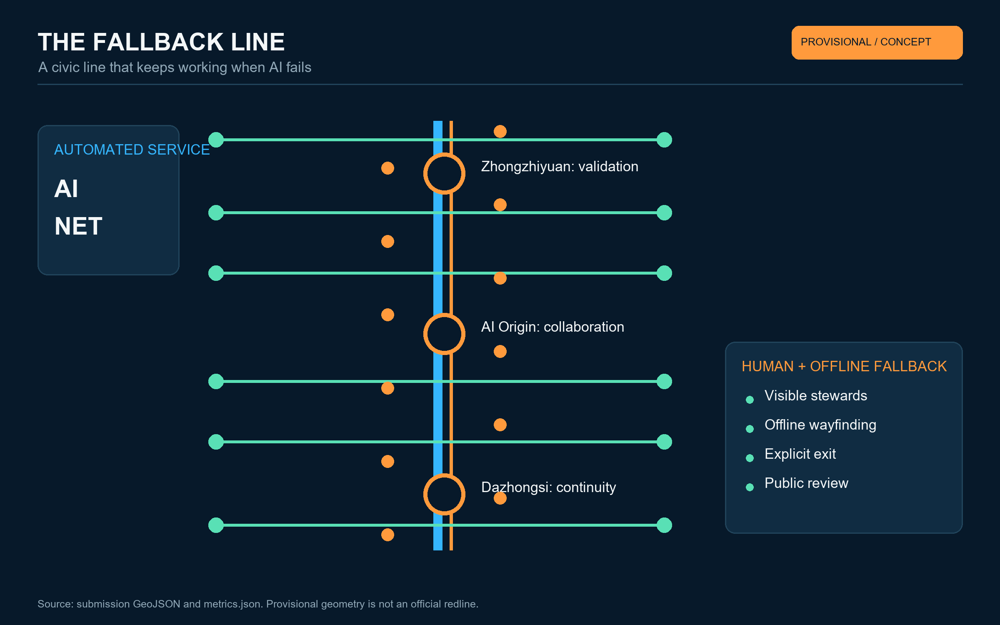
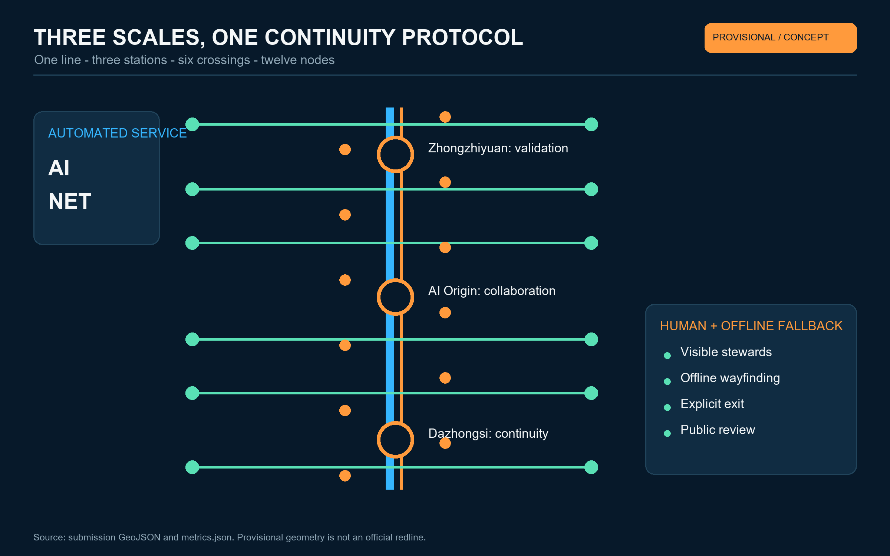
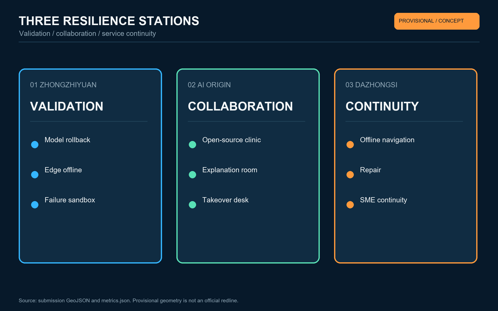
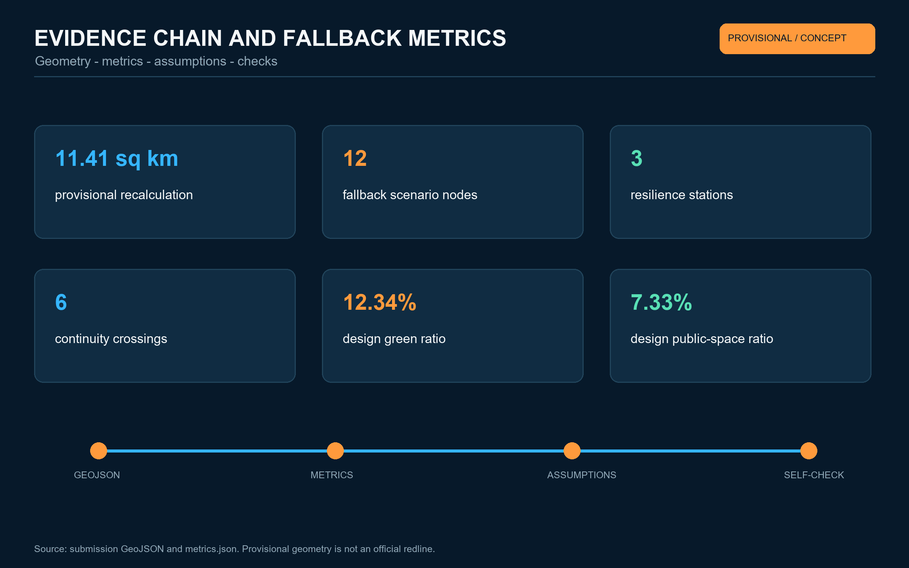

# THE FALLBACK LINE / 京张备线

> An advanced AI city should not promise that nothing fails. It should guarantee that people can continue living when something does.

## Design Basis and Source List

The official prequalification announcement and the cleared Agent taskbook define the assignment; registered professional standards define the planning language. No official exact polygon, parcel ownership, regulatory indicators, road redlines or municipal capacities are publicly available. The package therefore uses the repository's rough provisional geometry only to test a coherent concept. It is not an approved plan or engineering conclusion. [source:OFFICIAL-ANNOUNCEMENT] [source:AGENT-TASKBOOK] [depth:existing_conditions_diagnosis]

The proposal translates railway sidings, signals, staffed operation and incident review into a civic resilience protocol. Every service that depends on models, networks, compute or automated devices receives a visible human entrance, minimum service mode, exit condition and review record. Provisional limits appear as low-contrast dashed constraints; all displayed quantities are recomputed from one GeoJSON set and must be regenerated when official attachments arrive. [data:geometry/site_boundary.geojson#SITE-001] [source:BOUNDARY-SOURCE]

## Three-Level Scope Framework

At the 43.6 km² coordinated research scale, the project studies a regional loop of technology supply, public validation, daily use and accountable review. At the roughly 11.4 km² design scale, the Jing-Zhang Railway Heritage Park becomes a continuous public fallback line. Within three provisional key areas, safety validation, human collaboration and service continuity become spatial prototypes. [standard:PROJECT-OFFICIAL-ANNOUNCEMENT] [depth:three_level_scope_framework]

The spatial grammar is “one line, three stations, six crossings, twelve nodes.” The line is a low-dependency north-south walking and service spine; three stations correspond to Zhongzhiyuan, the Beijing AI Origin Community and Dazhongsi; six crossings repair east-west interfaces; twelve nodes host scenario cards. These are references for professional development and do not create statutory boundaries. [data:geometry/roads.geojson#ROAD-001] [depth:overall_spatial_structure]

## Coordinated Research Area: Industry and Future City Research

The name is “THE FALLBACK LINE / 京张备线.” Its symbol borrows the diverging rails of a siding: signal blue means automated service, staffed orange means human takeover, and a white gap marks an explicit exit and review point. The identity turns graceful degradation into a legible public value instead of promising technological omnipotence. Three positionings and five functions are reorganised as a loop from full-stack technology to safety validation, scenario opening, daily service and governance review. [standard:PROJECT-AGENT-OPEN-CALL-TASKBOOK] [source:AGENT-TASKBOOK]

Six international references are used as mechanism studies rather than visual templates: Singapore one-north, Paris STATION F, Helsinki Maria 01, Toronto MaRS, Kendall Square in the United States, and Brainport Eindhoven. Transferable lessons concern shared space, service platforms, open programmes, cross-institutional governance and continuous evaluation. Source URLs and limits are recorded in `sources.json`; every precedent must be rechecked before professional adaptation. [source:CASE-PORTFOLIO]

| Reference | Mechanism | Jing-Zhang translation |
| --- | --- | --- |
| one-north | Research, industry, living and public-space mix | Three stations and two wings form a service loop |
| STATION F | Concentrated startup support and community | A continuity marketplace at Dazhongsi |
| Maria 01 | Community operation and frequent small events | A co-learning courtyard for stewards and developers |
| MaRS | Interface among research, enterprise and public issues | A publicly reviewable validation station |
| Kendall Square | Walkable proximity of universities and companies | Repair campus-park-community walking links |
| Brainport Eindhoven | Long-term regional collaboration | Two wings supply services and scenario feedback |

## Overall Design Area: Urban Renewal and Regulatory-Plan-Level Urban Design

Renewal priority is defined by continuity of service rather than demolition. Conceptual units are grouped as retain-and-connect, light retrofit, reversible addition and pending survey. Each unit first receives accessible routes, shade and seating, safe lighting, staffed help and offline wayfinding. Heights, FAR, density and parcel-level actions remain pending official controls and survey evidence. [standard:MOHURD-CONTROL-DETAILED-PLANNING] [depth:retain_renovate_demolish]

Land-use polygons fully partition the provisional design boundary only as a functional experiment. Public service, research, mixed daily life and open green space connect through six east-west interfaces. Road geometry expresses movement relationships rather than engineering alignments; building geometry represents reversible spatial prototypes rather than ownership or approved scale. [data:geometry/land_use.geojson#LU-001] [data:geometry/buildings.geojson#BLDG-001] [depth:land_use_layout]

## Detailed Design of Key Areas

Zhongzhiyuan becomes the Resilience Validation Station. A garden test corridor supports model rollback, edge-offline operation, low-speed device failure and data-minimisation trials. Tests are graded, contained, staffed and immediately stoppable. Riverside and green interfaces accept only low-impact removable elements; the provisional polygon is not an official boundary. [data:geometry/key_areas.geojson#PROV-KEY-001] [depth:three_key_area_detailed_design]

The Beijing AI Origin Community becomes the Human Collaboration Station. An open-source clinic, model explanation room, accessible translation court and takeover desk connect university research with daily life. Every exhibit shows limits, failure examples, a human contact and an exit path. Ground floors, courtyards and existing public interfaces are preferred; building treatment awaits ownership and survey data. [data:geometry/key_areas.geojson#PROV-KEY-002]

Dazhongsi becomes the Service Continuity Station. Four-quadrant walking and metro interchange remain conceptual pending transport evidence. Commercial interfaces host offline payment guidance, staffed support, offline navigation, device repair and small-business continuity services. Night mode relies on legible lighting and visible stewards rather than pervasive advertising screens. [data:geometry/key_areas.geojson#PROV-KEY-003]

## AI Innovation Ecosystem, Personas, and AI+ Scenarios

Eight ecosystem elements are coordinated: university research, open-source communities, enterprise products, test scenarios, compute and data, professional services, public oversight and international exchange. The Zhongguancun service wing provides intellectual-property, compliance, talent and finance interfaces; the Xiaoyuehe scenario wing provides low-risk daily trials and feedback. Every scenario follows sandbox, limited deployment, public review, then expansion or exit, with human final judgement. [source:AGENT-TASKBOOK] [depth:municipal_new_infrastructure]

Six personas are recognised: researchers and developers; startups and small businesses; residents and older adults; students and young families; maintenance and frontline service workers; visitors and mobility-impaired users. Success is judged by whether the least advantaged user can find a human, understand system status and finish an essential task.

| # | Scenario card | Space | Fallback rule |
| --- | --- | --- | --- |
| 01 | Accessible walking assistant | Six crossings | High-contrast offline signs when positioning fails |
| 02 | Offline public-service desk | Three staffed points | Human ticket intake replaces failed automation |
| 03 | Multilingual heritage guide | Heritage park | Offline text works without recognition permission |
| 04 | Older-adult service companion | Community interface | No substituted decisions; paper route retained |
| 05 | SME continuity copilot | Dazhongsi | Staffed checklist and templates when model fails |
| 06 | Energy demand-shift advice | Public-building interface | Advice only, no automatic control, one-click exit |
| 07 | Open-source explanation room | AI Origin | Capabilities, limits, version and contact co-displayed |
| 08 | Night safe-meeting point | Walking node | Lighting and response without facial tracking |
| 09 | Emergency communication mesh | Stations and crossings | Local notice and staffed broadcast when offline |
| 10 | Model rollback yard (industry test) | Zhongzhiyuan | Stop on failure; record version and accountable owner |
| 11 | Edge-offline desk (industry test) | AI Origin | No personal upload; human review of output |
| 12 | Low-speed device failure sandbox (industry test) | Zhongzhiyuan | Physical separation, emergency stop and steward |

The twelve nodes are encoded as conceptual features in the public-space layer rather than counted from artwork. [metric:fallback_node_count] [data:geometry/public_space.geojson#FALLBACK-01]

## Land Use, Building Scale, and Retain-Renovate-Demolish Strategy

The provisional land-use partition uses registered territorial classification semantics and preserves complete topology. Building actions are retain, low-impact retrofit, reversible addition and pending verification. The proposal does not infer age, height, ownership or demolition from missing evidence. Reversible additions include light canopies, offline signs, movable steward desks and universal power interfaces. [standard:MNR-LAND-USE-CLASSIFICATION-GUIDE] [depth:height_massing_character]

The design-layer building footprint totals about 310,807 m². This is neither an existing-building inventory nor an approved construction scale. FAR and height remain pending official data. [metric:building_footprint_area_sqm] [depth:development_intensity_controls]

## Transport, Rail, Municipal Infrastructure, and Public Services

Walking, cycling and accessibility continuity lead the transport concept. One north-south fallback line links three stations; six east-west interfaces connect communities, campuses, parks and transit. Station integration, road sections, bridges, tunnels and parking require official redlines, surveys and safety review; current geometry only expresses relationships. [data:geometry/roads.geojson#ROAD-001] [depth:traffic_rail_slow_parking]

Municipal and digital infrastructure follow dual paths. The digital path includes edge compute, status notices and device-health checks; the basic path includes readable signs, staffed help, water, lighting, emergency stop and paper contacts. Energy, communications and compute proposals await capacity, fire, utility and maintenance evidence. [standard:MOHURD-URBAN-DESIGN-MEASURES]

## Blue-Green Network, Public Space, and Urban Character

The heritage park is treated as continuous public ground for minimum urban service. Green and civic spaces alternate along the walking line so people can see a steward, find a route and pause safely. Industrial railway scale and linear memory remain visible. Three pilgrimage landmarks - the Rollback Bell, Human Takeover Desk and Public Failure Archive - honour contribution, repair and responsibility instead of corporate celebrity. [data:geometry/green_space.geojson#GREEN-001] [depth:blue_green_public_space]

Within provisional design geometry, green-space ratio is about 12.34% and public-space ratio about 7.33%. These are internal concept metrics, not official planning controls, and must be recomputed after official polygons arrive. [metric:green_ratio] [metric:public_space_ratio]

## Renewal Projects, Implementation Policy, and Phasing

Six project families are proposed: walking-gap repair, staffed interfaces, offline wayfinding, three station prototypes, a public failure archive and annual open programmes. Phase 1 (0-1 year) tests reversible components, protocols and baseline surveys. Phase 2 (1-3 years) develops stations and crossings after official evidence and professional review. Phase 3 expands only where public evaluation demonstrates value. [data:geometry/phasing.geojson#PHASE-001] [depth:phasing_implementation]

The annual operating concept includes a spring Failure Open Class, summer City Offline Day, autumn Developer Rollback Week and winter Public Service Continuity Review. Developers maintain an open test list; residents and frontline workers participate in acceptance; international communication reports completed tests and evidence, never promised government events. [depth:renewal_project_list]

## Metrics, Area Recalculation, and Compliance Matrix

Known metrics are recomputed from GeoJSON in EPSG:4548 and the HTML shows only values matching `metrics.json`. The provisional design polygon measures about 11,412,825 m², consistent in order of magnitude with the announced “about 11.4 km²” but not an exact official redline. There are three key areas, twelve fallback nodes and three resilience stations. [metric:site_area_sqm] [metric:key_area_count] [depth:metrics_recalculation]

The package also registers three resilience stations and six continuity crossings for later recomputation once official boundaries and engineering surveys are available; conceptual points are not construction coordinates. [metric:resilience_station_count] [metric:continuity_crossing_count]

The compliance matrix covers announcement clauses 1.3-1.5 and agent.1-agent.6. Standard and design-depth matrices connect each judgement to geometry, metrics, drawings, sources, assumptions and checks. They form the machine-audit layer; prose keeps only claim-adjacent anchors. [standard:MOHURD-CONTROL-DETAILED-PLANNING]

## Risk, Copyright, and Compliance

The primary risk is misreading provisional geometry as an official redline. Other gaps concern regulatory controls, roads, buildings, heritage, utilities and ownership. All spatial, operating and policy moves are open co-creation references for professional development; they are not approval, acquisition, investment, construction or government commitments. Official data must trigger topology replacement, metric recalculation and complete artifact regeneration. [source:SOURCE-REGISTRY] [depth:risk_missing_data]

Codex generated the prose, figures, HTML and PDFs from public or cleared repository inputs and this package's structured data. No commercial map screenshot, remote image, portrait or corporate mark is used. International cases remain mechanism references with source records. System fonts are used for local rendering and subset PDF embedding; font files are not distributed. See `report/copyright_statement.md`.

## References

- Haidian Branch of the Beijing Municipal Commission of Planning and Natural Resources, official prequalification announcement. [source:OFFICIAL-ANNOUNCEMENT]
- Cleared Agent open-call taskbook excerpt. [source:AGENT-TASKBOOK]
- MOHURD, Measures for the Administration of Urban Design and control-detailed-planning rules. [standard:MOHURD-URBAN-DESIGN-MEASURES]
- Ministry of Natural Resources, territorial land-use classification guide. [standard:MNR-LAND-USE-CLASSIFICATION-GUIDE]
- This package's `sources.json`, `assumptions.json`, `metrics.json` and `geometry/` form the complete evidence record.
