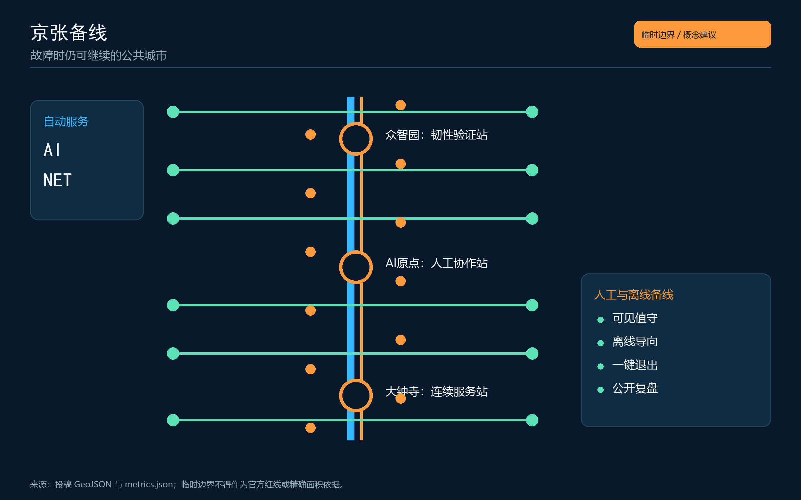
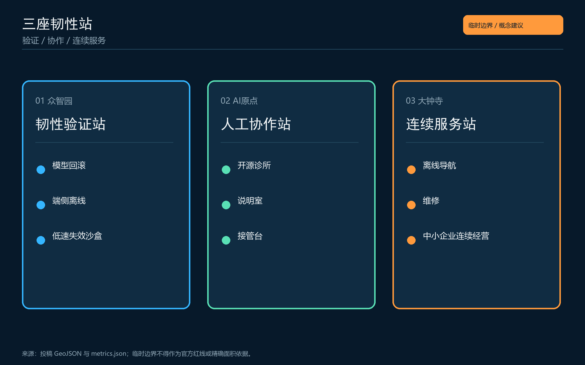
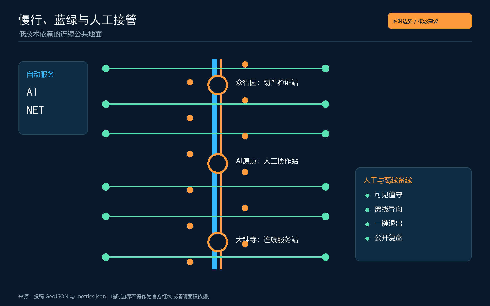
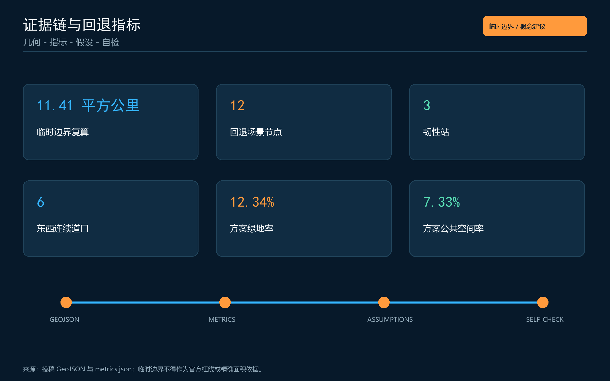

# 京张备线 / THE FALLBACK LINE

> 一条先进的 AI 城市，不以“永不出错”为承诺，而以“出错时人仍能继续生活”为底线。

## 设计依据与资料清单

本方案以官方资格预审公告和清权的智能体任务书为任务依据，以仓库登记的专业标准为设计语言。当前公开资料尚无官方精确红线、地块权属、控规指标、道路红线与市政容量，因此空间成果使用仓库临时粗略边界，只表达概念结构与可复核的设计关系，不构成审定规划或工程结论。[source:OFFICIAL-ANNOUNCEMENT] [source:AGENT-TASKBOOK] [depth:existing_conditions_diagnosis]

“京张备线”把铁路系统中的备线、信号、人工值守和事故复盘转译为 AI 城市的公共韧性协议：任何依赖模型、网络、算力或自动设备的服务，都应同时拥有可见的人工入口、最低服务模式、退出条件和复盘记录。临时边界被画成低对比虚线，所有面积与比例均来自同一套 GeoJSON 复算；正式附件到位后须整链更新。[data:geometry/site_boundary.geojson#SITE-001] [source:BOUNDARY-SOURCE]

## 三层范围工作框架

在 43.6 平方公里统筹研究范围，方案研究“技术供给—公共验证—日常使用—责任复盘”的区域协作；在约 11.4 平方公里总体设计范围，以京张遗址公园形成连续公共备线；在三处临时重点区内，分别落位安全验证、人工协作和服务连续性三类空间原型。三层关系由研究到设计再到验证逐级收敛，而非以同一强度铺满全域。[standard:PROJECT-OFFICIAL-ANNOUNCEMENT] [depth:three_level_scope_framework]

总体空间语法为“一线、三站、六道口、十二节点”：一线是南北连续的低技术依赖慢行与公共服务脊；三站对应众智园、AI 原点社区和大钟寺；六道口是东西向缝合界面；十二节点承载场景卡。它们均为可供专业团队深化的参考方案，不新增法定红线。[data:geometry/roads.geojson#ROAD-001] [depth:overall_spatial_structure]

## 统筹研究范围产业与未来城市研究

品牌主名称为“京张备线”，英文名为 “THE FALLBACK LINE”。识别符号取自铁路侧线的双轨分岔：主色“信号蓝”表示自动服务，暖色“值守橙”表示人工接管，白色断口表示明确的退出与复核点。命名不承诺技术全能，而把“可回退”变成国际可读的公共价值。三大定位分别对应文化记忆的连续、AI 生活的最低保障和创新系统的可验证；五大功能则被组织成从全栈技术、安全验证、场景开放、日常服务到治理复盘的闭环。[standard:PROJECT-AGENT-OPEN-CALL-TASKBOOK] [source:AGENT-TASKBOOK]

六个国际案例作为机制参照而非照搬对象：新加坡 one-north 的混合创新片区、巴黎 STATION F 的创业服务聚合、赫尔辛基 Maria 01 的社区化运营、多伦多 MaRS 的研究转化接口、美国 Kendall Square 的校企邻近网络、荷兰 Brainport Eindhoven 的区域协同。可转化的不是建筑形象，而是共同空间、服务平台、开放活动、跨机构治理和持续评估；案例来源及适用限制记录在 `sources.json`，在深化前仍需逐项核实许可与时效。[source:CASE-PORTFOLIO]

| 案例 | 可借鉴机制 | 京张转译 |
| --- | --- | --- |
| one-north | 研究、产业、居住与公共空间混合 | 三站与两翼形成跨片区服务回路 |
| STATION F | 集中创业服务与开放社群 | 大钟寺设置服务连续性市场 |
| Maria 01 | 社区运营与高频小型活动 | AI 原点形成值守者与开发者共学庭 |
| MaRS | 研究成果、资本与公共议题接口 | 众智园设置可公开复盘的验证站 |
| Kendall Square | 高校与企业步行邻近 | 校园、园区、社区之间补齐慢行接口 |
| Brainport Eindhoven | 区域主体长期协同 | 两翼提供技术服务与场景反馈 |

## 总体设计范围城市更新与控规深度城市设计

城市更新不以大拆大建为前提，而以“连续服务能力”识别优先级。京张遗址公园两侧的概念性更新单元分为：保留并接入、轻改造、可逆增补、待资料核实四类。每个单元先补齐无障碍路径、遮阴休息、夜间照明、人工服务点和断网导向，再讨论数字设施。建筑高度、容积率、密度与具体拆改留均待正式控规和现状调查确认。[standard:MOHURD-CONTROL-DETAILED-PLANNING] [depth:retain_renovate_demolish]

用地分区完整覆盖临时设计边界，但仅作为功能组织实验。公共服务、创新研发、混合生活与开放绿地通过六处东西向接口连接南北备线；道路图层表达慢行和接驳关系，不表达工程线位；建筑图层表达可逆更新的空间原型，不表达现状权属与审定规模。[data:geometry/land_use.geojson#LU-001] [data:geometry/buildings.geojson#BLDG-001] [depth:land_use_layout]

## 重点区域详细设计

众智园定位为“韧性验证站”：以花园型测试廊串联模型回滚、端侧离线、机器人低速失效和数据最小化四类公开验证。测试必须分级、围合、有人值守并可立即停止；清河与绿地界面只布置低扰动、可拆卸设施。该区临时 polygon 不代表官方片区边界。[data:geometry/key_areas.geojson#PROV-KEY-001] [depth:three_key_area_detailed_design]

AI 原点社区定位为“人工协作站”：面向高校成果转化与日常生活，设置开源诊所、模型说明室、无障碍共译庭和人工接管台。成果展示必须同时展示适用条件、失败样例、人工联系人与退出方式；空间更新优先利用首层、院落和既有公共界面，具体建筑处置待权属与现状资料核实。[data:geometry/key_areas.geojson#PROV-KEY-002]

大钟寺定位为“连续服务站”：四象限步行连通与地铁接驳仅作概念组织，在商业与商务界面设置断网支付指引、人工客服、离线导航、设备维修与中小企业连续经营服务。夜间模式强调清晰照明、可见值守和低刺激信息界面，不把公共空间变成广告屏幕。[data:geometry/key_areas.geojson#PROV-KEY-003]

## AI 创新生态、人才画像与 AI+ 场景

创新生态由八类要素构成：高校研究、开源社区、企业产品、测试场景、算力与数据、专业服务、公共监督、国际交流。中关村科技服务翼提供知识产权、合规、人才和融资接口；小月河场景赋能翼提供低风险日常试用与反馈。任何场景上线都经过“沙盒—小范围—公开复盘—扩大或退出”四步，并保留人工最终判断。[source:AGENT-TASKBOOK] [depth:municipal_new_infrastructure]

六类用户画像分别是科研开发者、初创与中小企业经营者、社区居民与老人、学生与青年家庭、园区运维和一线服务人员、访客与行动不便者。评价重点不是平均效率，而是最不利状态下能否找到人工入口、理解系统状态并继续完成基本事务。

| # | 场景卡 | 空间 | 回退规则 |
| --- | --- | --- | --- |
| 01 | 无障碍慢行助手 | 六处缝合口 | 定位失效时切换高对比离线导向 |
| 02 | 断网公共服务柜台 | 三站值守点 | 自动表单失效后转人工编号受理 |
| 03 | 多语文化导览 | 遗址公园 | 无识别权限也可使用离线文本 |
| 04 | 老人办事陪同 | 社区公共界面 | 禁止代替本人决定，保留纸质路径 |
| 05 | 中小企业连续经营助手 | 大钟寺 | 模型不可用时提供人工清单与模板 |
| 06 | 能源需求移峰建议 | 公共建筑界面 | 只建议不自动控制，可一键退出 |
| 07 | 开源成果说明室 | AI 原点 | 同屏展示能力、限制、联系人和版本 |
| 08 | 夜间安全结伴点 | 慢行节点 | 不做人脸追踪，以照明和人工响应为主 |
| 09 | 应急通信网格 | 三站与六道口 | 断网时启用本地公告和人工广播 |
| 10 | 模型回滚试验场（产业验证） | 众智园 | 失败即停机并记录版本与责任人 |
| 11 | 端侧离线服务台（产业验证） | AI 原点 | 不上传个人内容，人工复核输出 |
| 12 | 低速设备失效沙盒（产业验证） | 众智园 | 物理隔离、急停、值守和退出评估 |

十二个场景节点已作为概念点位写入公共空间图层，数量来自结构化数据而非插图计数。[metric:fallback_node_count] [data:geometry/public_space.geojson#FALLBACK-01]

## 用地、建筑规模与拆改留方案

临时用地分区采用国土空间分类语义并保持拓扑完整，重点表达公共韧性功能如何嵌入混合城区。建筑策略按“保留使用、低扰动改造、可逆增补、待核实”管理；不根据缺失数据推断建筑年代、高度、权属或拆除结论。可逆增补采用轻型雨棚、离线信息牌、可移动值守台和通用电源接口，便于后续专业团队调整。[standard:MNR-LAND-USE-CLASSIFICATION-GUIDE] [depth:height_massing_character]

临时边界复算的建筑基底面积为约 310,807 平方米，但该值只描述方案图层，不是现状建筑总量或审定建设规模；容积率和建筑高度保持“待正式数据补齐”。[metric:building_footprint_area_sqm] [depth:development_intensity_controls]

## 交通、轨道、市政与公共服务设施

交通体系优先保证步行、骑行和无障碍连续：一条南北备线串联三站，六处东西接口连接社区、园区和轨道站。轨道站一体化、道路断面、桥隧与停车工程均须在正式红线、交通调查和安全论证后深化；当前图层只表达接驳关系与服务节点。[data:geometry/roads.geojson#ROAD-001] [depth:traffic_rail_slow_parking]

市政与新基建采用“双路径”原则：数字路径包括端侧算力、状态公告和设备健康检查；基础路径包括可读标识、人工值守、公共饮水、照明、急停和纸质联系。任何能源、通信和算力设施均须等待容量、消防、管线与运维责任资料，不在本阶段给出工程参数。[standard:MOHURD-URBAN-DESIGN-MEASURES]

## 蓝绿空间、公共空间与城市风貌

京张遗址公园被视为城市最低服务的连续公共地面。绿地与公共空间沿慢行线交替形成“看得见人、找得到路、停得下来”的节点：保留铁路工业尺度和线性记忆，以低饱和信号蓝、值守橙与材料本色建立识别。三处 AI 朝圣地标分别为“回滚钟”“人工接管台”“公共故障档案墙”，它们展示贡献、失败修复与责任交接，而非塑造企业崇拜。[data:geometry/green_space.geojson#GREEN-001] [depth:blue_green_public_space]

按临时设计图层复算，绿地率约 12.34%，公共空间率约 7.33%。这些是本次概念方案内部一致性指标，不是官方绿地率或控规指标；正式边界和控制条件发布后须重算。[metric:green_ratio] [metric:public_space_ratio]

## 更新项目清单、实施政策与分期计划

项目包分为六类：连续慢行补点、人工值守界面、离线导向系统、三站试验空间、公共故障档案、年度开放活动。第一期（0-1 年）以可逆小构件、制度原型和基线调查为主；第二期（1-3 年）在正式资料与专业论证后深化三站和六道口；第三期（3 年以后）只在公开评估证明确有公共价值时扩大。[data:geometry/phasing.geojson#PHASE-001] [depth:phasing_implementation]

年度运营概念包括春季“故障公开课”、夏季“城市离线日”、秋季“开发者回滚周”和冬季“公共服务连续性评估”。开发者社区维护开放测试清单，居民与一线工作者参与场景验收，国际传播只报告已完成的测试与证据，不把设想活动描述为政府承诺。[depth:renewal_project_list]

## 指标体系、面积复算与合规矩阵

所有已知指标均由 GeoJSON 以 EPSG:4548 复算，HTML 仅显示与 `metrics.json` 一致的数值。临时设计边界复算面积约 11,412,825 平方米，与公告“约 11.4 平方公里”量级一致，但不能据此声称官方精确红线。三处重点区数量为 3，场景节点为 12，韧性站为 3。[metric:site_area_sqm] [metric:key_area_count] [depth:metrics_recalculation]

方案同时登记 3 座韧性站和 6 处连续性穿越点，便于在正式边界与工程测绘补齐后逐项复算，而不把概念点位误当成施工坐标。[metric:resilience_station_count] [metric:continuity_crossing_count]

任务覆盖矩阵逐条响应公告 1.3-1.5 和 agent.1-agent.6；专业标准矩阵解释每项判断的依据；设计深度矩阵记录图层、指标、图纸、来源、假设与自检。它们是机器审计层，正文只保留与判断直接相关的证据锚点。[standard:MOHURD-CONTROL-DETAILED-PLANNING]

## 风险、版权与合规说明

首要风险是临时边界被误读为官方红线，其次是缺失控规、道路、建筑、文保、市政和权属资料。所有空间落位、活动机制与政策工具均为开放共创建议，可供专业团队深化；不得用于审批、征拆、投资、施工或确定政府承诺。正式资料到位后必须替换边界、重建拓扑、重算指标并重新生成全部图件。[source:SOURCE-REGISTRY] [depth:risk_missing_data]

正文、图件、HTML 与 PDF 由 Codex 根据仓库公开/清权资料和本投稿结构化数据生成；未使用商业地图截图、远程图片、人物肖像或企业商标。国际案例仅作为机制参照并保留来源记录。系统字体只用于本地渲染和 PDF 子集嵌入，字体文件不随投稿分发。详细版权声明见 `report/copyright_statement.md`。

## 参考资料

- 北京市规划和自然资源委员会海淀分局：《百年京张AI创新带城市设计国际方案征集资格预审公告》。[source:OFFICIAL-ANNOUNCEMENT]
- 面向全球智能体开源征集任务书摘录。[source:AGENT-TASKBOOK]
- 住房和城乡建设部：《城市设计管理办法》《城市、镇控制性详细规划编制审批办法》。[standard:MOHURD-URBAN-DESIGN-MEASURES]
- 自然资源部：《国土空间调查、规划、用途管制用地用海分类指南》。[standard:MNR-LAND-USE-CLASSIFICATION-GUIDE]
- 本投稿 `sources.json`、`assumptions.json`、`metrics.json` 与 `geometry/` 为完整证据记录。
