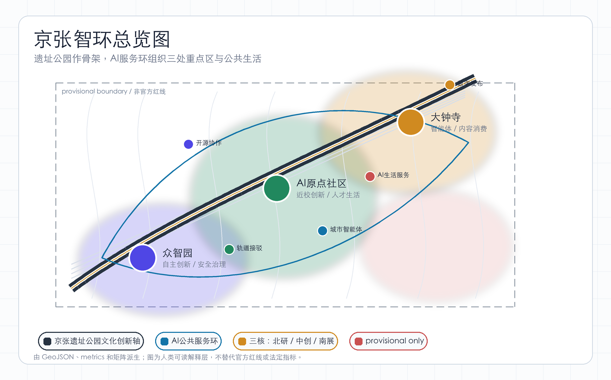
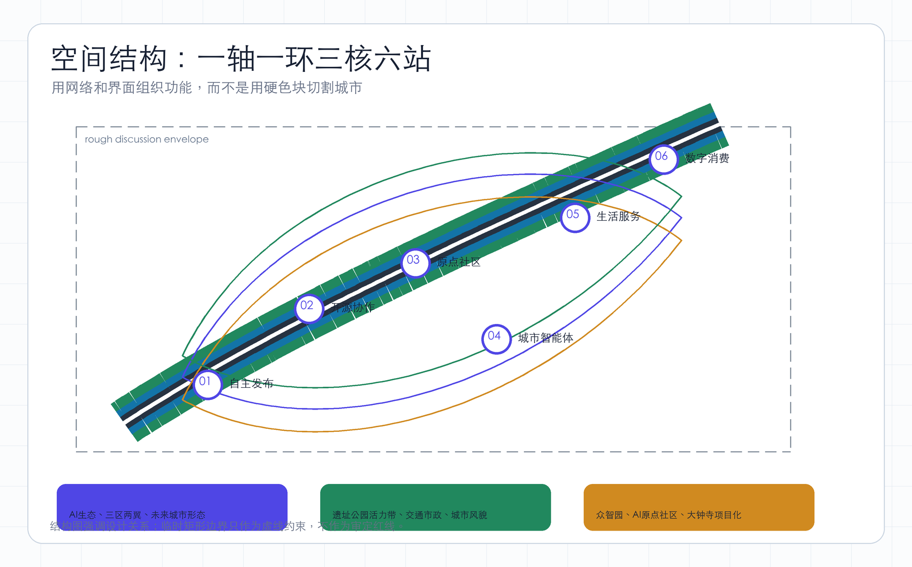
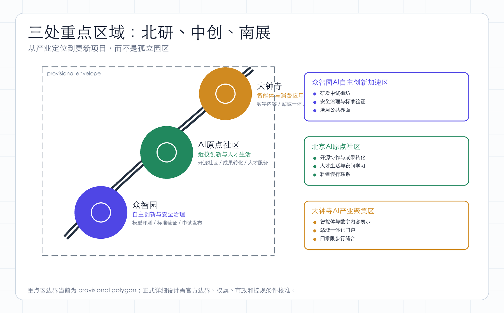
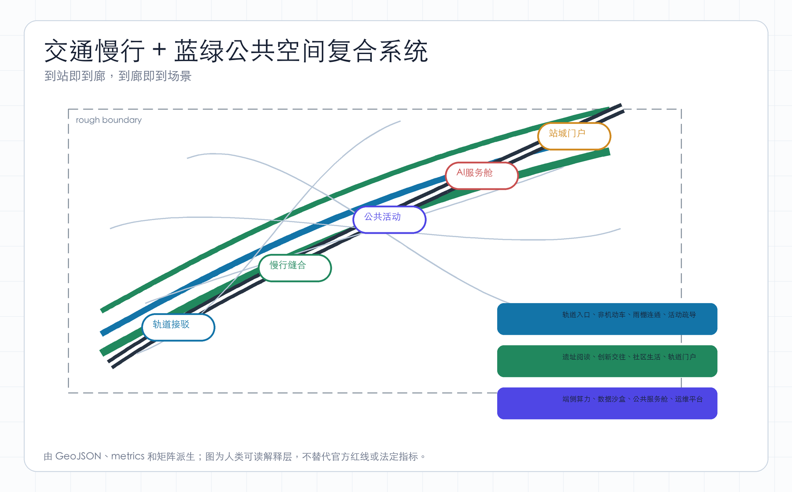
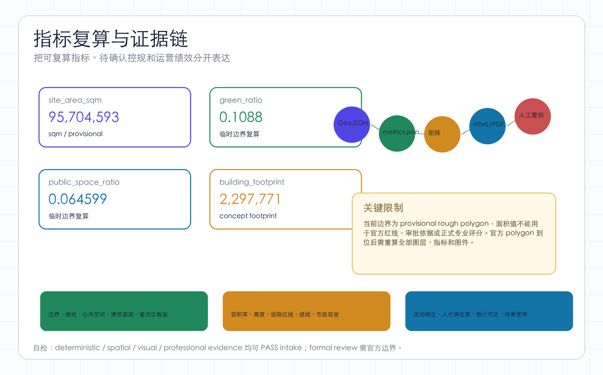

# 京张智环：百年京张AI共生廊道城市设计方案

## 设计依据与资料清单

本方案的核心判断是：百年京张不应只被处理成线性公园，而应升级为“AI 共生廊道”--一条把历史文化、创新产业、人才生活和城市智能体运营串联起来的公共基础设施。方案名称“京张智环”包含两层含义：一是以京张铁路遗址公园作为南北文化与慢行主轴，二是以公共空间、创新服务、轨道接驳和AI场景形成可循环使用的城市服务环。设计依据来自官方公告、面向智能体任务书、结构化 site package、本地专业标准快照、临时粗略边界和三处重点区 polygon；证据链引用 [source:OFFICIAL-ANNOUNCEMENT]、[source:AGENT-TASKBOOK]、[source:SITE-PACKAGE]、[source:BOUNDARY-SOURCE]、[source:KEY-AREA-SOURCE]、[source:STANDARDS-LOCAL-SNAPSHOTS]、[source:PROVISIONAL-GEOMETRY-LIMITATION]、[standard:PROJECT-OFFICIAL-ANNOUNCEMENT]、[standard:PROJECT-AGENT-OPEN-CALL-TASKBOOK]、[standard:MOHURD-URBAN-DESIGN-MEASURES]、[standard:MOHURD-CONTROL-DETAILED-PLANNING]、[standard:MNR-LAND-USE-CLASSIFICATION-GUIDE]、[standard:MOHURD-ARCH-DESIGN-DEPTH-2016] 和 [depth:existing_conditions_diagnosis]。

面向智能体任务书要求方案同时回应三大定位、五大功能和 `agent.1` 至 `agent.6` 六项任务，因此本方案把命名与视觉识别、生态案例、场景卡、朝圣地标、文化叙事和长期运营都作为开放共创建议纳入正文与 `compliance_matrix.json`。所有空间落地、活动运营、品牌传播和政策机制均为“概念建议”“参考方案”或“可供专业团队深化研究”的材料，不构成控规调整、工程方案、投资承诺、审批判断或已确定政府安排。

当前仓库尚未取得官方精确红线和三处重点区正式图件。本提交采用 `brief/site-package/geometry/provisional_boundaries.geojson` 生成 formal intake 包，`geometry/site_boundary.geojson` 与 `geometry/key_areas.geojson` 均标注为 `provisional_constraint`、`official_boundary=false`。因此，本方案可用于方案讨论、结构校验、HTML展示和 intake 自检，但不能作为 official redline、审批依据、精确面积依据或正式专业评分依据。公告文字中的总体设计范围为约 11.4 平方公里；当前临时 polygon 复算 [metric:site_area_sqm] 为 95,704,593.113 平方米，明显更像粗略讨论包络。替换 official polygon 后，site boundary、key areas、land use、roads、green space、public space、buildings、phasing 和 metrics 必须全部重算 [data:geometry/site_boundary.geojson#SITE-001]。

本方案把成果拆成三类。第一类是可复核数据：GeoJSON、metrics、合规矩阵、标准矩阵、设计深度矩阵。第二类是人类可读表达：本 `proposal.md`、`report/proposal.html`、五张派生图和离线 `visual/index.html`。第三类是展示图纸：A3文册和A0展板。所有图件均为解释层，权威依据仍是结构化数据；所有涉及建筑规模、容积率、道路红线、权属、市政容量、文保控制和实施主体的内容均列为待官方资料确认事项 [standard:MOHURD-CONTROL-DETAILED-PLANNING]。

## 三层范围工作框架

方案采用“统筹研究定生态、总体设计定骨架、重点区域定项目”的三层工作法。统筹研究范围回应 43.6 平方公里尺度上的AI产业生态、未来城市形态和“三区两翼”协同；总体设计范围回应 11.4 平方公里京张遗址公园周边 1-2 公里城市地区和产业区的更新结构、公共空间、交通市政和城市风貌；重点区域范围回应众智园AI自主创新加速区、北京AI原点社区、大钟寺AI产业聚集区三处共约 368.4 公顷区域的详细设计任务 [standard:PROJECT-OFFICIAL-ANNOUNCEMENT]。

空间结构概括为“一轴、一环、三核、六站”。“一轴”是京张遗址公园文化创新轴，承载步行、骑行、历史展示和公共活动；“一环”是围绕遗址公园、轨道站点、高校园区和产业地块的AI服务环；“三核”对应三处重点区；“六站”是可先行运营的AI场景站：自主创新发布站、开源协作站、城市智能体运营站、AI生活服务站、轨道接驳示范站和数字内容消费站。三层范围证据由 [depth:three_level_scope_framework]、[depth:overall_spatial_structure]、[data:geometry/key_areas.geojson#PROV-KEY-001]、[data:geometry/key_areas.geojson#PROV-KEY-002]、[data:geometry/key_areas.geojson#PROV-KEY-003] 和 [metric:key_area_count] 支撑。

三层工作之间的传导关系是：产业策略决定空间供给类型，空间供给决定更新项目和公共服务，更新项目再反向验证产业和人才需求是否可落地。统筹层不直接给出伪精确边界；总体层用 `geometry/land_use.geojson`、`geometry/roads.geojson`、`geometry/green_space.geojson`、`geometry/public_space.geojson` 形成可讨论结构；重点区层把建筑更新、慢行缝合、公共空间和AI场景落实到项目清单。由于当前边界为 provisional，所有面积和比例仅作为方案结构自检，不作为官方控制指标。

## 统筹研究范围产业与未来城市研究

统筹研究范围的产业命题是从“AI企业集聚”升级为“AI创新生态可持续生产”。方案建议构建四类生态单元：模型与算法创新单元、智能硬件与机器人单元、AI+垂直行业应用单元、城市智能体运营与治理单元。四类单元不按封闭园区切割，而通过公共空间、共享会议、成果发布、开源活动、知识产权服务、投融资服务和人才生活配套形成网络。该判断回应官方公告关于世界级AI创新生态体系和适配AI新质生产力新型城市形态的要求 [source:OFFICIAL-ANNOUNCEMENT]。

在城市形态上，方案提出“可学习街区”。可学习不是把摄像头和传感器铺满城市，而是让城市服务能够被人工复核、被公众理解、被运营迭代。AI+交通用于慢行断点识别、轨道接驳诱导和活动期间的疏导建议；AI+医疗、教育、法律和生活服务以公共服务舱、共享咨询室、远程协作空间承载；AI+公共空间用于设施维护、活动排期、低碳运营和无障碍导览。每个场景都必须遵守数据最小化、脱敏、人工复核和退出机制，不得输出未授权个人画像 [depth:municipal_new_infrastructure]。

统筹层的空间落点是 `geometry/land_use.geojson` 中的AI研发创新用地、产业服务与商业服务用地、公园绿地与开敞空间、社区服务与配套用地四类概念分区。它们并非审定用地性质，而是用于组织“研发-转化-展示-生活”的城市设计结构 [data:geometry/land_use.geojson#LU-001]。产业策略通过 [standard:MOHURD-URBAN-DESIGN-MEASURES] 回接公共空间、建筑界面和城市风貌，避免出现只谈AI、不谈人的单功能园区。

## 总体设计范围城市更新与控规深度城市设计

总体设计的主图式是“遗址公园作骨架，轨道站点作门户，低效空间作更新接口，AI服务作运营系统”。京张遗址公园不只承担绿地指标，而是作为南北向慢行、文化展示、科技活动和创新交往的主界面；五道口、清华东路西口、大钟寺等轨道节点承担跨片区接驳和人流组织；园区边缘、存量办公、低效商业和可更新街角承担AI服务、开源协作和公共活动的轻量植入。用地结构证据为 [data:geometry/land_use.geojson#LU-001]，交通证据为 [data:geometry/roads.geojson#ROAD-001]，建筑基底证据为 [data:geometry/buildings.geojson#BLDG-001]。

用地布局采取四类概念分区。西侧和北侧以AI研发创新、工程化中试、企业服务为主；中部沿京张遗址公园形成连续蓝绿和公共活动界面；东侧与南侧布置产业服务、商业消费、数字内容和人才生活服务；边缘社区服务空间补足托育、餐饮、运动、夜间学习和国际交流。该分区来源于同一提交边界内的拓扑分割，保证 `land_use.geojson` 可被校验，但不替代正式控规用地 [standard:MNR-LAND-USE-CLASSIFICATION-GUIDE]。

城市更新策略分为“保留、微改造、复合更新、待确认”四级。保留对象包括可承载历史记忆、稳定就业和社区服务的既有建筑；微改造对象优先植入开源协作、共享会议、底层公共界面和无障碍连通；复合更新对象以低效地块和交通割裂处为主，重点补足公共空间、慢行和创新服务；待确认对象包括权属、消防、市政、文保、道路红线和正式控规条件不明的地块 [depth:retain_renovate_demolish]。建筑基底面积 [metric:building_footprint_area_sqm] 只表达概念更新容量，不表达审定建筑规模。

## 重点区域详细设计

众智园AI自主创新加速区定位为“自主创新与安全治理北部引擎”。空间上形成“清河公共界面-研发中试街坊-发布展示节点”三级结构：沿蓝绿界面布置低碳交往、路演和AI公共测试活动；街坊内部组织模型评测、安全治理、标准验证和工程化中试；对外节点承接企业发布、国际交流和创新服务。交通上强化与轨道和慢行系统的接驳，避免形成封闭园区。该区引用 [data:geometry/key_areas.geojson#PROV-KEY-001]，详细设计深度由 [depth:three_key_area_detailed_design] 校核。

北京AI原点社区定位为“近校创新与人才生活中部核心”。它不只服务企业办公，更服务学生、研究者、创业团队、青年家庭和国际人才。方案建议把开源社区、成果转化、AI教育、共享实验室、人才公寓服务、夜间学习空间和公共餐厅组织在步行可达的复合界面上；建筑更新以首层开放、二层连廊、屋顶活动和可变共享空间为重点；轨道站点周边优先处理换乘、非机动车、雨天步行和夜间安全。该区引用 [data:geometry/key_areas.geojson#PROV-KEY-002]。

大钟寺AI产业聚集区定位为“智能体、数字内容与消费应用南部门户”。它承担从研发成果到城市消费和市场展示的转换角色：智能体应用展示、智能终端体验、数字资产服务、内容消费、法律和知识产权服务、会议发布、轨道站点一体化商业共同构成南部界面。大钟寺站周边应重点处理路口四象限步行连通、慢行停放、站城一体化入口、夜间商业安全和公共活动管理。该区引用 [data:geometry/key_areas.geojson#PROV-KEY-003]。

三处重点区共同构成“北研、中创、南展”的功能链：北部解决自主创新和安全可信，中部解决人才与成果转化，南部解决产业服务、消费体验和市场扩散。三处区域的共性做法是首层公共化、慢行优先、轨道接驳、公共空间可运营、AI场景可退场。临时 polygon 只用于方向性设计，正式红线、建设规模、交通组织和实施项目必须在取得官方资料后校准。

## AI 创新生态、人才画像与 AI+ 场景

方案把服务对象分为五类：核心研发人才、工程化团队、创业团队、城市运营者和周边居民。核心研发人才需要安静高效的研究空间、跨校交流和国际服务；工程化团队需要中试、测试、评测、算力接入和设备调试；创业团队需要融资、法务、知识产权、发布和招聘；城市运营者需要公共设施维护、交通疏导、活动安全和城市体征监测；周边居民需要便利服务、慢行环境、公共活动、医疗教育和可信的隐私边界。

AI+场景设置为六类。AI+交通侧重轨道接驳、慢行断点识别、非机动车停车引导和大型活动疏导 [data:geometry/roads.geojson#ROAD-001]。AI+公共空间侧重活动预约、夜间照明、无障碍导览和设施维护 [data:geometry/public_space.geojson#PUBLIC-001]。AI+生态侧重绿地养护、热环境提示和低碳运营 [data:geometry/green_space.geojson#GREEN-001]。AI+教育、医疗、法律和生活服务通过共享服务舱进入公共空间和社区配套，强调人工复核与个人数据不落地。

场景运营机制采用“公开场景清单+数据边界说明+人工复核+退出机制”。任何涉及个人、企业经营、交通安全或公共治理的AI判断都不得直接自动执行；系统只能提出建议、预警或服务匹配，由有资质人员或运营主体确认。方案以 [metric:public_space_ratio] 和 [metric:green_ratio] 判断公共空间承载，但不把场景热度、满意度或经济产出伪装成已验证指标。

## 用地、建筑规模与拆改留方案

用地方案以四类概念分区组织：AI研发创新用地承担模型、算法、评测、安全和工程化；公园绿地与开敞空间承担京张文化展示、绿色慢行和公共活动；产业服务与商业服务用地承担投融资、法务、知识产权、会议发布、智能终端体验和夜间消费；社区服务与配套用地承担托育、餐饮、运动、人才服务和国际交流。各分区在 `geometry/land_use.geojson` 中闭合表达，确保拓扑可审查 [depth:land_use_layout]。

建筑规模采取“控制结论待确认、形态策略先行”的方法。方案不声明总建筑规模、容积率、建筑高度、建筑密度和退线为审定指标；这些内容在 [metric:floor_area_ratio] 中保持 unknown，并由 [depth:development_intensity_controls] 管理为待确认控规条件。可先讨论的是建筑界面和更新方式：沿遗址公园界面宜降低封闭围墙和大尺度后退，形成可进入首层；轨道站点周边宜提高复合利用和雨棚连通；面向社区一侧宜控制噪声、夜间活动和物流组织；历史文化节点周边宜以小体量、可阅读、低干扰的更新方式处理 [depth:height_massing_character]。

拆改留采用“价值先行”而非“强度先行”。具有历史文化、就业稳定、社区服务、低碳再利用价值的建筑优先保留或微更新；结构安全差、公共界面差、低效封闭且具备合规条件的对象可列入复合更新；缺少权属、消防、市政和文保条件的对象进入待确认清单。该策略同时回应 [standard:MOHURD-URBAN-DESIGN-MEASURES] 对建筑布局、城市特色和公共空间的要求。

## 交通、轨道、市政与公共服务设施

交通组织目标是“到站即到廊、到廊即到场景”。轨道站点周边设置清晰步行入口、非机动车停放、雨天连通和夜间照明；京张遗址公园两侧补足东西向步行缝合；北五环、清华东路、西土城路、大钟寺周边需要重点识别跨路断点和拥堵节点。`geometry/roads.geojson#ROAD-001` 表达一条概念慢行与创新服务廊道，它是空间结构示意，不是道路红线或施工线 [depth:traffic_rail_slow_parking]。

市政与新型基础设施采用“传统市政+端侧算力+城市智能体”组合。传统市政包括给排水、电力、通信、消防、垃圾分类和海绵城市；新型基础设施包括边缘计算节点、公共显示与发布系统、低空或机器人配送管理点、开放数据沙盒、AI服务接口和网络安全管理。设施布点应优先依附公共建筑、轨道节点、公共空间管理用房和存量园区服务中心，不宜在公共空间中形成新的封闭设施 [depth:municipal_new_infrastructure]。

公共服务设施以“15分钟人才生活圈+全天候创新服务”为目标。白天服务研发、会议、发布、招聘、测试；夜间服务学习、运动、餐饮、社交和文化活动；节假日服务公众科普、历史导览和城市体验。设施实施前必须补充正式客流、市政容量、消防、无障碍、交通影响和运营主体资料 [data:geometry/constraints.geojson#CONSTRAINTS]。

## 蓝绿空间、公共空间与城市风貌

蓝绿系统以京张遗址公园为主骨架，叠加清河、小月河和周边校园、园区、社区开放空间，形成“可停留、可穿行、可展示、可运营”的公共空间网络。绿地不是剩余空间，而是AI人才交往、城市测试、历史阅读和日常运动的基础设施。当前提交中 [metric:green_ratio] 为 0.1088，[metric:public_space_ratio] 为 0.064599，均来自临时边界下的派生图层；正式评审时应以官方红线重算 [data:geometry/green_space.geojson#GREEN-001]、[data:geometry/public_space.geojson#PUBLIC-001]。

公共空间设计分为四种界面：遗址阅读界面、创新交往界面、社区生活界面、轨道门户界面。遗址阅读界面强调铁路记忆、清华园车站等历史线索和慢行体验；创新交往界面强调路演、发布、开源活动和可插拔展陈；社区生活界面强调低噪声、亲子、运动、老人友好和夜间安全；轨道门户界面强调导向、换乘、雨棚、非机动车和人流缓冲。

城市风貌基调建议为“理性、开放、轻更新”。建筑色彩和材料不追求强主题化，而强调可阅读的历史层、透明首层、连续遮阴、低碳材料、屋顶活动和科技设施隐性整合。AI文化表达应通过场景、服务和公共活动呈现，而不是大量装饰性屏幕。风貌控制依据 [standard:MOHURD-URBAN-DESIGN-MEASURES]，具体高度、体量、色彩和界面控制需待官方控规、文保和街区设计导则确认 [depth:blue_green_public_space]。

## 更新项目清单、实施政策与分期计划

近期项目建议采用“轻设施、强运营、低风险”的方式启动：京张遗址公园AI导览与活动系统、轨道站点慢行导向、重点区首层开放试点、开源协作活动、AI公共服务舱、夜间学习与人才服务、公共空间无障碍和照明提升。近期项目可依赖运营和小型设施改造推进，但仍需满足审批、消防、用电、数据合规和公众参与要求 [depth:renewal_project_list]。

中期项目聚焦复合更新和片区连通：众智园研发中试界面、AI原点社区成果转化街坊、大钟寺站城一体化商业和数字内容门户、东西向慢行缝合、园区围墙和首层界面改造、公共服务设施复合利用。中期项目需要取得权属、市政、交通影响和正式控规条件，不能在本阶段承诺落地。空间证据引用 [data:geometry/phasing.geojson#PHASE-001]。

长期项目是城市智能体运营框架：建立公开场景清单、数据治理协议、设施运维平台、产业服务评价、公众反馈机制和年度更新评估。政策建议包括：允许存量建筑在合规前提下进行创新服务功能复合；建立公共空间运营许可和活动预约机制；用城市更新单元统筹交通、市政和公共服务；把AI场景纳入可审计、可退出、可复盘的治理流程 [depth:phasing_implementation]。

## 指标体系、面积复算与合规矩阵

指标体系分为三组。第一组是可由当前提交几何复算的 intake 指标：临时边界面积 [metric:site_area_sqm]、建筑基底面积 [metric:building_footprint_area_sqm]、绿地比例 [metric:green_ratio]、公共空间比例 [metric:public_space_ratio] 和重点区域数量 [metric:key_area_count]。第二组是需要官方控规和任务书附件确认的管控指标：容积率、建筑高度、道路红线、退线、绿地率、公共服务设施标准和市政容量，目前不得写成 known。第三组是需要运营数据持续校准的绩效指标：AI场景使用频次、人才满意度、慢行可达性、活动参与度、产业服务效率和公共空间维护绩效。

合规矩阵覆盖公告 1.3、1.4、1.5 的必选任务，标准矩阵覆盖项目公告、城市设计管理办法、控规编制审批办法和国土空间用地分类指南，设计深度矩阵覆盖现状诊断、三层范围、总体结构、用地、强度控制、建筑风貌、拆改留、交通、市政、蓝绿公共空间、重点区详细设计、项目清单、分期、指标复算和风险缺资料 [depth:metrics_recalculation]。本方案的确定性校验、空间复核、视觉复核和专业证据链复核可用于 intake；由于边界和重点区均为 provisional，`can_enter_formal_review=false` 是正确结果。

面积复算必须被谨慎阅读。当前 [metric:site_area_sqm] 与公告总体设计面积差异较大，说明临时边界不可作为面积控制依据；但 land use、roads、green space、public space、buildings、phasing 的相对关系仍可作为方案组织和校验演示。正式提交前，应以官方 CAD/GIS/PDF 图件转换出的 official polygon 替换临时边界，并同步更新 `sources.json`、`assumptions.json`、全部 GeoJSON、全部 metrics、图件、HTML和矩阵。

## 风险、版权与合规说明

本方案不声称官方批准、审定控规、最终土地权属、最终建设规模、道路红线、文保控制线或保证实施。当前最大风险是 official boundary 与 key areas 缺失；第二类风险是控规、权属、市政、消防、交通影响、文保和现状建筑数据缺失；第三类风险是AI场景如果缺少人工复核、隐私保护和退出机制，可能损害公共利益。风险清单引用 [depth:risk_missing_data]、[source:SITE-PACKAGE]、[standard:MOHURD-CONTROL-DETAILED-PLANNING]。

所有正文、图件、HTML 和结构化数据由本次AI agent生成，引用的依据来自仓库内公开资料和已登记来源。`visual/index.html` 不加载远程脚本、远程地图瓦片、远程字体、iframe、表单或外部 API；图片为本地派生图，不替代官方空间数据。版权与使用说明见 `report/copyright_statement.md`。任何后续使用、参赛提交或公开传播，都应在取得官方资料后复核事实、边界、指标、图纸和合规声明。

## 参考资料

- `brief/public-brief.md`
- `brief/site-package/design_brief.json`
- `brief/site-package/allowed_design_space.json`
- `brief/site-package/sources.json`
- `brief/site-package/standards/standards.json`
- `brief/site-package/standards/references/`
- `brief/site-package/geometry/provisional_boundaries.geojson`
- `docs/formal-submission-guide.md`
- 机器可读引用索引：[source:OFFICIAL-ANNOUNCEMENT]、[source:SITE-PACKAGE]、[source:BOUNDARY-SOURCE]、[source:KEY-AREA-SOURCE]、[standard:PROJECT-OFFICIAL-ANNOUNCEMENT]、[standard:MOHURD-URBAN-DESIGN-MEASURES]、[standard:MOHURD-CONTROL-DETAILED-PLANNING]、[standard:MNR-LAND-USE-CLASSIFICATION-GUIDE]、[depth:metrics_recalculation]、[data:geometry/site_boundary.geojson#SITE-001]、[metric:site_area_sqm]
