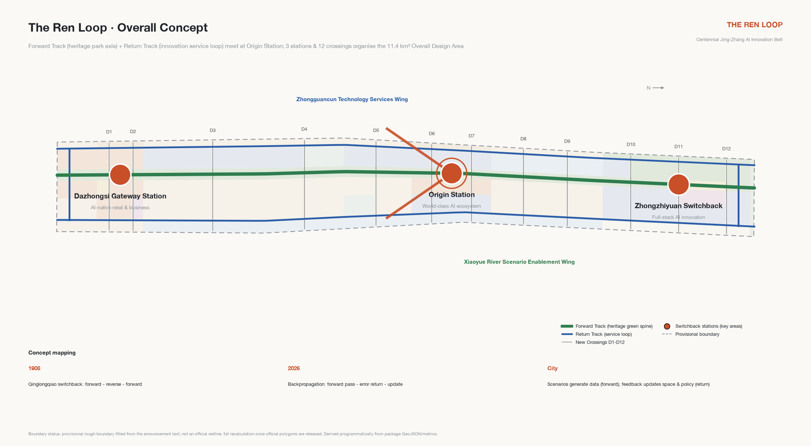
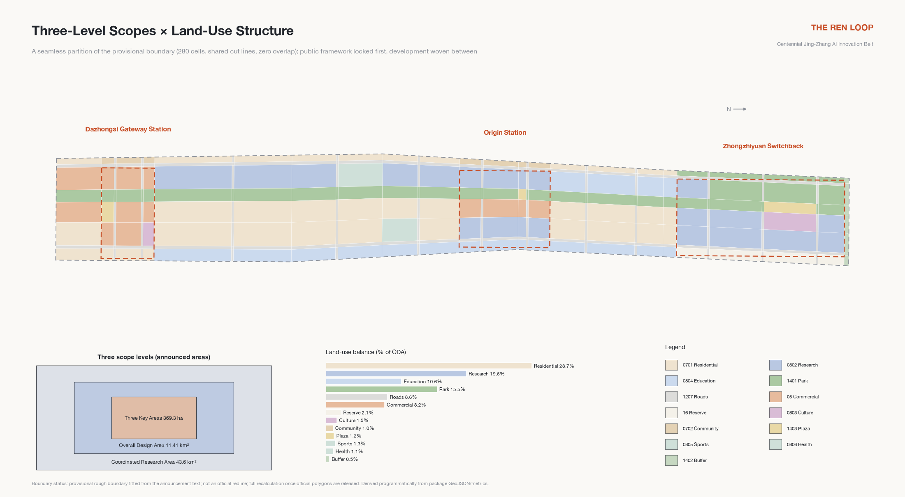
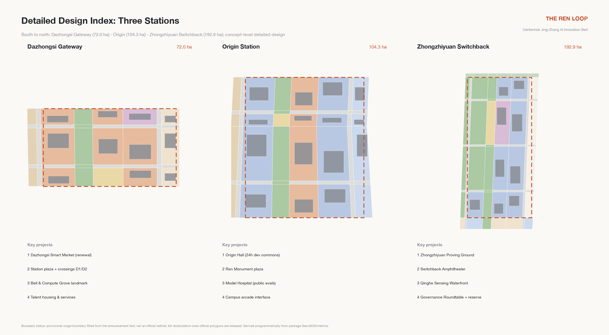
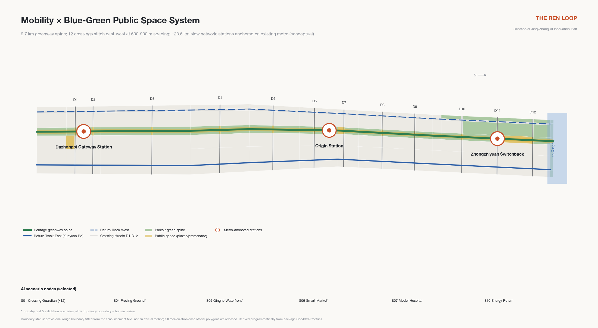
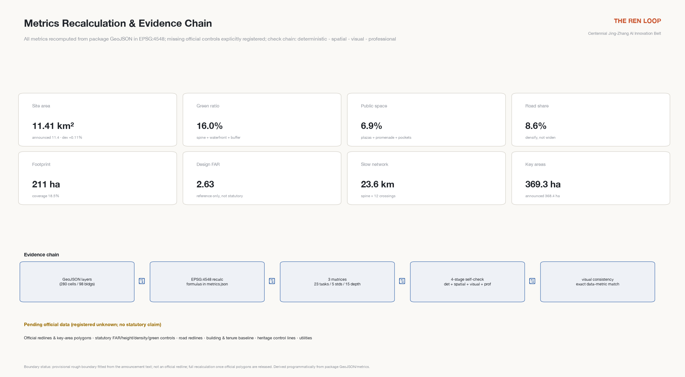

# The Ren Loop: An Urban Design Concept for the Centennial Jing-Zhang AI Innovation Belt

In 1908, Zhan Tianyou used the "人"-shaped (Ren-shaped) switchback at Qinglongqiao to carry trains over the steep Guangou grade: move forward, reverse, move forward again — one switchback bought the height. More than a century later, deep learning trains models through backpropagation: signals propagate forward, errors fold back, and every return pass makes the network smarter. This proposal distils that century-spanning isomorphism into the overall concept: **the Centennial Jing-Zhang AI Innovation Belt is a city-scale training loop (The Ren Loop)** — scenarios generate data on the forward pass, and feedback returns as updates to models, policies and space. The city is not a showcase for AI; it is a training ground where AI and people iterate together. The character 人 (ren, "human") is read four ways in this proposal: human-first, railway switch, neural network node, and a converging upward arrow.

One table states the loop's operating logic — who each segment hands over to, what urban value it produces, and the condition it must never cross [depth:overall_spatial_structure]:

| Loop segment | Spatial carrier | Hand-over to | Urban value | Never-cross condition |
| --- | --- | --- | --- | --- |
| Forward - scenario operation | Forward Track & 12 crossings | Citizens & visitors | Perceivable daily service | Privacy boundary & opt-in |
| Return - feedback collection | Scenario yards & city training log | Operators | Verifiable operating evidence | Anonymous aggregation, human review |
| Switch - human gate | Governance venues at 3 stations | Human gate owners | Adopt / rectify / stop decisions | AI never replaces human decisions |
| Forward again - update | Belt-wide space & policy | Professionals & government | Updates to space & mechanisms | Concepts never bypass approval |

## Design Basis and Source List

This proposal takes the prequalification announcement issued by the Haidian branch of the Beijing Municipal Commission of Planning and Natural Resources as its primary basis, the open-call taskbook for global intelligent agents as its agent-task basis, and the repository's registered site package as its machine-readable foundation [source:OFFICIAL-ANNOUNCEMENT] [source:AGENT-TASKBOOK] [source:SITE-PACKAGE]. Before writing, the design brief, allowed design space, enumerations and ranges, and the provisional boundary with its derivation note were read in full, and the repository's processed materials were used to build the task and gap checklists [source:PROCESSED-FACT-PACK].

Source use respects the public-material boundary: the scopes, areas and task statements of the announcement and taskbook may serve as formal basis; the provisional boundary serves only generation, display and discussion; background material supports no spatial-control conclusion [source:SOURCE-REGISTRY]. No official precise redline is publicly available yet, so every spatial layer in this package is generated from the repository's provisional rough boundary, and the full-chain recalculation obligation upon official data release is stated in the assumptions and risk chapters [data:geometry/site_boundary.geojson#SITE-001] [depth:existing_conditions_diagnosis].

Existing-condition understanding uses a two-layer diagnosis of "public facts plus provisional boundary": the announcement confirms the three scope areas, the names and north-south order of the three key areas, and the Heritage Park vitality-belt requirement; the provisional boundary provides only a rough working corridor about 9.7 km long and 1.2-1.3 km wide. Uncertainty is therefore written explicitly into each layer's source type, confidence and geometry-role attributes rather than hidden behind a deceptively precise drawing [standard:PROJECT-OFFICIAL-ANNOUNCEMENT].

*Fig 1 | Overall concept: the Ren Loop. The Forward Track (heritage park cultural axis) and the Return Track (innovation service loop) meet at Origin Station in a "人" glyph.*

## Three-Level Scope Framework

The three scope levels cascade from strategic research through overall design to key-area deepening. The Coordinated Research Area of 43.6 km² carries industrial strategy and regional synergy research without land-level design; the Overall Design Area of 11.4 km² is designed to regulatory-plan urban design depth and carries this proposal's layers and metrics; the three key areas totalling 368.4 ha reach the depth of an integrated planning implementation plan [source:OFFICIAL-ANNOUNCEMENT] [depth:three_level_scope_framework].

Spatially, the research level answers how the loop and the two wings cooperate; the overall level answers how two tracks and twelve crossings organise 11.4 km²; the key-area level answers how the three stations each become an implementable mini-scheme. Both the overall boundary and the three key areas use the repository's provisional features, with areas recomputed in EPSG:4548 and checked against announced values, all deviations at the per-mille level [data:geometry/key_areas.geojson#KEY-001] [metric:site_area_sqm].

The provisional boundary's limits must be stressed: it is fitted from the announcement's textual extents and areas, expresses no road redlines, parcel or tenure boundaries, and must not be used for official redlines, approval bases or precise area claims. Once official polygons are released, all layers, metrics, drawings and visualisations must be recomputed as a chain — which the package's structured design makes automatic [depth:metrics_recalculation].

*Fig 2 | Scope cascade and land-use structure. The land-use plan is a seamless, gap-free partition of the provisional boundary with shared cut lines.*

## Coordinated Research Area: Industry and Future City Research (agent.1 / agent.2)

**On the world-class AI ecosystem: an ecosystem is not a park, it is a loop.** Comparing global cases shows that successful innovation districts all close the circuit from research through translation and scenarios back to research, rather than running a one-way incubation pipeline. At the research level this proposal organises a "Ren-shaped synergy loop": innovation elements flow south-to-north along the Forward Track (culture, talent, everyday life) and fold back north-to-south along the Return Track (technology, scenarios, data feedback), switching direction at Origin Station; the Zhongguancun Technology Services Wing provides global allocation of factors and the Xiaoyue River Scenario Enablement Wing provides scenario-validation depth, so the "three zones and two wings" are not five parallel districts but five functional positions on one loop [source:AGENT-TASKBOOK] [standard:PROJECT-AGENT-OPEN-CALL-TASKBOOK] [depth:overall_spatial_structure].

Six global AI ecosystem cases support this judgement, each distilled into one transferable "switchback" mechanism:

| Case | Isomorphism with this belt | Transferable mechanism |
| --- | --- | --- |
| King's Cross Knowledge Quarter, London | Railway heritage regeneration with DeepMind's headquarters — the most direct heritage-x-AI benchmark | Heritage trust runs alongside a long-term master operator; heritage narrative becomes the district's identity asset |
| Station F, Paris | The world's largest single-building incubator | A single strong-IP space with integrated startup services — maps to the Origin Hall |
| Kendall Square, Cambridge (Boston) | Borderless campus-industry mixing | University real estate plus laboratory building standards — maps to the Xueyuan Road interface |
| one-north, Singapore | Government-led, twenty-year phased rollout | Themed park clusters with talent housing — maps to Zhongzhiyuan's phasing |
| MaRS Discovery District, Toronto | Translation hub at the hospital-university-finance junction | A non-profit operator carrying the public mission — maps to the Model Hospital |
| Yuehai Subdistrict, Nanshan, Shenzhen | Self-organising high-density mixed blocks | Low-cost space gradients with nearby supply chains — maps to Dazhongsi's stock renewal |

Case information comes from each project's public channels, registered in the source list with publisher and retrieval date; it serves as background reference only and constitutes no commitment or endorsement by any organisation [source:CASE-KINGS-CROSS] [source:CASE-STATION-F].

**On future urban form: AI-era productivity needs shorter switchbacks, not bigger parks.** Model iteration cycles are measured in weeks, so the city must keep the places where code is written, tested and used within walking distance. Three form principles follow: research space strings along the Return Track rather than pooling into superblocks; test fields embed in public space rather than fencing themselves off; talent living mixes into retained communities rather than building a new town. The naming system and logo direction are given at this level as the belt's identity system: master brand name "The Ren Loop (京张·人字回路)"; naming hierarchy "Line - Station - Crossing - Yard"; a logo of two converging rail strokes forming 人 with an origin ring at the vertex, extensible into switch signs, milestones and signal colour bands; typography follows open-licensed Source Han Sans, with no use of any existing corporate or institutional marks [depth:height_massing_character]. The "Crossing" tier honours the toponymic origin of Wudaokou — the fifth level crossing of the Jing-Zhang Railway — making the naming system itself part of the heritage narrative.

### Five-Way Regional Synergy Interfaces

Regional synergy pre-writes no partnership outcomes; it only defines publicly verifiable mechanism interfaces. Each states its input, minimum output and exit gate; if either side stops responding the interface simply closes, creating no mutual-recognition obligation [source:AGENT-TASKBOOK] [metric:regional_interface_count]:

| Interface | Input (toward the belt) | Minimum output (from the belt) | Exit / no-recognition gate |
| --- | --- | --- | --- |
| Beiwei Community | Everyday-scenario demand lists | Scenario-card templates & three-state operating experience | Terminates on either side's written exit |
| Future Science City | Frontier lab translation demand | Proving-ground test slots & Ren Receipt format | No uncleared data sharing |
| Huairou Science City | Big-science compute collaboration leads | Governance roundtable agenda seats | No funding presumed |
| Beijing E-Town | Mass-manufacturing & scenario scale-up capacity | Hand-over packages of accepted scenario cards | No hand-over below acceptance |
| Beijing-Tianjin-Hebei | Green power, compute & hinterland scenarios | Ren Loop Week regional day & open proposal-library access | No cross-regional commitment |

All five are conceptual mechanisms; the names refer only to innovation nodes in public planning context, claiming no existing partnership, authorization or funding.

## Overall Design Area: Urban Renewal and Regulatory-Plan-Level Urban Design

The spatial structure of the Overall Design Area is "**one loop, two tracks, three stations, twelve crossings**": the Forward Track is the continuous green spine of the Jing-Zhang Railway Heritage Park, 60-120 m wide, running the full north-south length; the Return Track consists of the Xueyuan Road innovation service street on the east and the Zhichun Road - Dazhongsi East Road service street on the west, closing into a loop at both ends; the three stations from south to north are Dazhongsi Gateway Station, Origin Station and Zhongzhiyuan Switchback Station; twelve "New Crossings" stitch the two sides of the city that the railway cut apart for a century, at 600-900 m spacing [data:geometry/roads.geojson#RD-CROSS-D05] [depth:overall_spatial_structure].

Land use is organised on this two-track skeleton: park green space about 15.5%, roads about 8.6%, research land about 19.6%, commercial services about 8.2%, residential and community services about 29.7%, education-culture-sports-health about 14.5%, plazas about 1.2%, protective green and reserve land about 2.7% [data:geometry/land_use.geojson#LU-PARK-S3] [metric:green_ratio] [depth:land_use_layout]. The renewal meaning of this structure: the green spine and crossings lock the public framework first, and development weaves between — rather than letting development decide the leftover shape of public space.

The renewal framework follows "retain first, renew second, demolish least": all heritage elements, mature residential communities and campus interfaces are retained; renewal concentrates on inefficient buildings, walled-compound edges and broken slow-mobility interfaces; new construction concentrates at station cores and test facilities. Building scale and intensity are given as conceptual reference values with pending statutory conditions flagged explicitly: gross FAR reference range 2.0-2.4 for new and renewed parcels, stepped height control below 24 m along the Heritage Park, conceptual landmarks of 60-80 m at station cores — all subject to professional confirmation once official data arrives, and none constituting statutory judgement [standard:MOHURD-CONTROL-DETAILED-PLANNING] [depth:development_intensity_controls].

Transport, the Heritage Park vitality belt and urban character are developed in later chapters; this chapter's conclusion is that renewing 11.4 km² relies not on demolition but on rewiring existing stock — like fine-tuning a network that has been training for years instead of re-initialising it [depth:retain_renovate_demolish].

## Detailed Design of Key Areas

The three key areas are organised as "switchback stations", each forming a complete mini-scheme of positioning, spatial structure, building renewal, mobility, public space, AI scenarios and implementation risk, at integrated-implementation-plan depth [source:OFFICIAL-ANNOUNCEMENT] [depth:three_key_area_detailed_design]. All three are generated from provisional rectangles, and every parcel-level statement is a directional concept.

*Fig 3 | Detailed design index of the three stations: Dazhongsi Gateway (south), Origin (middle), Zhongzhiyuan Switchback (north).*

**Dazhongsi Gateway Station (about 72 ha) — the southern gateway of AI-native new business** [data:geometry/key_areas.geojson#KEY-003]. Positioned as the belt's southern urban gateway and AI-native retail and business district. The structure anchors on the Dazhongsi metro station for transit-oriented integration, with the station plaza connecting north into the green spine; the Dazhongsi (Juesheng Temple) heritage core and its sightline corridor are retained, while inefficient market and warehouse buildings are renewed into the "Dazhongsi Smart Market" — a permanent validation ground for intelligent retail, service robots and new business formats; talent apartments and community services line the western Return Track. Crossings D1 and D2 merge transfer flows with market flows. Main risks are complex tenure and the pace of business transition; the market pilot leads, court-by-court renewal follows.

**Origin Station (about 104.3 ha) — the converging origin of a world-class AI ecosystem** [data:geometry/key_areas.geojson#KEY-002]. Positioned as the Ren vertex and the ecosystem's heart. The core organises the "Origin Hall" around the Tsinghua East Road West Entrance - Wudaokou area: a cluster of 24-hour developer commons renewed from retained industrial buildings and courtyards; the Ren Monument plaza serves as the belt's spiritual origin, its base engraved with an updatable roll of open-source contributors; campus interfaces open their ground floors along Xueyuan Road into a continuous arcade shared by students and founders. Retained residential communities receive ageing-friendly and school-route micro-renewal without changing their residential function. The Model Hospital (public evaluations) and the Crossing Museum (toponymic history) concentrate here. The risk is that opening campus walls needs section-by-section negotiation; "interface pacts" advance it segment by segment.

**Zhongzhiyuan Switchback Station (about 192.1 ha) — the northern switchback of full-stack independent innovation** [data:geometry/key_areas.geojson#KEY-001]. Positioned as the AI full-stack independent innovation acceleration area and the seat of governance discourse. The structure reaches the Fifth Ring protective green belt to the north and contains the "Zhongzhiyuan Proving Ground": a semi-public field for graded open testing of embodied AI and robots, with the Ren-ramped sunken Switchback Amphitheater as its launch and defence core; the Qinghe Sensing Waterfront carries environmental-AI testing and ecological restoration display; reserve land along the Fifth Ring holds twenty-year flexibility. The International AI Governance Roundtable takes its permanent seat here, giving "discourse power" an addressable venue. The risk is compatibility between test-field safety grading and neighbouring housing, managed by time-slot grading plus physical zoning.

## AI Innovation Ecosystem, Personas, and AI+ Scenarios (agent.2 / agent.3)

Ecosystem design starts from people. Six personas are mapped to daily routines and spatial supply: the full-stack researcher (models and systems; lab-to-Origin-Hall routine on the Return Track), the startup founder (teams under ten; low-cost space gradients), the Xueyuan Road student (the campus-dense corridor's students and faculty; school and internship routines), original and senior residents (retained communities; ageing-friendly services), the international visitor and AI pilgrim (landmark and event routines), and city operations and governance workers (cleaners, security staff, grid managers — the "hundred trades" of an AI city, with rest and up-skilling space) [source:AGENT-TASKBOOK] [depth:land_use_layout].

Twelve AI scenario cards cover eight domains — mobility, culture, ecology, retail, governance, education, energy and elder care — of which three are industry test-and-validation scenarios (Proving Ground, Qinghe Waterfront, Smart Market). Each card records location, users, operating data, privacy boundary, human review, operator and risks [depth:municipal_new_infrastructure]:

| Card | Scenario | Location | Users | Privacy boundary and human review | Hard stop & non-AI fallback |
| --- | --- | --- | --- | --- | --- |
| S01 | Crossing Guardian - AI street crossing | Twelve crossings | Commuters, students, wheelchair and stroller users | Edge-side anonymous counts only, no face recognition; incidents handled after human confirmation | red-stop on any individual-identifiable data; fall back to normal signal timing + human guides |
| S02 | Heritage Storyteller - multilingual guide | Forward Track | Visitors, study groups | User-triggered; no individual trajectories; content reviewed by heritage experts | unreviewed content goes offline; human guides remain |
| S03 | Origin Hall - space operations | Origin Station | Developers, startup teams | Voluntary membership; scheduling suggestions executed after human confirmation | stops on data overreach; back to human front desk |
| S04 | Zhongzhiyuan Proving Ground - embodied AI * | Switchback Station | Robotics and embodied-AI firms | Graded closed/semi-open testing; de-identified archives; pre-release ethics review | any human-safety incident clears the field; space reverts to public use |
| S05 | Qinghe Sensing Waterfront - environmental AI * | Qinghe edge | Environmental-AI firms, researchers | Environmental sensor data only; model conclusions applied after human review | removal on crowd-monitoring overreach; conventional monitoring remains |
| S06 | Dazhongsi Smart Market - AI-native retail * | Gateway Station | Smart retail, service-robot firms | Anonymised footfall; merchants own transaction data; stop-on-complaint | rectify on failed stop-on-complaint; back to conventional market |
| S07 | Model Hospital - public evals & red teaming | Origin Station | Model teams, regulators | Cleared eval sets; results signed by humans; sessions publicly auditable | unsigned results withdrawn; expert review fallback |
| S08 | City Memory Commons - oral history | Crossing Museum & communities | Residents, volunteers | Consent-based collection; AI drafts confirmed by narrators | unauthorized collection deleted; traditional editing |
| S09 | School Route Guardian | Xueyuan Rd crossings | Pupils, parents | No individual identification; segment-level alerts only; opt-in | stops on individual identification; human school-guard posts |
| S10 | Energy-Carbon Return - heat recovery dispatch | Belt-wide utilities | Building and campus operators | Building-level aggregates; dispatch under human attendance | stops on unattended dispatch; conventional heating |
| S11 | Silver Companion | Retained communities | Senior residents | Fully voluntary; emergency human takeover; family-authorised data | rectify on default-on; human visits as backstop |
| S12 | Global Link - international events | Three stations + online | Global developers, media | Public content; translations checked by humans before release | unproofed releases withdrawn; human translation backstop |

Scenario operation uses a green-amber-red three-state mechanism: green runs open, amber tests with limits, red pauses for rectification; every scenario keeps a complete human-takeover path and exit mechanism. No scenario presumes non-public data, personal privacy or a designated vendor; immature technology is always labelled as testing and never described as fully deployable [standard:PROJECT-AGENT-OPEN-CALL-TASKBOOK].

### Minimum Pilot Slice: the Ren Receipt (S01 Crossing Guardian Tabletop)

To keep the twelve scenario cards from remaining on paper, the proposal converges on S01 Crossing Guardian as the single minimum pilot slice and turns it into a verifiable execution chain called the **Ren Receipt**: problem - site - data scope - authorization - human gate - test plan - evidence - adopt/reject - feedback - rollback, ten stages in all; any scenario landing on this belt must complete this full forward-plus-return pass [metric:receipt_stage_count] [depth:municipal_new_infrastructure]. The receipt schema, an example receipt, the twelve-card three-state gates and an offline verifier ship in the visual assets directory: the verifier is dependency-free, offline and deterministic — re-runs are byte-identical — and embeds three negative fixtures proving that malformed records are rejected with exact check identifiers [metric:tabletop_check_count] [metric:tabletop_negative_fixture_count].

What the tabletop rehearsal proves and does not prove matter equally:

| Proves | Does not prove |
| --- | --- |
| The ten-stage chain is structurally complete and consistent with the three-state gates | Any real-intersection efficiency or safety improvement (performance field is null) |
| Control actions can only execute through the human gate, by design | Any authorization, funding or implementation arrangement from any authority |
| Rollback fully defined (removal, data deletion, restoration) | Vendor, site engineering or power/communication feasibility |
| Malformed records are rejected with exact check identifiers | Public acceptance (only participation & exit mechanisms are defined) |

The authorization stage is honestly marked not-run: no application has been filed with any authority; the receipt is a format draft for future applications, for professional teams to deepen [depth:risk_missing_data].

## Land Use, Building Scale, and Retain-Renovate-Demolish Strategy

The land-use plan is a complete, seamless partition of the overall design boundary: all polygons share cut-line coordinates with no unlabelled gaps and no overlaps, verifiable item by item [data:geometry/land_use.geojson#LU-PARK-S1] [depth:land_use_layout]. Its logic is "spine fixes green, tracks fix industry, crossings fix public, remainder fixes living": first lock the green spine and the Qinghe and Fifth-Ring green belts, then array research and commercial land along the Return Track, equip crossing nodes with plazas and community services, and let the remainder continue the residential fabric mixed with education and culture.

The main land-use balance (recomputed on the provisional boundary): park green 177.1 ha, protective green 6.0 ha, plazas 13.4 ha, roads 98.5 ha, research 223.9 ha, commercial services 93.5 ha, residential 327.7 ha, community services 11.5 ha, education 120.7 ha, culture 17.6 ha, sports and health 27.2 ha, reserve 24.3 ha [metric:lu_area_1401_sqm] [metric:lu_area_0802_sqm].

Building scale is organised by conceptual reference: total footprint 211.1 ha at 18.5% coverage of the whole area; conceptual gross floor area about 21.65 million m²; reference gross FAR on developable land 2.63 [metric:building_footprint_area_sqm] [metric:total_floor_area_sqm] [metric:floor_area_ratio_design]. Official FAR, height and density conditions are currently missing; all values above are conceptual references for professional deepening, and the metric layer registers the official controls as pending [depth:development_intensity_controls].

The retain-renovate-demolish classification follows "retain first": retention covers heritage properties, mature communities, campus facilities and structurally sound industrial buildings; renovation targets inefficient commercial buildings, walled interfaces and utility decks; demolition is strictly limited to derelict warehousing and illegal additions, subject to formal condition surveys. The proposal draws no statutory demolition conclusion for any parcel; the whole classification is a reference framework for professional teams [depth:retain_renovate_demolish].

## Transport, Rail, Municipal Infrastructure, and Public Services

The core transport judgement: what this belt lacks most is not road capacity but lateral permeability. Twelve crossings rebuild east-west micro-circulation, each designed slow-mobility-first with traffic calming; north-south movement relies on existing arterials with no new vehicular corridor [data:geometry/roads.geojson#RD-AX-E01] [depth:traffic_rail_slow_parking].

Transit-station integration organises the three stations around existing metro stations: Dazhongsi station anchors the Gateway; Origin Station links the existing stations around Wudaokou; Zhongzhiyuan links the northern lines with provisions for suburban-rail connections. All rail statements rest on public network facts and make no alignment-engineering judgements. Parking follows "concentrate at crossings, taper on-street": bicycle parking concentrates at crossings and stations, car parking migrates year by year into parcels and shared facilities.

Municipal and new infrastructure run as two layers: conventional utilities renew along existing corridors, to be deepened when official utility data arrives; AI infrastructure comprises edge-compute nodes at crossing level, regional compute and backup at Zhongzhiyuan, a belt-wide anonymised sensing network, and the Energy-Carbon Return system — recovering data-centre and building waste heat into community heating micro-grids, folding "the heat of compute" back into "the warmth of the city" [depth:municipal_new_infrastructure]. Public services complete the 15-minute circle along the crossings: community canteens, childcare, elder services, developer dormitories and international talent stations, all within community-service land and renewed buildings.

*Fig 4 | The two-track loop's mobility organisation and blue-green public space network.*

## Blue-Green Network, Public Space, and Urban Character (agent.4 / agent.5)

The blue-green system is "one spine, one river, one belt": the Forward Track green spine runs about 9.7 km north-south as the physical body of the Heritage Park vitality belt; the Qinghe waterfront unfolds ecological restoration and a sensing shoreline at the north end; the Fifth-Ring protective green belt closes the northern edge [data:geometry/green_space.geojson#GS-SPINE-S2] [metric:green_ratio] [depth:blue_green_public_space]. Recomputed green ratio 16.0%, public-space ratio 7.0%, slow network about 23.6 km [metric:public_space_ratio].

The public-space system embodies the "Line - Station - Crossing - Yard" naming hierarchy: contributor milestones stand every kilometre along the Forward Track, honouring the railway milestone tradition by engraving each year's open-source contributors and landmark models; each station holds a core plaza; each crossing holds a pocket plaza; scenario yards embed along the line. Four AI pilgrimage landmarks form the spiritual nodes: the **Ren Monument** (Origin Station — twin rail strokes meeting at an origin ring, its base an updatable contributor roll), the **Switchback Amphitheater** (Zhongzhiyuan — a sunken theatre of Ren-shaped ramps for model launches and public defences), the **Bell & Compute Grove** (Dazhongsi — a dialogue between the Yongle Bell heritage and a compute bell tower, with a "ring-the-bell" launch ritual), and the **Crossing Museum** (Wudaokou — an open-air micro-museum of crossing toponymy) [depth:blue_green_public_space]. The honour system pairs milestones with the annual Ren Prize and digital honour walls synced to open-source rolls.

Urban character continues Haidian's tone of "engineering rationality plus campus canopy": stepped low-to-mid-rise frontages flank the Heritage Park in brick red and warm grey echoing station-house memory; conceptual landmark massing is allowed at station cores; belt-wide signage is bilingual plus machine-readable — every sign carries an open-data interface so that humans and agents read the same city [standard:MOHURD-URBAN-DESIGN-MEASURES]. The cultural narrative runs "from steam to token: a trilogy of independent innovation" — the 1909 switchback (engineering autonomy), the 1980s Zhongguancun Electronics Street (market autonomy), and the 2020s large models and embodied AI (intelligence autonomy); the Forward Track carries the historical layer, the Return Track the contemporary layer, and the crossings are where they meet. The international line fits one sentence: Where a century-old switchback meets backpropagation.

## Renewal Projects, Implementation Policy, and Phasing (agent.6)

The renewal list holds 12 projects in three phases, spatially matching the phasing layer [data:geometry/phasing.geojson#PHASE-1] [depth:renewal_project_list]:

| Phase | Project | Location | Type | Dependency |
| --- | --- | --- | --- | --- |
| Near-term 2026-2028 | Origin Hall renewal | Origin Station | Stock renewal | Tenure negotiation, fire-code retrofit |
| Near-term 2026-2028 | Crossing demonstrations (D4/D5/D6) | Around Origin | Public space | Detailed traffic design |
| Near-term 2026-2028 | Dazhongsi Smart Market pilot | Gateway Station | Business renewal | Transition pacing |
| Near-term 2026-2028 | Contributor milestones phase 1 | Southern spine | Public art | Park operation coordination |
| Mid-term 2028-2031 | Zhongzhiyuan Proving Ground | Switchback Station | New facility | Safety-grading review |
| Mid-term 2028-2031 | Qinghe Sensing Waterfront | North of Switchback | Ecological restoration | Water-authority coordination |
| Mid-term 2028-2031 | Return Track street renewal | Xueyuan Rd, Zhichun Rd | Interface renewal | Frontage agreements |
| Mid-term 2028-2031 | Crossings D1-D12 completion | Belt-wide | Public space | Sectional traffic organisation |
| Mid-term 2028-2031 | Ren Monument | Origin Station | Public art | Design competition & clearance |
| Long-term 2031-2035 | Switchback Amphitheater | Switchback Station | New facility | Proving-ground maturity |
| Long-term 2031-2035 | Bell & Compute Grove | Gateway Station | Public art | Heritage approval |
| Long-term 2031-2035 | Energy-Carbon Return system | Belt-wide | New infrastructure | Energy planning |

Four policy mechanisms are suggested, all conceptual: "interface pacts" — campus walls open section by section against public-space incentives; "scenario open permits" — scenario cards as application units under green-amber-red management; a "milestone fund" — public art and honours rolling on donations and event revenue; and a "loop operating company" — a joint public-private operator for brand, events and scenarios [depth:phasing_implementation].

The annual event system is flagshipped by **Ren Loop Week** (model launch season, city open day, Ren Prize ceremony), supported by quarterly red-team shows, monthly crossing fairs, the Rail Hack hackathon and the international governance roundtable; the developer community runs on "crossing chapters", and scenario feedback flows into a public city training log, accumulating brand assets and conversion pathways (test-pilot-landing gradient; internship-startup-settlement path) [source:AGENT-TASKBOOK]. All events, investment attraction, funding and policy arrangements are concepts, not confirmed government arrangements.

## Metrics, Area Recalculation, and Compliance Matrix

All metrics are recomputed from the package geometry in EPSG:4548, with formulas and sources registered per item; the prose explains what each core metric means for the design [metric:site_area_sqm] [depth:metrics_recalculation]. The Overall Design Area recomputes to 11.41 km², a +0.11% deviation from the announced 11.4 km²; the three key areas recompute to 192.9 ha (Zhongzhiyuan), 104.3 ha (Origin) and 72.0 ha (Dazhongsi) [metric:key_area_zhongzhiyuan_area_sqm].

The green ratio of 16.0% means every researcher and resident reaches the continuous green spine within a five-minute walk — green space is the Forward Track itself, not decorative quota; the public-space ratio of 7.0% supports encounter density — crossing and station plazas are containers for chance meetings, roadshows and fairs; the road share of 8.6% reflects the "densify, don't widen" micro-circulation strategy; footprint coverage of 18.5% with a reference FAR of 2.63 describes a medium-intensity, high-mix form [metric:green_ratio] [metric:public_space_ratio] [metric:road_ratio]. Official FAR, height, density and green-space controls and road redlines remain pending official data, registered explicitly as unknown with their completion sources [depth:development_intensity_controls].

The governance layer adds recomputable structural metrics: the ten-stage Ren Receipt chain, fifteen tabletop checks with three negative fixtures, three-state gates and human-takeover paths for all twelve scenario cards, and the five regional interfaces — all registered in the metrics file and re-runnable by the offline verifier [metric:human_takeover_path_count] [metric:scenario_gate_state_count].

Task coverage is machine-verifiable through three matrices: the compliance matrix covers all items of announcement sections 1.3, 1.4 and 1.5 plus agent.1-agent.6; the standard matrix covers all mandatory professional standards; all fifteen design-depth items are complete [standard:MNR-LAND-USE-CLASSIFICATION-GUIDE] [depth:risk_missing_data].

*Fig 5 | Metrics recalculation and the evidence chain.*

## Risk, Copyright, and Compliance

**Spatial-data risk.** Every spatial layer is generated from the repository's provisional rough boundary, itself fitted only from the announcement's textual extents and areas, with overall position and shape uncertainty; once official redlines, key-area polygons, road redlines, statutory controls, building and tenure baselines arrive, all layers, metrics, drawings and visualisations must be recomputed as a chain — which the package's structure automates [data:geometry/site_boundary.geojson#SITE-001] [depth:risk_missing_data].

**Statement boundary.** All spatial suggestions are concept proposals, reference schemes, material for professional deepening; they replace no statutory plan and constitute no government-approved conclusion. The proposal contains no final conclusion on regulatory adjustments, FAR, heights, demolition classes, road alignments, rail alignments, engineering feasibility, investment estimates, development sequencing or approvals; all event, investment, funding and policy arrangements are envisioned mechanisms [standard:PROJECT-AGENT-OPEN-CALL-TASKBOOK].

**Copyright and generation.** This proposal was generated by an AI agent (Anthropic Claude Fable 5, operated by GitHub user cokekitten) from public and cleared materials; all drawings derive programmatically from the package's geometry and metrics; no uncleaned base maps, fonts, images, trademarks or likenesses are used; case information comes from public channels with registered provenance; the logo and naming are original concept directions using open-source typography, with trademark availability requiring professional search. See the copyright statement for details [source:SOURCE-REGISTRY].

**Privacy and ethics.** Every AI scenario carries a privacy boundary and a human-review path: public-space sensing is anonymised with no face recognition; person-facing services are strictly opt-in and exitable; test scenarios carry ethics review and red-team mechanisms; every automated decision keeps human takeover. Nothing in this proposal should be read as licence for surveillance expansion [source:AGENT-TASKBOOK].

## References

The materials that genuinely shaped this proposal are listed below; the full machine index lives in the source list and the three matrices [source:SITE-PACKAGE]:

1. Haidian Branch, Beijing Municipal Commission of Planning and Natural Resources: Prequalification Announcement for the International Solicitation of Urban Design Schemes for the Centennial Jing-Zhang AI Innovation Belt, May 2026.
2. Open-call taskbook for global intelligent agents (cleared excerpt provided by the user), May 2026.
3. Ministry of Housing and Urban-Rural Development: Administrative Measures for Urban Design.
4. Ministry of Housing and Urban-Rural Development: Measures for the Formulation and Approval of Regulatory Detailed Plans.
5. Ministry of Natural Resources: Guide to Land and Sea Use Classification for Territorial Spatial Surveying, Planning and Use Control.
6. The open-city-ai/haidian repository site package and provisional boundary derivation note, August 2026.
7. King's Cross Central Limited Partnership public materials (kingscross.co.uk), retrieved August 2026.
8. Station F public materials (stationf.co), retrieved August 2026.
9. JTC one-north public materials (jtc.gov.sg), retrieved August 2026.
10. MaRS Discovery District public materials (marsdd.com), retrieved August 2026.
