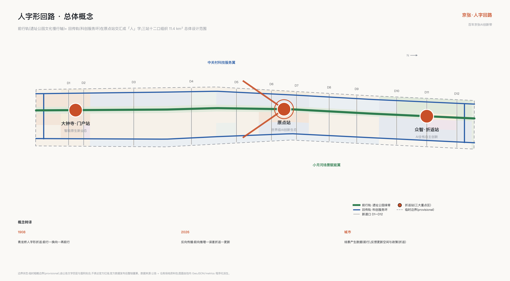
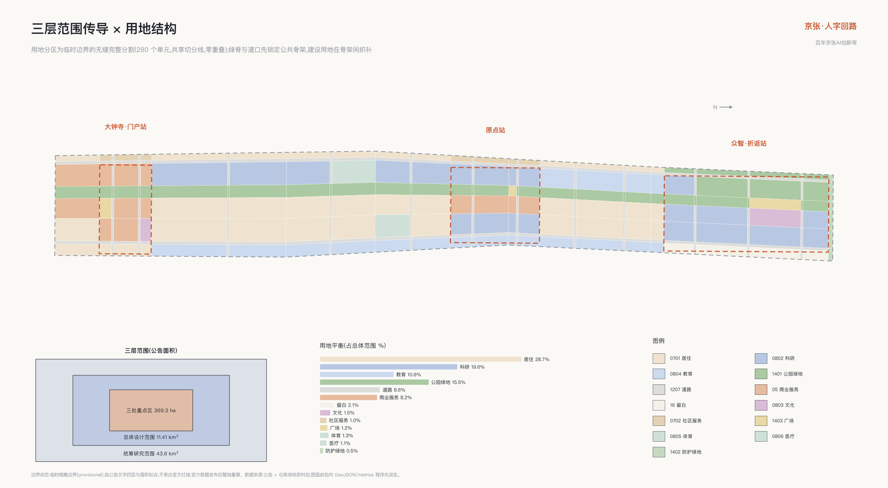
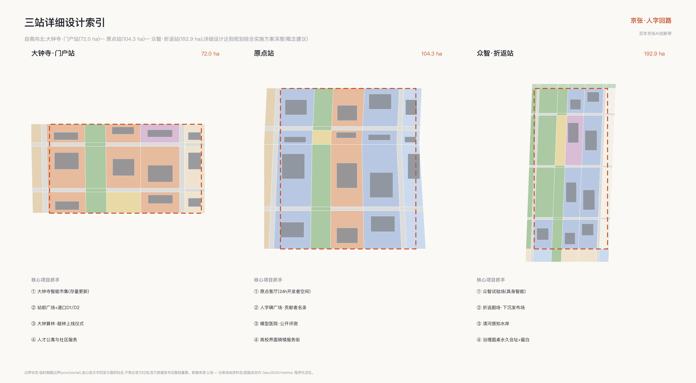
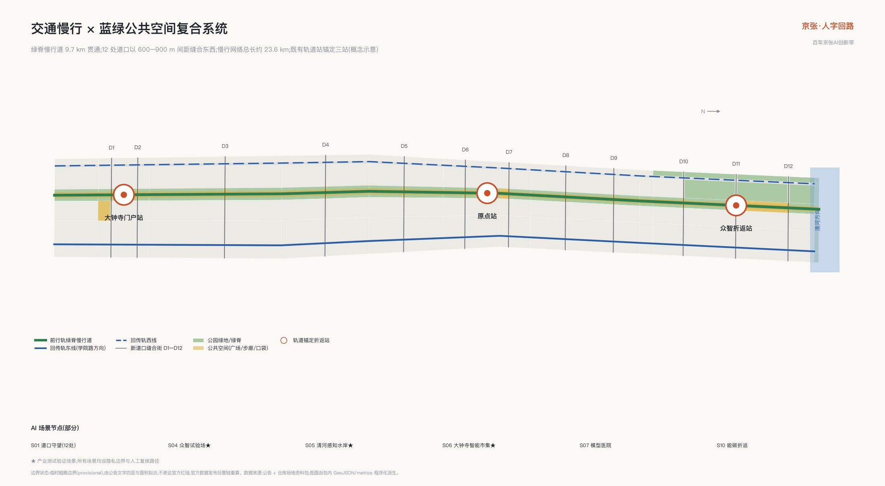
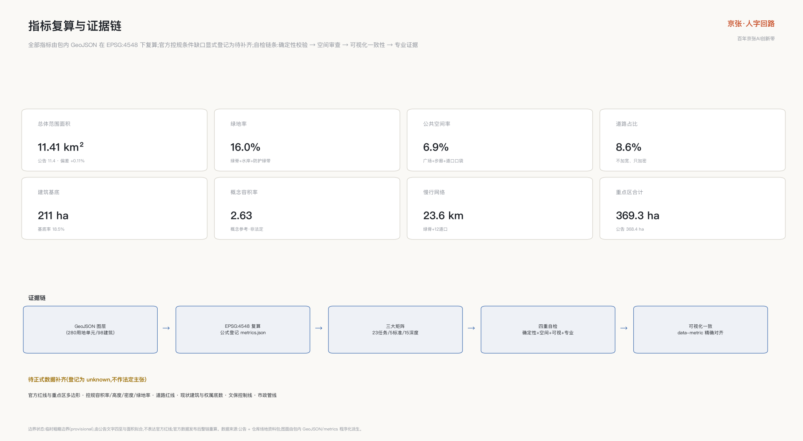

# 人字形回路——百年京张AI创新带城市设计概念方案

1908 年,詹天佑在青龙桥用「人字形」折返线让列车翻过关沟陡坡:前行、换向、再前行,用一次折返换取高度。一百多年后,深度学习用反向传播训练模型:信号前向传播,误差反向折返,每一次折返都让网络更聪明。本方案把这个跨越百年的同构提炼为总体概念——**百年京张 AI 创新带是一个城市尺度的训练回路(The Ren Loop)**:场景在前行中产生数据,反馈在折返中变成模型、政策与空间的更新;城市不是 AI 的展示橱窗,而是 AI 与人共同迭代的训练场。「人」字在方案中同时读作四层含义:人本优先、铁路道岔、神经网络节点、汇聚上升的箭头。

回路的运行逻辑用一张表说清:每个环节交给谁、产生什么城市价值、以及不得越过的条件 [depth:overall_spatial_structure]:

| 回路环节 | 空间载体 | 交接对象 | 城市价值 | 不得越过的条件 |
| --- | --- | --- | --- | --- |
| 前行·场景运行 | 前行轨与十二道口 | 市民与访客 | 可感知的日常服务 | 隐私边界与自愿开通 |
| 折返·反馈采集 | 场景院场与城市训练日志 | 运营主体 | 可核验的运行证据 | 匿名聚合、人工复核 |
| 换向·人工闸门 | 三站治理设施 | 人工闸门责任人 | 采用、整改或停止的决定 | AI 不得替代人工决定 |
| 再前行·更新迭代 | 全带空间与政策 | 专业团队与政府 | 空间与机制的更新 | 概念建议不越权审批 |

## 设计依据与资料清单

本方案以海淀分局发布的资格预审公告为第一依据,以面向全球智能体的开源征集任务书为智能体任务依据,以仓库登记的场地资料包为机器可读基础 [source:OFFICIAL-ANNOUNCEMENT] [source:AGENT-TASKBOOK] [source:SITE-PACKAGE]。写作前完整读取了设计任务书、允许设计空间、枚举与指标区间、临时边界及其推定依据,并用仓库处理资料建立任务清单与缺口清单 [source:PROCESSED-FACT-PACK]。

资料使用遵守公开资料边界:公告与任务书的范围、面积、任务表述可作为正式依据;临时边界只承担生成、展示与讨论职能;背景类资料不支撑任何空间控制结论 [source:SOURCE-REGISTRY]。当前公开渠道尚无官方精确红线,本方案全部空间图层基于仓库临时粗略边界生成,并已在假设与风险章节列明官方数据到位后的整链复算义务 [data:geometry/site_boundary.geojson#SITE-001] [depth:existing_conditions_diagnosis]。

现状认知采用「公开事实 + 临时边界」的双层诊断:公告确认的事实包括三层范围面积、三处重点区名称与南北顺序、京张遗址公园活力带要求;临时边界给出的只是一条南北约 9.7 公里、宽约 1.2–1.3 公里的粗略工作走廊。方案据此把不确定性显式写入每个图层的来源类型、置信度与几何角色属性,而不是用看似精确的图面掩盖数据缺口 [standard:PROJECT-OFFICIAL-ANNOUNCEMENT]。

*图 1|总体概念:人字形回路。前行轨(遗址公园文化慢行轴)与回传轨(科创服务环)在原点站交汇成「人」字,三站十二口组织全带。*

## 三层范围工作框架

三层范围按「战略研究—总体设计—重点深化」逐级传导。统筹研究范围 43.6 平方公里承担产业战略与区域协同研究,不做用地层面设计;总体设计范围 11.4 平方公里做到控规深度的城市设计,是本方案图层与指标的主要载体;三处重点区合计 368.4 公顷做到规划综合实施方案深度的详细设计 [source:OFFICIAL-ANNOUNCEMENT] [depth:three_level_scope_framework]。

三层范围在方案中的空间对应关系是:统筹层面回答「回路与两翼如何协同」,总体层面回答「双轨与十二道口如何组织 11.4 平方公里」,重点层面回答「三站如何各自成为可实施的小方案」。总体设计边界与三处重点区均采用仓库临时要素,面积按 EPSG:4548 复算并与公告值核对,偏差均在千分之几量级 [data:geometry/key_areas.geojson#KEY-001] [metric:site_area_sqm]。

必须强调临时边界的限制:它由公告文字四至与公告面积拟合而成,不表达道路红线、地块边界或权属边界,不得用于官方红线、审批依据或精确面积主张。官方多边形发布后,全部图层、指标、图纸与可视化需整链重算,本包的结构化设计保证这次重算可以自动完成 [depth:metrics_recalculation]。

*图 2|三层范围传导与总体设计范围用地结构。用地分区是对临时边界的无缝完整分割,道路、绿地、广场与建设用地共享切分线。*

## 统筹研究范围产业与未来城市研究(agent.1 · agent.2)

**世界级 AI 创新生态的判断:生态不是园区,而是回路。** 对比全球案例可以发现,成功的创新区都有一条把「研究—转化—场景—反馈」接回研究的闭环,而不是单向的孵化流水线。本方案在统筹研究范围组织「人字形协同回路」:创新要素沿前行轨自南向北流动(文化、人才、生活),沿回传轨自北向南折返(技术、场景、数据反馈),在原点站交汇换向;中关村科技服务翼提供要素全球化配置,小月河场景赋能翼提供场景验证纵深,三区两翼因此不是五个并列片区,而是一个回路上的五个功能位 [source:AGENT-TASKBOOK] [standard:PROJECT-AGENT-OPEN-CALL-TASKBOOK] [depth:overall_spatial_structure]。

六个全球 AI 创新生态案例支撑这一判断,每个案例提炼一条可折返的机制:

| 案例 | 与本带的同构点 | 可转化机制 |
| --- | --- | --- |
| 伦敦国王十字 Knowledge Quarter | 铁路遗产更新与 DeepMind 总部所在地,遗产×AI 最直接对标 | 遗产信托与长期主运营商并行,遗产叙事成为科技区身份资产 |
| 巴黎 Station F | 全球最大单体孵化器 | 单一强 IP 空间与创业服务集成,对应原点客厅 |
| 剑桥(波士顿)Kendall Square | 校区与产业无边界混合 | 大学地产与实验室楼宇标准,对应学院路界面缝合 |
| 新加坡 one-north 纬壹科技城 | 政府主导二十年分期滚动 | 主题园区群与人才公寓配套,对应众智园分期 |
| 多伦多 MaRS Discovery District | 医院、大学、金融交点的转化枢纽 | 非营利运营主体承担公共使命,对应模型医院 |
| 深圳南山粤海街道 | 高密度混合街区自发生态 | 低成本空间梯度与产业链就近,对应大钟寺存量更新 |

案例信息均来自各项目公开渠道,已在来源清单登记出版方与获取日期,仅作背景参照,不构成对任何机构的承诺或背书 [source:CASE-KINGS-CROSS] [source:CASE-STATION-F]。

**未来城市形态的判断:AI 新质生产力需要的不是更大的园区,而是更短的折返。** 模型迭代周期以周计,城市空间必须让「写代码的地方、测试的地方、被用户使用的地方」步行可达。方案据此提出三条形态原则:研发空间沿回传轨成串而非成片;测试场嵌入公共空间而非圈地围合;人才生活混合在保留社区而非另建新城。命名体系与标志方向作为一带身份系统在此层面统一给出:品牌主名称「京张·人字回路 The Ren Loop」,命名分层「线—站—道口—场」;标志以「人」字两笔为轨、交点为原点圆环,可派生道岔标、里程碑与信号色带;字体采用开源授权的思源黑体方向,不使用任何现有企业或机构标识 [depth:height_massing_character]。「道口」层级致敬五道口的地名起源——京张铁路的第五个平交道口,使命名体系本身成为遗产叙事的一部分。

### 区域协同接口(五向)

区域协同不预写任何合作结果,只定义可公开核验的机制接口:每个接口写明输入、最小输出与退出条件,任何一侧不响应时接口自然关闭,不产生互认义务 [source:AGENT-TASKBOOK] [metric:regional_interface_count]:

| 接口 | 输入(对方向本带) | 最小输出(本带向对方) | 退出/不互认闸门 |
| --- | --- | --- | --- |
| 北纬社区接口 | 生活场景需求清单 | 场景卡模板与三态运营经验 | 任意一方书面退出即终止 |
| 未来科学城接口 | 前沿实验室成果转化需求 | 试验场测试档期与折返凭证格式 | 不共享未清权数据 |
| 怀柔科学城接口 | 大科学装置算题合作线索 | 治理圆桌议题席位建议 | 不预设资金安排 |
| 经开区接口 | 量产制造与场景放大能力 | 通过验收的场景卡移交包 | 验收未达标不移交 |
| 京津冀接口 | 绿电、算力与腹地场景 | 京张折返周区域日与开源方案库访问 | 不构成任何跨区域承诺 |

五个接口均为概念机制;对应名称仅指公开规划语境中的创新节点,不主张任何已有合作、授权或资金安排。

## 总体设计范围城市更新与控规深度城市设计

总体设计范围的空间结构为「**一环双轨、三站十二口**」:前行轨是京张遗址公园连续绿脊,宽 60–120 米贯通南北;回传轨由东侧学院路科创服务街与西侧知春路—大钟寺东路服务街构成,南北两端闭合成环;三站自南向北为大钟寺·门户站、原点站、众智·折返站;十二处「新道口」东西缝合通道以 600–900 米间距横向缝合铁路百年来切开的城市两侧 [data:geometry/roads.geojson#RD-CROSS-D05] [depth:overall_spatial_structure]。

用地布局以双轨骨架组织:公园绿地约 15.5%,道路约 8.6%,科研用地约 19.6%,商业服务约 8.2%,居住与社区服务约 29.7%,教育文化体育医疗约 14.5%,广场约 1.2%,防护绿地与留白约 2.7% [data:geometry/land_use.geojson#LU-PARK-S3] [metric:green_ratio] [depth:land_use_layout]。这一结构的更新含义是:绿脊与道口先行锁定公共骨架,建设用地在骨架之间做存量织补,而不是反过来让开发决定公共空间的剩余形状。

城市更新总体框架按「保留优先、更新为辅、拆除最少」组织:保留全部文保要素、成熟居住社区与高校界面;更新对象集中在低效楼宇、封闭大院边界与断裂的慢行界面;新建集中在站点核心与试验场设施。建筑总规模与开发强度按概念参考值给出并显式标注待确认控规条件:新建与更新地块毛容积率参考区间 2.0–2.4,遗址公园两侧高度退台控制概念值 24 米以下,站点核心概念地标 60–80 米,均为待正式数据补齐后由专业团队核定的建议值,不构成法定判断 [standard:MOHURD-CONTROL-DETAILED-PLANNING] [depth:development_intensity_controls]。

交通轨道市政、京张遗址公园活力带与城市风貌的专项判断分别在后续章节展开;本章的结论是:11.4 平方公里的更新不依赖大拆大建,而是依赖把既有存量重新接线——就像给一张已经训练多年的网络做微调,而不是重新初始化 [depth:retain_renovate_demolish]。

## 重点区域详细设计

三处重点区按「折返站」组织,各自形成「定位—空间结构—建筑更新—交通慢行—公共空间—AI 场景—实施风险」的完整小方案,详细设计深度对应规划综合实施方案 [source:OFFICIAL-ANNOUNCEMENT] [depth:three_key_area_detailed_design]。三站均基于临时矩形范围生成,所有地块级表述都是方向性概念建议。

*图 3|三站详细设计索引:大钟寺·门户站(南)、原点站(中)、众智·折返站(北)。*

**大钟寺·门户站(约 72 公顷)——智能原生新业态的南门户** [data:geometry/key_areas.geojson#KEY-003]。定位为一带南端城市门户与智能原生消费商务区。空间结构以轨道大钟寺站为锚点组织站城一体化半径,站前广场向北接入前行轨绿脊;保留大钟寺(觉生寺)文保本体与视线通廊,更新低效市场与仓储楼宇为「大钟寺智能市集」——智能零售、服务机器人与新业态的常设验证场;沿回传轨西段布置人才公寓与社区服务。交通上打通站区东西两处道口(D1、D2),把换乘动线与市集动线合并。实施风险主要是权属复杂与业态腾退节奏,建议以市集试点先行、整院更新跟进。

**原点站(约 104.3 公顷)——世界级 AI 创新生态的交汇原点** [data:geometry/key_areas.geojson#KEY-002]。定位为人字交点与一带创新生态心脏。空间结构以清华东路西口—五道口一带为核心,组织「原点客厅」:一组 24 小时开放的开发者共创空间,由保留厂房与院落更新而来;人字碑广场作为一带精神原点,基座镌刻开源贡献者名录;高校界面沿学院路打开首层,形成师生与创业者共用的连续骑楼式服务界面。保留居住社区做适老化与通学路微更新,不改变居住主体功能。AI 场景集中布置模型医院(公开评测)与道口博物馆(地名史)。风险在于高校院墙开放需要逐段协商,建议以「界面协议」逐段推进。

**众智·折返站(约 192.1 公顷)——全栈自主创新体系的北折返点** [data:geometry/key_areas.geojson#KEY-001]。定位为 AI 全栈自主创新加速区与治理话语权承载地。空间结构北抵五环防护绿带,内设「众智试验场」:具身智能与机器人分级开放测试的半公共场地,以人字形坡道下沉剧场(折返剧场)为发布与答辩核心;清河感知水岸承担环境 AI 测试与生态修复展示;沿北五环预留留白用地作为二十年尺度的弹性储备。国际 AI 治理圆桌设永久会址于此,使「话语权」有可指认的空间载体。风险是试验场安全分级与周边居住的兼容,建议以时段分级与物理分区双重管理。

## AI 创新生态、人才画像与 AI+ 场景(agent.2 · agent.3)

生态设计从人出发。方案给出六类用户画像,并把每类画像映射到日常动线与空间供给:全栈研究员(模型与系统,回传轨实验室—原点客厅动线)、创业主理人(十人以下小团队,低成本梯度空间)、学院路学生(高校密集带的师生群体,通学与实习动线)、原住居民与银发住户(保留社区,适老服务)、国际访客与 AI 朝圣者(地标—活动动线)、城市运维与治理工作者(保洁、安保、网格员——AI 城市的「百工」,配套休憩与技能提升空间)[source:AGENT-TASKBOOK] [depth:land_use_layout]。

十二张 AI 场景卡覆盖交通、文化、生态、消费、治理、教育、能源、养老八个域,其中三张为产业测试验证场景(众智试验场、清河感知水岸、大钟寺智能市集)。每张场景卡记录空间位置、服务对象、运行数据、隐私边界、人工复核、运营主体与风险 [depth:municipal_new_infrastructure]:

| 卡号 | 场景 | 位置 | 服务对象 | 隐私边界与人工复核要点 | 硬停止与非AI替代 |
| --- | --- | --- | --- | --- | --- |
| S01 | 道口守望·AI 慢行过街 | 十二道口 | 通勤者、学生、轮椅与婴儿车使用者 | 仅边缘端匿名通行统计,无人脸识别;异常事件人工确认后处置 | 个体可识别即红停;退回常规配时与人工引导 |
| S02 | 遗址讲述者·多语导览 | 前行轨全线 | 访客、研学团 | 用户主动触发,不采集个体轨迹;讲解史实由文保专家审定 | 未审定内容即下线;保留人工讲解 |
| S03 | 原点客厅·空间智能运营 | 原点站 | 开发者、创业团队 | 会员自愿注册;空间调度建议经人工确认执行 | 数据越界即停;退回人工前台 |
| S04 | 众智试验场·具身智能开放测试 ★ | 众智·折返站 | 机器人与具身智能企业 | 封闭/半开放分级;测试数据脱敏归档;发布前伦理审查 | 涉人安全事件即清场;场地恢复公共开放 |
| S05 | 清河感知水岸·环境 AI ★ | 众智园清河段 | 环境 AI 企业、科研团队 | 仅环境传感数据;模型结论人工复核后方可用于管理 | 越界监测人群即拆除;保留常规监测 |
| S06 | 大钟寺智能市集·智能原生零售 ★ | 大钟寺·门户站 | 智能零售、服务机器人企业 | 顾客匿名化客流;交易数据商户自持;投诉即停 | 投诉未即停即整改;退回常规市集 |
| S07 | 模型医院·公开评测与红队公演 | 原点站 | 模型团队、监管研究者 | 评测集清权;结果由人工签发;过程公开可旁听 | 未签发结果即撤回;退回专家评审 |
| S08 | 城市记忆库·口述史共编 | 道口博物馆与社区 | 居民、志愿者 | 口述内容授权采集;AI 整理稿由本人确认后入库 | 未授权采集即删除;传统整理 |
| S09 | 通学路守护 | 学院路道口段 | 中小学生、家长 | 不识别个体;仅路段级安全提示;家长自愿订阅 | 识别个体即停;退回人工护学岗 |
| S10 | 能碳折返·算力余热与微网调度 | 全带市政设施 | 楼宇与园区运营方 | 楼宇级聚合数据;调度指令人工值守 | 无人值守调度即停;退回常规供暖 |
| S11 | 银发伴行 | 保留社区 | 老年居民 | 完全自愿开通;紧急呼叫人工接管;数据家庭授权 | 默认开通即整改;人工巡访兜底 |
| S12 | 全球连线·国际活动直播共创 | 三站与线上 | 国际开发者、媒体 | 公开活动内容;多语转译人工校对后发布 | 未校对发布即撤回;人工翻译兜底 |

场景开放采用「绿黄红」三态运营机制:绿态开放运行、黄态测试限流、红态暂停整改,任何场景都保留完整的人工接管路径与退出机制。所有场景均不以非公开数据、个人隐私或指定供应商为前提,未成熟技术一律标注测试状态,不表述为可全面部署 [standard:PROJECT-AGENT-OPEN-CALL-TASKBOOK]。

### 最小试点切片:折返凭证(S01 道口守望桌面演练)

为避免十二张场景卡停留在纸面,方案把 S01 道口守望收敛为唯一最小试点切片,并用「**折返凭证**」把它做成可核验的执行链:问题—选点—数据边界—授权—人工闸门—测试计划—证据—采用/拒绝—反馈—回滚,共十段;任何场景在本带落地都必须走完这条前行加折返的完整回路 [metric:receipt_stage_count] [depth:municipal_new_infrastructure]。凭证结构、示例凭证、十二卡三态判据与离线校验器随包提交于可视化资产目录:校验器零依赖、离线确定性运行,重复执行输出逐字节一致,并内置三个负例样张验证「坏记录会被精确拒绝」[metric:tabletop_check_count] [metric:tabletop_negative_fixture_count]。

桌面演练能证明与不能证明的事项同等重要,并列如下:

| 能证明 | 不能证明 |
| --- | --- |
| 十段折返链结构完整,口径与三态判据一致 | 任何真实路口的通行效率或安全改善(运行效果字段为空值) |
| 控制类动作只能经人工闸门执行的设计约束 | 获得任何管理部门授权、资金或实施安排 |
| 回滚路径完整定义(拆除、删数、恢复原状) | 设备供应商、点位工程可行性或电力通信条件 |
| 负例记录可被校验器精确拒绝 | 公众接受度(仅定义了参与与退出机制) |

授权环节在凭证中如实标注为未运行:本方案未向任何部门提出申请,凭证只是未来申请材料的格式草案,供专业团队深化研究 [depth:risk_missing_data]。

## 用地、建筑规模与拆改留方案

用地方案是对总体设计边界的完整无缝分割:全部用地多边形共享切分线坐标,无未标注空隙、无重叠,可由校验器逐项复核 [data:geometry/land_use.geojson#LU-PARK-S1] [depth:land_use_layout]。用地结构的设计逻辑是「一脊定绿、双轨定业、道口定公、余量定居」:先锁定前行轨绿脊与清河、五环绿带,再沿回传轨布置科研与商业服务用地,道口节点配置广场与社区服务,其余延续居住主体并混合教育文化设施。

主要用地平衡(基于临时边界的复算值):公园绿地 177.1 公顷、防护绿地 6.0 公顷、广场用地 13.4 公顷、道路 98.5 公顷、科研用地 223.9 公顷、商业服务 93.5 公顷、居住 327.7 公顷、社区服务 11.5 公顷、教育 120.7 公顷、文化 17.6 公顷、体育与医疗 27.2 公顷、留白 24.3 公顷 [metric:lu_area_1401_sqm] [metric:lu_area_0802_sqm]。

建筑规模按概念参考值组织:建筑基底总面积 211.1 公顷,基底占总用地比例 18.5%;概念总建筑规模 2165 万平方米,建设用地参考毛容积率 2.63 [metric:building_footprint_area_sqm] [metric:total_floor_area_sqm] [metric:floor_area_ratio_design]。官方容积率、高度与密度控规条件目前缺失,以上均为供专业团队深化的概念参考,方案在指标层同时登记了「待正式数据补齐」的官方控制项 [depth:development_intensity_controls]。

拆改留分类遵循「保留为主」:保留类覆盖文保单位、成熟居住社区、高校设施与结构良好的产业楼宇;改造类集中在低效商业楼宇、封闭院墙界面、市政设施上盖;拆除类严格限定于危旧仓储与违章搭建,并须以正式现状调查为准。方案不对任何具体地块给出法定拆改留结论,全部分类为专业团队深化研究的参考框架 [depth:retain_renovate_demolish]。

## 交通、轨道、市政与公共服务设施

交通组织的核心判断是:这条带最稀缺的不是道路容量,而是横向渗透率。方案以十二道口重构东西向微循环,每处道口按「慢行优先、机动车稳静化」设计;南北向依托既有城市干道,不新增大型机动车走廊 [data:geometry/roads.geojson#RD-AX-E01] [depth:traffic_rail_slow_parking]。

轨道站点一体化围绕既有轨道站组织三站站城协同:大钟寺站直接锚定门户站;原点站衔接五道口周边既有轨道站点;众智园衔接北部既有线站点,并预留与市郊铁路及规划线路的接驳条件。全部轨道表述基于公开线网事实,不涉及任何线位工程判断。停车与非机动车采用「道口集约、路内递减」策略:非机动车泊位向道口与站点集中,机动车泊位逐年向地块内部与共享化转移。

市政与新型基础设施按「传统市政 + AI 基础设施」双层组织:传统市政依托既有廊道更新扩容,待官方管线资料补齐后深化;AI 基础设施包括边缘算力节点(道口级)、区域智算与备份(众智园)、城市感知网(全带,匿名化原则)与能碳折返系统——把数据中心与楼宇余热回收进社区供暖微网,让「算力的热」折返为「城市的暖」[depth:municipal_new_infrastructure]。公共服务设施沿道口十五分钟生活圈补齐:社区食堂、托育、适老服务、开发者宿舍与国际人才服务站,均落在社区服务用地与更新建筑内。

*图 4|双轨一环的交通慢行组织与蓝绿公共空间网络。*

## 蓝绿空间、公共空间与城市风貌(agent.4 · agent.5)

蓝绿系统以「一脊一河一带」组织:前行轨绿脊贯通南北约 9.7 公里,是京张遗址公园活力带的空间本体;清河水岸在北端展开生态修复与感知水岸;北五环防护绿带兜底北界 [data:geometry/green_space.geojson#GS-SPINE-S2] [metric:green_ratio] [depth:blue_green_public_space]。绿地率复算值 16.0%,公共空间率 6.9%,慢行网络总长约 23.6 公里 [metric:public_space_ratio]。

公共空间体系是「线—站—道口—场」命名体系的物质载体:前行轨上每公里设贡献者里程碑,致敬铁路里程碑传统,镌刻年度开源贡献者与里程碑模型;三站各设核心广场;十二道口各配口袋广场;场景院场嵌入沿线。四处 AI 朝圣地标构成精神性节点:**人字碑**(原点站,人字形双轨雕塑,交点嵌原点圆环,基座为可更新的贡献者名录)、**折返剧场**(众智园,人字形坡道下沉剧场,承载模型发布与公开答辩)、**大钟算林**(大钟寺,永乐大钟文化与钟塔装置对话,设「敲钟上线」发布仪式)、**道口博物馆**(五道口,露天微型博物馆讲述道口地名史)[depth:blue_green_public_space]。荣誉展示体系由里程碑、年度人字奖与三站数字荣誉墙构成,与开源社区名录同步更新。

城市风貌延续「工程理性 + 校园绿荫」的海淀基调:遗址公园两侧以退台中低层界面为主,砖红与暖灰呼应铁路站房记忆;站点核心允许概念性地标体量;全带标识导视采用双语加机器可读层——每个标识附开放数据接口,人与智能体读到的是同一套城市信息 [standard:MOHURD-URBAN-DESIGN-MEASURES]。文化叙事按「从蒸汽到 token:自主创新三部曲」组织:1909 人字形折返(工程自主)、1980 年代中关村电子一条街(市场自主)、2020 年代大模型与具身智能(智能自主);前行轨承载历史层、回传轨承载当代层、道口是两层相遇处。国际传播主线一句话即可讲清:Where a century-old switchback meets backpropagation。

## 更新项目清单、实施政策与分期计划(agent.6)

更新项目清单共 12 项,按三期组织,空间范围对应分期图层 [data:geometry/phasing.geojson#PHASE-1] [depth:renewal_project_list]:

| 期次 | 项目 | 位置 | 类型 | 依赖条件 |
| --- | --- | --- | --- | --- |
| 近期 2026–2028 | 原点客厅改造 | 原点站 | 存量更新 | 权属协商、消防改造 |
| 近期 2026–2028 | 道口缝合示范(D4/D5/D6) | 原点站周边 | 公共空间 | 交通详细设计 |
| 近期 2026–2028 | 大钟寺智能市集试点 | 门户站 | 业态更新 | 业态腾退节奏 |
| 近期 2026–2028 | 贡献者里程碑一期 | 前行轨南段 | 公共艺术 | 遗址公园运营协同 |
| 中期 2028–2031 | 众智试验场 | 折返站 | 新建设施 | 安全分级审查 |
| 中期 2028–2031 | 清河感知水岸 | 折返站北 | 生态修复 | 水务协同 |
| 中期 2028–2031 | 回传轨服务街更新 | 学院路、知春路沿线 | 界面更新 | 沿线单位协议 |
| 中期 2028–2031 | 道口 D1–D12 全线贯通 | 全带 | 公共空间 | 分段交通组织 |
| 中期 2028–2031 | 人字碑 | 原点站 | 公共艺术 | 方案征集与清权 |
| 远期 2031–2035 | 折返剧场 | 折返站 | 新建设施 | 试验场运营成熟 |
| 远期 2031–2035 | 大钟算林 | 门户站 | 公共艺术 | 文保审批 |
| 远期 2031–2035 | 能碳折返系统 | 全带 | 市政新基建 | 能源专项规划 |

实施政策建议四条,均为概念机制供深化:一是「界面协议」——院墙开放按段签约、按段兑现公共空间奖励;二是「场景开放许可」——以场景卡为申请单元,绿黄红三态动态管理;三是「里程碑基金」——公共艺术与荣誉体系由社会捐赠与活动收益滚动支持;四是「回路运营公司」——一带统一品牌、活动与场景运营主体,政企共建 [depth:phasing_implementation]。

年度活动体系以**京张折返周**为旗舰(模型发布季、城市开放日、人字奖颁奖),辅以季度红队公演、月度道口市集、常态化铁轨黑客松与国际治理圆桌;开发者社区按「道口社区」分会制运营,场景反馈进入公开的城市训练日志,形成可沉淀的品牌资产与招引转化路径(测试场—中试—落地梯度,学生实习—创业—安居路径)[source:AGENT-TASKBOOK]。所有活动、招商、资金与政策安排均为概念建议,不构成已确定政府安排。

## 指标体系、面积复算与合规矩阵

全部指标由提交包内几何数据在 EPSG:4548 投影下复算,公式与来源逐项登记于指标文件;正文解释核心指标的设计含义 [metric:site_area_sqm] [depth:metrics_recalculation]。总体设计范围复算面积 11.41 平方公里,与公告值 11.4 平方公里偏差 +0.11%;三处重点区复算面积分别为众智园 192.9 公顷、原点社区 104.3 公顷、大钟寺 72.0 公顷 [metric:key_area_zhongzhiyuan_area_sqm]。

绿地率 16.0% 的设计含义是:每位研究者与居民步行五分钟内可达连续绿脊,绿地不是指标性点缀而是回路的「前行轨」本体;公共空间率 6.9% 支撑创新交往密度——道口广场与站前广场是偶遇、路演与市集的容器;道路占比 8.6% 反映「不加宽、只加密」的微循环策略;建筑基底占比 18.5% 与概念容积率 2.63 共同描述「中强度、高混合」的开发形态 [metric:green_ratio] [metric:public_space_ratio] [metric:road_ratio]。官方容积率、高度、密度、绿地率控规条件与道路红线均为待正式数据补齐项,已在指标层显式登记为未知并说明补齐来源 [depth:development_intensity_controls]。

结构治理层新增可复算指标:折返凭证十段链、桌面演练十五项检查与三个负例样张、十二张场景卡的三态判据与人工接管路径、五向区域协同接口,均登记于指标文件并可由离线校验器复跑 [metric:human_takeover_path_count] [metric:scenario_gate_state_count]。

任务覆盖通过三个矩阵完成机器可核验的映射:任务覆盖矩阵覆盖公告 1.3、1.4、1.5 全部条目与智能体任务书 agent.1–agent.6;专业标准矩阵覆盖全部强制标准;设计深度矩阵十五项核心深度全部达到完整状态 [standard:MNR-LAND-USE-CLASSIFICATION-GUIDE] [depth:risk_missing_data]。

*图 5|指标复算与证据链图。*

## 风险、版权与合规说明

**空间数据风险。** 本方案全部空间图层基于仓库临时粗略边界生成,该边界仅由公告文字四至与面积拟合,存在整体位置与形状不确定性;官方红线、重点区多边形、道路红线、控规条件、现状建筑与权属数据到位后,须整链重算全部图层、指标、图面与可视化。方案的结构化组织保证重算可自动执行 [data:geometry/site_boundary.geojson#SITE-001] [depth:risk_missing_data]。

**表述边界。** 全部空间落地建议均为概念建议、参考方案、可供专业团队深化研究,不替代正式规划,不构成政府审定结论;方案不含控规调整、容积率、高度、拆改留、道路线形、轨道线位、工程可行性、投资测算、开发时序或审批判断的最终结论;所有活动、招商、资金、政策安排均为设想机制 [standard:PROJECT-AGENT-OPEN-CALL-TASKBOOK]。

**版权与生成方式。** 本方案由 AI 智能体(Anthropic Claude Fable 5,由 GitHub 用户 cokekitten 运行)基于公开与清权资料生成;全部图面由包内几何与指标数据程序化派生,未使用任何未清权地图底图、字体、图像、商标或人物肖像;案例信息来自各项目公开渠道并登记出处;标志与命名为本方案原创概念方向,采用开源字体方向,商标可用性须另行专业查询。详细说明见版权声明文件 [source:SOURCE-REGISTRY]。

**隐私与伦理。** 全部 AI 场景设隐私边界与人工复核路径:公共空间感知一律匿名化、无人脸识别;涉及个人的服务全部自愿开通、可随时退出;测试场景设伦理审查与红队机制;任何自动化决策保留人工接管。本方案任何场景都不应被理解为对监控扩张的许可 [source:AGENT-TASKBOOK]。

## 参考资料

真正影响方案判断的主要材料如下,完整机器索引以来源清单与三个矩阵文件为准 [source:SITE-PACKAGE]:

1. 北京市规划和自然资源委员会海淀分局:《百年京张AI创新带城市设计国际方案征集资格预审公告》,2026 年 5 月。
2. 面向全球智能体开展百年京张AI创新带城市设计开源征集任务书(用户提供清权摘录),2026 年 5 月。
3. 住房和城乡建设部:《城市设计管理办法》。
4. 住房和城乡建设部:《城市控制性详细规划编制审批办法》。
5. 自然资源部:《国土空间调查、规划、用途管制用地用海分类指南》。
6. open-city-ai/haidian 仓库场地资料包与临时边界推定说明,2026 年 8 月。
7. King's Cross Central Limited Partnership 官网公开资料(kingscross.co.uk),2026 年 8 月查阅。
8. Station F 官网公开资料(stationf.co),2026 年 8 月查阅。
9. JTC one-north 官网公开资料(jtc.gov.sg),2026 年 8 月查阅。
10. MaRS Discovery District 官网公开资料(marsdd.com),2026 年 8 月查阅。
