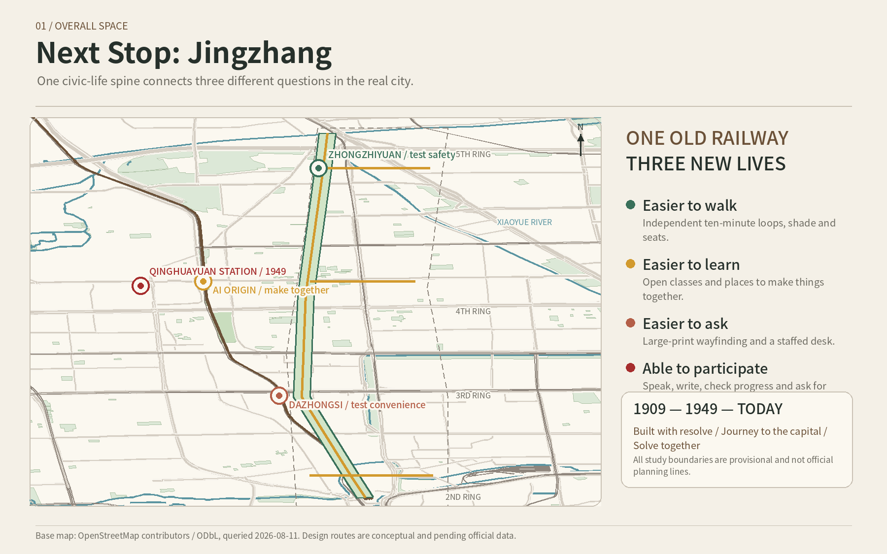
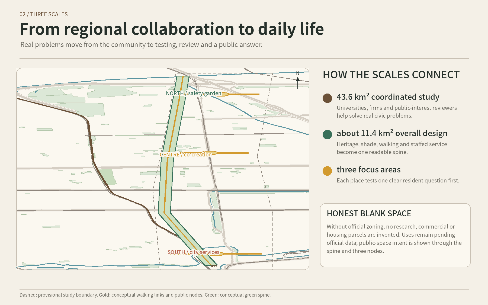
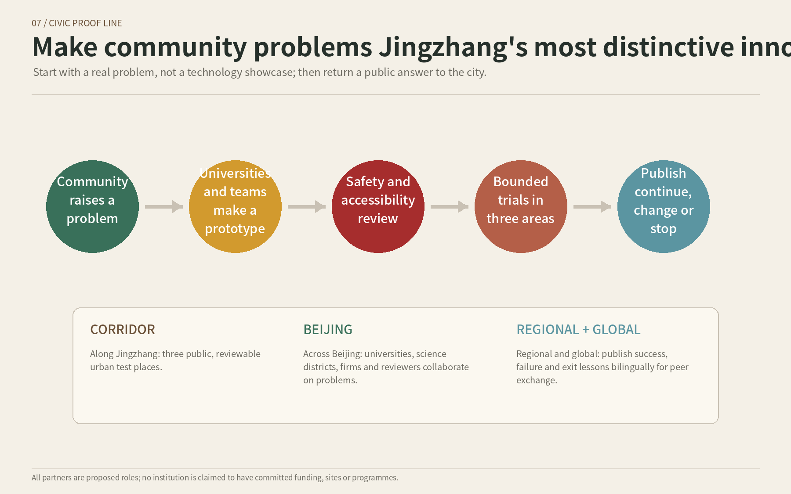
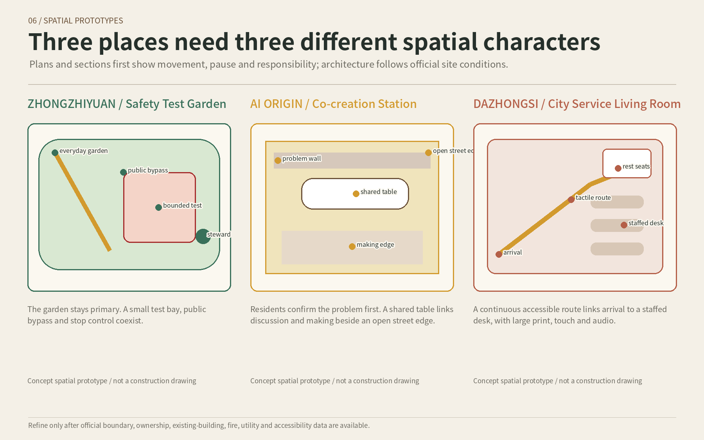
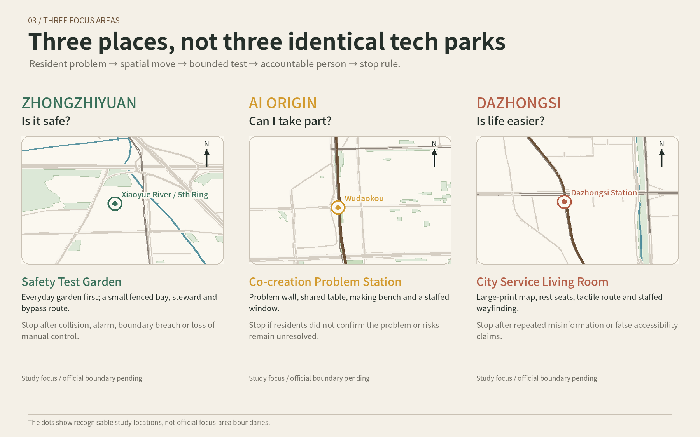
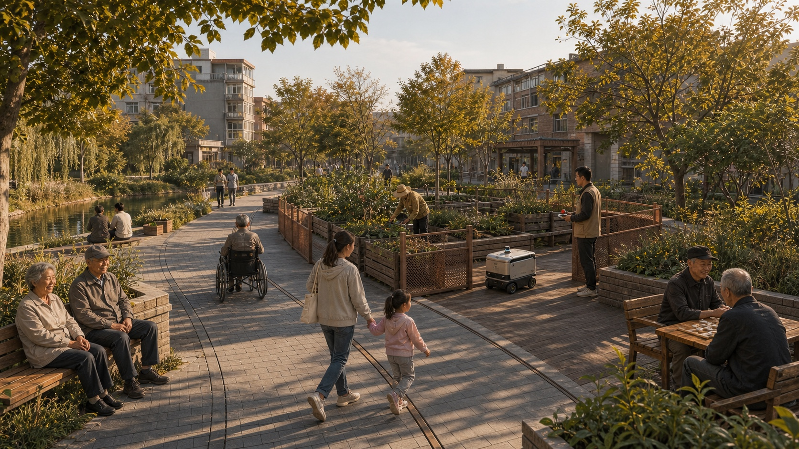
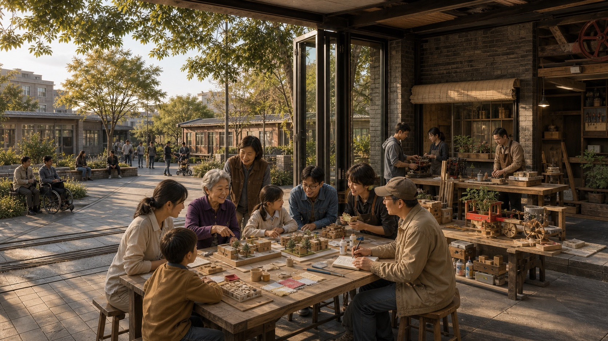
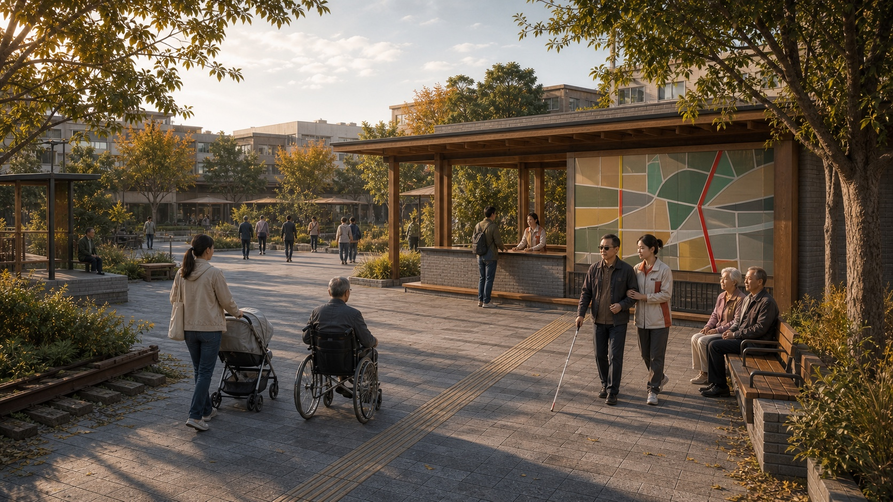
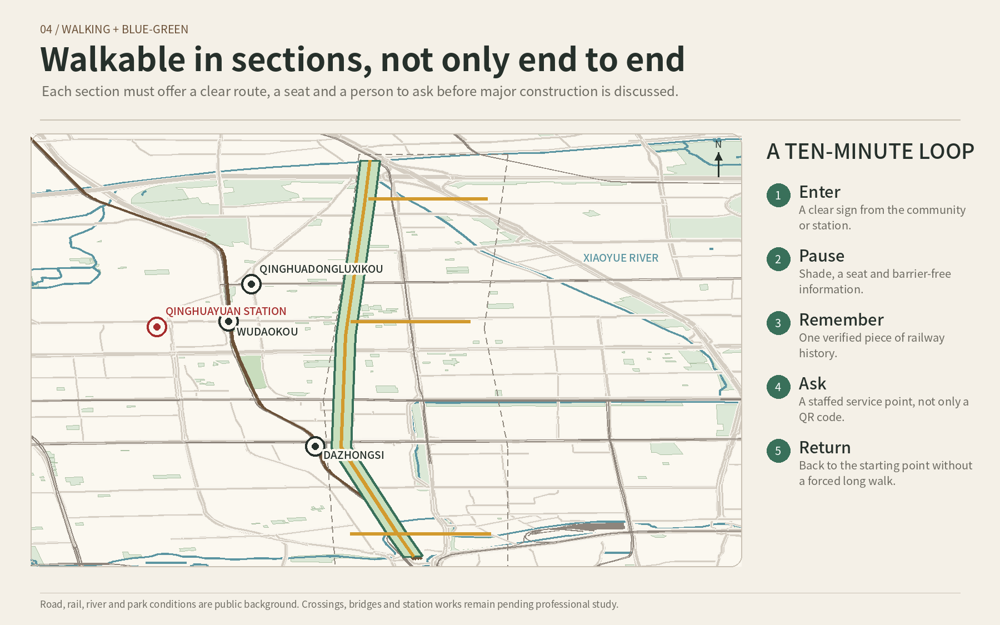
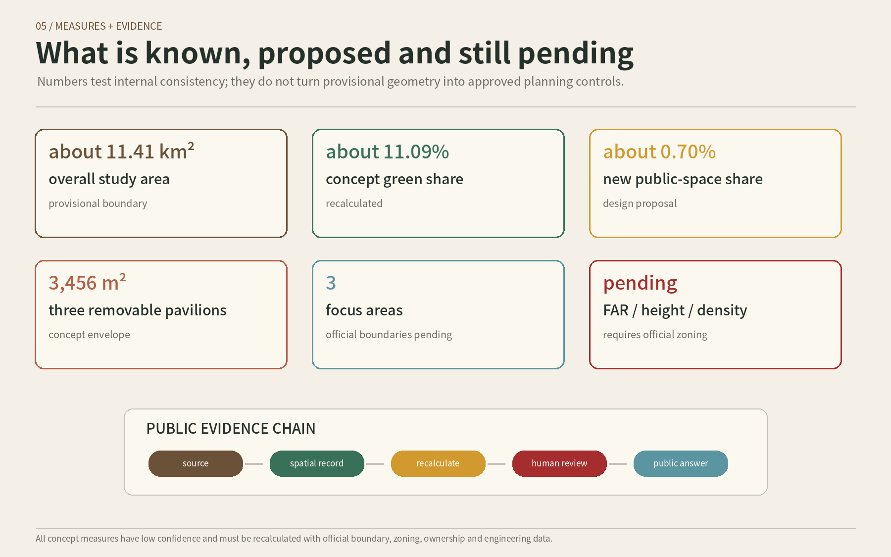

# Next Stop: Jingzhang

> **One old railway, three new lives. Let the next stop of the century-old Jingzhang Railway enter everyday life.**

“Next Stop: Jingzhang” is neither a new railway station nor a technology showroom stretched along the corridor. It is a civic-life spine that people can understand at a glance. Zhongzhiyuan asks, “Is it safe?” AI Origin asks, “Can I take part?” Dazhongsi asks, “Is life actually easier?”

Its signature is the “Jingzhang Civic Proof Line”: communities raise real problems; universities and teams make small prototypes; safety and accessibility reviewers check them; the three places host bounded trials; and the result is publicly stated as continue, change or stop. AI helps quietly with sorting, translation, duplicate finding and risk prompts. Walking, resting, wayfinding and feedback still work without AI.

## Design Basis and Source List

The proposal is based on the open-call announcement, the Agent Taskbook and the site package. They establish a 43.6 km² coordinated study, an overall design area of about 11.4 km² and three focus areas. The repository currently supplies only rough intake geometry, so every boundary is labelled as a provisional study range and is not valid for approval, ownership, heritage control or construction setting-out. [source:OFFICIAL-ANNOUNCEMENT] [source:AGENT-TASKBOOK] [source:SITE-PACKAGE]

Official Beijing pages support the railway, Qinghuayuan Station and heritage-park history. OpenStreetMap is used only to recognise railways, roads, water, parks and stations. Official zoning, ownership, road lines, heritage GIS, existing buildings and utility data remain pending. [source:QINGHUAYUAN-RED-HISTORY] [source:JINGZHANG-PARK-PHASE1] [source:OSM-CONTEXT-20260811]

## Three-Level Scope Framework

The 43.6 km² coordinated study asks who can solve problems together. The roughly 11.4 km² overall design asks how civic life connects. The three focus areas ask what each place should do first. These are one chain from regional resources to street-level experience, not three unrelated drawings. [data:geometry/site_boundary.geojson#SITE-001] [metric:site_area_sqm] [depth:three_level_scope_framework]

The upper scale connects universities, firms and professional services to community problems. The middle scale forms a readable spine of railway memory, parks, walking and service. Each focus area tests something small, reversible and accountable. All areas and metrics must be recalculated when official boundaries arrive.

## Coordinated Research Area: Industry and Future City Research

The innovation belt’s first resource is not office floor area but the real problems produced by everyday life in Haidian. The proposal creates a five-step chain: problem, prototype, review, trial and public answer. Communities provide problems; universities and teams provide creative capacity; firms and service organisations provide maintenance; independent safety, accessibility, legal and privacy reviewers provide checks. A one-off demonstration cannot replace long-term responsibility. [source:AGENT-TASKBOOK] [depth:renewal_project_list]

Regional collaboration is proposed, never claimed as a commitment. The corridor can first connect with Zhongguancun Science City resources, then exchange scenarios and evaluation methods with Future Science City, Huairou Science City, the Beijing Economic-Technological Development Area and peers across Beijing-Tianjin-Hebei. International exchange should publish a bilingual annual urban report and discuss what worked, what failed and why a trial stopped. [source:CASE-KENDALL-CAMBRIDGE] [source:CASE-MARS-TORONTO] [source:CASE-22AT-BARCELONA]

## Overall Design Area: Urban Renewal and Regulatory-Plan-Level Urban Design

The overall structure is one civic-life spine, three daily-life nodes and three types of ten-minute loop. Railway direction carries memory; shade and walking carry everyday life; service points receive problems. Each section can be used independently from a community or station entrance, with a seat, one verified story and a staffed place to ask. [data:geometry/roads.geojson#ROAD-001] [depth:overall_spatial_structure]

Without official zoning, the proposal does not colour the whole area as research, commercial or residential land. Land use remains pending official data; intent is shown through public space, the green spine, three nodes and phasing. Three removable service pavilions are conceptual envelopes, not approved buildings or construction quantities. [data:geometry/land_use.geojson#LU-001] [data:geometry/buildings.geojson#BLDG-001] [depth:development_intensity_controls]

## Detailed Design of Key Areas

The three focus areas share the same public-interest rules but have different spatial characters. Zhongzhiyuan is a Safety Test Garden where the everyday garden is larger than the test bay. AI Origin is a Co-creation Problem Station where a shared table connects a problem wall and making edge. Dazhongsi is a City Service Living Room where a continuous accessible route links rest seats and a staffed desk. [data:geometry/key_areas.geojson#PROV-KEY-001] [data:geometry/public_space.geojson#PUBLIC-001] [depth:three_key_area_detailed_design]

Zhongzhiyuan includes an everyday garden, public bypass, fenced test bay, steward point and stop control; collision, alarm, boundary breach or loss of manual control stops the trial. AI Origin lets residents confirm their original words before a team makes a prototype; no site consent, no resident confirmation or unresolved professional risk means no trial. Dazhongsi begins with large-print maps, tactile guidance, rest and staffed wayfinding; repeated misinformation or false accessibility claims pause the service.

The three scenes are design impressions, not site photographs, approved buildings or implementation promises. Detailed design must wait for official boundaries, ownership, fire, utility, existing-building and accessibility conditions.

## AI Innovation Ecosystem, Personas, and AI+ Scenarios

The people served are neighbourly older adults, families with children, students and young makers, commuters, local shops and community service workers, and people needing accessibility or language help. Firms and developers participate in solving problems; they are not the sole owners of public space. [standard:PROJECT-AGENT-OPEN-CALL-TASKBOOK] [depth:municipal_new_infrastructure]

Ten scenarios start from everyday matters: easier routes, machine courtesy, issue registration, fraud-prevention learning, multilingual deliberation, problem prototypes, help for public-interest ideas, arrival wayfinding, accessible event support and accurate railway history. Three bounded industry trials sit at Zhongzhiyuan, AI Origin and Dazhongsi. AI does not approve, punish or decide funding, and personal profiles do not replace public discussion. Refusing non-essential data does not remove basic services.

## Land Use, Building Scale, and Retain-Renovate-Demolish Strategy

The central land-use judgement is not to invent zoning. The provisional area is recorded as pending official conditions. This does not mean all land remains empty; it means public evidence cannot establish statutory use. Current green, public-space and pavilion areas only test internal consistency. [data:geometry/land_use.geojson#LU-001] [metric:building_footprint_area_sqm]

The three service pavilions total a 3,456 m² conceptual footprint envelope and should be leased, modular, movable and recyclable where possible. Existing-building data is missing, so no false retain-renovate-demolish map is drawn. Character should be restrained, durable and maintainable, without using giant screens or exaggerated “tech” forms as a substitute for spatial quality. [depth:retain_renovate_demolish]

## Transport, Rail, Municipal Infrastructure, and Public Services

Public mapping identifies the relative positions of railway, ring roads, metro stations, water and parks. The design spine and three east-west links are conceptual and do not represent road centrelines, rail works, bridges, tunnels or completed connections. Professional follow-up must inspect accessibility breaks, crossing safety, cycle parking, transit interchange and construction detours. [source:OSM-CONTEXT-20260811] [data:geometry/roads.geojson#ROAD-001] [depth:traffic_rail_slow_parking]

Utilities are not invented. Drainage, flood control, fire access, energy, communications and computing capacity remain pending. Service pavilions follow four principles: offline use, manual takeover, low energy and easy maintenance. River and ring-road crossings require decisions by competent authorities and professional teams.

## Blue-Green Network, Public Space, and Urban Character

The Jingzhang Railway Heritage Park shows that railway memory can also support community life. The proposal extends that direction as a civic-life spine, prioritising shade, seats, clear entrances, accessibility information and repaired walking breaks before expensive landscape gestures. [source:JINGZHANG-PARK-PHASE1] [data:geometry/green_space.geojson#GREEN-001] [metric:green_ratio]

The north is natural, calm and low-impact; the centre is open, discussable and makeable; the south is clear, convenient and suitable for wayfinding and rest. Railway brown marks the route; restrained memory red is reserved for verified 1949 history; park green marks places to walk and sit; everyday gold marks service entrances. Text, icons and light-dark contrast support colour.

## Renewal Projects, Implementation Policy, and Phasing

Phase one is low-cost and reversible: verified history panels, fixed wayfinding, seats, staffed service, paper feedback and three minimum trials. Phase two is medium investment: repair shade, accessibility, small service pavilions and local walking gaps based on real use. Phase three covers bridges, station integration and permanent buildings; these are high-investment items dependent on formal approval, so no false cost or start date is provided. [data:geometry/phasing.geojson#PHASE-001] [depth:phasing_implementation]

Every month, publish issue status; every quarter, decide whether to continue or stop; every year, publish a bilingual urban report. Proposed roles include communities or parks as site hosts, universities and teams as prototype makers, firms or service organisations as maintainers, independent safety and accessibility reviewers, and competent authorities as lawful decision-makers. No organisation is claimed to have committed.

Each phase uses the same resident-readable metrics: how many people came, how many real problems were resolved, average waiting time, whether accessibility features worked, and whether resident feedback improved. If results miss the target, publish why and adjust or stop instead of calling the activity successful without evidence.

Three exit lines apply: immediate stop after danger, severe privacy leakage or loss of manual control; pause for evidence after repeated misinformation, ownerless complaints or unclear data use; and expiry when there is no real use, maintenance owner, lawful site or affordable cost. [data:geometry/phasing.geojson#PHASE-002] [data:geometry/phasing.geojson#PHASE-003]

## Metrics, Area Recalculation, and Compliance Matrix

The provisional overall area is about 11.41 km², the concept green share about 11.09%, the new public-space share about 0.70%, and the combined conceptual pavilion footprint 3,456 m². All figures are recalculated from provisional geometry with low confidence and are not statutory controls. [metric:site_area_sqm] [metric:green_ratio] [metric:public_space_ratio]

FAR, height, density, setbacks, parking, utility capacity and exact focus-area sizes remain pending official data. Separate task-coverage, professional-standard and design-depth matrices are included in the package. Automated checks establish consistency and traceability, not design merit or selection. [metric:key_area_count] [depth:metrics_recalculation]

## Risk, Copyright, and Compliance

The main spatial risk is mismatch between provisional boundaries and recognisable places. The main implementation risk is missing ownership, zoning, road, utility, fire and accountable-operator information. The main public-interest risk is presenting a trial as approval or automated opinion sorting as a governance decision. The main cultural risk is trivialising the verified red-history significance of Qinghuayuan Station. [data:geometry/constraints.geojson#OFFICIAL-CONSTRAINTS-PENDING] [depth:risk_missing_data]

OpenStreetMap is used under ODbL with contributor attribution. Official pages support factual checking; international cases support mechanism comparison. Four resident-scene images were made with generative-image assistance, with human selection, editing, labelling and risk judgement. Maps, infographics, prose and webpages were authored for this proposal. [source:SOURCE-REGISTRY] [source:OSM-CONTEXT-20260811]

Resident data follows data minimisation. Face recognition is not a condition for entry, wayfinding, feedback or participation. Children’s, health, mobility and family-hardship information is not collected unless necessary. AI output must be human-reviewable, and paper, staffed and opt-out routes remain available.

## References

- Centennial Jingzhang AI Innovation Belt open-call announcement and Agent Taskbook. [source:OFFICIAL-ANNOUNCEMENT] [source:AGENT-TASKBOOK]
- Organiser site package, source registry and processed fact pack. [source:SITE-PACKAGE] [source:SOURCE-REGISTRY] [source:PROCESSED-FACT-PACK]
- Official Beijing pages on Jingzhang Railway, Qinghuayuan Station, the Journey to the Capital and the Jingzhang Railway Heritage Park. [source:JINGZHANG-1909-HISTORY] [source:QINGHUAYUAN-RED-HISTORY] [source:JINGZHANG-PARK-PHASE1]
- OpenStreetMap context, queried 2026-08-11. [source:OSM-CONTEXT-20260811]
- Institutional case pages for Cambridge Kendall Square, MaRS Toronto, Station F, Barcelona 22@, JTC LaunchPad and Seoul DMC. [source:CASE-KENDALL-CAMBRIDGE] [source:CASE-MARS-TORONTO] [source:CASE-STATION-F-PARIS]

Complete source, metric, geometry, standards, design-depth and task-coverage records remain in the package’s structured files. This human-readable proposal keeps only claim-adjacent evidence.
