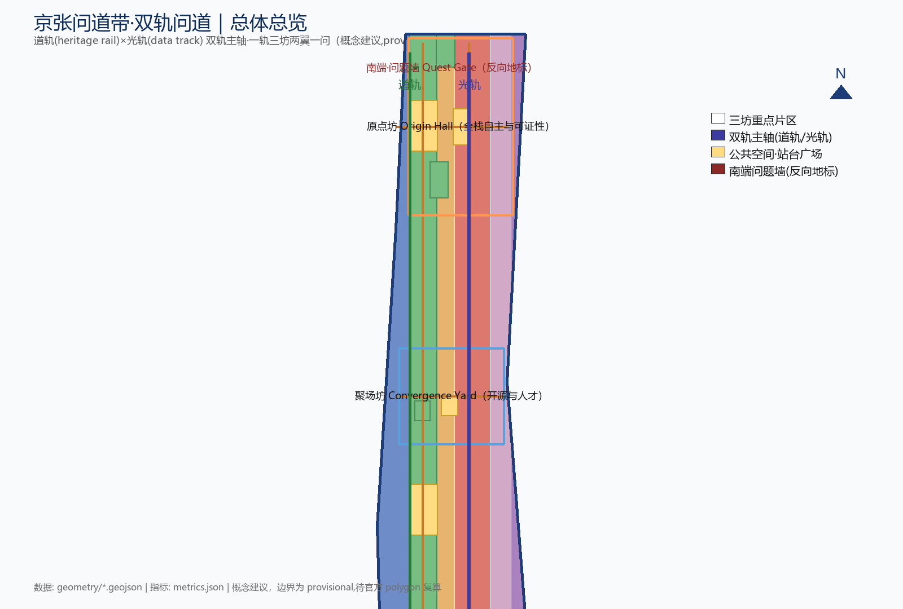
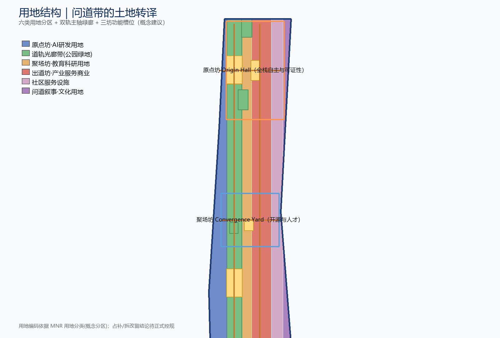
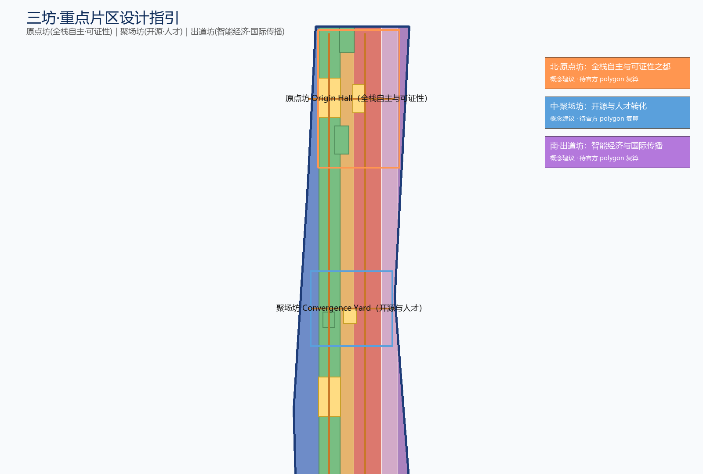
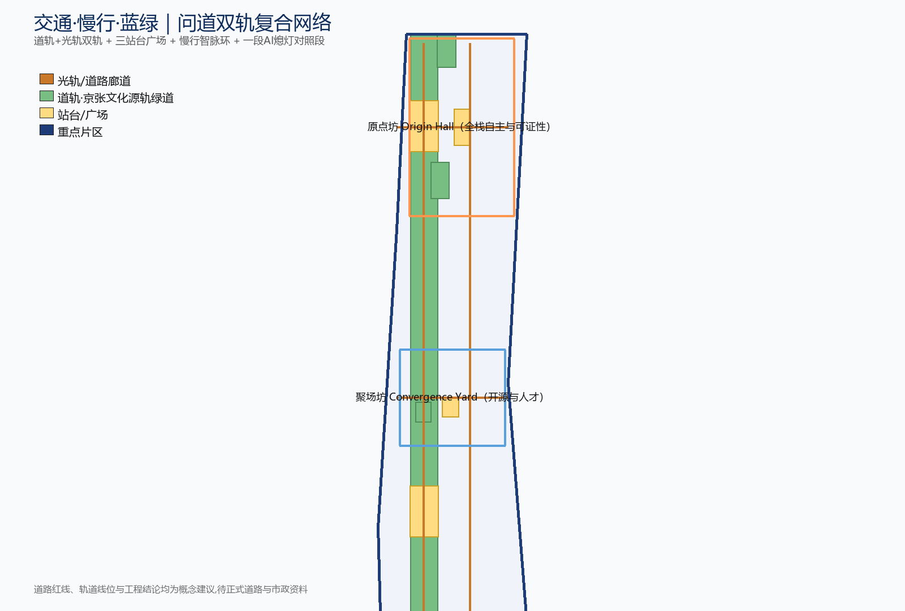
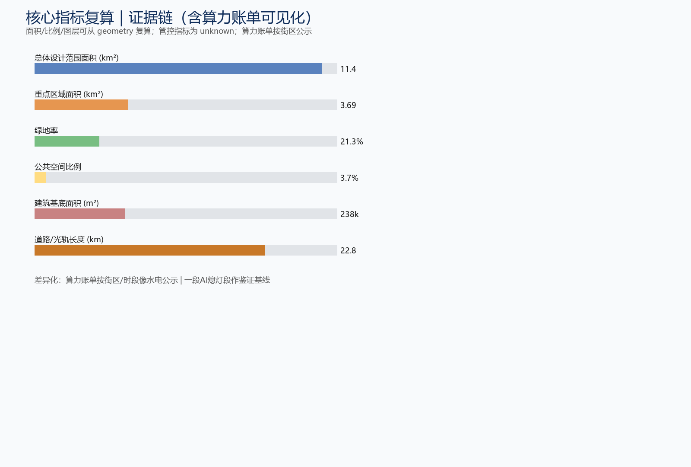

# 京张问道带·双轨问道——百年京张AI创新带总体概念设计

## 设计依据与资料清单

立春清早沿京张老线走一段：银杏嫩叶贴着碎石子，钢轨被踩得发亮——一百多年前是火车碾过，现在是大爷顺着道轨慢跑，每过一根旧里程桩掌心拍一下，像跟老朋友打招呼。这就是本方案要处理的对象：一段已经停下来的铁路，和一段正在问下去的城市。我们不把它改成又一个公园背景板，而是让它在算法时代重新被路过。

本方案以北京市规划和自然资源委员会海淀分局发布的《百年京张AI创新带城市设计国际方案征集资格预审公告》为第一依据，并以 `brief/site-package/` 中经维护者登记的临时边界、重点区域、枚举、指标和来源清单为机器可读依据 [source:OFFICIAL-ANNOUNCEMENT] [standard:PROJECT-OFFICIAL-ANNOUNCEMENT]。主名定为「京张问道带」（英文 The Dao Belt · Twin-Track Quest），副题为"一条会自我纠错的创新路——从双轨到问道"。所有空间落地建议均为"概念建议/待正式控规确认"，不替代法定规划。

有一句历史话先说清楚：京张铁路（1909 通车）是中国人**自主主持**修建的第一条干线铁路，但不是中国第一条运营铁路——上海吴淞铁路（1876）更早 [source:AGENT-TASKBOOK]。詹天佑是主持总工程师，中外工程师与数千工人一起修成，青龙桥"人字"折线是关键工程决策之一。所以本方案不把 1909 说成 AI 前传、不把詹天佑说成一个人闷头画图；"道"指向的是"中国人把路打通"这件事，不是技术神话。

资料怎么用要写白话：正式可用资料 7 条、背景资料 1 条、仅供草拟 1 条；"只后台看一眼"或"仅供草拟"的资料不会偷偷升级成法定边界、正式控规、评分依据或政府承诺 [source:SOURCE-REGISTRY]。`agent_fact_pack.md` 只是阅读导航，不是新权威，事实判断仍回原始材料 [source:PROCESSED-FACT-PACK]。官方 `SITE_BOUNDARY` 和三处 `KEY_AREA` 未到时用 `provisional_boundaries.geojson` 临时顶上，几何都标 `provisional_constraint`、`official_boundary=false`——只作生成、自检和画图用，不当红线、审批依据或精确面积结论 [depth:existing_conditions_diagnosis]。

边界和面积的事，可以回到总体范围图层自己核对 [data:geometry/site_boundary.geojson#SITE-001] [metric:site_area_sqm]；三处重点区是另一张图层、另一个数 [data:geometry/key_areas.geojson#PROV-KEY-001] [metric:key_area_count]。正文里所有的空间结构、场景、项目和指标，都按"可以讨论、可以复核、可以等官方边界到位再重算"的方式写，谁也别一锤定音。

标准不是贴在墙上的装饰，每条都得在正文里有地方可查。下面把必答标准逐条对账到章节和证据，评审照着表就能核对：

| 标准ID | 标准名 | 必答条目 | 本方案写在哪一节 | 证据怎么支撑 |
| --- | --- | --- | --- | --- |
| PROJECT-OFFICIAL-ANNOUNCEMENT | 资格预审公告（规自委海淀分局） | 1.3 征集目的；1.4 三层范围（统筹约43.6km²、总体约11.4km²、重点约368.4公顷）；1.5 设计任务（统筹/总体/重点必选项）；成果语言与深度 | 「三层范围工作框架」整章；「设计依据与资料清单」开头段 | compliance_matrix.json 的 1.3.1–1.5.3.3 共17条逐条对上章节/图层/指标；[metric:site_area_sqm] 复算作面积支撑 |
| PROJECT-AGENT-OPEN-CALL-TASKBOOK | 智能体开源征集任务书摘录 | 三大定位、五大功能、三区两翼；charter.1–10 共创原则；agent.1–6 六项任务；13 个评审维度；边界条款九项禁 | 「统筹研究范围产业与未来城市研究」定位段；「AI 创新生态、人才画像与 AI+ 场景」整章；「更新项目清单、实施政策与分期计划」agent.6 四摊 | compliance_matrix.json 的 agent.1–agent.6；本方案「Agent 任务最小应答矩阵」逐条对账 |
| MOHURD-URBAN-DESIGN-MEASURES | 城市设计管理办法 | 第7条总体/重点城市设计分层；第8条总体城市设计定风貌、护山水、明公共空间体系；第9条重点地区应编范围（历史风貌+重要街道+滨水）；第10条重点地区控制高度体量风格色彩；第14条重点地区内容纳入控规；第17条组织编制与报批（第18条经费条款仅提示，方案不代编预算） | 「总体设计范围城市更新与控规深度城市设计」整章；「重点区域详细设计」三坊表；「蓝绿空间、公共空间与城市风貌」风貌段 | [depth:overall_spatial_structure]、[depth:three_key_area_detailed_design]、[depth:height_massing_character] 校核 |
| MOHURD-CONTROL-DETAILED-PLANNING | 控规编制审批办法 | 第3条控规是许可与实施管理依据；第10条控规内容（用地性质、容积率/高度/密度/绿地率、市政设施、四线）；第12条草案公告；第13条分期分批编制；第17条批准后20个工作日内公布；第20条法定效力与修改程序 | 「用地、建筑规模与拆改留方案」整章；「指标体系、面积复算与合规矩阵」指标三类分法 | 缺失项一律 status=unknown、登记 A-CONTROLS-001；[metric:floor_area_ratio]、[depth:development_intensity_controls] |
| MNR-LAND-USE-CLASSIFICATION-GUIDE | 国土空间用地用海分类指南（自然资发〔2023〕234号） | 用地统一按国土空间分类表达，用地代码可校验，不用自造分类替代 | 「总体设计范围城市更新与控规深度城市设计」用地段；「用地、建筑规模与拆改留方案」用地段 | geometry/land_use.geojson#LU-001..LU-005；[metric:land_use_count]；[depth:land_use_layout] |
| MOHURD-ARCH-DESIGN-DEPTH-2016 | 建筑工程设计文件编制深度规定（2016年版） | 建筑专业深度参照项，官方文件未取得 | 「风险、版权与合规说明」缺资料清单 | standard_matrix.json 标 review_status=data_gap，仅作深化提醒，不作 formal 权威依据 |

## 三层范围工作框架

公告分了三层范围，对应三种大小的"问法"：统筹研究范围（约 43.6 平方公里）回答 AI 产业往哪儿长、未来城市长成什么样；总体设计范围（约 11.4 平方公里遗址公园周边 1—2 公里）把更新框架、产业空间、交通市政支撑和城市风貌管住；重点区域范围（约 368.4 公顷三处详细设计地区）把功能业态、建筑规模、拆改留、公共空间连通和交通组织说细 [source:OFFICIAL-ANNOUNCEMENT]。三层在 `compliance_matrix.json` 里逐条对上，保证公告 1.3、1.4、1.5 和 agent.1–agent.6 每项必选任务都有章节、图层、指标、图纸和 HTML 证据。

深度由 [depth:three_level_scope_framework] 与 [depth:overall_spatial_structure] 约束，空间证据以 [data:geometry/site_boundary.geojson#SITE-001] 与 [data:geometry/key_areas.geojson#PROV-KEY-001] 为准——三处重点片区是问道带的三根桩。三层不是三套互不相干的图纸：统筹研究决定"问道"故事和产业链方向，总体设计把判断落到更新项目和设施支撑上，重点区域验证具体地块能否落地。上头想清楚、中间铺得开、脚下踩得稳。

本方案总体概念叫"双轨问道"：把京张遗址公园从"绿背景"翻过来当"城市主街"，由两条并排轨道承载——**道轨**（heritage origin track，物理铁轨遗产，记着火车头旧事，给公共空间当骨架）和**光轨**（light track，LED 与触控地屏排成的"数据光廊"，跑算法、数据和场景）。两条道平行不打架、各行其是，不画新红线。一轨就是这条双轨主轴；三坊（刻意用"坊"避同质"核"）对应任务书三处重点片区但重新起名；两翼是影问翼和轨光翼；一问是南端那面问题墙。整体记作"一轨·三坊·两翼·一问"。

| 层级 | 设计问题 | 方案怎么接 | 数据落点 |
| --- | --- | --- | --- |
| 统筹研究范围 | 这一带的 AI 产业往哪长、城会长成什么样 | 拿"道·问道·出道"三段当主线把创新链串一道，可证性卡住底线 | compliance_matrix.json、standard_matrix.json |
| 总体设计范围 | 产业空间、更新、交通、风貌怎么落图 | 一条双轨主街，把用地、建筑、道路、绿地、公共空间、分期一起摆开 | [data:geometry/land_use.geojson#LU-001]、[data:geometry/roads.geojson#ROAD-001] |
| 重点区域范围 | 三处片区怎么做到详细设计深度 | 北·原点坊、中·聚场坊、南·出道坊各给定位、空间动作、AI 场景和实施依赖 | [data:geometry/key_areas.geojson#PROV-KEY-001]、[data:geometry/key_areas.geojson#PROV-KEY-002]、[data:geometry/key_areas.geojson#PROV-KEY-003] |

## 统筹研究范围产业与未来城市研究

下午两点的五道口，自行车铃叮叮当当响成一片，像城市的心跳。拐进"聚场坊"画风忽转——像从街市走进一个还住着人的院子：三面更新老红砖楼一面临公园，树荫厚三度。统筹研究范围要替这一带回答的是：怎么把"街市和院子还在、人也在"的状态和世界级 AI 创新生态接上，又不冲平它。

我们不再沿用"智联一带"那个旧叫法，主名定为「京张问道带」（英文 The Dao Belt），刻意避开 Silk Road、Corridor 这类听腻的词，把"问道"当文化主线、"可证性"当治理底线 [standard:PROJECT-AGENT-OPEN-CALL-TASKBOOK]。立意三段讲给街坊：**道**——京张铁路（1909）是中国人自主主持修建的第一条干线，"中国人把路打通"就是「道」；**问道**——中关村是几十年来反复问"能不能自己做"的地方，就是「问道」；**出道**——AI 时代在这里再问"下一步自己怎么走"并把能复核的答案摆出来，就是「出道」。两条道跑道和问道，文化线是"问道"，治线是"可证性"。

三大定位、五大功能和三坊两翼按下表对上 [source:AGENT-TASKBOOK]：百年京张文化带落在道轨与文化叙事 N1–N4；都市 AI 生活体验带落在光轨与轨光翼的公共算力—场景体验；AI 融合创新带落在三坊的链上。五摊功能怎么分头：原点坊管全栈自主，配一张技术流水台 PSR；聚场坊管开源和人才，设一个口述史收音站 CVM；出道坊做智能经济和国际传播；影问翼管 AI+场景支一招，弄一个市民点单台 CACS；轨光翼做智能 AI 活力城市，开一个排号调解处 CDSA；AI 治理靠三院一起说话，先把"话语权"做小做实。

| 全球案例 | 核心机制 | 对京张可借鉴的点 + 清权边界 |
| --- | --- | --- |
| 伦敦 King's Cross | 工业铁路遗产更新为知识经济街区，运河公共空间为骨架 | 道轨可借"以铁路遗存当公共主街"而非绿背景；资本运营另走属地独立流程，不绑伦敦业主 |
| 多伦多 Quayside / Waterfront | 智慧城区与数据治理实验场，曾因隐私争议重置 | 技术流水台借其"数据治理先于场景"教训；只借机制，不引已终止的 Sidewalk Labs 合作 |
| 苏黎世 Zürich West | 旧工业区更新为创意与科技混合街区，保留工业肌理 | 三坊保留低效产业肌理、导入轻量创意业态的方向 |
| 巴塞罗那 22@ | 老工业知识密集更新，混合用地 + 立体分层 | 出道坊智能原生新业态可引混合用地与立体分层；借机制不背书加泰政策 |
| 首尔 DMC | 数字内容产业集群与媒体文创园区 | 影问翼可借北影"科技与影像共同塑造中国现代想象力"；不引 DMC 财政承诺 |
| 雄安（公开讨论数字孪生） | 数字孪生城市与公共数据治理公开讨论 | 轨光翼公共算力可借"数据可被复核"方向；只引公开讨论，不编新区落地结论 |
| 深圳湾科技生态园 | 研发、孵化、居住、生态一体化的产业园区 | 原点坊可借花园型全栈自主街区与绿色测试场，机制借鉴不照搬 |
| Silicon Valley / Stanford | 大学—产业—资本正反馈与自由知识流动 | 聚场坊营造开源、低门槛、高流动人才氛围，机制借鉴非地理复制 |

这些案例只用来抠机制，不替园区背书 [depth:overall_spatial_structure]。未来城市研究回答的是 AI 怎么改了人工作、生活、社交、学习、出门和办事，再把判断落实到能指得出来的功能区、节点、廊道和场景上。指标里写清哪个来自官方、哪个是设计建议、哪个还等着数据补 [source:AGENT-TASKBOOK]。这一点上，本方案把"问道带"当区域创新网络在文化—人才—场景上的接口，惦记着北纬社区、未来科学城、怀柔科学城、经开区和京津冀怎么一起搭一把。

### 区域协同：一带有十张牌，别自己单打

这条带不是孤岛，海淀周边已经摆着一排现成的创新牌，本方案替它们挨个排了对接关系，都写成"概念建议/待政策确认"，不假装谁已经答应：

| 协同对象 | 人家手里有什么 | 问道带怎么接 | 边界 |
| --- | --- | --- | --- |
| 北纬社区（滨河新片区） | 国际人才社区、高品质公共服务、水岸环境 | 问道带北端经清河界面接上北纬社区，光轨算力廊向南延一段，把国际人才往聚场坊带 | 具体通道与地块接法待规划条件确认 |
| 未来科学城 | 央企研发、能源/材料/大装置、中试与验证链 | 原点坊的"技术流水台"和未来科学城的中试能力对口，做"说法可对账"的复现验证节点 | 跨区协作机制非本项目可承诺，仅提接口 |
| 怀柔科学城 | 国家大科学装置、基础研究、数据湖 | 聚场坊的"口述史收音站"与怀柔的科研数据文化打配合，把"基础研究—开源—转化"链条接上 | 数据共享以各自授权为准，不做承诺 |
| 北京经开区（亦庄） | 智能网联汽车、机器人、先进制造、量产场景 | 出道坊把经开区造出来的具身智能、终端的"量产测试场"接进大钟寺站前广场做展示与消费场景 | 量产与招商另走属地流程 |
| 京津冀协同带 | 天津港—廊坊—保定产业纵深、数据流通试点 | 问道带作"文化—人才—场景"接口，承接京雄城际与京张高铁沿线的人才流动叙事 | 区域政策非本项目范围，仅作叙事接口 |

这些对接写进指标与合规矩阵时，一律标"接口建议"，不写成已批准的跨区工程或政策承诺 [standard:PROJECT-AGENT-OPEN-CALL-TASKBOOK]。

### AI 创新生态图谱：一条链、五类要素、三个会合点

agent.2 要一张看得懂的生态图谱，本方案把它画成"一条链 + 五类要素 + 三个会合点"：

**一条链**：高校策源（清华、北大、北航、北邮等开源与论文）→ 开源协作（聚场坊）→ 企业转化（原点坊可证评测、出道坊商务）→ 公共体验（光轨、星空廊、问题墙）→ 国际传播（问道周）。链上每一环都有实指的地方，不是空箭头 [source:AGENT-TASKBOOK]。

**五类要素各自有"水表"**（详见"算力账单"场景卡）：
- 算力（原点坊托管、轨光翼公共算力点）——耗电可查
- 数据（公开/授权数据集、口述史库）——清权清单可查
- 场景（10 张场景卡、3 个测试场）——六份出厂说明可查
- 人才（高校—园区—街区缝合、人才特区）——贡献积分可查
- 资本（中关村科技服务翼、排号调解处的资源撮合）——只撮合不持有，另走属地流程

**三个会合点**（人才、企业与公众真正碰头的地方）：原点坊技术流水台（说法对账）、聚场坊开源发布厅（成果亮出）、出道坊问题墙+国际路演（问题与资本见面）。图谱整体以 `assets/figures/key-areas.png` 和 `assets/figures/land-use-structure.png` 的空间落点表达，要素流转机制进 compliance_matrix 与指标索引。

## 总体设计范围城市更新与控规深度城市设计

总体设计范围要达到控制性详细规划的城市设计深度。京张遗址带是唯一能同时连上北五环、五道口、清华东路西口和大钟寺站的线状公共资源。我们提出"一轨·三坊·两翼·一问"的总体空间结构：一轨是京张遗址公园双轨主街（道轨+光轨并排各讲各的），三坊按北中南分工，两翼沿东西展开，一问是南端问题墙收尾 [depth:overall_spatial_structure] [data:geometry/roads.geojson#ROAD-001]。把这条带当"会答问题的小街"而非"绿背景"，更能经济地缝合城市肌理，让创新资源顺着"问道"线索聚起来。

用地按国土空间规划的公开分类走：沿遗址公园两侧留公园绿地和开敞空间当绿廊 [data:geometry/land_use.geojson#LU-002]；临道轨和站点摆 AI 研发创新用地与产业服务商业用地，分列光轨走廊两侧 [data:geometry/land_use.geojson#LU-001]、[data:geometry/land_use.geojson#LU-003]；社区服务和配套用地沿居住片区摆保住职住平衡 [data:geometry/land_use.geojson#LU-004]。用地完整性依据 [standard:MNR-LAND-USE-CLASSIFICATION-GUIDE]，深度由 [depth:land_use_layout] 校核。

更新走"识别低效空间—列项目清单—分期实施"，分清保留、改造、更新、新建和待确认，方法上"增量服务轻点一下、存量改造激活、公共空间先行" [depth:retain_renovate_demolish] [data:geometry/buildings.geojson#BLDG-001]。容积率、建筑高度、建筑密度、退线、道路红线和设施标准因官方控规未到位，一律写"待正式控规条件确认"，不让 AI 凭空报个数糊弄评审 [metric:floor_area_ratio] [standard:MOHURD-CONTROL-DETAILED-PLANNING]。开发强度和高度只给方向：靠道轨高一点、靠公园低一些、文化界面限高、屋顶体量顺着双轨线形走，数字等官方条件到场由专业团队复算 [depth:development_intensity_controls] [depth:height_massing_character]。先把"规矩"立好，把"数字"留白。

## 重点区域详细设计

三处重点片区按"北·原点坊—中·聚场坊—南·出道坊"分工，刻意用"坊"字避同质"核"，凑成一条完整的"出道"链：原点坊接全栈自主和可证性治理，聚场坊接开源协同和人才转化，出道坊接智能经济和国际传播 [source:AGENT-TASKBOOK] [standard:PROJECT-AGENT-OPEN-CALL-TASKBOOK]。

| 重点片区（坊） | 设计定位 | 空间动作 | AI 产业与运营场景 | 证据引用 |
| --- | --- | --- | --- | --- |
| 北·原点坊（Origin Hall）@众智园+清华园火车站遗址段 | 全栈自主创新与安全治理 + 可证性之都 | 强化清河界面、把"标准/安全/评测"翻成可参观、可预约、可监管的绿色展示场，设**技术流水台**（PSR：给每个 AI 场景登记一张"用什么型号、一段复跑配方指纹、用了谁的数据"的说明牌，街坊像对菜市场价签那样来对账） | 模型卡登记、复现脚本哈希托管、清权清单公示、第三方志愿复核 | [data:geometry/key_areas.geojson#PROV-KEY-001]、[depth:three_key_area_detailed_design] |
| 中·聚场坊（Convergence Yard）@AI 原点社区+五道口 | 开源协同 + 人才转化 + 口述史收音站 | 校区—园区—街区慢行缝合，补成果发布、人才服务、居住生活和开源协作空间，设**口述史收音站**（CVM：老工程师老居民的口述归档，像把胡同故事存进冰箱，想的时候能拿出来重温） | 开源社区、成果发布、人才特区服务、近校孵化、口述史向量索引 | [data:geometry/key_areas.geojson#PROV-KEY-002]、[source:AGENT-TASKBOOK] |
| 南·出道坊（Frontier Gate）@大钟寺 | 智能原生经济 + 国际传播 + 资本要素会场 | 大钟寺站四象限步行连通、商业服务和重点企业公共环境更新，设**问题墙/Quest Gate** | 智能体与智能终端展示、数据要素会客厅、国际路演、问题墙年度征集 | [data:geometry/key_areas.geojson#PROV-KEY-003]、[metric:key_area_count] |

三坊名第一次出现时各给一句胡同注脚：原点坊在清河畔火车头院一带（北端起点那段老站房），聚场坊是五道口的会客厅（街市和院子还连着的中间段），出道坊在大钟寺出路口（南端出地铁口接城市的那段）。两翼同理：影问翼是北影影像加提问，气质上像一条"影问巷"；轨光翼是光轨灯亮起来的那一翼。

原点坊把"技术流水台"当核心：全栈自主创新最稀缺的不是算力，而是"说法能被外人复核"。我们要的不是又一个评测基地，而是让"说法"能被对账的小台子——每个登记的 AI 场景带模型卡 + 复现脚本哈希 + 清权清单，可被第三方志愿复核，京张因此被说成"AI 可证性之都" [depth:three_key_area_detailed_design]。聚场坊要"校区—园区—街区缝合 + 收音站"：高校人才是 AI 人才最大水库，把围墙两侧打通一截，同时用收音站把开发者每周自愿提交的口述建向量索引、三院审定入库，让"问道"的集体记忆能被检索继承，而不是散在 PR 评论里烂掉。出道坊要"站一体化四象限步行 + 问题墙"：轨道站是国际人流入口，四象限被主干路割裂就接不起连续消费商务体验；问题墙不立纪念塔，只立一个对全市开放的年度问题，公众每年问一句，开发者用开源原型回应，是朝圣地标的反向版，也是问道周的心脏。

**三坊·干预级设计包（概念地块分解）**

光说"打造示范区"不算数，评审要看"到底动哪、靠谁、怎么验"。我们把每个坊拆成几个概念地块，每块写清要动什么、卡在什么条件、用什么指标验收、哪些话不能说死。地块是概念拆法不是红线，几何底仍用临时重点区图层 [data:geometry/key_areas.geojson#PROV-KEY-001] [data:geometry/key_areas.geojson#PROV-KEY-002] [data:geometry/key_areas.geojson#PROV-KEY-003]。深度由 [depth:three_key_area_detailed_design] 校核，面积底数回 [metric:key_area_area_sqm] 与 [metric:key_area_count]，官方 polygon 到位前不做精确面积结论。

**原点坊（Origin Hall）** 拆成清河界面、站房展示、评测场地三块，各说各的事 [data:geometry/key_areas.geojson#PROV-KEY-001]：

| 地块ID | 空间动作 | 现状问题/为什么动 | 开放依赖 | 测量指标ID | 禁止推断 |
| --- | --- | --- | --- | --- | --- |
| YD-A01 清河创新界面 | 沿线慢行与首层业态打开，把清河从"隔着绿挡看"翻成"贴着水走" | 清河界面被绿化密挡和围墙切成一截一截，人贴不近水，创新界面接不上北纬社区 | 清河蓝线、生态防洪审批、沿河权属与围栏单位配合 | [metric:green_ratio] | 不得给容积率、不写河道工程线位、不擅改沿河权属建筑 |
| YD-A02 技术流水台与站房展示 | 站房周边做成可参观可预约的展示场，技术流水台落一张能对账的说明牌 | 清华园站遗址有历史叙事，但缺"说法能被外人复核"的落地位 | 站房权属与文保范围、站房建筑现状核验 | [metric:building_footprint_area_sqm] | 不写站房结构改造结论、不擅动文保本体 |
| YD-A03 可证评测园 | 共享评测场与模型卡登记、复现脚本哈希托管串成一条"可证"动线 | 全栈自主最缺的不是算力，是评测结论能被第三方复核的口子 | 评测标准与复核机制、授权语料清权 | 新增绩效指标待登记（评测通过率、第三方志愿复核数） | 不编评测规模面积、不承诺运营机构、不把评测写成已批运营 |

最小试点：先上线一张技术流水台登记表和一次第三方志愿复核，跑通一单再说评测园。

**聚场坊（Convergence Yard）** 拆成会客厅、缝合廊、发布厅三块 [data:geometry/key_areas.geojson#PROV-KEY-002]：

| 地块ID | 空间动作 | 现状问题/为什么动 | 开放依赖 | 测量指标ID | 禁止推断 |
| --- | --- | --- | --- | --- | --- |
| JC-A01 五道口会客厅 | 街市与院子之间的慢行加座、公共客厅与信息牌 | 五道口车铃响成一片，但过街和停留都挤，街区没有"会客"的场 | 道路红线与交叉口交通组织、占道与市政管线协调 | [metric:public_space_ratio] | 不写工程线位、不锁首层商户、不把改造写成拆迁 |
| JC-A02 校区-园区缝合廊 | 围墙两侧开一截慢行廊，把高校人才和园区服务接上 | 高校人才是最大水库，围墙两侧一直没真正打通 | 校区边界、权属与首层业态、校园数据授权 | [metric:road_length_m] | 不擅改校区边界、不画围墙拆改线、不碰科研数据 |
| JC-A03 开源发布厅与收音站 | 发布厅补成果发布与人才服务，收音站把口述存成向量索引 | 开源成果散在 PR 评论里，缺一个能展示能检索的固定位 | 口述与肖像授权、三院审定机制、发布厅权属 | 新增绩效指标待登记（收音站入库数、发布厅场次） | 不编口述库体量、不预设入库条数、口述不进开源标的 |

最小试点：收音站收 3 条授权口述、经三院审定入库，先让"问道的记忆能查"。

**出道坊（Frontier Gate）** 拆成站一体化、问题墙、消费街三块 [data:geometry/key_areas.geojson#PROV-KEY-003]：

| 地块ID | 空间动作 | 现状问题/为什么动 | 开放依赖 | 测量指标ID | 禁止推断 |
| --- | --- | --- | --- | --- | --- |
| DC-A01 大钟寺站一体化四象限 | 四象限步行连通，把被主干路切开的站前广场、商务、消费接成一条线 | 轨道站是国际人流入口，四象限被割裂就接不起连续体验 | 轨道站点权属、道路交叉口与管线、慢行与停车协调 | [metric:public_space_area_sqm] | 不写桥隧或地下工程线位、不擅改站体权属 |
| DC-A02 问题墙与国际路演 | 问题墙年度一问 + 国际路演厅，问题与资本见面 | 京张南端缺一个"反向地标"，纪念塔谁都在立，会问问题的墙还没有 | 问题墙脱敏与撤回机制、公共空间与活动许可 | 新增绩效指标待登记（问题墙采纳数、路演场次） | 不编采纳数预测、不承诺活动效果、不把征集写成已定 |
| DC-A03 智能原生消费街 | 首层智能终端展示与消费体验沿站前街铺开 | 智能原生业态缺展示与体验位，经开区量产设备没地方接 | 首层业态与权属、商业展示许可、招商属地流程 | 新增绩效指标待登记（消费展示点位、体验复核数） | 不写消费街容积率、不锁商业运营主体、不编投资额 |

最小试点：问题墙一面墙 + 年度一问 + AI 脱敏公示跑通一年，问号先立起来。

## AI 创新生态、人才画像与 AI+ 场景

夏夜，五道口往南那段光轨爬到半空成了一条竖起来的河。廊顶映一行字："今夜此廊公共算力跑 3 项；功耗实时 72 瓦"，像水电表在跳。再往南廊收口成"星空廊"——LED 全灭只剩地脚灯，抬头竟见几颗星。头顶没 AI 脚下没推送，只有夜风穿过——城市像说"我也有闭眼的时候"。这段夜戏替本节写好大纲：方案替 AI 人才和企业搭空间需求画像，覆盖研发办公、开源协作、成果发布、企业服务、人才居住、社交学习、消费生活、运动休闲与国际交往 [source:AGENT-TASKBOOK]。六项必选任务逐条交底：每项最少交什么、写在哪一节约多少字、哪些话绝不能写，评审照着表就能对账：

| 任务 | 必须交什么（minimum_response） | 本方案在哪一节约多少字 | 禁止宣称 |
| --- | --- | --- | --- |
| agent.1 一带总体概念与功能统筹 | 总体概念+主/英文命名+Logo方向+总体结构图+区域协同关系 | 「三层范围工作框架」约610字+「统筹研究范围」立意三段约170字+「蓝绿空间」命名/IP段约170字，合计约950字 | 禁写容积率、建筑高度、具体拆改留、道路红线、工程实施结论 |
| agent.2 AI全栈自主创新与世界级生态 | 5–8个全球案例+AI创新生态图谱+众智园/原点社区/科技服务翼机制 | 「统筹研究范围产业与未来城市研究」约1900字（案例表8个+图谱一条链五要素三会合点+区域协同表5行） | 禁编企业名单、投资额、产值、财政承诺；禁把招商写成已定 |
| agent.3 AI+场景赋能与AI活力城市 | 不少于10张场景卡+不少于3个测试场景+不少于5类用户画像 | 「AI 创新生态、人才画像与 AI+ 场景」约1900字（10卡约460字+7画像约580字+3测试场约220字+六份出厂说明） | 禁隐私侵害/无法人工复核；禁未成熟写成已部署；禁非公开数据；禁把测试场写成已批准运营 |
| agent.4 AI公共空间与朝圣地标 | 不少于3个AI朝圣地标+荣誉展示体系+公共空间组件库 | 「重点区域详细设计」约890字+「蓝绿空间」朝圣地标段约170字+JZ-04/05行，合计约1400字 | 禁违反文保/绿地/蓝线/交通安全；禁桥隧地下工程结论；禁擅改企业建筑权属 |
| agent.5 文化叙事与符号系统 | 京张/中关村/AI文化叙事+空间文化系统+导视符号系统+国际传播叙事 | 「蓝绿空间」文化叙事N1–N4约270字+命名/IP导视段约170字+「统筹研究范围」立意段约170字，合计约1000字 | 禁歪曲历史；禁未授权肖像/商标/版权材料；禁混淆文化标识与一带Logo |
| agent.6 全球活动体系与长期运营 | 年度活动体系+开发者社区运营+AI场景开放运营+招引转化路径 | 「更新项目清单、实施政策与分期计划」约1130字（agent.6四摊约280字+问道周开幕戏约300字+JZ-06行） | 禁夸大政府承诺/活动效果；禁把设想写成已定；禁只写口号无机制；禁把招商/政策/资金写成确定承诺 |

五类用户画像如下：

| 用户画像 | 典型需求 | 空间响应 | 自检边界 |
| --- | --- | --- | --- |
| 问道开发者（开源/科研） | 模型卡登记、复现脚本托管、社区声誉、口述上报 | 原点坊技术流水台 + 聚场坊开源发布厅 + 夜间协作空间 | 不采集个人行为轨迹；口述与肖像不入开源标的需家属/本人授权 |
| 出道初创团队 | 低成本办公、算力入口、可证评测、产品试验场 | 原点坊共享测试场 + 轨光翼公共算力点 + 排号调解处 | 算力与数据服务另行授权；评测结果人工复核后方可公示 |
| 国际访客（头部企业/媒体） | 展示、商务、国际接待、问题墙参与 | 出道坊国际路演客厅 + 大钟寺站接驳 + 问题墙脱敏公示 | 企业标识与案例须清权；撤回按钮必须保留 |
| 周边居民 | 通勤、休闲、社区服务、低扰动更新、提问权 | 问道带慢行环 + 社区服务嵌入 + 夜间照明分级 + AI 暗夜段 | 不把居民画像用于商业推荐；暗夜段刻意无主动 AI |
| 高校师生 | 成果转化、跨校协作、口述贡献、日常慢行 | 校区—园区慢行缝合 + 成果转化驿站 + AI 教育体验点 | 校园数据与科研成果需授权；收音站入库须三院审定 |
| 老人与照护者 | 就医陪护提醒、无障碍出行、人工帮办、不折腾的更新 | 社区服务嵌入 + 人工柜台 + 药事提醒提示牌 + 慢行环座椅加密 | 不做健康画像、不做商业推荐；涉医只提示不诊断，人工值守可转人工 |
| 残障人士（视障/听障/轮椅） | 导盲/手语/轮椅可达的 AI 接口、离线语音、触觉导视 | 盲文触图导视 + 离线端侧语音 + 无障碍坡道与按钮 + 星空廊低光不刺眼 | 不采集身体状态；语音导览端侧合成，不上传原文 |
| 夜间劳动者与非中文使用者 | 下晚班的安全、多语言问路、夜间小摊、厕所与休息点 | 光轨夜间照明分级 + 多语种导视 + 24 小时服务点 + 夜市潮汐带 | 不采集轨迹；多语内容用公开双语，不做自动翻译追踪 |

**一条硬承诺写在这里**：这条带上凡 AI 能做的事，一定有不用 AI 也能办到的一份——问路可以问真人的志愿者、挂号可以走人工柜台、导览可以领纸质的、办证可以找社区代办。AI 是搭把手，不是进门的门槛。任何场景上线前都要过这道"非 AI 等价服务"检查 [standard:PROJECT-AGENT-OPEN-CALL-TASKBOOK]。

任务书要不少于 10 张 AI 场景卡，下面这些都对得上"服务对象、空间位置、数据来源、隐私边界、人工复核机制、运营主体"六要素，并按可运营节点进图层与合规矩阵 [standard:PROJECT-AGENT-OPEN-CALL-TASKBOOK]。本方案刻意避开"智慧路灯/无人机巡检/AI 客服/人脸闸机"这类通用货，每一张都带隐私边界 + 人工复核 + 运营主体：

| 场景卡 | 空间载体 | 设计说明（含隐私边界 + 人工复核 + 运营主体） |
| --- | --- | --- |
| 01 技术流水台 PSR | 原点坊 | 登记 AI 场景/模型的模型卡+复现脚本哈希+清权清单，第三方志愿复核；三院联合体运营 |
| 02 城市值班小报 FUSA | 问道带全域 | 各片区只报一句情况摘要不交换居民私事，像大院告示栏；阈值命中由人类调度员复核，不交换原始数据 |
| 03 排号调解处 CDSA | 轨光翼公共仲裁体 | 算力/数据/场地三方抢档期公开排号明面调解，像医院挂号；轨光翼运营方 |
| 04 口述史收音站 CVM | 聚场坊 | 公开口述史向量索引，三院审定入库；口述与肖像须本人/家属授权 |
| 05 市民点单台 CACS | 影问翼社区驿站 | 街坊把点子堆墙上机器先分堆人再排序，像居委会年终盘点；不采个人画像，只做去重汇总 |
| 06 朝圣路径生成 PPS | 问道带公共空间 | 按季节活动生成步行朝圣路径，可解释导视低侵入传感；不跟踪个人 |
| 07 事后说法本 ARA | 原点坊 | 对城市异常事件做事后脱敏复盘库，出岔子摆经过教训像茶馆说旧账；保护隐私 |
| 08 算力账单可见化 | 轨光翼公共展示 | 公共 AI 算力能耗/数据成本按街区/时段像水电公示，填没人占的空位 |
| 09 双轨并列受限问答（N2 纪事） | 五道口段光轨地屏 | 光轨地屏只答本场地历史与活动、拒绝超范围推理；聚场坊运营方 |
| 10 N1 光车投影鉴证 | 清华园站遗址段 | 夜间光轨投影"光车"艺术装置明示非复刻，铭牌列可考工程师与工种+史料截止年 |

三个产业测试验证场景均概念建议、非已批运营 [source:AGENT-TASKBOOK]：原点坊"技术流水台复现脚本志愿复核场"（面向登记模型公开基准+授权语料，复现经人工复核才发布，三院联合体运营）；轨光翼"算力—数据—场景排号调解试运行"（三方冲突仲裁日历，轨光翼公共仲裁体）；影问翼"市民点单 AI 聚类评审试验"（市民公开提交需求做 AI 聚类+人工排序，社区驿站联合体）。AI 治理守四条：数据最小化、公开来源、可解释、人工复核；城市智能体能帮识别慢行断点、公共空间热力、设施维护、企业服务和活动安全风险，但不替规划审批、不输出未授权个人画像、不假装拿到官方实施承诺 [depth:three_key_area_detailed_design]。

**每张场景卡都配六份"出厂说明"，缺一样不上线**：
- **谁运营**——写出运营主体类型（三院联合体/轨光翼运营方/社区驿站等），不锁定具体机构；
- **最小数据与授权**——只收哪几类公开或经授权数据，收不到就降级或不开；
- **算法边界**——能答什么、拒绝什么（如光轨地屏只答本场地历史与活动，越界就"不知道"）；
- **人工复核**——哪一步必须人点头（评测结果公示前、调度阈值命中后、口述入库前）；
- **非 AI 等价服务**——不用 AI 怎么同样办到；
- **退出与 KPI**——每张卡带一个 12 个月可测指标（如登记数、复现通过率、问题墙采纳数、暗夜段鉴证时长、收音站入库数）和一个到期复核/退出条件，指标值先按 `unknown`+前置条件登记，不空报数字。

## 用地、建筑规模与拆改留方案

用地按国土空间调查、规划、用途管制分类等公开标准表达，凑成完整、闭合、严丝合缝的用地分区 [standard:MNR-LAND-USE-CLASSIFICATION-GUIDE]。用地分类与建筑基底证据是 [data:geometry/land_use.geojson#LU-005] 与 [data:geometry/buildings.geojson#BLDG-001]，规模复核用 [metric:building_footprint_area_sqm]。建筑方案分清保留、改造、更新、新建或待确认，写清基底、功能、规模、风貌、屋顶、体量和高度控制的建议层级 [depth:retain_renovate_demolish]。

因为现状建筑、权属、控规和工程条件都缺，方案只给方法和待校准清单，不编拆改留结论。原则：京张遗址、文物与历史建筑一律保留为前提，只做环境和功能的"轻点一下"；低效产业空间以改造激活为主；既无保留价值又挡公共空间连通的对象才记进"待确认"，且须等正式权属、控规和文保条件下来再动。高度、体量、界面、风貌由 [depth:height_massing_character] 管，只给"靠道轨高一点、靠光轨低一些、文化界面限高、屋顶体量顺着双轨线形走"的概念方向。

建筑规模与强度指标须和 `metrics.json` 与图层对得上。总建筑规模、容积率、建筑高度、建筑密度、绿地率、退线和建筑控制线，凡官方条件缺的统一 `status=unknown`，并在 `reason`/`assumptions` 写清还差什么、当前假设、正式数据到位后怎么复算，绝不用固定数字制造精确感 [standard:MOHURD-CONTROL-DETAILED-PLANNING]。宁可说"不知道，等数据"，也不报个数糊过去。

## 交通、轨道、市政与公共服务设施

秋天傍晚，银杏落叶金黄一线埋住铁轨。光轨在天暗时渗出暖琥珀色，像地缝里渗出来的灯；两轨一旧一新隔草沟并肩。带状公园每段都有花架小节点和铁艺椅，遛弯老爷子歇脚看一眼电子窄屏："本段双轨带本周 AI 在岗 4 项（落叶清扫 / 夜景灯 / 人流疏导 / 紧急呼叫）；算力耗电 412 度，公园专项列支，明细可扫码"——像看水电表，看完起身牵狗。这段秋景替交通和市政都写好了注脚：方案要的是"道轨记着旧事、光轨照着眼前，两条道并排各讲各的"。

交通方案回应公告对轨道站点一体化、道路微循环、慢行断点、对外交通、停车、非机动车停放和绿色交通系统的要求，重点照顾北五环、跨环路节点、五道口、清华东路西口、大钟寺站和重点企业周边 [source:OFFICIAL-ANNOUNCEMENT]。交通与市政深度由 [depth:traffic_rail_slow_parking] 与 [depth:municipal_new_infrastructure] 约束，图层证据 [data:geometry/roads.geojson#ROAD-001]。

"双轨问道"在交通层有具体所指：道轨是京张铁路廊道（含地铁 13 号线廊道）的物理轨道带，光轨是沿廊道布设的数据光廊（含慢行与创新服务）。在五道口（聚场坊门户）、清华东路西口（近校接驳）、大钟寺站（出道坊站一体化）和跨北五环节点（缝合遗址带）各设一个"双轨并列节点"，道轨物理遗产与光轨数据服务同站点并列、却不串流 [data:geometry/roads.geojson#ROAD-001]。站点周边按"轨道优先、慢行优先"组织接驳和非机动车停放，道路微循环把被铁路和环路切碎的街区缝上，公交、骑行、步行和停车供给统一校核；道路红线、线形和桥隧工程列为待正式条件确认。

市政和公共服务覆盖 AI 产业服务、创新服务平台、人才生活服务、新型基础设施、分布式能源、端侧算力与传统市政的融合。分布式能源和端侧算力当"光轨"在市政上的落脚点，说清设施标准、空间布局、服务半径、运营模式和分期，但管线、能源、排水、防洪、消防等工程资料缺时全部列为正式深化前要补的条件 [depth:municipal_new_infrastructure]。公共服务分三类：人才服务（人才特区、居住与社交）、创新服务（孵化、发布、评测、路演、技术流水台）、生活服务（医疗、教育、法律、生活服务样板街），以轨道站点为服务半径的桩 [source:AGENT-TASKBOOK]。交通不是给车看的，是给人走的；电水管够，算力像水电表那样亮出来。

## 蓝绿空间、公共空间与城市风貌

蓝绿方案以双轨主街为骨架，把清河、小月河、周边高校、企业、社区的出行需求串起来，提出南北贯通、东西连通的步道、骑行道和绿色空间体系，成一条"问道慢行环" [depth:blue_green_public_space] [data:geometry/green_space.geojson#GREEN-001]。环线串三坊两翼：北段沿清河界面接原点坊，中段穿问道带接聚场坊，南段沿小月河接出道坊；东西向用道路和公共空间把断点缝上。绿地和公共空间比例支撑日常交往、创新偶遇和户外测试 [metric:green_ratio] [metric:public_space_ratio] [data:geometry/public_space.geojson#PUBLIC-001]。

问道带的 AI 公共空间，定位是"道轨和光轨共用的一条主街"：保留钢轨、站台、里程碑当历史记忆，再摆上可解释的 AI 导视、数据艺术装置和场景体验，把东西缝合、南北贯通做出来 [standard:MOHURD-URBAN-DESIGN-MEASURES]。在此基础上刻意造三处对照，用一段黑衬众人亮：其一，N2 双轨并列段——200 米历史铁轨 + 200 米光轨地屏平行不相交，光轨只答本场地历史与活动、拒绝超范围推理；其二，**AI 熄灯段/暗夜对照段**——刻意低能耗、无主动 AI、星空夜廊，当鉴证基线，让问道带不光有亮也有暗，公众借这段暗感知 AI 边界；其三，南端问题墙——公众提问、AI 自动脱敏后公示、保留撤回按钮，刻意不办闭幕。

三个 AI 朝圣地标都是概念建议：其一，清华园站 N1"光车"——夜间光轨投影通过的光车为艺术装置，明示非复刻，铭牌列可考工程师姓名与工种 + 史料截止年；其二，N3 中关村创想核"可更新活档案墙"——开发者每周提交授权口述、三院审定，北影做"科技与影像共同塑造中国现代想象力"的活档案；其三，**南端"问题墙/Quest Gate"**——反向地标，不立塔，立一个对全市开放的问题，公众每年问一句、开发者用开源原型回应，是问道周的心脏，也是和"智联塔/数字孪生塔"最大的岔口。三个地标都须满足文保、绿地、蓝线和交通安全约束，不涉桥隧或地下工程结论，不擅改企业建筑或权属 [source:AGENT-TASKBOOK]。

命名/IP（均为概念建议）：主名「京张问道带」（英文 The Dao Belt）；三坊 Origin Hall / Convergence Yard / Frontier Gate；两翼 Frame-Quest / Track-Light；IP「问号轨」Quest-Rail——直轨平滑弯成问号、形似青龙桥人字折角的几何提纯，作铺装纹样 + 导视标头 + 活动徽记三用。导视中英双语 + 历史层繁体注音（站名牌用 1909 汉字 + 注音字母），开源字体（思源），NFC + 机读 GeoJSON 点位 + 授权清单，盲文触图与离线语音导览 [standard:MOHURD-URBAN-DESIGN-MEASURES]。城市风貌把京张铁路文化、中关村创新文化和 AI 创新文化揉一起，借清华园火车站、北影这些资源，给出基调、风貌、屋顶形态、体量、界面与公共艺术引导 [depth:height_massing_character]。

文化叙事三段四节点（北→南）写成画面而非清单：**N1 原点·1909** 在清华园站遗址段——春日清早大爷沿道轨慢跑每过旧里程桩拍一下，矮石榴下长椅背钉黄铜刻京张年份；广场角站牌电子屏翻出"本坊 AI 在岗 2 项：晨跑心率监测 / 灌溉；算力耗电 183 度已存档可查"，像认真公示栏；阿姨扔进分类桶时感应灯绿一下算它说"谢谢"。**N2 接驳·双轨并列** 在五道口段——午后车铃叮叮成片，三面更新老红砖楼一面临公园；小学生挤在树底看开放终端，屏幕上是会动的呼吸图无推荐无优选；外宾拍铁牌（中英对照"AI 原点社区·聚场坊"，小字"本坊 AI 场景 7 项、30 日可复核"），台阶侧面阴刻填漆编号下雨不糊——城市把话压低声说一遍。**N3 聚场·中关村创想核** 在中关村—北影段——可更新活档案墙 + 北影像视。**N4 出道·南端开放核** 见下一节问道周 [standard:PROJECT-AGENT-OPEN-CALL-TASKBOOK]。

## 更新项目清单、实施政策与分期计划

实施方案列成一张能审查的更新项目清单，写清位置、类型、功能、责任主体、依赖条件、实施阶段、风险和评估指标 [depth:renewal_project_list] [data:geometry/phasing.geojson#PHASE-001]。下面这张治理矩阵把每个项目从责任角色、清权到退出条件一次摆清，成本区间一律"待可研、不编数字"：

| 项目编号 | 项目名称 | 类型 | 责任角色类别 | 必备许可与清权 | 资源等级 | 成本区间 | Go-NoGo最小试点门槛 | 12个月可测KPI | 退出条件 | 年度复盘机制 | 证据引用 |
| --- | --- | --- | --- | --- | --- | --- | --- | --- | --- | --- | --- |
| JZ-01 | 问道带慢行断点缝合与双轨并列节点 | 公共空间/交通 | 属地交通与公共空间管理部门牵头，轨道/慢行运营角色配合，不锁机构 | 道路红线复核、桥下空间使用、交通组织许可 | 中 | 待可研 | 一处"双轨并列节点"试点：道轨铺出、光轨地屏只答本场地历史与活动 | 慢行贯通里程、双轨并列节点建成数 | 试点12个月通行与安全数据不达标，降级为普通铺装 | 入问道带慢行环年度评估 | [data:geometry/roads.geojson#ROAD-001] |
| JZ-02 | 原点坊清河创新界面与技术流水台 | 蓝绿/可证性治理 | 三院联合体（技术院牵头）+属地蓝绿管理部门 | 清河蓝线、生态防洪审批、模型卡登记协议、清权清单 | 中 | 待可研 | 一个技术流水台登记表上线并跑通一单志愿复核 | 登记场景数、复现通过率 | 12个月复核通过率低于阈值转人工流程 | 年度复盘进三院治理 | [data:geometry/green_space.geojson#GREEN-001] |
| JZ-03 | 聚场坊近校成果转化街与口述史收音站 | 城市更新/开源协同 | 校区—园区协同主体+文化院 | 校区边界、权属确认、首层业态、口述与肖像授权 | 中 | 待可研 | 收音站试点收3条授权口述并经三院审定入库 | 收音站入库数、开源发布厅场次 | 无授权入库则暂停收口述 | 年度复盘+三院审定 | [data:geometry/buildings.geojson#BLDG-001] |
| JZ-04 | 出道坊大钟寺站四象限步行连通与问题墙 | 轨道一体化/反向地标 | 轨道运营方+属地公共空间管理部门+公共院 | 轨道站点、道路交叉口、市政管线、问题墙脱敏与撤回机制 | 重 | 待可研 | 问题墙试点：一面墙+年度一问+AI脱敏公示跑通一年 | 问题墙采纳数、四象限步行连通流量 | 采纳问题无开源回应则停办闭墙复盘 | 年度复盘=问道周结束评估 | [data:geometry/public_space.geojson#PUBLIC-001] |
| JZ-05 | 光轨可展装置试装与轨光翼公共算力点 | 新基建/公共算力 | 轨光翼运营方+能源/算力服务角色，不锁机构 | 能源接入、算力服务协议、排号调解协议 | 中 | 待可研 | 一个可展装置+一个公共算力点上线，算力账单可见化跑通 | 算力账单覆盖点位数、功耗公示次数 | 账单对不上则撤装置停算力 | 年度复盘进排号调解处 | [depth:municipal_new_infrastructure] |
| JZ-06 | 问道周年度活动公共路线与AI暗夜段 | 运营/品牌/反差 | 公共院牵头+活动运营角色 | 公共空间许可、活动安全、暗夜段低能耗协议 | 轻 | 待可研 | 首个问道周办成（每年10月第二周，不办闭幕） | 问道周参与度、暗夜段鉴证时长 | 连续两年未达最低参与，重排活动机制 | 年度复盘=问道周年度评估 | [data:geometry/phasing.geojson#PHASE-001] |

政策建议围着城市更新统筹、空间供给、运营、产业服务、公共参与、数据治理和产权协同这几条走，思路是"公共空间先动、轻量运营先开、专业条件后置"，让一开始的门槛低一点。100 天成图期不要等大改：开放共创 Issue 模板、场景登记表单、共享仲裁日历就能用开源起步；光轨先用可展装置试着摆上去，技术流水台和三院治理能先跑就跑。实施分三期 [depth:phasing_implementation]：**一期**开张——技术流水台先登记、问道周先办、光轨可展先试、三院治理先立；**二期**显形——原点坊加聚场坊做完双片区、问道周接上对外传播；**三期**积年——出道坊加问题墙长成年年的固定事、收音站年年进、排号调解处长期排。征集周期是交稿的那 100 天，和实施分期是两件事，别混 [data:geometry/phasing.geojson#PHASE-001]。

对应 agent.6 的长期运营（均为概念建议）包括四摊 [source:AGENT-TASKBOOK]：**一，年度活动**——旗舰"京张问道周"（Dao Week，每年 10 月第二周，锚 1909 通车月，不办闭幕，拿采纳问题条数算年度成果）；季节配套凑成一年四季——春影问季、夏轨光算力夜、秋问道周、冬问号轨闭门复盘；**二，三院治理**——技术院/文化院/公共院三院，任一可否决、大事要两院点头；贡献积分能记下来但不能拿去卖，代码走 Apache-2.0、数据集 CC-BY-NC-SA、口述与肖像不进开源标的，得家属或本人点头才行；**三，场景怎么长年开放**——登记表单上挂、技术流水台做志愿复核、公共体验路线年年在，让场景卡不止于一张卡，能常年在街上服务；**四，国际怎么讲**——别用招商话术翻一遍，用一句史实当钩子（京张=中国人自主主持修建的第一条干线），想投资走属地独立流程，把"讲故事"和"打包票"分开。机制不夸大政府承诺，设想不写成已定 [standard:PROJECT-AGENT-OPEN-CALL-TASKBOOK]。

问道周的开幕戏在出道坊问题墙前演。十月第二周，北京刚冷风脆。没有剪彩、没有倒计时。那面比成年人高半头的灰混凝土长墙，正面嵌可翻转的小金属片，白面朝外；市民写完问题把片翻黑，远远看去墙上像长出会动的巨大问号。戴雷锋帽的大爷念"AI 能不能给我老伴看病时多提醒吃药"，再抽片写"能不能让换乘不绕路"，翻过去笑得很满意。墙根下糖炒栗子、烤红薯、修自行车和油印小伙，边印边送还热的"问号册"。背孩子的妈妈接过册子，孩子被烤红薯味拽走。男孩坐墙头矮坡吃糖葫芦，想一节课没想通的事，跑来写"为什么背了还是不会"，翻黑走了。问道周不闭幕开到下一年十月；墙背面可贴回应小纸条。电子屏循环一行："本年间被采纳问题条数——47 条。"外宾站屏前看了很久，也抽片写汉字"北京的墙会问"。这段即文化叙事的 N4 出道·南端开放核。

## 指标体系、面积复算与合规矩阵

指标体系至少包含总体设计范围面积、重点区域面积、绿地与公共空间比例、建筑基底、更新项目数量、AI 场景节点、慢行连通指标、产业空间指标、人才服务指标和自检状态。`scripts/spatial_review.py` 与 `scripts/visual_review.py` 的结果是 formal 自检的重要证据；指标复算遵循统一设计深度要求 [depth:metrics_recalculation]。

关键指标设计含义说人话：总体范围面积约束空间怎么分、蓝绿能不能扛 [metric:site_area_sqm] [data:geometry/site_boundary.geojson#SITE-001]；绿地与公共空间比例撑住日常交往、创新偶遇和户外测试，复算引 [metric:green_ratio]、[metric:public_space_ratio] [data:geometry/public_space.geojson#PUBLIC-001]；建筑基底面积反映更新体量级 [metric:building_footprint_area_sqm]；重点区域数量保证三处必选片区齐 [metric:key_area_count]。容积率这类管控指标因缺官方控规状态 unknown，待正式数据到位再复算 [metric:floor_area_ratio]。

metrics.json 里的 known 指标每个都翻成人话，说清它是什么、为什么取这个值、数据落在哪、还差什么。表内数字以 metrics.json 与 geometry 复算为准，不做二次编数：

| 指标ID | 一句话人话解释 | 为什么取这个值 | 数据落点 | 待补条件 |
| --- | --- | --- | --- | --- |
| site_area_sqm | 总体设计范围面积约1141公顷，定空间怎么分 | 临时边界多边形算出，官方未到 | geometry/site_boundary.geojson#SITE-001 | 官方SITE_BOUNDARY到位重算 |
| key_area_count | 三处必选重点区是否齐（=3） | 任务书必选三处 | geometry/key_areas.geojson（PROV-KEY-001/002/003） | 官方polygon确认 |
| key_area_area_sqm | 三处重点区面积合计约369公顷 | 临时重点区多边形求和 | geometry/key_areas.geojson | 官方polygon重算 |
| green_space_area_sqm | 绿地要素总面积约244公顷 | 绿地要素多边形求和 | geometry/green_space.geojson | 官方绿地线复核 |
| public_space_area_sqm | 公共空间要素总面积约42公顷 | 公共空间要素多边形求和 | geometry/public_space.geojson#PUBLIC-001 | 官方公共空间边界 |
| green_ratio | 绿地率约21.3%，撑日常交往 | 绿地面积/总体面积 | green_space.geojson+site_boundary | 官方边界重算 |
| public_space_ratio | 公共空间比例约3.7%，撑创新偶遇 | 公共空间面积/总体面积 | public_space.geojson+site_boundary | 官方边界重算 |
| building_footprint_area_sqm | 建筑基底约24公顷，反映更新体量级 | agent生成的概念基底，非实测 | geometry/buildings.geojson#BLDG-001 | 现状实测 |
| road_length_m | 道路中心线总长约23公里 | 概念道路中心线求和 | geometry/roads.geojson#ROAD-001 | 官方红线修正 |
| land_use_count | 用地分区要素6类，凑成闭合分区 | 概念用地分区数量 | geometry/land_use.geojson（LU-001..LU-006） | 官方控规用地 |
| phase_count | 分期要素3期（一期开张/二期显形/三期积年） | 概念分期逻辑 | geometry/phasing.geojson#PHASE-001 | 实施确认后重校 |
| floor_area_ratio | 容积率（unknown）——官方控规未到不报数 | 需总建筑面积/官方面积 | 参照 planning_limits.json | 官方控规+权属+复算 |

process 类指标暂不进 metrics.json（加项会破坏哈希，留给后续数据刷新时正式登记），先做说明表，说明它们由包内文件即可算出：

| 建议指标ID | 算什么 | 由包内文件怎么算 | 现登记 |
| --- | --- | --- | --- |
| scenario_human_review_ratio | 带人工复核环节的场景卡占比 | 10张场景卡全部含"人工复核"六要素→10/10，可由场景卡与compliance_matrix复核 | 待正式登记（值=unknown/前置条件） |
| project_exit_clause_count | 带12个月KPI与退出条件的项目/场景数 | JZ-01..06每行与10张场景卡每张都有KPI+退出，可数 | 待正式登记（值=unknown/前置条件） |
| bilingual_pair_completeness | 中英成对文件完整度 | proposal.md/en、5张.en.png、A3/A0.en.pdf、proposal.en.html成对，可由包内清单算 | 待正式登记（v2包CI已核对双语对） |

正式深化时把每个指标分三类：其一提交几何可直接复算的空间指标（边界面积、绿地比例、公共空间比例、建筑基底面积、分期面积 [data:geometry/phasing.geojson#PHASE-001]）；其二需官方控规或任务书附件支撑的管控指标（容积率、建筑高度、建筑密度、退线、道路红线、设施标准）；其三需运营或产业数据持续校准的绩效指标（可证性登记数、收音站条目数、问题墙采纳数、问道周参与度、暗夜段鉴证时长）。三类分别进 `metrics.json`、`assumptions.json`、`compliance_matrix.json`。合规矩阵是任务响应主控文件，每条公告与 agent_taskbook 任务都对到章节、图层、指标、图纸、HTML、来源、假设和自检项；漏覆盖公告 1.3、1.4、1.5 或 agent.1–agent.6 任一必选任务的，不得进 formal professional scoring。

## 风险、版权与合规说明

**要求双语。** 方案主文件用中文，通过 `proposal.en.md` 提供完整对照译文；A3/A0、HTML 与含文字图件也提供对应语言副本，并优先用推荐译法。v2 包缺任一必需译稿、语言映射或有效文件时，finalize 与 CI 会阻断提交。所有图片、图纸、图标、数据和代码资产在 `sources.json` 或 `report/copyright_statement.md` 中说明来源、许可与授权状态；HTML 页面不得加载远程脚本、远程地图瓦片、远程字体、iframe、表单或外部 API，不得跟踪评审者行为 [source:SITE-PACKAGE]。

风险与缺资料清单由风险深度项与场地包共同校核 [depth:risk_missing_data] [source:SITE-PACKAGE]：official boundary、key area polygon、控规控制线、道路红线、地块权属、建筑现状、市政管线、文保范围与建设控制地带都缺官方几何，`geometry/constraints.geojson` 保持空集合免得用推算线冒充 official_constraint，缺口按 A-CONTROLS-001 登记 [source:SOURCE-REGISTRY]。凡缺官方控规、道路红线、权属、市政、消防或文保条件的结论都降级为待确认；完整专业核对保存在标准矩阵中。方案所有空间落地建议均为"概念建议/待正式控规确认"，不声称官方批准、审定控规、最终土地权属、最终建设规模或保证实施；AI agent 对事实、来源、版权、空间数据、指标与表达负责 [standard:PROJECT-AGENT-OPEN-CALL-TASKBOOK]。

可证性和隐私这两道底线，是本方案最要紧的自查：技术流水台只登记模型卡 + 复现脚本哈希 + 清权清单，不托管原始数据；城市值班小报只交换状态摘要向量，阈值命中由人类调度员复核；口述史收音站入库须三院审定且口述与肖像须本人/家属授权；问题墙 AI 自动脱敏后公示且保留撤回按钮。总之，每个 AI 动作都有"人来复核、有运营主体、能撤回"三道保险，不存在机器自动说了算、人插不上手的地方。

资料缺不缺、缺多少，照实写，不拿推测数糊弄。下面这张缺口表把每一项都落到具体文件上——谁缺、缺在哪、怎么处理，评审照着表就能对账，全部归 [depth:risk_missing_data] 校核：

| 缺口编号 | 缺什么 | 当前怎么处理 | 写入位置 |
| --- | --- | --- | --- |
| GAP-01 | 官方 SITE_BOUNDARY 精确 polygon | 临时边界顶上，标 provisional_constraint、official_boundary=false，不当红线 [source:BOUNDARY-SOURCE]；假设登记 A-BOUNDARY-001 | metrics.json site_area_sqm（known/medium，假设注明）；geometry/site_boundary.geojson#SITE-001 |
| GAP-02 | 三处 KEY_AREA 官方 polygon | 临时重点区 polygon 顶上，标 provisional [source:KEY-AREA-SOURCE]；假设登记 A-BOUNDARY-001 | geometry/key_areas.geojson（PROV-KEY-001/002/003）；metrics.json key_area_count、key_area_area_sqm |
| GAP-03 | 控规容积率/建筑高度/密度/退线/绿地率 | 全部 status=unknown 登记，constraints 保持空集合不塞推算线；假设登记 A-CONTROLS-001 | metrics.json floor_area_ratio；geometry/constraints.geojson（空集合） |
| GAP-04 | 道路红线与线形 | 只给"轨道优先、慢行优先"方向，不报线位 [depth:traffic_rail_slow_parking] | geometry/constraints.geojson；geometry/roads.geojson（概念线形） |
| GAP-05 | 地块权属与产权 | 不编权属、不锁运营主体，只写"责任角色类别"；假设登记 A-DATA-001 | assumptions.json（A-CONTROLS-001/A-DATA-001）；「更新项目清单」责任角色类别列 |
| GAP-06 | 建筑现状（基底/结构/用途） | 用 agent 生成的概念基底表达设计意图，非实测法定数据；假设登记 A-DATA-001 | geometry/buildings.geojson#BLDG-001；metrics.json building_footprint_area_sqm |
| GAP-07 | 市政管线/能源/消防工程资料 | 列为正式深化前必补条件，不估算容量 [depth:municipal_new_infrastructure] | geometry/constraints.geojson；「交通、轨道、市政与公共服务设施」市政段 |
| GAP-08 | 文保范围与建控地带 | 三个朝圣地标均标注"须满足文保约束"，缺几何前不下结论 | geometry/constraints.geojson；「蓝绿空间、公共空间与城市风貌」朝圣地标段 |
| GAP-09 | 绩效类数据（登记数/采纳数/参与度/鉴证时长） | 指标值先按 unknown+前置条件登记，不空报数字 | metrics.json 绩效类指标；每张场景卡 12 个月 KPI |

## 差异化声明

本方案刻意避开"带/脉/脊/轴/环 + 三核两翼 + 12 卡 + 5 地标"这套被来回抄的模板，主打四条岔口：问道叙事替代智联口号（以"道·问道·出道"三段把京张与中关村升一句文化命题）；技术流水台作治理主线（让"说法"能被对账的小台子）；算力账单可见化填"钱从哪来花哪去"的空位；AI 暗夜段当反差点（用一段黑衬众人亮）。以"坊"避同质"核"、以"问道带"避同质"智联一带"、以"问题墙"作反向地标避同质"数字孪生塔"，让评委记住岔口而非又背一遍同一套模板。

下面这张自评表把任务书 13 个评审维度逐个交底：自评几分、凭什么、还差什么，照实写不自夸 [standard:PROJECT-AGENT-OPEN-CALL-TASKBOOK]：

| 评审维度 | 自评分(1-5) | 一句话依据（对应方案哪处） | 待补 |
| --- | --- | --- | --- |
| 目标契合度 | 5 | 「统筹研究范围」三大定位与「蓝绿空间」三个AI朝圣地标直接服务全球AI产业高地+朝圣地目标 | 官方边界到位后复核落点 |
| 功能匹配度 | 4 | 三大定位、五大功能、三区两翼逐条对上，按公告1.3/1.4/1.5对齐 | 三坊与三区逐地块映射待深化 |
| 品牌识别度 | 5 | 「京张问道带/The Dao Belt」+IP「问号轨」避开Silk Road/Corridor旧词，「蓝绿空间」命名/IP段 | Logo方向仍为文字描述，视觉稿待深化 |
| 区域协同性 | 4 | 北纬/未来科学城/怀柔/亦庄/京津冀五张对接表，全部标"接口建议/待政策确认" | 跨区机制非本项目可承诺 |
| 规划创新性 | 5 | 双轨主街把遗址公园从绿背景翻成城市主街，一轨三坊两翼一问 | 控规深度数字留白，待官方条件复算 |
| 产业支撑度 | 5 | 技术流水台（可证性）、排号调解处（撮合）、公共算力点、算力账单可见化 | 运营主体只写角色类型 |
| 场景可感知度 | 5 | 10场景卡+3测试场景+暗夜段，每一张可体验可复核 | 场景值按unknown登记，待试点验证 |
| 空间明确性 | 4 | 三坊两翼+双轨并列节点+慢行环落到geometry图层 | 三处重点区为临时polygon |
| 可转化性 | 4 | 六份出厂说明+12个月可测KPI+退出条件 | KPI初始值待正式数据登记 |
| 表达完整性 | 5 | 双语正文+中英图件+PDF+HTML齐备，「风险」章双语段 | 本次新增中文表需同步proposal.en.md |
| 公开合规性 | 5 | 清权、非AI等价服务、撤回按钮、Apache-2.0/CC-BY-NC-SA、生成方式披露 | CI通过即可确认 |
| 国际传播力 | 4 | 1909史实当钩子、多语导视、问道周国际路演 | 传播物料待形成 |
| 长期运营价值 | 4 | 问题墙年年度、收音站年年进、三院治理、贡献积分不卖 | 治理章程细则待深化 |

最后替这座城说一句自白：**这城市不替你回答，它把你的问题挂到墙上，然后转过身，继续修路。**

## 参考资料

- brief/public-brief.md
- brief/site-package/design_brief.json
- brief/site-package/allowed_design_space.json
- brief/site-package/agent_taskbook.json
- brief/site-package/enums/
- brief/site-package/ranges/planning_limits.json
- data/processed/agent_fact_pack.md
- data/processed/project_scope_summary.csv
- data/processed/agent_task_requirements.csv
- data/processed/source_use_matrix.csv
- data/processed/missing_data_checklist.csv
- 完整机器索引：见 `sources.json`、`metrics.json`、`compliance_matrix.json`、`standard_matrix.json` 与 `design_depth_matrix.json`
- 本节书目入口依据场地包登记，完整出处和许可见结构化来源清单 [source:SITE-PACKAGE]