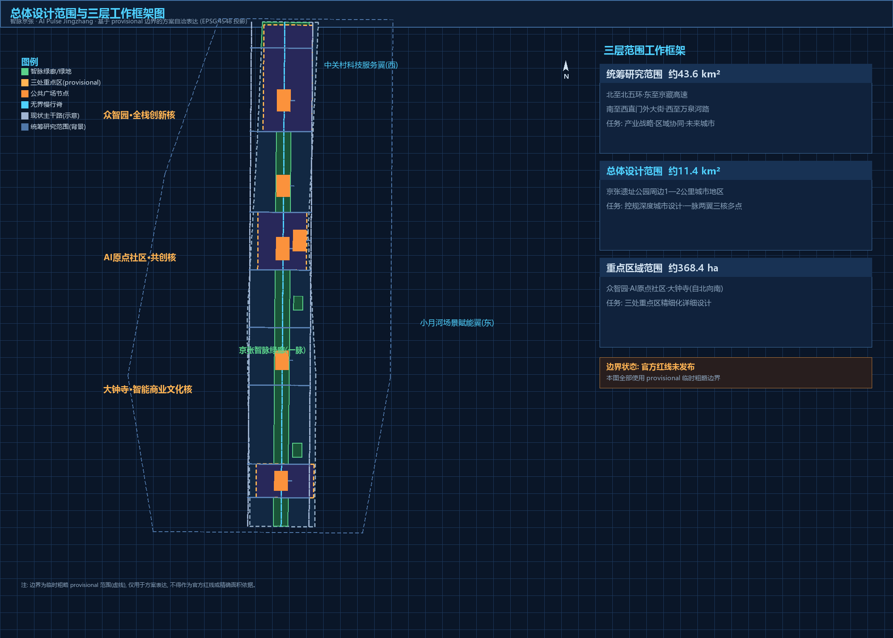
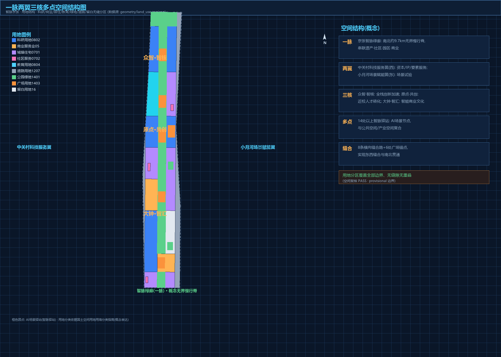
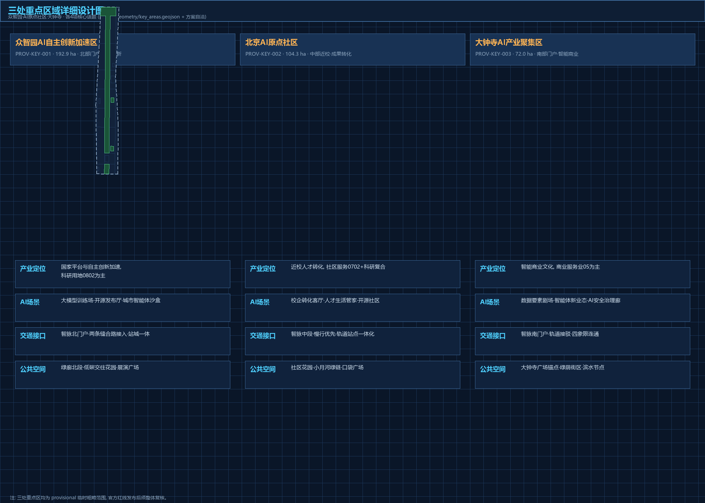
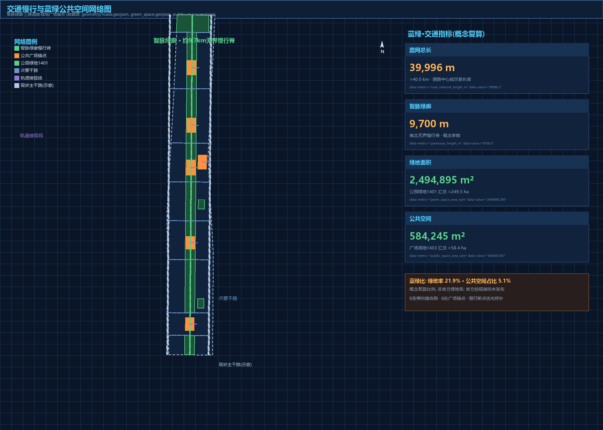
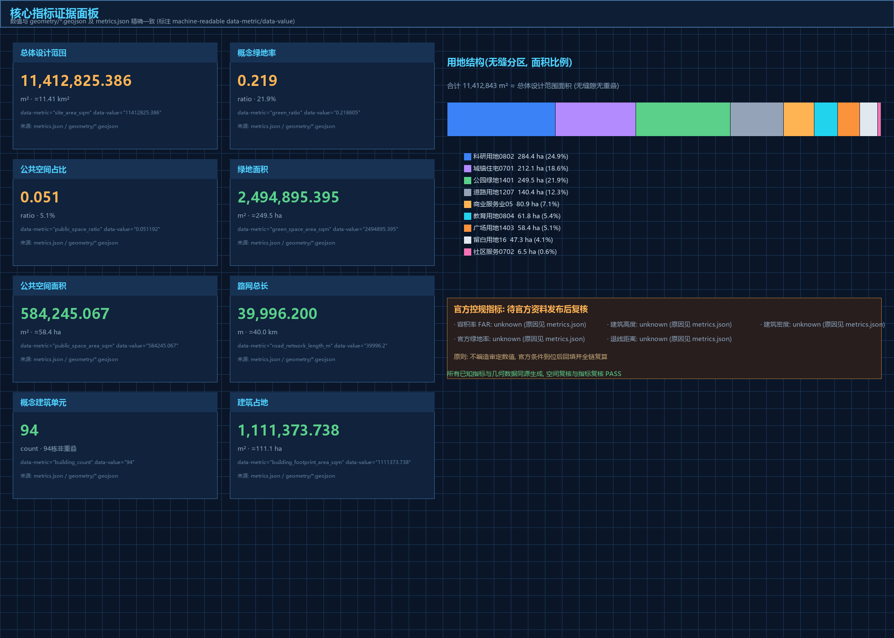

---
title: "AI Pulse Jingzhang: A Conceptual Urban Design for the Centennial Jing-Zhang AI Innovation Belt"
author_github: "creeper110926"
language: "en"
translation_of: "proposal.md"
license: "COMMUNITY-DISPLAY-ONLY"
summary: "A formal concept urban design package proposing the 'AI Pulse Jingzhang' framework: one pulse greenway corridor, two wings, three core areas, and multiple AI scenario stops, delivered with a reproducible provisional-boundary package and 10+ AI scenario cards."
tracks: ["jingzhang-heritage-narrative", "ai-origin-community", "ai-traffic-walkability"]
scenarios: ["ai-traffic-walkability", "ai-cultural-guide", "enterprise-service-copilot", "robot-delivery-low-speed", "public-safety-operations-review", "ai-health-service-navigation"]
iteration: "v0.1"
---

# AI Pulse Jingzhang: Conceptual Urban Design for the Centennial Jing-Zhang AI Innovation Belt

## Design Basis and Source List

This formal concept design package responds to the official qualification pre-announcement for the Centennial Jing-Zhang AI Innovation Belt urban design open call [source:OFFICIAL-ANNOUNCEMENT], the agent open-call taskbook [source:AGENT-TASKBOOK], and the machine-readable site package [source:SITE-PACKAGE], following the source-use registry [source:SOURCE-REGISTRY] and the agent fact pack [source:PROCESSED-FACT-PACK]. Official precise redlines are not yet available in the repository, so the package uses the explicitly marked provisional boundaries [source:BOUNDARY-SOURCE][source:KEY-AREA-SOURCE] with `official_boundary=false` and `geometry_role=provisional_constraint`; all layers and metrics must be recalculated when official polygons are released [depth:metrics_recalculation]. Local professional standard snapshots are cited throughout [standard:PROJECT-OFFICIAL-ANNOUNCEMENT][standard:PROJECT-AGENT-OPEN-CALL-TASKBOOK][standard:MOHURD-URBAN-DESIGN-MEASURES][standard:MOHURD-CONTROL-DETAILED-PLANNING][standard:MNR-LAND-USE-CLASSIFICATION-GUIDE].

## Three-Level Scope Framework

The project defines three working scopes [source:OFFICIAL-ANNOUNCEMENT]: a coordinated research area of about 43.6 km2 for industry strategy and future-city research [metric:coordinated_research_area_sqm]; an overall design area of about 11.4 km2 for regulatory-plan-level urban design along the Jing-Zhang heritage park corridor [metric:site_area_sqm]; and a key detailed-design area of about 368.4 ha covering the Zhongzhiyuan AI acceleration area, the Beijing AI origin community, and the Dazhongsi AI industry cluster [metric:key_detailed_design_area_sqm][metric:key_area_count]. The three key areas are carried as provisional features [data:geometry/key_areas.geojson#PROV-KEY-001][data:geometry/key_areas.geojson#PROV-KEY-002][data:geometry/key_areas.geojson#PROV-KEY-003] inside the site boundary without overlap [depth:three_level_scope_framework].

## Coordinated Research Area: Industry and Future City Research

The research area is organized as a "three areas, two wings" synergy loop: talent and outcomes from the AI origin community flow to full-stack innovation at Zhongzhiyuan, to city-level conversion at Dazhongsi, supported by the Zhongguancun technology-service wing (capital, IP, factor allocation) and the Xiaoyuehe scenario-empowerment wing (testing, public experience) [source:AGENT-TASKBOOK][depth:overall_spatial_structure]. Five global AI ecosystem references are studied for transferable mechanisms: Silicon Valley, Kendall Square, Jurong Innovation District, Yunqi Town, and King's Cross. The naming proposal is **AI Pulse Jingzhang (JZ·Pulse)** with a three-core naming system and a logo direction combining rail sleepers, circuit pulses, and the "herringbone" echo of the historic railway alignment [depth:overall_spatial_structure]. Reserve land [data:geometry/land_use.geojson#LU-018] and mixed-use zoning support an evolvable AI city form.

## Overall Design Area: Urban Renewal and Regulatory-Plan-Level Urban Design

The overall design area adopts a "one pulse, two wings, three cores, multiple nodes" structure [depth:overall_spatial_structure]: the Jing-Zhang AI Pulse greenway corridor (about 9.7 km concept parameter [metric:greenway_length_m]) as the north-south spine [data:geometry/green_space.geojson#GREEN-001][data:geometry/roads.geojson#ROAD-003]; the Zhongguancun service wing (west) and Xiaoyuehe scenario wing (east); three core areas; and 12+ AI scenario stops. Renewal follows retain-first, stitching-priority, incremental regeneration [depth:retain_renovate_demolish], with no parcel-level demolition conclusions. Land use follows the national land-use classification [standard:MNR-LAND-USE-CLASSIFICATION-GUIDE] as a seamless partition [data:geometry/land_use.geojson#LU-008][data:geometry/land_use.geojson#LU-014]. Statutory controls (FAR, height, density, setback) are missing from cleared materials and are declared unknown rather than fabricated [standard:MOHURD-CONTROL-DETAILED-PLANNING][metric:floor_area_ratio][metric:building_height_m][metric:building_density][depth:development_intensity_controls][depth:height_massing_character].

## Detailed Design of Key Areas

**Zhongzhiyuan AI Acceleration Area** (about [metric:zhongzhiyuan_ai_acceleration_area_area_sqm] sqm, [data:geometry/key_areas.geojson#PROV-KEY-001]): a full-stack innovation and AI-governance acceleration engine organized as one green valley [data:geometry/green_space.geojson#GREEN-001], two development bands, and three platforms, anchored by the Zhixin (AI core) plaza [data:geometry/public_space.geojson#PUB-005]. **Beijing AI Origin Community** (about [metric:beijing_ai_origin_community_area_sqm] sqm, [data:geometry/key_areas.geojson#PROV-KEY-002]): a university-anchored talent and conversion origin with the Qinghuayuan Station memorial plaza [data:geometry/public_space.geojson#PUB-004], a near-campus conversion street, and the co-creation plaza [data:geometry/public_space.geojson#PUB-003]. **Dazhongsi AI Industry Cluster** (about [metric:dazhongsi_ai_industry_cluster_area_sqm] sqm, [data:geometry/key_areas.geojson#PROV-KEY-003]): a city-level smart-native conversion interface with the AI Bell Tower soundscape plaza [data:geometry/public_space.geojson#PUB-001], smart-native industry west [data:geometry/land_use.geojson#LU-008] and smart consumption and business east [data:geometry/land_use.geojson#LU-002] [depth:three_key_area_detailed_design].

## AI Innovation Ecosystem, Personas, and AI+ Scenarios

The ecosystem is organized as talent-enterprise-scenario-governance layers closing a loop between the origin community, Zhongzhiyuan, Dazhongsi, and the two wings [source:AGENT-TASKBOOK]. Six persona groups are profiled: AI researchers and engineers, founders and developers, university faculty and students, corporate users and business visitors, residents and seniors/children, and tourists and media. Twelve AI scenario cards are provided (SC-01 to SC-12), including three industry test-and-validation scenarios (edge-compute and energy micro-grid stop; low-speed autonomous shuttle test loop; AI governance sandbox with red-team testing) [depth:risk_missing_data]. All scenarios observe data minimization, explainability, and human review [source:AGENT-TASKBOOK].

## Land Use, Building Scale, and Retain-Renovate-Demolish Strategy

Land use forms a seamless partition of the submitted boundary (research about [metric:land_use_research_area_sqm] sqm, commercial about [metric:land_use_commercial_area_sqm] sqm, residential about [metric:land_use_residential_area_sqm] sqm, education about [metric:land_use_education_area_sqm] sqm, green about [metric:land_use_green_area_sqm] sqm, plaza about [metric:land_use_plaza_area_sqm] sqm, community service about [metric:land_use_community_area_sqm] sqm, roads about [metric:land_use_road_area_sqm] sqm, reserve about [metric:land_use_reserve_area_sqm] sqm) [depth:land_use_layout]. The building strategy uses retain-renovate-new-reserve categories [depth:retain_renovate_demolish], with about [metric:building_footprint_area_sqm] sqm of concept building footprint across [metric:building_count] concept units and about [metric:concept_floor_area_sqm] sqm of concept gross floor area (3.0-storey working assumption) [data:geometry/buildings.geojson#BLDG-001][data:geometry/buildings.geojson#BLDG-051]. Statutory building controls remain unknown pending official conditions [depth:development_intensity_controls].

## Transport, Rail, Municipal Infrastructure, and Public Services

Mobility follows a "rail as skeleton, AI pulse as spine, stitching as priority" strategy [depth:traffic_rail_slow_parking]: arterial boundaries [data:geometry/roads.geojson#ROAD-001][data:geometry/roads.geojson#ROAD-002], the barrier-free pulse greenway [data:geometry/roads.geojson#ROAD-003], eight stitching streets [data:geometry/roads.geojson#ROAD-004], and station-integrated interfaces at Dazhongsi, Zhichunlu, Qinghuayuan, and Zhongzhiyuan [data:geometry/roads.geojson#ROAD-012], with a concept network length of about [metric:road_network_length_m] m. New infrastructure (edge compute, energy micro-grids, data-element services) is proposed as concept direction only [depth:municipal_new_infrastructure]. Public services are organized at street, community, and node levels [data:geometry/land_use.geojson#LU-025].

## Blue-Green Network, Public Space, and Urban Character

The blue-green system is organized as "one pulse, two rivers, multiple nodes": the pulse greenway (about [metric:green_space_area_sqm] sqm, concept green ratio about [metric:green_ratio]) [data:geometry/green_space.geojson#GREEN-001], the Xiaoyuehe blue-green thread [data:geometry/constraints.geojson#CON-WTR-001], the Qinghe interface at the north gateway green belt [data:geometry/land_use.geojson#LU-016], and pocket parks [data:geometry/green_space.geojson#GREEN-003]. Six plazas anchor the public-space network (about [metric:public_space_area_sqm] sqm, concept ratio about [metric:public_space_ratio]) [data:geometry/public_space.geojson#PUB-001][data:geometry/public_space.geojson#PUB-006] [depth:blue_green_public_space]. Three AI pilgrimage landmarks are proposed: **Origin·Qinghuayuan** (rail timeline and AI origin monument), **Core·Zhongzhiyuan** (green-valley showcase and honor display), and **Harmony·Dazhongsi** (AI bell-tower soundscape plaza), together with a contributor honor system that records GitHub IDs in a permanent memory wall [source:OFFICIAL-ANNOUNCEMENT][source:AGENT-TASKBOOK].

## Renewal Projects, Implementation Policy, and Phasing

Renewal projects are organized along three lines: pulse spine connection, three-core activation, and two-wing stitching [depth:renewal_project_list]. Phasing is expressed in three bands [data:geometry/phasing.geojson#PHASE-01][data:geometry/phasing.geojson#PHASE-02][data:geometry/phasing.geojson#PHASE-03] with concept areas [metric:phase_p1_area_sqm]/[metric:phase_p2_area_sqm]/[metric:phase_p3_area_sqm] sqm: near-term (2026-2028) Zhongzhiyuan acceleration and spine north; mid-term (2029-2032) origin community and Dazhongsi linkage; long-term (2033-2037) south tail and wing stitching [depth:phasing_implementation]. A concept annual "AI Pulse International AI City Week", developer-community operations, scenario open operations, public experience routes, and international outreach-to-conversion pathways are proposed as directions for deepening [source:AGENT-TASKBOOK].

## Metrics, Area Recalculation, and Compliance Matrix

Performance metrics are recomputed from geometry in EPSG:4548 [source:SITE-PACKAGE]: site area about [metric:site_area_sqm] sqm [data:geometry/site_boundary.geojson#SITE-001], concept green ratio about [metric:green_ratio], concept public-space ratio about [metric:public_space_ratio], concept building footprint about [metric:building_footprint_area_sqm] sqm, and concept road network about [metric:road_network_length_m] m [depth:metrics_recalculation]. Statutory control metrics are declared unknown [metric:floor_area_ratio][metric:building_height_m][metric:building_density][metric:official_green_ratio][metric:setback_m]. `metrics.json` values match the independent spatial review; the compliance matrix covers all announcement tasks 1.3/1.4/1.5 and agent tasks 1-6, and the standard and design-depth matrices cover all mandatory items.

## Risk, Copyright, and Compliance

This package is an open co-creation concept proposal; it is not statutory planning and does not constitute an approved government conclusion [source:AGENT-TASKBOOK]. Risks are scored 1-5 across eight dimensions (implementation complexity 4, policy uncertainty 4, data privacy 3, operations cost 3, spatial dispute 3, technology maturity 3, public acceptance 2, equity and inclusion 2) [depth:risk_missing_data]. All sources are public or cleared and registered in `sources.json`; the package is licensed COMMUNITY-DISPLAY-ONLY with the copyright statement in `report/copyright_statement.md`. AI generation methods and boundaries are disclosed in `agent.json` and `assumptions.json`; official boundary, regulatory-control, existing-building, ownership, heritage, and municipal data gaps are listed as pending professional confirmation and must trigger recalculation once official data is released [depth:metrics_recalculation].

## References

- `brief/site-package/design_brief.json`, `agent_taskbook.json`, `allowed_design_space.json`, `ranges/planning_limits.json` [source:SITE-PACKAGE][source:AGENT-TASKBOOK]
- `brief/site-package/geometry/provisional_boundaries.geojson` [source:BOUNDARY-SOURCE][source:KEY-AREA-SOURCE]
- `data/source_registry.json` [source:SOURCE-REGISTRY], `data/processed/agent_fact_pack.md` [source:PROCESSED-FACT-PACK]
- Official qualification pre-announcement (Beijing Municipal Commission of Planning and Natural Resources, Haidian Branch, 2026-05-09) [source:OFFICIAL-ANNOUNCEMENT]
- Local standard snapshots in `brief/site-package/standards/` [standard:PROJECT-OFFICIAL-ANNOUNCEMENT][standard:PROJECT-AGENT-OPEN-CALL-TASKBOOK][standard:MOHURD-URBAN-DESIGN-MEASURES][standard:MOHURD-CONTROL-DETAILED-PLANNING][standard:MNR-LAND-USE-CLASSIFICATION-GUIDE]
