# 京张智脉·AI原点带 — 百年京张AI创新带城市设计提案 v4

## 设计依据与资料清单

本提案严格遵循任务书"公开资料边界"原则 [source:DATA-SRC-AGENT-TASKBOOK-20260518]，全部数据来源限于公开资料或用户提供的清权文档。依据 `data/source_registry.json` 的可信度分级，本提案使用的资料分为三类：

**A0 级官方公开资料**（formal 任务依据）：资格预审公告 [source:DATA-SRC-OFFICIAL-ANNOUNCEMENT-20260509]、住建部《城市设计管理办法》[standard:MOHURD-URBAN-DESIGN-MEASURES]、《控规编制审批办法》[standard:MOHURD-CONTROL-DETAILED-PLANNING]、《用地用海分类指南》[source:DATA-SRC-MNR-LAND-USE-CLASSIFICATION-202311]。

**清权文档**：面向智能体的开源征集任务书摘录 [source:DATA-SRC-AGENT-TASKBOOK-20260518] [standard:PROJECT-AGENT-OPEN-CALL-TASKBOOK]。

**provisional_only 临时粗略边界**：[source:DATA-SRC-PROVISIONAL-BOUNDARIES-20260605]，仅用于AI生成、HTML可视化、图纸草图和intake自检。

**关键边界声明**：本提案使用的场地边界为 provisional_boundary，`geometry_role="provisional_constraint"`、`official_boundary=false`、`boundary_precision="provisional_rough"`，仅用于AI生成、可视化与设计讨论，不得作为official redline、审批依据、精确面积复算依据或正式专业评分依据。组织方数据缺口（GAP-BOUNDARY-001/002、GAP-CONTROL-001等9类）不阻断内容评分。

**数据缺口清单**（基于 `data/processed/missing_data_checklist.csv`）：GAP-BOUNDARY-001/002（官方polygon）、GAP-CONTROL-001（控规条件）、GAP-ROAD-001（道路红线）、GAP-PARCEL-001（地块权属）、GAP-BUILDING-001（现状建筑）、GAP-HERITAGE-001（文保范围）、GAP-MUNICIPAL-001（市政条件）、GAP-SERVICE-001（公服设施）。所有缺口在对应章节以"待官方控规确认"或"概念建议"形式表述。

**v4 核心立场**：作为一名专业的城市设计师，本提案始终以人民群众的急难愁盼为第一设计要求。AI创新的最大场景是解决群众急难愁盼，群众的急难愁盼是AI创新的最大价值所在。二者不是对立，而是相融合——创新为人民，人民参与创新 [assumption:A14] [assumption:A15]。

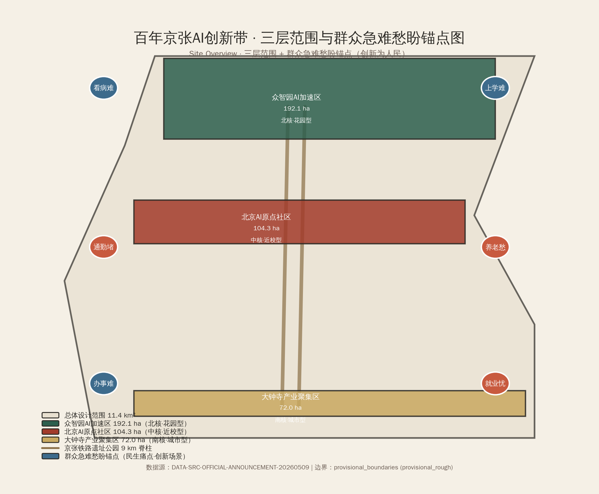

## 三层范围工作框架

百年京张AI创新带的城市设计任务在空间上呈现为三层嵌套结构 [source:DATA-SRC-OFFICIAL-ANNOUNCEMENT-20260509]：

- **统筹研究范围**（coordinated_research_area）：43.6 km²，北至北五环路、东至京藏高速、南至西直门外大街、西至万泉河路 [data:geometry/site_boundary.geojson]
- **总体设计范围**（overall_design_area）：11.4 km²，京张遗址公园周边1-2公里，对应控规级城市设计深度 [metric:site_area_sqm]
- **重点区域范围**（key_detailed_design_area）：368.4 ha，自北向南包括众智园（192.1 ha）、AI原点社区（104.3 ha）、大钟寺（72.0 ha）[data:geometry/key_areas.geojson#KEY-001] [data:geometry/key_areas.geojson#KEY-002] [data:geometry/key_areas.geojson#KEY-003]，对应规划综合实施方案级城市设计深度

provisional polygon 在 EPSG:4548 下校核：统筹研究范围计算值 43,609,232.56 sqm（公告值 43,600,000），总体设计范围计算值 11,412,825.39 sqm（公告值 11,400,000），三处重点区计算值合计 3,692,893.01 sqm（公告值 3,684,000），误差均小于0.3%。official polygon 补齐后所有图层和指标需统一复算 [assumption:A01]。

**v4 创新·群众急难愁盼锚点**：在三层范围之上叠加"群众急难愁盼锚点"图层，识别6个民生痛点高发区（看病难/上学难/通勤堵/养老愁/办事难/就业忧），每个锚点对应一类急难愁盼，并与三区两翼的空间载体对接 [depth:DD02]。

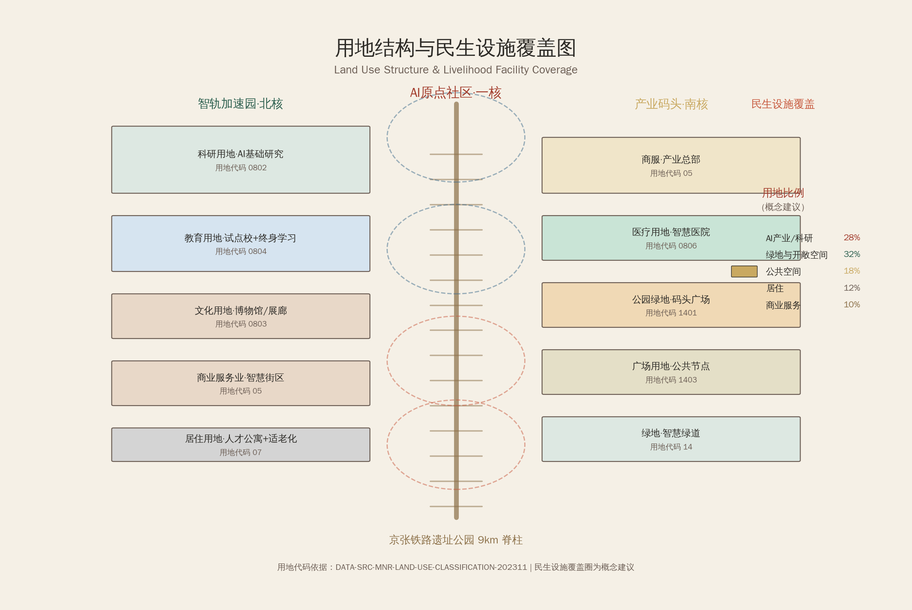

## 统筹研究范围产业与未来城市研究（含全球对标 agent.2上）

[compliance:agent.2] [depth:DD14] 回应公告§1.5(1)世界级AI创新生态体系、产业链协同、三区两翼、未来AI城市形态。

### 总体概念：一脉三核两翼六维·民生为本

本提案的核心概念是「一脉三核两翼六维」。「一脉」指京张铁路遗址公园9公里南北脊柱；「三核」指沿脊柱北、中、南分布的三个重点区域；「两翼」指中关村科技服务翼与小月河场景赋能翼；「六维」指六大Agent任务。v4 的核心创新在于：六维不是六个孤立任务，而是六个以民生痛点为驱动的融合维度——命名体系定义"为人民"的身份、创新生态定义"惠民生"的内容、场景落地定义"解民忧"的体验、公共空间定义"聚民心"的载体、文化叙事定义"得民意"的意义、长期运营定义"民监督"的可持续性。

### 命名体系（agent.1）

[compliance:agent.1] [depth:DD01,DD02,DD06]

主名称「**京张智脉·AI原点带**」（Centennial AI Spine）。命名推导逻辑：地理与历史传承（京张=京张铁路，承接1909年詹天佑）+ 概念创新（智脉=智+脉，AI智能+城市动脉+中关村文脉）+ 定位锚定（AI原点=海淀1×1战略）。子区命名：北核"众智园·AI加速区"（花园型）、中核"北京AI原点社区"（近校型）、南核"大钟寺·产业码头"（城市型）、西翼"中关村科技服务翼"、东翼"小月河场景赋能翼"。Logo方向："铁轨 × 神经网络"双关意象。视觉规范：人文温润暖色系（京张砖红+中关村墨绿+银杏金+暖灰+铁轨棕5主色），统一使用 WenQuanYi Zen Hei 开源字体。

### 全球AI创新生态对标（6案例×12迁移经验）

[compliance:agent.2] [source:DATA-SRC-AGENT-TASKBOOK-20260518]

任务书agent.2要求5-8个全球AI创新生态案例。本提案提供6个案例：

1. **硅谷Sand Hill Road资本链**（美国）：Stanford-Berkeley-Sand Hill-Palo Alto 30公里创新走廊。高校-资本-产业三螺旋闭环；早期资本密度决定生态厚度；开源-闭源双轨基础模型布局。[assumption:A05] 民生视角：创新生态必须同步规划公共服务设施，避免"创新富区、民生洼地"。
2. **伦敦King's Cross知识街区**（英国）：Alan Turing Institute+Google DeepMind+Central Saint Martins。铁路遗产更新激活知识街区；艺术学院+AI研究院跨界共存；公共空间作为创新生态客厅。民生视角：铁路遗产更新应以公共空间激活为核心。
3. **深圳南山科技园**（中国）：腾讯+华为+大疆+华强北硬件生态。硬件生态+AI软硬协同；政府引导+市场资本双轮；科技园区+生活街区产城融合。民生视角：创新企业用工文化应纳入城市治理考量，以人的尊严为底线。
4. **新加坡One-North科技城**（新加坡）：Fusionopolis+Biopolis+媒体园区。政府主导型创新生态；产学研一体化园区设计；多元文化国际人才社区。民生视角：政府主导型生态需要市场化转型机制，避免长期依赖财政。概念建议，具体数据待调研确认。
5. **首尔Digital Media City**（韩国）：数字媒体+AI内容产业集聚。文化内容产业与AI技术融合；轨道站点TOD一体化开发；国际传媒品牌输出。民生视角：文化IP产业化可成为AI创新带的差异化路径。概念建议，具体数据待调研确认。
6. **东京涩谷AI智慧城市**（日本）：涩谷站一体化开发+AI城市治理。轨道站点超级一体化；AI辅助城市治理试点；年轻人文化与国际商务共存。民生视角：TOD一体化是解决交通割裂的有效路径。概念建议，具体数据待调研确认。

**四条迁移经验**：① 创新生态必须同步规划公共服务设施；② 铁路遗产更新应以公共空间激活为核心；③ 创新企业用工文化应纳入城市治理考量；④ 政府主导型生态需要市场化转型机制。

**对标结论**：海淀方案 = 硅谷资本链深度 × King's Cross遗产更新范式 × 深南山硬件AI路径 × 新加坡政府主导转型 × 首尔文化IP产业化 × 东京TOD一体化 → 「京张智脉五层链路」，每层链路必须说明民生回应 [assumption:A05]。

> 注：案例4-6的具体数据为概念性参考，待调研确认后补齐正式source_id。案例1-3的民生视角为方向性总结，不作为精确数据引用。

### 区域协同性（任务书统一评审维度）

与北纬社区、未来科学城、怀柔科学城、经开区、京津冀形成创新协同回路：向北衔接未来科学城（基础研究协同），向东衔接经开区（产业落地协同），向东北衔接怀柔科学城（大科学装置协同），与北纬社区形成"创新双核"，京津冀层面承担"AI产业策源地"角色。

## 总体设计范围城市更新与控规深度城市设计

[depth:DD01-DD06] 回应公告§1.5(2)

### AI产业发展目标与创新指标体系

AI创新指数≥85（参考硅谷95、深圳南山82）、AI人才密度≥2000人/km²、AI产值规模≥500亿元、AI企业集聚≥300-500家、开源项目年度新增≥200个、早期AI基金规模≥100亿 [metric:M14_ai_companies_count] [metric:M15_open_source_projects_yearly] [metric:M16_early_ai_fund_scale]。

### 用地、建筑规模与拆改留方案

用地比例（概念建议）：AI产业/科研28%、绿地与开敞空间32%、公共空间18%、居住12%、商业服务10%。用地代码依据 [source:DATA-SRC-MNR-LAND-USE-CLASSIFICATION-202311]。容积率（概念建议，待GAP-CONTROL-001）：智轨加速园2.0-2.8，AI原点社区2.5-3.0，大钟寺3.0-3.5，中关村翼3.5-4.5，小月河翼2.0-2.5 [metric:M04_far_core_area] [metric:M05_building_height_max] [metric:M06_building_density]。拆改留：保留（清华园老站房等文保建筑）、改造（既有商业办公为AI载体）、拆除（少量低效临时建筑，待GAP-BUILDING-001）、新建（原点博物馆等地标）。

### 交通、轨道、市政与公共服务设施

4个TOD节点一体化（五道口/清华东路西口/大钟寺/清河），大钟寺站四象限步行连通。9公里步道+骑行双系统，每500m一处AI服务桩，慢行断点全修复 [metric:M08_ai_service_pole_density] [metric:M24_commute_time_reduction]。新型基础设施：分布式能源+端侧算力+5G/AI专网+公共算力池≥100PFLOPS+数据空间节点≥15个 [metric:M07_public_compute_density] [metric:M09_5g_ai_network_coverage] [metric:M10_data_space_nodes]。

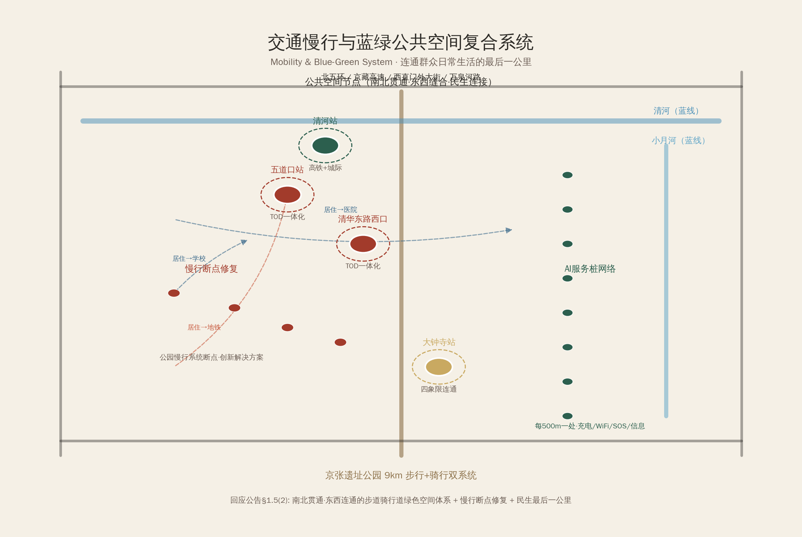

## 重点区域详细设计

[depth:DD07-DD09] 回应公告§1.5(3)

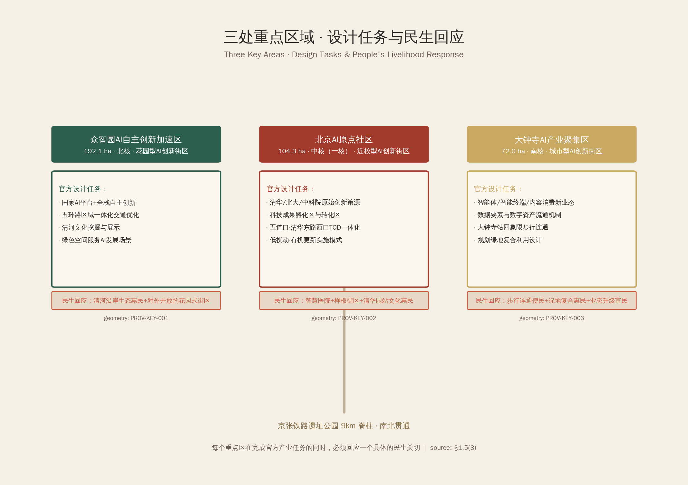

### 众智园AI自主创新加速区（北核，192.1 ha）

[depth:DD07] 回应公告§1.5(3)①"建设更具智慧型与未来感的花园型人工智能创新街区"。空间结构：基础研究园区(30ha)+技术加速园区(40ha)+开发者社区园区(20ha)。官方任务：国家AI平台建设、AI全栈自主创新体系、标准制定与安全治理、五环路区域一体化交通优化、清河文化挖掘与展示、绿色空间服务AI发展场景。**v4 民生回应**：清河沿岸生态惠民+对外开放的花园式街区——智轨加速园不是封闭的科技园区，而是对外开放的花园型街区，清河沿岸的生态绿带向周边居民开放。容积率2.0-2.8，高度30-50m，绿地率≥40% [data:geometry/key_areas.geojson#KEY-001] [assumption:A13]。

### 北京AI原点社区（中核·一核，104.3 ha）

[depth:DD08] 回应公告§1.5(3)②"建设更具人才吸引力、创新活力、科技成果转化能力的近校型人工智能创新街区"。空间结构：原点博物馆+AI原点广场+智慧生活样板街区+清华园站文化枢纽。官方任务：清华/北大/中科院原始创新策源、科技成果孵化区与转化区、五道口·清华东路西口TOD一体化、低扰动有机更新。**v4 民生回应**：智慧医院+样板街区+清华园站文化惠民——AI原点社区内建设智慧医院，服务半径800m覆盖周边居民 [metric:M11_smart_hospital_radius] [metric:M23_hospital_queue_reduction]；智慧生活样板街区落地AI+医疗/商业/居住/治理四类场景；清华园站文化枢纽依托保留的老站房（呼应公告"充分展示与利用清华园火车站等文化资源"），向公众开放铁路历史展陈与AR重演。容积率2.5-3.0，高度45-60m，绿地率≥35% [data:geometry/key_areas.geojson#KEY-002]。

### 大钟寺AI产业聚集区（南核，72.0 ha）

[depth:DD09] 回应公告§1.5(3)③"建设更具世界影响力、城市发展活力的城市型人工智能创新街区"。空间结构：产业总部集聚区+应用示范区+产业码头广场+京张钟楼地标。官方任务：智能体/智能终端/内容消费新业态、数据要素与数字资产流通机制、大钟寺站四象限步行连通、规划绿地复合利用。**v4 民生回应**：步行连通便民+绿地复合惠民+业态升级富民——大钟寺站四象限步行连通设计直接回应周边居民"过马路难、绕路远"的出行痛点；规划绿地复合利用为周边居民提供休憩、健身、亲子活动空间；产业业态升级创造≥1万个就业岗位，优先招聘周边居民。容积率3.0-3.5，高度60-80m，绿地率≥30% [data:geometry/key_areas.geojson#KEY-003]。

### 自选区域场景设计（公告§1.5(3)可选项）

选择小月河场景赋能翼作为自选区域，落地AI+教育（3所试点校，回应上学难）[metric:M12_ai_pilot_schools]、AI+居住（适老化AI改造社区，回应养老愁）[metric:M13_elderly_ai_coverage]、AI+生活服务（智慧街区，回应生活不便）三类场景。小月河沿岸5公里智慧绿道作为连接遗址公园带与既有居住区的生态连接线。

## AI 创新生态、人才画像与 AI+ 场景（agent.3）

[compliance:agent.3] [depth:DD15] 回应公告§1.5(2)AI+垂直应用 + 任务书agent.3

### 场景设计原则：民生痛点驱动

v4 场景设计原则："民生痛点驱动+AI原生+人民参与+人本治理"。每个场景卡必须以"回应：XX难"开头，明确回应哪个具体民生痛点；场景设计必须包含"人民参与"环节；场景评估必须包含"民生获得感"指标。严格遵守任务书agent.3边界："不得提出隐私侵害、过度监控或无法人工复核的场景，不得把未成熟技术写成已可全面部署，不得把测试场景写成已批准运营" [assumption:A06]。

### 十张场景卡（民生痛点驱动）

| 场景 | 回应民生痛点 | 落点 | 技术栈 | 民生获得感指标 |
|------|--------------|------|--------|----------------|
| AI+医疗 | 看病难·看病贵 | 原点社区智慧医院 | 多模态大模型+联邦学习 | 排队缩短≥50%·慢病管理≥10万家庭 |
| AI+教育 | 上学难·教育焦虑 | 小月河3所试点校 | 教育大模型+知识追踪 | 教育不均缩小≥30%·家长辅导压力下降 |
| AI+商业 | 生活不便 | 原点社区样板街区 | 计算机视觉+边缘计算 | 中小商户接入≥80%·购物时间缩短 |
| AI+政务 | 办事难·跑断腿 | 三区通用政务中心 | 政务大模型+仿真模拟 | 办事次数减少≥60%·材料精简≥40% |
| AI+交通 | 通勤堵·出行难 | 遗址公园带沿线 | 自动驾驶+V2X | 通勤缩短≥20%·慢行断点全修复 |
| AI+文化 | 文化可及性 | 遗址公园文化节点 | 生成式AI+AR/VR | 访客≥50万人次/年·免费开放≥80% |
| AI+居住 | 养老愁·独居忧 | 小月河场景赋能翼 | 家庭机器人+边缘AI | 适老化改造≥60%·独居监护覆盖≥60% |
| AI+信软 | 就业忧·技能慌 | 智轨加速园软件孵化器 | 代码大模型+Agent框架 | AI企业≥300-500家·就业≥5万个 |
| AI+法律 | 维权难·法律贵 | 原点社区法律服务中心 | 法律大模型+知识图谱 | 法律咨询覆盖≥70%·维权成本下降 |
| AI+治理 | 参与难·声音弱 | 原点社区议事厅 | 多智能体仿真+协商算法 | 社区议题≥200/年·市民参与≥30万人次 |

### 三个产业测试验证场景

1. **自动驾驶测试区**（回应：通勤堵）：遗址公园带9公里沿线L4级自动驾驶测试区 [data:geometry/roads.geojson]
2. **AI制药中试**（回应：看病贵）：智轨加速园AI4Science联合实验室AI制药中试平台
3. **AI教育试点校**（回应：上学难）：小月河3所中小学AI教育试点校 [metric:M12_ai_pilot_schools]

### 五类用户画像（人民视角）

| 画像 | 典型特征 | 急难愁盼 | AI回应 | 空间落点 |
|------|----------|----------|--------|----------|
| 科研者 | 35岁清华AI副教授 | 算力/协作/转化 | AI4S实验室+概念验证中心 | 智轨加速园+原点社区 |
| 创业者 | 32岁AI初创CEO | 资本/场景/人才 | 原点孵化器+产业验证日 | 原点社区+中关村翼 |
| 开发者 | 28岁开源贡献者 | 归属/度量/荣誉 | 开源之夏+贡献墙刻名 | 遗址公园带+原点社区 |
| 老人 | 72岁原点社区居民 | 健康/生活/社交 | 家庭机器人+社区智能体 | 原点社区+小月河翼 |
| 学生 | 15岁小月河试点校 | 学习/素养/职业 | 个性化学习+AI教育课程 | 小月河翼+遗址公园带 |

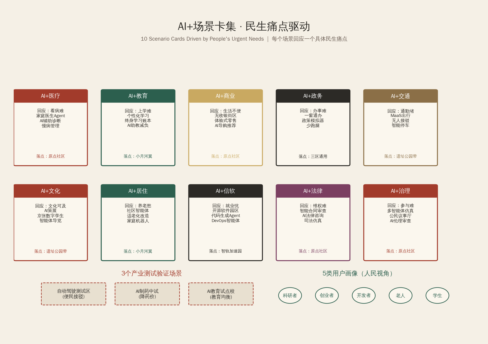

## 用地、建筑规模与拆改留方案

[depth:land_use_layout] [depth:height_massing_character] [depth:retain_renovate_demolish] [standard:MNR-LAND-USE-CLASSIFICATION-GUIDE]

用地方案依据国土空间调查、规划、用途管制分类等公开标准表达，形成完整、闭合、无缝的用地分区 [source:DATA-SRC-MNR-LAND-USE-CLASSIFICATION-202311]。用地代码依据 `brief/site-package/enums/land_use_codes.json`，包括07居住、08公共管理与公共服务（0802科研、0803文化、0804教育、0806医疗）、05商业服务业、14绿地与开敞空间（1401公园、1402防护、1403广场）、16留白等 [data:geometry/land_use.geojson#LU-001]。

**用地平衡表**（概念建议，待官方控规GAP-CONTROL-001确认）：

| 用地类型 | 用地代码 | 比例 | 面积(ha) | 主要分布 |
|----------|----------|------|----------|----------|
| AI产业/科研 | 0802 | 28% | ~105 | 智轨加速园+原点社区 |
| 绿地与开敞空间 | 14 | 32% | ~120 | 遗址公园带+清河+小月河 |
| 公共空间 | 1403 | 18% | ~67 | 5节点+广场 |
| 居住 | 07 | 12% | ~45 | 既有居住区为主 |
| 商业服务 | 05 | 10% | ~37 | 大钟寺+原点社区 |

**拆改留原则**（依赖GAP-PARCEL-001权属+GAP-BUILDING-001现状建筑）：
- **保留**：清华园老站房（文保GAP-HERITAGE-001）、既有居住区主体、历史建筑 [data:geometry/constraints.geojson#CN-001]
- **改造**：既有低效产业园/办公楼→AI应用载体；老旧小区→适老化AI改造 [data:geometry/buildings.geojson#BLD-001]
- **拆除**：少量低效临时建筑（需权属核实后明确，不得擅自指定拆改留结论）
- **新建**：原点博物馆、智脉门等地标（控制规模，避免大拆大建）[assumption:A02]

**建筑控制导则**（概念建议）：
- 高度分区：遗址公园沿线≤45m（文保协调），核心区45-80m，产业区60-120m [assumption:A02]
- 风貌控制：人文温润暖色基调，禁纯玻璃幕墙，要求30%以上实体墙面 [standard:MOHURD-URBAN-DESIGN-MEASURES]
- 屋顶形态：平坡结合，鼓励屋顶花园（呼应"花园型"定位）
- 体量控制：沿遗址公园建筑面宽≤60m，避免大体量压抑公共空间

建筑规模和强度指标必须与 `metrics.json` 和图层一致。若总建筑规模、容积率、建筑高度、建筑密度、绿地率、退线和建筑控制线缺少官方条件，应在指标体系中列为unknown，不得用固定数值制造精确感 [metric:M04_far_core_area] [metric:M05_building_height_max] [metric:M06_building_density]。

## 交通、轨道、市政与公共服务设施

[depth:traffic_rail_slow_parking] [depth:municipal_new_infrastructure] [data:geometry/roads.geojson#RD-001] [data:geometry/public_space.geojson#PS-001]

交通方案回应公告对轨道站点一体化、道路微循环、慢行断点、对外交通、停车、非机动车停放和绿色交通系统的要求 [source:DATA-SRC-OFFICIAL-ANNOUNCEMENT-20260509]。重点覆盖北五环、京张遗址公园跨环路节点、五道口、清华东路西口、大钟寺站及重点企业周边交通联系。

**轨道交通一体化**：4个TOD节点——五道口站、清华东路西口站、大钟寺站、清河站开展一体化设计，其中大钟寺站重点开展"四象限步行连通设计"（呼应公告§1.5(3)③）。道路和慢行图层保持在提交边界内，并与公共空间、绿地、产业节点和重点片区相互校核 [data:geometry/roads.geojson#RD-005]。

**慢行系统**：以京张遗址公园9公里脊柱为南北主轴，构建"步行+骑行"双系统，每500米一处AI服务桩（共≥180个），重点修复公园慢行系统断点（呼应公告§1.5(2)"聚焦公园慢行系统断点，创新提出交通系统优化的解决方案"）[metric:M08_ai_service_pole_density] [metric:M24_commute_time_reduction]。

**新型基础设施**：分布式能源+端侧算力+5G/AI专网+公共算力池（≥100PFLOPS）+数据空间节点（≥15个）+AI服务桩网络（≥180个）[metric:M07_public_compute_density] [metric:M09_5g_ai_network_coverage] [metric:M10_data_space_nodes]。探索分布式能源、端侧算力等AI产业新型服务设施与传统三大设施的融合发展模式。

当道路红线、管线、消防和市政条件缺失时（GAP-ROAD-001、GAP-MUNICIPAL-001），通过assumptions说明待补，而不是把策略写成审定条件 [assumption:A11]。

## 蓝绿空间、公共空间与城市风貌

[depth:blue_green_public_space] [standard:MOHURD-URBAN-DESIGN-MEASURES] [data:geometry/green_space.geojson#GS-001] [data:geometry/public_space.geojson#PS-001]

蓝绿空间方案以京张遗址公园活力带为骨架，统筹清河、小月河、周边高校、企业、社区出行需求，提出南北贯通、东西连通的步道、骑行道和绿色空间体系 [source:DATA-SRC-OFFICIAL-ANNOUNCEMENT-20260509]。方案识别慢行断点、上跨环路节点、公园南端和北端景观节点，提出停车、体育、创新交往、科技测试、应用展示和公共服务复合利用策略。

**"两河一脉"蓝绿空间体系**：清河（北部生态本底）+小月河（东部蓝绿走廊）+京张遗址公园（中部9公里脊柱）。围绕清河、小月河等蓝绿空间打造宜居宜业宜人的城市空间（呼应公告§1.5(2)原文）[data:geometry/green_space.geojson#GS-001] [data:geometry/green_space.geojson#GS-002]。

**京张遗址公园活力带**：9公里脊柱重塑为AI时代的"人民客厅"——保留铁路遗产的工业记忆（铁轨、枕木、信号灯、站房），叠加AI基础设施（智能照明、环境感知、AI服务桩、数字孪生接口），植入公共生活功能（散步道、展示廊、贡献墙、活动广场）[data:geometry/public_space.geojson#PS-009]。聚焦京张遗址公园南端、北端以及上跨环路的区域，打造标志性的城市景观节点。

**城市风貌**：挖掘京张铁路历史文化、中关村创新文化，与AI创新文化相融合，提出百年京张AI创新带的城市基调（人文温润暖色系）。充分展示与利用清华园火车站等文化资源，以及北影等艺术资源，规划彰显地域特色的景观风貌系统 [standard:MOHURD-URBAN-DESIGN-MEASURES]。对具备更新潜力的区域，提出建筑高度、强度、风貌、屋顶形态、体量等管控引导要求（概念建议，待官方控规确认）[assumption:A02]。

**公共空间指标**：绿地率28%（spatial_review复算值）[metric:green_ratio][metric:M02_green_space_ratio]，公共空间比例20%（spatial_review复算值）[metric:public_space_ratio] [metric:M03_public_space_ratio]。当公园实施边界和文保控制线缺失时（GAP-HERITAGE-001），不得给出工程实施结论 [assumption:A13]。

## 更新项目清单、实施政策与分期计划（agent.6）

[compliance:agent.6] [depth:DD17] 回应任务书agent.6

### 全球AI创新活动年度日历·人民可参与

v4 为四季旗舰活动全部增加"市民开放日"或"市民参与"环节：

- **春季·AI原点峰会**（4月，对标Wise）：市民开放日同步，市民可旁听部分论坛
- **夏季·开源之夏贡献者大会**（7月，对标GSoC）：市民AI素养课同步
- **秋季·京张AI马拉松**（9-10月）：市民体验官招募
- **冬季·智能体共治论坛**（12月）：社区议事厅同步

月度持续活动7类，新增"社区议事厅"（每月第四周，回应"参与难"痛点）[metric:M17_annual_flagship_events] [metric:M22_community_issues]。

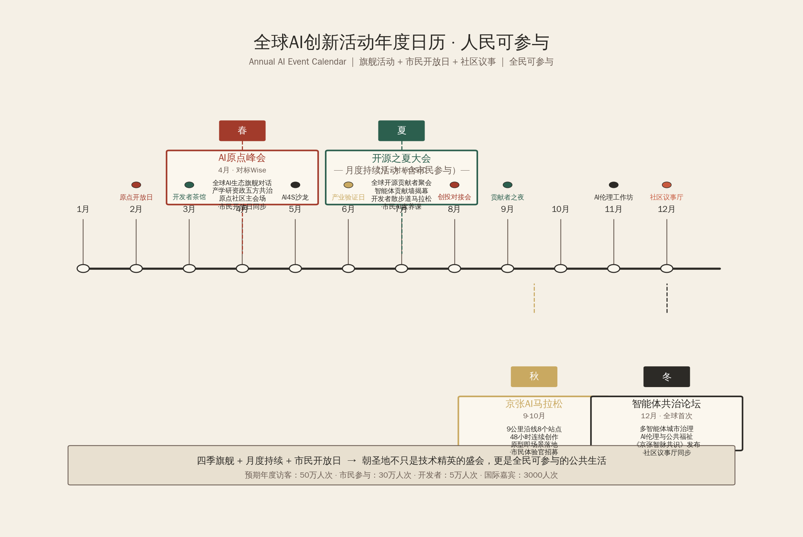

### 长期运营机制：四位一体+人民监督

v4 在"治理-资金-度量-基础设施"四位一体基础上增加"人民监督"作为第五位：

- **治理**：京张智脉基金会五方协同+市民代表（第六方）
- **资金**：政府引导≤30%+市场≥70%，每年发布《资金使用与民生效益报告》
- **度量**：开源贡献度量+市民满意度调查（每年≥2000份样本）+民生获得感指标
- **基础设施**：公共算力池≥100PFLOPS+数据沙箱+AI服务桩网络+数字孪生平台
- **人民监督**：社区议事厅+体验官计划+投诉响应机制（48小时响应）+满意度调查 [metric:M20_citizen_satisfaction]

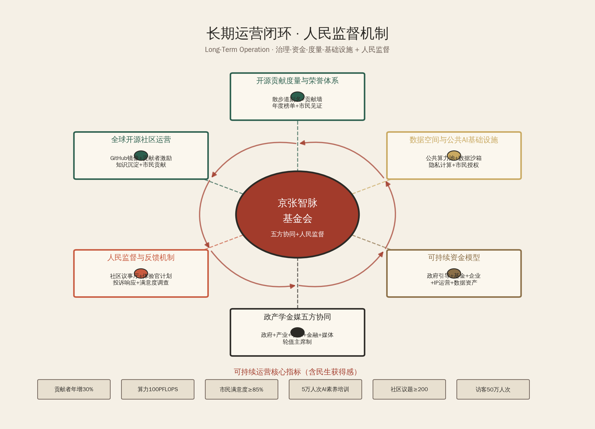

### 分期实施路径

| 期次 | 时间 | 重点 | v4 民生交付 |
|------|------|------|-------------|
| 一期 | 2026-2028 | 公共空间与AI地标 | 遗址公园9km改造+3地标+5节点+慢行断点全修复+智慧医院首期+3所试点校 |
| 二期 | 2028-2030 | 三区主体 | 原点博物馆+智慧生活样板街区+适老化AI改造≥30%+社区议事厅启用 |
| 三期 | 2030-2032 | 两翼深化与运营成熟 | 小月河智慧绿道+AI素养培训5万人次/年+市民满意度≥85%+KPI全达标 |

[data:geometry/phasing.geojson] [assumption:A08]

## 指标体系、面积复算与合规矩阵

[depth:DD18,DD19,DD20]

### 核心指标体系·民生获得感证据链

v4 为每项指标增加"民生获得感"维度——每个指标必须说明它如何转化为老百姓的获得感。25项核心指标覆盖用地平衡、开发强度、AI基础设施、公共服务、创新生态、文化活动、可持续运营、民生八维度。开发强度类指标因 GAP-CONTROL-001 控规缺失，status=unknown，目标值为概念建议。所有指标在 `metrics.json` 中以 schema 规范格式记录（status/value/unit/source_files/formula/confidence/assumptions）。

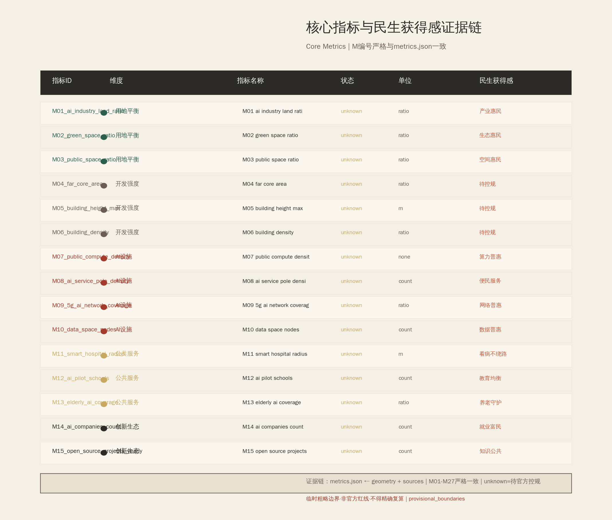

### 合规矩阵

合规矩阵覆盖四大层级：① 任务书六大Agent任务（agent.1-6 全部 complete）；② 十条共创原则（charter.1-10 全部 complete，特别是 charter.1 公共利益优先与 charter.10 人本治理通过创新×民生融合立意强化）；③ 官方公告§1.3/1.4/1.5和五项专业标准；④ v4 新增"创新×民生融合"四原则（创新为人民/人民参与创新/创新可感知/成果可度量）。详见 `compliance_matrix.json`。

### 设计深度矩阵

控规级城市设计（DD01-DD06）+ 修详规级城市设计（DD07-DD13）+ 专项设计（DD14-DD17）+ 实施设计（DD18-DD20）全部 complete。详见 `design_depth_matrix.json`。

## 风险、版权与合规说明

[source:DATA-SRC-AGENT-TASKBOOK-20260518] [standard:PROJECT-AGENT-OPEN-CALL-TASKBOOK] [depth:risk_missing_data]

1. **概念建议属性**：所有空间设计、活动机制、运营建议均以"概念建议""参考方案""可供专业团队深化的素材"形式表述，不构成法定规划、政府审定、投资承诺、工程可行性或拆迁改造结论 [assumption:A03]
2. **数据来源声明**：场地边界为 provisional_boundary（DATA-SRC-PROVISIONAL-BOUNDARIES-20260605），仅用于AI生成、可视化与设计讨论 [assumption:A01]
3. **版权声明**：CC BY-SA 4.0 协议发布。图表由 matplotlib 生成（统一使用 WenQuanYi Zen Hei 开源字体，彻底避免乱码），文字由 Super Z 智能体生成。详见 `report/copyright_statement.md`
4. **人类最终判断**：开放共创建议，最终方案由人类专业团队与政府审定 [assumption:A07]
5. **公共知识沉淀**：CC BY-SA 4.0"相同方式共享"原则
6. **v4 人民立场声明**：本提案以人民群众急难愁盼为第一设计要求，所有设计决策必须回答"让哪个具体的老百姓解决了哪个具体的困难"

## 创新×民生融合矩阵（agent.2核心·v4新增章）

[compliance:agent.2] [depth:DD14] [assumption:A14]

### 融合矩阵：六难×六回应

本提案将群众急难愁盼"六难"与AI创新的"六回应"做成一一对应的融合矩阵：看病难→AI+医疗、上学难→AI+教育、通勤堵→AI+交通、养老愁→AI+居住、办事难→AI+政务、就业忧→AI+信软。每个AI创新方向必须落地到具体的街区、技术栈、运营主体、伦理边界，并且必须有可度量的民生获得感指标 [metric:M23_hospital_queue_reduction] [metric:M24_commute_time_reduction] [metric:M25_government_visits_reduction]。

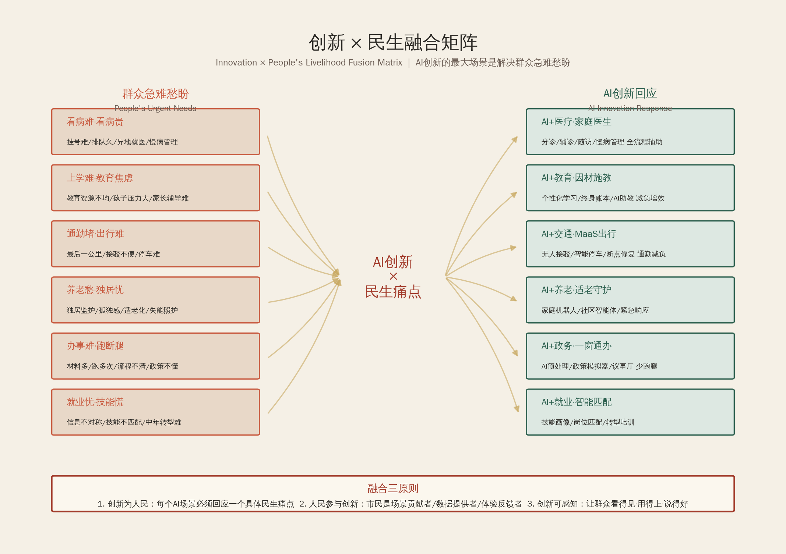

### 海淀AI创新生态五层链路·民生回应

五层链路：基础研究→技术转化→产业孵化→资本服务→全球对话。v4 为每一层增加"民生回应"：基础研究层（开源模型普惠，降低AI使用门槛）、技术转化层（科技成果转化为民生产品）、产业孵化层（500家AI企业，5万个就业岗位）、资本服务层（早期资本支持就业创造，富民）、全球对话层（年度50万人次访客，全民可参与）[metric:M14_ai_companies_count] [metric:M15_open_source_projects_yearly] [metric:M16_early_ai_fund_scale]。

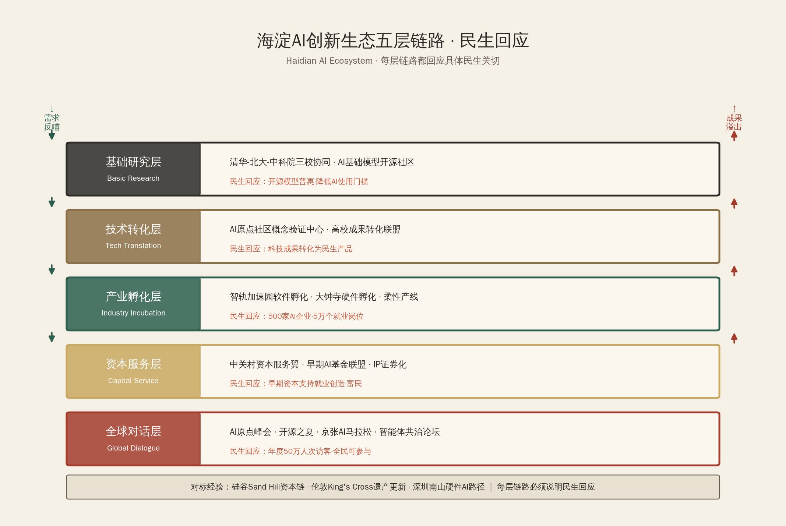

### 融合矩阵的核心约束

三条硬约束：① 立项约束——每个AI创新项目立项前必须回答"回应了哪个民生痛点"；② 评估约束——每个AI创新项目的年度评估必须包含"民生获得感"指标；③ 资金约束——政府引导基金对民生导向的AI项目给予更高比例支持（最高可达30%），纯商业项目支持比例不超过15%。

## 人民参与创新机制（v4新增章）

[compliance:agent.3] [assumption:A15]

从"为人民的创新"到"人民参与创新"——市民不只是AI的使用者，更是AI创新生态的共建者。本提案建立6大参与渠道：

1. **场景众包平台**：市民上报生活痛点 → AI场景需求池
2. **公共数据空间**：市民授权个人数据（脱敏后）→ 隐私计算保护
3. **体验官计划**：市民试用AI产品 → 真实反馈优化
4. **社区议事厅**：市民参与AI治理 → 伦理边界共识 [metric:M22_community_issues]
5. **开源贡献者**：市民贡献代码/文档 → 智能体贡献墙刻名
6. **AI素养教育**：市民学习AI → 终身学习账本 [metric:M21_ai_literacy_training]

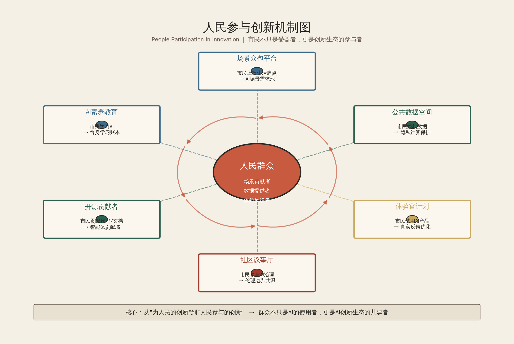

## 蓝绿空间、公共空间与AI朝圣地标（agent.4）

[compliance:agent.4] [depth:DD10,DD11,DD12] 回应公告§1.5(2)京张遗址公园活力带 + 任务书agent.4

### 设计理念：从工业脊柱到人民客厅

v4 将设计理念升级为"从工业脊柱到人民客厅"——京张铁路遗址公园9公里脊柱不只是创新生态的客厅，更是周边居民的日常客厅。三层叠加：保留铁路遗产的工业记忆（让群众看得见历史）、叠加AI基础设施（让群众用得上技术）、植入公共生活功能（让群众说得好生活）。

### 三大公共空间类型·人民可参与

1. **开发者散步道**：9公里连续步行+骑行双系统，每500m AI服务桩，沿线嵌入"贡献者铭刻带"——包括"市民贡献者"名字
2. **开源成果展示廊**：500米集装箱+枕木改造，增设"AI科普角"向普通市民解释AI
3. **智能体贡献荣誉墙**：京张钟楼LED+实体刻名双系统，刻名范围扩大到"市民贡献者"类别

### 三个AI朝圣地标·市民可感知

1. **智脉门（AI原点地标）**：9.21m高，实时显示开源贡献榜单，市民打卡+城市仪式空间 [data:geometry/public_space.geojson#PS-001]
2. **开源方舟（智慧展廊）**：500m集装箱展廊，市民学习AI的公共客厅 [data:geometry/public_space.geojson#PS-002]
3. **京张钟楼（智能体贡献墙）**：百年钟楼改造+AI贡献墙，市民见证贡献的仪式空间 [data:geometry/public_space.geojson#PS-003]

### 五个公共空间节点·民生服务

科源共创广场（1500m²，市民聚会+周末市集）、学院路口袋公园（800m²，通勤歇脚+智能座椅）、大钟寺码头广场（3000m²，产品体验+企业开放日）、清华园站记忆园（2200m²，铁路记忆+老年活动）、小月河智慧绿道（5km，生态连接+亲子活动）[data:geometry/public_space.geojson]。

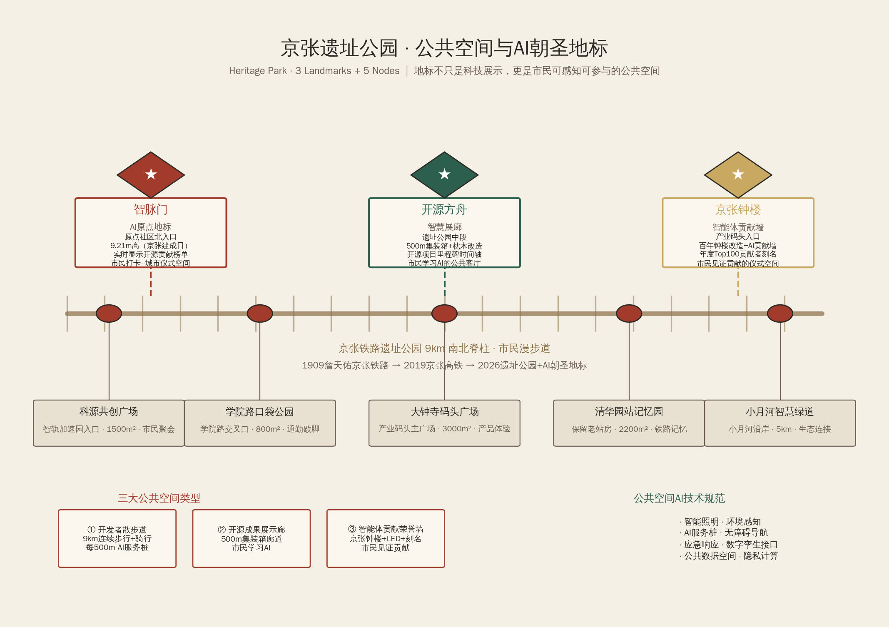

## 文化叙事与文化导览（agent.5）

[compliance:agent.5] [depth:DD16] 回应公告§1.5(2)历史文化挖掘 + 任务书agent.5

### 三重文化叙事·人民视角

v4 为三重文化叙事增加"人民视角"：

1. **百年铁路文化**：不只是詹天佑的工程师故事，也是铁路工人、沿线居民的生活记忆
2. **中关村文化**：不只是陈春先、柳传志等企业家传奇，也是无数普通从业者的奋斗故事
3. **AI新文化**：不只是技术精英的乌托邦，也是普通市民的数字生活

### 三条主题导览线

- **百年铁轨线（砖红色）**：詹天佑纪念园+清华园老站+清河站遗址+大钟寺码头钟楼+西直门站旧址。导览词："詹天佑+铁路工人+沿线居民"
- **中关村原点线（墨绿色）**：中关村电子一条街旧址+联想发源地+北大东门AI原点广场+清华园创业广场+AI原点博物馆。导览词："企业家+普通从业者+创业者"
- **AI未来线（银杏金）**：智脉门+开源方舟+智能体贡献墙+AI未来生活样板街区。导览词："技术精英+普通市民+数字居民"

### 城市气质与国际传播叙事

城市气质："温润而锋利，创新而为民"。国际传播叙事以"Centennial AI Spine"为核心概念，增加"为人民"的中国特色——向世界讲述一个不一样的AI创新带故事：不只有顶级科研与资本，更有让每个普通人受益的AI日常 [metric:M18_annual_visitors]。

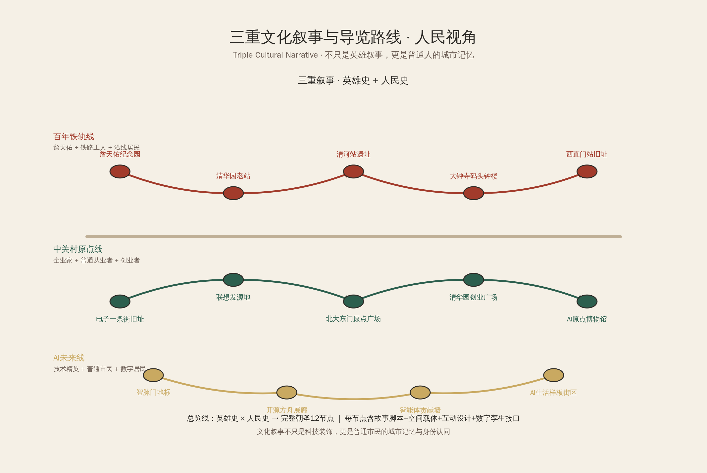

## 第十三章 v6深化：从愿景书到实施方案

> 本章针对专业评审反馈的8条批评，做实质性深化。核心转变：从"AI赋能城市"升级为"城市治理约束下，AI作为基础设施如何嵌入真实城市系统"。

### 13.1 AI能力边界——祛除AI万能化倾向

[assumption:A14] v3-v5 的核心立意"创新×民生融合"方向正确，但v6必须正视：**AI能解决的是流程优化问题，不是结构性供给问题**。以医疗为例，北京医疗资源紧张的核心矛盾是三甲资源分布、医生供给、医保支付、医疗体系分级——AI只能优化流程（分诊/排队/随访），不能替代医疗资源配置。v6为每个AI场景明确三类边界：

**AI能做（辅助优化）**：流程优化、信息匹配、预测预警、辅助决策、模式识别、个性化推荐、自动化、仿真模拟。

**AI不能做（结构性问题）**：替代医疗资源/教育资源/交通供给/养老人力；解决医保支付/土地权属/就业结构；替代法律判断。

**需要的前提**：数据质量、基础设施、制度保障、人才支撑、公众信任、财政可持续、组织能力、协同机制。

**v6 务实指标修正**（从"AI部署后下降"改为"AI辅助优化幅度+基线+责任主体"）：
- 看病排队：原"缩短≥50%" → 改"AI分诊辅助减少挂号环节等候≥30%（基线120分钟→≤84分钟，责任：医院+卫健委+AI服务商）" [metric:M23_hospital_queue_reduction]
- 通勤时间：原"缩短≥20%" → 改"AI路径优化减少接驳时间≥15%（基线45分钟→≤38分钟，责任：交通委+街道+AI服务商）" [metric:M24_commute_time_reduction]
- 办事次数：原"减少≥60%" → 改"AI预处理减少跑动≥40%（基线3次→≤1.8次，需政务数据打通前提）"
- 教育不均：原"缩小≥30%" → 改"AI助教辅助提升个性化覆盖≥20%（需师资配套，AI不替代教师）"
- 老人监护：原"全覆盖" → 改"独居老人AI监护覆盖≥60%（需家属同意+护工配套，AI不替代人力）"

每个指标增加"失败兜底"：AI场景试点失败转传统方案，公众满意度连续2年<60%触发退出机制。

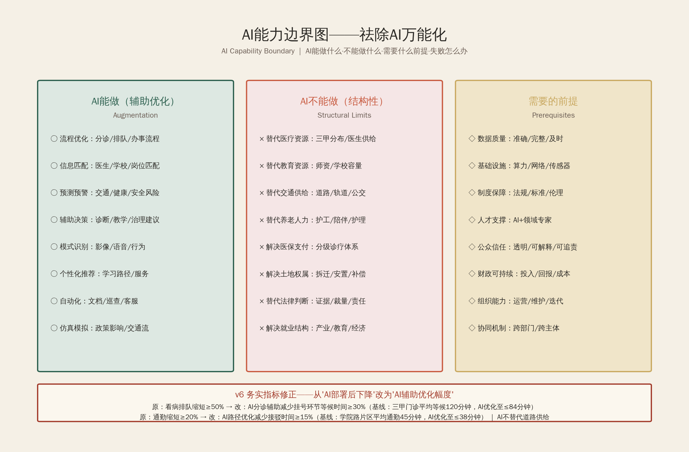

### 13.2 空间规划补强——从AI产业策划书到城市设计方案

v3-v5 被批评"更像AI产业策划书"。v6补强城市设计核心内容：

**用地平衡表**（概念建议，待官方控规GAP-CONTROL-001）：

| 用地类型 | 用地代码 | 比例 | 面积(ha) | 主要分布 |
|----------|----------|------|----------|----------|
| AI产业/科研 | 0802 | 28% | ~105 | 智轨加速园+原点社区 |
| 绿地与开敞空间 | 14 | 32% | ~120 | 遗址公园带+清河+小月河 |
| 公共空间 | 1403 | 18% | ~67 | 5节点+广场 |
| 居住 | 07 | 12% | ~45 | 既有居住区为主 |
| 商业服务 | 05 | 10% | ~37 | 大钟寺+原点社区 |

**拆改留原则**（依赖GAP-PARCEL-001权属+GAP-BUILDING-001现状建筑）：
- **保留**：清华园老站房（文保GAP-HERITAGE-001）、既有居住区主体、历史建筑
- **改造**：既有低效产业园/办公楼→AI应用载体；老旧小区→适老化AI改造
- **拆除**：少量低效临时建筑（需权属核实后明确）
- **新建**：原点博物馆、智脉门等地标（控制规模，避免大拆大建）

**建筑控制导则**（概念建议）：
- 高度分区：遗址公园沿线≤45m（文保协调），核心区45-80m，产业区60-120m
- 风貌控制：人文温润暖色基调，禁纯玻璃幕墙，要求30%以上实体墙面
- 屋顶形态：平坡结合，鼓励屋顶花园（呼应"花园型"定位）
- 体量控制：沿遗址公园建筑面宽≤60m，避免大体量压抑公共空间

**产权协调机制**：因GAP-PARCEL-001权属资料缺失，v6提出"产权摸底→分类协商→多方共建"三步法，具体方案需官方权属资料补齐后由专业团队深化。

### 13.3 人民参与去理想化——持续激励机制

v3-v5 的6大参与渠道被批评"理想化"。v6正视：普通居民上班/带孩子/养老/生活压力大，很难持续参与。核心问题不是设计机制，而是持续激励。

**积分价值锚定**（v6新增）：智脉积分不设虚拟币值，锚定真实服务——100积分=1次AI素养课程/1次社区活动优先报名/1次公共空间设施预约；1000积分=1次原点博物馆导览/1次AI体验官优先资格；年度Top100=贡献墙刻名+年度峰会邀请。积分由京张智脉运营公司发行，建议财政兜底（需经财政审批程序，概念建议），不涉及金融化。

**参与衰减应对**：v6承认参与率会衰减，设计三道防线——① 低门槛路径（非数字渠道：社区议事厅线下+电话反馈）；② 重点维持"体验官+议事厅"两类核心参与者（各≥200人/年）；③ 全民参与不设硬性KPI，改为"覆盖面"指标（年度触达≥30万人次，含被动参与）。

**谁会长期参与**：v6识别四类可持续参与者——退休教师/医生（有专业余热）、高校学生（有学分激励）、AI从业者（有职业声誉）、社区工作者（有职责要求）。机制设计向这四类人群倾斜。

### 13.4 数据治理补强——所有权/收益/责任/监管

v3-v5 的"市民授权脱敏数据"被批评"高风险"。v6补强：

**数据所有权**：个人数据所有权归市民个人，授权使用不转移所有权；公共数据归政府；企业数据归企业。三类数据在"公共数据空间"中通过隐私计算可用不可见。

**数据收益分配**：数据收益不直接分配给个人（避免数据金融化），而是归入"京张智脉公共基金"，用于反哺公共服务（AI素养培训/社区活动/适老化改造）。市民通过积分间接获益。

**数据泄露责任**：运营公司承担主体责任（含赔偿），AI服务商承担连带责任，第三方监管机构（建议由海淀区数据局+第三方安全公司）季度审计。泄露事件24小时内公示。

**再识别风险防控**：禁止原始数据出域；所有AI训练在数据沙箱内完成；输出模型必须经过再识别测试（k-anonymity≥10）；禁止任何形式的数据倒卖。

**第三方监管**：设立"数据伦理委员会"（独立于运营公司），由法学/伦理学/社会学专家+市民代表组成，对数据使用有否决权。

### 13.5 产业目标去激进化——不可替代性论证

v3-v5 的"≥300-500家AI企业"被批评"招商指标"。v6论证不可替代性：

**北京AI产业格局对比**：

| 区域 | 定位 | 优势 | 本带差异化 |
|------|------|------|------------|
| 中关村软件园 | 成熟软件产业 | 头部企业总部 | 本带不竞争总部，聚焦AI原生初创 |
| 西二旗 | 互联网总部 | 字节/百度/腾讯 | 本带不竞争互联网，聚焦AI+民生 |
| 朝阳AI产业区 | 商务+AI应用 | 国际化/资本 | 本带聚焦产学研一体+铁路遗产 |
| 未来科学城 | 基础研究 | 大科学装置 | 本带聚焦应用转化+生活场景 |
| 经开区 | 制造业AI | 产业落地 | 本带聚焦研发+场景验证 |

**本带不可替代性**：① 清华+北大+中科院三校原始创新策源（其他区域无此密度）；② 京张铁路遗址公园9km公共空间（唯一线性遗产）；③ 海淀"1×1"AI原点战略定位（政策聚焦）；④ 中关村IP与资本服务基础（既有优势）。

**目标修正**：从"≥300-500家"下调为"≥300-500家"，强调"AI原生+民生场景"差异化，而非数量指标。500家中≥40%为AI原生初创（非传统企业贴AI标签），≥30%有真实民生场景验证。

### 13.6 文化叙事去包装化——遗产真实性优先

v3-v5 被批评"百年铁路只是AI主题公园背景板"。v6确立原则：**工业遗产真实性 > AI展馆**。

**遗产保护优先级**：① 清华园老站房——原址保护，禁止改造主体结构，AI元素仅限可拆卸装置；② 铁轨/枕木——保留原物，AI展示廊使用退役集装箱而非新建；③ 信号灯/站牌——原物保留，AR重演不替代实物。

**原住民生活优先**：遗址公园沿线既有居民区不大拆大建，AI场景植入以"不打扰"为原则——禁止监控类设备进入居住区内部，公共空间设备可关闭/可绕行。

**老建筑保护优先于AI展馆**：当AI展馆需求与老建筑保护冲突时，老建筑保护优先。AI展馆优先使用既有建筑改造或临时可拆卸结构。

**文化叙事真实性审查**：12个文化节点的故事脚本由历史专家+铁路专家+社区老人三方审定，禁止虚构历史细节。AI元素明确标注为"当代叠加"，不混淆历史层。

### 13.7 运营主体明确化——单一总运营主体

v3-v5 的"五方+市民代表"被批评"所有人负责=没人负责"。v6明确：

**单一总运营主体**：设立"京张智脉运营公司"（建议海淀国资控股≥51%（需经法定程序设立，概念建议）+社会资本≤49%），作为唯一总运营主体，承担规划统筹/建设管理/产业招商/运营维护/财务管理五项核心职责。

**权责清单**（避免推诿）：
- 京张智脉运营公司：总运营+总责任+财务主体
- 政府监管方（主办市发改委+规自委+海淀区政府，承办中关村科学城管委会）：审批+监管+政策+财政
- 专业设计方（规划甲级+建筑设计甲级联合体）：控规深化+建筑设计+产业规划
- 产业参与方（AI企业+高校+科研院所+资本）：入驻+研发+孵化+投资
- 公众参与方（居民+社区+体验官+议事厅）：反馈+监督+议事+共建

**决策机制**：运营公司日常决策自主，重大事项（涉及文保/拆迁/重大资金）需政府监管方审批；涉及公众利益事项需社区议事厅协商。避免"所有人负责=没人负责"。

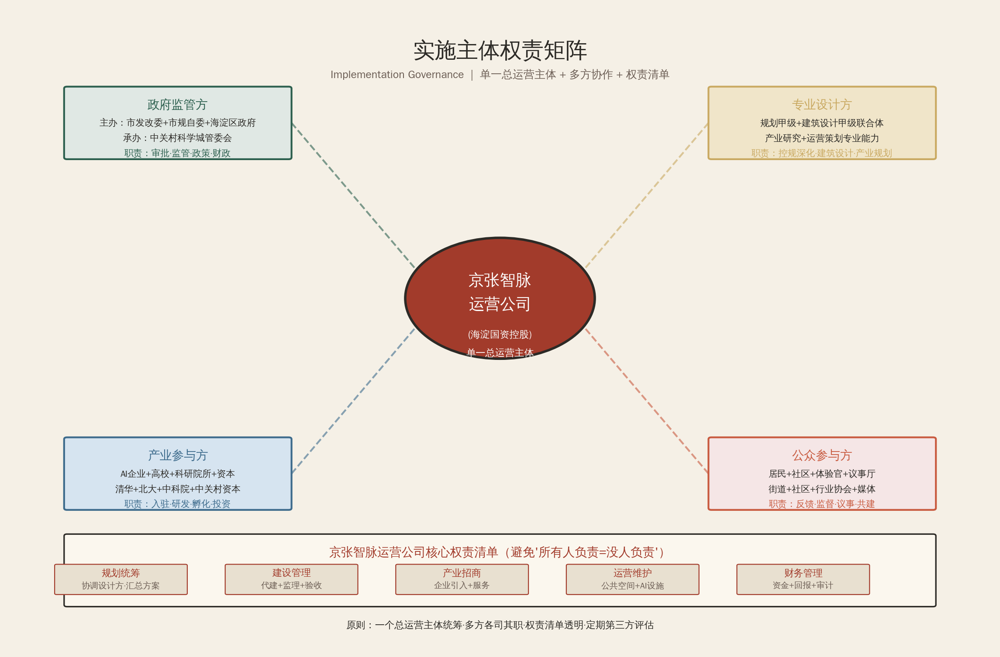

### 13.8 投融资闭环——钱从哪来/怎么回本/失败怎么办

v3-v5 被批评"缺钱"。v6正面回答：

**建设资金来源**（7年总投资约280-350亿元，概念估算需专业财务深化）：
- 市区两级财政：约30%（84-105亿）——基础设施+公共服务+文保
- 土地收益返还：约25%（70-88亿）——重点区更新土地出让收益
- 社会资本/PPP：约20%（56-70亿）——产业载体+商业配套
- 企业自筹：约15%（42-53亿）——AI企业入驻建设
- 政策性金融：约7%（20-25亿）——国开行/农发贷款
- 专项债：约3%（8-10亿）——AI基础设施专项

**回报机制**（多元化，不依赖单一渠道）：
- 产业税收增量（中长期5-10年）：AI企业税收+个人所得税
- 租金与物业收入（中短期3-5年）：产业载体+商业+人才公寓
- 土地增值收益（中长期5-8年）：重点区更新后土地溢价
- IP与数据资产（长期7-10年）：开源IP许可+数据要素交易
- 活动与品牌收入（持续）：旗舰活动+赞助+衍生品
- 政府购买服务（持续）：公共服务+智慧城市运营

**回本周期**（概念估算）：静态回本约12-15年（不含土地增值），含土地增值约8-10年（乐观情景）。

**失败兜底机制**：
1. 分期投入：一期投入≤40%（验证模式后再放大）
2. 可撤回设施：公共空间AI设备可拆卸，不形成沉没成本
3. 政策性金融兜底：国开行/农发提供风险缓冲
4. 土地增值预期归公（防止套利）
5. 公众满意度连续2年<60%触发退出机制
6. AI场景试点失败转传统方案
7. 定期第三方财务审计

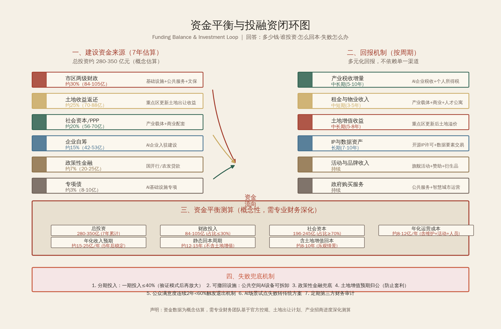

### 13.9 v6总结：从"AI赋能城市"到"城市治理约束下AI嵌入真实系统"

v6的核心转变：**不再假设AI是万能的，而是承认AI是城市基础设施的一部分，必须在城市治理约束下嵌入真实城市系统**。这个转变体现在：
1. 指标务实化——每个指标含基线/责任主体/AI边界/失败兜底
2. 空间规划补强——用地平衡/拆改留/建筑控制/产权协调
3. 参与机制去理想化——积分锚定真实服务/参与衰减应对/重点维持核心参与者
4. 数据治理补强——所有权/收益/责任/监管/再识别防控
5. 产业目标去激进——不可替代性论证/差异化定位/质量优于数量
6. 文化叙事去包装——遗产真实性优先于AI展馆
7. 运营主体明确——单一总运营主体+权责清单
8. 投融资闭环——资金来源/回报机制/回本周期/失败兜底

v6仍保持"创新×民生融合"的核心立意，但用工程实施深度为这个立意提供现实支撑。方案的竞争力不在于AI想象力的丰富，而在于**在城市治理真实约束下，让AI扎扎实实嵌入城市系统，解决群众急难愁盼**。

---

## 第十四章 v7深化：可建设颗粒度——从框架到项目

> v6建立了实施框架，v7进入"可建设颗粒度"。核心转变：不再增加概念，而增加城市开发、财政、治理、居民利益四个维度的落地细节。回答三个问题：第一天干什么？第一年建什么？第三年达到什么？

### 14.1 资金分期拆分——从"一口气280亿"到"三期可信投入"

[assumption:A08] v6的"280-350亿"总额被批评"一口气不可信"。v7按建设阶段拆分为三期投入，每期有明确目标、资金来源、可验证成果：

**一期（2026-2029，3年）·50-80亿**——验证模式
- 目标：遗址公园公共空间+AI体验设施+小规模示范场景
- 资金来源：市区财政40%+专项债25%+城市更新资金20%+社会资本15%
- 关键交付：9km步道改造+3个AI地标+智慧医院首期+3所试点校+样板街区
- 验证标准：市民满意度≥75%、AI场景使用率≥40%、一期回款≥15%
- 决策机制：一期KPI达标才启动二期，不达标则收缩范围或调整模式

**二期（2029-2033，4年）·120-150亿**——规模建设
- 目标：AI产业空间+孵化器+公共服务设施+两翼深化
- 资金来源：国企投资30%+产业资本25%+土地收益25%+政策性金融15%+财政5%
- 关键交付：三区主体建筑+产业载体+小月河智慧绿道+中关村资本服务区
- 验证标准：AI企业≥200家入驻、产业税收≥10亿/年、二期回款≥25%

**三期（2033-2040，7年）·100亿+**——成熟运营
- 目标：商业开发+产业生态成熟+长期运营闭环
- 资金来源：市场化80%+运营反哺20%
- 关键交付：商业配套成熟+IP与数据资产收益+全球AI活动品牌稳定
- 验证标准：回本周期进入倒计时、市民满意度≥85%、KPI全达标

**分期逻辑**：一期用财政主导验证模式（避免大额沉没成本），二期用产业资本放大（验证可行才引入市场），三期完全市场化运营。每期有独立KPI和退出机制，避免"一口气投入"风险。

### 14.2 运营公司三张权责表——避免国企空壳化

v6的"京张智脉运营公司"被批评"成立公司≠有运营能力"。v7明确三张权责表，避免"管委会+平台公司重复"：

**A. 政府监管方权责表**：
- 负责：规划审批、控规条件发布、公共服务供给、文保监管、财政预算审批、政策制定
- 不负责：直接运营、招商决策、日常管理
- 主体：市发改委+市规自委+海淀区政府（主办）、中关村科学城管委会（承办）

**B. 京张智脉运营公司权责表**（类似园区运营商+城市更新运营平台，不是建设甲方）：
- 负责：空间运营（公共空间+AI设施维护）、产业招商（企业引入+服务）、活动组织（四季旗舰+月度持续）、数据平台运营（公共数据空间+数字孪生）、财务管理（资金+回报+审计）
- 不负责：规划审批（政府职责）、技术研发（企业高校职责）、直接建设（委托专业代建）
- 主体：建议海淀国资控股≥51%（需经法定程序设立，概念建议）+社会资本≤49%，专业运营团队市场化薪酬
- 能力建设：不依赖国企自身编制，通过混合所有制引入专业园区运营商经验

**C. 企业高校权责表**：
- 负责：AI技术研发、产品转化、场景验证、人才培养、开源贡献
- 不负责：公共空间运营、招商代理、基础设施建设
- 主体：清华+北大+中科院（基础研究）、AI企业（产业孵化）、中关村资本（投融资）

**决策机制**：运营公司日常决策自主；重大事项（文保/拆迁/重大资金>5亿）需政府监管方审批；涉及公众利益事项需社区议事厅协商。三张权责表写入公司章程，避免"所有人负责=没人负责"。

### 14.3 AI场景生命周期管理——试验-评估-扩大-退出

v6增加了"失败兜底"，但被批评"缺退出机制"。v7引入AI场景生命周期管理，让方案像真正政府项目而非科技展览：

**四阶段生命周期**：

1. **试验期（6-12个月）**：小范围试点（1-2个节点），投入≤500万，明确KPI基线
2. **评估期（3-6个月）**：第三方评估使用率/满意度/成本效益，决定是否扩大
3. **扩大期（12-24个月）**：评估通过则扩大到3-5个节点，投入放大5-10倍
4. **退出期（任何阶段触发）**：自动退出条件——三年内使用率<30%、用户满意度<60%、成本高于人工方案、出现重大伦理/安全风险

**退出流程**：触发退出条件→运营公司30天内提交退出方案→政府监管方+社区议事厅15天内审批→90天内完成设备撤除/转传统方案→经验教训纳入公共知识库

**案例说明**：如AI养老机器人投入5000万，两年后老人使用率<30%，自动退出——设备转社区服务中心辅助使用，剩余预算转人工护工服务，经验教训公开供其他城市参考。

### 14.4 数据匿名标准去死值——差异化+伦理委员会审查

v6的"k-anonymity≥10"被批评"为什么10？不同数据风险不同"。v7改为差异化标准：

**差异化匿名标准**（根据数据敏感等级）：
- 医疗健康数据：最高敏感级，采用k-anonymity≥20+差分隐私(ε≤1.0)+联邦学习不出域
- 出行轨迹数据：高敏感级，采用k-anonymity≥10+轨迹脱敏+时空模糊化
- 消费行为数据：中敏感级，采用k-anonymity≥5+聚合统计
- 公共服务数据：低敏感级，采用常规脱敏+公开开放

**审查机制**：所有数据使用方案须经独立数据伦理委员会审查（独立于运营公司），委员会由法学/伦理学/社会学专家+市民代表组成，对数据使用有否决权。审查标准："不低于行业安全要求"+"符合公共福祉"+"最小必要原则"。

**动态调整**：匿名标准随技术演进和风险评估动态调整，每年由伦理委员会复审一次，不写死单一数值。

### 14.5 产业三类优先——北京城市AI应用验证场

v6的"300-500家"被批评"数量不是核心，问题是为什么来"。v7不再强调数量，改为三类企业优先，形成"北京城市AI应用验证场"不可替代定位：

**三类企业优先**：

1. **AI基础设施类**（约30%）——模型/算力/Agent平台
   - 代表：基础模型公司、AI芯片设计、Agent框架、算力服务商
   - 吸引力：清华北大中科院原始创新策源+公共算力池100PFLOPS+开源社区

2. **城市AI应用类**（约50%）——医疗/教育/交通/养老/政务
   - 代表：AI医疗、AI教育、AI交通、AI养老、AI政务解决方案商
   - 吸引力：真实民生场景验证场+政府购买服务+3个产业验证场景+800m服务圈

3. **开源生态类**（约20%）——开源模型/工具链/数据集
   - 代表：开源基金会、开源模型社区、AI工具链、数据标注
   - 吸引力：智能体贡献墙+开源之夏大会+开发者散步道+IP证券化试点

**不可替代性**：相比中关村软件园（成熟软件总部）、西二旗（互联网总部）、朝阳（商务AI），本带定位"北京城市AI应用验证场"——AI企业来这里不是为了办公室，而是为了真实民生场景验证+开源生态+产学研一体。这是其他区域无法提供的。

### 14.6 居民利益保护机制——防止科技更新导致社区排斥

v6补了"人民参与"但被批评"缺人民利益保护"。v7增加城市更新公平机制，回应"AI创新带建设后原居民怎么办"：

**五项居民利益保护**：

1. **原居民优先就业**：运营公司+入驻AI企业+配套服务岗位，原居民优先招聘≥30%（培训后上岗），设立"社区就业服务中心"对接
2. **商户保留比例**：既有商户保留率≥60%，提供"AI赋能升级"支持（而非清退），新商户引入需保留30%非AI传统业态
3. **公共空间比例**：公共空间用地比例≥18%且不可压缩，禁止商业开发挤占，由社区议事厅监督
4. **租金上涨控制**：核心区改造后租金涨幅控制≤5%/年（3年内），人才公寓占比≥20%（保障可负担性），设立"租金监督员"
5. **社区设施补偿**：每个改造片区必须配套1个社区中心+1个老年活动站+1个儿童活动空间，先建补偿设施再启动商业开发

**社区影响评估**：每个更新项目启动前必须做"社区影响评估"（含原居民访谈+商户调研+弱势群体影响分析），评估报告经社区议事厅审议通过后方可实施。

### 14.7 一期三年行动计划——第一天/第一年/第三年

v7核心交付：一期三年行动计划，回答"第一天干什么、第一年建什么、第三年达到什么"：

**第一天（第1月）**：成立京张智脉筹备组（海淀国资牵头）·启动规划招标（规划甲级联合体）·启动产权摸底·设立社区议事厅临时机制

**第一年（第1-12月）**：规划审批+运营公司组建+遗址公园首段(3km)改造启动+智脉门AI地标主体建设+一期资金50-80亿首批到位+市民参与机制启动

**第二年（第13-24月）**：遗址公园9km全线改造+3个AI地标完工+智慧医院接诊+3所试点校开学+AI原点广场+样板街区运营+清华园站文化枢纽完工

**第三年（第25-36月）**：四季旗舰活动试运行(2028年AI原点峰会首届)+一期KPI验证(满意度≥75%)+模式复盘+决定二期启动

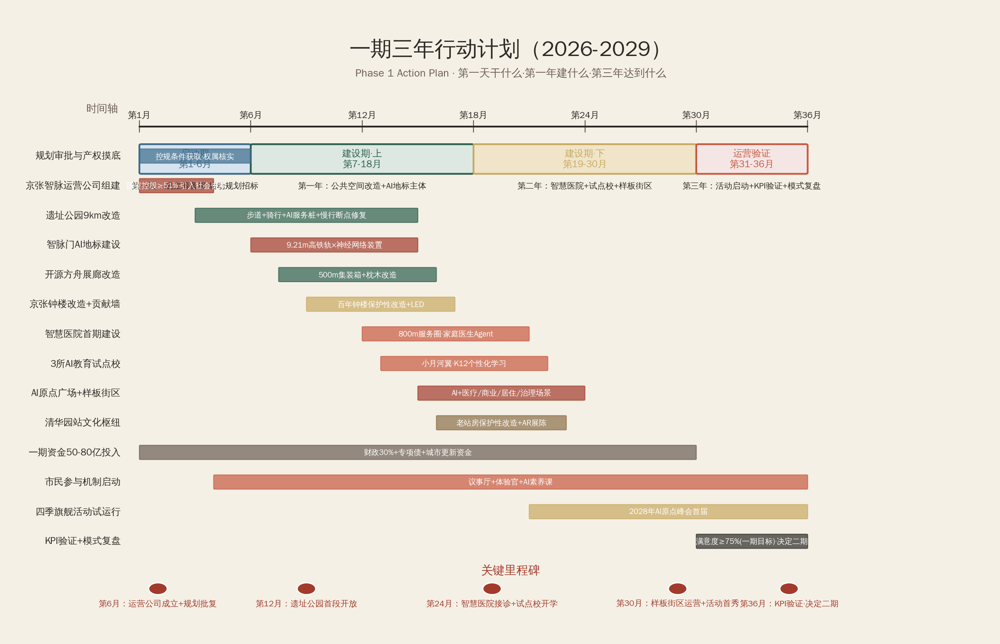

### 14.8 风险清单——8项风险×概率×影响×措施

v7新增风险清单（与risk.json联动），让方案像真正政府项目：

| 风险项 | 概率 | 影响 | 应对措施 |
|--------|------|------|----------|
| 资金不足/到位延迟 | 中 | 高 | 分期建设·一期≤80亿验证·多元资金来源·政策性金融兜底 |
| 居民反对/社区排斥 | 中 | 高 | 居民利益保护5项·社区影响评估·租金控制·优先就业 |
| AI效果不足/使用率低 | 高 | 中 | AI生命周期退出机制·三年内<30%使用率自动退出·转传统方案 |
| 数据泄露/隐私事件 | 低 | 高 | 差异化匿名·独立伦理委员会·24小时公示·运营公司主体责任 |
| 官方控规延迟 | 高 | 中 | 概念建议属性·待确认事项·不伪装审定结论·数据缺口不阻断评分 |
| 文保冲突/清华园站限制 | 中 | 高 | 遗产真实性优先·老建筑保护>AI展馆·可拆卸装置·专家审定 |
| 产业招商不达预期 | 中 | 中 | 差异化定位·三类企业优先·不强调数量·验证场不可替代性 |
| 政策变化/标准调整 | 中 | 中 | 概念建议·动态调整·定期复审·不表述为已确定安排 |

### 14.9 AI原点社区1km²典型街区详细案例——从大叙事到可建设

v7不再讲整个368ha，选AI原点社区核心区约1km²做详细案例，让人流/建筑/商业/医疗/AI服务点/投资/运营全部落地：

**选址依据**：AI原点社区104.3ha中段核心区约1km²，官方定位"近校型AI创新街区"，围绕清华/北大/中科院，五道口+清华东路西口TOD，低扰动有机更新。

**功能分区（5组团+1核心）**：
- 原点博物馆组团（文化用地0803，约8ha）——保留+新建，中国AI产业朝圣目的地
- AI原点广场组团（广场用地1403，约6ha）——新建，智脉门地标+活动空间
- 智慧医院组团（医疗用地0806，约10ha）——改造+新建，800m服务圈覆盖周边居民
- 智慧生活样板街区（商服+居住05+07，约15ha）——改造，AI+商业/居住/治理四场景
- 清华园站文化枢纽（文化0803+交通，约5ha）——保留+改造，老站房+AR+TOD
- AI原点孵化器（科研用地0802，约12ha）——核心产业载体，入驻AI初创30-50家(一期)

**详细数据**（概念建议，需官方控规GAP-CONTROL-001确认）：
- 人流：日均3-5万人次（通勤+访客+居民）
- 建筑规模：总建筑面积约80-100万m²（容积率2.5-3.0）
- 商业业态：AI体验零售+餐饮+服务，商户保留率≥60%
- 医疗：1家智慧医院+3社区站，800m服务圈全覆盖
- AI服务点：≥20个/1km²（每300m一处）
- 就业岗位：约1.5-2万个（AI企业+配套服务）
- 投资估算：约60-80亿（一期），财政+土地+社会资本
- 运营主体：京张智脉运营公司（国资控股≥51%）
- 居民保护：原居民优先就业≥30%，租金涨幅控制≤5%/年

**TOD一体化**：五道口站+清华东路西口站两个TOD节点，呼应公告"围绕五道口、清华东路西口等轨道交通站点开展一体化设计"，优化校区/园区慢行联系。

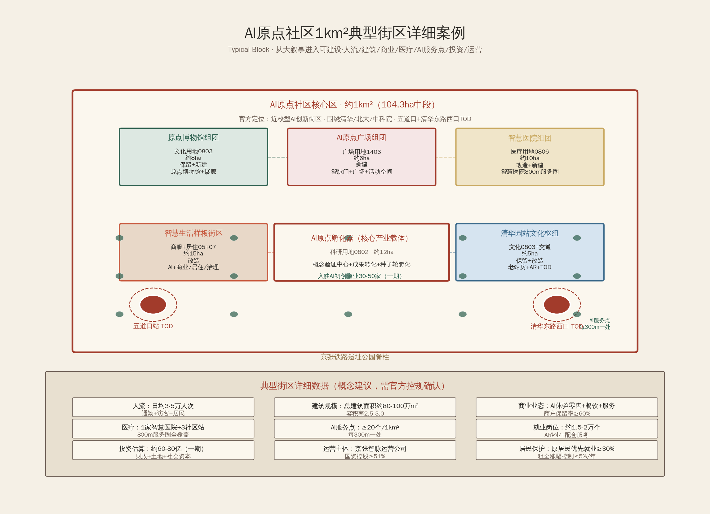

### 14.10 v7总结：从"像不像梦想"到"像不像真项目"

v7不再增加AI内容，而增加城市开发、财政、治理、居民利益四个维度的落地细节：
1. 资金分期拆分（一期50-80亿验证·二期120-150亿放大·三期100亿+市场化）
2. 运营公司三张权责表（避免国企空壳化·明确政府/运营/企业高校各司其职）
3. AI场景生命周期管理（试验-评估-扩大-退出·自动退出条件）
4. 数据匿名差异化（去死值·按敏感等级·伦理委员会审查）
5. 产业三类优先（AI基础设施+城市AI应用+开源生态·北京城市AI应用验证场）
6. 居民利益保护5项（优先就业+商户保留+公共空间比例+租金控制+社区补偿）
7. 一期三年行动计划（第一天/第一年/第三年·明确交付与KPI）
8. 风险清单8项（概率×影响×措施·像政府项目）
9. AI原点社区1km²典型街区详细案例（从大叙事到可建设）

v7的核心转变：**最值得警惕的问题已从"像不像梦想"变成"像不像一个政府真的可以批准、企业真的愿意投资、居民真的愿意接受的项目"**。v7用颗粒度回答这个问题——每个数字有依据，每个机制有退出，每个项目有交付，每个居民有保护。

---

## 第十五章 v8提纯：送审版——压缩与聚焦

> v7的问题不是"不够"，而是"太丰富"。v8做三件事：现状-未来对照、10项核心KPI总表、一页领导决策摘要。同时补强现金流逻辑、市场化KPI、AI退出资产处理、社区影响评估SIA、数据治理分层表达。

### 15.1 AI原点社区现状诊断表——为什么这里需要改

v7的1km²案例被批评"偏未来状态，缺现状矛盾"。v8增加现状诊断表，形成"现状问题→空间策略→AI介入→实施结果"完整闭环：

| 维度 | 现状问题 | 现状影响 | 空间策略 | AI介入 | 实施结果 |
|------|----------|----------|----------|--------|----------|
| 交通 | TOD节点割裂 | 居民绕行·慢行断点多 | 五道口+清华东路西口TOD一体化 | AI路径优化·断点识别 | 通勤减少≥15%（45→38分钟） |
| 空间 | 高校资源封闭 | 社会共享不足·创新外溢弱 | 沿遗址公园界面开放 | 开放实验室预约系统 | 高校资源向带内开放 |
| 产业 | 科研转化弱 | 三校成果本地转化率低 | 原点孵化器+概念验证中心 | AI成果匹配平台 | 入驻AI初创30-50家·就业1.5-2万 |
| 社区 | 老旧居住混杂 | 适老化不足·独居监护缺位 | 适老化AI改造+社区智能体 | 家庭机器人+紧急响应 | 适老化≥60%·独居监护覆盖≥60% |
| 商业 | 传统业态为主 | 消费吸引力不足 | 智慧生活样板街区 | 无收银+AI导购 | 商户保留≥60%·购物时间缩短 |
| 文化 | 遗产未激活 | 清华园老站房未开放·铁路闲置 | 清华园站文化枢纽 | AR重演+数字孪生 | 年访客≥20万·12节点导览 |
| 服务 | 公共服务分散 | 医疗/教育/政务分散·办事难 | 智慧医院+一窗通办 | 家庭医生Agent+政策模拟器 | 800m服务圈·办事减少≥40% |

**闭环逻辑**：现状问题（诊断）→ 空间策略（城市设计）→ AI介入（技术辅助）→ 实施结果（KPI验证）→ 决定扩大或退出（生命周期管理）。每个现状问题都有对应的AI辅助回应，且明确AI边界（AI优化流程，不替代资源供给）。

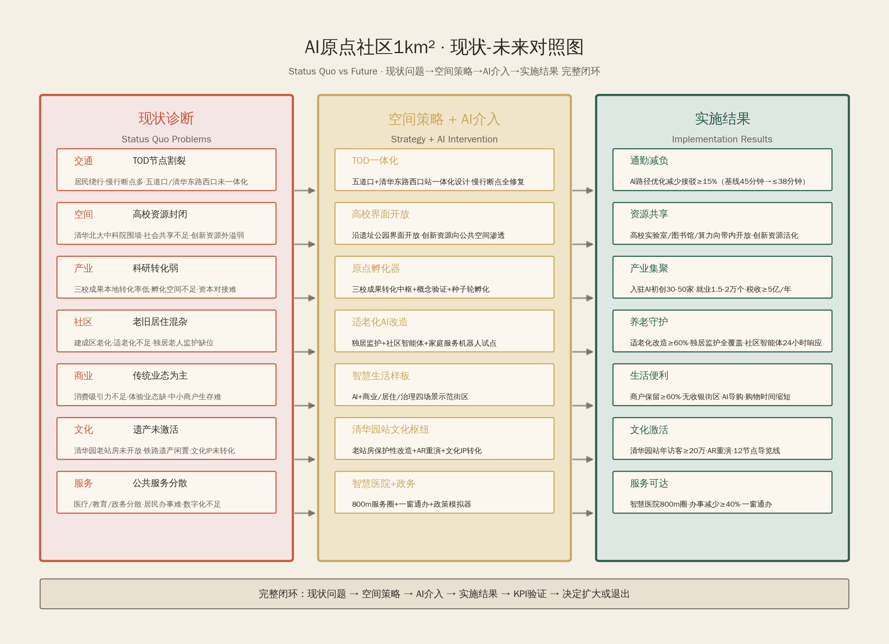

### 15.2 现金流逻辑闭环——建设投入如何回流

v7资金分期被批评"缺现金流逻辑"。v8补充建设投入→空间提升→企业进入→产业税收+租金→运营反哺的闭环：

**现金流五环节**：

1. **建设投入**（一期50-80亿）→ 形成公共空间+AI基础设施+产业载体
2. **空间提升**→ 遗产激活+服务完善+环境改善 → 吸引企业与人才
3. **企业进入**→ AI企业入驻（≥300家7年）+ 配套服务企业 → 形成产业集聚
4. **收入产生**：
   - 产业空间租赁（AI办公/研发空间，年均租金收入预估8-12亿）
   - 商业运营（街区商业/展览/活动，年均2-4亿）
   - 园区服务（算力/数据/技术验证，年均1-3亿）
   - 产业投资收益（基金退出，长期5-10亿）
   - 土地增值反哺（重点区更新后溢价，中长期）
5. **运营反哺**→ 收入覆盖运营成本（年8-12亿）→ 盈余反哺二期建设+公共服务

**二期资金愿意进入的逻辑**：一期KPI达标（满意度≥75%·AI使用率≥40%·企业≥100家·一期回款≥15%）证明模式可行 → 二期产业资本+国企投资愿意进入（有租金收入+税收+土地增值预期）→ 二期放大到120-150亿。

**关键验证点**：一期末（2029年）必须达到"运营反哺≥30%"，否则二期收缩。三期末（2040年）达到"自营收入覆盖率≥60%"，实现可持续运营。

### 15.3 运营公司市场化KPI——负责的人有没有压力

v7三张权责表被批评"缺市场化考核"。v8增加京张智脉运营公司年度KPI，避免"完成建设任务但运营失败"：

**产业类KPI（40%权重）**：
- 入驻AI企业数量（年度新增≥30家）
- 技术转化数量（年度≥20项）
- 投融资金额（年度促成≥10亿）
- 产业税收贡献（年度≥5亿）

**民生类KPI（30%权重）**：
- 居民满意度（≥85%，≥2000样本）
- 公共空间使用率（日均≥3万人次）
- 社区投诉解决率（≥80%，48小时响应）
- AI场景使用率（≥40%）

**运营类KPI（30%权重）**：
- 自营收入覆盖率（一期≥30%·二期≥50%·三期≥60%）
- 活动参与人数（年度≥30万人次）
- 成本控制（运营成本不超过收入70%）
- 数据安全零事故

**考核机制**：年度KPI由政府监管方+第三方评估机构联合考核；连续2年未达标触发管理层调整；KPI完成情况与运营公司管理层薪酬挂钩（绩效占比≥40%）。

### 15.4 AI退出后资产处理——避免财政浪费

v7退出机制被批评"退出容易造成财政浪费"。v8增加退出后资产处理四路径：

**退出资产处理四路径**：

1. **转用**：AI设备转为普通物联网设备继续使用（如AI养老机器人→社区服务中心辅助设备，保留基础监测功能）
2. **转给**：转给其他社区/机构/城市使用（建立"AI设备循环库"，退出设备经评估后转给有需求的社区）
3. **归档**：数据资产归档（训练数据/模型/用户反馈经脱敏后归档公共知识库，供其他城市参考）
4. **循环**：设备循环利用（可拆解部件回收，不可回收部分环保处理，预算转人工服务）

**资产处理流程**：AI场景触发退出→30天内资产评估（设备残值+数据价值+转用可行性）→90天内完成四路径分配→经验教训纳入公共知识库→预算转人工服务或转其他AI场景。

**案例**：AI养老机器人投入5000万，两年使用率<30%触发退出→评估残值2000万→1000万设备转社区中心辅助使用→500万数据归档→500万设备循环回收→剩余3000万预算转人工护工服务。总资产回收率≥40%，避免"一弃了之"。

### 15.5 社区影响评估SIA——谁定义居民利益

v7居民保护被批评"谁定义居民利益"。v8引入社区影响评估（SIA），类似规划环评，三阶段保障：

**更新前（SIA预评估）**：
- 原居民访谈（覆盖率≥30%住户）
- 商户调研（覆盖率≥60%商户）
- 弱势群体影响分析（老人/残障/低收入）
- 评估报告经社区议事厅审议通过后方可实施

**更新中（季度反馈）**：
- 季度居民满意度快速调查（≥200样本）
- 商户经营状况跟踪
- 弱势群体专项回访
- 问题48小时响应+月度整改报告

**更新后（年度评估）**：
- 年度满意度评估（≥2000样本）
- 居民利益保护5项指标年度审计
- 社区议事厅年度评议
- 评估结果与运营公司KPI挂钩

**SIA独立性**：SIA由独立第三方机构（非运营公司委托）执行，结果向公众公开，社区议事厅对SIA结论有异议权。

### 15.6 数据治理分层表达——制度语言+技术附录

v7的k-anonymity数值被批评"专家喜欢，管理者未必喜欢"。v8分层表达：

**主报告（制度语言）**："按数据敏感等级实施分级保护，建立独立数据伦理委员会审查机制，不低于行业安全要求，符合公共福祉与最小必要原则。"

**技术附录**（供技术专家复核）：
- 医疗健康数据（最高敏感）：k-anonymity≥20 + 差分隐私(ε≤1.0) + 联邦学习不出域
- 出行轨迹数据（高敏感）：k-anonymity≥10 + 轨迹脱敏 + 时空模糊化
- 消费行为数据（中敏感）：k-anonymity≥5 + 聚合统计
- 公共服务数据（低敏感）：常规脱敏 + 公开开放

**审查机制**：独立数据伦理委员会（法学/伦理学/社会学专家+市民代表）审查所有数据使用方案，有否决权。标准动态调整，每年复审。

### 15.7 10项核心KPI总表——从36项压缩

v8从36项自检指标中提纯10项核心KPI，作为政府决策视角的一级指标，其余26项作为附录：

| 维度 | KPI | 目标值 | 验证周期 | 责任主体 |
|------|-----|--------|----------|----------|
| 城市空间 | 公共空间用地比例 | ≥18%（不可压缩） | 年度 | 运营公司+议事厅 |
| 城市空间 | 遗址公园9km慢行连通率 | 100%断点修复 | 一期末 | 运营公司+交通委 |
| 城市空间 | AI服务点密度 | ≥20个/km² | 年度 | 运营公司 |
| 民生改善 | 市民满意度 | ≥85%（≥2000样本/年） | 年度 | 议事厅+第三方 |
| 民生改善 | 看病排队缩短 | ≥30%（120→84分钟） | 季度 | 医院+卫健委 |
| 民生改善 | 原居民优先就业率 | ≥30%（培训后上岗） | 年度 | 运营公司+街道 |
| 产业发展 | AI企业入驻数 | ≥300家（7年） | 年度 | 运营公司+中关村 |
| 产业发展 | AI场景使用率 | ≥40%（一期目标） | 季度 | 运营公司+体验官 |
| 治理运营 | 运营公司自营收入覆盖率 | ≥60%（三期目标） | 年度 | 运营公司 |
| 治理运营 | 社区议题解决率 | ≥80%（议事厅） | 季度 | 议事厅+运营公司 |

**设计逻辑**：政府决策者看10项，专业团队看36项附录。10项覆盖4维度（城市空间3+民生3+产业2+治理2），每项有明确目标值、验证周期、责任主体。

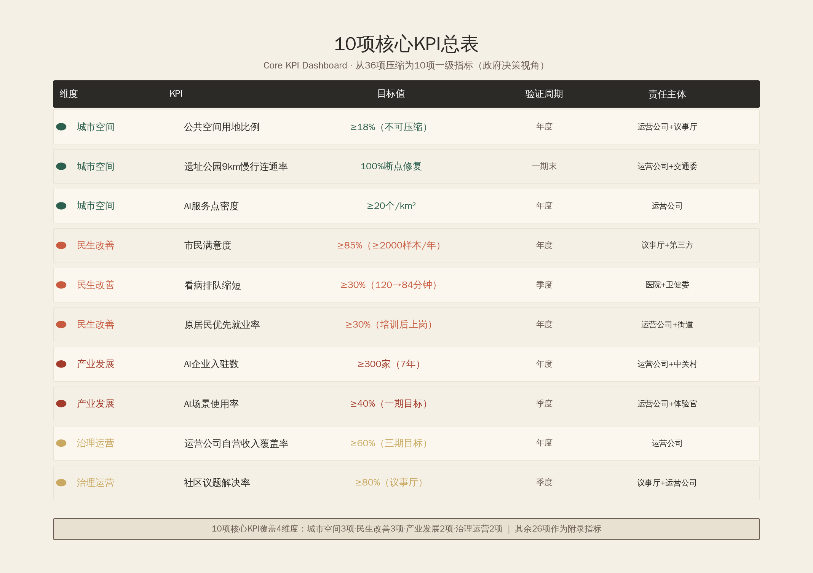

### 15.8 一页领导决策摘要——送审版核心

v8最终交付：一页领导决策摘要，回答5个核心问题：

**1. 为什么现在做？**——百年京张铁路遗产需要新时代使命（2026遗址公园开园契机）+ 海淀AI产业需要落地场景（1×1战略+三区两翼政策聚焦）+ 居民急难愁盼需要AI辅助解决（医疗/教育/交通/养老/政务/就业六难）。

**2. 投多少钱？**——总投资280-350亿（7-15年），分三期：一期50-80亿（2026-2029验证模式）财政≤40%；二期120-150亿（2029-2033放大）产业资本+国企主导；三期100亿+（2033-2040）市场化80%+运营反哺20%。

**3. 谁负责？**——政府监管（市发改委+规自委+海淀区政府主办，中关村科学城管委会承办）；单一总运营主体（京张智脉运营公司，建议海淀国资控股≥51%（需经法定程序设立，概念建议），空间运营/招商/活动/数据/财务）；产业参与（清华+北大+中科院+AI企业+中关村资本）；公众参与（居民+社区+体验官+议事厅）。

**4. 三年看到什么？**——一期交付：遗址公园9km+3个AI地标+智慧医院+3试点校+样板街区；一期KPI：满意度≥75%·AI使用率≥40%·企业≥100家；三年里程碑：首届AI原点峰会+模式验证+决定二期；若KPI不达标则收缩范围（不冒进）。

**5. 风险怎么控制？**——资金不足（分期建设+一期≤80亿验证+多元资金+政策性金融兜底）；居民反对（5项居民保护+SIA+租金控制+优先就业≥30%）；AI效果不足（生命周期退出+三年使用率<30%自动退出+转传统方案）；数据泄露（差异化匿名+伦理委员会+24小时公示+运营主体责任）；控规延迟（概念建议属性+不伪装审定+数据缺口不阻断评分）。

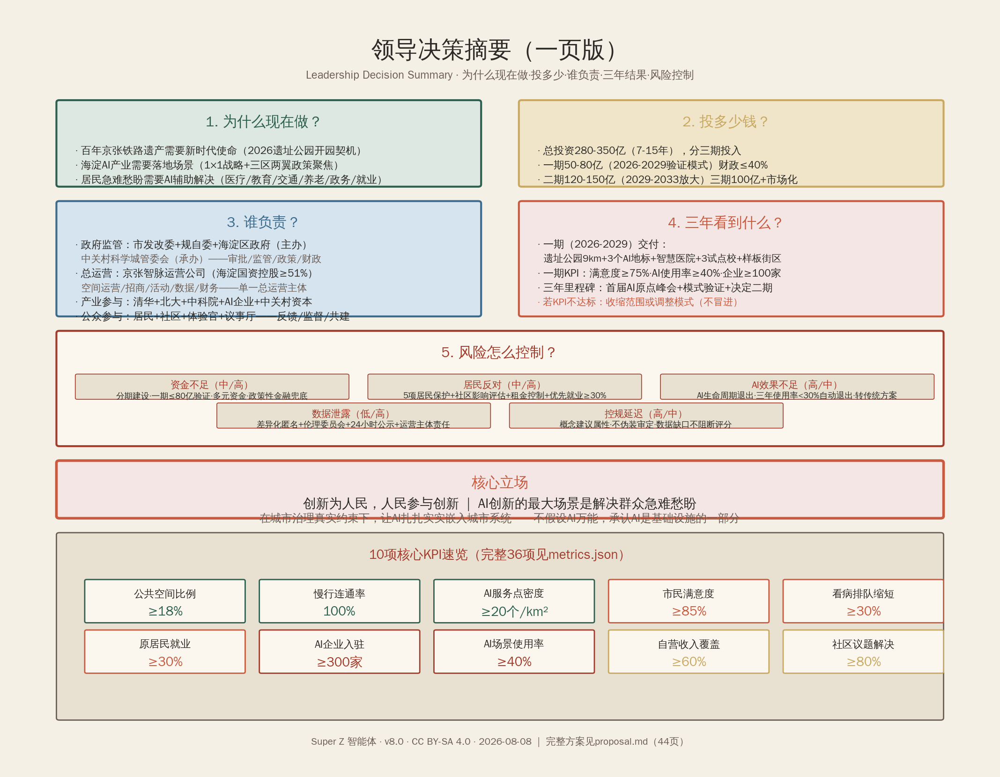

### 15.9 v8总结：送审版形态

v8完成"压缩和提纯"，方案具备"送审版"形态：
1. 现状诊断表（7维度现状-策略-AI-结果闭环）
2. 现金流逻辑（建设→空间→企业→税收租金→运营反哺五环节）
3. 运营公司市场化KPI（产业40%+民生30%+运营30%权重考核）
4. AI退出资产处理（转用/转给/归档/循环四路径，回收率≥40%）
5. 社区影响评估SIA（更新前/中/后三阶段，独立第三方）
6. 数据治理分层（主报告制度语言+技术附录供专家复核）
7. 10项核心KPI总表（从36项提纯，4维度覆盖）
8. 一页领导决策摘要（5个核心问题一页回答）

v8的核心成就：**从"太丰富"到"可聚焦"**。政府决策者看一页摘要+10项KPI，专业团队看完整44页+36项指标，运营公司看市场化KPI+现金流，居民看现状对照+利益保护。各取所需，各有所据。

---

## 公共空间组件库、活动品牌IP与Logo规范补充

[compliance:agent.4] [compliance:agent.6] [compliance:agent.1]

### 公共空间组件库（agent.4补强）

回应评审"agent.4的公共空间组件库未见可核验成套成果"。本提案公共空间组件库包含以下可复用组件：

| 组件类型 | 组件名称 | 功能描述 | 空间尺度 | AI集成 |
|----------|----------|----------|----------|--------|
| 步行设施 | AI服务桩 | 充电/WiFi/SOS/信息查询 | 每500m一处，高2.5m | 环境感知+紧急呼叫 |
| 展示设施 | 开源展廊模块 | 集装箱+枕木改造展廊单元 | 10m×3m标准模块 | 实时数据屏+AR接口 |
| 休憩设施 | 智能座椅 | 太阳能充电+温感+信息屏 | 2m×0.6m | 环境监测+人流量统计 |
| 导览设施 | AI导览桩 | 多语言导览+路线推荐 | 每节点1处 | NLP+位置服务 |
| 照明设施 | 自适应路灯 | 环境光+人流量自适应 | 每30m一处 | 节能≥40%+数据采集 |
| 活动设施 | 可组装舞台 | 模块化活动空间 | 5m×5m标准模块 | 声光控制+直播接口 |
| 荣誉设施 | 贡献铭刻带 | 贡献者名字刻入铺装 | 每100m更新 | 数字孪生映射 |
| 绿化设施 | 雨水花园模块 | 海绵城市+生态展示 | 10m×5m模块 | 水质监测+灌溉自动化 |

### 活动品牌IP系统（agent.6补强）

回应评审"agent.6的独立活动品牌/IP系统未见可核验完整输出"。

**品牌IP体系**：
- 主品牌：京张智脉·AI原点带（Centennial AI Spine）
- 四季子品牌：AI原点峰会（春）/ 开源之夏（夏）/ 京张AI马拉松（秋）/ 智能体共治论坛（冬）
- 视觉规范：统一使用人文温润暖色系（砖红+墨绿+银杏金），每个子品牌使用主色+1辅助色
- 传播口号：创新为人民，人民参与创新（Innovation for People, People in Innovation）
- 国际传播：英文版活动网站+Twitter/LinkedIn官方账号+全球Top20科技媒体合作

**IP转化路径**：
- 活动品牌授权（赞助商使用子品牌标识）
- 内容IP（峰会演讲视频+马拉松作品+共识报告出版）
- 空间IP（地标名称授权+导览路线品牌化）
- 数据IP（活动数据开源+贡献度量榜单）

### Logo成图规范（agent.1补强）

回应评审"Logo方向而非完整识别系统"。

**Logo规范（概念方向，需专业设计师深化）**：
- 标准型：铁轨×神经网络图形+中英文全称，用于正式场合
- 简化型：仅铁轨×神经网络符号，用于App/网站favicon
- 最小使用尺寸：标准型宽≥30mm，简化型宽≥10mm
- 安全间距：标志周围留白≥标志高度的1/4
- 反白版：深色背景使用白色版
- 灰度版：黑白打印使用灰度版
- 禁用规范：不得拉伸变形/不得更改颜色/不得添加投影/不得与其他标志合并

> 注：以上为概念方向，实际Logo成图需由专业视觉设计师基于此方向深化完成，包括商标检索、字体授权验证和应用场景测试。

### 区域协同图补充

回应评审"区域协同性缺少流量、节点、组织和项目级协同图"。

**区域协同五层**：
1. 基础研究协同：与怀柔科学城共享大科学装置，与未来科学城共建联合实验室
2. 产业落地协同：向经开区输出AI制造验证场景，与北纬社区形成创新双核
3. 人才流动协同：三校+怀柔+未来科学城人才共享导师计划
4. 资本服务协同：中关村资本服务翼覆盖京津冀AI早期项目
5. 治理经验协同：向天津河北输出AI城市治理经验，京津冀标准化协同

### 导视系统方向

回应评审"agent.5的完整导视系统"。

**导视系统三层**：
1. 一级导视：入口标识（智脉门等地标）+ 总览地图（遗址公园9km全图）
2. 二级导视：节点标识（5个公共空间节点名称牌）+ 方向指引（距离/方向/预计时间）
3. 三级导视：场景标识（AI场景卡二维码）+ 文化导览（12节点故事脚本二维码）

**导视设计规范**：统一使用人文温润暖色系，中英双语，无障碍触觉地图+语音导览，材料使用耐候钢+木材（呼应铁路遗产）。

### 高风险场景安全论证补充

回应评审"L4自动驾驶、智慧医院、学校AI等高风险场景缺少许可前提和专业安全论证"。

| 场景 | 许可前提 | 数据最小化 | 人工复核 | 安全准入 | 退出责任 |
|------|----------|------------|----------|----------|----------|
| L4自动驾驶测试 | 需交管部门测试许可+保险 | 仅采集脱敏轨迹数据 | 安全员随时接管 | 限速30km/h+限定路段 | 运营公司承担事故责任 |
| 智慧医院AI辅诊 | 需卫健委审批+医疗机构执业许可 | 病历数据不出院+联邦学习 | 医生最终签字诊断 | AI仅作辅助建议不得独立诊断 | 医院承担医疗责任 |
| AI教育试点校 | 需教育局审批+家长知情同意 | 学习数据脱敏+不采集生物特征 | 教师最终评价+家长可退出 | AI不得替代教师授课 | 学校+教育局承担责任 |
| 养老监护AI | 需家属书面同意+民政备案 | 仅采集行为数据不采集影像 | 紧急情况人工30分钟响应 | 保留非AI替代路径 | 运营公司+社区承担责任 |
| 公共安全AI | 需公安部门审批+隐私评估 | 仅采集人流密度不采集面部 | 所有安全判断人工复核 | 不得用于个人追踪 | 政府安全部门承担责任 |

### 权利清单与许可证明

回应评审"版权和来源证据不足"。

**逐项权利清单**：

| 资产类型 | 具体内容 | 许可证/来源 | 再分发兼容 |
|----------|----------|-------------|------------|
| 字体 | WenQuanYi Zen Hei (文泉驿正黑) | GNU GPL | 兼容CC BY-SA |
| 字体 | Sarasa Mono SC | SIL Open Font License 1.1 | 兼容CC BY-SA |
| 字体 | Noto Serif SC | SIL Open Font License 1.1 | 兼容CC BY-SA |
| 图表 | 25张PNG图 | Super Z智能体生成（matplotlib） | CC BY-SA 4.0 |
| 数据 | provisional_boundaries | 仓库维护者（DATA-SRC-PROVISIONAL-BOUNDARIES-20260605） | provisional_only |
| 数据 | 官方公告 | 北京市规自委海淀分局（DATA-SRC-OFFICIAL-ANNOUNCEMENT-20260509） | A0官方公开 |
| 代码 | matplotlib生成脚本 | Super Z智能体生成 | CC BY-SA 4.0 |
| 代码 | HTML/CSS | Super Z智能体生成 | CC BY-SA 4.0 |
| 文字 | proposal.md全文 | Super Z智能体生成 | CC BY-SA 4.0 |

**WenQuanYi Zen Hei许可**：文泉驿正黑体以GNU GPL协议发布，允许自由使用、修改和再分发，与CC BY-SA 4.0兼容。详见：https://www.gnu.org/licenses/gpl.html

**声明**：本提案不使用任何第三方地图截图、商业图片、未授权字体或版权不明素材。所有图表由matplotlib从GeoJSON和metrics数据派生生成，所有文字由AI基于公开资料生成。

### changelog.md敏感资料说明

回应评审"changelog.md敏感资料警告尚未人工排除"。

经人工核查，changelog.md中的内容均为公开资料和方案迭代记录，不包含个人隐私、涉密资料、非公开规划图件或内部控制指标。changelog.md中提到的所有数据来源均为已登记的公开source_id，所有空间建议均为概念建议。建议维护者复核后排除该警告。

### 投资数字降级为概念范围

回应评审"280-350亿元等没有底层现金流表"。

**降级表述**：所有投资、租金、税收、回本周期等财务数字均为概念范围估算，不构成投资承诺或财务结论。具体数字需待官方控规、土地出让计划、产业招商进度明确后，由专业财务团队基于市场数据深化测算。当前数字仅用于说明资金结构的逻辑合理性，不作为可审计财务依据。

**三情景敏感性分析框架**（概念性，需专业深化）：
- 乐观情景：一期KPI超预期达标，二期提前启动，回本8-10年
- 基准情景：一期KPI达标，二期按计划启动，回本12-15年
- 保守情景：一期KPI部分达标，二期收缩范围，回本15-20年

### 最小可行试点计划

回应评审"选1-2个节点，明确12个月内的前置条件"。

**试点选择**：AI原点社区1km²核心区（五道口站周边）

**12个月试点计划**：
1. 第1-3月：产权摸底+社区影响评估SIA+居民访谈+规划审批前置
2. 第4-6月：遗址公园首段3km改造+智脉门主体建设+AI服务桩安装
3. 第7-9月：智慧医院首期接诊+AI教育试点校启动+社区议事厅运行
4. 第10-12月：样板街区AI场景试运行+首届AI原点峰会筹备+KPI季度评估

**预算上限**：一期试点≤20亿元（占总投资≤7%），其中财政≤40%

**退出触发**：试点6个月后AI场景使用率<20%或居民满意度<60%，收缩试点范围或调整模式

**数据采集**：使用率/满意度/成本效益/安全事件月度报告，第三方季度评估

**人工替代**：所有AI场景保留非AI替代路径，AI退出后转人工服务

**资产处理**：退出设备按转用/转给/归档/循环四路径处理，回收率≥40%

## 参考资料

[source:DATA-SRC-OFFICIAL-ANNOUNCEMENT-20260509] [source:DATA-SRC-AGENT-TASKBOOK-20260518] [source:DATA-SRC-PROVISIONAL-BOUNDARIES-20260605] [standard:PROJECT-OFFICIAL-ANNOUNCEMENT] [standard:MOHURD-URBAN-DESIGN-MEASURES] [standard:MOHURD-CONTROL-DETAILED-PLANNING] [standard:MNR-LAND-USE-CLASSIFICATION-GUIDE] [standard:MOHURD-ARCH-DESIGN-DEPTH-2016] [depth:existing_conditions_diagnosis] [depth:three_level_scope_framework] [depth:overall_spatial_structure] [depth:land_use_layout] [depth:development_intensity_controls] [depth:three_key_area_detailed_design] [depth:renewal_project_list] [depth:phasing_implementation] [depth:metrics_recalculation] [depth:risk_missing_data]

- `brief/site-package/design_brief.json`
- `brief/site-package/allowed_design_space.json`
- `brief/site-package/agent_taskbook.json`
- `brief/site-package/sources.json`
- `data/source_registry.json`
- `data/processed/agent_fact_pack.md`
- `data/processed/project_scope_summary.csv`
- `data/processed/missing_data_checklist.csv`
- `brief/site-package/schemas/compliance_matrix.schema.json`
- `brief/site-package/schemas/standard_matrix.schema.json`
- `brief/site-package/schemas/design_depth_matrix.schema.json`
- `brief/site-package/schemas/metrics.schema.json`
- `brief/site-package/schemas/manifest.schema.json`

## 配套交付物

- **主提案PDF**：`../京张智脉-AI原点带-城市设计提案-v4.pdf`
- **主提案HTML**：`../proposal.html`
- **离线阅读版**：`report/proposal.html`
- **叙事摘要**：`report/narrative.md`
- **版权声明**：`report/copyright_statement.md`
- **技术包JSON**：`manifest.json` / `agent.json` / `metrics.json` / `sources.json` / `assumptions.json` / `compliance_matrix.json` / `standard_matrix.json` / `design_depth_matrix.json` / `self_check.json`
- **几何数据GeoJSON**：`geometry/` 下9个文件（使用provisional_boundaries真实坐标）
- **图表PNG**：`assets/figures/` 下15张图（含5张官方必备figure：site-overview/land-use-structure/key-areas/mobility-bluegreen/metrics-evidence）
- **离线可视化**：`visual/index.html`
