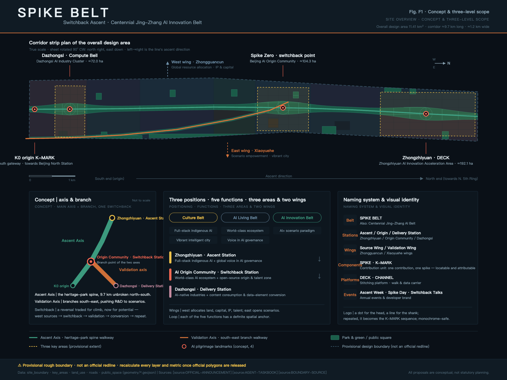
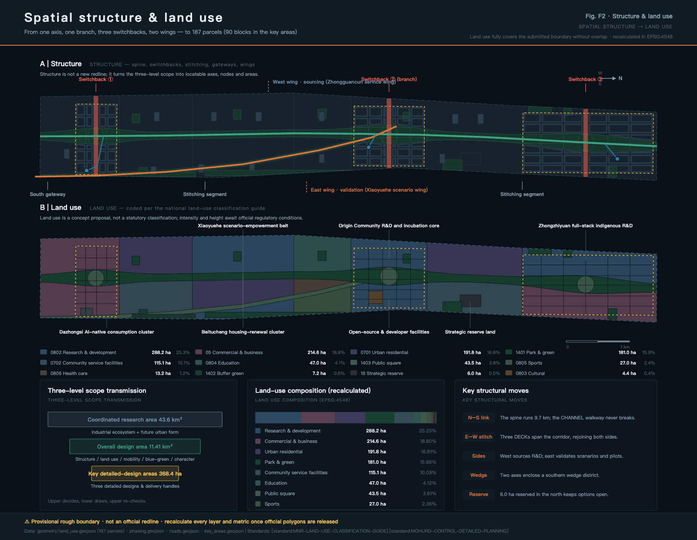
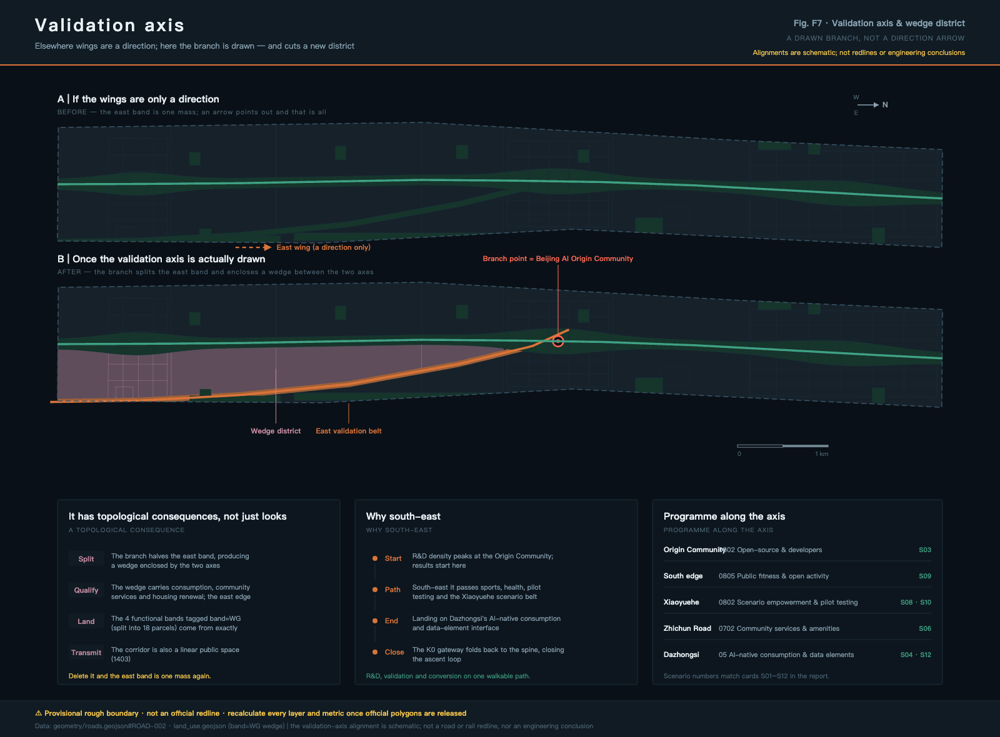
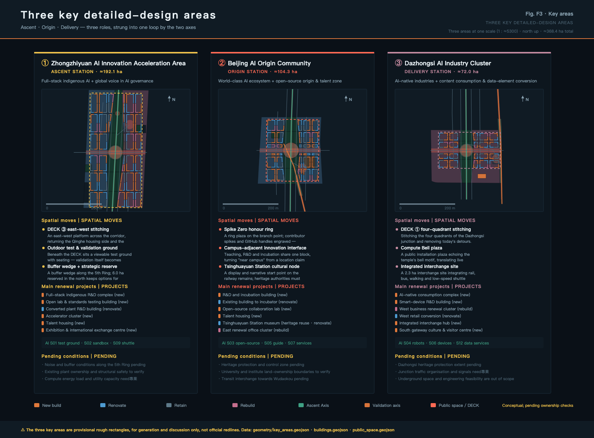
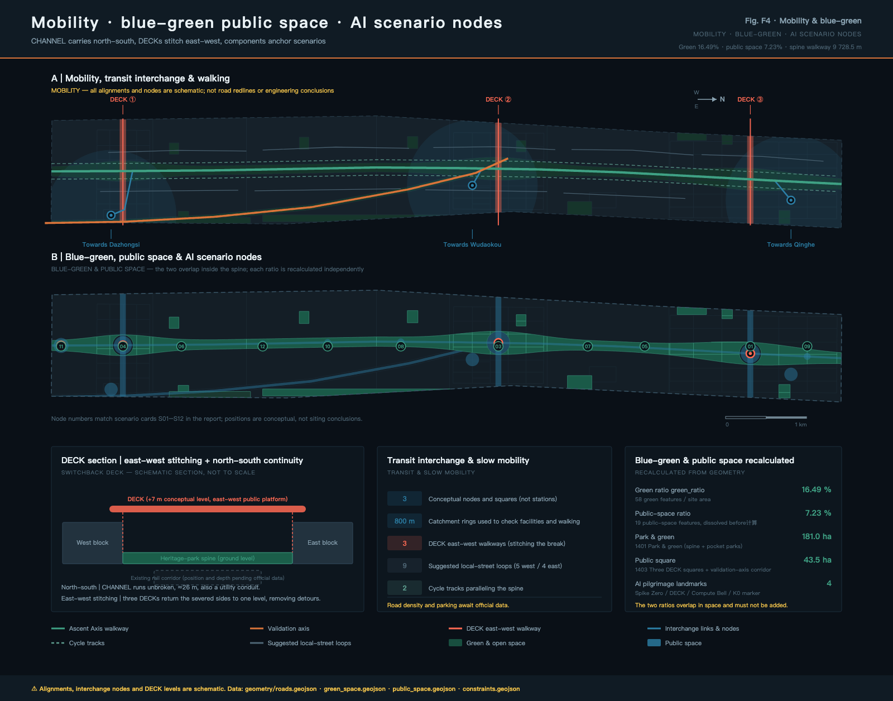
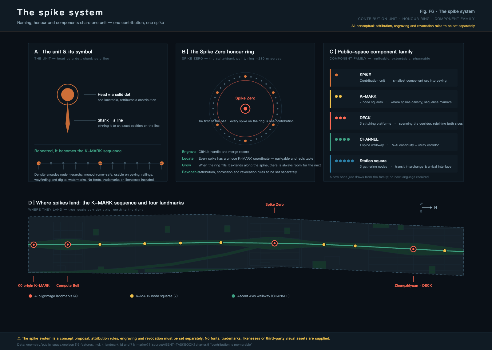
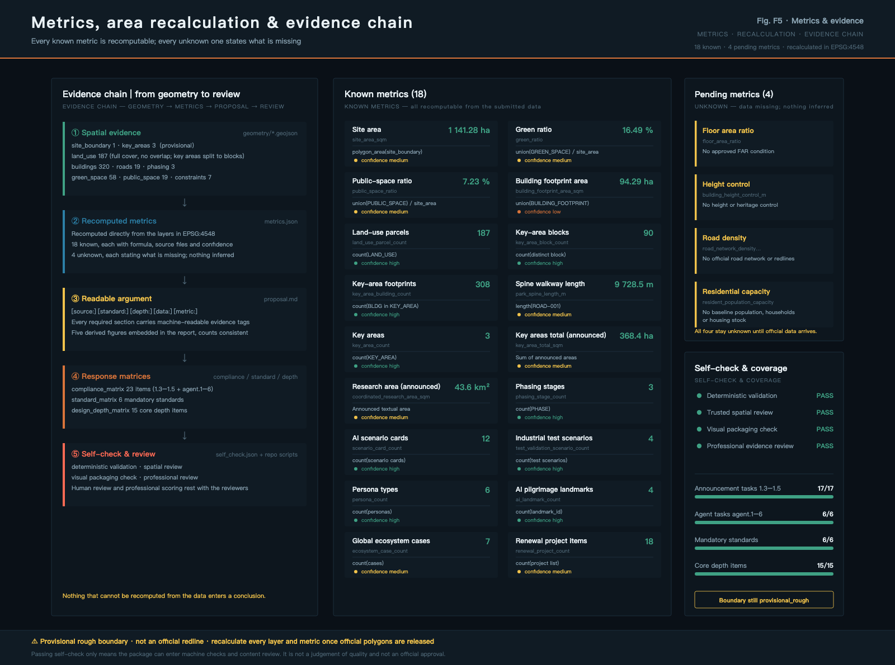

# SPIKE BELT · Urban Design Overall Concept and Key Area Focus for the Centennial Jing-Zhang AI Innovation Belt

One hundred years ago, Zhan Tianyou solved the gradient issue at Guan Gou using a reversal: he folded the horizontal distance to gain elevation. This was not merely an ornamental alignment but an engineering judgment that traded space for capacity—when the road was not steep enough, he folded it once, buying height with length.

One hundred years from now, the urban segment of this line will be underground, leaving a linear corridor about 9.7 kilometers long and on average 1.2 kilometers wide on the ground. This proposal asserts that the problems facing this corridor today are structurally analogous to those of its original design—it is long enough but not tall enough; it is continuous north-south but divided east-west; it is flanked by universities, research institutions, enterprises, and residential communities, but lacks an exchange device that could facilitate a true "back-and-forth" cycle of innovation.

Therefore, the overall concept of this scheme is the "Spike Belt (SPIKE BELT) · Return and Fold": with the Jing-Zhang Heritage Park axis as the "ascending axis," and the southeastward branch axis branching out from the Beijing AI Origin Community as the "validation axis," a "returning platform" is set in three key areas to complete the east-west connection, making "west-side origin → original point return → southeast validation → southern end transformation → re-origin" a cyclic spatial loop.

Why it is called the "Peg Line," is because this line ultimately relies on one peg at a time. A peg is the smallest component used by railways to fix steel tracks onto sleepers; a single line is composed of countless pegs. This proposal borrows the peg as the smallest unit of contribution—each adopted contribution corresponds to a peg that is locatable, attributable, and verifiable. When the railway is completed, the last peg is hammered in, but an open-source city will never stop contributing.

All spatial recommendations in this article are Conceptual Recommendations/reference solutions and are provided for professional teams to deepen their research. They do not replace statutory planning, nor do they constitute government approval conclusions, approval basis, or implementation commitments.

## Design Basis and Source List

This proposal is based on the first reference to the "Centennial Jing-Zhang AI Innovation Belt Urban Design International Scheme Qualification Pre-Review Announcement" by the Haidian Branch of Beijing Municipal Commission of Planning and Natural Resources [source:OFFICIAL-ANNOUNCEMENT], and the "Task Book for Conducting the Centennial Jing-Zhang AI Innovation Belt Urban Design Open Call for Global Participants" as the intelligent agent task reference [source:AGENT-TASKBOOK]. It also relies on the structured site information maintained and registered in the repository `brief/site-package/` for machine-readable reference [source:SITE-PACKAGE]. (Centennial Jing-Zhang AI Innovation Belt Open Call for Urban Design) The availability boundary of the data is determined by `data/source_registry.json` [source:SOURCE-REGISTRY], the reading navigation layer is `data/processed/agent_fact_pack.md` [source:PROCESSED-FACT-PACK], and items unsupported by public data are recorded one by one in `missing_data_checklist.csv` [source:MISSING-DATA-CHECKLIST].

The most important prerequisite must be stated at the beginning: this scheme has no Official Planning Boundary. The overall design boundary in the submission package is derived from the temporary rough boundary in `provisional_boundaries.geojson` [source:BOUNDARY-SOURCE], the three key areas are derived from the same file's temporary rough rectangles [source:KEY-AREA-SOURCE], and they are all marked with `geometry_role = provisional_constraint`, `official_boundary = false`, and `boundary_precision = provisional_rough`. They can support the generation, visualization, topological self-check, and design discussions, but cannot be used as official planning boundaries, approval references, or precise area references. Correspondingly, the recalculated [metric:site_area_sqm] of [data:geometry/site_boundary.geojson#SITE-001] is 1,141.28 hectares, which is at the same magnitude as the announced 11.4 square kilometers but not precisely consistent; the announced textual area of 43.6 square kilometers for the Coordinated Research Area [metric:coordinated_research_area_sqm] with three key areas totaling 368.4 hectares [metric:key_area_total_sqm] is only referenced as textual area and does not participate in spatial recalculation. The official polygon released after that, land use, buildings, roads, green spaces, Public Spaces, phased and total proportion indicators must be recalculated as a whole, rather than replacing individual files.

The purpose boundaries of the documentation are strictly distinguished into three categories: materials that can be used for formal conclusions (such as the announcement of the task and scope, requirements of the agent task book, and general principles of professional standards); materials that can only serve as background information (such as public common descriptions of global innovative ecological cases [source:GLOBAL-CASE-BACKGROUND]); and materials that can only serve as temporary intake (such as the provisional geometries). Background materials do not support spatial control conclusions, and provisional materials do not serve as official references. These points will be reiterated in every instance of citation below.

Professional standards are based on local reference snapshots: Urban design coordination requirements are based on the Urban Design Management Measures [standard:MOHURD-URBAN-DESIGN-MEASURES], the depth of Regulatory Detailed Planning results are based on the Compilation and Approval Measures for Urban and Town Control Detailed Planning [standard:MOHURD-CONTROL-DETAILED-PLANNING], land use classification is based on the Guide for Land and Sea Use Classification in Territorial Space Investigation, Planning, and Control [standard:MNR-LAND-USE-CLASSIFICATION-GUIDE], the depth of the results document is referenced from the Regulations for the Depth of Architectural Engineering Design Documents (2016 Edition) [standard:MOHURD-ARCH-DESIGN-DEPTH-2016], and the project's own task boundaries are based on the announcement [standard:PROJECT-OFFICIAL-ANNOUNCEMENT] and the agent's open call taskbook [standard:PROJECT-AGENT-OPEN-CALL-TASKBOOK]. Among `MOHURD-ARCH-DESIGN-DEPTH-2016` In the retrieval status in the warehouse standard index `missing_source_url` This plan only references its depth of expression as a draft for citation, without writing it as a authoritative fulfillment.

Current condition diagnosis, given the lack of official baseline data, is limited to judgments that can be supported by publicly available resources and geometric analysis [depth:existing_conditions_diagnosis]: The corridor is highly linear (with a length-to-width ratio of approximately 7:1), offering good north-south continuity but being segmented by the corridor itself in the east-west direction; there are clear functional differences on either side (the west side is adjacent to academic institutions, while the east side is adjacent to industry and living services); three key areas are distributed from north to south in the head, middle, and tail segments of the corridor, naturally forming a sequence of 'beginning—turning—ending'. There are no publicly available baseline data for the current building scale, ownership, population, road network, and municipal capacity; therefore, this plan does not provide any current statistical figures, but instead registers them as pending conditions in `assumptions.json`.

## Three-Level Scope Framework

The announcement defines three levels of work scope, which this scheme interprets as three different levels of judgment accuracy rather than three maps at different scales [depth:three_level_scope_framework].

- Coordinated Research Area | Area: 43.6 km² (as stated in the announcement) | Address: How the AI Innovation Ecosystem is organized and what the future urban form will be | Focus: Ecological map, element mechanisms, naming and identification system | Precision: No official polygon, only for conceptual transmission
- Overall Design Area | Area: 11.41 km² (Provisional Boundary Recalculation Value) | Response: How to depict the structure, land use, transportation, blue-green space, and urban appearance on the map | Points of Focus: 187 land use blocks and all design layers | Precision: Provisional rough boundary, requires recalculation
- Key-Area Detailed Design Area | Area: 368.4 ha (Announced Text Value) | Response: How the three areas reach the level of detailed design depth | Focus: Spatial Actions, Project List, Scenarios, and Conditions to be Confirmed | Precision: Temporary Rough Rectangle, Not Site Boundaries

The transmission rules between layers are clear: the upper layer's judgment determines the lower layer's plot allocation, and the lower layer's recalculation verifies the upper layer's judgment. For example, if the integrated layer judges that "the eastern side should undertake the function of scene validation," this must be reflected in the overall design layer as a combination of land uses dominated by research and development, sports, and medical and health services (see the land use table below), and in the key area layer as specific test validation sites and pilot buildings. If the recalculation reveals that the eastern side's available land is insufficient to support this judgment, the judgment should be modified at the integrated layer, rather than forcing the plot to be fully allocated on the map.

Within this framework, the overall spatial structure of the scheme is "one axis, one branch, three return points, and two wings" [depth:overall_spatial_structure]:

- Ascending Axis (Main Axis of Jing-Zhang Heritage Park): Expressed by [data:geometry/roads.geojson#ROAD-001], with a total length of [metric:park_spine_length_m] 9,728.5 meters, extending continuously from the southern end K0 starting point to the north toward the Fifth Ring Road, serving as the backbone that runs north-south.
- Verify Axis (branch axis branching from the origin community): expressed by [data:geometry/roads.geojson#ROAD-002], branching from the Beijing AI Origin Community (approximately at the 57% point along the corridor's north-south axis) and extending southeast to the eastern side of Dazhongsi, serving as a directional corridor that pushes R&D towards scenarios, terminals, and consumer interfaces.
- Three turnaround points: located at three key areas [data:geometry/key_areas.geojson#PROV-KEY-001], [data:geometry/key_areas.geojson#PROV-KEY-002], [data:geometry/key_areas.geojson#PROV-KEY-003], [metric:key_area_count] 3, each with one DECK spanning the corridor to complete the east-west connection.
- Two Wings: The West Wing corresponds to the Zhongguancun Technology Services Wing, which is responsible for configuring elements such as land, capital, IP, and talent. The East Wing corresponds to the Xiaoyue River Scenario Enablement Wing, which is responsible for Scenario Access involving data, computing power, and testing. In this plan, the two wings do not add new red lines but only express directional collaborative relationships.

It should be noted that this proposal deliberately does not rely on any specific font or pattern. The aspect ratio of the corridor is approximately 7:1; any stylized composition would be flattened at the actual scale and can only be maintained through diagrams. Therefore, 'reversal' here is a set of testable spatial rules rather than a shape that can be placed on a diagram: whether it is continuous north-south, whether it is stitched east-west, and whether there is a clear reversal point—all can be individually verified in the submitted layers. The structural indication (non-proportional) in Figure F1 is only for illustrative purposes, and the actual spatial relationships are to be determined by the band diagram.

The axis value deserves a separate mention because it is the true point of divergence in structure between this scheme and most 'one axis and two wings' schemes: most schemes interpret the wings as directional relationships, using an arrow to point out and then ending; this scheme represents it as a real linear corridor, thus giving it topological consequences — the branch axis splits the eastern band into two, forming a wedge-shaped block between the two axes (this is where the four functional bands in the map layer `band=WG` are derived from). Without this axis, the eastern band reverts to a single whole, and functional separation can only be declared in words; with it, functional separation becomes a spatial fact that can be verified on the layer.

## Coordinated Research Area: Industry and Future City Research

The task of the Coordinated Research Area is to build a world-class AI Innovation Ecosystem and to address the questions regarding the future urban form that aligns with AI's new quality of productivity [standard:PROJECT-OFFICIAL-ANNOUNCEMENT]. This section also completes the required responses for agent.1 and agent.2 tasks in the agent.1 and agent.2 taskbooks [standard:PROJECT-AGENT-OPEN-CALL-TASKBOOK].

### Naming System, English Name, and Visual Identity Direction (agent.1)

Naming is not a slogan, but a system that is scalable, constructible, and transmissible:

- One Belt | Name: SPIKE BELT | Description: The secondary name adopts the official "Centennial Jing-Zhang AI Innovation Belt"; the conceptual name serves the purpose of identification and dissemination.
- Three Stations | Name: Up Station / Turnaround Station / Delivery Station | English: ASCENT / ORIGIN / DELIVERY | Description: Corresponding to Zhongzhiyuan, Beijing AI Origin Community, and Dazhongsi, respectively, taking the concept of a "station" from railways.
- Two Wings | Name: Strategy Wing / Validation Wing | English: SOURCE / VALIDATION WING | Description: Corresponding to the Zhongguancun Technology Services Wing and the Xiaoyue River Scenario Enablement Wing
- Components | Name: Tie Rod / Kilometer Marker | English:SPIKE / K-MARK| Description: The contributing units and along-line markers form components of the Public Space library.
- Platform | Name: Foldback Platform / Channel | English: DECK / CHANNEL | Description: East-West Stitching Platform with North-South Pedestrian Pathway—Data Dual Carrier
- Activity | Name: Shàngxíng Zhōu / Dàodìng Rì / Zhěfǎng Duìhuà | English: ASCENT WEEK / SPIKE DAY / SWITCHBACK TALKS | Description: Annual event and developer community brand

Logo Direction: The basic symbol is formed by the top and side views of a spike — the head as a solid dot, and the shaft as a line. The combination of the dot and line reads as "a fixed position." Repeating this along a baseline forms a K-MARK sequence, where density and sparsity can express node hierarchy. The design must be single-color, legible at a very small size, reproducible for ground paving, railing components, signboards, and digital watermarks. This proposal does not provide any fonts, images, trademarks, or character portraits. The logo direction is described in text and geometric principles, and the final visual assets must be created by an authorized design team.

### Global AI Innovation Ecosystem Case Studies and Convertible Mechanisms (agent.2)

The following 7 cases [metric:ecosystem_case_count] are all publicly known descriptive examples, containing no investment amounts, outputs, company lists, or policy commitments. In this scheme, they are used only as background analogies and are not to be considered as formal conclusion references [source:GLOBAL-CASE-BACKGROUND]: (Background Only)

- 1 | Case: King's Cross Knowledge Quarter, London (UK) | Homologation Point: Brownfield Update of Railway Station Area, Adjacent to University and Research Institutions | Transformation Mechanism: Public Space and Open Blocks Lead, Long-Term Coordinated Stewardship Ensures Quality Consistency
- 2 | Case: Paris Station F (France) | Homologation Point: Transforming an Old Railway Freight Building into a Startup Container | Transformative Mechanism: Embedding "One-Stop Startup Services" into a Recognizable Megastructure to Create a Destination Visitation Point
- 3 | Case: Singapore one-north (Singapore) | Homologation Point: Government-led, Thematic Zoning Research and Development Area | Transformation Mechanism: Thematic Zoning by Districts + Long-term Talent Residency and Infrastructure Co-Development
- 4 | Case Study: MaRS Discovery District (Toronto, Canada) | Homologation Point: A Hub for Conversion between University and Hospital | Transformative Mechanism: Treating "Technology Transfer" Itself as the Main Business of a Building Rather than an Ancillary Function
- 5 | Case: Stanford Research Park () | Homologous Point: The Long-Term Paradigm of a University Adjacent to a Research Park | Transformative Mechanism: Long-Term Land Leasing + Academic Governance, in Exchange for Decadal Stability
- 6 | Case: Munich Urban Colab (Germany) | Homologation Point: Co-hosted Urban Innovation Space by Municipal and Innovation Agencies | Transformation Mechanism: Use the city's own issues as the source for innovation challenges, forming a demand-side pull
- 7 | Case: Shanghai Xibei AI Cluster (China) | Homologous Point: Transformation of Waterfront Industrial Heritage, Integration of Industry and Public Cultural Functions | Conversion Mechanism: Mutual Promotion among Public Space, Annual Conference Brand, and Industry Cluster

The common conclusion drawn from the seven case studies is that innovation ecosystems are not attracted, but are cultivated by a suite of long-term stable Public Spaces and service mechanisms. This proposal accordingly breaks down the 'comprehensive stack of indigenous innovation system' into six spatially actionable elements of assurance—land (strategic reserving [data:geometry/land_use.geojson#LU-024] 6.0 hectares), space (existing buildings that can be renovated), scenarios (validation belt on the eastern side), computing power and data (New Infrastructure corridor, see transportation and municipal infrastructure chapter), talent (talent apartments and proximity to schools), and funding and IP (existing service system of the West Wing, Zhongguancun Technology Services Wing). Among these, land, space, and scenarios have clear spatial locations in this proposal, while computing power, data, and funding are only suggested as mechanisms, not as confirmed policies or funding arrangements.

### Future Urban Form Assessment

Adaptive urban forms to harness the new quality of productivity brought by AI are concretized in this proposal through three verifiable judgments: first, the physical distance between research, development, validation, and transformation should be sufficiently short, thus connecting three stations along a continuous 9.7 km slow-moving mainline rather than dispersing them in disconnected parks; second, the validation process should be visible to the public, thus placing the test validation field under a DECK, observable and performative, rather than enclosed within a perimeter; third, the city should reserve the option for future technologies, thus reserving strategic blank spaces in the northern segment, not pre-locking their functions. These judgments are grounded in [standard:MOHURD-URBAN-DESIGN-MEASURES] requirements for coordinating building layout, landscape appearance, and Public Space, and ultimately realized in the main axis park expressed in [data:geometry/land_use.geojson#LU-001] and the DECK expressed in [data:geometry/public_space.geojson#PUBLIC-001].

## Overall Design Area: Urban Renewal and Regulatory-Plan-Level Urban Design

The Overall Design Area requires the depth of Urban Design reaching the Regulatory Detailed Planning [standard:MOHURD-CONTROL-DETAILED-PLANNING]. The land use layer submitted [data:geometry/land_use.geojson#LU-002] contains [metric:land_use_parcel_count] 187 parcels, fully covering the submitted boundary and are non-overlapping (with a coverage difference of less than 0.01% of the site area). Use land codes to express the project subset according to [standard:MNR-LAND-USE-CLASSIFICATION-GUIDE] [depth:land_use_layout].

- 0802 | Category: Research and Development Land | Area: 288.2 | Percentage: 25.25%
- 05 | Category: Commercial and Service Facilities Land | Area: 214.6 | Percentage: 18.80%
- 0701 | Category: Residential Land Use | Area: 191.8 | Percentage: 16.81%
- 1401 | Category: Park Green Space | Area: 181.0 | Percentage: 15.86%
- 0702 | Category: Urban Community Service Facilities Land | Area: 115.1 | Percentage: 10.09%
- 0804 | Category: Educational Land Use | Area: 47.0 | Percentage: 4.12%
- 1403 | Category: Public Square | Area: 43.5 | Percentage: 3.81%
- 0805 | Category: Sports Land Use | Area: 27.0 | Percentage: 2.36%
- 0806 | Category: Healthcare Land Use | Area: 13.2 | Percentage: 1.16%
- 1402 | Category: Protective Green Space | Area: 7.2 | Percentage: 0.63%
- 16 | Category: Vacant Land | Area: 6.0 | Percentage: 0.53%
- 0803 | Category: Cultural Land Use | Area: 4.4 | Percentage: 0.39%
- 1207 | Category: Urban Village Road Land Use | Area: 2.3 | Percentage: 0.20%
- Total (187 parcels) | Area: 1,141.3 | Percentage: 100%

This table outlines three design judgments. First, research and development (R&D) land accounts for one-quarter rather than a majority—leaving only a corridor for R&D would not retain people, thus residential, community services, and commercial services together exceed 45%, forming the foundation for daily life. Second, green spaces and squares combined nearly reach 20%, as the core public product of this plan is the continuous green corridor; [metric:green_ratio] recalculated as 16.49%, derived entirely from the two categories of land use 1401 and 1402, reviewers can independently verify the same number through the land use table and the green map layer. Third, blank land is explicitly written into the land use table rather than left as "undetermined"—making uncertainty explicit is the approach of this plan to address "data gaps."

The lateral structure is formed by the division of two axes: the west side band is the source axis, sequentially comprising research, residential, research and educational interfaces, research, and residential; the east side main band is the validation axis, sequentially comprising commercial services, community services, research (scenario validation and pilot), sports, research (open-source collaboration), and community services. In the southern half between the two axes, a wedge-shaped block is enclosed, which accommodates intelligent native consumption, community services, and residential updates. This lateral division is not an administrative demarcation but a functional adjacency judgment: validation functions require contiguous transformable spaces and tolerance spaces, while source functions require proximity to universities and quiet research environments. Mixing them would be counterproductive.

About Development Intensity [depth:development_intensity_controls]: This plan does not propose a specific value for the Floor Area Ratio [metric:floor_area_ratio]. The Floor Area Ratio in `metrics.json` is listed as `unknown`, with the reason stated as "public data does not provide approved Floor Area Ratio control conditions for this area." Similarly, the Building Height control in the [depth:height_massing_character] is listed as `unknown` in `metrics.json`, lacking both the control plan height conditions and the conditions for the construction control zone for cultural relics. This plan only proposes principles of form rather than specific values: within a 100-meter range on both sides of the main axis, it is advisable to have low development intensity, open interfaces, and avoid continuous high walls; around the DECKs, there should be a nodal variation in height; along the Fifth Ring Road and the railway side, a transitional green buffer should be used for protection. These principles are illustrated by 320 Building Footprints expressed in [data:geometry/buildings.geojson#BLDG-001], with a recalculated total area of [metric:building_footprint_area_sqm] equivalent to 94.29 hectares (with a footprint coverage rate of approximately 21.8% in the focus area), expressing the scale and interface relationships of the blocks, not actual measured footprints. Does not constitute a conclusion regarding building scale.

Regarding the confirmed regulatory conditions [data:geometry/constraints.geojson#CON-001]: This scheme registers seven `analysis_helper` elements in the constraint layer—three areas for confirmed regulatory conditions, a cultural and green line confirmation control zone for the archaeological park, and an 800-meter walking impact zone around three conceptual connection nodes. Their `confidence` is all `low`, and `official_boundary` is `false`. The purpose is to remind the reviewers "there is a set of issues that must be confirmed by official conditions," rather than replacing those conditions.

## Detailed Design of Key Areas

Three key areas are mandatory options, and this plan provides a detailed design for each, including positioning, spatial actions, project levers, AI scenarios, and conditions to be confirmed [depth:three_key_area_detailed_design]. Each of the three areas is expressed in a north-up plan at the same scale, with geometry derived from [data:geometry/key_areas.geojson#PROV-KEY-002]. It must be re-stated that these are temporary rough rectangles, and their edges should not be interpreted as property or road boundaries.

This plan adopts a different level of detail for the three key areas compared to the rest of the corridor. The announcement requires these key areas to achieve the depth of an Integrated Planning Implementation Plan for Urban Design. Therefore, within the 368.4 hectares of these key areas, land use is no longer expressed by functional bands but is divided into blocks: a total of [metric:key_area_block_count] 90 block units, marked by 151 plot bands in the map layer with `detail_level=street_block`; buildings are no longer expressed by indicative volumes but are generated by surrounding block bases totaling [metric:key_area_building_count] 308 bases, with a base coverage rate of approximately 21.8%, forming a continuous street frontage rather than isolated buildings. The rest of the corridor maintains the functional band granularity. **The level of detail should follow the task requirements, not uniformly increase the density across the entire area**, which would only create a superficially fine-grained appearance without substantive basis.

It should also be noted that the street block division lines are conceptual indications and are not road redlines; the courtyard-style base expression conveys the interface relationship and scale order, not a building scheme; both must be repositioned after the official control plan conditions and property ownership data are completed.

### Zhongzhiyuan AI Independent Innovation Acceleration Area (Up Station, approximately 192.1 ha)

Positioned as a carrier for the Full-Stack Independent AI Innovation System and the global discourse on AI governance, the area will undertake three spatial actions: a return platform No. 3 that stitches the east and west by connecting the Qinghe South residential side with the academic road north industrial side at the same elevation through a horizontal public platform spanning the corridor; an outdoor testing and validation field, situated beneath the return platform, featuring an industrial testing and validation venue and a viewing stand, making the validation process itself a public content rather than a closed operation; a protective green wedge and strategic blank spaces, along the Fifth Ring Road, with a northern segment reserving 6.0 hectares of blank land to provide options for computational power and New Infrastructure. Key update projects include the Full-Stack Independent R&D Building Cluster (new construction), the Open Experiment and Standard Testing Building (new construction), the renovated R&D Building from Existing Factories (renovation), the Accelerator Cluster (new construction), the Talent Apartment (new construction), and the Exhibition and International Exchange Center (new construction). Pending conditions include noise and protective conditions along the Fifth Ring Road, ownership and structural safety of existing factories, computational power facility energy consumption, and municipal capacity.

### Beijing AI Origin Community (Transfer Station, approximately 104.3 ha)

Positioned as a world-class AI Innovation Ecosystem and open-source cradle, it is a fork point of the two axes, also the only turnaround exchange point on the entire corridor. Three spatial actions: the Honor Ring of the Spike Zero, setting a circular square with a diameter of approximately 280 meters at the fork point, serving as the physical carrier of the contributors' honor display system; the Near-School Innovation Interface, allowing teaching, research, and incubation to share the same street block, turning the 'near-school' from a location description into an interface practice; the Tsinghua Garden Railway Station Cultural Display Node, combining the remnants of the Jing-Zhang Railway to organize the display and narrative starting point. Major update projects include the Research and Incubation Main Building (new construction), the conversion of existing buildings into incubators (renovation), the Open Source Collaboration Experimental Building (new construction), the Talent Apartments (new construction), the Tsinghua Garden Railway Station Cultural Display Museum (preservation and renovation), and the East Side Update Office Cluster (demolition and reconstruction). Pending confirmation conditions: the scope of cultural relic protection and the construction control area, the boundaries of university and institute land use rights, and the conditions for rail transit connection in the Wudaokou direction. Any renovation suggestions involving the remnants of the railway must be confirmed by the cultural relic authority before further development.

### Dazhongsi AI Industry Cluster (Located Station, approximately 72.0 ha)

Positioned for smart native new business forms and content consumption, as well as the transformation and utilization of data elements. Three spatial actions: Return Platform 1: Quadrant Suture, connecting the four quadrants of the Dazhongsi intersection to eliminate current detours; Clock Plaza, a public installation that echoes the Dazhongsi clock culture theme, translating the operational state of the open scene into perceivable sound and light; Integrated Intermodal Hub Site, a 2.3-hectare site integrating rail, bus, active transportation, and low-speed transit connections. Major update projects include a Smart Native Consumption Complex (new construction), a Smart Terminal R&D Building (new construction), a West Side Business Update Cluster (demolition and reconstruction), a West Side Commercial Renovation (renovation), an Integrated Intermodal Hub (new construction), and a South Gateway Cultural and Welcome Center (new construction). Pending confirmation conditions: Dazhongsi cultural relic protection area and construction control zone, intersection traffic organization and signal plan, and underground space and engineering feasibility — the latter is explicitly not within the scope of this plan's conclusions.

## AI Innovation Ecosystem, Personas, and AI+ Scenarios

This section completes the mandatory content of agent.3's task statement: at least 10 AI scenario cards, at least 3 industrial Testing and Validation Scenarios, at least 5 user personas, and the scenario-space-operation mapping with privacy and Human Review boundaries.

### AI Scenarios Cards (12 cards)

[metric:scenario_card_count] is 12, of which 4 are labeled as industrial test validation scenarios [metric:test_validation_scenario_count] (S01, S02, S04, S09). The spatial locations of the scenario nodes are shown in Figure F4, geometrically falling on Public Space elements such as [data:geometry/public_space.geojson#PUBLIC-005], which are conceptual locations and not facility site selection conclusions.

- S01 · Industrial Testing and Validation Field | Location: Below Zhongzhiyuan Return Platform 3 | Target: Enterprises, Research Teams | Type: Testing and Validation | Boundaries: Require regulatory approval and safety plans; open hours and enclosure plans confirmed by the operator
- S02 · Standards and Compliance Sandbox | Location: Zhongzhiyuan Open Experiment and Standard Testing Building | Target: Enterprises, Standard Institutions | Type: Testing and Validation | Boundary: Sandbox conclusions do not equal compliance certification; results must undergo Human Review before publication
- S03 · Open Source Collaboration Hub | Location: Origin Community Open Source Collaboration Experimental Building | Target: Developers, Students | Type: Routine Services | Boundary: Does not collect personal identity data; contribution records are based on voluntary public account identifiers
- S04 · Robot Delivery and Low-Speed Shuttle | Landing Point: Main Axis from Dazhongsi to South Portal Segment | Target: Residents, Visitors | Type: Test Validation | Boundaries: Restricted Road Segment and Time Period; Must Have Remote Human Takeover and Emergency Stop
- S05 · AI Cultural Tour Guide | Focus: Cultural Node of Tsinghua Garden Railway Station | Target Audience: Public, Visitors | Type: Routine Service | Boundary: Content must be fact-checked; unauthorized images and graphics shall not be used
- S06 · Smart Terminal Experience Street | Location: Connection Segment of Zhi Chun Road with Dazhongsi East | Target: Consumers, Enterprises | Type: Routine Services | Boundary: Experience Data Not Leaving the Venue; No Facial Recognition or Identity Profiling
- S07 · Talent and Enterprise Services Copilot | Focus: Original Point Community and West Wing Service Node | Target: Startup Teams, Talents | Type: Routine Services | Boundary: Policy Interpretation Conclusions Must Undergo Human Review; Do Not Replace Administrative Responses
- S08 · AI+ Health Service Navigation | Location: Xiao Yuehe East Health Service Validation Cluster | Target: Residents, Seniors | Type: Routine Services | Boundary: Does Not Provide Diagnostic Conclusions; Only Provides Service Navigation and Appointment Assistance
- S09 · Accessibility and Slow Mobility Diagnosis | Focus Point: Full-Band Main Axis and Return Platform | Target: Seniors, Individuals with Mobility Impairments | Type: Test Validation | Boundary: Image Instantaneous Desensitization, Retain Only Structured Slope and Width Data
- S10 · Urban Operation and Public Safety Review | Focus: Full Band (Operational Center as Primary) | Target: Management Department | Type: Routine Service | Boundary: Only provide anomaly alerts; no population recognition performed
- S11 · Visitor Portal and Multilingual Reception | Location: K0 Starting Kilometer Marker Plaza | Target: International Visitors | Type: Routine Service | Boundary: Language Services Do Not Store Conversation Content
- S12 · Data Elements and Digital Asset Services | Anchor Point: Dazhongsi Intelligent Native Consumption Cluster | Target: Enterprises, Creators | Type: Routine Services | Boundary: Data Ownership and Revenue Allocation Require Separate Legal Confirmation

Unified Scenario Boundary Clause: All of the above scenarios are Conceptual Recommendations; they must not be based on non-public data, personal privacy data, or specific supplier requirements; all perception-related scenarios involving Public Space must be Human Reviewable, closable, and explainable; Testing and Validation Scenarios must not be written as approved operations until they have obtained regulatory approval.

### User Profiles (6 categories)

[metric:persona_count] is set to 6, used to verify that the space supply truly corresponds to the number of people:

- P1｜Profile: Graduate Student / Young Researcher｜Key 30 Minutes: Commute from Lab to Collaborative Space｜Space Requirements: Near School, Continuous Walkable Path, Free to Stay｜Corresponding Scenario: S03, S09
- P2｜Profile: Startup Team Technical Partner｜Key 30 Minutes: Find Space, Find Computing Power, Find First Customer｜Space Requirements: Renovatable Small Space, Service Window, Activity Area｜Corresponding Scenarios: S02, S07, S12
- P3 | Profile: Enterprise AI Product Manager/Engineer | Key 30 Minutes: Run the Prototype in a Real Environment Once | Space Requirements: Bookable Testing Grounds and Validation Segments | Corresponding Scenario: S01, S04
- P4 | Profile: Local Senior Residents | Key 30-Minute Activities: Buying Groceries, Visiting the Doctor, and Walking | Space Requirements: No Grade Differences, Seating Available, Proximity to Services | Corresponding Scenarios: S08, S09
- P5｜Profile: Community Family with Children｜Key 30-Minute Period: After school to dinner, approximately two hours｜Space Requirements: Safe green spaces, visible activities, accessible sports facilities｜Corresponding Scenario: S05, S06
- P6 | Profile: International Visitors / Developers | Key 30 Minutes: From Arrival to "Understanding What is Happening Here" | Spatial Requirements: Portal, Orientation, Viewable Demonstration Site | Corresponding Scenarios: S05, S11, S01

Scenario—Space—Operational Mapping Rules: Each scenario card must be able to answer three questions—on which Public Space element does it fall (space), who operates it during what time period (operation), and who is responsible for shutting it down when it malfunctions (governance). Any scenario that cannot answer the third question will not be included in this scheme.

## Land Use, Building Scale, and Retain-Renovate-Demolish Strategy

Building Footprint layer [data:geometry/buildings.geojson#BLDG-014] contains 320 building footprints, among which [metric:key_area_building_count] 308 fall within three key areas and are categorized into four classes [depth:retain_renovate_demolish]:  (Demolish–Renovate–Retain Strategy)

- Preserve | Number: 65 | Base Area: 207,458 | Based On: Current Function Still Suitable, Structure and Ownership Stable
- Rehabilitation | Number: 94 | Base Area: 270,563 | Based On: Structural Suitability for Utilization, Functional Conversion (Including Revitalization of Existing Structures)
- Raze and Rebuild | Number: 32 | Base Area: 84,618 | Based on: Conflict with the alignment or turnaround relationship with the main axis and lack of renovation value
- New Construction | Number: 129 | Base Area: 380,218 | Based On: Located on vacant, underutilized spaces, or sites for renewal
- Total | Count: 320 | Base Area: 942,857 | Based On: [metric:building_footprint_area_sqm]

The Demolish–Renovate–Retain (D–R–R) Strategy is the most restrained part of this scheme. The Building Footprints are indicative update units and are not actual measured footprints; ownership, structural safety, lease agreements, resident preferences, and statutory procedures are all unknown. Therefore, this scheme strictly controls 'demolition and reconstruction' to 32 locations, occupying 9.0% of the Building Footprints, and all are located in street blocks directly in conflict with the turnaround apron relationship. Retention and renovation combined cover 159 locations, occupying 50.7% of the Building Footprints, with a significantly higher proportion for renovation than demolition. This ratio itself is a design judgment: on a corridor primarily focused on existing structures, the default action of updating should be renovation rather than demolition. Any classification conclusion must be established only after ownership verification and statutory procedures are completed. (Demolish–Renovate–Retain Strategy)

Building scale (total gross floor area) is not provided in this scheme because of the lack of Floor Area Ratio and height control conditions. Any estimation would be pseudo-precise. [standard:MOHURD-ARCH-DESIGN-DEPTH-2016] The statement regarding the depth of the results is only intended to indicate "what needs to be completed in the next phase," rather than claiming that this scheme has reached the specified depth.

## Transport, Rail, Municipal Infrastructure, and Public Services

Road layer [data:geometry/roads.geojson#ROAD-003] consists of 19 line features, all of which are conceptual indicative lines and do not constitute road right-of-way or engineering conclusions [depth:traffic_rail_slow_parking].

- Upward axis pedestrian mainline: 1, with a total length of [metric:park_spine_length_m] 9,728.5 meters, running through the entire belt without any motor vehicle crossing points.
- Verify the axial slow zone branch: 1 branch, extending from the original point community to the east side of Dazhongsi.
- Return Lane for East-West Pedestrian Axis: 3, spanning the corridor, are the concrete embodiment of the "east-west stitching."
- Transfer corridors: 3, connecting three conceptual transfer nodes with the main axis. The positions of the transfer nodes are indicative and do not represent actual station locations. The 800-meter pedestrian influence zone is registered in the constraint layer and is only used for facility and slow mobility verification.
- Suggested minor circulation lines for alleyways: 9 (5 on the west side, 4 on the east side).
- Bicycle dedicated lanes: 2, parallel to the main axis.

[metric:road_network_density_km_per_sqkm] is listed as `unknown` in `metrics.json` due to the lack of official current road network and road right-of-way data; therefore, the road network density conclusion cannot be drawn from the road alignment in this plan. Similarly, parking supply, road cross-sections, and intersection channelization are also listed as pending conditions.

Municipal and New Infrastructure [depth:municipal_new_infrastructure]: This proposal introduces the concept of a "channel" — a continuous pedestrian belt approximately 26 meters wide along the main axis, serving as a ground corridor for both data conduits and energy conduits. This channel would allow new pipelines to be laid along a publicly shared pathway, thereby avoiding repeated excavation of the city's roads. This is a spatial organization suggestion, and the feasibility, depth, capacity, and potential conflicts with existing pipelines all require further argumentation by municipal professional units. This proposal does not provide any engineering conclusions or load calculations. The locations and depths of existing line corridors also require confirmation by official documentation.

Public Services Facilities: The land for community service facilities covers 115.1 hectares, education land covers 47.0 hectares, sports land covers 27.0 hectares, and health and medical land covers 13.2 hectares, totaling approximately 202 hectares, which account for about 17.7% of the Overall Design Area. These facilities are distributed along the main axis and at turnaround points, ensuring that both the P4 (elderly) and P5 (family) profiles can reach at least one community-level facility within a 500-meter range. This is the basic test standard for the 'high-quality district' in this plan, and a prerequisite for 'talent attraction': without accessible daily services, talent will only come to work but not stay to live.

## Blue-Green Network, Public Space, and Urban Character

Public Space layer [data:geometry/green_space.geojson#GREEN-001] contains 18 elements, all derived from 1401 park and green spaces and 1402 protective green spaces in the land use table, so the [metric:green_ratio] of 16.49% can be verified from two independent paths [depth:blue_green_public_space]. Public Space layer [data:geometry/public_space.geojson#PUBLIC-010] contains 19 elements, with the [metric:public_space_ratio] of 7.23%.

A clear calculation rule must be noted: green spaces and Public Spaces overlap within the main axis of the heritage park site (the main axis pedestrian zone 'channel' is simultaneously located within the park's green spaces). The two proportions should be combined and de-duplicated separately for their respective layers and then independently calculated; they should not be simply added together. This rule has been incorporated into the  field of the `metrics.json`.

Public Space is composed of a component library rather than a collection of isolated plazas: return platforms (3, east-west oriented public platforms spanning the corridor), channels (1, the main axis pedestrian corridor spanning the entire belt), K-MARK node plazas (7, small plazas evenly spaced along the main axis), station forecourt plazas (3), verification axis public corridor (1), and 4 pilgrimage sites. The component library's significance lies in its replicability, scalability, and phased implementation: adding a node does not require redesigning a new language, but simply drawing from the component library.

### AI Pilgrimage Landmark and Honor Display System (agent.4)

[metric:ai_landmark_count] is 4, all of which are Conceptual Recommendations:

1. Spike Zero (AI Origin Community) —— A circular plaza at the turnaround point, with the first spike embedded in the ground. This is the core of the honor display system, and also the origin of the naming of the entire strip: each adopted contribution corresponds to a spike, with the contributor's name inscribed, making it locatable, navigable, and revisit-able —— this is the spatial expression of the principle of "memorable contributions." The method of inscription, recording rules, and revocation mechanisms must be separately established, and this plan makes no prior commitments.
2. Zhongzhi·Fold Return Platform (Zhongzhiyuan) —— A longitudinal platform along the corridor and the outdoor testing and validation field below it, turning technological validation into a visible urban event.
3. Big Bell (Dazhongsi) —— A public installation that responds to the bell culture theme of Dazhongsi, translating the operational status of open computing power and open scenarios into sound and light. The form, location, and acoustic environment of the installation must be confirmed by the cultural relics, greening, and environmental protection authorities, and must not affect the original structure and protected area of the cultural relics.
4. K0 Starting Kilometer Marker (South Portal) —— Full sign with starting identifier and international arrival portal, with the kilometer system starting from this point.

Landmarks in the area are subject to a common constraint: they should not be over-commercialized, turned into internet celebrities, or made vulgar. Unauthorized trademarks, fonts, images, or likenesses should not be used.

Spikes are not just a symbol of honor; they are also the life unit of this scheme, the smallest component of the Public Space component family, and the basic form of the along-line identification system. Three things share one unit to ensure that "contribution is memorable" goes beyond a slogan: contribution → spike → K-MARK coordinate → a specific, navigable, and revisitable location. The component family (spikes, K-MARKs, DECKs, CHANNEL, station squares) is significant because it is replicable, scalable, and phased—adding a new node simply requires taking from the family, without the need to reinvent a language.

### Centennial Jing-Zhang Culture, Zhongguancun Culture, and AI New Culture Fusion Narrative (agent.5)

Narrative structure as "three layers on the same line": railway layer (the engineering history and legacy of the Jing-Zhang Railway, particularly the ingenuity embodied in the reversal loop alignment to overcome engineering challenges, and the construction history of fixing a line to the earth), Zhongguancun layer (the entrepreneurial history from the street of electronics to an innovation ecosystem), and AI New Culture layer (open-source collaboration, intelligent body co-creation, and contributions that are memorable). These three layers are not presented in parallel but are manifestations of the same spirit across three eras: using a clever structure to transform an impossible slope into a climbable path.

Spatial Carrier and Expression: Along the main axis, a kilometer system carries the temporal narrative; the Tsinghua Garden Railway Cultural Node carries the railway layer; the original community's spike system carries the AI new cultural layer; the sign and identification system uniformly uses the spike symbol and kilometer system numbering, maintaining differentiation from the overall One-Belt logo system—cultural identification systems are not equivalent to the One-Belt logo system, as they operate at different levels and serve different purposes and must not be mixed. The international communication narrative can be summarized in a single sentence: From the first spike to this one today, a hundred years later, this line will still be solving the same problem—how to make the impossible height achievable. All historical statements must be based on facts and must not be distorted; the use of historical material images and academic paper illustrations must be authorized separately.

Urban Character Control [depth:height_massing_character]: Create a continuous, open, and low-profile public interface along the main axis; introduce three nodes of height and massing variation with return platforms; allow for larger-scale experimental and pilot building volumes in the eastern validation zone; and maintain a courtyard scale in the western source zone that aligns with the scale of universities and research institutions. These are principles of form, without any specific height values or Floor Area Ratio conclusions, which must be confirmed by formal control plan conditions.

## Renewal Projects, Implementation Policy, and Phasing

Update project list with 18 items [metric:renewal_project_count], which converts the aforementioned spatial actions into discussable and sortable implementation levers [depth:renewal_project_list].

- 1 | Project: Through Pedestrian Walkway along the Main Axis "Channel" | Location: Throughout the Entire Project | Type: Public Space | Dependencies: Green Line and Cultural Heritage Control Conditions
- 2 | Project: Return Platform No. 2 and Honor Ring at Zero Number | Location: Origin Community | Type: Public Space | Dependencies: Ownership, Structure, Honor Rule Establishment
- 3 | Project: Return Area 3 and Outdoor Testing and Validation Field | Location: Zhongzhiyuan | Type: Public Space | Dependent: Regulatory Approval, Safety Plan
- 4 | Project: Return Platform 1 and Quadrant Walkway Integration | Location: Dazhongsi | Type: Public Space | Dependent: Intersection Traffic Organization Argument
- 5 | Project: K0 Starting Point Kilometer Marker Square | Location: South Portal | Type: Public Space | Dependent On: Site Condition Confirmation
- 6 | Project: Milepost Node Square Series (7 locations) | Location: Throughout the entire route | Type: Public Space | Dependency: Green Space Occupation and Maintenance Arrangements
- 7 | Project: Tsinghua Garden Station Cultural Exhibition Hall | Location: Original Point Community | Type: Revitalization of Heritage | Dependent On: Confirmation by Cultural Relics Authorities
- 8 | Project: Calculation Clock Public Installation | Location: Dazhongsi | Type: Public Installation | Dependent On: Cultural Relics, Greening, Environmental Confirmation
- 9 | Project: Origin Community R&D Incubation Main Building | Location: Origin Community | Type: New Construction | Dependent On: Control Plan Conditions
- 10 | Project: Incubator Conversion of Existing Buildings | Location: Origin Community | Type: Renovation | Dependencies: Ownership and Leases
- 11 | Project: Open Source Collaborative Experimental Building | Location: Origin Community | Type: New Construction | Dependent On: Control Detailed Plan Conditions
- 12 | Project: Zhongzhiyuan Full Stack Independent R&D Building Cluster | Location: Zhongzhiyuan | Type: New Construction | Dependent On: Control Detailed Planning Conditions, Energy Consumption Calculation
- 13 | Project: Open Experiment and Standard Testing Building | Location: Zhongzhiyuan | Type: New Construction | Dependency: Willingness of Standard Institutions to Participate
- 14 | Project: Renovation of Existing Factory into R&D Building | Location: Zhongzhiyuan | Type: Renovation | Dependent On: Structural Safety Assessment
- 15 | Project: Talent Apartments (Zhongzhiyuan, Yedian Community) | Location: Two Sites | Type: New Construction | Dependent On: Housing Policy Conditions
- 16 | Project: Intelligent Native Consumption Integrated Complex | Location: Dazhongsi | Type: New Construction | Dependent On: Control Detailed Plan Conditions
- 17 | Project: Dazhongsi Integrated Transfer Hub | Location: Dazhongsi | Type: New Construction | Dependent On: Rail and Transportation Authorities
- 18 | Project: Strategic Resilience Management Mechanism | Location: Zhongzhiyuan South | Type: Mechanism | Dependency: White Space Management Rules Development

Phasing Recommendation [depth:phasing_implementation]: [data:geometry/phasing.geojson#PHASE-001] expresses [metric:phasing_stage_count] three stages. In the near term, the implementation will start from the original community and Dazhongsi to validate the roundabout, spike system, and Scenario Access mechanism. In the mid-term, the full-stack independent innovation system of Zhongzhiyuan and the northern roundabout and test validation field will be advanced. In the long term, the middle segment residential renewal will be completed, and the axis and full-band Public Space components will be validated. Phasing is a Conceptual Recommendation and does not constitute a development timeline, investment schedule, or approval judgment.

Implementation policy recommendations (all mechanism suggestions, not yet determined policies): First, the spine and turnaround areas should be prioritized as public products for implementation, using Public Space investment to gain the willingness for updating the existing buildings on both sides; second, Scenario Access should adopt a closed-loop process of "application—assessment—time limit—reconsideration," with all Testing and Validation Scenarios subject to a set term and revocable; third, strategic blank spaces should have separate management rules, clearly defining the conditions under which they can be activated to avoid their arbitrary consumption under pressure; fourth, the spike honor system should be linked to the operation of an open-source community, making contribution records a sustainable public knowledge asset.

### Global AI Innovation Ecosystem and Long-Term Operations (agent.6)

The annual activity framework consists of three brands: ASCENT WEEK, a full-scale annual flagship event that opens test validation fields, turnaround points, and the main axis simultaneously, forming a "city-level technology open day" for public visitation; SPIKE DAY, an honor ceremony for open-source contributors and the recording of new spikes; and SWITCHBACK TALKS, a regular series of small-scale cross-disciplinary dialogues held at K-MARK node squares and open-source collaboration stations.

Developer Community Operations Mechanism: With an open-source collaboration station as the physical hub, a spike system as the honor incentive, and a scenario open access list as the collaboration object—developers can apply to place their solutions in real-world scenarios for validation, with the validation results entering the public knowledge base. Scenario Open Access Operations Mechanism: Establish an open scenario directory, application entry, evaluation criteria, and revocation rules. All open scenarios must be closable, explainable, and subject to manual takeover. Public Experience Route: With K0 as the gateway, connect three turnaround points along the main axis, forming a route of approximately 9.7 kilometers that can be experienced in segments. International Promotion and Attraction Conversion: Use "The Return a Century Ago, The Upcoming Return a Century Later" as the external narrative thread, guiding visitors from "watching the spectacle" to "finding the interface to participate"—visiting test validation sites, participating in turnaround dialogues, making a single contribution, and earning a spike. (Scenario Access)

The above activities, mechanisms, and transformation pathways are Conceptual Recommendations and operational concepts, and do not constitute government commitments, activity schedules, investment attraction policies, or funding arrangements.

## Metrics, Area Recalculation, and Compliance Matrix

`metrics.json` records 20 metrics, among which 16 are known and 4 are pending [depth:metrics_recalculation]. All areas and lengths have been recalculated in EPSG:4548, with the coordinate system exchange being EPSG:4326.

Key calculation relationships are as follows: [metric:site_area_sqm] is calculated directly by projecting the submitted boundary polygon; [metric:green_ratio] and [metric:public_space_ratio] are calculated by dividing the combined and deduplicated areas of the green map layer and Public Space layer, respectively, by the site area; [metric:building_footprint_area_sqm] is calculated by combining the Building Footprint areas; [metric:land_use_parcel_count], [metric:key_area_count], and [metric:phasing_stage_count] are counts of layer features; [metric:park_spine_length_m] is the length of the spine line feature; [metric:coordinated_research_area_sqm] and [metric:key_area_total_sqm] are area references from the announcement text rather than spatial measurements. [metric:scenario_card_count], [metric:test_validation_scenario_count], [metric:persona_count], [metric:ai_landmark_count], [metric:ecosystem_case_count], [metric:renewal_project_count] count the elements in the main content, which can be verified item by item.

The four remaining items are the Floor Area Ratio, Building Height control, road network density, and residential population capacity. They remain as `unknown` rather than providing an estimate, as a seemingly precise number is more dangerous than an empty value in the absence of official control plan conditions and current baseline data.

Adhere to the Grid `compliance_matrix.json` covering 23 mandatory tasks: Annexe 1.3.1–1.3.3, 1.4.1–1.4.3, and 1.5.1.1–1.5.3.3 totaling 17 tasks, as well as agent.1–agent.6 totaling 6 tasks, each annotated with corresponding article sections, layers, indicators, drawings, HTML elements, sources, and self-inspection items. Professional Standard Matrix `standard_matrix.json` covers 6 professional standards (5 of which are `addressed`; the 2016 Edition of the "Code for the Preparation of Architectural Engineering Design Documents" is registered as `data_gap` due to the absence of an official or clarified version in the local area), while the Design Depth Matrix `design_depth_matrix.json` covers 15 core depth items, all of which are . The term `complete` means that "the plan has provided traceable answers within the available resources," not that "the item has reached the required approval depth."

Consistency conclusion for area recalculation: The total area calculated using the map layers is 1,141.3 hectares, which is consistent with the submitted boundary area, with a coverage difference of approximately 301 square meters (less than 0.01% of the site area, and within the tolerance threshold for spatial review). The three key areas do not overlap and are all within the submitted boundary. The above review was independently executed and passed by the warehouse script `spatial_review.py`.

## Risk, Copyright, and Compliance

Risk Profile [depth:risk_missing_data]: The greatest risk of this proposal stems from the absence of the Official Planning Boundary and the three key area polygons, which have not yet been released by the organizing body. All area, ratio, and topological conclusions based on the provisional boundaries must be recalculated in their entirety once the official data is released. Secondary risks arise from the lack of control plan conditions, cultural heritage control lines, land ownership, current road networks, municipal capacity, and population baseline data—these gaps are recorded in `assumptions.json` and are explicitly stated as conditions that need to be supplemented in the corresponding sections of the text, rather than being filled with estimates. (Provisional Boundary)

Implementation Risks: The DECKs involve the construction across corridors, and their structural, fire safety, evacuation, and relationships with existing line corridors are all pending professional argumentation; the three locations for demolition and reconstruction involve property rights and the willingness of residents; the Testing and Validation Scenario involves regulatory approval and safety responsibilities; and the chime clock device involves cultural heritage and acoustic environment. This plan only proposes Conceptual Recommendations and items that need to be confirmed for the above matters, without drawing a conclusion on feasibility.

Privacy and Ethics: All 12 scenario cards are designed with Human Review and privacy boundaries, not requiring the use of facial recognition or identity profiling as necessary conditions, and not operating with non-public data or personal privacy data as a prerequisite; perception-based scenarios must be closable, explainable, and allow for manual take-over; Testing and Validation Scenarios must not be written as approved operations until they obtain regulatory approval.

Copyright and Generation Method Disclosure: This proposal was generated by an AI agent. The generation method, model, and toolchain are detailed in `agent.json` and `report/copyright_statement.md`. All drawings, graphics, and HTML are derived from structured data within the proposal, containing no third-party map tiles, remote sensing imagery, screenshots of commercial basemaps, news diagrams, unauthorized fonts, trademarks, images, or portraits. The global case studies are public, commonsense descriptions and do not contain unverified data or company lists [source:GLOBAL-CASE-BACKGROUND]. The author(s) take responsibility for the factual statements, citations, and final expression in this proposal.

Uniform Boundary Clauses: This scheme's entire spatial design, operational activities, brand promotion, and policy mechanism recommendations are all Conceptual Recommendations, reference proposals, or materials for further in-depth study by professional teams. The scheme does not constitute a conclusion on control planning adjustments, Floor Area Ratio, Building Height, building intensity, demolition–renovate–retain strategy, road alignment, rail alignment, bridge and tunnel engineering, municipal pipeline feasibility, energy load, municipal capacity, land ownership, investment estimation, development sequence, or approval judgment. It also does not constitute any determined government decision, activity schedule, investment policy, or funding arrangement. The final judgment will be made by humans and professional teams. (Demolish–Renovate–Retain Strategy)

## References

- [source:OFFICIAL-ANNOUNCEMENT] Urban Design International Scheme Solicitation Qualification Pre-Review Notice for the Centennial Jing-Zhang AI Innovation Belt by the Haidian Branch of Beijing Municipal Commission of Planning and Natural Resources. Purpose: Project objectives, three-tier scope, design tasks, and output requirements. Limitations: The textual boundaries and textual area do not equal the official polygon.
- [source:AGENT-TASKBOOK] Excerpt from Open Source Call for Tasks for Global Agents (`brief/site-package/agent_taskbook.json`). Purpose: Ten co-creation principles, three positioning zones, five functional areas, Three Zones and Two Wings, agent.1–agent.6 mandatory tasks, uniform boundary clauses. Limitations: Provides a user-friendly and rights-cleared excerpt, not a legal document.
- [source:SITE-PACKAGE] `brief/site-package/` (design_brief, allowed_design_space, enums, ranges, schemas, standards). Purpose: To structure site information, land use and layer enumeration, coordinate and resurvey rules.
- [source:SOURCE-REGISTRY] `data/source_registry.json`. Purpose: Determine whether each record is `usable_for_formal`, `background_only`, or `provisional_only`.
- [source:PROCESSED-FACT-PACK] `data/processed/agent_fact_pack.md` and the associated CSV files in the same directory. Purpose: A navigation layer for scope, tasks, data usage, and identifying gaps. Limitations: Not a new authoritative source.
- [source:MISSING-DATA-CHECKLIST] `data/processed/missing_data_checklist.csv`. Purpose: To document the current boundaries, zoning plans, projects, and baseline data that are not supported by publicly available information.
- [source:BOUNDARY-SOURCE] `brief/site-package/geometry/provisional_boundaries.geojson` (PROV-SITE-001). Purpose: Submit boundary geometry source. Limitation: `provisional_rough`, non-Official Planning Boundary, not precise area reference.
- [source:KEY-AREA-SOURCE] As in the attached file (PROV-KEY-001/002/003). Purpose: Geometric source for three key areas. Limitations: Rough rectangles, with edges not to be interpreted as property or road rights-of-way.
- [source:GLOBAL-CASE-BACKGROUND] A public commons description of the global AI and innovation district case. Purpose: Mechanism analogy and experiential reference. Limitations: `background_only`, no archival citations, no data or enterprise lists, not to be used as formal spatial or policy conclusions.

Standard references: [standard:PROJECT-OFFICIAL-ANNOUNCEMENT], [standard:PROJECT-AGENT-OPEN-CALL-TASKBOOK], [standard:MOHURD-URBAN-DESIGN-MEASURES], [standard:MOHURD-CONTROL-DETAILED-PLANNING], [standard:MNR-LAND-USE-CLASSIFICATION-GUIDE], [standard:MOHURD-ARCH-DESIGN-DEPTH-2016] (the latter is locally referenced as `missing_source_url`, only as pending reference).

Structured evidence: [data:geometry/site_boundary.geojson#SITE-001], [data:geometry/key_areas.geojson#PROV-KEY-003], [data:geometry/land_use.geojson#LU-018], [data:geometry/buildings.geojson#BLDG-033], [data:geometry/roads.geojson#ROAD-002], [data:geometry/green_space.geojson#GREEN-018], [data:geometry/public_space.geojson#PUBLIC-019], [data:geometry/constraints.geojson#CON-007], [data:geometry/phasing.geojson#PHASE-003].
