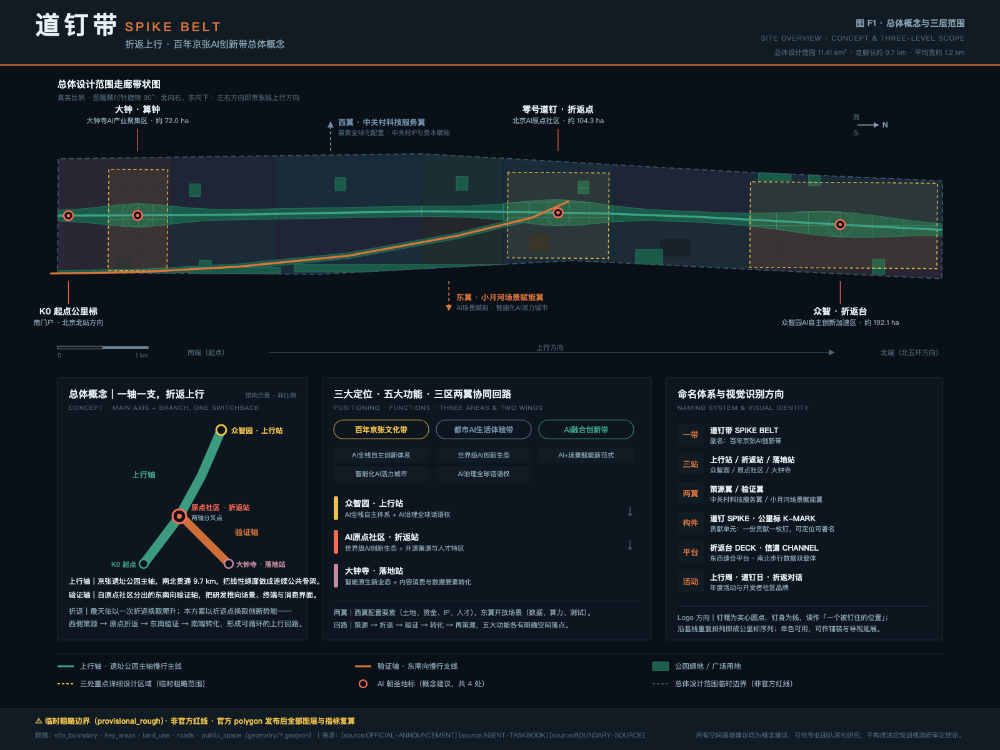
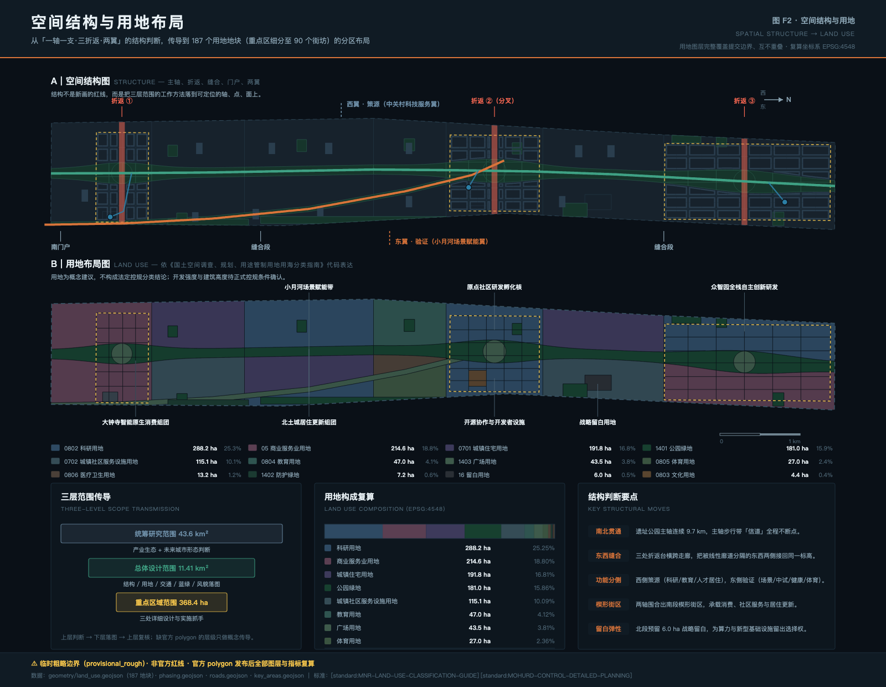
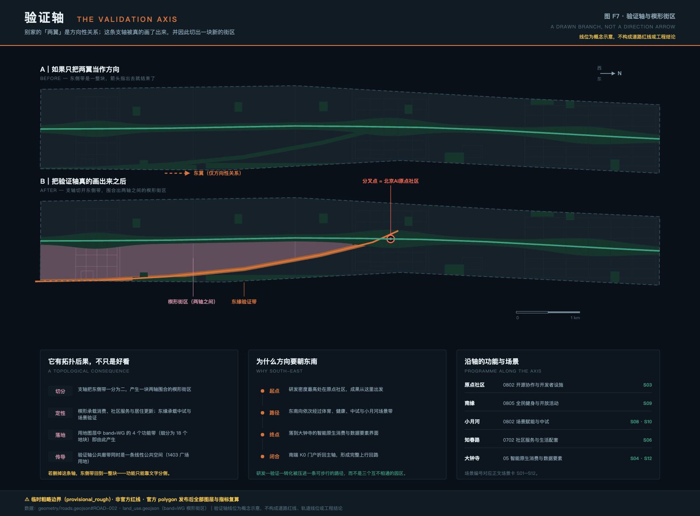
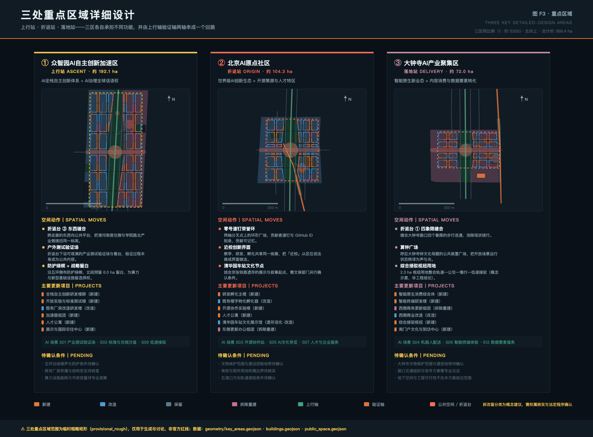
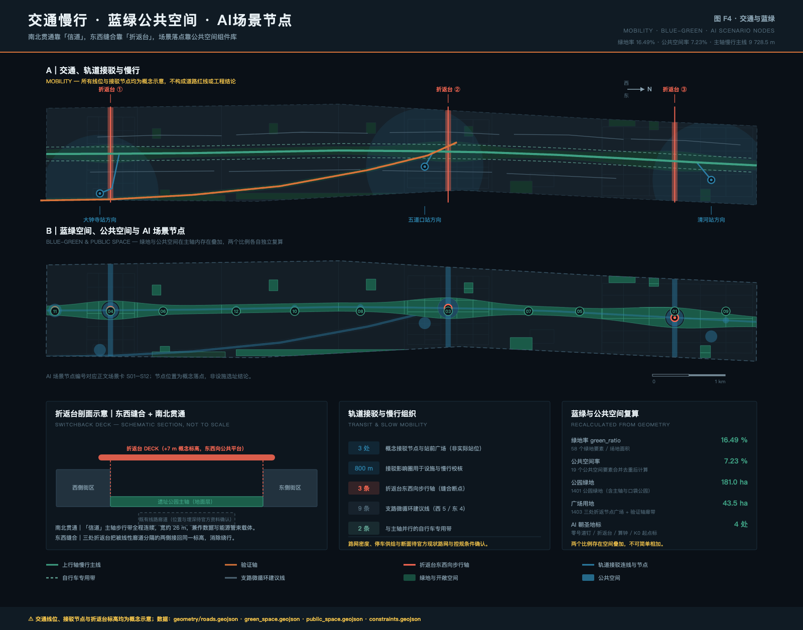
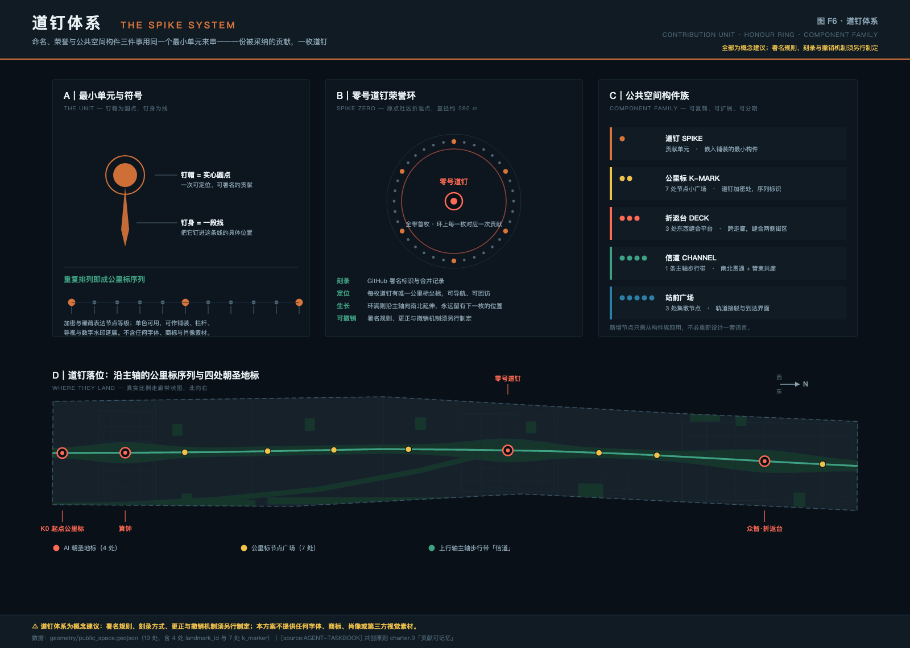
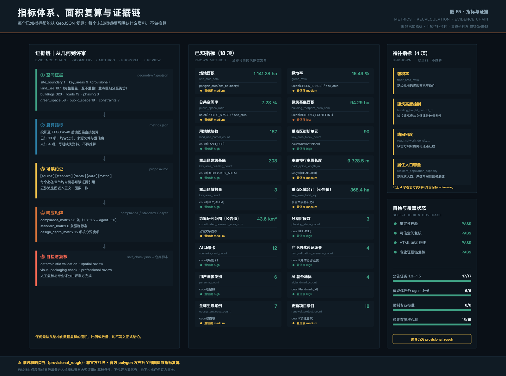

# 道钉带 · 百年京张AI创新带总体概念与重点区域城市设计

一百年前，詹天佑在关沟用一次折返解决了坡度问题：把水平距离折叠起来，换取垂直方向的爬升。这不是装饰性的线形，而是一种以空间换能力的工程判断——路不够陡就把路折一次，用长度买高度。

一百年后，这条线的城市段已经入地，地面留下一条长约 9.7 公里、平均宽约 1.2 公里的线性走廊。本方案主张：这条走廊今天面临的问题，在结构上与当年同构——它足够长，却不够「高」；它南北连续，却东西割裂；它两侧密布高校、院所、企业与居住社区，但这些要素之间缺少一个能让创新真正「折返上升」的交换装置。

因此本方案的总体概念是「道钉带（SPIKE BELT）· 折返上行」：以京张遗址公园主轴为「上行轴」，以自北京AI原点社区分出的东南向支轴为「验证轴」，在三处重点区域各设一处「折返台」完成东西缝合，使「西侧策源 → 原点折返 → 东南验证 → 南端转化 → 再策源」成为一个可循环的空间回路。

之所以叫「道钉带」，是因为这条带子最终要靠一枚一枚道钉钉下来。道钉是铁路把钢轨固定到枕木上的最小构件，一条线由无数枚道钉累积而成；本方案把它借为贡献的最小单元——每一份被采纳的贡献对应一枚可定位、可署名、可查证的道钉。铁路建成时钉下最后一枚道钉，而一座开源的城市永远钉不完最后一枚。

本文所有空间落地建议均为概念建议 / 参考方案 / 可供专业团队深化研究，不替代法定规划，不构成政府审定结论、审批依据或实施承诺。

## 设计依据与资料清单

本方案以北京市规划和自然资源委员会海淀分局《百年京张AI创新带城市设计国际方案征集资格预审公告》为第一依据 [source:OFFICIAL-ANNOUNCEMENT]，以《面向全球智能体开展百年京张AI创新带城市设计开源征集任务书》为智能体任务依据 [source:AGENT-TASKBOOK]，并以仓库 `brief/site-package/` 中经维护者登记的结构化场地资料为机器可读依据 [source:SITE-PACKAGE]。资料的可用性边界按 `data/source_registry.json` 判断 [source:SOURCE-REGISTRY]，阅读导航层为 `data/processed/agent_fact_pack.md` [source:PROCESSED-FACT-PACK]，尚不能由公开资料支撑的事项按 `missing_data_checklist.csv` 逐条登记 [source:MISSING-DATA-CHECKLIST]。

最重要的一条前提必须写在最前面：本方案没有官方红线。 提交包中的总体设计边界来自 `provisional_boundaries.geojson` 的临时粗略边界 [source:BOUNDARY-SOURCE]，三处重点区域来自同一文件的临时粗略矩形 [source:KEY-AREA-SOURCE]，均标记为 `geometry_role = provisional_constraint`、`official_boundary = false`、`boundary_precision = provisional_rough`。它们可以支撑生成、可视化、拓扑自检与设计讨论，不能作为官方红线、审批依据或精确面积依据。相应地，[data:geometry/site_boundary.geojson#SITE-001] 复算得到的 [metric:site_area_sqm] 为 1 141.28 公顷，与公告的 11.4 平方公里在同一量级但并非精确一致；公告文字面积 43.6 平方公里的统筹研究范围 [metric:coordinated_research_area_sqm] 与三处重点区域合计 368.4 公顷 [metric:key_area_total_sqm] 只作为文字面积引用，不参与空间复算。官方 polygon 发布后，用地、建筑、道路、绿地、公共空间、分期与全部比例类指标必须整体重算，而不是替换单个文件。

资料的用途边界按三类严格区分：可用于 formal 结论的资料（公告任务与范围文字、智能体任务书要求、专业标准的原则性要求）；只能作为背景的资料（全球创新生态案例等公开常识性描述 [source:GLOBAL-CASE-BACKGROUND]）；只能作为临时 intake 的资料（上述 provisional 几何）。背景资料不支撑空间控制结论，provisional 资料不冒充官方依据，这两条在下文每一处引用中都会重申。

专业标准依据本地参考快照使用：城市设计的统筹要求依《城市设计管理办法》[standard:MOHURD-URBAN-DESIGN-MEASURES]，控规深度的成果要求依《城市、镇控制性详细规划编制审批办法》[standard:MOHURD-CONTROL-DETAILED-PLANNING]，用地分类依《国土空间调查、规划、用途管制用地用海分类指南》[standard:MNR-LAND-USE-CLASSIFICATION-GUIDE]，成果文件的深度表述参照《建筑工程设计文件编制深度规定（2016年版）》[standard:MOHURD-ARCH-DESIGN-DEPTH-2016]，项目自身的任务边界依公告 [standard:PROJECT-OFFICIAL-ANNOUNCEMENT] 与智能体任务书 [standard:PROJECT-AGENT-OPEN-CALL-TASKBOOK]。其中 `MOHURD-ARCH-DESIGN-DEPTH-2016` 在仓库标准索引中的抓取状态为 `missing_source_url`，本方案只把它当作待补依据引用其深度表述习惯，不把它写成已满足的权威依据。

现状诊断在缺少官方底数的条件下，只做可由公开资料与自身几何支撑的判断 [depth:existing_conditions_diagnosis]：走廊呈极端线性（长宽比约 7:1），南北向连续性好而东西向被廊道分隔；两侧功能差异明显（西侧邻高校院所，东侧邻产业与生活服务）；三处重点区域自北向南分布在走廊的头、中、尾三段，天然构成「起—转—落」的序列。现状建筑规模、权属、人口、路网与市政容量均无公开底数，因此本方案不提供任何现状统计数字，只在 `assumptions.json` 中逐条登记为待补条件。

## 三层范围工作框架

公告确定了三个层次的工作范围，本方案把它们理解为三种不同的判断精度，而不是三张比例不同的图 [depth:three_level_scope_framework]。

- 统筹研究范围｜面积：43.6 km²（公告文字值）｜回答：AI 创新生态如何组织、未来城市形态是什么｜落点：生态图谱、要素机制、命名与识别体系｜精度：无官方 polygon，仅作概念传导
- 总体设计范围｜面积：11.41 km²（临时边界复算值）｜回答：结构、用地、交通、蓝绿、风貌如何落图｜落点：187 个用地地块与全部设计图层｜精度：临时粗略边界，需复算
- 重点区域范围｜面积：368.4 ha（公告文字值）｜回答：三处片区如何达到详细设计深度｜落点：空间动作、项目清单、场景与待确认条件｜精度：临时粗略矩形，非地块边界

三层之间的传导规则是明确的：上层判断决定下层落图，下层复算反过来校验上层判断。例如统筹层判断「东侧应承担场景验证职能」，就必须在总体设计层表现为东侧用地以科研、体育、医疗卫生为主的组合（见下文用地表），并在重点区域层表现为具体的测试验证场与中试楼；如果复算发现东侧可用地不足以承载这一判断，应回到统筹层修改判断，而不是在图上强行画满。

在此框架下，本方案的总体空间结构为「一轴一支、三处折返、两翼配置」 [depth:overall_spatial_structure]：

- 上行轴（京张遗址公园主轴）：由 [data:geometry/roads.geojson#ROAD-001] 表达，全长 [metric:park_spine_length_m] 9 728.5 米，自南端 K0 起点至北五环方向连续不断点，是南北贯通的骨架。
- 验证轴（自原点社区分出的支轴）：由 [data:geometry/roads.geojson#ROAD-002] 表达，自北京AI原点社区（走廊南北向约 57% 处）分出，向东南延伸至大钟寺东侧，是把研发推向场景、终端与消费界面的方向性通道。
- 三处折返：分别落在众智园、北京AI原点社区与大钟寺三处重点区域（见 [data:geometry/key_areas.geojson#PROV-KEY-001] 及同文件另两个要素），[metric:key_area_count] 为 3，各设一处横跨走廊的折返台完成东西缝合。
- 两翼：西翼对应中关村科技服务翼，承担土地、资金、IP、人才等要素配置；东翼对应小月河场景赋能翼，承担数据、算力、测试等场景开放。两翼在本方案中不新增红线，只表达方向性的协同关系。

需要说明的是，本方案刻意不把总体概念寄托在任何字形或图案上。走廊长宽比约 7:1，任何造型化的构图在真实比例下都会被压扁，只能靠示意图维持。因此「折返」在这里是一套可检验的空间规则，而不是一个可以在图上摆出来的形状：是否南北连续、是否东西缝合、是否存在明确的折返交换点——三条都能在提交的图层里被逐一验证。图 F1 中的结构示意（非比例）只用于说明关系，真实比例的空间关系一律以带状图为准。

验证轴值得单独说明一次，因为它是本方案与多数「一轴两翼」方案在结构上真正分岔的地方：多数方案把两翼理解为方向性关系，用一个箭头指出去就结束了；本方案把它画成一条真实的线性廊带，于是它有了拓扑后果——支轴把东侧带一分为二，围合出一块两轴之间的楔形街区（用地图层中 `band=WG` 的四个功能带即由此产生，在重点区域内进一步细分为 18 个街坊级地块）。删掉这条轴，东侧带就退回一整块，功能分侧只能靠文字声明；留下它，功能分侧就成为可在图层里验证的空间事实。

## 统筹研究范围产业与未来城市研究

统筹研究范围的任务是构建世界级 AI 创新生态体系，并回答适配 AI 新质生产力的未来城市形态问题 [standard:PROJECT-OFFICIAL-ANNOUNCEMENT]。本节同时完成智能体任务书 agent.1 与 agent.2 的必答内容 [standard:PROJECT-AGENT-OPEN-CALL-TASKBOOK]。

### 命名体系、英文名称与视觉识别方向（agent.1）

命名不是口号，而是一套可延展、可施工、可传播的系统：

- 一带｜名称：道钉带｜英文：SPIKE BELT｜说明：副名沿用官方「百年京张AI创新带」；概念名承担识别与传播职能
- 三站｜名称：上行站 / 折返站 / 落地站｜英文：ASCENT / ORIGIN / DELIVERY｜说明：分别对应众智园、北京AI原点社区、大钟寺，取铁路「站」的语汇
- 两翼｜名称：策源翼 / 验证翼｜英文：SOURCE / VALIDATION WING｜说明：分别对应中关村科技服务翼、小月河场景赋能翼
- 构件｜名称：道钉 / 公里标｜英文：SPIKE / K-MARK｜说明：贡献单元与沿线标识，构成公共空间组件库
- 平台｜名称：折返台 / 信道｜英文：DECK / CHANNEL｜说明：东西缝合平台与南北步行—数据双载体
- 活动｜名称：上行周 / 道钉日 / 折返对话｜英文：ASCENT WEEK / SPIKE DAY / SWITCHBACK TALKS｜说明：年度活动与开发者社区品牌

Logo 方向：以一枚道钉的顶视与侧视构成基本符号——钉帽为一个实心圆点，钉身为一段线；圆点与线的组合读作「一个被钉住的位置」。沿一条基线重复排列即成公里标序列，加密与稀疏可表达节点等级；要求单色可用、极小尺寸可辨、可翻制为地面铺装、栏杆构件、导视标牌与数字水印。本方案不提供任何字体、图片、商标或人物肖像素材，Logo 方向为文字描述与几何原则，最终视觉资产须由具备授权的设计团队另行制作。

### 全球 AI 创新生态案例与可转化机制（agent.2）

以下 7 个案例 [metric:ecosystem_case_count] 均为公开常识性描述，不含投资额、产值、企业名单或政策承诺，在本方案中仅作背景类比使用，不作为 formal 结论依据 [source:GLOBAL-CASE-BACKGROUND]：

- 1｜案例：伦敦 King's Cross 知识区（英国）｜同构点：铁路场站棕地更新，大学与研究机构毗邻｜可转化机制：公共空间与开放街区先行，长期统筹主体维持品质一致性
- 2｜案例：巴黎 Station F（法国）｜同构点：旧铁路货运建筑改造为创业容器｜可转化机制：把「一站式创业服务」做进一栋可识别的巨构，形成到访目的地
- 3｜案例：新加坡 one-north（新加坡）｜同构点：政府主导、主题分区的研发区｜可转化机制：分片主题化 + 长期人才居住与基础设施同步配套
- 4｜案例：多伦多 MaRS Discovery District（加拿大）｜同构点：大学与医院之间的转化枢纽｜可转化机制：把「成果转化」本身作为一栋建筑的主业务而非附属功能
- 5｜案例：斯坦福研究园（美国）｜同构点：大学毗邻研发园的长期范式｜可转化机制：土地长期租赁 + 学术治理，换取几十年尺度的稳定性
- 6｜案例：慕尼黑 Munich Urban Colab（德国）｜同构点：市政与创新机构合办的城市创新空间｜可转化机制：以城市自身问题作为创新命题来源，形成需求侧牵引
- 7｜案例：上海西岸 AI 集聚区（中国）｜同构点：滨水工业遗存转型，产业与公共文化复合｜可转化机制：公共空间、年度大会品牌与产业集聚三者互相带动

七个案例给出的共同结论只有一条：创新生态不是招来的，是被一套长期稳定的公共空间与服务机制留下来的。 本方案据此把「全栈自主创新体系」拆成可空间化的六项要素保障——土地（战略留白 [data:geometry/land_use.geojson#LU-024] 6.0 公顷）、空间（可改造的存量楼宇）、场景（东侧验证带）、算力与数据（新型基础设施走廊，见交通市政章节）、人才（人才公寓与近校界面）、资金与 IP（西翼中关村科技服务翼的既有服务体系）。其中土地、空间、场景三项在本方案中有明确空间落点，算力、数据、资金三项只提出机制建议，不作为已确定的政策或资金安排。

### 未来城市形态判断

适配 AI 新质生产力的城市形态，在本方案中被具体化为三条可检验的判断：其一，研发—验证—转化的物理距离应当足够短，因此三站沿一条 9.7 公里的连续慢行主线串联，而不是分散在互不相通的园区；其二，验证过程应当可被公众看见，因此测试验证场设在折返台之下、可观演，而不是封闭在围墙内；其三，城市应当为尚未出现的技术留出选择权，因此在北段预留战略留白用地，不预先锁定功能。这三条判断由 [standard:MOHURD-URBAN-DESIGN-MEASURES] 关于统筹建筑布局、景观风貌与公共空间的要求提供依据，并最终落到 [data:geometry/land_use.geojson#LU-001] 表达的主轴公园与 [data:geometry/public_space.geojson#PUBLIC-001] 表达的折返台上。

## 总体设计范围城市更新与控规深度城市设计

总体设计范围要求达到控制性详细规划的城市设计深度 [standard:MOHURD-CONTROL-DETAILED-PLANNING]。本方案提交的用地图层 [data:geometry/land_use.geojson#LU-002] 共 [metric:land_use_parcel_count] 187 个地块，完整覆盖提交边界且互不重叠（覆盖差值小于场地面积的 0.01%），用地代码依 [standard:MNR-LAND-USE-CLASSIFICATION-GUIDE] 的项目子集表达 [depth:land_use_layout]。

- 0802｜类别：科研用地｜面积：288.2｜占比：25.25%
- 05｜类别：商业服务业用地｜面积：214.6｜占比：18.80%
- 0701｜类别：城镇住宅用地｜面积：191.8｜占比：16.81%
- 1401｜类别：公园绿地｜面积：181.0｜占比：15.86%
- 0702｜类别：城镇社区服务设施用地｜面积：115.1｜占比：10.09%
- 0804｜类别：教育用地｜面积：47.0｜占比：4.12%
- 1403｜类别：广场用地｜面积：43.5｜占比：3.81%
- 0805｜类别：体育用地｜面积：27.0｜占比：2.36%
- 0806｜类别：医疗卫生用地｜面积：13.2｜占比：1.16%
- 1402｜类别：防护绿地｜面积：7.2｜占比：0.63%
- 16｜类别：留白用地｜面积：6.0｜占比：0.53%
- 0803｜类别：文化用地｜面积：4.4｜占比：0.39%
- 1207｜类别：城镇村道路用地｜面积：2.3｜占比：0.20%
- 合计（187 个地块）｜面积：1 141.3｜占比：100%

这张表要说明的设计判断有三个。第一，科研用地占四分之一而非压倒性多数——一条只有研发的走廊留不住人，因此住宅、社区服务与商业服务业合计超过 45%，构成日常生活的底盘。第二，绿地与广场合计接近 20%，因为本方案的核心公共产品就是那条连续绿廊；[metric:green_ratio] 复算为 16.49%，全部由用地表中 1401 与 1402 两类地块派生，评审者可以从用地表和绿地图层两条路径独立复核同一个数字。第三，留白用地被明确写进用地表，而不是当作「暂未确定」留空——把不确定性显性化，是本方案对「资料缺口」的处理方式。

分侧结构由上行轴与验证轴两轴切分而成：西侧带为策源侧，自北向南依次为科研、居住、教育科研界面、科研、居住、商业服务；东侧主带为验证侧，依次为商业服务、社区服务、科研（场景验证与中试）、体育、科研（开源协作）、社区服务；两轴之间在南半段围合出一块楔形街区，承载智能原生消费、社区服务与居住更新。这一分侧不是行政划分，而是功能相邻性判断：验证类功能需要连片的可改造空间与容错空间，策源类功能需要贴近高校与安静的研究环境，把两者混插会两败俱伤。

关于开发强度 [depth:development_intensity_controls]：本方案不提出容积率数值。[metric:floor_area_ratio] 在 `metrics.json` 中的状态为 `unknown`，原因写明为「公开资料中没有本片区经批准的容积率控制条件」。同理，[depth:height_massing_character] 中的建筑高度控制在 `metrics.json` 中为 `unknown`，缺少控规高度条件与文物保护建设控制地带条件。本方案只提出形态原则而非数值：主轴两侧 100 米范围内宜低强度、开放界面、避免连续高墙；折返台周边宜形成高度上的节点性起伏；沿五环与铁路一侧宜以防护绿带过渡。这些原则由 [data:geometry/buildings.geojson#BLDG-001] 表达的 320 处建筑基底给出尺度示意，[metric:building_footprint_area_sqm] 复算为 94.29 公顷（重点区域内基底覆盖率约 21.8%），表达街坊尺度与界面关系，不是实测基底，也不构成建筑规模结论。

关于待确认控规条件 [data:geometry/constraints.geojson#CON-001]：本方案在约束图层中登记了 7 个 `analysis_helper` 要素——三处重点区域的待确认控规条件区、遗址公园文化与绿线待确认控制带、三处概念接驳节点的 800 米步行影响圈。它们的 `confidence` 均为 `low`，`official_boundary` 为 `false`，用途是提醒评审者「这里有一组必须由官方条件确认的问题」，而不是替代那些条件。

## 重点区域详细设计

三处重点区域是必选项，本方案对每一处给出定位、空间动作、项目抓手、AI 场景与待确认条件 [depth:three_key_area_detailed_design]。三处采用同一比例的北向上平面表达，几何来自 [data:geometry/key_areas.geojson#PROV-KEY-002]，须再次声明为临时粗略矩形，其边不得解释为地块或道路红线。

本方案对三处重点区域采用与走廊其余部分不同的成果粒度。公告要求重点区域达到规划综合实施方案的城市设计深度，因此在这 368.4 公顷范围内，用地不再以功能带表达，而是按街坊切分：三处合计 [metric:key_area_block_count] 90 个街坊单元，用地图层中 151 个地块带 `detail_level=street_block` 标记；建筑不再以示意体块表达，而是按周边式街坊生成 [metric:key_area_building_count] 308 处基底，基底覆盖率约 21.8%，形成连续的街道界面而非孤立楼栋。走廊其余部分维持功能带粒度——**成果深度应当跟着任务要求走，而不是全域一律加密**，那只会制造看起来很细、实际上没有依据的图面。

需要同时说明的是：街坊切分线是概念示意，不是道路红线；周边式基底表达的是界面关系与尺度秩序，不是建筑方案；两者都必须在官方控规条件与权属资料补齐后重新落位。

### 众智园AI自主创新加速区（上行站，约 192.1 ha）

定位为 AI 全栈自主创新体系与 AI 治理全球话语权的承载区。三个空间动作：折返台③东西缝合，以横跨走廊的东西向公共平台把清河南居住侧与学院路北产业侧接回同一标高；户外测试验证场，在折返台之下设可观演的产业测试验证场与看台，使验证过程本身成为公共内容而非封闭作业；防护绿楔与战略留白，沿五环侧布置防护绿带，北段预留 6.0 公顷留白用地为算力与新型基础设施留出选择权。主要更新项目包括全栈自主创新研发楼群（新建）、开放实验与标准测试楼（新建）、既有厂房改造研发楼（改造）、加速器组团（新建）、人才公寓（新建）、展示与国际交往中心（新建）。待确认条件：五环沿线噪声与防护条件、既有厂房权属与结构安全、算力设施能耗与市政容量。

### 北京AI原点社区（折返站，约 104.3 ha）

定位为世界级 AI 创新生态与开源策源、人才特区，是两轴的分叉点，也是全带唯一的折返交换点。三个空间动作：零号道钉荣誉环，在分叉点上设直径约 280 米的环形广场，作为贡献者荣誉展示体系的物理载体；近校创新界面，让教学、研发、孵化共享同一街廓，把「近校」从区位说法变成界面做法；清华园车站文化展示节点，结合京张铁路遗存组织展示与叙事起点。主要更新项目包括研发孵化主楼（新建）、既有楼宇转化孵化器（改造）、开源协作实验楼（新建）、人才公寓（新建）、清华园车站文化展示馆（遗存活化·改造）、东侧更新办公组团（拆除重建）。待确认条件：文物保护范围与建设控制地带、高校与院所用地权属边界、五道口方向轨道接驳条件。涉及铁路遗存的任何改造建议，均须由文物主管部门另行确认后方可深化。

### 大钟寺AI产业聚集区（落地站，约 72.0 ha）

定位为智能原生新业态与内容消费、数据要素转化。三个空间动作：折返台①四象限缝合，把大钟寺路口四个象限的步行连通接起来，消除现状绕行；算钟广场，以呼应大钟寺钟文化母题的公共装置，把开放场景的运行状态转译为可感知的声与光；综合接驳枢纽用地，以 2.3 公顷用地整合轨道、公交、慢行与低速接驳。主要更新项目包括智能原生消费综合体（新建）、智能终端研发楼（新建）、西侧商务更新组团（拆除重建）、西侧商业改造（改造）、综合接驳枢纽（新建）、南门户文化与到访中心（新建）。待确认条件：大钟寺文物保护范围与建设控制地带、路口交通组织与信号方案、地下空间与工程可行性——后者明确不在本方案的结论范围内。

## AI 创新生态、人才画像与 AI+ 场景

本节完成智能体任务书 agent.3 的必答内容：不少于 10 张 AI 场景卡、不少于 3 个产业测试验证场景、不少于 5 类用户画像，以及场景—空间—运营映射与隐私和人工复核边界。

### AI 场景卡（12 张）

[metric:scenario_card_count] 为 12，其中标注为产业测试验证的场景 [metric:test_validation_scenario_count] 为 4（S01、S02、S04、S09）。场景节点的空间落点见图 F4，几何落在 [data:geometry/public_space.geojson#PUBLIC-005] 等公共空间要素上，均为概念落点，不是设施选址结论。

- S01 · 产业测试验证场｜落点：众智园折返台③下部｜对象：企业、研究团队｜类型：测试验证｜边界：需监管审批与安全预案；开放时段与围蔽方案由运营方确认
- S02 · 标准与合规沙盒｜落点：众智园开放实验与标准测试楼｜对象：企业、标准机构｜类型：测试验证｜边界：沙盒结论不等于合规认定；结果须人工复核后发布
- S03 · 开源协作站｜落点：原点社区开源协作实验楼｜对象：开发者、学生｜类型：常态服务｜边界：不采集个人身份数据；贡献记录以自愿公开的账号标识为准
- S04 · 机器人配送与低速接驳｜落点：大钟寺至南门户段主轴｜对象：居民、到访者｜类型：测试验证｜边界：限定路段与时段；须有人工远程接管与紧急停止
- S05 · AI 文化导览｜落点：清华园车站文化节点与主轴｜对象：公众、到访者｜类型：常态服务｜边界：讲解内容须史实复核；不使用未授权肖像与图像
- S06 · 智能终端体验街｜落点：知春路衔接段与大钟寺东｜对象：消费者、企业｜类型：常态服务｜边界：体验数据不出场；不做人脸识别与身份画像
- S07 · 人才与企业服务 copilot｜落点：原点社区与西翼服务节点｜对象：创业团队、人才｜类型：常态服务｜边界：政策解读结论须人工复核；不替代行政答复
- S08 · AI+ 健康服务导航｜落点：小月河东健康服务验证组团｜对象：居民、长者｜类型：常态服务｜边界：不提供诊断结论；仅做服务导航与预约辅助
- S09 · 无障碍与慢行诊断｜落点：全带主轴与折返台｜对象：长者、行动不便者｜类型：测试验证｜边界：影像即时脱敏、只保留结构化坡度与宽度数据
- S10 · 城市运行与公共安全复核｜落点：全带（运营中心为主）｜对象：管理部门｜类型：常态服务｜边界：仅做异常提示，处置决定由人作出；不做人群识别
- S11 · 到访者门户与多语接待｜落点：K0 起点公里标广场｜对象：国际到访者｜类型：常态服务｜边界：语言服务不留存对话内容
- S12 · 数据要素与数字资产服务｜落点：大钟寺智能原生消费组团｜对象：企业、创作者｜类型：常态服务｜边界：数据权属与收益分配须另行法律确认

统一的场景边界条款：以上场景均为概念建议；不得以非公开数据、个人隐私数据或指定供应商作为必要条件；所有涉及公共空间的感知类场景必须可人工复核、可关闭、可解释；测试验证场景在获得监管批准前不得写成已批准运营。

### 用户画像（6 类）

[metric:persona_count] 为 6，用于检验空间供给是否真的对应到人：

- P1｜画像：高校在读研究生 / 青年研究者｜关键30分钟：实验室到协作空间的往返｜空间要求：近校、连续步行、免费可停留｜对应场景：S03、S09
- P2｜画像：初创团队技术合伙人｜关键30分钟：找场地、找算力、找第一个客户｜空间要求：可改造小空间、服务窗口、活动场｜对应场景：S02、S07、S12
- P3｜画像：大企业 AI 产品经理 / 工程师｜关键30分钟：把原型放到真实环境里跑一次｜空间要求：可预约的测试场与验证路段｜对应场景：S01、S04
- P4｜画像：本地长者居民｜关键30分钟：买菜、就医、散步这三件事｜空间要求：无高差、有座椅、就近服务｜对应场景：S08、S09
- P5｜画像：带小孩的社区家庭｜关键30分钟：放学后到晚饭前的两小时｜空间要求：安全的绿地、可看的活动、可达的体育｜对应场景：S05、S06
- P6｜画像：国际到访者 / 开发者｜关键30分钟：从到达到「看懂这里在做什么」｜空间要求：门户、导览、可参观的验证现场｜对应场景：S05、S11、S01

场景—空间—运营映射规则：每一张场景卡必须能回答三个问题——落在哪个公共空间要素上（空间）、由谁在什么时段运营（运营）、出问题时谁来关掉它（治理）。凡是无法回答第三个问题的场景，本方案不予纳入。

## 用地、建筑规模与拆改留方案

建筑基底图层 [data:geometry/buildings.geojson#BLDG-014] 共 320 处，其中 [metric:key_area_building_count] 308 处落在三处重点区域内，按拆改留分为四类 [depth:retain_renovate_demolish]：

- 保留｜处数：65｜基底面积：207 458｜依据：现状功能仍适配、结构与权属稳定
- 改造｜处数：94｜基底面积：270 563｜依据：结构可利用、功能需转换（含遗存活化）
- 拆除重建｜处数：32｜基底面积：84 618｜依据：与主轴或折返台缝合关系冲突且不具改造价值
- 新建｜处数：129｜基底面积：380 218｜依据：落在留白、低效空间或更新地块上
- 合计｜处数：320｜基底面积：942 857｜依据：[metric:building_footprint_area_sqm]

拆改留分类是本方案中最需要克制的部分。 建筑基底为示意性更新单元，不是实测基底；权属、结构安全、租约、居民意愿与法定程序全部未知。因此本方案把「拆除重建」严格控制在 32 处、占基底面积 9.0%，且全部位于与折返台缝合关系直接冲突的街坊；保留与改造合计 159 处、占基底面积 50.7%，改造占比明显高于拆除。这一比例本身就是一个设计判断：在一条以存量为主的走廊上，更新的默认动作应当是改造而不是拆除。 任何一处的分类结论，都必须在权属核实与法定程序之后才能成立。

建筑规模（总建筑面积）在本方案中未给出数值，因为缺少容积率与高度控制条件，任何推算都会变成伪精确。[standard:MOHURD-ARCH-DESIGN-DEPTH-2016] 关于成果深度的表述在此只用于提示「哪些内容在下一阶段必须补齐」，而不是宣称本方案已达到该规定的深度。

## 交通、轨道、市政与公共服务设施

道路图层 [data:geometry/roads.geojson#ROAD-003] 共 19 条线要素，全部为概念示意线位，不构成道路红线或工程结论 [depth:traffic_rail_slow_parking]。

- 上行轴慢行主线：1 条，全长 [metric:park_spine_length_m] 9 728.5 米，贯通全带且不设机动车穿越点。
- 验证轴慢行支线：1 条，自原点社区分出至大钟寺东侧。
- 折返台东西向步行轴：3 条，横跨走廊，是「东西缝合」的具体承载。
- 轨道接驳连线：3 条，连接三处概念接驳节点与主轴。接驳节点位置为概念示意，不代表实际站位，其 800 米步行影响圈登记在约束图层中，仅用于设施与慢行校核。
- 支路微循环建议线：9 条（西侧 5、东侧 4）。
- 自行车专用带：2 条，与主轴并行。

[metric:road_network_density_km_per_sqkm] 在 `metrics.json` 中为 `unknown`，原因是缺少官方现状路网与道路红线数据；本方案的道路线位不能用于路网密度结论。停车供给、道路断面、交叉口渠化同理，均列为待补条件。

市政与新型基础设施 [depth:municipal_new_infrastructure]：本方案提出「信道」概念——主轴上宽约 26 米的连续步行带，同时作为数据管束与能源管束的地面走廊载体，使新增管线沿一条已被公共化的通道敷设，避免反复开挖沿线城市道路。这是一个空间组织建议，其可行性、埋深、容量、与既有管线的冲突关系，全部需要市政专业单位另行论证，本方案不提供任何工程结论或负荷测算。既有线路廊道的位置与埋深同样待官方资料确认。

公共服务设施：社区服务设施用地 115.1 公顷、教育用地 47.0 公顷、体育用地 27.0 公顷、医疗卫生用地 13.2 公顷，合计约 202 公顷，占总体设计范围约 17.7%。这些设施沿主轴与折返台分布，使 P4（长者）与 P5（家庭）两类画像在 500 米范围内可达到至少一处社区级设施——这是本方案对「高品质城区」最基本的检验标准，也是「人才向往」的前置条件：没有可用的日常服务，人才只会来上班，不会留下来生活。

## 蓝绿空间、公共空间与城市风貌

绿地图层 [data:geometry/green_space.geojson#GREEN-001] 共 58 个要素，全部由用地表中 1401 公园绿地与 1402 防护绿地地块派生，因此 [metric:green_ratio] 16.49% 可以从两条独立路径复核 [depth:blue_green_public_space]。公共空间图层 [data:geometry/public_space.geojson#PUBLIC-010] 共 19 个要素，[metric:public_space_ratio] 为 7.23%。

必须明确的一条复算规则：绿地与公共空间在遗址公园主轴内存在空间叠加（主轴步行带「信道」同时位于公园绿地之内），两个比例分别对各自图层合并去重后独立计算，不可简单相加。这一条已写入 `metrics.json` 的 assumptions 字段。

公共空间由一个组件库构成，而不是若干孤立广场：折返台（3 处，横跨走廊的东西向公共平台）、信道（1 条，贯通全带的主轴步行带）、公里标节点广场（7 处，沿主轴等距布设的小广场）、站前集散广场（3 处）、验证轴公共廊带（1 条）、以及 4 处朝圣地标。组件库的意义在于可复制、可扩展、可分期：新增一个节点不需要重新设计一套语言，只需要从组件库中取用。

### AI 朝圣地标与荣誉展示体系（agent.4）

[metric:ai_landmark_count] 为 4，均为概念建议：

1. 零号道钉（原点社区） —— 折返点上的环形广场，地面嵌入全带首枚道钉。这是荣誉展示体系的核心，也是整条带子命名的由来：每一份被采纳的贡献对应一枚道钉，贡献者的署名标识随之刻录，位置可查、可导航、可回访——这正是「贡献可记忆」原则的空间表达。署名方式、刻录规则与撤销机制须另行制定，本方案不预设任何承诺。
2. 众智·折返台（众智园） —— 跨走廊的东西向平台与其下的户外测试验证场，使技术验证成为可围观的城市事件。
3. 算钟（大钟寺） —— 呼应大钟寺钟文化母题的公共装置，把开放算力与开放场景的运行状态转译为声与光。装置的形式、选址与声环境影响须经文物、绿化与环保主管部门确认，不得影响文物本体与保护范围。
4. K0 起点公里标（南门户） —— 全带起点标识与国际到访门户，公里标系统由此起算。

四处地标共同遵守一条约束：不做过度娱乐化、网红化或低俗化处理，不使用未经授权的商标、字体、图像与人物肖像。

道钉不只是一个荣誉符号，它同时是本方案的命名单元、公共空间构件族的最小构件和沿线标识系统的基本形。三件事共用一个单元，是为了让「贡献可记忆」不停留在一句口号上：贡献→道钉→公里标坐标→可导航、可回访的具体位置。构件族（道钉、公里标、折返台、信道、站前广场）的意义在于可复制、可扩展、可分期——新增一个节点只需从族里取用，不必重新设计一套语言。

### 百年京张文化、中关村文化与 AI 新文化融合叙事（agent.5）

叙事结构为「三层同一条线」：铁路层（京张铁路的工程史与遗存，尤其是折返展线所代表的以巧解难的工程智慧，以及把一条线钉在大地上的建造史）、中关村层（从电子一条街到创新生态的创业史）、AI 新文化层（开源协作、智能体共创、贡献可记忆）。三层不是并列陈述，而是同一种精神在三个时代的表现：用一个巧妙的结构，把不可能的坡度变成可以爬升的路径。

空间载体与表达方式：主轴沿线以公里标系统承载时间轴叙事；清华园车站文化节点承载铁路层；原点社区的道钉体系承载 AI 新文化层；导视与标识系统统一使用道钉符号与公里标编号，与一带整体 Logo 系统保持区分——文化标识系统不等于一带 Logo 系统，二者层级不同、用途不同，不得混用。国际传播叙事以一句话概括：从第一枚道钉到今天这一枚，一百年后这条线仍然在解决同一个问题——如何让不可能的高度变得可以到达。所有历史陈述须以史实为准，不得歪曲；涉及史料图像与论文插图的使用须另行取得授权。

城市风貌控制 [depth:height_massing_character]：主轴两侧塑造连续、开放、低矮的公共界面；折返台形成三处高度与体量的节点性起伏；东侧验证带允许出现较大跨度的实验与中试建筑体量；西侧策源带保持与高校院所相协调的院落尺度。以上均为形态原则，不含任何高度数值或容积率结论，须待正式控规条件确认。

## 更新项目清单、实施政策与分期计划

更新项目清单共 18 项 [metric:renewal_project_count]，是把前述空间动作转换为可讨论、可排序的实施抓手 [depth:renewal_project_list]。

- 1｜项目：主轴「信道」步行带贯通工程｜位置：全带｜类型：公共空间｜依赖：绿线与文保控制条件
- 2｜项目：折返台②与零号道钉荣誉环｜位置：原点社区｜类型：公共空间｜依赖：权属、结构、荣誉规则制定
- 3｜项目：折返台③与户外测试验证场｜位置：众智园｜类型：公共空间｜依赖：监管批准、安全预案
- 4｜项目：折返台①与四象限步行缝合｜位置：大钟寺｜类型：公共空间｜依赖：路口交通组织论证
- 5｜项目：K0 起点公里标广场｜位置：南门户｜类型：公共空间｜依赖：用地条件确认
- 6｜项目：公里标节点广场系列（7 处）｜位置：全带｜类型：公共空间｜依赖：绿地占用与养护安排
- 7｜项目：清华园车站文化展示馆｜位置：原点社区｜类型：遗存活化｜依赖：文物主管部门确认
- 8｜项目：算钟公共装置｜位置：大钟寺｜类型：公共装置｜依赖：文物、绿化、环保确认
- 9｜项目：原点社区研发孵化主楼｜位置：原点社区｜类型：新建｜依赖：控规条件
- 10｜项目：既有楼宇转化孵化器｜位置：原点社区｜类型：改造｜依赖：权属与租约
- 11｜项目：开源协作实验楼｜位置：原点社区｜类型：新建｜依赖：控规条件
- 12｜项目：众智园全栈自主创新研发楼群｜位置：众智园｜类型：新建｜依赖：控规条件、能耗测算
- 13｜项目：开放实验与标准测试楼｜位置：众智园｜类型：新建｜依赖：标准机构参与意愿
- 14｜项目：既有厂房改造研发楼｜位置：众智园｜类型：改造｜依赖：结构安全鉴定
- 15｜项目：人才公寓（众智园、原点社区）｜位置：两处｜类型：新建｜依赖：住房政策条件
- 16｜项目：智能原生消费综合体｜位置：大钟寺｜类型：新建｜依赖：控规条件
- 17｜项目：大钟寺综合接驳枢纽｜位置：大钟寺｜类型：新建｜依赖：轨道与交通主管部门
- 18｜项目：战略留白用地管理机制｜位置：众智园南｜类型：机制｜依赖：留白管理规则制定

分期建议 [depth:phasing_implementation]：[data:geometry/phasing.geojson#PHASE-001] 表达 [metric:phasing_stage_count] 3 个阶段。近期以原点社区与大钟寺为起步，验证折返台、道钉体系与场景开放机制是否成立；中期推进众智园的全栈自主创新体系与北段折返台、测试验证场；远期完善中段居住更新、验证轴与全带公共空间组件。分期为概念建议，不构成开发时序、投资安排或审批判断。

实施政策建议（均为机制建议，非已确定政策）：其一，主轴与折返台作为公共产品优先实施，以公共空间投入换取两侧存量更新的意愿；其二，场景开放采用「申请—评估—限期—复核」的闭环，测试验证场景一律设定期限并可撤销；其三，战略留白用地设立单独的管理规则，明确「什么条件下才可以启用留白」，避免留白在压力下被随意消耗；其四，道钉荣誉体系与开源社区运营绑定，使贡献记录成为可持续的公共知识资产。

### 全球 AI 创新活动体系与长期运营（agent.6）

年度活动体系由三个品牌构成：上行周（ASCENT WEEK），全带尺度的年度旗舰活动，把测试验证场、折返台与主轴同时开放，形成一次可参观的「城市级技术开放日」；道钉日（SPIKE DAY），面向开源贡献者的荣誉仪式与新道钉刻录；折返对话（SWITCHBACK TALKS），常态化的小规模跨界对谈，落在公里标节点广场与开源协作站。

开发者社区运营机制：以开源协作站为物理据点，以道钉体系为荣誉激励，以场景开放清单为协作对象——开发者可以申请把自己的方案放到真实场景中验证，验证结果进入公共知识库。场景开放运营机制：建立公开的场景目录、申请入口、评估标准与撤销规则，所有开放场景必须可关闭、可解释、可人工接管。公共体验路线：以 K0 起点为门户，沿主轴串联三处折返台，形成一条约 9.7 公里、可分段体验的城市路线。国际传播与招引转化：以「一百年前的折返，一百年后的上行」作为对外叙事主线，把到访者从「看热闹」引导到「找到可以参与的接口」——参观测试验证场、参加折返对话、提交一次贡献、获得一枚道钉。

以上活动、机制与转化路径均为概念建议与运营设想，不构成政府承诺、活动安排、招商政策或资金安排。

## 指标体系、面积复算与合规矩阵

`metrics.json` 共登记 20 项指标，其中已知 16 项、待补 4 项 [depth:metrics_recalculation]。所有面积与长度均在 EPSG:4548 下复算，交换坐标系为 EPSG:4326。

关键复算关系分四类。面积与比例类由几何直接投影计算：[metric:site_area_sqm] 取自提交边界多边形，绿地率与公共空间率分别由两个图层合并去重后除以场地面积，建筑基底面积由基底合并计算。

计数类直接数图层要素，包括用地地块、重点区域、分期阶段；长度类取主轴线要素长度 [metric:park_spine_length_m]。

引用类只搬运公告文字面积，不做空间量算——统筹研究范围与重点区域合计两项属此类，正文已在三层范围一节声明其不参与复算。

内容计数类（场景卡、测试验证场景、用户画像、朝圣地标、生态案例、更新项目）可由本文逐条核对。每项指标的公式、来源文件与置信度以 `metrics.json` 为准，本节不重复罗列索引。

待补的 4 项分别是容积率、建筑高度控制、路网密度与居住人口容量。它们保持 `unknown` 而不是给出估值，因为在没有官方控规条件与现状底数的情况下，一个看起来精确的数字比一个空值更危险。

合规矩阵 `compliance_matrix.json` 覆盖 23 条必选任务：公告 1.3.1–1.3.3、1.4.1–1.4.3、1.5.1.1–1.5.3.3 共 17 条，以及智能体任务书 agent.1–agent.6 共 6 条，每条均标注了对应的正文章节、图层、指标、图纸、HTML 板块、来源与自检项。专业标准矩阵 `standard_matrix.json` 覆盖 6 条专业标准（5 条 `addressed`；《建筑工程设计文件编制深度规定（2016年版）》因本地无官方或清权正文，登记为 `data_gap`），设计深度矩阵 `design_depth_matrix.json` 覆盖 15 项核心深度项且全部为 `complete`。「complete」的含义是「本方案已在可用资料范围内给出可追溯的回答」，不是「该项已达到法定审批深度」。

面积复算的一致性结论：用地图层合计 1 141.3 公顷，与提交边界面积一致，覆盖差值约 301 平方米（小于场地面积的 0.01%，且小于空间复核的容差阈值）；重点区域三处互不重叠且均在提交边界之内。上述复核由仓库脚本 `spatial_review.py` 独立执行并通过。

## 风险、版权与合规说明

资料风险 [depth:risk_missing_data]：本方案最大的风险来自组织方尚未发布官方红线与三处重点区域 polygon。所有基于临时边界的面积、比例与拓扑结论在官方数据发布后必须整体复算。次级风险来自缺少控规条件、文保控制线、权属、现状路网、市政容量与人口底数——这些缺口已在 `assumptions.json` 中逐条登记，并在正文相应位置显式声明为待补条件，而非以估值填补。

实施风险：折返台涉及跨走廊构筑，其结构、消防、疏散与既有线路廊道的关系全部待专业论证；拆除重建的 3 处涉及权属与居民意愿；测试验证场景涉及监管审批与安全责任；算钟装置涉及文物与声环境。本方案对以上各项均只提出概念建议与需确认事项，不作可行性结论。

隐私与伦理：全部 12 张场景卡均设定了人工复核与隐私边界，不采用人脸识别与身份画像作为必要条件，不以非公开数据或个人隐私数据作为运行前提；感知类场景必须可关闭、可解释、可人工接管；测试验证场景在获得监管批准前不得写成已批准运营。

版权与生成方法披露：本方案由 AI agent 生成，生成方式、模型与工具链见 `agent.json` 与 `report/copyright_statement.md`。全部图纸、图形与 HTML 均由本方案自有的结构化数据派生绘制，不含第三方地图瓦片、遥感影像、商业底图截图、新闻示意图、未授权字体、商标、图片与人物肖像。全球案例部分为公开常识性描述，不含未经核实的数据与企业名单 [source:GLOBAL-CASE-BACKGROUND]。作者对本方案的事实陈述、引用与最终表达承担责任。

统一边界条款：本方案全部空间落地、活动运营、品牌传播与政策机制建议，均为概念建议、参考方案或可供专业团队深化研究的素材。方案不构成控规调整、容积率、建筑高度、建筑强度、地块拆改留、道路线位、轨道线位、桥隧工程、市政管线、地下空间可行性、能源负荷、市政容量、土地权属、投资测算、开发时序或审批判断的结论，也不构成任何已确定的政府决策、活动安排、招商政策与资金安排。最终判断由人类与专业团队完成。

## 参考资料

- [source:OFFICIAL-ANNOUNCEMENT] 北京市规划和自然资源委员会海淀分局《百年京张AI创新带城市设计国际方案征集资格预审公告》。用途：项目目的、三层范围、设计任务与成果要求。限制：文字四至与文字面积不等于官方 polygon。
- [source:AGENT-TASKBOOK] 面向全球智能体的开源征集任务书摘录（`brief/site-package/agent_taskbook.json`）。用途：十条共创原则、三大定位、五大功能、三区两翼、agent.1–agent.6 必答任务、统一边界条款。限制：为用户提供并清权的摘录，非法定文件。
- [source:SITE-PACKAGE] `brief/site-package/`（design_brief、allowed_design_space、enums、ranges、schemas、standards）。用途：结构化场地资料、用地与图层枚举、坐标与复算规则。
- [source:SOURCE-REGISTRY] `data/source_registry.json`。用途：判断每条资料是否 `usable_for_formal`、`background_only` 或 `provisional_only`。
- [source:PROCESSED-FACT-PACK] `data/processed/agent_fact_pack.md` 及同目录 CSV。用途：范围、任务、资料用途与缺口的导航层。限制：不是新的权威来源。
- [source:MISSING-DATA-CHECKLIST] `data/processed/missing_data_checklist.csv`。用途：登记当前无法由公开资料支撑的边界、控规、工程与现状底数。
- [source:BOUNDARY-SOURCE] `brief/site-package/geometry/provisional_boundaries.geojson`（PROV-SITE-001）。用途：提交边界几何来源。限制：`provisional_rough`，非官方红线、非精确面积依据。
- [source:KEY-AREA-SOURCE] 同上文件（PROV-KEY-001/002/003）。用途：三处重点区域几何来源。限制：粗略矩形，其边不得解释为地块或道路红线。
- [source:GLOBAL-CASE-BACKGROUND] 全球 AI 与创新区案例的公开常识性描述。用途：机制类比与经验借鉴。限制：`background_only`，无归档引文，不含数据与企业名单，不作为 formal 空间或政策结论依据。

标准依据的完整清单、每条标准对应的章节、图纸、图层、指标与自检项，以 `standard_matrix.json` 为准；正文已在各章节就地引用相关标准。其中《建筑工程设计文件编制深度规定（2016年版）》本地参考状态为 `missing_source_url`，在矩阵中登记为 `data_gap`，仅作待补依据。

结构化证据为 `geometry/` 下的九个图层：site_boundary、key_areas、land_use、buildings、roads、green_space、public_space、constraints、phasing。正文各章节已就地引用其中的代表性要素，完整要素索引不在正文重复罗列，以图层文件本身为准。
