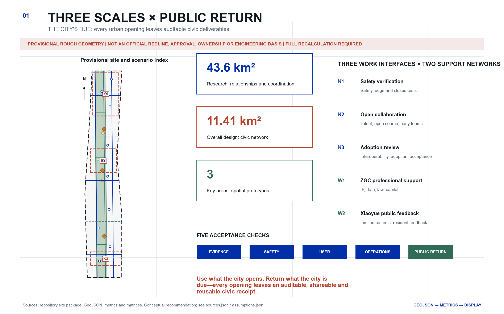
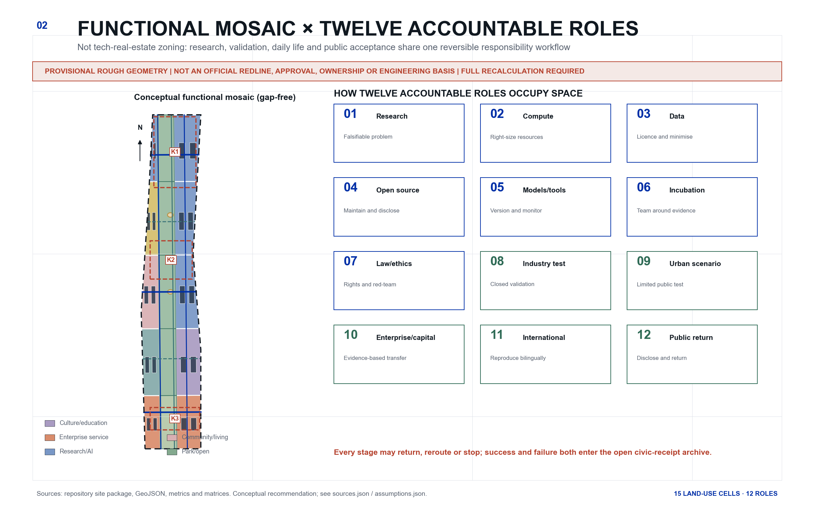
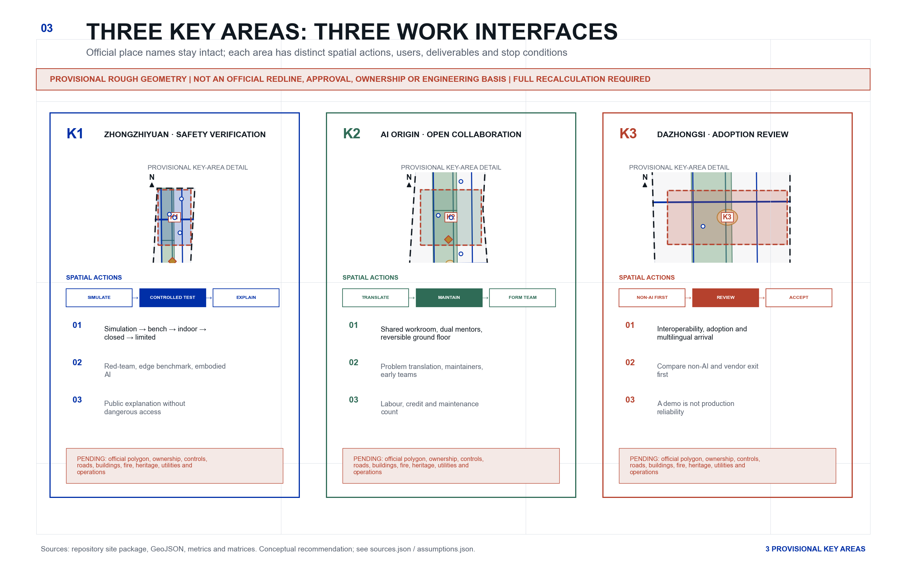
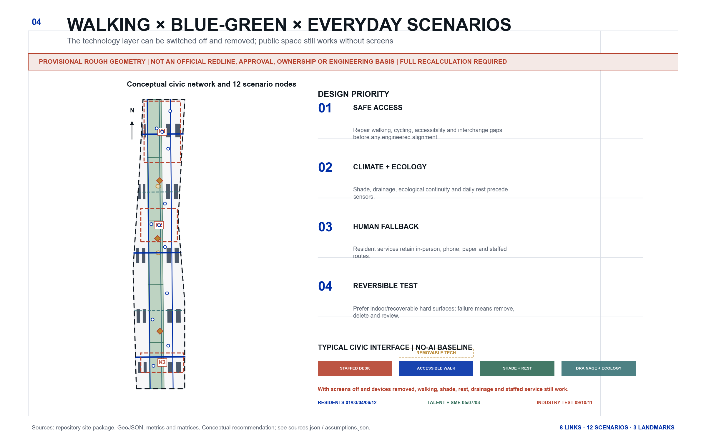
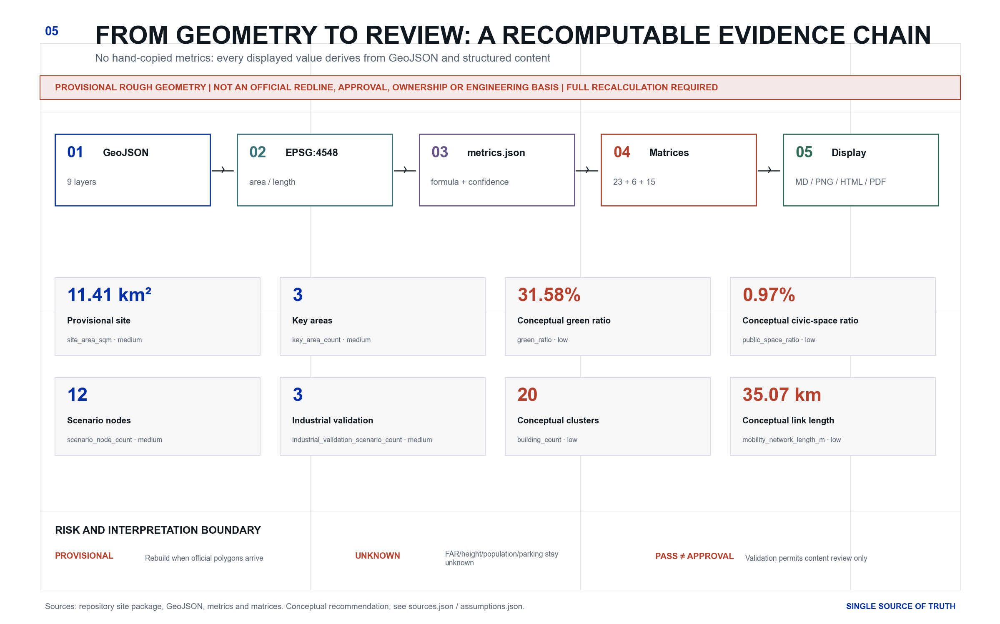

# JING-ZHANG · THE CITY'S DUE: An Auditable Civic-Return Design for the Centennial Jing-Zhang AI Innovation Belt

> **Use what the city opens. Return what the city is due—every opening leaves an auditable, shareable and reusable civic receipt.**

## Design Basis and Source List

The coordinating agent is **城益衡 / Civic Benefit Gauge**. The name makes civic benefit the calibration gauge. The main brand **Jing-Zhang · The City's Due (JZ-TCD)** defines civic return as verifiable work owed after using an urban opportunity. “The city's due” is not a cash dividend, fiscal promise, fee receipt or legal debt; it means auditable civic deliverables such as an open artifact, public-service time, failure/exit logs, and community compensation or knowledge return. The **Civic Return Receipt (CRR)** records the problem, licence, model/tool version, human owner, risk, test stage, resident response, exit and those four deliverables. It passes five acceptance checks—evidence, safety, user, operations and civic return—but is not government certification, planning approval or automated scoring. [source:AGENT-TASKBOOK] [standard:PROJECT-AGENT-OPEN-CALL-TASKBOOK]

Primary authority is the official announcement and taskbook [source:OFFICIAL-ANNOUNCEMENT] [source:AGENT-TASKBOOK]. Repository controls come from the site package, registry, fact pack and standards index [source:SITE-PACKAGE] [source:SOURCE-REGISTRY] [source:PROCESSED-FACT-PACK] [source:STANDARD-LIBRARY]. Land-use and design depth follow [standard:MNR-LAND-USE-CLASSIFICATION-GUIDE], [standard:MOHURD-URBAN-DESIGN-MEASURES], [standard:MOHURD-CONTROL-DETAILED-PLANNING] and [standard:MOHURD-ARCH-DESIGN-DEPTH-2016]; the architecture-depth item remains a data gap because its official source URL is missing.

**No verifiable exact official site or key-area polygons are available.** The package reuses [source:BOUNDARY-SOURCE] and [source:KEY-AREA-SOURCE] without upgrading their authority. [data:geometry/site_boundary.geojson#SITE-001] and [data:geometry/key_areas.geojson#PROV-KEY-001] declare `official_boundary=false`, `geometry_role=provisional_constraint` and `boundary_precision=provisional_rough`. They support conceptual generation, topology checks, visualisation and design discussion only—not statutory lines, approvals, ownership, engineering alignments or precision scoring. Official polygons require a complete rebuild of all nine GeoJSON layers, metrics, figures, HTML and PDFs. [depth:existing_conditions_diagnosis]

## Three-Level Scope Framework

- **43.6 km² coordinated research area**: relationships among talent, research, compute, data, law, capital, scenarios and international networks; no parcels are derived from provisional geometry. [metric:research_scope_nominal_sqm]
- **11.4 km² nominal overall design area**: the public network around the Jing-Zhang heritage park; nominal [metric:overall_scope_nominal_sqm] and projected provisional [metric:site_area_sqm] are reported separately.
- **Three key areas, announced as roughly 368.4 ha**: temporary polygons support conceptual prototypes and replacement workflows only. [metric:key_area_count] [metric:key_area_total_sqm] [depth:three_level_scope_framework]

The three key areas are role-based work interfaces, not a branded sequence of stations or houses. The **Zhongzhiyuan safety-verification interface** supports foundation tools, red teaming and closed validation. The **AI Origin open-collaboration interface** supports cross-disciplinary talent, open-source maintenance and team formation. The **Dazhongsi adoption-review interface** supports interoperability, enterprise adoption and public acceptance. The Zhongguancun professional-support network provides IP, legal, data, standards, capital and international services; the Xiaoyue River public-feedback network hosts low-risk urban co-testing and resident response. Flows are reversible and may stop.

The proposal answers the three positionings and five functions through operating relationships, not a slogan list. The **Centennial Jing-Zhang Cultural Belt** is carried by cultural landmarks such as the Century Maintenance Index, which records heritage, makers and corrections. The **Metropolitan AI Life Experience Belt** is tested through twelve everyday scenarios with human fallback. The **AI Fusion Innovation Belt** uses twelve accountable roles and the three zones / two wings to connect research, open source, validation, transfer and civic return. Together these mechanisms carry the five functions—**full-stack autonomous AI innovation, a world-class AI innovation ecosystem, a new AI+ scenario-empowerment paradigm, an intelligent and lively AI city, and global discourse on AI governance**—but only through reproducible evidence, public contribution and long-term stewardship. “Global AI industry highland / AI pilgrimage destination” therefore means a verifiable place jointly maintained by researchers, developers, industrial users and residents, not an investment slogan or viral installation. [source:AGENT-TASKBOOK] [depth:three_level_scope_framework]

Regional coordination is proposed only as an interface to be verified; it does not claim any signed institution or established project. **Beiwei Community** can exchange experience in talent and international living services; **Future Science City and Huairou Science City** can exchange research questions and reproduction trials; tests requiring manufacturing and industrial conditions can be referred to the **Beijing Economic-Technological Development Area**; and **Beijing–Tianjin–Hebei** cross-city reproductions can document version differences, governance boundaries and stewardship handover. Every interface still requires confirmed actors, permissions, data and resources. [source:AGENT-TASKBOOK] [depth:three_level_scope_framework]

### Regional Coordination Interface Matrix (Concept Proposal)

- **Beiwei Community interface**: proposed actor types are talent, community and international-living service teams. Exchange bilingual arrival checklists, family/accessibility gaps and referral rules; verify through de-identified feedback, service-map version differences and closed referrals. Stop if actors, permission or privacy boundaries are unconfirmed.
- **Future Science City / Huairou Science City interface**: proposed actors are universities, laboratories and independent reproduction teams. Exchange publishable research questions, benchmark protocols and negative results; verify with reproductions, version differences and named stewardship. Different data licences, laboratory conditions or safety grades cannot be reported as successful reproduction.
- **Beijing Economic-Technological Development Area interface**: refer only closed tests requiring manufacturing, equipment or industrial conditions; no existing partnership is claimed. Exchange sanitised test needs, site prerequisites and vendor-exit templates; verify acceptance, independent test records and knowledge return. Return the task if trade-secret, safety or accountability conditions are unclear.
- **Beijing–Tianjin–Hebei interface**: share bilingual schemas, test methods, version differences and stewardship handover, never unlicensed personal or enterprise data. Verify through cross-city reproduction logs, governance-difference tables and succession records. If law, permission or operational responsibility cannot align, retain public documentation only and do not deploy.

## Coordinated Research Area: Industry and Future City Research

The seven cases are mechanism studies, not independent impact evaluations or promises that local funding, organisations or facilities exist.

### Case 1 | Mila, Montreal [source:CASE-MILA]
- Formation: A nonprofit intermediary connects university research, industry partners, responsible AI and venture support.
- Spatial model: A physical research anchor and cross-institution partner network create recurring interfaces among researchers, founders and responsible-AI specialists; no wider district effect is inferred from this source.
- Talent: Research training, internships, founding researchers and venture scientists form a continuous talent pipeline.
- Capital and enterprise service: Mentoring, technical resources, design partners, investor introductions and recruiting are offered as a sustained service stack.
- Testing: Design partners and pilot validation test real demand, with responsible-AI work preceding deployment.
- Community operations: Research, entrepreneurship, policy and responsible-AI programming sustain the community.
- Transferable lesson: Co-locate researchers, open-source maintainers, enterprise design partners and ethics specialists.
- What not to copy: Do not assume its talent density, public funding model or single-hub urban form can be copied.

### Case 2 | Vector Institute, Toronto [source:CASE-VECTOR]
- Formation: An independent nonprofit intermediary connects government, universities, hospitals and industry without a single corporate centre.
- Spatial model: A physical campus anchor operates as part of a province-wide research, health and industry network.
- Talent: Scholarships, recognised graduate programmes, applied internships and a talent platform connect education to employment.
- Capital and enterprise service: SME support covers readiness diagnosis, training, engineering projects, IP and commercialisation guidance.
- Testing: Trustworthy-AI tools treat problem definition, governance, design, deployment testing, monitoring and retirement as one lifecycle.
- Community operations: Cross-sector projects use trust and safety as a shared language across research, healthcare, industry, regulation and policy.
- Transferable lesson: Create an independent translation desk that connects each project to readiness, IP, data, risk and talent services.
- What not to copy: Do not copy its funding structure or health-data network, and do not reduce safety to a declaration.

### Case 3 | AI Singapore [source:CASE-AISINGAPORE]
- Formation: A national programme organises universities, research institutes, companies and engineering talent around time-bounded real problems.
- Spatial model: The national programme organises university research, engineering teams and enterprise problems as a cross-institution network; this source is not used to infer a specific campus form.
- Talent: Apprentices train first and then join 100 Experiments or internal engineering projects.
- Capital and enterprise service: Problem framing, engineering teams, PoC/MVP delivery, knowledge transfer and hiring are bundled.
- Testing: Three-month PoC or six-month MVP paths reduce the risk of permanent pilots.
- Community operations: Engineers, founders, investors and everyday district services create sustained weak ties.
- Transferable lesson: Use time-bounded validation, an internal owner and a knowledge-transfer package rather than relying on Demo Day.
- What not to copy: Do not copy Singapore's highly centralised coordination, land operations or co-funding mechanism.

### Case 4 | Testbed Helsinki [source:CASE-HELSINKI]
- Formation: The city opens real environments while a nonprofit startup community connects teams, partners and capital.
- Spatial model: A shared gateway organises distributed real-city test environments; this source is not used to infer a startup-campus form.
- Talent: Talent develops through real experiments, RDI projects and an international founder community.
- Capital and enterprise service: A city testbed gateway, data catalogue, investor network and corporate partners form a continuous service chain.
- Testing: Tests begin with real urban problems and document resident feedback and post-pilot disposition.
- Community operations: Resident co-creation, older adults and accessibility tools are integrated into experimentation.
- Transferable lesson: Create one scenario gateway, a data catalogue, resident co-testing and post-pilot archiving.
- What not to copy: Do not assume Finnish data rules and departmental coordination maturity transfer directly.

### Case 5 | ETH AI Center, Zurich [source:CASE-ETH]
- Formation: A university-wide centre links AI foundations, applications, impact and social benefit across all departments.
- Spatial model: A cross-disciplinary network has a real meeting place rather than remaining a virtual alliance.
- Talent: A dual-supervisor doctoral fellowship connects AI, domain disciplines, industry, entrepreneurship and social impact.
- Capital and enterprise service: Research partnerships, innovation packages, venture building, incubation and technical due diligence are layered services.
- Testing: Cross-disciplinary projects and red-teaming networks move safety capacity upstream.
- Community operations: Lectures, AI+X events, public communication and safety-policy programmes share the same ecosystem.
- Transferable lesson: Give each project both an AI supervisor and a domain or social-impact supervisor.
- What not to copy: Do not assume ETH's brand pull or let paying members influence public-test safety decisions.

### Case 6 | CMU NREC, Pittsburgh [source:CASE-CMU]
- Formation: A university engineering centre links concepts, systems engineering, prototypes, field testing and commercialisation.
- Spatial model: A physical engineering centre combines project-specific laboratory, prototyping and test environments; this source is not used to infer a surrounding corridor form.
- Talent: Research projects, engineers, internships, alumni and startup networks create strong circulation.
- Capital and enterprise service: Equipment, mentoring, acceleration, scaling and funding services connect to real engineering capacity.
- Testing: Testing progresses from simulation and bench work to indoor, closed outdoor and field environments.
- Community operations: Public exhibitions and community collaboration give hard-tech facilities a civic interface.
- Transferable lesson: Build a five-level verification ladder and make failures and maintenance visible.
- What not to copy: Do not copy defence-funding structures or use public streets as the first test environment.

### Case 7 | Yangjae AI Hub, Seoul [source:CASE-SEOUL]
- Formation: The city establishes an anchor jointly operated by university and research institutions, with support organised by company stage.
- Spatial model: A multi-site cluster combines education, offices, compute, validation and open innovation.
- Talent: Education facilities, university partnerships, research activity and startups form a continuous supply chain.
- Capital and enterprise service: Workspace, mentoring, investor links, GPU/PoC support, business validation and follow-on projects form one service menu.
- Testing: The path runs from industrial problem identification and technical design to demonstration, adoption and diffusion.
- Community operations: Training, networking, seminars and city-scale events sustain the sector community.
- Transferable lesson: Give SMEs one project manager, one front door and multiple specialist back offices.
- What not to copy: Do not rewrite planned facilities, funds or municipal investment as commitments for Haidian.

The twelve-stage ecosystem is not drawn as a closed loop; every stage can return, change route or stop. [source:BEIJING-THREE-ZONES] [depth:overall_spatial_structure]

- **01 Foundational research**: Turn real problems into falsifiable research; primary locus: AI Origin Community; gate: problem statement, non-AI comparator and ethics screen.
- **02 Compute**: Right-size simulation, training, inference and edge resources by stage; primary locus: Zhongzhiyuan / Zhongguancun wing; gate: compute budget, energy note and minimum-necessary rule.
- **03 Data**: Clear rights, quality, representation, retention and deletion; primary locus: Zhongguancun wing; gate: data card, licence, bias and privacy-impact review.
- **04 Open-source community**: Maintain licences, issues, stewardship and security disclosure; primary locus: AI Origin Community; gate: reproducible repository, maintenance plan and security policy.
- **05 Models and tools**: Package research as replaceable, monitorable components; primary locus: Zhongzhiyuan; gate: model card, benchmark, dependencies and version lock.
- **06 Venture incubation**: Form teams around problems and evidence; primary locus: AI Origin / Zhongguancun wing; gate: team capability, IP route and user evidence.
- **07 Law and ethics**: Grade risk, assess rights, red-team and provide appeal; primary locus: Zhongzhiyuan / Zhongguancun wing; gate: risk register, human owner and exit plan.
- **08 Industry testing**: Validate reliability, interoperability and cost in simulated and closed settings; primary locus: Zhongzhiyuan / Dazhongsi; gate: test report, failure modes and maintenance cost.
- **09 Urban scenarios**: Move from controlled small samples to limited public tests; primary locus: Xiaoyue River wing; gate: site safety, notice, human takeover and resident review.
- **10 Capital and enterprise services**: Match transfer routes to evidence milestones; primary locus: Zhongguancun wing / Dazhongsi; gate: cost, compliance, IP and public-return statement.
- **11 International cooperation**: Maintain bilingual versions and cross-city reproductions; primary locus: network-wide; gate: version differences, reproduction and stewardship handover.
- **12 Public communication**: Disclose problems, process, negative results, contributions and repairs; primary locus: Jing-Zhang civic interfaces; gate: plain language, accessible version, return and exit archive.

Five common gates govern every route: evidence, safety, user, operations and public return. Positive indicators cannot offset unlicensed data, missing human alternatives, high-risk stage-skipping, failure to restore a site or unanswered feedback. [metric:public_return_gate_count]

## Overall Design Area: Urban Renewal and Regulatory-Plan-Level Urban Design

The spatial structure is one continuous civic ground, three work-interface types, five east-west arrival relationships and twelve scenario nodes. The central green/open ground carries heritage interpretation, walking and cycling, shade, everyday use and public acceptance. A 15-cell gap-free conceptual land-use mosaic tests functional relationships and the official-boundary replacement workflow; it is not a parcel plan. [data:geometry/land_use.geojson#LU-001] [data:geometry/roads.geojson#ROAD-001] [metric:land_use_feature_count]

Renewal follows R0 survey, R1 indoor/time sharing, R2 reversible furniture/signage and active ground floor, R3 adaptation after ownership/structure/fire/heritage review, and R4 new construction only after statutory process. Building footprints [data:geometry/buildings.geojson#BLDG-001] are functional clusters, not survey or demolition decisions. [depth:overall_spatial_structure] [depth:development_intensity_controls]

## Detailed Design of Key Areas

**Zhongzhiyuan / Safety Verification Interface.** A verification court, controlled test strip and public explanation gallery support a five-level ladder from simulation to limited public trials. Exact buildings, hard surfaces, noise, fire, structure, ecology and ownership remain unverified. [data:geometry/key_areas.geojson#PROV-KEY-001] [depth:three_key_area_detailed_design]

**AI Origin Community / Open Collaboration Interface.** An open-source workroom, translation workshop and talent-life support pair each project with an AI mentor and a domain or social-impact mentor. Adaptation and shared ground-floor interfaces precede new construction. [data:geometry/key_areas.geojson#PROV-KEY-002]

**Dazhongsi / Adoption Review Interface.** An interoperability market, multilingual arrival desk and Civic Receipt Hall compare non-AI alternatives before testing data, IP, cost, vendor exit and civic deliverables. A demonstration never equals production reliability. [data:geometry/key_areas.geojson#PROV-KEY-003]

## AI Innovation Ecosystem, Personas, and AI+ Scenarios

### Eight personas

- **P1 Foundational and cross-disciplinary researchers**: Turn real public problems into falsifiable research; need cleared data, domain partners and permission to publish negative results.
- **P2 Early-stage founders and open-source maintainers**: Need users, compute, IP, compliance and maintenance capacity; public test access cannot buy exclusivity.
- **P3 Enterprise AI, safety and product teams**: Need interoperability tests, trusted suppliers and customer evidence; trade secrets may be minimised but independent audit remains necessary.
- **P4 Urban and public-service operators**: Need maintainable, accountable and appealable support tools; critical decisions retain a human owner.
- **P5 Residents, older adults, carers and disabled people**: Need non-smartphone alternatives, clear notice, withdrawal and accessibility; no default biometric identification.
- **P6 Students, career switchers and young developers**: Need real projects, mentors, credit and fair labour conditions; competitions do not replace lasting jobs.
- **P7 Local SMEs, cultural and everyday-service operators**: Need affordable adoption, portable contracts and data, a human desk and vendor exit routes.
- **P8 Visiting international developers, researchers and families**: Need bilingual arrival support, short-term collaboration and family-friendly information; no visa or housing promises.

If a scenario works only for researchers, founders and enterprises, it is not an urban AI experience. Resident-facing scenarios require in-person, telephone and paper alternatives. [metric:persona_count]

### Twelve scenario cards

The structured nodes contain [metric:scenario_node_count] scenarios, including [metric:industrial_validation_scenario_count] industrial validation cases. Each card contains user, space, journey, AI, data, privacy, human review, operator, phase, measures, risk, exit and mandatory public return. [depth:municipal_new_infrastructure]

### SCN-01 | Accessible Walking Co-Test
- Users: Disabled people, older adults, carers, visitors and mobility operators.
- Space / suggested node: Existing hard-surface walking interfaces in the Jing-Zhang park and conceptual rail-connection nodes; primary host `dazhongsi_ai_industry_cluster` (Dazhongsi AI Industry Cluster), placement precision `provisional_rough`; schematic node [data:geometry/constraints.geojson#SCN-01].
- Journey: Report a barrier on site or on paper → anonymous edge sensing of slope/crowding → human survey → publish a repair task → participant re-test.
- AI capability: Accessible-route suggestions and anomaly clustering; imagery may assist without facial recognition.
- Data and privacy boundary: Anonymous counts, gradients, facility condition and human annotations; no identity or continuous trajectory.
- Human review: Accessibility specialists and resident representatives review; operators decide publication.
- Operator type: Public-space operator + accessibility organisation + technical maintainer (proposed types).
- Phase: Phase 1 reversible pilot.
- Measures: Issue-closure rate, human-review rate, re-test pass rate and non-digital feedback share.
- Risk: Incorrect routing or over-sampling of vulnerable users.
- Failure / exit: Take offline and restore human guidance after a safety incident, persistent errors or unresolved complaints.
- Mandatory public return: Open accessibility issue map, before/after evidence and reusable detection rules.

### SCN-02 | Source-Checked Jing-Zhang Heritage Guide
- Users: Residents, students, visitors and cultural volunteers.
- Space / suggested node: Existing cultural nodes in the Jing-Zhang park and the proposed Century Maintenance Index; primary host `jingzhang_civic_interface` (Jing-Zhang civic interface), placement precision `provisional_rough`; schematic node [data:geometry/constraints.geojson#SCN-02].
- Journey: Choose a theme → receive a source-linked short explanation → check against physical interpretation → submit a correction → curator confirms the version.
- AI capability: Retrieval augmentation, multilingual simplification, accessible audio and version comparison.
- Data and privacy boundary: Cleared heritage materials and public corrections; no faces, identity or visitor profiling.
- Human review: Heritage/history specialists and public-culture operators review.
- Operator type: Cultural or park operator + university history team + open-source maintainers (proposed types).
- Phase: Phase 1 offline prototype; Phase 2 multilingual extension.
- Measures: Traceable-claim share, correction response time and accessible-version coverage.
- Risk: Hallucination, oversimplification and copyright overreach.
- Failure / exit: Uncited claims are not published; material errors trigger rollback and on-site correction.
- Mandatory public return: Reusable bilingual source index, correction log and accessibility script.

### SCN-03 | Park Heat and Shade Steward
- Users: Residents, older adults, carers and park maintenance staff.
- Space / suggested node: Public interfaces in the Xiaoyue River wing and Jing-Zhang park (exact sites pending); primary host `xiaoyue_river_civic_interface` (Xiaoyue River civic interface), placement precision `provisional_rough`; schematic node [data:geometry/constraints.geojson#SCN-03].
- Journey: Check lower-risk times → receive human-verified shade/water information → give on-site feedback → maintenance task enters the ledger.
- AI capability: Microclimate trend alerts, maintenance priority and anomaly detection; no medical diagnosis.
- Data and privacy boundary: Environmental sensing, public weather and human inspections; no link to personal health or identity.
- Human review: Maintenance staff review alerts; authoritative warnings govern extreme weather.
- Operator type: Park operator + climate/landscape adviser + equipment maintainer (proposed types).
- Phase: Phase 1 minimal-sensor deployment.
- Measures: Sensor availability, false-alert rate and shade-issue closure time.
- Risk: False alerts, maintenance burden and mistaking advice for health diagnosis.
- Failure / exit: Remove equipment and retain human inspection if drift, cost or public misunderstanding persists.
- Mandatory public return: Open microclimate metadata, maintenance rules and failed-deployment records.

### SCN-04 | Blue-Green Maintenance Assistant
- Users: Landscape, water and park maintenance staff and nearby residents.
- Space / suggested node: Non-sensitive, reversible sites along Qinghe, Xiaoyue River and green spaces; primary host `blue_green_civic_interface` (Blue-green civic interface), placement precision `provisional_rough`; schematic node [data:geometry/constraints.geojson#SCN-04].
- Journey: Human inspection → aggregate sensor anomalies → specialist judgement → schedule maintenance → publish results without sensitive locations.
- AI capability: Water-stress/flooding trends, vegetation anomalies and work-order prioritisation.
- Data and privacy boundary: Low-frequency environmental data, maintenance records and public weather; sensitive ecological sites remain undisclosed.
- Human review: Landscape/water professionals review each work order.
- Operator type: Green/water-space maintainer + ecology adviser + technical provider (proposed types).
- Phase: Phase 1 simulation; Phase 2 limited field test.
- Measures: False-alert rate, human adoption, maintenance response time and complete equipment removal.
- Risk: Ecological disturbance, sensitive locations and abandoned equipment.
- Failure / exit: Stop immediately and restore the site after any ecological impact or loss of reversibility.
- Mandatory public return: Anonymised maintenance model, sensor-removal protocol and environmental net-benefit review.

### SCN-05 | Multilingual Arrival and Talent Desk
- Users: International visitors, researchers, developers and accompanying families.
- Space / suggested node: Public-service interfaces in Dazhongsi and talent-service interfaces in the AI Origin Community; primary host `beijing_ai_origin_community` (Beijing AI Origin Community), placement precision `provisional_rough`; schematic node [data:geometry/constraints.geojson#SCN-05].
- Journey: Choose language and need → receive dated public information → human staff confirms complex matters → anonymous evaluation.
- AI capability: Multilingual retrieval, summarisation and service triage; no visa or legal determinations.
- Data and privacy boundary: Public service information and session choices; identity is not retained after the session.
- Human review: Service staff review high-risk or time-sensitive information.
- Operator type: Talent-service organisation + international community group + staffed desk (proposed types).
- Phase: Phase 1 bilingual prototype.
- Measures: Information freshness, human hand-off rate, correction time and family-information coverage.
- Risk: Outdated information, discriminatory recommendations or perceived official promises.
- Failure / exit: Pause automated answers and retain only human service if critical pages expire or errors cannot be corrected promptly.
- Mandatory public return: Open bilingual service glossary, correction log and accessible content templates.

### SCN-06 | Human-Backed Community Service Navigator
- Users: Residents, older adults, carers and community-service staff.
- Space / suggested node: Community-service facilities and staffed hours at the Public Acceptance Table; primary host `community_civic_interface` (Community civic interface), placement precision `provisional_rough`; schematic node [data:geometry/constraints.geojson#SCN-06].
- Journey: Ask in person, by phone or on paper → tool only classifies → staff confirms and refers → feedback may be withdrawn.
- AI capability: Service classification, knowledge retrieval and accessible explanation; no welfare eligibility or medical decisions.
- Data and privacy boundary: Minimum necessary need fields; sensitive records remain in existing compliant systems, not model logs.
- Human review: All referrals are confirmed by on-duty staff.
- Operator type: Community-service organisation + staffed desk + compliant technical maintainer (proposed types).
- Phase: Phase 1 offline-knowledge-base pilot.
- Measures: Human confirmation, mis-referral rate, non-digital channel share and appeal closure.
- Risk: Sensitive-data leakage, mis-referral and digital exclusion.
- Failure / exit: Disable automated classification and retain human service after a sensitive-data incident or excessive mis-referral.
- Mandatory public return: Open de-identified service taxonomy, accessible Q&A templates and appeal process.

### SCN-07 | Open-Source Apprenticeship and Maintenance Match
- Users: Students, career switchers, open-source maintainers and research teams.
- Space / suggested node: Open-source workshop in the AI Origin Community and bilingual repositories; primary host `beijing_ai_origin_community` (Beijing AI Origin Community), placement precision `provisional_rough`; schematic node [data:geometry/constraints.geojson#SCN-07].
- Journey: Submit skills and availability → human review of project labour terms → task suggestion → mentor confirms → contribution enters the Works Ledger.
- AI capability: Skill-to-issue matching, documentation support and accessible learning paths.
- Data and privacy boundary: Voluntary skill profiles and public issues; no inference of sensitive attributes.
- Human review: Maintainers, mentors and labour/education advisers review.
- Operator type: University/training body + open-source community + programme operator (proposed types).
- Phase: Phase 1 small cohort.
- Measures: Mentored-contribution rate, six-month maintenance retention, credit completeness and verified paid-role transitions.
- Risk: Unpaid labour, biased matching and maintainer burnout.
- Failure / exit: Stop matching if labour terms are unclear, mentors are absent or complaints remain unresolved.
- Mandatory public return: Open curriculum, issue-level taxonomy, maintenance handbook and credit standard.

### SCN-08 | SME AI Adoption Clinic
- Users: Local SMEs and cultural/everyday-service operators.
- Space / suggested node: Dazhongsi adoption-review interface and Zhongguancun professional-support network; primary host `zhongguancun_service_wing` (Zhongguancun service wing), placement precision `provisional_rough`; schematic node [data:geometry/constraints.geojson#SCN-08].
- Journey: Describe problem → compare non-AI option first → data/IP/cost diagnosis → small-sample validation → human adopts, redirects or stops.
- AI capability: Need decomposition, vendor-neutral comparison and small-sample evaluation support.
- Data and privacy boundary: Minimum voluntarily supplied company data and public sector information; no resale.
- Human review: Company owner, domain adviser, legal/IP and safety staff confirm.
- Operator type: Enterprise-service body + legal/IP + independent technical evaluator (proposed types).
- Phase: Phase 1 clinic; Phase 2 validation cohorts.
- Measures: Non-AI option adoption, validation completion, vendor exit feasibility and verified post-adoption maintenance cost.
- Risk: Vendor capture, trade-secret leakage and false ROI.
- Failure / exit: Stop recommendations if vendor neutrality, data portability or cost evidence cannot be assured.
- Mandatory public return: Open de-identified cases, procurement questions, vendor-exit template and failure lessons.

### SCN-09 | Agent Interoperability and Overreach Test — industrial validation
- Users: Agent developers, enterprise security teams and evaluators.
- Space / suggested node: Conceptual controlled indoor validation environment in Zhongzhiyuan; primary host `zhongzhiyuan_ai_acceleration_area` (Zhongzhiyuan AI Acceleration Area), placement precision `provisional_rough`; schematic node [data:geometry/constraints.geojson#SCN-09].
- Journey: Register tool permissions → synthetic tasks → multi-agent collaboration → red-team overreach → human log review → publish test card.
- AI capability: Tool use, permission isolation, collaboration protocols and anomaly detection.
- Data and privacy boundary: Synthetic or cleared test data; no production accounts or real personal data.
- Human review: Security engineers approve each permission and published conclusion.
- Operator type: Independent evaluator + laboratory + enterprise security team (proposed types).
- Phase: Phase 1 simulation; Phase 2 closed validation.
- Measures: Overreach-block rate, unexplained calls, human-review coverage and reproduction success.
- Risk: Sensitive vulnerability disclosure and mistaking test success for production safety.
- Failure / exit: Immediately isolate, revoke permissions and follow disclosure protocol if production credentials, uncontrolled calls or severe vulnerabilities appear.
- Mandatory public return: Open test protocol, sanitised failures, permission template and version differences.

### SCN-10 | Edge-Model Energy and Degradation Benchmark — industrial validation
- Users: Edge-AI teams, device companies and public-space operators.
- Space / suggested node: Conceptual laboratory in Zhongzhiyuan and indoor interoperability desk in Dazhongsi; primary host `zhongzhiyuan_ai_acceleration_area` (Zhongzhiyuan AI Acceleration Area), placement precision `provisional_rough`; schematic node [data:geometry/constraints.geojson#SCN-10].
- Journey: Register hardware/model → common task → measure energy/latency/accuracy → environmental stress → human review → publish reproducible report.
- AI capability: Benchmark execution, drift detection and multi-objective comparison.
- Data and privacy boundary: Synthetic and public benchmarks; device logs strip serial numbers and sensitive configurations.
- Human review: Test engineers calibrate instruments and sign results.
- Operator type: Independent lab + standards body + device maintainer (proposed types).
- Phase: Phase 1 common benchmark.
- Measures: Reproduction variance, energy per task, latency and fault-recovery time.
- Risk: Instrument bias, marketing misuse and single-metric distortion.
- Failure / exit: Withdraw and re-test after calibration failure, irreproducible results or misuse.
- Mandatory public return: Open benchmark scripts, calibration logs, negative results and energy-accounting method.

### SCN-11 | Closed Low-Speed Embodied-AI Test — industrial validation
- Users: Robotics teams, facility operators, safety reviewers and accessibility representatives.
- Space / suggested node: Conceptual closable hard-surface site in Zhongzhiyuan; never first-tested on public roads; primary host `zhongzhiyuan_ai_acceleration_area` (Zhongzhiyuan AI Acceleration Area), placement precision `provisional_rough`; schematic node [data:geometry/constraints.geojson#SCN-11].
- Journey: Simulation → bench → indoor → closed outdoor → incident review; only then may a limited public test be considered.
- AI capability: Low-speed navigation, obstacle detection, human takeover and fail-safe control.
- Data and privacy boundary: Synthetic obstacles, device telemetry and de-identified test video; no bystander identity.
- Human review: Safety engineer, site manager and accessibility representative jointly sign off.
- Operator type: Controlled-test operator + safety evaluator + accountable device owner (proposed types).
- Phase: Phase 2 closed test.
- Measures: Takeover latency, collision/near-miss events, fail-safe success and site-restoration time.
- Risk: Injury, noise/obstruction, video privacy and public misunderstanding.
- Failure / exit: Any injury, severe near-miss or loss of control triggers shutdown, log preservation, site restoration and independent review.
- Mandatory public return: Open sanitised failure modes, safety checklist, takeover benchmark and site-restoration protocol.

### SCN-12 | Open Civic Receipt Archive
- Users: Residents, developers, maintainers, reviewers and operators.
- Space / suggested node: Civic Receipt Hall, Century Maintenance Index and printable offline webpage; primary host `jingzhang_civic_interface` (Jing-Zhang civic interface), placement precision `provisional_rough`; schematic node [data:geometry/constraints.geojson#SCN-12].
- Journey: Read a project receipt → check data, risk and human owner → inspect civic deliverables and failures → submit a correction or new problem.
- AI capability: Document consistency, version differences and plain-language explanation; no automatic project scoring.
- Data and privacy boundary: Public project metadata, contribution records and de-identified feedback; names require opt-in consent.
- Human review: Operating secretariat verifies, resident panel may object and independent audit samples records.
- Operator type: Future confirmed joint operating platform + resident review + independent audit (proposed types).
- Phase: Phase 1 minimum open archive, expanded annually.
- Measures: Receipt completeness, correction response time, failure disclosure and deliverable reuse count.
- Risk: Ranking, privacy leakage, box-ticking and mistaking disclosure for approval.
- Failure / exit: Pause affected functions and retain paper access after personal-data leakage, failed corrections or automated punitive use.
- Mandatory public return: The open archive itself is an open standard, version history, failure library and civic audit interface.

### Civic landmarks

- **Century Maintenance Index / 百年维护索引**: Small, sit-able and replaceable archival elements record railway maintenance, open-source contributions, resident review and repaired failures by year; they remain seating and wayfinding when screens are off.
- **Civic Receipt Hall / 城市回执厅**: Paper and offline pages show project receipts, data boundaries, human owners, civic deliverables and exits; no live crowd profiling or commercial leaderboard.
- **Public Acceptance Table / 公众验收台**: A shaded, accessible everyday table with staffed hours supports resident problem-framing, developer maintenance, student learning, multilingual collaboration and public acceptance checks; it remains useful between events.

The [metric:civic_landmark_count] landmarks are reversible, maintainable and useful with screens switched off. No giant robot, luminous brain or high-maintenance media façade is proposed. [source:JINGZHANG-PARK]

Each landmark has a spatial, accessibility and maintenance baseline. The **Century Maintenance Index** belongs on a verified hard-surface rest interface in the heritage park, using small replaceable components subject to heritage/material review, tactile/Braille indexing and offline text. The **Civic Receipt Hall** should reuse a verifiable ground-floor public interface in Dazhongsi with wheelchair turning space, low-glare paper, staffed service and multilingual correction. The **Public Acceptance Table** should use a shaded everyday space at AI Origin or a community facility, with varied seat heights, wheelchair places, power and non-digital materials. Proposed operators update paper status weekly, close corrections monthly, inspect access and weather damage quarterly and publish replacement records annually. Exact host, material, roster and operator remain subject to heritage, ownership, fire, accessibility and operational review.

Developer honour records research, data clearance, open-source maintenance, security disclosure, accessibility co-testing, resident review, translation and failure repair. Identity display is opt-in. Annual programmes are:

- **The City's Due Annual Review / 城市应得年度验收**: Publishes public problems and audits the previous year's civic deliverables and exits; it does not announce invented investment or business-attraction results.
- **Open Artifact Return Day / 开放件归还日**: Maintainers, resident reviewers and failure-repair teams jointly update the Century Maintenance Index.
- **Civic Task Season / 城市任务季**: Runs small build–validate–review cycles around real accessibility, ecology and community-service problems.

International work uses synchronised bilingual civic receipts, cross-city reproduction, visiting-maintainer seats, a code of conduct and responsible disclosure. Sharing a schema does not imply mutual recognition of regulation or deployment permission.

The three cultures are fused through one operating and spatial language rather than displayed as adjacent labels. **Jing-Zhang engineering-maintenance culture** contributes legible routes, honest materials, long stewardship and recognition of repair. **Zhongguancun open-innovation culture** contributes problem-driven collaboration, open source, versioned iteration and maintainer credit. **A responsible civic-benefit AI culture** adds data permission, named human responsibility, disclosed failure, reversible exit and civic return. The Century Maintenance Index records all three kinds of labour, the Civic Return Receipt turns them into project evidence, and the annual public acceptance review tests whether civic deliverables have actually returned to the city. [source:JINGZHANG-PARK] [source:BEIJING-THREE-ZONES] [source:AGENT-TASKBOOK]

## Land Use, Building Scale, and Retain-Renovate-Demolish Strategy

All areas derive from [data:geometry/land_use.geojson#LU-001] in EPSG:4548. Conceptual research, education and enterprise-service area [metric:innovation_service_area_sqm] is not a statutory or investment ratio. [metric:building_count] conceptual clusters occupy [metric:building_footprint_area_sqm]; floors and heights are null because official controls, surveys and ownership are absent. [standard:MNR-LAND-USE-CLASSIFICATION-GUIDE]

Retain verified heritage, mature public space and serviceable buildings; adapt through reversible and time-shared uses; study demolition or new construction only after ownership, structure, fire, heritage, planning, participation and statutory review. Total floor area, FAR, height, road area and ratio, population capacity and parking remain unknown. [depth:land_use_layout] [depth:height_massing_character] [depth:retain_renovate_demolish]

## Transport, Rail, Municipal Infrastructure, and Public Services

Three north-south and five east-west conceptual links total [metric:mobility_network_length_m] across [metric:road_segment_count] segments. They show relationships requiring mobility/accessibility design—not existing roads, redlines or engineering centrelines. [data:geometry/roads.geojson#ROAD-001] [depth:traffic_rail_slow_parking]

Survey walking, cycling, accessibility and interchange gaps first; study existing crossings, signals and station interfaces second; only then consider engineered additions. New infrastructure follows minimum necessity, reversibility and human fallback. Edge processing reduces personal-data transfer; building control begins in shadow mode; life-safety and fire logic cannot be overridden by experimental models. [depth:municipal_new_infrastructure]

## Blue-Green Network, Public Space, and Urban Character

Conceptual green area [metric:green_space_area_sqm] and ratio [metric:green_ratio], and public-space area [metric:public_space_area_sqm] and ratio [metric:public_space_ratio], are proposal-derived—not existing or statutory controls. [data:geometry/green_space.geojson#GREEN-001] [data:geometry/public_space.geojson#PUBLIC-001] [depth:blue_green_public_space]

Green space, public space and building footprints are different semantic proposal layers, not mutually exclusive statutory accounts: green–public overlap is [metric:green_public_overlap_area_sqm], and building–public overlap is [metric:building_public_overlap_area_sqm]. Because these overlaps are disclosed separately, their areas and ratios **must not be added together**.

Qinghe, Xiaoyue River and the heritage park first provide drainage, shade, ecology, walking comfort and everyday rest. AI is a removable maintenance layer. Tests default to indoor or recoverable hard surfaces; sensitive green, water, roots and potential heritage areas are no-deployment zones until verified.

## Renewal Projects, Implementation Policy, and Phasing

Projects are evidence tasks, not confirmed organisations, budgets or construction. [data:geometry/phasing.geojson#PHASE-001] [depth:renewal_project_list]

- **P-01 Official-data intake and full recalculation** | whole area | data/GIS | Phase 1. Dependency: official site and key-area polygons, controls, roads, ownership and heritage data; evidence: all nine layers and metrics updated; difference report published; principal risk: mismatched data versions.
- **P-02 Minimum Civic Return Receipt standard** | three zones / two wings | governance/open source | Phase 1. Dependency: confirmed operating and legal owners; privacy-impact assessment; evidence: receipt completeness and correction time; principal risk: becoming a burdensome approval layer.
- **P-03 AI Origin open-source workshop** | AI Origin Community | talent/open source | Phase 1. Dependency: confirmed indoor space, fire safety and operation; evidence: six-month maintainer retention and complete attribution; principal risk: unpaid labour and insufficient mentoring.
- **P-04 Zhongzhiyuan five-stage validation ladder** | Zhongzhiyuan | industry testing | Phases 1–2. Dependency: site, structure, fire, noise and safety reviews; evidence: reproduction success and incident closure; principal risk: mistaking a closed-test pass for public-deployment approval.
- **P-05 Dazhongsi enterprise-adoption clinic** | Dazhongsi | enterprise service | Phase 1. Dependency: neutral service rules and IP/contract templates; evidence: non-AI option adoption and vendor-exit feasibility; principal risk: vendor capture.
- **P-06 Xiaoyue River resident co-test gateway** | Xiaoyue River wing | public participation | Phase 1. Dependency: site safety, accessibility and multi-channel feedback; evidence: non-digital feedback share and issue closure; principal risk: disturbance and unanswered feedback.
- **P-07 Zhongguancun professional-service dispatch** | Zhongguancun wing | legal/IP/capital | Phase 1. Dependency: confirmed participating bodies and conflict-of-interest rules; evidence: service response and referral completion; principal risk: unconfirmed institutions or funding.
- **P-08 Jing-Zhang walkable-access study** | overall design area | mobility/public space | Phase 2. Dependency: official road lines and mobility/accessibility studies; evidence: break-point review and re-test pass rate; principal risk: mistaking conceptual links for engineering alignments.
- **P-09 Low-disturbance blue-green maintenance test** | Qinghe / Xiaoyue River | ecology/maintenance | Phases 1–2. Dependency: water lines, ecological sensitivity and maintenance permits; evidence: false-alert rate, complete removal and environmental net benefit; principal risk: ecological disturbance or abandoned devices.
- **P-10 Century Maintenance Index** | civic interfaces | culture/memory | Phase 2. Dependency: heritage, copyright, accessibility and material-maintenance review; evidence: annual update and correction time; principal risk: overwriting existing heritage narratives.
- **P-11 Civic Receipt Hall** | civic interfaces | governance/communication | Phase 1. Dependency: disclosure boundaries, privacy and paper alternative; evidence: failure-record disclosure and accessible-version coverage; principal risk: ranking or personal-data exposure.
- **P-12 Public Acceptance Table** | community nodes | public space/programming | Phase 1. Dependency: specific site, daily maintenance and staffed hours; evidence: everyday use hours and participant diversity; principal risk: event-only use.
- **P-13 International reproduction and bilingual maintenance** | network-wide | international community | Phase 2. Dependency: confirmed partners and open-source licences; evidence: cross-city reproductions and closed version gaps; principal risk: delegation visits without continuing maintenance.
- **P-14 The City's Due annual review** | network-wide | operations/audit | annual. Dependency: independent audit, resident seats and conflict-of-interest rules; evidence: civic-deliverable fulfilment and complete exit records; principal risk: gaming the indicators.

### Minimum Operating Roles and 12-Month RACI (Concept Proposal)

- **A | Accountable**: a future confirmed joint operating platform and named human programme owner decide stage rights, severe risk, appeal, pause and retirement. No public test opens before they are confirmed.
- **R | Responsible**: data/GIS steward, safety and ethics lead, scenario manager, public-space maintainer, accessibility/resident liaison and open-archive editor maintain versions, tests, sites, services and civic receipts.
- **C | Consulted**: resident and disabled-person representatives, heritage/ecology/mobility/fire specialists, legal/IP/procurement staff, enterprises and open-source maintainers. Event attendance cannot substitute for consultation on high-risk or rights-impacting work.
- **I | Informed**: the public, participating teams and relevant operators receive the same status, failure, correction and exit information in person, on paper, by phone and through the offline page.
- **Monthly / quarterly / annual cadence**: monthly receipt/correction, staffing and data-deletion review; quarterly risk, vendor-neutrality, accessibility, site-restoration and actor-exit review; annual The City's Due public acceptance publishes verified deliverables, negative results, succession and retirement lists.
- **Minimum resource categories**: staffed accessible service hours, paper/phone/offline archive, secure storage, site restoration/removal capacity, maintenance and succession work. Categories are listed without invented headcount, budget or procurement commitment until operators and resources are confirmed.

P0 establishes data, baseline and the Civic Return Receipt; P1 permits only indoor, simulated, closed and reversible pilots; P2 allows limited public co-testing only after five acceptance checks; P3 deepens space after official boundary, controls, ownership, mobility, heritage and utilities; P4 expands, relocates or retires according to annual audit. [depth:phasing_implementation]

Policy combines one neutral scenario gateway, data/IP/safety/accessibility service, vendor exit, four equal feedback channels, independent appeal, site restoration, negative-result disclosure and the four linked public returns. It does not replace planning, sector, procurement, data or engineering law.

## Metrics, Area Recalculation, and Compliance Matrix

Spatial values are computed from GeoJSON in EPSG:4548 and then propagated to metrics, figures, HTML and PDFs. Nominal announced areas and provisional recomputation remain distinct. [depth:metrics_recalculation]

- [metric:research_scope_nominal_sqm] = **43,600,000.0 m²**; formula `43.6 km² × 1,000,000 (official announcement, nominal)`; confidence medium; sources sources.json.
- [metric:overall_scope_nominal_sqm] = **11,400,000.0 m²**; formula `11.4 km² × 1,000,000 (official announcement, nominal)`; confidence medium; sources sources.json.
- [metric:site_area_sqm] = **11,412,825.4 m²**; formula `area(SITE_BOUNDARY, EPSG:4548)`; confidence medium; sources geometry/site_boundary.geojson.
- [metric:key_area_count] = **3**; formula `count(KEY_AREA features)`; confidence medium; sources geometry/key_areas.geojson.
- [metric:key_area_total_sqm] = **3,692,893.0 m²**; formula `sum(area(KEY_AREA), EPSG:4548)`; confidence medium; sources geometry/key_areas.geojson.
- [metric:key_area_zhongzhiyuan_sqm] = **1,929,201.9 m²**; formula `area(PROV-KEY-001, EPSG:4548)`; confidence medium; sources geometry/key_areas.geojson.
- [metric:key_area_ai_origin_sqm] = **1,043,236.9 m²**; formula `area(PROV-KEY-002, EPSG:4548)`; confidence medium; sources geometry/key_areas.geojson.
- [metric:key_area_dazhongsi_sqm] = **720,454.2 m²**; formula `area(PROV-KEY-003, EPSG:4548)`; confidence medium; sources geometry/key_areas.geojson.
- [metric:land_use_feature_count] = **15**; formula `count(LAND_USE features)`; confidence medium; sources geometry/land_use.geojson.
- [metric:land_use_area_05_sqm] = **1,385,955.0 m²**; formula `sum(area(LAND_USE where land_use_code=05), EPSG:4548)`; confidence low; sources geometry/land_use.geojson.
- [metric:land_use_area_0701_sqm] = **774,563.8 m²**; formula `sum(area(LAND_USE where land_use_code=0701), EPSG:4548)`; confidence low; sources geometry/land_use.geojson.
- [metric:land_use_area_0702_sqm] = **734,683.6 m²**; formula `sum(area(LAND_USE where land_use_code=0702), EPSG:4548)`; confidence low; sources geometry/land_use.geojson.
- [metric:land_use_area_0802_sqm] = **3,326,770.2 m²**; formula `sum(area(LAND_USE where land_use_code=0802), EPSG:4548)`; confidence low; sources geometry/land_use.geojson.
- [metric:land_use_area_0803_sqm] = **1,063,027.1 m²**; formula `sum(area(LAND_USE where land_use_code=0803), EPSG:4548)`; confidence low; sources geometry/land_use.geojson.
- [metric:land_use_area_0804_sqm] = **523,319.9 m²**; formula `sum(area(LAND_USE where land_use_code=0804), EPSG:4548)`; confidence low; sources geometry/land_use.geojson.
- [metric:land_use_area_1401_sqm] = **3,029,299.8 m²**; formula `sum(area(LAND_USE where land_use_code=1401), EPSG:4548)`; confidence low; sources geometry/land_use.geojson.
- [metric:land_use_area_1403_sqm] = **575,206.1 m²**; formula `sum(area(LAND_USE where land_use_code=1403), EPSG:4548)`; confidence low; sources geometry/land_use.geojson.
- [metric:land_use_area_sum_sqm] = **11,412,825.4 m²**; formula `sum(area(all LAND_USE features), EPSG:4548)`; confidence low; sources geometry/land_use.geojson.
- [metric:innovation_service_area_sqm] = **5,236,045.1 m²**; formula `sum(area(land_use_code in {0802,0804,05}), EPSG:4548)`; confidence low; sources geometry/land_use.geojson.
- [metric:green_space_area_sqm] = **3,604,505.9 m²**; formula `area(unary_union(GREEN_SPACE), EPSG:4548)`; confidence low; sources geometry/green_space.geojson.
- [metric:green_ratio] = **31.58%**; formula `green_space_area_sqm / site_area_sqm`; confidence low; sources geometry/green_space.geojson, geometry/site_boundary.geojson.
- [metric:public_space_area_sqm] = **110,889.3 m²**; formula `sum(area(PUBLIC_SPACE), EPSG:4548)`; confidence low; sources geometry/public_space.geojson.
- [metric:public_space_ratio] = **0.97%**; formula `public_space_area_sqm / site_area_sqm`; confidence low; sources geometry/public_space.geojson, geometry/site_boundary.geojson.
- [metric:green_public_overlap_area_sqm] = **87,018.4 m²**; formula `area(unary_union(GREEN_SPACE) ∩ unary_union(PUBLIC_SPACE), EPSG:4548)`; confidence low; sources geometry/green_space.geojson, geometry/public_space.geojson.
- [metric:building_count] = **20**; formula `count(BUILDING_FOOTPRINT features)`; confidence low; sources geometry/buildings.geojson.
- [metric:building_footprint_area_sqm] = **933,253.9 m²**; formula `sum(area(BUILDING_FOOTPRINT), EPSG:4548)`; confidence low; sources geometry/buildings.geojson.
- [metric:building_density] = **8.18%**; formula `building_footprint_area_sqm / site_area_sqm`; confidence low; sources geometry/buildings.geojson, geometry/site_boundary.geojson.
- [metric:building_public_overlap_area_sqm] = **54.8 m²**; formula `area(unary_union(BUILDING_FOOTPRINT) ∩ unary_union(PUBLIC_SPACE), EPSG:4548)`; confidence low; sources geometry/buildings.geojson, geometry/public_space.geojson.
- [metric:mobility_network_length_m] = **35,066.2 m**; formula `sum(length(ROAD_CENTERLINE), EPSG:4548)`; confidence low; sources geometry/roads.geojson.
- [metric:road_segment_count] = **8**; formula `count(ROAD_CENTERLINE features)`; confidence low; sources geometry/roads.geojson.
- [metric:phase_p0_p1_area_sqm] = **4,229,811.5 m²**; formula `area(PHASE where phase_code=P0-P1, EPSG:4548)`; confidence low; sources geometry/phasing.geojson.
- [metric:phase_p2_area_sqm] = **3,856,939.1 m²**; formula `area(PHASE where phase_code=P2, EPSG:4548)`; confidence low; sources geometry/phasing.geojson.
- [metric:phase_p3_p4_area_sqm] = **3,326,074.8 m²**; formula `area(PHASE where phase_code=P3-P4, EPSG:4548)`; confidence low; sources geometry/phasing.geojson.
- [metric:phasing_coverage_ratio] = **100.00%**; formula `area(unary_union(PHASE) ∩ SITE_BOUNDARY) / site_area_sqm`; confidence low; sources geometry/phasing.geojson, geometry/site_boundary.geojson.
- [metric:phasing_overlap_area_sqm] = **0.0 m²**; formula `sum(pairwise_intersection_area(PHASE), EPSG:4548)`; confidence low; sources geometry/phasing.geojson.
- [metric:scenario_node_count] = **12**; formula `count(SCENARIO_NODE where node_type=scenario)`; confidence medium; sources geometry/constraints.geojson.
- [metric:industrial_validation_scenario_count] = **3**; formula `count(SCENARIO_NODE where scenario_kind=industrial_validation)`; confidence medium; sources geometry/constraints.geojson.
- [metric:persona_count] = **8**; formula `count(authored persona records)`; confidence high; sources proposal.md.
- [metric:civic_landmark_count] = **3**; formula `count(SCENARIO_NODE where node_type=civic_landmark)`; confidence medium; sources geometry/constraints.geojson.
- [metric:public_return_gate_count] = **5**; formula `count(evidence, safety, user, operations, public-return gates)`; confidence high; sources proposal.md.

Unknown values remain unknown:

- `floor_area_ratio`: unknown. No reliable floor-area ratio is available in the current public evidence.
- `total_floor_area_sqm`: unknown. Conceptual footprints lack reliable floors, measured buildings and official intensity controls.
- `road_area_sqm`: unknown. Conceptual centre lines do not provide verified road redlines or widths.
- `road_ratio`: unknown. Road area is unknown, so its ratio is also unknown.
- `building_height_max`: unknown. The proposal does not invent building heights.
- `population_capacity`: unknown. Population cannot be inferred from provisional functional cells.
- `parking_supply`: unknown. No parking-supply commitment is made.

The compliance matrix covers 17 official items plus agent.1–agent.6; the standards matrix covers mandatory standards; fifteen design-depth items bind narrative, geometry, metrics, drawings and checks. PASS status is written only by the repository's actual validation run.

## Risk, Copyright, and Compliance

The central risk is precision misinterpretation. Provisional status and total recalculation duty appear in both proposals, sources, assumptions, self-check, visual pages, figures and PDFs. No enterprise list, investment, output value, fiscal support, government commitment or confirmed event is fabricated. Every scenario has human review, non-digital alternatives where relevant, stop conditions, data deletion/archiving and site restoration. [depth:risk_missing_data]

Names, logo, writing, figures, HTML and PDFs were produced by this AI-agent workflow. Official repository data and global cases are cited in `sources.json`. The original logo uses geometry and system fonts; no event logo, corporate mark, portrait, unlicensed image, remote font or external map tile is used. This package is a reviewable concept, not an award, approval, investment commitment or engineering conclusion.

## References

The indexed public brief baseline is `brief/public-brief.md` (the maintainers' public draft). Official 3-zones/2-wings context is [source:BEIJING-THREE-ZONES]; heritage and public-space context is [source:JINGZHANG-PARK]. Case sources are cited individually above. Publisher, title, URL, date, retrieval, purpose, coverage, licence, processing and limitations are recorded in `sources.json`.

### Machine-readable evidence index

Sources: [source:SITE-PACKAGE]; [source:SOURCE-REGISTRY]; [source:PROCESSED-FACT-PACK]; [source:STANDARD-LIBRARY]; [source:BOUNDARY-SOURCE]; [source:KEY-AREA-SOURCE]; [source:OFFICIAL-ANNOUNCEMENT]; [source:AGENT-TASKBOOK]; [source:BEIJING-THREE-ZONES]; [source:JINGZHANG-PARK]; [source:CASE-MILA]; [source:CASE-VECTOR]; [source:CASE-AISINGAPORE]; [source:CASE-HELSINKI]; [source:CASE-ETH]; [source:CASE-CMU]; [source:CASE-SEOUL]

Standards: [standard:PROJECT-OFFICIAL-ANNOUNCEMENT]; [standard:PROJECT-AGENT-OPEN-CALL-TASKBOOK]; [standard:MOHURD-URBAN-DESIGN-MEASURES]; [standard:MOHURD-CONTROL-DETAILED-PLANNING]; [standard:MNR-LAND-USE-CLASSIFICATION-GUIDE]; [standard:MOHURD-ARCH-DESIGN-DEPTH-2016]

Design depth: [depth:existing_conditions_diagnosis]; [depth:three_level_scope_framework]; [depth:overall_spatial_structure]; [depth:land_use_layout]; [depth:development_intensity_controls]; [depth:height_massing_character]; [depth:retain_renovate_demolish]; [depth:traffic_rail_slow_parking]; [depth:municipal_new_infrastructure]; [depth:blue_green_public_space]; [depth:three_key_area_detailed_design]; [depth:renewal_project_list]; [depth:phasing_implementation]; [depth:metrics_recalculation]; [depth:risk_missing_data]

Known metrics: [metric:research_scope_nominal_sqm]; [metric:overall_scope_nominal_sqm]; [metric:site_area_sqm]; [metric:key_area_count]; [metric:key_area_total_sqm]; [metric:key_area_zhongzhiyuan_sqm]; [metric:key_area_ai_origin_sqm]; [metric:key_area_dazhongsi_sqm]; [metric:land_use_feature_count]; [metric:land_use_area_05_sqm]; [metric:land_use_area_0701_sqm]; [metric:land_use_area_0702_sqm]; [metric:land_use_area_0802_sqm]; [metric:land_use_area_0803_sqm]; [metric:land_use_area_0804_sqm]; [metric:land_use_area_1401_sqm]; [metric:land_use_area_1403_sqm]; [metric:land_use_area_sum_sqm]; [metric:innovation_service_area_sqm]; [metric:green_space_area_sqm]; [metric:green_ratio]; [metric:public_space_area_sqm]; [metric:public_space_ratio]; [metric:green_public_overlap_area_sqm]; [metric:building_count]; [metric:building_footprint_area_sqm]; [metric:building_density]; [metric:building_public_overlap_area_sqm]; [metric:mobility_network_length_m]; [metric:road_segment_count]; [metric:phase_p0_p1_area_sqm]; [metric:phase_p2_area_sqm]; [metric:phase_p3_p4_area_sqm]; [metric:phasing_coverage_ratio]; [metric:phasing_overlap_area_sqm]; [metric:scenario_node_count]; [metric:industrial_validation_scenario_count]; [metric:persona_count]; [metric:civic_landmark_count]; [metric:public_return_gate_count]

Core layers: [data:geometry/site_boundary.geojson#SITE-001], [data:geometry/key_areas.geojson#PROV-KEY-001], [data:geometry/land_use.geojson#LU-001], [data:geometry/buildings.geojson#BLDG-001], [data:geometry/roads.geojson#ROAD-001], [data:geometry/green_space.geojson#GREEN-001], [data:geometry/public_space.geojson#PUBLIC-001], [data:geometry/constraints.geojson#SCN-01], [data:geometry/phasing.geojson#PHASE-001].
