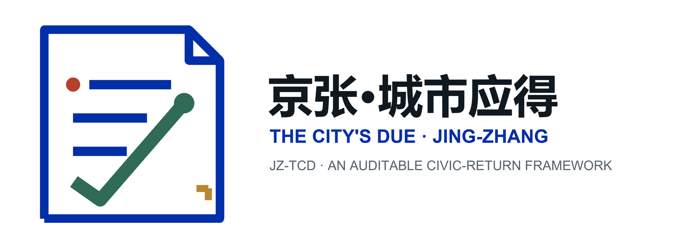
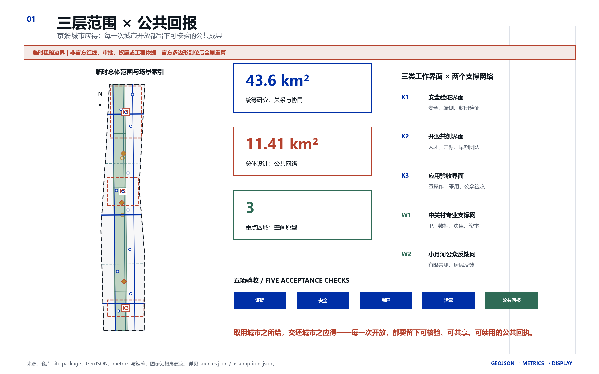
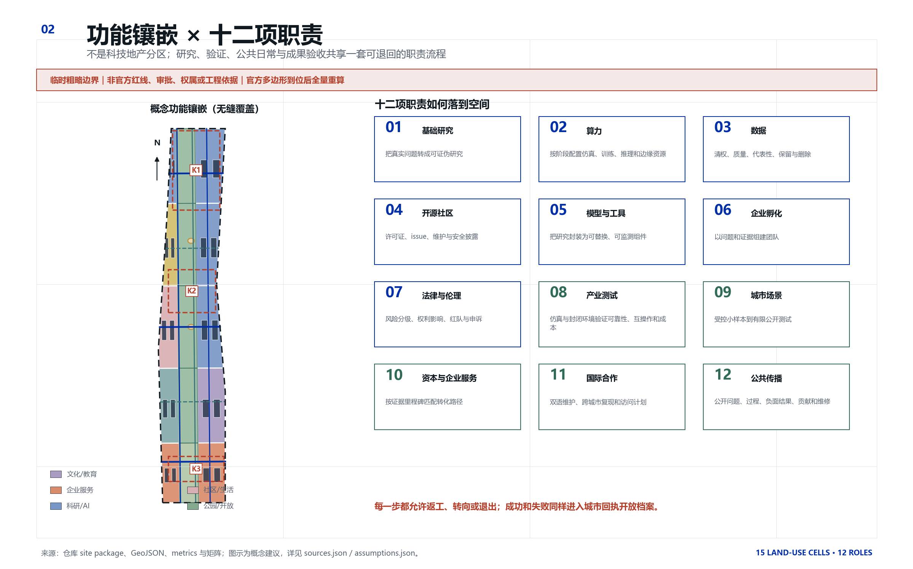
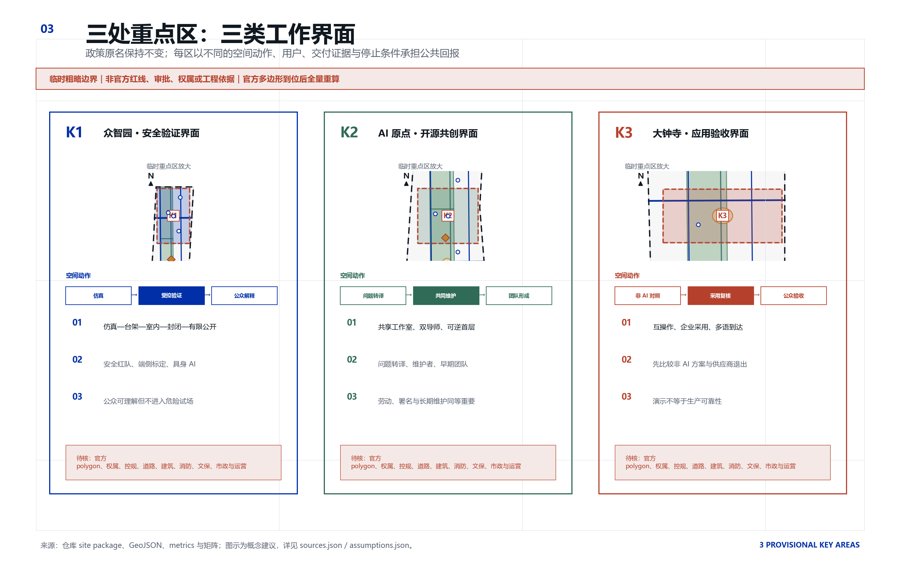
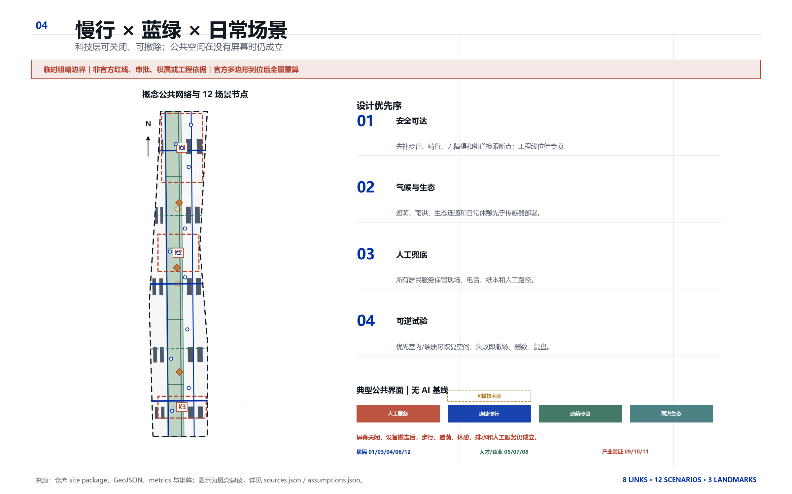
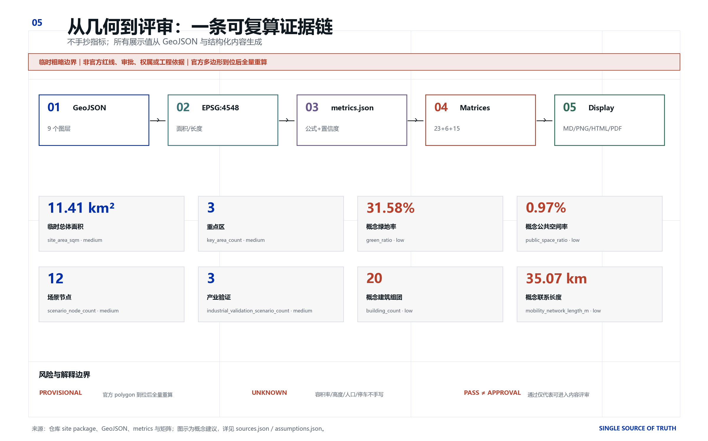

# 京张·城市应得：以城市回执兑现公共收益的百年京张 AI 创新带设计

> **取用城市之所给，交还城市之应得——每一次开放，都要留下可核验、可共享、可续用的公共回执。**

## 设计依据与资料清单

本方案由 AI 城市设计 Agent **城益衡（Civic Benefit Gauge）**统筹。名称“城益衡”把城市公共收益作为校准尺度；方案主品牌“京张·城市应得 / Jing-Zhang · The City's Due（JZ-TCD）”把公共回报定义为使用城市机会后必须交回的可验证成果。“应得”不是现金分红、财政承诺、收费凭证或法定债权，而是开放件、公共服务时额、失败/退出日志、社区补偿或知识回流等可核验公共成果。主张是“取用城市之所给，交还城市之应得——每一次开放，都要留下可核验、可共享、可续用的公共回执。”。[source:AGENT-TASKBOOK] [standard:PROJECT-AGENT-OPEN-CALL-TASKBOOK]

运行机制名为 **城市回执 / Civic Return Receipt（CRR）**。每份回执同时记录问题、数据许可、模型/工具版本、人工责任、风险、测试阶段、居民反馈、退出条件和四联公共成果，并依次接受证据、安全、用户、运营和公共回报五项验收。它是一张可公开审计的成果记录，不是政府认证、审批文件或自动评分；未交付、出现高风险或无法纠错的项目不得自动获得下一阶段权利。[depth:overall_spatial_structure]

第一证据层是官方公告与任务书 [source:OFFICIAL-ANNOUNCEMENT] [source:AGENT-TASKBOOK]；第二层是仓库维护的 site package、source registry、processed fact pack 和标准索引 [source:SITE-PACKAGE] [source:SOURCE-REGISTRY] [source:PROCESSED-FACT-PACK] [source:STANDARD-LIBRARY]；第三层是公开的一手机构案例，只用于机制借鉴。用地分类依据 [standard:MNR-LAND-USE-CLASSIFICATION-GUIDE]，城市设计与控规深度分别依据 [standard:MOHURD-URBAN-DESIGN-MEASURES]、[standard:MOHURD-CONTROL-DETAILED-PLANNING] 和 [standard:MOHURD-ARCH-DESIGN-DEPTH-2016]；其中建筑深度规定因缺官方 source URL 仅作为待补深化清单，不冒充已满足的正式依据。

**边界披露：当前没有可验证坐标的官方精确 SITE_BOUNDARY 和三处 KEY_AREA polygon。** 本包严格复用 [source:BOUNDARY-SOURCE] 与 [source:KEY-AREA-SOURCE]，在 [data:geometry/site_boundary.geojson#SITE-001] 和 [data:geometry/key_areas.geojson#PROV-KEY-001] 中标记 `official_boundary=false`、`geometry_role=provisional_constraint`、`boundary_precision=provisional_rough`。它们仅用于概念方案生成、自检、可视化和设计讨论，不是法定红线、审批、权属、工程线位或精确评分依据。官方 polygons 到位后，九个 GeoJSON、metrics、五组中英图、两套中英 PDF 和两个 visual HTML 必须整体重算，不能只换底图。[depth:existing_conditions_diagnosis]

## 三层范围工作框架

三层范围对应三种不同决策权限，而不是同一张分区图的缩放。[source:OFFICIAL-ANNOUNCEMENT] [depth:three_level_scope_framework]

- **统筹研究范围约 43.6 km²**：回答三区两翼怎样共享人才、研究、算力、数据、法律、资本、场景和国际网络；本方案只画要素关系，不从临时 polygon 推导地块。[metric:research_scope_nominal_sqm]
- **总体设计范围约 11.4 km²**：回答京张遗址公园周边公共网络如何承载产业与日常生活；公告名义值 [metric:overall_scope_nominal_sqm] 与临时边界 EPSG:4548 复算值 [metric:site_area_sqm] 分列。
- **三处重点区域合计公告约 368.4 ha**：众智园 192.1 ha、AI 原点社区 104.3 ha、大钟寺 72.0 ha；本包临时 polygon 只用于概念原型与替换流程，[metric:key_area_count] 与 [metric:key_area_total_sqm] 均带 provisional 置信度。

三区两翼的协作不是“北研—中创—南卖”的单向流水线，也不另造一组车站式空间：**众智园安全验证界面**承接基础工具、安全红队、端侧与具身系统封闭验证；**AI 原点开源共创界面**承接跨学科人才、开源维护、早期团队与公共问题转译；**大钟寺应用验收界面**承接互操作、企业采用、内容出处与公共成果展示；**中关村专业支撑网**提供 IP、法律、数据、标准、资本和国际服务；**小月河公众反馈网**承接低风险城市共测与居民反馈。项目可从任一界面进入，但必须留下同一结构的城市回执，并允许退回、转向或终止。

本方案对“三大定位、五大功能”的响应不是口号清单：**百年京张文化带**由百年维护索引等文化地标持续记录遗产、建设者与纠错；**都市 AI 生活体验带**由十二个有人工兜底的日常场景接受居民检验；**AI 融合创新带**由十二项职责及三区两翼把研究、开源、验证、转化和公共回报组织成可退出的路径。由此承载**AI 全栈自主创新体系、世界级 AI 创新生态、AI+ 场景赋能新范式、智能化 AI 活力城市、AI 治理全球话语权**五项功能，但每项都必须留下可复现证据、公共贡献与长期维护责任。本方案把“全球人工智能产业高地 / AI 朝圣地”解释为研究者、开发者、产业使用者与居民共同维护的可验证目的地，而非招商口号或网红装置。[source:AGENT-TASKBOOK] [depth:three_level_scope_framework]

区域协同仅作为待验证的接口建议，不表示任何机构已签约或项目已建立：与**北纬社区**交换人才与国际生活服务经验；与**未来科学城、怀柔科学城**对接研究问题和复现实验；向**经开区**转介需要制造与产业条件的验证；以**京津冀**跨城复现记录版本差异、治理边界和维护交接。任何接口都须另行确认主体、许可、数据和资源。[source:AGENT-TASKBOOK] [depth:three_level_scope_framework]

### 区域协同接口矩阵（概念建议）

- **北纬社区接口**：建议主体类型为人才服务、社区运营与国际生活服务团队；交换件为双语到达清单、家庭/无障碍服务缺口和转介规则；核验证据为去标识反馈、服务地图版本差异与转介闭环；主体、许可或隐私边界未确认即停止交换。
- **未来科学城 / 怀柔科学城接口**：建议主体类型为高校、实验室与独立复现团队；交换件为可公开研究问题、基准协议和负面结果；核验证据为复现实验、版本差异与维护责任；数据许可、实验条件或安全分级不等价时不得宣称复现成功。
- **经开区接口**：建议只转介需要制造、设备或产业条件的封闭验证，不宣称既有合作；交换件为去敏测试需求、场地前置条件与供应商退出模板；核验证据为接收确认、独立测试记录和知识回流；商业秘密、安全条件或责任主体不清即退回。
- **京津冀跨城接口**：建议共享双语 schema、测试方法、版本差异与维护交接，不共享未经许可的个人/企业数据；核验证据为跨城复现日志、治理差异表和继任记录；法规、许可或运营责任无法对齐时只保留公开文档，不进入部署。

## 统筹研究范围产业与未来城市研究

### 七个全球 AI 创新生态案例

案例只借鉴形成机制、空间组织、人才、企业服务、测试和社区运营；机构自述不是独立效果评估，也不转化为海淀的资金、企业或设施承诺。

### 案例 1｜蒙特利尔 Mila [source:CASE-MILA]
- 形成机制：高校研究共同体、非营利机构、产业伙伴、责任 AI 与 Ventures 形成长期中介平台。
- 空间组织：实体研究锚点与跨机构伙伴网络并置，为研究者、创业者与责任 AI 专业者提供持续接触界面；不从该来源推断周边街区成效。
- 人才机制：研究训练、实习、创始研究者与 venture scientist 共同构成人才管道。
- 资本与企业服务：导师、技术资源、设计伙伴、投资者介绍与人才连接被组合为持续服务。
- 测试场景：以设计伙伴和 pilot validation 验证真实需求，并把责任 AI 放在部署之前。
- 社区运营：科研、创业、政策与责任 AI 活动共同维系社区。
- 京张可借鉴：把研究者、开源维护者、企业设计伙伴与伦理研究者共置。
- 不可照搬：不照搬其人才密度、公共资金和单核总部模式。

### 案例 2｜多伦多 Vector Institute [source:CASE-VECTOR]
- 形成机制：独立非营利中介连接政府、高校、医院与行业，而不以单一企业为中心。
- 空间组织：实体校园锚点与省域研究、医疗和行业网络并置。
- 人才机制：奖学金、认可硕士项目、应用实习与人才平台衔接教育和就业。
- 资本与企业服务：中小企业服务覆盖成熟度诊断、训练、工程项目、IP 与商业化建议。
- 测试场景：可信 AI 工具把问题定义、治理、设计、部署测试、监测和退役组织为生命周期。
- 社区运营：跨研究、医疗、产业、监管与政策的项目以信任和安全为共同语言。
- 京张可借鉴：设置独立生态翻译台，为每个项目配置成熟度、IP、数据、风险和人才接口。
- 不可照搬：不复制其出资结构或医院数据网络，也不把安全停留在宣言。

### 案例 3｜AI Singapore [source:CASE-AISINGAPORE]
- 形成机制：国家项目把高校、研究机构、企业与工程人才组织到明确周期的真实问题中。
- 空间组织：国家项目把大学研究、工程团队与企业问题组织成跨机构网络；本来源不用于推断具体园区形态。
- 人才机制：学徒先训练，再进入 100 Experiments 或内部工程项目。
- 资本与企业服务：问题澄清、工程团队、PoC/MVP、知识转移和招聘被打包。
- 测试场景：3 个月 PoC 或 6 个月 MVP 的时限降低“永远试点”的风险。
- 社区运营：工程师、创业者、投资人和园区生活服务形成持续弱连接。
- 京张可借鉴：采用定期验证、内部负责人和知识移交包，而不是只办 Demo Day。
- 不可照搬：不照搬高度集中协调、土地运营或共同资助机制。

### 案例 4｜Testbed Helsinki [source:CASE-HELSINKI]
- 形成机制：城市开放真实环境，非营利创业社区承接团队、伙伴与资本。
- 空间组织：分布式真实城市试验环境由统一入口组织；本来源不用于推断创业校园形态。
- 人才机制：人才通过真实试验、RDI 项目和国际创业社区学习。
- 资本与企业服务：城市测试入口、数据目录、投资网络和企业伙伴形成连续服务。
- 测试场景：测试从真实城市问题出发，并记录居民反馈和试验后去向。
- 社区运营：居民共创、老人和无障碍参与工具进入试验流程。
- 京张可借鉴：建立统一场景入口、数据目录、居民共测和试验归档。
- 不可照搬：不假定芬兰数据制度和部门协作成熟度可直接移植。

### 案例 5｜苏黎世 ETH AI Center [source:CASE-ETH]
- 形成机制：跨全部院系的校级中心把 AI 基础、应用、影响与社会受益并列。
- 空间组织：有实体会面点的跨学科网络，而不是纯虚拟联盟。
- 人才机制：双导师博士 fellowship 连接 AI、领域学科、产业、创业和社会影响。
- 资本与企业服务：研究合作、创新包、venture builder、孵化与技术尽调分层提供。
- 测试场景：跨学科项目和 red-teaming network 将安全能力前置。
- 社区运营：学术讲座、AI+X 活动、公众沟通与安全政策活动共同发生。
- 京张可借鉴：每个项目采用 AI 导师与领域/社会导师双导师制。
- 不可照搬：不复制 ETH 品牌吸引力，也不让付费会员影响公共场景安全审查。

### 案例 6｜匹兹堡 CMU NREC [source:CASE-CMU]
- 形成机制：大学工程中心把概念、系统工程、原型、现场测试和商业化衔接。
- 空间组织：实体工程中心与按项目配置的实验、原型和测试环境结合；本来源不用于推断周边走廊形态。
- 人才机制：研究项目、工程人员、实习、校友和创业网络构成强流动。
- 资本与企业服务：设备、导师、加速、规模化和资金服务与真实工程能力连接。
- 测试场景：从仿真、台架到室内、封闭室外和现场测试逐级推进。
- 社区运营：公共展览与社区协作作为硬科技设施的公共界面。
- 京张可借鉴：建立五级验证阶梯，并公开失败和维护工程。
- 不可照搬：不复制国防资金结构，也不把公共道路当首测场。

### 案例 7｜首尔 Yangjae AI Hub [source:CASE-SEOUL]
- 形成机制：城市设锚点并由大学和研究机构联合运营，按企业成长阶段组织支持。
- 空间组织：多站点集群将教育、办公、算力、验证和开放创新组合。
- 人才机制：教育设施、大学合作、研究活动和创业团队形成连续供给。
- 资本与企业服务：办公、导师、投资连接、GPU/PoC、业务验证和后续项目成为一张菜单。
- 测试场景：从产业问题识别、技术设计、示范到采用/扩散形成路径。
- 社区运营：培训、网络、研讨和城市级活动维系行业社区。
- 京张可借鉴：为中小企业设置一个项目经理、一个入口、多个专业后台。
- 不可照搬：不把规划中设施、基金或政府投资改写成海淀承诺。

### 十二环节生态图谱

闭环为“公共问题→研究/算力/数据→开源/模型→孵化/伦理→产业验证→有限城市测试→企业/资本服务→国际复现→公共传播→新问题回流”，但视觉上不画封闭圆环；每一步都可返修或退出。[source:BEIJING-THREE-ZONES] [depth:overall_spatial_structure]

- **01 基础研究**：把真实问题转成可证伪研究；主载体为AI 原点社区；阶段证据为问题陈述、非 AI 对照、伦理初筛。
- **02 算力**：按阶段配置仿真、训练、推理和边缘资源；主载体为众智园/中关村翼；阶段证据为算力预算、能耗说明、最小必要原则。
- **03 数据**：清权、质量、代表性、保留与删除；主载体为中关村翼；阶段证据为数据卡、许可、偏差与隐私影响评估。
- **04 开源社区**：许可证、issue、维护与安全披露；主载体为AI 原点社区；阶段证据为可复现仓库、维护计划、安全政策。
- **05 模型与工具**：把研究封装为可替换、可监测组件；主载体为众智园；阶段证据为模型卡、基准、依赖和版本锁。
- **06 企业孵化**：以问题和证据组建团队；主载体为AI 原点/中关村翼；阶段证据为团队能力、IP 路径、用户证据。
- **07 法律与伦理**：风险分级、权利影响、红队与申诉；主载体为众智园/中关村翼；阶段证据为风险登记、人工负责人、退出方案。
- **08 产业测试**：仿真与封闭环境验证可靠性、互操作和成本；主载体为众智园/大钟寺；阶段证据为测试报告、失败模式、维护成本。
- **09 城市场景**：受控小样本到有限公开测试；主载体为小月河翼；阶段证据为现场安全、告知、人工接管、居民评审。
- **10 资本与企业服务**：按证据里程碑匹配转化路径；主载体为中关村翼/大钟寺；阶段证据为成本、合规、IP 与公共回报说明。
- **11 国际合作**：双语维护、跨城市复现和访问计划；主载体为全域网络；阶段证据为版本差异、复现实验与维护交接。
- **12 公共传播**：公开问题、过程、负面结果、贡献和维修；主载体为京张公共界面；阶段证据为通俗解释、无障碍版本、回报与退出档案。

五道共同门槛是：证据门检查问题、来源、许可和基线；安全门检查风险、红队、人工接管与申诉；用户门要求真实用户和非数字替代；运营门明确值守、维护、投诉和退役；公共回报门核验四联回报。任何正向 KPI 都不能抵消未经许可数据、无人工替代、高风险跳级、场地未恢复或反馈拖欠。

## 总体设计范围城市更新与控规深度城市设计

空间结构用“**一片连续公共基底、三类工作界面、五个东西到达面、十二个场景节点**”表达。中心连续绿地与开放空间承担京张遗产阅读、步行骑行、遮荫、日常停留和公共成果验收；东西向联系回应轨道接驳和断点研究；两侧科研、教育、社区、文化和企业服务形成可替换的功能镶嵌，而不是精确地块方案。[data:geometry/land_use.geojson#LU-001] [data:geometry/roads.geojson#ROAD-001] [metric:land_use_feature_count] [metric:road_segment_count]

用地 GeoJSON 由临时 SITE_BOUNDARY 的 15 个无缝单元构成，覆盖完整、无重叠；它的目标是验证功能关系、面积复算和官方边界替换流程。建议更新遵循 R0 资料/权属调查、R1 室内和时段共享、R2 可逆家具标识与首层活动、R3 经结构/消防/文保/权属核验后的适应性再利用、R4 只有完成法定程序后才研究新增建设。建筑基底仅为功能组团示意 [data:geometry/buildings.geojson#BLDG-001]，不得读成现状测绘或拆除决定。[depth:overall_spatial_structure] [depth:development_intensity_controls]

## 重点区域详细设计

### 众智园 AI 自主创新加速区 · 安全验证界面

建议空间原型为“验证庭院 + 受控测试带 + 公众解释廊”。研究、端侧标定、智能体互操作和具身 AI 依次经历仿真、台架、室内、封闭室外、限时公开五级阶梯；公众可理解测试目的和退出记录，但不进入危险试场。具体建筑、硬质场地、噪声、消防、结构、生态与产权均待核。[data:geometry/key_areas.geojson#PROV-KEY-001] [depth:three_key_area_detailed_design]

### 北京 AI 原点社区 · 开源共创界面

建议空间原型为“开源客厅 + 转化工坊 + 人才生活支持”。每个项目采用 AI 导师与领域/社会影响导师双导师制；开源维护席、问题工作坊、企业设计伙伴和人工社区服务共置。首层共享优先于新建，学徒劳动必须有署名、导师和明确报酬/劳动规则。[data:geometry/key_areas.geojson#PROV-KEY-002]

### 大钟寺 AI 产业聚集区 · 应用验收界面

建议空间原型为“互操作市场 + 多语到达服务 + 城市回执厅”。企业采用门诊先比较非 AI 方案，再验证数据、IP、成本、供应商退出和公共成果；不把一次演示当生产可靠性，也不把公共空间变成连续商业路演。[data:geometry/key_areas.geojson#PROV-KEY-003]

## AI 创新生态、人才画像与 AI+ 场景

### 八类真实用户画像

- **P1 基础与跨学科研究者**：把真实公共问题转成可证伪研究；需要清权数据、领域伙伴与负面结果可发表。
- **P2 早期创业与开源维护团队**：需要用户、算力、IP、合规与维护资源；不能用公共场景换排他权。
- **P3 企业 AI、安全与产品团队**：需要互操作验证、可信供应商与客户证据；商业秘密最小披露但须独立审计。
- **P4 城市与公共服务运营人员**：需要责任清晰、可维护、可申诉的辅助工具；关键决定保留人工负责人。
- **P5 居民、老人、儿童照护者与残障人士**：需要非扫码替代、明确告知、可撤回和无障碍；不默认生物识别。
- **P6 学生、职业转型者与青年开发者**：需要真实项目、导师、署名与公平劳动条件；竞赛不替代长期岗位。
- **P7 本地小微企业、文化与生活服务者**：需要低成本采用、合同与数据可移植、人工柜台和供应商退出路径。
- **P8 国际访问开发者、研究者及随行家庭**：需要双语到达、短期协作与家庭友好信息；不承诺签证或住房。

任何场景若只能由研究者、创业者和企业理解，不能算都市 AI 生活体验；面向居民的场景若没有电话、纸本、现场人工等非数字替代，不能进入公开测试。[metric:persona_count]

### 十二张场景卡

十二个节点从同一结构化 `constraints.geojson` 生成，共有 [metric:scenario_node_count] 个场景，其中 [metric:industrial_validation_scenario_count] 个属于产业测试与验证。每张卡都包含对象、空间、旅程、AI、数据、隐私、人工复核、运营、阶段、指标、风险、退出和公共回报。[depth:municipal_new_infrastructure]

### SCN-01｜无障碍慢行共测
- 服务对象：残障人士、老人、照护者、游客与交通运营人员。
- 空间类型/建议节点：京张公园既有硬质慢行界面与轨道接驳研究节点；主载体 `dazhongsi_ai_industry_cluster`（大钟寺 AI 产业聚集区），示意精度 `provisional_rough`；对应示意节点 [data:geometry/constraints.geojson#SCN-01]。
- 用户旅程：现场或纸本报障→边缘设备匿名识别坡度/拥堵→人工踏勘→发布整改任务→参与者复测。
- AI 能力：无障碍路径建议、异常聚类、图像辅助但不做人脸识别。
- 数据来源与隐私边界：匿名计数、坡度与设施状态、人工标注；不采集身份和连续轨迹。
- 人工复核：无障碍专业人员与居民代表复核，运营人员决定是否发布。
- 运营主体类型：公共空间运营方+无障碍社会组织+技术维护方（类型建议）。
- 阶段：一期可逆试点。
- 衡量指标：问题闭环率、人工复核率、复测通过率、非数字反馈占比。
- 风险：错误导航或弱势群体被过度采样。
- 失败/退出：出现安全事件、持续错误或投诉无法在约定时限内闭环时下线并恢复人工导览。
- 必须兑付的公共回报：开放无障碍问题图谱、修复前后证据和通用检测规则。

### SCN-02｜京张遗产出处导览
- 服务对象：居民、学生、游客、文化志愿者。
- 空间类型/建议节点：京张遗址公园既有文化节点与百年维护索引；主载体 `jingzhang_civic_interface`（京张公共界面），示意精度 `provisional_rough`；对应示意节点 [data:geometry/constraints.geojson#SCN-02]。
- 用户旅程：选择主题→获得带出处的短解说→在实体标识核对→提交纠错→馆员确认版本。
- AI 能力：检索增强、多语简化、无障碍语音与内容差异比对。
- 数据来源与隐私边界：清权历史资料与公开纠错；不采集人脸、身份或游客画像。
- 人工复核：文保/历史专业人员与公共文化运营人员复核。
- 运营主体类型：文化场馆或公园运营方+高校史料团队+开源维护者（类型建议）。
- 阶段：一期离线原型、二期多语扩展。
- 衡量指标：可追溯陈述占比、纠错响应时长、无障碍版本覆盖率。
- 风险：幻觉、历史简化与版权越界。
- 失败/退出：任何无出处陈述默认不发布；重大错误触发版本回滚和现场更正。
- 必须兑付的公共回报：公开可复用的双语史料索引、纠错日志和无障碍脚本。

### SCN-03｜公园热风险与遮荫守望
- 服务对象：居民、老人、儿童照护者、公园维护人员。
- 空间类型/建议节点：小月河翼与京张公园公共活动界面（实际点位待核）；主载体 `xiaoyue_river_civic_interface`（小月河公共界面），示意精度 `provisional_rough`；对应示意节点 [data:geometry/constraints.geojson#SCN-03]。
- 用户旅程：查看低风险时段→获得遮荫/饮水人工核验信息→现场反馈→维护任务进入台账。
- AI 能力：微气候趋势提示、维护优先级和异常检测，不做医疗诊断。
- 数据来源与隐私边界：环境传感、公开天气与人工巡检；不关联个人健康和身份。
- 人工复核：维护人员审核提示，极端天气遵循权威预警。
- 运营主体类型：公园运营方+气象/景观顾问+设备维护方（类型建议）。
- 阶段：一期传感器最小布设。
- 衡量指标：传感器可用率、误报率、遮荫问题闭环时间。
- 风险：误报、设备维护负担和把建议误作健康判断。
- 失败/退出：设备漂移、维护成本超阈或公众误解持续时撤除并保留人工巡检。
- 必须兑付的公共回报：开放微气候元数据、维护规则与部署失败记录。

### SCN-04｜蓝绿养护助手
- 服务对象：绿化、水务与公园维护人员、周边居民。
- 空间类型/建议节点：清河、小月河与绿地的非敏感、可恢复点位；主载体 `blue_green_civic_interface`（蓝绿公共界面），示意精度 `provisional_rough`；对应示意节点 [data:geometry/constraints.geojson#SCN-04]。
- 用户旅程：人工巡检→传感异常聚合→专业人员判断→安排养护→发布不含敏感位置的结果。
- AI 能力：缺水/积水趋势、植被异常与工单优先级辅助。
- 数据来源与隐私边界：低频环境数据、维护记录和公开气象；敏感生态点位不公开。
- 人工复核：景观/水务专业人员对每个工单复核。
- 运营主体类型：绿地或河道维护方+生态顾问+技术服务方（类型建议）。
- 阶段：一期仿真、二期小范围实测。
- 衡量指标：误报率、人工采纳率、维护响应时间、设备撤除完整率。
- 风险：干扰生态、位置敏感与设备遗留。
- 失败/退出：任何生态影响或无法撤除风险立即停止并恢复场地。
- 必须兑付的公共回报：匿名化养护模型、传感器撤场规范和环境净收益评估。

### SCN-05｜多语到达与人才服务台
- 服务对象：国际访问者、研究者、开发者及随行家庭。
- 空间类型/建议节点：大钟寺公共服务界面与 AI 原点社区人才服务界面；主载体 `beijing_ai_origin_community`（北京 AI 原点社区），示意精度 `provisional_rough`；对应示意节点 [data:geometry/constraints.geojson#SCN-05]。
- 用户旅程：选择语言与需求→获取带更新时间的公开信息→人工服务人员确认复杂事项→匿名评价。
- AI 能力：多语检索、信息摘要和服务分流；不做签证/法律结论。
- 数据来源与隐私边界：公开服务信息与用户当次选择；会话结束后不保留身份。
- 人工复核：服务人员审核高风险/时效性信息。
- 运营主体类型：人才服务机构+国际社区组织+人工柜台（类型建议）。
- 阶段：一期双语原型。
- 衡量指标：信息更新时间、人工转接率、错误更正时长、家庭友好信息覆盖。
- 风险：过时信息、歧视性推荐与用户误作官方承诺。
- 失败/退出：关键页面过期或错误无法及时纠正时暂停自动回答，仅提供人工入口。
- 必须兑付的公共回报：开放双语服务词表、纠错记录和可访问内容模板。

### SCN-06｜社区服务人工兜底导航
- 服务对象：居民、老人、照护者与社区服务人员。
- 空间类型/建议节点：社区服务设施与公众验收台的人工服务时段；主载体 `community_civic_interface`（社区公共界面），示意精度 `provisional_rough`；对应示意节点 [data:geometry/constraints.geojson#SCN-06]。
- 用户旅程：现场/电话/纸本提出需求→工具仅做分类→人工确认并转介→服务后可撤回评价。
- AI 能力：服务分类、知识检索和无障碍表达；不做福利资格或医疗判断。
- 数据来源与隐私边界：最少必要需求字段；敏感记录进入现有合规系统而非模型日志。
- 人工复核：所有转介由在岗服务人员确认。
- 运营主体类型：社区服务组织+人工柜台+合规技术维护方（类型建议）。
- 阶段：一期非联网知识库试点。
- 衡量指标：人工确认率、误转介率、非数字渠道占比、申诉闭环率。
- 风险：敏感信息泄露、错误转介与数字排斥。
- 失败/退出：出现敏感数据事件或误转介超过阈值时停用自动分类并保留人工服务。
- 必须兑付的公共回报：开放去敏服务分类法、可访问问答模板和申诉流程。

### SCN-07｜开源学徒与维护匹配
- 服务对象：学生、职业转型者、开源维护者与研究团队。
- 空间类型/建议节点：AI 原点社区开源工坊与线上双语仓库；主载体 `beijing_ai_origin_community`（北京 AI 原点社区），示意精度 `provisional_rough`；对应示意节点 [data:geometry/constraints.geojson#SCN-07]。
- 用户旅程：提交技能与可用时间→人工审核项目劳动条件→建议任务→导师确认→贡献进入工迹簿。
- AI 能力：技能—issue 匹配、文档辅助与无障碍学习路径。
- 数据来源与隐私边界：自愿技能资料与公开 issue；不推断敏感属性。
- 人工复核：维护者、导师和劳动/教育顾问复核。
- 运营主体类型：高校/培训机构+开源社区+项目运营方（类型建议）。
- 阶段：一期小规模 cohort。
- 衡量指标：有导师贡献率、维护六个月留存、署名完整率、付费岗位转化（仅记录真实）。
- 风险：无报酬劳动、偏见匹配与贡献者耗竭。
- 失败/退出：劳动条件不透明、导师缺位或投诉未闭环时停止匹配。
- 必须兑付的公共回报：开放课程、issue 分级法、维护手册与署名规范。

### SCN-08｜小微企业 AI 采用门诊
- 服务对象：本地小微企业、文化和生活服务者。
- 空间类型/建议节点：大钟寺应用验收界面与中关村专业支撑网；主载体 `zhongguancun_service_wing`（中关村服务翼），示意精度 `provisional_rough`；对应示意节点 [data:geometry/constraints.geojson#SCN-08]。
- 用户旅程：描述问题→先比较非 AI 方案→数据/IP/成本诊断→小样本验证→人工决定采用、转向或停止。
- AI 能力：需求分解、供应商中立比较和小样本评估辅助。
- 数据来源与隐私边界：企业自愿提供的最小数据与公开行业资料；禁止二次销售。
- 人工复核：企业负责人、领域顾问、法律/IP 与安全人员共同确认。
- 运营主体类型：企业服务机构+法律/IP+独立技术评估方（类型建议）。
- 阶段：一期门诊、二期验证批次。
- 衡量指标：非 AI 方案采用率、验证完成率、供应商退出可行性、真实采用后维护成本。
- 风险：供应商俘获、商业秘密泄露与虚假 ROI。
- 失败/退出：无法保障供应商中立、数据可移植或成本证据时停止建议。
- 必须兑付的公共回报：开放去敏案例、采购问题清单、供应商退出模板和失败教训。

### SCN-09｜智能体互操作与越权验证【产业测试与验证】
- 服务对象：智能体开发者、企业安全团队与评审人员。
- 空间类型/建议节点：众智园室内受控验证环境（具体载体待核）；主载体 `zhongzhiyuan_ai_acceleration_area`（众智园 AI 自主创新加速区），示意精度 `provisional_rough`；对应示意节点 [data:geometry/constraints.geojson#SCN-09]。
- 用户旅程：登记工具权限→合成任务→跨智能体协作→红队诱导越权→人工审阅日志→发布测试卡。
- AI 能力：工具调用、权限隔离、协作协议和异常检测。
- 数据来源与隐私边界：合成/清权测试数据；不接入生产账户与真实个人数据。
- 人工复核：安全工程师逐项批准权限与发布结论。
- 运营主体类型：独立评测机构+实验室+企业安全团队（类型建议）。
- 阶段：一期仿真、二期封闭验证。
- 衡量指标：越权拦截率、不可解释调用数、人工复核覆盖、复现实验成功率。
- 风险：敏感漏洞披露和误把测试通过当生产安全。
- 失败/退出：出现生产凭证、不可控调用或高危漏洞时立即隔离、撤销权限并按披露流程处理。
- 必须兑付的公共回报：开放测试协议、去敏失败样本、权限清单模板和版本差异。

### SCN-10｜端侧模型能耗与退化标定【产业测试与验证】
- 服务对象：端侧 AI 团队、设备企业、公共空间运营人员。
- 空间类型/建议节点：众智园实验室与大钟寺室内互操作台（概念）；主载体 `zhongzhiyuan_ai_acceleration_area`（众智园 AI 自主创新加速区），示意精度 `provisional_rough`；对应示意节点 [data:geometry/constraints.geojson#SCN-10]。
- 用户旅程：登记硬件/模型→统一任务→测能耗/时延/准确度→环境扰动→人工复核→发布可重复报告。
- AI 能力：基准执行、漂移检测和多目标比较。
- 数据来源与隐私边界：合成与公开基准；设备日志去除序列号和企业敏感配置。
- 人工复核：测试工程师校准仪器并签署结果。
- 运营主体类型：独立实验室+标准机构+设备维护方（类型建议）。
- 阶段：一期统一基准。
- 衡量指标：复现差异、单位任务能耗、时延、故障恢复时间。
- 风险：仪器偏差、营销滥用与单一指标误导。
- 失败/退出：校准失效、结果不可复现或被误用时撤回报告并重测。
- 必须兑付的公共回报：开放基准脚本、仪器校准记录、负面结果与能耗口径。

### SCN-11｜具身 AI 低速封闭验证【产业测试与验证】
- 服务对象：机器人团队、设施运营人员、安全评审与无障碍代表。
- 空间类型/建议节点：众智园可封闭硬质场地；不在公共道路首测（载体待核）；主载体 `zhongzhiyuan_ai_acceleration_area`（众智园 AI 自主创新加速区），示意精度 `provisional_rough`；对应示意节点 [data:geometry/constraints.geojson#SCN-11]。
- 用户旅程：仿真→台架→室内→封闭室外→事件复盘；通过后才可申请有限公开测试。
- AI 能力：低速导航、障碍识别、人工接管和故障安全。
- 数据来源与隐私边界：合成障碍、设备遥测和去标识测试录像；不记录旁观者身份。
- 人工复核：安全工程师、场地负责人和无障碍代表共同签字。
- 运营主体类型：受控测试运营方+安全评测+设备责任方（类型建议）。
- 阶段：二期封闭测试。
- 衡量指标：人工接管时延、碰撞/近失事件、故障安全成功率、场地恢复时间。
- 风险：人身伤害、噪声占道、录像隐私与公众误解。
- 失败/退出：任何伤害、高风险近失或失控即停机、封存日志、恢复场地并独立复盘。
- 必须兑付的公共回报：开放去敏失败模式、安全检查表、接管基准与场地恢复规范。

### SCN-12｜城市回执开放档案
- 服务对象：居民、开发者、维护者、评审人员与运营方。
- 空间类型/建议节点：城市回执厅、百年维护索引与离线可打印网页；主载体 `jingzhang_civic_interface`（京张公共界面），示意精度 `provisional_rough`；对应示意节点 [data:geometry/constraints.geojson#SCN-12]。
- 用户旅程：查看项目回执→核对数据/风险/人工责任→查看公共成果与失败→提交纠错或新问题。
- AI 能力：文档一致性检查、版本差异和通俗解释；不自动给项目评分。
- 数据来源与隐私边界：项目公开元数据、贡献记录与去敏反馈；个人实名展示需主动同意。
- 人工复核：运营秘书处核对，居民评审席可提出异议，独立审计抽查。
- 运营主体类型：未来确认的联合运营平台+居民评审+独立审计（类型建议）。
- 阶段：一期最小开放档案、逐年扩展。
- 衡量指标：回执完整率、纠错响应时长、失败记录公开率、成果复用次数。
- 风险：排名化、隐私泄露、形式主义与把披露误作审批。
- 失败/退出：出现个人信息泄露、无法更正或被用作自动处罚时暂停相应功能并保留纸本查询。
- 必须兑付的公共回报：开放档案本身作为开放规范、版本历史、失败库和公共审计接口。

### 三项公共价值地标

- **百年维护索引 / Century Maintenance Index**：沿既有公共界面布置可坐、可读、可替换的小尺度档案构件，按年份记录铁路工程维护、开源贡献、居民评审与失败修复；屏幕关闭仍是座椅和导览。
- **城市回执厅 / Civic Receipt Hall**：以纸本和离线网页并行展示项目回执、数据边界、人工责任、公共成果和退出记录；不做实时人群画像，不设商业排行榜。
- **公众验收台 / Public Acceptance Table**：一张有遮荫、无障碍席位与人工服务时段的日常长桌，用于居民提出问题、开发者维修、学生学习和多语协作，也让公众核对项目是否真正交付；活动撤场后仍服务社区。

地标数量为 [metric:civic_landmark_count]。三者都优先使用可逆、低维护、可坐可读的日常构件；屏幕关闭或设备撤走后仍是座椅、导览或人工共创空间，不使用巨型机器人、发光大脑或高维护媒体立面。[source:JINGZHANG-PARK]

三项地标各有空间、无障碍与维护底线：**百年维护索引**优先进入遗址公园既有硬质停留界面，采用经文保与材料审查的可替换小构件、触觉/盲文索引和离线文字；**城市回执厅**优先使用大钟寺可核实的既有首层公共界面，保留轮椅回转、低眩光纸本、人工服务和多语纠错；**公众验收台**优先依托 AI 原点或社区服务设施的遮荫日常空间，提供不同坐高、轮椅席位、电源与非数字材料。建议运营角色每周更新纸本状态、每月关闭纠错、每季度检查无障碍与天气损耗、每年公开更换记录；确切载体、材料、班次和运营主体仍待文保、产权、消防、无障碍和运营确认。

### 开发者荣誉、年度活动与国际社区

荣誉系统以可验证贡献类型而非融资/流量排行：研究、数据清权、开源维护、安全披露、无障碍共测、居民评审、翻译和失败修复都进入百年维护索引；实名展示必须主动同意，维护劳动与首创同等可见。

- **城市应得年度验收 / The City's Due Annual Review**：每年发布公共问题、核验上一年度公共成果与退出记录，不发布虚构投资或招商成绩。
- **开放件归还日 / Open Artifact Return Day**：维护者、居民评审和失败修复团队共同更新百年维护索引。
- **城市任务季 / Civic Task Season**：围绕无障碍、生态、社区服务等真实问题进行小规模构建—验证—复盘。

国际社区使用中英同步城市回执、跨城复现实验、访问维护者席位、行为准则、安全披露与反骚扰机制。“城市互认”只共享 schema、测试方法和文档，不自动互认法规或部署许可。

三种文化在同一制度和空间语言中合成，而不是并排贴标签：**京张工程维护文化**贡献可读路径、真实材料、长期养护和“修复也值得纪念”；**中关村开源创新文化**贡献问题驱动、开放协作、版本迭代和维护者署名；**AI 责任共益新文化**要求数据许可、人工责任、失败公开、退出修复与公共回报。百年维护索引记录这三类劳动，城市回执把它们变成每个项目都要填写的证据，年度公众验收再检验公共成果是否真正返还给城市。[source:JINGZHANG-PARK] [source:BEIJING-THREE-ZONES] [source:AGENT-TASKBOOK]

## 用地、建筑规模与拆改留方案

用地功能镶嵌面积全部由 [data:geometry/land_use.geojson#LU-001] 在 EPSG:4548 中复算；科研/教育/企业服务类概念面积为 [metric:innovation_service_area_sqm]，仅说明方案关系，不是供地、招商或法定比例。建筑图层包含 [metric:building_count] 个概念组团，基底面积 [metric:building_footprint_area_sqm]，属性中楼层与高度均为 null，因为官方控规、现状测绘、产权和限高缺失。[standard:MNR-LAND-USE-CLASSIFICATION-GUIDE]

拆改留不按临时图形下结论：**留**优先保护已核实遗产、成熟公共空间和可继续使用建筑；**改**优先做室内共享、时段共享、首层可逆界面和适应性再利用；**拆/新建**只有在权属、结构、消防、文保、控规、公共参与和法定程序完成后才研究。总建筑面积、容积率、最高高度、道路面积与比例、人口容量和停车供给均保持 unknown，防止精度幻觉。[depth:land_use_layout] [depth:height_massing_character] [depth:retain_renovate_demolish]

## 交通、轨道、市政与公共服务设施

交通图层表达三条南北公共联系和五个东西到达关系，总概念长度 [metric:mobility_network_length_m]；它不是现状路网、道路红线或工程中线。[data:geometry/roads.geojson#ROAD-001] [depth:traffic_rail_slow_parking]

策略顺序是：先核实现状步行、骑行、无障碍和轨道换乘断点；再研究既有桥上/桥下、信号、过街和站点界面；最后才提出需要工程论证的新增设施。轨道接驳强调雨天等候、非机动车停放、清晰换乘与连续无障碍。五环、四环及大型路口只列专业研究任务，不给桥隧可行性结论。

市政和新基建采用“最小必要、可关可撤、人工兜底”：边缘推理减少个人数据外传，算力任务记录能耗，任何楼宇控制先运行影子模式，生命安全和消防逻辑不由试验模型覆盖。公共服务包含社区人工柜台、多语到达、无障碍与企业门诊，但运营、能源、管线、消防和数据条件均待专项核验。[depth:municipal_new_infrastructure]

## 蓝绿空间、公共空间与城市风貌

概念绿地面积 [metric:green_space_area_sqm]、比例 [metric:green_ratio]；公共空间面积 [metric:public_space_area_sqm]、比例 [metric:public_space_ratio]。这些值来自临时边界分区和建议缓冲，不是现状绿地率或法定控制指标。[data:geometry/green_space.geojson#GREEN-001] [data:geometry/public_space.geojson#PUBLIC-001] [depth:blue_green_public_space]

绿地、公共空间与建筑基底是不同语义的建议叠加层，不是互斥的法定用地账：绿地—公共空间重叠 [metric:green_public_overlap_area_sqm]，建筑—公共空间重叠 [metric:building_public_overlap_area_sqm]。这些重叠已单列披露，因此绿地、公共空间和建筑的面积或比例**不可相加**。

清河、小月河与京张遗址公园首先承担雨洪、遮荫、生态连通、慢行舒适和日常休憩，AI 只是可撤的维护辅助层。测试设施优先进入已有室内/硬质可恢复空间，敏感绿地、水体、根系与可能涉及文保的区域默认不部署。花园型 AI 街区必须证明设备自身能耗和维护负担没有抵消公共收益。

风貌延续京张工程文化的克制、可维护与可读性：用回执折角、验收印记、维护索引和真实材料表达制度，不把遗产做成铁路主题乐园。视觉系统以制度蓝、工程锈红、公共绿与白/灰为主；专业地图保留多种语义色，但所有意义同时使用文字、形状和线型，不只靠颜色。

## 更新项目清单、实施政策与分期计划

项目清单以任务、前置证据、阶段和风险为单位，不把机构、资金或建设写成已确认。[data:geometry/phasing.geojson#PHASE-001] [depth:renewal_project_list]

- **P-01 官方数据接入与全量复算**｜全域｜数据/GIS｜一期。前置：官方边界、重点区、控规、道路、权属与文保资料；证据：更新全部九个图层和 metrics；发布差异报告；主要风险：资料版本错配。
- **P-02 城市回执最小规范**｜三区两翼｜治理/开源｜一期。前置：运营与法律主体确认、隐私影响评估；证据：回执完整率与纠错时限；主要风险：变成额外审批或形式主义。
- **P-03 AI 原点开源工坊**｜AI 原点社区｜人才/开源｜一期。前置：可用室内空间、消防与运营确认；证据：维护六个月留存和署名完整率；主要风险：无报酬劳动与导师不足。
- **P-04 众智园五级验证阶梯**｜众智园｜产业测试｜一期-二期。前置：场地、结构、消防、噪声与安全专项；证据：复现实验成功率与事件闭环；主要风险：把封闭通过误作公共部署许可。
- **P-05 大钟寺企业采用门诊**｜大钟寺｜企业服务｜一期。前置：中立服务规则、IP/合同模板；证据：非 AI 方案采用率和退出可行性；主要风险：供应商俘获。
- **P-06 小月河居民共测入口**｜小月河翼｜公共参与｜一期。前置：现场安全、无障碍与多渠道反馈；证据：非数字反馈占比与问题闭环率；主要风险：试验扰民和反馈无回应。
- **P-07 中关村专业服务调度台**｜中关村翼｜法律/IP/资本｜一期。前置：参与机构与利益冲突规则确认；证据：服务响应时间与转介完成率；主要风险：机构身份和资金未确认。
- **P-08 京张慢行到达面研究**｜总体范围｜交通/公共空间｜二期。前置：官方道路红线、交通与无障碍专项；证据：断点复核完成率与复测通过率；主要风险：把概念线位误作工程方案。
- **P-09 蓝绿低扰动养护试验**｜清河/小月河｜生态/维护｜一期-二期。前置：河道蓝线、生态敏感与维护许可；证据：误报率、撤场完整率和环境净收益；主要风险：生态干扰与设备遗留。
- **P-10 百年维护索引**｜公共界面｜文化/纪念｜二期。前置：文保、版权、无障碍和材料维护审查；证据：年度更新完成与纠错时限；主要风险：覆盖既有遗产叙事。
- **P-11 城市回执厅**｜公共界面｜治理/传播｜一期。前置：公开边界、隐私和纸本替代；证据：失败记录公开率与可访问版本覆盖；主要风险：排名化和个人信息泄露。
- **P-12 公众验收台**｜社区节点｜公共空间/活动｜一期。前置：具体场地、日常维护和人工值守；证据：日常使用时数与不同人群参与；主要风险：只在活动日使用。
- **P-13 国际复现与双语维护计划**｜全域网络｜国际社区｜二期。前置：合作伙伴与开源许可证确认；证据：跨城市复现次数与版本差异关闭率；主要风险：只做访问团而无持续维护。
- **P-14 城市应得年度验收**｜全域｜运营/审计｜每年。前置：独立审计、居民席位和利益冲突规则；证据：公共成果交付率、退出记录完整率；主要风险：KPI 游戏化。

### 最低运营角色与 12 个月 RACI（概念建议）

- **A｜最终负责**：未来确认的联合运营平台及具名人工负责人，对阶段权利、重大风险、申诉、暂停和退役负责；未确认前不得开放公开测试。
- **R｜直接执行**：数据/GIS 管理员、安全与伦理负责人、场景项目经理、公共空间维护员、无障碍/居民联络员、开放档案编辑分别维护版本、测试、场地、服务与城市回执。
- **C｜必须咨询**：居民与残障人士代表、文保/生态/交通/消防专业者、法律/IP/采购人员、企业与开源维护者；高风险或权利影响事项不能以活动签到替代咨询。
- **I｜持续告知**：公众、参与团队与相关运营方通过现场、纸本、电话和离线网页获得同版状态、失败、整改和退出信息。
- **月 / 季 / 年节奏**：每月核对回执与纠错、值守和数据删除；每季度复核风险、供应商中立、无障碍、场地恢复和主体退出；每年做“城市应得”公众验收，发布真实公共成果、负面结果、继任责任和退役清单。
- **最低资源类别**：人工柜台与无障碍服务时段、纸本/电话/离线档案、安全存储、场地恢复与撤场能力、维护和继任工作量；在运营主体与预算确认前只列类别，不虚构人数、金额或采购承诺。

分期不是建设承诺：P0（0–6 个月参考）追索官方数据、建立基线与城市回执；P1（6–18 个月参考）只做室内/仿真/封闭和可逆小试；P2（18–36 个月参考）仅允许通过五项验收的限时城市共测；P3（3–5 年参考）在官方边界、控规、权属、交通、文保和市政齐备后才做空间深化；P4 以连续年度审计决定扩大、迁移或退役。[depth:phasing_implementation]

政策建议包括：一个中立场景入口；数据/IP/安全/无障碍服务；企业设计伙伴与供应商退出；纸本/电话/现场/网页四渠道同权；独立申诉；场地恢复；负面结果公开；开源维护与公共服务时额的四联回报。场景开放遵循申请、城市回执、权限初筛、风险分级、S0–S2、S3 前说明、限时测试、联合验收、扩大/返工/退役九步，不替代任何法定程序。

## 指标体系、面积复算与合规矩阵

所有空间值由 GeoJSON 通过 EPSG:4548 计算，再进入 metrics、图件、HTML 与 PDF；公告名义面积与临时 geometry 复算值并列，不互相冒充。[depth:metrics_recalculation]

- [metric:research_scope_nominal_sqm] = **43,600,000.0 m²**；公式 `43.6 km² × 1,000,000 (official announcement, nominal)`；置信度 medium；来源 sources.json。
- [metric:overall_scope_nominal_sqm] = **11,400,000.0 m²**；公式 `11.4 km² × 1,000,000 (official announcement, nominal)`；置信度 medium；来源 sources.json。
- [metric:site_area_sqm] = **11,412,825.4 m²**；公式 `area(SITE_BOUNDARY, EPSG:4548)`；置信度 medium；来源 geometry/site_boundary.geojson。
- [metric:key_area_count] = **3**；公式 `count(KEY_AREA features)`；置信度 medium；来源 geometry/key_areas.geojson。
- [metric:key_area_total_sqm] = **3,692,893.0 m²**；公式 `sum(area(KEY_AREA), EPSG:4548)`；置信度 medium；来源 geometry/key_areas.geojson。
- [metric:key_area_zhongzhiyuan_sqm] = **1,929,201.9 m²**；公式 `area(PROV-KEY-001, EPSG:4548)`；置信度 medium；来源 geometry/key_areas.geojson。
- [metric:key_area_ai_origin_sqm] = **1,043,236.9 m²**；公式 `area(PROV-KEY-002, EPSG:4548)`；置信度 medium；来源 geometry/key_areas.geojson。
- [metric:key_area_dazhongsi_sqm] = **720,454.2 m²**；公式 `area(PROV-KEY-003, EPSG:4548)`；置信度 medium；来源 geometry/key_areas.geojson。
- [metric:land_use_feature_count] = **15**；公式 `count(LAND_USE features)`；置信度 medium；来源 geometry/land_use.geojson。
- [metric:land_use_area_05_sqm] = **1,385,955.0 m²**；公式 `sum(area(LAND_USE where land_use_code=05), EPSG:4548)`；置信度 low；来源 geometry/land_use.geojson。
- [metric:land_use_area_0701_sqm] = **774,563.8 m²**；公式 `sum(area(LAND_USE where land_use_code=0701), EPSG:4548)`；置信度 low；来源 geometry/land_use.geojson。
- [metric:land_use_area_0702_sqm] = **734,683.6 m²**；公式 `sum(area(LAND_USE where land_use_code=0702), EPSG:4548)`；置信度 low；来源 geometry/land_use.geojson。
- [metric:land_use_area_0802_sqm] = **3,326,770.2 m²**；公式 `sum(area(LAND_USE where land_use_code=0802), EPSG:4548)`；置信度 low；来源 geometry/land_use.geojson。
- [metric:land_use_area_0803_sqm] = **1,063,027.1 m²**；公式 `sum(area(LAND_USE where land_use_code=0803), EPSG:4548)`；置信度 low；来源 geometry/land_use.geojson。
- [metric:land_use_area_0804_sqm] = **523,319.9 m²**；公式 `sum(area(LAND_USE where land_use_code=0804), EPSG:4548)`；置信度 low；来源 geometry/land_use.geojson。
- [metric:land_use_area_1401_sqm] = **3,029,299.8 m²**；公式 `sum(area(LAND_USE where land_use_code=1401), EPSG:4548)`；置信度 low；来源 geometry/land_use.geojson。
- [metric:land_use_area_1403_sqm] = **575,206.1 m²**；公式 `sum(area(LAND_USE where land_use_code=1403), EPSG:4548)`；置信度 low；来源 geometry/land_use.geojson。
- [metric:land_use_area_sum_sqm] = **11,412,825.4 m²**；公式 `sum(area(all LAND_USE features), EPSG:4548)`；置信度 low；来源 geometry/land_use.geojson。
- [metric:innovation_service_area_sqm] = **5,236,045.1 m²**；公式 `sum(area(land_use_code in {0802,0804,05}), EPSG:4548)`；置信度 low；来源 geometry/land_use.geojson。
- [metric:green_space_area_sqm] = **3,604,505.9 m²**；公式 `area(unary_union(GREEN_SPACE), EPSG:4548)`；置信度 low；来源 geometry/green_space.geojson。
- [metric:green_ratio] = **31.58%**；公式 `green_space_area_sqm / site_area_sqm`；置信度 low；来源 geometry/green_space.geojson, geometry/site_boundary.geojson。
- [metric:public_space_area_sqm] = **110,889.3 m²**；公式 `sum(area(PUBLIC_SPACE), EPSG:4548)`；置信度 low；来源 geometry/public_space.geojson。
- [metric:public_space_ratio] = **0.97%**；公式 `public_space_area_sqm / site_area_sqm`；置信度 low；来源 geometry/public_space.geojson, geometry/site_boundary.geojson。
- [metric:green_public_overlap_area_sqm] = **87,018.4 m²**；公式 `area(unary_union(GREEN_SPACE) ∩ unary_union(PUBLIC_SPACE), EPSG:4548)`；置信度 low；来源 geometry/green_space.geojson, geometry/public_space.geojson。
- [metric:building_count] = **20**；公式 `count(BUILDING_FOOTPRINT features)`；置信度 low；来源 geometry/buildings.geojson。
- [metric:building_footprint_area_sqm] = **933,253.9 m²**；公式 `sum(area(BUILDING_FOOTPRINT), EPSG:4548)`；置信度 low；来源 geometry/buildings.geojson。
- [metric:building_density] = **8.18%**；公式 `building_footprint_area_sqm / site_area_sqm`；置信度 low；来源 geometry/buildings.geojson, geometry/site_boundary.geojson。
- [metric:building_public_overlap_area_sqm] = **54.8 m²**；公式 `area(unary_union(BUILDING_FOOTPRINT) ∩ unary_union(PUBLIC_SPACE), EPSG:4548)`；置信度 low；来源 geometry/buildings.geojson, geometry/public_space.geojson。
- [metric:mobility_network_length_m] = **35,066.2 m**；公式 `sum(length(ROAD_CENTERLINE), EPSG:4548)`；置信度 low；来源 geometry/roads.geojson。
- [metric:road_segment_count] = **8**；公式 `count(ROAD_CENTERLINE features)`；置信度 low；来源 geometry/roads.geojson。
- [metric:phase_p0_p1_area_sqm] = **4,229,811.5 m²**；公式 `area(PHASE where phase_code=P0-P1, EPSG:4548)`；置信度 low；来源 geometry/phasing.geojson。
- [metric:phase_p2_area_sqm] = **3,856,939.1 m²**；公式 `area(PHASE where phase_code=P2, EPSG:4548)`；置信度 low；来源 geometry/phasing.geojson。
- [metric:phase_p3_p4_area_sqm] = **3,326,074.8 m²**；公式 `area(PHASE where phase_code=P3-P4, EPSG:4548)`；置信度 low；来源 geometry/phasing.geojson。
- [metric:phasing_coverage_ratio] = **100.00%**；公式 `area(unary_union(PHASE) ∩ SITE_BOUNDARY) / site_area_sqm`；置信度 low；来源 geometry/phasing.geojson, geometry/site_boundary.geojson。
- [metric:phasing_overlap_area_sqm] = **0.0 m²**；公式 `sum(pairwise_intersection_area(PHASE), EPSG:4548)`；置信度 low；来源 geometry/phasing.geojson。
- [metric:scenario_node_count] = **12**；公式 `count(SCENARIO_NODE where node_type=scenario)`；置信度 medium；来源 geometry/constraints.geojson。
- [metric:industrial_validation_scenario_count] = **3**；公式 `count(SCENARIO_NODE where scenario_kind=industrial_validation)`；置信度 medium；来源 geometry/constraints.geojson。
- [metric:persona_count] = **8**；公式 `count(authored persona records)`；置信度 high；来源 proposal.md。
- [metric:civic_landmark_count] = **3**；公式 `count(SCENARIO_NODE where node_type=civic_landmark)`；置信度 medium；来源 geometry/constraints.geojson。
- [metric:public_return_gate_count] = **5**；公式 `count(evidence, safety, user, operations, public-return gates)`；置信度 high；来源 proposal.md。

未具备依据的指标保持 unknown：

- `floor_area_ratio`：unknown。无法从现有公开资料可靠确定容积率。
- `total_floor_area_sqm`：unknown。无法从概念基底可靠推导总建筑面积。
- `road_area_sqm`：unknown。不能用概念中心线长度猜测道路面积。
- `road_ratio`：unknown。道路面积未知，因此道路比例也未知。
- `building_height_max`：unknown。方案不手写建筑高度。
- `population_capacity`：unknown。不能用临时功能分区推导人口。
- `parking_supply`：unknown。不提供停车位承诺。

`compliance_matrix.json` 覆盖官方 17 项要求与 agent.1–agent.6 共 23 项；`standard_matrix.json` 覆盖所有强制标准；`design_depth_matrix.json` 的 15 项均有正文、图层、指标、图纸和自检证据。三轮内部评审分别检查规则结构、内容公共价值、视觉/反同质化；实际 PASS 结果只由仓库脚本运行后写入 self_check，不以正文自报代替。

## 风险、版权与合规说明

最大风险是读者把临时 geometry 当精确规划。为此，proposal 中英版、sources、assumptions、self_check、visual、五组图件和四套 PDF 均重复披露 `official_boundary=false` 与全量复算义务。第二类风险是治理机构、资本、企业、活动或项目被误写为既成事实；本方案只提出主体类型和触发条件，不编造企业名单、投资额、产值、财政支持、政府承诺或已确定活动。第三类风险是城市测试伤害、隐私、数字排斥和维护无人负责；每张场景卡都有人工复核、非数字替代、停止阈值、数据删除/归档和场地恢复。[depth:risk_missing_data]

原创名称、标志、文本、图件、HTML 和 PDF 由本次 AI agent 工作流生成；官方资料、仓库数据与全球案例均按 `sources.json` 引用。标志使用原创几何和系统字体，不使用赛事标志、公司商标、人物肖像、未经授权图片、远程字体或外部地图瓦片。详细声明见 `report/copyright_statement.md`。

本包通过并不代表获奖、政府批准、投资确定、工程可行或可直接实施；它只表示成果具备进入公开内容评审的结构和证据基础。

## 参考资料

公开任务书索引基准为 `brief/public-brief.md`（项目维护者公开草案）；核心项目来源还包括“三区两翼”官方产业背景 [source:BEIJING-THREE-ZONES] 与京张遗址公园公共空间/文化依据 [source:JINGZHANG-PARK]。全球案例均在上文逐案引用；完整发布机构、标题、URL、发布日期、获取日期、用途、覆盖、许可、处理与限制见 `sources.json`。

### 机器可读证据总索引

来源：[source:SITE-PACKAGE]、[source:SOURCE-REGISTRY]、[source:PROCESSED-FACT-PACK]、[source:STANDARD-LIBRARY]、[source:BOUNDARY-SOURCE]、[source:KEY-AREA-SOURCE]、[source:OFFICIAL-ANNOUNCEMENT]、[source:AGENT-TASKBOOK]、[source:BEIJING-THREE-ZONES]、[source:JINGZHANG-PARK]、[source:CASE-MILA]、[source:CASE-VECTOR]、[source:CASE-AISINGAPORE]、[source:CASE-HELSINKI]、[source:CASE-ETH]、[source:CASE-CMU]、[source:CASE-SEOUL]

标准：[standard:PROJECT-OFFICIAL-ANNOUNCEMENT]、[standard:PROJECT-AGENT-OPEN-CALL-TASKBOOK]、[standard:MOHURD-URBAN-DESIGN-MEASURES]、[standard:MOHURD-CONTROL-DETAILED-PLANNING]、[standard:MNR-LAND-USE-CLASSIFICATION-GUIDE]、[standard:MOHURD-ARCH-DESIGN-DEPTH-2016]

设计深度：[depth:existing_conditions_diagnosis]、[depth:three_level_scope_framework]、[depth:overall_spatial_structure]、[depth:land_use_layout]、[depth:development_intensity_controls]、[depth:height_massing_character]、[depth:retain_renovate_demolish]、[depth:traffic_rail_slow_parking]、[depth:municipal_new_infrastructure]、[depth:blue_green_public_space]、[depth:three_key_area_detailed_design]、[depth:renewal_project_list]、[depth:phasing_implementation]、[depth:metrics_recalculation]、[depth:risk_missing_data]

已知指标：[metric:research_scope_nominal_sqm]、[metric:overall_scope_nominal_sqm]、[metric:site_area_sqm]、[metric:key_area_count]、[metric:key_area_total_sqm]、[metric:key_area_zhongzhiyuan_sqm]、[metric:key_area_ai_origin_sqm]、[metric:key_area_dazhongsi_sqm]、[metric:land_use_feature_count]、[metric:land_use_area_05_sqm]、[metric:land_use_area_0701_sqm]、[metric:land_use_area_0702_sqm]、[metric:land_use_area_0802_sqm]、[metric:land_use_area_0803_sqm]、[metric:land_use_area_0804_sqm]、[metric:land_use_area_1401_sqm]、[metric:land_use_area_1403_sqm]、[metric:land_use_area_sum_sqm]、[metric:innovation_service_area_sqm]、[metric:green_space_area_sqm]、[metric:green_ratio]、[metric:public_space_area_sqm]、[metric:public_space_ratio]、[metric:green_public_overlap_area_sqm]、[metric:building_count]、[metric:building_footprint_area_sqm]、[metric:building_density]、[metric:building_public_overlap_area_sqm]、[metric:mobility_network_length_m]、[metric:road_segment_count]、[metric:phase_p0_p1_area_sqm]、[metric:phase_p2_area_sqm]、[metric:phase_p3_p4_area_sqm]、[metric:phasing_coverage_ratio]、[metric:phasing_overlap_area_sqm]、[metric:scenario_node_count]、[metric:industrial_validation_scenario_count]、[metric:persona_count]、[metric:civic_landmark_count]、[metric:public_return_gate_count]

核心图层：[data:geometry/site_boundary.geojson#SITE-001]、[data:geometry/key_areas.geojson#PROV-KEY-001]、[data:geometry/land_use.geojson#LU-001]、[data:geometry/buildings.geojson#BLDG-001]、[data:geometry/roads.geojson#ROAD-001]、[data:geometry/green_space.geojson#GREEN-001]、[data:geometry/public_space.geojson#PUBLIC-001]、[data:geometry/constraints.geojson#SCN-01]、[data:geometry/phasing.geojson#PHASE-001]。
