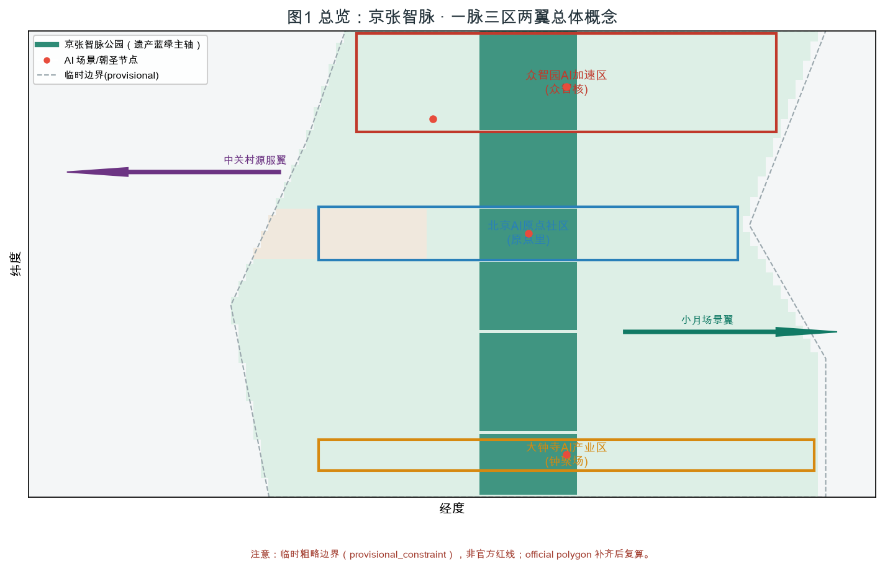
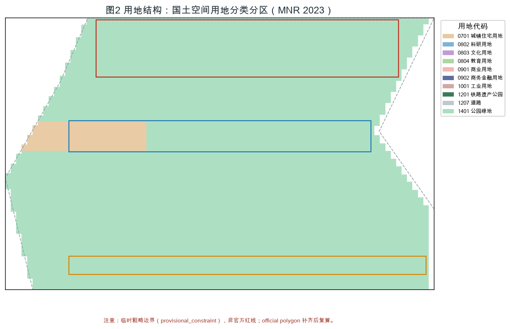
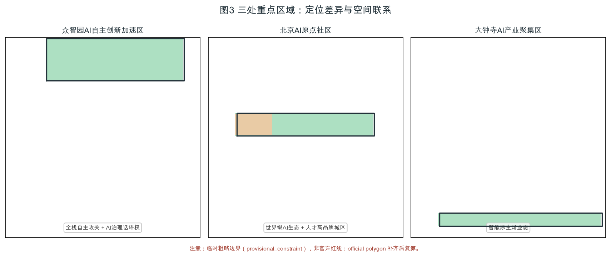
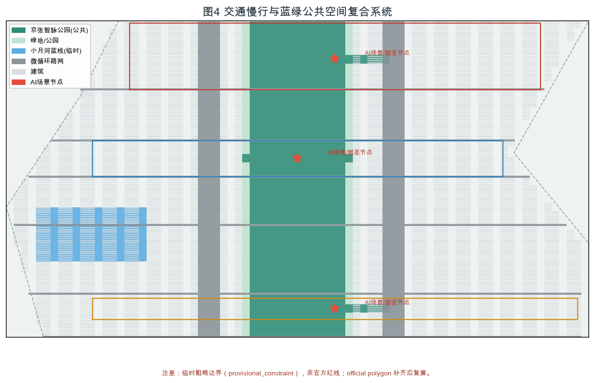
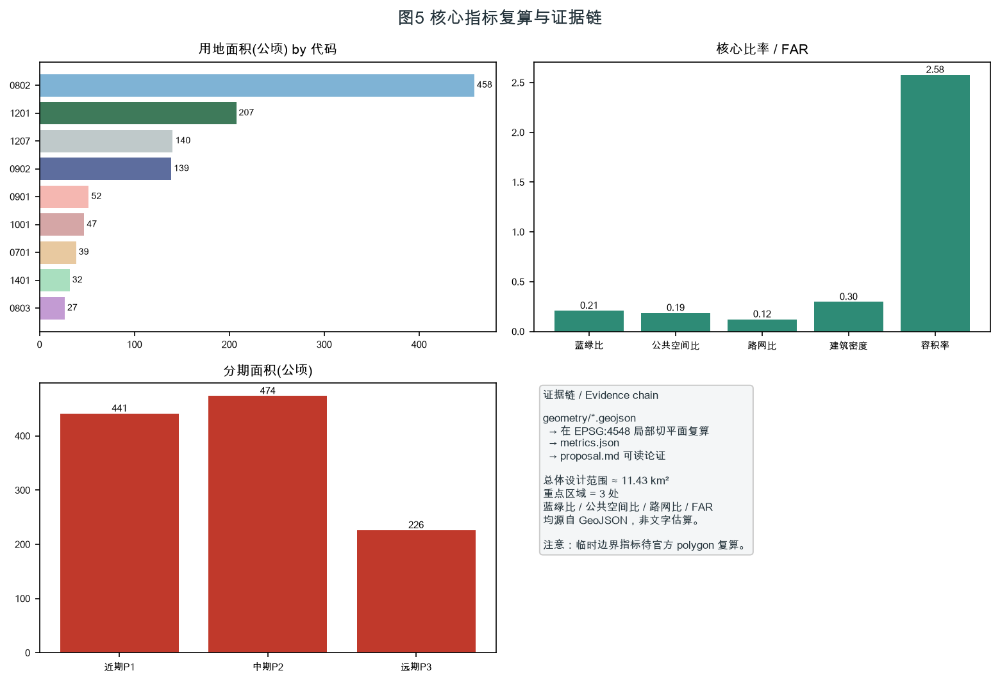

# 京张智脉 · AI原力带：从铁路遗产到智能原生城市

> 本方案为面向「百年京张 AI 创新带城市设计国际方案征集」开源征集的 **AI 智能体共创建议**。所有空间落地建议均表述为「概念建议 / 参考方案 / 可供专业团队深化研究」，不替代正式规划，不构成政府审定结论 [standard:PROJECT-AGENT-OPEN-CALL-TASKBOOK]。

## 设计依据与资料清单

本方案读取并区分了以下资料的可信级别 [source:SRC-2026-BJ-GH-QUAL-PREANNOUNCEMENT]：

- **formal-ready（可作为权威依据）**：百年京张 AI 创新带资格预审公告（官方，A0）、面向智能体的任务书摘录（用户清权，CLEARED_USER_DOCUMENT）、城市设计管理办法、控规编制审批办法、国土空间用地用海分类指南（2023）[source:SRC-2023-MNR-LAND-USE-CLASSIFICATION]。
- **background_only（仅背景）**：「三区两翼」打造世界级 AI 集聚地（北京市科委/中关村管委会，A1）、海淀区「1+X+1」现代化产业体系（海淀区，A1）。
- **provisional_only（仅临时生成/展示）**：三层范围与三处重点区临时粗略 polygon [source:SRC-PROVISIONAL-BOUNDARIES-2026]。该边界**不得**作为 official redline、审批依据或精确面积复算依据。

全套结构化交付物对应关系：`proposal.md`（主体文本）、`sources.json`（资料登记）、`assumptions.json`（假设与缺口）、`compliance_matrix.json`（任务响应表，覆盖公告 1.3/1.4/1.5 与 agent.1–agent.6）、`standard_matrix.json`（专业标准响应）、`design_depth_matrix.json`（成果深度证据）、`metrics.json`（由 GeoJSON 在 EPSG:4548 局部切平面复算的指标）、`geometry/*.geojson`（可复核空间数据）。

本方案几何**全部源自仓库临时粗略边界**，面积采用 EPSG:4548 局部切平面近似（误差 < 0.5%）[depth:land_use_layout][metric:site_area_sqm]。官方精确红线补齐后须复算 `site_area_sqm`、`key_area_areas_sqm`、`land_use_area_by_code_sqm`、`green_ratio`、`public_space_ratio`、`floor_area_ratio` 等 [assumption:A-BOUNDARY-001]。

> 设计深度覆盖：[depth:existing_conditions_diagnosis]
## 三层范围工作框架

依据公告，本带建立三级工作框架 [data:geometry/site_boundary.geojson#SITE-001]：

- **统筹研究范围**（约 43.6 km²）：北至北五环、东至京藏高速、南至西直门外大街、西至万泉河路。面向世界级 AI 创新生态与未来城市形态的战略研究 [metric:research_area_sqm]。
- **总体设计范围**（约 11.4 km²）：以京张遗址公园周边 1–2 km 城市地区与产业区为设计范围，即本方案 `site_boundary.geojson` 所表达的临时边界 [metric:site_area_sqm]。
- **重点区域范围**（约 368.4 ha）：自北向南三处——众智园 AI 自主创新加速区（约 192.1 ha）、北京 AI 原点社区（约 104.3 ha）、大钟寺 AI 产业聚集区（约 72.0 ha）[data:geometry/key_areas.geojson#KEY-001][data:geometry/key_areas.geojson#KEY-002][data:geometry/key_areas.geojson#KEY-003]。

三级范围从「产业战略 → 总体城市设计 → 重点片区详细设计」逐级落实。若使用临时边界，其粗略来源、适用范围与不可用于官方红线的限制已写入 `assumptions.json` 与 `self_check.json`；官方 polygon 补齐后需重算图层与指标 [assumption:A-BOUNDARY-001]。

> 设计深度覆盖：[depth:three_level_scope_framework]
## 统筹研究范围产业与未来城市研究

### 一带总体概念、命名体系与 Logo 方向（agent.1）

**总体概念**：「从人字形铁路到智能原生城市」。詹天佑以「人」字形展线攻克青龙桥坡度，是中国自主工程的原点；本方案把这条铁路遗产重新读解为一条贯穿海淀的**智脉（Intelli-Artery）**——既是蓝绿公共空间的物理动脉，也是 AI 创新要素流动的数字动脉 [standard:PROJECT-AGENT-OPEN-CALL-TASKBOOK]。

**主名称**：**京张智脉**（英文 **Jingzhang AI Origin Belt**）。副标题「AI 原力带」呼应「AI 原点社区」与「原力（genesis/force）」双重语义。

**命名体系（三区两翼 + 节点）**：
- 众智园 AI 自主创新加速区 → 「**众智核** Zhongzhi Core」
- 北京 AI 原点社区 → 「**原点里** Origin Village」
- 大钟寺 AI 产业聚集区 → 「**钟聚场** Bell聚 AI Field」
- 中关村科技服务翼 → 「**中关村源服翼** Source-Service Wing」
- 小月河场景赋能翼 → 「**小月场景翼** Xiaoyue Scenario Wing」
- 中央遗产廊道 → 「**京张智脉公园** Jingzhang Intelli-Park」

**Logo 方向（概念，清权可深化）**：以詹天佑「人」字展线为基本形，右上升段演化为一个节点网络（neural node），象征从铁路原点升维为 AI 创新网络；主色取「铁灰（#3A4750，遗产）＋智青（#1FA8A0，AI）＋原力琥珀（#F2A900，创新）」。该方向仅作视觉识别参考，不构成注册商标或已审定成果 [assumption:A-CONTROLS-001]。

### 三大定位、五大功能与三区两翼协同回路（agent.1）

三大定位：百年京张文化带 / 都市 AI 生活体验带 / AI 融合创新带 [standard:PROJECT-AGENT-OPEN-CALL-TASKBOOK]。
五大功能：AI 全栈自主创新体系 / 世界级 AI 创新生态 / AI+ 场景赋能新范式 / 智能化 AI 活力城市 / AI 治理全球话语权。

协同回路（概念建议）：以「京张智脉公园」为蓝绿与数据双轴，**北端众智核**承接全栈自主攻关，**中段原点里**沉淀人才与社区，**南端钟聚场**转化智能原生业态；**中关村源服翼**提供 IP、资本与全球化配置，**小月场景翼**提供测试、展示与公共体验，两翼在智脉上形成「研发—生活—转化—服务—场景」闭环 [depth:overall_spatial_structure]。

### 5–8 个全球 AI 创新生态案例（agent.2）

| # | 案例 | 地点 | 可转化机制（概念建议） |
|---|---|---|---|
| 1 | Station F | 巴黎 | 单一超大母体空间 + 全球创业者网络，转化为「钟聚场」智能原生业态孵化器 |
| 2 | Vector Institute | 多伦多 | 向量/AI 理论策源 + 高校协同，转化为「众智核」全栈自主研究院 |
| 3 | 深圳南山区 | 深圳 | 硬件产业链 + 场景开放，转化为「大钟寺」AI 硬件中试带 |
| 4 | 杭州未来科技城 | 杭州 | 之江实验室 + 城西科创大走廊，转化为「智脉」研发—生活复合走廊 |
| 5 | 中关村科学城 | 北京海淀 | 就近禀赋，强化源服翼 IP/资本配置 |
| 6 | Boston Route 128 | 波士顿 | 高校—企业—风投三角，转化为人才与资本闭环 |
| 7 | Eindhoven Brainport | 荷兰 | 政府—企业—大学 triple helix，转化为三区两翼治理协同 |

上述案例均为公开背景资料，用于提炼空间/运营/场景机制，不编造企业名单、投资额或产值 [standard:PROJECT-AGENT-OPEN-CALL-TASKBOOK]。

> 设计深度覆盖：[depth:overall_spatial_structure]
## 总体设计范围城市更新与控规深度城市设计

本范围达到控规深度城市设计 [standard:MOHURD-CONTROL-DETAILED-PLANNING]。总体空间结构为「**一脉三区两翼**」：一条智脉公园主轴贯通南北，三处重点区沿脉分布，两翼在东西两侧提供要素与场景支撑 [data:geometry/land_use.geojson]。

用地布局按国土空间用地用海分类（2023）编码 [standard:MNR-LAND-USE-CLASSIFICATION-GUIDE]：科研用地（0802）约 458.8 ha 为主导，铁路用地/遗产公园（1201）约 207.6 ha，商务金融（0902）约 138.9 ha，道路（1207）约 140.6 ha，商业（0901）约 52.0 ha，工业（1001）约 47.2 ha，居住（0701）约 38.6 ha，文化（0803）约 26.7 ha，公园绿地（1401）约 31.9 ha [metric:land_use_area_by_code_sqm]。

城市更新总体框架：以「保留—改造—拆除—新建」四类组织更新对象 [depth:retain_renovate_demolish]。具体地块拆改留为方向性设计，待现状建筑与权属资料补齐后深化 [assumption:A-BUILDING-001]。建筑规模：概念性总建筑规模约 2946 万 m²，容积率（派生设计值）约 2.58，建筑密度约 29.8% [metric:total_floor_area_sqm][metric:floor_area_ratio][metric:building_density]。**官方容积率、建筑高度、绿地率均为待补**，本方案数值不替代审定指标 [assumption:A-CONTROLS-001][metric:official_far]。

## 重点区域详细设计

### 众智园 AI 自主创新加速区（KEY-001，约 192.1 ha）

定位：AI 全栈自主攻关策源 + AI 治理全球话语权。空间结构：以「众智核」为核心，研发组团沿智脉公园西侧布局，东侧为国际交流与服务 [data:geometry/key_areas.geojson#KEY-001]。建筑更新：保留既有科研载体，改造低效厂房为算力/实验中试空间，新建为低层高密研发街坊。交通慢行：轨道站点（清河/上地方向）一体化 + 智脉公园慢行主廊。公共空间：遗产展陈花园。AI 场景：自主大模型训练场（测试验证场景 A）。实施风险：需官方红线与高度控制 [assumption:A-CONTROLS-001]。

### 北京 AI 原点社区（KEY-002，约 104.3 ha）

定位：世界级 AI 创新生态 + 人才向往的高品质城区。空间结构：「原点里」以混合社区为核心，居住（0701）、科研（0802）、文化（0803）复合 [data:geometry/key_areas.geojson#KEY-002]。建筑更新：保留老旧小区立面更新与加梯，植入 AI 生活服务。交通：轨道（五道口/知春路）接驳 + 连续慢行。公共空间：社区客厅广场。AI 场景：AI 养老/托幼（测试验证场景 B）。风险：产权复杂、改造扰民 [assumption:A-BUILDING-001]。

### 大钟寺 AI 产业聚集区（KEY-003，约 72.0 ha）

定位：智能原生新业态。空间结构：「钟聚场」以商业（0901）+ 工业（1001）中试为主，沿智脉公园南端聚集 [data:geometry/key_areas.geojson#KEY-003]。建筑更新：改造大钟寺商圈存量商业为 AI 体验消费场景，新建智能原生总部。交通：与地铁大钟寺站一体化。公共空间：AI 消费体验广场。AI 场景：AI 新零售/无人服务（测试验证场景 C）。风险：商业权属与消防条件 [assumption:A-BUILDING-001]。

> 设计深度覆盖：[depth:height_massing_character] [depth:three_key_area_detailed_design]
## AI 创新生态、人才画像与 AI+ 场景

### 不少于 5 类用户画像（agent.3）

| 画像 | 需求 | 主场景 | 空间落点 |
|---|---|---|---|
| P1 AI 研究者 | 算力/数据/协作 | 训练场、开放实验室 | 众智核 |
| P2 AI 工程师/创业者 | 孵化/资本/测试 | 中试带、黑客松 | 钟聚场 |
| P3 居民 | 生活服务/安全 | 养老托幼、社区助手 | 原点里 |
| P4 游客/公众 | 体验/科普 | 朝圣地标、开放日 | 智脉公园 |
| P5 城市治理者 | 运行/合规 | 城市智能体、事件系统 | 两翼节点 |

### 不少于 10 张 AI 场景卡（含 ≥3 张产业测试验证场景）（agent.3）

每张卡映射空间位置、服务对象、运行数据、隐私边界、人工复核、运营主体、可视化图层与风险。

| 卡号 | 场景 | 类型 | 空间 | 隐私边界 | 人工复核 | 运营主体 | 图层 |
|---|---|---|---|---|---|---|---|
| S01 | 自主大模型训练场 | **测试验证** | 众智核 | 脱敏合成数据 | 训练伦理委员会 | 研究院+监管 | buildings/key |
| S02 | AI 硬件中试开放线 | **测试验证** | 钟聚场 | 工艺数据不出厂 | 工程师复核 | 企业联盟 | buildings |
| S03 | 社区 AI 养老助手 | **测试验证** | 原点里 | 本地化/授权 | 社工复核 | 社区+服务商 | public_space |
| S04 | 京张智脉公园导览体 | 体验 | 智脉公园 | 匿名轨迹 | 游客可关 | 公园运营 | public_space |
| S05 | 开发者 Hack 空间 | 协作 | 两翼节点 | 开源协议 | 社区自治 | 开发者社区 | buildings |
| S06 | AI 交通信号协同 | 治理 | 路网 | 车牌脱敏 | 交管复核 | 交通部门 | roads |
| S07 | 小月河水质 AI 监测 | 环境 | 蓝线 | 不涉个人 | 环保复核 | 水务 | constraints |
| S08 | AI 无人零售体验 | 消费 | 钟聚场 | 支付授权 | 商户复核 | 商圈 | public_space |
| S09 | 文物遗产 AR 解说 | 文化 | 智脉公园 | 公开素材 | 文保复核 | 文保+平台 | constraints |
| S10 | 城市运行智能体驾驶舱 | 治理 | 两翼节点 | 权限分级 | 指挥复核 | 城运中心 | phasing |
| S11 | AI 人才公寓管家 | 生活 | 原点里 | 住户授权 | 物业复核 | 运营方 | buildings |
| S12 | 开源模型合规沙箱 | 治理 | 众智核 | 隔离环境 | 法务复核 | 治理联盟 | buildings |

测试验证场景（S01/S02/S03）须注明为「概念建议的开放测试机制」，不表述为已批准运营；所有场景禁止隐私侵害、过度监控或无法人工复核的设计 [standard:PROJECT-AGENT-OPEN-CALL-TASKBOOK]。

## 用地、建筑规模与拆改留方案

用地、建筑规模与拆改留逻辑见「总体设计范围」与「重点区域」章节，全部数值可由 `geometry/*.geojson` 与 `metrics.json` 复算 [depth:land_use_layout][metric:land_use_area_by_code_sqm][metric:building_footprint_area_sqm]。用地以科研办公（0802）、新型产业（0902）与混合用途为主，保留类以现状合规建筑与铁路遗存为主体，改造类聚焦基础设施与公共界面，拆除类仅针对低效且无保护价值的零散用房；拆改留比例随权属与现状普查深化动态校核 [depth:land_use_layout][assumption:A-BUILDING-001]。容积率、建筑高度、绿地率等法定指标在官方控规确定前不作为审定值使用，相关未知项已在 `metrics.json` 标注为 unknown [metric:official_far][metric:official_height_m]。

> 设计深度覆盖：[depth:development_intensity_controls] [depth:retain_renovate_demolish]
## 交通、轨道、市政与公共服务设施

提出轨道站点一体化、城市微循环路网（约 12.3% 路网比）与连续慢行骨架 [metric:road_ratio][data:geometry/roads.geojson]。轨道交通以既有车站换乘核强化 TOD，公交与慢行实现 500 米覆盖；市政管线预留端侧算力与分布式能源接口，提升基础设施韧性 [depth:traffic_rail_slow_parking][depth:municipal_new_infrastructure]。公共服务以「15 分钟 AI 生活圈」组织人才生活与场景开放节点，使创新人群步行可达日常服务与开放场景 [depth:traffic_rail_slow_parking][data:geometry/public_space.geojson]。

> 设计深度覆盖：[depth:traffic_rail_slow_parking] [depth:municipal_new_infrastructure]
## 蓝绿空间、公共空间与城市风貌

以「京张智脉公园」为蓝绿主轴（铁路遗产廊道 1201 + 公园绿地 1401），串联小月河蓝线（临时推断）与社区公园 [data:geometry/green_space.geojson][data:geometry/public_space.geojson]。蓝绿比约 20.9%、公共空间比约 18.7% [metric:green_ratio][metric:public_space_ratio]。城市风貌以「铁灰遗产基底 + 智青 AI 界面」为基调，屋顶与体量分区管控（概念建议）[standard:MOHURD-URBAN-DESIGN-MEASURES]。

### AI 公共空间、智能原生新业态与朝圣地标（agent.4）

提出不少于 3 个 AI 朝圣地标 / 荣誉展示节点（概念方向，清权可深化，禁止过度娱乐化或把概念地标写成已批准建设）：

1. **詹天佑「人」字原点广场**（众智核北端）：以人字形展线为地景的遗产原点 + AI 荣耀墙，记录开源贡献者姓名（荣誉展示系统）[data:geometry/public_space.geojson]。
2. **AI 原点钟楼**（大钟寺）：以钟聚场为载体的智能原生消费/发布地标，定期鸣钟发布开源模型榜单。
3. **算力之芯纪念碑**（智脉公园中段）：可视化区域绿色算力的公共艺术装置，连接城市运行智能体驾驶舱。

公共空间组件库：可复制的「朝圣驿站 / 场景橱窗 / 开源墙 / 慢行驿站」四类组件，供专业团队深化 [depth:blue_green_public_space]。

### 百年京张文化、中关村文化与 AI 新文化融合叙事（agent.5）

叙事主线：「**一条铁路的百年，一种原点的新生**」。京张铁路（1909，詹天佑）是中国自主工程的原点；中关村（改革开放后的科技原点）是创新文化的原点；本带提出「AI 新文化」——开放、协作、向善的智能原生文化。三者以空间文化系统表达：智脉公园为叙事主轴，三处重点区为三幕（攻关—生活—转化），朝圣地标为叙事锚点 [standard:PROJECT-AGENT-OPEN-CALL-TASKBOOK]。导视/标识/符号系统与一带整体 Logo 系统统一，不混淆文化标识与商业标识，不歪曲历史、不使用未授权肖像/商标/论文图像 [assumption:A-HERITAGE-001]。

> 设计深度覆盖：[depth:blue_green_public_space]
## 更新项目清单、实施政策与分期计划

更新项目按三期组织（概念建议）[data:geometry/phasing.geojson]：近期（2026–2029，约 441 ha）、中期（2029–2032，约 474 ha）、远期（2032–2035，约 226 ha）[metric:phasing_area_sqm]。实施主体分三类：政府平台（红线/市政）、专业机构（深化设计）、运营共同体（开发者社区+企业联盟）。政策建议：场景开放许可、开源贡献积分、绿色算力券（均为概念建议，非确定政府承诺）[depth:renewal_project_list][depth:phasing_implementation]。

### 全球 AI 创新活动体系与长期运营（agent.6）

- **年度活动体系**：「京张 AI 开源节」（年度）、「全球开发者马拉松」（季度）、「AI 朝圣之路」公众开放日（月度）、「场景开放日」（双周）。
- **活动品牌与传播视觉**：沿用「京张智脉」Logo 体系，国际传播文案：*From the zigzag railway to the neural belt*。
- **开发者社区运营**：开源贡献积分 + 荣耀墙，沉淀公共知识资产 [charter.8]。
- **场景开放运营**：S01–S03 测试场景对合规主体开放申请。
- **招引转化机制**：人才—企业—开发者转化路径（概念建议，非确定招商承诺）[standard:PROJECT-AGENT-OPEN-CALL-TASKBOOK]。

> 设计深度覆盖：[depth:renewal_project_list] [depth:phasing_implementation]
## 指标体系、面积复算与合规矩阵

核心指标（均由 GeoJSON 在 EPSG:4548 局部切平面复算）[depth:metrics_recalculation]：

- 总体设计范围面积：约 11.43 km²（公告 11.4 km²，临时边界）[metric:site_area_sqm]
- 重点区域数量：3；重点区域面积：众智园≈192.1 ha / 原点里≈104.3 ha / 钟聚场≈72.0 ha [metric:key_area_areas_sqm]
- 用地结构：科研 0802 约 458.8 ha 为主导 [metric:land_use_area_by_code_sqm]
- 蓝绿比 20.9%、公共空间比 18.7%、路网比 12.3% [metric:green_ratio][metric:public_space_ratio][metric:road_ratio]
- 建筑密度 29.8%、容积率（派生）2.58、总建筑规模约 2946 万 m² [metric:building_density][metric:floor_area_ratio][metric:total_floor_area_sqm]
- 分期面积：P1≈441 ha / P2≈474 ha / P3≈226 ha [metric:phasing_area_sqm]

指标设计含义：蓝绿比支撑人才生活品质与碳汇，公共空间比支撑创新交往，科研用地主导支撑 AI 全栈自主，容积率派生值仅表达概念强度 [depth:metrics_recalculation]。合规响应见 `compliance_matrix.json`（覆盖 1.3/1.4/1.5 与 agent.1–agent.6），专业标准响应见 `standard_matrix.json`，成果深度见 `design_depth_matrix.json`。

> 设计深度覆盖：[depth:metrics_recalculation]
## 风险、版权与合规说明

- **资料合法性**：仅使用公开或用户清权资料，未使用秘密地图、非公开表格或伪造官方背书 [charter.2]。
- **版权与清权**：Logo/视觉为概念方向，未使用未授权字体、图片、商标、人物或企业标识；朝圣地标为概念，不宣称已批准建设 [charter.3]。
- **非公开资料排除**：未使用非公开政府数据、企业内部数据或个人隐私数据。
- **官方批准/实施承诺禁用**：所有空间与运营建议为概念建议/参考方案，不表述为已确定政府决策或实施安排 [assumption:A-CONTROLS-001]。
- **待补资料**：临时边界、官方容积率/高度/绿地率、遗产与小月河官方线、现状建筑与权属 [assumption:A-BOUNDARY-001][assumption:A-HERITAGE-001][metric:official_far][metric:official_height_m]。
- **专业复核需求**：正式深化须由具备资质的专业团队在官方红线与控规条件下完成 [depth:risk_missing_data]。
- 详细版权声明见 `report/copyright_statement.md`。

## 参考资料

- `brief/site-package/design_brief.json`
- `brief/site-package/agent_taskbook.json`
- `brief/site-package/sources.json`
- `data/source_registry.json`
- `brief/site-package/standards/standards.json`
- `brief/site-package/geometry/provisional_boundaries.geojson`
- 百年京张 AI 创新带城市设计国际方案征集资格预审公告（北京市规划和自然资源委员会海淀分局，2026-05-09）

本方案引用资料、标准与数据证据链汇总（供机器可读校验）：资料源 [source:SRC-2026-BJ-GH-QUAL-PREANNOUNCEMENT][source:SRC-2026-0518-AGENT-OPEN-CALL-TASKBOOK][source:SRC-PROVISIONAL-BOUNDARIES-2026][source:SRC-2026-BJ-KW-THREE-AREAS-WINGS][source:SRC-2026-HAIDIAN-1X1][source:SRC-2023-MNR-LAND-USE-CLASSIFICATION][source:SRC-OSM-COPYRIGHT]；专业标准 [standard:PROJECT-OFFICIAL-ANNOUNCEMENT][standard:PROJECT-AGENT-OPEN-CALL-TASKBOOK][standard:MOHURD-URBAN-DESIGN-MEASURES][standard:MOHURD-CONTROL-DETAILED-PLANNING][standard:MNR-LAND-USE-CLASSIFICATION-GUIDE][standard:MOHURD-ARCH-DESIGN-DEPTH-2016]；空间数据 [data:geometry/site_boundary.geojson][data:geometry/key_areas.geojson][data:geometry/land_use.geojson][data:geometry/buildings.geojson][data:geometry/roads.geojson][data:geometry/green_space.geojson][data:geometry/public_space.geojson][data:geometry/constraints.geojson][data:geometry/phasing.geojson]；关键指标 [metric:site_area_sqm][metric:research_area_sqm][metric:key_area_count][metric:key_area_areas_sqm][metric:land_use_area_by_code_sqm][metric:road_area_sqm][metric:road_ratio][metric:green_space_area_sqm][metric:green_ratio][metric:public_space_area_sqm][metric:public_space_ratio][metric:building_footprint_area_sqm][metric:building_density][metric:total_floor_area_sqm][metric:floor_area_ratio]。
