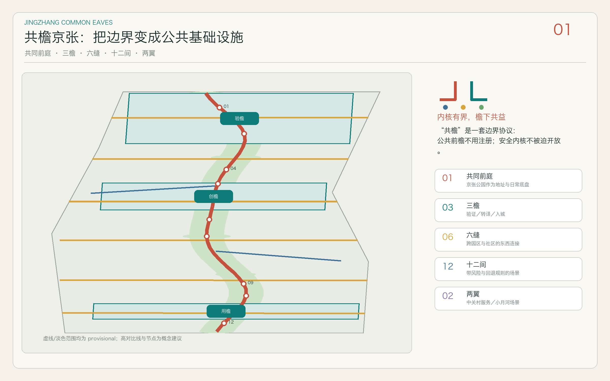
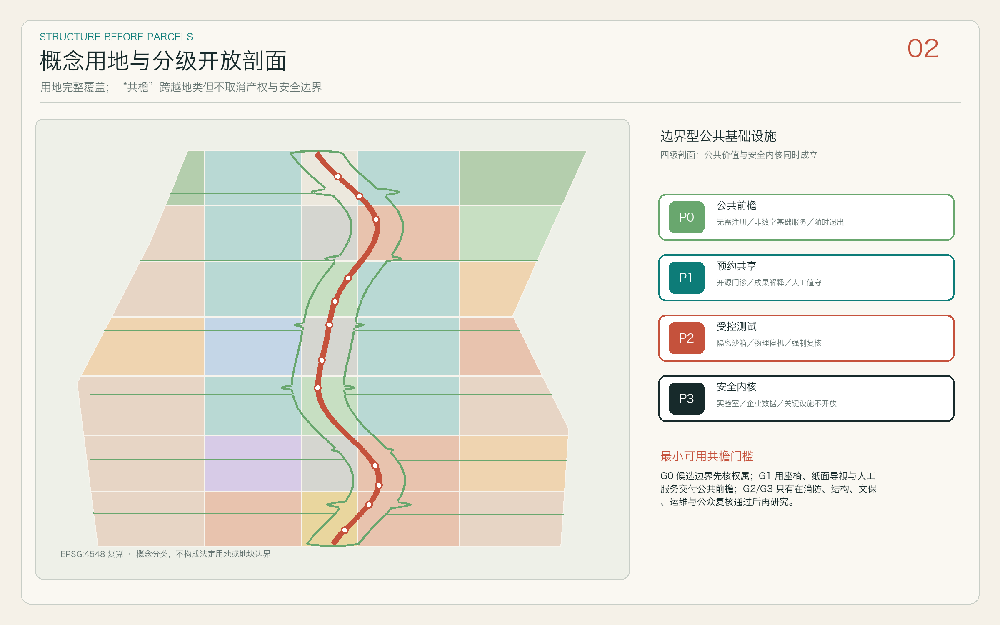
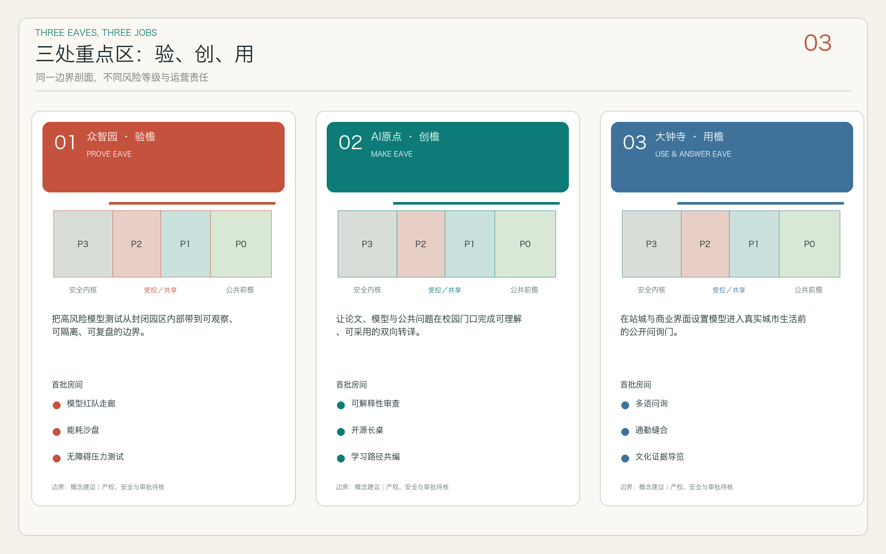
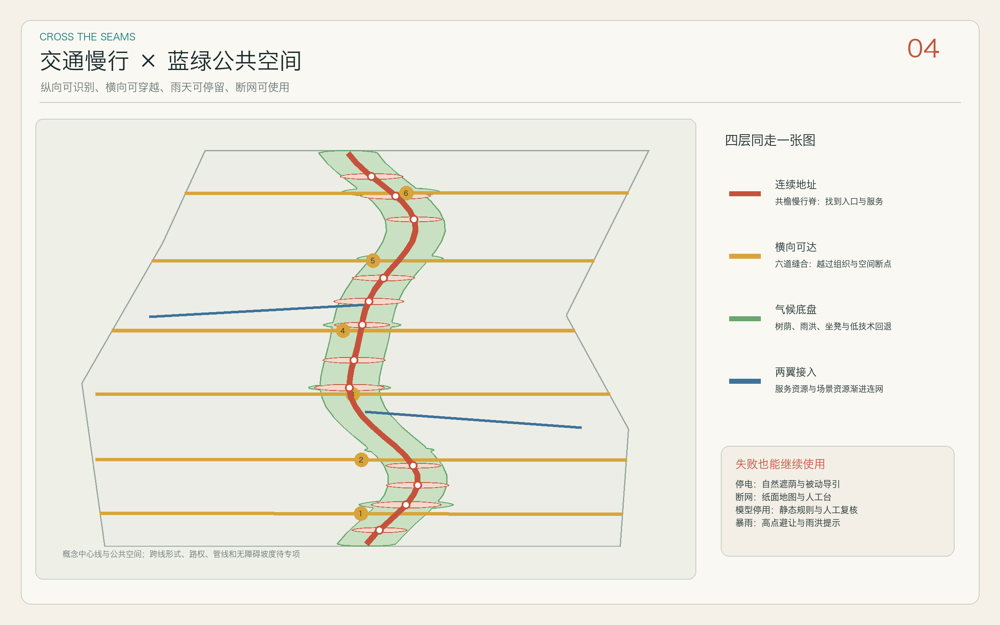
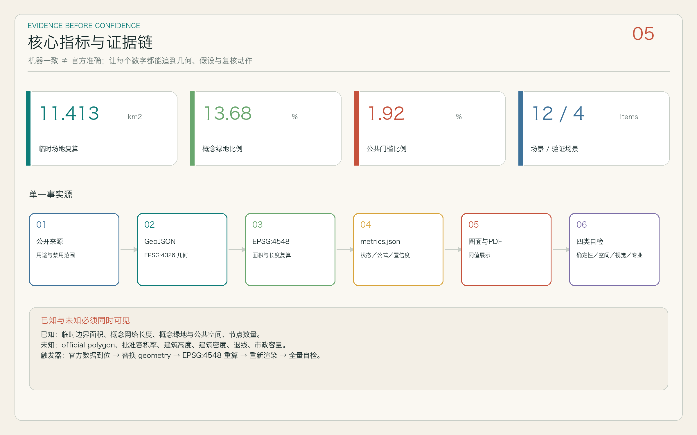

# JINGZHANG COMMON EAVES / -common eaves: transforms the park boundary into an AI public interface (Jing-Zhang)

> **Core Proposition: Secure Cores. Civic Edges.** The industrial park does not need to be fully open to continue delivering public value beyond secure boundaries to the city. All spatial actions in this text are presented as "Conceptual Recommendations," "Reference Plans," or "Materials for Further Professional Study," and do not constitute legal planning, government approval, engineering feasibility, investment commitments, or conclusions on demolition–renovate–retain strategies. (Demolish–Renovate–Retain Strategy)

## Design Basis and Source List

This proposal categorizes the evidence into four levels, rather than mixing all public information into a single "facts base." The first level consists of the project's own announcements, website task packages, and agent task books, which determine the three layers of scope, task lists, expression boundaries, and call-for-entries context, respectively recorded as [source:OFFICIAL-ANNOUNCEMENT], [source:SITE-PACKAGE], and [source:AGENT-TASKBOOK]; [standard:PROJECT-OFFICIAL-ANNOUNCEMENT] constrains the announcement response task, while [standard:PROJECT-AGENT-OPEN-CALL-TASKBOOK] constrains the three major locations, five functions, and six agent tasks. The second level is a professional standard snapshot at the local level: [standard:MOHURD-URBAN-DESIGN-MEASURES] for checking the integration of spaces, ambiance, and architectural facades, [standard:MOHURD-CONTROL-DETAILED-PLANNING] for distinguishing design recommendations from confirmed detailed planning conditions, [standard:MNR-LAND-USE-CLASSIFICATION-GUIDE] for constraining land use coding; [standard:MOHURD-ARCH-DESIGN-DEPTH-2016] is registered as a data gap due to the lack of verifiable official attachments and is not used to prove the depth of architectural construction drawings.

The third level consists of traceable background materials: the public source registry [source:SOURCE-REGISTRY] and the processed fact package [source:PROCESSED-FACT-PACK] only serve for navigation and cross-checking, and do not automatically upgrade the credibility level of the sources. The open spaces and community services along the Jing-Zhang heritage park are provided by [source:CONTEXT-JZ-PARK-2024] and [source:CONTEXT-JZ-PARK-2026]; historical clues such as the Qinghua Garden railway station are provided by [source:CONTEXT-QINGHUAYUAN-HERITAGE]; and the regional innovation and update directions are provided by [source:CONTEXT-HAIDIAN-15TH-PLAN]. The above background materials cannot replace the Official Planning Boundary, control plan, road boundary, land ownership, municipal capacity, cultural protection area, or engineering survey. The fourth level is the temporary spatial constraint: the polygons marked as provisional are provided by [source:BOUNDARY-SOURCE] and [source:KEY-AREA-SOURCE]; [data:geometry/site_boundary.geojson#SITE-001] and [data:geometry/key_areas.geojson] are used only for concept generation, plan positioning, and self-check, and are not official boundaries.

The lack of data itself is a design input. [data:geometry/constraints.geojson] represents the precision of the Official Boundary, control plans, roads, building conditions, ownership, utilities, flood control, fire safety, cultural heritage, and other missing items as an "analysis alert layer," never turning unknowns into prohibitions or known control lines. The verifiable layers, inference layers, and gap layers are separated, allowing human reviewers to trace back from the main text to `sources.json`, `assumptions.json`, the three matrices, and self-inspection results. The current diagnosis focuses on "which relationships can be determined, which values can be recalculated, and which judgments must be paused" rather than creating false precision; this corresponds to [depth:existing_conditions_diagnosis] and [depth:risk_missing_data]. If official boundaries or professional attachments are received later, the design logic should be retained, the constraint layers should be replaced, and a full recalculation should be triggered, rather than solidifying the temporary coordinates in this draft as conclusions.

## Three-Level Scope Framework

The three levels of scope are not three independent sets of diagrams, but an Evidence Chain from regional coordination to everyday thresholds. The Coordinated Research Area addresses "how AI innovation coexists with the city": it repositions the relationships between industry, talent, community, and Public Space through the perspectives of the century-old Jing-Zhang Cultural Belt, the Urban AI Living Experience Belt, and the AI Integration Innovation Belt, without creating new red lines. The Overall Design Area addresses "how the public interface forms a network": it uses Jingshang Ruins Park as a shared vestibule and address system, validating the "three eaves, six seams, twelve spaces" service agreement within a temporary scope through candidate boundaries, architectural prototypes, pedestrian-friendly design, blue-green infrastructure, public spaces, and phased layers. The Key-Area Detailed Design Area addresses "how the smallest actions are implemented at different thresholds": Zhongzhiyuan forms the verification eave, the AI Origin forms the creation eave, and Dazhongsi forms the utilization eave. These three use the same section language but do not replicate the same function. [depth:three_level_scope_framework] Therefore, it is not a hierarchy of areas, but a step-by-step implementation of "strategic issues—spatial prototypes—operational responsibilities."

Overall constraints adopt [data:geometry/site_boundary.geojson#SITE-001], with three key areas adopting [data:geometry/key_areas.geojson#PROV-KEY-001], [data:geometry/key_areas.geojson#PROV-KEY-002], and [data:geometry/key_areas.geojson#PROV-KEY-003]. The current [metric:site_area_sqm] and the three areas are merely recalculated geometric values of the provisional polygon under EPSG:4548, which can be used for validating the closure of the package layers but should not be used for formal scoring of land, investment, legal indicators, or scheme quality; [metric:key_area_count] only confirms that the three directional study objects are fully covered. After the official polygon is in place, the site/key-area layers should be replaced, and the geometry should be re-clipped from [data:geometry/land_use.geojson], [data:geometry/buildings.geojson], [data:geometry/roads.geojson], [data:geometry/green_space.geojson], [data:geometry/public_space.geojson], and [data:geometry/phasing.geojson]. Recalculate all areas, lengths, and ratios.

"Common Eaves" deliberately adopts **boundary-type public infrastructure** rather than isolated central buildings: it prioritizes thresholds between campuses and districts, stations and parks, research and living spaces, allowing the sides to share a segment of a public interface that is accessible, parkable, inquirable, and verifiable without sharing all internal permissions. The sectioning runs from the city side to the institution side as follows: P0 a public forecourt with no registration (barrier-free, shading, paper information, human assistance); P1 a reserved shared space (open-source clinics, results explanation, talent services, and small events); P2 a controlled pre-lobby for testing (isolating data, logs, physical downtime, and mandatory Human Review); P3 a non-open secure core (labs, corporate data, and critical facilities). The minimum viable threshold is P0 plus a clearly timed human service point; P1 to P2 are layered based on site, governance, and operational capacity, while P3 remains closed regardless of the "publicness" narrative. All dimensions, fire safety, structural details, and accessibility features must still be reviewed by a professional team. This framework constrains consistency with [depth:overall_spatial_structure] and coordinates public character and aesthetic coherence with [standard:MOHURD-URBAN-DESIGN-MEASURES].

## Coordinated Research Area: Industry and Future City Research

Proposal main name "Jing-Zhang Common Eaves" shifts the design focus from "yet another AI campus" to "how different stakeholders can share the threshold." The English name **JINGZHANG COMMON EAVES** retains the dual meaning of location identification and public interface; the international subtitle is **AI at the Civic Edge**, and the slogan is "Secure cores. Civic edges." The logo does not use a person's name, sloping roof, dual tracks, or pulses: two opposing boundary lines fold out a horizontal shared eave towards the urban side, leaving an open threshold in the center, with three status nodes representing Verify, Create, and Use; warm gray is the heritage background, blue-green marks public services, and amber only indicates testing or artificial takeover. The graphics, font layout, and color values are original directions, not using corporate trademarks, individuals, unauthorized images, or fonts; the cultural identity system and the main logo are managed in layers. [source:AGENT-TASKBOOK] [standard:PROJECT-AGENT-OPEN-CALL-TASKBOOK]

The three key positioning elements are interconnected through a unified spatial mechanism: the Centennial Jing-Zhang Cultural Belt provides a "rail pillow—threshold—common eaves" narrative of time, the Urban AI Living Experience Belt integrates transportation, education, health, law, and living services into exitable public scenarios, and the AI Convergence Innovation Belt organizes research, testing, translation, procurement, and feedback into traceable loops. The five functional areas are not fragmented land uses: the Full-Stack Independent AI Innovation System completes controlled testing at the verification eaves; the world-class AI Innovation Ecosystem completes inter-institutional collaboration at the translation eaves; the AI-Enabled Scenario Enabling New Paradigm enters communities along six east-west stitching paths; the Intelligent AI Vibrant City is perceived daily at twelve public service nodes; and AI governance global discourse is formed through reviewable public products by public issue tracking, review cards, and contribution records. The Three Zones and Two Wings form a cycle: Zhongzhiyuan verifies, AI Origin translates, and Dazhongsi faces urban use, while the Zhongguancun Technology Services Wing provides intellectual property, capital, and professional service suggestions, and the Xiaoyue River Scenario Enablement Wing provides real problems that can be observed by the public, but any recruitment, funding, and policies are not written as predetermined arrangements. [depth:overall_spatial_structure]

Five international cases are extracted for mechanisms, not for image replication. **Kendall Square**'s official plan transforms an innovation district into an innovation community, emphasizing pedestrian public realms, ground-floor vitality, and connections to surrounding communities; this case is translated as "Shared Eaves at the Park Entrance," rather than replicating its architectural style. [source:CASE-KENDALL] **Singapore's one-north** demonstrates the possibility of integrating multiple types of R&D, living amenities, and public management platforms within a single innovation district; this case draws on cross-subject service orchestration but does not reference its Development Intensity or governance model. [source:CASE-ONE-NORTH] **Seoul AI Hub** provides an integrated model for incubation, talent, and AI enterprise support; this case further requires that support functions must be perceivable and interrogable from the street level. [source:CASE-SEOUL-AI-HUB] **Maria 01** illustrates how existing built environments can support entrepreneurial communities through adaptive reuse; this case prioritizes "retention, adaptation, and interface transformation," not through extensive demolition and reconstruction to achieve recognition. [source:CASE-MARIA-01] **Barcelona** demonstrates public-private innovation, knowledge transfer, and citizen science practices that position the city itself as a platform for collective learning; this case embeds public issue tickets, Human Review, and public result summaries within twelve operational bylaws. [source:CASE-BARCELONA]

Case studies guide an original judgment: the scarcity of a world-class ecosystem is not just computational power or buildings, but **low-friction but bounded encounter protocols**. The Jing-Zhang Heritage Park thus serves as a shared vestibule and address system, not a single central line that all institutions must obey; the three eaves are boundary prototypes with different governance tasks, the six seams are relational suggestions that span linear barriers, and the twelve rooms are small service/test nodes that can be independently operated, closed, or updated. Continuity comes from a unified service standard and identification system, without requiring the continuous construction of new canopies; conservation areas, ecologies, or sensitive residential segments can be left blank. They collectively establish a cycle of "problem discovery—controlled validation—public explanation—city adoption—open archiving"; any technology that fails to meet privacy, ethical, safety, operational, and Human Review thresholds can be halted at P2 without spreading to P0/P1. This research conclusion is mapped through [data:geometry/roads.geojson], [data:geometry/public_space.geojson], and [metric:scenario_node_count], available for industry, planning, and operational teams to deepen, without constituting an admission or procurement commitment.

## Overall Design Area: Urban Renewal and Regulatory-Plan-Level Urban Design

Overall structure is summarized as "common vestibule, three eaves, six seams, and twelve intervals." The common vestibule along the Jing-Zhang spatial corridor provides pedestrian and bicycle access, shaded walkways, public information, and a unified address; the three eaves are differentiated boundary prototypes for the north, middle, and south; the six seams are the east-west conceptual relationships connecting the adjacent communities, campuses, stations, and innovation institutions; the twelve intervals are replaceable nodes for scenes, services, and honor records. The structure emphasizes the boundary profile rather than axial memorials: temporary extents are indicated with low-contrast dashed lines, while the primary visual weight is given to the  permission gradient, accessibility, resting points, validation paths, operators, and human services. [data:geometry/roads.geojson] records the concept centerline for the common vestibule's slow-moving lines and seam relationships, [data:geometry/green_space.geojson] records the canopy green spaces and rainwater buffer suggestions, [data:geometry/public_space.geojson] records the public nodes, and [depth:overall_spatial_structure] checks whether the three together form a usable network.

The land use is not an endorsement of the current or statutory zoning, but rather a design district intended to verify whether the overall structure can be seamlessly covered within a single boundary. [data:geometry/land_use.geojson] Adopt the prescribed coding to ensure no overlaps or gaps; the categories of research and office, public services, residential services, commercial services, green spaces, open spaces, and transportation are used as a conceptual expression of functional compatibility, without implying any adjustment of land use. [standard:MNR-LAND-USE-CLASSIFICATION-GUIDE] [depth:land_use_layout] Building layers [data:geometry/buildings.geojson] only place prototypical footprints for "facade renovation, adaptive reuse candidates, and conditional infill," not a census of existing buildings, and do not advocate for the demolition of any specific buildings. Conceptual footprint coverage [metric:building_density_ratio] and [metric:building_footprint_area_sqm] are only used for visual review. Floor Area Ratio, total floor area, height, set-backs, and underground space are to be maintained as unknown, clearly delineated by [depth:development_intensity_controls] and [depth:height_massing_character], for confirmation.

Update methods decrease incrementally from the boundary inward: the first layer focuses on restoring public access and continuity; the second layer transforms the ground floor or perimeter walls into visible, approachable, and exitable shared thresholds; the third layer addresses the adaptability of internal spaces; only after verifying ownership, structure, fire safety, cultural heritage, control plans, and needs can professional teams study conditional additions. This sequence allows for the "minimum viable threshold" to be achieved through minimal means such as signage, shading, seating, and data minimization protocols, without relying on megastructures. The six seams only express connection needs and do not constitute conclusions for bridges, road alignments, or crossings. All roads, green spaces, waterways, municipal, and cultural heritage overlays must be re-verified on subsequent professional base maps, [data:geometry/constraints.geojson] retains these blocking conditions, and [depth:retain_renovate_demolish] records the method rather than the parcel conclusions.

The overall appearance adopts four control recommendations: "light eaves, long tables, readable structures, and reversible modules." The eaves should remain light and thin, forming a network without seeking full coverage; the long tables are both collaborative furniture and public feedback interfaces; the structures and operational states should be understandable; and sensors, screens, and signs should use interchangeable modules. The hierarchical open sections must simultaneously display P0 public front eaves, P1 reserved shared areas, P2 controlled test zones, and P3 secure cores. Thresholds should provide open hours, permissions, data uses, operators, contact persons, maintenance status, and shutdown conditions, without relying on black-box automatic doors to create a sense of technology. [standard:MOHURD-URBAN-DESIGN-MEASURES] This language is used to guide subsequent architectural and landscape design refinements, but the official attachments required by [standard:MOHURD-ARCH-DESIGN-DEPTH-2016] are still missing, so this plan does not claim architectural design depth.

## Detailed Design of Key Areas

**Zhongzhiyuan AI Independent Innovation Acceleration Area——Verify Eave.** Corresponds to the temporary key area [data:geometry/key_areas.geojson#PROV-KEY-001]. The positioning is to bring full-stack self-innovative and AI governance from a closed demonstration environment to the "observable but controlled" edge of the park: a public promenade for viewing non-sensitive test summaries, a group of scheduled test rooms for model red team, edge-side computing, and accessibility validation, and a human review station for stopping, explaining, and registering disputes. The spatial structure is a four-layer profile of "Qinghe/Green Shade Interface—public observation belt—controlled sandbox—internal R&D"; the architectural strategy prioritizes interface renovation and adaptive reuse, without specifying the retention or removal of building units; the transportation strategy will separate pedestrian access, logistics, and test equipment; Public Spaces provide observation and discussion without collecting identity data. Risks include incomplete documentation on rivers, flood control, roads, ownership, confidentiality, and equipment safety, so all lines, scales, and scenarios must be rechecked, and test nodes cannot be equated with approved operations. [depth:three_key_area_detailed_design]

**Beijing AI Origin Community —— Translate Eave (Translation Eave).** Corresponds to [data:geometry/key_areas.geojson#PROV-KEY-002]. The positioning is to translate university/academic research outcomes into problems and prototypes that developers can reuse, residents can understand, and public authorities can review. The spatial structure is "open-source long table — small presentation stage — talent and intellectual property service counter — community problem wall — near-school slow travel loop," which does not require restricted research data within the campus but establishes clear shared licenses at the boundary. Building updates prioritize first-floor accessibility, flexible small spaces, and quiet nighttime boundaries, avoiding the compression of learning and living by high-intensity commercialization. Transportation through walking and cycling is suggested to connect the park, campus, and community, with specific school gate and road organization awaiting confirmation by the management. The AI scenario focuses on result retrieval, educational tutoring, legal information, and community co-creation, with each output retaining its source and human referral. Risks include campus boundaries, intellectual property, minor data, noise, and fire safety, so "openness" is time- and level-specific rather than unconditional access. [source:CONTEXT-HAIDIAN-15TH-PLAN]

**Dazhongsi AI Industry Cluster — Welcome Eave.** Corresponds to [data:geometry/key_areas.geojson#PROV-KEY-003]. The positioning is to allow those arriving at the station to understand "what AI can and cannot do, and how to seek human assistance" before entering the industrial network. The spatial structure is "four-directional arrival mouths—model entry gate—intelligent native service street—public inquiry and demonstration court," emphasizing connection rather than creating a single tower. The architecture is suggested to improve the arrival experience with continuous first-floor spaces, mixed-time service, and reversible exhibition displays; the transportation proposes the concept of quadrants of continuous pedestrian continuity but does not advocate for the addition of bridges or tunnels or changes to the rail facilities; Public Spaces provide multilingual, barrier-free, and low-technology backup guidance. The scenarios include travel assistance, urban service inquiries, creator-specific experiences, and international visitor tours, with all recommendations requiring the indication of commercial relationships and exit strategies. Risks include the absence of station facilities, road intersections, municipal pipeline data, passenger flow, and commercial ownership records, which need to be reviewed by teams of transportation, rail, fire safety, and operations.

Three eaves adopt the same "minimum envelope": continuous barrier-free access, clear signage, a manned service point during operating hours, non-personalized operation status, paper/phone-based low-technology backup. After acquiring governance and maintenance capabilities, appointment sandboxes, event layers, and nighttime activities are added. This approach ensures that public value can still be initiated with smaller, reversible actions even if certain areas are constrained by boundaries or approvals and cannot form complete buildings. Corresponding AI functions are not opened if any of the manned service, data lists, or fallbacks are missing. The three conceptual schemes are collectively reviewed against [metric:key_area_count], [metric:key_area_total_sqm], and three key area indicators, but the area only describes the current provisional layer and does not prove the scale of construction. The results of mutual learning among the three eaves enter the contribution trabeche, not replacing public honor with corporate advertising. [standard:MOHURD-CONTROL-DETAILED-PLANNING]

## AI Innovation Ecosystem, Personas, and AI+ Scenarios

The ecosystem map is organized around "problem raisers—technology providers—independent reviewers—site operators—daily users," rather than a list of companies. Six types of profiles are as follows:
1. Model/System Engineers, who require reproducible testing, data permissions, and failure records;
2. Entrepreneurs and technology transfer managers, who need small-scale trials, intellectual property, and procurement pathways;
3. Students, young researchers, and open-source contributors, who require low-barrier collaboration, mentors, and contribution memory;
4. Community residents, seniors, child caregivers, and people with disabilities, who require clear language, accessibility, human alternatives, and no forced digitalization;
5. Commuters, cyclists, delivery personnel, and station-city visitors, who require continuous guidance, short rest stops, low-latency assistance, and no tracking of identity;
6. Public administrators, ethics/safety reviewers, and site operators, who require issue tickets, opt-out rights, audit logs, and inter-departmental responsibility interfaces. Each profile includes the right to "receive basic services without using AI." [source:AGENT-TASKBOOK]

Twelve scene cards bind together space, data, human elements, and risk; "verify" indicates a controlled trial recommendation, not technical maturity or approval for deployment:

| Identifier and Scenario | Space / Service Target | Minimum Data and Privacy Boundaries | Human Review, Operations, and Rollback |
|---|---|---|---|
| SC-01 **Full Stack Model Red Team Corridor [Validation]** | Validate eaves reservation sandbox; model team, security reviewers [data:geometry/public_space.geojson#SC-01] | Synthesize or privileged test set; prohibit input of confidential business information and personal data | Independent reviewer can immediately halt testing; only risk categories and remediation status are publicly disclosed, failure results in offline evaluation |
| SC-02 **End Side Computational Energy Sandtable [Validation]** | Validate the canopy equipment room; engineers, maintenance personnel [data:geometry/public_space.geojson#SC-02] | Minimize equipment telemetry, do not collect user identity | Review by energy/fire safety professionals; automatic overload cutoff and revert to static display |
| SC-03 **Accessibility Wayfinding Pressure Test [Verification]** | A closed segment within the Six Stitches; users with disabilities, commuters [data:geometry/public_space.geojson#SC-03] | Voluntary participation, short-term location data, edge-side processing, original trajectories not leaving the test domain | Accessibility experts and participants have veto power; fault-tolerant entity identifiers and manual guidance |
| SC-04 **Public Service Response Explainability Review [Verification]** | Transcribe Eavesdrop Review Station; Residents, Legal/Political Professionals [data:geometry/public_space.geojson#SC-04] | Only use public policy text and simulated questions, do not collect real individual case identities | Professionals sign off line by line; uncertain answers must be refused and redirected to the human operator window |
| SC-05 **Open Source Long Table Translation** | Origin Community; Students, Researchers, Entrepreneurs [data:geometry/public_space.geojson#SC-05] | Projects can choose their own open source scope; default is not to upload unauthorized code | Community Facilitator and Intellectual Property Advisor Review; Provide a face-to-face collaborative mode without AI |
| SC-06 **Health Navigation Rather Than Diagnosis** | Community Eavespace; Residents, Caregivers [data:geometry/public_space.geojson#SC-06] | No Patient Records Kept, Only Navigation Based on Public Institution Service Information for Departments/Processes | Content Reviewed by Medical Personnel; Any Symptom Judgments Refer to Formal Medical Services, Emergency Situations Call for Human Emergency Response |
| SC-07 **Collaborative Learning Pathway** | Original Community Part-Time Classroom; Students, Teachers, Parents [data:geometry/public_space.geojson#SC-07] | Minors require guardian consent; prohibit image marketing; learning records can be deleted | Teacher decides on content and evaluation; system failure reverts to paper materials and peer tutoring |
| SC-08 **Legal Information Triage** | Common Roof Public Service Desk; Residents, Entrepreneurs [data:geometry/public_space.geojson#SC-08] | Collect only the minimum facts necessary to complete the referral; no automatic credit or risk scoring | Final review by lawyers or legal service providers; clearly state "non-legal advice" and provide an option for in-person appointments |
| SC-09 **Commuter Seam Assistant** | Shared Vestibule and Six Stitches; Commuters, Cyclists, Visitors [data:geometry/public_space.geojson#SC-09] | Utilizes public transit status and anonymous traffic aggregation, without facial recognition or individual tracking | Traffic management and operations personnel release, revert to static signs and announcements in case of anomalies |
| SC-10 **Shade Comfort Manager** | Blue-Green Public Space; Elderly, Children, Outdoor Workers [data:geometry/public_space.geojson#SC-10] | Environmental data such as temperature, humidity, and lighting, no personal identity data collected | Landscape and site personnel review maintenance recommendations; sensor failure does not affect space openness |
| SC-11 **Model Entry with Multilingual Inquiry at the City Gate** | Dazhongsi City Gate Entry; International Visitors, Station-City Users [data:geometry/public_space.geojson#SC-11] | Conversations can be non-retentive; sensitive questions are locally cleared, with no commercial push | Human staff can take over; offline multilingual cards, maps, and telephones form a low-technology backup |
| SC-12 **Jing-Zhang Cultural Evidence Tour** | Site Park Public Path; Residents, Visitors, Researchers [data:geometry/public_space.geojson#SC-12] | References only verified public records; no synthesized "historical figure testimonies" | Professional Historical and Cultural Review Version; questionable areas clearly marked and allow public submissions for corrections |

Four validation scenarios precede service deployment, as "availability" must meet technical, ethical, spatial, and operational conditions simultaneously. All cards use a four-tier risk gate: R0 public information with no personal data can operate under manual sampling; R1 low-sensitive, short-term data must have explicit consent and a deletion mechanism; R2 data involving health, law, minors, or location tracking must be controlled with scheduled appointments and professional review; R3 data that cannot be explained, cannot be exited, requires secret data, or may cause significant personal or rights impact shall not enter public pilots. Each node provides a status light, purpose card, data list, responsible party, complaint/feedback entry, and physical retraction, without substituting "agreement to service terms" for substantive informed consent. The total number of scenario nodes is reviewed by [metric:scenario_node_count], the number of validation scenarios is reviewed by [metric:validation_scenario_count], and the coverage of the profile is reviewed by [metric:persona_count].

The Xiaoyue River Scenario Enablement Wing does not open for comprehensive data collection, but rather invites the community to propose issues, establish prototypes in controlled sites, and evaluate them using publically understandable metrics, before deciding whether to expand. The Zhongguancun Technology Services Wing provides referrals for licensing, intellectual property, standards, ethics, funding advice, and international collaboration; it does not promise funding or business attraction results. The scenarios flow from SC-01 to SC-12 along the path of "validation—translation—daily use—public archiving," and at any stage, they retain the right to stop and undergo Human Review. [depth:municipal_new_infrastructure] Constrains data and equipment foundations, [depth:risk_missing_data] constrains unknown data and responsibilities, immature technologies only enter the sandbox and are not disguised as complete services in Public Spaces.

## Land Use, Building Scale, and Retain-Renovate-Demolish Strategy

[data:geometry/land_use.geojson] is a complete topological zoning of the provisional site, expressing conceptual functions through the specified `land_use_code`, not a current survey, land tenure, or statutory Land-Use Plan. Design judgment is that the continuity of innovative spaces is generated by the first-floor public interface, slow-moving activities, and service periods, and should not rely solely on increasing the proportion of R&D offices. Research/office spaces are responsible for R&D and translation, public management and public services for manual reviews, talent, and community services, commercial services for daily amenities, residential and living services to maintain 24/7 demands, green spaces and plazas for free public events, and transportation spaces to ensure access. Each zone area can be recalculated using EPSG:4548 and verified to be seamless and without overlap with the site union; the classification responds to [standard:MNR-LAND-USE-CLASSIFICATION-GUIDE] and [depth:land_use_layout], but any use conversion still requires statutory procedures.

[data:geometry/buildings.geojson] Only records the conceptual footprint of twelve types of coplanar interface prototypes, and cannot correspond one-to-one with the current building units. The Demolish–Renovate–Retain Strategy uses a five-step decision tree: first, **retain** spaces that have usage value and no clear conflicts; second, **candidate adaptive reuse**, which, after structural, fire safety, ownership, and cultural heritage verification, studies phased sharing; third, **candidate façade renovation**, prioritizing the improvement of entrances, ground floors, shading, and visible services; fourth, **conditional infill**, only studies small-scale, reversible constructions when controlled planning, ownership, structural integrity, and public demand support it; fifth, **unknown/pause**, where no judgment is made on demolition or new construction due to insufficient documentation. This method is recorded by [depth:retain_renovate_demolish]; "not drawn" indicates unknown, not equivalent to demolition, and "drawn" indicates design prototypes, not equivalent to approved construction.

Building Footprint Area [metric:building_footprint_area_sqm] and Conceptual Coverage Ratio [metric:building_density_ratio] are used to check for over-occupation of the site and cannot replace the approved building coverage ratio. Total Gross Floor Area [metric:total_floor_area_sqm], Floor Area Ratio [metric:floor_area_ratio], Building Height [metric:building_height_m], approved Building Coverage Ratio [metric:approved_building_density], and setbacks [metric:setback_m] must remain unknown until official zoning plans, as-built surveys, land ownership, and professional arguments are obtained. The style recommendations are not a uniform appearance: public facades are light and transparent, readable, while controlled facades allow for necessary safety and confidentiality, and historical sensitive areas use reversible, low-intervention elements. Living interfaces are controlled for glare, noise, and nighttime screens. [depth:development_intensity_controls] and [depth:height_massing_character] therefore document both "Design Method Complete" and "Unknown Regulatory Parameters" to avoid obscuring data gaps with a fully rendered image.

 : Each "interval" must have a designated responsible party, scheduled duty periods, a suggested source for maintenance budgeting, a rollback and exit mechanism, before discussing the equipment; it can degrade to a regular bench, canopy, notice board, or community table when idle. The Common Eaves is not a continuous mega-roof; what is continuous are the service agreements, signage, slow travel experiences, and tree canopies. The buildings can be discrete; this both reduces unnecessary intervention in the current conditions and ownership, and allows for incremental verification of the smallest package. All buildings, equipment, lighting, structures, fire safety, energy systems, and accessibility dimensions must be thoroughly researched by a professional team, and this document does not provide construction guidelines.

## Transport, Rail, Municipal Infrastructure, and Public Services

The transportation concept consists of "shared vestibule walkways, six seams, and three arrival interfaces." The lines in [data:geometry/roads.geojson] are connectors and length recalculated objects, not right-of-way or engineering alignments. The shared vestibule prioritizes pedestrian, wheelchair, bicycle, and essential maintenance access. The six seams connect the east and west communities, campuses, parks, and public transit. The three arrival interfaces serve northern validation, central co-creation, and southern public adoption. The road centerline length [metric:road_centerline_length_m], shared vestibule walkway length [metric:common_eaves_spine_length_m], and seam count [metric:cross_stitch_count] are used to compare network integrity; crossing railroads, waterways, expressways, campuses, or property boundaries requires additional transportation, bridge and tunnel, flood control, and safety arguments. [depth:traffic_rail_slow_parking]

The hierarchical open profile juxtaposes mobility with access levels. P0 Public Forefront must meet clear, barrier-free conditions, including basic nighttime lighting, shading/cover from rain, non-digital information, and manual assistance, and must remain functional even when all AI systems are disabled; P1 Reservation Shared Layer adds open-source clinics, talent services, short-term events, and minimal data; P2 Controlled Test Vestibule sets physical boundaries, reservations, data descriptions, observation points, and shutdown rights; P3 is a non-open secure core, not included in public passage. The **Minimum Usable Threshold** is defined as "P0 segment + one identifiable manual service + a set of low-tech backup systems," and is not a fixed engineering width; specific net width, slope, fire separation, tactile paving, and crosswalk timing are determined by a professional team based on site conditions and regulations. Parking is not assumed to be resolved by adding large new garages; instead, priority is given to the study of non-motorized vehicle parking, logistics time windows, accessible passenger loading and unloading, and shared parking coordination. Underground spaces are not assessed for feasibility.

Public Space

Municipal and new infrastructure adopt an "public services before equipment" architecture: reserved low-voltage electricity, network, and concept interfaces for closable edge computing and environmental sensing in the shared eaves; sensitive computing is defaulted to controlled zones, with only necessary states and non-personalized summaries displayed on the public side. Professional base maps for power capacity, communication access, water and drainage, flood control, gas, sanitation, fire safety, emergency response, and data security have not been obtained, hence [data:geometry/constraints.geojson] only registers items awaiting verification without drawing false pipelines. [depth:municipal_new_infrastructure] requires each AI facility to have an energy cap recommendation, manual shutdown, offline mode, equipment maintenance, and data deletion; if any responsible party is missing, the node can only be opened as a public space without equipment.

Public services are organized into a "Twelve Shared Catalog": information kiosks, talent and intellectual property referrals, open-source collaboration, educational support, health navigation, legal information, accessibility services, commuting assistance, environmental comfort, cultural evidence, testing observations, and contribution archives. Services can be shared across time and space to avoid the inefficiency of dedicated rooms for single departments. The catalog is merely an operational guideline; specific service qualifications, personnel, facilities, and procurement are confirmed by relevant authorities in accordance with the law. Tracks, roads, parking, municipal, and public services are reviewed on the same layer to ensure that so-called AI nodes do not obstruct regular passage or encroach on basic services.

## Blue-Green Network, Public Space, and Urban Character

Blue-green strategies consider the Jing-Zhang heritage park and the related contexts of Qinghe and Xiaoyuehe as a continuous living foundation, rather than an AI-decorated background. [source:CONTEXT-JZ-PARK-2024] The recognition of open spaces, community connections, and the promotion of slow travel Public Spaces along the line is only for understanding the phased construction context, [source:CONTEXT-JZ-PARK-2026] cannot be used to claim the entire line is completed; water systems, flood control, blue lines, and garden boundaries still await official confirmation. Canopy greenery is expressed by [data:geometry/green_space.geojson], public courts, long tables, and scene nodes are expressed by [data:geometry/public_space.geojson], and the concept of green space ratio [metric:green_ratio] and public space ratio [metric:public_space_ratio] are used to check whether sufficient space is provided for talent living, thermal comfort, and open interactions, rather than as statutory green space indicators. [depth:blue_green_public_space]

Public Space adopts a four-tiered gradient of "passage—stay—interaction—experiment": passage space is never predicated on registration, scanning codes, or facial recognition; stay space provides shade, seating, drinking water, and quiet corners; interaction space allows for long tables, lectures, and community co-creation; experiment space must be physically distinguishable, allow for exit, have manned supervision, and not encroach on the first three tiers. Shade comfort scenarios only read environmental data without tracking individuals; rain gardens, permeable paving, tree arrays, and shading belong to conceptual components, with specific soil, sponge indicators, plants, and piping and maintenance requiring professional refinement. Nighttime screens default to being off or dim, avoiding the creation of a "tech-savvy" atmosphere with high-energy media facades. [standard:MOHURD-URBAN-DESIGN-MEASURES]

Four landmarks are not large structures but four public commitments. 1: **Eave Prototype 0 / CoYan Zero**: Located at the Yan Check, it features a 1:1 reversible component public version, materials, test, and maintenance status. 2: **Inside-Out Courtyard / FanYan Court**: Located at the Yan Creation, it redirects the originally inward-facing lobby services to the community, recording permits, contributors, and issue versions. 3: **Accountable AI Arcade / ZhanYan Arcade**: Located at the Yan Utilization, it allows testing, explanation, human customer service, complaints, and returns to occur in the same place, without the company logo constituting the city portal. 4: **Eaves Atlas / JingZhang Eaves Atlas**: Distributed along the common vestibule, it preserves verified open-source contributions, public issues, maintenance, and retraction records, allowing contributors to choose to be named or anonymous. The number of landmarks is reviewed by [metric:landmark_count]; any construction is a Conceptual Recommendation and must undergo cultural heritage, landscape, structural, fire safety, ownership, and public review. (Jing-Zhang)

Cultural narrative adopts the "sleeping rail—threshold—eavesdown long table": the sleeping rail represents the historical foundation of how the Jing-Zhang Railway connected knowledge, people, and cities; the threshold represents the responsibility transition that must be made when the innovation in Zhongguancun moves from institutional internal use to social application; the eavesdown long table represents the new AI culture not just worshipping models, but openly addressing issues, permissions, failures, contributions, and care. Historical materials such as the Qinghua Garden Station are only used with verified public sources [source:CONTEXT-QINGHUAYUAN-HERITAGE], with uncertainties marked but not filled by generative text. Signage layers the main brand, cultural evidence, scene status, and commercial information: the main logo is responsible for overall identification, historical markers indicate sources, scene signs explain data/human/exit, and commercial signs are not allowed to occupy public honor positions. The urban character is restrained, open, readable, and modifiable; the international communication phrase is **"Under one eave, intelligence becomes accountable in public."**

## Renewal Projects, Implementation Policy, and Phasing

The twelve action projects are ranked based on their ability to independently generate public value, rather than by their assumed construction year:

| Number | Concept Project and Space | Minimum Action / Main Dependency | Suggested Collaboration and Policy Tools |
|---|---|---|---|
| JZ-01 | Continuous Eaves Audit | Full Band | Pedestrian/Wheelchair Audit, Breakpoint List; Reliance on Formal Base Maps and On-Site Permits | Planning, transportation, community, disabled users; open issue tracking |
| JZ-02 | Zhongzhiyuan Inspection Eaves | North Segment | P0 Arrival, Artificial Review Station; Relies on Campus Boundary, Safety, and Flood Protection | Campus, Research Institute, Independent Reviewer; Sandbox Admission Rules
| JZ-03 | AI Origin Transliteration Eaves | Middle Segment | Open-source Long Table, Result Transfer; Relies on Campus/Institute License and Intellectual Property Rights | Higher Education Institutions, Community, Professional Services; Shared Time Agreement
| JZ-04 | Dazhongsi Entry Archway | South Segment | Multilingual inquiries; low-technology oriented; reliant on station-town, road, and commercial ownership | Traffic, blocks, public services; four-way arrival coordination |
| JZ-05 | Six East-West Stitches | Along the Line | Issues Map for Guidance, Shade, and Safe Crossings; Reliance on Traffic and Engineering Arguments | Traffic, Landscape, Local; Micro-Update Project Repository
| JZ-06 | Twelve Component Modules | Three Eaves and Shared Foyer | responsibility plaque, long table, status light, shut-off switch; dependent on fire safety and maintenance operations | Design, Operation, Community; Suggested Standard Guidelines for Reversible Components |
| JZ-07 | Open and Trustworthy Testing Corridor | Verify Eaves | Non-sensitive Test Summary and Right to Terminate; Depend on Safety, Ethics, and Data Licensing | R&D, Safety, Public Representatives; Independent Review Agreement
| JZ-08 | Open Source Long Table | Translation of Eaves | Issues, Licenses, Versions, and Contribution Records; Dependency Copyright Review | Open Source Community, Legal, School; Contributor Covenant
| JZ-09 | Model Entry Gate | Entry Canopy | Capacity Boundary, Artificial Entrance, Offline Map; Dependent on Foot Traffic and Accessibility Verification | Station-City Operations, Community, Visitors; Service Transparency Checklist
| JZ-10 | Contribute Eaves Columns with Public Ledger | Full Band | Verifiable Contribution Summary; Dependent on Attribution Consent and Corrections | communities, records, public; retraction and correction mechanisms |
| JZ-11 | Data and Trust Governance Platform | Three Gables | Data list, risk gates, complaints, and audits; reliance on responsible parties | legislation, ethics, safety, operation; right to stop systems |
| JZ-12 | Roof Overhang Seasonal Operations | Fully Equipped | Lightweight annual cycles and retrospectives; relying on site, safety, and maintenance resources | Community, developers, international partners; open call and annual archive |

The number of projects is verified by [metric:renewal_project_count], and spatial phasing is expressed by [data:geometry/phasing.geojson]. G1 "Threshold First" prioritizes three key areas and P0/human services that can stand alone; G2 "Stitching Together" connects shared forecourts and the six seams after formal roads, waterways, ownership, and safety data are confirmed; G3 "Diffuse Co-governance" studies the remaining candidate interfaces after public review and operational assessment. The areas for the three preparatory gates, [metric:phase_1_area_sqm], [metric:phase_2_area_sqm], [metric:phase_3_area_sqm], and [metric:phase_count], are only checked for no overlap within provisional boundaries, not for construction timing, investment scheduling, or government commitments. [depth:renewal_project_list] [depth:phasing_implementation]

Policy recommendations include five categories of soft tools: public interface shared time agreements; AI scenario four-tier risk gates with human override; reversible components and low-tech resilience requirements; problem—test—review—archive public ledgers; and public interest metrics prioritized over exposure and registration numbers. Annual operations follow the concept cycle of "spring problem solicitation—summer controlled prototypes—fall public review—winter archive reflection," with the activity brand as **Common Eaves / Co-Yan Four Seasons**. Developers receive real but minimized problem descriptions, residents gain channels for rejection and corrections, operators obtain a list of failures and maintenance, and international partners engage through public bilingual summaries rather than requesting sensitive data. Each event includes a "transformation exit": entry into the next sandbox round, transfer to professional services, retention as general public services, or closure due to risk; traffic, recruitment, or funding are not written as inevitable outcomes. [standard:PROJECT-AGENT-OPEN-CALL-TASKBOOK]

Public engagement runs through the process rather than being imposed at the end: continuous audits are defined by daily users, scenario cards are reviewed by professionals and potentially affected parties, trial results are publicly shared without sensitive information, and annual debriefs document closure and failures. The minimum conditions for operation are a responsible party, open hours, a suggestion for maintenance funding sources, an equipment list, a contingency for human intervention, and a low-tech backup; if these conditions are not met, the node degrades to a standard Public Space without compromising basic services. All the above subjects and policies are collaborative suggestions that need to be legally confirmed by the organizers, local authorities, and professional teams.

## Metrics, Area Recalculation, and Compliance Matrix

Metrics are divided into four groups. The first group is the **Geometric Closure Metrics**: [metric:site_area_sqm] is the recalculated area of the provisional site in EPSG:4548, while [metric:announced_site_area_sqm] only preserves the approximate magnitude in the context of the announcement; these two metrics must not be used interchangeably. [metric:land_use_polygon_count] checks for complete zoning, while [metric:key_area_count], [metric:key_area_total_sqm], and [metric:key_area_zhongzhiyuan_area_sqm], [metric:key_area_origin_area_sqm], [metric:key_area_dazhongsi_area_sqm] check whether the three directional study subjects are covered. The second group is the **publicness metrics**: [metric:green_space_area_sqm] and [metric:green_ratio] illustrate the spatial foundation for shaded areas, thermal comfort, and ecological buffers, while [metric:public_space_area_sqm] and [metric:public_space_ratio] illustrate the spatial foundation for Public Spaces where interaction, assistance, and evaluation can occur without entering an institution. When green spaces and public spaces may overlap, the metrics are defined and explained by their respective layers and should not be simply added to calculate a land proportion.

The third group is **Structure and Action Metrics**: [metric:road_centerline_length_m], [metric:common_eaves_spine_length_m], [metric:cross_stitch_count] to check if the common eaves and six spines have evolved from isolated elements into a continuous network; [metric:building_footprint_area_sqm] and [metric:building_density_ratio] only measure the degree of base restraint of the conceptual prototype; [metric:phase_1_area_sqm], [metric:phase_2_area_sqm], [metric:phase_3_area_sqm], [metric:phase_count] to check the phase topology; [metric:renewal_project_count] and [metric:common_eaves_room_count] to check if the twelve action items and twelve rooms form an actionable list. The fourth group is **Governance and Experience Metrics**: [metric:scenario_node_count], [metric:validation_scenario_count], [metric:persona_count], and [metric:landmark_count] are only counted for items that have a spatial location, data boundaries, Human Review, responsible party, and rollback mechanism. Public awareness points are not counted as AI scenarios.

All known values must be recalculated accordingly in GeoJSON: boundaries from [data:geometry/site_boundary.geojson], key areas from [data:geometry/key_areas.geojson], land use from [data:geometry/land_use.geojson], buildings from [data:geometry/buildings.geojson], roads from [data:geometry/roads.geojson], green spaces from [data:geometry/green_space.geojson], Public Spaces and scenes from [data:geometry/public_space.geojson], constraints from [data:geometry/constraints.geojson], and phasing from [data:geometry/phasing.geojson]. [depth:metrics_recalculation] Values, units, formulas, source files, confidence levels, and assumptions must all be present. The AI Innovation Index, talent density, output value, number of enterprises, employment, and usage satisfaction are not reported due to the lack of publicly verifiable baseline data; total floor area, Floor Area Ratio, height, approved density, and setback distances are similarly marked as unknown and must not be supplemented with generated values.

Compliance is not simply "having a matrix." `compliance_matrix.json` links announcements 1.3—1.5 with agents.1—agents.6; `standard_matrix.json` links the six standards with the document status. `design_depth_matrix.json` contains 15 items, which are [depth:existing_conditions_diagnosis], [depth:three_level_scope_framework], [depth:overall_spatial_structure], [depth:land_use_layout], [depth:development_intensity_controls], [depth:height_massing_character], [depth:retain_renovate_demolish], [depth:traffic_rail_slow_parking], [depth:municipal_new_infrastructure], [depth:blue_green_public_space], [depth:three_key_area_detailed_design], [depth:renewal_project_list], [depth:phasing_implementation], [depth:metrics_recalculation], [depth:risk_missing_data]. "complete" indicates that this plan provides reviewable methods, evidence, and gaps, but does not imply that the statutory documentation is complete or that the plan has been approved.

## Risk, Copyright, and Compliance

The primary risk is spatial accuracy. The existing SITE_BOUNDARY comes from provisional data, [source:BOUNDARY-SOURCE] and three KEY_AREA polygons are also from provisional sources, [source:KEY-AREA-SOURCE]; thus, all areas, lengths, ratios, zoning, key areas, and phased developments are only for conceptual generation and package consistency and cannot be used for official planning boundaries, land ownership, investment, demolition and compensation, statutory indicators, or engineering schemes. The second category of risk is the absence of professional base maps: control plans, road boundaries, rail facilities, building surveys, property rights, municipal services, flood control, fire safety, cultural heritage, and public service capacity are still incomplete. [data:geometry/constraints.geojson] explicitly lists these as items to be verified. Upon receipt of official data, it must be reprojected, clipped, recalculated, and reviewed, and must be verified by the planning, architecture, transportation, municipal services, landscape, cultural heritage, fire safety, safety, and operations teams. [standard:MOHURD-CONTROL-DETAILED-PLANNING] (Official Planning Boundary)

The third category of risk is the impact of AI on human rights. No scenario shall force registration, profiling, or facial recognition as a condition for obtaining basic public services; health, legal, educational, minor, location, and safety tests shall adopt higher-risk thresholds. Systems must specify their purpose, minimum data required, storage period, contact for human intervention, appeals/deletion, suspended status, and low-technology fallback. Model outputs shall not serve as automatic bases for medical diagnoses, legal opinions, law enforcement decisions, educational evaluations, or resource allocation. Scenarios that are unexplainable, unexitable, require secret data, or cannot be manually taken over shall not enter public pilots. Testing failures, closures, and public objections shall all be archived, with final judgments always borne by humans and professional teams. [standard:PROJECT-AGENT-OPEN-CALL-TASKBOOK]

The fourth category of risk is the transformation of concepts into commitments. The "eaves, gaps, intervals, landmarks, activities, policy tools, subject division of labor, and phases" in this article are Open Co-Creation proposals; they do not constitute government decisions, land use adjustments, approval opinions, investment estimates, business attraction commitments, construction timelines, road alignments, bridge or tunnel feasibility, or underground space feasibility. Specific buildings are not subject to conclusions regarding demolition, new construction, or height restrictions; nor are there any suggestions for boundary-crossing renovations of cultural heritage sites, rivers, green spaces, and rail transit facilities. Professional standard responses merely demonstrate that this plan knows what should be addressed and how to deepen the analysis. [standard:MOHURD-URBAN-DESIGN-MEASURES] are not equivalent to legal approval, and [standard:MOHURD-ARCH-DESIGN-DEPTH-2016] remain gaps in official documents. [depth:risk_missing_data]

Copyright and generation responsibility are detailed in `report/copyright_statement.md`. The proposal text, information architecture, graphics, logo direction, charts, and GeoJSON design layers were originally generated by OpenAI Codex within the constraints of public/Rights-Cleared Material, and submitters are responsible for reviewing them; no remote map tiles, news images, company logos, person likenesses, research figures, commercial fonts, or third-party renderings are embedded. External cases are included only for textual mechanism comparison and are preserved exactly as provided.URL Preserve the use of purpose restrictions, and do not copy its images and design. Current licensing is subject to COMMUNITY-DISPLAY-ONLY Any further licensing, implementation use, or incorporation of third-party materials requires separate confirmation from the rights holder and the organizers. `sources.json` records sources, `assumptions.json` records assumptions, and `self_check.json` records machine validation; these three should be paused and subject to Human Review if they conflict with the main text, rather than choosing a more "complete" generated narrative.

Finally, set three release thresholds: **Evidence Gate** — all facts, standards, data, and metrics are traceable; **Public Gate** — ordinary services are not dependent on AI, scenarios can be refused, stopped, or appealed; **Professional Gate** — boundaries, zoning plans, engineering, and implementation conclusions must be confirmed by authorized data and professional teams. If any gate is not passed, the corresponding results will only be displayed as research materials and will not enter public operation. This constraint is also the essence of "Common Roof": the roof is not a shield of responsibility, but a means to make authority, risks, failures, and human care visible on the urban interface.

## References

The project directly relies on: official announcement task [source:OFFICIAL-ANNOUNCEMENT], website task package [source:SITE-PACKAGE], agent task book [source:AGENT-TASKBOOK], public source registry [source:SOURCE-REGISTRY], and processed fact package [source:PROCESSED-FACT-PACK]. Spatial constraints are sourced from Provisional Boundary records [source:BOUNDARY-SOURCE] and provisional key area records [source:KEY-AREA-SOURCE]; neither can be used for official planning boundaries or precise legal determinations. (Official Planning Boundary) The local context includes the public information from the Jing-Zhang Site Park [source:CONTEXT-JZ-PARK-2024], phase-by-phase construction information [source:CONTEXT-JZ-PARK-2026], historical background of the Qinghua Yuan Railway Station [source:CONTEXT-QINGHUAYUAN-HERITAGE], and the background of Haidian innovation/update policies [source:CONTEXT-HAIDIAN-15TH-PLAN], with the reference scope limited to the background narrative.

International mechanisms are compared using five official sources: Kendall Square Innovation Community and Public Realm [source:CASE-KENDALL], Singapore one-north Integrated Innovation District [source:CASE-ONE-NORTH], Seoul AI Hub Startup and Talent Support [source:CASE-SEOUL-AI-HUB], Helsinki Maria 01 Adaptive Reuse Innovation Community [source:CASE-MARIA-01], and Barcelona Science and Innovation and Citizen Engagement System [source:CASE-BARCELONA]. These cases do not provide evidence for the project boundaries, building scale, Development Intensity, finances, recruitment, or engineering; only the public interface, mixed ecology, adaptive updates, talent services, open learning, and collaborative governance mechanisms can be translated.

Professional and project standards index for [standard:PROJECT-OFFICIAL-ANNOUNCEMENT], [standard:PROJECT-AGENT-OPEN-CALL-TASKBOOK], [standard:MOHURD-URBAN-DESIGN-MEASURES], [standard:MOHURD-CONTROL-DETAILED-PLANNING], [standard:MNR-LAND-USE-CLASSIFICATION-GUIDE], and [standard:MOHURD-ARCH-DESIGN-DEPTH-2016]. Corresponding to the sources [source:PROJECT-OFFICIAL-ANNOUNCEMENT], [source:PROJECT-AGENT-OPEN-CALL-TASKBOOK], [source:MOHURD-URBAN-DESIGN-MEASURES], [source:MOHURD-CONTROL-DETAILED-PLANNING], [source:MNR-LAND-USE-CLASSIFICATION-GUIDE], and [source:MOHURD-ARCH-DESIGN-DEPTH-2016]; the latter only records gaps, while the others provide only a design and review framework without serving as a substitute for the legal approval of this project. The machine-readable deliverables are indexed by nine layers, `metrics.json`, `sources.json`, `assumptions.json`, `compliance_matrix.json`, `standard_matrix.json`, `design_depth_matrix.json`, and `self_check.json`; A3/A0, five images, and offline web pages are reading layers for the same evidence, not new sources of facts. All citations, usage restrictions, and access dates are recorded in the submission package JSON.
