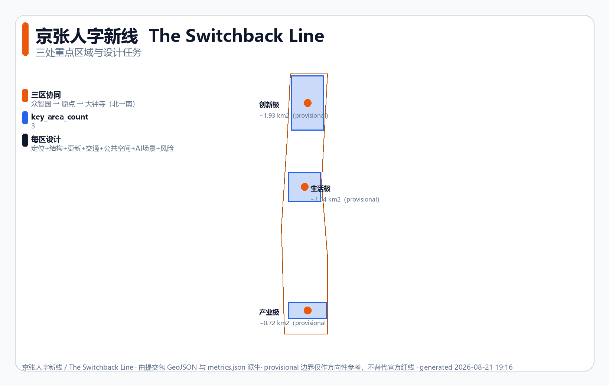
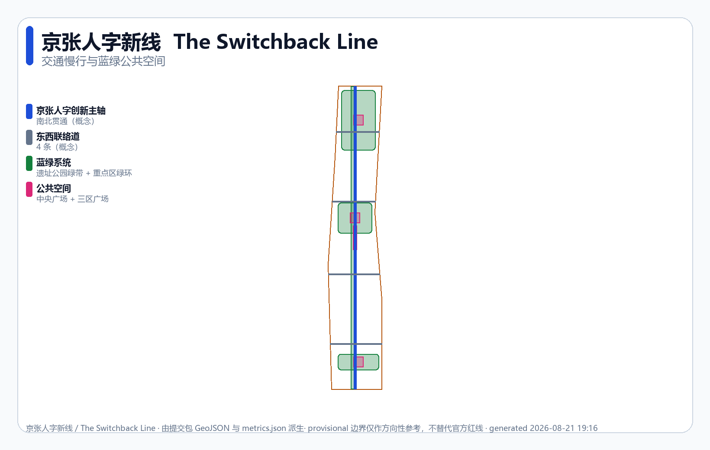
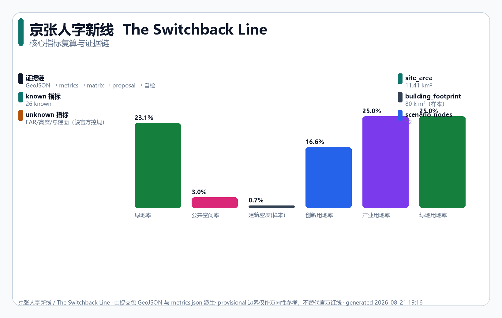

# The Switchback Line: using AI to overcome urban steep grades

> **Public slogan: AI enters the city, vouchers first.** Every urban AI service entering public space opens with one of three running vouchers — Test Receipt / Release Ticket / Public Verdict; when a voucher fails the service folds back, and everyday city life continues.

> **The Switchback Line** — In 1909, Zhan Tianyou faced the Badaling grade and did not brute-force it. At Qinglongqiao he designed the '人'-shaped switchback line, **using creativity to overcome what seemed an impossible slope** `[source:HISTORY-ZHAN-TIANYOU]`. In 2026, the Centennial Jing-Zhang AI Innovation Belt is not asking "how to build another AI park"; it is asking: **when cities face the triple steep grade, can AI be this era's switchback line — intelligent creativity to overcome the urban grades?** `[source:HISTORY-JINGZHANG-1909]`

**Three urban steep grades** — the proposal's core analytical framework:

| Steep grade | Challenge | AI switchback approach | Pole |
|---|---|---|---|
| **Productivity grade** | Slow R&D conversion, industrial bottlenecks, compute scarcity | Benchmarking + shared compute + open co-creation | **Innovation Pole · Zhongzhi Garden** |
| **Quality-of-life grade** | Commuting pressure, aging, uneven health/education resources | Health stations + education nodes + all-age slow traffic | **Life Pole · AI Origin Community** |
| **Competition grade** | Global AI race, talent drain, fragmented ecosystems | Industrial clustering + global outreach + talent + regional synergy | **Industry Pole · Dazhongsi** |

**Honest constraints**: provisional boundary only `[source:PROVISIONAL-BOUNDARY]`; FAR/building height = `unknown` (no official regulatory plan `[metric:floor_area_ratio]`); all spatial content is conceptual and constitutes no government decision.

## Core judgment: a switchback line for three steep grades

A railway runs only when track, signal, timetable and accountability hold at the same time. An urban AI service enters public space only under acceptance the public can understand and re-verify. This proposal turns the Switchback Line into **three poles × three running vouchers** — whichever pole an AI service wants to enter, it must first earn that pole's voucher; when a voucher fails, the space falls back to everyday mode `[standard:PROJECT-AGENT-OPEN-CALL-TASKBOOK]`.

| Pole | Non-negotiable spatial decision | Running voucher | If the voucher fails |
|---|---|---|---|
| **Innovation Pole · Zhongzhi Garden** | AI compute may approach the test zone only through staffed, public-first, no-bypass controlled crossings | Test Receipt | Test zone stays closed; courtyards and public green belt continue |
| **Life Pole · AI Origin** | Open-innovation methods, copyright status and retraction actions must be visible on one release surface | Release Ticket | Release stays closed; teaching and collaboration continue |
| **Industry Pole · Dazhongsi** | The non-AI path must be no longer than the AI path; complaint points and trials share the public main chain | Public Verdict | Adoption stays closed; devices return, commerce and human service continue |

The three vouchers do not substitute for one another: a technical pass cannot override a rights judgment or a public decision, and an old failure cannot be erased by a new pass — the same engineering logic as the '人'-shaped switchback: **changing direction is not erasing the path already travelled, but folding back while preserving the previous state** `[source:HISTORY-ZHAN-TIANYOU]`.

**Operating doctrine: every mechanism follows the same fold-back logic.** Zhan Tianyou's switchback was not a compromise — it was how a train keeps climbing an impossible grade. Each mechanism in this proposal is the same logic projected onto a different layer — **most reliable, not highest performance**:

| Mechanism | Fold-back action | Folds back to |
|---|---|---|
| Three vouchers (Test / Release / Public Verdict) | voucher fails → service stays closed | everyday city mode |
| Innovation Timetable six steps | any step fails → degrade to human | human and non-digital channels |
| R0-R3 resilience states | rain / offline / power loss → pause | physical signage + human fallback |
| SC-04 seven gates | any gate lacks evidence → stay in prior state | sandbox and synthetic orders |
| G6 retirement | pilot expires → revoke, purge data, restore site | original site condition + public receipt |
| Minimum-regret priority | unacceptable worst case → degrade or stop | P-ensure physical fallback |

Every urban AI service entering public space follows the same **Innovation Timetable** (borrowing the openness and accountability of a railway timetable, turning abstract "AI governance" into a public contract that is visible in space and traceable in operations; not a statutory indicator, but a reference scheme calibrated by professionals, operators and the public `[assumption:A-IMPLEMENTATION-001]`):

| Step | Meaning | Spatial requirement | If unmet |
|---|---|---|---|
| **① Declare** | State service boundary and responsible party | Readable notice at every response point (scope/party/data use) | No registration, no opening |
| **② Time** | Publish waiting and processing limits | Expected response time on the notice | Timeout auto-switches to human, logged |
| **③ Handoff** | Keep real-person and non-AI paths | Human window/contact + accessible alternative | No digital capability as entry threshold |
| **④ Notify** | Proactively explain after incidents | Public feedback wall / notice board | Not notified within 24h → downgrade |
| **⑤ Review** | Allow appeals, correction, independent review | Appeal channel and review record area | Overdue appeals → pause new services |
| **⑥ Sunset** | Renew, shrink or terminate pilots periodically | Exit notice + data deletion/migration | Substandard → shrink or exit |

`Urban problem enters → Innovation Pole translates → Life Pole experiences → Industry Pole scales → Public verdict → continue, revise, or retire`

The proposal consists of one spine (Jing-Zhang Innovation Spine), three poles (Innovation/Life/Industry) and two wings (Zhongguancun tech-services wing / Xiaoyuehe scenario-testing wing), unfolding north–centre–south along the ~9 km Jing-Zhang Railway Heritage Park green belt `[source:HERITAGE-PARK]`, aiming at the **global AI industry highland** goal and the **AI pilgrimage** vision `[standard:PROJECT-AGENT-OPEN-CALL-TASKBOOK]`.

**One day on the Switchback Line, 2030** (scenario-perceptibility sketch):

- **7:40, Life Pole · Origin Life Plaza** — retired teacher Ms. Li finishes a blood-pressure check at the health station; the AI pre-screen flags an anomaly and the human window next door connects her straight to the community doctor (S5; non-digital channels and human review are the spatial promise of Timetable step ③). Tactile guidance paving leads her to the breakfast stall — the paving shows no advertising.
- **9:00, Innovation Pole · benchmark field** — researcher Chen's team files a benchmark-reproduction request; the staffed controlled crossing verifies data provenance and issues a Test Receipt, opening the test zone. At the viewing platform, school students watch a live evaluation through glass (landmark ③'s public honor display).
- **12:30, Industry Pole · Dazhongsi** — a corporate visitor files an objection to a recommendation at the complaint point; the Public Verdict surface shows "human review, response within 24h". On the same street, a human-run shop and an intelligence-native store open side by side — the non-AI path is no longer than the AI path.
- **17:00, Xiaoyuehe wing** — a founder books next week's scenario-testing slot at the open-application entrance; edge-node latency is public on the governance board (S11).
- **22:00, rainy night** — rainfall passes 50 mm/24h; state R1 triggers: the robot delivery lane physically locks, human delivery and shelters take over; the sunset notice lights up, to be cleared after a morning check.
- **23:30, governance duty room** — the SC-04 duty officer re-runs the human fallback of boundary condition 3 in a tabletop drill; the receipt enters the public evidence chain — not one byte of personal data left the local edge today.

Not a single advertising screen appears all day: AI schedules in the background while the city surface stays material and quiet (screens-recede principle).

## Design basis and source inventory

Submitted to the [Centennial Jing-Zhang AI Innovation Belt open call](https://github.com/open-city-ai/haidian) at `submissions/cynixway/jingzhang-new-gauge/`, strictly respecting public/cleared source boundaries `[source:SITE-PACKAGE]`:

- **Pre-qualification announcement** `[source:OFFICIAL-ANNOUNCEMENT-20260509]`: three-tier scope (43.6 km² overall study / ~11.4 km² overall design / 368.4 ha key areas), three key areas, the controlling basis `[standard:PROJECT-OFFICIAL-ANNOUNCEMENT]`.
- **Agent taskbook excerpt** `[source:AGENT-TASKBOOK-20260518]`: agent.1–agent.6 tasks, three orientations, five functions, three areas two wings, co-creation charter and boundary clause `[standard:PROJECT-AGENT-OPEN-CALL-TASKBOOK]`.
- **Professional standards**: urban design measures `[standard:MOHURD-URBAN-DESIGN-MEASURES]`, regulatory-plan compilation measures `[standard:MOHURD-CONTROL-DETAILED-PLANNING]`, land-use classification guide `[standard:MNR-LAND-USE-CLASSIFICATION-GUIDE]`.
- **Source grading**: verified via `data/source_registry.json` — announcement/taskbook/standards are `usable_for_formal=yes`; the provisional boundary is `provisional_only` `[source:PROVISIONAL-BOUNDARY]`.

Evidence chain: `proposal.md` (human-readable body) → `geometry/*.geojson` (spatial evidence) → `metrics.json` (metric recalculation) → three coverage matrices (compliance/standard/design_depth) → `self_check.json` (local self-check). The text uses five verifiable citation types: `[source:...]` `[standard:...]` `[depth:...]` `[data:...]` `[metric:...]`. Multimodal deliverable loop: body (zh/en) + 6 figures (zh/en) + A3/A0 drawing PDFs (zh/en) + HTML reports (zh/en) + visual portals (zh/en) + 9 GeoJSON layers + metrics and matrix JSON. All spatial recommendations are "conceptual suggestions / reference schemes / for professional teams to deepen", not a substitute for formal planning `[standard:PROJECT-AGENT-OPEN-CALL-TASKBOOK]`.

## Three-tier scope framework

The three tiers narrow step by step, landing the Switchback Line concept into the three key areas `[depth:three_level_scope_framework]`:

| Tier | Extent | Area | Work objective | Design depth |
|---|---|---|---|---|
| Overall study | North 5th Ring–Jingzang Expwy–Xizhimenwai St–Wanquanhe Rd | 43.6 km² (announcement) `[metric:site_area_sqm]` | AI ecosystem, industry chain synergy, three areas two wings, future city research | Strategic study |
| Overall design | 1–2 km around the heritage park | ~11.4 km² (provisional) `[data:geometry/site_boundary.geojson#SITE-001]` | Renewal framework, regulatory-plan-depth urban design | Regulatory-plan-depth urban design `[depth:development_intensity_controls]` |
| Key areas | Zhongzhi Garden, AI Origin Community, Dazhongsi | 368.4 ha (announcement) `[data:geometry/key_areas.geojson]` | Detailed design of three key areas | Comprehensive implementation plan depth `[depth:three_key_area_detailed_design]` |

**Provisional boundary limits**: official redline and regulatory conditions are missing `[source:PROVISIONAL-BOUNDARY]`; the overall design extent and key areas use maintainer-provided provisional polygons (`boundary_precision=provisional_rough`). Therefore: recalculated areas (site ≈11.413 km², key areas ≈3.693 km² `[metric:key_area_total_sqm]`) are directional references only; once official polygons arrive, land use/buildings/phasing and all metrics must be recalculated as a package; statutory indicators (FAR, height, density) are honestly marked `unknown` in `metrics.json` `[metric:floor_area_ratio]` `[assumption:A-BOUNDARY-PROVISIONAL-001]`.

## Overall study: industry and future city research

**Overall concept: The Switchback Line / 京张人字新线**. In 1909 Zhan Tianyou climbed the grade with a '人'-shaped switchback — engineering wisdom rather than brute force `[source:HISTORY-ZHAN-TIANYOU]`; this belt makes AI the switchback of our era, letting data, compute, scenarios, talent, enterprises and governance interoperate under one standard — not an AI label on a traditional park, but standards and engineering method to answer "how AI serves people, enterprises and society" `[standard:PROJECT-AGENT-OPEN-CALL-TASKBOOK]`.

**Three orientations answered**: the centennial heritage belt — the Switchback Line translates rail heritage into an engineering-standard narrative for the AI era (five story segments + three pilgrimage landmarks); the urban AI life-experience belt — the Life Pole embeds AI into residents' daily routines (S5/S6/S7 + non-digital channels); the AI-fusion innovation belt — Innovation and Industry Poles back independent innovation and industrial conversion with an engineering benchmark (S1/S2 + pilot-scale accelerator). **Five functions mapped**: full-stack AI innovation → benchmark field and shared compute; world-class ecosystem → three-pole two-wing map; AI+ scenario empowerment → 14 scenario cards; intelligent vibrant city → spine + blue-green + component library; global voice in AI governance → Innovation Timetable + three vouchers + equity ledger.

**Naming system** (agent.1):

| Tier | Chinese | English | Metaphor |
|---|---|---|---|
| Master name | 京张人字新线 | The Switchback Line | A new switchback line for AI-native cities — inheriting Jing-Zhang's self-reliant construction + open standards + engineering innovation |
| Spine | 京张人字创新主轴 | Innovation Spine | Linking three areas along the heritage corridor |
| Area · Zhongzhi Garden | 创新极 | Innovation Pole | Engineering benchmark of independent innovation |
| Area · AI Origin | 生活极 | Life Pole | AI serving everyday life |
| Area · Dazhongsi | 产业极 | Industry Pole | Intelligence-native new business |
| Two wings | 中关村/小月河道岔 | Switchbacks | Factor flow and scenario enablement |

**Logo and visual direction** (agent.1; directional suggestion, final assets must be rights-cleared `[standard:PROJECT-AGENT-OPEN-CALL-TASKBOOK]`): master mark recomposes the gauge symbol (═══) with an AI node network (•—•—•) — a "standard + connection" composite; primary Jing-Zhang engineering blue `#1d4ed8`, amber `#b45309` (provisional warning / historical warmth), slate grey `#475569`, WCAG-AA contrast; three pole accent colours (blue / magenta `#db2777` / violet `#7c3aed`); sans-serif Chinese + geometric sans English + monospaced numerals (direction); applied to spine signage, pole entrances, scenario notices, guide posts, honor walls, event materials; no unauthorized trademarks, portraits or paper figures; provisional boundaries always dashed/low-contrast in visuals. Brand-identity goal: recognizable in one mark (gauge + node composite), memorable in one colour (engineering blue), transmissible in one phrase (人字新线 / The Switchback Line), extended consistently across space, print and digital.

**Three-pole two-wing loop**: Zhongzhi Garden (R&D) → AI Origin Community (conversion & experience) → Dazhongsi (scaling); the Zhongguancun wing injects capital and IP, the Xiaoyuehe wing opens test scenarios, forming a "R&D—life—industry—service—testing" loop `[data:geometry/key_areas.geojson#PROV-KEY-001]`.

**Global AI ecosystem cases** (agent.2; public-source research, sources registered under "Risk, copyright and compliance" `[source:CASE-STUDIES]`):

| Case | Key fact | Translated into |
|---|---|---|
| Zhongguancun evolution | 1988 State Council experimental zone; 2009 first national innovation demonstration zone `[source:CASE-ZGC]` | Innovation Pole's "standards + policy + talent" design |
| Sand Hill Road | Kleiner Perkins et al. from 1972; "capital + university + startup" triangle `[source:CASE-SAND-HILL]` | Zhongguancun wing factor allocation |
| King's Cross London | 67-acre rail heritage regeneration; Central Saint Martins anchored from 2011 `[source:CASE-KINGS-CROSS]` | Rail heritage + AI public space strategy |
| Shenzhen Nanshan Sci-Tech Park | Established 1996; ~11.5 km²; 1,200+ high-tech firms `[source:CASE-SHENZHEN]` | Industry Pole density and amenities |
| Shibuya station-city | Private-railway-led "once-in-a-century" redevelopment; phase 1 opened 2019 `[source:CASE-SHIBUYA]` | Three-area station integration |
| One-North Singapore | 200-ha mixed R&D district; Biopolis/Fusionopolis `[source:CASE-ONE-NORTH]` | Three-pole juxtaposed structure |
| Amsterdam open data | Official portal 19,000+ datasets + public-private innovation platform `[source:CASE-AMSTERDAM]` | Data standards layer |

Shared lesson: successful tech belts are built on **open standards + mixed function + public space + long-term operations**, not single-industry parks.

**Regional synergy** (taskbook regional_synergy; conceptual `[assumption:A-REGIONAL-SYNERGY-001]`):

| Synergy partner | Complementary function (verified) `[source:REGIONAL-SOURCES]` | Switchback Line interface |
|---|---|---|
| Heritage-park corridor communities (7 sub-districts) `[source:HERITAGE-PARK]` | Education/residential; serving 8 universities, 26 communities | Life Pole: convenience nodes + all-age slow links |
| Future Science City (Changping, ~170.6 km²) | Energy valley + life science + Shahe higher-ed park | Innovation Pole: compute backup, shared benchmarks |
| Huairou Science City (~100.9 km²) | Comprehensive national science center; 40+ major facilities | Innovation Pole: transfer channel, joint labs |
| Beijing Economic-Technological Area | National ETDZ + HTIDZ; high-end manufacturing | Industry Pole: "Haidian R&D – ETDA manufacturing" |
| Beijing-Tianjin-Hebei (2014 strategy) | Regional GDP 10.4 trillion yuan (2023) | Standards/data layer: unified interfaces, talent mobility |

All synergy mechanisms are open co-creation suggestions, not settled government arrangements or funding commitments `[standard:PROJECT-AGENT-OPEN-CALL-TASKBOOK]`.

## Overall design extent: urban renewal and regulatory-plan-depth design

The overall design extent (~11.4 km², provisional `[data:geometry/site_boundary.geojson#SITE-001]`) uses a **five-band zoning**, refined into 17 named parcels. Zoning follows public site conditions: the heritage corridor (~9 km north–south spine `[source:HERITAGE-PARK]`) forms the green band backbone; functional differences of the three key areas determine innovation track / life pole / industry pole; existing street interfaces (Xueyuan Rd, Xitucheng Rd) are followed as east–west boundaries; roads/rail/compute/energy need continuous corridors forming the infrastructure band `[depth:land_use_layout]` `[depth:existing_conditions_diagnosis]`.

| Band | Land-use code | Area | Share | Role |
|---|---|---|---|---|
| Innovation track | 0802 AI R&D | 1.90 km² | 16.6% | Labs, research, shared compute `[metric:land_use_area_0802_sqm]` |
| Green band | 1401 park green | 2.85 km² | 25.0% | Heritage park belt, buffer `[metric:green_space_area_sqm]` |
| Industry pole | 05 industry/business services | 2.85 km² | 25.0% | HQs, conversion, business |
| Life pole | 0702 residential/community | 2.33 km² | 20.4% | Talent housing, community amenities |
| Infrastructure band | 1207 transport/municipal | 1.49 km² | 13.0% | Roads, rail, compute, energy |

Numeric indices live in `metrics.json` (`land_use_area_{code}_sqm` / `land_use_ratio_{code}` series); codes follow the national land-use classification guide `[standard:MNR-LAND-USE-CLASSIFICATION-GUIDE]`. The division in `geometry/land_use.geojson` `[data:geometry/land_use.geojson#LU-0802-A1]` is a complete partition: 5 bands refined into 17 parcels `[metric:land_use_count]`; union = site boundary, no overlap, no gap; same-code parcel union = original band area.

**Four mechanisms moving AI from a service layer to a generative layer** — this is the proposal's planning-innovation claim on "space-industry integration" in spatial planning: if AI is only a service skin, the city is not different because of AI; only when AI sinks from a service layer into a **generative layer** does urban form truly change `[depth:overall_spatial_structure]` `[depth:height_massing_character]`:

1. **Compute goes underground**: INNO-A2/INF-E2 underground space is driven by compute demand — B2 liquid-cooled halls (6–8 m clear height, heavy loads, dedicated cooling routes), B1 edge-inference cabinet corridors, ground level only equipment hatches and ventilation shafts, leaving ground for public space `[depth:municipal_new_infrastructure]`.
2. **Dynamic space allocation**: LIFE-D3 is a pedestrian retail street by day, a robot low-speed delivery corridor at night (bollards rise to split a 2 m lane), a festival market on weekends — function becomes a time slice under AI scheduling.
3. **Robot-compatible streets**: INF-E1 standard section = central 7 m bus/slow-traffic lane + 1.5 m robot low-speed lanes both sides (physically separated, chargers in lampposts) + 3 m sidewalks; intersections use lidar + mmWave sensing posts, no biometric collection `[depth:traffic_rail_slow_parking]`.
4. **Screens recede**: GRN-B1 guidance does not depend on screens — thermo-sensitive paving, directional soundscape, tactile relief maps, weathering-steel notice boards; AI decides "which soundscape when", but leaves no screen on the city surface `[depth:blue_green_public_space]`.

**Regulatory-plan-depth expression**: with statutory conditions missing, FAR/height/density are `unknown` in `metrics.json`, honestly stated as "to be confirmed", never disguised as approved `[assumption:A-CONTROLS-001]` `[depth:development_intensity_controls]`. Green ratio `[metric:green_ratio]` 23.1%, public-space ratio `[metric:public_space_ratio]` ~3.0%, building density `[metric:building_density]` (representative footprints `[metric:building_footprint_area_sqm]` `[data:geometry/buildings.geojson#BLD-001]`; conceptual, not surveyed `[assumption:A-BUILDING-REPRESENTATIVE-001]`). Road density `[metric:road_length_density_m_per_sqm]`.

## Key areas: detailed design

The three key areas line up north–centre–south along the corridor (provisional polygons `[data:geometry/key_areas.geojson]`) `[depth:three_key_area_detailed_design]`, each as a readable mini-scheme:

- **Zhongzhi Garden AI Innovation Accelerator · Innovation Pole (north, ~1.93 km²)**: the source of the "engineering benchmark" for full-stack AI innovation. R&D clusters + shared compute center + benchmark field, ringed by green; mainly new research carriers plus adaptive reuse; spine connection with a low-speed test road `[data:geometry/roads.geojson#RD-001]`; Innovation Pole Plaza `[data:geometry/public_space.geojson#PS-002]`; lead scenarios S1/S2/S11; risk = ownership and existing buildings unsurveyed `[assumption:A-CONTROLS-001]`.
- **Beijing AI Origin Community · Life Pole (centre, ~1.04 km²)**: the experience interface of AI serving daily life. Community + experience stores + third places + pocket parks, compactly mixed; retain-renovate-demolish-build mix (conceptual); all-age slow network; Origin Life Plaza `[data:geometry/public_space.geojson#PS-003]`; lead scenarios S5/S6/S7; risk = resident participation baseline needed `[assumption:A-AI-SCENARIO-PILOT-001]`.
- **Dazhongsi AI Industry Cluster · Industry Pole (south, ~0.72 km²)**: scaling carrier for intelligence-native business. HQs + exhibition center + industry services; mainly adaptive reuse of existing commercial/office; Dazhongsi node connection; Dazhongsi Industry Plaza `[data:geometry/public_space.geojson#PS-004]`; lead scenarios S7/S2; risk = commercial ownership and operator unconfirmed.

**17-parcel design intent matrix** — each parcel is an independent polygon in `geometry/land_use.geojson` (parcel_id / bilingual names / sub-function / parent band); intensity directions are qualitative concepts (FAR awaits the official plan `[metric:floor_area_ratio]`); retain-renovate-demolish is a conceptual classification (subject to survey and ownership `[assumption:A-BOUNDARY-PROVISIONAL-001]`):

| Parcel | Design intent | Intensity / treatment | Lead scenario | Example KPIs |
|---|---|---|---|---|
| INNO-A1 basic R&D cluster | Labs, institutes, shared test benches | low–mid campus / mostly new | S2 open co-creation workshop | active contributors, merged PRs |
| INNO-A2 shared compute center | regional compute, substation, cooling | mid intensive hall / new, elastic | S1 compute scheduling & benchmarking | reproduction ≥95%, utilization ≥70% |
| INNO-A3 benchmark field | open testbed, observability platform | low open / new | S1+S11 | warning accuracy, 100% human review |
| INNO-A4 pilot-scale accelerator | pilot shops, joint labs | mid pod-tower / mixed | S2 | pilot conversions |
| GRN-B1 heritage park spine | ~9 km rail heritage park, interpretive nodes | low / retain-renovate | S10 heritage AI guide | visitor satisfaction, source accuracy |
| GRN-B2 key-area green ring | three-area ring link | low greenway / retain-renovate | S4 all-age slow guidance | accessible-path continuity |
| GRN-B3 sponge retention | rain gardens, swales | low groundcover / new | supports S4 | retention volume (hydrology model pending `[assumption:A-GREEN-BLUE-CONCEPT-001]`) |
| IND-C1 HQ base | towers, anchor firms | high landmark / mostly renovation | S7 (B-side) | occupancy, anchor count |
| IND-C2 intelligence-native retail | immersive stores, experience plaza | mid-high podium-tower / renovation | S7 | satisfaction, complaint resolution |
| IND-C3 industry services | banking, IP services, convention | mid podium / renovation | supports S11 | service response time |
| IND-C4 startup incubator | flexible space, demo rooms | mid flexible / mixed | S2 | incubated projects, graduation |
| LIFE-D1 talent housing | rent+sale, mixed income | mid-high slab / mixed | supports S5/S6 | satisfaction, income mix |
| LIFE-D2 mixed community center | third places, childcare, clinic | mid mixed / renovation | S5 health station + S6 education nodes | triage accuracy, child-data compliance |
| LIFE-D3 experiential retail | main-street retail, dining, events | mid shopfront / renovation | S7 + S8 night segment | satisfaction, event count |
| INF-E1 spine roads & stations | TOD nodes, transit corridors | mid station-city / new+renovation | S3 connection + S9 AV shuttle | wait time, safe mileage |
| INF-E2 compute ducts & edge nodes | regional compute distribution, edge cabinets | low–mid concealed / new | S1 (edge supplement) | coverage, latency |
| INF-E3 district energy center | CCHP, substation | mid energy building / new | non-AI | energy intensity, renewables share |

**Nine sub-precincts** (agent.3 key-area refinement `[depth:three_key_area_detailed_design]` `[depth:retain_renovate_demolish]`):

| Sub-precinct | Covers | Anchor | Lead scenarios |
|---|---|---|---|
| Zhongzhi ① benchmark field | INNO-A3 + A2 north | field viewing platform (landmark ③) + open testbed | S1+S11 |
| Zhongzhi ② shared compute | INNO-A2 main | compute plaza (equipment viewing window) | S1 |
| Zhongzhi ③ R&D + green ring | INNO-A1+A4 + GRN-B2 north | R&D courtyard + north ring | S2 |
| Origin ① life plaza | LIFE-D2 + D3 core | Origin Life Plaza + third places + stores | S5+S6+S7 |
| Origin ② community center | LIFE-D2 north | childcare + clinic + community living room | S5+S6 |
| Origin ③ retail band | LIFE-D3 full | main-street retail + event ground | S7 |
| Dazhongsi ① HQ base | IND-C1 | tower cluster + industry plaza | S7 (B-side) |
| Dazhongsi ② intelligent retail | IND-C2 | immersive stores + experience plaza | S7 |
| Dazhongsi ③ industry services | IND-C3+C4 | convention + incubator + courtyard | S2+S11 |

## AI innovation ecosystem, personas and AI+ scenarios

**Ecosystem map** (agent.2): the Switchback Line standards layer (Innovation Timetable six steps) as base, connecting six factor layers — compute/data/scenarios/talent/capital/governance — with three poles and two wings as nodes, a four-layer "standards → factors → nodes → scenarios" map; Innovation Pole produces, Life Pole converts, Industry Pole scales, wings inject capital/scenarios, every layer auditable `[standard:PROJECT-AGENT-OPEN-CALL-TASKBOOK]`. **Industry-support mechanisms**: factor-guarantee interfaces for compute/data/capital/talent (Zhongguancun wing), open-application technical testing at INNO-A3, and one scenario-opening flow shared by all 14 scenarios (apply – test – human review – release – reversible).

**Personas** (agent.3, six): ① AI researchers/engineers (compute, test fields, peers → Innovation Pole); ② founders/developers (low-cost space, capital, scenario entry → wings); ③ enterprise teams (HQ, showcase, conversion → Industry Pole); ④ residents/families (convenience, health, education, safety → Life Pole); ⑤ visitors/students (experienceable public AI interface → public space); ⑥ urban governors (re-verifiable, reversible, accountable → charter and evidence chain).

**AI scenario cards** (agent.3; 14 cards incl. 3 industry test scenarios; each locked in `visual/assets/scenario_professional_review_matrix.json` with spatial prototype, minimal data, final human responsibility, professional roles, pause line and recovery evidence; measured values remain null, G3 field pilots stay closed `[depth:ai_scenario_service_nodes]`):

| Scenario | Spatial prototype | Minimal data + final human responsibility | Pause line / recovery evidence |
|---|---|---|---|
| S1 compute scheduling & benchmarking | INNO-A2 shared compute | desensitized benchmark sets; alliance representative reviews | failure → degrade to local node; human-flagged rollback `[data:visual/assets/sc04-relay-receipt.json]` |
| S2 open co-creation workshop | INNO-A1 R&D cluster | public repos; community governance | disputed code → vote-revoke `[data:visual/assets/evidence-ledger.json]` |
| S3 AI rail-connection navigation | INF-E1 stations | anonymized flows; transit operator reviews | misleading risk → physical signage fallback `[data:geometry/roads.geojson#RD-001]` |
| S4 all-age slow-traffic guidance | GRN-B1 green band | recognition-free sensing; community + property | accessible path discontinuity → stop `[data:geometry/green_space.geojson#GR-001]` |
| S5 AI community health station | LIFE-D2 center | localized health data; community doctor reviews | anomaly → straight to doctor `[source:WHO-URBAN-HEALTH-AND-GREEN]` |
| S6 AI education convenience node | LIFE-D2/D3 | child data localized; teacher-parent review | any automated decision → rollback `[assumption:A-AI-GOVERNANCE-001]` |
| S7 intelligence-native consumption | IND-C2 retail | compliant records; merchant + platform human | recommendation anomaly → human service |
| S8 robot low-speed delivery pilot | LIFE-D3 night segment | no pedestrian tracking; operator + duty officer | any collision → immediate stop `[source:ISO-13482-SERVICE-ROBOT-SAFETY]` |
| S9 autonomous-shuttle pilot | INF-E1 spine | no biometrics stored; transit enterprise | anomaly → pull over + human takeover `[data:visual/assets/tabletop_cases.json#T09-REJ]` |
| S10 heritage AI guide | GRN-B1 story nodes | public archives; heritage editor reviews | fabricated figures/events → delist |
| S11 urban-agent governance board | co-creation platform | public data + risk notice; governance union | misoperation → audit + rollback `[data:visual/assets/evidence-ledger.json]` |
| S12 developer community grounds | IND-C3/C4 vicinity | open registration; community organizers | event cancelled → online alternative |
| S13 urban-agent emergency rollback | governance union on duty | triggers: heat/network loss/no takeover/access block | five-step exit + record `[metric:tabletop_case_count]` |
| S14 public-interest audit | equity-ledger review committee | quarterly review + anonymized event log | weakest-20% experience worsens → pause `[data:visual/assets/edge-matrix.json]` |

Three public baselines run through all scenarios: **100% final human confirmation for high-impact decisions; zero default biometric or continuous personal-track retention; non-digital channels preserved for basic services** (voice, buttons, paper, human windows) `[depth:ai_governance_charter]`.

**Switchback work order** — any party submitting an urban-AI request along the "problem enters → voucher acceptance → fold back or retire" chain must complete the following fields (each with a missing-field handling rule; none may be skipped):

| Field | Question answered | If missing |
|---|---|---|
| Problem & receiving pole | which of the three poles takes it, in which spatial type | no pole-zone matching |
| Running voucher | which of Test Receipt / Release Ticket / Public Verdict applies | voucher undefined → no G1 |
| Timetable commitment | time limits and duty points for each of the six steps | no registration, no opening |
| Non-AI baseline | how the same task is done today | no improvement claims |
| Data boundary | minimal dataset and retention period | undeclared data must not be collected |
| Human takeover point | who takes over when, where is the non-digital channel | no takeover point → closed |
| Failure signals & pause line | which observations trigger a pause | no pause line → no G5 |
| Fold-back path | how to return while preserving prior state on failure | no fold-back path → no pilot |
| Recovery evidence | what records restore operation | unmet → stay degraded |
| Retirement & site restoration | when it ends, who restores site and data | must not start |

**Minimal executable pilot**: S1 converges into the single pilot SC-04, selecting 3 of 12 boundary conditions first (wheelchair/cane, night rain/snow, weak network), each generating one synthetic work order plus one control sample (4 total). Synthetic orders only trigger human fallbacks and stop conditions — no real services, no real personal data `[assumption:A-OPERATIONS-001]`. The pilot advances through G0 topic → G1 site → G2 data → G3 system rights → G4 human gate → G5 limited trial → G6 rollback/retirement; any gate lacking evidence stays in the previous state; the goal is to prove **"stop, exit, recover" logic can be independently re-run by a third party**, not that benchmarks pass. A companion offline tabletop pack (12 scenarios × pass/reject = 24 cases) verifies the rules execute under zero network, zero personal data, zero field input `[assumption:A-EVIDENCE-001]`.

**Public interest and the equity ledger**: average values must not mask the experience gaps of different groups. Six groups are tracked for accessibility, thermal comfort, safety perception, waiting time and appeal response (fields are design targets until operational baselines exist `[assumption:A-EVIDENCE-001]`) `[depth:blue_green_public_space]`:

| Group | Weakest-experience risk | Design response |
|---|---|---|
| Older adults & children | heat discomfort, broken accessibility, cognitive load | GRN-B1 shading + S4 all-age slow traffic + physical signage first |
| Persons with disabilities | robot encroachment, screen dependence | INF-E1 no robot encroachment + physical path per scenario |
| Night workers (delivery/cleaning/security) | poor safety perception, no rest space | INF-E3 smart lighting + 24h safety nodes |
| Low-digital-literacy residents | AI service thresholds too high | LIFE-D2 human windows; no digital capability as entry |
| Developers/founders | few test entries, opaque approval | INNO-A3 open-application benchmark field |
| Visitors | fragmented cultural experience | GRN-B1 five story segments + S10 multilingual guide |

Data protection: every scenario collects only necessary data, processed locally by default (S5/S6 strictest); child data minimized, never for commercial recommendation, guardian consent required; personal data retained for the shortest necessary period with deletion mechanisms. Compliance subject to PIPL, Data Security Law, Barrier-Free Environment Law and professional legal review `[assumption:A-AI-GOVERNANCE-001]`.

## Land use, building scale and retain-renovate-demolish

Land use follows the five-band zoning refined into 17 parcels (matrix in the key-areas chapter). Building scale `[depth:height_massing_character]` `[depth:retain_renovate_demolish]`: representative footprint total `[metric:building_footprint_area_sqm]`, density `[metric:building_density]` (conceptual, not survey `[assumption:A-BUILDING-REPRESENTATIVE-001]`); treatment differs — Zhongzhi Garden mostly new research carriers, AI Origin mixed, Dazhongsi mostly renovation (parcel-level tendencies in the 17-parcel matrix); FAR/height/density all `unknown` `[metric:floor_area_ratio]`, awaiting the official plan. Gaps: existing buildings, ownership, underground space, utility capacity all await professional review `[assumption:A-CONTROLS-001]`.

## Transport, rail, municipal and public services

**Roads and slow traffic** `[depth:traffic_rail_slow_parking]`: Jing-Zhang Innovation Spine (north–south) + 4 east–west connectors (concept `[data:geometry/roads.geojson]`), spine length `[metric:road_centerline_length_m]`; slow network links three areas along the green band, all-age friendly. **Rail connection**: three-area station integration (concept); alignments subject to a transit study `[assumption:A-TRANSPORT-CONCEPT-001]`. **New infrastructure** `[depth:municipal_new_infrastructure]`: distributed compute, edge inference, new energy fused with conventional utilities (direction); loads and capacity need professional calculation.

## Blue-green space, public space and urban character

**Blue-green system** `[depth:blue_green_public_space]`: heritage park green band (north–south `[data:geometry/green_space.geojson#GR-001]`) + three-area green rings, green ratio `[metric:green_ratio]`; sponge/retention is directional, pending hydrology `[assumption:A-GREEN-BLUE-CONCEPT-001]`. **Public space**: Switchback Line Central Plaza `[data:geometry/public_space.geojson#PS-001]` + three pole plazas, public-space ratio `[metric:public_space_ratio]`.

**AI pilgrimage landmarks** (agent.4; three; conceptual, rights-cleared assets required `[standard:PROJECT-AGENT-OPEN-CALL-TASKBOOK]`): ① Switchback Monument (central plaza, minimal engineering art on the '人' motif); ② Switchback Experience Hall (AI Origin; rail heritage + AI history); ③ Benchmark Field Viewing Platform (Zhongzhi Garden; public honor node watching AI benchmarks run). **Honor display system** (agent.4): along the spine — benchmark leaderboard wall (Zhongzhi) — developer contribution constellation (Origin) — enterprise innovation gallery (Dazhongsi), unified visuals, publicly auditable.

**Public-space component library** (agent.4; modular, unified standard modules, accessible):

| Component | Module | Function |
|---|---|---|
| Switchback seat | '人'-motif | rest, social (wheelchair-accessible, armrests) |
| Standard paving | 600×600 mm | walking surface, tactile guidance |
| AI guide post | 1.2 m | info, guidance, help (voice/large type/button) |
| Movable event unit | 2×2 m | market, showcase, workshop (≥1.2 m aisles) |
| Accessible ramp unit | 1:12 | level transition (double handrails) |
| Smart lighting pole | 4 m | lighting, sensing, charging (low glare) |

**Cultural signage and spatial storyline** (agent.5): "from standard gauge to the AI switchback" as the thread, five story segments along the park — ① railway origins (1909, interpretive boards, weathering steel + bronze); ② standard founding (inset 1435 mm gauge line); ③ innovative turn (interactive guide posts, '人' motif); ④ AI-native (digital + physical hybrid, node graph); ⑤ century inheritance (monumental marker, timeline). Signage must be accessible: audio guide, high-contrast large type, tactile maps, wheelchair-reachable heights; portraits and rail imagery must be rights-cleared. **International communication** (agent.5): *"The Switchback Line — climbing the city's steepest slopes with AI, inspired by the Jing-Zhang Railway's legacy of engineering ingenuity."*; narrative from Zhan Tianyou's engineering pioneering to AI-era standard building; channels: international planning/AI conferences, developer communities, design media (directional). The full deliverable set is already bilingual: all 6 figures, the A3/A0 drawing PDFs, the HTML reports and the visual portals have English counterparts (see manifest); international reviewers and media can cite the English set directly. **Urban character**: engineering blue + amber palette, technical diagrams, dashboards, blueprint style; no over-entertainment `[standard:MOHURD-URBAN-DESIGN-MEASURES]`.

## Renewal project list, implementation policy and phasing

**Executable project portfolio** (replacing abstract area blocks; each project with preconditions, actor types, cost magnitude, exit threshold and KPIs, mapped to `geometry/phasing.geojson` `[data:geometry/phasing.geojson#PH-001]`; no invented institutions or amounts `[depth:phasing_implementation]` `[depth:renewal_project_list]` `[assumption:A-IMPLEMENTATION-001]`):

| Project | Phase | Preconditions | Candidate actor types | Cost magnitude | Exit threshold | Example KPIs |
|---|---|---|---|---|---|---|
| P1 Zhongzhi benchmark field | near | official boundary + plan + ownership + compute EIA | park + enterprise alliance | 3–8 bn RMB | reproduction <90% for 2 weeks | reproduction ≥95%, utilization ≥70% |
| P2 central green belt | near | heritage 3-line check + sponge model | landscape + heritage + municipal | 0.5–1.5 bn | heritage conflict → reroute | connectivity + green ratio + accessible chain |
| P3 Origin convenience nodes | mid | resident baseline + child-data compliance | community + health/education | 1–3 bn | privacy violation → pause & fix | triage accuracy, appeal response |
| P4 spine slow-traffic system | mid | transit study + safety audit | transit + municipal + landscape | 1.5–4 bn | incident → stop & review | wait time, accessible continuity |
| P5 Dazhongsi regeneration | far | ownership + market will + fire | owners + enterprises + operator | 8–20 bn | market shortfall → defer | occupancy, conversion |
| P6 two-wing switchbacks | far | partners + interface standards | partner parks + union | 2–6 bn | synergy shortfall → shrink | joint projects |

**Three-phase totals** (public-benchmark magnitude, not a budget): near ~5–15 bn (green + slow traffic + SC-04 minimal pilot, low capital intensity); mid ~20–50 bn (compute + R&D carriers, alliance + government); far ~10–30 bn (commercial renovation + synergy, market-dependent). Excludes land acquisition, operations and AI software R&D (OPEX).

**Ten committable, acceptable, vetoable work packages** (`visual/assets/delivery_contracts.json`; each independently activatable/pausable/exitable; quantities/institutions/amounts stay unconfirmed `[depth:implementation_policy]`):

| Package | Content | Veto condition |
|---|---|---|
| C01 | official geometry & data request | redline missing → package HOLD |
| C02 | responsible institutions & authorization | any unsigned → G2 not activated |
| C03 | ownership/heritage/fire 3-line check | any conflict → G1 fails |
| C04 | measured flows & accessible routes | any of 6 accessibility classes fails → G3 closed |
| C05 | municipal/flood/energy capacity | capacity shortfall → no pilot |
| C06 | data privacy & AI safety review | any unreviewed → G3 not activated |
| C07 | public-interest co-testing (6 groups) | weakest-20% worsening 2 weeks → PAUSE |
| C08 | quantities/specs/lifecycle cost | <2 measured quotes → no budget |
| C09 | procurement/insurance/operations/interfaces | any unsigned → G3 closed |
| C10 | integrated Go/No-Go & drill | any missing → package HOLD |

**Implementation timeline** (rolling three years, conceptual `[assumption:A-IMPLEMENTATION-001]`): T0 pre-study (Y0–1, redline, plan, survey); T1 green belt (Y1–2, GRN-B1+B2 linked); T2 SC-04 pilot (Y1–3, G0–G4 + 4 synthetic orders); T3 Innovation Pole (Y2–4, benchmark field + compute center); T4 Life Pole (Y3–5, convenience nodes + spine); T5 Industry Pole (Y4–7, Dazhongsi + wings). RACI (conceptual): redline/plan = government R/A; pilot = alliance R, government A; scenario open/rollback = enterprise R, government A, community C; equity-ledger review = community R; resilience drills = enterprise + community R. All windows and leads adjust after official confirmation `[assumption:A-OPERATIONS-001]`.

**Zero-dependency starter pack** (can begin without the official redline; outputs are public artifacts `[assumption:A-IMPLEMENTATION-001]`):

| Starter | Output | Dependency | Candidate actors |
|---|---|---|---|
| Timetable notice templates | open-source template pack for the six-step notices (notice board / feedback wall / sunset notice) | none | community + design volunteers |
| Tabletop pack extension | extend the 24-case pack to cover S13 emergency rollback / S14 public-interest audit | none | governance union preparatory group |
| Storyline archive | public source list + multilingual interpretation drafts for the five story segments | none | heritage volunteers + universities |
| Equity-ledger protocol | measurement definitions and co-testing protocol for 6 groups × 5 fields (paper + human executable) | none | community institutions + disability/elder representatives |

**Urban resilience and all-state degradation** — maturity is graceful degradation under failure, not peak performance:

| State | Trigger | AI degradation | Minimum service | Recovery |
|---|---|---|---|---|
| R0 normal | clear, network & power ok | all running | Timetable six steps normal | — |
| R1 rain | rainfall >50 mm/24h | shuttle/delivery/AV paused | physical signage + human delivery + shelters every 200 m | rain ends → check → restore |
| R2 offline | network loss >30 min | all AI scenarios paused | physical signage + human windows + offline maps | restore → re-verify → resume |
| R3 power loss | outage >15 min | all paused + battery | emergency lighting + evacuation + e-stop available | power → self-check → restore |

Principles: minimum service never omitted; e-stop over performance; recovery gated; annual drills `[assumption:A-GREEN-BLUE-CONCEPT-001]`.

**Minimum-regret prioritisation** — under provisional boundaries and missing surveys, the question is not "how good" but "how bad is the worst case": acceptable worst case (fallback exists, reversible, no harm to vulnerable groups) proceeds; unacceptable degrades or stops `[depth:risk_missing_data]`. P-ensure (physical fallback: GRN-B1 physical guides, LIFE-D2 human windows) near-term, independent of AI maturity; P-conditional (AI failure degrades to human, needs operating cost: INNO-A2, IND-C1) mid-term; P-pilot (AI failure with hard human fallback: S8 robots, S9 AV) only SC-04-scale minimal pilots, expansion only after all gates. This matches Zhan Tianyou — he chose neither the shortest path nor the highest speed, but the **most reliable** way up the grade `[source:HISTORY-ZHAN-TIANYOU]`: **most reliable, not highest performance**.

**Global AI event system and long-term operations governance** (agent.6; conceptual `[standard:PROJECT-AGENT-OPEN-CALL-TASKBOOK]`): annual events = Switchback Line Summit, benchmark open week, developer conference, AI pilgrimage festival; community operations = open co-creation repos, scenario open-apply-test-review-rollback flow, benchmark leaderboard, contributor honor points; governance = a "Switchback Line co-governance council" (government + enterprises + community + public + AI-agent observer), major decisions human, auditable, reversible; financing = plural (no invented amounts); pathways = talent (community → startup), enterprise (benchmark → settle), developer (contribution → honor → partnership); every project names its operator and maintenance cycle.

## Metrics, area recalculation and compliance matrix

Core metrics recalculated from `geometry/*.geojson` under EPSG:4548 (CGCS2000 / 3-degree CM117E) `[depth:metrics_recalculation]`:

- **Scope & density**: site area `[metric:site_area_sqm]`, green ratio `[metric:green_ratio]`, public-space ratio `[metric:public_space_ratio]`, building density `[metric:building_density]`.
- **Key areas**: count `[metric:key_area_count]`, total `[metric:key_area_total_sqm]`.
- **Transport & scenarios**: road length `[metric:road_centerline_length_m]`, scenario nodes `[metric:scenario_node_count]`.
- **Phasing**: near `[metric:phasing_area_near_sqm]`, mid `[metric:phasing_area_mid_sqm]`, far `[metric:phasing_area_far_sqm]`.
- **Statutory items** (FAR/height/GFA) are `unknown` with reasons `[metric:floor_area_ratio]`.

Coverage: `compliance_matrix.json` covers all 17 announcement items + 6 agent tasks (23 total); `standard_matrix.json` covers 5 mandatory standards; `design_depth_matrix.json` all required depth items complete.

## Risk, copyright and compliance

- **Source legality**: public/cleared sources only `[source:SITE-PACKAGE]`; provisional boundary marked `[source:PROVISIONAL-BOUNDARY]` `[depth:risk_missing_data]`.
- **No official claims**: all spatial content is conceptual/reference, not formal planning, no government decision `[standard:PROJECT-AGENT-OPEN-CALL-TASKBOOK]`.
- **Copyright ledger**: logo/fonts/images are directions, final assets rights-cleared; no unauthorized trademarks, portraits, paper figures; fonts are OS-bundled (OS-licensed); PDFs/images generated by this agent or derived from GeoJSON; code dependencies (reportlab/shapely/pyproj/PIL) open-source. See `report/copyright_statement.md`.
- **Missing data**: official redline, regulatory conditions, surveys, ownership, utility capacity, hydrology/transit models — full recalculation once available `[assumption:A-CONTROLS-001]` `[assumption:A-BOUNDARY-PROVISIONAL-001]`.
- **AI-generated responsibility**: generated by an AI agent; self-check passed `[assumption:A-EVIDENCE-CHAIN-001]`; final judgment by humans and professionals.

**External facts and case source registry** (web-verified 2026-08-08 `[source:EXTERNAL-VERIFIED]`):

| Citation | Source |
|---|---|
| Jing-Zhang Railway completed 1909; Zhan Tianyou chief engineer | [Wikipedia: Beijing-Zhangjiakou Railway](https://en.wikipedia.org/wiki/Beijing%E2%80%93Zhangjiakou_Railway), [National Railway Administration](https://www.nra.gov.cn/tlfc/tpsy/202204/t20220405_293018.shtml) |
| '人' switchback / shaft method as Zhan's innovations | [Wikipedia: Zhan Tianyou](https://en.wikipedia.org/wiki/Zhan_Tianyou), [Chinaculture.org](https://en.chinaculture.org/library/2008-02/01/content_26354.htm) |
| 1435 mm standard gauge (Stephenson, UIC 1937) | [Wikipedia: Standard-gauge railway](https://en.wikipedia.org/wiki/Standard-gauge_railway) |
| Zhongguancun: electronics street → innovation zone | [NIH/PMC](https://pmc.ncbi.nlm.nih.gov/articles/PMC7121753/), [Beijing Gov](https://english.beijing.gov.cn/foreignersinbeijing/beijingthroughforeignerslens/202102/t20210203_2253548.html) |
| Sand Hill Road venture clustering | [Wikipedia: Sand Hill Road](https://en.wikipedia.org/wiki/Sand_Hill_Road), [Stanford Law](https://law.stanford.edu/stanford-lawyer/articles/in-print-scott-kupor-jd-96/) |
| King's Cross regeneration | [Centre for Cities](https://www.centreforcities.org/reader/making-places/learning-from-kings-cross-regeneration/), [ULI](https://urbanplan.uli.org/resources/overview/project-snapshots/kings-cross/) |
| Shenzhen Nanshan Sci-Tech Park | [Shenzhen Gov](https://www.sz.gov.cn/en_szgov/business/SpecialFunctionalAreas/content/post_11487609.html) |
| Shibuya station-city | [Tokyu](https://www.tokyu.co.jp/shibuya-redevelopment/assets/pdf/shibuya_strategy_2025_en_web.pdf), [OECD/ITF](https://www.itf-oecd.org/sites/default/files/docs/transit-oriented-development-accessibility-southeast-asia.pdf) |
| One-North Singapore | [JTC](https://www.jtc.gov.sg/find-land/jtc-key-estates/one-north), [CLC](https://knowledgehub.clc.gov.sg/publications-library/one-north-fostering-research-innovation-and-entrepreneurship/) |
| Amsterdam open data | [data.amsterdam.nl](https://data.amsterdam.nl/), [data.europa.eu](https://data.europa.eu/en/news-events/news/explore-datasets-municipality-amsterdam) |
| Future/Huairou Science Cities, ETDA, BTH | [Beijing Gov](https://english.beijing.gov.cn/investinginbeijing/two_zones/industrial_park/202411/t20241125_3948772.html), [HSC](https://hsc.beijing.gov.cn/), [ETDA](https://kfqgw.beijing.gov.cn/), [State Council](https://english.www.gov.cn/news/202402/26/content_WS65dbfadcc6d0868f4e8e459a.html) |
| Heritage park corridor 7 sub-districts | [CSSN](https://www.cssn.cn/kgxc/kgxc_ggkg/202207/t20220728_5431647.shtml) |

**Narrative accuracy**: the 1435 mm gauge originated with Stephenson and was standardized by UIC in 1937; the Jing-Zhang Railway adopted it. Zhan Tianyou's signature innovations are the Qinglongqiao '人'-shaped switchback (defeating the Badaling grade) and vertical-shaft tunneling `[source:HISTORY-ZHAN-TIANYOU]`. This proposal's motif is not "inventing the gauge" but inheriting Jing-Zhang's **engineering wisdom that solves hard problems and leaves standards for later generations** `[assumption:A-SOURCE-REGISTRY-001]`.

## References

- `brief/site-package/design_brief.json` `[source:SITE-PACKAGE]`
- `brief/site-package/agent_taskbook.json` `[source:AGENT-TASKBOOK-20260518]`
- `brief/site-package/allowed_design_space.json`
- `brief/site-package/sources.json`
- `data/source_registry.json`
- `brief/site-package/standards/standards.json` `[standard:PROJECT-OFFICIAL-ANNOUNCEMENT]`
