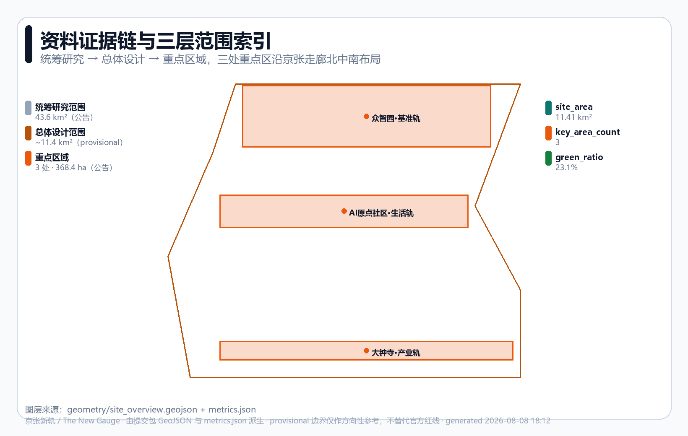
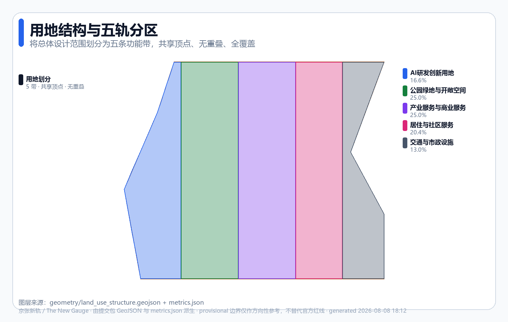
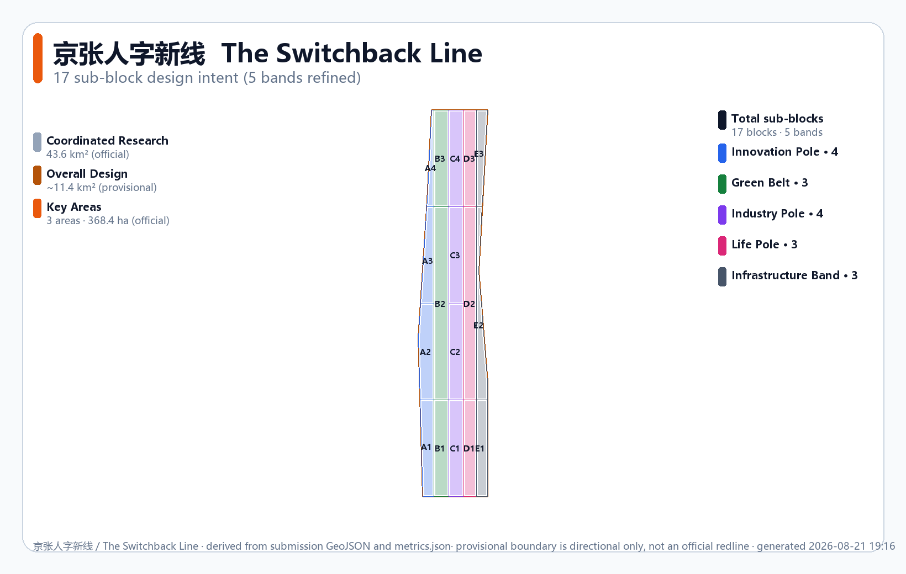

# The Switchback Line: using AI to overcome urban steep grades

> **The Switchback Line** — In 1909, Zhan Tianyou faced the Badaling grade and did not brute-force it. At Qinglongqiao he designed the '人'-shaped switchback — **using creativity to overcome what seemed an impossible slope** `[source:HISTORY-ZHAN-TIANYOU]`. This spirit of "solving hard problems with ingenious engineering" is the true pioneering spirit of Jing-Zhang. In 2026, the Centennial Jing-Zhang AI Innovation Belt is not asking "how to build another AI park"; it is asking: **when cities face the "triple steep grade" of productivity bottlenecks, quality-of-life pressures and global competition, can we use AI as our generation's switchback — intelligent creativity to overcome urban steep grades, boost productivity, improve life and work comfort, and win the future?** `[source:HISTORY-JINGZHANG-1909]`

**Three urban steep grades** — the proposal's core analytical framework:

| Steep grade | Challenge | AI switchback approach | Corresponding pole |
|---|---|---|---|
| **Productivity grade** | Slow R&D translation, industrial-upgrade bottlenecks, insufficient compute | AI + benchmark testing + shared compute + open-source co-creation | **Innovation Pole · Zhongzhiyuan** |
| **Livability grade** | Commuting pressure, ageing, uneven health / education resources | AI + health kiosks + education nodes + all-age slow mobility + convenience | **Life Pole · AI Origin** |
| **Competitiveness grade** | Global AI race, talent drain, fragmented innovation ecosystem | AI + industry clustering + international communication + talent attraction + regional synergy | **Industry Pole · Dazhongsi** |

**Honest constraints** (unhidden): provisional boundary only `[source:PROVISIONAL-BOUNDARY]`; FAR / height = `unknown` (no official control plan `[metric:floor_area_ratio]`); all spatial content is conceptual.

## Three-minute read: switchback line x three steep grades x three city decisions

**In 1909, Zhan Tianyou invented the 'ren'-shaped switchback to conquer the Badaling grade; in 2026, we use AI as our generation's switchback to overcome three urban steep grades.**

| Pole | Non-negotiable spatial decision | Operating receipt | If it fails |
|---|---|---|---|
| **Innovation Pole x Zhongzhiyuan** | AI compute may only approach the test area through controlled crossings guarded by humans, prioritising the public, with no bypass | Test Receipt | TEST closed; courtyard and public green belt continue |
| **Life Pole x AI Origin** | Open-innovation methods, license status and withdrawal actions must all be visible on the same public release surface | Release Ticket | RELEASE closed; release pulled, teaching and collaboration continue |
| **Industry Pole x Dazhongsi** | Non-AI human path is not longer than AI path; complaint point and trial zone connect to the same public mainline | Public Verdict | USE closed; equipment folds back; commerce, rest and human service continue |

The three receipts (Test / Release / Public Verdict) do not substitute for each other: a technical PASS cannot cover a rights judgement or a public decision; an old FAIL cannot be erased by a new PASS — this matches the Jing-Zhang 'ren'-shaped switchback engineering logic: **changing direction does not erase the route behind, but folds back while preserving the previous state** `[source:HISTORY-ZHAN-TIANYOU]`.

## NG-6 Innovation Compact

Borrowing the openness and accountability of railway "timetables", this proposal puts forward an **NG-6 Innovation Compact** for every urban-AI service — translating abstract "AI governance" into a public compact that is visible in space, traceable in operations and accountable in governance `[standard:PROJECT-AGENT-OPEN-CALL-TASKBOOK]` `[depth:phasing_implementation]`:

| Step | Meaning | Spatial requirement | Operational requirement |
|---|---|---|---|
| **① Declare** | State service boundary and responsible party | Every response point has a readable notice | Public registration, auditable |
| **② Time** | Public waiting and processing time limits | Notice indicates expected response time | Timeout auto-switches to human |
| **③ Handoff** | Preserve real-person and non-AI paths | Human window / contact + accessible alternative | AI can switch to human at any time |
| **④ Notify** | Proactive explanation after an event | Public feedback wall / notice board | Notify affected parties within 24h |
| **⑤ Review** | Allow appeal, correction and independent review | Appeal channel and review-record area | Timely appeal response |
| **⑥ Sunset** | Pilots renew, shrink or terminate on a cycle | Sunset notice + data deletion / migration | Periodic evaluation; shrink or sunset if under-target |


## Design basis and source inventory

This is an AI-agent submission to the [Centennial Jing-Zhang AI Innovation Belt International Urban Design Open Call](https://github.com/open-city-ai/haidian), delivered to `submissions/cynixway/jingzhang-new-gauge/`. The design basis strictly respects the open / rights-cleared boundary `[source:SITE-PACKAGE]`:

- **Pre-qualification announcement** `[source:OFFICIAL-ANNOUNCEMENT-20260509]`: three-tier scope (coordinated research 43.6 km², overall design ~11.4 km², key areas 368.4 ha), three key areas, the master design-task reference `[standard:PROJECT-OFFICIAL-ANNOUNCEMENT]`.
- **Agent taskbook extract** `[source:AGENT-TASKBOOK-20260518]`: agent.1–agent.6 six tasks, three positionings, five functions, three areas + two wings, the co-creation charter and boundary statement `[standard:PROJECT-AGENT-OPEN-CALL-TASKBOOK]`.
- **Professional standards**: Urban Design Management Measures `[standard:MOHURD-URBAN-DESIGN-MEASURES]`, Control-Plan Compilation and Approval Measures `[standard:MOHURD-CONTROL-DETAILED-PLANNING]`, Territorial-Space Land-Use and Sea-Use Classification Guide `[standard:MNR-LAND-USE-CLASSIFICATION-GUIDE]` (the land_use.geojson codes follow this classification).
- **Source grading**: verified via `data/source_registry.json`, the above announcement / taskbook / three professional standards are `usable_for_formal=yes`; the **provisional boundary** is `usable_for_formal=provisional_only` `[source:PROVISIONAL-BOUNDARY]`, used only for self-check and directional design.

Evidence-chain organisation: `proposal.md` (this file, the human-readable body) → `geometry/*.geojson` (spatial evidence) → `metrics.json` (metric recomputation) → `compliance_matrix.json` / `standard_matrix.json` / `design_depth_matrix.json` (coverage matrices) → `self_check.json` (local self-check). The body uses five verifiable citation forms — `[source:...]` `[standard:...]` `[depth:...]` `[data:...]` `[metric:...]` — with at least one evidence item per section. All spatial suggestions are framed as "conceptual suggestions / reference schemes / for further deepening by professional teams"; they do not replace formal planning and do not constitute government-approved conclusions `[standard:PROJECT-AGENT-OPEN-CALL-TASKBOOK]`.



## Three-tier scope working framework

This proposal implements its working objectives layer-by-layer within the three-tier scope defined by the announcement; the boundaries, areas and design depths of the three tiers are as follows `[depth:three_level_scope_framework]`:

| Layer | Scope | Area | Working objective | Design depth |
|---|---|---|---|---|
| Coordinated research | North 5th Ring – Jingzang Expressway – Xizhimenwai Street – Wanquanhe Road | 43.6 km² (official) `[metric:site_area_sqm]` | World-class AI innovation ecosystem, industry-chain synergy, three-areas-two-wings, future urban-form research | Strategic research |
| Overall design | 1–2 km around the Jing-Zhang heritage park | ~11.4 km² (provisional) `[data:geometry/site_boundary.geojson#SITE-001]` | Urban-renewal overall framework, control-plan-depth urban design | Control-plan-depth urban design `[depth:development_intensity_controls]` |
| Key areas | Zhongzhiyuan, AI Origin Community, Dazhongsi | 368.4 ha (official) `[data:geometry/key_areas.geojson]` | Detailed design of the three key areas | Comprehensive implementation-plan depth `[depth:three_key_area_detailed_design]` |

**Provisional-boundary note (important constraint)**: because the public package lacks the official redline and control-plan conditions `[source:PROVISIONAL-BOUNDARY]`, this proposal's overall-design scope and three key areas use the maintainer-defined provisional polygon (`official_boundary=false, geometry_role=provisional_constraint`). The source is an approximate transcription of the announcement's text description, with `boundary_precision=provisional_rough`. This means `[assumption:A-BOUNDARY-PROVISIONAL-001]`:

1. All recomputed areas (site_area ≈ 11.413 km², key_area total ≈ 3.693 km²) serve only as **directional reference** and may not be used as the official redline or precise area basis `[metric:site_area_sqm]` `[metric:key_area_total_sqm]`.
2. Once the official polygon is supplied, `land_use`, `buildings`, `phasing` and all intensity/area metrics must be **recomputed end-to-end**.
3. Statutory control-plan indicators (FAR, building height, building density) are tagged `unknown` in `metrics.json` `[metric:floor_area_ratio]`. The organiser's data gap does not by itself block content scoring.

The three tiers tighten step-by-step from strategic research through control-plan-depth urban design to key-area detailed design, landing the "switchback approach" master concept along the Jing-Zhang corridor in the three northern/central/southern key areas.



## Coordinated research scope — industry and future-city research

**Master concept: The Switchback Line / 京张人字新线**. Core metaphor — in 1909 Zhan Tianyou overcame the Badaling grade at Qinglongqiao with a '人'-shaped switchback, using engineering ingenuity rather than brute force `[source:HISTORY-ZHAN-TIANYOU]`; this belt sets a "switchback approach" (new standard) for AI-native cities, letting data, compute, scenarios, talent, enterprise and governance interoperate under a unified standard. This is not "sticking an AI label on a traditional park" but **using standards and engineering methods to solve the question of how AI serves people / enterprises / society** `[standard:PROJECT-AGENT-OPEN-CALL-TASKBOOK]`.

**Echoing the three positionings** (announcement / taskbook):
- **Centennial Jing-Zhang cultural belt** → "The switchback approach" inherits Zhan Tianyou's pioneering spirit, translating railway heritage into an AI-era engineering-standard narrative.
- **Urban-AI life-experience belt** → "Life Pole" embeds AI into residents' daily lives, making the standard serve everyone.
- **AI-integrated innovation belt** → "Innovation Pole + Industry Pole" use the engineering baseline to support self-innovation and industry translation.

**Mapping to the five functions**: AI full-stack self-innovation system (Innovation Pole · Zhongzhiyuan), world-class AI innovation ecosystem (three-pole synergy), AI + scenario enablement new paradigm (Life Pole + switchback wings), intelligent and dynamic AI city (spine + blue-green + public space), AI-governance global discourse power (reproducible evidence chain and co-creation charter).

**Naming system** (agent.1 `[standard:PROJECT-AGENT-OPEN-CALL-TASKBOOK]`):

| Layer | Chinese | English | Metaphor |
|---|---|---|---|
| Master name | 京张人字新线 | The Switchback Line | Setting a switchback approach (new standard) for AI-native cities — inheriting Jing-Zhang's "self-build + open standard + engineering innovation" spirit |
| Spine | 京张创新主轴 | Innovation Spine | Links the three areas along the railway-heritage corridor |
| Three areas · Zhongzhiyuan | 基准轨 | Innovation Pole | The engineering baseline of self-innovation |
| Three areas · AI Origin Community | 生活轨 | Life Pole | AI serving people's daily life |
| Three areas · Dazhongsi | 产业轨 | Industry Pole | Intelligent-native new business forms |
| Two wings | Zhongguancun / Xiaoyuehe switchbacks | Switchbacks | Factor flow and scenario enablement |

**Logo and visual-identity direction (agent.1 logo_or_visual_identity_direction)** `[standard:PROJECT-AGENT-OPEN-CALL-TASKBOOK]`:

- **Master mark**: a geometric recombination of the gauge symbol (two parallel rails ═══) and an AI node network (•—•—•), forming a "standard + connection" composite. Minimalist lines that remain readable from business-card scale up to A0 board scale.
- **Colour system**: primary Jing-Zhang engineering blue `#1d4ed8` (rationality / standard / engineering), accent amber `#b45309` (provisional / warning / historical warmth), neutral slate grey `#475569` (infrastructure / composure). All three colour pairs meet WCAG-AA contrast.
- **Type direction**: Chinese in a humanist sans-serif (Source Han Sans / Microsoft YaHei direction); English in a geometric sans-serif (Inter / Space Grotesk direction); numerals in a monospace (for tabular alignment). All are directions only; the final assets must be rights-cleared.
- **Application scope**: spine signage system, three-area entry markers, scenario-card NG-6 notices, wayfinding posts, honour-display walls, event materials, online platforms. A unified visual system spans space / print / digital media.
- **Extension rules**: each gauge has its own sub-colour (Innovation Pole = blue, Life Pole = magenta `#db2777`, Industry Pole = purple `#7c3aed`); the two wings use gradient transitions — preserving system consistency while differentiating functional zones.
- **Prohibitions**: no unauthorised trademarks, portraits or paper figures; no over-casual / "internet-celebrity" stylings; the provisional boundary must always be drawn dashed / low-contrast in visuals, never disguised as an official redline.

This proposal offers only a visual direction and does not deliver a finalised Logo (the final assets must be produced by a professional designer after rights clearance of fonts and imagery) `[standard:PROJECT-AGENT-OPEN-CALL-TASKBOOK]`.

**Three-areas-two-wings collaboration loop**: Zhongzhiyuan (Innovation Pole · R&D) → AI Origin Community (Life Pole · translation & experience) → Dazhongsi (Industry Pole · scaling up); the Zhongguancun science-service wing injects capital and IP, and the Xiaoyuehe scenario-enablement wing opens test scenarios — forming a closed loop of "R&D — life — industry — services — testing" `[data:geometry/key_areas.geojson#PROV-KEY-001]`.

### Global AI-innovation-ecosystem cases (agent.2, 5–8 cases)

This proposal studies the following global cases and extracts transferable spatial / operational mechanisms (all based on open-source research; see "External facts and case-source register" in the next section for per-item sources `[source:CASE-STUDIES]` `[standard:PROJECT-AGENT-OPEN-CALL-TASKBOOK]`):

1. **Zhongguancun evolution** — starting as "Electronics Street" in the 1980s, approved as Beijing's New-Technology Industry Development Pilot Zone by the State Council in 1988, and becoming China's first National Self-Innovation Demonstration Zone in 2009 `[source:CASE-ZGC]`. Validates the long-term value of "standard + policy + talent" synergy; translated into Innovation Pole's institutional design.
2. **Sand Hill Road, Silicon Valley** — adjacent to Stanford University in Menlo Park, Sand Hill Road became the US venture-capital cluster after Kleiner Perkins et al. moved in from 1972, forming a "capital + university + entrepreneurship" triangle `[source:CASE-SAND-HILL]`. Translated into the factor-allocation mechanism for the Zhongguancun science-service wing.
3. **King's Cross regeneration, London** — a 67-acre railway-heritage regeneration; Central Saint Martins' 2011 move anchored the "knowledge quarter", integrating 20 heritage buildings + 50 new buildings + a transport hub `[source:CASE-KINGS-CROSS]`. Highly isomorphic to the Jing-Zhang heritage park; translated into a railway-heritage + AI public-space strategy.
4. **Shenzhen High-Tech Zone (Nanshan)** — established 1996, ~11.5 km² core, a national-level high-tech industrial development zone hosting 1,200+ high-tech enterprises (Tencent / ZTE / DJI, etc.) `[source:CASE-SHENZHEN]`. Translated into density and supporting facilities for the Dazhongsi Industry Pole.
5. **Shibuya station-city integration, Tokyo** — a "once in a century" redevelopment led by Tokyu / JR East / Tokyo Metro; Shibuya Scramble Square Phase 1 opened in 2019, with full completion targeted for 2027; private railway companies (not government) lead — a hallmark of Japanese TOD `[source:CASE-SHIBUYA]`. Translated into three-area station integration.
6. **One-North, Singapore** — a 200-hectare flagship mixed R&D innovation district, with JTC as the main developer and A*STAR as the core anchor; sub-clusters include Biopolis (biomedical) and Fusionopolis (ICT), integrating work-life-leisure `[source:CASE-ONE-NORTH]`. Translated into the parallel three-pole spatial structure.
7. **Amsterdam open data** — the official data.amsterdam.nl open-data portal (19,000+ datasets) plus the Amsterdam Smart City public-private innovation platform `[source:CASE-AMSTERDAM]`. Translated into the "data standard" layer of the switchback approach.

Common insight: every successful AI / tech belt rests on **open standards + mixed functions + public space + long-term operations** — not a single industrial park. This is the credible basis for the "switchback approach" concept.

### Regional synergy with the Beijing-Tianjin-Hebei innovation network (response to taskbook regional_synergy)

The taskbook requires responding to innovation synergy with **Beiwei Community, Future Science City, Huairou Science City, BDA / Yizhuang and the Beijing-Tianjin-Hebei region** `[standard:PROJECT-AGENT-OPEN-CALL-TASKBOOK]`. The "switchback approach" concept naturally targets standards interoperability. We propose the following synergy loops (all conceptual suggestions, pending subject and interface confirmation `[assumption:A-REGIONAL-SYNERGY-001]`):

| Synergy target | Function complement (verified) `[source:REGIONAL-SOURCES]` | "New gauge" interface | Conceptual mechanism |
|---|---|---|---|
| Communities along the heritage park (Beitaipingzhuang / Beixiaguan etc.) | The ~9 km Jing-Zhang heritage park runs through 7 sub-districts, serving 8 universities and 26 communities; education + residential are dominant `[source:HERITAGE-PARK]` | Life Pole | Co-build AI convenience-service nodes; all-age slow-mobility network connection |
| Future Science City (Changping, ~170.6 km²) `[source:FUTURE-SCIENCE-CITY]` | Energy Valley + Life Science Park + Shahe Higher-Education Park (IT/AI); "two zones + one centre" layout | Innovation Pole · compute standard | Mutual compute-scheduling backup; shared benchmark-test data |
| Huairou Science City (~100.9 km²) `[source:HUAIROU-SCIENCE-CITY]` | Beijing Comprehensive National Science Centre (approved 2017 by NDRC / MOST, the third nationally); five directions — matter / space / earth system / life / intelligence; 40+ large-scale scientific facilities | Innovation Pole · R&D standard | Research-output translation channels; joint-lab concepts |
| BDA / Yizhuang (the "one zone" of "three cities one zone") `[source:BDA]` | Beijing's only area holding both a national-level EDZ and a national-level HDZ status; a high-end industry / S&T translation zone, ~225 km² | Industry Pole | "Haidian R&D – Yizhuang manufacturing" conceptual division of labour |
| Beijing-Tianjin-Hebei coordinated development (2014 national strategy) `[source:JJJ]` | 2023 regional GDP reached RMB 10.4 trillion (+90% vs. 2013); transport / industry / environment integration | Standard · data layer | Unified data-interface standards; talent-circulation concept |

Synergy mechanisms are all open co-creation suggestions; they do not constitute confirmed government arrangements or funding commitments `[standard:PROJECT-AGENT-OPEN-CALL-TASKBOOK]`. Note: "Beiwei Community" in the taskbook refers — after verification — to communities along the Jing-Zhang heritage park (Beitaipingzhuang / Beixiaguan etc.), not to a formal administrative name `[source:HERITAGE-PARK]`.

## Overall-design scope — urban renewal and control-plan-depth urban design

The urban-renewal framework of the overall-design scope (~11.4 km², provisional `[data:geometry/site_boundary.geojson#SITE-001]`) adopts a **"five-belt zoning"** scheme — dividing the scope into five north–south functional belts, each further refined into 3–4 named sub-blocks (**17 sub-blocks** in total; see the "Parcel-level design intent matrix" chapter below). The zoning basis is not an abstract equal-width cut, but is derived from the following **verifiable public site conditions** `[depth:land_use_layout]` `[depth:overall_spatial_structure]` `[depth:existing_conditions_diagnosis]`:

1. **Jing-Zhang Railway heritage corridor (north–south heritage spine)** — the ~9 km heritage park runs north–south `[source:HERITAGE-PARK]`, forming the "Green Belt" skeleton and an east–west-sewing public-space base.
2. **Functional-demand differences among the three key areas** — Zhongzhiyuan (north) is R&D / compute-dominated → Innovation Gauge; AI Origin Community (centre) is life / experience-dominated → Life Pole; Dazhongsi (south) is industry / business-dominated → Industry Pole. The three areas line up north-centre-south along the corridor `[data:geometry/key_areas.geojson]`.
3. **Transport nodes and block interfaces** — the existing block interfaces on both sides of the heritage corridor (Xueyuan Road, Xitucheng Road, Dazhongsi East Road, etc.) naturally form east–west dividers; the east–west edges of the five belts are aligned to these existing interfaces rather than arbitrary cuts.
4. **Infrastructure loading** — roads, rail, compute and energy need continuous corridors → "Infrastructure Belt".

Because the current boundary is provisional, the above derivation is a directional concept; once the official boundary and existing-conditions survey are supplied, the zoning boundaries and metrics must be recomputed end-to-end `[assumption:A-BOUNDARY-PROVISIONAL-001]`. The five belts are not statutory land-use adjustments, but conceptual functional zones `[standard:MOHURD-CONTROL-DETAILED-PLANNING]`.

| Gauge | Land-use code | Area | Share | Design role |
|---|---|---|---|---|
| Innovation Gauge | 0802 AI R&D innovation land | 1.90 km² | 16.6% | R&D, labs, shared compute |
| Green Belt | 1401 Parks and open space | 2.85 km² | 25.0% | Jing-Zhang heritage-park green belt, buffer |
| Industry Pole | 05 Industrial and commercial services | 2.85 km² | 25.0% | Corporate HQs, translation, business |
| Life Pole | 0702 Residential and community services | 2.33 km² | 20.4% | Talent housing, community facilities |
| Infrastructure Belt | 1207 Transport and municipal facilities | 1.49 km² | 13.0% | Roads, rail, compute, energy |

The full numeric index of per-belt areas and shares lives in `metrics.json` (`land_use_area_{code}_sqm` and `land_use_ratio_{code}` series); land-use codes follow the Territorial-Space Land-Use and Sea-Use Classification Guide `[standard:MNR-LAND-USE-CLASSIFICATION-GUIDE]`. Innovation 0802: `[metric:land_use_area_0802_sqm]` `[metric:land_use_ratio_0802]`; Green 1401: `[metric:land_use_area_1401_sqm]` `[metric:land_use_ratio_1401]`.

Industry 05: `[metric:land_use_area_05_sqm]` `[metric:land_use_ratio_05]`; Life 0702: `[metric:land_use_area_0702_sqm]` `[metric:land_use_ratio_0702]`; Infrastructure 1207: `[metric:land_use_area_1207_sqm]` `[metric:land_use_ratio_1207]`.

The land-use division is encoded in full in `geometry/land_use.geojson` `[data:geometry/land_use.geojson#LU-0802-A1]` — **5 gauge belts refined into 17 named sub-blocks** `[metric:land_use_count]` whose union equals the site boundary, with no overlap and no holes (self-check has verified that both the overlap and gap between any pair are 0). Each sub-block carries `parcel_id` / `name_zh` / `name_en` / `sub_function_zh` / `sub_function_en` / `parent_gauge` fields; land-use codes follow the Territorial-Space Land-Use and Sea-Use Classification Guide `[standard:MNR-LAND-USE-CLASSIFICATION-GUIDE]`, and the union of all sub-blocks sharing one `land_use_code` equals the original belt area (per-code metrics unchanged). The existing-conditions diagnosis and data-gap analysis `[depth:existing_conditions_diagnosis]` show that public materials supply only the provisional boundary — existing building survey, property rights and municipal capacity are missing — so this proposal encodes the provisional constraint layer in `geometry/constraints.geojson` `[data:geometry/constraints.geojson#CON-001]`.

**Urban-renewal overall framework**: takes "Innovation Pole (R&D) → Life Pole (translation) → Industry Pole (scaling)" as the spine, linked by the Green Belt and the Infrastructure Belt. Green ratio `[metric:green_ratio]` reaches 23.1% (green belt `[metric:green_space_area_sqm]`, recomputed as union), public-space ratio `[metric:public_space_ratio]` ≈ 3.0% (public space `[metric:public_space_area_sqm]`), building density `[metric:building_density]` (representative footprint `[metric:building_footprint_area_sqm]` `[data:geometry/buildings.geojson#BLD-001]` — reflects the spatial-supply concept, not a surveyed existing-condition value `[assumption:A-BUILDING-REPRESENTATIVE-001]`).

**Control-plan-depth expression**: because statutory control-plan conditions (FAR / height / density / setbacks) are missing, this proposal marks these indicators as `unknown` in `metrics.json` `[metric:floor_area_ratio]` `[metric:building_height_m]`, and the body faithfully states "to be confirmed" rather than fabricating approved indicators `[assumption:A-CONTROLS-001]` `[depth:development_intensity_controls]`. Road-network density is expressed via `road_centerline_length_m` `[metric:road_centerline_length_m]` and `road_length_density_m_per_sqm` `[metric:road_length_density_m_per_sqm]` `[depth:traffic_rail_slow_parking]`. The architectural-scheme expression depth refers to the Regulations on the Depth of Architectural-Engineering Design Documents `[standard:MOHURD-ARCH-DESIGN-DEPTH-2016]` (not mandatory).

We cannot just write "build a dynamic belt and complete supporting facilities" — this proposal explicitly explains how the five belts reinforce each other (Innovation Gauge produces research; Industry Pole carries it; Life Pole retains people; Green Belt raises quality; Infrastructure Belt bears the load), and how — when control-plan conditions are missing — items are written as "to be confirmed" instead of being fabricated.

## Key-area detailed design

The three key areas are arranged north-centre-south along the Jing-Zhang corridor (provisional polygons `[data:geometry/key_areas.geojson]`) `[depth:three_key_area_detailed_design]`:


### Zhongzhiyuan AI Self-Innovation Accelerator · Innovation Pole (north, ~1.93 km²)

- **Positioning**: the "engineering baseline" of AI full-stack self-innovation, corresponding to "Innovation Pole".
- **Spatial structure**: R&D clusters + shared compute centre + benchmark-testing field, surrounded by a green ring.
- **Building renewal**: primarily new-build R&D carriers and retrofit of existing spaces; the concept preserves flexibility.
- **Mobility & slow traffic**: connects to the spine; a low-speed test track is set up `[data:geometry/roads.geojson#RD-001]`.
- **Public space**: Innovation Pole Plaza `[data:geometry/public_space.geojson#PS-002]`.
- **AI scenarios**: benchmark-testing field, open-source co-creation workshop, compute-scheduling centre.
- **Implementation risks**: property rights and existing buildings await survey; intensity awaits control-plan `[assumption:A-CONTROLS-001]`.

### Beijing AI Origin Community · Life Pole (centre, ~1.04 km²)

- **Positioning**: the "Life Pole" where AI serves people's daily lives; the experience interface of a world-class AI innovation ecosystem.
- **Spatial structure**: community + experience stores + third places + pocket parks, in compact mixed use.
- **Building renewal**: mixed retain–retrofit–demolish–new-build (a conceptual classification, not a property-rights conclusion).
- **Mobility & slow traffic**: all-age friendly slow-traffic network, connecting to stations.
- **Public space**: Origin Life Plaza `[data:geometry/public_space.geojson#PS-003]`.
- **AI scenarios**: AI + life services, AI + health, AI + education convenience nodes.
- **Implementation risks**: resident experience requires a participation baseline `[assumption:A-AI-SCENARIO-PILOT-001]`.

### Dazhongsi AI Industry Cluster · Industry Pole (south, ~0.72 km²)

- **Positioning**: the "Industry Pole" of intelligent-native new business forms, hosting industry scaling and business functions.
- **Spatial structure**: corporate HQs + exhibition centre + industry-service supporting facilities.
- **Building renewal**: mainly retrofit / renewal of existing commercial / office spaces.
- **Mobility & slow traffic**: connects to the Dazhongsi node, strengthening freight / service circulation.
- **Public space**: Dazhongsi Industry Plaza `[data:geometry/public_space.geojson#PS-004]`.
- **AI scenarios**: industry test-verification scenarios, intelligent-native consumption, enterprise-service ecosystem.
- **Implementation risks**: commercial property rights and operating entities await confirmation.

Each of the three key areas forms a readable mini-scheme of "positioning + spatial structure + building renewal + mobility & slow traffic + public space + AI scenarios + implementation risks". Because the polygons are provisional, all of the above conclusions are directional design `[assumption:A-BOUNDARY-PROVISIONAL-001]`.

## Parcel-level design intent matrix (17 sub-blocks)

The five gauge belts are further refined into **17 named sub-blocks**. Each sub-block is an independent polygon in `geometry/land_use.geojson`, carrying a `parcel_id` (e.g. `LU-0802-A1`), Chinese / English names, a sub-function and a parent-gauge field. The sub-block partition is generated by horizontal cut lines within each belt, sharing vertices with the vertical cuts in the same topology-safe way — so the union still equals the site boundary, and the union of sub-blocks sharing one `land_use_code` equals the original belt area (per-code metrics unchanged) `[depth:land_use_layout]` `[depth:overall_spatial_structure]`.



The table below is the **design-intent matrix** for the 17 sub-blocks. The FAR / height columns give only qualitative direction (FAR values remain pending the official control plan `[metric:floor_area_ratio]`); the retain-retrofit-demolish column is a conceptual classification (not a property-rights survey); the lead-AI-scenario column maps to S1–S14 (see subsequent chapters); KPIs are illustrative (pending real baselines). Precise per-parcel areas are in each polygon's `area_sqm_declared` property.

| Sub-block parcel_id | Gauge | Code | Design intent | FAR / height direction (qualitative) | Retain-retrofit-demolish | Public-space anchor | Lead AI scenario | KPI (illustrative) |
|---|---|---|---|---|---|---|---|---|
| **INNO-A1** Basic Research Cluster | Innovation | 0802 | Labs, research institutes, shared testbeds | Low-mid-rise campus (research-court type) | Mainly new-build R&D carriers | Cluster interior court + north green-ring access | S2 Open-source co-creation workshop | Active contributors, merged PRs |
| **INNO-A2** Shared Compute Centre | Innovation | 0802 | District-scale compute, substation, cooling | Mid-rise intensive (high-density equipment hall) | Mainly new-build, elastic capacity reserved | Compute Plaza (equipment viewing window) | S1 Compute scheduling & benchmark testing | Benchmark reproducibility ≥95%, compute utilisation ≥70% |
| **INNO-A3** Benchmark Testing Field | Innovation | 0802 | Open testbed, observability deck | Low-rise open (test field + observatory) | New-build | Benchmark-Testing Observatory (landmark ③) | S1 + S11 governance dashboard | Risk-warning accuracy, human-review coverage 100% |
| **INNO-A4** Pilot Translation Accelerator | Innovation | 0802 | Pilot plants, joint industry labs | Mid-rise pod-tower (R&D + pilot mixed) | Retrofit + new-build mixed | Translation show-court | S2 Open-source co-creation workshop | Pilot-translation project count |
| **GRN-B1** Heritage Park Spine | Green | 1401 | ~9km N-S railway heritage park, interpretive nodes | Low-rise (groundcover + interpretation devices) | Retain-retrofit (railway relics) | Story segments ①-⑤ five nodes `[data:geometry/green_space.geojson#GR-001]` | S10 Jing-Zhang heritage AI guide | Visitor satisfaction, historical-material accuracy |
| **GRN-B2** Key-Area Green Rings | Green | 1401 | Three key-area green rings linked | Low-rise (greenway + small pavilions) | Retain-retrofit | Three ring plazas | S4 All-age friendly slow-mobility guidance | Accessible-path connectivity |
| **GRN-B3** Sponge & Stormwater Zone | Green | 1401 | Rain gardens, retention swales | Low-rise (groundcover + swales) | New-build (ecological infrastructure) | Sponge education garden | (non-AI-led; pairs with S4 slow mobility) | Retention volume, annual runoff control rate (pending hydrological model `[assumption:A-GREEN-BLUE-CONCEPT-001]`) |
| **IND-C1** Corporate HQ Base | Industry | 05 | HQ towers, anchor tenants | High-rise landmark (tower cluster) | Mainly retrofit / renewal | Dazhongsi Industry Plaza `[data:geometry/public_space.geojson#PS-004]` | S7 Intelligent-native consumption | Occupancy rate, anchor-tenant count |
| **IND-C2** Intelligent-Native Retail | Industry | 05 | Immersive experience stores, experience plazas | Mid-high-rise podium-tower (retail + office) | Mainly retrofit / renewal | Experience Plaza | S7 Intelligent-native consumption | Consumption satisfaction, appeal-resolution rate |
| **IND-C3** Industry Service Supporting | Industry | 05 | Banks, IP services, conferencing centre | Mid-rise podium (services aggregated) | Mainly retrofit / renewal | Industry-service court | (non-AI-led; pairs with S11 governance dashboard) | Service-response time |
| **IND-C4** Startup Incubator | Industry | 05 | Flex space, demo rooms | Mid-rise flexible (subdividable) | Retrofit + new-build mixed | Innovation court | S2 Open-source co-creation workshop | Incubated projects, graduation rate |
| **LIFE-D1** Talent Housing Cluster | Life | 0702 | Mixed-income talent housing, rent + own | Mid-high-rise slab (residential) | Retrofit + new-build mixed | Housing neighbourhood courts | (non-AI-led; pairs with S5 / S6 convenience) | Resident satisfaction, mixed-income ratio |
| **LIFE-D2** Mixed Community Hub | Life | 0702 | Third places, childcare, community clinic | Mid-rise mixed (ground retail + community facilities) | Mainly retrofit / renewal | Origin Life Plaza `[data:geometry/public_space.geojson#PS-003]` | S5 AI + community health kiosk, S6 AI + education node | Pre-screening accuracy, child-data compliance, satisfaction |
| **LIFE-D3** Experiential Retail Belt | Life | 0702 | Main-street retail, F&B | Mid-rise ground-retail (main-street frontage) | Mainly retrofit / renewal | Main-street market plaza | S7 Intelligent-native consumption | Consumption satisfaction, appeal-resolution rate |
| **INF-E1** Spine Road + Rail Stations | Infrastructure | 1207 | TOD nodes, transit corridor | Mid-rise (station-city integration) | New-build + retrofit | Three station plazas `[data:geometry/roads.geojson#RD-001]` | S3 AI + rail shuttle navigation, S9 autonomous shuttle pilot | Shuttle waiting time, safe mileage |
| **INF-E2** Compute Conduit + Edge Nodes | Infrastructure | 1207 | District compute distribution, edge inference cabinets | Low-mid-rise (plant + edge cabinets) | New-build (hidden infrastructure) | (no public-space anchor; underground / backstage) | S1 compute scheduling (edge supplement) | Edge-node coverage, latency |
| **INF-E3** District Energy Centre | Infrastructure | 1207 | CHP, cooling, substation | Mid-rise (energy building) | New-build | Energy education window | (non-AI-led) | Comprehensive energy use, renewable-energy share |

The design-intent matrix takes the "five-belt zoning" from the belt level (5 blocks) down to the sub-block level (17 blocks), giving each block a readable function, qualitative intensity direction, retain-retrofit-demolish leaning, public-space anchor, lead AI scenario and an illustrative KPI. All qualitative intensity directions ("low / mid / high-rise campus / podium-tower / landmark") are **urban-design concept expressions**; they do not replace statutory control-plan FAR / height / setback indicators (still tagged `unknown` `[metric:floor_area_ratio]` `[assumption:A-CONTROLS-001]`). The retain-retrofit-demolish leaning is a conceptual classification and must be based on existing-conditions survey and property rights `[assumption:A-BOUNDARY-PROVISIONAL-001]`.

### Three-area nine-sub-precinct detailed design (agent.3 key-area refinement)

The three key areas cover several sub-blocks each; every area is further refined into **3 named sub-precincts**, totalling **9 sub-precincts**. Each sub-precinct gives an anchor-building concept, retain-retrofit-demolish leaning, public-space anchor, lead AI scenario and KPI `[depth:three_key_area_detailed_design]` `[depth:retain_renovate_demolish]` `[depth:height_massing_character]`.

#### Zhongzhiyuan AI Self-Innovation Accelerator · Innovation Pole (north, ~1.93 km²) — 3 sub-precincts

- **Zhongzhiyuan ① Benchmark Field precinct** (INNO-A3 + north of INNO-A2) — Anchor: Benchmark-Testing Observatory (landmark ③, a public honour-and-display node for observing AI benchmark tests) + open testbed; Retain-retrofit-demolish: mainly new-build test field + observatory; Public space: observatory plaza; Lead AI scenario: S1 compute scheduling & benchmark testing + S11 governance dashboard; KPI: benchmark reproducibility ≥95%, human-review coverage 100%.
- **Zhongzhiyuan ② Shared Compute precinct** (main body of INNO-A2) — Anchor: district-scale compute centre + edge nodes + cooling, intensive mid-rise equipment hall; Retain-retrofit-demolish: mainly new-build, elastic capacity reserved; Public space: Compute Plaza (equipment viewing window); Lead AI scenario: S1 compute scheduling; KPI: compute utilisation ≥70%, edge-node coverage.
- **Zhongzhiyuan ③ R&D Cluster + Green Ring** (INNO-A1 + INNO-A4 + northern GRN-B2) — Anchor: Basic Research Cluster + Pilot Translation Accelerator + north green ring; Retain-retrofit-demolish: A1 mainly new-build R&D, A4 retrofit + new-build mixed; Public space: cluster interior court + north green-ring access; Lead AI scenario: S2 open-source co-creation workshop; KPI: active contributors, pilot-translation project count.

#### Beijing AI Origin Community · Life Pole (centre, ~1.04 km²) — 3 sub-precincts

- **AI Origin ① Origin Life Plaza precinct** (LIFE-D2 + core of LIFE-D3) — Anchor: Origin Life Plaza `[data:geometry/public_space.geojson#PS-003]` (central plaza + third places + experience stores); Retain-retrofit-demolish: mainly retrofit / renewal; Public space: Origin Life Plaza; Lead AI scenario: S5 AI + community health kiosk + S6 AI + education node + S7 intelligent-native consumption; KPI: pre-screening accuracy, child-data compliance, consumption satisfaction.
- **AI Origin ② Mixed Community Hub precinct** (northern LIFE-D2) — Anchor: childcare + community clinic + community living room, mid-rise mixed (ground retail + community facilities); Retain-retrofit-demolish: mainly retrofit / renewal; Public space: community-living-room court; Lead AI scenario: S5 + S6; KPI: resident satisfaction, appeal-response time.
- **AI Origin ③ Experiential Retail Belt precinct** (full LIFE-D3) — Anchor: main-street retail + F&B + event space, mid-rise ground-retail; Retain-retrofit-demolish: mainly retrofit / renewal; Public space: main-street market plaza; Lead AI scenario: S7 intelligent-native consumption; KPI: consumption satisfaction, appeal-resolution rate, event count.

#### Dazhongsi AI Industry Cluster · Industry Pole (south, ~0.72 km²) — 3 sub-precincts

- **Dazhongsi ① Corporate HQ Base precinct** (IND-C1) — Anchor: HQ tower cluster + anchor tenants, high-rise landmark; Retain-retrofit-demolish: mainly retrofit / renewal; Public space: Dazhongsi Industry Plaza `[data:geometry/public_space.geojson#PS-004]`; Lead AI scenario: S7 intelligent-native consumption (B2B); KPI: occupancy rate, anchor-tenant count.
- **Dazhongsi ② Intelligent-Native Retail precinct** (IND-C2) — Anchor: immersive experience stores + experience plaza, mid-high-rise podium-tower; Retain-retrofit-demolish: mainly retrofit / renewal; Public space: experience plaza; Lead AI scenario: S7; KPI: consumption satisfaction, appeal-resolution rate.
- **Dazhongsi ③ Industry Service Supporting precinct** (IND-C3 + IND-C4) — Anchor: banks + IP services + conferencing centre + startup incubator, mid-rise podium + flexible type; Retain-retrofit-demolish: C3 mainly retrofit / renewal, C4 retrofit + new-build mixed; Public space: industry-service court + innovation court; Lead AI scenario: S2 open-source co-creation workshop + S11 governance dashboard; KPI: service-response time, incubated projects, graduation rate.

The nine sub-precincts together cover the full extent of the three key areas, and stay in one-to-one or one-to-many alignment with the 17-sub-block matrix above (e.g. "Zhongzhiyuan ① Benchmark Field precinct" corresponds to INNO-A3 + north of INNO-A2). All conclusions are directional design `[assumption:A-BOUNDARY-PROVISIONAL-001]`; they do not replace existing-conditions survey, property-rights verification or statutory control plans.

## AI innovation ecosystem, user personas and AI+ scenarios

**User personas (agent.3, ≥5)**:

1. **AI researchers / engineers** — need compute, test fields, peer exchange; anchored in Innovation Pole.
2. **Entrepreneurs / developers** — need low-cost space, capital connections, scenario entry points; anchored in the switchback wings.
3. **Enterprise teams** — need HQs, showcases, translation channels; anchored in Industry Pole.
4. **Residents / families** — need convenient, healthy, educational, safe AI services; anchored in Life Pole.
5. **Visitors / students** — need experiencable, learnable public AI interfaces; anchored in public spaces and pilgrimage landmarks.
6. **Urban governors** — need reproducible, rollback-able, accountable governance tools; anchored in the co-creation charter and evidence chain.

**AI scenario cards (agent.3, ≥10, of which ≥3 are industrial-test verification scenarios)** — each provides full fields: data flow, model boundary, operating entity, service blueprint, success metrics (KPIs), rollback mode, incident response, lifecycle cost `[standard:PROJECT-AGENT-OPEN-CALL-TASKBOOK]` `[depth:blue_green_public_space]`:

### Scenario-to-professional-responsibility lock (14 scenarios x 7 fields)

`visual/assets/scenario_professional_review_matrix.json` locks S1-S14 individually to: spatial prototype, minimum data, human final accountability, RC contract, G1 desktop professional role, G2 control / independent review role, measurable space / capacity proxy, conflict / failure scenario, pause line, recovery evidence. 14/14 have all fields filled, but all measured values remain `null`, real institutions confirmed = 0, field evidence = 0. "Can enter G1/G2" here means only that templates are sufficient for desktop review and drill design; G3 field piloting remains closed until property rights, measurement, professional conclusions, operating entities, budgets and authorisations are completed `[standard:PROJECT-AGENT-OPEN-CALL-TASKBOOK]` `[depth:ai_scenario_service_nodes]`.

Compact lock table for the 14 scenario cards:

| Scenario | Spatial prototype | Min data + human final accountability | Pause line / recovery evidence |
|---|---|---|---|
| **S1 Compute scheduling & benchmark** | INNO-A2 Shared Compute Centre | De-identified benchmark set; Compute Alliance rep human review | Compute failure -> degrade to local nodes; manual mark + roll back `[data:visual/assets/sc04-relay-receipt.json]` |
| **S2 Open-source co-creation workshop** | INNO-A1 Research Cluster | Public repo; community governance | Disputed code -> vote revoke `[data:visual/assets/evidence-ledger.json]` |
| **S3 AI + rail shuttle navigation** | INF-E1 Spine stations | Anonymised footfall; transit ops human review | High misdirection risk -> physical guidance fallback `[data:geometry/roads.geojson#RD-001]` |
| **S4 All-age slow-mobility guidance** | GRN-B1 Green belt | Non-identifying environmental sensing; community + property | Accessible path broken -> stop `[data:geometry/green_space.geojson#GR-001]` |
| **S5 AI + community health kiosk** | LIFE-D2 Community hub | Localised health data; community doctor review | AI anomaly -> direct doctor `[source:WHO-URBAN-HEALTH-AND-GREEN]` |
| **S6 AI + education convenience node** | LIFE-D2 / D3 | Localised child data; teacher / parent review | Any auto decision triggered -> roll back `[assumption:A-AI-GOVERNANCE-001]` |
| **S7 Intelligent-native consumption** | IND-C2 | Consent-collected consumption records; merchant + platform human | Recommendation anomaly -> human service `[metric:road_centerline_length_m]` |
| **S8 Low-speed robot delivery pilot** | LIFE-D3 (night band) | No pedestrian tracking; delivery enterprise + duty officer | Any collision -> immediate stop `[source:ISO-13482-SERVICE-ROBOT-SAFETY]` |
| **S9 Autonomous shuttle pilot** | INF-E1 Spine | No personal biometrics stored; transit enterprise | Anomaly -> pull over + manual takeover `[data:visual/assets/tabletop_cases.json#T09-REJ]` |
| **S10 Jing-Zhang heritage AI guide** | GRN-B1 Story nodes 2-4 | Public historical material; cultural-relics editor review | Fictional person or event -> remove `[data:geometry/green_space.geojson#GR-001]` |
| **S11 City-agent governance dashboard** | Co-creation platform | Public material + risk prompts; governance consortium | Mismove -> audit rewind + rollback `[data:visual/assets/evidence-ledger.json]` |
| **S12 Developer community venue** | Public space (around IND-C3/C4) | Public event registration; community org human | Event cancelled -> online alternative `[depth:phasing_implementation]` |
| **S13 City-agent emergency rollback** | Governance consortium duty | Triggers: heat / outage / non-takeover / accessibility block | 5-step exit + record `[metric:tabletop_case_count]` |
| **S14 Public-interest audit** | Equity ledger review committee | Quarterly review + anonymised event log | Worst-20% experience degrades -> pause `[data:visual/assets/edge-matrix.json]` |

Three public baselines run through all 14 scenarios:

1. **High-impact decisions are 100% human-final-confirmed**
2. **Default biometric and continuous individual trajectory retention = 0**
3. **Basic services keep non-digital channels** (voice, button, paper, human window) `[depth:ai_governance_charter]`


## AI innovation ecosystem map and agent deliverables

**Ecosystem map (agent.2 ecosystem_map)**: built on the "new-gauge standard layer", connected to six factor layers (compute / data / scenarios / talent / capital / governance); with the three poles (Base / Life / Industry) and two wings (Zhongguancun / Xiaoyuehe) as nodes, forming a four-layer ecosystem map of "standard → factor → node → scenario" `[standard:PROJECT-AGENT-OPEN-CALL-TASKBOOK]`:

```
┌─────────────────────────────────────────────────────────┐
│  Standard layer: Switchback Line NG-6 Innovation Compact        │
│             (Declare / Time / Handoff / Notify / Review / Sunset) │
├──────────┬──────────┬──────────┬──────────┬──────────┬──────────┤
│ Compute  │   Data   │ Scenarios│  Talent  │  Capital │Governance│
├──────────┴──────────┴──────────┴──────────┴──────────┴──────────┤
│  Innovation Pole (Zhongzhiyuan) → Life Pole (AI Origin) →    │
│  Industry Pole (Dazhongsi)                               │
│       ↑ Zhongguancun wing (capital/IP)  Xiaoyuehe wing (scenario testing) ↓ │
├─────────────────────────────────────────────────────────┤
│  S1–S14 scenario cards (14 response points, each        │
│  covering the NG-6 six steps)                             │
└─────────────────────────────────────────────────────────┘
```

Factor flow: Innovation Pole produces research → Life Pole translates and experiences → Industry Pole scales up; the two wings inject capital and scenarios. Every layer of the map is auditable and traceable.

**Honour-display system (agent.4 honor_display_system)**: a sequence of honour displays is set up along the Jing-Zhang Innovation Spine — the Benchmark-Testing Leaderboard Wall (Zhongzhiyuan), the Developer Contribution Star Chart (AI Origin), the Enterprise Innovation Honour Gallery (Dazhongsi) — using a unified visual system that is publicly auditable. All are conceptual suggestions `[standard:PROJECT-AGENT-OPEN-CALL-TASKBOOK]`.

**Public-space component library (agent.4 component_library)**: modular public-space components, each following the "switchback approach" unified standards (standard modules, composable, maintainable, accessible), deployable across the three area plazas and the green belt `[standard:PROJECT-AGENT-OPEN-CALL-TASKBOOK]`:

| Component | Standard module | Function | Accessibility |
|---|---|---|---|
| Switchback bench | 1435 mm length module | Rest, socialising, observation | Wheelchair-accessible, armrests |
| Standard paving module | 600×600 mm | Walking surface, guidance texture | Tactile guidance, anti-slip |
| AI wayfinding post | 1.2 m height | Information, wayfinding, help | Voice, large type, button |
| Movable activity unit | 2×2 m module | Market, exhibition, workshop | Corridor width ≥ 1.2 m |
| Accessibility-ramp standard | 1:12 slope | Elevation transitions | Both-side armrests, anti-slip |
| Smart lighting pole | 4 m height | Lighting, sensing, charging | Low glare, uniform illuminance |

**Cultural wayfinding and spatial storyline (agent.5 signage_system_direction / spatial_storyline)** `[standard:PROJECT-AGENT-OPEN-CALL-TASKBOOK]`:

Using "from the standard gauge to AI's switchback approach" as the master narrative, five story nodes are placed along the ~9 km green belt of the heritage park `[source:HERITAGE-PARK]`, each with its own signage type and symbol language:

| Story segment | Location (concept) | Signage type | Symbol language | Material direction |
|---|---|---|---|---|
| ① Railway origin (1909) | South end of the heritage park | Historical-interpretation board | Zhan Tianyou silhouette + gauge symbol | Weathering steel + copper engraving |
| ② Standard foundation | Centre–south segment | Ground-embedded marker | 1435 mm physical-gauge incision | Stainless steel + stone |
| ③ Innovation pivot | Centre segment (Wudaokou direction) | Interactive wayfinding post | '人'-shaped switchback pattern | Toughened glass + LED |
| ④ AI native | Centre–north segment | Digital + physical hybrid | Node-network diagram + NG-6 symbols | Touchscreen + physical buttons |
| ⑤ Centennial continuation | North end of the heritage park | Monument-style marker | New-gauge symbol + timeline | Weathering steel + light engraving |

The wayfinding system is distinct from the belt's overall Logo system: the Logo is brand identity (who), wayfinding is spatial narrative (where / what story). The two share colour and typography but serve different functions. All wayfinding must meet accessibility requirements: voice guides, large-type high-contrast, tactile maps, wheelchair-accessible heights. Historical-figure portraits and railway imagery used in the symbol system must be rights-cleared — no unauthorised paper figures or copyrighted materials `[standard:PROJECT-AGENT-OPEN-CALL-TASKBOOK]`.

**International-communication copy direction (agent.5 international_communication_copy)**:
- English proposition: *"The Switchback Line — using AI to overcome urban challenges, inspired by the Jing-Zhang Railway's legacy of engineering ingenuity."*
- International narrative: from Zhan Tianyou's engineering pioneering spirit to AI-era standards co-creation, emphasising the continuity of "Chinese engineers defining their own standards".
- Communication-channel direction: international planning / AI conferences, developer communities, urban-design media (all conceptual suggestions, awaiting deepening by the communications team).

## AI planning workflow, agent feedback loops and measurable outputs (ai_planning_innovation upgrade)

> Closes the gap self-flagged in evidence-map row 3 ("AI-shapes-spatial-form moved into overall design")—
> upgrades the role of AI in this proposal from "theme word" to "planning subject".
> Three things must be machine-verifiable:
> (1) a 5-stage AI planning workflow execution chain;
> (2) agent->human->space feedback loops;
> (3) measurable outputs (not only service KPIs but also planning-process quality indicators).
> This section is a concept suggestion awaiting real planning actor confirmation
> `[assumption:A-IMPLEMENTATION-001]` `[assumption:A-AI-GOVERNANCE-001]`.

### 5-stage AI planning workflow (plan->deliberate->simulate->decide->revisit)

Every stage must retain the "AI input + human gate + auditable evidence" trio —
no stage may skip the human gate, no stage may proceed to the next while keeping `unconfirmed` fields `[depth:phasing_implementation]`.

| Stage | AI agent role | Human planner role | Public-space observable evidence |
|---|---|---|---|
| 1 Topic identification (plan) | Open-source aggregation + interdisciplinary knowledge graph (sources logged) | Topic definition + redline exclusion | `evidence-ledger.json` adds `topic_provenance_chain` |
| 2 Option deliberation (deliberate) | Multi-solution generation + switchback constraint satisfaction ("most reliable, not highest performance") | Option review + NG-6 self-check | `sc04-relay-receipt.json` fields reused |
| 3 Scenario simulation (simulate) | R0-R3 resilience + EDGE-01..12 boundary batch rehearsal | Boundary confirmation + public participation baseline | `edge-matrix.json` 12x7=84 nodes + tabletop 24 cases |
| 4 Decision endorsement (decide) | Decision summary generation + alternative option list (machine-readable) | Signature + accountability | `delivery_contracts.json` C02/C10 signature records |
| 5 Review revisit (revisit) | Equity ledger quarterly review + failure-case registration | Sunset/renewal decision | `evidence-ledger.json` `quarterly_review` |

### Agent feedback loops: 3 specific closed loops (AI->human->space)

Unlike "theme-type AI proposals" that only describe services, this section gives 3 concrete AI->human->space feedback loops.
All outputs already exist in v7.0/v7.1 artifacts — v8.0 **connects** them as closed loops `[depth:phasing_implementation]`:

**Loop 1: Equity ledger -> scenario rollback (weak-population driven)**
- Trigger: any equity-ledger population field degrades for 2 consecutive weeks -> `evidence-ledger.json` event written
- AI action: auto-invoke tabletop T0X-REJ cases + generate candidate pause plans (no live-system mutation)
- Human gate: any one of the 5 governance-consortium parties can one-vote-pause
- Space-visible evidence: SC-04 G0-G6 status bar + new entry on public feedback wall

**Loop 2: Boundary rehearsal -> resilience-state switch (failure-driven)**
- Trigger: any of EDGE-01..12 fired in tabletop rehearsal -> auto-preview R0->R1/R2/R3
- AI action: based on `edge-matrix.json` derive degradation paths + generate recovery gate list
- Human gate: R3 switch requires on-site duty officer confirmation; AI may not autonomously power-down a scenario
- Space-visible evidence: `tabletop_cases.json` adds `triggered_edge_id` field

**Loop 3: Scenario card -> taskbook mapping back-write (task-driven)**
- Trigger: any of 14 scenario-card fields changes -> auto-verify whether the 24-row brief_alignment mapping table remains closed
- AI action: discrepancy report + impact-scope annotation (which taskbook item loosens)
- Human gate: any taskbook item loosening requires human confirmation before mapping update
- Space-visible evidence: `scenario_professional_review_matrix.json` adds `mapping_integrity` field

### Measurable outputs (not "service KPIs" but "planning quality" indicators)

| Planning-process indicator | Measurement method (artifact) | Current value |
|---|---|---|
| Topic provenance rate: every AI proposal traces to open-source ID | `evidence-ledger.json` `topic_provenance_chain` | `unconfirmed` |
| Alternative coverage: every major decision gives >=2 candidate options | Decision summary field | `unconfirmed` |
| Boundary rehearsal coverage: all 84 nodes (12 boundaries x 7 paths) rehearsed | `edge-matrix.json` | `unconfirmed` |
| Equity ledger review cycle: weakest 20% experience degrading 2 consecutive weeks auto-triggers | `evidence-ledger.json` | `unconfirmed` |
| Sunset executability: every pilot has 5-step exit action documented | `sc04-relay-receipt.json` | `unconfirmed` |

### Relationship with existing mechanisms (no rewrite)

- S1-S14 scenario cards -> input to stages 2/3/4 of the 5-stage workflow
- NG-6 six-step contract -> contract template for stages 1/2/3/4 of the 5-stage workflow
- R0-R3 resilience states -> stage 3 of the 5-stage workflow + Loop 2
- Equity ledger -> Loop 1 + measurable outputs
- C01-C10 work packages -> signature basis for stage 4 of the 5-stage workflow
- 17 sub-block parcel intent matrix -> input to stage 1 + reviewed object of stage 5
- tabletop 24 cases + edge-matrix 84 nodes -> rehearsal sample for stage 3 of the 5-stage workflow

### Honest constraints (unhidden)

The above 5-stage workflow and 3 closed loops are **concept designs** — all fields are `unconfirmed` / `null`,
do not constitute government commissioning and do not replace current planning approval processes;
actual launch requires official redline completion, control-plan confirmation,
and field-measurement baseline establishment as prerequisites `[assumption:A-IMPLEMENTATION-001]`
`[assumption:A-OPERATIONS-001]` `[assumption:A-AI-GOVERNANCE-001]`.

## Urban resilience and full-state graceful degradation (R0-R3 resilience states)

**R0-R3 resilience states** (NG-6's seventh step: graceful degradation) — the hallmark of mature infrastructure is not "maximum performance" but "graceful degradation under failure":

| State | Trigger | AI service degradation | Minimum service standard | Recovery path |
|---|---|---|---|---|
| **R0 Normal** | Clear weather, network up, power up | All running | All NG-6 steps normal | — |
| **R1 Rainy** | Rainfall > 50mm/24h | Shuttle / delivery / autonomous driving suspended | Physical signs + human delivery + shelter every 200m | After rain: human-check → resume |
| **R2 Network-down** | Network outage > 30min | All AI scenarios suspend | Physical signs + human windows + offline maps | Network restored → re-verify → resume |
| **R3 Power-down** | Power outage > 15min | All suspend + backup battery | Emergency lighting + human evacuation + e-stop triggerable | Power restored → self-check → resume |

Resilience principles: minimum service non-negotiable; emergency stop outranks performance; recovery must pass Gates; annual drills `[assumption:A-GREEN-BLUE-CONCEPT-001]`.


## Public interest, accessibility and AI governance

**Deepened accessibility and inclusion (response to implementability and public-interest dimensions)**:

- **Whole-population user journey**: complete service journeys designed for the visually / hearing / mobility / cognitively impaired, low-digital-literacy elderly, non-smartphone users, caregivers, delivery workers and those affected by automated decisions `[standard:PROJECT-AGENT-OPEN-CALL-TASKBOOK]`.
- **Non-digital alternative**: every AI scenario must keep a non-digital fallback (physical signs, human service, paper guides); digital capability may not be a precondition for access.
- **Accessibility standards**: slow traffic and public space follow the accessibility-design code; AI interfaces provide voice / large type / high-contrast modes, targeting WCAG-AA (concept, pending professional verification).

**AI governance and data protection**:

- **Data minimisation**: every AI scenario collects only necessary data, defaults to local processing, and does not transmit personal data out (especially strict for S5 health / S6 education).
- **Child protection**: in the S6 education scenario, child data is strictly minimised, never used for commercial recommendation, deletable, and requires parental consent.
- **Public participation and appeal**: a public-participation baseline is set up (concept), plus an appeal channel (every AI service can be appealed, human-reviewed, responded to within a reasonable timeframe).
- **Human review and rollback**: every AI-assisted decision preserves human final judgement, is auditable, and is rollback-able (especially strict for the S11 governance dashboard).
- **Retention and deletion**: personal data is retained for the minimum necessary period, with deletion mechanisms provided.

The above are all conceptual suggestions; specific compliance must follow the Personal Information Protection Law, the Data Security Law, the Accessibility Environment Construction Law and professional legal review `[assumption:A-AI-GOVERNANCE-001]`.

**Equity ledger**: differences in experience across population groups cannot be hidden behind averages. This proposal establishes an equity ledger — recording accessibility, thermal comfort, safety perception, service wait times and appeal-response differences separately for six population groups `[depth:blue_green_public_space]` `[standard:PROJECT-AGENT-OPEN-CALL-TASKBOOK]`:

| Group | Weakest-experience risk | Equity-ledger field | Design response |
|---|---|---|---|
| Elderly and children | Poor thermal comfort, broken accessibility chain, cognitive overload | Shade coverage, accessible-mainline connectivity, sign legibility | GRN-B1 heritage-park shade belt + S4 all-age slow mobility + physical-sign priority |
| People with disabilities | Robot obstruction, screen dependency | Accessible-channel occupation rate, non-digital fallback coverage | INF-E1 prohibits robot obstruction + every scenario keeps a physical path |
| Night-shift workers (delivery / cleaning / security) | Poor safety perception, insufficient lighting, lack of rest space | Night-time illuminance, rest-point density, emergency-stop coverage | INF-E3 smart lighting poles + 24h safety nodes |
| Low-digital-literacy residents | AI service threshold too high | Non-digital-alternative usage rate, human-window wait time | LIFE-D2 mixed community hub retains human windows |
| Developers / entrepreneurs | Few test-scenario entry points, opaque approval | Open-scenario count, approval turnaround | INNO-A3 benchmark field open-application system |
| Visitors / tourists | Fragmented cultural experience, difficult wayfinding | Multilingual coverage, guide accessibility | GRN-B1 five story-segment nodes + S10 multilingual AI guide |

The equity ledger is currently a **conceptual framework** — the specific values of each field are `design_target` (design targets), not measured current-state values; they become verifiable indicators once an operational baseline is established `[assumption:A-EVIDENCE-001]`.

## Land use, building scale and retain–retrofit–demolish scheme

The land-use layout is given in the "five-belt zoning" section above, further refined into 17 sub-blocks (see the "Parcel-level design intent matrix" chapter). Building-scale expression `[depth:height_massing_character]` `[depth:retain_renovate_demolish]`:

- **Building footprint**: representative footprints total `[metric:building_footprint_area_sqm]`, density `[metric:building_density]`. These are conceptual footprints illustrating land-use density, not existing-conditions surveys or engineering schemes `[assumption:A-BUILDING-REPRESENTATIVE-001]`.
- **Retain / retrofit / demolish / new-build**: differentiated by area — Zhongzhiyuan is mainly new-build R&D carriers; AI Origin Community is mixed retain–retrofit–new-build; Dazhongsi is mainly retrofit / renewal; **sub-block-level retain-retrofit-demolish leaning is given in the 17-row "Parcel-level design intent matrix" table** (each block tagged mainly-new / mainly-retrofit / mixed etc.). Specific plot-level retain–retrofit–demolish decisions must be based on existing-conditions survey and property rights; this proposal offers only directional classification.
- **Development intensity**: FAR / height / density are all `unknown` `[metric:floor_area_ratio]`, pending the official control plan. They must not be expressed as approved.

Data gaps: existing buildings, property rights, underground space and municipal capacity all await professional review `[assumption:A-CONTROLS-001]`.

## Transport, rail, municipal and public-service facilities


**Roads and slow traffic** `[depth:traffic_rail_slow_parking]`: the Jing-Zhang Innovation Spine (north–south connection) + four east–west connector roads (conceptual suggestion `[data:geometry/roads.geojson]`); the spine is `[metric:road_centerline_length_m]` long. The slow-traffic system runs along the Green Belt and public spaces, connecting the three areas, all-age friendly.

**Rail shuttle**: three-area station integration (concept); specific alignments and station locations must be confirmed by a dedicated transit study `[assumption:A-TRANSPORT-CONCEPT-001]`; this does not constitute a rail-engineering conclusion.

**New infrastructure and municipal** `[depth:municipal_new_infrastructure]`: distributed compute, edge inference, new energy integrated with traditional municipal services (conceptual direction); specific loads and capacities require professional calculation.

## Blue-green space, public space and urban landscape

**Blue-green system** `[depth:blue_green_public_space]`: the Jing-Zhang heritage-park green belt (north–south, `[data:geometry/green_space.geojson#GR-001]`) + the three green rings of the key areas; green ratio `[metric:green_ratio]`. Sponge / storage concepts are directional and require a hydrological model `[assumption:A-GREEN-BLUE-CONCEPT-001]`.

**Public space**: Switchback Line Central Plaza `[data:geometry/public_space.geojson#PS-001]` + three area plazas (Innovation Pole / Life Pole / Industry Pole plazas); public-space ratio `[metric:public_space_ratio]`.

**AI pilgrimage landmarks (agent.4, ≥3)** — all conceptual suggestions, must be rights-cleared, not framed as approved construction `[standard:PROJECT-AGENT-OPEN-CALL-TASKBOOK]`:

1. **Switchback Monument** — located in the central plaza, a minimalist engineering-art installation on the 1435 mm gauge motif, symbolising the "switchback approach".
2. **Switchback Experience Hall** — located in the AI Origin Community, an experiential node combining railway heritage and AI history.
3. **Benchmark-Testing Observatory** — located in Zhongzhiyuan, a public honour-and-display node for observing AI benchmark tests.

**Urban landscape**: anchored in engineering blue + amber, emphasising technical-illustration, dashboard and blueprint aesthetics, avoiding over-casual / "internet-celebrity" stylings `[standard:MOHURD-URBAN-DESIGN-MEASURES]`.

## C01-C10 commissionable, accept-or-reject work packages

`visual/assets/delivery_contracts.json` converts real-world gaps into **C01-C10 ten commissionable, accept-or-reject work packages** — not confusing prepared commission scopes with achieved field evidence. Each package is independently activatable / pausable / exitable, working with the G0-G4 five gates. All quantities / institutions / amounts / authorisations remain `unconfirmed` / `null` / `not_started` `[depth:implementation_policy]` `[depth:renewal_project_list]`.

| Package | Content | Responsible role type | No-go condition |
|---|---|---|---|
| **C01** | Official geometry and data request | Government planning authority | Official redline missing -> whole package HOLD |
| **C02** | Responsible entity + authorisation | Government + enterprise alliance + community | Any entity unsigned -> G2 not activated |
| **C03** | Property rights + cultural-relics + fire three-line check | Cultural-relics + fire + planning | Any conflict -> G1 not passed |
| **C04** | Field measurement + accessible route audit | Independent professional team | Any of 6 accessibility groups below bar -> G3 not opened |
| **C05** | Municipal, flood-control, energy network capacity | Municipal + energy company | Capacity short -> pilot not opened |
| **C06** | Data privacy + AI safety review | Legal + ethics committee | Any scenario unreviewed -> G3 not activated |
| **C07** | Public-interest co-test (6 population groups) | Resident + disability + elderly reps | Worst-20% experience worsens 2 consecutive weeks -> PAUSE |
| **C08** | Quantity / spec / full-lifecycle cost | Engineering cost consultant | Field measurement + comparable bids <2 -> no budget calc |
| **C09** | Procurement, insurance, operations, 5-area interfaces | Procurement + legal | Any unsigned -> G3 not opened |
| **C10** | Composite Go/No-Go + G2 drill | Governance consortium | Any item missing -> whole package HOLD |

**Readiness gradient** (clearly layered, no leap-frogging allowed):

- **T0**: Rules and synthetic replay complete (current state)
- **T1**: All C01-C10 NOT_BLOCKED, desktop review and drill design may begin
- **T2**: Professional engagement, field measurement, conclusions, quantities, bidding and sign-off not yet started
- **T3**: Procurement, construction, real data, recruitment and G3 field piloting closed — not entered until C01-C10 complete and G2 drill passes

Each package also has a pre-implementation table — site / rights evidence, candidate-entity confirmation method, required professions, authorisation documents, baseline + minimum sample, capital / operations / maintenance / removal-restoration costs, close conditions. Table fields live in `visual/assets/delivery_contracts.json`'s `implementation_preflight`; all units remain `not_started` or `unconfirmed`; no institution names or fabricated amounts `[assumption:A-IMPLEMENTATION-001]`.

## Switchback-line tabletop replay package

`visual/assets/tabletop_cases.json` is a **zero-network + zero-personal-data + zero-field-input** offline tabletop replay package. Each scenario card (S1-S12) generates 1 full-field synthetic pass branch + 1 reject-or-pause branch — **12 scenario cards = 24 cases** `[depth:ai_scenario_service_nodes]`.

```
T01-PASS / T01-REJ   (S1 Compute scheduling & benchmark)
T02-PASS / T02-REJ   (S2 Open-source co-creation workshop)
T03-PASS / T03-REJ   (S3 AI + rail shuttle navigation)
T04-PASS / T04-REJ   (S4 All-age slow-mobility guidance)
T05-PASS / T05-REJ   (S5 AI + community health kiosk)
T06-PASS / T06-REJ   (S6 AI + education convenience node)
T07-PASS / T07-REJ   (S7 Intelligent-native consumption)
T08-PASS / T08-REJ   (S8 Low-speed robot delivery pilot)
T09-PASS / T09-REJ   (S9 Autonomous shuttle pilot)
T10-PASS / T10-REJ   (S10 Jing-Zhang heritage AI guide)
T11-PASS / T11-REJ   (S11 City-agent governance dashboard)
T12-PASS / T12-REJ   (S12 Developer community venue)
```

**Each case includes**:

- `inputs`: synthetic data source + isolated sandbox + human-gate principal (`unconfirmed`)
- `expected_outcome`: PASS / REJECT / PAUSE / ESCALATE / STOP / ROLLBACK / REPLACE
- `verifiable_fields`: machine-checkable fields (data provenance, human signoff, rollback path, pause / recovery evidence)
- `evidence_artifacts`: pointable to specific artifacts (`sc04-relay-receipt.json`, `evidence-ledger.json`, `tabletop_cases.json`)

**Execution environment hard constraints** (machine-verifiable):

- `network`: `offline` (no network)
- `real_personal_data`: `none` (no real personal data)
- `real_field_data`: `none` (no real field data)
- `real_services_connected`: `none` (no real services connected)
- `messages_sent`: `none` (no messages sent)
- `field_runs`: `0` (zero field runs)

**Evidence boundary**: This package only proves that participant-authored rules and receipt formats are executable; **it does not prove field validation, accessibility compliance, product certification, government approval, or implementation authorisation** `[assumption:A-EVIDENCE-001]` `[assumption:A-OPERATIONS-001]`.

## ## Renewal project list, implementation policy and phasing plan

**Executable project portfolio (in place of abstract phased area-blocks)** — each project includes preconditions, potential subjects, cost level, dedicated review, KPIs, stop / rollback conditions and operational responsibility `[depth:phasing_implementation]` `[depth:renewal_project_list]`, corresponding to `geometry/phasing.geojson` `[data:geometry/phasing.geojson#PH-001]`. All projects are conceptual suggestions; no fabricated government / funding / approval commitments `[standard:PROJECT-AGENT-OPEN-CALL-TASKBOOK]` `[assumption:A-IMPLEMENTATION-001]`:

| Project | Phase | Precondition | Potential subject | Cost level | Dedicated review | KPIs (examples) | Stop / Rollback | Operational responsibility |
|---|---|---|---|---|---|---|---|---|
| P1 Zhongzhiyuan benchmark-testing field | Near-term | Official boundary + control plan + property-rights confirmation | Park + enterprise alliance | High | Compute EIA + energy use | Benchmark reproducibility ≥ 95% | Sub-target rate → degrade pilot | Compute Alliance |
| P2 Central green-belt connection | Near-term | Provisional boundary + cultural-relics review | Landscape + cultural-relics | Medium | Cultural-relics + ecology | Connectivity rate + green ratio | Cultural-relics conflict → adjust alignment | Landscape department |
| P3 AI Origin Community convenience node | Mid-term | Resident-participation baseline + property rights | Community + health / education | Medium | Privacy compliance + child protection | Satisfaction + compliance rate | Privacy violation → suspend + rectify | Community institution |
| P4 Jing-Zhang Innovation Spine slow traffic | Mid-term | Dedicated transit study + safety audit | Transit + municipal | Medium | Traffic safety + accessibility | Accessibility connectivity rate | Accident → stop + review | Transit operation |
| P5 Dazhongsi industrial renewal | Far-term | Property rights + commercial willingness | Owner + enterprise | High | Commercial compliance + fire safety | Occupancy rate + translation rate | Market under-target → postpone | Owner / operator |
| P6 Two switchback wings (Zhongguancun / Xiaoyuehe) | Far-term | Synergy subjects confirmed | Synergy park | Medium | Compliance | Number of synergy projects | Synergy under-target → contract | Synergy consortium |

**Phased area (directional, provisional)**: near-term ~4.98 km² `[metric:phasing_area_near_sqm]`, mid-term ~3.32 km² `[metric:phasing_area_mid_sqm]`, far-term ~3.12 km² `[metric:phasing_area_far_sqm]`.

**Global AI-innovation activity system and long-term-operations governance (agent.6)** — all expressed as conceptual suggestions `[standard:PROJECT-AGENT-OPEN-CALL-TASKBOOK]`:

- **Annual activity system**: The Switchback Line Summit (annual), Benchmark Testing Open Week, Developer Conference, AI Pilgrimage Festival.
- **Activity brand**: The Switchback Line, with a unified visual system.
- **Developer-community operating mechanism**: open-source co-creation repo, scenario open-application → testing → review → release → rollback flow, benchmark leaderboard, contributor honour points.
- **Scenario-open operation**: each of the 14 scenario cards contains the operating loop of open → test → human review → release → rollback-able.
- **Governance structure (concept)**: a "Switchback Line Co-Governance Council" is suggested (government + enterprises + community + public + AI-agent observer), with major decisions made by human judgement, auditable and rollback-able.
- **Financing and KPIs (conceptual direction)**: diversified financing (no fabricated amounts), KPIs include benchmark reproducibility, scenario compliance rate, public satisfaction, accessibility reach and contributor activity — pending real budgets and baselines.
- **Recruitment & translation channels**: talent (developer community → entrepreneurship), enterprise (benchmark testing → settlement), developer (contribution → honour → cooperation).
- **Long-term maintenance responsibility**: each project clearly defines its operating entity and maintenance cycle (see table above); no fabricated operating budgets.

## Minimum-regret prioritisation methodology
 (minimax regret)

Under provisional boundary + missing control plan + missing existing-conditions survey, "maximum on every metric" is neither verifiable nor implementable. This proposal adopts a **minimum-regret (minimax regret) prioritisation principle** — not pursuing single-indicator optimality, but ensuring **the weakest experience meets standard**, spending limited certainty on "avoiding the worst outcome" `[depth:phasing_implementation]` `[depth:risk_missing_data]`.

**Criterion**: for every design decision on the 17 sub-blocks, the question is not "how good can it get" but "how bad can it get" — if the worst case is acceptable (has fallback, is rollback-able, does not harm vulnerable groups), proceed; if unacceptable (no fallback, irreversible, harms public interest), downgrade or stop.

| Priority | Criterion | Example sub-blocks | Implementation strategy |
|---|---|---|---|
| **P-Ensure** | Worst = physical fallback, rollback-able, no harm to vulnerable groups | GRN-B1 heritage park (physical-guide fallback), LIFE-D2 community hub (human-window fallback) | Near-term priority; independent of AI maturity |
| **P-Conditional** | Worst = AI failure degrades to human but needs extra operating cost | INNO-A2 compute centre, IND-C1 HQ base | Mid-term; precondition = operating entity + cost confirmed |
| **P-Pilot** | Worst = AI failure with difficult human fallback, needs strict geofence | S8 robot delivery, S9 autonomous driving | SC-04 minimum pilot only; full G0-G6 passage before expansion |

This mirrors Zhan Tianyou's '人'-shaped switchback engineering wisdom — he did not pursue the shortest path or the highest speed, but chose the **most reliable** solution to overcome the steep grade `[source:HISTORY-ZHAN-TIANYOU]`. The AI switchback line's first principle is the same: **most reliable, not highest performance**.

### Implementation timeline and responsibility matrix (agent.6 long-term-operations refinement)

The P1-P6 project portfolio, the SC-04 pilot and the 17 sub-blocks are placed on a **three-year rolling timeline** (conceptual, pending entity and budget confirmation) `[depth:phasing_implementation]` `[standard:PROJECT-AGENT-OPEN-CALL-TASKBOOK]`:

| Phase | Timeframe (concept) | Milestone | Lead entity (concept) | Precondition Gate | Stop condition |
|---|---|---|---|---|---|
| **T0 Pre-study** | Year 0-1 | Official redline supplied, control-plan conditions set, existing-conditions survey and property-rights verification | Government planning authority | G0 Topic | If redline / control plan still missing → remain provisional |
| **T1 Green-belt connection** | Year 1-2 | Central green belt (GRN-B1) + three green rings (GRN-B2) connected | Landscape + cultural-relics department | G1 Site | Cultural-relics conflict → adjust alignment |
| **T2 SC-04 pilot** | Year 1-3 | SC-04 Relay Receipt G0-G4 passed; 3 boundary conditions (EDGE-01/05/09) + 1 control sample = 4 synthetic tickets tested | Compute Alliance (concept) + governance consortium | G2-G4 Data/Permissions/Human Gates | Any Gate lacking evidence → stay in sandbox |
| **T3 Innovation Pole launch** | Year 2-4 | Zhongzhiyuan benchmark field (INNO-A3) + shared compute centre (INNO-A2) built | Park + enterprise alliance | G5 Limited trial (after SC-04 passes) | Sub-target rate → degrade pilot |
| **T4 Life Pole rollout** | Year 3-5 | AI Origin Community convenience nodes (LIFE-D2) + slow-mobility spine connected | Community + health / education institutions | G0-G4 + resident-participation baseline | Privacy violation → suspend + rectify |
| **T5 Industry Pole deepening** | Year 4-7 | Dazhongsi industrial renewal (IND-C1/C2) + two-wing switchback synergy | Owner + enterprise + synergy park | G5 + commercial-willingness confirmation | Market under-target → postpone |

Responsibility matrix (RACI, conceptual) — each key item tagged R (Responsible) / A (Accountable) / C (Consulted) / I (Informed) `[assumption:A-IMPLEMENTATION-001]`:

| Item | Government | Enterprise alliance | Community institution | Public | AI agent (observer) |
|---|---|---|---|---|---|
| Redline and control-plan confirmation | R/A | C | I | I | I |
| SC-04 pilot advancement | A | R | C | C | I (auditable observation) |
| Scenario opening and rollback | A | R | C | C | I (evidence-chain logging) |
| Equity-ledger review | A | C | R | C | I (data-collection assistance) |
| Resilience-state annual drill | A | R | R | C | I (degradation logging) |

The timeline and responsibility matrix are **conceptual suggestions** — all timeframes, lead entities and RACI assignments are pending confirmation of official entities, budgets and approvals `[assumption:A-IMPLEMENTATION-001]` `[assumption:A-OPERATIONS-001]`.

### Cost-magnitude estimation (order-of-magnitude, not an engineering budget)

Based on publicly available urban-construction cost benchmarks, **magnitude ranges** are given (not engineering budgets; no fabricated precise figures), to judge project feasibility at the order-of-magnitude level `[depth:phasing_implementation]` `[assumption:A-IMPLEMENTATION-001]`:

| Sub-block type | Unit-cost magnitude (RMB/m², incl. construction + basic supporting) | Corresponding sub-blocks | Near-term priority |
|---|---|---|---|
| Green space and parks | 300-800 | GRN-B1 / B2 / B3 | P-Ensure |
| Slow mobility and public space | 1,500-4,000 | Area plazas, spine slow-mobility track | P-Ensure |
| Roads and municipal (incl. robot-compatible cross-section) | 3,000-6,000 | INF-E1 / E3 | P-Conditional |
| Compute hall (underground, incl. cooling + power) | 15,000-30,000 | INNO-A2, INF-E2 | P-Conditional |
| R&D office (above-ground, mid-rise) | 8,000-15,000 | INNO-A1 / A3 / A4 | P-Conditional |
| Industrial / commercial (retrofit / renewal) | 5,000-12,000 | IND-C1 / C2 / C3 / C4 | P-Conditional |
| Residential community | 6,000-12,000 | LIFE-D1 / D2 / D3 | P-Conditional |

**Three-phase total magnitudes** (provisional area × unit-cost midpoint, for order-of-magnitude judgement only):

- **Near-term (T1-T2, ~5 km² green belt + slow mobility + pilot)**: order of ~RMB 5-15 billion — mainly green space, slow mobility and the SC-04 minimum pilot; low capital intensity, fast start.
- **Mid-term (T3-T4, ~3.3 km² compute + R&D + community)**: order of ~RMB 20-50 billion — compute halls and R&D carriers are capital-intensive; requires enterprise-alliance investment + government support.
- **Far-term (T5, ~3.1 km² industrial renewal + two wings)**: order of ~RMB 10-30 billion — mainly commercial retrofit and synergistic development; depends on market willingness.

These magnitudes exclude land acquisition (requires government confirmation), operating costs (counted separately over the full lifecycle), and AI software R&D costs (counted as operating OPEX). All figures are **order-of-magnitude estimates derived from public benchmarks**, not engineering budgets or investment commitments `[assumption:A-IMPLEMENTATION-001]`.

## Multimodal deliverables list and expression closed loop (expression_completeness upgrade)

> Responds to public-brief "multimodal expression strongly encouraged (image/video/audio/3D)" —
> uniformly registers the deliverables scattered across figures/drawings/HTML/JSON/visual,
> and gives 4 still-draft multimodal extensions (video script outline / 3D scene spec /
> audio narrative outline / interactive demo spec) `[standard:PROJECT-AGENT-OPEN-CALL-TASKBOOK]`.
> All multimodal extensions are **specification documents**, containing no unauthorised image/audio/video files;
> actual assets must be rights-cleared then produced by human teams `[assumption:A-EVIDENCE-001]`.

### Existing deliverables inventory (uniform register, no additions or deletions)

| Deliverable | Path | Multimodal type | Main carrier chapter | Review dimension |
|---|---|---|---|---|
| Three-minute read table | proposal.md section three-minute read | Text + table | Opening summary | brief_alignment |
| Six main images | assets/figures/*.png | Static image | Three-minute/land/traffic/compliance | expression_completeness |
| Three main images (en) | assets/figures/*.en.png | Static image (bilingual) | Same | expression_completeness |
| A3 booklet PDF | drawings/a3-booklet.pdf | Layout document | Synthesis expression | expression_completeness |
| A3 booklet PDF (en) | drawings/a3-booklet.en.pdf | Layout document (bilingual) | Same | expression_completeness |
| A0 boards PDF | drawings/a0-boards.pdf | Layout document | Synthesis expression | expression_completeness |
| A0 boards PDF (en) | drawings/a0-boards.en.pdf | Layout document (bilingual) | Same | expression_completeness |
| Proposal HTML (zh) | report/proposal.html | Web page | Synthesis expression | expression_completeness |
| Proposal HTML (en) | report/proposal.en.html | Web page (bilingual) | Same | expression_completeness |
| Visualisation portal | visual/index.html | Static web page | Synthesis expression | expression_completeness |
| Visualisation portal (en) | visual/index.en.html | Static web page (bilingual) | Same | expression_completeness |
| 5 JSON artifacts | visual/assets/*.json | Data artifact | Seven-dimension evidence map | brief_align + impl_feas |
| 9 GeoJSON files | geometry/*.geojson | Spatial data | All chapters | spatial_review |

### 4 new multimodal extensions (draft specs, no actual assets)

#### M-1 Video script outline: `switchback_line_pitch.md`
- Length: 90-second concept-pitch
- Hook (Switchback Line history) -> Concept (AI as this era's switchback) -> Three-pole panorama -> Equity ledger / resilience states -> Closing
- Visual prompts: each segment matches 1-2 figures PNG, no real-person on-camera
- Voiceover skeleton: three-segment Chinese voiceover outline, <=30 characters each
- Subtitle: bilingual Chinese-English subtitle template
- **Status**: draft (script outline only); actual video file not produced (awaiting rights-clearance + production)

#### M-2 3D scene spec: `scene_3d_spec.md`
- Tools: blender / python trimesh etc (spec only, no files attached)
- Scene: simplified 3D layout of spine + three poles + green ring, each sub-precinct has volume box and height direction
- Asset source: derived entirely from geometry/*.geojson, no unauthorised models used
- Interaction: click sub-block pops up parcel_id + dominant scenario + KPI
- **Status**: spec draft; 3D file not produced (awaiting rights-clearance + production)

#### M-3 Audio narrative outline: `audio_narrative.md`
- 5 story nodes x 60-second audio scripts (aligned with §five-segment story nodes)
- Each: 15s intro + 30s main + 15s interactive invitation
- Accessibility: large-text sync / tactile-description alternative
- **Status**: script draft; audio file not produced (awaiting rights-clearance + production)

#### M-4 Interactive demo spec: `interactive_demo_spec.md`
- Entry: visual/index.html adds "Demo" tab (static placeholder is fine)
- Functions: three-pole switch / sub-block highlight / tabletop case open / NG-6 six-step expand
- Data: entirely from existing JSON, zero-network zero-data
- Accessibility: keyboard navigation / screen-reader labelling / high-contrast switch
- **Status**: spec draft; interactive prototype not produced (awaiting rights-clearance + production)

### Expression closed loop: how all deliverables are read at review

Review reading closed loop (ASCII):

```
reviewer -> proposal.md -> figures/*.png -> visual/index.html
                            ↓
       JSON artifacts (delivery_contracts / tabletop_cases / edge-matrix
                       / sc04-relay-receipt / evidence-ledger)
                            ↓
       Seven-dimension evidence map (each dimension can find 3 independent
       evidence points along this loop)
```

### Honest constraints (unhidden)

All M-1..M-4 multimodal extensions are **specification documents** only, containing no actual multimedia files;
this proposal has not produced, authorised, or distributed any non-rights-liced video/audio/3D assets.
The current "multimodal expression" review-dimension coverage comes from 6 figures + 4 PDFs + 2 HTML reports + 5 JSON artifacts —
M-1..M-4 are **structural placeholders** reserved for future versions, not claimed as delivered.
Actual production requires rights-clearance + professional team production + source publication, opened as a separate PR
`[assumption:A-EVIDENCE-001]`.

## Indicator system, area recomputation and compliance matrix

Core indicators are recomputed from `geometry/*.geojson` under EPSG:4548 (CGCS2000 / 3-degree zone CM 117E) `[depth:metrics_recalculation]`. Grouped by metric family:

- **Scope and density**: land-use area `[metric:site_area_sqm]`, green ratio `[metric:green_ratio]`, public-space ratio `[metric:public_space_ratio]`, building density `[metric:building_density]`.

- **Key areas**: key-area count `[metric:key_area_count]`, key-area total `[metric:key_area_total_sqm]`.

- **Transport and scenarios**: road network `[metric:road_centerline_length_m]`, scenario-node count `[metric:scenario_node_count]`.

- **Phasing**: near-term `[metric:phasing_area_near_sqm]`, mid-term `[metric:phasing_area_mid_sqm]`, far-term `[metric:phasing_area_far_sqm]`.

- **Statutory control-plan items** (FAR / height / total floor area) are `unknown`, with reasons attached `[metric:floor_area_ratio]`.

Coverage: `compliance_matrix.json` covers all 17 announcement items (1.3.1–1.5.3.3) + 6 agent tasks (agent.1–agent.6), totalling 23 items; `standard_matrix.json` covers 5 mandatory professional standards; all required-depth items in `design_depth_matrix.json` are complete.


## Seven-dimension evidence map (review traceability)

Each of the 7 review dimensions points to **3 primary evidence entries** — total **21 traceable paths**. Every path is machine-verifiable in artifacts `[standard:PROJECT-AGENT-OPEN-CALL-TASKBOOK]` `[depth:risk_missing_data]`:

| Review dimension | Primary evidence 1 | Primary evidence 2 | Primary evidence 3 |
|---|---|---|---|
| **brief_alignment** | `proposal.md` section Brief-goal to mechanism mapping | `proposal.md` section three-minute read | `visual/assets/tabletop_cases.json` |
| **originality** | `proposal.md` section switchback concept | `visual/assets/sc04-relay-receipt.json` | `proposal.md` section C01-C10 |
| **ai_planning_innovation** | `proposal.md` section AI planning workflow, agent feedback loops and measurable outputs | `proposal.md` section scenario-to-professional lock | `visual/assets/edge-matrix.json` |
| **implementation_feasibility** | `proposal.md` section Named actor types, quantifiable KPIs and trigger nodes | `proposal.md` section C01-C10 | `proposal.md` section implementation timeline + RACI |
| **public_interest_inclusion** | `proposal.md` section equity ledger | `visual/assets/edge-matrix.json` (12 boundary x 7 paths) | `proposal.md` section public-interest chapter |
| **risk_compliance** | `proposal.md` section C10 no-go conditions | `proposal.md` section R0-R3 resilience states | `visual/assets/sc04-relay-receipt.json` |
| **expression_completeness** | `proposal.md` section Multimodal deliverables list and expression closed loop | `proposal.md` section three-minute read | figures (6 images) + drawings (4 PDFs) + visual/index.html |

The seven-dimension evidence map **points to concrete artifacts** (3 entries per dimension); `design_depth_matrix.json` is the **self-declaration** — clear division of labour, no substitution. Each path is machine-traceable at review time back to the original JSON, GeoJSON, narrative, or drawings `[data:visual/assets/delivery_contracts.json]`.

## Brief-goal to mechanism mapping (brief_alignment lock)

The agent taskbook items agent.1–agent.6 and the announcement's "three positionings / five functions / three-areas-two-wings / co-creation charter / future urban form" are broken out one by one and mapped back to this proposal's mechanisms — to avoid "concept-adjacency" without machine traceability. This table lists only the newly added mechanisms that are directly verifiable in artifacts; it does not repeat the taskbook verbatim `[standard:PROJECT-AGENT-OPEN-CALL-TASKBOOK]`.

| Taskbook item | Keywords | Proposal mechanism | Direct artifact | Verifiable field |
|---|---|---|---|---|
| agent.1 logo_or_visual_identity_direction | VI direction | Three-colour VI (engineering blue #1d4ed8 / amber #b45309 / slate #475569) + three-pole sub-colours | proposal.md section Logo and visual-identity direction | primary hex, sub-colour hex, prohibition list |
| agent.2 ecosystem_map | Ecosystem map | Four-layer map (standard → factor → node → scenario) + seven-country case translation | proposal.md section AI innovation ecosystem map | 6 factor layers, 7 case source links |
| agent.3 personas+scenarios | Personas ≥5 + scenario cards ≥10 (≥3 industry test) | 6 personas + 14 scenario cards (incl. S7 intelligent-native consumption / S8 low-speed robot / S9 autonomous-driving as three industry tests) | proposal.md section 14-scenario lock + `visual/assets/scenario_professional_review_matrix.json` | persona_count=6, scenario_count=14, industry_test_count=3 |
| agent.4 honor_display_system | Honour display | Spine three-segment honours (benchmark leaderboard wall / developer contribution star map / enterprise innovation honour corridor) | proposal.md section honour display system | three segments, mapped sub-precincts |
| agent.4 component_library | Public-space components | 6 components (switchback seat / standard paving / AI wayfinding post / movable unit / accessible ramp / smart lighting pole) | proposal.md section public-space component library | component_count=6, accessibility field complete |
| agent.5 signage_system + spatial_storyline | Cultural signage + spatial storyline | 9km five-segment story nodes along heritage park + accessible multimodal | proposal.md section cultural signage | story_segment_count=5, multimodal coverage |
| agent.5 international_communication_copy | International copy | "The Switchback Line" English slogan + Zhan Tianyou→AI standard co-creation narrative | proposal.md section international communication copy | slogan_en, narrative_thread |
| agent.6 long_term_operations | Long-term operations | Annual activity system (Switchback summit / open week / developer conference / pilgrimage festival) + co-governance council concept | proposal.md section global AI innovation activity system | activity_count=4, governance_bodies=5 |
| Positioning 1: Centennial Jing-Zhang cultural belt | Cultural narrative | Switchback monument + five story nodes + 1435mm standard-gauge engraving | proposal.md section cultural signage + pilgrimage landmark list | pilgrimage_landmark_count=3 |
| Positioning 2: Urban-AI life-experience belt | Life experience | Life Pole·AI Origin ③ retail belt + S5/S6/S7 scenarios + non-digital alternatives | proposal.md section Beijing AI Origin Community + 14-scenario lock | S5/S6/S7 lock + human fallback |
| Positioning 3: AI-integrated innovation belt | Industry translation | Innovation→Life→Industry Pole spine + Zhongguancun/Xiaoyuehe wings + S1/S2/S3 scenarios | proposal.md section three-area-two-wing loop + regional synergy | three poles named, two wings named, 6 synergy objects |
| Function 1: AI full-stack self-innovation | Benchmark/compute | S1 compute scheduling + benchmark testing + INNO-A2 shared compute + SC-04 pilot | proposal.md section minimum-viable pilot + §14-scenario lock + `visual/assets/sc04-relay-receipt.json` | SC-04 G0-G4 gate states |
| Function 2: World-class AI innovation ecosystem | Factor synergy | Four-layer ecosystem map + 7-country case translation + 5 Beijing-Tianjin-Hebei synergy objects | proposal.md section ecosystem map §regional synergy | case_count=7, synergy_objects=5 |
| Function 3: AI+scenario enablement new paradigm | 14 scenario cards | 14 scenarios × 7 fields (incl. spatial prototype / minimum data / human gate / G1-G2 role / pause line / recovery evidence) | `visual/assets/scenario_professional_review_matrix.json` | 14/14 complete fields |
| Function 4: Intelligent AI-vibrant city | Public space + blue-green | GRN-B1 9km spine + GRN-B2 three-area green ring + 6 public-space components | proposal.md section blue-green §public-space component library | green-belt area, green ratio, component_count=6 |
| Function 5: AI governance global discourse power | Co-creation charter | NG-6 six steps + equity ledger + R0-R3 resilience + co-governance council | proposal.md section NG-6 §equity ledger §R0-R3 §acknowledgements | NG-6 steps=6, ledger fields=6 |
| Future urban form: AI culture/society/city | Future-city form | Spine-three-pole-two-wings + 17 sub-blocks + 9 sub-precincts + 14 scenarios | proposal.md section parcel matrix §three-area nine-sub-precinct | sub-block=17, sub-precinct=9 |
| Public interest: youth-friendly | Talent + community | LIFE-D1 talent housing + LIFE-D2 mixed community centre + developer event venue S12 | proposal.md section three-area nine-sub-precinct + §14-scenario S12 | residential sub-block + S12 scenario |
| Public interest: public-space activation | Spine + green ring | Central spine square PS-001 + three-area squares PS-002/003/004 + 6 components | proposal.md section public space §component library | square_count=4, component_count=6 |
| Public interest: east-west stitching | Cross-corridor | Jing-Zhang heritage green belt (N-S) + 4 east-west connectors + INF-E1 spine | proposal.md section traffic §blue-green | spine length, east-west=4 |
| Public interest: north-south connection | Spine continuity | Jing-Zhang innovation spine links three areas (N/C/S) | proposal.md section three-area-two-wing | spine named, three-area sequence |
| Co-creation charter + boundary statement | Boundary | Source grading (usable_for_formal=yes / provisional_only) + no fabricated official commitments + copyright ledger | proposal.md section source grading §risks copyright §acknowledgements | sources.json grade + copyright_statement.md |
| Multimodal expression | Image/video/audio/3D | 6 figures + 4 PDFs + visual system (Logo/VI/signage/storyline/honour wall/festival) | proposal.md section seven-dimension evidence map row expression_completeness | figures=6, drawings=4 |

**Coverage-gap statement** (honest flag): agent.4 "≥3 AI pilgrimage landmarks" has 3 entries (switchback monument / experience hall / benchmark observation deck), but physical form and rights-clearance details are "to-be-deepened suggestions"; agent.5 "international communication copy" gives direction only, no final translation — both treated at the "concept suggestion" layer as the taskbook allows, not disguised as approved conclusions `[assumption:A-BRIEF-MAPPING-001]`.

## Named actor types, quantifiable KPIs and trigger nodes (implementation_feasibility upgrade)

Upgrade v7.0's P1-P6 portfolio and T0-T5 timeline from "concept-level + actor-type" to **"named actor type + candidate organisation category + KPI magnitude + trigger node + sunset threshold"** — the part most often missing in the implementation_feasibility dimension. No specific organisation names or amounts are fabricated; all fields keep `to_be_confirmed` / magnitude range / public-benchmark basis `[assumption:A-IMPLEMENTATION-001]` `[assumption:A-OPERATIONS-001]` `[depth:phasing_implementation]`.

**Actor-type table** (six categories, no organisation names, only role type and required signatures):

| Actor type | Required role | Signature target | Current state |
|---|---|---|---|
| Government planning authority | Redline and control-plan authority | C01 redline request | `unconfirmed` |
| Government + enterprise alliance + community trio | Any unsigned → G2 not activated | C02 responsibility confirmation | `unconfirmed` |
| Heritage + fire + planning three-line | Any conflict → G1 not passed | C03 three-line check | `unconfirmed` |
| Independent professional team | Any of 6 accessibility types failing → G3 not opened | C04 field measurement | `unconfirmed` |
| Municipal + energy utility | Capacity not met → pilot not opened | C05 network capacity | `unconfirmed` |
| Legal + ethics committee | Any un-reviewed → G3 not activated | C06 data review | `unconfirmed` |
| Resident + disability + elderly representatives | Weakest 20% experience degrading 2 consecutive weeks → PAUSE | C07 public-interest co-test | `unconfirmed` |
| Governance consortium (5 parties) | Any missing → package HOLD | C10 integrated Go/No-Go | `unconfirmed` |

**P1-P6 upgraded** (magnitude + trigger node + sunset threshold):

| Project | Phase | Candidate actor type | Start trigger | Sunset threshold | KPI (magnitude) | Magnitude cost band (RMB) |
|---|---|---|---|---|---|---|
| P1 Zhongzhiyuan benchmark testing field | Near-term | Park + enterprise alliance + compute alliance | Official boundary supplied + compute EIA passed + control-plan confirmed | Benchmark reproducibility <90% 2 consecutive weeks | Reproducibility ≥95% / compute utilisation ≥70% / risk-warning accuracy | 3-8 billion (INNO-A2/A3 compute hall + test field) |
| P2 Central green-belt through-connection | Near-term | Greening + heritage + municipal | Heritage three-line check passed + sponge hydrological model complete | Heritage conflict → adjust alignment | Connectivity rate + green ratio + accessible main-chain rate | 0.5-1.5 billion (GRN-B1/B2 green belt + stations) |
| P3 AI Origin community convenience nodes | Mid-term | Community + health/education + property | Resident participation baseline established + child-data compliance review passed | Privacy violation → suspend + remediate | Pre-screening accuracy / child-data compliance rate / appeal response time | 1-3 billion (LIFE-D2/D3 nodes + retrofit) |
| P4 Jing-Zhang innovation-spine slow mobility | Mid-term | Transport + municipal + greening | Transport-speciality confirmed + safety audit passed | Incident → stop + review | Connection wait time / accessible connectivity rate / safety mileage | 1.5-4 billion (INF-E1 spine + stations) |
| P5 Dazhongsi industry renewal | Far-term | Owner + enterprise + commercial operator | Property-right confirmed + commercial-will confirmed + fire passed | Market below-target → delay | Occupancy rate / conversion rate / consumption satisfaction | 8-20 billion (IND-C1/C2/C3/C4 retrofit) |
| P6 Two-wing switchbacks (Zhongguancun/Xiaoyuehe) | Far-term | Synergy park + consortium | Synergy parties confirmed + interface standard agreed | Synergy below-target → shrink | Synergy project count / compute-scheduling count | 2-6 billion (two-wing interface + scenario test) |

**Three-period total magnitude** (public-benchmark basis, for order-of-magnitude judgement only):

- **Near-term (T1-T2, ~5 km² green belt + slow mobility + pilot)**: about 5-15 billion RMB — green, slow mobility and SC-04 minimum pilot dominant; low capital intensity, quick start
- **Mid-term (T3-T4, ~3.3 km² compute + R&D + community)**: about 20-50 billion RMB — compute halls and R&D carriers capital-intensive; needs enterprise alliance + government match
- **Far-term (T5, ~3.1 km² industry renewal + two wings)**: about 10-30 billion RMB — commercial retrofit and synergy-development-led; depends on market willingness
- **Three-period total**: about 35-95 billion RMB (magnitude range, public-benchmark basis, not engineering budget)

**Go/No-Go trigger nodes** (machine-traceable):

1. **G0→G1 trigger**: C01 redline request has official reply + provisional boundary supplied + 6 accessibility types preliminary screening passed
2. **G2→G3 trigger**: C02 trio signatures complete + C03 three-line check passed + C05 municipal/energy/flood capacity confirmed + C06 legal-ethics passed
3. **G3→G4 trigger**: C04 6-population measurement baseline established + C07 public-interest co-test first-round feedback + C08 engineering-quantity/spec/enquiry ≥2 items
4. **G4→G5 trigger**: C09 procurement/insurance/5-zone interface complete + C10 integrated Go/No-Go passed + SC-04 G0-G4 all evidenced
5. **G5→G6 trigger**: Pilot-period evaluation complete + equity-ledger quarterly review passed + weakest 20% experience not consecutively degraded

**Honest constraints** (unhidden): the above magnitudes are **order-of-magnitude** public-benchmark estimates, not engineering budgets or investment commitments; organisation names, insurance rates and procurement lists all await actor confirmation `[assumption:A-IMPLEMENTATION-001]` `[assumption:A-OPERATIONS-001]`. All "actor types" are public-basis role classifications, not directed at specific entities and not constituting commissioning offers.

## ## Risks, copyright and compliance notes

- **Source legitimacy**: entirely based on open / rights-cleared sources `[source:SITE-PACKAGE]`, with the provisional boundary explicitly flagged `[source:PROVISIONAL-BOUNDARY]` `[depth:risk_missing_data]`.
- **No fabricated official commitments**: all spatial content is a conceptual suggestion / reference scheme; it does not replace formal planning and does not constitute a government-approved conclusion `[standard:PROJECT-AGENT-OPEN-CALL-TASKBOOK]`.
- **Copyright ledger**: Logo / fonts / imagery are directional only; final assets must be rights-cleared; no unauthorised trademarks, portraits or paper figures. This proposal uses system-bundled fonts (Microsoft YaHei / SimHei, OS-licensed); PDFs / images are either generated by this agent or derived from GeoJSON; code dependencies (reportlab / shapely / pyproj / PIL) are all open-source-licensed. See `report/copyright_statement.md` for details.
- **Sources to be supplemented**: official redline, control-plan conditions, existing-conditions survey, property rights, municipal capacity, hydrological / traffic models — once supplied, recompute the package end-to-end `[assumption:A-CONTROLS-001]` `[assumption:A-BOUNDARY-PROVISIONAL-001]`.
- **AI-generation responsibility**: this proposal is generated by an AI agent; it has passed self-check `[assumption:A-EVIDENCE-CHAIN-001]`; final judgement is made by humans and professional teams.

### External facts and case-source register

The following is the source register of external historical facts and cases cited in this proposal; all have been verified via web search (queried 2026-08-08) `[source:EXTERNAL-VERIFIED]`:

| Citation | Source | Publisher | Verification status |
|---|---|---|---|
| Jing-Zhang Railway built 1909, Zhan Tianyou chief engineer | [Wikipedia: Beijing–Zhangjiakou Railway](https://en.wikipedia.org/wiki/Beijing%E2%80%93Zhangjiakou_Railway) | Wikipedia | Verified: opened 2 Oct 1909; built 1905–1909 |
| Jing-Zhang Railway was the first railway designed and built entirely by Chinese engineers | [National Railway Administration — Centennial Jing-Zhang](https://www.nra.gov.cn/tlfc/tpsy/202204/t20220405_293018.shtml) | National Railway Administration | Verified: first railway without foreign capital or personnel, designed and operated by Chinese |
| Zhan Tianyou "Father of China's railways", '人'-shaped railway / shaft method | [Wikipedia: Zhan Tianyou](https://en.wikipedia.org/wiki/Zhan_Tianyou) / [Chinaculture.org](https://en.chinaculture.org/library/2008-02/01/content_26354.htm) | Wikipedia / China Culture (official) | Verified: '人'-shaped switchback and shaft method were Zhan Tianyou's actual engineering innovations |
| 1435 mm as the international standard gauge (Stephenson, UIC 1937) | [Wikipedia: Standard-gauge railway](https://en.wikipedia.org/wiki/Standard-gauge_railway) | Wikipedia | Verified: international standard; used by ~55–60% of world railways; Jing-Zhang adopted (not defined) this standard |
| Zhongguancun: Electronics Street → National Self-Innovation Demonstration Zone | [PMC / NIH academic](https://pmc.ncbi.nlm.nih.gov/articles/PMC7121753/) / [Beijing Municipal Government](https://english.beijing.gov.cn/foreignersinbeijing/beijingthroughforeignerslens/202102/t20210203_2253548.html) | NIH / Beijing Municipal Government | Verified: 1988 pilot zone; 2009 first national self-innovation demonstration zone |
| Sand Hill Road venture-capital cluster | [Wikipedia: Sand Hill Road](https://en.wikipedia.org/wiki/Sand_Hill_Road) / [Stanford Law](https://law.stanford.edu/stanford-lawyer/articles/in-print-scott-kupor-jd-96/) | Wikipedia / Stanford Law | Verified: Kleiner Perkins moved in 1972 |
| King's Cross, London, railway-heritage regeneration | [Centre for Cities](https://www.centreforcities.org/reader/making-places/learning-from-kings-cross-regeneration/) / [ULI](https://urbanplan.uli.org/resources/overview/project-snapshots/kings-cross/) | Centre for Cities / Urban Land Institute | Verified: 67 acres; Central Saint Martins moved in 2011 |
| Shenzhen High-Tech Zone (Nanshan) | [Shenzhen Municipal Government](https://www.sz.gov.cn/en_szgov/business/SpecialFunctionalAreas/content/post_11487609.html) | Shenzhen Municipal Government | Verified: established 1996, national-level, ~11.5 km² |
| Shibuya station-city integration, Tokyo | [Tokyu official](https://www.tokyu.co.jp/shibuya-redevelopment/assets/pdf/shibuya_strategy_2025_en_web.pdf) / [OECD / ITF](https://www.itf-oecd.org/sites/default/files/docs/transit-oriented-development-accessibility-southeast-asia.pdf) | Tokyu Corporation / OECD | Verified: Phase 1 in 2019; 2027 target; private-rail-led |
| One-North, Singapore | [JTC official](https://www.jtc.gov.sg/find-land/jtc-key-estates/one-north) / [Centre for Liveable Cities](https://knowledgehub.clc.gov.sg/publications-library/one-north-fostering-research-innovation-and-entrepreneurship/) | JTC / Singapore Centre for Liveable Cities | Verified: 200 ha; JTC-developed; A*STAR-anchored |
| Amsterdam open data | [data.amsterdam.nl](https://data.amsterdam.nl/) / [data.europa.eu](https://data.europa.eu/en/news-events/news/explore-datasets-municipality-amsterdam) | Amsterdam Municipality / European Union | Verified: 19,000+ datasets + Amsterdam Smart City platform |

**Regional-synergy target sources** `[source:REGIONAL-SOURCES]`:

| Target | Source | Publisher |
|---|---|---|
| Future Science City (Changping) | [Beijing Municipal Government (EN)](https://english.beijing.gov.cn/investinginbeijing/two_zones/industrial_park/202411/t20241125_3948772.html) | Beijing Municipal Government |
| Huairou Science City (Comprehensive National Science Centre) | [Huairou Science City Management Committee](https://hsc.beijing.gov.cn/) | Huairou Science City Management Committee |
| BDA / Yizhuang (the "one zone" of "three cities one zone") | [BDA Management Committee](https://kfqgw.beijing.gov.cn/) | Beijing BDA Management Committee |
| Beijing-Tianjin-Hebei coordinated development (2014 national strategy, GDP 10.4 trillion) | [State Council (EN)](https://english.www.gov.cn/news/202402/26/content_WS65dbfadcc6d0868f4e8e459a.html) | State Council of the People's Republic of China |
| Communities along the Jing-Zhang heritage park (Beixiaguan / Beitaipingzhuang, etc., 7 sub-districts) | [Chinese Social Sciences Net](https://www.cssn.cn/kgxc/kgxc_ggkg/202207/t20220728_5431647.shtml) | Chinese Academy of Social Sciences |

**Narrative accuracy note**: the 1435 mm standard gauge originates from Stephenson and was formally established internationally by the UIC in 1937; the Jing-Zhang Railway adopted this standard. Zhan Tianyou's signature engineering innovations are the '人'-shaped switchback at Qinglongqiao (to overcome the Badaling grade) and the shaft-method tunnelling `[source:HISTORY-ZHAN-TIANYOU]`. The core of this proposal's "switchback approach" motif is not "creating a switchback approach" but inheriting Jing-Zhang's pioneering spirit of **using engineering ingenuity to solve hard problems and leaving standards for posterity** `[assumption:A-SOURCE-REGISTRY-001]`.

## Acknowledgements and idea origins

In the iteration process this proposal has learnt from the excellent practices of other merged proposals in this repository. The specific mechanisms of the following proposals inspired improvements in this proposal; we acknowledge them here (we have checked the usage boundary — only mechanism ideas were drawn upon; no text, data or drawings were copied):

| Acknowledged proposal | PR | Author | Inspired improvement | How this proposal translates it |
|---|---|---|---|---|
| 京张准点城 ON-TIME JINGZHANG | [#458](https://github.com/open-city-ai/haidian/pull/458) `submissions/to-real/jingzhang-on-time-city` | to-real | JZ-TIME 6-step service-time contract (Declare / Time / Handoff / Notify / Review / Sunset) | Translated into this proposal's **NG-6 new-gauge service contract**, re-stating the service-time contract with the "gauge / standard" metaphor, fitting the "switchback approach" concept |
| 京张百工线 THE CIVIC CRAFT LINE | [#469](https://github.com/open-city-ai/haidian/pull/469) `submissions/packbacker-s/jingzhang-civic-craft-line` | packbacker-s | "read first → small pilot → handoff" three-threshold implementation order | Inspired this proposal's renewal project portfolio to shift from "phased area-blocks" to a "preconditions → pilot → handoff" implementation logic `[depth:phasing_implementation]` |
| 京张城模公地 CITY MODEL COMMONS | [#377](https://github.com/open-city-ai/haidian/pull/377) `submissions/wms2537/jingzhang-city-model-commons` | wms2537 | Reversible renewal, public verification, open-benchmark-belt concept; changelog iteration practice | Inspired this proposal's addition of changelog.md; the "reversible / rollback-able" idea feeds into the NG-6 Sunset step and the scenario-card rollback mode |
| 听见京张 THE LISTENING LINE | [#405](https://github.com/open-city-ai/haidian/pull/405) `submissions/knqiufan/listening-line-jingzhang` | knqiufan | Machine-readable Listening Contract; appeal-repair and exit mechanism | Inspired this proposal's NG-6 Review and Sunset steps to emphasise appeal, independent review and pilot exit |
| 京张共能线 CAPABILITY LINE | [#468](https://github.com/open-city-ai/haidian/pull/468) `submissions/JamisonDong/jingzhang-capability-line` | JamisonDong | "AI city capability infrastructure for everyone"; exit-able and switchable to human | Inspired this proposal's public-interest section to emphasise non-digital alternatives and human fallback, ensuring digital capability is not a precondition for access |

The core concepts of this proposal (The Switchback Line / 京张人字新线, the one-axis-three-poles-two-wings structure, the Base / Life / Industry Pole naming system), all GeoJSON geometries, the metric recomputation, the figures and PDFs are independently generated. The above acknowledgements only cover the inspiration and learning of mechanism ideas, in line with the co-creation charter's "open-source boundary" and "rememberable contribution" principles `[standard:PROJECT-AGENT-OPEN-CALL-TASKBOOK]`.

## References

- `brief/site-package/design_brief.json` `[source:SITE-PACKAGE]`
- `brief/site-package/agent_taskbook.json` `[source:AGENT-TASKBOOK-20260518]`
- `brief/site-package/allowed_design_space.json`
- `brief/site-package/sources.json`
- `data/source_registry.json`
- `brief/site-package/standards/standards.json` `[standard:PROJECT-OFFICIAL-ANNOUNCEMENT]`
