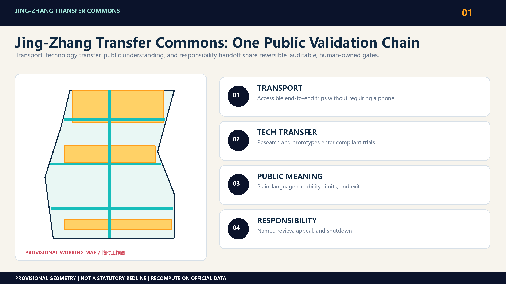
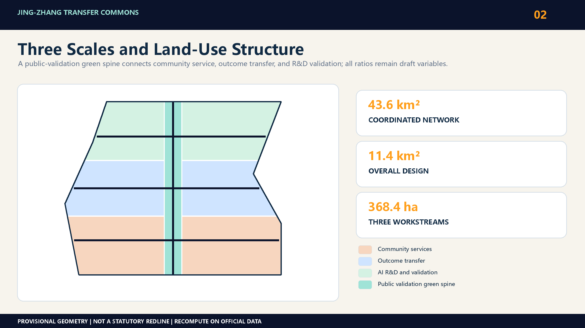
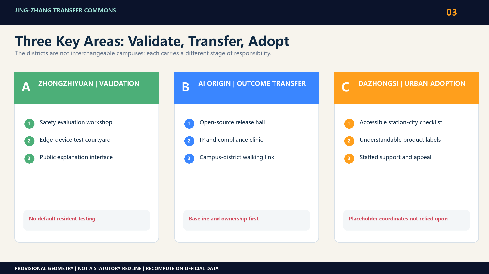
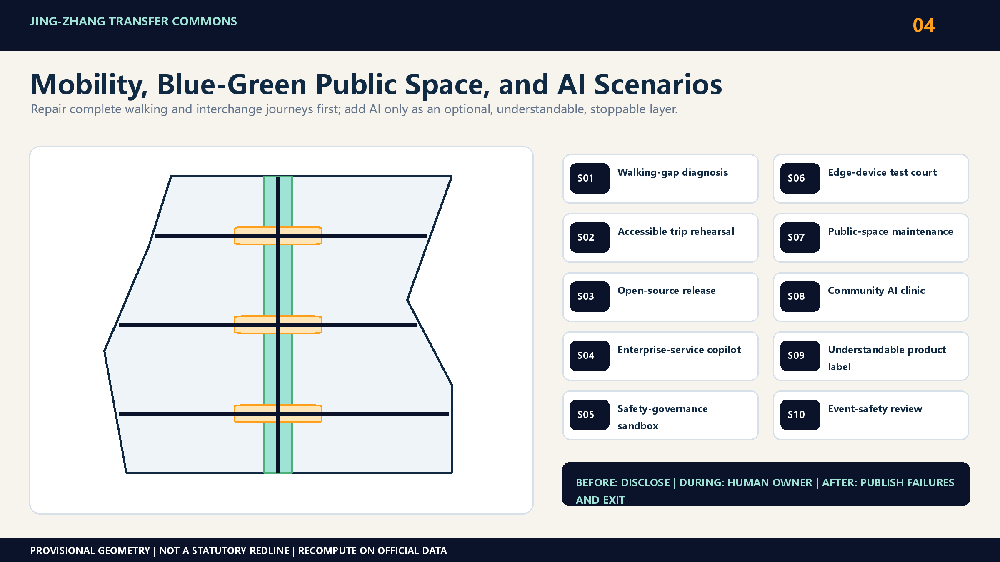
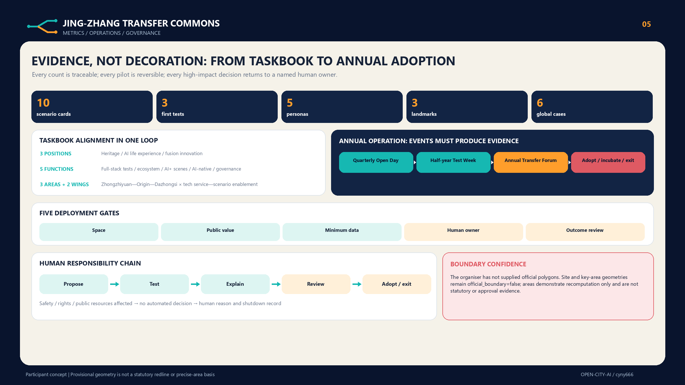

# Jing-Zhang Transfer Commons

## 0. The proposal in one sentence

The historic Jing-Zhang Railway moved people, goods, and knowledge farther afield. In its next century, the corridor should become more than a line of AI companies. It should form a set of trustworthy urban transfer commons: people transfer between modes, research transfers into products, products transfer into services the public can understand, and AI transfers consequential decisions back to accountable people.

The proposal links three spatial actions through one public validation chain:

1. Research transfer: universities, laboratories, open-source communities, and startups share accessible release, testing, and governance facilities.
2. Outcome transfer: models, hardware, and urban services pass through small, reversible, and auditable real-world trials before adoption.
3. Responsibility transfer: every AI service provides notice, a non-AI route, human review, appeal, and shutdown conditions.

This is not a newly invented pseudo-precise axis. It is a spatial and operational framework that can survive replacement of the provisional geometry with official boundaries. [source:OFFICIAL-ANNOUNCEMENT] [source:AGENT-TASKBOOK]

## Design basis and source inventory

The announcement defines three work levels: an approximately 43.6-square-kilometre coordinated research area, an approximately 11.4-square-kilometre overall design area, and three key areas—Zhongzhiyuan at 192.1 hectares, Beijing AI Origin Community at 104.3 hectares, and Dazhongsi at 72.0 hectares—totalling 368.4 hectares. [source:OFFICIAL-ANNOUNCEMENT] The repository currently lacks official scope polygons, statutory detailed planning controls, parcel ownership, existing-building data, road redlines, utility networks, heritage controls, and confirmed delivery entities. The package geometries are provisional and support machine checks and design discussion only. [source:SITE-PACKAGE] [source:BOUNDARY-SOURCE]

The proposal therefore observes three red lines:

- It never describes provisional geometry as an official redline or uses it for approval conclusions.
- It does not assign floor-area ratios, heights, demolition decisions, investment values, or construction commitments to unknown parcels.
- It does not rely on the present coordinates of PROV-KEY-003 to claim that a Dazhongsi station-area plan has been located. Until the official polygon arrives, this workstream contains only a program prototype, a station-city interface checklist, and a governance process.

Spatial values calculated from the current GeoJSON represent draft internal consistency, not measured existing conditions or statutory controls. [metric:site_area_sqm] [data:geometry/site_boundary.geojson#SITE-001]

## Overall-area urban renewal and regulatory-plan-depth urban design

### Core idea: four transfers, one public validation chain

The Transfer Commons treats the innovation belt as a connected set of thresholds rather than a single landmark or gated campus.

| Transfer | Urban problem | Spatial device | Passage condition |
| --- | --- | --- | --- |
| Transport interchange | Rail, park, street, and campus entrances do not form a continuous trip | Accessible interchange room, walking repair point, legible wayfinding | Continuous, accessible, and usable without a phone |
| Technology transfer | Research and small firms lack affordable intermediate facilities | Open-source release hall, shared test room, enterprise-service desk | Clear provenance, explicit licence, repeatable test |
| Social translation | AI outcomes are invisible or unintelligible to residents | Public demo bench, community coaching room, risk-label wall | Plain-language benefits, limits, and exit route |
| Responsibility handoff | Automated advice can be mistaken for a public decision | Human-review desk, appeal entry, operating log, shutdown control | Named owner, traceable decision, correctable error |

The public validation chain runs through propose, test, explain, review, and adopt or exit. Spatially, each scenario contains an open interface, a controlled test interface, and a human accountability interface. Operationally, each pilot has a time limit, data-minimisation list, exit mechanism, and retrospective record. [depth:overall_spatial_structure] [standard:MOHURD-URBAN-DESIGN-MEASURES]

### Brand identity and taskbook alignment

The paired Chinese and English names make “transfer” carry four meanings: transport interchange, technology transfer, social translation, and responsibility handoff. The visual identity uses a railway switch—two paths diverging and meeting again—as an original geometric motif. Deep navy represents trustworthy infrastructure, teal represents open collaboration, and orange marks a validation point entering public view. The system uses only self-drawn lines, planes, and generic fonts; it does not reuse railway, government, company, or competition marks. It can extend into node numbers, scenario-card frames, bilingual wayfinding, and event badges without being confused with an official logo for the Centennial Jing-Zhang AI Innovation Belt. [source:AGENT-TASKBOOK]

The taskbook's three positionings become three public experiences. The Centennial Jing-Zhang Cultural Belt provides a walkable narrative of time and distance; the Metropolitan AI Life Experience Belt provides optional and exitable daily services; and the AI Integrated Innovation Belt provides a validation chain from research to adoption. The five functions are carried by full-stack validation at Zhongzhiyuan, the innovation ecosystem at AI Origin Community, AI-plus scenarios along Xiaoyuehe and public spaces, the intelligent-native urban interface at Dazhongsi, and a human-review governance protocol across all nodes. The Zhongguancun Technology Service Wing provides legal, intellectual-property, capital, and enterprise-service interfaces; the Xiaoyuehe Scenario Empowerment Wing hosts low-impact trials and public experience. Together with the three areas, they form an input–validation–adoption–feedback loop. [source:AGENT-TASKBOOK]

Regional collaboration is expressed through reusable interfaces, not invented projects or company lists. Beiwei Community can share community-service evaluation protocols; Future Science City and Huairou Science City can connect research prototypes and test needs; Beijing E-Town can connect engineering and supply-chain validation; and Beijing–Tianjin–Hebei partners can reuse scenario cards, licence checklists, and failure-case formats. Every cross-regional collaboration requires separate confirmation from real participants and retains provenance, authorisation, an accountable person, and an exit record. This proposal suggests a collaboration mechanism; it does not claim that any institution already participates or has committed. [source:AGENT-TASKBOOK]

## Three-level scope framework

| Scale | Question answered | Main output | Not claimed at this stage |
| --- | --- | --- | --- |
| Coordinated research area | Which knowledge, firm, public-service, and talent networks need connection? | Six global cases, innovation-chain roles, cross-area operating agenda | Precise project siting or land controls |
| Overall design area | How can the railway heritage, park, transit, campuses, and communities make a continuous daily network? | Interchange types, walking and blue-green framework, scenario-location rules | Statutory road redlines, engineered sections, utility design |
| Three key areas | How can three districts support different stages of technology transfer? | Zhongzhiyuan for validation, AI Origin for translation, Dazhongsi for adoption | Parcel-level masterplans before official polygons |

The structure is a research–validation–adoption–feedback loop, rather than a renamed one-belt-three-nodes diagram. Railway heritage and continuous public space provide a walkable explanation layer; the three key areas host different production and service stages; transit and community entrances host responsibility handoffs. [source:AGENT-TASKBOOK] [depth:three_level_scope_framework]

## Detailed design of the three key areas

### Three key areas, three transfer commons

### 4.1 Zhongzhiyuan: Validation Commons

Zhongzhiyuan is the first controlled step from research to real environments. Spatial prototypes include a safety-evaluation workshop, low-carbon computing display, public-facing Qinghe interface, reservable robot and edge-device test courtyard, and a gallery explaining what each system can and cannot do. Time windows, barriers, and staffed management separate enterprise testing from everyday public space. Residents are never default test subjects. [data:geometry/key_areas.geojson#PROV-KEY-001]

### 4.2 Beijing AI Origin Community: Outcome Commons

AI Origin provides the missing middle between papers, code, prototypes, startups, procurement, and public-value assessment. Lightweight reuse comes first: an open-source release hall, intellectual-property and compliance clinic, shared demo bench, short-stay talent service, evening collaboration room, and campus-to-district walking interfaces. Retain-renovate-demolish decisions wait for existing-condition, ownership, and structural-safety data. The proposal defines spatial needs, building prototypes, and ground-floor openness without identifying prototypes as existing buildings. [data:geometry/key_areas.geojson#PROV-KEY-002]

### 4.3 Dazhongsi: Urban Adoption Commons

Dazhongsi is the adoption interface for enterprise AI, intelligent devices, content, daily consumption, and public services. Tasks include station-city interchange, four-quadrant pedestrian continuity, international demonstrations, understandable product displays, and staffed support and appeal. Because PROV-KEY-003 is not treated as the real station-area location, all actions are currently an interface checklist. Official exits, roads, parcels, and ownership must arrive before accessible routes, ground-floor uses, and a public living room are assigned to sites. [data:geometry/key_areas.geojson#PROV-KEY-003]

## AI innovation ecosystem, personas, and AI-plus scenarios

### Five people, not one generic AI talent

| Person | Critical daily task | Transfer needed | Unacceptable cost |
| --- | --- | --- | --- |
| University researcher or open-source maintainer | Release work, find collaborators, verify licences | Campus to release and testing | Contributions captured by a platform or unauthorised work made public |
| Startup team | Find small premises, computing, legal help, and a first client | Prototype to compliant trial and procurement | High fixed cost and opaque rules |
| Enterprise engineer or international visitor | Demonstrate products, recruit, meet suppliers | Transit to trusted display and meeting | Illegible navigation and language, network, or access barriers |
| Resident or older person | Commute, rest, obtain services, understand new systems | Daily neighbourhood life to optional AI help | Forced AI use, profiling, and no accountable person |
| Front-line public-service worker | Resolve transport, facility, and event anomalies | AI advice to human action and review | Alert overload, blurred responsibility, no shutdown |

Every person retains a route that completes the task without AI. Accessibility is a baseline acceptance condition for each transfer node, not a separate showcase. [standard:ACCESSIBILITY-LAW]

### Ten AI scenario cards

| ID | Scenario and carrier | Direct user | Minimum data | Human responsibility and exit |
| --- | --- | --- | --- | --- |
| S01 | Walking-gap diagnosis desk at crossings and park entrances | Pedestrians, cyclists, disabled users | Anonymous counts and manual audit notes | Transport professional reviews; paper feedback remains |
| S02 | Accessible interchange rehearsal at station interfaces | Older and visually impaired people, visitors | Route need actively entered by the user | Staff take over; static wayfinding remains |
| S03 | Open-source release hall in AI Origin | Researchers, maintainers, startups | Voluntarily submitted project metadata | Maintainer confirms licence; project can be removed |
| S04 | Enterprise-service copilot at a shared service desk | Startups | Question and document index submitted by the firm | Legal or policy staff issue the formal answer |
| S05 | Safety-governance sandbox in Zhongzhiyuan | Model and device teams | Synthetic or authorised test sets and system logs | Safety owner approves and terminates tests |
| S06 | Public edge-device test courtyard in Zhongzhiyuan | Hardware teams and invited participants | Device telemetry and consented feedback | On-site safety officer stops operation; others bypass |
| S07 | Public-space maintenance assistant at park nodes | Operations staff | Work orders and non-identifying environmental data | Supervisor dispatches work; no automated personal penalty |
| S08 | Community AI-service clinic at neighbourhood ground floors | Residents and older people | The immediate question, with no persistent profile | Social worker or volunteer reviews; human-only service remains |
| S09 | Understandable product label at the Dazhongsi adoption interface | Consumers and visitors | Capability and risk statement supplied by the vendor | Consumer-rights reviewer checks; complaint can remove display |
| S10 | Event-safety review desk along the public route | Organisers and front-line staff | Aggregated footfall, weather, and facility state | Incident commander decides; automatic advice has one-step shutdown |

S01, S05, and S10 form the first testing and validation set for walking improvements, safety evaluation, and public-event operations. The remaining scenarios start only when a site, operator, and accountable data arrangement pass the gate. [metric:scenario_card_count] [metric:testing_scenario_count]

### Shared protocol for the three tests

1. Before: publish the purpose, boundary, duration, data list, accountable person, exit method, and non-AI alternative.
2. During: keep auditable logs; named people resolve alerts; model output never directly becomes enforcement, approval, or deprivation.
3. After: publish aggregated outcomes, failures, and the reason to scale or stop. Failure on accessibility, safety, or public acceptance ends the pilot.

### Three landmark prototypes

The landmarks make trustworthy transfer visible in daily life rather than pursuing monumental form.

- L1 Jing-Zhang Responsibility Clock: a public information device inspired by railway timetables, showing active pilots, accountable people, operating periods, human entry points, and shutdown status.
- L2 Open-Source Milestone: records verifiable open-source contribution, public-problem fixes, and cross-institution collaboration, without paid ranking or personal sensitive information.
- L3 Transfer Table: modular public furniture for releases, workshops, resident advice, accessible rest, and small trials before permanent construction.

All three remain design recommendations pending building, heritage, fire-safety, and operating confirmation. They are not approved government projects. [metric:landmark_count]

## Coordinated-area industry and future-city research

### Translation of six global precedents

| Case | Transferable mechanism | Jing-Zhang translation | What is not copied |
| --- | --- | --- | --- |
| Kendall Square, Cambridge | Research employment evolves with housing, retail, transport, and public space | Evaluate innovation nodes together with surrounding daily needs | High-intensity development is not a prerequisite [source:GLOBAL-KENDALL] |
| one-north, Singapore | Multiple precincts combine research, firms, higher education, startup space, and trials | Three key areas support different stages under shared validation rules | No gated-campus governance [source:GLOBAL-ONE-NORTH] |
| Paris-Saclay | Incubation, firm services, experiments, and ecosystem events reinforce one another | Scenario access and firm landing become one process | No assumption of large new-build areas [source:GLOBAL-PARIS-SACLAY] |
| MaRS, Toronto | Labs, startups, established firms, and advisory services are co-located in the city | Shared service interfaces shorten the path from result to adoption | One flagship building is not mistaken for the whole ecosystem [source:GLOBAL-MARS] |
| Brainport UDI, Eindhoven | Living labs evaluate technology, society, business, and governance together | Three first tests share consent, human review, and scaling gates | No deploy-first-govern-later path [source:GLOBAL-BRAINPORT] |
| Knowledge Quarter, London | Dense knowledge networks emphasise public access and institutional exchange | Heritage public space and transfer nodes become public knowledge foyers | The network does not serve members alone [source:GLOBAL-KNOWLEDGE-QUARTER] |

The cases support method comparison only. They do not establish local land use, development intensity, or implementation authority. [metric:global_case_count]

## Land use, building scale, and retain–renovate–demolish strategy

The current land_use.geojson is a participant-controlled, complete, gap-free, non-overlapping design partition for community services, outcome transfer, R&D validation, and a public-validation green spine. It must be rebuilt under the same topology rules when official boundaries, existing land use, and statutory controls arrive. Functional shares remain design variables, not approved controls. [standard:MNR-LAND-USE-CLASSIFICATION-GUIDE] [data:geometry/land_use.geojson#LU-001]

The building layer uses eight prototypes, which make no existing-building claim, to express service-facility footprints and scale relationships. It also establishes a decision framework covering retention value, adaptive potential, and safety and ownership prerequisites. No real building receives a demolition decision without building-level surveys, structural safety, ownership, and approval data; every prototype is marked pending_baseline_confirmation. [data:geometry/buildings.geojson#BLDG-001] [depth:retain_renovate_demolish]

## Transport, rail, municipal systems, and public-service facilities

Transport design begins with the completion of an entire transfer rather than isolated link capacity. It audits station exits, crossings, park entrances, campus foyers, bicycle parking, and the final accessible segment. S01 and S02 use manual fieldwork and voluntary feedback to create the first gap list. Road works, station-exit changes, and parking proposals wait for traffic operations, redline, and operator data. [data:geometry/roads.geojson#ROAD-001] [depth:traffic_rail_slow_parking]

Municipal systems and new infrastructure follow a shared-interface, minimum-addition rule. Power, network, edge computing, drainage, fire safety, and maintenance requirements enter a facility schedule before comparison with existing capacity. Public-service desks always keep a staffed route, and edge devices do not collect identity by default. No facility scale is promised without utility and capacity data. [data:geometry/constraints.geojson#CONSTRAINTS] [depth:municipal_new_infrastructure]

## Blue-green space, public space, and urban character

Railway heritage and blue-green space provide the open interface of the public validation chain: continuous walking and cycling, places to pause, understandable information, and a route around every trial. Pop-up Transfer Tables, Responsibility Clocks, and wayfinding test their location and operation with low-impact installations before permanent construction. Actions near Qinghe or other waterways wait for river, flood, and ecological conditions. [data:geometry/green_space.geojson#GREEN-001] [data:geometry/public_space.geojson#PUBLIC-001]

Urban character avoids a generic digital-future skin. Railway time, distance, signals, and industrial components form a narrative grammar for further development, combined with Zhongguancun open-source culture in a clear, durable, low-energy public information system. Heritage review precedes the use of historic elements, and copyright clearance precedes every company mark and image. [depth:blue_green_public_space]

## Renewal project list, implementation policy, and phasing

### Spatial actions and delivery packages

At the present geometry stage, the proposal retains only reversible and recalibratable action types.

| Package | Near term, 0–2 years | Medium term, 3–5 years | Long term, beyond 5 years |
| --- | --- | --- | --- |
| P1 Walking interchange | Site audit, temporary wayfinding, gap trials | Approved continuous paths and accessibility works | Integrated rail and park renewal |
| P2 Technology transfer | Shared releases, compliance clinic, reservable tests | Stable translation and enterprise-service facilities | Cross-district service network |
| P3 Public understanding | Product labels, Responsibility Clock, community clinic trials | Routine public demos and education | City-level trustworthy AI service standard |
| P4 Blue-green public space | Pop-up Transfer Table, low-impact activities, environmental baseline | Lawfully developed green and waterfront interfaces | Long-term co-management of ecology, culture, and innovation |
| P5 Data and governance | Data lists, human ownership, shutdown protocol | Independent evaluation and appeal | Reusable public validation infrastructure |

A project advances because official spatial data, an implementing body, funding, professional review, and public feedback are simultaneously verifiable—not because a concept is popular. [data:geometry/phasing.geojson#PHASE-001] [depth:phasing_implementation]

### Annual operation and conversion loop

Long-term operation follows quarterly small loops and an annual review. Every activity remains a proposed mechanism pending confirmation by an operator.

| Cycle | Event brand | Place and participants | Verifiable output | Gate for the next step |
| --- | --- | --- | --- | --- |
| Quarterly | Transfer Open Day | Rotating among the three key areas; residents, developers, firms, and universities | Public problem list, scenario applications, accessibility feedback | Accountable operator, authorised inputs, and a non-AI alternative |
| Half-yearly | Commons Test Week | Zhongzhiyuan and Xiaoyuehe interfaces; test teams and public observers | Test protocol, failure cases, human-review record | Safety, privacy, copyright, and site reviews passed |
| Annual | Jing-Zhang Transfer Forum | AI Origin Community and Dazhongsi; domestic and international partners | Bilingual casebook, open-source outcome catalogue, next-year agenda | Fact and licence review; no investment-promotion or government promise |

The conversion pathway is public challenge, compliance screening, small-scale test, public explanation, human evaluation, and procurement, incubation, or exit. The developer community maintains reproducible test templates and a problem library. Professional teams review space, safety, law, and accessibility. Operators record bookings, maintenance, complaints, and shutdowns. The public can submit problems, see aggregate results, and choose non-AI services. A scenario that misses safety, accessibility, correction, or public-understanding thresholds for two consecutive cycles returns for revision or exits; attendance does not substitute for public value. [source:AGENT-TASKBOOK]

## Metrics, area recomputation, and compliance matrix

### Metrics and review gates

The proposal locks 10 scenario cards, 3 testing scenarios, and 5 people. [metric:scenario_card_count] [metric:testing_scenario_count] [metric:persona_count] It also records 3 landmark prototypes and 6 global precedents. [metric:landmark_count] [metric:global_case_count]

Site area, green ratio, public-space ratio, and building footprint can be recomputed from the current draft GeoJSON, but their confidence is low and they are not performance commitments. Floor-area ratio, building height and density, road redlines, and facility scale remain unknown. Complete task, standard, and design-depth mappings remain in compliance_matrix.json, standard_matrix.json, and design_depth_matrix.json.

Each future spatial project passes five gates:

1. Space: it lies inside official boundaries and conflicts with no road, fire, utility, or heritage condition.
2. Public value: it has accessible, non-AI, and free basic-service paths.
3. Data: it collects only the minimum needed, with a clear duration and deletion method.
4. Responsibility: it has a named human owner, appeal channel, audit log, and shutdown condition.
5. Outcome: it is evaluated by walking continuity, response time, service access, error correction, and public understanding—not by the amount of AI deployed.

## Risk, copyright, and compliance statement

### Next development round and risks

This formal package provides nine GeoJSON layers, five bilingual figure pairs, bilingual A3 booklets, bilingual A0 boards, and fully offline HTML. When official or higher-confidence data arrive, the replacement protocol is:

- replace the site boundary and key areas first, retaining version, provenance, and official_boundary state;
- rebuild land use, buildings, roads, green space, public space, and phasing so every design feature remains inside the boundary;
- recompute metrics, then redraw ten language-paired figures and four PDFs;
- rerender bilingual HTML, refresh manifest hashes, and rerun deterministic, spatial, visual, professional-evidence, and final preflight checks.

The largest risk is not insufficient futurism. It is false precision in the absence of baseline data, or transferring public-service responsibility to automation before accountability exists. The proposal keeps those gaps as explicit gates. Any update to official boundaries, planning controls, ownership, roads, utilities, heritage, or public services triggers full-package recomputation rather than silent replacement. [depth:risk_missing_data]

### Risk controls and human-review matrix

The proposal uses only public repository material, registered public webpages, and participant-created conceptual layers. It uses no internal material, non-public spatial data, personal data, or classified information. Every output is an open co-creation proposal: it does not replace statutory planning or constitute a government review, approval, investment, or implementation decision. [source:AGENT-TASKBOOK]

| Risk | Preventive control | Human review and trigger | Response and record |
| --- | --- | --- | --- |
| Provisional geometry is mistaken for a statutory redline | Pages, drawings, and GeoJSON retain provisional labels and `official_boundary=false` | When official polygons or a higher-confidence version arrive, planning and GIS staff verify provenance, coordinate system, and version | Recompute the whole package, retain the old version, and record the differences |
| A scenario collects personal information or creates profiles | Prefer aggregate, anonymous, synthetic, or actively submitted data; minimise by purpose and set deletion periods | Pause when identity, imagery, traces, or sensitive information appears; data and legal owners review consent, retention, and access | Delete unnecessary data and retain non-AI, withdrawal, and appeal records |
| AI advice is treated as a public decision | State capability limits; prohibit automated enforcement, approval, penalties, or denial of resources | A named professional reviews every output affecting safety, rights, or public resources | Record model version, input scope, human decision, correction, and shutdown reason |
| Images, marks, cases, or code infringe rights | Use original figures, a generic layout, and registered sources; copy no case image, map, or extended prose | Before release, verify author, licence, credit, redistribution scope, and generation method for each new asset | Remove or replace anything that cannot be cleared; update `sources.json` and the copyright statement |
| A pilot creates construction, fire, traffic, or operating risk | First-round tests are reversible, low-impact, and small-scale; no engineering-feasibility conclusion is claimed | Relevant professionals, the site owner/operator, and the public-safety owner approve before field use | Do not start if a gate fails; log incidents and decide correction, pause, or exit |
| Bias, false alarms, or service exclusion harms users | Retain staffed desks, paper feedback, phone-free and accessible routes; compare errors and access across groups | Persistent errors, concentrated complaints, or exclusion of vulnerable users triggers independent review | Degrade to a human service, publish aggregate problems and a correction deadline, and never hide harm behind average accuracy |

The proposed project owner updates the risk register quarterly. Any change involving privacy, copyright, public safety, heritage, ecology, or statutory planning receives human review before release. Public retrospectives disclose only aggregate results and cleared material; raw personal data, security details, and non-public professional material never enter the submission, website, or public knowledge base.

## References

### References and copyright note

The official announcement and agent-facing taskbook are the direct bases for the competition tasks. The public site package and source registry organise scope, enums, allowed design space, metric ranges, and missing data. [source:OFFICIAL-ANNOUNCEMENT] [source:AGENT-TASKBOOK] [source:SITE-PACKAGE] The prose keeps only claim-adjacent anchors. Complete source, assumption, metric, task, standard, and design-depth relationships remain in sources.json, assumptions.json, metrics.json, compliance_matrix.json, standard_matrix.json, and design_depth_matrix.json.

The six global cases compare public access, technology transfer, trial governance, and network stewardship. They supply no local boundary, land-use, intensity, or engineering authority. Their public URLs, publishers, and permitted uses are registered in sources.json; no case image, map, or extended text is copied. [source:GLOBAL-KENDALL] [source:GLOBAL-ONE-NORTH] [source:GLOBAL-BRAINPORT]

Current spatial evidence combines provisional boundaries with participant-controlled design layers. Its role is to make the Transfer Commons recomputable, not to prove existing conditions or statutory conclusions. [data:geometry/site_boundary.geojson#SITE-001] [metric:site_area_sqm] Official boundaries, key areas, existing conditions, planning controls, ownership, roads, utilities, heritage, and public-service data remain prerequisites for statutory development, retain-renovate-demolish, building scale, and transport-engineering decisions. All figures, HTML, and PDFs are generated from structured submission data and an original layout system; see report/copyright_statement.md.
