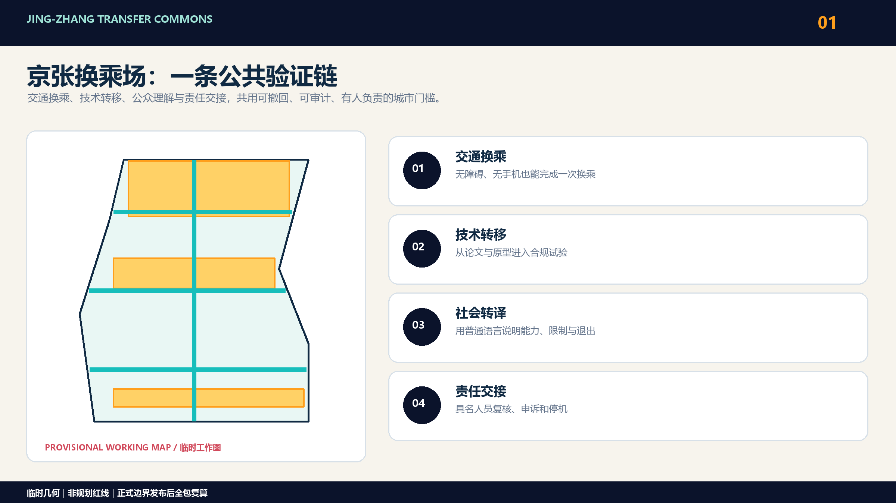
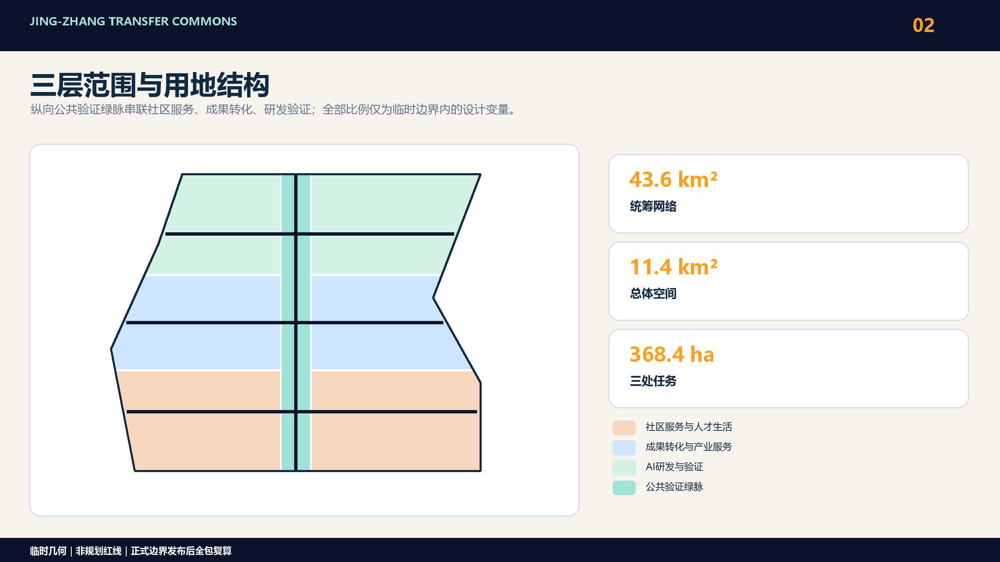
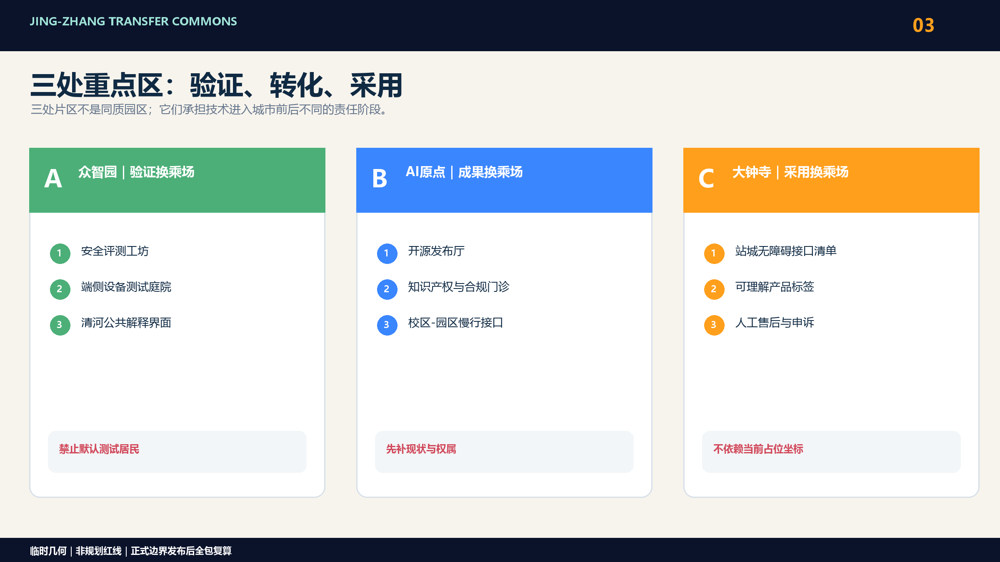
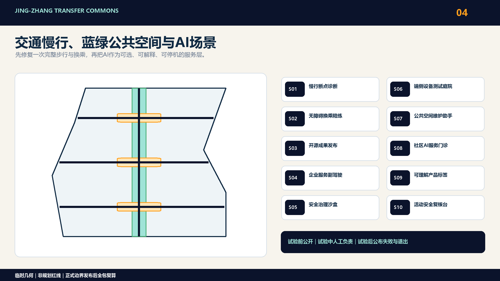
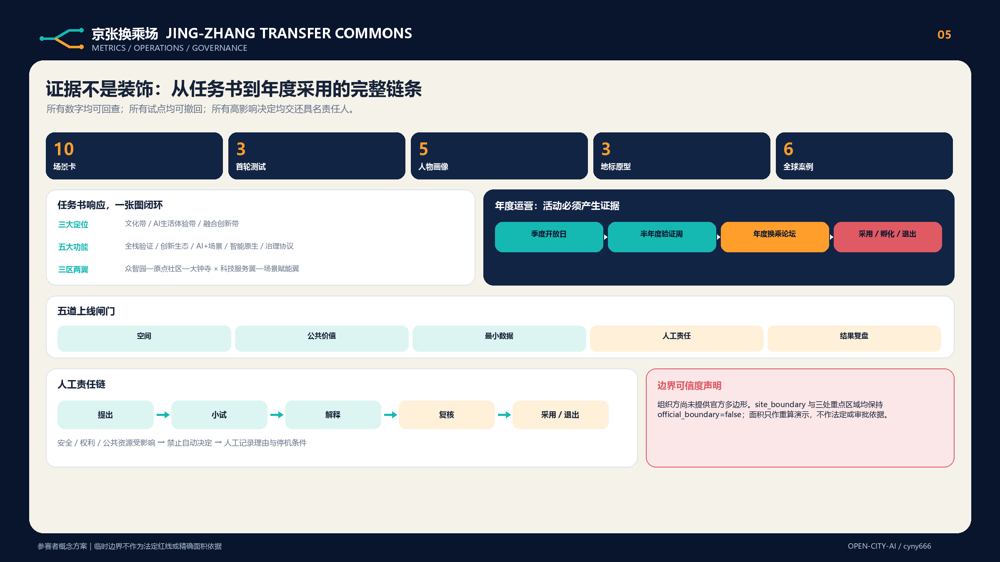

# 京张换乘场

## 0. 一句话方案

百年京张曾经把人、货物与知识送向更远处；下一百年，它不应只是“AI企业沿线排布”，而应成为一组可信的城市换乘场：人在这里换乘交通，科研在这里换成产品，产品在这里换成可被公众理解的服务，AI在这里把关键决定交还给有责任的人。

方案用一条“公共验证链”串联三类空间动作：

1. 研发换乘：让高校、实验室、开源社区与创业团队共享可进入的发布、测试和治理设施。
2. 成果换乘：让模型、硬件与城市服务先经过小尺度、可撤回、可审计的真实场景验证，再进入市场。
3. 责任换乘：每一个AI服务都设置知情提示、非AI通道、人工复核、申诉和停机条件。

这不是新画一条伪精确轴线，而是一个能在正式边界补齐后继续工作的空间—运营框架。[source:OFFICIAL-ANNOUNCEMENT] [source:AGENT-TASKBOOK]

## 设计依据与资料清单

公告给出三层工作范围：约43.6平方公里统筹研究范围、约11.4平方公里总体设计范围，以及众智园192.1公顷、北京AI原点社区104.3公顷、大钟寺72.0公顷三处重点区域，合计368.4公顷。[source:OFFICIAL-ANNOUNCEMENT] 当前仓库没有官方范围多边形、法定控规、地块权属、现状建筑、道路红线、市政管线、文保控制和实施主体数据；提交包中的边界均为临时几何，只用于机器校验和方案讨论。[source:SITE-PACKAGE] [source:BOUNDARY-SOURCE]

因此，本方案遵守三条红线：

- 不把临时边界称为红线，不据此提出审批结论。
- 不对未知地块给出容积率、高度、拆建、投资额或开工承诺。
- 不依赖PROV-KEY-003的现有坐标来声称“大钟寺站区”已经落图；该片区在官方多边形发布前只表达功能原型、站城接口清单和治理流程。

空间数值若来自当前GeoJSON，仅代表草案几何内部一致性，不代表现状测量或法定指标。[metric:site_area_sqm] [data:geometry/site_boundary.geojson#SITE-001]

## 总体设计范围城市更新与控规深度城市设计

### 总体概念：四种换乘，一套公共验证链

“京张换乘场”把创新带理解为一组相互连接的门槛，而不是单一地标或封闭园区。

| 换乘类型 | 城市问题 | 空间装置 | 通过条件 |
| --- | --- | --- | --- |
| 交通换乘 | 轨道、公园、街道和园区入口彼此割裂 | 无障碍换乘厅、慢行缝合点、可理解导视 | 连续、无障碍、可在无手机条件下使用 |
| 技术转移 | 科研成果与中小企业之间缺少低成本中间环节 | 开源发布厅、共享测试间、企业服务柜台 | 来源清楚、授权明确、测试可重复 |
| 社会转译 | AI成果对居民而言不可见或不可理解 | 公共演示台、社区陪练室、风险说明墙 | 用普通语言解释效益、限制和退出方式 |
| 责任交接 | 自动化建议容易被误当成公共决定 | 人工复核台、申诉入口、运行日志和停机开关 | 责任人明确、决定可追溯、错误可纠正 |

公共验证链按“提出—试验—解释—复核—采用/退出”运行。空间上，每个场景至少包含一个开放界面、一个受控测试界面和一个人工责任界面；运营上，每次试点都有期限、数据最小化清单、退出机制和复盘记录。[depth:overall_spatial_structure] [standard:MOHURD-URBAN-DESIGN-MEASURES]

### 品牌识别与任务书响应

主名称“京张换乘场”与英文名“Jing-Zhang Transfer Commons”共同强调 transfer 的四重含义：交通换乘、技术转移、社会转译和责任交接。视觉识别以铁路道岔的“双向分流—再次汇合”为原创几何母题：深蓝代表可信基础设施，青绿代表开放协作，橙色代表进入公众视野的验证节点。该方向只使用自绘线、面和通用字体，不调用铁路、政府、企业或赛事既有标志；后续可延展为节点编号、场景卡边框、双语导视和活动徽记，而不与百年京张AI创新带整体Logo混淆。[source:AGENT-TASKBOOK]

方案把任务书的三大定位落实为三种公共体验：百年京张文化带提供可步行的时间与里程叙事，都市AI生活体验带提供可选择、可退出的日常服务，AI融合创新带提供从研发到采用的验证链。五大功能分别落入众智园的全栈验证、原点社区的创新生态、小月河与公共空间的AI+场景、大钟寺的智能原生城市界面，以及贯穿各节点的人工复核与治理协议。中关村科技服务翼提供法务、知识产权、资本与企业服务接口；小月河场景赋能翼承接低干预试验与公众体验，二者与三区形成“要素进入—场景验证—城市采用—反馈改进”的协同回路。[source:AGENT-TASKBOOK]

区域协同不以虚构项目或企业名单表达，而以可复制接口表达：北纬社区可共享社区服务评估协议，未来科学城与怀柔科学城可接入科研原型和测试需求，经开区可衔接工程化与供应链验证，京津冀合作节点可复用场景卡、许可清单和失败案例格式。每次跨区合作都必须由真实参与方另行确认，并保留来源、授权、责任人和退出记录；本方案仅提出协同机制，不代表相关机构已经参与或承诺。[source:AGENT-TASKBOOK]

## 三层范围工作框架

| 层级 | 本方案回答 | 主要成果 | 不在本阶段声称 |
| --- | --- | --- | --- |
| 统筹研究范围 | 哪些知识、企业、公共服务和人才网络需要被连接 | 六类全球案例、创新链角色图、跨区运营议程 | 精确项目落位和土地指标 |
| 总体设计范围 | 如何让京张遗址、公园、轨道、园区和社区形成连续日常网络 | 换乘节点类型、慢行与蓝绿骨架、场景分布原则 | 法定道路红线、工程断面和管线方案 |
| 三处重点区域 | 三种技术转移阶段如何被不同片区承载 | 众智园“验证”、原点社区“转化”、大钟寺“采用”的详细任务书 | 未获官方多边形前的地块级总平面 |

总体结构不是“一带三核”的再次命名，而是“研发—验证—采用—反馈”闭环。京张遗址和连续公共空间承担可步行的解释界面；三处重点区承担不同的生产与服务环节；轨道站点和社区入口承担责任交接。[source:AGENT-TASKBOOK] [depth:three_level_scope_framework]

## 重点区域详细设计

### 三处重点区域：三种换乘场

### 4.1 众智园：验证换乘场

定位为自主技术从研发环境进入受控真实环境的第一站。空间原型包括安全评测工坊、低碳算力展示、清河公共界面、可预约的机器人/端侧设备测试庭院，以及面向公众的“系统能做什么、不能做什么”说明廊。企业测试区与日常公共空间用时间、围栏和人员管理分开，禁止把居民变成默认测试对象。[data:geometry/key_areas.geojson#PROV-KEY-001]

### 4.2 北京AI原点社区：成果换乘场

定位为高校成果从论文、代码和原型进入创业、采购和公共价值评估的中间层。首选轻量更新：开源发布厅、知识产权与合规门诊、共享演示台、人才短住服务、夜间协作空间和校区—园区慢行接口。建筑拆改留必须在现状、权属和结构安全资料补齐后判断；本方案给出空间需求、建筑原型和首层开放原则，不把原型指认为现状建筑。[data:geometry/key_areas.geojson#PROV-KEY-002]

### 4.3 大钟寺：城市采用换乘场

定位为企业级AI、智能终端和内容服务进入城市日常消费与公共服务之前的采用界面。核心任务是站城换乘、四象限步行连通、国际路演、产品可理解展示和人工售后/申诉服务。由于当前PROV-KEY-003不被用作站区真实位置，所有空间动作先写成“接口清单”：官方站口、道路、地块和权属数据到位后，再把无障碍路径、首层业态和公共客厅落到具体地块。[data:geometry/key_areas.geojson#PROV-KEY-003]

## AI 创新生态、人才画像与 AI+ 场景

### 五类人物，而不是一个“AI人才”

| 人物 | 一天中的关键任务 | 需要的换乘 | 不能接受的代价 |
| --- | --- | --- | --- |
| 高校研究者/开源维护者 | 发布成果、找协作者、验证许可 | 从校园到开源发布与测试 | 贡献被平台吞没、默认公开未授权成果 |
| 初创团队 | 获得小型空间、算力、法务和首个客户 | 从原型到合规试验与采购对接 | 高固定成本、规则不透明 |
| 企业工程师/国际访客 | 演示产品、招聘、对接供应链 | 从轨道到可信展示和会议 | 导视困难、网络/语言/无障碍门槛 |
| 周边居民/老年人 | 通勤、休闲、办事、理解新服务 | 从社区日常到可选的AI辅助 | 被迫使用AI、画像营销、无人负责 |
| 一线公共服务人员 | 处理交通、设施和活动异常 | 从AI建议到人工处置与复盘 | 告警过载、责任模糊、无法停机 |

所有人物都保留“无AI也能完成任务”的路径。无障碍不是单独场景，而是每个换乘节点的基础验收项。[standard:ACCESSIBILITY-LAW]

### 十张AI场景卡

| 编号 | 场景与载体 | 直接用户 | 最小数据 | 人工责任与退出 |
| --- | --- | --- | --- | --- |
| S01 | 慢行断点诊断台：路口/公园入口 | 行人、骑行者、无障碍用户 | 匿名计数、人工巡查记录 | 交通专业人员复核；保留纸质反馈 |
| S02 | 无障碍换乘陪练：站点接口 | 老年人、视障者、访客 | 用户主动输入的路线需求 | 服务人员接管；提供静态导视 |
| S03 | 开源成果发布厅：原点社区 | 研究者、开发者、初创团队 | 项目自愿提交的元数据 | 维护者确认许可；可撤下项目 |
| S04 | 企业服务副驾驶：共享服务柜台 | 初创企业 | 企业主动提交的问题和材料目录 | 法务/政策人员签发正式答复 |
| S05 | 安全治理沙盒：众智园 | 模型与终端团队 | 合成或授权测试集、系统日志 | 安全负责人批准测试和终止 |
| S06 | 端侧设备公共测试庭院：众智园 | 硬件团队、受邀体验者 | 设备遥测与书面同意反馈 | 现场安全员停机；非参与者绕行 |
| S07 | 公共空间维护助手：公园节点 | 运维人员 | 设施工单、非识别性环境数据 | 运维主管派单；不自动处罚个人 |
| S08 | 社区AI服务门诊：社区首层 | 居民、老年人 | 当场问题，不建立长期画像 | 社工/志愿者复核；支持纯人工办理 |
| S09 | 可理解产品标签：大钟寺采用界面 | 消费者、访客 | 产品方提交的能力和风险说明 | 消费者权益人员审查；可投诉下架 |
| S10 | 活动安全复核台：公共路线 | 活动组织者、一线人员 | 客流聚合、天气、设施状态 | 现场指挥决定；一键停用自动建议 |

其中S01、S05、S10作为三项测试验证场景进入首轮试点，分别验证步行改造、安全评测和公共活动运行；其余场景只有在场地、运营主体和数据责任满足门槛后启动。[metric:scenario_card_count] [metric:testing_scenario_count]

### 三项测试的共同协议

1. 试验前：公布目的、范围、期限、数据清单、责任人、退出方法和非AI替代。
2. 试验中：日志可审计，告警由具名人员处置，不把模型输出直接变成执法、审批或资源剥夺。
3. 试验后：公开聚合结果、失败案例和是否扩展的理由；未达到无障碍、安全或公众接受门槛即停止。

### 三个地标原型

地标不追求巨构，而是让“可信换乘”在日常中可见。

- L1 京张责任钟：以铁路时刻表为灵感的公共信息装置，显示当前试点、责任人、运行期限、人工入口和停机状态。
- L2 开源里程碑：记录可核验的开源贡献、公共问题修复和跨机构协作，不使用付费排名，不公布个人敏感信息。
- L3 换乘长桌：兼具发布、工作坊、居民咨询与无障碍休息功能的模块化公共家具，可先以临时设施测试再决定长期建设。

三者均是待建筑、文保、消防和运营条件确认后深化的设计建议，不代表政府已批准建设。[metric:landmark_count]

## 统筹研究范围产业与未来城市研究

### 六个全球案例转译

| 案例 | 可借鉴机制 | 京张转译 | 不照搬之处 |
| --- | --- | --- | --- |
| Kendall Square, Cambridge | 研究就业与住房、商业、交通、公共空间共同演进 | 把创新节点与周边社区日常需求一同评价 | 不以高强度开发作为前提 [source:GLOBAL-KENDALL] |
| one-north, Singapore | 多片区分工、科研机构、企业、高校和真实试验并置 | 三重点区承担不同转移阶段，共享一套验证规则 | 不复制封闭园区治理 [source:GLOBAL-ONE-NORTH] |
| Paris-Saclay | 孵化、企业服务、试验平台和生态活动协同 | 让“场景开放”与企业落地服务成为同一流程 | 不假设大尺度新增建设 [source:GLOBAL-PARIS-SACLAY] |
| MaRS, Toronto | 在城市中心共置实验室、初创、企业和顾问服务 | 用共享服务界面缩短成果到采用的距离 | 不把单栋旗舰建筑当成完整生态 [source:GLOBAL-MARS] |
| Brainport UDI, Eindhoven | 技术、社会、商业、治理共同评估的生活实验室组合 | 三项首轮测试共用公众同意、人工复核和扩展门槛 | 不以“先部署再治理”为路径 [source:GLOBAL-BRAINPORT] |
| Knowledge Quarter, London | 密集知识网络、公共可达和机构间交换 | 用遗址公共空间和换乘节点形成对公众开放的知识门厅 | 不只服务机构会员 [source:GLOBAL-KNOWLEDGE-QUARTER] |

案例只支持方法比较，不构成本地用地、强度或实施依据。[metric:global_case_count]

## 用地、建筑规模与拆改留方案

当前land_use.geojson以完整覆盖、无缝、无重叠的方式表达社区服务、成果转化、研发验证和公共验证绿脉，是参赛者控制的设计分区。正式边界、现状用地和法定控规到位后必须按相同拓扑规则重建；各类功能比例是设计变量，不写成审定指标。[standard:MNR-LAND-USE-CLASSIFICATION-GUIDE] [data:geometry/land_use.geojson#LU-001]

建筑层以8个非现状指认的原型表达服务设施所需的基底位置和规模关系，并建立“保留价值—适应性潜力—安全与权属前置条件”的判断框架。没有单体调查、结构安全、产权和审批资料时，不对任何真实建筑作拆除判断；所有原型均标记为pending_baseline_confirmation。[data:geometry/buildings.geojson#BLDG-001] [depth:retain_renovate_demolish]

## 交通、轨道、市政与公共服务设施

交通设计从“完成一次完整换乘”而不是单一路段流量出发，检查轨道站口、过街、公园入口、园区门厅、自行车停放和最后一段无障碍路径。S01和S02先用人工踏勘与自愿反馈建立断点清单；任何道路改造、站口调整和停车方案都等待交通组织、红线和运营数据确认。[data:geometry/roads.geojson#ROAD-001] [depth:traffic_rail_slow_parking]

市政与新基建采取“共享接口、最小新增”原则：场景所需电力、网络、端侧算力、排水、消防和设备维护需求先进入设施清单，再与既有容量核对。公共服务柜台始终提供人工入口；端侧设备不默认采集身份信息。缺少管线与容量资料时，不承诺设施规模。[data:geometry/constraints.geojson#CONSTRAINTS] [depth:municipal_new_infrastructure]

## 蓝绿空间、公共空间与城市风貌

京张遗址和蓝绿空间承担公共验证链的开放界面：步行与骑行连续、可停留、可解释、可绕开测试。快闪换乘长桌、责任钟和导视先以低干预方式验证位置与运营，再决定永久建设。清河及其他水系相关动作必须等待河道、防洪和生态条件确认。[data:geometry/green_space.geojson#GREEN-001] [data:geometry/public_space.geojson#PUBLIC-001]

风貌不采用通用“数字未来”表皮。铁路时刻、里程、信号和工业构件只作为可继续深化的叙事语法，与中关村开源文化共同形成清晰、耐久、低能耗的公共信息系统；任何历史构件使用先经文保核查，任何企业标识和图像先经版权清权。[depth:blue_green_public_space]

## 更新项目清单、实施政策与分期计划

### 空间动作与实施包

当前几何阶段只保留可逆、可校准的动作类型：

| 包 | 近期0—2年 | 中期3—5年 | 长期5年以上 |
| --- | --- | --- | --- |
| P1 慢行换乘 | 现场审计、临时导视、断点测试 | 经交通审批的连续路径与无障碍改造 | 与轨道和公园更新统筹 |
| P2 技术转移 | 共享发布、合规门诊、预约测试 | 稳定运营的转化与企业服务设施 | 跨片区服务网络 |
| P3 公共理解 | 产品标签、责任钟、社区门诊试点 | 常态化公共演示和教育 | 城市级可信AI服务标准 |
| P4 蓝绿公共空间 | 快闪长桌、低干预活动、环境监测基线 | 依法深化绿地与滨水接口 | 生态、文化与创新活动长期共管 |
| P5 数据与治理 | 数据清单、人工责任、停机协议 | 独立评估和申诉机制 | 形成可复用的公共验证基础设施 |

项目进入下一阶段的条件不是“概念受欢迎”，而是官方空间数据、实施主体、资金来源、专业审查和公众反馈同时可核验。[data:geometry/phasing.geojson#PHASE-001] [depth:phasing_implementation]

### 年度运营与转化闭环

长期运营采用“季度小循环、年度大复盘”，所有活动均为待运营主体确认的建议机制：

| 周期 | 活动品牌 | 空间与对象 | 可核验产出 | 进入下一步的门槛 |
| --- | --- | --- | --- | --- |
| 每季度 | Transfer Open Day / 换乘开放日 | 三处重点区轮值；居民、开发者、企业与高校 | 公开问题清单、场景报名、无障碍反馈 | 有责任主体、授权材料与非AI替代 |
| 半年度 | Commons Test Week / 公共验证周 | 众智园与小月河接口；测试团队和公众观察者 | 测试协议、失败案例、人工复核记录 | 安全、隐私、版权与场地审查通过 |
| 年度 | Jing-Zhang Transfer Forum / 京张换乘论坛 | 原点社区与大钟寺；国内外合作方 | 双语案例册、开源成果目录、下一年度议程 | 事实与许可复核，不发布招商或政府承诺 |

转化路径为“公开征题—合规筛选—小尺度测试—公众解释—人工评估—采购/孵化/退出”。开发者社区维护可复现测试模板和问题库；专业团队负责空间、安全、法律与无障碍审查；运营团队记录预约、维护、投诉和停机；公众可提交问题、查看聚合结果并选择非AI服务。连续两个周期未达到安全、可达、纠错或公众理解门槛的场景自动退回修改或退出，不以活动人次替代公共价值。[source:AGENT-TASKBOOK]

## 指标体系、面积复算与合规矩阵

### 指标与评审门槛

本方案锁定10张场景卡、3项测试场景和5类人物。[metric:scenario_card_count] [metric:testing_scenario_count] [metric:persona_count] 同时登记3个地标原型和6个国际案例。[metric:landmark_count] [metric:global_case_count]

空间面积、绿地率、公共空间率和建筑基底可由当前草案GeoJSON复算，但置信度为低，不能作为设计绩效承诺。容积率、建筑高度、建筑密度、道路红线和设施规模保持unknown。任务、标准和设计深度的完整映射分别保存在compliance_matrix.json、standard_matrix.json和design_depth_matrix.json。

后续每个空间项目必须同时通过五道门：

1. 空间：位于正式边界内，与道路、消防、市政和文保条件不冲突。
2. 公共性：存在无障碍、非AI和免费基本服务路径。
3. 数据：只收集完成任务所需的最小数据，期限与删除方式清楚。
4. 责任：有具名人工负责人、申诉渠道、审计日志和停机条件。
5. 成效：以步行连续性、处理时效、服务可达性、错误纠正率和公众理解度评价，而不是以“部署了多少AI”评价。

## 风险、版权与合规说明

### 下一轮深化与风险

本次正式包已经提供九个GeoJSON图层、五组双语主图、双语A3文册、双语A0展板和完全离线HTML。官方或更高可信度数据更新时，执行以下替换协议：

- 先替换site boundary与key areas，并保留数据版本、来源和official_boundary状态。
- 再重建用地、建筑、道路、绿地、公共空间和分期图层，保证全部设计要素位于边界内。
- 从新几何复算metrics，随后重绘十张语言配对图件和四个PDF。
- 重新渲染双语HTML、刷新manifest哈希，并重跑确定性校验、空间复核、视觉检查、专业证据审查和最终预检。

最大风险不是“方案不够未来”，而是在基础数据不足时制造精确感，或在运营责任未落实时把公共服务交给自动化。本方案把这些缺口保留为显式门槛；任何官方边界、控规、权属、道路、市政、文保或公共服务数据更新，都触发全包重算而不是静默替换。[depth:risk_missing_data]

### 风险控制与人工复核矩阵

本方案只使用仓库公开资料、已登记公开网页和参赛者自建的概念图层，不使用依法限制公开的空间材料或个人隐私。所有成果均为开放共创建议，不替代正式规划，不构成政府审定、审批、投资或实施结论。[source:AGENT-TASKBOOK]

| 风险 | 预防控制 | 人工复核与触发条件 | 处置与留痕 |
| --- | --- | --- | --- |
| 临时边界被误读为正式红线 | 页面、图件与GeoJSON持续标注 provisional 和 `official_boundary=false` | 官方多边形或更高可信版本发布时，由规划/GIS人员核对来源、坐标系与版本 | 全包复算，不静默替换，保留旧版本与差异说明 |
| 场景采集个人信息或形成画像 | 优先聚合、匿名、合成或用户主动提交的数据；按目的最小化并设删除期限 | 涉及身份、影像、轨迹或敏感信息即暂停，由数据责任人与法律人员审查同意、保存和访问范围 | 删除不必要数据，提供非AI通道、撤回和申诉记录 |
| AI建议被当作公共决定 | 界面标注能力限制，禁止自动执法、审批、处罚或资源剥夺 | 影响安全、权益或公共资源的输出必须由具名专业人员人工复核 | 记录模型版本、输入范围、人工决定、纠错和停机原因 |
| 图片、标志、案例或代码侵权 | 只使用自制图件、通用版式和已登记来源；不复制案例图片、地图或长段文字 | 新增资产在发布前核对作者、许可、署名、再分发范围与生成方式 | 无法清权即移除或替换，并更新 `sources.json` 与版权声明 |
| 试点带来施工、消防、交通或运营风险 | 首轮仅做可逆、低干预、小尺度测试，不作工程可行性结论 | 进入现场前由相应专业人员、场地产权/运营主体和公共安全责任人签字确认 | 未通过即不启动；事件进入复盘清单并决定整改、暂停或退出 |
| 算法偏差、误报或服务排斥 | 保留人工柜台、纸质反馈、无手机和无障碍路径，分群检查错误与可达性 | 错误持续、投诉集中或弱势群体无法使用时触发独立复核 | 降级为人工服务、公开聚合问题与改进期限，不以“平均准确率”掩盖伤害 |

风险登记由建议的项目责任人按季度更新，任何涉及隐私、版权、公共安全、文保、生态或法定规划的变化都必须先人工复核再发布。公开复盘只披露聚合结果和已清权材料；原始个人数据、安防细节和未公开专业资料不进入投稿、网页或公开知识库。

## 参考资料

### 参考与版权说明

赛事任务的直接依据是官方公告与面向智能体任务书；场地范围、枚举、允许设计空间、指标区间和缺失数据由公开场地包及资料登记表组织。[source:OFFICIAL-ANNOUNCEMENT] [source:AGENT-TASKBOOK] [source:SITE-PACKAGE] 正文只在主张旁放置必要证据锚点，完整的来源、假设、指标、任务、标准和设计深度关系分别保存在sources.json、assumptions.json、metrics.json、compliance_matrix.json、standard_matrix.json和design_depth_matrix.json。

六个全球案例只用于比较创新地区的公共可达、技术转移、试验治理与网络运营方法，不提供本地红线、用地、强度或工程依据。其公开网址、发布机构和用途边界均在sources.json登记；提案不复制案例图像、地图或长段文字。[source:GLOBAL-KENDALL] [source:GLOBAL-ONE-NORTH] [source:GLOBAL-BRAINPORT]

当前空间证据由临时边界和参赛者控制的设计图层构成，设计含义是把“换乘场”结构转化为可复算数据，而不是证明现状或法定结论。[data:geometry/site_boundary.geojson#SITE-001] [metric:site_area_sqm] 官方边界、重点区、现状、控规、权属、道路、市政、文保和公共服务资料仍是法定深化、拆改留、建筑规模和交通工程判断的前置条件。全部图件、HTML和PDF由本方案的结构化数据与自有版式生成；版权声明见report/copyright_statement.md。
