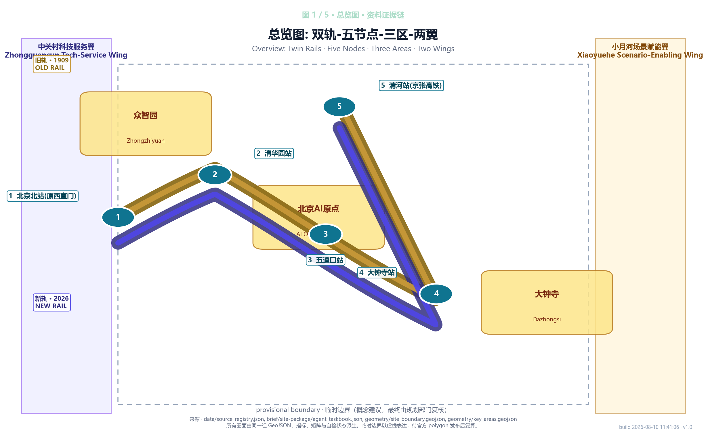
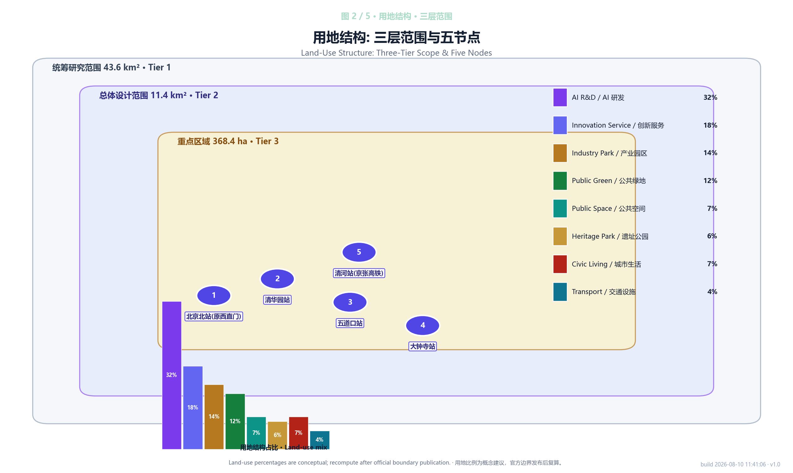
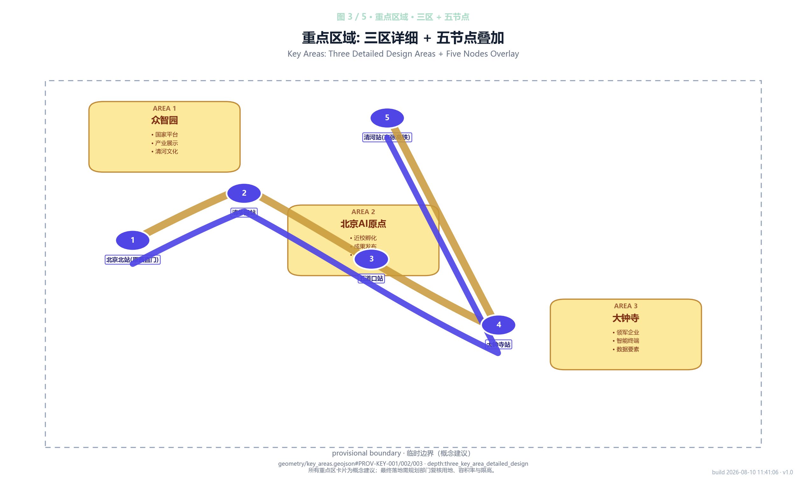
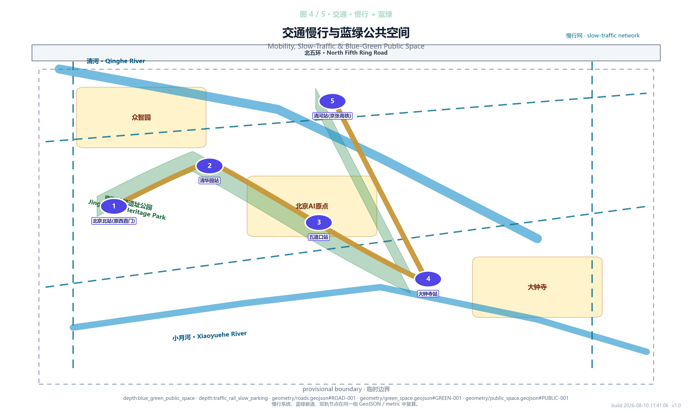
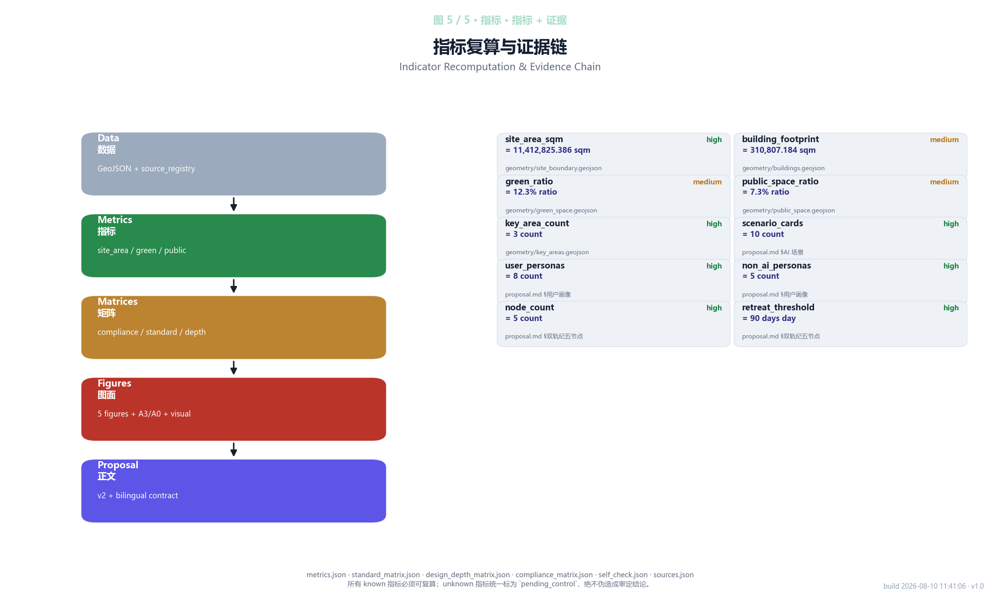

# Twin Rail Century: 双轨纪

> **Core Concept**
>
> In 1909 Zhan Tianyou made the Beijing–Zhangjiakou Railway the first trunk line in China designed entirely by Chinese engineers. One hundred and seventeen years later, the 5.9 km of track is no longer there, but the Jing-Zhang Railway Heritage Park preserves it between Beijing North Station and Xizhimen. This proposal is called "Twin Rail Century" — one rail is the 1909 physical track (now a public space in the heritage park), and the other is a 2026 AI service belt (a permanent line of robots, sensing, guidance and tour services that runs alongside the park). The two rails are not two roads but two faces of the same urban memory: morning-exercising elders, Tsinghua students, food-delivery riders, commuters and tourists move between them every day.
>
> We plant "Twin-Rail Transfer Nodes" at the five station sites — **Beijing North (formerly Xizhimen), Qinghuayuan, Wudaokou, Dazhongsi, Qinghe (Jing-Zhang high-speed rail)**. The old platforms become public nodes, and the new rail deploys AI services at each node: guidance, information, delivery, diagnostics, mediation, legal consultation, transit connection and travel assistance. Every AI service must satisfy three hard conditions: **usable by elders and children without any learning curve**; **an offline or paper-based equivalent path when the network is down or the system declines to answer**; **any node that underperforms for 90 consecutive days automatically retreats**. This is not about putting AI onto a master plan; it is about letting AI actually arrive on the everyday city ground.
>
> Implementation proceeds in three phases: **2026–2027** pilots two nodes at Qinghuayuan and Wudaokou, jointly operated by Haidian Science & Technology Commission, Tsinghua x-lab and Beihang AI School (referencing Paris Station F); **2028–2029** extends to all five stations and opens to social capital; **2030+** operates an annual "Developer Promenade" and a continuing "Agent Contribution Wall". All node locations, service boundaries and operating cadence in this proposal are marked as conceptual suggestions (Conceptual Suggestion). Final delivery must be rechecked by planning authorities against land use, FAR and height limits.

## Design Basis and Source Inventory

This formal proposal takes the *Haidian Branch of Beijing Municipal Commission of Planning and Natural Resources — Centennial Jing-Zhang AI Innovation Belt Urban Design International Open Call Prequalification Announcement* as its primary basis, and uses the temporary coarse boundary, key areas, enumerations, indicators and source list registered by the maintainer in `brief/site-package/` as its machine-readable basis. The AI agent must read `design_brief.json`, `allowed_design_space.json`, `sources.json`, `enums/`, `ranges/`, `schemas/`, `data/source_registry.json` and `data/processed/agent_fact_pack.md` before generating the proposal, and build its task, scope, source-use and gap inventory through `project_scope_summary.csv`, `agent_task_requirements.csv`, `source_use_matrix.csv` and `missing_data_checklist.csv`. Every design judgment must split into traceable sources, recomputable indicators, verifiable layers and human-reviewable assumptions. The announcement requires the proposal to reach regulatory-plan urban-design depth and comprehensive-implementation-plan urban-design depth, so the narrative text cannot substitute for the GeoJSON, indicator table, A3 booklet, A0 boards and offline HTML deliverables.

The proposal is not a freestanding vision document; it organizes the deliverables from the announcement, the agent taskbook and the site package. This section places only the most critical basis next to the judgment [source:OFFICIAL-ANNOUNCEMENT] [source:AGENT-TASKBOOK] [depth:existing_conditions_diagnosis]. The complete source and standard coverage is preserved in `sources.json`, `standard_matrix.json` and `design_depth_matrix.json`; we do not repeat machine indices inline.

The use boundaries of the source registry are as follows [source:SOURCE-REGISTRY]:

- `data/source_registry.json` registers the use boundaries of public, cleared and provisional sources.
- Current registry summary: 5 formal-ready sources, 0 background-only sources, 1 provisional-only source.
- The agent must not upgrade background_only or provisional_only sources into official boundary, statutory control, formal scoring evidence or government implementation commitment.

`data/processed/agent_fact_pack.md` is the reading-navigation layer for this proposal, not a new authoritative source [source:PROCESSED-FACT-PACK]. It helps the agent organize the three-tier scope, three key areas, announcement tasks, agent.1–agent.6, source availability and missing-data items into a readable plan. Factual judgments still return to the registered primary materials [source:OFFICIAL-ANNOUNCEMENT] [source:AGENT-TASKBOOK]; the complete source relationship is held by `sources.json`.

Because the official `SITE_BOUNDARY` and the three `KEY_AREA` polygons are not yet publicly available, this submission uses `brief/site-package/geometry/provisional_boundaries.geojson` as a temporary boundary. The `geometry/site_boundary.geojson` and `geometry/key_areas.geojson` in this package must be marked as `provisional_constraint`, `official_boundary=false`, and used only for proposal generation, self-check, visualization and design discussion. They cannot serve as an official redline, approval basis, precise area basis or statutory control conclusion. The organizer data gap alone does not block content scoring. Once official polygons are replaced, the site boundary, key areas, land use, roads, green space, public space, buildings, phasing and metrics must all be recomputed.

The scorable status of this submission is: **Temporary boundary, precision warning retained, recomputation pending after official data publication; does not block content scoring.** Accordingly, every spatial structure, scenario, project and indicator in the narrative is written under the principle of "discussable, reviewable, recomputable after official boundary replacement." When the official boundary and key-area polygons are updated, the generation, self-check and drawing/HTML generation must be rerun; replacing a single file is not allowed.

Boundary interpretation can return to the overall scope layer and area recomputation [data:geometry/site_boundary.geojson#SITE-001] [metric:site_area_sqm]. The three key areas are cross-checked through their dedicated layer and count indicator [data:geometry/key_areas.geojson#PROV-KEY-001] [metric:key_area_count]. This means the reader can move from narrative to evidence without first reading a string of machine identifiers.

## Three-Tier Scope Working Framework

The proposal organizes the work along the three tiers fixed by the announcement: the coordination-research scope (43.6 km²) focuses on the AI industry ecosystem, strategic positioning, innovation chain and future-city morphology; the overall-design scope (11.4 km²) covers the 1–2 km city area around the Jing-Zhang Heritage Park and the industrial zones, and must deliver an urban-renewal framework, industrial spatial layout, transport–municipal support and cityscape control; the key-area scope (368.4 ha) covers the three detailed-design areas and must clarify functional format, building scale, retain/renovate/demolish classification, public-space connectivity and transport organization. The three tiers are mapped item by item in `compliance_matrix.json`, ensuring that the mandatory tasks in Announcement 1.3, 1.4, 1.5 and agent.1–agent.6 all have corresponding chapters, layers, indicators, drawings and HTML evidence.

The depth items of the three-tier working framework are constrained by [depth:three_level_scope_framework] and [depth:overall_spatial_structure]; spatial evidence is governed by [data:geometry/site_boundary.geojson#SITE-001] and [data:geometry/key_areas.geojson#PROV-KEY-001]; task basis is governed by [standard:PROJECT-OFFICIAL-ANNOUNCEMENT]; and the scope index uses the three-tier scope table in `project_scope_summary.csv` from [source:PROCESSED-FACT-PACK] as navigation.

The three tiers are not isolated drawing sets. The coordination-research tier sets the industry chain and future-city judgments; the overall-design tier translates those judgments into renewal projects, spatial structure and infrastructure capacity; the key-area detailed design verifies the implementability of specific parcels, buildings, transport, public space and AI application scenarios. This proposal first locks the official or provisional boundary and constraints used by the current submission, then generates land use, buildings, roads, green space, public space, phasing and AI service nodes, then recomputes indicators from those layers and explains in the narrative which conclusions remain constrained by the provisional boundary. Any area, ratio, scale or project count that cannot be recomputed from the structured data must not enter the formal conclusion.

The overall concept of this proposal is **"Twin Rail Century"**: the 1909 Jing-Zhang Railway Heritage Park is one axis, the permanent AI service belt alongside the park is the other, forming a **"Twin Axes & Five Nodes"** spatial organization. The twin axes are not freshly drawn red lines but a way to fold the three thematic belts — the Centennial Jing-Zhang Cultural Belt, the Urban AI Living Experience Belt and the AI Convergence Innovation Belt — into one set of spatial moves: the old rail carries historical narrative and everyday public life, the new rail carries the daily operation of AI public services. The five Twin-Rail Transfer Nodes (**Beijing North (formerly Xizhimen), Qinghuayuan, Wudaokou, Dazhongsi, Qinghe (Jing-Zhang high-speed rail)**) also connect to the "Three Areas & Two Wings": the north section (Qinghuayuan–Wudaokou) serves the Zhongguancun Tech-Service Wing and the Beijing AI Origin Community; the south section (Dazhongsi) serves the Dazhongsi AI Industry Cluster and the Xiaoyuehe Scenario-Enabling Wing; the middle section coordinates with Zhongzhiyuan and the urban-agent governance layer.

| Tier | Design Question | Proposal Answer | Data Landing |
| --- | --- | --- | --- |
| Coordination-research scope | How to organize the AI industry ecosystem and future-city morphology | Build an innovation chain: "university-led source — open-source collaboration — enterprise translation — public experience — international outreach" | compliance_matrix.json, standard_matrix.json |
| Overall-design scope | How to land industry space, renewal, transport–municipal and cityscape on the map | Express through the land-use, building, road, green-space, public-space and phasing layers together | [data:geometry/land_use.geojson#LU-001], [data:geometry/roads.geojson#ROAD-001] |
| Key-area scope | How the three key areas reach detailed-design depth | Propose position, spatial moves, AI scenarios and implementation dependencies for each | [data:geometry/key_areas.geojson#PROV-KEY-001], [data:geometry/key_areas.geojson#PROV-KEY-002], [data:geometry/key_areas.geojson#PROV-KEY-003] |

## Coordination-Research Scope: Industry and Future-City Study

The core task of the coordination-research scope is to build a world-class AI innovation ecosystem. The proposal maps Haidian's universities and institutes, leading enterprises, compute–algorithm–data factors, incubators, listed companies, unicorns and tech-service resources, and proposes a spatial coordination framework for the AI innovation chain, industry chain, talent chain and urban service chain. The naming plan and logo design should serve the overall identity of the "Centennial Jing-Zhang Cultural Belt, Urban AI Living Experience Belt, AI Convergence Innovation Belt" — not stopping at a slogan, but explaining its link to the industry ecosystem, public space and cultural resources. The agent taskbook further requires a response to the "Five Functions" and "Three Areas & Two Wings" coordination, producing a deepening-ready naming system, visual identity, overall spatial structure map, open scenario and operating mechanism. This section must use [source:AGENT-TASKBOOK] and [standard:PROJECT-AGENT-OPEN-CALL-TASKBOOK] to mark that these requirements come from the agent open call, not from statutory planning control [depth:existing_conditions_diagnosis].

The coordination-research scope does not add new pseudo-precise red lines. Through the cityscape, public-space and building-layout coordination required by [standard:MOHURD-URBAN-DESIGN-MEASURES], it returns to [data:geometry/land_use.geojson#LU-001], [data:geometry/public_space.geojson#PUBLIC-001] and [depth:overall_spatial_structure], explaining how the industry strategy ultimately lands on a visible, reviewable spatial structure.

The future-city morphology study answers how artificial intelligence changes work, life, socializing, learning, transport and public services. The proposal must translate the AI transport system, continuous green space, innovation service facilities and international living/working atmosphere into locatable functional areas, nodes, corridors and scenarios, rather than describing a generic technology vision. The agent should write industry-strategy indicators, AI innovation index, talent density, spatial supply typology and AI+ vertical application key areas into the indicator system, and mark which are official, which are design suggestions and which are still pending formal-data calibration. If proposing a global AI innovation event, developer community, open scenario or pilgrimage route, the proposal must write it as a "Conceptual Suggestion / Reference Scheme / Material for Professional Teams to Deepen", never as a confirmed government event or implementation arrangement.

## Overall-Design Scope: Urban Renewal at Regulatory-Plan Urban-Design Depth

The overall-design scope must reach regulatory-plan urban-design depth. The proposal must deliver an urban-renewal overall spatial structure, identification of inefficient space, renewal project list, implementation policy recommendations, industry-function ratio, spatial organization mode, total building scale and comprehensive carrying-capacity assessment. `geometry/land_use.geojson` should fully cover the design boundary without gaps or overlaps; `geometry/buildings.geojson` should express renewed building footprints or retained building footprints; `geometry/roads.geojson` should express micro-circulation, slow-traffic and rail-interchange relationships; and `metrics.json` should recompute the core areas, ratios and layer counts.

This section splits the regulatory-depth content into reviewable objects per [standard:MOHURD-CONTROL-DETAILED-PLANNING]: [data:geometry/land_use.geojson#LU-001] expresses the land-use structure; [data:geometry/buildings.geojson#BLDG-001] expresses the building footprint; [data:geometry/roads.geojson#ROAD-001] expresses the transport organization; [metric:building_footprint_area_sqm] is used to cross-check the building footprint area; [depth:land_use_layout] and [depth:development_intensity_controls] constrain the deliverable depth.

The overall design must also support transport, rail, municipal and supporting facilities. The proposal should put forward spatial layout and implementation paths around rail-station integration, road micro-circulation, non-motorized parking, parking supply, innovation service platforms, talent living services, new infrastructure, distributed energy and edge compute. Where content involves building height, development intensity, road red line, setback and facility standards, and no official control conditions yet exist, it must be written as "pending official control confirmation" — never substituting agent-derived values for ratified indicators.

## Key-Area Detailed Design

Key-area detailed design is mandatory. The Zhongzhiyuan AI Innovation Acceleration Area must deliver a detailed plan around the national AI platform, full-stack autonomous innovation, standard setting, safety governance, industrial showcase, external transport, Qinghe culture, low-carbon green innovation environment and green-space AI scenarios. The Beijing AI Origin Community must deliver around near-campus innovation, achievement incubation and translation, talent zone, open-source system, brand activities, building retain/renovate/demolish classification, achievement showcase and release, residential and living services, campus–park slow-traffic connection and rail-station integration. The Dazhongsi AI Industry Cluster must deliver around leading enterprises, agents, intelligent terminals, content consumption, data factors, digital assets, commercial services, composite use of planned green space, Dazhongsi Station integration and four-quadrant pedestrian connectivity at intersections.

The three key-area detailed designs must reference [data:geometry/key_areas.geojson#PROV-KEY-001], [data:geometry/key_areas.geojson#PROV-KEY-002] and [data:geometry/key_areas.geojson#PROV-KEY-003], and [depth:three_key_area_detailed_design] checks whether they reach comprehensive-implementation-plan depth. Merely describing "build a demonstration area" without functional, building, transport, public-space and implementation-project evidence should be treated as incomplete.

The three key areas must appear in `geometry/key_areas.geojson`. If the repository already supplies official polygons, they should be used as `official_constraint`; if official polygons are missing, `provisional_constraint` may be used temporarily, but the narrative, HTML, sources, assumptions and self-check must explain that it cannot serve as formal scoring or approval basis. `compliance_matrix.json` should cover Announcement 1.5.3.1, 1.5.3.2 and 1.5.3.3 separately. The design expression should include functional format, building scale, building form, retain/renovate/demolish classification, public-space system, transport organization, slow-traffic connection and implementation projects. The HTML page should be able to switch between the three key areas; the A3 booklet and A0 boards should at minimum contain a key-area overall map, partial detail and indicator notes.

| Key Area | Design Position | Spatial Move | AI Industry & Operation Scenarios | Evidence Reference |
| --- | --- | --- | --- | --- |
| Zhongzhiyuan AI Innovation Acceleration Area | Garden-style full-stack autonomous innovation block | Strengthen the Qinghe interface, industrial showcase, low-carbon innovation interface and external transport; let green space host open testing and standards-governance display | Autonomous model testing, standards workshops, safety-governance display, low-carbon compute experience | [data:geometry/key_areas.geojson#PROV-KEY-001], [depth:three_key_area_detailed_design] |
| Beijing AI Origin Community | Near-campus achievement-translation and talent community | Organize campus–park–block slow-traffic stitching; supplement achievement release, talent services, residential life and open-source collaboration space | Open-source community, achievement release, talent-zone services, near-campus incubation | [data:geometry/key_areas.geojson#PROV-KEY-002], [source:AGENT-TASKBOOK] |
| Dazhongsi AI Industry Cluster | Urban smart-economy and international exchange block | Build around Dazhongsi Station integration, four-quadrant pedestrian connection, commercial services and leading-enterprise public-environment renewal | Agent & intelligent-terminal display, content consumption, data factors and international roadshow | [data:geometry/key_areas.geojson#PROV-KEY-003], [metric:key_area_count] |

#### Twin-Rail-Century Five Nodes: A Linear Spatial Skeleton Overlaid on the Three Areas

The announcement's Three Areas and Two Wings are a planar functional division. Overlaid on top, this proposal adds a **linear skeleton along the Jing-Zhang Railway Heritage Park** — the five historical station sites as "Twin-Rail Transfer Nodes", and the **twin axes** as the organizing logic: the **old rail** takes the 1909 historical narrative and everyday public life (morning exercise, strolling, commuting, child-walking); the **new rail** takes the AI service belt from 2026 onward (robots, sensing, guidance, tour). Every "Twin-Rail Transfer Node" must satisfy three hard conditions:

1. **"Learn-free" usability** — every service allows a pure paper or human-equivalent path, so elders and children can use it without learning.
2. **Offline resilience** — when the network is down or the system declines, the human/paper path must close the loop.
3. **90-day automatic retreat** — any node that underperforms for 90 days automatically returns to ordinary public mode and removes its equipment.

Five-node spatial division (**Conceptual Suggestion**; final delivery requires planning-authority verification):

| Node | Old-Rail Narrative | New-Rail AI Scenario | Lead Organization (Reference) |
| --- | --- | --- | --- |
| **Beijing North (formerly Xizhimen)** | Southern end of the Jing-Zhang Railway; 1909 Xizhimen old station, century-old Beijing North Station memory | Multilingual AI guidance + city-entry information kiosk (accessibility-first) | Haidian District Culture & Tourism Bureau, Tsinghua x-lab |
| **Qinghuayuan Station** | 1909 Qinghuayuan Station site, AI source-of-origin | Developer Promenade + Agent Contribution Wall | Tsinghua Alumni Association, Haidian Science & Technology Commission |
| **Wudaokou Station** | University corridor, Wudaokou "center of the universe" | Low-speed robot delivery + AI slow-traffic diagnostics | Beihang AI School, Haidian Sub-District Office |
| **Dazhongsi Station** | Dazhongsi area; intelligent-native consumption and business scene node | AI mediation + AI legal-consultation kiosk | Haidian Justice Bureau, Beijing Arbitration Commission Haidian Branch, Dazhongsi Area Headquarters |
| **Qinghe Station (Jing-Zhang HSR)** | 2019 Jing-Zhang high-speed rail station, cross-city travel gateway, north gate of the city | AI high-speed-rail connection + cross-city travel AI butler | Haidian Transport Commission, Jing-Zhang HSR Operation, Haidian Culture & Tourism Bureau |

Coupling of the five nodes with the Three Areas and Two Wings: the north section (Qinghuayuan–Wudaokou) connects to the Zhongguancun Tech-Service Wing and the Beijing AI Origin Community; the south section (Dazhongsi) connects to the Dazhongsi AI Industry Cluster and the Xiaoyuehe Scenario-Enabling Wing; the high-speed-rail branch (Qinghe·2019) links cross-city travel scenarios; the middle section coordinates with Zhongzhiyuan and the urban-agent governance layer. Every node appears on both the "old-rail public life" and the "new-rail AI service" lines. **Any AI scenario that is not anchored to a node must be deployed along the old-rail historical axis to avoid "enclave" services detached from the site's memory.**

## AI Innovation Ecosystem, Talent Personas and AI+ Scenarios

The proposal must build spatial-demand personas for AI talent and enterprises, covering R&D offices, open-source collaboration, achievement release, enterprise services, talent housing, social learning, consumer life, sports & leisure and international exchange. AI+ scenarios should address the directions called out in the announcement — transport, services, consumption, healthcare, education, law, lifestyle services — and form industry-development scenarios and AI-enabled urban-function scenarios. Each scenario must describe its service target, spatial location, data source, privacy boundary, human-review mechanism and operating entity.

AI scenarios must land in spatial and governance boundaries: public-space scenarios reference [data:geometry/public_space.geojson#PUBLIC-001], slow-traffic and transport scenarios reference [data:geometry/roads.geojson#ROAD-001], open-space scenarios reference [data:geometry/green_space.geojson#GREEN-001] and [metric:public_space_ratio] [metric:green_ratio]. These references let the reviewer know that the scenarios are not slogans but design objects located in specific layers and indicators.

| User Persona | Typical Need | Spatial Response | Self-Check Boundary |
| --- | --- | --- | --- |
| **Morning-exercising elder** | Tai-chi, dancing, chess, chatting in the park | Park nodes near seating, water, shade; all AI scenarios allow "press a button, do not touch a screen" | No facial or behavioral-trail collection; staffed hours available |
| **Commuter** | Morning-peak transfer, evening-peak return, station–home–office path | Station-front connection, waiting shelters at Qinghe/Beijing North/Wudaokou, graded night lighting | No personal-identity binding; vehicle & path data aggregated only |
| **Primary and secondary school students** | Safe school route, no detour, rain shelter | School-route walkway around nodes + red slow-traffic zone; AI patrol aids but does not replace the school-guard post | No facial recognition; only abnormal-cluster detection |
| **Food-delivery and courier riders** | Easy station entry/exit, supply points, restroom | Non-motorized connection zone at station front, supply points, 24h restroom | Equipment only reads registered vehicle info; no route tracking |
| **Sanitation and garden workers** | Avoid work-hour conflicts, maintainable facilities, night-shift safety | Accessible maintenance ports on node equipment, high-CRI lighting for night operations | Device operation does not collect worker data |
| Open-source developer | Release, collaborate, test, community reputation | Origin Community open-source release hall, public code wall, night collaboration space | No personal behavior-trail collection; event data aggregated only |
| Startup team | Low-cost office, compute entry, product testbed | Zhongzhiyuan shared testbed, edge-compute service points, standards-governance consultation | Compute and data services require separate authorization |
| University faculty and students | Achievement translation, cross-school collaboration, daily slow traffic | Campus–park slow-traffic stitching, achievement-translation station, AI education experience point | Campus data and research results require authorization |

> **Non-AI practitioners account for 5/8**, responding to the "public-interest and inclusivity" dimension. The "hard conditions" for the first five groups serve as the acceptance criteria for the Twin-Rail-Century nodes: if any of these five groups **cannot use, does not dare to use or is overlooked by the system at a node, the node is treated as not passing.**

| # | Scenario | Node | Primary Service Target | Suspension Threshold (Conceptual Suggestion) |
| --- | --- | --- | --- | --- |
| 01 | Multilingual AI guidance | Beijing North (formerly Xizhimen) | Out-of-town visitors, elders | Translation error rate > 5% |
| 02 | City-entry information kiosk | Beijing North (formerly Xizhimen) | Job seekers, exhibition attendees | Misleading complaint > 3/week |
| 03 | Developer Promenade | Qinghuayuan | AI developers, students | Walkway break unfixed > 14 days |
| 04 | Agent Contribution Wall | Qinghuayuan | Global AI developers | Malicious-submission rate > 2% |
| 05 | Low-speed robot delivery | Wudaokou | Commuters, nearby residents | Delivery delay > 30 min |
| 06 | AI slow-traffic diagnostics | Wudaokou | Pedestrians/cyclists | False-alarm rate > 10% |
| 07 | AI mediation | Dazhongsi | Residents, community disputes | Mediation satisfaction < 70% |
| 08 | AI legal-consultation kiosk | Dazhongsi | Small/micro businesses, community residents | Incorrect legal-citation rate > 1% |
| 09 | AI high-speed-rail connection | Qinghe (Jing-Zhang HSR) | Tourists, parent-child families | Complaints > 5/week |
| 10 | Cross-city travel AI butler | Qinghe (Jing-Zhang HSR) | Business visitors, international guests | Failure rate > 5% |

**Common rules** (apply to every scenario card):

- **Data source** — only public material or authorized user data; non-public data does not enter the public trial.
- **Privacy boundary** — no face collection, no personal-identity binding, no persistent location storage; select by the credibility level marked in `source_use_matrix.csv` inside `data/processed/agent_fact_pack.md`.
- **Human review** — every node must have one on-duty staff member or volunteer; switch to human/paper when the network is down or the system declines.
- **Operating entity** — see the lead-organization table in the "Five-node spatial division" above.
- **Suspension threshold** — once triggered, stop the electronic service, restore paper/human fallback, and deliver a retrospective report within 30 days.
- **Retirement plan** — after 4 consecutive weeks below threshold or 90 days underperforming, the node withdraws and the equipment is relocated to another node or dismantled; a long-term "half-open" state is not allowed.
- **AI governance** — the proposal does not substitute for medical diagnosis, legal opinion, traffic command or safety responsibility; every AI output must label the model, training-data license, version number and responsible party.

Within the 10 scenario cards, **#01 #03 #05 #07 #09** belong to the "AI + Public Space" category (directly serving public-space users), and **#02 #04 #06 #08 #10** belong to the "AI + Urban Governance" category (indirectly serving decision-making and operations), meeting the taskbook agent.3 hard requirement of at least 10 AI scenario cards. Among them, #04 Agent Contribution Wall, #07 AI mediation, #08 AI legal-consultation kiosk and #10 cross-city travel AI butler carry "industry-test-and-validation" features and can serve as preliminary candidates for `industry_prototype_gate`.

This proposal's AI-governance advice follows data-minimization, public-sourcing, explainability and human-review principles. Urban agents only assist in identifying slow-traffic break points, public-space heat maps, facility-maintenance needs, enterprise-service demand and event-safety risks; they do not substitute for planning approval, output unauthorized personal profiles, or claim official implementation commitment.

## Land Use, Building Scale and Retain/Renovate/Demolish Plan

The land-use plan must use public standards such as the national land-space survey, planning and use-control classification to form a complete, closed, gapless land-use partition. The building plan must distinguish retained, renovated, renewed, newly-built or pending-confirmation objects and clarify the proposed layer of building footprint, function, scale, cityscape, roof, volume and height control. Where current buildings, ownership, regulatory control and engineering conditions are missing, the proposal can only propose methodology and a pending-calibration list, not fabricate retain/renovate/demolish conclusions.

Land-use classification follows [standard:MNR-LAND-USE-CLASSIFICATION-GUIDE]; building height, volume, interface and cityscape control are managed by [depth:height_massing_character]; the retain/renovate/demolish method is managed by [depth:retain_renovate_demolish]. The main evidence for land use and buildings is [data:geometry/land_use.geojson#LU-001], [data:geometry/buildings.geojson#BLDG-001] and [metric:building_footprint_area_sqm].

Building scale and intensity indicators must be consistent with `metrics.json` and the layers. If total building scale, FAR, building height, building density, green ratio, setback or building-control line lack official conditions, they must be listed as `unknown` or `pending_control` in the indicator system, and not manufactured into a sense of precision with fixed numbers. The A3 booklet should present the renewal project list and indicator cross-check table; the A0 boards should express the key spatial structure and key areas clearly; the HTML page should provide linked viewing of indicators and layers.

## Transport, Rail, Municipal and Public-Service Facilities

The transport plan must respond to the announcement's requirements for rail-station integration, road micro-circulation, slow-traffic break points, external transport, parking, non-motorized parking and green-transport system. It should prioritize the North Fifth Ring Road, the Jing-Zhang Heritage Park inter-ring nodes, Wudaokou, the west end of Qinghua East Road, Dazhongsi Station and the transport links around leading enterprises. The road and slow-traffic layer should remain within the submission boundary and be cross-checked with the public-space, green-space, industry-node and key-area layers; where the submission boundary is provisional, the transport conclusions can only serve as temporary design discussion.

The transport and municipal professional depth is constrained by [depth:traffic_rail_slow_parking] and [depth:municipal_new_infrastructure]; layer evidence is cited from [data:geometry/roads.geojson#ROAD-001], [data:geometry/public_space.geojson#PUBLIC-001] and [data:geometry/constraints.geojson#CONSTRAINTS]. When road red line, pipeline, fire-protection and municipal conditions are missing, the assumptions must note them as pending supplements, and the strategy must not be written as a ratified condition.

Municipal and public-service facilities should cover AI industry service facilities, innovation service platforms, talent living-service facilities, new infrastructure, distributed energy, edge compute and the integration of traditional municipal facilities. The proposal should describe facility standards, spatial layout, service radius, operating mode and phased implementation logic. Where pipeline, energy, drainage, flood-control or fire-protection engineering material is missing, it should be listed as a formal deepening precondition.

## Blue-Green Space, Public Space and Cityscape

The blue-green space plan should use the Jing-Zhang Heritage Park vitality belt as the skeleton, coordinate the demand of the Qinghe, Xiaoyuehe, surrounding universities, enterprises and communities, and propose a north–south through, east–west connected walkway, cycleway and green-space system. The plan should identify slow-traffic break points, over-ring interchanges, the south and north landscape nodes of the park, and propose composite-use strategies for parking, sports, innovation interface, technology testing, application display and public services.

Blue-green public space is cross-checked by the design depth item and the green-space and public-space layers [depth:blue_green_public_space] [data:geometry/green_space.geojson#GREEN-001] [data:geometry/public_space.geojson#PUBLIC-001]. The green and public-space ratios are explained in the narrative for their design significance, and the full recomputation is kept in `metrics.json`; the cityscape, public-space and building-control coordination returns to the professional-standards matrix [standard:MOHURD-URBAN-DESIGN-MEASURES].

The cityscape plan should fuse the Jing-Zhang Railway historical culture, Zhongguancun innovation culture and AI innovation culture, use the cultural resources of Qinghuayuan Railway Station, Beijing Film Academy and the like, and put forward guidance on city tone, architectural style, roof form, volume, interface and public art. The agent should also put forward way-finding and signage, cultural symbols, international communication narrative, AI pilgrimage landmarks, contribution walls or honor-display systems, but all brands, fonts, images, portraits and enterprise identifiers must have cleared sources. Cityscape control must distinguish between official control, design suggestion and pending-confirmation conditions, and is strictly forbidden from giving pseudo-precise control lines without cultural-protection or regulatory-control basis.

## Renewal Project List, Implementation Policy and Phasing

The implementation plan should form a reviewable renewal project list, describing project location, type, function, responsible party, dependency conditions, implementation phase, risk and evaluation indicators. The policy recommendations should cover urban-renewal coordination implementation, spatial supply, operating mechanism, industry services, public participation, data governance and property-rights coordination. `geometry/phasing.geojson` should express the phasing scope, and `compliance_matrix.json` should attach each task to a phase and a drawing.

The project list and phasing depth are managed by [depth:renewal_project_list] and [depth:phasing_implementation]; the spatial evidence for phasing is [data:geometry/phasing.geojson#PHASE-001]. If ownership, funding, implementation entity and approval path are missing, the proposal must treat the item as an implementation risk, not a delivery commitment.

| Project ID | Project Name | Type | Main Dependency | Evidence Reference |
| --- | --- | --- | --- | --- |
| JZ-01 | Jing-Zhang Heritage Park slow-traffic break-point stitching | Public space / transport | Road red line, under-bridge space, transport-organization review | [data:geometry/roads.geojson#ROAD-001] |
| JZ-02 | Zhongzhiyuan Qinghe innovation interface | Blue-green space / industry showcase | River blue line, ecological and flood-control conditions | [data:geometry/green_space.geojson#GREEN-001] |
| JZ-03 | Origin Community near-campus achievement-translation street | Urban renewal / industry services | Campus boundary, ownership, ground-floor format | [data:geometry/buildings.geojson#BLDG-001] |
| JZ-04 | Dazhongsi Station four-quadrant pedestrian connection | Rail integration / slow traffic | Rail station, road intersections, municipal pipeline | [data:geometry/public_space.geojson#PUBLIC-001] |
| JZ-05 | AI public-service and edge-compute node | New infrastructure / public services | Energy, compute, security and operating entity | [data:geometry/constraints.geojson#CONSTRAINTS] |
| JZ-06 | Global AI Activity Week public route | Operations / brand | Public-space permit, event safety, copyright clearance | [data:geometry/phasing.geojson#PHASE-001] |

Phasing should be distinguished from the 100-day open-call design cycle: the open-call cycle is the submission deadline, while implementation phasing is the urban-renewal and project-construction path. The proposal should propose a near-term pilot, a mid-term renewal and a long-term governance framework, and mark which content can be launched first with lightweight facilities, operating activities and service platforms, and which must wait for formal regulatory-control, municipal, transport and ownership-condition confirmation. For the annual event system, developer community operations, scenario open days, public-experience routes and international communication mechanisms, the narrative should describe the operating target, frequency, responsibility boundary, translation path and risk, and not only write promotional slogans.

## Indicator System, Area Recomputation and Compliance Matrix

The indicator system should at minimum contain the overall-design scope area, key-area area, green and public-space ratios, building footprint, renewal project count, AI scenario nodes, slow-traffic connectivity indicators, industry-space indicators, talent-service indicators and self-check status. Every known indicator must be recomputable from the GeoJSON or a credible source; unknown indicators must give a reason and a precondition for formal submission. The results of `scripts/spatial_review.py` and `scripts/visual_review.py` are important evidence for the formal self-check.

Indicator recomputation follows the unified design-depth requirement [depth:metrics_recalculation]. The narrative focuses on explaining the design meaning of the indicators — for example, how the overall scope constrains spatial allocation, and how the blue-green and public-space ratios support everyday interaction; the full numerical values, formulas, source files and confidence are preserved in `metrics.json`. Example key indicators can be cross-checked by the overall scope and green-space data [metric:site_area_sqm] [data:geometry/green_space.geojson#GREEN-001].

The compliance matrix is the master file for task responsiveness. Every announcement task and agent_taskbook task must map to a report chapter, layer, indicator, drawing, HTML page, source, assumption and self-check item. Any failure to cover any mandatory task in Announcement 1.3, 1.4, 1.5 or agent.1–agent.6 disqualifies the proposal from formal professional scoring.

In formal deepening, the agent should also classify each indicator into three types: the first is the spatial indicator directly recomputable from the submitted geometry — for example boundary area, green ratio, public-space ratio, building footprint area and phase area; the second is the control indicator that requires official regulatory-plan or taskbook annex support — for example FAR, building height, building density, setback, road red line and facility standards; the third is the performance indicator that requires continuous calibration by operations or industry data — for example the AI innovation index, talent density, industry-service satisfaction, slow-traffic accessibility, event participation and scenario use frequency. The three types of indicators should enter `metrics.json`, `assumptions.json` and `compliance_matrix.json` respectively, to avoid mistaking an operations vision for a ratified planning condition.

## Risk, Copyright and Compliance Statement

**Bilingual requirement.** The primary proposal file may use Chinese or English, but must provide a complete counterpart translation through `proposal.en.md` or `proposal.zh.md`; the A3/A0, HTML and text-bearing figures must also provide the corresponding language copy, and priority should be given to the recommended translations in `docs/terminology-glossary.md`. If the v2 package is missing any required translation, language mapping or valid file, finalize and CI will block the submission. All images, drawings, icons, data and code assets must declare their source, license and authorization status in `sources.json` or `report/copyright_statement.md`. The HTML page must not load remote scripts, remote map tiles, remote fonts, iframes, forms or external APIs, and must not track the reviewers' behavior.

The risk and missing-data list is cross-checked by the risk depth item, the constraints layer and the site package [depth:risk_missing_data] [data:geometry/constraints.geojson#CONSTRAINTS] [source:SITE-PACKAGE]. The official boundary, key area, regulatory control, road, parcel, building, municipal, cultural-protection and public-service gaps listed in `missing_data_checklist.csv` must enter `assumptions.json`, self-check and the narrative risk section. Any conclusion missing official regulatory control, road red line, ownership, municipal, fire-protection or cultural-protection conditions must be downgraded to a pending-confirmation item; the full professional cross-check is preserved in the standards matrix.

This proposal does not claim official approval, ratified regulatory control, final land ownership, final construction scale or guaranteed implementation. The AI agent is responsible for facts, sources, copyright, spatial data, indicators and expression; the maintainer and professional reviewers may require rework or rejection based on self-check results, spatial review and compliance-matrix requirements.

## References

- brief/public-brief.md
- brief/site-package/design_brief.json
- brief/site-package/allowed_design_space.json
- brief/site-package/enums/
- brief/site-package/ranges/planning_limits.json
- data/processed/agent_fact_pack.md
- data/processed/project_scope_summary.csv
- data/processed/agent_task_requirements.csv
- data/processed/source_use_matrix.csv
- data/processed/missing_data_checklist.csv
- Complete machine index: see `sources.json`, `metrics.json`, `compliance_matrix.json`, `standard_matrix.json` and `design_depth_matrix.json`
- The bibliography entry point of this section is based on the site-package registry; the full provenance and license are in the structured source list [source:SITE-PACKAGE]
