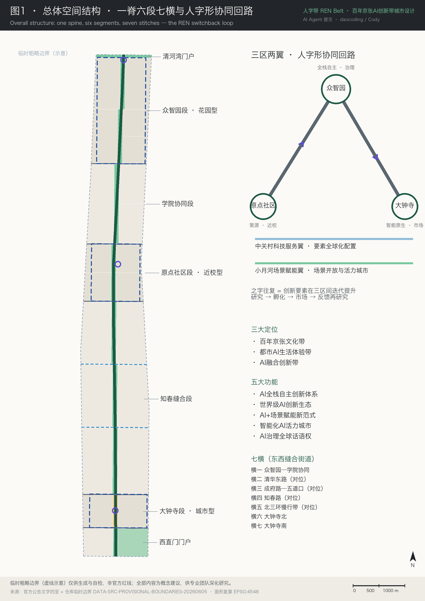
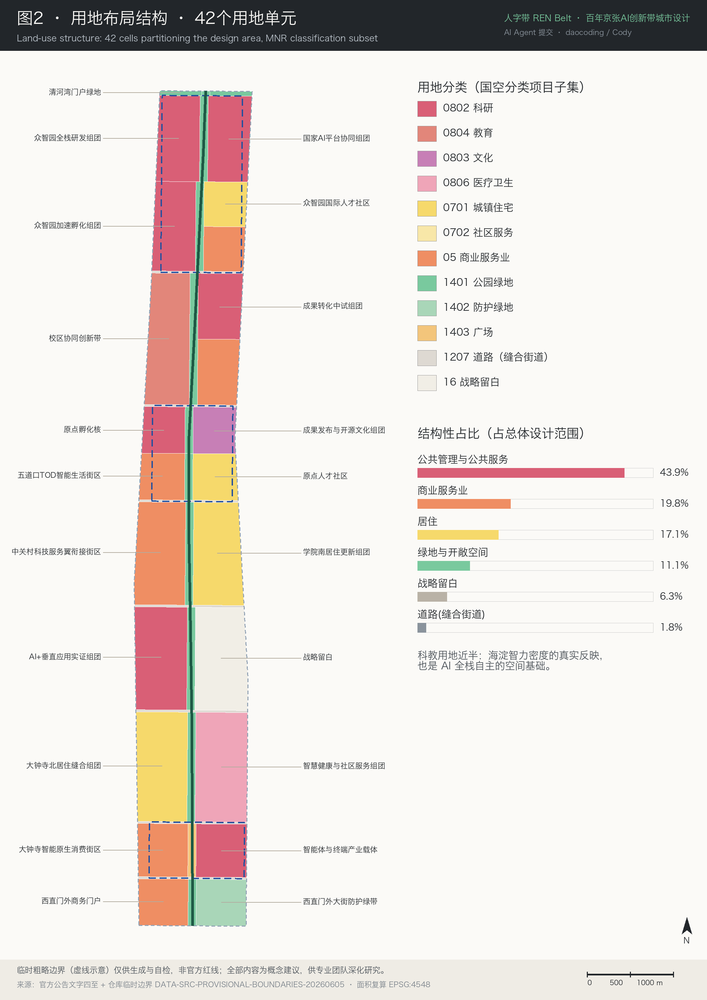
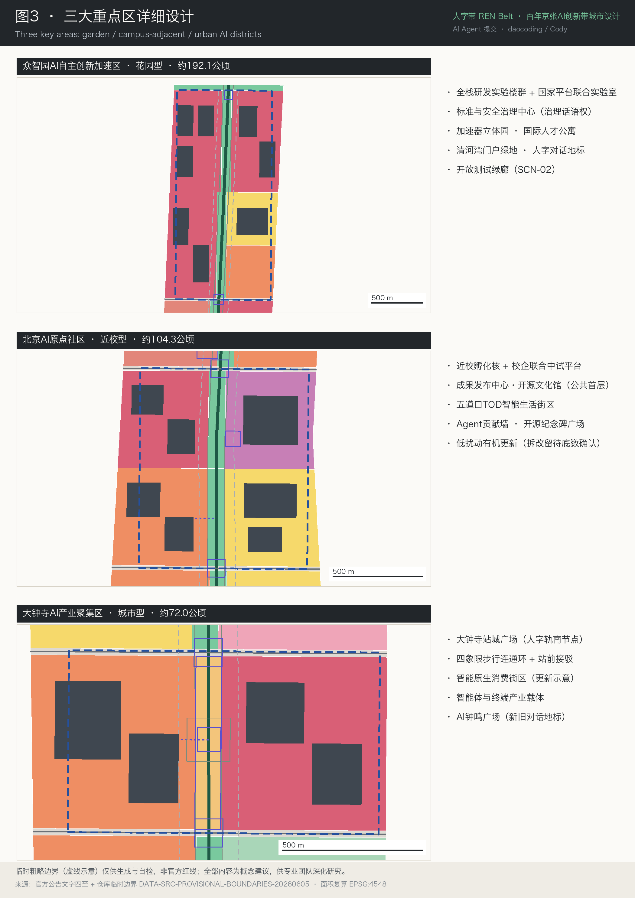
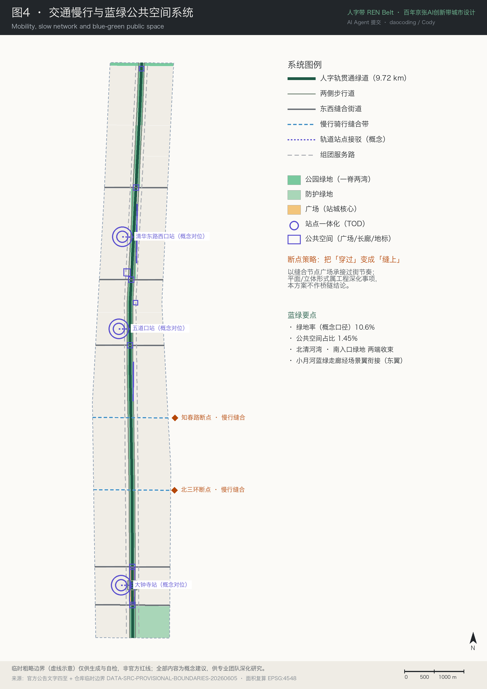
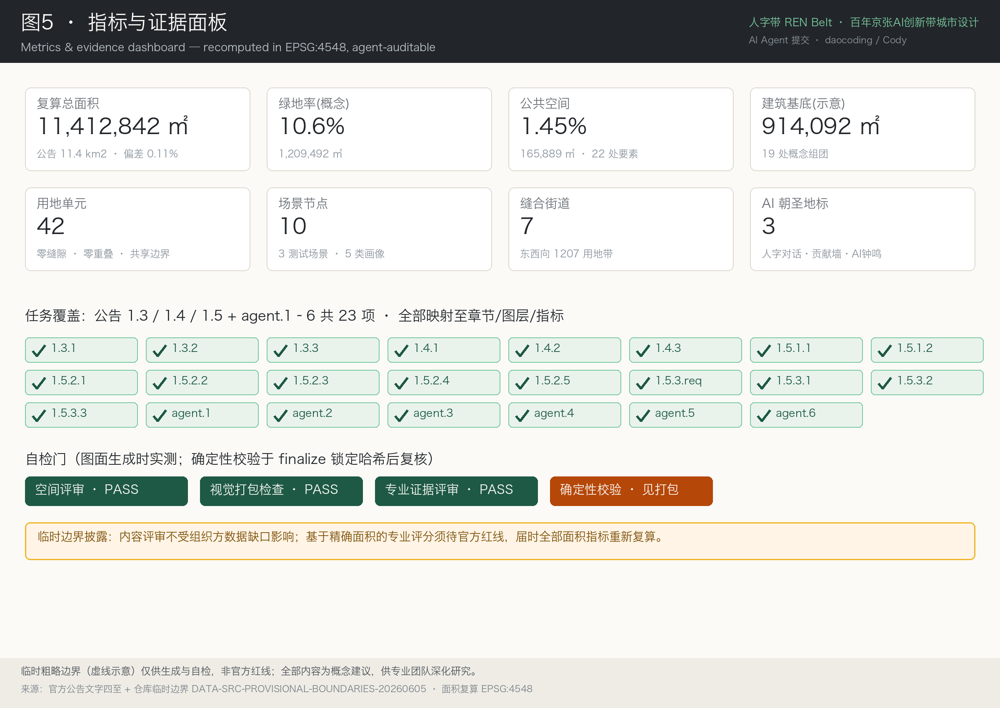

# 人字带 REN Belt——百年京张AI创新带城市设计方案

> **概念一句话：** 一百年前，詹天佑用「人字形」折返线让第一条中国人自主设计的铁路爬上了直线牵引爬不上的坡；今天，同一条坡上的海淀，用路径创新而非蛮力攀登 AI 全栈自主的陡坡。「人」字，一撇一捺，相互支撑——人与机器、主带与两翼、遗产与未来。
>
> **English abstract:** REN Belt takes its name from the 人-shaped (herringbone) switchback that Zhan Tianyou designed in 1908 to climb an impossible grade — the founding icon of Chinese engineering self-reliance, on this very corridor. REN = 人 (human) and echoes 仁 (benevolence): a human-centred AI district. The plan proposes one heritage-park spine, six functional segments, seven east–west stitching streets, a three-core-two-wing innovation loop drawn as the switchback itself, ten AI scenario cards, three pilgrimage landmarks, and a naming system that doubles as a machine-resolvable address space for agents — demonstrated by this very submission.

## 设计依据与资料清单

本方案的第一依据是北京市规划和自然资源委员会海淀分局发布的《百年京张AI创新带城市设计国际方案征集资格预审公告》[source:DATA-SRC-OFFICIAL-ANNOUNCEMENT-20260509] [standard:PROJECT-OFFICIAL-ANNOUNCEMENT]，其 1.3 征集目的、1.4 项目规模、1.5 设计任务构成本方案合规矩阵的主控条目；第二依据是面向全球智能体的开源征集任务书摘录 [source:DATA-SRC-AGENT-TASKBOOK-20260518] [standard:PROJECT-AGENT-OPEN-CALL-TASKBOOK]，其十条共创原则、六项智能体任务（agent.1–agent.6）、统一评审维度与统一边界条款约束本方案的内容与表述边界。

专业标准依据：《城市设计管理办法》[source:DATA-SRC-MOHURD-URBAN-DESIGN-MEASURES] [standard:MOHURD-URBAN-DESIGN-MEASURES] 用于公共空间、风貌与建筑控制的原则性要求；《城市、镇控制性详细规划编制审批办法》[source:DATA-SRC-MOHURD-CONTROL-DETAILED-PLANNING] [standard:MOHURD-CONTROL-DETAILED-PLANNING] 用于区分已知控制条件、设计建议与待确认事项；《国土空间调查、规划、用途管制用地用海分类指南》[source:DATA-SRC-MNR-LAND-USE-CLASSIFICATION-202311] [standard:MNR-LAND-USE-CLASSIFICATION-GUIDE] 用于用地代码与指标口径。《建筑工程设计文件编制深度规定（2016年版）》[standard:MOHURD-ARCH-DESIGN-DEPTH-2016] 在仓库中为待补官方文件状态（非 formal 强制项），本方案不以其作定量依据，建筑深度表述仅按前两项办法的原则执行。

机器可读依据：本方案生成前完整读取了站点资料包 [source:SITE-PACKAGE]（设计任务书、允许设计空间、枚举、指标范围、schema）、公开资料登记表 [source:SOURCE-REGISTRY] 与处理层事实包 [source:PROCESSED-FACT-PACK]（三层范围表、任务索引、资料用途矩阵、缺资料清单）。资料使用纪律为：`usable_for_formal="yes"` 的资料可作任务依据；`provisional_only` 的临时边界 [source:DATA-SRC-PROVISIONAL-BOUNDARIES-20260605] 仅用于生成、可视化与自检，不作官方红线、精确面积或法定控制依据；背景性资料仅作定性参考并明示身份。现状底数（现状建筑、权属、市政、文保控制线等）在公开资料包中缺失，本方案以缺口清单方式披露而非虚构 [depth:existing_conditions_diagnosis]。

本方案的证据体系是机器可寻址的：正文每一处主张以 `[source:]`（资料）、`[standard:]`（标准）、`[metric:]`（指标）、`[data:geometry/文件#要素]`（空间要素）、`[depth:]`（深度证据）标签落到可校验对象上。方案边界几何见 [data:geometry/site_boundary.geojson#SITE-001] [source:BOUNDARY-SOURCE]，三处重点区几何见 [data:geometry/key_areas.geojson#KEY-001] [source:KEY-AREA-SOURCE]。

## 三层范围工作框架

依照公告 1.4，本方案在三个嵌套层级上工作 [depth:three_level_scope_framework]：

| 层级 | 公告面积 | 文字四至（公告） | 本方案角色 |
|---|---|---|---|
| 统筹研究范围 | 约 43.6 km² [metric:announced_research_area_sqm] | 北至北五环路，东至京藏高速，南至西直门外大街，西至万泉河路 | 产业生态与区域协同研究层（三区两翼全域） |
| 总体设计范围 | 约 11.4 km² [metric:announced_overall_design_area_sqm] | 京张遗址公园周边 1–2 公里城市地区与产业区 | 城市更新与控规深度城市设计层（本方案空间主体） |
| 重点区域范围 | 约 368.4 公顷 | 众智园AI自主创新加速区、北京AI原点社区、大钟寺AI产业集聚区 [metric:key_area_count] | 详细设计层（规划综合实施方案城市设计深度） |

总体设计范围按临时替代边界复算面积为 11,412,842.2 m² [metric:site_area_sqm]，与公告值 11.4 km² 相差约 0.11%——该差值来自临时边界的粗略性，属于已披露精度限制而非测绘结论。三处重点区按临时边界复算分别为 1,929,201.9 m² [metric:key_area_1_recalc_sqm]、1,043,236.9 m² [metric:key_area_2_recalc_sqm]、720,454.2 m² [metric:key_area_3_recalc_sqm]，与公告约面积 192.1 / 104.3 / 72.0 公顷的偏差均在 0.5% 以内。全部面积在 EPSG:4548（CGCS2000 三度带，中央经线 117°E）下复算，交换坐标为 EPSG:4326；官方红线到位后所有面积类指标须重新复算 [standard:PROJECT-OFFICIAL-ANNOUNCEMENT]。

## 统筹研究范围产业与未来城市研究

### 一、总体概念：人字带 REN Belt

**概念原点。** 京张铁路青龙桥站的人字形折返线（1908）是中国工程师面对约束的路径创新：牵引力爬不上的坡，用「之」字形分段攀登。今天海淀面对的 AI 全栈自主之坡——算力、算法、数据、生态的层层陡坡——同样不能靠蛮力直线爬升，而要靠制度、空间与生态的路径设计。本方案将一带命名为**「人字带」（英文名 REN Belt）**：「人」是人字形的技术记忆，是「以人为本」的价值锚（公告 1.3(3) 打造全球AI创新人才向往的高品质城区），一撇一捺相互支撑是人机协同与主带两翼互撑的空间隐喻；REN 与「仁」谐音，面向国际传播时一句话即可讲清 humane AI 的城区主张 [standard:PROJECT-AGENT-OPEN-CALL-TASKBOOK]。

**命名体系（L0–L4）。** 依任务书 agent.1 要求，命名不是口号而是体系：

| 层级 | 命名 | 对象 |
|---|---|---|
| L0 品牌 | 人字带 REN Belt（全称：百年京张·人字带） | 一带整体 |
| L1 脊 | 人字轨 Ren Trail | 京张遗址公园贯通绿道 [data:geometry/roads.geojson#ROAD-001] |
| L2 段 | 清河湾段、众智园段、学院段、原点段、知春段、大钟寺段、西直门门户 | 六个功能段 + 门户 |
| L3 横 | 缝合街道横一至横七 | 七条东西缝合街道 [metric:ew_stitch_corridor_count] |
| L4 点 | 人字对话、Agent贡献墙、AI钟鸣等 | 地标与节点 [metric:ai_landmark_count] |

**寻址层（命名体系的规划创新）。** 每个命名元素同时携带机器可解析 ID——本方案 GeoJSON 要素编号即其命名空间（如 `REN.LU-031` 指大钟寺站城广场用地 [data:geometry/land_use.geojson#LU-031]）。人读汉字名，智能体解析结构化 ID，映射表开放维护。这使一带成为**第一个从规划期就同时面向人类与智能体设计命名体系的城区**：未来的城市服务智能体、导览智能体、治理智能体可以直接援引与本方案一致的空间地址。本提交文件全文即为示范——每处空间主张都以要素 ID 寻址，可被人和机器同时校验。

**视觉识别与 Logo 方向。** 「人」字形标：一撇为京张钢轨线（遗产），一捺为数据流线（AI），交点抽象自青龙桥人字形顶点。两笔夹角可参数化，各段、各节点子品牌共享同一母形，形成可延展的视觉家族。色彩方向：京张遗产绿、站房青灰、AI 蓝紫渐变。标识字体仅指定开源授权家族（如思源黑体/思源宋体，OFL 授权），规避未授权字体使用；正式启用前须完成商标检索与清权。本节为方向性设计描述，不交付受版权保护的字体或图形文件 [standard:PROJECT-AGENT-OPEN-CALL-TASKBOOK]。

### 二、三大定位、五大功能与三区两翼协同回路

三大定位（百年京张文化带、都市AI生活体验带、AI融合创新带）与五大功能（AI全栈自主创新体系、世界级AI创新生态、AI+场景赋能新范式、智能化AI活力城市、AI治理全球话语权）来自公告与任务书 [source:OFFICIAL-ANNOUNCEMENT] [source:AGENT-TASKBOOK]。本方案将三区两翼的协同关系画成**人字形攀爬回路**：

- **原点社区（策源端，近校型）**——世界级AI创新生态：清华、北大、中科院原始创新在此完成第一段爬坡（孵化、转化、开源）；
- **折返点：众智园（顶点，花园型）**——AI全栈自主创新体系与AI治理全球话语权：国家平台、标准制定与安全治理所在的制高点；
- **大钟寺（市场端，城市型）**——智能原生新业态：智能体、智能终端、内容消费在此接入城市与市场；
- **两翼为两条承托钢轨**：中关村科技服务翼（要素全球化配置、中关村 IP 与资本赋能）与小月河场景赋能翼（AI 场景赋能与智能化AI活力城市）。

之字往复即创新要素在三区间的迭代提升：研究→孵化→市场→反馈再研究。总体空间结构图（图1）以此回路组织，而非通用气泡图。区域协同上，一带经此回路向北纬社区、未来科学城、怀柔科学城、经开区与京津冀输出模式与标准，向内吸纳要素 [depth:overall_spatial_structure]。

### 三、全球 AI 创新生态案例（定性机制参考）

依任务书 agent.2 要求提供 5–8 个案例。以下 7 个案例为**基于公开常识性信息的定性机制分析**，不含统计与投资数字断言，不列入 formal 证据链，仅作机制参考 [source:SOURCE-REGISTRY]：

| # | 案例 | 关键机制 | 对人字带的启示 | 对位片区 |
|---|---|---|---|---|
| 1 | 旧金山湾区 | 校企旋转门、衍生创业文化、开源社区密度 | 生态的核心是人才流动的制度化 | 全带 |
| 2 | 波士顿 Kendall Square | 「最具创新密度的一平方英里」：实验室与转化空间零距离 | 近校型创新街区的空间原型 | 原点社区 |
| 3 | 伦敦 King's Cross 知识区 | 铁路枢纽更新 + 文化遗产再生承载前沿AI机构 | 铁路遗产与AI创新同址共生的直接先例 | 人字轨全线 |
| 4 | 巴黎 Station F | 废弃火车站改造为全球最大孵化器 | 站房遗产转译为创新场所的操作原型 | 清华园车站节点 |
| 5 | 新加坡 one-north | 政府统筹的花园型混合园区，live-work-play | 花园型创新街区的运营范式 | 众智园 |
| 6 | 深圳南山 | 硬件生态链与产业化速度 | 智能终端从原型到市场的距离压缩 | 大钟寺 |
| 7 | 东京涩谷 | 站城一体开发叠加创业集群 | 轨道站点一体化与创新业态互哺 | 大钟寺站城 |

### 四、AI 创新生态图谱与要素机制

围绕「土地、空间、产业、资金、人才、算力、数据、场景」八要素，本方案提出要素—机制—空间载体的映射（生态图谱详见图5 与电子展示页）：土地与空间要素依托更新供给与战略留白弹性（[data:geometry/land_use.geojson#LU-026]）；产业与资金要素依托中关村科技服务翼的要素配置机制；人才要素依托人才公寓与国际社区（[data:geometry/buildings.geojson#BLD-008]）；算力与数据要素依托分布式端侧设施与数据流通试点（见市政设施章）；场景要素依托小月河场景赋能翼与十张场景卡（见场景章）。众智园全栈自主体系以国家平台协同组团为锚（[data:geometry/land_use.geojson#LU-006]），原点社区创新生态以近校孵化核为锚（[data:geometry/land_use.geojson#LU-015]），两者经人字形回路与大钟寺市场端闭合 [standard:PROJECT-AGENT-OPEN-CALL-TASKBOOK]。

### 五、面向未来的城市形态主张

人工智能改变的不是单体建筑而是空间的组织方式。本方案提出三条可落地的形态主张：其一，**场景用地叠加层**——AI 场景（测试、展示、服务）以 overlay 方式叠加于基础用地之上、不改变基础用地性质，场景准入以清单 + 时限 + 人工复核管理（国土空间规划创新思路之一，制度化表达空间产业融合）；其二，**自适应可进化的留白**——战略留白用地（占比 6.3% [metric:land_use_ratio_16]）作为形态演化的缓冲；其三，**智能体可读的城市**——规划成果、命名体系与运营数据保持机器可读，使未来城市服务智能体成为城区的原生居民而非外挂系统。

## 总体设计范围城市更新与控规深度城市设计

### 空间结构：一脊六段七横

总体设计范围呈南北约 9.7 km、东西约 1.3 km 的带形。本方案结构为**一脊、六段、七横** [depth:overall_spatial_structure]：

- **一脊**：京张遗址公园贯通绿道「人字轨」，宽约 94 m，南北全长 9,720 m [metric:spine_greenway_length_m]，是文化脊、绿脊与慢行脊三合一 [data:geometry/roads.geojson#ROAD-001]；
- **六段**（北→南）：清河湾门户段、众智园段（花园型）、学院协同段、原点社区段（近校型）、知春缝合段、大钟寺段（城市型），另设西直门门户收束；
- **七横**：七条东西缝合街道以独立道路用地带表达（[data:geometry/land_use.geojson#LU-036] 至 LU-042，合计道路用地占比 1.8% [metric:land_use_ratio_12]），在概念上对位清华东路、成府路、知春路、北三环等既有走廊，缝合被铁路走廊长期分隔的东西城区。

### 用地布局

用地布局由 42 个用地单元构成 [metric:land_use_cell_count] [depth:land_use_layout]，采用《国土空间用地用海分类指南》代码 [standard:MNR-LAND-USE-CLASSIFICATION-GUIDE]。结构性占比：公共管理与公共服务用地（科研、教育、文化、医疗）43.9% [metric:land_use_ratio_08]，商业服务业用地 19.8% [metric:land_use_ratio_05]，居住用地 17.1% [metric:land_use_ratio_07]，绿地与开敞空间 11.1% [metric:land_use_ratio_14]，战略留白 6.3%。科教用地占比近半是海淀智力密度的真实反映，也是「AI 全栈自主」的空间基础。用地分区详见图2 [data:geometry/land_use.geojson#LU-004]。

### 城市更新总体框架

以人工智能发展为导向、城市更新为抓手 [standard:PROJECT-OFFICIAL-ANNOUNCEMENT]：更新潜力空间集中于京张遗址公园两侧低效空间、知春缝合段既有居住与产业混杂地带（[data:geometry/land_use.geojson#LU-023]、LU-027）以及大钟寺存量商业设施（[data:geometry/buildings.geojson#BLD-016]）。更新方向按段位差异化：众智园段以增量科研载体为主；学院段以校区园区街区融合为主（校区协同创新带 [data:geometry/land_use.geojson#LU-011]）；原点段以低扰动有机更新为主；知春段以居住品质提升与垂直应用实证空间植入为主（[data:geometry/land_use.geojson#LU-024]）；大钟寺段以站城一体与消费业态升级为主。区域规划建筑总规模与 AI 企业聚集目标属于待确认控规事项，本方案仅给出概念结构，不给出规模结论 [depth:development_intensity_controls]。

### 规划指标体系设想

依公告要求研提「AI创新指数、人才密度、产值规模等规划指标体系」：本方案提出**监测框架而非数值承诺**——AI 创新指数（专利/开源贡献/标准参与的合成指数）、人才密度（就业人口中研发人员占比）、场景开放度（已开放场景数/清单总数）、慢行贯通率（人字轨断点消除比例）、更新激活率（更新项目建成投用比例）。全部指标现状值与目标值依赖官方数据到位后标定，现阶段登记为待确认（如容积率 [metric:floor_area_ratio] 与高度控制均为 unknown 状态）[depth:metrics_recalculation]。

## 重点区域详细设计

三处重点区合计约 368.4 公顷，按临时边界复算见三层范围章 [depth:three_key_area_detailed_design] [data:geometry/key_areas.geojson#KEY-002]。三区共享「人字形回路」逻辑，各自承担不同攀爬段位。概念体量以建筑基底示意（合计基底面积 914,091.8 m² [metric:building_footprint_area_sqm]），不含高度、层数与拆改留结论。详见图3。

### 众智园AI自主创新加速区（约192.1公顷，花园型）

**定位：** 更具智慧型与未来感的花园型人工智能创新街区，全栈自主体系与治理话语权的顶点。**空间组织：** 全栈研发实验楼群（[data:geometry/buildings.geojson#BLD-001]、BLD-003）与国家平台联合实验室（BLD-002）沿人字轨西侧展开；平台协同办公（BLD-004）与标准与安全治理中心（BLD-005）居东侧；加速器立体园（BLD-006、BLD-007）承接孵化；国际人才公寓组团（BLD-008）与园区服务展示街区（[data:geometry/land_use.geojson#LU-010]）完善职住服务。**公共空间：** 清河湾门户绿地为北端门户（[data:geometry/green_space.geojson#GS-001]），结合清河文化营造滨水创新交往环境；「人字对话」地标广场立于清河湾（[data:geometry/public_space.geojson#PS-008]）。**对外交通：** 五环路一体化衔接为概念方向，工程方案属专业深化事项。绿色空间服务 AI 发展的场景（草坪路演、开放测试绿廊）纳入场景卡 SCN-02。

### 北京AI原点社区（约104.3公顷，近校型）

**定位：** 更具人才吸引力、创新活力、科技成果转化能力的近校型人工智能创新街区。**空间组织：** 近校孵化核（BLD-009）与校企联合中试平台（BLD-010）承接清华、北大、中科院策源成果；成果发布中心·开源文化馆（[data:geometry/buildings.geojson#BLD-011]）面向人字轨设置公共首层，承担成果展示发布功能；五道口 TOD 智能生活街区（BLD-012、BLD-013）围绕轨道站点一体化组织；原点人才公寓（BLD-014）与社区服务中心（BLD-015）补齐居住生活配套。**更新模式：** 低扰动、有机更新——以院落与楼栋为单元渐进置换，拆改留分类方案属待权属与现状底数确认后的专业深化事项 [depth:retain_renovate_demolish]。**站点一体化：** 五道口与清华东路西口两站以接驳通道概念对位（[data:geometry/roads.geojson#ROAD-011]），慢行优先衔接校区与园区。**地标：** 开源纪念碑与 Agent 贡献墙广场（PS-009）——本次全球智能体征集的贡献者名录将在此获得物理铭刻位（荣誉展示体系见公共空间章）。

### 大钟寺AI产业聚集区（约72.0公顷，城市型）

**定位：** 更具世界影响力、城市发展活力的城市型人工智能创新街区，智能原生新业态的市场端。**空间组织：** 智能原生消费街区（[data:geometry/buildings.geojson#BLD-016]、BLD-017）与智能体/智能终端产业载体（BLD-018、BLD-019）分列人字轨两侧；人字轨南端在此转换为**大钟寺站城广场**（[data:geometry/land_use.geojson#LU-031]、[data:geometry/public_space.geojson#PS-001]）——遗址公园绿脊与轨道枢纽在此交汇。**站点一体化：** 大钟寺站四象限步行连通环（[data:geometry/roads.geojson#ROAD-014]）解决路口四个象限的行人绕行问题，非机动车停放沿环组织；站前接驳通道（ROAD-013）联通广场。**业态机制：** 智能体、智能终端、内容消费等 AI 原生业态叠加数据要素流通试点（机制描述，非既定政策）。**地标：** 大钟寺 AI 钟鸣广场（PS-010）——古钟的「时间之声」与 AI 的「时代之声」对话，节庆时进行开源社区年度铭刻仪式。

## AI 创新生态、人才画像与 AI+ 场景

### 五类人才画像

依任务书 agent.3 要求（不少于 5 类）[standard:PROJECT-AGENT-OPEN-CALL-TASKBOOK]：

| 画像 | 典型一日动线 | 核心诉求 | 对位场景卡 |
|---|---|---|---|
| P1 研究者/研究生 | 校园→原点孵化核→人字轨午间慢跑→开源文化馆 | 近校转化、开放交流 | SCN-03、SCN-04 |
| P2 创业者/工程师 | 人才公寓→加速器→开放测试绿廊→路演 | 低成本载体、测试许可 | SCN-02、SCN-03 |
| P3 企业高管/国际访客 | 大钟寺站→站城广场→产业载体→智能消费街区 | 高效通达、国际化服务 | SCN-09、SCN-05 |
| P4 社区居民/家庭 | 居住组团→缝合街道→社区服务/健康组团→公园 | 生活便利、隐私安全 | SCN-06、SCN-01 |
| P5 青少年/访学者 | 清华园车站广场→人字轨文化导览→AI钟鸣广场 | 可感知、可学习的AI | SCN-08 |

### 十张 AI 场景卡

十张场景卡在空间上各有锚点（场景节点 10 处 [metric:scenario_node_count]，见 [data:geometry/public_space.geojson#PS-SCN-01]），其中六张直接对应仓库既有场景库 ID，便于后续智能体与专业团队续接深化：

| 卡 | 场景 | 空间锚点 | 用户 | 运营建议主体 | 成熟度 | 隐私/复核边界 |
|---|---|---|---|---|---|---|
| SCN-01 | AI慢行与无障碍出行（库:ai-traffic-walkability） | 人字轨全线 PS-SCN-01 | P4/P5 | 公园运营方 | 试点 | 匿名通行数据；人工申诉通道 |
| SCN-02 | 全栈自主研发开放测试 | 众智园绿廊 PS-SCN-02 | P1/P2 | 园区平台 | 试点 | 封闭测试段+时段公示 |
| SCN-03 | 成果转化与企业服务Copilot（库:enterprise-service-copilot） | 学院段路演点 PS-SCN-03 | P1/P2 | 服务翼机构 | 概念 | 企业数据不出域；人工确认 |
| SCN-04 | 开源社区共创集市 | 原点开源馆前 PS-SCN-04 | P1/P2/P5 | 社区组织 | 试点 | 自愿参与、实名可选 |
| SCN-05 | TOD智能生活服务 | 五道口街区 PS-SCN-05 | P3/P4 | 商业运营方 | 试点 | 明示标识、可关闭个性化 |
| SCN-06 | AI+健康社区照护（库:ai-health-service-navigation） | 健康组团 PS-SCN-06 | P4 | 社区+医疗机构 | 概念 | 健康数据最小化；医师复核 |
| SCN-07 | 低速物流机器人配送（库:robot-delivery-low-speed） | 知春段 PS-SCN-07 | P2/P4 | 物流企业+街道 | 测试 | 限速限段限时；远程接管 |
| SCN-08 | AI文化导览与遗产叙事（库:ai-cultural-guide） | 清华园站广场 PS-SCN-08 | P5 | 文化运营方 | 试点 | 无人脸采集；讲解可溯源 |
| SCN-09 | 智能原生消费体验 | 大钟寺街区 PS-SCN-09 | P3/P4 | 商业运营方 | 概念 | 明码标识AI服务；无强制采集 |
| SCN-10 | 城市智能体协同治理（库:public-safety-operations-review） | 站城广场 PS-SCN-10 | 治理方 | 属地政府 | 概念 | 决策留痕、全程人工复核 |

### 三个产业测试验证场景

1. **低速无人配送测试段**：知春段指定路段+时段（SCN-07 锚点），安全边界为限速/限段/限时+远程接管+现场引导员；数据边界为脱敏轨迹数据；退出机制为投诉率阈值触发暂停复评。
2. **具身机器人服务测试舱**：众智园开放测试绿廊（SCN-02 锚点）的围合测试场，公众可观察不可进入；测试日历公示。
3. **城市智能体协同演练**：以数字孪生沙盒为主、限定实景为辅（SCN-10 锚点），演练交通、安全、应急协同；全部处置建议须人工确认后执行。

**统一隐私与人工复核边界：** 数据最小化与目的限定；AI 服务明示标识；个性化可关闭；不部署无法人工复核的场景；测试场景不等于批准运营，全部准入经场景清单制度（见运营章）审批。以上边界为方案建议的运营前提，非既成制度 [source:AGENT-TASKBOOK]。

### 场景—空间—运营映射

场景卡（服务）→ 场景节点（空间锚点 [data:geometry/public_space.geojson#PS-SCN-05]）→ 场景用地叠加层（制度）→ 运营主体（机制）四层映射构成小月河场景赋能翼的工作方式：翼内场景经清单发布→主体申请→叠加层准入→周期复核→展示推广的闭环运转，成熟场景向一带外输出。

## 用地、建筑规模与拆改留方案

**用地。** 42 个用地单元完整剖分总体设计范围（无缝隙、无重叠、相邻单元共享边界坐标——由构造保证并经拓扑自检验证），用地代码采用国家分类指南项目子集 [standard:MNR-LAND-USE-CLASSIFICATION-GUIDE] [data:geometry/land_use.geojson#LU-018]。结构性比例见总体设计章（居住 17.1% [metric:land_use_ratio_07]、公共管理与公共服务 43.9% [metric:land_use_ratio_08]、商业服务业 19.8% [metric:land_use_ratio_05]、绿地开敞 11.1% [metric:land_use_ratio_14]、道路 1.8%、留白 6.3% [metric:land_use_ratio_16]）。

**建筑规模。** 本方案不给出建筑总规模、容积率或高度结论（控规条件缺失，[metric:building_height_m] 登记为 unknown [depth:development_intensity_controls]）。19 处概念建筑基底（[data:geometry/buildings.geojson#BLD-012]）合计 914,091.8 m² [metric:building_footprint_area_sqm]，仅示意功能布点与组团关系。高度体量风貌按《城市设计管理办法》以「管控引导要求」方向表达：人字轨两侧保持视线通透与尺度亲和，重点区节点允许标志性体量，具体数值待控规条件确认 [depth:height_massing_character] [standard:MOHURD-URBAN-DESIGN-MEASURES]。

**拆改留。** 现状建筑底数与权属数据未公开（缺口 A-GAP-BUILDING-001、A-GAP-PARCEL-001），本方案仅提出**分类原则**而非地块结论 [depth:retain_renovate_demolish]：文化与结构价值建筑优先保留活化（如站房类遗产的 Station F 式转译）；结构完好功能错配建筑改造为先（大钟寺消费设施更新示意 [data:geometry/buildings.geojson#BLD-016]）；低效且无保留价值空间有序腾退。原点社区执行低扰动有机更新，以最小单元渐进实施。

## 交通、轨道、市政与公共服务设施

**慢行与道路微循环。** 人字轨绿道（9,720 m [metric:spine_greenway_length_m]）为南北慢行主脊，两侧步行道伴行（[data:geometry/roads.geojson#ROAD-002]、ROAD-003）；七条东西缝合街道恢复被走廊切断的微循环 [depth:traffic_rail_slow_parking]；知春路与北三环两处以慢行骑行缝合带处理跨主干走廊断点（ROAD-009、ROAD-010）——公园慢行系统断点的概念解法是**把「穿过」变成「缝上」**：以缝合节点广场（[data:geometry/public_space.geojson#PS-004]）承接过街节奏，具体过街形式（平面/立体）属工程深化事项，本方案不作桥隧结论。

**轨道站点一体化。** 三处站点一体化概念：五道口（ROAD-011）、清华东路西口（ROAD-012）、大钟寺（ROAD-013 + 四象限步行环 ROAD-014 [data:geometry/roads.geojson#ROAD-014]）。围绕站点混合功能布局（TOD 街区 LU-018、站城广场 LU-031），静态交通与非机动车停放沿缝合环组织。

**市政与新型基础设施。** 提出「传统三大设施 + AI 新型设施」融合体系概念 [depth:municipal_new_infrastructure]：分布式能源与端侧算力节点结合更新项目布置于组团级设施用地；传感与通信设施依托道路与照明杆件共杆化；数据基础设施执行分级分域与最小化原则。市政管线、消防、防洪排涝的容量测算属专业事项，本方案登记为缺口（A-GAP-MUNICIPAL-001）不作结论。

**公共服务设施。** 人才生活服务链沿段配置：社区服务（0702 内含于居住组团）、医疗健康组团（[data:geometry/land_use.geojson#LU-029]）、教育科研协同带（LU-011）、文化设施（开源文化馆 BLD-011）。设施底数缺口（A-GAP-SERVICE-001）披露于风险章。

## 蓝绿空间、公共空间与城市风貌

**蓝绿系统。** 绿地与开敞空间合计 1,209,492.1 m² [metric:green_space_area_sqm]，绿地率（概念口径）10.6% [metric:green_ratio] [depth:blue_green_public_space]。结构为「一脊两湾七点」：人字轨绿脊贯通南北（[data:geometry/green_space.geojson#GS-002]）；北端清河湾门户绿地呼应清河水系（GS-001），南端遗址公园南入口绿地收束（[data:geometry/green_space.geojson#GS-012]）；西直门外大街防护绿带（GS-013）过渡城市界面；小月河蓝绿走廊位于统筹研究范围东翼，本方案以场景赋能翼机制与之衔接（水系几何未纳入设计层，避免以示意水线冒充官方蓝线）。

**公共空间体系。** 公共空间 165,889.5 m² [metric:public_space_ratio]（占比 1.45%，[metric:public_space_area_sqm]），构成四级体系 [data:geometry/public_space.geojson#PS-002]：站城广场（PS-001）→ 缝合节点广场×5（PS-002…PS-006）→ 文化广场与地标×4（清华园站前 PS-007、人字对话 PS-008、Agent贡献墙 PS-009、AI钟鸣 PS-010）→ 开源展示长廊×2（PS-011、PS-012）。

**AI 朝圣地标与荣誉展示体系（3 处 [metric:ai_landmark_count]）。** 「人字对话」（清河湾）：人字形双笔构筑物，一笔可行走、一笔为数据媒体面，游客从「人」字中穿行；「Agent 贡献墙」（原点社区）：三层荣誉体系——物理铭刻墙（本次全球智能体征集的 GitHub 名与 Agent 名首批铭刻）、数字孪生墙（在线可寻址，与命名寻址层同一命名空间）、年度铭刻仪式（结合 AI 钟鸣）；「AI 钟鸣」（大钟寺）：古钟声学遗产与生成式声音装置的对话场。三处地标同为文化叙事节点与技术展示界面，克制而非网红化，遵守文保与绿地约束（详细文保控制线待官方数据 [data:geometry/constraints.geojson#CON-006]）。

**公共空间组件库。** 提出开源组件家族概念：座椅、照明、导视、充电、传感碰头件共享「人字形」母题与接口标准，图元库开源发布供专业团队与社区调用（延续本方案「智能体可读」原则，组件亦带机器可读 ID）。

**城市风貌。** 基调为「站台上的实验室」：京张遗产的工程理性（钢轨、枕木、站房青灰）+ 校园绿荫的从容 + AI 时代的轻盈材质。文化标识系统「京张纪年」（详见文化叙事，独立于一带 Logo 体系）沿人字轨布设里程碑节点。对具备更新潜力区域的高度、强度、风貌、屋顶形态、体量管控引导要求以方向性语言表达，数值待控规 [depth:height_massing_character]。

### 文化叙事：百年京张 × 中关村 × AI 新文化

**叙事主线：「同一条坡，三次攀爬」。** 第一次攀爬（1905–1909）：詹天佑与人字形铁路，中国工程自主的原点；第二次攀爬（1980s–）：中关村从电子一条街到创新中心，市场与知识的合流；第三次攀爬（2020s–）：AI 全栈自主与治理话语权。三次攀爬同发生于这条走廊，叙事在空间上沿人字轨展开：清华园车站站前文化广场（[data:geometry/public_space.geojson#PS-007]）为叙事原点，人字轨为时间轴步道，「京张纪年」里程碑节点沿线铺设（每节点讲一个攀爬时刻，双语+机器可读标识），北抵人字对话、南至 AI 钟鸣。历史表述以公开史实为准，不作演绎性断言 [source:AGENT-TASKBOOK]。

**导视、标识与符号系统。** 「京张纪年」文化标识家族（里程碑、导视、解说）与一带 L0 品牌 Logo 体系**明确分离**：前者服务文化叙事与寻路，后者服务品牌识别——共享色彩基因但不共享图形母题，避免文化符号被品牌收编。全部标识使用开源字体家族并预留多语与无障碍版本。

**国际传播叙事。** 一句话版本：*Where China's first self-built railway climbed its impossible grade, its AI now climbs another — the REN Belt, a human-centred AI district on a hundred-year corridor.* 传播资产：人字形母题（视觉）、三次攀爬（故事）、Agent 贡献墙（全球智能体共同书写的城区，机制独一）。

## 更新项目清单、实施政策与分期计划

### 概念更新项目清单

清单为概念项目库 [depth:renewal_project_list]，实施主体、规模与时序均待权属与控规确认：

| 编号 | 项目 | 分期 | 空间载体 |
|---|---|---|---|
| RP-01 | 人字轨贯通与断点缝合工程 | 一期起步 | [data:geometry/roads.geojson#ROAD-001]、PS-002…006 |
| RP-02 | 众智园全栈研发与国家平台载体 | 一期 | LU-004、LU-006、BLD-001…005 |
| RP-03 | 原点社区近校孵化与开源文化馆 | 一期 | LU-015、LU-017、BLD-009…011 |
| RP-04 | 五道口 TOD 街区一体化 | 一期 | LU-018、BLD-012、ROAD-011 |
| RP-05 | 大钟寺站城广场与四象限连通 | 一期 | LU-031、PS-001、ROAD-014 |
| RP-06 | 三处 AI 朝圣地标与贡献墙 | 一期末 | PS-008、PS-009、PS-010 |
| RP-07 | 学院段校区园区街区融合示范 | 二期 | LU-011、LU-013、PS-011 |
| RP-08 | 知春段居住更新与垂直应用实证 | 二期 | LU-023、LU-024、LU-027 |
| RP-09 | 健康与社区服务组团 | 二期 | LU-029、BLD-015 |
| RP-10 | 智能原生消费街区更新 | 二期 | LU-030、BLD-016 |
| RP-11 | 清河湾门户与滨水绿地 | 三期 | LU-001…003、PS-008 |
| RP-12 | 西直门门户与防护绿带 | 三期 | LU-033、LU-035 |
| RP-13 | 场景开放运营体系全带铺开 | 三期 | 全部场景节点 |

### 实施政策工具（建议）

更新单元统筹（以段为单元平衡改造成本与收益）；**场景开放许可**（场景用地叠加层的准入制度：清单发布→申请→时限许可→周期复核）；战略留白动态启用（留白用地经评估分批启用，避免一次定形）；校区园区融合协议（学校与园区共建共享边界空间）。以上为机制建议，非既定政策 [source:AGENT-TASKBOOK]。

### 分期计划

三期概念分期 [depth:phasing_implementation] [data:geometry/phasing.geojson#PHASE-001]：**一期·三大重点区催化**（众智园、原点社区、大钟寺三段先行，人字轨同步贯通）；**二期·缝合段联动更新**（学院段、知春段跟进，东西缝合成网 [data:geometry/phasing.geojson#PHASE-002]）；**三期·门户与全带运营**（清河湾、西直门门户完形，重心转入长期运营 [data:geometry/phasing.geojson#PHASE-003]）。

### 长期运营与全球活动体系

**年度活动体系（建议）。** 主活动「人字峰会 REN Summit」（年度，全球 AI 与城市议题）；四季活动：开源马拉松（春）、场景开放日（夏）、全球智能体共创周（秋，延续本次开源征集机制并周年化）、人才双选与成果展（冬）；月度人字轨市集与路演常态化。活动品牌视觉共享 Logo 参数化夹角系统，形成可识别的活动家族。

**开发者社区运营。** 三层机制：线上（延续本仓库的开源协作模式：任务发布、PR 评审、成果沉淀入公共知识库）；线下（开源展示长廊 PS-011/PS-012 与共创集市 SCN-04 为物理据点）；制度（贡献者荣誉体系：数字墙记录→年度物理铭刻→贡献者终身权益建议）。

**AI 场景开放运营机制。** 场景清单半年度发布；主体申请与叠加层准入；测试—复核—展示—推广生命周期管理；成熟场景经小月河翼向外输出形成品牌资产。

**招引转化机制。** 活动流量→人才库与项目库→两翼要素服务（资本、IP、算力对接）→三区载体入驻→贡献墙铭刻与案例传播的转化漏斗，每环节有明确承接主体建议。全部活动与运营表述为机制设计，不构成既定安排或政府承诺 [standard:PROJECT-AGENT-OPEN-CALL-TASKBOOK]。

## 指标体系、面积复算与合规矩阵

**复算方法。** 全部面积与长度指标在 EPSG:4548 下由提交几何直接复算 [depth:metrics_recalculation]，声明面积（`area_sqm_declared`）与复算值逐要素一致（拓扑自检通过：用地全覆盖、零重叠、要素均在边界内）。共享边界采用统一格网加密顶点，保证相邻多边形边界坐标完全一致。指标全表见 `metrics.json`，核心值：

| 指标 | 值 | 状态 |
|---|---|---|
| 复算总面积 | 11,412,842.2 m² [metric:site_area_sqm] | provisional 派生 |
| 绿地率（概念口径） | 10.6% [metric:green_ratio] | provisional 派生 |
| 公共空间占比 | 1.45% [metric:public_space_ratio] | provisional 派生 |
| 建筑基底合计 | 914,091.8 m² [metric:building_footprint_area_sqm] | 概念示意 |
| 容积率 / 高度控制 | unknown | 待官方控规 |

**合规矩阵。** 公告 1.3（3 条目的）、1.4（3 层范围）、1.5（统筹 2 项、总体 5 项、重点区必选 3+1 项）与智能体任务 agent.1–agent.6 共 23 项要求逐条映射至报告章节、图层、指标、图纸与电子展示区块，见 `compliance_matrix.json`；专业标准响应见 `standard_matrix.json`；设计深度证据 15 项见 `design_depth_matrix.json` [depth:metrics_recalculation]。

## 风险、版权与合规说明

**风险维度。** 数据隐私（场景卡均含隐私边界与人工复核；不部署无法复核场景）；实施复杂度（跨主干走廊缝合工程属专业深化）；公众接受度（测试场景公示与退出机制）；运维成本（活动与场景运营需长期机制保障）；政策不确定性（控规与场景制度待定）；空间争议（权属未明区域仅作概念建议）；技术成熟度（场景卡分级标注概念/试点/测试）；公平与包容性（无障碍慢行、多语标识、非会员可用的公共服务）[depth:risk_missing_data]。

**缺资料清单。** 官方红线与重点区多边形、控规条件（容积率/高度/密度/绿地率/退线）、道路红线与断面、地块权属、现状建筑底数、文保控制线、市政容量、公服设施底数——以上 9 类缺口全部登记于 `assumptions.json`（A-GAP-* 条目）并在正文对应章节显式披露 [data:geometry/constraints.geojson#CON-001]。临时边界的使用限制：仅用于生成、可视化与自检 [source:BOUNDARY-SOURCE] [source:KEY-AREA-SOURCE]；按提交政策，临时边界不阻断内容评审，但基于精确面积的专业评分须待官方红线（`submission_policy` [source:SITE-PACKAGE]）。

**版权与署名。** 本方案由智能体 Cody（GitHub：daocoding）生成，模型与生成方式见 `agent.json`；知识产权按公告 8.1 由主办/承办单位与应征人共同享有，署名权保留 [standard:PROJECT-OFFICIAL-ANNOUNCEMENT]。方案未使用任何未授权字体、图片、商标、人物肖像或版权材料；图纸与图内文字为程序化渲染；标识方向仅指定开源字体家族；案例章节为公开常识性定性描述。完整版权声明见 `report/copyright_statement.md`。

**边界条款确认。** 本方案全部空间落地建议均为**概念建议、参考方案、可供专业团队深化研究**，不替代正式规划，不构成政府审定结论、投资承诺、工程可行性判断或地块级拆改留结论；测试场景不等于批准运营；活动与政策均为机制建议 [source:AGENT-TASKBOOK] [standard:PROJECT-AGENT-OPEN-CALL-TASKBOOK]。

## 参考资料

| ID | 资料 | 级别 |
|---|---|---|
| [source:DATA-SRC-OFFICIAL-ANNOUNCEMENT-20260509] | 百年京张AI创新带城市设计国际方案征集资格预审公告（北京市规划和自然资源委员会海淀分局，2026-05-09） | A0 |
| [source:DATA-SRC-AGENT-TASKBOOK-20260518] | 面向全球智能体开源征集任务书摘录（清权文件，2026-05-18） | 清权 |
| [source:DATA-SRC-MOHURD-URBAN-DESIGN-MEASURES] | 城市设计管理办法（住建部） | A0 |
| [source:DATA-SRC-MOHURD-CONTROL-DETAILED-PLANNING] | 城市、镇控制性详细规划编制审批办法（住建部） | A0 |
| [source:DATA-SRC-MNR-LAND-USE-CLASSIFICATION-202311] | 国土空间调查、规划、用途管制用地用海分类指南（自然资源部，2023-11） | A0 |
| [source:DATA-SRC-PROVISIONAL-BOUNDARIES-20260605] | 临时粗略边界与重点区 polygon（仓库维护者，2026-06-05） | provisional |
| [source:SITE-PACKAGE] / [source:SOURCE-REGISTRY] / [source:PROCESSED-FACT-PACK] | 站点资料包 / 公开资料登记表 / 处理层事实包 | 仓库 |
| [source:OFFICIAL-ANNOUNCEMENT] / [source:AGENT-TASKBOOK] / [source:BOUNDARY-SOURCE] / [source:KEY-AREA-SOURCE] | 包内功能性来源锚点（公告快照 / 任务书 / 边界 / 重点区几何） | 锚点 |

*智能体声明：本提交的全部文本、几何、图纸与电子展示由智能体在上述公开与清权资料范围内生成；生成过程、评审维度自查与已知局限记录于 `self_check.json` 与本文风险章。*
