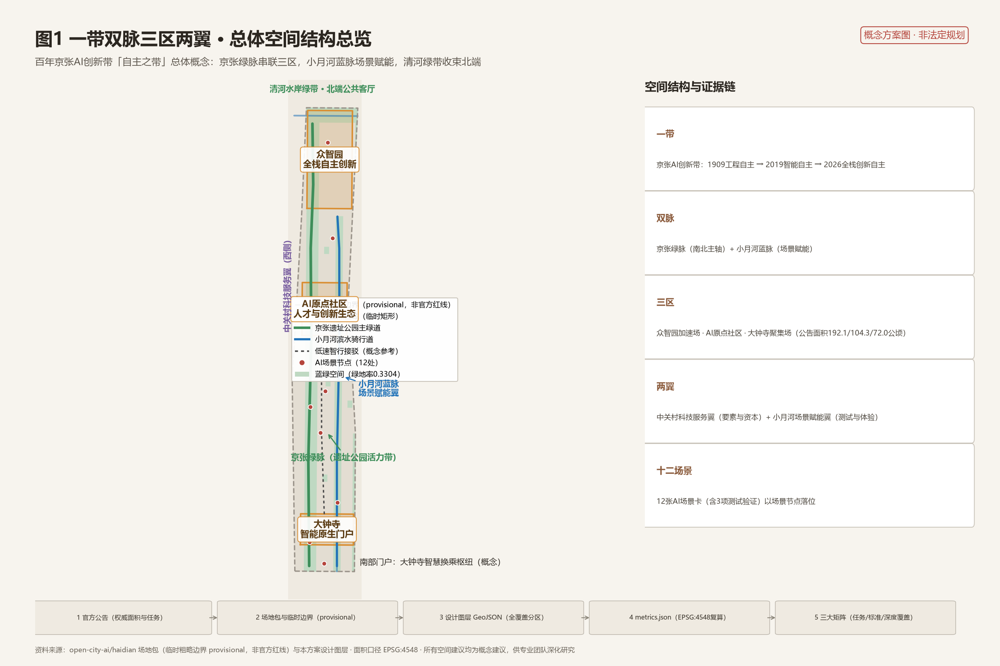
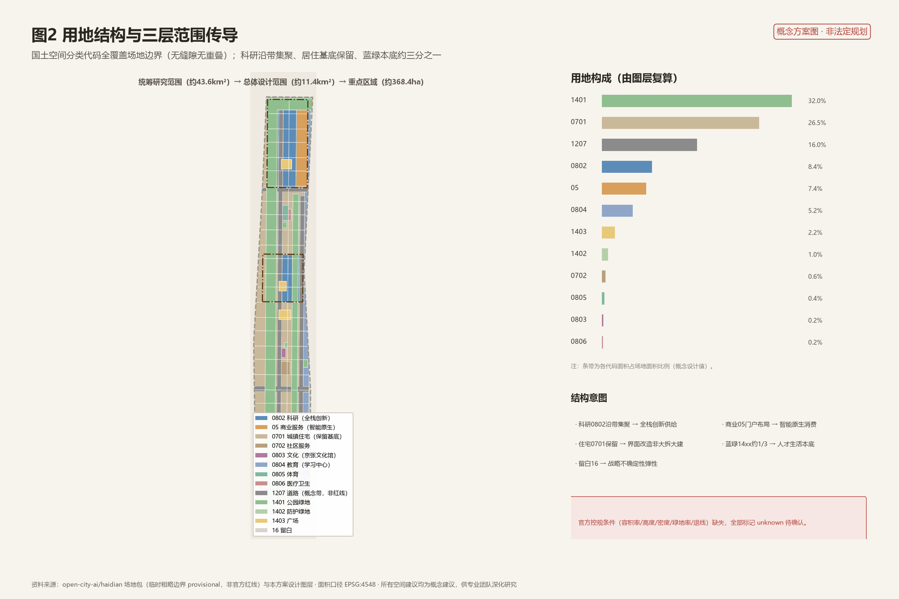
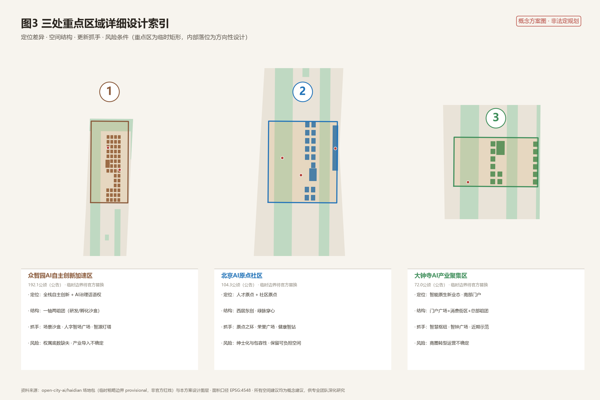
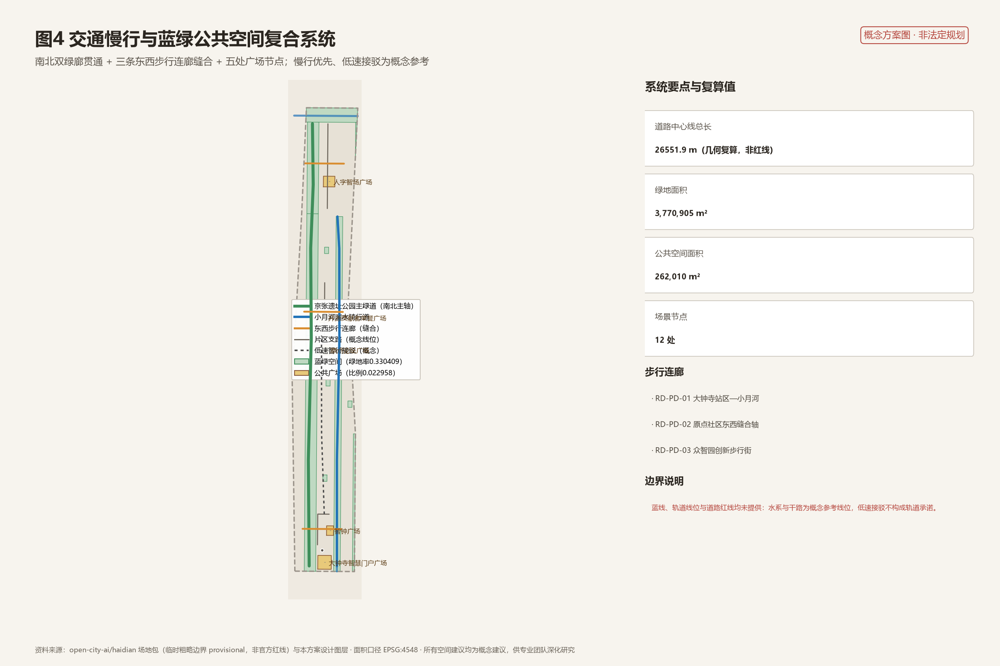
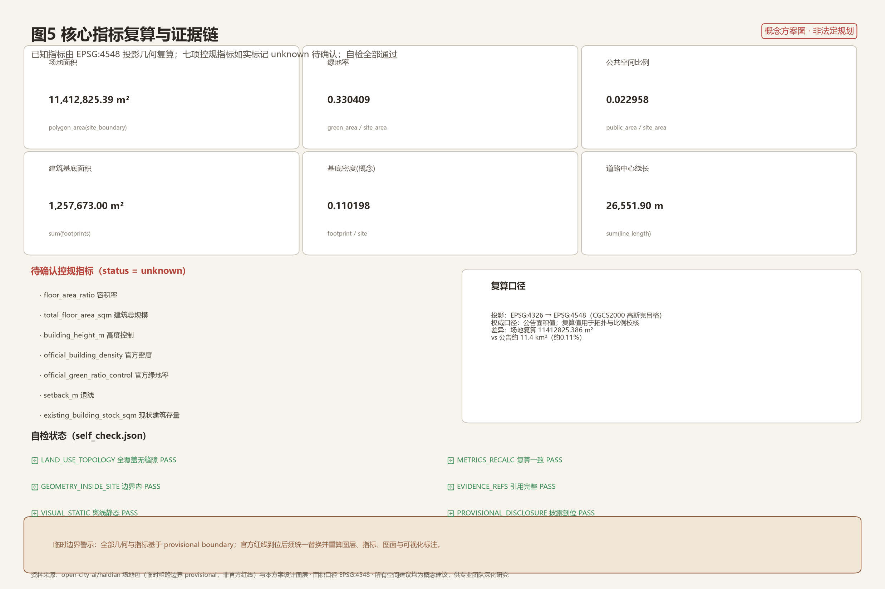

# Centennial Parallel·Autonomous Corridor —— Urban Design Scheme for the Centennial Jing-Zhang AI Innovation Belt

> All spatial design suggestions are **Conceptual Recommendations or Reference Plans** that are intended for reference and further professional development. They do not replace formal planning and do not constitute the government's final approval. This plan uses provisional boundaries, which should not be used as official planning boundaries, approval references, or precise area calculation references. [source:OFFICIAL-ANNOUNCEMENT] [standard:PROJECT-AGENT-OPEN-CALL-TASKBOOK] (Official Planning Boundary)

## Design Basis and Source List

The design basis for this proposal is divided into four layers. The first layer is the official announcements and task book: the qualification pre-review announcement issued by the Haidian Branch of the Beijing Municipal Commission of Planning and Natural Resources determined the project name, three-tier scope (comprehensive research covering approximately 43.6 square kilometers, overall design covering approximately 11.4 square kilometers, and key areas covering approximately 368.4 hectares), three key areas, and the design task context, serving as the main control basis for the proposal [source:OFFICIAL-ANNOUNCEMENT]; the open-source call task book excerpt adds ten co-creation principles, three positioning statements, five functions, the Three Zones and Two Wings, and six mandatory tasks [source:AGENT-TASKBOOK]. The second layer is the site package and registration form: the structured design task book, enumeration, defined design space, range values, and model files form the generative constraints [source:SITE-PACKAGE]; the source registry distinguishes between formal available, background reference, and provisional materials, and this proposal strictly adheres to this classification, not elevating background or provisional materials to legal basis [source:SOURCE-REGISTRY]. The third layer is the data navigation layer: the warehouse fact pack provides task lists, scope structure, data uses, and gaps, which this proposal translates into readable design arguments, but conclusions still refer back to the original sources [source:PROCESSED-FACT-PACK]. The fourth layer is the local snapshot of professional standards: the Urban Design management measures, control detailed planning compilation and approval methods, and the land use classification guide are all verifiable within the repository [standard:MOHURD-URBAN-DESIGN-MEASURES] [standard:MOHURD-CONTROL-DETAILED-PLANNING] [standard:MNR-LAND-USE-CLASSIFICATION-GUIDE].

The availability of documentation is as follows: the announcement text, task book excerpts, and three professional standards can serve as formal references; the background of the Three Zones and Two Wings and the industrial layout of Haidian are A1-level background materials, which only support narrative and positioning arguments [source:SRC-2026-BJ-KW-THREE-AREAS-WINGS] [source:SRC-2026-HAIDIAN-1X1]; the Overall Design Area and the temporary polygons of the three key areas are only used for generation, display, and entrance self-check [source:BOUNDARY-SOURCE] [source:KEY-AREA-SOURCE]; the global case summaries are compiled by AI based on public knowledge, which are only used for mechanism inspiration [source:SRC-AGENT-BACKGROUND-CASES]. The above sources correspond one-to-one with `sources.json`, `assumptions.json`, `compliance_matrix.json`, `standard_matrix.json`, and `design_depth_matrix.json`: each conclusion can be traced back to the JSON evidence layer from the main text. The architectural professional depth references (compiled in the 2016 edition of the preparation depth regulations) are logged as pending documentation due to the absence of official documents and are not considered as authoritative satisfaction of the requirement [standard:MOHURD-ARCH-DESIGN-DEPTH-2016].

## Three-Level Scope Framework

The plan is organized according to the three-layer scope defined in the announcement [source:OFFICIAL-ANNOUNCEMENT]. **Coordinated Research Area** covers approximately 43.6 square kilometers (north to the North Fifth Ring Road, east to the Jing-Zhang Expressway, south to West Straight Outside Avenue, west to Wanquan River Road), with the work goal being the strategic research on industry and future city, and the results expressed as positioning, naming, ecological mechanisms, and regional synergistic relationships. The metric scope adopted is the authoritative value defined in the announcement [metric:coordinated_research_area_sqm]. **Overall Design Area** covers approximately 11.4 square kilometers, focusing on the urban areas and industrial zones within one to two kilometers around the Jing-Zhang Heritage Park, with the work goal being in-depth Urban Renewal and Urban Design at the detailed planning level. The results will be implemented as comprehensive land use zoning, blue-green network, traffic and pedestrian systems, and a list of renewal projects. This plan adopts a temporary rough boundary provided by the repository maintainer, with an EPSG:4548 recalculated value of approximately 1,141.28 hectares, differing by about 0.11% from the announced value [metric:site_area_sqm] [data:geometry/site_boundary.geojson#SITE-001]. **Key-Area Detailed Design Area** is approximately 368.4 hectares, extending from north to south as follows: Zhongzhiyuan AI Independent Innovation Acceleration Area (approximately 192.1 hectares), Beijing AI Origin Community (approximately 104.3 hectares), and Dazhongsi AI Industry Cluster (approximately 72.0 hectares). The work goal is to conduct in-depth detailed design for the Integrated Planning Implementation Plan [metric:key_area_total_sqm] [metric:key_area_count] [data:geometry/key_areas.geojson#KEY-001].

The transmission logic for the three layers is as follows: the ecological and brand strategy at the comprehensive layer determines the functional structure and update priorities at the overall layer, while the land use and Public Space framework at the overall layer constrains the Building Footprint, scenarios, and project placements at the key layer. It must be clearly disclosed that the current warehouse has not obtained the official precise planning boundary; the three key areas are provisional rectangles, and the announcement does not provide the boundaries [source:KEY-AREA-SOURCE]. The applicability of the provisional boundaries is limited to temporary generation, visualization, and non-legal design discussions; they must not be used for official planning boundaries, approval, precise area calculations, or legal control. Once the official polygon is in place, the following objects need to be recalculated: land use area and proportions, green space and public space indicators, building footprint statistics, update project areas, and all numerical annotations on the entire set of drawings and visualization pages [depth:three_level_scope_framework]. (Provisional Boundary) (Official Planning Boundary)

## Coordinated Research Area: Industry and Future City Research

**Overall Concept and Naming (In Response to agent.1)**. This proposal introduces the overall concept of the "Autonomous Belt": a single corridor that embodies three levels of autonomy—1909's Jing-Zhang Railway was the first major railway line designed and constructed by Chinese engineers, 2019's Jing-Zhang High-Speed Railway became the world's first intelligent high-speed railway, and the Centennial Jing-Zhang AI Innovation Belt points towards full-stack AI self-innovation. Centennial continuity, autonomous legacy, forms the main narrative of the proposal. On this basis, a brand system for the belt is proposed: the main name is suggested as "Jing-Zhang Smart Belt," with an English direction of "Century Jing-Zhang AI Belt"; the naming system is "One Belt·Two Veins·Three Zones·Two Wings·Twelve Scenes"—the one belt refers to the Jing-Zhang AI Innovation Belt, the two veins refer to the Jing-Zhang green vein and the Xiaoyue River blue vein, the three zones refer to the Zhongzhiyuan Acceleration Zone, the AI Origin Community, and the Dazhongsi Aggregation Zone, the two wings refer to the Zhongguancun Technology Services Wing and the Xiaoyue River Scenario Enablement Wing, and the twelve scenes refer to the twelve AI scene cards proposed in this plan [source:AGENT-TASKBOOK] [standard:PROJECT-AGENT-OPEN-CALL-TASKBOOK]. Logo direction as concept sketch: Inspired by the zigzag "person-shaped" line of the Jing-Zhang Railway at Qinglong Bridge, two lines intersect at an intelligent node, both paying homage to the autonomy of the engineering and symbolizing "AI for humans"; the color palette is suggested to be Jing-Zhang Brown, intelligent blue, and vibrant green. Logo direction is a creative proposal and does not use any existing fonts, trademarks, or corporate logos; a similarity check and clearance must be conducted before formal use.

**Three Key Positions, Five Major Functions, and the Synergistic Loop of the Three Zones and Two Wings**. The announcement establishes three key positions: the Centennial Jing-Zhang Cultural Belt, the Urban AI Life Experience Belt, and the AI Integration Innovation Belt; and five major functions: the Full-Stack Independent AI Innovation System, the World-Class AI Innovation Ecosystem, the AI-Enabled Scenario Enablement New Paradigm, Intelligent AI Vital City, and AI Governance Global Discourse [source:OFFICIAL-ANNOUNCEMENT]. Spatially, Zhongzhiyuan bears the full-stack autonomy and AI governance discourse, the AI Origin community bears the innovation ecosystem and talent origin, Dazhongsi bears the intelligent native new business model, Zhongguancun Technology Services Wing provides capital, intellectual property rights, and element allocation, and the Xiaoyue River Scenario Enablement Wing bears scenario testing and public experience, forming a "research and development—transformation—experience—governance" loop [source:SRC-2026-BJ-KW-THREE-AREAS-WINGS]. In terms of regional synergy, the plan suggests forming a division of labor relationship with Beiwēi Community, Future Science City, Huairou Science City, Economic and Technological Development Zone, and the Jing-Jin-Ji region for "basic research—engineering validation—scenario application—industrial amplification", which is a research-based judgment for professional teams to deepen.

**Global AI Innovation Ecosystem Case Studies (In Response to agent.2)**. Based on public awareness, eight case studies have been compiled [source:SRC-AGENT-BACKGROUND-CASES]: San Francisco SoMa and Silicon Valley showcase the density of an ecosystem combining venture capital, universities, and open-source communities; Boston Kendall Square demonstrates the scale transformation from lab to market; Toronto MaRS Discovery District illustrates the governance of an innovation corridor anchored by a university; London King's Cross showcases the overlay effect of hub renewal and university implantation; Singapore one-north exemplifies the integration of industry, research, and academia with regulatory sandboxes; Shanghai Zhangjiang AI Island demonstrates the clustering of scenarios and island testing; Shenzhen Nanshan showcases a full chain and scenario city; and Hangzhou West Sci-Tech Corridor illustrates the ecological organization of a digital economy corridor. The transformation mechanisms are summarized into five categories: Scenario Access lists, testing validation sandboxes, offline hubs for open-source communities, proportioning of talent apartments and third spaces, and Public Spaces as innovation interfaces. These mechanisms are respectively located in the scenario cards, pilgrimage landmarks, and operational chapters of this plan. In terms of integrated planning innovation, the proposal suggests replacing the single plot transfer logic with a combination of "scenario list + spatial supply + operational agreement" as a research exploration of the land space planning in the AI Innovation Belt [depth:overall_spatial_structure] [depth:existing_conditions_diagnosis].

## Overall Design Area: Urban Renewal and Regulatory-Plan-Level Urban Design

**Spatial Structure**. The spatial structure of the Overall Design Area is defined as one belt, two veins, three zones, two wings, and multiple nodes [data:geometry/land_use.geojson#LU-0802-01]: the Jing-Zhang heritage park green vein runs north-south, connecting three key zones; the Xiao Yuehe blue vein along the eastern side provides scenarios and ecological services; the Qinghe green belt forms a waterfront public living room at the northern end; the Zhongguancun service wing and the Xiao Yuehe scenario wing extend along the western and eastern sides, respectively. Land use zoning adopts a subset of the national spatial classification code, fully covering the site boundary with no gaps or overlaps, and can be recalculated directly by GeoJSON [standard:MNR-LAND-USE-CLASSIFICATION-GUIDE] [depth:land_use_layout]. (Three Zones and Two Wings)

**Functional Layout and Update Framework**. Research and development land (0802) is concentrated in Zhongzhiyuan and the eastern side of the original point community, carrying full-stack innovation and transformation functions; commercial and service land use (05) is concentrated in Dazhongsi and the southern gateway area, carrying intelligent native consumption and business functions; residential land use (0701) retains the existing community base in the middle and western areas, achieving innovation penetration through facade renovations rather than large-scale demolition and reconstruction; park and green space land use (1401) and protective green space land use (1402) constitute about one-third of the blue-green baseline [metric:green_ratio]; square land use (1403) is located at five Public Space nodes [metric:public_space_ratio]. The overall framework of Urban Renewal follows the "preserve as the main, renovate as auxiliary, be cautious about demolition and construction": the current building clusters are mainly preserved and repaired, with innovative functions prioritizing the insertion of low-efficiency spaces; due to the lack of current building and ownership baseline data, the conclusions for the demolition–renovate–retain strategy for specific parcels are all listed as pending confirmation items [depth:retain_renovate_demolish] [standard:MOHURD-CONTROL-DETAILED-PLANNING]. (Demolish–Renovate–Retain Strategy)

**Development Intensity and Aesthetic Character.** The five official control conditions—Floor Area Ratio, Building Height, Building Coverage Ratio, green space ratio, and setback distances—are not included in the publicly available site package. This proposal marks them all as unknown and lists the required sources, without providing any statutory intensity values [metric:floor_area_ratio] [metric:building_height_m] [metric:official_building_density] [metric:setback_m]. The Building Footprint is used as a conceptual reference value, recalculated by the layer, with a density of approximately 0.11 [metric:building_footprint_area_sqm] [metric:building_density_design]. In terms of aesthetic character, a tiered volumetric intent is proposed: the Jing-Zhang corridor should maintain low profiles and cultural expression, with key areas forming elevated nodes through innovative groupings, while the Qinghe interface should remain open. The specific control of height, massing, character, and color must be refined in accordance with the requirements of the Urban Design Management Measures after the control plan conditions are confirmed [standard:MOHURD-URBAN-DESIGN-MEASURES] [depth:height_massing_character].

**Urban Infrastructure and New Infrastructure**. The municipal policy proposes the concept of layout principles for computational nodes, smart poles, distributed energy storage, and intelligent energy carbon management, emphasizing integration with traditional municipal facilities rather than starting from scratch; capacity calculations fall within the scope of professional engineering and are marked as to be confirmed [depth:municipal_new_infrastructure].

## Detailed Design of Key Areas

**Zhongzhiyuan AI Independent Innovation Acceleration Area (KEY-001)**. Positioned as the carrier area for the AI Full-Stack Independent Innovation System and global discourse on AI governance [data:geometry/key_areas.geojson#KEY-001]. The spatial structure consists of one axis and two clusters: the Jing-Zhang Green Vein North Segment serves as the display axis, with the research and development laboratory cluster on the west side and the incubation acceleration and scenario sandbox cluster on the east side. The buildings are primarily of ai_r_and_d, lab, and incubator types, all of which are conceptually new clusters [data:geometry/buildings.geojson#ZZY-001]. The Public Space is centered around the Zhi Ren Wisdom Square, which connects to the landmark Zhi Yuan Lamp Tower and the Full-Stack Autonomous Honor Hall. Transportation is facilitated by the east-west pedestrian axis connecting to the concept transfer points at the rail station. Given that the key area is a temporary rectangular zone, the internal positioning is directionally designed; the risk lies in the lack of clear ownership and the uncertainty of full-stack industry introduction. It is recommended to proceed with the scenario sandbox to reduce trial and error costs [metric:key_area_total_sqm]. (Full-Stack Independent AI Innovation System)

**Beijing AI Origin Community (KEY-002)**. Positioned as the talent and community origin of a world-class AI Innovation Ecosystem [data:geometry/key_areas.geojson#KEY-002]. The spatial structure is West Reside East Innovate, with a green artery running through: the west retains existing residential clusters and integrates community services and health smart stations, while the east is laid out for innovation transformation and lifelong learning functions. The Jing-Zhang Green Artery segment features the Origin Forum Square and the Open Source Contributor Honor Square. The buildings are primarily renovated (renovate), preserving the residential base and integrating incubator, mixed-use, and education functions [data:geometry/buildings.geojson#YD-001]. On the scene, it gathers health smart stations, learning pods, co-governance pods, and other life-side AI services, forming a model of the "Ten-Minute AI Living Circle." The risk lies in gentrification and inclusivity during community renewal, and it is recommended to simultaneously retain affordable spaces and human service pathways.

**Dazhongsi AI Industry Cluster (KEY-003)**. Positioned as an aggregation site for intelligent native new business forms and the southern gateway [data:geometry/key_areas.geojson#KEY-003]. The spatial structure consists of a smart gateway square + consumption street + industrial cluster: the Dazhongsi Smart Gateway Square connects to the hub concept node, the middle is an intelligent native consumption and business street, and the eastern part is an industrial headquarters cluster. The buildings are primarily renovated and utilized for retail, mixed-use, and office spaces [data:geometry/buildings.geojson#DZS-001]. Culturally, the concept of the Intelligent Clock Digital Bell Museum is proposed, referencing Dazhongsi (where the Yongle Great Bell is located), translating the 'bell ringing' into a ritual of open-source release and Scenario Access. The risk lies in the operational uncertainty of the business district's transformation, and it is recommended to proceed with a recent demonstration project first [depth:three_key_area_detailed_design].

## AI Innovation Ecosystem, Personas, and AI+ Scenarios

**Human Resources and User Profiles (at least 5 categories)**. Profile One: AI researchers, with a need for experimental spaces, computational power, and academic exchange interfaces; Profile Two: Founders of startup teams, with a need for incubation acceleration, scenario pilots, and funding connections; Profile Three: Open-source developers, with a need for offline hubs, recognition, and peer networks; Profile Four: University students, with a need for learning pods, internship pathways, and low-cost third spaces; Profile Five: Community residents (including elderly and children's families), with a need for health services, travel, and a hybrid human+smart channel for government services; Profile Six: City visitors and tech enthusiasts, with a need for experiential pilgrimage routes and cultural tours. Profiles map to spaces: Researchers correspond to the Zhongzhiyuan laboratory cluster, entrepreneurs correspond to the incubation cluster, developers correspond to the Origin Ring and honor system, students correspond to the AI Lifelong Learning Center, residents correspond to community service facilities, and visitors correspond to the Jing-Zhang Green Path experience route [data:geometry/public_space.geojson#SN-08].

**Twelve AI Scenario Cards (with 3 for industrial testing and validation)**. SC-01 Autonomous Micro-Cycle Shuttle (Testing and Validation): Demonstration segment for low-speed shuttle service from Dazhongsi hub to the original community, serving commuters and visitors, with data boundaries limited to anonymized passenger flow, requiring human safety officer supervision [data:geometry/roads.geojson#RD-TR-01]. SC-02 AI Adaptive Signal and Pedestrian Priority Intersections: Concept for optimizing signal timing along the corridor, with Human Review of the timing plan. SC-03 Smart Pedestrian Guidance and Barrier-Free Accompaniment: Voice and visual barrier-free guidance along the greenway, with no individual tracking for privacy. SC-04 Low-Speed Autonomous Delivery Demonstration Segment (Testing and Validation): Pilot delivery at the end of the Dazhongsi district, limited to public areas and daytime hours [data:geometry/public_space.geojson#SN-10]. SC-05 Park Companion Robot Station: Refueling station for cleaning, patrolling, and tour guide robots along the Green Vein. (Testing and Validation Scenario) SC-06 Community Health Wisdom Station: Original Point Community's health consultation and referral assistance, clearly not replacing diagnosis and maintaining a Human Review window [data:geometry/public_space.geojson#SN-06].
SC-07 AI Learning Pod and Lifelong Learning Co-learning: Personalized learning spaces in the learning center.
SC-08 Jing-Zhang Cultural AR Immersive Tour: Historical narrative overlay experience along the heritage park route, content reviewed by cultural authorities.
SC-09 Scene Sandbox Open Testing Area (for Testing Validation): Zhongzhiyuan provides a controlled testing environment for new technologies, with entry, exit, and data destruction rules [data:geometry/public_space.geojson#SN-09].
SC-10 Energy Carbon Wisdom Management Demonstration Building Cluster: Visualized scheduling of energy consumption and carbon at the building cluster level, with data not leaving the park.
SC-11 Urban Governance Co-governance Pod: Intelligent sorting of public suggestions and a human review loop, prohibiting automated penalties.
SC-12 Open Source Contribution Honor Interaction Device: Display and interaction for contributors in the honor square.

**Scenes—Spaces—Operational Mapping and Boundaries**. Each scene card maps the spatial positioning, service targets, operational data, privacy boundaries, Human Review mechanisms, conceptual operational entities, visualization layers, and risks; all scene nodes are located on the SCENARIO_NODE layer for a total of 12 locations [metric:scenario_node_count]. Privacy and human review principles: data minimization, prioritizing anonymization, opt-out capability, and mandatory human review for critical decisions; immature technologies are expressed through pilot programs and are not written as approved operations [standard:PROJECT-AGENT-OPEN-CALL-TASKBOOK].

## Land Use, Building Scale, and Retain-Renovate-Demolish Strategy

The Land-Use Layout is expressed in a fully covered zoning representation, with the code adopting a subset of the National Land Space Classification Guide [data:geometry/land_use.geojson#LU-0701-01] [standard:MNR-LAND-USE-CLASSIFICATION-GUIDE]. The design intention for the structural proportion is as follows: approximately one-third of the blue-green baseline supports the quality of life for talent, with research and commercial land uses clustering along corridors to support industrial supply, residential and community service land uses maintaining existing social networks, and road land uses conceptually expressed as band-like elements (non-redline). The blank land uses are reserved for strategic uncertainties to provide flexibility. The proportion of industrial functions corresponds to the three-zone positioning: Zhongzhiyuan focuses on research and testing, the Origin Community on conversion and mixed residential use, and Dazhongsi on commercial services and headquarters.

In terms of building scale, the conceptual Building Footprint totals approximately 125.77 million square meters, with a base density of about 0.11 [metric:building_footprint_area_sqm] [metric:building_density_design]. Due to the lack of control plan conditions and the current building baseline, the total building scale, Floor Area Ratio, and height control are all marked as to be confirmed [metric:total_floor_area_sqm] [metric:building_height_m] [depth:development_intensity_controls]. The demolish–renovate–retain logic: existing buildings (existing_retained) are generally to be retained and renovated, with innovative functions implanted through the replacement of inefficient spaces; new concept clusters (new_build) are only present in the Zhongzhiyuan innovation cluster and four cultural landmarks; renovation clusters (renovate) cover the Dazhongsi neighborhood and the original point community interface. (Demolish–Renovate–Retain Strategy) All demolition–renovate–retain () statements are conceptual references. The site-level conclusions must be made by a professional team after conducting a site survey, confirming ownership, and following the statutory procedures [depth:retain_renovate_demolish] [data:geometry/buildings.geojson#LB-01]. The spatial supply and operational strategy are recommended to adopt a "space inventory + scenario admission + dynamic evaluation" mechanism to avoid the fixation of one-time supply. (Demolish–Renovate–Retain Strategy)

## Transport, Rail, Municipal Infrastructure, and Public Services

Traffic strategies are centered around "sewing the east and west, connecting the north and south, with a preference for pedestrian and cycling infrastructure" [depth:traffic_rail_slow_parking]. The north-south axis is the main greenway of the Jing-Zhang Heritage Park, conceptually connecting from the southern portal to Qinghe; the small Moon River waterfront cycling path on the east side runs parallel to it, forming a dual green corridor [data:geometry/roads.geojson#RD-GW-01] [data:geometry/roads.geojson#RD-CW-01]. Three pedestrian walkways are set in an east-west direction, connecting the Dazhongsi station area, the Origin Community, and Zhongzhiyuan, stitching the historical division caused by the railway corridor [data:geometry/roads.geojson#RD-PD-02]. The micro-circulation of the area's side streets is expressed conceptually, with the total length of the road centerlines being approximately 26,551.9 meters as a geometric calculation value, not the red line length [metric:road_centerline_length_m]. For the transit connections, the proposal introduces the concept of a Dazhongsi Smart Transfer Hub and a reference line for low-speed smart mobility shuttle services from the hub to the original point community. It clarifies that this is a scenario transfer concept rather than a commitment for a track line [data:geometry/roads.geojson#RD-TR-01]. The parking and non-motorized vehicle organization recommends centralized parking at the hub with small waystation facilities along the greenway to reduce street occupancy. The traffic organization for event days incorporates the test content of scenario card SC-01.

In terms of municipal and public service facilities, the innovative service platform includes scenario sandboxes, open-source hubs, and enterprise service kiosks (concepts); talent living services include health wisdom stations, learning pods, community service centers, and suggestions for the location of talent apartments; New Infrastructure includes the concept of computing nodes, smart poles, and distributed energy storage. All lines, pipelines, and capacities do not constitute an engineering scheme and must be refined by a professional team based on official documents [data:geometry/constraints.geojson#CN-02].

## Blue-Green Network, Public Space, and Urban Character

The blue-green system consists of a belt and three corridors with multiple points: the Jing-Zhang Heritage Park Vitality Belt (south, middle, and north segments), the Little Yuhe Blue-Green Scene Corridor, the Qinghe Waterfront Green Belt, the protective green belt on the east side, and four pocket parks, collectively forming a continuous ecological and recreational network [data:geometry/green_space.geojson#GS-01]. The total green space area is approximately 377.09 million square meters, with a green space rate recalculated value of about 0.3304, serving as a conceptual design reference value, with the statutory green space rate to be controlled pending the confirmation of the control plan [metric:green_space_area_sqm] [metric:green_ratio] [metric:official_green_ratio_control]. The Public Space system is structured around five squares: the Dazhongsi Smart Gateway Square, the Origin Forum Square, the Angle Wisdom Field Square, the Honor Square for Open Source Contributors, and the Wisdom Clock Square, with a total area of approximately 26.20 million square meters, representing a proportion of about 0.023 [metric:public_space_area_sqm] [metric:public_space_ratio].

**AI Sacred Landmark and Honor Display System (In Response to agent.4, at least 3 places)**. Landmark One: "Person's Wisdom Bridge · Jing-Zhang Heritage Gallery": A concept gallery inspired by the Qinglong Bridge's zigzag track, honoring engineering autonomy, located on the southern segment of the Green Vein [data:geometry/buildings.geojson#LB-04]. Landmark Two: "Origin Ring · Open Contribution Exhibition Hall": An exhibition hall symbolized by code loops and railway roundabouts, located in the honor square of the Origin Community [data:geometry/buildings.geojson#LB-02]. Landmark Three: "Wisdom Source Lighthouse · Full Stack Autonomous Honor Hall": A gallery symbolized by a lighthouse, showcasing full stack autonomous achievements such as computing power, chips, frameworks, etc., located in Zhongzhiyuan [data:geometry/buildings.geojson#LB-01]. Landmark Four: "Intelligent Clock Digital Bell Hall": Responding to the Great Bell of Dazhongsi, translating major open-source releases and Scenario Access into a "bell ringing" ceremony [data:geometry/buildings.geojson#LB-03]. These four landmarks are concept proposals and do not constitute construction commitments. No unlicensed images are used. Honor display system includes a contributors wall, open-source milestone pathway, and naming rule suggestions; the Public Space component library includes four prototype categories: smart street poles, interactive kiosks, signage modules, and resting modules. In terms of Urban Character, the Jing-Zhang corridor maintains a cultural low-profile interface, with modern and simple massing as the main feature in the key areas. The fifth facade is suggested to integrate greenery and photovoltaics, with an overall tone of "gray-brown as the base, blue-green as the vein, and node accents" [depth:blue_green_public_space] [standard:MOHURD-URBAN-DESIGN-MEASURES].

## Renewal Projects, Implementation Policy, and Phasing

Update the project list to include 12 items, with each item placed on the PHASE layer [metric:renewal_project_count] [data:geometry/phasing.geojson#PH-01]. Near-term (conceptual timeline 2026—2028) projects are four: U1 Dazhongsi Station Smart Gateway Square Renovation, U2 Dazhongsi Intelligent Origin Native Consumption Street Revitalization, U3 Jing-Zhang Ruins Park South Segment Demonstration Segment, U4 Xiao Yuehe Blue-Green Corridor South Segment. Mid-term (conceptual timeline 2028—2031) projects are four: U5 Beijing AI Origin Community Innovation Interface Renovation, U6 Origin Forum and Open Source Contributor Square, U7 Central Existing Residential Area Slow Travel Micro-Circulation Renovation, U8 Xiao Yuehe Middle Segment Scenario Corridor. Long-term (conceptual timeline 2031—2035) projects are four: U9 Zhongzhiyuan Full-Stack Innovation Cluster Construction, U10 Qinghe Riverbank AI Governance Forum Site and Park, U11 Jing-Zhang Ruins Park North Segment and Person-Zhi Bridge Landmark, U12 Xiao Yuehe North Segment and Eastern Strategic Reserve Alignment. The phased logic is to prioritize gateways, followed by communities, and conclude with clusters, with visible near-term achievements supporting long-term investments. The phasing and implementation are Conceptual Recommendations. Investment and policy arrangements do not constitute a commitment [depth:phasing_implementation]. Policy recommendations include a Scenario Access list, incentives for the replacement of inefficient spaces, and research directions for an update fund, which are provided for reference by professional teams and relevant authorities.

**Global AI Innovation Ecosystem and Long-term Operations (In Response to Agent.6)**. An annual activity system is suggested as "one conference, one festival, one day, and one competition": the Jing-Zhang AI Conference (annual flagship conference), the Origin Open Source Festival (developer carnival), the Scenario Access Day (government-enterprise matchmaking), and the Jing-Zhang Smart Belt Marathon Hackathon. The activity brand shares the visual system with the "One Belt, One Road" brand, operating independently with its own naming. The developer community operation mechanism includes an online open-source repository with contribution grading, and offline gatherings and pitch sessions organized around the Origin Ring. The scenario access operation mechanism consists of four stages: demand collection, sandbox testing, pilot operation, and evaluation promotion, aligning with SC-09 Scenario Sandbox. Public experience routes include the Pilgrimage Route from the Dazhongsi Smart Bell Square to the Jing-Zhang Green Vein, the Origin Ring, the Human-Word Smart Bridge, and the Wisdom Source Lighthouse. International communication and attraction conversion mechanisms include bilingual storytelling, case publication, and exchanges with international partner cities as concept directions; all activities, recruitment, and funding arrangements are expressed as Open Co-Creation proposals [depth:renewal_project_list].

## Metrics, Area Recalculation, and Compliance Matrix

Core metrics were recalculated using the design layers in EPSG:4548 projection, with the formulas, source files, and confidence levels recorded in `metrics.json` [depth:metrics_recalculation]. The recalculated site area is 11,412,825.386 square meters, with a difference of approximately 0.11% from the announced value of about 11.4 square kilometers [metric:site_area_sqm]. The green space ratio of 0.330409 and the Public Space ratio of 0.022958 are concept design values: the former supports the narrative of talent living quality, while the latter supports the distribution density of innovation interaction nodes [metric:green_ratio] [metric:public_space_ratio]. The Building Footprint area and density (approximately 1,257,700 square meters, 0.110198) respond to the concept intensity of industrial space supply, but do not constitute the statutory Development Intensity [metric:building_footprint_area_sqm] [metric:building_density_design]. The total area of the key zones is 3,684,000 square meters, using the announced value, with three key zones registered by quantity and area [metric:key_area_count] [metric:key_area_total_sqm]. The Coordinated Research Area covers an area of 43,600,000 square meters, which is the announced value [metric:coordinated_research_area_sqm]. The length of the road centerlines, scenario nodes, and the number of renewal projects support the transportation, scenario, and implementation chapters [metric:road_centerline_length_m] [metric:scenario_node_count] [metric:renewal_project_count]. Seven pending indicators include the Floor Area Ratio, total building scale, height, official density, official green space ratio control, setback, and the existing building stock, all marked as unknown and requiring the source of the necessary data [metric:existing_building_stock_sqm].

Align the grid system to cover all items of Announcements 1.3/1.4/1.5, as well as Tasks agent.1 through agent.6, totaling 23 items. Each item is listed with chapter, layer, indicator, drawing, visualization page, source, assumptions, and self-check items; the standard matrix covers five mandatory standards and addresses them one by one, with any architectural depth references recorded as data_gap; the design depth matrix has all 15 items complete. The three matrices correspond one-to-one with the main text and can be machine-readable validated in `compliance_matrix.json`, `standard_matrix.json`, and `design_depth_matrix.json` [standard:PROJECT-OFFICIAL-ANNOUNCEMENT].

## Risk, Copyright, and Compliance

Documentation Legality and Copyright: This proposal only uses publicly available and cleared-up documentation from the repository, without using secret maps, non-public tables, commercial map backgrounds, or unauthorized image materials; the generation method, responsibility boundaries, and limitations of AI-generated content are disclosed in `assumptions.json` (A-MODEL-001) and `report/copyright_statement.md` [depth:risk_missing_data]. Official Approval and Implementation Commitment: The document contains no approved statements, guarantees of implementation, or definitive commitments; activities, recruitment, funding, and policies are all Conceptual Recommendations. Privacy Protection: Scene cards define data minimization and Human Review boundaries on a per-card basis, without using personal privacy as necessary inputs. Main Risks and Mitigation Measures are listed in `risk.json`: Policy uncertainty (lack of control plans) and implementation complexity (multiple subject ownership) are high-priority items, with human review arrangements outlined. Pending Data List: Official precise red lines, three key area polygons, control plan conditions, current building and ownership baseline data, cultural heritage blue lines, and municipal capacity; these data must be re-calculated for layers, indicators, graphics, and visual annotations upon their availability. This proposal is an Open Co-Creation initiative, with the final judgment completed by human and professional teams.

## References

- `brief/site-package/design_brief.json` (master file for the site package) [source:SITE-PACKAGE]
- `brief/site-package/agent_taskbook.json` (excerpt of the intelligent agent task book) [source:AGENT-TASKBOOK]
- `brief/site-package/geometry/provisional_boundaries.geojson` (provisional rough boundaries) [source:BOUNDARY-SOURCE] [source:KEY-AREA-SOURCE]
- `data/source_registry.json` (Public Data Registry) [source:SOURCE-REGISTRY]
- `data/processed/agent_fact_pack.md` (Processed Data Navigation Layer) [source:PROCESSED-FACT-PACK]
- Prequalification Announcement (Haidian Branch of Beijing Planning and Natural Resources Commission, 2026-05-09) [source:OFFICIAL-ANNOUNCEMENT]
- Three Zones and Two Wings to Create a World-Class AI Hub (Beijing Municipal Science and Technology Commission, Zhongguancun Management Committee, 2026-04-03) [source:SRC-2026-BJ-KW-THREE-AREAS-WINGS]
- Haidian District's "1+X+1" Modernized Industrial System Construction Layout (Haidian District Government, 2026-03-02) [source:SRC-2026-HAIDIAN-1X1]
- Urban Design Management Measures (Ministry of Housing and Urban-Rural Development, 2017) [source:SRC-2017-MOHURD-URBAN-DESIGN-MEASURES]
- Regulatory Detailed Planning Compilation and Approval Method for Cities and Towns [source:SRC-MOHURD-CONTROL-DETAILED-PLANNING]
- Guidelines for Classification of Land and Sea Use in Spatial Planning, Land Use Control (Ministry of Natural Resources, 2023) [source:SRC-2023-MNR-LAND-USE-CLASSIFICATION]
- Global AI Innovation Ecosystem Case Summary (AI based on public awareness, background reference) [source:SRC-AGENT-BACKGROUND-CASES]
- `brief/site-package/schemas/*.schema.json` (evidence file pattern) [source:SITE-PACKAGE]
