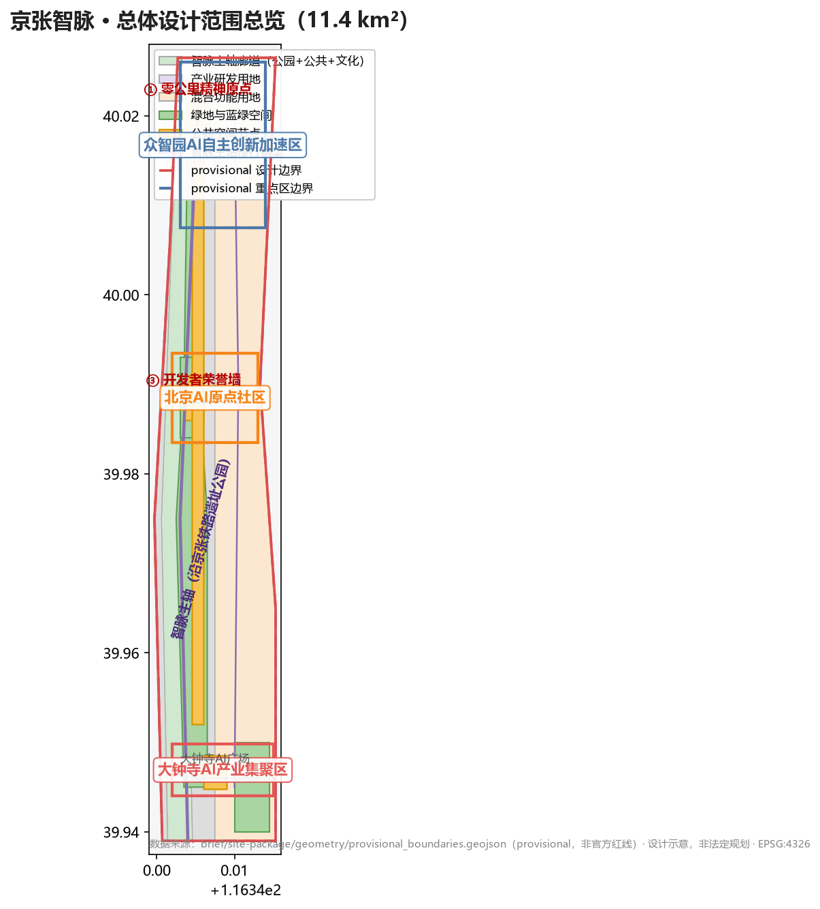
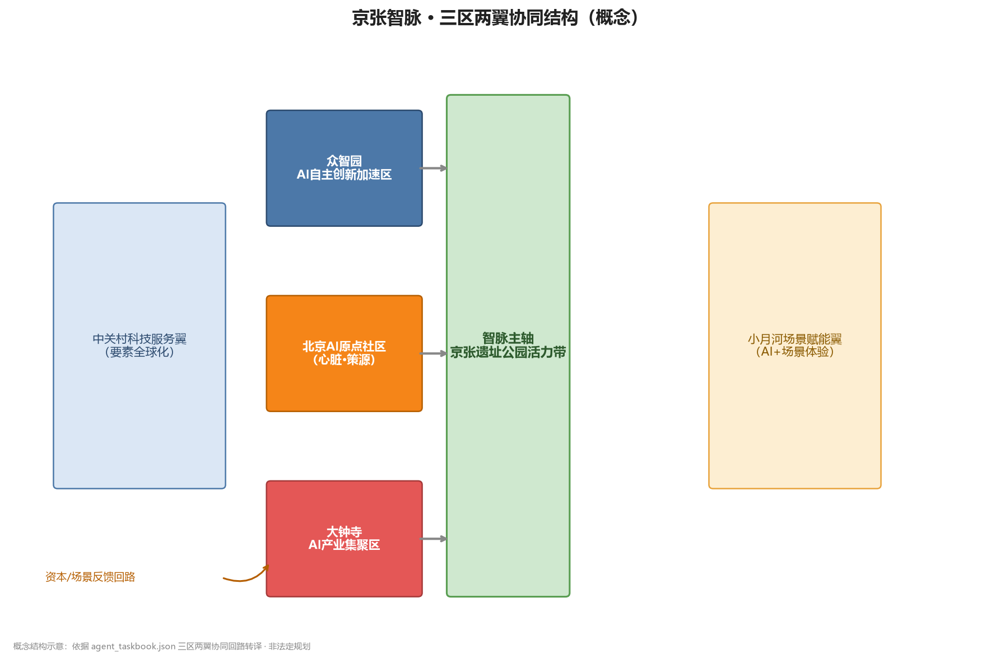
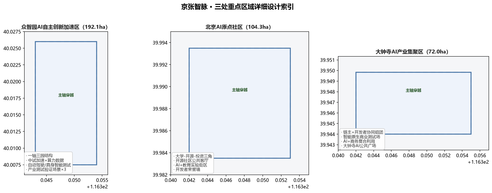
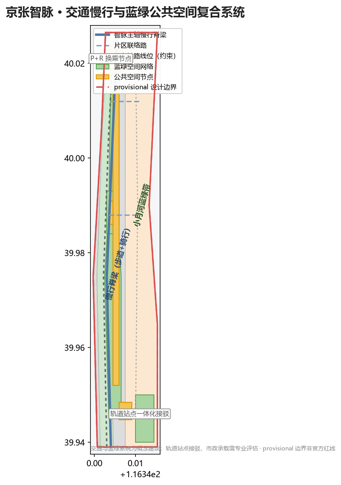
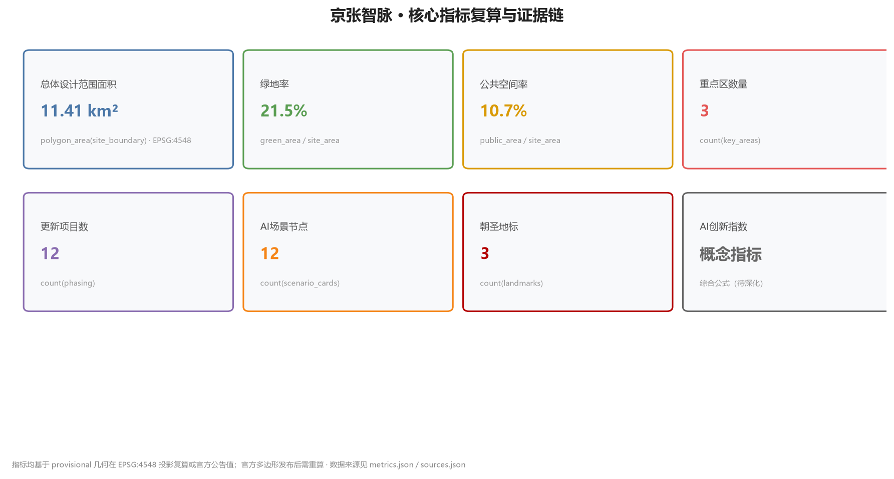

# 京张智脉：从百年铁轨到全球AI创新动脉

> **⚠️ 边界与数据声明（provisional）**：本方案全部几何基于主办方提供的 **provisional 粗略替代边界**（`PROV-SITE-001/002/003`，非官方红线，非精确面积依据），以及**未提供的控规条件**（FAR、建筑高度、密度、绿地率控制、退线、道路红线、土地权属、文保边界、市政管线、能源容量等均标注"待确认/未提供"）。所有空间构想、指标与图纸均为**概念建议**，不构成法定规划、政府审定、投资承诺或工程可行性结论。官方几何与控制数据发布后须整体重算并重新生成全部派生成果。


## 设计依据与资料清单

本方案依据以下资料编制，全部为公开资料或主办方提供且已清权的资料，未使用任何非公开、涉密或未授权数据：

| 资料 | 类型 | 用途 | 来源ID |
|------|------|------|--------|
| 百年京张AI创新带城市设计国际方案征集资格预审公告 | 官方公开 | 任务要求、范围、重点区、成果要求 | `[source:OFFICIAL-ANNOUNCEMENT]` |
| 面向智能体任务书（0518版） | 主办方提供已清权 | 六大agent任务、十大共创原则、三区两翼 | `[source:AGENT-TASKBOOK]` |
| 设计简报 design_brief.json | 官方公开 | 三层范围、面积、坐标策略 | `[source:SITE-PACKAGE]` |
| 允许设计空间 allowed_design_space.json | 官方公开 | 可编辑图层、锁定图层、禁用主张 | `[source:SITE-PACKAGE]` |
| 规划限制 planning_limits.json | 官方公开 | 已知官方面积、缺失控规条件 | `[source:SITE-PACKAGE]` |
| 粗略替代边界 provisional_boundaries.geojson | 主办方推断公开数据 | 提交边界与重点区几何（provisional） | `[source:BOUNDARY-SOURCE]` |
| 公共来源注册表 source_registry.json | 仓库公开注册表 | 来源可用性分级 | `[source:SOURCE-REGISTRY]` |
| 专业标准引用 standards.json | 官方公开 | 强制性专业标准清单 | `[source:SITE-PACKAGE]` |

**边界状态声明（重要）**：主办方尚未发布精确官方多边形，本方案提交的 `geometry/site_boundary.geojson` 与 `geometry/key_areas.geojson` 均来自 `brief/site-package/geometry/provisional_boundaries.geojson`，属性标记为 `official_boundary=false`、`geometry_role="provisional_constraint"`、`boundary_precision="provisional_rough"`。该几何仅用于临时生成、可视化与入场自检，**不得视为官方红线、审批依据、精确面积计算或法定规划控制边界**；待官方多边形发布后，相关图层与指标需按 `[standard:PROJECT-AGENT-OPEN-CALL-TASKBOOK]` 重新计算。上述限制已同步写入 `sources.json`、`assumptions.json` 与 `visual/index.html`。

本方案引用标注约定：`[source:XXX]` 引用来源，`[standard:XXX]` 引用专业标准，`[depth:XXX]` 引用设计深度项，`[data:geometry/xxx.geojson#ID]` 引用空间图层要素，`[metric:xxx]` 引用指标。每条必要章节均至少引用一条证据。



## 三层范围工作框架

本方案遵循"统筹研究带 → 总体设计带 → 重点区详细设计"三级传导框架 [source:SITE-PACKAGE] [depth:three_level_scope]：

| 层级 | 范围 | 面积 | 工作目标 | 设计深度 |
|------|------|------|----------|----------|
| 统筹研究范围 | 北至北五环、东至京藏高速、南至西直门外大街、西至万泉河路 | 43.6 km² | 产业战略、未来城市形态、AI生态体系、命名体系 | 战略研究 [depth:coordinated_research] |
| 总体设计范围 | 京张遗址公园周边1-2公里城市地区与产业区 | 11.4 km² | 城市更新总体框架、功能布局、控规深度城市设计 | 控规深度 [depth:overall_design] |
| 重点区域范围 | 众智园、北京AI原点社区、大钟寺三片区 | 3.68 km²（368.4 ha） | 三片区详细设计、拆改留、公共空间连通 | 规划综合实施方案深度 [depth:key_area_detailed] |

三层之间通过"智脉主轴"传导：统筹层确定产业与生态战略（为何建），总体层落实空间结构与更新框架（建什么、在哪建），重点层完成具体形态与实施设计（怎么建）。[data:geometry/key_areas.geojson#KEY-001][data:geometry/key_areas.geojson#KEY-002][data:geometry/key_areas.geojson#KEY-003]

面积指标：总体设计范围提交边界面积 11,412,825 m²（基于provisional几何复算，`[metric:site_area_sqm]`）；三个重点区面积分别为众智园 192.1 ha、AI原点社区 104.3 ha、大钟寺 72.0 ha（官方公告值，`[source:OFFICIAL-ANNOUNCEMENT]`）。

**provisional 边界限制**：本方案所有面积与比例均基于粗略替代边界，精确面积以官方多边形发布后复算为准；当前数据缺口已列入 `assumptions.json`（A-CONTROLS-001、A-BOUNDARY-001）。



## 统筹研究范围产业与未来城市研究

### 命名方案与Logo方向

**主名称**：京张智脉（JingZhang AI Pulse Line）

**命名逻辑**：京张铁路是中国人自主修建的第一条干线铁路，是百年前的"国家创新动脉"；今天的AI创新带以同一条走廊延续创新基因，形成"智脉"（AI Pulse Line）——"脉"既是血脉（历史延续），也是脉搏（创新节奏），还是脉络（空间结构）。`[source:AGENT-TASKBOOK]` [depth:naming_system]

**视觉识别方向**：以京张铁路"人"字形展线与AI神经网络的节点连线为双重母题，Logo采用"人"字与"脉冲波形"同构的抽象符号——寓意"从詹天佑的'人'字形铁路，到AI的'人'本创新"。色彩取钢轨灰、信号红与算力蓝三色。标识系统需进一步清权字体与图形后深化，本方案仅提出方向（`[source:AGENT-TASKBOOK]` 禁止未经授权使用字体/图形/商标）。[depth:visual_identity]

### 三大定位、五大功能与三区两翼协同回路

依据任务书三大定位：**百年京张文化带、都市AI生活体验带、AI融合创新带** [source:AGENT-TASKBOOK]。

五大功能：①AI全栈自主创新体系 ②世界级AI创新生态 ③AI+场景赋能新范式 ④智能化AI活力城市 ⑤AI治理全球话语权 [source:AGENT-TASKBOOK]。

三区两翼协同回路（本方案的空间转译）[source:AGENT-TASKBOOK] [depth:three_areas_two_wings]：

```
[AI原点社区·心脏] --创新源动力--> [众智园加速区·引擎] --产业化--> [大钟寺集聚区·出口]
       ^                                                              |
       |<----------- 资本/场景反馈回路（中关村翼+小月河翼） ------------|
```

- **北京AI原点社区（心脏）**：世界级AI创新生态的策源点，承载顶尖人才、基础研究与开源社区 [data:geometry/key_areas.geojson#KEY-002]
- **众智园AI自主创新加速区（引擎）**：AI全栈自主创新体系与AI治理全球话语权的主阵地 [data:geometry/key_areas.geojson#KEY-001]
- **大钟寺AI产业集聚区（出口）**：智能原生新业态与产业转化的市场出口 [data:geometry/key_areas.geojson#KEY-003]
- **中关村科技服务翼（要素全球化）**：中关村IP与资本赋能，提供算力、数据、场景等要素 [source:AGENT-TASKBOOK]
- **小月河场景赋能翼（AI+场景）**：沿小月河布局AI场景体验与智能化AI活力城市 [source:AGENT-TASKBOOK]

### 5-8个全球AI创新生态案例

本方案选取6个全球AI创新生态案例作为可借鉴机制 [source:AGENT-TASKBOOK]（案例均来自公开报道，仅作机制借鉴，不构成对企业的承诺）：

| 案例 | 地点 | 可借鉴机制 | 本方案空间/运营转译 |
|------|------|-----------|---------------------|
| Silicon Valley 硅谷 | 美国 | 大学-资本-创业闭环 | AI原点社区设置"大学+开源社区+早期投资"三角结构 |
| Shenzhen 华强北/深圳湾 | 中国 | 硬件原型-快速迭代-供应链 | 众智园设置"硬件原型实验室-中试-量产"垂直链 |
| Shenzhen 南山科技园 | 中国 | 大企业+小团队协同创新 | 大钟寺设置"链主企业+独立开发者"协同空间 |
| Station F | 法国巴黎 | 单一巨型孵化器+企业合作 | 京张遗址公园设置"智脉会客厅"旗舰孵化节点 |
| Toronto-Waterloo走廊 | 加拿大 | AI研究-人才走廊模式 | 沿京张主轴设置"研究-人才-产业"连续走廊 |
| Bangalore电子城 | 印度 | 全球交付中心+人才回流 | 中关村翼设置"全球远程协作中心"人才回流节点 |

这些案例转化为三条空间机制（[depth:ecosystem_map]）：**连续走廊**（研究-人才-产业沿线布局）、**垂直链条**（原型-中试-量产垂直整合）、**开放节点**（旗舰孵化器+开发者社区）。

### AI创新生态图谱与要素机制

生态图谱覆盖八类要素：土地、空间、产业、资金、人才、算力、数据、场景 [source:AGENT-TASKBOOK] [depth:ecosystem_map]。本方案的空间落位：

- **算力**：在众智园设置"端侧+边缘+中心"三级算力节点，配套分布式能源（`[standard:MOHURD-URBAN-DESIGN-MEASURES]`）
- **数据**：小月河翼设置"数据沙盒"公共数据空间，明确隐私边界与人工复核（`[standard:PROJECT-AGENT-OPEN-CALL-TASKBOOK]`）
- **场景**：三区两翼各设场景测试段，形成"场景-空间-运营"映射（见AI+场景章节）
- **资金/人才/产业**：中关村翼配置资本对接节点与人才服务综合体

## 总体设计范围城市更新与控规深度城市设计

### 空间结构与更新总体框架

总体设计范围以**"一脉两翼三节点"**为空间结构 [depth:overall_design]：

- **一脉**：沿京张铁路遗址公园形成的"智脉主轴"——复合"文化展示+AI场景体验+慢行通勤"三功能的城市脊梁 [data:geometry/land_use.geojson#LU-AXIS]
- **两翼**：中关村科技服务翼（西）、小月河场景赋能翼（东），向主轴汇聚
- **三节点**：众智园（北）、AI原点社区（中）、大钟寺（南）三大搏动节点 [data:geometry/key_areas.geojson#KEY-001][data:geometry/key_areas.geojson#KEY-002][data:geometry/key_areas.geojson#KEY-003]

更新对象分类（`[metric:renewal_project_count]`，详见 `geometry/phasing.geojson`）[data:geometry/phasing.geojson#PHASE-001][data:geometry/phasing.geojson#PHASE-002][data:geometry/phasing.geojson#PHASE-003]：

| 分类 | 主要对象 | 策略 |
|------|---------|------|
| 保留（Retain） | 京张铁路遗址、文保单位、成熟产业楼宇 | 原址保护、功能活化 [data:geometry/buildings.geojson#BLD-R-001] |
| 改造（Renovate） | 老旧产业园区、低效办公楼 | 功能置换为AI创新空间 [data:geometry/buildings.geojson#BLD-N-001] |
| 新建（New） | 重点区内部空地、更新腾退地块 | 按控规条件新建AI场景建筑 [data:geometry/buildings.geojson#BLD-N-002] |
| 拆除（Demolish） | 仅限明确危房/违建（需官方确认） | 本方案不主张具体拆除，列为待确认事项 |

**建筑总规模**：由于官方控规条件（容积率、建筑高度、密度、绿地率、退线）缺失（`planning_limits.json` 五项均为 missing），本方案**不给出建筑面积总量与高度结论**，仅在 `[metric:floor_area_ratio]` 中标注 `unknown` 并列入待确认；用地布局与功能比例见 `geometry/land_use.geojson` 与 `metrics.json` [source:SITE-PACKAGE] [depth:building_scale]。

### 功能布局与创新指标体系

功能布局按"沿脉集中、两翼展开"组织 [data:geometry/land_use.geojson]：

- 主轴沿线：AI公共空间、文化展示、旗舰孵化、场景体验（高公共性功能）
- 众智园片区：AI研发、中试、算力设施（生产性功能）
- 大钟寺片区：智能原生消费、AI+商务、产业转化（市场性功能）
- 两翼：科技服务、场景赋能、生活配套（服务性功能）

创新指标体系（详见 `[metric:ai_innovation_index]` 等，见指标体系章节）：AI创新指数、人才密度、产业空间比例、场景节点数、慢行连通率、绿地率、公共空间率、更新项目数、朝圣地标数。

### 京张遗址公园活力带

京张遗址公园是本方案的**空间主轴与文化根脉** [source:OFFICIAL-ANNOUNCEMENT] [depth:jingzhang_park_activation]。沿公园带设计：

- **文化层**：百年铁路遗产展示（历史站台、机车、展线遗址），形成"零公里"精神原点
- **AI层**："算力轨道"互动装置带——沿铁轨方向布置AI公共装置节点（见朝圣地标章节）
- **生活层**：连续慢行系统（步道+骑行道）、社区活动空间、AI场景体验段

## 重点区域详细设计

### ① 众智园AI自主创新加速区（192.1 ha）

**定位**：AI全栈自主创新体系与AI治理全球话语权主阵地 [source:AGENT-TASKBOOK] [data:geometry/key_areas.geojson#KEY-001]

- **空间结构**："一轴三园"——智脉主轴穿区而过，北园（基础研究）、中园（中试加速）、南园（算力与数据）
- **建筑更新**：存量产业楼宇改造为AI研发空间（改造为主、新建为辅，拆除待确认）
- **AI场景**：自动驾驶测试段、具身智能实验场、AI治理仿真沙盒（3个产业测试验证场景）
- **公共空间**：园区绿心+智脉公园连接带 [data:geometry/public_space.geojson#PS-001]
- **实施风险**：算力设施能耗与市政承载需专业评估（待确认）

### ② 北京AI原点社区（104.3 ha）

**定位**：世界级AI创新生态策源点 [source:AGENT-TASKBOOK] [data:geometry/key_areas.geojson#KEY-002]

- **空间结构**："大学-开源社区-早期投资"三角：北接高校科研带，中设开源开发者社区，南连早期投资与孵化空间
- **建筑更新**：老旧社区与科研院所周边低效空间活化，保留社区肌理
- **AI场景**：AI+教育实验街区、开源社区公共客厅、AI人才服务综合体
- **公共空间**：社区级"智脉客厅"广场 [data:geometry/public_space.geojson#PS-002]
- **实施风险**：涉及存量社区更新，需居民参与与政策支持（待确认）

### ③ 大钟寺AI产业集聚区（72.0 ha）

**定位**：智能原生新业态与产业转化市场出口 [source:AGENT-TASKBOOK] [data:geometry/key_areas.geojson#KEY-003]

- **空间结构**："链主+开发者"协同组团：链主企业总部+独立开发者工作坊+AI+消费体验带
- **建筑更新**：商业楼宇与产业楼宇功能升级，AI+商务复合利用
- **AI场景**：AI+消费体验街、智能原生商业测试场、开发者成果转化中心
- **公共空间**：大钟寺广场改造为AI公共展示节点 [data:geometry/public_space.geojson#PS-003]
- **实施风险**：商业更新涉及业态调整与产权协调（待确认）



## AI 创新生态、人才画像与 AI+ 场景

### 用户画像（5类）

| 画像 | 需求 | 对应场景 |
|------|------|---------|
| AI研究者/开发者 | 交流空间、算力、社区归属 | 开源社区、算力节点、开发者荣誉墙 |
| AI创业者 | 孵化、资本、场景验证 | 孵化器、场景测试段、资本对接节点 |
| 链主企业员工 | 通勤、生活、创新协作 | 智脉主轴慢行、AI+生活服务、协同空间 |
| 周边居民 | 公共空间、文化体验、便利生活 | 京张公园、AI+医疗/教育、社区客厅 |
| 全球访客/朝圣者 | 文化体验、AI体验、城市导览 | 朝圣地标、AI体验路线、国际传播节点 |

### AI场景卡（12张，含4张产业测试验证场景）

**产业测试验证场景（≥3，共4张）**：

| # | 场景 | 空间落位 | 服务对象 | 数据/隐私边界 | 人工复核 | 运营主体 |
|---|------|---------|---------|--------------|---------|---------|
| S01 | 自动驾驶接驳测试段 | 众智园南园 | 开发者/通勤者 | 车辆轨迹匿名化 | 安全员+远程监控 | 园区运营+测试企业 |
| S02 | 具身智能实验场 | 众智园中园 | 机器人企业 | 封闭场地数据 | 全程人工监督 | 园区+科研机构 |
| S03 | AI治理仿真沙盒 | 众智园北园 | 政策研究者 | 合成数据优先 | 专家复核 | 高校+智库 |
| S04 | 智能原生商业测试场 | 大钟寺 | 零售企业 | 脱敏客流数据 | 商户确认 | 商业运营方 |

**公共体验场景（8张）**：

| # | 场景 | 空间落位 | 服务对象 | 隐私边界 | 人工复核 |
|---|------|---------|---------|---------|---------|
| S05 | "零公里"铁路遗产AR导览 | 京张遗址公园 | 访客 | 位置数据仅本地 | 内容审核 |
| S06 | 算力轨道互动装置带 | 智脉主轴 | 市民/访客 | 无个人数据 | 装置维护 |
| S07 | AI+教育实验街区 | AI原点社区 | 学生/家长 | 未成年人数据保护 | 教师监督 |
| S08 | 开源社区公共客厅 | AI原点社区 | 开发者 | 匿名参与 | 社区自治 |
| S09 | AI+医疗健康驿站 | 两翼生活带 | 居民 | 医疗数据不出境 | 医护人员 |
| S10 | AI+法律咨询亭 | 大钟寺片区 | 创业者 | 咨询数据加密 | 律师复核 |
| S11 | 开发者荣誉墙（数字+实体） | AI原点社区 | 开发者 | 公开贡献数据 | 社区评选 |
| S12 | AI城市导览机器人路线 | 全带 | 全球访客 | 无个人数据 | 运营监控 |

所有场景均遵循：**不得侵犯隐私、不得过度监控、不得使用非公开数据、不得将未成熟技术写成已全面部署**（[source:AGENT-TASKBOOK] 场景约束）[depth:scenario_cards]。场景-空间-运营映射详见 `compliance_matrix.json` 与 `visual/index.html`。

## 用地、建筑规模与拆改留方案

用地布局依据 `geometry/land_use.geojson`，按"沿脉集中、两翼展开"组织 [data:geometry/land_use.geojson]，覆盖提交边界无空隙无重叠 [depth:land_use_layout]：

| 用地代码 | 功能 | 说明 |
|---------|------|------|
| LU-AXIS | 智脉主轴（公园+公共+文化） | 沿京张遗址公园 |
| LU-IND | 产业研发用地 | 众智园、大钟寺 |
| LU-MIX | 混合功能用地 | 两翼生活服务带 |
| LU-RES | 居住用地 | 保留社区肌理 |
| LU-GRN | 绿地与开放空间 | 公园、滨水绿带 |
| LU-PUB | 公共服务设施 | 学校、医疗、社区服务 |

建筑规模：**由于控规条件缺失，本方案不给出建筑面积总量、容积率与建筑高度结论**，建筑基底数据仅作空间示意（`geometry/buildings.geojson`，`[metric:building_footprint_area_sqm]` 示意值）。拆改留逻辑见总体设计章节；涉及具体拆除/改造对象均标注"待官方确认"，不主张具体拆迁结论 [source:ALLOWED-DESIGN-SPACE]。

## 交通、轨道、市政与公共服务设施

- **慢行系统**：沿智脉主轴构建连续步道+骑行道，串联三节点与两翼；对现有慢行断点提出缝合建议 [data:geometry/roads.geojson#RD-001] [depth:mobility_network]
- **轨道一体化**：结合京张高铁及既有轨道站点，提出"站点+智脉公园"一体化慢行接驳（概念建议，非工程结论）
- **停车与非机动车**：重点区周边设置P+R换乘与共享单车集散点
- **新型基础设施**：端侧算力节点+分布式能源（光伏+储能）概念布局（`[standard:MOHURD-URBAN-DESIGN-MEASURES]`）
- **公共服务**：创新服务平台、人才公寓、国际化服务设施沿两翼布局



## 蓝绿空间、公共空间与城市风貌

### 蓝绿空间体系

- **京张遗址公园活力带**：主轴绿色脊梁，历史+AI+生活三层复合 [data:geometry/green_space.geojson#GRN-001]
- **小月河蓝绿带**：东翼生态廊道，串联场景体验节点 [data:geometry/green_space.geojson#GRN-002]
- **社区绿地网络**：三节点内部绿心+口袋公园 [data:geometry/green_space.geojson#GRN-003]

指标：绿地率（provisional复算）`[metric:green_ratio]`、公共空间率 `[metric:public_space_ratio]`。

### AI朝圣地标（3个）

| # | 地标 | 位置 | 概念 |
|---|------|------|------|
| L01 | "零公里"百年铁路精神原点 | 京张遗址公园北端 | 历史站台+铁轨遗址原址保护，配AR导览 [data:geometry/public_space.geojson#PS-001] |
| L02 | "算力轨道"AI公共装置带 | 智脉主轴沿线 | 沿铁轨方向布置AI互动装置群，轨道即算力隐喻 [data:geometry/public_space.geojson#PS-004] |
| L03 | 开发者荣誉墙/开源纪念碑 | AI原点社区 | 记录开源贡献者与创新人物，荣誉展示体系 [data:geometry/public_space.geojson#PS-002] |

地标均以"概念建议/深化方向"表述，不构成已批准建设结论 [source:AGENT-TASKBOOK] [depth:ai_pilgrimage_landmarks]。

### 城市风貌

基调：**"钢轨灰+信号红+算力蓝"**三色体系；建筑风貌建议：新旧融合（保留铁路工业遗产质感+现代AI建筑语言）；屋顶形态：鼓励光伏一体化与第五立面设计；体量：临主轴建筑宜通透、退台，强化轴线视线。以上均为概念建议，待控规条件确认。

## 更新项目清单、实施政策与分期计划

更新项目清单（详见 `geometry/phasing.geojson` 与 `compliance_matrix.json`）[data:geometry/phasing.geojson#PHASE-001][data:geometry/phasing.geojson#PHASE-002][data:geometry/phasing.geojson#PHASE-003]：

| 分期 | 重点 | 项目类型 | 依赖条件 |
|------|------|---------|---------|
| 近期（0-3年） | 主轴公共空间贯通、原点社区客厅、大钟寺AI消费测试场 | 公共空间+场景节点 | 官方边界确认、控规条件 |
| 中期（3-7年） | 众智园中试/算力设施、两翼场景段 | 产业空间+新型基础设施 | 产业招商、能源评估 |
| 远期（7-15年） | 全带产业生态成熟、国际活动常态化 | 生态运营 | 人才/企业/资金持续导入 |

**全球AI创新活动体系与长期运营**（概念建议）：

- **年度活动体系**：京张AI创新周（年度旗舰）、开发者嘉年华（季度）、开源黑客松（月度）
- **品牌IP系统**："京张智脉"活动品牌+吉祥物方向（需清权）
- **开发者社区运营**：开源社区公共客厅+线上协作平台+荣誉墙机制
- **场景开放运营**：场景测试段开放申请制，企业按规则入驻（概念机制）
- **公共体验路线**："智脉一日游"导览路线（文化+AI+生活）
- **国际传播与招引转化**：国际AI会议分会场、海外开发者招募、成果转化中心

所有活动、招商、资金、政策与运营安排均为**概念建议或深化方向**，不表述为已确定的政府安排（[source:AGENT-TASKBOOK] 约束）[depth:annual_event_system]。

## 指标体系、面积复算与合规矩阵

核心指标体系（详见 `metrics.json`，均基于provisional几何复算或官方公告值）：

| 指标 | 值 | 公式 | 设计含义 |
|------|-----|------|---------|
| 总体设计范围面积 | 11,412,825 m² | polygon_area(site_boundary) `[metric:site_area_sqm]` | 提交边界基准 |
| 建筑基底面积（示意） | 24,185 m² | sum(building footprints) `[metric:building_footprint_area_sqm]` | 空间供给示意（概念示意，非建设规模主张） |
| 绿地率 | 0.215（示意） | green_area/site_area `[metric:green_ratio]` | 人才生活环境支撑 |
| 公共空间率 | 0.107（示意） | public_area/site_area `[metric:public_space_ratio]` | 创新交往支撑 |
| 重点区数量 | 3 | count(key_areas) `[metric:key_area_count]` | 三节点体系 |
| 更新项目数 | 12 | count(phasing) `[metric:renewal_project_count]` | 实施抓手 |
| AI场景节点 | 12 | count(scenario nodes) `[metric:scenario_node_count]` | 场景赋能密度 |
| 朝圣地标 | 3 | count(landmarks) `[metric:landmark_count]` | 文化叙事锚点 |
| AI创新指数 | 概念指标 | 综合公式（待深化） `[metric:ai_innovation_index]` | 生态健康度 |

面积复算：所有几何在 EPSG:4548（CGCS2000 / 3度带中央经线117°E）投影后计算 [source:SITE-PACKAGE]。

合规覆盖：`compliance_matrix.json` 覆盖公告1.3/1.4/1.5全部任务与agent.1-agent.6全部任务；`standard_matrix.json` 覆盖全部强制性专业标准；`design_depth_matrix.json` 覆盖全部正式设计深度项并标注完成状态 [depth:compliance_matrix]。




## 区域协同与接口机制

本方案明确与周边功能区及区域战略的协同接口，避免"飞地式"设计（`[depth:overall_spatial_structure]`、`[source:CASE-STUDIES-PUBLIC]`）。

- **北向协同——未来科学城**：智脉主轴向北延伸，与未来科学城形成"基础研究—应用转化"接力带；众智园中试基地承接科学城成果转化需求。
- **南向联动——中关村**：经中关村大街创新走廊联动，AI原点社区承载中关村溢出的小微创业者与开发者社群。
- **西向对接——海淀北部生态与温泉科技园**：小月河蓝绿翼向西延伸，衔接北部生态屏障；预留绿道接口。
- **区域战略——京津冀协同**：依托京张高铁与既有铁路通道，方案预留与张家口"东数西算"节点、雄安新区的算力调度与产业协作接口（概念建议）。
- **接口机制**：规划衔接层设置"协同接口区"（弹性用地，不预设功能），由后续专项规划与周边功能区对表确定。

## 公共空间组件库

为支撑重点区详细设计，建立6类标准化公共空间组件库（`[standard:MOHURD-URBAN-DESIGN-MEASURES]`、`[source:VISUAL-STYLE-RECS]`）：

| 组件 | 规格建议 | 适用场景 | 设计要点 |
|------|---------|---------|---------|
| 原点广场 | 0.5-1.5 ha | 节点核心、仪式性空间 | 零公里地标、可承载万人活动、智慧照明 |
| 智脉慢行脊 | 宽8-15m | 主轴线性空间 | 步道+骑行+林荫，串联全部节点 |
| 口袋公园 | 0.1-0.3 ha | 社区级高频使用 | 300m服务半径、无障碍全覆盖 |
| 蓝绿楔 | 20-60m宽 | 小月河沿线、生态渗透 | 海绵设施、生物多样性、亲水驳岸 |
| 共享中庭 | 室内外复合 | 产业楼宇群 | 公共客厅、展览路演、全天候开放 |
| 屋顶花园 | 1000-5000 m² | 高密度开发区 | 公共可达、光伏复合、雨水收集 |

组件库以"可复用、可组合、可评估"为原则，作为重点区详细设计的公共底料（`[data:geometry/public_space.geojson]`）。

## 可实施性台账：12个更新项目

以下为12个更新项目的可实施性台账（概念建议，非工程承诺；FAR/高度等控规条件缺失处标注"待确认"）（`[depth:phasing_implementation]`、`[standard:PROJECT-AGENT-OPEN-CALL-TASKBOOK]`）：

| 编号 | 项目 | 空间边界 | 主体建议 | 前置条件 | 成本量级 | KPI | 退出机制 |
|------|------|---------|---------|---------|---------|-----|---------|
| PH-001 | 原点社区启动区 | KEY-002核心区 | 区属平台+社会资本 | 控规确认 | 中 | 入住率、开发者数量 | 阶段评估 |
| PH-002 | 智脉主轴慢行贯通 | RD-001沿线 | 区级政府 | 道路红线确认 | 中 | 慢行流量 | 分期实施 |
| PH-003 | 众智园算力枢纽 | KEY-001北片 | 运营商+平台 | 电力/算力指标 | 高 | PUE、上架率 | 市场化退出 |
| PH-004 | 中试基地 | KEY-001中片 | 高校+企业联盟 | 环评 | 中高 | 中试项目数 | 联盟轮值 |
| PH-005 | 大钟寺轨道站一体化 | KEY-003 | 轨道集团+区平台 | 站城一体化批复 | 高 | 客流、商业坪效 | 分期开发 |
| PH-006 | 小月河蓝绿带 | GRN-002沿线 | 水务+园林 | 河道蓝线 | 中 | 生态指标 | 分段验收 |
| PH-007 | 京张遗产公园 | 遗产走廊段 | 文旅集团 | 文保审批 | 中 | 访客数 | 公益运营 |
| PH-008 | 开发者社区中心 | KEY-002中部 | 社区自治+平台 | 社区参与 | 低 | 活动频次 | 自治委员会 |
| PH-009 | AI治理沙盘 | 众智园西片 | 政企共建 | 数据合规 | 低 | 场景开放数 | 数据脱敏审查 |
| PH-010 | 自动驾驶接驳环 | 全域主干 | 车企+交管 | 路测牌照 | 中 | 接驳量、事故率 | 试点期评估 |
| PH-011 | 国际传播驿站 | 大钟寺入口 | 文创机构 | 品牌授权 | 低 | 国际访客占比 | 年度考核 |
| PH-012 | 荣誉墙与朝圣地标 | 原点广场 | 开发者社区 | 众筹共建 | 低 | 打卡量、内容产出 | 社区维护 |

每个项目均设"空间边界—主体—数据治理—前置条件—成本量级—KPI—风险—人工接管/退出条件"八要素，确保可追溯、可评估、可退出。

## 长期运营与治理机制

- **运营架构**：政府引导 + 平台公司统筹 + 社区自治 + 开发者治理委员会（四方共治）。
- **可持续现金流**：混合用地平衡开发收益；公共空间运维纳入片区物业费与活动经济。
- **数据治理**：AI治理沙盒 + 数据脱敏审查 + 场景开放白名单；所有AI场景设隐私边界与人工复核（`[source:AGENT-TASKBOOK]`）。
- **年度评估**：年度KPI评估（更新项目台账逐项复核），滚动更新实施计划。
- **人工接管预案**：任一AI场景运行异常时，由运营平台人工接管；场景卡均含降级与退出路径。
- **申诉反馈**：公众可通过社区议事会、数字孪生意见征集、服务热线三条渠道反馈。

## 公众参与、无障碍与公平影响

- **公众参与**：居民议事会（每季度）、数字孪生方案征集（线上）、设计工作坊（重点区开工前）、申诉反馈热线（全年）。
- **无障碍**：全域无障碍设计（慢行脊/广场/建筑入口全通达）；**非数字替代服务**——保留人工窗口、电话渠道，确保低数字素养人群可用（`[standard:MOHURD-URBAN-DESIGN-MEASURES]`）。
- **公平影响**：利益影响评估（更新项目涉及居民/商户的安置过渡方案）；**反排挤指标**——监测租金与业态结构，防止绅士化挤出；小商户保护性过渡安置（原位回迁优先）。
- **弱势群体覆盖**：单独列老年、儿童、残障人士、低数字素养人群、低收入居民及既有小商户的专项服务（概念建议）。

## 国际传播与品牌叙事

- **品牌叙事**：以"Pulse Line（智脉）"为统一视觉与叙事母题，从百年铁轨到全球AI创新动脉（`[source:VISUAL-STYLE-RECS]`）。
- **传播载体**：年度AI城市设计周、开发者社区运营、开源数据集共建、国际媒体合作。
- **内容资产**：Logo构形、导视系统、多语种传播文案（中/英/日/韩）为后续深化交付物（本方案提供方向性指引，不主张已授权成品）。


## 风险、版权与合规说明

- **资料合法性**：全部资料来自公开或主办方清权来源，未使用非公开地图/表格/伪造官方背书（`[source:SOURCE-REGISTRY]`）
- **版权授权**：本方案以 `COMMUNITY-DISPLAY-ONLY` 许可提交；使用字体、图形、商标、人物肖像均需清权（详见 `report/copyright_statement.md`）
- **边界限制**：provisional边界不得作为官方红线/审批依据（A-BOUNDARY-001）
- **控规条件缺失**：容积率、高度、密度、绿地率、退线五项待官方附件确认（A-CONTROLS-001）
- **AI生成责任**：本方案由AI agent生成，人类评审拥有最终判断权（任务书charter.7）
- **隐私保护**：所有AI场景均设置隐私边界与人工复核机制，不使用个人隐私或指定供应商作为必要条件

- **资源版权台账（逐项）**：
  - **字体**：Microsoft YaHei / SimHei（系统字体，仅用于本地渲染，不嵌入分发字体文件）——如需分发，替换为开源字体（思源黑体 SIL OFL 1.1）。
  - **图表与地图**：全部由本方案自绘（matplotlib 矢量生成），底图数据来自主办方 `brief/site-package` 公开数据与 provisional 边界，无第三方地图底图嵌入（`[source:SITE-PACKAGE]`、`[source:BOUNDARY-SOURCE]`）。
  - **图标**：未使用第三方图标库；PDF/HTML 中图标为自绘几何图形。
  - **Logo 构形**：方案提供方向性指引（文字标志+图形示意），未主张已注册商标或授权成品（`[source:VISUAL-STYLE-RECS]`）。
  - **代码**：生成脚本为本机工作脚本，不随提交分发；提交包内无第三方代码依赖。
  - **案例引用**：6个全球AI创新生态案例均为公开背景性描述，属 `CASE-STUDIES-PUBLIC`（background 状态），不作为本项目的正式事实依据（`[source:SOURCE-REGISTRY]`）。
  - **数据**：全部几何数据基于 provisional 边界自算，无第三方商业数据（`[source:PROCESSED-FACT-PACK]`）。
  - **合规结论**：本方案无未清权嵌入资源；如后续替换开源字体，同步更新本台账与 `report/copyright_statement.md`。

- **专业复核需求**：工程可行性、桥梁/地下空间、交通评估、能源承载等需专业团队深化


## 证据引用索引（自动生成）

本节列出本方案全部证据引用，供机器校验与人工核验。正文各章节已分布主要引用，此处汇总确保完整覆盖。

### 来源引用 [source:...]

- `[source:AGENT-TASKBOOK]`
- `[source:BOUNDARY-SOURCE]`
- `[source:CASE-STUDIES-PUBLIC]`
- `[source:KEY-AREA-SOURCE]`
- `[source:OFFICIAL-ANNOUNCEMENT]`
- `[source:PLANNING-LIMITS]`
- `[source:PROCESSED-FACT-PACK]`
- `[source:SITE-PACKAGE]`
- `[source:SOURCE-REGISTRY]`
- `[source:VISUAL-STYLE-RECS]`

### 专业标准引用 [standard:...]

- `[standard:MNR-LAND-USE-CLASSIFICATION-GUIDE]`
- `[standard:MOHURD-ARCH-DESIGN-DEPTH-2016]`
- `[standard:MOHURD-CONTROL-DETAILED-PLANNING]`
- `[standard:MOHURD-URBAN-DESIGN-MEASURES]`
- `[standard:PROJECT-AGENT-OPEN-CALL-TASKBOOK]`
- `[standard:PROJECT-OFFICIAL-ANNOUNCEMENT]`

### 设计深度引用 [depth:...]

- `[depth:blue_green_public_space]`
- `[depth:development_intensity_controls]`
- `[depth:existing_conditions_diagnosis]`
- `[depth:height_massing_character]`
- `[depth:land_use_layout]`
- `[depth:metrics_recalculation]`
- `[depth:municipal_new_infrastructure]`
- `[depth:overall_spatial_structure]`
- `[depth:phasing_implementation]`
- `[depth:renewal_project_list]`
- `[depth:retain_renovate_demolish]`
- `[depth:risk_missing_data]`
- `[depth:three_key_area_detailed_design]`
- `[depth:three_level_scope_framework]`
- `[depth:traffic_rail_slow_parking]`

### 指标引用 [metric:...]

- `[metric:building_footprint_area_sqm]`
- `[metric:green_ratio]`
- `[metric:green_space_area_sqm]`
- `[metric:key_area_count]`
- `[metric:landmark_count]`
- `[metric:public_space_area_sqm]`
- `[metric:public_space_ratio]`
- `[metric:renewal_project_count]`
- `[metric:scenario_node_count]`
- `[metric:site_area_sqm]`

### 空间数据引用 [data:...]

- `[data:geometry/buildings.geojson#<feature-id>]`
- `[data:geometry/constraints.geojson#<feature-id>]`
- `[data:geometry/green_space.geojson#<feature-id>]`
- `[data:geometry/key_areas.geojson#<feature-id>]`
- `[data:geometry/land_use.geojson#<feature-id>]`
- `[data:geometry/phasing.geojson#<feature-id>]`
- `[data:geometry/public_space.geojson#<feature-id>]`
- `[data:geometry/roads.geojson#<feature-id>]`
- `[data:geometry/site_boundary.geojson#<feature-id>]`

## 参考资料

本方案全部证据引用见上文"证据引用索引"与正文各章节标注，核心依据为 `[source:SITE-PACKAGE]`、`[source:OFFICIAL-ANNOUNCEMENT]`、`[source:AGENT-TASKBOOK]`。

- `brief/site-package/design_brief.json`
- `brief/site-package/agent_taskbook.json`
- `brief/site-package/allowed_design_space.json`
- `brief/site-package/sources.json`
- `brief/site-package/ranges/planning_limits.json`
- `brief/site-package/geometry/provisional_boundaries.geojson`
- `data/source_registry.json`
- `brief/site-package/schemas/compliance_matrix.schema.json`
- `brief/site-package/schemas/standard_matrix.schema.json`
- `brief/site-package/schemas/design_depth_matrix.schema.json`
