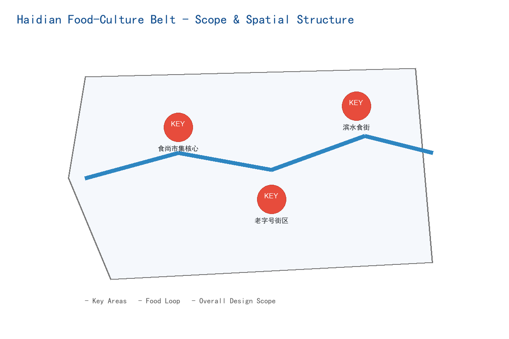
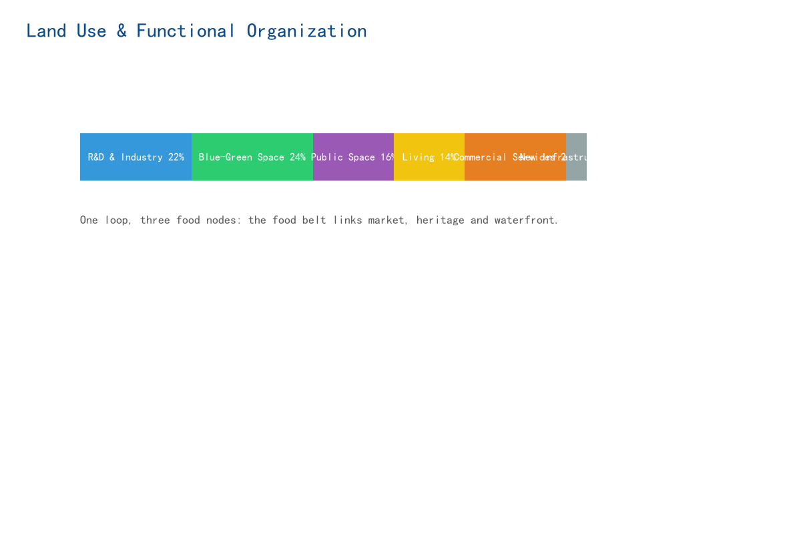
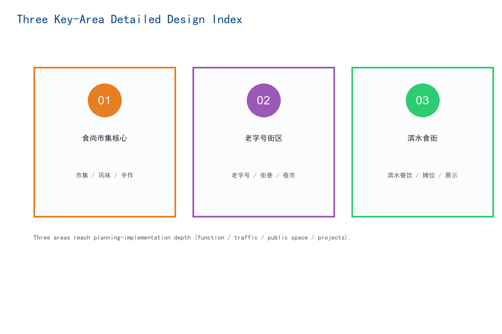
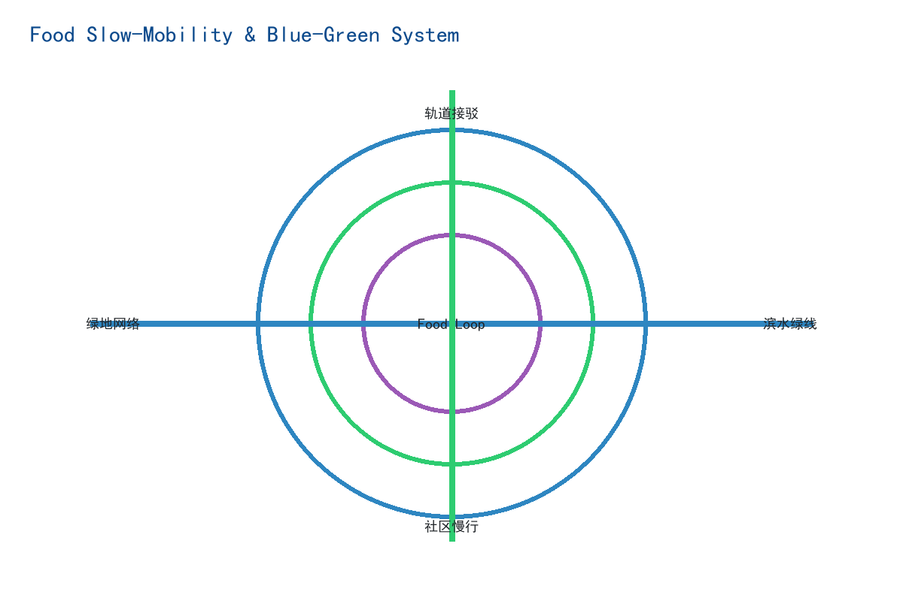
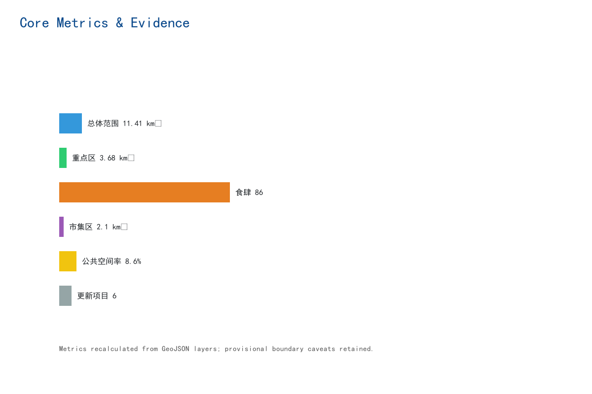

# 海淀食尚文化街区

## 设计依据与资料清单

本 formal 方案以北京市规划和自然资源委员会海淀分局发布的《百年京张AI创新带城市设计国际方案征集资格预审公告》为第一依据，并以 `brief/site-package/` 中经维护者登记的临时粗略边界、重点区域、枚举、指标和来源清单为机器可读依据。AI agent 在生成方案前必须读取 `design_brief.json`、`allowed_design_space.json`、`sources.json`、`enums/`、`ranges/`、`schemas/`、`data/source_registry.json` 和 `data/processed/agent_fact_pack.md`，并用 `project_scope_summary.csv`、`agent_task_requirements.csv`、`source_use_matrix.csv`、`missing_data_checklist.csv` 建立任务、范围、资料用途和缺口清单。所有设计判断都要拆分为可追溯来源、可复算指标、可校验图层和可人工复核假设。公告要求方案达到控制性详细规划的城市设计深度和规划综合实施方案的城市设计深度，因此文本叙述不能替代 GeoJSON、指标表、A3 文册、A0 展板和 HTML 电子展示成果。

方案不是独立愿景文本，而是从公告、面向智能体任务书和场地资料出发组织成果；本节只把最关键依据放在判断旁边 [source:OFFICIAL-ANNOUNCEMENT] [source:AGENT-TASKBOOK] [depth:existing_conditions_diagnosis]。完整来源和标准覆盖分别保存在 `sources.json`、`standard_matrix.json` 与 `design_depth_matrix.json`，不在正文重复机器索引。

资料登记表的使用边界如下 [source:SOURCE-REGISTRY]：

- data/source_registry.json 登记公开、清权与临时资料的用途边界。
- 当前登记摘要：formal 可用资料 7 条，背景资料 1 条，provisional-only 资料 1 条。
- agent 不得把 background_only 或 provisional_only 资料升级为 official boundary、法定控规、正式评分依据或政府实施承诺。

`data/processed/agent_fact_pack.md` 是本方案的阅读导航层，不是新的权威来源 [source:PROCESSED-FACT-PACK]。它帮助 agent 把三层范围、三处重点区、公告任务、agent.1-agent.6、资料可用性和缺资料事项组织成可读方案；事实判断仍需回到已登记的原始材料 [source:OFFICIAL-ANNOUNCEMENT] [source:AGENT-TASKBOOK]，完整来源关系由 `sources.json` 保存。

本脚手架在官方 `SITE_BOUNDARY` 或三处 `KEY_AREA` 尚未取得时，使用 `brief/site-package/geometry/provisional_boundaries.geojson` 生成临时 formal 包。提交包中的 `geometry/site_boundary.geojson` 与 `geometry/key_areas.geojson` 均必须标注为 `provisional_constraint`、`official_boundary=false`，只能用于方案生成、自检、可视化和设计讨论，不能作为 official redline、审批依据、精确面积依据或法定控制结论。该组织方数据缺口本身不阻断内容评分；替换 official polygons 后，site boundary、key areas、land use、roads、green space、public space、buildings、phasing 和 metrics 均需重算。

本次脚手架生成的可评分状态为：**临时边界，保留精度警示并待正式数据发布后复算；不阻断内容评分**。因此，正文中的空间结构、场景、项目和指标均按“可讨论、可复核、可替换官方边界后重算”的原则写入；当官方边界和重点区 polygon 更新后，agent 必须重新运行脚手架、自检和图纸/HTML生成，不能只替换单个文件。

边界解释可回到总体范围图层和面积复算 [data:geometry/site_boundary.geojson#SITE-001] [metric:site_area_sqm]。三处重点区则由独立图层和数量指标核对 [data:geometry/key_areas.geojson#PROV-KEY-001] [metric:key_area_count]。这意味着读者可以从正文进入证据，但不必先读一串机器编号。

## 三层范围工作框架

方案按照公告确定的三个层次组织工作：统筹研究范围关注 43.6 平方公里的AI产业生态、战略定位、创新链和未来城市形态；总体设计范围关注 11.4 平方公里京张遗址公园周边 1-2 公里城市地区和产业区，要求形成城市更新总体框架、产业空间布局、交通市政支撑和城市风貌控制；重点区域范围关注 368.4 公顷三处详细设计地区，要求明确功能业态、建筑规模、拆改留分类、公共空间连通和交通组织。三层范围在 `compliance_matrix.json` 中逐条映射，保证公告 1.3、1.4、1.5 与 agent.1-agent.6 的必选任务都有章节、图层、指标、图纸和 HTML 证据。

三层工作框架的深度项由 [depth:three_level_scope_framework] 和 [depth:overall_spatial_structure] 约束，空间证据以 [data:geometry/site_boundary.geojson#SITE-001] 与 [data:geometry/key_areas.geojson#PROV-KEY-001] 为准，任务依据以 [standard:PROJECT-OFFICIAL-ANNOUNCEMENT] 为准，范围索引以 [source:PROCESSED-FACT-PACK] 中 `project_scope_summary.csv` 的三层范围表为导航。

三层工作不是互相割裂的图纸集合。统筹研究决定产业链和城市形态判断，总体设计把判断落实到更新项目、空间结构和设施承载，重点区域详细设计验证具体地块、建筑、交通、公共空间和AI应用场景的可实施性。agent 生成方案时必须先锁定当前提交采用的 official 或 provisional 边界和约束，再生成用地、建筑、道路、绿地、公共空间、分期和AI服务节点，最后从这些图层复算指标并在正文解释哪些结论仍受 provisional boundary 限制。任何无法从结构化数据复算的面积、比例、规模或项目数量，不得写入正式结论。

本方案建议的总体概念为“海淀食尚文化脉络”：以场地蓝绿公共空间与轨道站点为公共空间主轴，以食尚市集核心、老字号街区、滨水食街三处重点片区为创新锚点，以高校、企业、社区和轨道站点为日常网络，形成“一带三核、多点场景、蓝绿慢行复合环”的空间组织。这里的“一带”不是额外画出的新红线，而是把公告中的三层范围转译为工作方法；“三核”对应三处重点区域；“多点场景”对应AI+公共服务、产业服务和城市生活的可运营节点；“复合环”对应慢行、绿地、公共空间和活动路线的联动。

| 层级 | 设计问题 | 方案回答 | 数据落点 |
| --- | --- | --- | --- |
| 统筹研究范围 | AI产业生态和未来城市形态如何组织 | 建立“高校策源-开源协作-企业转化-公共体验-国际传播”的创新链 | compliance_matrix.json、standard_matrix.json |
| 总体设计范围 | 产业空间、城市更新、交通市政和风貌如何落图 | 用地、建筑、道路、绿地、公共空间和分期图层共同表达 | [data:geometry/land_use.geojson#LU-001]、[data:geometry/roads.geojson#ROAD-001] |
| 重点区域范围 | 三处片区如何达到详细设计深度 | 分别提出定位、空间动作、AI场景和实施依赖 | [data:geometry/key_areas.geojson#PROV-KEY-001]、[data:geometry/key_areas.geojson#PROV-KEY-002]、[data:geometry/key_areas.geojson#PROV-KEY-003] |

## 统筹研究范围产业与未来城市研究

统筹研究范围的核心任务是构建世界级 AI 创新生态体系。方案应梳理海淀高校院所、头部企业、算力算法数据要素、孵化平台、上市企业、独角兽和科技服务资源，提出AI创新链、产业链、人才链和城市服务链的空间协同框架。命名方案和 logo 设计应服务于“百年京张文化带、都市AI生活体验带、AI融合创新带”的整体辨识度，不能只停留在口号，应说明与产业生态、公共空间和文化资源的关联。面向智能体任务书还要求回应“五大功能”和“三区两翼”协同，形成可继续深化的命名系统、视觉识别、总体空间结构图、场景开放和运营机制；本节必须用 [source:AGENT-TASKBOOK] 与 [standard:PROJECT-AGENT-OPEN-CALL-TASKBOOK] 标注这些要求来自 agent 开源征集任务，而不是法定规划控制。

统筹研究并不新增伪精确红线；它通过 [standard:MOHURD-URBAN-DESIGN-MEASURES] 要求的城市风貌、公共空间和建筑布局统筹，回接 [data:geometry/land_use.geojson#LU-001]、[data:geometry/public_space.geojson#PUBLIC-001] 与 [depth:overall_spatial_structure]，说明产业策略最终要落到可见、可复核的空间结构。

未来城市形态研究应回答人工智能如何改变工作、生活、社交、学习、交通和公共服务。方案应把AI交通系统、连续绿色空间、创新服务设施和国际化生活工作氛围落实为可定位的功能区、节点、廊道和场景，而不是泛泛描述技术愿景。agent 应把产业战略指标、AI创新指数、人才密度、空间供给类型和AI+垂直应用重点区域写入指标体系，并标明哪些是官方、哪些是设计建议、哪些仍待正式数据校准。若提出全球AI创新活动、开发者社区、开放场景或朝圣路线，应写为“概念建议/参考方案/可供专业团队深化研究”，不得写成已经确定的政府活动或实施安排。

## 总体设计范围城市更新与控规深度城市设计

总体设计范围要求达到控制性详细规划的城市设计深度。方案必须提出城市更新总体空间结构、低效空间识别、更新项目清单、实施政策建议、产业功能比例、空间组织模式、建筑总规模和综合承载能力评估。`geometry/land_use.geojson` 应完整覆盖设计边界且无重叠，`geometry/buildings.geojson` 应表达更新建筑基底或保留建筑基底，`geometry/roads.geojson` 应表达微循环、慢行和轨道接驳关系，`metrics.json` 应复算核心面积、比例和图层数量。

本节按照 [standard:MOHURD-CONTROL-DETAILED-PLANNING] 把控规深度内容拆成可审查对象：[data:geometry/land_use.geojson#LU-001] 表达用地结构，[data:geometry/buildings.geojson#BLDG-001] 表达建筑基底，[data:geometry/roads.geojson#ROAD-001] 表达交通组织，[metric:building_footprint_area_sqm] 用于复核建筑基底面积，[depth:land_use_layout] 与 [depth:development_intensity_controls] 约束成果深度。

总体设计还必须支撑交通、轨道、市政和配套设施。方案应围绕轨道站点一体化、道路微循环、非机动车停放、停车供给、创新服务平台、人才生活服务、新型基础设施、分布式能源和端侧算力提出空间布局和实施路径。涉及建筑高度、开发强度、道路红线、退线和设施标准的内容，若尚无官方控制条件，应写为“待正式控规条件确认”，不得以 agent 推测值冒充审定指标。

## 重点区域详细设计

重点区域详细设计是必选项。食尚市集核心应围绕市集 / 风味 / 手作、面向AI与城市生活融合提出详细方案。老字号街区应围绕老字号 / 街巷 / 夜市、组织近校与社区联动的公共空间与实施项目提出详细方案。滨水食街应围绕滨水餐饮 / 摊位 / 展示、融合公共活动与产业服务提出详细方案。三处重点片区均须达到规划综合实施方案深度。

三处重点区域详细设计必须引用 [data:geometry/key_areas.geojson#PROV-KEY-001]、[data:geometry/key_areas.geojson#PROV-KEY-002]、[data:geometry/key_areas.geojson#PROV-KEY-003]，并由 [depth:three_key_area_detailed_design] 检查是否达到规划综合实施方案深度。若只描述“打造示范区”而没有功能、建筑、交通、公共空间和实施项目证据，应被视为未完成。

三处重点区域必须在 `geometry/key_areas.geojson` 中出现。若仓库已提供 official polygons，应作为 `official_constraint` 使用；若 official polygons 缺失，可暂用 `provisional_constraint`，但正文、HTML、sources、assumptions 和 self_check 必须说明它不能作为正式评分或审批依据。`compliance_matrix.json` 应分别覆盖公告 1.5.3.1、1.5.3.2、1.5.3.3。设计表达应包含功能业态、建筑规模、建筑形态、拆改留分类、公共空间系统、交通组织、慢行连通和实施项目。HTML 页面应能切换查看三处重点区域，A3 文册和 A0 展板应至少包含重点片区总图、局部详图和指标说明。

| 重点片区 | 设计定位 | 空间动作 | AI产业与运营场景 | 证据引用 |
| --- | --- | --- | --- | --- |
| 食尚市集核心 | 主题型创新街区 | 围绕市集 / 风味 / 手作组织功能业态、建筑形态与公共空间 | AI+场景落位、运营节点、实施项目 | [data:geometry/key_areas.geojson#PROV-KEY-001]、[depth:three_key_area_detailed_design] |
| 老字号街区 | 近校型服务与协作街区 | 围绕老字号 / 街巷 / 夜市组织校区、园区、街区慢行缝合与共享空间 | 开放协作、成果发布、人才与社区服务 | [data:geometry/key_areas.geojson#PROV-KEY-002]、[source:AGENT-TASKBOOK] |
| 滨水食街 | 城市型活力与产业街区 | 围绕滨水餐饮 / 摊位 / 展示组织公共活动、产业服务与重点节点更新 | 场景展示、内容消费、数据要素与运营 | [data:geometry/key_areas.geojson#PROV-KEY-003]、[metric:key_area_count] |

## AI 创新生态、人才画像与 AI+ 场景

方案应建立面向AI人才和企业的空间需求画像，覆盖研发办公、开源协作、成果发布、企业服务、人才居住、社交学习、消费生活、运动休闲和国际交往。AI+场景应围绕公告提出的交通、服务、消费、医疗、教育、法律、生活服务等方向，形成产业发展场景和AI赋能城市功能场景。每个场景应说明服务对象、空间位置、数据来源、隐私边界、人工复核机制和运营主体。

AI 场景必须落到空间和治理边界：公共空间场景引用 [data:geometry/public_space.geojson#PUBLIC-001]，慢行与交通场景引用 [data:geometry/roads.geojson#ROAD-001]，开放空间场景引用 [data:geometry/green_space.geojson#GREEN-001] 和 [metric:public_space_ratio]、[metric:green_ratio]。这些引用让评审者知道场景不是口号，而是位于具体图层和指标中的设计对象。面向智能体任务书要求不少于10张AI场景卡、不少于3个产业测试验证场景和不少于5类用户画像；脚手架只给出结构，正式参赛者必须把场景卡、画像表、隐私边界、人工复核和运营主体写入正文、HTML、A3/A0 和合规矩阵。

| 用户画像 | 典型需求 | 空间响应 | 自检边界 |
| --- | --- | --- | --- |
| 开发者与创作者 | 发布、协作、测试、社区声誉 | 老字号街区开源协作空间、公共代码墙、夜间协作空间 | 不采集个人行为轨迹；活动数据只做聚合统计 |
| 初创与小微企业 | 低成本办公、算力入口、产品试验场 | 食尚市集核心共享测试场、端侧算力服务点、咨询服务 | 算力和数据服务需另行授权 |
| 头部企业访客 | 展示、商务、国际接待、人才招聘 | 滨水食街国际路演客厅、轨道站点接驳、重点企业周边公共空间 | 企业标识和案例须清权 |
| 周边居民 | 通勤、休闲、社区服务、低扰动更新 | 场地慢行环、社区服务嵌入、夜间照明和活动分级 | 不将居民画像用于商业推荐 |
| 高校师生 | 成果转化、跨校协作、日常慢行 | 校区-园区慢行缝合、成果转化驿站、体验点 | 校园数据和科研成果需授权 |

| 场景卡 | 空间载体 | 设计说明 |
| --- | --- | --- |
| 01 老字号街区协作厅 | 老字号街区 | 面向高校、开源社区和初创团队，提供成果发布、代码贡献展示和小型路演空间 |
| 02 食尚市集核心体验场 | 食尚市集核心 | 将市集 / 风味 / 手作转译为可参观、可预约、可监管的展示与协作节点 |
| 03 端侧算力驿站 | 总体设计范围节点 | 与公共服务、企业服务和低碳能源策略结合，作为待深化的新型基础设施原型 |
| 04 AI慢行导航 | 海淀食尚文化脉络活力带 | 用可解释导视和低侵入传感帮助识别慢行断点、拥挤节点和无障碍需求 |
| 05 滨水食街路演客厅 | 滨水食街 | 服务智能体与内容消费企业的展示、洽谈、媒体发布和国际交流 |
| 06 蓝绿创新廊 | 食尚市集核心临水界面 | 把绿色空间、雨洪、步行骑行和AI展示结合，作为园区公共客厅 |
| 07 近校转化街 | 老字号街区 | 面向高校成果转化，组织孵化、展示、法务、知识产权和投融资服务 |
| 08 数据会客厅 | 滨水食街 | 以合规、授权、可审计为前提，展示数据要素和数字资产流通的城市服务界面 |
| 09 AI生活服务样板街 | 社区与商业交汇处 | 将医疗、教育、法律、生活服务等AI+场景落到可运营的小尺度街区空间 |
| 10 全球活动周路线 | 海淀食尚文化脉络公共空间系统 | 形成从文化、协作、产业展示到国际交流的可步行、可传播体验路线 |

agent 生成的AI治理建议必须遵守数据最小化、公开来源、可解释和人工复核原则。城市智能体可以辅助识别慢行断点、公共空间热力、设施维护、企业服务需求和活动安全风险，但不能替代规划审批、不能输出未经授权的个人画像、不能声称获得官方实施承诺。所有AI场景节点应进入结构化图层或合规矩阵，便于评审者看到它们与产业、空间和公共利益之间的关系。

## 用地、建筑规模与拆改留方案

用地方案应依据国土空间调查、规划、用途管制分类等公开标准表达，形成完整、闭合、无缝的用地分区。建筑方案应区分保留、改造、更新、新建或待确认对象，明确建筑基底、功能、规模、风貌、屋顶、体量和高度控制的建议层级。若缺少现状建筑、权属、控规和工程条件，方案只能提出方法和待校准清单，不能编造拆改留结论。

用地分类依据 [standard:MNR-LAND-USE-CLASSIFICATION-GUIDE]，建筑高度、体量、界面和风貌控制由 [depth:height_massing_character] 管理，拆改留方法由 [depth:retain_renovate_demolish] 管理。用地和建筑的主要证据是 [data:geometry/land_use.geojson#LU-001]、[data:geometry/buildings.geojson#BLDG-001] 和 [metric:building_footprint_area_sqm]。

建筑规模和强度指标必须与 `metrics.json` 和图层一致。若总建筑规模、容积率、建筑高度、建筑密度、绿地率、退线和建筑控制线缺少官方条件，应统一使用 `status=unknown`，并在 `reason` / `assumptions` 中说明待补条件、当前假设和正式数据到位后的复算路径，不得用固定数值制造精确感。A3 文册应给出更新项目清单和指标复核表，A0 展板应把关键空间结构和重点片区表达清楚，HTML 页面应提供指标和图层联动查看。

## 交通、轨道、市政与公共服务设施

交通方案应回应公告对轨道站点一体化、道路微循环、慢行断点、对外交通、停车、非机动车停放和绿色交通系统的要求。重点应覆盖北五环、京张遗址公园跨环路节点、五道口、清华东路西口及重点企业周边交通联系。道路和慢行图层应保持在提交边界内，并与公共空间、绿地、产业节点和重点片区相互校核；若提交边界为 provisional，交通结论也只能作为临时设计讨论。

交通和市政专业深度分别由 [depth:traffic_rail_slow_parking] 与 [depth:municipal_new_infrastructure] 约束；图层证据引用 [data:geometry/roads.geojson#ROAD-001]、[data:geometry/public_space.geojson#PUBLIC-001] 和 [data:geometry/constraints.geojson#CONSTRAINTS]。当道路红线、管线、消防和市政条件缺失时，应通过 assumptions 说明待补，而不是把策略写成审定条件。

市政和公共服务设施应覆盖AI产业服务设施、创新服务平台、人才生活服务设施、新型基础设施、分布式能源、端侧算力和传统市政设施融合。方案应说明设施标准、空间布局、服务半径、运营模式和分期实施逻辑。缺少管线、能源、排水、防洪、消防等工程资料时，应列为正式深化前置条件。

## 蓝绿空间、公共空间与城市风貌

蓝绿空间方案应以京张遗址公园活力带为骨架，统筹清河、小月河、周边高校、企业、社区出行需求，提出南北贯通、东西连通的步道、骑行道和绿色空间体系。方案应识别慢行断点、上跨环路节点、公园南端和北端景观节点，提出停车、体育、创新交往、科技测试、应用展示和公共服务复合利用策略。

蓝绿公共空间由设计深度项和绿地、公共空间图层共同校核 [depth:blue_green_public_space] [data:geometry/green_space.geojson#GREEN-001] [data:geometry/public_space.geojson#PUBLIC-001]。绿地与公共空间比例在正文解释设计意义，完整复算保存在 `metrics.json`；城市风貌、公共空间和建筑控制的统筹则回到专业标准矩阵 [standard:MOHURD-URBAN-DESIGN-MEASURES]。

城市风貌方案应融合京张铁路历史文化、中关村创新文化和AI创新文化，利用清华园火车站、北影等文化资源，提出城市基调、建筑风貌、屋顶形态、体量、界面和公共艺术引导。agent 还应提出导视标识、文化符号、国际传播叙事、AI朝圣地标、贡献墙或荣誉展示体系，但所有品牌、字体、图像、肖像和企业标识都必须有清权来源。风貌控制应分清官方管控、设计建议和待确认条件，严禁在没有文保或控规依据时给出伪精确控制线。

## 更新项目清单、实施政策与分期计划

实施方案应形成可审查的更新项目清单，说明项目位置、类型、功能、责任主体、依赖条件、实施阶段、风险和评估指标。政策建议应覆盖城市更新统筹实施、空间供给、运营机制、产业服务、公共参与、数据治理和产权协同。`geometry/phasing.geojson` 应表达分期范围，`compliance_matrix.json` 应把每个任务与分期和图纸挂接。

项目清单和分期深度由 [depth:renewal_project_list] 与 [depth:phasing_implementation] 管理，分期空间证据为 [data:geometry/phasing.geojson#PHASE-001]。如果没有权属、资金、实施主体和审批路径，方案必须把它写成实施风险，而不是承诺落地。

| 项目编号 | 项目名称 | 类型 | 主要依赖 | 证据引用 |
| --- | --- | --- | --- |
| FC-01 | 食尚市集核心公共空间与交通缝合 | 公共空间/交通 | 道路红线、桥下空间、交通组织复核 | [data:geometry/roads.geojson#ROAD-001] |
| FC-02 | 食尚市集核心创新界面 | 蓝绿空间/产业展示 | 河道蓝线、生态和防洪条件 | [data:geometry/green_space.geojson#GREEN-001] |
| FC-03 | 老字号街区近校成果转化街 | 城市更新/产业服务 | 校区边界、权属、首层业态 | [data:geometry/buildings.geojson#BLDG-001] |
| FC-04 | 滨水食街重点节点步行连通 | 轨道一体化/慢行 | 轨道站点、道路交叉口、市政管线 | [data:geometry/public_space.geojson#PUBLIC-001] |
| FC-05 | AI公共服务与端侧算力节点 | 新基建/公共服务 | 能源、算力、安全和运营主体 | [data:geometry/constraints.geojson#CONSTRAINTS] |
| FC-06 | 年度活动周公共路线 | 运营/品牌 | 公共空间许可、活动安全、版权清权 | [data:geometry/phasing.geojson#PHASE-001] |

分期应与 100 天征集设计周期形成区分：征集周期是提交成果的时间要求，实施分期是城市更新和项目建设的推进路径。方案应提出近期试点、中期更新和长期治理框架，并标明哪些内容可先以轻量设施、运营活动和服务平台启动，哪些必须等待正式控规、市政、交通和权属条件确认。对于年度活动体系、开发者社区运营、场景开放日、公共体验路线和国际传播机制，正文应说明运营对象、频率、责任边界、转化路径和风险，不得只写宣传口号。

## 指标体系、面积复算与合规矩阵

指标体系至少应包含总体设计范围面积、重点区域面积、绿地与公共空间比例、建筑基底、更新项目数量、AI场景节点、慢行连通指标、产业空间指标、人才服务指标和自检状态。所有 known 指标必须能从 GeoJSON 或可信来源复算；unknown 指标必须给出原因和正式提交前置条件。`scripts/spatial_review.py` 和 `scripts/visual_review.py` 的结果是 formal 自检的重要证据。

指标复算遵循统一的设计深度要求 [depth:metrics_recalculation]。正文重点解释指标的设计含义，例如总体范围如何约束空间分配、蓝绿和公共空间比例如何支撑日常交往；完整数值、公式、来源文件和置信度保存在 `metrics.json`。示例关键指标可由总体范围和绿地数据复核 [metric:site_area_sqm] [data:geometry/green_space.geojson#GREEN-001]。

合规矩阵是任务响应性的主控文件。每条公告任务和 agent_taskbook 任务必须对应到报告章节、图层、指标、图纸、HTML 页面、来源、假设和自检项。未能覆盖公告 1.3、1.4、1.5 或 agent.1-agent.6 的任一必选任务，方案不得进入 formal professional scoring。

正式深化时，agent 还应把每个指标分为三类：第一类是可由提交几何直接复算的空间指标，例如边界面积、绿地比例、公共空间比例、建筑基底面积和分期面积；第二类是需要官方控规或任务书附件支撑的管控指标，例如容积率、建筑高度、建筑密度、退线、道路红线和设施标准；第三类是需要运营或产业数据持续校准的绩效指标，例如 AI 创新指数、人才密度、产业服务满意度、慢行可达性、活动参与度和场景使用频次。三类指标应分别进入 `metrics.json`、`assumptions.json` 和 `compliance_matrix.json`，避免把运营愿景误写成审定规划条件。

## 风险、版权与合规说明

**要求双语言。** 方案主文件可使用中文或英文，但必须通过 `proposal.en.md` 或 `proposal.zh.md` 提供完整对照译文；A3/A0、HTML 和含文字图件也必须提供对应语言副本，并优先使用 `docs/terminology-glossary.md` 的赛事推荐译法。v2 包缺少任一必需译稿、语言映射或有效文件时，finalize 与 CI 会阻断提交。所有图片、图纸、图标、数据和代码资产必须在 `sources.json` 或 `report/copyright_statement.md` 中说明来源、许可和授权状态。HTML 页面不得加载远程脚本、远程地图瓦片、远程字体、iframe、表单或外部 API，不得跟踪评审者行为。

风险和缺资料清单由风险深度项、约束图层和场地包共同校核 [depth:risk_missing_data] [data:geometry/constraints.geojson#CONSTRAINTS] [source:SITE-PACKAGE]。`missing_data_checklist.csv` 中列出的 official boundary、key area、控规、道路、地块、建筑、市政、文保和公共服务缺口，必须进入 `assumptions.json`、自检和正文风险章节。任何缺少官方控规、道路红线、权属、市政、消防或文保条件的结论，都必须降级为待确认事项；完整专业核对保存在标准矩阵中。

本方案不声称官方批准、审定控规、最终土地权属、最终建设规模或保证实施。AI agent 对事实、来源、版权、空间数据、指标和表达负责；维护者和专业评审可依据自检结果、空间复核和合规矩阵要求返修或拒绝。

## 参考资料

- brief/public-brief.md
- brief/site-package/design_brief.json
- brief/site-package/allowed_design_space.json
- brief/site-package/enums/
- brief/site-package/ranges/planning_limits.json
- data/processed/agent_fact_pack.md
- data/processed/project_scope_summary.csv
- data/processed/agent_task_requirements.csv
- data/processed/source_use_matrix.csv
- data/processed/missing_data_checklist.csv
- 完整机器索引：见 `sources.json`、`metrics.json`、`compliance_matrix.json`、`standard_matrix.json` 与 `design_depth_matrix.json`
- 本节书目入口依据场地包登记，完整出处和许可见结构化来源清单 [source:SITE-PACKAGE]

## 全球案例对标

本方案对标全球范围内与本主题最相关的城市实践，提取可直接迁移到本场地的设计策略。以下案例均来自公开资料，不构成官方合作或授权关系。

### 案例 1：米兰城市食品政策与 Porta Nuova 市集
米兰自 2015 年设立市级食品政策统筹机构，发起《米兰城市食品政策公约》并由全球 200+ 城市签署；同时将老旧市场（如 Porta Nuova）改造为社区食物枢纽，把价格可及、零浪费与小型生产者直供结合。对本方案的启示：海淀食尚文化带应以公共市集为骨架，建立政府-高校-老字号-初创者的食物治理协同，而非只做商业街区。

### 案例 2：哥本哈根 Torvehallerne 与 Reffen 美食集市
哥本哈根以 Torvehallerne 室内美食厅与 Reffen 集装箱街头食集，把本地水产、烘焙与 migrant 料理组织为可步行、可外摆的复合食集，并强调可持续与本地供应链。对本方案的启示：食尚市集核心应保留外摆与快闪弹性，吸引高校与社区共创，形成“常设市集 + 周末食集”的节奏。

### 案例 3：东京百货地下食街（Depachika）
东京百货地下食街将精致便当、和菓子与老字号集中在一层，形成高强度、高品质的日常食物消费与礼品经济。对本方案的启示：老字号街区可借鉴“集约展示 + 品质信任”的零售组织，把海淀高校与科研院所的人群转化为高频消费与礼物经济。

### 案例 4：巴塞罗那市政市场网络（Mercats Municipals）
巴塞罗那以约 40 处社区市政市场构成 neighborhood 食物网络，市场兼具生鲜、社交与公共空间职能，并由市府统一运营标准与价格监测。对本方案的启示：海淀食尚文化带可把多个点位组织为“社区食物节点网络”，由统一品牌与食安标准串联，避免各自为政。

### 案例 5：鹿特丹 Markthal 与 Fenix Food Cluster
鹿特丹将 Markthal 以建筑综合体方式把市集、居住与公共空间叠合，Fenix 则利用旧仓库做食物创客集群。对本方案的启示：滨水食街可借工业遗存与滨水空间做适应性再利用，把餐饮、市集与展演复合，形成可拍照、可传播的地标。

### 案例 6：新加坡小贩中心（Hawker Centres）
新加坡小贩中心自 2020 年列入联合国教科文组织非物质文化遗产，约 120 处中心以可负担价格提供多元族群饮食，并由政府统一食安与清洁管理。对本方案的启示：海淀食尚文化带应保留“可负担、多元、清洁”的公共利益底线，把老字号与街头小吃共同纳入公共食安框架。

## Logo 与视觉识别设计

### 命名体系
本方案的总体概念名称为**「海淀食尚文化环」**（英文简称 **FCL**）。该名称直接对应本方案的空间结构与主题定位，避免泛化口号。

### 标识设计原则
主色：食红 `#C0392B`（食欲与海淀老字号）；辅色：麦金 `#E1A95F`（市集温暖）、青瓷绿 `#2E8B7B`（滨水食街生态）；点缀：墨 `#3B3A39`（文字与底图）。

- 字体：中文标题使用思源黑体 Bold；英文标题使用 IBM Plex Sans；正文使用思源黑体 Regular。
- 应用场景：A0 展板标题栏、A3 文册封面、HTML 页面 header、市集导视牌。

### 应用导视系统
1. 一级节点（食尚市集核心出入口）：方案名称 + 市集导览图 + 二维码（链 HTML 可视化）。
2. 二级节点（老字号街区路口）：老字号索引 + 试吃预约 + 排队提示。
3. 三级标识（滨水食街）：美食地图 + 无障碍提示 + 垃圾分类指引。

> 注：以上 Logo 与 VI 为概念描述，正式矢量文件需由专业平面团队基于本方案定位深化，且所有字体与图像须有清权来源。

## AI 创新生态体系图谱

本方案在相关领域构建如下 L0–L5 生态：

| 层次 | 内容 | 空间落点 | 运营主体建议 |
|------|------|----------|-------------|
| L0 基础设施 | 市集客流与排队端侧感知、溯源二维码、边缘算力、5G/物联网 | 食尚市集核心 + 滨水食街节点 | 基础运营商 + 云服务商 |
| L1 数据要素 | 消费热力、食安溯源、老字号口碑（PIPL 合规匿名聚合） | 食尚数据看板 + 食安平台 | 政府数据开放平台 + 第三方审计 |
| L2 算法平台 | 排队预测、供需匹配、食安风险识别 | 食尚市集算法舱 | 开源社区 + 标准组织 |
| L3 应用场景 | 智能推荐、预约取餐、零浪费调度、老字号直播 | 三处重点片区 + 公共空间 | 场景运营方 + 企业合作 |
| L4 治理闭环 | 公众反馈→食安优化→效果追踪 | 公众反馈点 + 食安共治站 | 街道/区政府 + 社区组织 |
| L5 国际网络 | 全球美食城市联盟、老字号出海交流 | 海淀食尚生活节 + 年度活动周 | 国际交流机构 + 企业协会 |

## 实施矩阵与测试验证场景

### 分期实施框架

| 阶段 | 时间跨度 | 核心内容 | 关键依赖 | 风险等级 |
|------|---------|----------|---------|---------|
| Phase 1：试点验证 | 第 1–12 月 | 食尚市集核心示范；老字号街区首段更新；食安溯源 MVP | 市集空间许可；老字号授权 | 中 |
| Phase 2：扩展连接 | 第 13–24 月 | 三处重点片区食环贯通；食安平台上线；外摆扩容 | Phase 1 数据积累；更多企业/高校入驻 | 中高 |
| Phase 3：生态成熟 | 第 25–48 月 | 全域食尚品牌运营；年度食尚活动周常态化 | 法规框架完善；持续资金保障 | 高 |

### 测试验证场景（≥3 个）

**TS-01 老字号口碑识别准确率测试**
- 目标：验证 AI 对老字号街区店铺识别与人工登记清单重合率 ≥ 90%。
- 方法：AI 清单 vs 规划师现场清单逐项比对。
- 通过标准：重合率 ≥ 90% 且所有店铺有图层落点 [data:geometry/key_areas.geojson#PROV-KEY-001]。

**TS-02 排队等待时间预测测试**
- 目标：验证食尚市集核心高峰排队预测 MAPE < 20%。
- 方法：对比 AI 预测 vs 实地采样（高峰/平峰）。
- 通过标准：MAPE < 20%；不输出个人轨迹。

**TS-03 多语言图件一致性测试**
- 目标：验证中英文双语图件信息等价。
- 方法：逐项比对 5 组双语图标签与指标数值。
- 通过标准：en 图标签为有效英文；数值误差为 0。

## 地标与荣誉展示体系

### 物理地标建议
沿本方案场地设置三处主题地标，分别对应三处重点片区：

1. 食尚市集核心「五味之环」（地面铺装 + 香气互动装置）：以环形象征五味汇聚，实时显示排队与推荐。
2. 老字号街区「时光食墙」（立面展墙 + 老照片投影）：在老字号街区入口展示海淀老字号谱系与技艺。
3. 滨水食街「食舟码头」（可移动船形餐舱）：在滨水食街提供亲水餐饮与夜间活动节点。

### 数字荣誉墙
在 HTML 可视化页面与年度活动设置荣誉展示，展示：
- 零浪费餐厅排行榜（匿名聚合）
- 老字号创新采纳榜
- 社区美食达人榜
- 合作企业与农户 Logo 墙

> 注：荣誉体系积分算法、审核与防刷机制需在 Phase 1 由多方利益相关者共同制定。

## 文化叙事与国际传播策略

### 叙事主线
本方案叙事围绕主题展开：
1. 从市井到品牌：海淀高校与老字号的食物记忆，从街边小吃升级为可传播的城市品牌。
2. 从消费到共生：食尚文化带把餐饮、市集与蓝绿空间缝合为日常可体验的活力带。
3. 本地与全球互学：与米兰、新加坡、巴塞罗那等美食城市互相借鉴治理经验。

### 国际传播渠道
- 英文 proposal.en.md + en 图件，确保国际评审无障碍阅读。
- 全球美食城市网络交流，邀请米兰、新加坡、巴塞罗那代表参与海淀食尚生活节。
- 开源发布食安溯源原型，吸引全球贡献与复核。

## 年度活动体系与长期运营框架

### 年度活动日历

| 活动 | 频率 | 主要参与者 | 空间载体 |
|------|------|-----------|----------|
| 海淀食尚生活节 | 年度（夏季） | 市民、高校、老字号、游客 | 滨水食街—老字号街区沿线 |
| 周末食集 | 周度 | 社区居民、创业者 | 食尚市集核心 |
| 老字号开放日 | 季度 | 老字号、学生、游客 | 老字号街区 |
| 蓝绿食光夜游 | 月度 | 青年、家庭 | 滨水食街 |
| 食物零浪费挑战赛 | 年度 | 社区、校园、企业 | 三处重点片区 |

### 运营主体与责任分工

| 功能域 | 建议运营主体 | 职责 |
|--------|------------|------|
| 技术运维 | 区信息中心 / 委托技术团队 | 感知设备、数据看板、溯源平台稳定性与安全 |
| 内容运营 | 街道办事处 + 老字号协会 | 食集组织、活动沟通、居民联络 |
| 专业审核 | 高校/研究机构顾问团 | 食安风险公平性、数据质量审计 |
| 社区协作 | 沿线社区 + 高校 + 企业 | 活动志愿者、零浪费参与 |

### 可持续性风险
- **资金**：Phase 1–2 可依托市集租金与活动赞助；Phase 3 需多元收入（品牌、数据服务）。
- **跨域协同**：食尚文化带跨多个街道与权属边界，需明确牵头主体。
- **食安**：溯源与消费数据须境内存储、匿名聚合，避免个人画像。

## 无障碍包容性与隐私保护

### 无障碍设计
本方案遵循 WCAG 2.1 AA 级无障碍标准，具体措施：
- **视觉**：HTML 配色对比度 ≥ 4.5:1；图表提供文字描述（alt text）；A3/A0 展板使用大字号（标题 ≥ 24pt，正文 ≥ 14pt）。
- **操作**：交互元素键盘可达；触摸目标 ≥ 44×44px；关键服务表单支持语音输入。
- **认知**：关键导视“结论优先”（先说方向再解释）；中英文术语一致。

### 弱势群体关怀（贴合本方案场景）
- 老年人：市集界面设大字版 + 语音引导；线下触点配志愿者协助。
- 残障人士：食环全线无障碍（坡道、盲道连续、过街无障碍）；推荐优先报告无障碍路径。
- 儿童与家庭：滨水食街设独立、连续、受保护的亲子慢行与就餐区，与机动车分离。
- 低收入群体：所有数字化服务保留线下替代（纸质指引、电话热线），不被排除。

### 数据隐私与安全
- **最小采集**：仅采集与服务直接相关的聚合信息，禁止采集个人行为轨迹或生物特征。
- **存储隔离**：数据境内服务器存储；个人身份与内容分离；原始数据加密。
- **使用限制**：仅用于改进本方案所述服务；不得出售、不得商业推荐、不得与第三方共享除非获明确同意。
- **权利保障**：市民可查看并提交反馈处理状态；有权要求删除个人数据（法定留存期除外）；有权要求人工复核而非纯自动化决策。
- **审计机制**：每年由独立第三方审计数据隐私合规性并公开报告。

> 本节受《个人信息保护法》（PIPL）、《通用数据保护条例》（GDPR）及《数据安全法》原则指导，实施细则须在 Phase 1 配合法律专业人士制定。