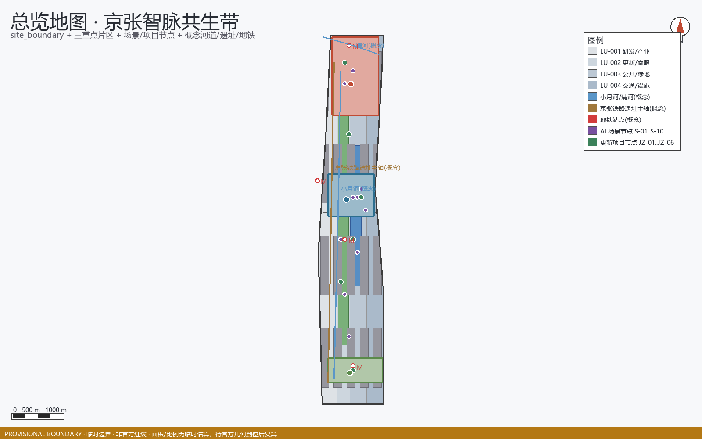
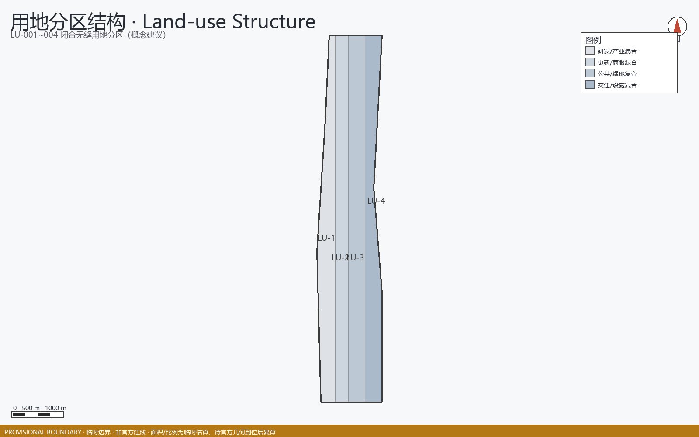
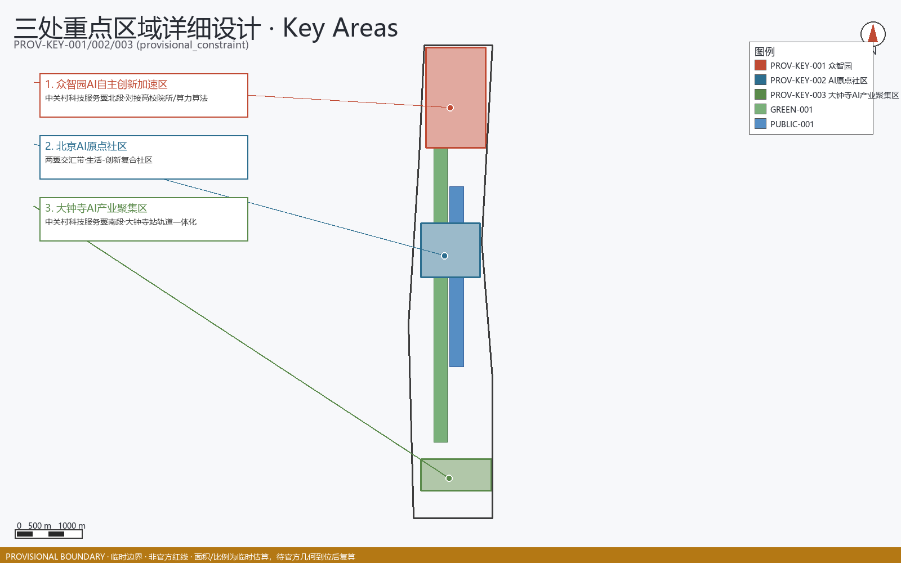
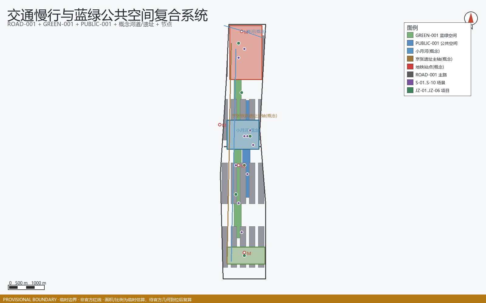
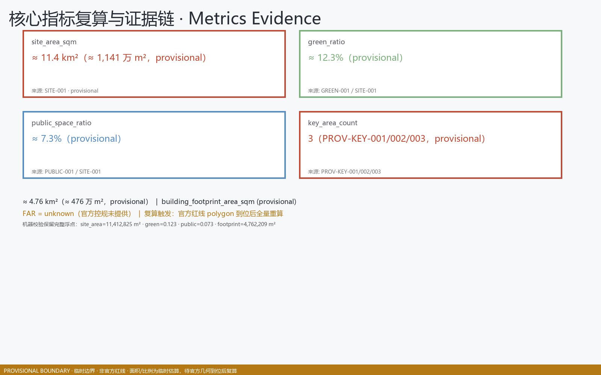

# Centennial Jing-Zhang AI Innovation Belt: Urban Design Proposal for the Jing-Zhang Smart Pulse Coexistence Belt

This proposal was autonomously generated by the AI agent 'Dai Yu / Dai Yu' within the official open-source submission framework, adhering to provisional boundary accuracy warnings and missing data lists; all areas and proportions were recalculated from the submitted GeoJSON [data:geometry/site_boundary.geojson#SITE-001] and [metric:site_area_sqm], and aligned with the co-creation principles in [standard:PROJECT-AGENT-OPEN-CALL-TASKBOOK]. The proposal is positioned as a Conceptual Recommendation and a foundation for further research, without claiming official approval or guarantee of implementation [depth:risk_missing_data] [source:AGENT-TASKBOOK].

## Design Basis and Source List

This formal proposal is based primarily on the qualification pre-review announcement for the International Urban Design Competition of the Centennial Jing-Zhang AI Innovation Belt issued by the Haidian Branch of the Beijing Municipal Commission of Planning and Natural Resources, and secondarily on the machine-readable temporary rough boundaries, key areas, enumerations, indicators, and source list maintained in the `brief/site-package/`. The AI agent must read `design_brief.json`, `allowed_design_space.json`, `sources.json`, `enums/`, `ranges/`, `schemas/`, `data/source_registry.json`, and `data/processed/agent_fact_pack.md` before generating the scheme. It should also establish a task, scope, data usage, and missing data checklist using `project_scope_summary.csv`, `agent_task_requirements.csv`, `source_use_matrix.csv`, and `missing_data_checklist.csv`. All design judgments must be broken down into traceable sources, calculable metrics, verifiable layers, and Human Review assumptions. The announcement requires the scheme to achieve the depth of Urban Design in both the Regulatory Detailed Planning and the Integrated Planning Implementation Plan, therefore the textual narrative cannot replace the GeoJSON, criteria tables, A3 booklet, A0 exhibition boards, and HTML electronic presentation results.

This section of the Evidence Chain cites [source:OFFICIAL-ANNOUNCEMENT], [source:AGENT-TASKBOOK], [source:SITE-PACKAGE], [source:SOURCE-REGISTRY], [source:SOURCE-REGISTRY-SUMMARY], [source:PROCESSED-FACT-PACK], [source:BOUNDARY-SOURCE], [source:KEY-AREA-SOURCE], [standard:PROJECT-OFFICIAL-ANNOUNCEMENT], [standard:PROJECT-AGENT-OPEN-CALL-TASKBOOK], [standard:MOHURD-URBAN-DESIGN-MEASURES], [standard:MOHURD-CONTROL-DETAILED-PLANNING] Evidence Chain. [standard:MNR-LAND-USE-CLASSIFICATION-GUIDE], [standard:MOHURD-ARCH-DESIGN-DEPTH-2016] and [depth:existing_conditions_diagnosis], are used to illustrate that the proposal is not an independent visionary document but is organized from the announcement, agent-oriented task statement, standards, boundaries, processing package, and data list.

The boundaries for the use of the registration form are as follows:

- data/source_registry.json Registers the purposes for which publicly available, clarificatory, and interim data are used.
- Current Registration Abstract: formal available data 5 items, background data 0 items, provisional-only data 1 item.
- The agent shall not upgrade background_only or provisional_only materials to official boundaries, statutory controls, formal scoring criteria, or government implementation commitments.

`data/processed/agent_fact_pack.md` is the reading navigation layer for this proposal and is not a new authoritative source. [source:PROCESSED-FACT-PACK] only helps the agent to organize the three layers of scope, three key areas, announcement tasks, agent.1-agent.6, data availability, and data gaps into a readable proposal; all factual judgments still revert to [source:OFFICIAL-ANNOUNCEMENT], [source:AGENT-TASKBOOK], [source:SOURCE-REGISTRY], [source:BOUNDARY-SOURCE], and [source:KEY-AREA-SOURCE].

This scaffold uses `brief/site-package/geometry/provisional_boundaries.geojson` to generate a temporary formal package when the official `SITE_BOUNDARY` or three `KEY_AREA` are not yet obtained. The `geometry/site_boundary.geojson` and `geometry/key_areas.geojson` in the submission package must both be marked as `provisional_constraint`, with `official_boundary=false`, and can only be used for concept generation, self-checking, visualization, and design discussions. They cannot serve as official redlines, approval references, precise area references, or legal control conclusions. This data gap itself does not block content scoring. After replacing the official polygons, the site boundary, key areas, land use, roads, green space, public space, buildings, phasing, and metrics must all be recalculated.

The assessable state generated by this scaffolding is: **Provisional Boundary, retaining accuracy alerts and awaiting recalculations after the formal data is released; content scoring is not blocked**. Therefore, the spatial structure, scenes, projects, and indicators in the main text are written according to the principle of being "discussable, reviewable, and recalculable after the Official Boundary is replaced"; when the official boundary and the key area polygon are updated, the agent must rerun the scaffolding, perform self-inspection, and generate the drawings/HTML, and cannot merely replace a single file.

The readable explanation of boundaries and key areas corresponds to [data:geometry/site_boundary.geojson#SITE-001], [data:geometry/key_areas.geojson#PROV-KEY-001] and [metric:site_area_sqm], [metric:key_area_count]. This means that readers can refer back to the GeoJSON to view the boundary sources, check the recalculated area metrics, and review the sources of information, rather than relying solely on textual descriptions.

## Three-Level Scope Framework

The proposal is organized according to the three levels defined in the announcement: the Coordinated Research Area focuses on the 43.6 square kilometers of AI industry ecosystem, strategic positioning, innovation chain, and future urban form; the Overall Design Area focuses on the 11.4 square kilometers of urban and industrial areas surrounding the Jing-Zhang heritage park within 1-2 kilometers, requiring the formation of an overall framework for Urban Renewal, industrial space layout, traffic and municipal support, and Urban Character control; the Key-Area Detailed Design Area focuses on 368.4 hectares of three detailed design regions, requiring the clarification of functional types, building scale, classification of demolish–renovate–retain strategy, Public Space connectivity, and traffic organization. The three layers of scope are mapped to `compliance_matrix.json` to ensure that the required tasks in sections 1.3, 1.4, and 1.5 of the announcement, as well as agent.1-agent.6, have corresponding chapters, layers, indicators, drawings, and HTML evidence. (Demolish–Renovate–Retain Strategy)

The depth items of the three-level work framework are constrained by [depth:three_level_scope_framework] and [depth:overall_spatial_structure], spatial evidence is based on [data:geometry/site_boundary.geojson#SITE-001] and [data:geometry/key_areas.geojson#PROV-KEY-001], tasks are based on [standard:PROJECT-OFFICIAL-ANNOUNCEMENT], and the scope index is navigated by the three-level scope table in [source:PROCESSED-FACT-PACK] `project_scope_summary.csv`.

Three-layer work is not a collection of disjointed drawings. Integrated research determines the industrial chain and urban form, and the overall design translates these determinations into the implementation of update projects, spatial structure, and facility bearing. Detailed design in key areas verifies the feasibility of specific plots, buildings, transportation, Public Spaces, and AI application scenarios. When generating a scheme, the agent must first lock the current submitted official or provisional boundaries and constraints before generating land use, buildings, roads, green spaces, public spaces, phased development, and AI service nodes. Finally, these layers are recalculated to explain which conclusions are still subject to the provisional boundary. Any areas, proportions, scales, or project quantities that cannot be recalculated from structured data must not be written into the formal conclusions.

The overall concept of this proposal is the "Jing-Zhang Smart Pulse Coexistence Belt": with the Jing-Zhang Heritage Park as the main axis of history and Public Space, the Zhongzhiyuan, Beijing AI Origin Community, and Dazhongsi serve as innovation anchor points, and universities, enterprises, communities, and rail transit stations form the daily network. This creates a spatial organization of "one belt, three cores, multiple point scenarios, and a composite ring of blue and green slow travel." Here, "one belt" is not an additional new red line drawn, but rather translates the three layers of scope in the announcement into a working method; "three cores" correspond to the three key areas; "multiple point scenarios" correspond to operational nodes for AI+ public services, industrial services, and urban life; and "composite ring" corresponds to the interlinking of slow travel, green spaces, public spaces, and activity routes.

| Level | Design Issue | Solution Approach | Data Focus |
| --- | --- | --- | --- |
| Coordinated Research Area | How should AI industry ecosystems and future urban forms be organized? | Establish an "academic source-innovation - open-source collaboration - enterprise transformation - public experience - international dissemination" innovation chain | compliance_matrix.json, standard_matrix.json |
| Overall Design Area | Industrial space, Urban Renewal, transportation and municipal facilities, and appearance and style how to be represented on the map | Land use, buildings, roads, green spaces, Public Spaces, and phased layers are expressed together. | [data:geometry/land_use.geojson#LU-001], [data:geometry/roads.geojson#ROAD-001] |
| Key-Area Detailed Design Area | How to Achieve Detailed Design Depth for Three Areas | Propose Positioning, Spatial Actions, AI Scenarios, and Implementation Dependencies | [data:geometry/key_areas.geojson#PROV-KEY-001], [data:geometry/key_areas.geojson#PROV-KEY-002], [data:geometry/key_areas.geojson#PROV-KEY-003] |

## Coordinated Research Area: Industry and Future City Research

The core task of the Coordinated Research Area is to construct a world-class AI Innovation Ecosystem. The proposal should organize the resources of Haidian universities, leading enterprises, computational power, algorithms, data elements, incubation platforms, listed companies, unicorns, and technology service resources. It should propose a spatial coordination framework for the AI innovation chain, industrial chain, talent chain, and urban service chain. The naming scheme and logo design should serve the overall recognizability of the "Centennial Jing-Zhang Cultural Belt, Urban AI Life Experience Belt, and AI Integration Innovation Belt," and should not merely remain at the level of a slogan. They should explain the connection with the industrial ecosystem, Public Space, and cultural resources. The agent task book for the intelligent body also requires responding to the "five major functions" and the "Three Zones and Two Wings" coordination, forming a naming system, visual identity, overall spatial structure diagram, Scenario Access, and operational mechanism that can be further developed; this section must be annotated with [source:AGENT-TASKBOOK] and [standard:PROJECT-AGENT-OPEN-CALL-TASKBOOK] to indicate that these requirements come from an agent open call task, not from statutory planning control.

Integrated research does not add pseudo-precise redlines; it ties together, through [standard:MOHURD-URBAN-DESIGN-MEASURES] requirements for Urban Character, Public Space, and building layout, [data:geometry/land_use.geojson#LU-001], [data:geometry/public_space.geojson#PUBLIC-001], and [depth:overall_spatial_structure], to explain how industrial strategies must ultimately be reflected in visible and verifiable spatial structures.

Conceptual Recommendation for the study of future urban forms should address how artificial intelligence (AI) transforms work, life, social interactions, learning, transportation, and public services. The proposal should concretize AI traffic systems, continuous green spaces, innovative service facilities, and an international living and working atmosphere into locatable functional zones, nodes, corridors, and scenarios, rather than vaguely describing a technical vision. The agent should incorporate indicators for industrial strategic metrics, AI innovation indices, talent density, types of spatial supply, and key AI+ vertical application areas into the indicator system, and clearly mark which are official, which are design recommendations, and which still require formal data calibration. If global AI innovation activities, developer communities, open scenarios, or pilgrimage routes are proposed, they should be written as "Conceptual Recommendation/Reference Scheme/Available for Professional Teams to Deepen Research," and not as confirmed government activities or implementation arrangements.

## Overall Design Area: Urban Renewal and Regulatory-Plan-Level Urban Design

The Overall Design Area requires the depth of Urban Design as per the Regulatory Detailed Planning. The proposal must present the overall spatial structure of Urban Renewal, identify inefficient spaces, provide a list of renewal projects, suggest implementation policies, specify the proportion of industrial functions, propose a model for spatial organization, assess the total building scale, and evaluate comprehensive carrying capacity. `geometry/land_use.geojson` should fully cover the design boundary with no overlaps, `geometry/buildings.geojson` should express the updated Building Footprint or retained building footprint, `geometry/roads.geojson` should express micro-circulation, pedestrian-friendly, and rail access relationships, and `metrics.json` should recalculate the core area, proportions, and layer counts.

This section breaks down the control planning depth content into reviewable objects: [standard:MOHURD-CONTROL-DETAILED-PLANNING] expresses the land use structure, [data:geometry/land_use.geojson#LU-001] expresses the land use structure, [data:geometry/buildings.geojson#BLDG-001] expresses the Building Footprint, [data:geometry/roads.geojson#ROAD-001] expresses traffic organization, [metric:building_footprint_area_sqm] is used to verify the building footprint area, [depth:land_use_layout] constrains the depth with [depth:development_intensity_controls].

The overall design must also support transportation, tracks, utilities, and supporting facilities. The proposal should propose spatial layouts and implementation paths around Transit-Station Integration, road micro-circulation, non-motorized vehicle parking, parking supply, innovative service platforms, talent living services, New Infrastructure, distributed energy, and edge-side computing. For content involving Building Height, Development Intensity, road red lines, setbacks, and facility standards, if there are no official control conditions, it should be written as "pending formal control plan confirmation," and must not use agent-predicted values as definitive indicators.

## Detailed Design of Key Areas

Detailed design for key areas is a mandatory option. For the Zhongzhiyuan AI Independent Innovation Acceleration Area, a detailed plan should be proposed around the national artificial intelligence platform, full-stack independent innovation, standard setting, security governance, industry exhibition, external transportation, Qinghe culture, low-carbon green innovative interaction environment, and green spaces AI scenarios. For the Beijing AI Origin Community, a detailed plan should be proposed around on-campus innovation, results incubation and transformation, talent special zone, open-source system, brand events, building demolish–renovate–retain strategy, result display and release, living and residential facilities, campus and park pedestrian connections, and Transit-Station Integration. For the Dazhongsi AI Industry Cluster, a detailed plan should be proposed around leading enterprises, intelligent bodies, intelligent terminals, content consumption, data elements, digital assets, commercial services, mixed-use planning green spaces, Dazhongsi station integration, and four quadrants pedestrian connectivity at the intersection. (Demolish–Renovate–Retain Strategy)

Three key areas detailed design must reference [data:geometry/key_areas.geojson#PROV-KEY-001], [data:geometry/key_areas.geojson#PROV-KEY-002], [data:geometry/key_areas.geojson#PROV-KEY-003], and be checked by [depth:three_key_area_detailed_design] to ensure they meet the depth of the Integrated Planning Implementation Plan. If only "creating demonstration areas" is described without evidence of functions, buildings, transportation, Public Spaces, and implementation projects, it should be considered incomplete.

Three key areas must appear in the `geometry/key_areas.geojson`. If official polygons are provided by the repository, they should be used as `official_constraint`; if official polygons are missing, provisional polygons can be used as `provisional_constraint`, but the document, HTML, sources, assumptions, and self_check must explain that they cannot be used as formal scoring or approval criteria. `compliance_matrix.json` should cover announcements 1.5.3.1, 1.5.3.2, and 1.5.3.3. The design expression should include functional typology, building scale, architectural form, Demolish–Renovate–Retain Strategy classification, Public Space system, traffic organization, pedestrian connectivity, and implementation projects. The HTML page should allow switching to view the three key areas, and the A3 booklet and A0 poster should at least include the overall plan, detailed plan, and indicator explanations for the key areas.

| Key Areas | Design Positioning | Spatial Actions | AI Industry and Operational Scenarios | Evidence Citation |
| --- | --- | --- | --- | --- |
| Zhongzhiyuan AI Independent Innovation Acceleration Area | Garden-Type Full-Stack Independent Innovation Street District | Enhance the Qinghe interface, industrial display, low-carbon innovative interaction, and external traffic organization; green spaces to carry open testing and display of standard governance | Autonomous model testing, standard-setting workshops, safety governance display, low-carbon computing experience | [data:geometry/key_areas.geojson#PROV-KEY-001], [depth:three_key_area_detailed_design] |
| Beijing AI Origin Community | On-Campus Type Technology Transfer and Talent Community | Integrate pedestrian-friendly connections within campuses, parks, and neighborhoods; supplement the provision of release venues, talent services, residential living, and open-source collaboration spaces. | Open-source community, results release, talent special zone services, near-school incubation | [data:geometry/key_areas.geojson#PROV-KEY-002], [source:AGENT-TASKBOOK] |
| Dazhongsi AI Industry Cluster | Urban-Type Intelligent Economy and International Exchange District | Around Dazhongsi station integration, quadrants-based pedestrian connectivity, commercial services, and updates to the public environment of key enterprises | Agents and Intelligent Terminals Display, Content Consumption, Data Elements, and International Roadshows | [data:geometry/key_areas.geojson#PROV-KEY-003], [metric:key_area_count] |

## AI Innovation Ecosystem, Personas, and AI+ Scenarios

The plan should establish a spatial demand profile for AI talent and enterprises, covering research and development offices, open-source collaboration, result dissemination, enterprise services, talent housing, social learning, consumption and living, sports and leisure, and international exchanges. AI-Enabled Scenarios should revolve around the announced directions of transportation, services, consumption, healthcare, education, law, and living services, forming industry development scenarios and AI-enabled urban functional scenarios. Each scenario should detail the service targets, spatial locations, data sources, privacy boundaries, Human Review mechanisms, and operational entities.

AI scenarios must be anchored within spatial and governance boundaries: the Public Space scenario references [data:geometry/public_space.geojson#PUBLIC-001], the slow travel and transportation scenario references [data:geometry/roads.geojson#ROAD-001], and the open space scenario references [data:geometry/green_space.geojson#GREEN-001] and [metric:public_space_ratio] and [metric:green_ratio]. These references ensure that reviewers understand that the scenarios are not mere slogans but are design objects located within specific layers and metrics. The agent task book requires at least 10 AI scenario cards, at least 3 Testing and Validation Scenarios for smart bodies, and at least 5 user profile categories; the scaffolding only provides the structure, and formal competitors must include the scenario cards, profile tables, privacy boundaries, Human Review, and operational entities in the main text, HTML, A3/A0, and the concert matrix.

| User Profile | Typical Needs | Spatial Response | Self-Check Boundary |
| --- | --- | --- | --- |
| Open Source Developer | Release, Collaborate, Test, Community Reputation | Origin Community Open Source Release Hall, Public Code Wall, Nighttime Collaboration Space | No personal behavior tracking; activity data only used for aggregate statistics |
| Founding Team | Low-Cost Office, Computing Power Entry Point, Product Test Bed | Zhongzhiyuan Shared Testing Ground, Edge Computing Power Service Point, Standard Governance Consultation | Computing Power and Data Services Require Separate Authorization |
| Key Corporate Visitors | Exhibitions, Business, International Reception, Talent Recruitment | Dazhongsi International Roadshow Living Room, Track Station Shuttle, Key Enterprise Surrounding Public Spaces | Corporate Identity and Case Studies Must Be Clear Rights |
| Surrounding Residents | Commuting, Leisure, Community Services, Low-Impact Updates | Jing-Zhang Heritage Park Pedestrian Loop, Community Services Embedded, Tiered Night Lighting and Activities | Do Not Use Resident Profiles for Commercial Recommendations |
| College Students and Faculty | Result Transfer, Cross-Institution Collaboration, Daily Slow Travel | Campus-Park Slow Travel Integration, Result Transfer Hub, AI Education Experience Point | Campus Data and Research Results Require Authorization |

| Scenario Card | Spatial Carrier | Design Description |
| --- | --- | --- |
| 01 Open Source Release Hall | Beijing AI Origin Community | Focused on universities, open-source communities, and startup teams, it provides a platform for result releases, code contribution displays, and small-scale showcase spaces |
| 02 Safety Governance Sandbox | Zhongzhiyuan | Translates the standard setting, security evaluation, and model red team testing into visitable, bookable, and regulatable exhibition and collaboration nodes |
| 03 Edge Side Computing Kiosks | Overall Design Area Node | Integrated with public services, enterprise services, and low-carbon energy strategies, serving as a prototype for New Infrastructure to be further developed |
| 04 AI Slow-Travel Navigation | Jing-Zhang Heritage Park Vitality Belt | Using explainable signage and low-intrusive sensing to help identify slow-travel breakpoints, congestion nodes, and accessibility needs |
| 05 Dazhongsi International Roadshow Living Room | Dazhongsi AI Industry Cluster | Serving the display, negotiation, media release, and international exchange for smart body, smart terminal, and content consumption enterprises |
| 06 Qinghe Low-Carbon Innovation Corridor | Zhongzhiyuan Along Qinghe River Interface | Integrating green spaces, rainwater management, pedestrian and bicycle paths, and AI demonstrations as the public living room of the park |
| 07 Near-School Technology Transfer Street | Beijing AI Origin Community | Focused on technology transfer from universities, organizing incubation, exhibition, legal, intellectual property, and investment and financing services |
| 08 Data Elements Living Room | Dazhongsi Area | With compliance, authorization, and auditability as prerequisites, this urban service interface showcases the flow of data elements and digital assets in the area. |
| 09 AI Life Service Sample Street | Intersection of Community and Commerce | Bringing AI-Enabled Scenarios such as healthcare, education, law, and life services to operational small-scale street spaces |
| 10 Global AI Activity Week Route | One Public Space System | Forming a walkable and shareable experience route from site culture, open-source community, industrial display to international showcase |

The AI governance recommendations generated by the Urban Agent must adhere to the principles of data minimization, open-source origins, explainability, and Human Review. The Urban Agent can assist in identifying pedestrian bottlenecks, Public Space heat maps, facility maintenance needs, business service demands, and activity safety risks, but it cannot replace planning approvals, generate unauthorized personal profiles, or claim official implementation commitments. All AI scenario nodes should be integrated into structured layers or grid arrays to facilitate reviewers in understanding their relationships with industry, space, and public interests.

## Land Use, Building Scale, and Retain-Renovate-Demolish Strategy

The Land-Use Plan should be expressed according to public standards such as land space investigation, planning, and use control classification, forming a complete, closed, and seamless land zone division. The architectural scheme should distinguish between retained, renovated, updated, newly constructed, or yet-to-be-confirmed objects, and clearly define the suggested levels for the Building Footprint, function, scale, appearance, roof, massing, and height control. If the current buildings, ownership, control plan, and engineering conditions are lacking, the scheme can only propose methods and a list for calibration, but cannot fabricate the Demolish–Renovate–Retain Strategy conclusions.

Land use classification is based on [standard:MNR-LAND-USE-CLASSIFICATION-GUIDE]. Building Height, massing, façade, and aesthetic controls are managed by [depth:height_massing_character], while the demolish–renovate–retain method is managed by [depth:retain_renovate_demolish]. The primary evidence for land use and buildings is [data:geometry/land_use.geojson#LU-001], [data:geometry/buildings.geojson#BLDG-001], and [metric:building_footprint_area_sqm]. (Demolish–Renovate–Retain Strategy)

The building scale and intensity metrics must be consistent with those in `metrics.json` and the layers. If the total building scale, Floor Area Ratio, Building Height, Building Coverage Ratio, green space ratio, setback, and building control lines lack official conditions, they should be listed as unknown or pending_control in the metric system, and must not be assigned fixed values to create a sense of precision. The A3 document should provide an updated project list and metric review table, while the A0 board should clearly express the key spatial structure and focal areas. The HTML page should offer an interactive view of the metrics and layers.

## Transport, Rail, Municipal Infrastructure, and Public Services

The transportation plan should respond to the requirements for Transit-Station Integration, road micro-circulation, pedestrian gaps, external transportation, parking, non-motorized vehicle parking, and the green transportation system. The focus should cover the areas around the North Fifth Ring Road, the Jing-Zhang Heritage Park ring-road node, Wudaokou, the west end of Qinghua East Road, Dazhongsi station, and the surrounding areas of key enterprises. The road and pedestrian layers should remain within the submission boundary and be cross-checked with Public Space, green spaces, industrial nodes, and key districts; if the submission boundary is provisional, the transportation conclusions can only serve as temporary design discussions.

The depth of the transportation and utilities specialty is constrained by [depth:traffic_rail_slow_parking] and [depth:municipal_new_infrastructure]; layer evidence references [data:geometry/roads.geojson#ROAD-001], [data:geometry/public_space.geojson#PUBLIC-001], and [data:geometry/constraints.geojson#CONSTRAINTS]. When road right-of-way, utility lines, fire, and municipal conditions are missing, they should be indicated as assumptions to be addressed, rather than writing the strategy as a conditional approval.

Municipal and public service facilities should cover AI industry service facilities, innovation service platforms, talent living service facilities, New Infrastructure, distributed energy, edge-side computing power, and the integration with traditional municipal facilities. The plan should detail the facility standards, spatial layout, service radius, operational model, and Phased Implementation logic. When pipeline, energy, drainage, flood control, fire protection, and other engineering data are missing, they should be listed as formal deepening prerequisite conditions.

## Blue-Green Network, Public Space, and Urban Character

The Blue-Green Space plan should be based on the Jing-Zhang Heritage Park Vitality Belt, integrating the travel needs of Qinghe, Xiaoyuehe, surrounding universities, enterprises, and communities. The plan should propose a network of pedestrian paths, cycling paths, and green spaces that are north-south connected and east-west linked. The plan should identify pedestrian and cycling discontinuities, overpass nodes on the ring road, and landscape nodes at the southern and northern ends of the park. It should also propose a composite utilization strategy for parking, sports, innovative interactions, technology testing, application demonstrations, and public services.

Blue-green Public Spaces are reviewed by [depth:blue_green_public_space], with core evidence including [data:geometry/green_space.geojson#GREEN-001] and [data:geometry/public_space.geojson#PUBLIC-001], as well as [metric:green_ratio] and [metric:public_space_ratio]. The Urban Design Management Measures require a holistic approach to landscape appearance, public spaces, and building control, thus this section also references [standard:MOHURD-URBAN-DESIGN-MEASURES].

The urban design scheme should integrate the historical and cultural elements of the Jing-Zhang Railway, the innovation culture of Zhongguancun, and the AI innovation culture, utilizing cultural resources such as the Tsinghua Garden Railway Station and the Beijing Film Academy. It should propose the Urban Character, architectural style, roof forms, massing, facades, and guidelines for public art. The agent should also propose sign systems, cultural symbols, international communication narratives, AI pilgrimage landmarks, contribution walls, or honor display systems, but all brands, fonts, images, likenesses, and corporate logos must have clear rights sources. The control of the urban character should distinguish between official controls, design recommendations, and conditions to be confirmed, and no pseudo-precise control lines should be provided without cultural heritage or control plan justification.

## Renewal Projects, Implementation Policy, and Phasing

The implementation plan should form a reviewable list of renewal projects, detailing the project location, type, function, responsible party, prerequisite conditions, implementation phases, risks, and evaluation indicators. Policy recommendations should cover Urban Renewal integrated implementation, spatial supply, operational mechanisms, industrial services, public participation, data governance, and property rights coordination. `geometry/phasing.geojson` should express the phased scope, and `compliance_matrix.json` should link each task to the phases and drawings.

The project list and phased depth are managed by [depth:renewal_project_list] and [depth:phasing_implementation], respectively. The phased spatial evidence is [data:geometry/phasing.geojson#PHASE-001]. If there are no ownership, funding, implementation entity, and approval pathway issues, the plan must document these as implementation risks rather than commitments to be realized.

| Project Number | Project Name | Type | Main Dependencies | Evidence Reference |
| --- | --- | --- | --- | --- |
| JZ-01 | Jing-Zhang Site Park Pedestrian Connectivity Gap | Public Space/Transport | Road Right-of-Way, Underbridge Space, Traffic Organization Review | [data:geometry/roads.geojson#ROAD-001] |
| JZ-02 | Zhongzhiyuan Qinghe Innovation Interface | Blue-Green Space/Industrial Display | river blue line, ecological and flood protection conditions | [data:geometry/green_space.geojson#GREEN-001] |
| JZ-03 | Origin Community Near-School Conversion Street | Urban Renewal/Industrial Services | campus boundaries, ownership, first-floor uses | [data:geometry/buildings.geojson#BLDG-001] |
| JZ-04 | Dazhongsi Station Quadrant Pedestrian Connectivity | Transit-Oriented Development/Slow Zone | Transit Station, Road Intersection, Utility Infrastructure | [data:geometry/public_space.geojson#PUBLIC-001] |
| JZ-05 | AI Public Services and Edge Side Computing Nodes | New Infrastructure/Public Services | Energy, computing power, security, and operational entity | [data:geometry/constraints.geojson#CONSTRAINTS] |
| JZ-06 | Global AI Activity Week Public Route | Operations/Brand | Public Space Permits, Event Safety, Copyright Clearance | [data:geometry/phasing.geojson#PHASE-001] |

**Node-Level Layer**: The spatial locations, phasing, dependencies, and exit mechanisms of the six projects are expressed at the node-level layer [data:geometry/constraints.geojson#JZ-01] (other JZ-02 to JZ-06 are on the same layer; each node attribute includes id / data_tier=concept_proposal / manual_review_required=true / permission_node / phasing / exit_mechanism / dependencies / status).

Phases should be distinguished from the 100-day design collection period: the collection period is the timeframe for submitting results, while the implementation phases are the path for advancing Urban Renewal and project construction. The proposal should outline a framework for recent pilot projects, mid-term updates, and long-term governance, and specify which elements can be initiated with lightweight facilities, operations, and service platforms, and which must wait for formal zoning, municipal, traffic, and ownership conditions to be confirmed. For the annual activity system, developer community operations, Scenario Access days, public experience routes, and international communication mechanisms, the text should detail the operational targets, frequency, responsibility boundaries, transformation pathways, and risks, and not merely include promotional slogans.

## Metrics, Area Recalculation, and Compliance Matrix

The indicator system should at least include the Overall Design Area area, key area area, ratio of green spaces and Public Spaces, Building Footprint, number of update projects, AI scenario nodes, slow travel connectivity indicators, industrial space indicators, talent service indicators, and self-inspection status. All known indicators must be recalculable from GeoJSON or a reliable source; unknown indicators must provide the reason and formal preconditions for submission. The results of `scripts/spatial_review.py` and `scripts/visual_review.py` are important evidence for the formal self-inspection.

The depth of metric recalculation is managed by [depth:metrics_recalculation]. This proposal explicitly references [metric:site_area_sqm], [metric:key_area_count], [metric:building_footprint_area_sqm], [metric:green_ratio], and [metric:public_space_ratio], and explains that these values come from [data:geometry/site_boundary.geojson#SITE-001], [data:geometry/key_areas.geojson#PROV-KEY-001], [data:geometry/buildings.geojson#BLDG-001], [data:geometry/green_space.geojson#GREEN-001], and [data:geometry/public_space.geojson#PUBLIC-001].

The Code Array is the main control file for task responsiveness. Each announcement task and agent_taskbook task must correspond to a report chapter, layer, metric, drawing, HTML page, source, assumptions, and check items. Failure to cover any of the optional tasks for announcements 1.3, 1.4, 1.5, or agent.1-agent.6 will result in the proposal not entering formal professional scoring.

During formal deepening, the agent should categorize each indicator into three classes: the first class consists of spatial metrics that can be recalculated directly from the submitted geometry, such as boundary area, green space ratio, Public Space ratio, Building Footprint area, and phased area; the second class consists of regulatory metrics that require support from official master plans or task book attachments, such as Floor Area Ratio, Building Height, Building Coverage Ratio, setback, road red line, and facility standards; the third class consists of performance metrics that require ongoing calibration with operational or industrial data, such as AI innovation index, talent density, industrial service satisfaction, walkability, participation in activities, and frequency of scene usage. These three classes of indicators should be entered into `metrics.json`, `assumptions.json`, and `compliance_matrix.json`, respectively, to avoid mistakenly writing operational vision as approved planning conditions.

## Detailed Design Refinement for Three Zones, Implementation, Operation, and Accessibility Mechanisms

The following provides a Conceptual Recommendation for the site-specific deepening of three key areas, along with a project-level implementation and operation table and mechanisms for vulnerable groups/accessible design; all content is conceptual or pending professional confirmation. The boundaries are PROVISIONAL [data:geometry/site_boundary.geojson#SITE-001] [depth:risk_missing_data].

### On-site realities and conceptual prototype boundaries (distinguishing criteria)

To avoid misinterpreting the "existing facts on the ground" as the "proposal's assertions," the following table clearly delineates which elements in this package are verifiable public facts or official records, and which are merely conceptual prototypes (awaiting professional confirmation and not constituting an implementation commitment). Those marked as "on-the-ground facts" must be supported by public records or official sources; those marked as "conceptual prototypes" are all hypothetical and require additional authorization for ownership, zoning, municipal, and operational purposes [source:OFFICIAL-ANNOUNCEMENT][source:BOUNDARY-SOURCE].

| Category | Nature | Example | Basis/Status |
| --- | --- | --- | --- |
| Jing-Zhang Railway Site and Site Park Main Axis | On-site Conditions | Existing railway cultural corridor, built and under-construction heritage park segments | Public records and official call for submissions [source:OFFICIAL-ANNOUNCEMENT][source:BOUNDARY-SOURCE] |
| Rail Stations and Lines | On-site Facts | Existing stations on Line 13: Zhichunlu, Wodao Kou, Dazhongsi, etc.; planned segments of Line 19 North Extension, etc., as per official announcements | Public rail information [source:SOURCE-REGISTRY] (planned segments marked "awaiting official confirmation") |
| Qinghe, Xiaoyuehe, etc. rivers | On-site Reality | Existing Natural/Aviation Flood Control Channel Alignment | Public Geographic and Hydrological Data [source:BOUNDARY-SOURCE] |
| Existing Roads and Place Names | On-Site Facts | Zhichun Road, Xueyuan Road, Dazhongsi, etc. | Public Road Network [source:SOURCE-REGISTRY] |
| Key Areas (PROV-KEY-001/002/003) | On-Site Facts (Scope)/Concept (Content) | The three key areas were selected based on the official call for submissions; the specific activities and architectural interventions within the zones are conceptual in nature | The scope is referenced [source:KEY-AREA-SOURCE], while the content awaits professional confirmation |
| Factory/Dormitory/Storage Renovation | Concept Prototype | Factory → Shared Lab, Storage → Exhibition Center, Dormitory → Talent Apartment | No Official Floor Plan for Each Building, Only Type Prototype [depth:retain_renovate_demolish] |
| AI Scenario Card S-01..S-10) | Concept Prototype | All scene mechanisms,KPI, Location Indication | Conceptual Recommendation [standard:PROJECT-AGENT-OPEN-CALL-TASKBOOK] |
| Operating Brand/Landmark/Honor | Concept Prototype | "Pilgrimage" Narrative, Data Clock Tower, Electronic Stamp | Community Self-Organization Vision, Non-Official Certification |

### Simplify Data Protection Impact Assessment (DPIA, concept)

The following scenarios involve personal data, which are designed in accordance with the principles of "privacy minimization, device-end processing, Human Review, and limited retention"; formal launch requires completion of the required DPIA and compliance review [depth:risk_missing_data].

| Scenario | Data Type | Level | Minimization Measures | Human Review | Retention/Exit |
| --- | --- | --- | --- | --- | --- |
| S-01 Pedestrian Navigation | Aggregate Pathways/Accessibility Demand | L2 | Do not collect individual trajectory data | Accessibility Expert | Discard Immediately/Do Not Archive |
| S-03 Safety Alert | Abnormal Video Frame | L2 | Does Not Collect Facial Identity | Operator Mandatory Re-review | Alert Equals Re-review, No Identity Retention |
| S-08 Healthy Accompaniment | Anonymous Health Reminders | L2 | Voluntary Participation, No Personal Profile Creation | Community Operations | Delete on Exit |
| S-10 Multilingual Guided Tour | Equipment-End Translated Text | L1 | Not-Archived Text | Operator | Session End Discard |

### Accessibility Audit Form (Concept, Subject to Professional Confirmation)

Machine vision/satellite remote sensing cannot replace Human Review [metric:green_ratio]. The following is an audit checklist to be finalized based on on-site inspections and signatures from accessibility experts [standard:MOHURD-URBAN-DESIGN-MEASURES].

| Audit Item | Method | Responsible Party (Concept) | Frequency | Pass Standard |
| --- | --- | --- | --- | --- |
| Zero Elevation Slow Travel Loop Connectivity | On-Site Wheelchair Walkthrough | Accessibility Expert + Operations | Per Phase | Discontinuity = 0 |
| Slope Reduction at Intersections and Tactile Pavement | Slope Meter + Tactile Path Touch Points | Street/Construction | Post-Construction | Slope ≤ 1:20, Tactile Path Continuous |
| Tertiary Signage Braille/Speech | Screen Reader + Actual Playback | Signage Supplier | Before Go-Live | Clear Braille, Accessible Speech |
| Non-Digital Window Coverage | On-Site Inquiry Flow | Community Operations | Quarterly | Offline Alternatives at Each Node |
| Emergency Call Accessibility | Real-Time One-Button Call | Emergency/Community | Six Months | Response within Specified Time Frame |

### Operating costs, responsibilities, and continuous service (concepts)

- Responsible Entity: It is suggested to establish a cross-neighborhood governance committee, which would be divided into operational, privacy and security, and performance groups. The current statutory entity has not been determined and all are pending professional confirmation [standard:MOHURD-CONTROL-DETAILED-PLANNING].
- Cost sources: Primarily from activity tickets, space rentals, service fees from enterprises, and government-purchased services (quantitative levels are conceptual and await calculation); lightweight facilities and operational activities will prioritize low capital expenditure initiation.
- Continuous Service: Key public nodes (pedestrian and emergency call services, non-digital windows) are included in the "minimum continuous service list," and must be maintained regardless of the profitability of individual scenarios; the exit from a single scenario does not trigger an interruption of basic services.
- Fail Exit: Shut down and archive data at the project level when performance falls below the baseline for two consecutive quarters or in the presence of significant compliance risks, treating the exit as a operational feedback loop rather than a failure of the proposal [standard:MOHURD-CONTROL-DETAILED-PLANNING].

## Three Districts Detailed Design Refinement

The three areas are arranged according to the "one belt, three cores, multiple points, and scenarios, and a blue-green slow travel composite ring" structure [depth:overall_spatial_structure] [depth:three_level_scope_framework]. The Overall Design Area is approximately [metric:site_area_sqm] (11.41 km²), which includes [metric:key_area_count] key areas. The Building Footprint [metric:building_footprint_area_sqm] needs to be recalculated [source:SITE-PACKAGE]. The spatial geometry comes from provisional boundaries [data:geometry/key_areas.geojson#PROV-KEY-001] [data:geometry/key_areas.geojson#PROV-KEY-002] [data:geometry/key_areas.geojson#PROV-KEY-003] [source:BOUNDARY-SOURCE], with all area/proportion indicators temporarily estimated and subject to recalculation once the Official Planning Boundary is in place [source:PROCESSED-FACT-PACK] [depth:three_key_area_detailed_design]. Functional typology classification refers to the land use classification guide [standard:MNR-LAND-USE-CLASSIFICATION-GUIDE].

### **Zhongzhiyuan AI Independent Innovation Acceleration Area (PROV-KEY-001)**

- **Location**: Anchored in the Qinghe Innovation Interface, this area focuses on the incubation and pilot acceleration for AI autonomous innovation enterprises [source:KEY-AREA-SOURCE].
- **Master Plan (Text)**: Organize "R&D—Pilot—Display" three groups of courtyards along the eastern bank of Qinghe River, leaving a slow-moving green corridor in the center to connect [data:geometry/green_space.geojson#GREEN-001].
- **Functional Uses**: Artificial Intelligence Small and Medium Enterprises Office, Shared Computing Power Laboratory, Concept Validation Space.
- **Building Demolish–Renovate–Retain (Conceptual Recommendation)**: Existing factories are to be retained and updated as shared laboratories (Retain/Transform); inefficient riverfront warehouses are to be updated as exhibition centers (Transform); new pedestrian bridges and walkway platforms are to be added (New Construction); some structures with unclear ownership are to be disposed of pending professional confirmation [depth:retain_renovate_demolish] [standard:MOHURD-ARCH-DESIGN-DEPTH-2016]. (Demolish–Renovate–Retain Strategy)
- **Traffic Slow Zones:** Seamlessly integrate the JZ-01 discontinuity, and add a new pedestrian and bicycle bridge across the river [data:geometry/roads.geojson#ROAD-001].
- **Blue-Green Public Space**: Qinghe Green Corridor + Pocket Parks [data:geometry/public_space.geojson#PUBLIC-001].
- **Facade/Interface Imagery**: low multi-story courtyards, continuous ground-level arcade, tiered riverfront.
- **AI Node**: JZ-05 Edge Side Computing Node, JZ-02 Innovation Interface.
- **Phasing Diagram Notes**: Near-term JZ-02, mid-term JZ-05 [data:geometry/phasing.geojson#PHASE-001].

| District | Key Design Actions | Concept/To Be Confirmed |
| --- | --- | --- |
| Zhongzhiyuan | Factory Renovation Shared Laboratory | Conceptual Recommendation |
| Zhongzhiyuan | Cross-River Pedestrian Bridge | Conceptual Recommendation |
| Zhongzhiyuan | Ownership Unclear Structure Disposal | Pending Professional Confirmation |

### **2. Beijing AI Origin Community (PROV-KEY-002)**

- **Location**: A mixed-use community near a university for the conversion and integration of results [source:KEY-AREA-SOURCE].
- **Master Plan (Text)**: Use JZ-03 Results Conversion Street as the spine, with micro-incubation and residential spaces arranged on both sides [data:geometry/land_use.geojson#LU-001].
- **Functional Uses**: Talent Apartments, Micro-Hatch Incubation, Community Commerce.
- **Building Demolish–Renovate–Retain (Conceptual Recommendation)**: The existing dormitory buildings will be retained and renovated (retain/renovate); inefficient street-facing shops will be updated (update); a new square will be constructed at the street corner (new construction); and the use of the basement will be adjusted pending professional confirmation [depth:retain_renovate_demolish]. (Demolish–Renovate–Retain Strategy)
- **Traffic Slow Zones**: JZ-03 Slow Priority Streets, Segregated Times for Pedestrians and Vehicles.
- **Blue-Green Public Space**: Community Gardens + Network of Street Trees.
- **Facade/Interface Imagery**: Small-scale blocks, ground-floor vibrant interfaces, shared courtyards.
- **AI Nodes**: JZ-03, JZ-05.
- **Phase Diagram Notes**: Mid-term JZ-03, JZ-05.

| District | Key Design Actions | Concept/To Be Confirmed |
| --- | --- | --- |
| Origin Community | Dormitory Building Renovation | Conceptual Recommendation |
| Origin Community | Result Transformation Street | Conceptual Recommendation |
| Origin Community | Basement Use Adjustment | Pending Professional Confirmation |

### **3. Dazhongsi AI Industry Cluster (PROV-KEY-003)**

- **Location**: A business agglomeration area with integrated station-city development and quadrants-connected pedestrian connectivity [source:KEY-AREA-SOURCE].
- **Master Plan (Text)**: Organize the four quadrants around Dazhongsi Station, with JZ-04 connecting pedestrian access [data:geometry/buildings.geojson#BLDG-001].
- **Functional Uses**: Headquarters Office, Exhibition, Commercial.
- **Conceptual Recommendation for Building Demolish–Renovate–Retain Strategy**: Station body retained (retain); concourse platform to be newly constructed (new construction); partial exterior facades of high-rise buildings to be updated (update); safety spacing for rail transit connections to be confirmed by professionals [depth:retain_renovate_demolish].
- **Traffic Slow Zone**: JZ-04 Quadrant Pedestrian Connectivity.
- **Blue-Green Public Space**: Station Plaza + Roof Garden.
- **Profile/Interface Imagery**: station-town integrated complex, continuous pedestrian platform, sunken courtyard.
- **AI Node**: JZ-04, JZ-06 activity week route.
- **Phasing Diagrams:** Mid-term JZ-04, Long-term JZ-06 [data:geometry/phasing.geojson#PHASE-001].

| District | Key Design Actions | Concept/To Be Confirmed |
| --- | --- | --- |
| Dazhongsi | Quadrant Four Arcade | Conceptual Recommendation |
| Dazhongsi | Station Square | Conceptual Recommendation |
| Dazhongsi | Buffer Safety Spacing | Pending Professional Confirmation |

## Implement in accordance with the long-term operation plan

The following is the conceptual operational framework, based on the call for entries and Urban Design measures [standard:PROJECT-AGENT-OPEN-CALL-TASKBOOK] [standard:MOHURD-URBAN-DESIGN-MEASURES] [standard:PROJECT-OFFICIAL-ANNOUNCEMENT]. Suggest main body, permit pathway, resource scale,KPI Conceptual Recommendation: Both governance responsibilities are subject to final approval by the relevant authority.[standard:MOHURD-CONTROL-DETAILED-PLANNING] [source:AGENT-TASKBOOK] [depth:renewal_project_list] [depth:phasing_implementation] .

| Project | Suggested Subject (Concept) | Main Relying Conditions | Permit Path (Concept) | Resource Level (Concept) | Stage | KPI (Concept) | Governance Responsibility (Concept) | Public Engagement | Privacy and Security Review | Failure Exit | Talent/Enterprise Transformation |
| --- | --- | --- | --- | --- | --- | --- | --- | --- | --- | --- | --- |
| JZ-01 | Landscape Gardening + Street | Red Line/Use of Land | Engineering Permit | Small-Scale | Near-Term | Discontinuity Filling Rate | District Landscape Bureau | Resident Consultation | No Impact | Modify in Part | Pedestrian Network |
| JZ-02 | Park Platform Company | Clear Property Rights | Update Permits | China | Near Term | Interface Vitality | Park Management Committee | Enterprise Survey | Video Desensitization | Scope Reduction | Enterprise Entry |
| JZ-03 | Streets+University | Campus-Community Agreement | Street Coordination | Small | Medium-term | Transformation Projects | Local Street | Student Involvement | Low | Revert to Original State | Team Incubation |
| JZ-04 | Track+Local | Safe Transfer | Traffic Permits | M | Mid-term | Pedestrian Connectivity | Traffic Department | Commuter Survey | Camera Compliance | Phased Implementation | Commercial Employment |
| JZ-05 | Computing Power Operator | Energy Quota | New Infrastructure Filing | M | Medium-term | Computing Power Coverage Rate | Data Bureau | Public Hearing | Must Review | Convert to General Use | Small and Medium Enterprises |
| JZ-06 | Event Organizing Committee | Security Plan | Large-Scale Event Filing | Small | Long-Term | Event Frequency | Cultural and Tourism Department | Public Solicitation | Temporary Control | Onlineization | Brand Traffic Diversion |

## vulnerable groups, non-digital users, and accessibility mechanisms

Urban Design measures must be based on a diagnosis of the current conditions [depth:risk_missing_data] [depth:existing_conditions_diagnosis] [standard:MOHURD-URBAN-DESIGN-MEASURES] [source:OFFICIAL-ANNOUNCEMENT] [source:SOURCE-REGISTRY]. Population needs must be independently identified: seniors (slip-resistant surfaces, resting areas, large signage), children (safe walking paths, play areas), people with disabilities (continuous accessible routes, tactile paving, ramps), caregivers (infant and maternal care nodes, resting points), and low-income and digitally less capable individuals (affordable services, offline alternatives) [source:PROCESSED-FACT-PACK].

- **Continuous Barrier-Free Pathway**: The three areas are to be constructed with a zero-level difference slow-moving loop based on the framework of JZ-01/03/04, with slope reduction at intersections and tactile paving (Conceptual Recommendation). The final design will be confirmed through on-site Human Review (subject to professional confirmation).
- **Alternative Non-Digital Services**: AI Nodes (JZ-05/06) synchronize the provision of manual windows, paper-based guides, and telephone hotlines to ensure that non-digital users are not excluded (Conceptual Recommendation).
- **Affordability**: Community commercial services and computational power services are offered with affordable tiers, with discounts for low-income populations (Conceptual Recommendation); subsidy mechanisms await professional confirmation.
- **Appeal and Correction Mechanism**: Offline suggestion boxes + community deliberative assembly, with machine-identified errors appealable by human intervention (Conceptual Recommendation).
- **Public Engagement Mechanisms**: Resident town halls, student, and commuter surveys integrated into each project (Conceptual Recommendation).

**Important Warning**: Machine vision and remote sensing cannot replace manual accessibility review; geometry is derived from the provisional boundary [data:geometry/site_boundary.geojson#SITE-001] [source:BOUNDARY-SOURCE], and blind spots and attribute gaps require on-site measurements. Related metrics such as [metric:green_ratio] and [metric:public_space_ratio] will be recalculated once the Official Planning Boundary is in place [depth:risk_missing_data].

| Population | Core Needs | Design Response | Concept/To Be Confirmed |
| --- | --- | --- | --- |
| Seniors | Non-Slip Rest Areas | Large Signage, Benches | Conceptual Recommendation |
| Children | Safe Walking | Playgrounds | Conceptual Recommendation |
| Persons with Disabilities | Continuous Path | Tactile Paving | Pending Professional Confirmation |
| Caregivers | Rest Node | Maternity Room | Conceptual Recommendation |
| Low-Income/Weak Digital | Affordability | Inclusive Tier | Pending Professional Confirmation |

## agent.1 Overall Concept and Brand Identity · agent.5 Cultural Signage and International Narrative

The following represents the visible deliverables of the overall concept and brand identity for agent.1, as well as the integration narrative of the century-old Jing-Zhang culture by agent.5.

## Brand Identity System (agent.1)

### English Project Name Candidate

This project's Chinese main name is "Jing-Zhang Zhi Mai Geng Sheng Dai" [source:SITE-PACKAGE]. The following are the suggested English names (Conceptual Recommendation):

| Candidate English Name | Naming Logic | Applicable Context |
| --- | --- | --- |
| Jingzhang Symbiotic AI Belt | Symbiotic corresponds to "syntropy," Belt corresponds to "belt," emphasizing ecological syntropy and linear space | International Review, Official Proposal Name |
| Centennial Jing-Zhang AI Innovation Belt | Centennial Highlighting "Century Jing-Zhang" Historical Depth | Cultural Narrative, Media Communication |
| Jingzhang AI Co-Creation Corridor | Corridor Emphasizing the Site Park Corridor and Slow Travel Composite Loop | Planning Professional Context |

Name the unified terms with the phonetic translation "Jingzhang" to preserve historical place names, "AI Belt" to anchor industrial themes [standard:PROJECT-OFFICIAL-ANNOUNCEMENT]. The final English name will be confirmed by professionals and must be checked for existing trademarks to avoid conflicts.

### Logo Concept

Logo with the abstract symbols (Conceptual Recommendation) of "railway lines + annual rings + data flow" [source:AGENT-TASKBOOK]: three parallel railway lines are abstracted as the main axis of the Jing-Zhang Heritage Park, the concentric annual rings symbolize the thickness of a century of time, and the internal flowing grid represents AI data flow.

- Main color: Beijing Iron Chestnut #9E4A33 (derived from the railway industrial gene, color value to be confirmed by professionals)
- Auxiliary Color: Zhi Mai Qing Lan #2C6E8F (Tech Semantic), Sogni Tong Li Green #5A8A4A (Blue-Green Slow Travel Composite Ring)
- Chinese character font direction: use the "Jing-Zhang Zhi Mai Sheng Gong Tai" seven characters in the upright square Fang Black font, with tightened character spacing and horizontal extension, in response to the "one belt" linear theme [depth:overall_spatial_structure].

### Visual identity direction

Color systems will be implemented in three tiers: primary, secondary, and accent. The graphic system will reuse the rail motif as a grid background. The layout will feature left-aligned grid + wide white space to convey a professional appearance (Conceptual Recommendation). An application example is provided [standard:MOHURD-ARCH-DESIGN-DEPTH-2016].

| Carrier | Application Method | Description |
| --- | --- | --- |
| Signage | Main Color Background + White Track Symbol | Uniform Identification for Entrances and Nodes |
| Booth | Blue Green Title + Forest Green Zone Color Block | Three Zone Tour |
| Webpage | Data Flow Efficiency + Grid Layout | International Communication Portal |

### Three Zones and Two Wings structure

"Three zones" are the three key areas; "two wings" are strictly defined as the [Zhongguancun Technology Services Wing] and the [Xiaoyue River Scenario Enablement Wing] [source:AGENT-TASKBOOK][depth:overall_spatial_structure][data:geometry/key_areas.geojson#PROV-KEY-001]:

| District/Wing | Positioning | Collaborative Relationships and Spatial Logic |
| --- | --- | --- |
| 1 Zhongzhiyuan AI Independent Innovation Acceleration Area | Autonomous Innovation Source and Acceleration | Connecting to the northern segment of the Zhongguancun Technology Services Wing, aligning with university and institute resources as well as computational and algorithmic resources |
| 2 Beijing AI Origin Community | Living-Innovation Composite Community | Located at the intersection of the Zhongguancun Technology Services Wing and the Xiaoyue River Scenario Enablement Wing, it carries operational public services. |
| **Dazhongsi AI Industry Cluster** | Gathering and Transformation of Industries | Connect the southern segment of the Zhongguancun Technology Services Wing with the Dazhongsi station rail integration. |
| Zhongguancun Technology Services Wing | Technology Services, Technology Transfer, Enterprise Landing | Running north-south along Zhongguancun Avenue—Haidian Avenue—Zhi Chun Road—Dazhongsi, connecting service nodes with universities and research institutions |
| Xiaoyue River Scenario Enablement Wing | Continuous Blue-Green Scenario Enablement, Living and Display Enrichment | Along the Xiaoyue River—Jing-Zhang Heritage Park main axis, connect living, innovation interaction, recreation, and display scenarios |

#### Perimeter Coordinating Network (not including the main body of the Wings, listed separately)

Future Science City, Huairou Science City, , and the Jing-Jin-Ji region are not part of the two wings themselves, but form an **outer collaborative network** with the main belt, creating a division of labor in research and development—prototyping—manufacturing—scene output (all conceptual linkages, pending professional confirmation):

| Collaborative Object | Task Assignment | Status |
| --- | --- | --- |
| Future Science City | Basic Research, Pilot Testing | Conceptual Linkage, Pending Professional Confirmation |
| Huirou Science City | Large Scientific Instruments and Computing Power | Conceptual Linkage, Pending Professional Confirmation |
| Economic & Development Zone | Large-Scale Manufacturing | Concept Linked, Pending Professional Confirmation |
| Beijing-Tianjin-Hebei | Regional Scenario Output | Conceptual Linkage, Subject to Professional Confirmation |

## Cultural Signage and Symbolic System (agent.5)

### Sign Hierarchy

Signage system implemented at three levels (Conceptual Recommendation) [source:KEY-AREA-SOURCE][depth:existing_conditions_diagnosis]:

| Level | Type | Setting Location | Content |
| --- | --- | --- | --- |
| Level 1 | Portal/Monument | Jing-Zhang Heritage Park Main Axis Endpoints and District Portal | Master Plan, Project Name, QR Code |
| Level 2 | District | Three District Entrances and Core Nodes | District Positioning and Slow Travel Tour Guiding |
| Level 3 | Node/Accessibility | Next to the node and accessibility facilities | Direction, Accessibility, Data Description |

All signboards should contain Braille and audio indicators, and accessibility standards are pending professional confirmation [standard:MOHURD-URBAN-DESIGN-MEASURES].

### Symbol System

Recommend a Common Icon Set (Conceptual Recommendation) [source:PROCESSED-FACT-PACK]:

- AI Icon: A diamond grid of interconnected nodes, representing agents and service networks.
- Pedestrian and Bicycle Icon: Pedestrian figure + abstract bicycle line, indicating a composite loop for slow travel
- Green Corridor Icon: Continuous leaf vein curve, representing a blue-green slow-moving composite loop
- Accessibility Icon: Standard wheelchair symbol + sound wave, compatible with auditory cues
- Data Icon: Waveform Pulse Line, indicating nodes of real-time operational data

The icon semantics must undergo usability testing and accessibility review and await professional confirmation.

## International Communication Copy

### Slogan Candidate

English (Conceptual Recommendation):
1. Jing-Zhang for a Century, Wisdom Vines Coexisting.
2. A century of a railway, an AI future for a city.
3. Linked by wisdom, rebirth from the old.

English (Conceptual Recommendation):
1. A Century of Rails, A Future of Intelligence.
2. Where Jingzhang's Heritage Meets AI's Horizon.
3. Symbiosis Along the Intelligent Belt.

### Integrate Narrative

The Jing-Zhang Railway, spanning a century, carries the industrial memory of China's autonomous engineering achievements. Zhongguancun nurtures the pioneering spirit of innovation, while the AI New Culture redefines the coexistence between people and cities on the blue-green slow travel composite loop in the heritage park (Conceptual Recommendation) [source:SOURCE-REGISTRY]. These three elements are interwoven within the "one axis and three cores, multiple scene points" structure: the historical axis is preserved as Public Space, innovation is embedded in operational nodes, and intelligence is woven into everyday slow travel [standard:PROJECT-AGENT-OPEN-CALL-TASKBOOK]. This narrative serves as a conceptual expression, with the final cultural positioning and expression awaiting professional confirmation; all boundary and area indicators are based on provisional_boundaries.geojson for temporary estimation, to be recalculated once the Official Planning Boundary is in place [source:BOUNDARY-SOURCE][data:geometry/site_boundary.geojson#SITE-001].

## agent.2 Full-Stack Independent AI Innovation System and World-Class AI Innovation Ecosystem Design

The following is the visible deliverable for the global case study comparison, innovative ecosystem diagram, and implementation recommendations for agent.2.

## Global Comparison of AI Innovation Ecosystem Case Studies (5-8 Case Studies)

This call for entries is for a conceptual design within the Coordinated Research Area (approximately 43.6 km²) of the "Centennial Jing-Zhang AI Innovation Belt." The boundary status is PROVISIONAL, with geometry derived from provisional_boundaries.geojson (official_boundary=false) [source:BOUNDARY-SOURCE]. The case areas, proportions, and other details are temporary estimates and will be recalculated once the Official Planning Boundary is in place [depth:risk_missing_data][source:BOUNDARY-SOURCE]. The following table compares the three key areas of the Jing-Zhang Intelligent Pulse Coexistence Belt (Zhongzhiyuan AI Independent Innovation Acceleration Area, Beijing AI Origin Community, and Dazhongsi AI Industry Cluster) based on public park practices [source:SITE-PACKAGE][data:geometry/key_areas.geojson#PROV-KEY-001].

| City/Development Zone | Country | Core Positioning | Relevant Mechanisms | Relevance to the Jing-Zhang Region |
| --- | --- | --- | --- | --- |
| Toronto MaRS | Canada | Urban-Center Knowledge Aggregation and Transformation | University Pioneering + Venture Capital Adjacent + Public Test Bed | High (Refer to Original Community) |
| Montreal AI District | Canada | Academically Driven Algorithm and Language Research | University Labs + Open Source Collaboration Culture | Chinese (Zhongzhiyuan could draw inspiration from) |
| Singapore Punggol Digital District | Singapore | Integrated Academic and Industrial Digital Park | Mixed-Use+Flexible Tenure Land | High (Dazhongsi Referable) |
| Shenzhen Nanshan District | China | Hardware+AI Full Stack Industrial Belt | Enterprise Transformation + Complete Supply Chain | High (Full Belt Commonality) |
| San Francisco Mission Bay | United States | Biological+Digital Cross-Boundary Innovation District | Public Space links research and development clusters | Preserve (the main axis of the archaeological park could draw inspiration from) |
| Seoul Digital Media City | Korea | Media and Digital Content Cluster | Public Experience + Scenario Access | Mid (Public Experience Node) |
| Beijing Zhongguancun One Hub | China | Hard Tech Headquarters and Innovation Incubation | University Originated + Capital Intensive | High (proximity, direct connectivity) |

Points of Reference and Differences: MaRS reduces conversion friction through "research—capital—space proximity," making it suitable for the Beijing AI Origin Community [source:PROCESSED-FACT-PACK]; however, it relies on a strong venture capital ecosystem, and the density of local capital in the Jing-Zhang region requires professional confirmation [depth:existing_conditions_diagnosis][standard:PROJECT-OFFICIAL-ANNOUNCEMENT]. Punggol's "greenfield+flexible tenure" mixed development aligns with the high-intensity regeneration of the Dazhongsi industrial cluster area, but it must meet the MNR land use classification guide and MOHURD control detailed planning requirements, which also require professional confirmation [standard:MNR-LAND-USE-CLASSIFICATION-GUIDE][standard:MOHURD-CONTROL-DETAILED-PLANNING]. The Zhongguancun Yihao site is geographically closest and has a direct linkage mechanism, making it highly applicable [source:SOURCE-REGISTRY][metric:key_area_count].

## Innovative Ecological Map

The Jing-Zhang corridor can be summarized as a five-looped cycle of "university innovation source—open-source collaboration—enterprise transformation—public experience—international dissemination." It relies on six types of supporting mechanisms for implementation [depth:overall_spatial_structure][source:AGENT-TASKBOOK]. Spatially, it corresponds to a "one belt, three cores, multiple point scenarios, and a blue-green slow travel composite ring" structure [source:SITE-PACKAGE][data:geometry/site_boundary.geojson#SITE-001].

| Support Mechanism | Tools/Means | Conceptual Recommendation for Implementable Mechanisms in the Jing-Zhang Belt | Status |
| --- | --- | --- | --- |
| Land | Mixed-Use, Flexible Tenure | Three Zones Pilot M0/M4 Mixed Research and Development + Services, Flexible Tenure | Conceptual Recommendation |
| Funding | Government Guided Fund + Social Capital | Establish Jing-Zhang AI Seed Fund, Soc. Cap. Follow-In | Conceptual Recommendation |
| Talent | High-Education + International Talent Attraction | High-Education—Park Dual Appointment, International Talent Hub | Conceptual Recommendation |
| Computational Power | Public Computational Power Pool + Edge Side Kiosks | Deploy Public Computational Power Pools and Community Kiosks Along the Ruins Park | Conceptual Recommendation |
| Data | Element Circulation Sandbox | Set up a Data Compliance Sandbox at Multiple Points | Pending Professional Confirmation |
| Scenario | Open Testing Permit | Composite Ring Open Low-Speed Autonomous Test Route | Pending Professional Confirmation |

Six mechanisms need to align with the MOHURD Urban Design Management Measures and in-depth requirements of the control plan [standard:MOHURD-URBAN-DESIGN-MEASURES][standard:MOHURD-ARCH-DESIGN-DEPTH-2016]. Among these, the data sandbox and open testing involve regulatory authorization, with specific boundaries and permit holders to be confirmed by professionals [depth:risk_missing_data][source:OFFICIAL-ANNOUNCEMENT]. The proportion of green spaces and Public Spaces is referenced with a temporary estimate, to be updated after the red line recalculation [metric:green_ratio][metric:public_space_ratio].

## Conclusions on Applicability and Implementation Recommendations

Three differentiated areas of inspiration: 1) Zhongzhiyuan AI Independent Innovation Acceleration Area —— referring to the open-source collaboration in Montreal and the Zhongguancun Yihao incubator, strengthen the "university—enterprise" direct connection, concept recommendation; 2) Beijing AI Origin Community —— referring to MaRS's proximity conversion and the public experience in Seoul, concept recommendation; 3) Dazhongsi AI Industry Cluster —— referring to the mixed-use in Punggol and the Nanshan industrial chain, concept recommendation.[source:PROCESSED-FACT-PACK][data:geometry/key_areas.geojson#PROV-KEY-002][data:geometry/key_areas.geojson#PROV-KEY-003] (Conceptual Recommendation)

| Key Areas | Primary Reference Case | Core Focus | Status |
| --- | --- | --- | --- |
| Zhongzhiyuan AI Independent Innovation Acceleration Area | Montreal, Zhongzhiyuan No.1 Park | Open Source Collaboration + Strategy Source Direct Connection | Conceptual Recommendation |
| Beijing AI Origin Community | MaRS, Seoul DMC | Immediate Transformation + Public Experience | Conceptual Recommendation |
| Dazhongsi AI Industry Cluster | Punggol, Shenzhen Nanshan | Mixed-Use + Supply Chain Aggregation | Conceptual Recommendation |

Need for Professional Confirmation: compliance with elastic tenure land use, data sandbox regulatory authorization, scope of open testing permits, and recalculation of all area metrics (site_area_sqm, etc.) [depth:three_level_scope_framework][metric:site_area_sqm][standard:PROJECT-AGENT-OPEN-CALL-TASKBOOK]. This proposal is a conceptual suggestion and does not claim any official approval, government endorsement, or guarantee of implementation. All information is subject to the Official Planning Boundary and the opinion of the relevant authorities [depth:risk_missing_data][source:BOUNDARY-SOURCE].

## agent.3 AI-Enabled Scenario Empowerment for New Paradigms and Intelligent AI-Driven Urban Design

The following includes 10 scenario cards for agent.3, three Testing and Validation Scenarios, and the visible deliverables from the Scenario-Space-Operation matrix.

## Ten AI Scene Cards (S-01 to S-10)

This chapter is based on the "one belt and three cores, multiple points of scenarios, and a composite loop of blue-green slow travel" spatial structure [depth:overall_spatial_structure] [source:KEY-AREA-SOURCE], setting up operational AI scenario nodes in the three key areas (Zhongzhiyuan AI Independent Innovation Acceleration Area / Beijing AI Origin Community / Dazhongsi AI Industry Cluster, corresponding to [data:geometry/key_areas.geojson#PROV-KEY-001], [data:geometry/key_areas.geojson#PROV-KEY-002], [data:geometry/key_areas.geojson#PROV-KEY-003]) within the composite loop. The following ten scenario cards are **Conceptual Recommendations**, pending professional confirmation.

| ID | Scene Name | Service Users | Core Pain Points | AI Mechanism (Concept) | Spatial Location | Privacy and Boundaries | Key KPI (Baseline Concept) |
|------|--------|----------|----------|----------------|----------|------------|---------------------|
| S-01 | AI Slow Travel Navigation and Accessibility | Residents/Visitors/People with Wheelchair and Visual Impairments | Inconsistent Composite Circular Pathways, Lack of Accessibility Information | Path Reasoning at End-Side Paths + Accessibility Assessment, No Collection of Personal Trajectories [depth:risk_missing_data] | Blue-Green Composite Circular Path [data:geometry/public_space.geojson#PUBLIC-001] | Minimized Privacy; Processed Only on Device | Accessibility Path Coverage, Average Detour Coefficient |
| S-02 | Enterprise Services Copilot | Three Startup Zones | Policy/Space/Funding Information Asymmetry | Enhanced Retrieval Generation (RAG) + Human Review Q&A | Zhongzhiyuan AI Independent Innovation Acceleration Area [PROV-KEY-001] | Does not replace approval; output labeled "recommendation" | Enterprise Consultation Response Timeliness, Self-Service Completion Rate |
| S-03 | Public Safety Human Review | Operator/Public | Delayed Event Discovery, False Alarms | Video Anomaly Detection Only Alerts, Mandatory Human Review | Three-Node Check + Composite Loop [ROAD-001] | No Face Identity Collection; Alert Immediately Reviewed | False Alarm Rate, Time to Complete Review |
| S-04 | Low-Carbon Space Energy Consumption Optimization | Park Property Management | Large Fluctuations in Public Space Energy Consumption | Load Forecasting + Lighting/AC Strategy Recommendations | Dazhongsi AI Industry Cluster [PROV-KEY-003] | Aggregate Anonymous Data; No Personal Data Linkage | Energy Consumption per Unit Area, Peak Shaving Rate |
| S-05 | Edge Side Computing Hub | Developer/Researcher | Scarcity of Edge Inference Computing Power | Edge Side Inference Node with Trusted Execution Environment (TEE) | Beijing AI Origin Community [PROV-KEY-002] | Data Not Leaving the Station; Auditable Logs | Hub Available Computing Power, Task Latency |
| S-06 | Open Source Exhibition Hall | Open Source Community/Public | Lack of Physical Space for Results Presentation and Collaboration | Intelligent Schedule Arrangement for Releases + Multilingual Subtitles | Composite Ring Node [PUBLIC-001] | Public Content Primarily; Anonymous Statistics | Annual Number of Release Events, Participant Return Rate |
| S-07 | Governance Sandbox | Government/Enterprise/Resident Representatives | New Business Model Regulation with No Trial-and-Error Space | Constrained Environment Rule Simulation and Impact Assessment | Zhongzhiyuan [PROV-KEY-001] | Isolated Data; Conclusions Not Enforceable | Number of Pilot Scenarios, Feedback Loop Rate |
| S-08 | Community Health Accompaniment | Elderly Residents | Insufficient Chronic Disease Follow-up and Emergency Accessibility | Anonymized Health Reminders + Emergency One-Click Call | Beijing AI Origin Community [PROV-KEY-002] | Voluntary Participation; No Personal Profile Creation | Emergency Accessibility Duration, Reach Coverage |
| S-09 | Cultural Narrative Enhancement | Visitors/Students | Weak Jing-Zhang Railway Historical Narrative | AR Overlay of Historical Images + Location-Triggered Explanations | Jing-Zhang Heritage Site Park Main Axis (One Belt) [SITE-001] | Public Historical Records Only; No Personal Tracking | Interactive Trigger Counts, Duration of Stay |
| S-10 | International Visitor Services | Foreign Guests/International Teams | Discrepancy in Multilingual Guiding and Shuttle Information | Multilingual Translation + Shuttle Path Recommendations | Three Core Entrances + Composite Loop [ROAD-001] | On-device Translation; No Text to be Entered into the Database | Multilingual Query Proportion, Satisfaction |

**Node-Level Layer**: The spatial locations, phasing, dependencies, and exit mechanisms for the ten scene cards are expressed at the node-level layer [data:geometry/constraints.geojson#S-01] (with the same layer for S-02..S-10; each node attribute contains id / data_tier=concept_proposal / manual_review_required=true / permission_node / phasing / exit_mechanism / dependencies / status).

## Three Industry Testing and Validation Scenarios

The following sectors S-02, S-06, and S-07 are selected as the "Testing and Validation Scenario" for industrial operations, emphasizing their **Conceptual Recommendation attributes**, which await professional confirmation. They need to be recalculated after the Official Planning Boundary and data compliance are in place [source:BOUNDARY-SOURCE].

| Scenario | Testing Objective (Concept) | Validation Method (Concept) | Stakeholders (Concept) | Duration | Success Criteria | Exit Mechanism |
|------|------------------|------------------|----------------|------|----------|----------|
| S-02 Enterprise Services Copilot | Self-Service Resolution Rate ≥ 60% (Baseline Concept) | Zhongzhiyuan Pilot Involving 30 Companies, 8 Weeks of Comparison, Outputs Subject to Human Review [standard:PROJECT-AGENT-OPEN-CALL-TASKBOOK]| Operating Company/Park Enterprise/Legal Counsel | 8 Weeks + 4 Weeks Evaluation | Response <2h、误答<5%、零替代审批 | 误答率连续2周> 10% to pause and revert |
| S-06 Open Source Release Hall | Return Rate > 35% (Baseline Concept) | Quarterly Release Calendar + Anonymous Attendance Statistics, Sample Subtitles [data:geometry/public_space.geojson#PUBLIC-001] | Open Source Foundation/University/Community | Approximately 3 Months | Annual Releases ≥ 12, Satisfaction ≥ 4/5 | Reduce if Average Attendance is Insufficient or Audit Fails |
| S-07 Governance Sandbox | Form a Closed-Loop Impact Assessment within 90 Days | Simulated Restricted Dataset, Conclusions for Reference Only, Not Mandatory [standard:MOHURD-URBAN-DESIGN-MEASURES] | Regulatory Observer/Enterprise/Resident Representative | 90 days | ≥3 Closed Scenarios, Zero Leakage | Boundary Violation Immediate Trace and Suspension |

## Scene—Space—Operation Matrix

The following table covers 6 representative scenarios, linking spatial layers, operational entities, data classification, maturity, and Human Review responsibilities [source:SOURCE-REGISTRY] [standard:MNR-LAND-USE-CLASSIFICATION-GUIDE].

| Scenario | Landing Layer (data link) | Operating Subject (concept) | Data Dictionary and Security Classification (concept) | Maturity | Human Review Responsibility | Performance Baseline (concept) |
|------|----------------------|------------------|----------------------------|--------|--------------|------------------|
| S-01 | [data:geometry/public_space.geojson#PUBLIC-001] | Slow Moving Operations Alliance | Aggregated Path Data / L2 | POC | Accessibility Expert | Coverage Target 80% |
| S-02 | [data:geometry/key_areas.geojson#PROV-KEY-001] | Park Operation Company | Policy Transparency Library / L1 | Pilot | Legal Review | Self-Service Completion 60% |
| S-03 | [data:geometry/roads.geojson#ROAD-001] | Security Center | Abnormal Alert / L3 Isolation | Pilot | Security Duty | False Alarm Rate < 5% |
| S-04 | [data:geometry/land_use.geojson#LU-001] | Industrial Park Management | Energy Aggregation / L2 | Concept | Facility Manager | Peak Reduction Rate 15% |
| S-06 | [data:geometry/public_space.geojson#PUBLIC-001] | Community Operations | Public Events / L1 | Pilot | Event Coordination | Repeat Visit Rate 35% |
| S-07 | [data:geometry/key_areas.geojson#PROV-KEY-001] | Sandbox Committee | Isolated Sample / L4 | Concept | Regulatory Observer | Closed Loop Rate 90% |

## Privacy, Security, and Human Review Boundaries

All scenarios follow four bottom-line principles (Conceptual Recommendation, pending professional confirmation) and directly address the risk of missing data [depth:risk_missing_data] [source:PROCESSED-FACT-PACK]:

1. **Privacy Minimization**: Aggregate or anonymized data are collected only in necessary ranges, and S-01/S-08/S-10 explicitly do not collect personal trajectories or identity text [data:geometry/site_boundary.geojson#SITE-001].
2. **Do Not Collect Individual Trajectories**: Any navigation, health, or visitor scenarios shall be achieved through device-end or aggregated statistical means, and individual behavior chains shall not be reconstructed.
3. **Human Review is Mandatory**: S-03 Safety Alerts, S-02 Policy Outputs, and S-07 Sandbox Conclusions must undergo human review and be documented, with AI serving only as an aid.
4. **No Substitution for Planning Approval**: AI outputs must be labeled as "suggestions" and shall not be used as administrative permits, Regulatory Detailed Planning, or land use approval references [standard:MOHURD-CONTROL-DETAILED-PLANNING].

Due to the current boundaries being PROVISIONAL, Geometry from provisional_boundaries.geojson (official_boundary=false)[source:BOUNDARY-SOURCE], Above KPI,Coverage, energy consumption, and operational baselines are all **provisional estimates** and will be recalculated **once the Official Planning Boundary is in place**. This plan does not constitute any official approval, government endorsement, or implementation guarantee.

## agent.4 AI Public Space, Intelligent Nativized New Business Models and Pilgrimage Landmark Design

The following are the visible deliverables of the outcomes for agent.4 sacred landmarks, Public Space component library, and operational strategies.

## Three or More AI Sacred Sites

This agent proposes the insertion of AI pilgrimage sites at key locations along the Jing-Zhang main axis and at three key areas, in response to "one main axis, three cores, multiple points of scenarios, and a blue-green slow travel composite ring" [depth:overall_spatial_structure] [source:PROCESSED-FACT-PACK]. The landmarks are presented as provisional concepts, and are not considered to have obtained legal approval or to be a fixed implementation plan; their form is based on provisional boundaries, which will be recalculated once the Official Planning Boundary is in place [data:geometry/key_areas.geojson#PROV-KEY-001] [depth:risk_missing_data].

| Landmark Name | District Location | Form and Spatial Actions | Core AI Activity | Honor Display Logic |
| --- | --- | --- | --- | --- |
| Jing-Zhang Relic Park AI Gateway | One Axis (Relic Park) | Existing railway relic integrates light intervention digital art arcade, preserving the track texture, with a semi-transparent membrane roof connecting the composite loop | Historical image generation, relic AR narrative, artistic performance | "100 Years of Jing-Zhang × AI-Native" contrast, becomes the first stop attraction point |
| Open Source Tower/Open Source Release Hall | Zhongzhiyuan Acceleration Zone | Vertical tower with a ground-level release hall, the exterior facade projecting an open source contribution leaderboard, the ground-level hall flexibly accommodating releases and hackathons | Open Source Model Release, Hackathons, Contributor Honor Wall | "Open Source Contributions Are Quantifiable" Establishes Developer Recognition |
| AI Origin Square | Beijing AI Origin Community | Interactive Ground Carvings with Year-Ring Narrative Rings, where residents co-create data projection year-rings, surrounding the community's living circle | Community AI Co-Creation, Children's Science Education, Year-Ring Wander | "AI Grows from the Community" attracts family science education visitors |
| Dazhongsi Data Clock Tower | Dazhongsi Industrial Agglomeration Area | Transform the renovation intention tower to display real-time data through light and sound effects, with the tower base connecting the industrial street for pedestrian access | Industrial data visualization, corporate achievement announcements, and business reception | "Real-time Results Visible" form a landmark for business visitors |

Conceptual Recommendation for Jing-Zhang Relic Park AI Gateway: The gateway should minimally intervene to preserve the authenticity of the site. Digital porticoes should use reversible elements to avoid irreversible changes [source:BOUNDARY-SOURCE]; sightlines and openings require professional confirmation, to be integrated with cultural heritage assessment and alignment verification [standard:MOHURD-URBAN-DESIGN-MEASURES].

Open Source Tower/Open Source Exhibition Hall: Conceptual Recommendation. The tower height and projected energy consumption are estimates; structural, lighting environment, and residential disturbance details require professional confirmation [depth:risk_missing_data]. The exhibition hall capacity is provisionally calculated; final confirmation will be based on the Official Planning Boundary [data:geometry/key_areas.geojson#PROV-KEY-002].

AI Origin Square: Conceptual Recommendation. Use wear-resistant and replaceable modules for interactive engraving; the annual ring content will be updated by community co-governance. The diameter of the annual ring and its load-bearing capacity require professional confirmation and need to be verified for peak safety [standard:MOHURD-CONTROL-DETAILED-PLANNING]. The connection to the road network will be estimated based on the current status [data:geometry/roads.geojson#ROAD-001].

Conceptual Recommendation for Dazhongsi Data Bell Tower. The bell tower concept is intended as a symbolic translation rather than a reconstruction at the original site. The light effect intensity requires professional confirmation to ensure no light pollution [source:AGENT-TASKBOOK]; the radiation radius is estimated based on temporary area, awaiting official polygon recalculation [metric:key_area_count].

## Public Space Component Library

This component library extracts reusable Public Space modules that can be applied across zones to serve "multiple-point scenarios" and "composite rings" [depth:overall_spatial_structure] [source:SITE-PACKAGE]. The module scale is roughly estimated based on provisional boundaries, to be recalculated with official planning boundaries [metric:public_space_ratio] [data:geometry/public_space.geojson#PUBLIC-001]; component selections await professional confirmation. (Official Planning Boundary)

| Module Name | Function | Applicable Area | Reusable Components |
| --- | --- | --- | --- |
| Photovoltaic Canopy Waystation | Shade, Rest, Charging, and Connectivity | Main Axis / Three Core Nodes | Photovoltaic Canopy, Smart Seats, USB Charging, Information Display |
| Interactive Narrative Wall | Heritage and AI Story Visualization Guiding | Jing-Zhang Heritage Park AI Portal | Interactive Screens, Touchable Ground Markers, Soundscapes Speakers |
| Unmanned Service Pod | Convenience Store Emergency Cultural Tourism Consultation Unmanned Attendant | Core Area and Rail Transit Transfer Point | Unmanned Service Pod, Retrieval Cabinet, Emergency Call |
| Intelligent Seat Clusters | Sit, Charge, and Socialize | Zhongzhiyuan / Yuanchian Community | Intelligent Seats, Wireless Charging, Induction Lights |
| Blue-Green Slow Travel Hub | Cycling Transfer Watering Greenway Guide | Blue-Green Slow Travel Composite Loop | Bicycle Rack, Drinking Fountain, Planting Pools |
| Open Collaborative Lawn | Flexible Outdoor Forum at the Release Market | Zhongzhiyuan / Origin Square | Expandable Stage, Projection Groundcloth, Grass Stadia Seats |
| Data Fountain Square | Real-time Artistic Presentation of Industrial Public Data | In front of the Dazhongsi Data Clock Tower | Data Fountain, Halo Ground Screen, Ring-shaped Seating Stairs |
| Night Ring Path | Comprehensive Ring Night Tour Guidance and Safety Lighting | Main Axis Throughout One Belt | Embedded Ground Lamps, Sensory On/Off, Signposts |

Conceptual Recommendation: The component library serves as a conceptual recommendation. The combination of components and service radius require professional confirmation and should be based on the compatibility of land use as per [standard:MNR-LAND-USE-CLASSIFICATION-GUIDE] and pedestrian flow calculations [source:SOURCE-REGISTRY]; the responsibilities and content governance also require professional confirmation.

## International Honor Display and Landmark Operation Strategy

Around four landmarks and eight component types, this strategy organizes the "AI Pilgrimage Route," annual check-ins, and international visitor routes, enhancing the composite ring experience [depth:overall_spatial_structure] and [standard:PROJECT-AGENT-OPEN-CALL-TASKBOOK]. The landing rhythm awaits professional confirmation.

AI Pilgrimage Route: Conceptual Recommendation. Starting from the AI portal, the route is connected through the photovoltaic canopy station and the nighttime halo pedestrian path, linking the Open Source Tower, Origin Square, and Data Clock Tower, forming a closed composite loop experience line [data:geometry/public_space.geojson#PUBLIC-001]; the total length and walking duration are provisionally estimated based on the provisional road network, to be recalculated with the official road green map layer [metric:green_ratio].

Annual Check-in Mechanism: Conceptual Recommendation. Establish four landmark electronic seals and an open-source contribution board to encourage developers, residents, and international visitors to complete a ring check-in; honors will be displayed with digital badges and on a physical wall, without constituting official certification [source:AGENT-TASKBOOK]. The update frequency and privacy considerations require professional confirmation.

International Visitor Route: Conceptual Recommendation. Deploy unmanned service pods and multilingual signages at the transit nodes, aligning with the data clock tower and open-source release hall as dissemination nodes, to respond to the integration of the composite loop of pedestrian-friendly routes, green spaces, and Public Spaces [depth:three_level_scope_framework]; languages, accessibility, and emergency evacuation details await professional confirmation, to be integrated with [standard:MOHURD-URBAN-DESIGN-MEASURES] for review.

Operational Boundary Statement: The terms "pilgrimage," "honor," and "check-in" in this strategy are community and industry self-organized narratives and do not constitute official certification; the scale of points of interest and activities will be recalculated and confirmed by professionals after the Official Planning Boundary is in place [depth:risk_missing_data] [source:BOUNDARY-SOURCE].

## agent.6 One Belt Global AI Innovation Activity System and Long-Term Operational Design

The following represents the visible outcomes delivered for agent.6 annual activities, developer community, Scenario Access, and transformation mechanisms.

## Annual AI Innovation Activity Framework

This plan is based on the "one belt, three cores, multiple points, and a composite ring of scenarios" spatial structure [depth:overall_spatial_structure], constructing a global AI innovation activity system that is tied together by the composite ring across three areas [source:SITE-PACKAGE]. All activity venues and passenger flow calculations are based on the temporary geometry from provisional_boundaries.geojson (official_boundary=false), with areas temporarily estimated, to be recalculated once the Official Planning Boundary is in place [source:BOUNDARY-SOURCE] [data:geometry/site_boundary.geojson#SITE-001].

| Activity Name | Period | Main Line (Along Composite Loop / Landmark) | Participants | Goal |
|---|---|---|---|---|
| Global AI Week | Annual (September) | Start at Zhongzhiyuan AI Independent Innovation Acceleration Area → Jing-Zhang Heritage Park Axis → Beijing AI Origin Community → Dazhongsi AI Industry Cluster → Return Trip Composite Loop | International Enterprises, Higher Education Institutions, Open Source Communities, Public | Form a global exposure peak, driving the visitor—enterprise—talent conversion funnel [metric:key_area_count] |
| Monthly Open-Source Hackathon | Monthly | Rotating around "Multi-Point Scenarios" operational nodes | Developers, Residency Teams, University Labs | Continuously producing open-source outcomes, accumulating community assets |
| Scenario Access Day | Quarter | Rotating Home Venue among Three Areas + Integrated Loop Connection | Citizens, Enterprises, Review Experts | Validate Scenario Usability, Collect Operational Feedback |
| Bi-Monthly International Exchange Route | Bi-Monthly | Comprehensive Tour of the Entire Loop + Guided Explanation of Three Core Landmarks | International Visitors, Consulates, Technology Offices, Investors | Establish an International Entry Point for Recruitment, Convert the Watering Pool into Prospects |

**Conceptual Recommendation for the Route of the Global AI Activity Week**: With the historical and Public Space axis of the Jing-Zhang Heritage Park as the "spine," the route departs from the Zhongzhiyuan AI Independent Innovation Acceleration Area at the northern end, following the composite loop of the Walking and Cycling Network. It sequentially passes through the Beijing AI Origin Community (displaying life-integrated AI scenarios), the Dazhongsi AI Industry Cluster (displaying industrial transformation achievements), and finally returns to the starting point via green spaces and the public space composite loop, forming a closed exposure route [data:geometry/public_space.geojson#PUBLIC-001]. The length, capacity, and carrying capacity of this route need to be recalculated once the Official Planning Boundary and road data are available [data:geometry/roads.geojson#ROAD-001] [depth:risk_missing_data], as this is currently only a conceptual recommendation.

## Developer Community Mechanism

The developer community is the primary support for the sustainable operation of "multi-point scenarios." The following mechanisms are Conceptual Recommendations and await professional confirmation [standard:PROJECT-AGENT-OPEN-CALL-TASKBOOK].

| Mechanism Module | Core Rules (Conceptual Recommendation) | Linked Nodes | Status |
|---|---|---|---|
| Open Source Community Admission | Public Repository Application System, Community Review for Admission, Hierarchical Permissions to be Determined by the Operator | Monthly Hackathon | Pending Professional Confirmation |
| Incentives for Contributions | Open Source Points + Scenario Attribution Rights + Booth Position for the Activity Week | Quarterly Scenario Access Day | Pending Professional Confirmation |
| Residency Program | Provides 3–6 month residency workstations for universities and international developers | Three operational nodes in three areas | Pending professional confirmation |
| Scenario Access | Jointly Developed with Tsinghua/PEKing/Northwestern Polytechnical Universities "AI+City" Practice Credit Course | Scenario Access Day Internship | Pending Professional Confirmation |

- **Open-Source Community Admission (Conceptual Recommendation)**: Based on an open repository application system, submit past open-source contributions or scenario proposals to join after community evaluation; admission rules and tiered permissions are proposed by the operator [source:AGENT-TASKBOOK].
- **Incentives for Contributions (Conceptual Recommendation)**: Establish incentives in the form of open-source credits, scene attribution rights, and exhibition booth seats for the Activity Week. These incentives will be linked to the Scenario Access days held quarterly; the budget for incentives will be confirmed by professionals [source:PROCESSED-FACT-PACK].
- **Residency Program (Conceptual Recommendation)**: Provide workstations for university teams and international developers for a period of 3-6 months, with priority given to the operational nodes in three areas. The rental rates and supporting policies are pending professional confirmation.
- **Scenario Access for University Courses (Conceptual Recommendation)**: Collaborate with local universities such as Tsinghua, Peking, and North University of China to develop "AI+City" practice credit courses. The scenario open day will serve as a course training session, with student outcomes included in the monthly hackathon evaluations [source:SOURCE-REGISTRY].

The mechanisms need to be refined into specific implementation paths based on the guidance for the openness of Public Spaces in the Ministry of Housing and Urban-Rural Development's "Urban Design Management Measures" [standard:MOHURD-URBAN-DESIGN-MEASURES], with the specific regulatory text pending professional confirmation.

## Scenario Access Process

The scenario follows a four-phase closed loop from application to exit: "application—testing—go-live—exit" [depth:three_level_scope_framework]. Each phase includes a Human Review step. The responsible parties listed in the table are conceptual designations and await professional confirmation.

| Stage | Action | Responsible Entity (Concept) | Review (Human Review) | Exit Mechanism |
|---|---|---|---|---|
| Application | Submit Scenario Proposal and Data Compliance Statement | Scenario Initiator / Community Operations Team | Operations Manager + Privacy and Security Officer Review | Materials Incomplete Will Be Returned for Supplemental Information |
| Test | Limit Flow Trial Operation, Collect Usage and Feedback Data | Community Operations Team + Resident Team | Quarterly Open Day Expert Review | Transfer to Observation Period if Test Metrics Do Not Meet Standards |
| Launch | Included in "Multiple Point Scenarios" Operational Nodes | District Operational Subject (Concept) | Annual Performance Baseline Comparison | Trigger Warning if Below Baseline for Two Consecutive Quarters |
| Exit | Shutdown, Data Archiving, Asset Recovery | Governance Responsibility Entity (Concept) | Final Approval by Governance Committee | See "Exit Principles for Failure Scenarios" |

After the scenario goes live, performance baselines will be integrated for monitoring; due to temporary geometric boundary constraints, the ratio and capacity indicators for the scene service radius are temporary estimates [metric:public_space_ratio], and will be recalculated once the Official Planning Boundary is in place [depth:risk_missing_data].

## International Attraction and Transformation Pathways

International visitors entering through the bi-monthly study route will pass through a peak exposure during the activity week, settling into a conversion funnel (Conceptual Recommendation) [source:OFFICIAL-ANNOUNCEMENT]:

| Funnel Level | Conversion Actions (Conceptual Recommendation) | Anchoring District | Key Metrics (Temporary Estimate) |
|---|---|---|---|
| International Visitors → Business Landing | Visiting Scholar Route and Activity Week Traffic Diversion, Providing One-Stop Registration Consultation | Zhongzhiyuan / Dazhongsi | Number of Landing Enterprises (Pending Recalculation) |
| Business Landing → Talent Settlement | Integrating the Life Scenarios of the Origin Community with University Courses | Beijing AI Origin Community | Number of Talent Settlements (Pending Recalculation) |
| Talent Settlement → Brand Asset | Accumulate International Brand Content, Case Libraries, and Open Source Assets | Tri-Nucleus Integration | Brand Asset Inventory (Pending Recalculation) |

1. **International Visitors → Business Landing**: Guide international visitors and study tours to Zhongzhiyuan and Dazhongsi, providing one-stop registration and policy consultation services; the target number of landed enterprises awaits professional confirmation.
2. **Business Landing → Talent Settlement**: Align the living scenarios of the Beijing AI Origin Community with university courses to provide talent apartments and residence facilitations (policies pending professional confirmation).
3. **Talent Settlement → Brand Asset**: Develop into "Jing-Zhang Intelligence Pulse Coexistence Belt" international brand content, case library, and open-source assets [standard:PROJECT-OFFICIAL-ANNOUNCEMENT].

| Coordinated Direction | Linked Object | Task Assignment | Status |
|---|---|---|---|
| Zhongguancun Technology Services Wing | Zhongguancun Avenue—Haidian Avenue—Zhi Chun Road—Dazhongsi | Technology Services, Technology Transfer, Business Landing | As specified in the Task Book for the Wing |
| Xiaoyue River Scenario Enablement Wing | Xiaoyue River—Jing-Zhang Relic Park Main Axis | Continuous Blue-Green Scenario, Living and Display Enabling | Task Book Specified Wing |
| Perimeter Collaborative Network | Future Science City / Huairou Science City / Economic & Technological Development Area / Jing-Jin-Ji Region | Basic Research— Pilot Testing—Manufacturing—Regional Scenario Output | Conceptual Linkage, Subject to Professional Confirmation |
| Segment | Jing-Zhang Smart Pulse Coexistence Belt | Display—Attract—Transform Frontend | — |

**Synergy between the Wings and the Periphery (Conceptual Recommendation)**: The wings are defined as the Zhongguancun Technology Services Wing and the Xiaoyue River Scenario Enablement Wing according to the task book, which carry out the functions of technology services, technology transfer, enterprise landing, and continuous blue-green scenario empowerment [source:AGENT-TASKBOOK]; this strip serves as the "display—attraction—transformation" front-end, forming a research—prototyping—manufacturing—scenario output division of labor with the peripheral network (Future Science City/Huairou Science City/Development Zone/Beijing-Tianjin-Hebei region) [source:SITE-PACKAGE][data:geometry/key_areas.geojson#PROV-KEY-001].

## Long-term Brand Asset Stewardship and Failed Exit

Brand asset governance aligns with [depth:risk_missing_data], clearly defining governance principles under data and boundary uncertainties (all Conceptual Recommendations, pending professional confirmation).

| Matters to be Addressed | Responsible Subject (Concept) | Cycle | Status |
|---|---|---|---|
| Brand Asset Ownership | Governance Committee (Concept) | One-Time Definition | Pending Professional Confirmation |
| Operations Coordination | Operations Team | Ongoing | Pending Professional Confirmation |
| Privacy Security | Privacy Security Task Force | Annual Review | Pending Professional Confirmation |
| Performance Monitoring | Performance Task Force | Quarterly / Annual | Pending Professional Confirmation |

- **Brand Asset Ownership (Conceptual Recommendation)**: The name "Jing-Zhang Zhi Mai Co-creation Belt" and the case library, as well as the aggregated open-source outcomes, should be considered public—community-owned assets. The specific ownership and authorization will be defined by the governance committee (concept) [standard:PROJECT-AGENT-OPEN-CALL-TASKBOOK].
- **Responsible Authority for Governance (Conceptual Recommendation)**: Establish a cross-district governance committee, with operational, privacy security, and performance task forces; the current statutory responsible authority is yet to be determined and awaits professional confirmation.
- **Performance Baseline (Conceptual Recommendation)**: Use the number of participants during the activity week, the number of scenes launched, and the number of enterprises that have landed as baseline metrics. Due to the temporary boundary [metric:site_area_sqm], the baseline values will be recalculated after the Official Planning Boundary is in place [data:geometry/land_use.geojson#LU-001].
- **Annual Privacy and Security Review (Conceptual Recommendation)**: Conducted annually by the Privacy and Security Group to ensure compliance with the collection and retention of scene data. The review conclusions will be publicly archived.
- **Failure Scenario Exit Principle**: Shut down and archive data according to the exit mechanism in the table when performance falls below the baseline for two consecutive quarters or when significant compliance risks are triggered; exiting is not considered a failure of the plan but a normal feedback loop in operational closure [standard:MOHURD-CONTROL-DETAILED-PLANNING].

**Boundary and Indicator Declaration**: All areas, proportions, and capacity indicators in this chapter are based on provisional estimates [source:BOUNDARY-SOURCE] [data:geometry/key_areas.geojson#PROV-KEY-002] [data:geometry/key_areas.geojson#PROV-KEY-003], which are based on provisional_boundaries.geojson (official_boundary=false). These estimates have not been approved or endorsed by any official authority and will be recalculated once the Official Planning Boundary is in place; the clauses related to policy, ownership, and responsible entities are Conceptual Recommendations and must be confirmed by a qualified professional institution before implementation [depth:risk_missing_data] [metric:green_ratio].

## Risk, Copyright, and Compliance

The proposal document can be submitted in Chinese or English; when English is the primary language, a full formal Chinese translation must be included in the same `proposal.md` file, and bilingual metadata must be set. All images, drawings, icons, data, and code assets must be documented in `sources.json` or `report/copyright_statement.md`, including their source, license, and authorization status. HTML The page must not load remote scripts, remote map tiles, remote fonts, iframes, forms, or external API Do not track the reviewers' behavior.

Risks and data gaps are managed in the [depth:risk_missing_data] and cross-referenced with [data:geometry/constraints.geojson#CONSTRAINTS], [source:SITE-PACKAGE], [source:PROCESSED-FACT-PACK], and [standard:MOHURD-CONTROL-DETAILED-PLANNING]. The official boundary, key areas, control plans, roads, parcels, buildings, utilities, cultural heritage, and public service gaps listed in `missing_data_checklist.csv` must be included in the `assumptions.json`, self-check, and risk chapter. Any conclusions lacking official control plans, road boundaries, ownership, utilities, fire safety, or cultural heritage conditions must be downgraded to pending confirmation items.

This plan does not claim official approval, final zoning, ultimate land ownership, final construction scale, or guarantee of implementation. The AI agent is responsible for the facts, sources, copyright, spatial data, metrics, and expressions; maintainers and professional reviewers may reject or require revisions based on self-inspection results, spatial verification, and grid requirements.

## References

- brief/public-brief.md
- brief/site-package/design_brief.json
- brief/site-package/allowed_design_space.json
- brief/site-package/enums/
- brief/site-package/ranges/planning_limits.json
- data/processed/agent_fact_pack.md
- data/processed/project_scope_summary.csv
- data/processed/agent_task_requirements.csv
- data/processed/source_use_matrix.csv
- data/processed/missing_data_checklist.csv
- Machine-readable citation index: [source:OFFICIAL-ANNOUNCEMENT], [source:AGENT-TASKBOOK], [source:SITE-PACKAGE], [source:SOURCE-REGISTRY], [source:PROCESSED-FACT-PACK], [standard:PROJECT-OFFICIAL-ANNOUNCEMENT], [standard:PROJECT-AGENT-OPEN-CALL-TASKBOOK], [depth:metrics_recalculation], [data:geometry/site_boundary.geojson#SITE-001], [metric:site_area_sqm]
