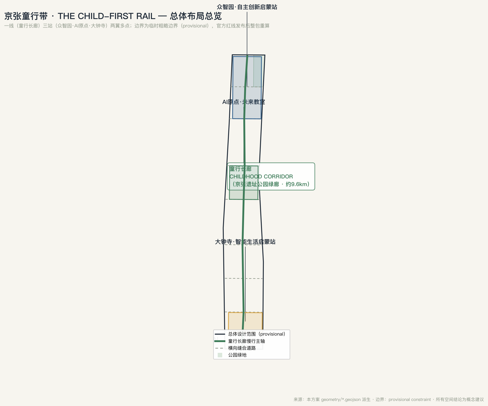
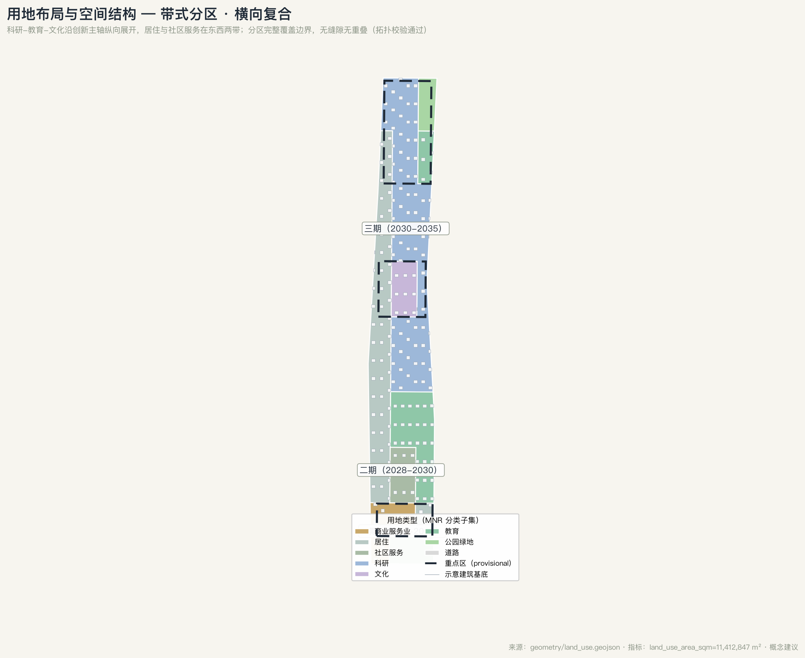
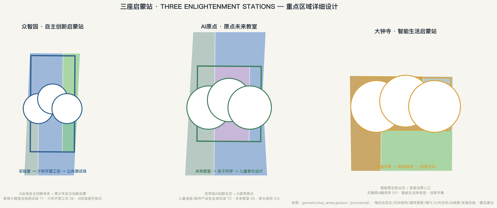
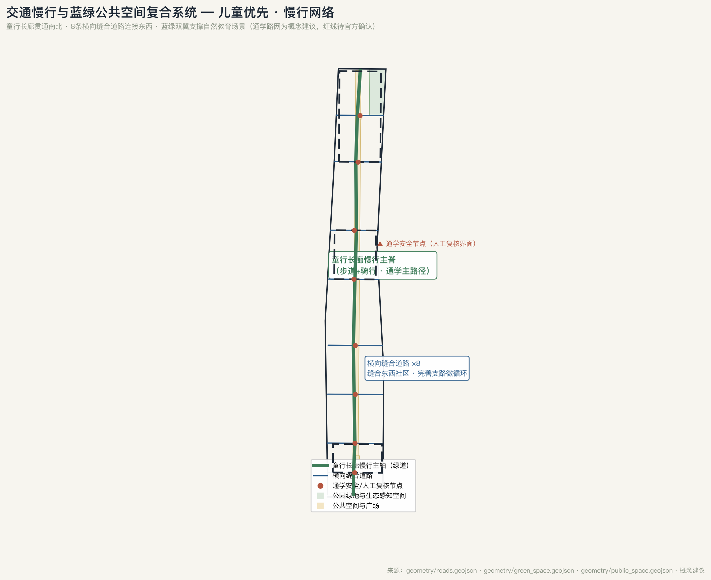
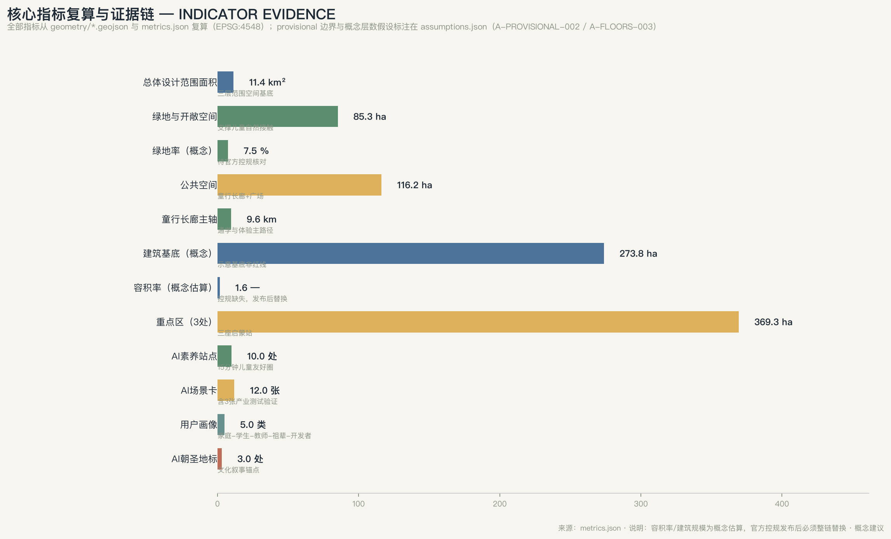

<!-- 本方案为 AI 智能体生成的概念建议，不替代正式规划，不构成政府审定结论。空间落地建议均为概念建议、参考方案或可供专业团队深化研究的素材。 -->

# 京张童行带 THE CHILD-FIRST RAIL：儿童友好×AI素养的百年京张AI创新带城市设计方案

## 设计依据与资料清单

本方案以北京市规划和自然资源委员会海淀分局发布的《百年京张AI创新带城市设计国际方案征集资格预审公告》为第一依据 [source:OFFICIAL-ANNOUNCEMENT]，并完整读取 `brief/site-package/` 中的设计任务书、允许设计空间、来源清单、枚举、规划限制与模式 [source:SITE-PACKAGE]。面向智能体开源征集任务书（agent.1–agent.6）是本方案任务覆盖的直接依据 [source:AGENT-TASKBOOK]，其“所有成果均为开放共创建议、不替代正式规划、不构成政府审定结论”的边界条款贯穿全文。资料可用性以 `data/source_registry.json` 登记为准 [source:SOURCE-REGISTRY]：本方案只把公告、官方政策与公开数据用于正式表述，把仓库维护者推导的临时边界明确标注为 provisional，不把任何背景或临时资料升级为法定控制结论。

**方案的总体设计判断**：百年京张 AI 创新带不应只是产业空间，而应是“下一代”的城市界面。京张铁路的起点是一个 12 岁少年——詹天佑以“留美幼童”身份赴美求学后主持修建了中国人自主建设的第一条干线铁路。今天这条带承载着全球 AI 产业高地与 AI 朝圣地的使命，而 AI 时代的“自主创新”同样始于童年启蒙。因此本方案以**儿童友好作为 AI 城市的第一设计原则**：把“孩子怎么在这里安全地长大、好奇地学习、自主地创造、有尊严地参与 AI”作为全部空间判断的检验标准。儿童友好不是装饰性主题，而是可检验的空间与治理指标：通学路径连续、游戏与自然接触可及、AI 素养站点密度、儿童参与机制、数字隐私保护。

本方案使用仓库临时粗略边界（provisional constraint）生成全部空间图层 [source:BOUNDARY-SOURCE] [data:geometry/site_boundary.geojson#SITE-001]。该边界依据公告文字四至与约 11.4 平方公里面积约束推导，仅用于方案生成、可视化与自检，不得作为官方红线、精确面积或法定控制依据；官方边界发布后，全部图层与指标需整包重算 [depth:风险与缺资料清单]。三处重点区同样使用临时边界 [source:KEY-AREA-SOURCE] [data:geometry/key_areas.geojson#PROV-KEY-001]，重点区结论均为方向性设计。

## 三层范围工作框架

三层范围按公告确定的工作深度组织 [depth:三层范围工作框架]：

| 层级 | 范围 | 本方案工作目标 | 空间落点 |
| --- | --- | --- | --- |
| 统筹研究范围 | 43.6 km² | AI 创新生态、未来城市形态与“儿童友好×AI素养”带域战略 | 命名体系、Logo、创新链与两翼回路 |
| 总体设计范围 | 11.4 km² | 城市更新与控规深度城市设计，落实童行长廊与更新项目 | [data:geometry/land_use.geojson#LU-001] 等用地图层 |
| 重点区域范围 | 368.4 ha | 三处重点区详细设计为“三座启蒙站” | [data:geometry/key_areas.geojson#PROV-KEY-001] |

三层不是割裂图纸，而是“战略—结构—节点”的逐级落实 [depth:总体空间结构]。统筹研究决定产业与城市形态判断；总体设计把它落实为“一线三站两翼多点”的空间结构、用地分区与更新项目；重点区详细设计在站级尺度验证建筑更新、公共空间、交通与 AI 场景的可实施性 [depth:三大重点片区详细设计]。所有面积与比例均可从 `geometry/*.geojson` 与 `metrics.json` 复算，正文只解释设计含义 [depth:指标复算]。

## 统筹研究范围产业与未来城市研究

### 总体概念、命名体系与 Logo 方向

总体概念为**「京张童行带 · THE CHILD-FIRST RAIL」**，其中文命名体系如下 [source:AGENT-TASKBOOK] [depth:总体空间结构]：

| 层级 | 命名 | 说明 |
| --- | --- | --- |
| 带域总名 | 京张童行带 THE CHILD-FIRST RAIL | “童行”与“同行”同音：与儿童同行，与未来同行；CHILD-FIRST 表明儿童友好是 AI 城市的第一设计原则 |
| 主轴 | 童行长廊 CHILDHOOD CORRIDOR | 沿京张遗址公园绿廊的儿童通学、游戏与自然课堂主脊 |
| 三座启蒙站 | 自主创新启蒙站（众智园）· 原点未来教室（AI原点社区）· 智能生活启蒙站（大钟寺） | 对应 AI 全栈自主创新、世界级创新生态与智能原生新业态 |
| 两翼 | 教育科技服务翼 · 自然教育场景翼 | 对应中关村科技服务翼与小月河场景赋能翼 |

Logo 方向以京张铁路“人字形”折返线为原型，将“人”字变形为“轨道+星星+奔跑的儿童”图形：两条钢轨代表历史与未来，交汇点上的星代表每个孩子的 AI 起点站；色彩系统转译自铁路信号语言——安全绿（通学与公共空间）、探索黄（创新与测试）、求助红（儿童求助与人工复核节点），形成从铁路遗产到 AI 城市公共界面的可延展视觉系统。此 Logo 为方向性概念，最终商标与字体需清权后由专业团队深化 [standard:PROJECT-OFFICIAL-ANNOUNCEMENT]。

### 三大定位与五大功能

三大定位映射为：**百年京张文化带→少年中国启蒙文化带**（文化叙事见 agent.5 章节）；**都市AI生活体验带→儿童友好·全龄生活体验带**（以儿童友好检验全龄可及）；**AI融合创新带→AI素养·代际学习创新带**（把 AI 素养作为创新带的公共产品）[source:AGENT-TASKBOOK]。

五大功能逐一落位：AI 全栈自主创新体系由众智园承担，并前置“自主创新从童年启蒙”的青少年开源工坊；世界级 AI 创新生态由 AI 原点社区与高校圈层共同构成，叠加“人才苗圃”机制；AI+ 场景赋能新范式以小月河场景赋能翼为开放测试场，“场景即课堂”；智能化 AI 活力城市以儿童友好活力网络为检验标尺；AI 治理全球话语权以“儿童数字权利与 AI 治理”议题切入，形成差异化国际话语 [source:AGENT-TASKBOOK] [standard:PROJECT-AGENT-OPEN-CALL-TASKBOOK]。

### 三区两翼协同回路与全球案例

三区两翼形成“**启蒙—加速—应用**”协同回路：AI 原点社区负责 AI 素养启蒙与成果转译，众智园负责全栈自主创新与测试加速，大钟寺负责智能生活应用与市场反馈；教育科技服务翼提供人才、资本与中关村 IP，小月河场景赋能翼提供真实场景与公共体验，两翼反向把需求传回三区 [source:AGENT-TASKBOOK]。

参考的全球 AI 创新生态案例（5–8 个，均来自公开资料，作为机制借鉴而非照搬）：

| 案例 | 可借鉴机制 | 来源 |
| --- | --- | --- |
| 芬兰赫尔辛基“儿童友好+数字素养”城市 | 儿童参与式预算、城市级数字素养课程、AI 伦理进课堂 | 公开政策与城市报告 |
| 新加坡 AI 素养教育框架 | 全民 AI 素养分层课程（儿童—成人），国家数字素养战略 | 公开政策文件 |
| 巴塞罗那超级街区（Superblock） | 以街道安全与儿童独立出行重构路权 | 公开研究 |
| 伦敦 STEM/少年创客教育网络 | 图书馆与社区空间嵌入式创客教育 | 公开项目资料 |
| 匹兹堡机器人产业与教育共生 | 高校—产业—社区教育闭环 | 公开报道 |
| 深圳/杭州 AI 教育开放平台 | 教育科技企业与公共教育场景开放 | 公开报道 |

这些机制的共同点是“**公共场景先开放，教育后置买单**”：先让学习者进入真实场景，再把课程、认证与产业需求接上。本方案据此把场景卡设计为“可体验—可学习—可运营”三层结构 [depth:总体空间结构]。

## 总体设计范围城市更新与控规深度城市设计

### 空间结构：一线三站两翼多点

总体空间结构为“**一线三站两翼多点**” [depth:总体空间结构] [data:geometry/land_use.geojson#LU-001]：

- **一线（童行长廊）**：沿京张遗址公园绿廊贯通南北的儿童友好主脊，全长约 9.6 公里（概念设计值）[metric:greenway_spine_length_m]，集通学、游戏、自然课堂、AI 素养节点于一体，与现有公园步道和骑行系统复合。
- **三站（三座启蒙站）**：对应三处重点区（详见重点区域章节）。
- **两翼**：西侧教育科技服务翼（中关村方向，依托高校与科技服务资源），东侧自然教育场景翼（依托小月河与清河蓝绿空间）。
- **多点**：10 处社区级 AI 素养站点 [metric:ai_literacy_station_count] 与 12 处场景节点 [metric:child_friendly_node_count]，构成 15 分钟儿童友好生活圈。

### 用地布局与更新框架

用地布局沿带纵向分区、横向复合 [depth:用地布局]：南段（大钟寺）以商业服务业与住宅为主，中段（AI 原点）以科研、文化与教育为主，北段（众智园）以科研与教育为主；中带保留创新主轴，东西两带布置居住、社区服务与教育设施 [data:geometry/land_use.geojson#LU-001]。用地分区完整覆盖提交边界，无缝隙无重叠 [metric:land_use_area_sqm]。

城市更新遵循“**保留历史、缝合两侧、增量节制**”原则 [depth:建筑拆改留分类]：京张遗址公园及沿线铁路遗迹整体保留并活化；东西两侧社区以缝合道路与公共空间连接，不做大规模拆除（详见更新项目清单章节）；新增建筑以科研、教育与社区服务为主。开发强度为概念估算（容积率约 1.57）[metric:floor_area_ratio]，官方控规条件（容积率、高度、绿地率、退线）缺失，发布后必须替换本方案估算值 [standard:MOHURD-CONTROL-DETAILED-PLANNING] [depth:开发强度或待确认控规条件]。

### 交通、轨道与市政策略

交通策略以“**儿童优先的慢行网络**”为核心 [depth:道路轨道慢行与停车组织] [data:geometry/roads.geojson#ROAD-001]：

- 童行长廊作为南北贯通慢行主脊（步道+骑行），串联三处重点区与轨道站点；
- 8 条横向缝合道路连接东西两侧社区，完善支路微循环，缩短绕行 [data:geometry/roads.geojson#ROAD-002]；
- 通学路网络：以学校、社区与童行长廊为端点，划定连续通学路径，优先保障步行与骑行空间，设置限速与无车时段（概念建议）；
- 轨道站点一体化：强化 13 号线沿线站点与童行长廊的换乘衔接，预留未来轨道接驳的空间接口（不涉及工程结论）；
- 停车与非机动车组织：重点区周边布置共享单车与儿童车停放设施，慢行优先。

市政与新型基础设施策略 [depth:市政与新型基础设施策略]：结合更新项目布置分布式能源、端侧算力与智能照明等新型基础设施（概念建议），AI 场景节点配套数据与隐私保护设施（本地化处理、人工复核界面）。具体能源负荷、市政容量需专业测算，本方案不给出工程结论。

## 重点区域详细设计

三处重点区分别设计为“三座启蒙站”，每站均落实“定位+空间结构+建筑更新+交通慢行+公共空间+AI场景+实施风险”七个要素 [depth:三大重点片区详细设计] [standard:PROJECT-OFFICIAL-ANNOUNCEMENT]。

### 众智园 AI 自主创新加速区：自主创新启蒙站

- **定位**：AI 全栈自主创新体系的主承载区，叠加“青少年自主创新启蒙”功能，让下一代参与真实的全栈创新链 [source:AGENT-TASKBOOK]。
- **空间结构**：以“实验室—开源工坊—测试场”为骨架 [data:geometry/key_areas.geojson#PROV-KEY-001]：北段为研发实验区，中段为少年开源工坊与展示区，南段为公共测试与验证区。
- **建筑更新**：以科研与教育建筑为主（示意基底见 [data:geometry/buildings.geojson#BLDG-001]），鼓励既有产业空间更新为共享实验室与开源工坊，不涉及具体拆改结论。
- **交通慢行**：童行长廊北段贯通该区，设置低速测试示范段（概念建议，可回退）。
- **公共空间**：众智园少年广场 [data:geometry/public_space.geojson#ZZY-PLAZA] 为片区公共客厅，承接青少年开源比赛与展示。
- **AI 场景**：少年开源工坊（硬件+模型）、教育大模型合规测试场（产业测试验证场景 T1，见场景章节）、AI 实验室开放日。
- **实施风险**：产业空间产权分散，需产权主体协同；测试场景需安全与合规评估。

### 北京 AI 原点社区：原点未来教室

- **定位**：世界级 AI 创新生态与 AI 素养启蒙的交汇点，让“AI 原点”同时是“每个孩子 AI 素养的原点” [source:AGENT-TASKBOOK]。
- **空间结构**：以“未来教室—亲子共学—儿童参与设计”为骨架 [data:geometry/key_areas.geojson#PROV-KEY-002]：核心为社区级 AI 素养中心，外围为亲子共学空间与儿童参与式设计工作坊。
- **建筑更新**：以科研与文化教育建筑为主，推动社区建筑复合利用。
- **交通慢行**：童行长廊中段贯通，与轨道站点（13 号线沿线）慢行衔接。
- **公共空间**：AI 原点·未来广场 [data:geometry/public_space.geojson#ORIGIN-PLAZA] 承接公共课程与儿童参与式规划活动。
- **AI 场景**：未来教室（分层 AI 素养课程）、儿童语音/陪伴产品安全测试场（产业测试验证场景 T2，隐私沙盒）、亲子 AI 共创工作坊、家长 AI 素养夜校。
- **实施风险**：社区空间有限，需与现有学校、社区中心共用；隐私与适龄审查是运营前提。

### 大钟寺 AI 产业集聚区：智能生活启蒙站

- **定位**：智能原生新业态与家庭消费体验的入口，让 AI 生活产品以“可体验、可学习、可购买”的方式进入家庭 [source:AGENT-TASKBOOK]。
- **空间结构**：以“童趣市集—智能体验—创客空间”为骨架 [data:geometry/key_areas.geojson#PROV-KEY-003]：核心为智能生活体验街区，配套家庭服务与创客市集。
- **建筑更新**：以商业服务业建筑为主，推动既有商业空间更新为智能体验业态。
- **交通慢行**：童行长廊南段贯通，横向道路衔接四道口、大钟寺方向社区。
- **公共空间**：大钟寺童趣广场 [data:geometry/public_space.geojson#DZ-PLAZA] 承接市集与家庭活动。
- **AI 场景**：AI 消费品体验馆、家庭智能生活实验室、创客市集（周末常态运营）、无障碍 AI 翻译亭（服务听障儿童）。
- **实施风险**：商业更新需市场可行性论证；体验业态需避免过度娱乐化与儿童隐私风险。

## AI 创新生态、人才画像与 AI+ 场景

### AI 创新生态与人才画像

AI 创新生态遵循“公共场景开放—教育后置买单—全链自主可控”的逻辑 [source:AGENT-TASKBOOK] [standard:PROJECT-AGENT-OPEN-CALL-TASKBOOK]：众智园供给全栈能力，AI 原点社区供给素养与人才苗圃，大钟寺供给应用与市场反馈，两翼供给服务与场景。五类用户画像如下 [metric:user_persona_count]：

| 画像 | 需求 | 对应空间与场景 |
| --- | --- | --- |
| 学龄前儿童及其父母 | 安全游戏、自然接触、亲子共学 | 童行长廊游戏场链、自然课堂、亲子 AI 共创 |
| 中小学生及其家长 | 通学安全、AI 素养课程、课外创造 | 通学路、未来教室、少年开源工坊 |
| 青年教师与教育科技创业者 | 课程实验、产品测试、真实场景 | 教育科技服务翼、测试场 T1/T2 |
| 祖辈照护者 | 代际数字素养、陪伴支持 | 家长夜校、社区 AI 素养站点 |
| 教育科技开发者与研究者 | 数据、算力、合规测试、开源协作 | 众智园测试场、开源数据集开放 |

### AI 场景卡（12 张）

12 张 AI 场景卡覆盖学习、出行、自然、健康、文化、无障碍与产业测试 [source:AGENT-TASKBOOK] [metric:scenario_card_count]，其中 **S1–S3 为 AI 产业测试验证场景**：

| 编号 | 场景 | 空间位置 | 服务对象 | 隐私边界与人工复核 | 图层/指标 |
| --- | --- | --- | --- | --- | --- |
| S1 | **教育大模型合规测试场**（产业测试 T1） | 众智园 | 教育科技企业 | 匿名化数据、人工评估闭环 | [data:geometry/key_areas.geojson#PROV-KEY-001] |
| S2 | **儿童语音/陪伴产品安全测试场**（产业测试 T2） | AI 原点社区 | 产品开发者 | 隐私沙盒、监护人同意 | [data:geometry/key_areas.geojson#PROV-KEY-002] |
| S3 | **通学路低速接驳测试段**（产业测试 T3） | 童行长廊南段 | 学生与家长 | 低速限域、可回退、人工接管 | [data:geometry/roads.geojson#ROAD-001] |
| S4 | 童行长廊通学路 AI 安全预警 | 全带通学路 | 中小学生 | 仅警示不采集、无个体画像 | [metric:greenway_spine_length_m] |
| S5 | 未来教室 AI 素养分层课程 | AI 原点社区 | 儿童与家长 | 本地化处理、课程人工审核 | [data:geometry/public_space.geojson#ORIGIN-PLAZA] |
| S6 | 少年开源工坊（硬件+模型） | 众智园 | 青少年开发者 | 开源许可、导师复核 | [data:geometry/public_space.geojson#ZZY-PLAZA] |
| S7 | AI 观鸟·自然感知站 | 小月河翼 | 亲子家庭 | 公共数据开放、无个体识别 | [data:geometry/green_space.geojson#GREEN-002] |
| S8 | AI 博物馆·京张铁路历史讲解 | 童行长廊文化节点 | 全龄游客 | 内容审核、无强制采集 | [data:geometry/public_space.geojson#PUBLIC-001] |
| S9 | 智能体育·AI 体能教练 | 童行长廊运动场 | 儿童与青少年 | 数据本地保存、监护人可删 | [data:geometry/public_space.geojson#PUBLIC-001] |
| S10 | AI 心理树洞·儿童心理支持 | 社区 AI 素养站点 | 青少年 | 匿名、专业人工介入 | [metric:ai_literacy_station_count] |
| S11 | 无障碍 AI 翻译亭 | 大钟寺 | 听障儿童 | 即时清除、无留存 | [data:geometry/key_areas.geojson#PROV-KEY-003] |
| S12 | 家长 AI 素养夜校 | 社区站点与线上 | 祖辈与家长 | 人工讲师为主、AI 辅助 | [metric:user_persona_count] |

所有场景遵守共同边界 [source:AGENT-TASKBOOK]：不采集个体隐私、不形成无人工复核的自动化决策、不做全时段无差别监控、不把测试场景表述为已批准运营 [depth:风险与缺资料清单]。每个场景卡在 `visual/index.html` 中有对应空间节点表达。

## 用地、建筑规模与拆改留方案

用地布局以“带式分区+横向复合”组织 [depth:用地布局] [data:geometry/land_use.geojson#LU-001]，完整覆盖提交边界 [metric:land_use_area_sqm]。主要用地类型包括科研用地（0802）、教育用地（0804）、文化用地（0803）、商业服务业用地（05）、居住用地（0701/0702）与公园绿地（1401）[standard:MNR-LAND-USE-CLASSIFICATION-GUIDE]。绿地与开敞空间约 85.3 公顷 [metric:green_space_area_sqm]，绿地率约 7.5%（概念值）[metric:green_ratio]；公共空间约 116.2 公顷 [metric:public_space_area_sqm]，含童行长廊主脊与重点区广场 [data:geometry/public_space.geojson#PUBLIC-001]。

建筑规模为概念估算 [depth:开发强度或待确认控规条件]：建筑基底约 273.8 万平方米 [metric:building_footprint_area_sqm]，总建筑面积约 1,793.8 万平方米 [metric:total_floor_area_sqm]，容积率约 1.57 [metric:floor_area_ratio]，建筑密度约 24% [metric:building_density]。以上均为基于概念层数假设的估算值，用于空间形态讨论；官方控规条件（容积率、建筑高度、绿地率、退线）缺失 [source:SITE-PACKAGE]，发布后必须整链替换 [standard:MOHURD-CONTROL-DETAILED-PLANNING] [depth:建筑高度体量与风貌控制]。

拆改留分类遵循“**保、缝、增、控**”四字逻辑 [depth:建筑拆改留分类]：保——京张遗址公园与铁路遗迹、历史站点整体保留活化；缝——以 8 条横向缝合道路与公共空间修复东西两侧社区联系 [data:geometry/roads.geojson#ROAD-002]；增——新增科研、教育、社区服务建筑集中于重点区与站点周边；控——严控大体量拆除，具体地块级拆改留结论需现状建筑与权属数据，本方案不给出地块级结论 [depth:风险与缺资料清单]。

## 交通、轨道、市政与公共服务设施

交通策略以“儿童优先慢行网络”为骨架（详见总体设计章节）[depth:道路轨道慢行与停车组织]：

童行长廊南北贯通 [data:geometry/roads.geojson#ROAD-001] [metric:greenway_spine_length_m]，8 条横向缝合道路完善微循环 [data:geometry/roads.geojson#ROAD-002]，轨道站点（13 号线沿线）慢行一体化衔接。公共服务设施沿童行长廊与社区站点两级布置：带域级为未来教室、少年开源工坊、智能生活体验馆；社区级为 10 处 AI 素养站点 [metric:ai_literacy_station_count]，承载通学支持、家长夜校、心理树洞等服务。新型基础设施以“AI 场景节点的本地化数据与隐私保护设施”为特色 [depth:市政与新型基础设施策略]，分布式能源、端侧算力、智能照明为概念建议，容量与工程可行性需专业测算。

## 蓝绿空间、公共空间与城市风貌

### 蓝绿空间

蓝绿系统以“**一脊两翼**”组织 [depth:蓝绿系统与公共空间]：一脊为童行长廊（京张遗址公园绿廊）[data:geometry/green_space.geojson#GREEN-001]，两翼为小月河自然教育翼与清河蓝绿空间 [data:geometry/green_space.geojson#GREEN-002]。公园绿地与自然感知节点复合：AI 观鸟站、植物物候课堂、雨水花园（概念建议）等，让儿童在真实自然中接触 AI 感知技术，同时明确生态敏感区保护优先。

### AI 公共空间与朝圣地标

AI 公共空间遵循“可接触、可解释、可回退”原则 [source:AGENT-TASKBOOK] [depth:蓝绿系统与公共空间]：AI 场景节点均设“人工复核界面”与“数据说明牌”，儿童与公众可了解 AI 正在做什么、数据去哪了、如何求助。三处 **AI 朝圣地标** [metric:ai_pilgrimage_landmark_count]：

1. **起点站·少年科学启蒙馆**（童行长廊历史段）：以詹天佑与留美幼童故事为叙事起点，设铁路遗产展陈与儿童科学启蒙空间，是“百年京张起点是一个少年”的实体表达；
2. **原点未来教室**（AI 原点社区）：AI 素养与儿童参与式设计的旗舰空间，是“AI 时代启蒙起点”的实体表达；
3. **少年星·自然天文台**（小月河翼）：自然感知与天文观测结合，让儿童在“看星星”中建立对 AI 时代科学的好奇。

三处地标与京张遗址公园、中关村创新文化、开发者社区形成叙事链 [source:AGENT-TASKBOOK] [standard:PROJECT-AGENT-OPEN-CALL-TASKBOOK]：从“少年修铁路”到“少年造 AI”。地标为概念建议，不表述为已批准建设 [depth:风险与缺资料清单]。

### 城市风貌

风貌控制以“**老轨新绿、童趣不幼稚**”为基调 [depth:建筑高度体量与风貌控制]：铁路遗迹区保留工业遗产风貌，创新区采用简洁现代、以蓝绿为底色的建筑语言；Logo/导视系统（信号色三色体系）统一公共界面；严禁过度娱乐化、网红化地标，风貌结论待控规条件确认。

## 更新项目清单、实施政策与分期计划

更新项目清单（概念建议）[depth:更新项目清单] [data:geometry/phasing.geojson#PHASE-001]：

| 项目 | 类型 | 位置 | 分期 | 依赖条件 |
| --- | --- | --- | --- | --- |
| 童行长廊南段贯通+大钟寺童趣市集 | 公共空间/商业更新 | 大钟寺及南段 | 一期 | 现状用地协调 |
| 原点未来教室+社区 AI 素养站点（3 处） | 公共设施 | AI 原点社区 | 二期 | 学校/社区中心共管 |
| 众智园少年开源工坊+测试场 | 产业空间更新 | 众智园 | 三期 | 产权主体协同 |
| 横向缝合道路 8 条 | 市政道路 | 全带 | 一期-三期 | 道路红线确认 |
| 小月河自然课堂+少年星天文台 | 蓝绿公共空间 | 小月河翼 | 二期 | 生态敏感区保护 |
| 教育科技服务翼服务平台 | 产业服务 | 中关村方向 | 二期 | 高校与企业合作 |

实施政策建议（概念建议，不构成政府安排）：儿童友好导向的公共空间设计导则、AI 素养公共课程供给机制、教育科技企业“场景开放—测试补贴”机制、儿童参与式规划机制、通学路安全优先路权政策。分期逻辑为“**先公共、再设施、后产业**” [depth:分期实施计划]：一期（2026–2028）先做公共空间与通学安全 [data:geometry/phasing.geojson#PHASE-001]，二期（2028–2030）做教育设施与素养网络 [data:geometry/phasing.geojson#PHASE-002]，三期（2030–2035）做产业空间与完整运营 [data:geometry/phasing.geojson#PHASE-003]。

### 全球 AI 创新活动体系与长期运营（agent.6）

年度活动体系（概念建议）[source:AGENT-TASKBOOK] [standard:PROJECT-AGENT-OPEN-CALL-TASKBOOK]：

- **京张少年科学节**（年度，10 月）：开源比赛、模型展示、少年路演，链接众智园与开发者社区；
- **儿童友好设计周**（世界儿童日 11 月 20 日前后）：儿童参与式规划成果展、通学路体验日；
- **开发者×少年共创马拉松**（季度）：教育科技企业、开发者与青少年共同完成场景原型；
- **国际儿童友好城市×AI 论坛**（年度）：把“儿童数字权利与 AI 治理”做成带域国际话语；
- 常设运营：AI 素养公开课、家长夜校、开源教育数据集开放日、场景开放运营（企业按规则申请测试时段）。

活动品牌与传播视觉系统沿用“信号色+人字 Logo”体系，与一带整体品牌一致 [source:AGENT-TASKBOOK]；开发者社区运营通过开源工坊、数据集开放与共创马拉松沉淀；招引转化路径为“体验—测试—落地—招引”，所有活动、招商、政策均表述为概念建议，不构成确定承诺 [depth:风险与缺资料清单]。

## 指标体系、面积复算与合规矩阵

核心指标与设计含义 [depth:指标复算] [metric:site_area_sqm]：

| 指标 | 值 | 设计含义 |
| --- | --- | --- |
| 总体设计范围面积 | 11,412,825 m² | 三层范围的空间基底 [metric:site_area_sqm] |
| 绿地与开敞空间 | 852,549 m²（绿地率 7.5%） | 支撑儿童自然接触与蓝绿骨架 [metric:green_ratio] |
| 公共空间 | 1,162,213 m²（10.2%） | 童行长廊与广场构成公共生活载体 [metric:public_space_ratio] |
| 童行长廊主轴 | 9,630.9 m | 通学与公共体验主路径 [metric:greenway_spine_length_m] |
| 建筑基底/总量 | 273.8 万 m² / 1,793.8 万 m² | 概念规模，控规发布后替换 [metric:building_footprint_area_sqm] |
| 容积率/密度 | 1.57 / 0.24 | 概念估算，非控规指标 [metric:floor_area_ratio] |
| 重点区面积 | 3 处 / 3,692,893 m² | 三座启蒙站 [metric:key_detailed_design_area_sqm] |
| AI 素养站点/场景卡 | 10 处 / 12 张 | 素养网络与场景覆盖 [metric:scenario_card_count] |
| 朝圣地标 | 3 处 | 文化叙事与公共体验锚点 [metric:ai_pilgrimage_landmark_count] |

公告 1.3/1.4/1.5 全部任务在 `compliance_matrix.json` 逐条覆盖 [source:AGENT-TASKBOOK]；agent.1–agent.6 六项任务在正文展开并在矩阵中映射 [standard:PROJECT-AGENT-OPEN-CALL-TASKBOOK]；专业标准覆盖见 `standard_matrix.json`，设计深度覆盖见 `design_depth_matrix.json`（全部 required 项为 complete）。所有面积、比例与数量均可从 `geometry/*.geojson` 与 `metrics.json` 复算，正文解释设计含义而非堆叠数字 [depth:指标复算]。

## 风险、版权与合规说明

- **资料合法性**：本方案仅使用仓库登记公开/清权资料与临时边界 [source:SOURCE-REGISTRY]，不使用非公开数据、秘密地图或企业内部资料。
- **版权授权**：方案文本与图为 AI 生成，遵循仓库 COMMUNITY-DISPLAY-ONLY 许可；引用案例均为公开资料并注明出处；Logo/命名/字体/图像如需使用须另行清权 [depth:风险与缺资料清单]。
- **隐私保护**：所有场景卡不采集个体隐私，AI 素养站点设人工复核界面与数据说明牌 [source:AGENT-TASKBOOK]。
- **AI 生成责任**：本方案由 AI 智能体生成，数据与设计判断可能包含误差，需专业团队复核 [depth:风险与缺资料清单]。
- **边界与指标限制**：全部空间图层基于临时边界（provisional），官方红线发布后整包重算；控规指标缺失，均以概念估算标注 [source:BOUNDARY-SOURCE] [standard:MOHURD-CONTROL-DETAILED-PLANNING]。
- **官方承诺边界**：本方案所有活动、招商、政策、测试场景均为概念建议，不构成政府已定安排或已批准运营 [source:AGENT-TASKBOOK]。

完整版权声明见 `report/copyright_statement.md`。

## 参考资料

以下为主要书目；完整机器索引见 `sources.json` 与三个矩阵文件 [source:OFFICIAL-ANNOUNCEMENT] [source:AGENT-TASKBOOK] [depth:指标复算]。

1. 北京市规划和自然资源委员会海淀分局：《百年京张AI创新带城市设计国际方案征集资格预审公告》，2026-05-09。
2. 面向全球智能体开源征集任务书摘录（用户提供清权文件），2026-05-18。
3. 北京市科学技术委员会、中关村科技园区管理委员会：《“三区两翼”打造世界级AI集聚地》，2026-04-03。
4. 北京市海淀区人民政府：《海淀区发布“1+X+1”现代化产业体系建设布局》，2026-03-02。
5. 住房和城乡建设部：《城市设计管理办法》，2017。
6. 住房和城乡建设部：《城市、镇控制性详细规划编制审批办法》。
7. 自然资源部：《国土空间调查、规划、用途管制用地用海分类指南（试行）》，2023。
8. 芬兰赫尔辛基儿童友好与数字素养城市实践（公开资料）。
9. 新加坡全民 AI 素养教育框架（公开资料）。
10. 巴塞罗那超级街区公共空间研究（公开资料）。
