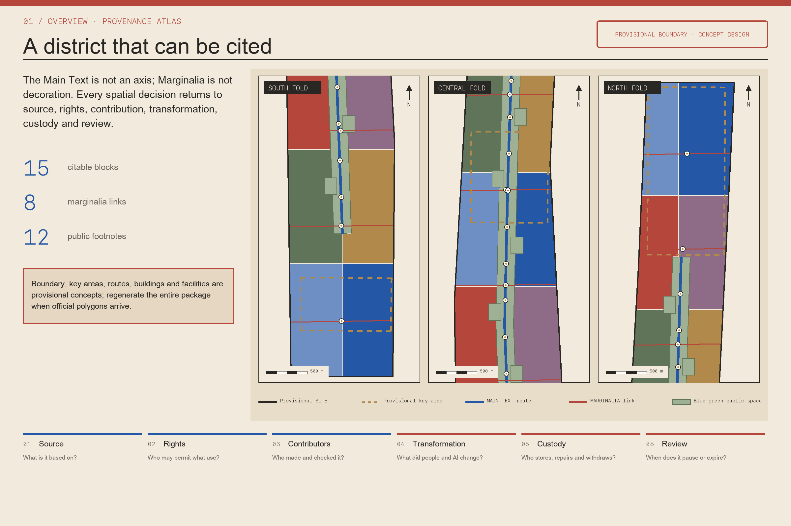
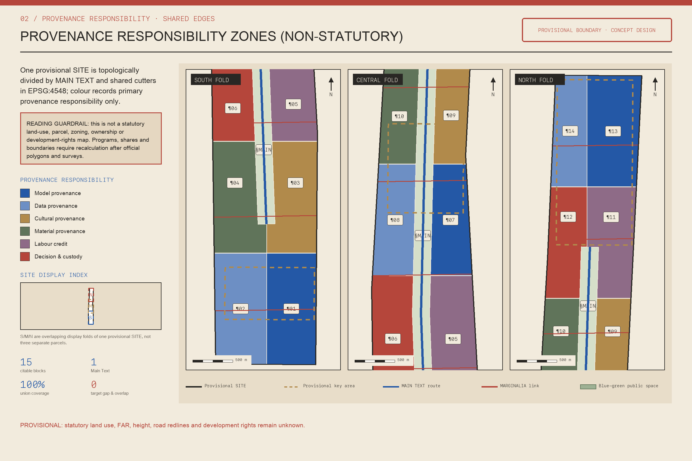
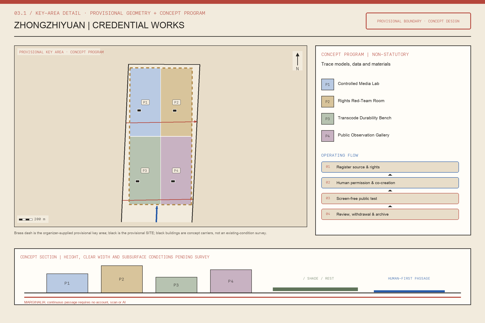
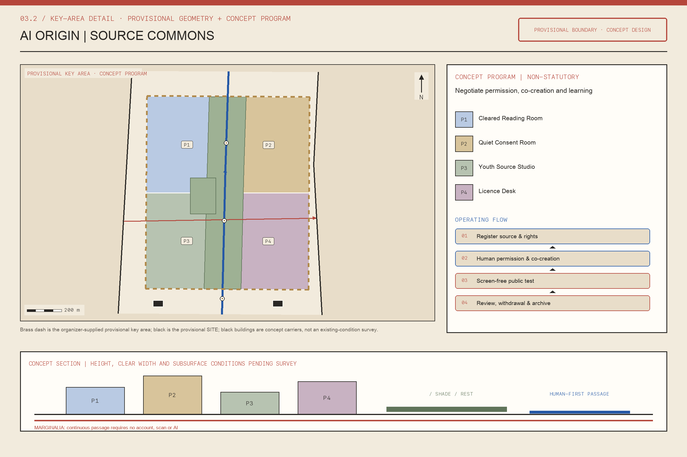
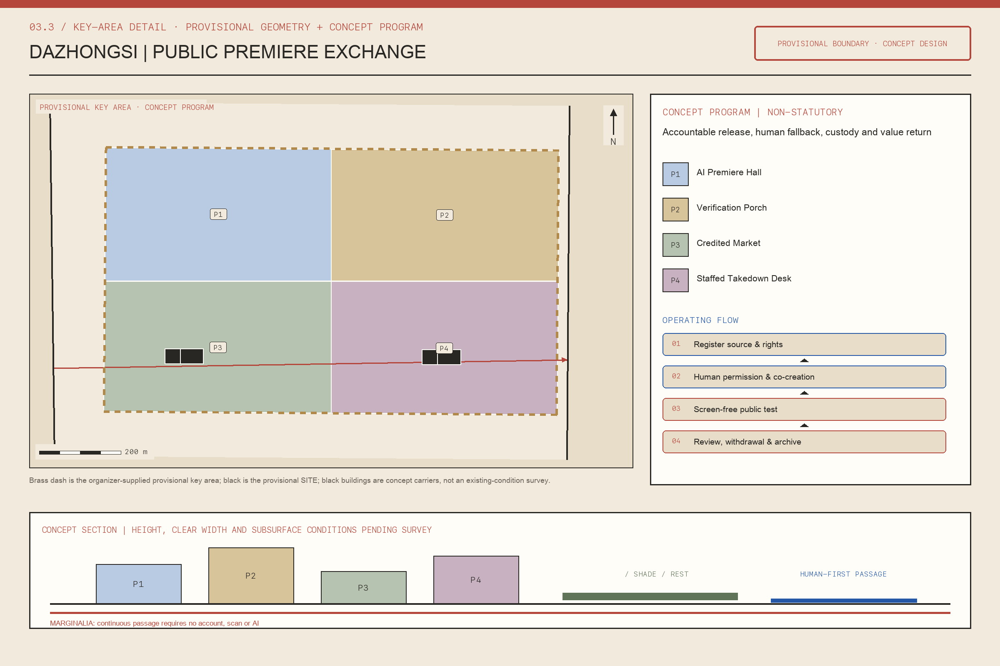
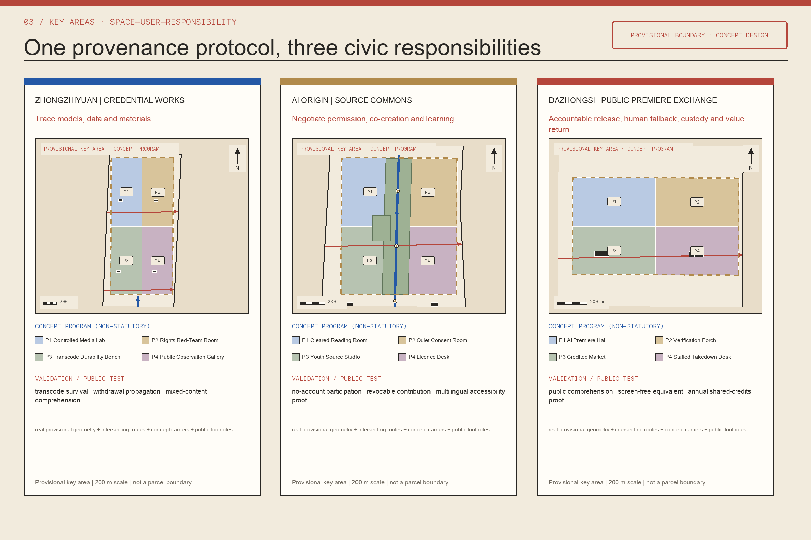
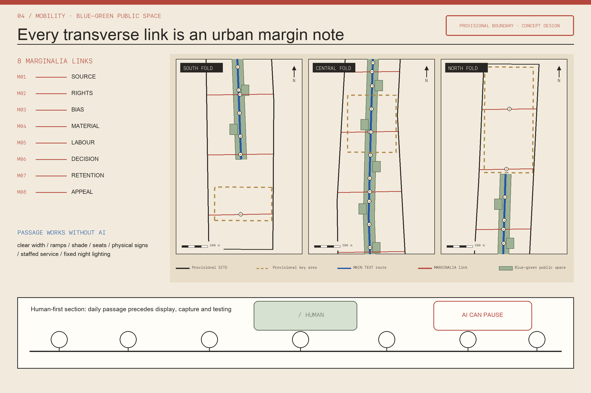
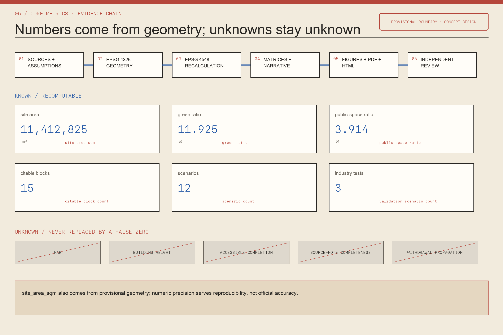

# JING-ZHANG, WITH CREDITS / 京张有出处

## Design Basis and Source List

“JING-ZHANG, WITH CREDITS” elevates provenance from an endnote into civic infrastructure operating through planning, construction, and stewardship. The proposal follows the official announcement and agent taskbook, then uses the site package, source registry, structured geometry, metrics, and professional matrices. Every claim must answer who made it, on what evidence, through which calculation, reviewed by whom, and until when it remains valid. The current overall area and three key areas are temporary conceptual boundaries. They support generation, comparison, and recalculation only; they are not official polygons, statutory redlines, property boundaries, regulatory plans, or approvals. When official polygons arrive, all clipped layers, areas, ratios, sequences, drawings, and web pages must be recalculated as one package.[source:OFFICIAL-ANNOUNCEMENT] [source:SOURCE-REGISTRY] [data:geometry/site_boundary.geojson#SITE-001]

The all-element provenance system uses a “six-field credit tag.” Its model field records version, evidence, and human review; the data field records origin, permission, currency, and deletion; the cultural-content field records authors, collectors, permissions, and disputes; the material field records production place, recycled content, carbon boundary, and repair; the labor field recognizes design, construction, cleaning, security, annotation, and maintenance; and the public-decision and maintenance field records alternatives, responsible bodies, budgets, cycles, and appeals. The fields do not create a personal score, and technical packaging does not replace governance. Public views show only what accountability requires.

Sources and assumptions constrain geometry; geometry produces metrics; metrics and matrices support prose and figures. Display artifacts may not overwrite authoritative data. Fifteen citable plots, eight transverse margin notes, and 12 footnote nodes retain stable identifiers, so each CITE-BLOCK, ROAD-MARGINALIA, or PUBLIC-NOTE returns to a version, steward, and evidence chain. Every tag permits correction, withdrawal, archival, and expiry. Full evidence is stored in `sources.json`, `assumptions.json`, `metrics.json`, `standard_matrix.json`, and `design_depth_matrix.json`.[standard:PROJECT-OFFICIAL-ANNOUNCEMENT] [depth:existing_conditions_diagnosis]

## Three-Level Scope Framework

The proposal uses “main text plus margin notes” as the shared grammar of three working scales. The 43.6-square-kilometer coordinated research area is a citation network mapping how knowledge, materials, labor, and decisions move among universities, firms, communities, cultural institutions, suppliers, and public bodies. The approximately 11.4-square-kilometer overall design area is the readable main text, arranging renewal, public space, industry services, mobility, utilities, and character as pages delivered incrementally. The three key areas are edited proofs where plots, ground floors, building adaptation, street sections, and operating rules test the system. All areas derive from temporary conceptual geometry and must be recalculated with official polygons.[depth:three_level_scope_framework] [metric:site_area_sqm]

MAIN-TEXT-01 carries the spatial body. Fifteen citable plots are expressed through CITE-BLOCK-01 to CITE-BLOCK-14 together with the shared civic unit in MAIN-TEXT-01. They are implementation units that can be referenced consistently during deliberation, permitting, construction, and maintenance, not enclosed campuses. ROAD-MARGINALIA-01 to ROAD-MARGINALIA-08 raise transverse questions about origin, permission, bias, material carbon, labor and maintenance, public decision, retention and deletion, and appeal and correction. Safe crossings, cycle links, shaded paths, open ground floors, and service lines turn those questions into space.

PUBLIC-NOTE-01 to PUBLIC-NOTE-12 occupy station entries, underpasses, community halls, park gates, and industrial courtyards, offering lookup, correction, translation, accessibility explanation, and human help. PUBLIC-MARGINALIA-01 to PUBLIC-MARGINALIA-08 provide places to pause. From any identifier, a reader can reach its plot, facility, scenario, metric, and compliance chain. Paper indexes, tactile signs, and staffed desks provide equal access without a smart device.[data:geometry/land_use.geojson#MAIN-TEXT-01] [data:geometry/public_space.geojson#PUBLIC-NOTE-01] [depth:overall_spatial_structure]

## Coordinated Research Area: Industry and Future City Research

At the research scale, provenance becomes quality infrastructure for the AI economy. Innovation depends not only on models and compute but also on lawful training or retrieval evidence, reproducible tests, licensed cultural content, traceable materials, recognized hidden labor, and appealable public decisions. The proposal connects universities, laboratories, firms, scenario owners, communities, and professional services through research, open release, validation, procurement, deployment, maintenance, and retirement. Every institutional handoff produces a six-field credit tag recording the object, version, fitness boundary, responsible party, review date, and exit condition. Trade secrets may stay controlled; findings concerning public safety or expenditure require readable summaries.[source:AGENT-TASKBOOK] [standard:PROJECT-AGENT-OPEN-CALL-TASKBOOK]

The strategy builds trustworthy production, public validation, and long-term care. Model cards, data statements, content permissions, material records, and labor recognition become deliverables. Zhongzhiyuan’s Credential Works tests models, edge devices, low-speed robots, and material prototypes. AI Origin’s Source Commons converts academic outputs, open data, and cultural resources into reusable, rights-cleared materials. Dazhongsi’s Public Premiere Exchange exposes products and content to public use, accessibility testing, and rights explanation before wider deployment. Long-term care creates durable work for repair engineers, community editors, rights specialists, model auditors, and equipment maintainers.

The proposal learns verifiable methods from open-source contribution histories, museum rights fields, construction-material tracing, procurement audit, dataset documentation, model cards, and participatory budgeting without copying their appearance. It recommends an annual Civic Credits Health Check, quarterly open editing, and a continuing maintenance fund supported by services, procurement maintenance allocations, and partners. Selling resident data is prohibited. The outcome is a shared protocol invoked by plots, audited through transverse notes, and corrected at footnote nodes.[depth:risk_missing_data] [standard:MOHURD-URBAN-DESIGN-MEASURES]

## Overall Design Area: Urban Renewal and Regulatory-Plan-Level Urban Design

The overall design treats citable plots as implementation grains, translating rules into land use, buildings, interfaces, mobility, facilities, and projects. Every plot record contains existing evidence, permitted uses, retain–renovate–demolish reasoning, open space, ground-floor access, material sources, operating body, maintenance budget, public decisions, and next review date. BUILDING-CARRIER-01 to BUILDING-CARRIER-18 host provenance services; they are not presumed new. Street signs show identifiers and public commitments, digital pages show version differences, and paper records preserve offline access. Without formal controls, ownership, and complete surveys, height, FAR, setbacks, and final demolition decisions remain unknown or pending.[standard:MOHURD-CONTROL-DETAILED-PLANNING] [depth:development_intensity_controls]

Renewal follows “inventory first, open second, build third.” The inventory records reusable structures, mature trees, existing businesses, public services, materials, and labor networks. Reversible trials test needs through temporary access, ground-floor passages, shared rooms, evening services, and small repairs. Permanent work proceeds only after feedback, structural safety, ownership, and official controls are reviewed. ROAD-MAIN-TEXT organizes principal access. Eight transverse notes combine safer crossings, accessible ramps, shade, rain gardens, loading windows, and utility maintenance, with trade-offs recorded in the public-decision and maintenance field.

Research spaces sit beside affordable collaboration and public services. Exhibitions explain cleaning and repair; cultural programs disclose permissions and contributions; new components prioritize disassembly and maintenance. Land use, buildings, roads, green space, public space, and phasing jointly define the proposal. Stable identifiers may remain when official polygons arrive, but geometry, area, adjacency, and sequence must be revalidated.[data:geometry/buildings.geojson#BUILDING-CARRIER-01] [data:geometry/roads.geojson#ROAD-MAIN-TEXT] [metric:building_footprint_area_sqm]

## Detailed Design of Key Areas

Zhongzhiyuan becomes the Credential Works. An Intake Hall turns submission requirements into a readable checklist. A Public Validation Court supports model red-teaming, low-speed robots, edge devices, and accessibility tests with safety officers and stop controls. A Repair and Material Library presents replaceable parts, recycled materials, and manuals. A Human Review House hears challenges to automated recommendations. A Supplier Gallery displays standards, methods, and maintenance teams. Along the Qing River, rainwater, walking, cycling, and tests coexist; demonstrations may not displace ecological safety or continuous passage.[data:geometry/key_areas.geojson#PROV-KEY-001]

The Beijing AI Origin Community becomes the Source Commons. An Open Editing Room supports universities, developers, and communities maintaining documentation together. A Data Reading Room explains permissions, bias, currency, and deletion. A Rights Clinic advises on copyright, privacy, intellectual property, and open licenses. A Near-Campus Commons offers low-threshold meetings and evening study. A Citation Garden places railway history, community memory, and current research together under revocable permissions. Displays credit individual and collective contributors; corporate naming may not erase authorship, and viewing never implies an open license.[data:geometry/key_areas.geojson#PROV-KEY-002]

Dazhongsi becomes the Public Premiere Exchange. Its Premiere Hall lets agents, devices, and cultural content face public experience before scaling. A Content Rights Depot stores permission scope, versions, and expiry. A Night Maintainers’ Room gives cleaning, security, logistics, equipment, and content teams real working space. A Four-Quadrant Credits Crossing connects the station surroundings through continuous crossings, shade, and common wayfinding. A Public Archive Roof hosts annual reviews, failure exhibitions, and agenda setting. All three extents remain temporary concepts expressing transferable functions, not final parcels or permissions.[data:geometry/key_areas.geojson#PROV-KEY-003] [depth:three_key_area_detailed_design]

## AI Innovation Ecosystem, Personas, and AI+ Scenarios

The proposal serves at least six groups. Researchers need reproducible experiments and compliant evidence. Start-ups need affordable testing, permission advice, and first public users. Residents need to understand why AI appears, how to exit, and whom to appeal to. Cultural creators need attribution and reuse boundaries. Frontline maintainers need budgets, spaces, and recognition. Planning and public-service staff need auditable evidence without excessive collection. Children, older adults, disabled people, non-Chinese speakers, and people without smart devices are mandatory testers. Automated advice may act only as a challengeable clerk; it cannot replace approval, diagnosis, enforcement, or public voting.[source:AGENT-TASKBOOK] [depth:risk_missing_data]

Twelve scenarios match the structured scenario matrix item by item: the Attributed Jing-Zhang Guide; Enterprise Provenance Copilot; Public-Safety Media Review; Credential Survival after Transcoding; Withdrawal Propagation; Fact–Restoration–Synthesis Comprehension; Consented Oral-History Transcription; Youth Source-Literacy Studio; Multilingual Caption and Accessibility Proofing; Credited Creator Market; Material and Component Source Desk; and Annual Shared-Credits Proof. SC-04, SC-05, and SC-06 are the three industry validations: they test whether credentials survive transcoding, whether withdrawal reaches derivatives, and whether the public can distinguish historical fact, restoration, and synthesis. Tests use synthetic or rights-cleared assets only, with a human alternative, stop conditions, incident records, and independent review. Inputs follow purpose limitation and minimization; outputs show evidence date, confidence, responsibility, and a human route.

Model changes, evidence withdrawals, or permission expiry trigger review. High-risk services revert to human operation until review closes. Scenarios occupy citable plots, undergo cross-area scrutiny through margin notes, and provide offline explanation at footnote nodes. Success is measured by correction response, accessible completion, human-alternative availability, maintenance closure, and recognized contributors—not invocation counts.[data:geometry/public_space.geojson#PUBLIC-NOTE-01] [data:geometry/public_space.geojson#PUBLIC-MARGINALIA-01] [metric:public_space_ratio]

## Land Use, Building Scale, and Retain-Renovate-Demolish Strategy

Land use emphasizes repair and mixed daily life rather than themed enclosure. Citable plots accommodate research validation, open materials, public services, cultural presentation, maintenance logistics, green space, and ordinary commerce. Each program states compatible neighbors, public ground-floor hours, noise and loading limits, and fallback use after exit. MAIN-TEXT-01 preserves continuity; CITE-BLOCK-01 to CITE-BLOCK-14 provide functional grains. Codes follow the formal classification guide. Temporary conceptual boundaries support comparison only and cannot establish statutory categories, ownership, or development rights.[standard:MNR-LAND-USE-CLASSIFICATION-GUIDE] [data:geometry/land_use.geojson#CITE-BLOCK-01]

Retain–renovate–demolish uses evidence thresholds rather than taste. Buildings with historical information, mature user networks, repairable structures, or significant embodied carbon are retained first. Structures that can continue through strengthening, energy upgrades, accessibility, ground-floor opening, and services renewal are adapted first. Demolition is considered only when safety and public connection cannot be achieved and alternatives pass lifecycle comparison. Incomplete surveys, structural assessment, heritage status, ownership, and controls mean BUILDING-CARRIER-01 to 18 are design carriers and review objects, not authorized developments.[depth:retain_renovate_demolish] [depth:height_massing_character]

New and adapted components use a six-field credit tag to record suppliers, production place, recycled content, carbon boundary, connections, repair manuals, replaceable parts, and labor. Building footprint can be recalculated, but total floor area, FAR, height, density, and setbacks remain unknown without official controls. A3, A0, and HTML show only values consistent with `metrics.json`; official geometry or building evidence triggers coordinated recalculation.[data:geometry/buildings.geojson#BUILDING-CARRIER-18] [metric:building_footprint_area_sqm]

## Transport, Rail, Municipal Infrastructure, and Public Services

Mobility treats eight transverse margin notes as priority connections. ROAD-MARGINALIA-01 links evidence producers and reading points; 02 joins rights advice and cultural venues; 03 connects tests with diverse users; 04 organizes material delivery and recovery; 05 provides safe maintainer access; 06 links deliberation; 07 connects retention and controlled deletion; and 08 networks review and appeals. Each route coordinates walking, cycling, wheelchair gradients, shade, seating, lighting, loading, and emergency access. Technology may not occupy accessible clear width.[data:geometry/roads.geojson#ROAD-MARGINALIA-01] [depth:traffic_rail_slow_parking]

PUBLIC-NOTE-01 to 12 form small, dependable facilities: Qing River Lookup Kiosk, Test Registration, Repair Lending Cabinet, Human Review Desk, University Open Reference Station, Origin Rights Clinic, Citation Garden Oral-History Desk, Park Crossing Assistance, Dazhongsi Accessibility Desk, Premiere Feedback Desk, Night Maintenance Supply Point, and Public Archive and Appeal Desk. They provide paper directories, audio and tactile information, translation, and face-to-face help. QR codes are supplementary, never exclusive.[data:geometry/public_space.geojson#PUBLIC-NOTE-12]

Sensors, edge devices, charging, drainage, lighting, and displays record energy source, maintenance responsibility, data retention, and shutdown. Predictive maintenance assists scheduling but never cancels human inspection. Missing road redlines, rail interfaces, utilities, fire access, flood conditions, or capacities remain pending professional review rather than being drawn as approved engineering.[data:geometry/constraints.geojson#CONSTRAINT-PROVISIONAL-SITE] [depth:municipal_new_infrastructure]

## Blue-Green Network, Public Space, and Urban Character

The blue-green network is the public ground of the urban text, not a technology backdrop. Existing green areas, water, mature trees, runoff, and daily activity are recorded before citable plots and transverse links are added. Every AI installation, pavilion, or event must preserve ecological continuity, accessible passage, and free occupation. GREEN-MAIN-TEXT-01 maintains overall continuity; GREEN-MARGIN-01 to 07 provide transverse infiltration, shade, and stormwater regulation. Ratios derive from submitted geometry and must be recalculated when temporary boundaries are replaced.[data:geometry/green_space.geojson#GREEN-MAIN-TEXT-01] [metric:green_ratio] [metric:public_space_ratio]

Public space follows “daily life before events.” Commuting, rest, children’s play, older people’s stays, accessible movement, and maintenance retain minimum capacity. Launches, tests, and commercial exhibitions reserve only the remainder. Temporary occupation discloses organizer, permission period, noise limit, clearing responsibility, and complaint route. Seats, tree pits, paving, lighting, and signs use six-field credit tags to explain materials, construction, and care.[data:geometry/public_space.geojson#PUBLIC-MARGINALIA-08]

Urban character neither copies railway symbols nor equates intelligence with screens. Main-text information uses stable signs; transverse color bands mark margin-note questions; small identifiers and staffed-service symbols denote footnote nodes. Historical narratives distinguish archival fact, community memory, and interpretation while preserving authors, collectors, permissions, and disputes. Night design limits luminance, blue light, and hours, prioritizing walking surfaces and human-service entrances. Detailed controls await formal heritage, planning, and landscape conditions.[depth:blue_green_public_space] [standard:MOHURD-URBAN-DESIGN-MEASURES]

## Renewal Projects, Implementation Policy, and Phasing

Implementation follows rules first, reversible validation, spatial renewal, and long-term care. Preparation establishes six-field credit-tag fields, stable identifiers, appeals, and an official-polygon replacement workflow while completing surveys. PHASE-001 launches reversible pilots for Credential Works, Source Commons, and Public Premiere Week with priority margin notes and footnote nodes. PHASE-002 advances adaptation, ground-floor access, mobility, blue-green work, and utilities after tests. PHASE-003 uses annual review to expand, revise, or retire work.[data:geometry/phasing.geojson#PHASE-001] [depth:phasing_implementation]

Projects include the public credit-tag portal, three key-area anchors, eight transverse notes, 12 footnote nodes, Material and Repair Library, Rights Clinic Network, Contribution and Maintenance Fund, and Annual Health Check. Each records location, beneficiaries, lead and partners, approvals, capital cost, at least five years of operating cost, maintenance roles, risks, stop conditions, and effect metrics. A project without a responsible body or maintenance budget cannot become permanent.[data:geometry/phasing.geojson#PHASE-002] [depth:renewal_project_list]

Policy tools include provenance requirements in procurement, cultural-permission templates, data minimization, material-origin and repair records, labor disclosure, public-decision records, independent appeals, and annual third-party sampling. Quarterly editing lets communities propose corrections, professionals verify them, and operators publish deadlines and reasons. Success means the system survives staff turnover, model updates, permission withdrawal, and funding change. Unsecured ownership, funding, and approvals remain recommendations, not commitments.[data:geometry/phasing.geojson#PHASE-003] [source:OFFICIAL-ANNOUNCEMENT]

## Metrics, Area Recalculation, and Compliance Matrix

Metrics fall into three groups. Spatial metrics derived from current geometry include overall-area extent, building footprint, green ratio, public-space ratio, and key-area count. The prose does not duplicate values that may change; authoritative values, units, formulas, source files, confidence, and assumptions come from `metrics.json`. Pending statutory metrics—total floor area, FAR, height, density, setbacks, road redlines, and capacity—remain unknown. Operating metrics include credit completeness, timely permission-expiry handling, correction response, human-alternative availability, accessible completion, maintenance closure, and recognized-contributor coverage.[metric:site_area_sqm] [metric:building_footprint_area_sqm] [metric:key_area_count]

Every known metric records value, unit, source, formula, confidence, and assumptions. Every unknown metric states its gap, responsible body, and recalculation action. Plots, notes, nodes, and scenarios retain unique identifiers across drawings, HTML, prose, matrices, and geometry. Operating metrics preserve numerator, denominator, and observation period. Event attendance cannot substitute for long-term public value, and resident profiles cannot become performance assets.[metric:green_ratio] [metric:public_space_ratio] [depth:metrics_recalculation]

The compliance matrix connects requirements to sections, layers, metrics, drawings, HTML, sources, assumptions, and checks. Completed tasks require openable evidence; prose-only intentions remain partial. Six gates precede submission: reachable sources, valid geometry, consistent metrics, closed compliance chains, equivalent bilingual artifacts, and cleared rights. Official polygons trigger regeneration of area, topology, figures, HTML, and matrices.[data:geometry/site_boundary.geojson#SITE-001] [data:geometry/constraints.geojson#CONSTRAINT-PROVISIONAL-SITE]

## Risk, Copyright, and Compliance

The first risk is mistaking provenance for surveillance. The proposal prohibits resident scores, cross-context profiles, and permanent behavioral trails. Public contribution is attributed to teams or consenting people; frontline workers may choose anonymous or collective credit. Sensitive evidence remains authorized; public pages offer only necessary summaries. Every automated recommendation has a human alternative, stop control, and appeal. Provenance is not proof of truth, so every six-field credit tag also shows confidence, dispute, expiry, and reviewer, allowing new evidence to overturn earlier claims.[depth:risk_missing_data] [source:SOURCE-REGISTRY]

Copyright, trade secrets, and cultural appropriation form another risk. Images, typefaces, maps, code, models, datasets, oral histories, company marks, and generated content receive rights records. “Viewable” never means “trainable” or “republishable.” Community memory may be withdrawn; minors and vulnerable groups require higher permission; trade secrets disclose only validation summaries. HTML loads no remote scripts, fonts, map tiles, forms, or trackers. Chinese and English prose, figures, A3, A0, and HTML remain substantively equivalent.

False certainty is also prohibited. SITE-001, PROV-KEY-001 to 003, and CONSTRAINT-PROVISIONAL-SITE are temporary conceptual representations, not official redlines, ownership, heritage controls, regulatory plans, or engineering. FAR, heights, roads, utilities, fire, and flood matters remain pending. Permanent work requires operating budgets, roles, spares, shutdown, and retirement. The proposal claims no approval or committed funding; it remains a design recommendation for continued review.[data:geometry/constraints.geojson#CONSTRAINT-PROVISIONAL-SITE] [standard:MOHURD-CONTROL-DETAILED-PLANNING]

## References

Evidence follows a four-level hierarchy: authoritative requirements, registered sources, navigational material, and design derivation. The official announcement, agent taskbook, urban-design and regulatory-planning documents, and land-use classification guidance establish tasks, scope, depth, and limits. `data/source_registry.json` records whether public, cleared, or provisional material may enter formal evidence. `agent_fact_pack.md` and associated CSV files support navigation only. Geometry, metrics, matrices, figures, and prose return to those sources or are identified as design assumptions.[source:SITE-PACKAGE] [source:PROCESSED-FACT-PACK]

Core files are `brief/public-brief.md`; `brief/site-package/design_brief.json`; `agent_taskbook.json`; `allowed_design_space.json`; `enums/`; `ranges/planning_limits.json`; `geometry/provisional_boundaries.geojson`; `data/source_registry.json`; `project_scope_summary.csv`; `agent_task_requirements.csv`; `source_use_matrix.csv`; and `missing_data_checklist.csv`. Exact URLs, paths, licenses, uses, and access dates are controlled by `sources.json`, preventing a conflicting bibliography.[source:OFFICIAL-ANNOUNCEMENT] [source:AGENT-TASKBOOK]

Official sources support requirements; standards support method and depth; temporary conceptual geometry supports current spatial generation and recalculation only; precedents support mechanism comparison, not site facts. Link failure, rights changes, updates, or official polygons require recorded old and new versions, affected artifacts, and recalculation results rather than silent overwrite. The six-field credit tag follows the same rule: it is challengeable, correctable, withdrawable, and archivable, not permanent truth.[standard:MNR-LAND-USE-CLASSIFICATION-GUIDE] [depth:existing_conditions_diagnosis]
