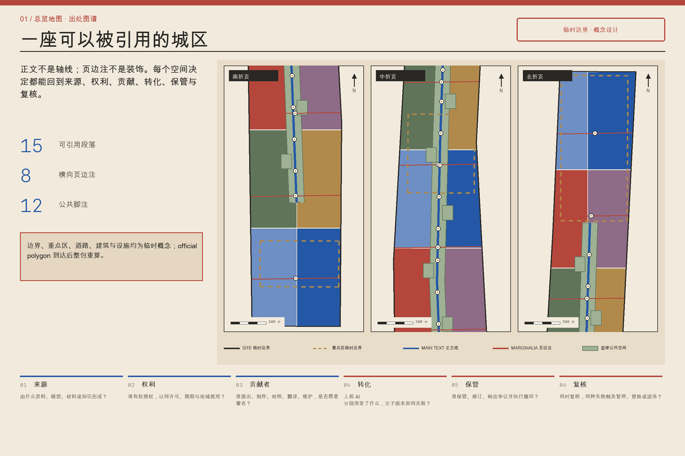
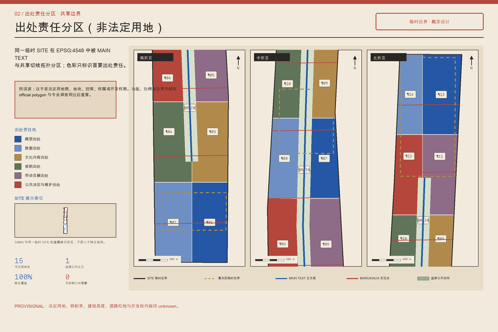
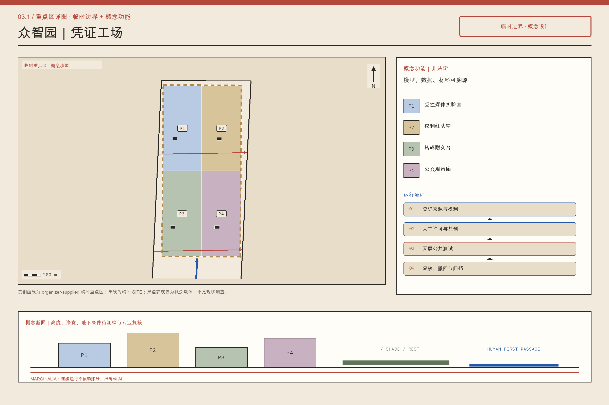
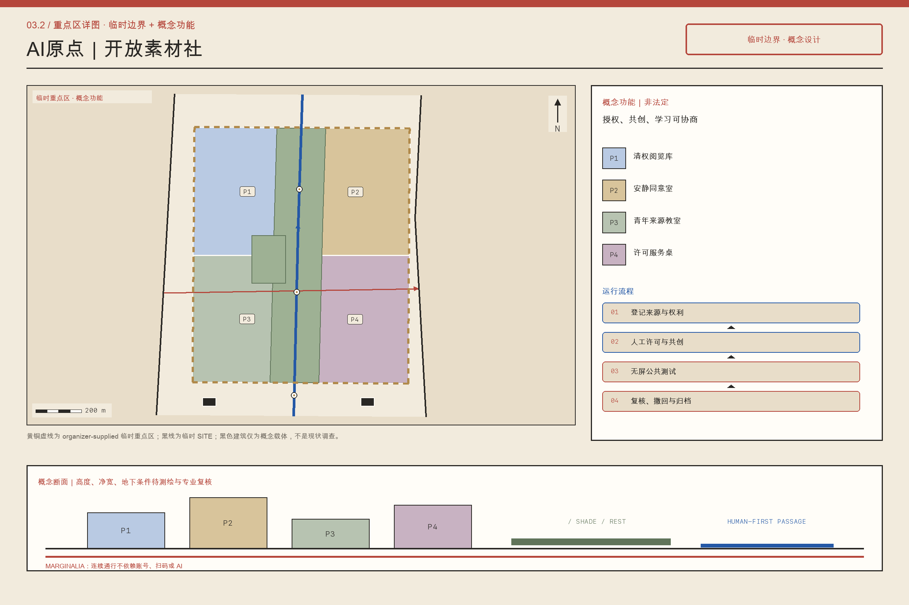
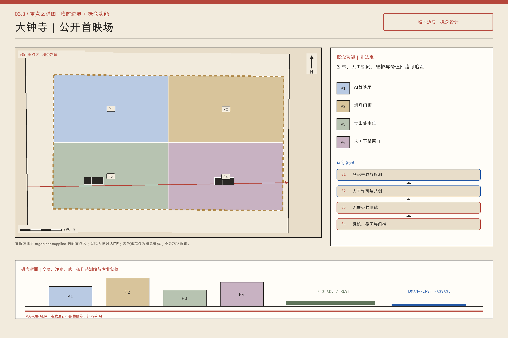
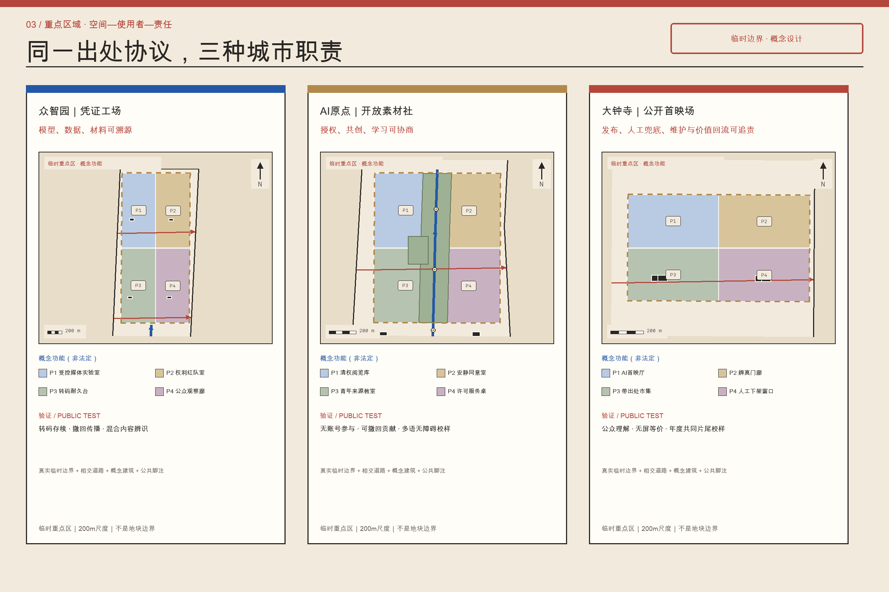
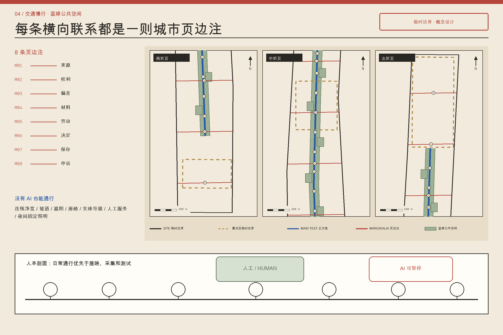
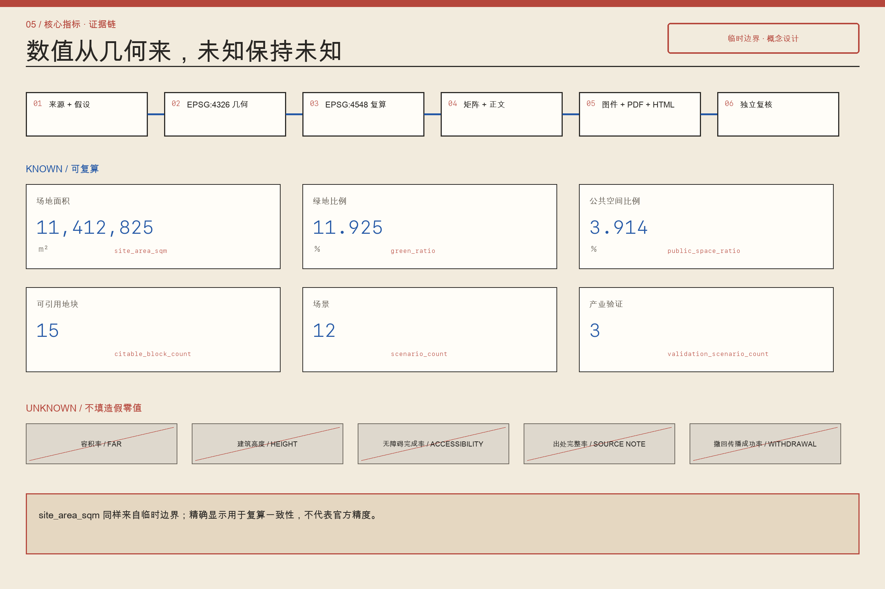

# 京张有出处 / JING-ZHANG, WITH CREDITS

## 设计依据与资料清单

“京张有出处”把出处从文末注释提升为贯穿规划、建设和运营的城市基础设施。方案首先服从官方公告和面向智能体任务书，再使用场地包、来源登记、结构化几何、指标与专业矩阵；任一结论都必须回答“谁提出、据何资料、怎样计算、由谁复核、何时失效”。当前总体范围与三处重点区使用临时概念边界，仅供方案生成、比较与复算，并非 official polygon、法定红线、产权边界、控规或审批依据。official polygon 到达后，所有裁切图层、面积、比例、项目时序、图件和网页必须整包重算，不能只替换底图。[source:OFFICIAL-ANNOUNCEMENT] [source:SOURCE-REGISTRY] [data:geometry/site_boundary.geojson#SITE-001]

全要素出处系统使用“六栏出处签”：模型栏记录版本、资料和人工复核；数据栏记录来源、许可、时效与删除条件；文化内容栏记录作者、采集者、授权和争议；材料栏记录产地、再生成分、碳边界与维修；劳动栏记录设计、施工、清洁、安保、标注和维护贡献；公共决定与维护栏记录议题、备选方案、责任单位、预算、周期及申诉入口。六栏是同一对象的最小充分说明，不形成个人信用分，也不以技术封装替代治理。公开层只呈现完成问责所必需的字段，敏感证据保留在授权层。

来源和假设约束几何，几何产生指标，指标与矩阵支持正文和图件；展示文件不得反向改写权威数据。15个可引用地块、8条横向页边注和12个脚注节点均有稳定编号，读者可从 CITE-BLOCK、ROAD-MARGINALIA 或 PUBLIC-NOTE 回到版本、责任者和证据。每张出处签同时提供更正、撤回、归档和到期机制，使署名与合法遗忘并存。完整依据保存在 `sources.json`、`assumptions.json`、`metrics.json`、`standard_matrix.json` 和 `design_depth_matrix.json`。[standard:PROJECT-OFFICIAL-ANNOUNCEMENT] [depth:existing_conditions_diagnosis]

## 三层范围工作框架

方案以“正文＋页边注”作为三个工作层次共同的空间语法。43.6平方公里统筹研究范围是引用网络，识别高校、企业、社区、文化机构、供应链与公共部门之间知识、材料、劳动和决定的流动。约11.4平方公里总体设计范围是可阅读的“正文”，把更新、公共空间、产业服务、交通、市政与风貌组织为可逐段实施的城市页面。三处重点区域是“编辑样张”，以地块、首层、建筑改造、街道断面和运营规则验证系统能否工作。范围面积来自当前临时概念几何，必须随 official polygon 整包重算。[depth:three_level_scope_framework] [metric:site_area_sqm]

空间正文由 MAIN-TEXT-01 承载，15个可引用地块使用 CITE-BLOCK-01 至 CITE-BLOCK-14 及 MAIN-TEXT-01 内的公共正文单元协同表达；它们不是封闭园区，而是在议事、许可、施工和维护环节可稳定引用的实施单元。8条 ROAD-MARGINALIA-01 至 ROAD-MARGINALIA-08 横向讨论来源、授权、偏差、材料碳、劳动维护、公共决定、保存删除和申诉更正，并通过安全过街、骑行连接、遮阴路径、首层开放和服务管线成为真实空间。

12个 PUBLIC-NOTE-01 至 PUBLIC-NOTE-12 位于站口、桥下、社区门厅、公园入口和产业院落，提供查询、补录、翻译、无障碍说明与人工帮助；8个 PUBLIC-MARGINALIA-01 至 PUBLIC-MARGINALIA-08 为页边注提供可停留的公共界面。读者由任一 CITE-BLOCK、ROAD-MARGINALIA 或 PUBLIC-NOTE 编号，都能进入地块、设施、场景、指标与合规链；没有智能设备的人也可通过纸质索引、触觉标识和服务台获得等价信息。[data:geometry/land_use.geojson#MAIN-TEXT-01] [data:geometry/public_space.geojson#PUBLIC-NOTE-01] [depth:overall_spatial_structure]

## 统筹研究范围产业与未来城市研究

在统筹研究范围内，“出处”被定义为AI产业的质量基础设施。创新不只取决于模型与算力，也取决于训练或检索资料是否合法、测试是否可复现、文化内容是否获授权、材料是否可追踪、隐形劳动是否被承认，以及公共决定是否可申诉。方案以“研究—开放—验证—采购—部署—维护—退役”全周期串联高校、实验室、企业、场景业主、社区与专业服务机构。每次跨机构交接都生成六栏出处签，记录对象、版本、适用边界、责任者、复核日期与退出条件；商业秘密可留在受控层，涉及公共安全和公共资金的结论必须形成可读摘要。[source:AGENT-TASKBOOK] [standard:PROJECT-AGENT-OPEN-CALL-TASKBOOK]

产业策略构建可信生产、公共验证与长期照管三类能力。可信生产使模型卡、数据说明、内容授权、材料记录和劳动贡献成为研发与采购的交付件。公共验证由三个重点区分工：众智园“凭证工场”测试模型、端侧设备、低速机器人和材料样件；AI原点“开放素材社”把高校成果、开放数据与文化资源转成可复用且权利清楚的素材；大钟寺“公共首映场”要求产品和内容在扩大部署前接受公众体验、无障碍测试和权利说明。长期照管则为维修工程师、社区编辑、版权与数据人员、模型审计者和设备维修者形成稳定岗位。

参考机制包括开源软件的版本与贡献记录、博物馆藏品的权利字段、建筑材料追踪、公共采购审计、数据集说明、模型卡和参与式预算；本方案提取其可验证方法，不复制案例外观。建议建立年度“城市出处体检”、季度开放编辑日和持续维护基金，资金可来自场景服务、公共采购维护比例和合作机构投入，严禁依靠售卖居民数据。统筹成果是一套可被地块调用、被横向页边注监督、在脚注节点接受公众纠错的共同协议。[depth:risk_missing_data] [standard:MOHURD-URBAN-DESIGN-MEASURES]

## 总体设计范围城市更新与控规深度城市设计

总体设计把可引用地块作为实施颗粒，将抽象规则转成用地、建筑、界面、交通、设施与项目。每个地块档案至少包含现状依据、允许用途、拆改留判断、开放空间、首层公共性、材料来源、运营主体、维护预算、公共决定记录和下一次复核日期。BUILDING-CARRIER-01 至 BUILDING-CARRIER-18 是出处服务的建筑载体，不预设其均为新建；沿街标识显示地块编号和公共承诺，网页展示版本差异，纸质档案为无智能设备者保留入口。缺少正式控规、权属和完整建筑调查时，高度、容积率、退线与最终拆改结论保持 unknown 或待确认。[standard:MOHURD-CONTROL-DETAILED-PLANNING] [depth:development_intensity_controls]

更新采用“先盘点、再开放、后建造”。先登记可保留建筑、成熟树木、既有商户、公共服务、材料和劳动网络；再用临时开放、首层穿行、共享会议室、夜间服务与小尺度修补测试需求；只有通过使用反馈、结构安全、权属和正式条件复核后，才进入永久改造或新建。ROAD-MAIN-TEXT 组织主要到达，8条横向页边注承担东西向缝合，把断点过街、无障碍坡道、遮阴休息、雨水花园、物流装卸和市政检修放入同一断面，并把取舍写入公共决定与维护栏。

总体页面同时容纳生产和日常生活：研发空间旁配置可负担协作空间与公共服务，展示必须说明背后的维修和清洁，文化活动必须显示授权与贡献，新增构件优先可拆卸、可维修、可追踪。用地、建筑、道路、绿地、公共空间和分期共同定义方案，正文不替代结构化证据。official polygon 到达后，稳定编号可以保留，但几何、面积、相邻关系和项目时序必须重验。[data:geometry/buildings.geojson#BUILDING-CARRIER-01] [data:geometry/roads.geojson#ROAD-MAIN-TEXT] [metric:building_footprint_area_sqm]

## 重点区域详细设计

众智园被设计为“凭证工场”。其五类空间包括：出处接收厅，把模型、数据、设备和材料送测要求转成清单；公共验证庭，支持模型红队、低速机器人、端侧设备与无障碍测试，并设置安全员和停止机制；维修与材料图书馆，陈列可替换部件、再生材料和维修手册；人工复核屋，承接对自动判断的质疑；供应者长廊，公开标准、方法和维护团队。临清河界面以雨洪、步行、骑行和测试共存为前提，技术展示不得侵占生态安全和连续通行。[data:geometry/key_areas.geojson#PROV-KEY-001]

北京AI原点社区被设计为“开放素材社”。开源编辑室服务高校、开发者和社区共同维护文档；数据阅览室解释许可、偏差、时效和删除条件；权利诊所提供版权、隐私、知识产权和开源许可咨询；近校协作院为学生、初创团队和居民提供低门槛会议、路演和夜间学习；引用花园把铁路史、社区记忆与当代科研成果以可撤回授权并置。展示必须标明个人与集体贡献，不以企业冠名覆盖原作者，也不把公开参观等同于开放许可。[data:geometry/key_areas.geojson#PROV-KEY-002]

大钟寺被设计为“公共首映场”。公共首映厅让智能体、终端与文化内容先接受公众体验再扩大部署；内容权利库保存授权范围、版本和到期安排；夜间维护者间为清洁、安保、物流、设备与内容运维提供真实工作空间；四象限出处路口以连续过街、遮阴和统一导视缝合站点周边；公共档案屋顶举办年度复盘、失败案例展和下一年度议程讨论。三处重点区均为临时概念范围，表达可迁移的功能关系和治理规则，不构成正式地块或建设许可。[data:geometry/key_areas.geojson#PROV-KEY-003] [depth:three_key_area_detailed_design]

## AI 创新生态、人才画像与 AI+ 场景

方案服务至少六类人：研究者需要可复现实验和合规资料；创业团队需要低成本测试、许可咨询与首个公共用户；居民需要看懂AI为何出现、如何退出和向谁申诉；文化创作者需要署名、授权范围与二次使用边界；一线维护者需要被预算、空间和署名系统看见；规划与公共服务人员需要可审计但不过度采集的依据。儿童、老年人、视听或行动障碍者、非中文使用者及无智能设备者是每个场景的强制测试者。自动化建议只能担任“可质询的办事员”，不能替代审批、医疗诊断、执法或公共表决。[source:AGENT-TASKBOOK] [depth:risk_missing_data]

12类场景与结构化场景矩阵逐项一致：京张有出处导览、企业出处助手、公共安全内容复盘、转码后凭证存续测试、撤回传播链测试、史实—修复—合成辨识测试、口述史同意与转写、青少年来源素养工坊、多语字幕与无障碍校样、带出处创作者市集、材料与构件出处台、共同片尾年度校样。其中 SC-04、SC-05、SC-06 是三项产业验证，分别检查内容凭证经转码后的存续、授权撤回能否传播到派生版本、以及公众能否区分史实、修复与合成；测试只使用合成或已清权素材，并设置人工替代、停止条件、事件记录和独立复核。AI输入遵循目的限定与最小化原则，输出显示资料日期、置信程度、责任主体和人工入口。

模型更新、资料撤回或授权到期后，关联场景自动进入复核队列；高风险服务在复核完成前降级为人工服务。场景落在可引用地块，通过横向页边注接受跨区检查，并在脚注节点提供线下解释。成功不以调用次数衡量，而以纠错响应、无障碍完成率、人工替代可用性、维护闭环和被承认贡献者覆盖率衡量。[data:geometry/public_space.geojson#PUBLIC-NOTE-01] [data:geometry/public_space.geojson#PUBLIC-MARGINALIA-01] [metric:public_space_ratio]

## 用地、建筑规模与拆改留方案

用地组织以修补既有结构和混合日常使用为主，不因主题命名制造封闭园区。可引用地块容纳研发验证、开放素材、公共服务、文化展示、维修后勤、绿色空间与日常商业；每个功能都说明允许相邻关系、首层开放时段、噪声物流边界和退出后的替代用途。MAIN-TEXT-01 维持总体连续，CITE-BLOCK-01 至 CITE-BLOCK-14 提供可讨论的功能颗粒。用地编码遵循正式分类指南，临时概念边界只支持当前比较，不能推导法定地类、权属或开发权益。[standard:MNR-LAND-USE-CLASSIFICATION-GUIDE] [data:geometry/land_use.geojson#CITE-BLOCK-01]

拆改留采用证据阈值而非审美判断。具有历史信息、成熟使用网络、可维修结构或显著隐含碳价值的建筑优先保留；可通过加固、节能、无障碍、首层开放和机电更新继续使用的建筑优先改造；只有在安全不可达标、公共连通无法解决且替代方案完成全生命周期比较时，才进入拆除候选。由于测绘、结构鉴定、文保、产权和正式控规不完整，BUILDING-CARRIER-01 至 BUILDING-CARRIER-18 表达设计载体与待复核对象，不能宣称某栋建筑已获准拆建。[depth:retain_renovate_demolish] [depth:height_massing_character]

新建与改造构件通过六栏出处签记录供应者、产地、再生成分、碳核算边界、连接方式、维修手册、可替换部件、施工和维护贡献。建筑基底面积可由当前图层复算，但总建筑面积、容积率、高度、密度和退线在缺少official control时保持 unknown。A3、A0和HTML只展示与 `metrics.json` 一致的数值；official polygon 或建筑底数更新后，地块档案、材料清单和指标同步重算。[data:geometry/buildings.geojson#BUILDING-CARRIER-18] [metric:building_footprint_area_sqm]

## 交通、轨道、市政与公共服务设施

交通系统把8条横向页边注作为优先缝合工程。ROAD-MARGINALIA-01 连接资料生产者与公共阅览点；02串联权利咨询和文化内容场所；03连接测试区与多样用户；04组织材料运输、回收和展示；05保障维护人员安全到达；06连接公共议事空间；07联系保存、归档和受控删除；08把人工复核与申诉入口连成网络。每条路线同时校核连续步行、安全骑行、轮椅坡度、遮阴座椅、夜间照明、装卸时段与应急通行，不把技术设施放入无障碍净宽。[data:geometry/roads.geojson#ROAD-MARGINALIA-01] [depth:traffic_rail_slow_parking]

12个脚注节点是小而可靠的公共设施：清河查询亭、众智园测试登记台、维修借用柜、人工复核台、高校侧开放资料站、原点权利诊所、引用花园口述史台、公园跨越辅助站、大钟寺站无障碍服务台、公共首映反馈台、夜间维护补给点、公共档案与申诉台。PUBLIC-NOTE-01 至 PUBLIC-NOTE-12 提供纸质目录、语音与触觉信息、翻译和面对面帮助；二维码只是补充，不是唯一入口。[data:geometry/public_space.geojson#PUBLIC-NOTE-12]

市政系统强调可维修和可交接。传感器、端侧设备、充电、雨水、照明与信息屏均记录能源来源、维护责任、数据保留和停运方式；预测性维护只辅助排程，不能取消定期人工巡检。道路红线、轨道接口、地下管线、消防、防洪和容量缺失时，相关动作列为待专业复核，不伪装为已批准工程条件。[data:geometry/constraints.geojson#CONSTRAINT-PROVISIONAL-SITE] [depth:municipal_new_infrastructure]

## 蓝绿空间、公共空间与城市风貌

蓝绿系统是城市正文的公共底页，而不是技术展示的背景。现有绿地、水系、成熟树木、雨洪路径和日常活动先被登记，再叠加可引用地块与横向联系；任何AI装置、展亭或活动都必须证明不会削弱生态连续、无障碍通行和免费停留。GREEN-MAIN-TEXT-01 维持总体绿色连续，GREEN-MARGIN-01 至 GREEN-MARGIN-07 提供横向渗透、遮阴和雨洪调节。绿地和公共空间比例来自提交几何，必须随临时概念边界替换而整包重算。[data:geometry/green_space.geojson#GREEN-MAIN-TEXT-01] [metric:green_ratio] [metric:public_space_ratio]

公共空间遵循“先日常、后活动”的时间规则：通勤、休息、儿童游戏、老年停留、无障碍通行和维护作业享有底线空间，发布会、测试和商业展示只能预约剩余容量。临时占用必须显示主办方、授权期限、噪声上限、清场责任和投诉入口。座椅、树池、铺装、照明与导视均通过六栏出处签说明材料、施工与维护，使景观老化、零件替换和资金责任可追踪。[data:geometry/public_space.geojson#PUBLIC-MARGINALIA-08]

城市风貌不复制铁路符号，也不以屏幕密度表现“智能”。识别系统来自编辑文化：正文信息采用稳定清晰的主牌；页边注以横向色带提示跨专业问题；脚注节点采用小尺度编号和人工服务标识。历史叙事必须区分档案事实、社区记忆与设计诠释，并保留作者、采集者、授权者和争议说明。夜景控制亮度、蓝光与运行时段，优先照亮行走面和人工服务入口；专业风貌控制待正式文保、控规与景观条件到位后校准。[depth:blue_green_public_space] [standard:MOHURD-URBAN-DESIGN-MEASURES]

## 更新项目清单、实施政策与分期计划

实施采用“规则先行、轻量验证、空间更新、长期照管”四步。准备期建立六栏出处签字段、稳定编号、公众申诉和 official polygon 替换流程，同时补充现状、权属、文保、市政与无障碍调查。PHASE-001 以可逆方式启动众智园凭证工场样间、原点开放素材社试运营和大钟寺公共首映周，并建设优先页边注与脚注节点；PHASE-002 在测试通过后推进建筑改造、首层开放、慢行缝合、蓝绿和市政工程；PHASE-003 依据年度体检决定扩展、调整或退役。[data:geometry/phasing.geojson#PHASE-001] [depth:phasing_implementation]

更新项目包括：出处签与公众门户、凭证工场、开放素材社、公共首映场、八条横向页边注、十二个脚注节点、材料与维修图书馆、权利诊所网络、贡献与维护基金、年度城市出处体检。每个项目必须列出位置、公共受益者、牵头与协作主体、审批依赖、资本支出、至少五年运营支出、维护岗位、数据与版权风险、停止条件和效果指标；没有责任主体或维护预算的项目不得进入永久建设。[data:geometry/phasing.geojson#PHASE-002] [depth:renewal_project_list]

政策工具包括公共采购的出处交付条款、文化内容授权模板、数据最小化协议、材料来源与维修记录、劳动贡献披露、公共决定记录、独立申诉和年度第三方抽检。社区通过季度编辑日提出更正，专业机构核验，运营委员会公开处理时限与理由。成功不是项目数量，而是人员更替、模型升级、授权撤回和资金波动后仍能交接。正式权属、资金与审批未落实的内容均为建议路径，不构成政府承诺。[data:geometry/phasing.geojson#PHASE-003] [source:OFFICIAL-ANNOUNCEMENT]

## 指标体系、面积复算与合规矩阵

指标分为三组。第一组是可由当前几何复算的空间指标，包括总体范围面积、建筑基底面积、绿地比例、公共空间比例和重点区数量；正文不另行抄写可能变化的数值，权威值、单位、公式、来源文件、置信度和假设统一引用 `metrics.json`。第二组是等待正式条件的管控指标，包括总建筑面积、容积率、建筑高度、密度、退线、道路红线和设施容量，继续标记 unknown。第三组是运营绩效，包括出处完整率、授权到期处理率、纠错响应、人工替代可用率、无障碍完成率、维护闭环率和被承认贡献者覆盖率，不伪装成控规指标。[metric:site_area_sqm] [metric:building_footprint_area_sqm] [metric:key_area_count]

每个 known 指标必须记录值、单位、来源、公式、置信度和假设；每个 unknown 指标说明缺口、责任主体与补数后的复算动作。可引用地块、页边注、脚注节点和场景使用唯一ID，图纸、HTML、正文、矩阵与几何不得另起一套数字。运营指标保留分子、分母和观察周期，禁止以单次活动人数替代长期公共价值，也不得把居民画像当作绩效资产。[metric:green_ratio] [metric:public_space_ratio] [depth:metrics_recalculation]

合规矩阵逐条连接公告、任务书、章节、图层、指标、图纸、HTML、来源、假设与自检。任何标记完成的任务都必须存在可打开的证据；只有概念文字的任务保持部分完成。提交前执行“来源可达、几何有效、指标一致、矩阵闭合、双语等义、版权清权”六项门禁。official polygon 到达后必须重跑面积、拓扑、图件、HTML和矩阵，而非沿用旧结论。[data:geometry/site_boundary.geojson#SITE-001] [data:geometry/constraints.geojson#CONSTRAINT-PROVISIONAL-SITE]

## 风险、版权与合规说明

首要风险是把“出处”误解为监控。方案禁止建立居民信用分、跨场景身份画像和永久行为轨迹；公开贡献默认以团队或经同意的姓名展示，一线劳动者可匿名或集体署名。敏感资料留在授权保管层，公开页面只给出必要摘要；任何自动判断都有人工替代、停止和申诉入口。第二类风险是把出处字段当成正确性保证，因此每张六栏出处签同时显示置信度、争议、失效日期和复核者，允许新证据推翻旧结论。[depth:risk_missing_data] [source:SOURCE-REGISTRY]

第三类风险来自版权、商业秘密和文化挪用。图像、字体、地图、代码、模型、数据集、口述史、企业标志与生成内容都记录权利状态；“可查看”不等于“可训练”或“可再发布”。社区记忆可以撤回，未成年人和脆弱群体资料采用更高授权门槛，商业秘密只公开验证摘要。HTML不加载远程脚本、字体、地图瓦片、表单或跟踪器；中英文正文、图件、A3、A0与HTML保持实质等义，不能用翻译掩盖责任差异。

第四类风险是空间与实施的伪精确。SITE-001、PROV-KEY-001 至 003 和 CONSTRAINT-PROVISIONAL-SITE 都是临时概念表达，不代表 official redline、产权、文保、控规或工程条件；容积率、高度、道路、市政、消防与防洪等缺失内容保持待确认。第五类风险是维护失灵，因此永久项目必须绑定维护预算、岗位、备件、停运和退役方案。方案不声称获得政府批准或资金承诺，所有成果均是供专业团队、产权主体和公众继续校核的设计建议。[data:geometry/constraints.geojson#CONSTRAINT-PROVISIONAL-SITE] [standard:MOHURD-CONTROL-DETAILED-PLANNING]

## 参考资料

资料遵循“权威依据—登记来源—导航材料—设计推导”四级关系。一级包括官方公告、面向智能体任务书、城市设计与控规文件、用地分类指南，决定任务、范围、成果深度和表达边界；二级是 `data/source_registry.json` 登记的公开、已清权或临时资料，决定能否进入正式证据链；三级是 `agent_fact_pack.md` 及配套CSV，只承担阅读导航，不产生新的权威事实；四级是本方案生成的几何、指标、矩阵、图件和文字，必须回指前三类资料或明确标为设计假设。[source:SITE-PACKAGE] [source:PROCESSED-FACT-PACK]

核心文件包括 `brief/public-brief.md`、`brief/site-package/design_brief.json`、`agent_taskbook.json`、`allowed_design_space.json`、`enums/`、`ranges/planning_limits.json`、`geometry/provisional_boundaries.geojson`、`data/source_registry.json`、`project_scope_summary.csv`、`agent_task_requirements.csv`、`source_use_matrix.csv` 与 `missing_data_checklist.csv`。具体URL、路径、许可、用途和访问日期以 `sources.json` 为准，正文不再制造一套互相冲突的书目。[source:OFFICIAL-ANNOUNCEMENT] [source:AGENT-TASKBOOK]

引用时，官方材料用于说明要求，专业标准用于说明方法与深度，临时概念几何只用于当前空间生成和复算，案例只用于比较机制，不能成为场地事实。若链接失效、授权变化、资料更新或 official polygon 发布，维护者须记录新旧版本、影响范围和重算结果，不可静默覆盖旧文件。六栏出处签自身也服从同一规则：它是可质询、可更正、可撤回、可归档的公共工作记录，不是永恒真相。[standard:MNR-LAND-USE-CLASSIFICATION-GUIDE] [depth:existing_conditions_diagnosis]
