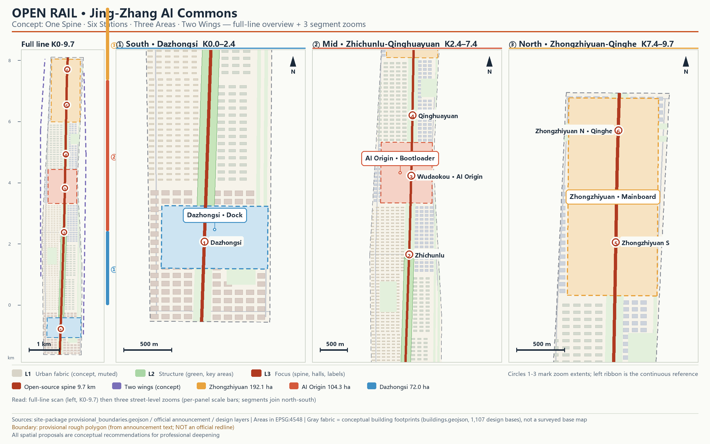

# OPEN RAIL: Jing-Zhang AI Commons Urban Design Proposal

> **Concept disclaimer**: All spatial, operational, branding and policy content in this proposal is an open co-creation recommendation — a "concept proposal" or "reference scheme" for professional teams to deepen. It does not replace statutory planning and does not constitute a government-approved conclusion. Every area and ratio can be recomputed from the package GeoJSON in EPSG:4548. The overall design boundary and the three key areas use provisional rough boundaries (provisional_constraint); all layers and metrics must be recalculated once official boundaries are released. The HD00-1601 block-level regulatory plan was approved on 11 August 2026, and the full text of the public edition of the district regulatory plan (text, drawings and plan-drawing sheets) went online via a mirror channel on 26 August 2026 and is registered as a source of this package [source:HD00-1601-CONTROL-PLAN-PUBLIC] — this source has not yet entered approved_formal_sources and is used as public background information pending source-registry review, constituting no statutory basis; mirror and news-calibre information yields no plot-level floor-area ratio, height, setback, red-line, approval or implementation conclusions; this package registers its district-level benchmarks (benchmark intensity zoning, benchmark height zoning, total building scale of 24.08 million sqm, planning scope of 16.7 km²) as the public comparison baseline for the design model (pending source-registry review) — plot-level plan-drawing values still require reading the drawings to obtain, and this package derives no plot-level control values from them. On that basis the proposal offers a concept-level-deepening direction (concept proposal), not a parallel alternative to the statutory plan [source:HD00-1601-CONTROL-PLAN-APPROVAL].

> **Review inquiry quick view**: the table below maps the seven review dimensions' most frequent questions to this proposal's answers and their current evidence status; every answer traces back to a machine-readable entry inside the package. Evidence status is stated honestly — design-model values are never passed off as measured values. Evidence grading legend: **✓ in place** — evidence ships inside the package, independently checkable, no external dependency; **◐ mechanism ready** — protocols and mechanisms are in place, figures await official data; both pending-data cases share the same root cause (organizer geometry and base data unpublished), with trigger conditions and recalculation paths registered in `assumptions.json` — nowhere is a placeholder filled with an inferred value.
>
> | Review dimension | This proposal's answer | Current evidence status |
> | --- | --- | --- |
> | Relevance to brief | **The "one spine, six stations, three areas, two wings" structure derives level by level from the announced three-tier scope**; agent tasks agent.1–agent.6 mapped item by item; tracks cover heritage narrative, AI origin community and youth-friendly public space | ✓ 23 task-coverage entries in `compliance_matrix.json`; three-tier scope areas within <0.5% of announced figures (recomputed from GeoJSON) |
> | Originality | **OPEN RAIL translates railway vocabulary (mainline / station hall / commit / merge) into open-source civic-governance vocabulary, and this submission package itself is the mechanism's verifiable first run** (PR / review / changelog isomorphic with the governance mechanism); **the deliverables are sedimented as public assets under the CC-BY-SA-4.0 open licence**, with per-path licence disclosure and a four-factor verifiable adoption entry point for nine core assets | ✓ The concept narrative runs through all deliverables; two community open standards adopted at component level as machine-readable governance contracts; first-publication timeline in `assets/media/priority-evidence.md`; full-path disclosure in `file-rights-inventory.json` (coverage 1.0) + asset register in `open-asset-register.json` (adoption records honestly 0) |
> | AI & planning innovation | **Every AI touchpoint carries a privacy boundary, an operating entity and a post-shutdown equivalent path**: 13 scenario cards each declare them; edge-compute nodes brought into the park; AI governance sandbox run as a public experiment; this package itself is the disclosed run of an AI-assisted urban-design workflow | ✓ `seb-adoption.json`, `switchback-adoption.json`, `ai-workflow-pipeline.json` included for review; 3 test-validation scenario cards in place |
> | Feasibility | **Publicly recomputable implementation economics as a first-class citizen**: five-element implementation cards for 8 renewal projects + trigger-gated sequencing methodology + six-type funding matrix + four-link accountability chain + lifecycle O&M ledger framework + **an O&M funding-gap table (ROM, anchored to public unit-price benchmarks, all arithmetic machine-checked)**; the six data gaps (ownership, named operators, statutory controls, municipal capacity, costs, measured benefits) each carry a trigger-executable deterministic resolution path; **from v3.0, four of the six gaps have gained public-anchor comparison** — the heritage protection-scope and construction-control-zone roster plus its textual boundary description (Jing-Zheng-Fa [2025] No. 3 + the municipal heritage authority's database), district-level benchmarks of the regulatory plan, municipal power capacity (Dazhongsi 110 kV / planned Qingyun 220 kV), and in-belt named-entity precedents (the district Bureau of Landscape and Forestry + Haidian Municipal Group, the China Railway Beijing Group transfer, and the Haikai company), narrowing the external pending-trigger conditions to plot-level plan-drawing values and project-level approvals | ◐ Mechanism files ship in the package (`implementation-cards.json`, `sequencing-methodology.json`, `funding-matrix.json`, `lifecycle-om-framework.json` + new `om-funding-gap.json`, `operator-qualification.json`, `statutory-reconciliation.json`, `capacity-preassessment.json`, `parametric-cost-model.json`); benefit figures stay "pending baseline", no ranking conclusions output; quantified O&M account interval 32.673–93.99 million CNY/yr, with the gap honestly registered as the full interval (commitment coverage 0); the five categories of v3.0 public anchors are registered in `sources.json` and have triggered the first real reconciliation in `statutory-reconciliation.json` (difference ledger, 2 entries) |
> | Public interest & inclusivity | **Everyone can still use it after AI is switched off**: every AI service point carries a mandatory non-digital equivalent path; six user profiles cover elderly, disabled and low-digital-literacy residents; P1–P5 carry measurement-effective commitment thresholds with breach dispositions; accessibility design elements mapped item by item to GB 55019-2021 requirement areas (design-intent compliance, pending field certification); the blue-green skeleton is overlaid with sponge, heat-island and carbon climate accounts; a public dashboard statically re-discloses indicators, warnings, review and self-check status | ◐ SEB schema enforces the ai_off_path field; `baseline-protocols.json`, `commitment-thresholds.json`, `accessibility-mapping.json`, `climate-carbon-framework.json`, `dashboard-mockup.json` included; P1–P5 measured values honestly marked "pending baseline" |
> | Risk & compliance awareness | **All metrics independently recomputable, unknown fields never faked**: four risk classes disclosed item by item; unregistered sources downgraded to "background information pending review"; a red-team review proactively registers outcome-level failure modes with early-warning indicators | ✓ Eight-dimension matrix in `risk.json` plus the failure-mode library in `failure-modes.json`; `node visual/assets/recompute_metrics.js` recomputes offline 12/12 PASS plus 13 machine checks on the O&M funding-gap table PASS; recalculation path registered in `assumptions.json` (A-BOUNDARY-002) |
> | Completeness of expression | **Full bilingual deliverables, reproducible offline, with real fabric, three-level hierarchy and a full-line/segment multi-panel composition**: narrative / HTML / A3 / A0 / figures / video with captions and transcript; originally drawn programmatic figures — every plan figure now carries a conceptual building-fabric base (1,107 footprints) organized as fabric-structure-focus layers; the overall figure is a full-line overview plus three segment zooms (K0-9.7 mileage ticks and street-level detail; station labels verified clip-free by programmatic bounding-box checks), plus a spine experience scroll for the walking sequence; from v3.1 all 44 pages of the four A3/A0 booklets carry a page-by-page map (`visual/assets/pdf-page-map.json` + the bilingual visual-page table, 24 consistency checks), and key-area/station labels are verified overlap-free by collision detection | ✓ Bilingual deliverables mapped one-to-one; offline rendering reproducible with coverage evidence; this table itself is the review entry index |

> **Falsifiability conditions of core claims**: the conditions below make this proposal's main claims independently falsifiable by reviewers and professional teams — triggering any one condition invalidates the corresponding claim or requires its reversion; no vague wording is used to dodge the test.
>
> 1. **Continuity claim**: if, once official boundaries are released, any segment of the Open Rail Spine cannot maintain continuous pedestrian and cycle through-movement (through-rate below 100%), the "one spine" structural claim fails [depth:overall_spatial_structure]. Substrate evidence (registered in v3.0): the Jing-Zhang Railway Heritage Park on which the Open Rail spine rests was fully opened upon phase-2 completion on 2026-08-06, with the 9 km urban cultural greenway from Xizhimen to the North Fifth Ring Road connected end to end (the southern section covering 70 communities and 450,000 residents and opening 9 city branch roads; public source: sources.json entry JINGZHANG-PARK-PHASE2-OPEN) — the public-space base continuity of this package's 9.7 km open-source trail mainline now has physical evidence of the full through-route, while through-rate verification still rests on in-package geometric recomputation.
> 2. **Equivalent-path claim**: if any SEB node's ai_off_path points to an online entrance of the same system, or the named non-digital equivalent path does not exist on site, the "usable after AI is switched off" design constraint fails [source:SEB-SPEC].
> 3. **Governance-contract claim**: if any scenario card entering pilot cannot execute the four-option disposition of the 90-day public review (renew / shrink / suspend / switchback), the Switchback Protocol adoption fails [source:SWITCHBACK-PROTOCOL].
> 4. **Recomputation claim**: if recomputing any core metric from the package GeoJSON in EPSG:4548 disagrees with `metrics.json` beyond the disclosed precision, or any sub-item product, account subtotal, reserve ratio, total or gap identity of the O&M funding-gap table (`om-funding-gap.json`) disagrees on recomputation, the "all metrics recomputable + gap table machine-checkable" claim fails [metric:site_area_sqm].
> 5. **Funding-coverage claim**: if any of the 8 renewal projects cannot find at least one pathable funding type in the six-type funding matrix, the matrix's coverage claim fails [depth:phasing_implementation].
> 6. **Accountability claim**: if any scenario card's operating entity is not grounded in a named accountable_operator at pilot approval **under the naming-conversion protocol (`operator-qualification.json`)**, the "accountable category entities" claim fails [source:SWITCHBACK-PROTOCOL].
> 7. **Inclusiveness-commitment claim**: if any commitment threshold (`commitment-thresholds.json`) is breached once the corresponding measured baseline exists, and the breach disposition (rectification, downgrade or suspension) is not executed, the "inclusiveness commitment" claim fails [source:SEB-SPEC].
> 8. **Licence-disclosure completeness claim**: if any manifest-registered path lacks licence disclosure in `file-rights-inventory.json`, or any disclosed licence/handling misstates the actual terms (including the boundary notes for embedded font subsets and third-party components), the "per-path licence verifiability" claim fails [depth:open_sedimentation].

## Design Basis and Source List

This proposal rests on four categories of material. The primary authority is the official pre-qualification announcement issued by the Haidian Branch of the Beijing Municipal Commission of Planning and Natural Resources, which defines the project purpose, the three-level scope and the area figures [source:OFFICIAL-ANNOUNCEMENT]. The second is the repository's public site package, providing the structured brief, scope levels, enumerations and validation rules [source:SITE-PACKAGE]. The third is the agent-facing taskbook, which stipulates the ten co-creation principles, three positionings, five functions, three areas with two wings, and six mandatory agent tasks [source:AGENT-TASKBOOK]. The fourth is public background material on the Jing-Zhang Railway Heritage Park and the Qinghuayuan Station heritage site, used only for cultural narrative context, never as a basis for spatial controls [source:JINGZHANG-HERITAGE-PARK]. The fifth is the HD00-1601 block-level regulatory detailed plan: approved on 11 August 2026, with the full text of the public edition of the district regulatory plan (text, drawings and plan-drawing sheets) published online via a mirror channel on 26 August 2026 and registered as a source of this package — this source has not yet entered approved_formal_sources and is used as public background information pending source-registry review, constituting no statutory basis; mirror and news-calibre information yields no plot-level floor-area ratio, height, setback, red-line, approval or implementation conclusions; this package extracts its district-level benchmarks (benchmark intensity zoning of grade-5: 1 / grade-4: 19 / grade-3: 41 / grade-2: 4, benchmark height zoning of 36 / 45 / 60 / 80 / 100 m, total building scale of 24.08 million sqm, planning scope of 16.7 km², the "one belt" of the "one belt, one axis, two centres, multiple nodes" structure being the Jing-Zhang Railway Heritage Park industrial innovation belt, and article 83, "advancing the building of AI innovation blocks") as the public comparison baseline for the design model (pending source-registry review) [source:HD00-1601-CONTROL-PLAN-PUBLIC] [source:HD00-1601-CONTROL-PLAN-APPROVAL]; plot-level plan-drawing values must be obtained by reading the drawings, and this package derives no plot-level control values from them — on that basis it offers a concept-level-deepening direction (concept proposal).

Source usability was checked item by item against the public source registry: no background-only source supports any spatial conclusion in this proposal, and no non-public or unclear-provenance data is used [source:SOURCE-REGISTRY]. The industry and cultural-narrative judgments are additionally grounded in three official Haidian public documents (the district's 15th Five-Year Plan Outline, the 2026 district government work report, and the district party secretary's signed article in Qianxian magazine — each verified item by item at its original URL before registration, background reference only; see References 11–13) [source:HD-FYP-PLAN-2026] [source:HD-GOV-REPORT-2026] [source:HD-QIANXIAN-ARTICLE-2026]. Because the official precise redline has not been published, the overall design boundary and the three key areas use the repository's provisional rough boundary; its derivation method and precision limits are fully disclosed in the Three-Level Scope Framework section [source:BOUNDARY-SOURCE]. Complete indexes of sources, metrics, standards, design depth and task coverage are recorded in `sources.json`, `metrics.json`, `compliance_matrix.json`, `standard_matrix.json` and `design_depth_matrix.json`; the prose keeps only key citations attached to specific judgments.

The sixth is the five categories of public anchors registered in v3.0 (each verified item by item at its original URL): **① heritage boundaries** — Jing-Zheng-Fa [2025] No. 3 published the eleventh batch of the heritage protection-scope and construction-control-zone roster (item 26: the Qinghuayuan Station heritage site), and the municipal heritage authority's database now discloses its textual boundary description (protection-scope four-side parallel lines plus construction-control zones of class Ⅰ + Ⅴ, 3 sub-zones), with coordinates and drawings issued separately and not published [source:HERITAGE-BOUNDARY-ROSTER-2025] [source:QINGHUAYUAN-BOUNDARY-DESCRIPTION]; **② municipal power capacity** — the Dazhongsi 110 kV substation (4×50 MVA, 2 remaining outgoing bays, peak load rates of 60% / 63% / 51% / 79%) and the planned Qingyun 220 kV substation (2×180 MVA, in service in 2026) [source:DZS-UTILITY-CAPACITY-2025]; **③ named-entity precedents** — the Haidian District Bureau of Landscape and Forestry + Beijing Haidian Municipal Group jointly operating the park, China Railway Beijing Group transferring the heritage-management rights of the Qinghuayuan Station site in 2022, and Beijing Haikai Urban Renewal and Construction Development Co., Ltd. implementing land supply for the Dazhongsi pilot zone [source:JINGZHANG-PARK-OPERATION-MODEL]; **④ physical evidence of the full through-route** — the park's phase 2 fully opened on 2026-08-06 [source:JINGZHANG-PARK-PHASE2-OPEN]; **⑤ district-level benchmarks of the regulatory plan** — see the fifth category. These anchors have triggered the first real reconciliation in `statutory-reconciliation.json` (difference ledger, 2 entries: heritage-zone elements held as conceptual placeholders under L2; massing intensity and height held pending plan-drawing values under L1), the power-capacity anchor registration in `capacity-preassessment.json` (status upgraded from unknown to comparable), and the named-entity precedent registration in `operator-qualification.json` (precedents are path evidence only and constitute no operating commitment).

Main data gaps (updated in v3.0): the official precise boundary and precise key-area polygons, plot-level regulatory plan-drawing values (the public edition already provides district-level benchmark intensity and height zoning; plot-level FAR, setbacks and the like must be obtained by reading the drawings and remain unknown), existing-building and property-rights base data, heritage boundary coordinates and drawings (the roster and the textual boundary description are now published), and project-level municipal connection approvals and O&M account pricing. These gaps are registered as pending conditions; the relevant sections are marked "to be completed upon official data" instead of being filled with inferred values [depth:existing_conditions_diagnosis]. One planning-interface item gains cross-confirmation from an official document: the 2026 district government work report (an official document) records that "the regulatory detailed plan for the blocks along the Jing-Zhang Railway Heritage Park passed technical review" — but technical review is not plan-drawing publication, and this package derives no control indicators from it [source:HD-GOV-REPORT-2026].

## Three-Level Scope Framework

The three scope levels follow the announcement. The coordinated research area covers about 43.6 km² (North Fifth Ring Road to the north, Jingzang Expressway to the east, Xizhimenwai Street to the south, Wanquanhe Road to the west) and hosts industry and future-city research. The overall design area covers about 11.4 km² and hosts urban renewal and regulatory-plan-level urban design. The key detailed design areas total about 368.4 ha — from north to south: Zhongzhiyuan AI Acceleration Area (about 192.1 ha), Beijing AI Origin Community (about 104.3 ha) and Dazhongsi AI Industry Cluster (about 72.0 ha) [source:OFFICIAL-ANNOUNCEMENT] [depth:three_level_scope_framework].

The recomputed area of the submitted design boundary is 11,412,825 sqm, a deviation of about 0.11% from the announced 11.4 km²; the provisional key-area polygons recompute to 192.9, 104.3 and 72.0 ha respectively, all within 0.5% of the announced figures [metric:site_area_sqm] [data:geometry/site_boundary.geojson#SITE-001].

**Provisional boundary disclosure**: because the official precise redline has not been released with the public materials, all geometry in this proposal derives from `provisional_boundaries.geojson` (provisional_rough, inferred from the announcement's textual extents and area constraints). It is not an official redline and cannot be used for approval, precise area determination or engineering purposes; all land-use, green, public-space and building layers and every metric derived from it are interim design-model values. Upon release of official boundaries, the following must be recomputed: the full land-use partition, green and public-space layers, the three core metrics, building-footprint statistics and all drawings; the recalculation path is registered in `assumptions.json` (A-BOUNDARY-002) [source:BOUNDARY-SOURCE].

The cascade logic: the research area answers "where does the industry go and how does the urban form change"; the overall design area translates the industrial strategy into spatial structure, land use and system organisation; the key areas turn structure into recognisable public nodes and renewal projects. The conceptual spatial structure "one spine, six stations, three areas, two wings" is developed at the overall-design level in the following sections [depth:overall_spatial_structure].

## Coordinated Research Area: Industry and Future City Research

**The industrial base in official statistics** (background reference, not used for spatial conclusions): by the end of the 14th Five-Year period Haidian had become the first district-level unit nationwide to cross the trillion-yuan GDP mark, at around 26% of Beijing's GDP; its AI core industry exceeds RMB 280 billion and is described in an official planning document as the region with the strongest industrial base, densest talent and most active product iteration in China's AI field [source:HD-FYP-PLAN-2026]. The 2026 district government work report further deploys "building AI innovation blocks by relying on the AI Origin Community, the AI 40°N Community and the Jing-Zhang Railway Heritage Park innovation belt", with 122 registered large models, nearly 60% of the citywide total [source:HD-GOV-REPORT-2026]; the district party secretary's signed article discloses that in 2025 district GDP reached nearly RMB 1.37 trillion (up 7.2%), with over 2,000 AI core enterprises and an industry scale of RMB 357.5 billion [source:HD-QIANXIAN-ARTICLE-2026]. The industry judgements and the three-areas-two-wings division of labour in this section rest on this public statistical basis; all figures serve only as background reference and constitute neither spatial conclusions nor numerical commitments of this proposal.

### Overall concept: OPEN RAIL

A century ago, Zhan Tianyou solved the Badaling climb with a herringbone alignment, making the Jing-Zhang Railway the first trunk railway designed and built by Chinese engineers; a century later, the same corridor faces a new "gradient" — how innovation factors flow efficiently through a city in the AI era [source:JINGZHANG-HERITAGE-PARK]. The corridor's public-access foundation already exists: Jing-Zhang Railway Heritage Park (Phase I) is open, the Qinghuayuan Station heritage site is open to the public, and the "March to Beijing Exam Road (Beijing section)" has been fully connected (per an official planning document) [source:HD-FYP-PLAN-2026]. This proposal advances the overall concept **"OPEN RAIL: Jing-Zhang AI Commons"**: the 9.7 km heritage corridor is read as a continuous civic mainboard, where rails become the data and slow-mobility bus, stations become compute-and-community nodes, and the three key areas are functional chips on the board — together forming an open-source city to which every developer, resident, enterprise and agent can "commit" [source:AGENT-TASKBOOK].

**Naming system**: the master name is "OPEN RAIL", with the Chinese subtitle "京张AI共同体" (Jing-Zhang AI Commons). The spatial sequence uses a three-level naming of "Spine — Station Hall — Courtyard": the Open Rail Spine, six station halls (Dazhongsi, Zhichunlu, Wudaokou · AI Origin, Qinghuayuan, Zhongzhiyuan South, Zhongzhiyuan North), and innovation courtyards across the three areas. The naming deliberately reuses open-source software vocabulary — mainline, station hall, commit, merge — so that a century of engineering culture and contemporary developer culture meet in one language.

**Visual identity and logo direction** (concept proposal): the logo builds on the isomorphism between the railway herringbone switch and a circuit trace — two rail lines merge at the switch into a single circuit line, signifying "engineering wisdom merging into open-source intelligence". The primary palette is heritage rust and circuit teal, with basalt grey as support. Typefaces should use open-licensed fonts (e.g. Source Han Sans class); all visual elements must be originally drawn and cleared, with no third-party trademarks, portraits or copyrighted material [source:AGENT-TASKBOOK].

**Logo concept mark** (original programmatic drawing, `assets/media/logo.png`): three incomplete circular ribbons surround an open public field - basalt navy for the urban foundation, heritage rust for Jing-Zhang engineering memory, and circuit teal for intelligent collaboration; a diagonal directional stroke carries the corridor forward. Rather than illustrating a railway or circuit, the mark distils the spatial ideas of openness, continuity and co-existence for wayfinding, inlays and event key visuals.

### Three positionings, five functions and the three-areas-two-wings synergy loop

The three positionings (Centennial Jing-Zhang Culture Belt, Urban AI Life Experience Belt, AI Integrated Innovation Belt) are organised as a "trio on a timeline": the culture belt answers "where we come from", carried by the heritage corridor and the Qinghuayuan Station narrative; the experience belt answers "how it is perceived", carried by the six station halls and the AI+ scenario network; the innovation belt answers "where we are going", carried by the industrial ecosystem of the three areas and two wings. The innovation belt runs in the same direction as the district government's official deployment of "building AI innovation blocks by relying on the AI Origin Community, the AI 40°N Community and the Jing-Zhang Railway Heritage Park innovation belt" [source:HD-GOV-REPORT-2026]. The five functions are each anchored: the AI full-stack independent innovation system lands in Zhongzhiyuan; the world-class AI innovation ecosystem lands in the AI Origin Community; the AI+ scenario empowerment paradigm unfolds along the spine and the Xiaoyuehe wing; the intelligent AI vitality city is embodied in the slow-mobility and public-space network; and the global voice on AI governance rests on the Zhongzhiyuan governance testbed and open-source governance mechanisms [source:AGENT-TASKBOOK].

The synergy loop (concept proposal): Zhongzhiyuan (mainboard chip) produces technology, standards and governance tools; the AI Origin Community (bootloader) turns technology into products, showcases and talent intake; Dazhongsi (peripheral dock) delivers consumer-grade applications and commercial returns; the Zhongguancun technology-service wing provides capital, legal and global factor allocation; the Xiaoyuehe scenario wing supplies everyday test scenarios. The return loop: commercial revenue and data insights flow back through the Xiaoyuehe wing to the research end, closing a "research — incubation — application — feedback" cycle.

### Global AI innovation ecosystem case studies (6)

The following cases distill transferable ecosystem mechanisms; all are public general-knowledge studies and specific figures should be verified against official releases [source:GLOBAL-AI-ECOSYSTEM-CASES]:

1. **Silicon Valley Menlo Park — Palo Alto corridor (USA)**: a rail corridor linking universities, laboratories and venture capital, proving that "a corridor is an ecosystem" — the Jing-Zhang corridor can likewise serve as the backbone of factor flows. Transferable mechanism: showcase, investment-matching and talent-exchange interfaces along the spine. **Landing (proposal)**: an investor-resident interface at Wudaokou hall (concept); a Demo Day and investment-matching track at the annual OPEN RAIL Conference, with open registration and public outcomes throughout.
2. **Kendall Square (Cambridge, USA)**: deep fusion of the MIT campus with urban renewal plots, forming a "university — enterprise — public space" sandwich. Transferable mechanism: campus interfaces and courtyard-style R&D space in the AI Origin Community. **Landing (proposal)**: "sandwich" conversion modules along Chengfu Road — campus frontage at grade + R&D in the middle + public platform on top — composed of courtyard modules for varying team sizes.
3. **Station F (Paris, France)**: the world's largest startup campus converted from a historic rail depot, proving the narrative power of "transport heritage + startup ecosystem". Transferable mechanism: the Qinghuayuan station-hall open-source achievement gallery concept. **Landing (proposal)**: an annual curation system — open curator recruitment, global achievement calls, free public exhibition — balanced by mixed sponsorship (concept).
4. **TU Munich Garching — city-centre innovation corridor (Germany)**: a metro line linking campus, research institutes and corporate headquarters, defining the innovation collaboration radius by transit time. Transferable mechanism: station-integrated innovation services at the six halls. **Landing (proposal)**: shuttle timetables linked to nearby institutions' meeting calendars (timetabled connection, concept), organising collaboration by transit-time radius.
5. **Nanshan Yuehai Sub-district (Shenzhen, China)**: a high-density mixed district embedding test scenarios and engineering capacity, enabling "test downstairs, research upstairs" rapid iteration. Transferable mechanism: the Dazhongsi AI-native commercial blocks and test scenarios. **Landing (proposal)**: "test downstairs, research upstairs" vertical mixed-use plots (concept ratios) with street-facing, viewable, bookable test frontages.
6. **Zhangjiang Science City (Shanghai, China)**: an innovation ecosystem and urban services organised around major science facilities, emphasising the "science — industry — city" triad. Transferable mechanism: Zhongzhiyuan's full-stack system with an open central green valley. **Landing (proposal)**: an open shared interface in the central green valley — edge-compute nodes + public lab benches + hackathon lawn (concept) — run on shared-reservation terms like major-science facilities.

### AI innovation ecosystem map (concept proposal)

The ecosystem map organises eight innovation factors in a factor—space—mechanism matrix, answering the agent.2 ecosystem-map requirement [source:AGENT-TASKBOOK]:

| Factor | Spatial anchor | Mechanism (concept proposal) |
|--------|----------------|------------------------------|
| Land and space | Courtyard R&D plots across the three areas | Modular base plates for elastic supply; mainboard—bootloader—dock division avoids homogeneous competition |
| Industry | Zhongzhiyuan (full stack) → Origin Community (productisation) → Dazhongsi (consumer) | Research—incubation—application three-stage transmission |
| Capital | Zhongguancun technology-service wing | Investment-matching interfaces and global factor allocation |
| Talent | Origin Community youth housing and campus interfaces | Campus-city internship channels and an international developer community |
| Compute | Edge-compute nodes at the six halls | Open testing protocol; edge compute enters the park |
| Data | Compliant data sandboxes at station halls (concept) | Public data first; personal data never leaves the device |
| Scenarios | Xiaoyuehe wing and the spine as open testbeds | Annual scenario-release list and testing specifications |
| Governance | Zhongzhiyuan governance testbed | Public trials of algorithm filing and impact assessment |

How to read the map: horizontally, every factor row has an explicit spatial anchor and a mechanism outlet, avoiding a factor checklist; vertically, the three areas and two wings are not parallel labels but an output—conversion—feedback loop — Dazhongsi consumer insights and Xiaoyuehe scenario data flow back to Zhongzhiyuan's research end [source:GLOBAL-AI-ECOSYSTEM-CASES]. The full machine-readable index of the factor—space mapping lives in the compliance matrix and the land-use layer [data:geometry/land_use.geojson#LU-001] [depth:overall_spatial_structure].

### Regional synergy matrix (concept proposals)

Answering the taskbook's regional_synergy review dimension, this proposal adds interfaces with external innovation poles beyond the in-belt three areas and two wings; all items are proposals pending negotiation and constitute no cooperation agreement, investment commitment or government arrangement [source:AGENT-TASKBOOK]:

| Partner | Exchangable resources (proposal) | Spatial/operating interface (proposal) | Lead & partner roles (pending negotiation) | Verification (proposal) |
|---------|----------------------------------|----------------------------------------|---------------------------------------------|--------------------------|
| Beiwei Community | Developer-community operations, open-source event branding, young talent intake | Wudaokou developer-service interface linked to the community's online groups; mutual recognition of contribution records on the honour wall | This proposal's operations team leading; community operators collaborating | Quarterly public statistics of joint events and mutually recognised contributors |
| Future Science City | Energy and compute facility experience, major-facility synergy demand, SOE R&D talent | Zhongzhiyuan edge-compute nodes reserved for regional compute dispatch (concept); R&D courtyards reserved for SOE joint-lab modules | Zhongzhiyuan operator leading; science-city operator negotiating | Joint-lab agreements and compute-dispatch pilot reports |
| Huairou Science City | AI-for-Science scenario demand, compliant science-data cooperation | An annual AI-for-Science exhibition zone in the Origin Community gallery; governance sandbox sharing its filing tools | Origin Community operator leading; science-city institutions collaborating | Annual exhibition outcome lists and memoranda (pending negotiation) |
| Beijing E-Town | Embodied-AI and smart-manufacturing resources, application test lines, robot supply chain | A "E-Town Smart Manufacturing" front store in the Dazhongsi AI-native blocks; shared test specifications on the robot-delivery loop | Dazhongsi operator leading; E-Town enterprise association collaborating | Annual front-store tenants and joint loop test reports |
| Jing-Jin-Ji region | Compliant data factors, AI-talent commuting and housing, regional compute network | Qinghe gateway reserved for regional compute-network access (concept); youth apartments allocated to regional talent | Local operating bodies leading; regional coordination pending | Annual review of housing allocation and compute access progress |

Synergy principle: every interface requires agreement among the parties before implementation; verification items are suggested indicators presuming no government commitment or approval [source:AGENT-TASKBOOK].

## Overall Design Area: Urban Renewal and Regulatory-Plan-Level Urban Design

### Spatial structure: one spine, six stations, three areas, two wings

The spatial structure of the overall design area is summarised as "one spine, six stations, three areas, two wings" (concept proposal). The spine: the Jing-Zhang Heritage Park · Open Rail corridor, 180 m wide and 9.7 km long, a composite of continuous parkland, slow-mobility mainline and cultural gallery [data:geometry/green_space.geojson#GREEN-001] [metric:spine_length_m]. The six stations: six station-hall public nodes spaced 800–2,200 m apart, each combining transit connection, public square and AI scenario gateway. The three areas: Zhongzhiyuan, AI Origin Community and Dazhongsi. The two wings: the Zhongguancun technology-service wing on the west and the Xiaoyuehe scenario-empowerment wing on the east [depth:overall_spatial_structure].

The six halls are further developed into tangible places through concept sections (proposals): Dazhongsi Hall covers a test-market block under a folded-plate canopy; Zhichunlu Hall arranges all-day community services under a light arched roof; Wudaokou Hall hosts international exchange at the Origin Plaza urban living room; Qinghuayuan Hall carries heritage display on the Honour Wall (heritage-first, reversible exhibits); Zhongzhiyuan South Hall organises shared experiments in the Mainboard Parlor; Zhongzhiyuan North Hall integrates the Qinghe gateway transfer under a folded-plate canopy. Each hall retains rail memory with human and tree scale references; final forms are subject to regulatory checks and professional detailing [depth:overall_spatial_structure].

### Land-use layout and renewal framework

The land-use layout follows "corridor first, moderate mixing, campus linkage" (concept proposal): R&D land of about 348.6 ha (30.5%) clusters along the spine and the three key areas; residential land of about 189.6 ha (16.6%) remains in the mature central communities with gradual renewal; education land of about 180.1 ha (15.8%) reinforces the campus interfaces along BUPT, BUAA and East Qinghua Road; commercial land of about 134.9 ha (11.8%) concentrates at Dazhongsi and Wudaokou; green space of about 246.6 ha (21.6%), giving a green ratio of 21.61% [metric:green_ratio] [depth:land_use_layout].

The urban renewal framework (reference scheme): gradual renewal based on retain-renovate-demolish classification — the central residential areas focus on retention, repair and functional stitching; campus interfaces focus on adaptive reuse and interface opening; the three key areas combine new construction with renovation. Because existing-building base data and property-rights data are unavailable, plot-level classification is directional only and must be verified by professional teams once official data arrives [depth:retain_renovate_demolish]. Renewal background: public reporting mentions the Beijing Satellite Manufacturing Plant Science Park north of Zhichun Road, converted from an old plant into a public-facing science park hosting high-precision institutions — background for the "low-efficiency building and old-plant renewal" path (source pending registry review, not formal evidence) [source:HD00-1601-CONTROL-PLAN-APPROVAL].

### Innovation indicator system (concept proposal)

Suggested distinctive indicators for the belt include: green ratio (current design-model value 21.61%), public space ratio (10.56%), spine trail continuity (target 100%), 5-minute walking coverage of station halls, number of open AI scenarios, and annual open-source events [metric:public_space_ratio]. Industrial indicators (output, enterprise count, talent count) depend on official statistics; this proposal makes no numerical commitments and only offers an indicator framework for professional deepening.

### Jing-Zhang Heritage Park vitality belt

The vitality belt is the backbone of the structure: running from the Qing River in the north to Xizhimenwai Street in the south, it is fully walkable and rideable, hosting open-source showcases, AI scenario tests, cultural performances and daily recreation. Through six station halls and eight arterial interfaces, the belt "stitches" the blocks historically split by the railway to the east and west [depth:blue_green_public_space].

### Urban character

Character control (concept proposal): the corridor takes "industrial heritage + natural wilderness" as its tone, keeping rails, sleepers and signals; the campus interfaces favour a dialogue between collegiate brick and contemporary glass; Dazhongsi adopts a modern commercial frontage. Specific control values for building height, massing and roofscape are statutory regulatory-plan matters; this proposal makes no numerical determinations and offers only character-zone intentions [depth:height_massing_character].

Brand experience extends into an application system of logo, paving, street furniture and wayfinding (proposal): herringbone paving translates the Jing-Zhang switchback motif; rail railings, commit-node benches, circuit-branch lights, merge medallions, honour-wall tiles and canopy orange bands compose a continuous, recognisable OPEN RAIL visual field, turning the brand from a mark into a bodily street experience. All directions are conceptual; materials and craft follow professional detailing.

Streetfront interfaces are given concept sections for three typical street types (proposals): S1, the spine-corridor standard segment, organises "arcaded R&D courtyard — green buffer — heritage rail — shared street — lab/exhibit frontage", with the heritage rail physically fenced along both sides; S2, the hall forecourt, is a fully pedestrian shared street where kerbless herringbone paving runs from the canopy frontage to the shuttle bay (shuttle service permit-gated, held in readiness until licensed); S3, the stitching lane, links garden walls and pocket parks along a 15 km/h slow lane. The ground-floor frontage keeps a continuous, recognisable rhythm through an arcade module of about 6 m, a unified 0.9 m sign band, rail railings, tree rows and circuit-branch lights; porosity and the sign band are concept guidance only, while heights and setbacks remain unknown pending the statutory plan [depth:overall_spatial_structure].

## Detailed Design of Key Areas

### Zhongzhiyuan AI Acceleration Area (~192.1 ha) — "Mainboard Chip"

Positioning: the core carrier of the AI full-stack independent innovation system and the global voice on AI governance [source:AGENT-TASKBOOK]. Spatial structure (concept proposal): a central green valley forms the open innovation interface, flanked by compute, model and toolchain R&D courtyards composed of 60×40 m modular footprints for flexible subdivision [data:geometry/key_areas.geojson#PROV-KEY-001]. Building renewal is dominated by new R&D courtyards; concept footprints are shown in the buildings layer. Mobility: the south and north station halls serve the southern courtyards and the Qing River gateway respectively, with a low-speed robot-delivery test loop (concept). Public space: the central green valley doubles as a venue for launches and hackathons. AI scenarios: the AI governance standard testbed and public tests of edge-compute nodes. Implementation risks: the boundary is provisionally inferred and awaits the official polygon and regulatory conditions; development intensity is pending [depth:three_key_area_detailed_design].

Commit Plaza, the core public node of Zhongzhiyuan, is enlarged as a concept plan: the heritage rail as axis, a circular herringbone plaza as core, and the merge pad beacon as the physical lighthouse for annually merged honour-wall entries; a ring walkway secures barrier-free circulation with non-digital equivalent paths; the surrounding shared lab, agent kiosk, developer teahouse and exhibit gallery are placeholder massing subject to regulatory, heritage and engineering checks.

Node construction is demonstrated by four concept details (proposals): the herringbone paving build-up (permeable pavers — bedding sand — graded aggregate — compacted earth); the commit-node bench (curved timber seat, anchored steel post, central node beacon); the circuit-branch light (~4.5 m, warm low-glare, twin circuit arms); and the merge medallion (anti-slip brass inlay, fully flush, wheelchair and vision friendly). All are construction intent, not construction drawings; materials, craft and structural dimensions follow professional detailing and dedicated accessibility review, and constitute no workmanship commitment [depth:overall_spatial_structure].

### Beijing AI Origin Community (~104.3 ha) — "Bootloader"

Positioning: the showcase window of the world-class AI innovation ecosystem and the intake portal for talent. Spatial structure (concept proposal): organised around the Qinghuayuan hall as "one core, two streets" — the Qinghuayuan Station Hall · Open-Source Achievement Gallery (concept) hosts the AI pilgrimage landmark; Wudaokou hall (matching Wudaokou Centre, one of the two centres in the publicly reported regulatory plan; source pending registry review [source:HD00-1601-CONTROL-PLAN-APPROVAL]) organises international exchange and developer services; the central mixed-innovation blocks provide "test downstairs, research upstairs" composite space [data:geometry/key_areas.geojson#PROV-KEY-002]. Building renewal: mainly adaptive reuse with infill mixed courtyards. Mobility: Wudaokou and Qinghuayuan halls connect Chengfu Road and East Qinghua Road, stitching campus-community slow-mobility gaps. Public space: the achievement gallery, developer square and AI origin memorial node. AI scenarios: AI+ education (campus linkage) and AI cultural guide. Implementation risks: heritage-protection requirements for the Qinghuayuan Station site follow the cultural relics authority's formal publications; no construction may touch protection redlines [source:QINGHUAYUAN-STATION-HERITAGE].

### Dazhongsi AI Industry Cluster (~72.0 ha) — "Peripheral Dock"

Positioning: the consumer-grade application zone for AI-native business formats; Public reporting also lists Dazhongsi as one of the regulatory plan's two centres (source pending registry review); this area's design intent can echo that structure (concept proposal) [source:HD00-1601-CONTROL-PLAN-APPROVAL]. Spatial structure (concept proposal): "one port, two streets" around Dazhongsi hall — a civic showcase window and AI-native consumption streets hosting AI+ commerce, robot services and digital-consumption test scenarios [data:geometry/key_areas.geojson#PROV-KEY-003]. Building renewal: mainly functional replacement within existing commercial space, with cautious new volume. Mobility: Dazhongsi hall connects the North Third Ring Road and Xizhimenwai Street directions as the southern gateway of the belt. Public space: the gateway green corridor and the station-front performance square. AI scenarios: the AI+ commerce test street, robot guides and delivery. Implementation risks: complex property rights and multiple renewal actors require negotiated renewal; this proposal offers no plot-level demolition conclusions [depth:three_key_area_detailed_design].

## AI Innovation Ecosystem, Personas, and AI+ Scenarios

### Six user personas

1. **AI researcher/engineer** (25–40, working in R&D courtyards and university labs): needs elastic research space, 24-hour compute services, cross-institution exchange interfaces and high-quality third places.
2. **Developer/entrepreneur** (22–35, startups and independent developers): needs low-cost test scenarios, open-source showcase opportunities, investment matching and an international community atmosphere.
3. **University students and faculty** (18–30, BUPT, BUAA and others): needs shared city-campus facilities, internship-to-employment channels and youth-friendly public venues.
4. **Local residents** (all ages, mature central communities): needs daily slow-mobility safety, waterfront and park accessibility, better community services and informed participation in renewal.
5. **Visitors/city observers** (domestic and international tourists, delegations, media): needs a legible cultural narrative, iconic public nodes and convenient wayfinding.
6. **Older adults and people with accessibility needs** (residents aged 60+, people with disabilities, visually or hearing-impaired visitors, and residents with low digital literacy): needs fully barrier-free slow-mobility and wheelchair routes, age-friendly service interfaces, and permanently preserved non-digital equivalents such as staffed inquiry desks and printed wayfinding, so that the AI belt's benefits are never gated by the digital divide.

### AI+ scenario cards (13)

All scenario cards are concept proposals; operating data is limited to public or authorised sources, and any processing of personal information carries explicit privacy boundaries and human review [source:AGENT-TASKBOOK]:

| # | Scenario card | Location | Users | Data & privacy boundary | Operator (concept) |
|---|---------------|----------|-------|-------------------------|--------------------|
| 1 | AI+ walkability assessment: identify slow-mobility gaps | Belt-wide slow network | Residents/commuters | Public road data + authorised feedback; no personal trajectories | City operations team |
| 2 | AI cultural guide: centennial Jing-Zhang narration | Entire Open Rail spine | Visitors/students | Public cultural materials; no personal data | Cultural operations team |
| 3 | AI health-service navigation: community care and fitness guidance | Central communities & parks | Residents | Public facility data; health data stays on personal devices | Community service centre |
| 4 | Enterprise-service copilot: policy/scenario/compliance navigation | Zhongzhiyuan & Origin Community | Enterprises/teams | Public policy library; enterprise data by authorisation | Park service platform |
| 5 | Public-safety incident review: joint drills on public events | Station halls & squares | Governance/public | Public incident records; released after human review | City governance team |
| 6 | Low-speed robot delivery test | Zhongzhiyuan test loop | Merchants/residents | Confined/semi-confined segments; speed-limited and supervised | Park + enterprise joint |
| 7 | AI+ education open classes: university courses in the park | Qinghuayuan hall | Students/public | Open course resources | Universities + community |
| 8 | AI+ retail guide and accessible shopping guidance | Dazhongsi blocks | Consumers | Public merchant data; no mandatory face capture | Commercial operator |
| 9 | Public test of edge-compute nodes | Six station halls | Developers | Open test protocol; data processed locally | Infrastructure operator |
| 10 | Smart park maintenance: vegetation and facility inspection | Corridor & riverside green | Maintenance dept | Public environmental data | Park management |
| 11 | **Test: open-street autonomous shuttle bus** | Dazhongsi–Zhichunlu segment (concept) | Commuters | Designated segments, speed limit, safety operator, takeover-ready | Professional test body |
| 12 | **Test: AI governance sandbox — algorithm filing & impact assessment** | Zhongzhiyuan governance testbed | Enterprises/researchers | Open assessment framework; human review | Governance research body |
| 13 | AI accessibility companion: age-friendly wayfinding with non-digital equivalents | Whole slow-traffic network & six halls | Older adults / people with disabilities / low digital literacy | Public facility data, no biometric capture; non-digital equivalents (staffed desks, printed guides) permanently preserved | Community service centre |

Cards 6, 11 and 12 are AI-industry test-and-validation scenarios (no fewer than three); all require competent-authority permission before implementation and are not represented here as approved operations. Scenario-space-operation mapping: each card maps to a station hall or corridor node (see `geometry/public_space.geojson`), an explicit data boundary and an operating body, and plugs into the long-term operation system of section ten [source:AGENT-TASKBOOK].

### Scenario governance contracts and community open standards (concept proposals)

This proposal adopts two community open contributions at component level as the machine-readable governance contracts of its scenario cards; both adoption declarations ship with the package:

1. **Switchback Protocol v1.0** (chucky1102 / RENLINE, Issue #1119, CC-BY-4.0) [source:SWITCHBACK-PROTOCOL]: a unified operating contract for scenario cards 6, 11, 12 and 13 — three-colour status (green = normal operation / yellow = controlled pilot / red = switchback), digital time limits (human takeover ≤ 5 minutes; appeals acknowledged within 1 working day and resolved within 7; a non-smart equivalent service path within the 15-minute walking circle), 90-day public review (renew / reduce / pause / switch back), quantified triggers and a three-level ledger. Per-card fields live in `visual/assets/switchback-adoption.json`; every card in this package sits at pre-operational candidate status, and all time limits are design targets, not government commitments.
2. **Service Equivalence Baseline (SEB) v0.5.0 node_schema component** (lqqk7 / EVERY SENSE JING-ZHANG, Issue #2549, CC BY-SA 4.0) [source:SEB-SPEC]: five mandatory fields declared for the six station-hall service nodes — the equivalent route once AI is off (ai_off_path, which must not depend on the same system), the human hand-off role, the current gate (G0), the operating mode and the accountable discipline — making "still usable once AI is switched off" a per-node verifiable design constraint that reinforces card 13's equivalent-path requirement. Node data lives in `visual/assets/seb-adoption.json`; this package claims no SEB open level.

Neither adoption changes any statutory boundary: all scenarios remain concept proposals; the protocol's colours and SEB's gates are design-target classifications, never described as approved operations. The adoptions themselves are the community-collaboration loop the taskbook encourages and represent adoption by no institution [source:AGENT-TASKBOOK].

### Operator accountability chains and process linkage (concept proposals)

To address operators appearing as category names, every operator type is bound to a four-link accountability chain tied to the adopted governance contracts:

| Link | Governance-contract clause | Process linkage (concept) | Public artifact |
|------|---------------------------|---------------------------|-----------------|
| Admission | Switchback green_candidate approval | Qualification and permit checks; pilot-scheme publication | Operator list and permit-status ledger |
| Operation oversight | Three-colour status + digital time limits | Quarterly reports; takeover and appeal records | Quarterly public review report |
| Review accountability | 90-day public review (four options) | Independent opinions with closed-loop rectification | Review conclusions and rectification ledger |
| Exit | Switchback ledger + dual-signature handover | Open items transferred with the handover; assets and data archived | Switchback archive (near-miss / switchback / decommission) |

Linkage to real departmental processes (concept): pilot permits, registration, operation oversight and exit handover correspond respectively to competent-authority approval, public-ledger registration, local supervision and asset-transfer procedures; this proposal names no specific department — responsibility follows statutory local duties. Accountability of category-name operators (e.g. a "park service platform") is secured jointly by the four-link chain and the Switchback Protocol's named-role mechanism (accountable_operator named at pilot approval), closing the loop from category to named responsibility [source:SWITCHBACK-PROTOCOL].

## Land Use, Building Scale, and Retain-Renovate-Demolish Strategy

The land-use layout (concept proposal) follows the land_use layer: seven land-use classes seamlessly cover the entire design area using verifiable national classification codes, with no self-invented categories [standard:MNR-LAND-USE-CLASSIFICATION-GUIDE] [data:geometry/land_use.geojson#LU-001]. Conceptual building footprints number 1,107 and total about 2.216 million sqm, a footprint ratio of about 19.4% — a figure expressing the magnitude of space supply only, not an approval scheme or the existing building stock [metric:building_footprint_area_sqm].

Building scale and development intensity: floor-area ratio, building height and development intensity are statutory regulatory-plan matters and are not publicly available; they are uniformly recorded as pending (status=unknown in metrics) with no numerical determination [depth:development_intensity_controls]. Retain-renovate-demolish: central residential areas emphasise retention; campus interfaces emphasise renovation; the three key areas combine all three, but specific classification awaits existing-building and property-rights data, and this proposal issues no plot-level conclusions [depth:retain_renovate_demolish].

Space supply and operation strategy (concept proposal): R&D courtyards use modular footprints to adapt to team sizes; Dazhongsi favours functional replacement in existing commercial space to reduce large-scale demolition; residential renewal uses light-touch measures such as elevator retrofitting, pocket parks and slow-mobility stitching.

## Transport, Rail, Municipal Infrastructure, and Public Services

Transport organisation (concept proposal): external access relies on the arterial frontages of the North Third/Fourth/Fifth Ring Roads, Xitucheng–Xueyuan Road and Heqing–Dazhongsi East Road; internally, the Open Rail slow-mobility mainline forms the skeleton, and six station halls stitch east-west links historically cut by the corridor, creating a "one hall, one interface" slow-mobility network [data:geometry/roads.geojson#ROAD-010] [depth:traffic_rail_slow_parking].

Rail-station integration: stations at Dazhongsi, Zhichunlu, Wudaokou and the Shangdi direction conceptually connect with station halls, whose 800 m coverage serves most R&D and residential areas; rail alignments and station settings follow official information and no engineering judgement is made. Parking and non-motorised transport: station halls provide bicycle parking and shared-mobility interchange; motor-parking supply indicators await regulatory conditions.

Municipal and new infrastructure (concept proposal): retrofitting and capacity accounting of conventional municipal facilities await official data; for new infrastructure, the concept of "edge-compute nodes in the park" places edge computing, open Wi-Fi and positioning services at the six halls to support AI scenario testing; distributed energy and sponge facilities are coordinated with the riverside green belt [depth:municipal_new_infrastructure].

Public services: aligned with the six personas — youth apartments and maker services (Origin Community), community healthcare and elder stations (central residential areas), international schools and science venues (campus interfaces), cultural performance facilities (corridor and halls), and barrier-free age-friendly facilities (whole slow-traffic network); the direction can echo the "15-minute community service circle" in the publicly reported regulatory plan (concept proposal, source pending registry review), while specific scales and layouts await specialised deepening.

Spine experience scroll (concept intent): an elevation-longitudinal scroll of the 9.7 km spine from south (Dazhongsi) to north (Zhongzhiyuan N · Qinghe) through six station halls — hall silhouettes, streetscape rhythm, the Jing-Zhang railway memory layer (herringbone paving motif) and a distance ruler in one frame, adding an experiential perspective to the plan figures; hall positions unfold by spine geometry mileage (EPSG:4548), volumes and heights are conceptual only [data:geometry/roads.geojson#ROAD-010] [metric:spine_length_m].

## Blue-Green Network, Public Space, and Urban Character

The blue-green system (concept proposal): the Open Rail corridor (about 1.567 million sqm of parkland) and the Qing River / Xiaoyue River riverside green belts form an N-shaped ecological skeleton, complemented by four community parks completing the 500 m service radius, giving a design-model green ratio of 21.61% [metric:green_ratio] [data:geometry/green_space.geojson#GREEN-001]. The public-space system: six station-hall squares, six active corridor segments, waterfront public open spaces and five pocket squares, giving a public-space ratio of 10.56%; the composite use of green and public space is explained in the assumptions and the two ratios are not additive [metric:public_space_ratio].

Urban character: a belt-wide colour cue of "heritage rust + circuit teal"; wayfinding and signage reuse the herringbone-circuit symbol of the logo; campus interfaces encourage contemporary expression of collegiate materials; new structures inside the corridor are limited to small-scale service kiosks, yielding to rails and vegetation [depth:blue_green_public_space].

### Climate resilience and carbon account framework (concept proposal)

This proposal introduces no new spatial structure for climate; instead it overlays three climate functions — sponge, heat-island and carbon — onto the existing N-shaped ecological skeleton (the Open Rail corridor plus the Qing River / Xiaoyue River riverside green belts), so that the blue-green base doubles as urban resilience infrastructure [depth:blue_green_public_space]. All three accounts are concept proposals; every monitoring definition remains pending baseline, and scale, standards and accounting boundaries await specialist detailing and official data, with no numeric commitments made.

| Account | Resilience/carbon issue | Existing spatial anchor (referenced) | Mechanism (concept proposal) | Responsible role | Monitoring definition (pending baseline) |
|---------|------------------------|--------------------------------------|------------------------------|------------------|-------------------------------------------|
| Sponge/stormwater | Waterlogging, runoff control | Rain-garden modules in riverside green belts, corridor green | Distributed sponge facilities coordinated with flood assessment, tied to waterfront connectivity and ecological shoreline building | Water authority + landscaping | Annual runoff capture, flood-season verification (aligned with waterfront monitoring) |
| Heat island/microclimate | Summer heat, outdoor thermal comfort | 21.61% green-ratio base, research courtyards within 500 m of green | Cool-island corridor and shaded slow-mobility network; open riverfront ventilation corridors | Landscaping + station-hall operator | Summer land-surface temperature, green-view index |
| Carbon/energy | Operational and embodied carbon | Edge-compute nodes in parks, distributed energy points | Renewable energy balanced against local compute load; station-hall energy efficiency | Energy authority + operator | Station-hall energy use, green-electricity share |

The three accounts are integral with the "distributed energy and sponge facilities coordinated with riverside green belts" statement under Municipal and New Infrastructure: this section assigns climate-carbon issues to space and responsibility, while the infrastructure section holds the engineering and capacity definitions; the machine-readable framework is `visual/assets/climate-carbon-framework.json` [depth:municipal_new_infrastructure].

### AI pilgrimage landmarks and honour display system (4, concept proposals)

1. **Developer Promenade (entire Open Rail spine)**: the rail trail is inlaid with open-source milestone engravings recording global AI open-source events — walking as reading.
2. **Agent Contribution Honour Wall (Qinghuayuan hall)**: a continuously updated honour wall for agents and human contributors to urban co-creation, engraving GitHub IDs and agent names — this very project is a candidate for the first plaque.
3. **Open-Source Achievement Gallery (Qinghuayuan station building, concept conversion)**: an annually curated showcase of the year's most influential AI open-source achievements, linked with university courses.
4. **AI Origin Monument (Wudaokou hall square)**: marking the spatial coordinate of "Beijing's AI origin", becoming the default backdrop for industry gatherings and annual launches.

No landmark involves physical alteration inside heritage protection redlines; all Qinghuayuan station content is conceptual and subject to the cultural relics authority's requirements [source:QINGHUAYUAN-STATION-HERITAGE]. Landmark and signage design avoids over-entertainment and keeps the restrained temperament of engineering commemoration [source:AGENT-TASKBOOK].

### Public space component library (concept proposal)

To keep station halls, the corridor and pocket plazas consistent and maintainable, the proposal defines ten combinable public-space components (component library); all are original concept designs reusing the OPEN RAIL visual system's herringbone-circuit symbol language [source:AGENT-TASKBOOK]:

| Component | Type | Priority placement | Function |
|-----------|------|--------------------|----------|
| Open-source milestone inlay | Cultural narrative | Entire spine | Developer Promenade record system |
| Agent honour plaque | Honour display | Hall walls | Continuously updated contributor plaques |
| Trackside service kiosk | Service facility | Six halls | Guidance, Wi-Fi and edge-compute access |
| Modular seating cluster | Street furniture | Corridor activity segments | Rearrangeable rest interfaces |
| Rail-edge light strip | Lighting | Both sides of the rails | Night-time safety and heritage narration |
| Rain-garden module | Ecological facility | Riverside green belts | Sponge infrastructure and interpretation |
| Scenario test bollard | New infrastructure | Test segments | Sensor power and data interfaces |
| Wayfinding beacon | Signage system | Hall entrances | Three-level scope navigation and scenario index |
| Temporary exhibition pavilion | Event facility | Hall squares | Flexible carrier for the four-season events |
| Barrier-free passage strip | Universal design | Whole slow-traffic network | All-age friendly, wheelchair accessible |

Configuration rules (concept proposal): components follow a three-tier setup — full set at station halls, standard set along the corridor, light set at pocket plazas; final selection and quantities await professional deepening [data:geometry/public_space.geojson#PUBLIC-001]; components within heritage-control zones use reversible installation only [source:QINGHUAYUAN-STATION-HERITAGE]; all components are concept proposals offered for professional teams to deepen [depth:blue_green_public_space].

## Renewal Projects, Implementation Policy, and Phasing

Renewal project list (concept proposals, all reference schemes): ① Open Rail spine connection (walkway, cycling, signage); ② six station-hall node upgrades; ③ Qinghuayuan gallery concept conversion; ④ central green valley open interface; ⑤ Dazhongsi AI-native block renewal; ⑥ gradual renewal of central residential areas with pocket parks; ⑦ Qing River–Xiaoyue River green-belt connection; ⑧ edge-compute nodes and new-infrastructure demonstration [data:geometry/phasing.geojson#PHASE-001] [depth:renewal_project_list]. Delivery background: public reporting indicates the Xizhimen–Zhichun Road (southern) segment of project ① holds a municipal approval — Jing-Fa-Gai (Shen) [2024] No. 609, about 23.08 ha, with the Beijing Haidian Bureau of Landscape and Forestry as construction unit; the fish-bone slow-traffic links added in phase 2 of the park connect the Qing River riverside green corridor with the Dongsheng Bajia Country Park, possibly realising part of project ⑦'s Qing River connection. That approval document is not yet in approved_formal_sources and is cited as public background information pending registry review, not as formal delivery evidence [source:JINGZHANG-PARK-PHASE2-APPROVAL].

Phasing (concept proposal): near term (2026–2029) completes the southern spine, the AI Origin Community and the Dazhongsi gateway as the most legible demonstration segment; medium term (2029–2032) advances the northern corridor and southern Zhongzhiyuan; long term (2032–2035) completes northern Zhongzhiyuan and the Qing River waterfront gateway. The sequence is advisory only; implementing bodies, funding arrangements and approval procedures follow formal decisions [depth:phasing_implementation].

### Implementation cards: five-element framework (concept proposals)

To give all eight renewal projects the full implementation granularity of current-baseline—entry-conditions—responsible-roles—acceptance-metrics—exit-mechanism, each project carries an implementation card; the machine-readable set lives in `visual/assets/implementation-cards.json`:

| Project | Current baseline | Entry conditions | Responsible roles (pending) | Acceptance metrics (proposed) | Exit mechanism |
|---------|------------------|------------------|------------------------------|-------------------------------|----------------|
| 1 Spine link | Concept; southern segment per public reporting (pending review) | Right-of-way & safety; phased permits | Local authority + implementer TBD | Continuity / coverage / accessibility | Segment-wise reversible via switchback |
| 2 Six halls | Concept | Site & connection agreements | Hall operator + locality | Interchange distance / accessibility / response time | Furniture reversible |
| 3 Qinghuayuan gallery | Conceptual (heritage first) | Relics-authority opinion + curation charter | Operator + heritage consultation | Annual exhibitions / outcomes / reversibility | Fully reversible to original state |
| 4 Green valley | Concept | Green-space use approval | Zhongzhiyuan operator | Open days / event capacity / recovery cycle | Site restorable |
| 5 Dazhongsi blocks | Concept (complex rights) | Rights negotiation + merchant consent | Commercial operator + merchant alliance | Tenancy / test scenarios / retention | Formats swappable |
| 6 Housing renewal | Concept | Resident consent rate met | Locality + community + residents | Retrofits / pocket parks / stitch nodes | Light-touch, inherently reversible |
| 7 Riverside link | Concept (Qinghe side per reporting) | Water & flood assessment | Water authority + landscape | Continuous length / eco banks / flood check | Vegetation restorable |
| 8 Edge compute | Concept | Power & data-compliance review | Infrastructure operator TBD | Availability / open hours / on-device share | Equipment removable, data erasable |

Baseline note: no project yet has a measured baseline (organiser data unpublished); baselines are unmeasured design starting points, and acceptance metrics are suggested targets pending specialised deepening [depth:phasing_implementation].

### Project sequencing and cost-benefit methodology (concept proposal)

Responding to the implementability review note that sequencing and cost-benefit cannot be verified at concept stage, this version outputs no ranking conclusions or benefit figures until existing buildings, ownership, utility capacity, measured flows and formal control conditions are in place (existing buildings and ownership, measured flows, project-level connection approvals and plot-level control conditions remain unknown; municipal capacity and statutory controls have gained v3.0 public-anchor comparison — see the sixth category in Design Basis and Source List); instead it provides an evaluation framework executable once data arrives (machine-readable: `visual/assets/sequencing-methodology.json`):

| Step | Input (current state) | Method (proposal) | Trigger |
|---|---|---|---|
| 1 Data baseline | buildings/ownership/utility/flows unknown | Recompute per A-BOUNDARY-002 + authority data hookup | Official geometry & statutory plan released |
| 2 Priority scoring | 8 renewal projects | Public benefit / reversibility / funding-path maturity / heritage constraint, weighted (weights negotiable) | Step 1 done |
| 3 Cost lines | concept line-items, no estimates | Land / construction / utilities / operations listed separately | Entering design development |
| 4 Benefit lines | P1–P5 pending baseline | Public benefit (accessibility / equivalent paths / complaints) separated from economic proxies | Pilot baseline measured |
| 5 Sensitivity | boundary / FAR / flow parameters | Single-parameter perturbation of ranking stability; robust intervals, not point conclusions | Steps 2 & 4 done |

Method discipline: every step is a concept proposal with no numeric commitments; sequencing and cost-benefit conclusions are published only after all triggers are met, jointly reviewed by the district authority and the named operator, and rolled forward with the 90-day public review [depth:phasing_implementation].

### Funding typology and entity paths (concept proposals)

Responding to the implementability review gap on funding and statutory entities, a proposal-level funding matrix is established (no numeric commitments; all pending formal decisions; machine-readable: `visual/assets/funding-matrix.json`):

| Funding type | Applies to | Entity path (proposal, pending negotiation) | Boundary |
|---|---|---|---|
| City/district fiscal & special funds | Public works (spine link, riverside green) | District-level projects under statutory procedures | Per formal approvals |
| Market investment | Dazhongsi blocks, R&D courtyards | Concession / co-development under public-private contracts | Property negotiation first |
| Industry funds & VC | Scenario testing & incubation | Open-scenario list + investment matchmaking | No investment promises presumed |
| Foundations & donations | Honour wall, gallery cultural content | Curatorial charter + disclosed donations | Heritage review first |
| Community micro-renewal funds | Pocket parks, stitching nodes | Participatory budgeting | Consent-rate threshold |
| Operations reinvestment | Events & scenario operations | Revenue disclosure under 90-day public review | Audit scope to be defined |

Entity authorisation path: public-space operations propose a dual-track authorisation of "district authority + named operator" closing the entry-supervision-review-exit loop (see the accountability-chain section); R&D and commercial plots are implemented by property owners or their partners under law. All arrangements are conceptual proposals, not commitments by governments or funders [depth:phasing_implementation].

### Lifecycle O&M ledger framework (concept proposal)

The funding matrix answers "where construction money comes from"; this framework answers "who pays to keep it running" — the operating and maintenance costs of the six halls, the corridor, the scenarios and the events once they enter operation, registered cell by cell across account, object, funding linkage and responsible role (machine-readable: `visual/assets/lifecycle-om-framework.json`):

| O&M account | Applies to | Linkable funding types (from funding matrix) | Responsible role (accountability chain) | Boundary |
|---|---|---|---|---|
| Space upkeep | Corridor green, hall plazas, riverside belts | City/district fiscal & special; operations reinvestment | Park manager / hall operator (supervision link) | Per formal approvals and maintenance division |
| Scenario operation | Service points of the 13 scenario cards | Operations reinvestment; market investment | Named accountable_operator (named at entry link) | Pilot permission first |
| Event curation | Four-season events, gallery annual curation | Foundations & donations; operations reinvestment | Operator + curatorial charter (review link) | Heritage review first |
| Data & compute | Edge-compute nodes, data sandbox | Market investment; industry funds | Infrastructure operator (supervision link) | Power and data-compliance review first |
| Review & measurement | P1–P5 baselines, 90-day public reviews, third-party accessibility audits | City/district fiscal & special | Third-party bodies + district authority (review link) | Failed samples never dropped |
| Emergency switchback reserve | Recovery and handover of switched-back / exited projects | City/district fiscal & special; operations reinvestment | District authority + outgoing operator dual handover (exit link) | Per switchback archive records |

Method discipline: this framework contains no numeric estimates; accounts and funding linkages are proposed paths only. Break-even conclusions are published only after pilot baseline measurement is complete and the revenue scope is audit-defined, jointly reviewed by the district authority and the named operator, and rolled forward with the 90-day public review [depth:phasing_implementation].

### O&M funding-gap table (ROM, concept proposal)

The ledger framework answers "who pays to keep it running, and for which accounts"; this table goes one step further and answers "how much it costs, and how much is currently unfunded": for the accounts with a public unit-price benchmark (space upkeep, event curation), annual O&M cost is quantified as a ROM (rough order of magnitude) interval — unit prices anchored exclusively to registered public sources (the Beijing Municipal Forestry and Parks Bureau's Urban Green Space Maintenance Investment Standard, Jing-Lu-Ban-Fa [2021] No. 300, and published government-procurement award prices), dimensions taken exclusively from package-recomputable metrics; accounts without a verifiable public unit price (scenario operation, data & compute, review & measurement) are explicitly held as placeholders rather than dressed up with speculative intervals. All arithmetic (sub-item products, account subtotals, reserve ratio, totals, gap identity) is machine-checked as check 13 of the one-command recompute script (machine-readable: `visual/assets/om-funding-gap.json`):

| O&M account | Dimensional base (package-recomputed) | Unit-price benchmark (public source) | Annual cost ROM (10k CNY/yr) | Current commitment coverage | Gap semantics and closure path |
|---|---|---|---|---|---|
| Space upkeep | Green space 2.466M sqm + public space 1.206M sqm (hard-surface share assumed 40%–60%, explicit ROM assumption) | Official investment standard 10.8–30.0 CNY/sqm/yr (grade-2 mature 9×1.2 to special-grade newly built 25×1.2; Haidian is central city, factor 1.2 per the standard) + procurement all-in calibre 6.2–9.0 CNY/sqm/yr (actual Fangshan/Changping award prices) | 2962.7–8050.4 | 0% | Gap = full interval; the low end is carried by city/district fiscal special funds (green upkeep is an existing district budget line whose calibre the official standard defines) plus operations reinvestment, the high end needs special appropriation and per-zone grading |
| Event curation | Four seasonal events + gallery annual curation, 5 events/yr | Public park/cultural events 29.8–99.0 (10k CNY)/event (five published awards from the Fengtai garden festival to the Confucian-Temple exhibition) | 149.0–495.0 | 0% | Gap = full interval; foundations and donations plus operations reinvestment (curatorial charter and disclosed donations first, heritage review first) |
| Scenario operation | 13 scenario-card service points (heterogeneous: inquiry / display / testing / desk) | No per-category comparable public unit price — explicit placeholder | — | — | Per-category quotation after operator naming (source discipline: no fabrication) |
| Data & compute | Edge-compute nodes (count undetermined at concept stage) | Node count undetermined — explicit placeholder | — | — | Derived from public power-tariff calibres once node counts and loads are set |
| Review & measurement | P1–P5 baselines + 90-day reviews + third-party accessibility audits | No fixed public unit price — explicit placeholder | — | — | Quotation after district-and-operator scoping |
| Emergency switchback reserve | Quantified-account total × 5%–10% reserve ratio | Pure arithmetic (no unit price) | 155.6–854.5 | 0% | Tied to switchback archive records; fiscal special funds plus operations reinvestment, dual channel |
| **Total (quantified accounts + reserve)** | — | — | **3267.3–9399.9** | **0%** | **Gap = full interval; the three placeholder accounts make the true gap strictly larger** |

**Honesty discipline of the gap table**: current commitment coverage is 0 (concept stage, no government or funder commitment), so the gap identically equals the quantified interval — this table pretends no funding is in place; closure is not a one-off event but an annual roll-forward: coverage is updated account by account with the 90-day public review and named-operator selection. Both ROM endpoints are traceable (low/high compositions in the machine-readable composition fields); all amounts are conceptual estimates constituting neither a budget document nor an investment commitment; dimensions come from conceptual design layers (provisional) and must be wholly re-derived once official boundaries are published [source:OM-PRICE-STD-BJ2021] [source:OM-PRICE-GP-CROSS] [source:OM-EVENT-GP-RANGE].

**Why this table is itself a public-interest claim**: the most common failure of public space is not failing to get built but the post-completion outlay going unclaimed after completion — "anti-abandonment" therefore cannot stop at "reversible"; "who keeps paying after completion" must be turned from its usual silence in design narratives into an auditable numeric starting point. This table puts that question on the table: intervals public, sources public, assumptions public, the gap honestly registered as the full interval — ready for the district authority, prospective operators and the public to re-check and interrogate before formal project approval [depth:phasing_implementation].

### Implementation-certainty deepening: operator naming, control reconciliation, capacity pre-assessment and parametric cost (concept proposals)

Responding to the feasibility review finding that ownership, named operators, statutory controls, municipal capacity, costs and measured benefits are disclosed-but-unresolved, this version still fabricates no data; instead each of the six "unresolved" items is upgraded to a deterministic resolution path with explicit trigger, reviewable conversion rule and pre-set disposition — the unresolved state is now bounded and executable once data arrives.

- **Operator naming-conversion protocol**: for the 12 operator categories of the 13 scenario cards, each category is registered with qualification thresholds, selection-scoring dimensions (compliance credentials, professional capability, public-interest commitment, equivalent-path and human-takeover capability, data and privacy boundaries, switchback cooperation commitment — six weighted dimensions, weights pending negotiation), authorisation-document checklists (agreements / permits / filings) and a naming timetable (tied to the near-term 2026–2029 phases). The conversion from category entities to a named accountable_operator no longer depends on case-by-case negotiation but runs through the same reviewable selection process, linking directly to the accountability chain's admission link and falsifiability condition 6 (machine-readable: `visual/assets/operator-qualification.json`) [source:SWITCHBACK-PROTOCOL].
- **Statutory-control reconciliation and conflict-disposition rules**: for six element classes — conceptual building massing, the six station-hall nodes, the Open Rail spine, edge-compute nodes, scenario facilities and event grounds — a rule matrix pre-registers "how to check once official controls are released", with a preset disposition per conflict level: L1 local parameter deviation — recalculate and update design-model values; L2 functional conflict — downgrade to conceptual placeholder pending specialised deepening; L3 red-line conflict — withdraw and log in the divergence ledger; heritage elements are handled strictly, with any protection-redline contact treated as L3. Every check's divergence record is disclosed with the 90-day public review, answering the review follow-up item to "correct or withdraw conflicting elements against the official regulatory plan" (machine-readable: `visual/assets/statutory-reconciliation.json`) [depth:phasing_implementation].
- **Municipal capacity pre-assessment methodology**: power (including the edge-compute node power-budget formula), compute, water supply and drainage, and heating register load-calculation formulas, dimensions and trigger-recheck conditions — all parameters are placeholders with no estimated values; once official municipal special-plan material or capacity data is released, values can be substituted for recheck, linking to sequencing-methodology step 1 (machine-readable: `visual/assets/capacity-preassessment.json`) [depth:municipal_new_infrastructure].
- **Parametric cost-model skeleton**: land preparation, construction, municipal works and operations are decomposed to dimension level (area / length / years / account base), combined with a ±20% perturbation-test framework on three sensitivity parameters — boundary geometry, floor-area ratio, measured footfall — all values pending baseline; the model is an idling skeleton that "outputs numbers once data arrives", linking to sequencing-methodology steps 3 and 5 (machine-readable: `visual/assets/parametric-cost-model.json`) [depth:phasing_implementation].

Method discipline: all mechanisms in this section are concept proposals with no numeric commitments; the six gaps count as "resolved" only upon formal re-check after trigger conditions are met — the existence of a protocol never impersonates a solved problem [depth:phasing_implementation].

### Public participation, conflict negotiation and service equity (concept framework)

Answering the three inclusion gaps raised in review, an operable framework (concept proposals, landed during pilots):

- **Participation ladder**: information disclosure (proposals, metrics and self-check status fully public) → consultation (design stage: Issues/PRs and community workshops) → co-design (pilot stage: resident participatory-design workshops) → co-decision (public representatives seated at the 90-day review) [source:AGENT-TASKBOOK].
- **Three-tier conflict negotiation**: tier 1 on-site hall mediation (operator responds same day) → tier 2 community council (organised locally, within 7 working days) → tier 3 professional assessment and arbitration (third-party opinion within 15 working days); conclusions are written back to scenario and implementation cards under the write-back discipline.
- **Service-equity baseline**: three proposed indicators — barrier-free node coverage, non-digital equivalent-path accessibility, and median complaint-response time; no measured data yet (kept pending baseline), to be measured per node via the SEB node schema during pilots, with failed samples never dropped [source:SEB-SPEC].

### Baseline measurement protocols (pre-launch, concept proposals)

Responding to the inclusiveness review gap that accessibility coverage and equivalent-path availability lack field measurement, this version fabricates no measured values; instead it provides protocols executable at pilot launch (machine-readable: `visual/assets/baseline-protocols.json`):

| Protocol | Object | Definition (proposal) | Frequency | Disclosure |
|---|---|---|---|---|
| P1 accessibility-node coverage | Hall/corridor entrances, ramps, lifts, accessible toilets | Compliant nodes ÷ required nodes | Quarterly | 90-day review annex |
| P2 equivalent-path availability | Non-digital equivalents (staffed desk, print guide) at each AI service point | Points with equivalents ÷ all AI service points | Quarterly | Same |
| P3 complaint response median | On-site + online tickets | Median hours from receipt to first reply | Monthly | Monthly digest |
| P4 walkability breaks | Campus-community stitching nodes | Break count & detour ratio | Semi-annual | Annual report |
| P5 professional accessibility audit | Pilot built nodes | Third-party accessibility professionals | Pre-launch + annual | Audit report |

Measurement discipline: sampling frames and failed samples are all retained and disclosed with reviews; machine-vision self-checks do not substitute for professional accessibility certification; any indicator stays "pending baseline" until measured — design-model values never masquerade as field data [source:SEB-SPEC].

### Inclusiveness commitment thresholds and accessibility compliance mapping (concept proposals)

Responding to the inclusiveness review finding that accessibility coverage, equivalent-path availability and complaint response are pending-baseline without bounds, and that machine-vision review cannot certify accessibility: P1–P5 are deepened from measurement protocols into measurement protocol + commitment threshold + breach disposition — the pending state now has explicit bounds; thresholds take effect automatically once the corresponding measurement exists, and breaches trigger pre-set dispositions; "data not yet out" never excuses a commitment.

| Protocol | Commitment threshold (proposal) | Effective condition | Disposition on breach |
|---|---|---|---|
| P1 accessibility-node coverage | ≥95% | Effective after the first quarterly measured release | Non-compliant nodes enter the rectification ledger and are retested the following quarter; a node failing two consecutive quarters downgrades that node's scenario to yellow controlled status |
| P2 equivalent-path availability | 100% (mandatory, point-by-point) | Effective at pilot launch (design constraint, not a measured indicator) | Any AI service point missing an equivalent path has its AI service suspended immediately (same root as falsifiability condition 2 and failure mode F3) |
| P3 complaint response | urgent ≤4h / standard ≤24h / inquiry ≤48h first response (median retained) | Effective after the first monthly measured release | Two consecutive quarters of degradation trigger failure mode F7; the operation-oversight link imposes a deadline for published rectification |
| P4 walkability breaks and detour ratio | median detour ratio of stitching nodes ≤1.5 | Effective after the first semi-annual measured release | Breaks enter the priority ordering of implementation card 1's entry conditions |
| P5 professional accessibility audit | first audit before pilot-node launch, then annual re-audit | Effective at pilot launch | A node without a completed first audit may not enter pilot operation (one-vote precondition) |

Threshold semantics: all values are commitments that take effect on measurement, not claims of current attainment; they stay pending baseline until measured, and design-model values are never passed off as measured (machine-readable: `visual/assets/commitment-thresholds.json`) [source:SEB-SPEC].

**Accessibility compliance mapping (design-intent level)**: accessibility design elements of the scenario cards and six station halls are mapped item by item to the five requirement areas of the General Code for Accessibility of Buildings and Municipal Engineering GB 55019-2021 (mandatory national code issued by the Ministry of Housing and Urban-Rural Development, effective 2022-04-01, full text public) — accessible circulation facilities, accessible service facilities, accessible information-exchange facilities, construction acceptance and maintenance, and general provisions; every mapping entry is marked "design-intent compliance, pending field certification"; field certification rests with the P5 third-party accessibility audit, and machine-vision self-checks do not substitute for professional accessibility certification (machine-readable: `visual/assets/accessibility-mapping.json`; the standard is registered in `sources.json` and `standard_matrix.json`) [standard:GB-55019-ACCESSIBILITY-CODE].

### Public dashboard prototype (static concept)

Answering the first rung of the participation ladder — information disclosure: four machine-readable evidence chains already public inside the package are brought onto one static public page (`visual/index.html#dashboard`): the P1-P5 baseline indicators (`baseline-protocols.json`), the F1-F7 failure-mode early warnings (`failure-modes.json`), the 90-day public review and Switchback Protocol status (`switchback-adoption.json`), and this package's four-gate self-check results (`self_check.json`). The public and reviewers see the honest state on one screen: indicators pending baseline, warnings not yet armed (no baseline — not a "normal" verdict), review not started, and all four self-check gates passing [source:SWITCHBACK-PROTOCOL].

Dashboard discipline: it only re-discloses entries already public in the package, introducing no runtime backend and no new data source; anything unmeasured stays "pending baseline", with design-model values never shown as measured; after pilot launch the page is statically rebuilt from the four existing sources above, and failed samples are never dropped (machine-readable mockup: `visual/assets/dashboard-mockup.json`) [source:SEB-SPEC].

### Global AI innovation event system and long-term operation (concept proposal)

Annual event system: the spring "Open Rail Conference" (main forum + developer fair), the summer "AI City Test Season" (open scenarios + published test validation), the autumn "Jing-Zhang Centennial Culture Season" (heritage performances + campus linkage), and the winter "Agent Contribution Annual" (honour-wall update + annual open-source releases). Branding and communication: all events use the OPEN RAIL visual system, with the international narrative "From the first Chinese-built railway to the first open-source city". Developer community operation: GitHub remains the main collaboration interface, extending this open call's PR/Issue mechanism into a standing civic co-creation routine. Open-scenario operation: an annual open-scenario list and test specification is published. Conversion: a three-stage "events — testing — implementation" pathway; no policy or funding commitments are made [source:AGENT-TASKBOOK].

**Self-referential proof: this submission package is the first verifiable run of the OPEN RAIL governance mechanism** (an evidentiary footnote to the concept claim): this open solicitation itself runs on GitHub's public PR/Issue mechanism — every iteration of this proposal from v1.0 to v1.9 was submitted as a public PR, reviewed in successive public rounds (scores and item-by-item comments traceable in the repository), repaired against the comments with a public changelog update, then resubmitted until merge. This is fully isomorphic with the open-source governance mechanism this proposal advances: public submission (PR) corresponds to "scenario-opening submission"; the successive public review rounds correspond to a miniature of the "90-day public review"; the public changelog corresponds to the "verifiable governance record"; and the merge corresponds to the "merge milestone". The package is therefore not merely a proposal for an open-source governance mechanism — its own production process is the mechanism's first verifiable run; feasibility no longer rests on analogy but on the repository's public PR, review and changelog records as direct evidence (concept claim; all records cited are publicly inspectable in this solicitation repository and involve no undisclosed internal process).

**Self-referential proof (II): this package is the first verifiable run of an AI-assisted urban-design workflow** (a second evidentiary footnote to the concept claim): this proposal argues that "AI participates in civic co-creation", and the production process of this very package is the minimal viable proof of that claim — not as a metaphor but as a traceable public record. The package was generated by an AI agent (WorkBuddy, Kimi-K3) under public-data conditions and human collaboration, with every pipeline stage openly inspectable: taskbook/announcement → open scaffold (`scripts/scaffold_ai_submission.py`) → geometry generation (Python/shapely/pyproj, EPSG:4548, `tools/make_geometry.py`) → figure rendering (programmatic Pillow drawing, `tools/render_figures.py`) → four-gate self-check (deterministic / spatial / visual / professional, persisted to `self_check.json`) → human review. AI does not replace professional judgement: provisional geometry boundaries, unknown regulatory indicators and downgraded official sources were each reviewed by the human collaborator (Yu Feng, GitHub: deerred643-star) before being written in — the AI handles structure and reproducibility, while the human is accountable for facts, citations, copyright and final expression (see the responsibility declaration in `agent.json`). Disclosing the pipeline does not claim that AI design has reached professional depth; the package's value lies in turning "how AI participates" from a slogan into a reviewable, recomputable and accountable open workflow, indexed in machine-readable form at `visual/assets/ai-workflow-pipeline.json`.

## Metrics, Area Recalculation, and Compliance Matrix

All core metrics are recomputable from package geometry: overall design area 11,412,825 sqm (EPSG:4548); green ratio 21.61% (246.6 ha of green space ÷ total site); public-space ratio 10.56% (120.6 ha ÷ total site); conceptual building footprint about 2.216 million sqm; Open Rail spine length 9.72 km; key areas recomputed at 192.9 / 104.3 / 72.0 ha [metric:site_area_sqm] [metric:green_ratio] [metric:public_space_ratio].

Design meaning of the metrics: the green ratio supports "a high-quality district that AI talent aspires to" — every R&D courtyard is within 500 m of green; the public-space ratio supports innovative encounter — every station hall is a linger-worthy third place; the footprint ratio of about 19.4% expresses a supply structure where high-density intellectual activity coexists with a generous green base [depth:metrics_recalculation].

Compliance coverage: the response relationships for announcement items 1.3, 1.4, 1.5 and agent tasks agent.1–agent.6 are fully recorded in `compliance_matrix.json`; professional-standard responses are recorded in `standard_matrix.json` (urban design, regulatory-depth distinction, land-use classification, etc.); design-depth evidence is recorded in `design_depth_matrix.json`, where all 15 items are complete (items limited by unavailable official data disclose this via completeness_limited_by). Floor-area ratio and building height remain unknown with reasons because official control conditions are not public [standard:MOHURD-CONTROL-DETAILED-PLANNING].

## Risk, Copyright, and Compliance

### Red-team review: objections, failure modes and early warning (concept framework)

This section is the author's voluntary critical audit of the proposal itself: it first lists the objections reviewers and the public are most likely to raise and answers them one by one, then registers "what would count as failure after implementation" as monitorable failure modes. Listing an objection does not mean it holds; every answer cites only mechanisms and indicators already present in the package and adds no new commitments; all early-warning indicators are proposed definitions with no measured baseline yet (kept pending baseline), to be executed under the same measurement discipline as P1–P5 once pilots launch, with failed samples never dropped [depth:risk_missing_data].

**Objections and responses**:

| Objection | This proposal's response (citing existing mechanisms) | Early-warning indicators (proposed, pending baseline) |
|---|---|---|
| Gentrification: the AI belt pushes up rents and displaces residents and small businesses | Gradual renewal dominated by "retain" in the central residential fabric; the Dazhongsi implementation card sets a tenant-retention acceptance indicator; community micro-renewal funds are gated on resident consent | Small-business retention rate, abnormal rent movements, resident-displacement tickets |
| AI gimmickry: scenarios as tech theatre solving no real problem | All 13 scenario cards declare data boundaries and operating entities; every AI service point carries a mandatory non-digital equivalent path; the Switchback Protocol's 90-day review includes the "switchback" disposition | Scenario deactivation rate, equivalent-path usage share, review-triggered switchbacks |
| Key-area vacancy: R&D courtyards built but unoccupied | The trigger-gated sequencing methodology outputs no ranking before data arrives, so vacancy-prone projects are not front-loaded; modular base plots split elastically to fit team sizes | Courtyard occupancy rate, vacant duration of modular plots |
| One-off events: the four-season calendar goes cold after one edition | Events link to the annual open-scenario list and the conversion pathway; the honour wall and gallery are continuously updated mechanisms, not one-off installations | Event re-run rate, annual participation retention, honour-wall update gaps |
| Open governance as formality: public reviews with no participants | The self-referential proof — this package's public PRs, reviews and changelogs from v1.0 onward are the isomorphic mechanism's running record; the participation ladder seats public representatives at reviews | Public attendance at reviews, Issue/PR response time |

**Failure modes and early warning** (machine-readable: `visual/assets/failure-modes.json`):

| # | Failure mode | Early-warning indicator (proposed, pending baseline) | Frequency | Triggered disposition (linked to governance contracts) |
|---|---|---|---|---|
| F1 | Spine continuity broken, breaks persist | Through-rate below 100% with a break persisting over two quarters | Quarterly | Segment switched to yellow controlled state; 90-day review four-option disposition |
| F2 | AI scenarios deactivated or hollow | A scenario with no public operating record for two consecutive quarters | Semi-annual | Switchback Protocol red state; switchback archiving starts |
| F3 | Non-digital equivalent paths missing | P2 non-compliant points persisting over one quarter | Quarterly | SEB node field rectification, entered into the review ledger |
| F4 | Small businesses displaced | Tenant-retention trend declining continuously (threshold set after baseline) | Semi-annual | Dazhongsi project triggers tier-2 conflict negotiation |
| F5 | Event and scenario operations stall | An annual event missed or the open-scenario list not published on schedule | Annual | Operator explains in the review-accountability link |
| F6 | Review mechanism idles | Two consecutive 90-day reviews with no public participation and no rectification loop | Semi-annual | Participation ladder falls back to the co-design rung for reinforcement |
| F7 | Complaint response degrades | P3 median response time worsening for two consecutive quarters | Quarterly | Supervision link imposes a deadline for published rectification |

Division of labour with `risk.json`: risk.json registers compliance and material risks (the eight-dimension matrix), while `failure-modes.json` registers outcome-level failure risks; the two cross-reference each other in machine-readable form, and every triggered warning feeds into the 90-day public review, with dispositions archived in the switchback record [source:SWITCHBACK-PROTOCOL].

Material and compliance risks: ① provisional-boundary risk — all geometry and metrics are interim design-model values requiring full recalculation upon official data release; ② regulatory-gap risk — intensity, height and demolition classification are uniformly pending and no inferred values are passed off as controls; ③ heritage risk — all Qinghuayuan Station content is conceptual and subordinate to relics-protection requirements; ④ implementation risk — phasing and the project list are recommendations, not government commitments [depth:risk_missing_data]. An eight-dimension structured risk matrix (1-5 scores, mitigations and human-review fields) is recorded in `risk.json`, forming the machine-readable index of this section and linking to the scenario-governance boundaries in the two adoption declarations under `visual/assets/`.

Copyright and generation responsibility: the text, geometry layers, figures and exhibit pages of this proposal are generated by an AI agent entirely from public or cleared materials; the figures are original programmatic drawings using no third-party map screenshots, trademarks, portraits or copyrighted material; system-bundled fonts are used only for local rendering and are not redistributed. See `report/copyright_statement.md` for the full statement. The submitting author is responsible for the facts, citations and final expression of AI-generated content [source:AGENT-TASKBOOK].

Privacy and ethics: every scenario card involving personal information sets boundaries of on-device processing, authorised use and human review; test-and-validation scenarios require competent-authority permission; this proposal contains no scenario design of excessive surveillance or unreviewable automation.

### Priority evidence and anti-plagiarism (added in v2.3)

The first-publication record of every iteration of this proposal since initial submission is compiled in `assets/media/priority-evidence.md` (per-version commits, PRs, dates and re-verification commands, independently checkable by any reader). The anti-plagiarism position and the licence boundary are set out in the "Anti-plagiarism and priority" section of `report/copyright_statement.md`; should suspected plagiarism arise, the author will present evidence to the organizer based on that chain plus a similarity-inspection report. No priority earlier than the public GitHub timestamps is claimed, and no unsubstantiated allegation is made against any specific submission.

### Open sedimentation: licence upgrade and public-asset registration (added in v2.10)

The honesty of OPEN RAIL requires the claim and the licence to agree: this proposal has claimed "publicly recomputable implementation economics" since v2.5, yet through v2.9 the whole package remained `COMMUNITY-DISPLAY-ONLY` — the recompute script, parametric cost model, funding matrices and geometry layers were not legally reusable, contradicting the claim. This version closes that contradiction: the main licence is upgraded to **CC-BY-SA-4.0** (a legal value of the open call's licence enum; attribution BY plus ShareAlike), so any third party may freely reuse the package's text, figures, geometry, structured data and recompute script, provided this proposal is attributed and derivatives are distributed under the same licence [depth:open_sedimentation].

Three companion mechanisms make the openness verifiable rather than slogan: **per-path licence disclosure** (`visual/assets/file-rights-inventory.json`, manifest-based with coverage 1.0 by programmatic assertion and per-file sha256 binding, including boundary notes that embedded font subsets remain OFL-1.1 and adopted community-spec components remain with their original authors); **an open-asset register with adoption entry point** (`visual/assets/open-asset-register.json`, registering nine reusable assets — the six-type funding matrix, parametric cost model, O&M funding-gap table, offline recompute script, nine geometry layers, the anti-plagiarism evidence-chain method, both adoption declarations as exemplars, and the disclosure method itself — each with a four-factor adoption registration method: canonical_path + version + exact_commit + content_sha256, recommended for Issue-based registration per field precedent, the SEB specification at Issue #2549 and the Switchback Protocol at Issue #1119); and **adoption records honestly at zero** (publishing assets is not being adopted; the register fabricates no third-party adoption — currently 0, an honest state, not a defect). The licence upgrade changes neither the embedded font subsets (SIL OFL-1.1), nor the original authors and licences of adopted community-spec components, nor the non-redistribution of OS-bundled fonts and dependency libraries (Three.js redistributed under its MIT licence header). Openness and anti-plagiarism point the same way: the BY clause itself requires attribution and ShareAlike keeps derivatives under the same licence, giving lawful reuse a clear basis and making unattributed appropriation and laundering easier to identify by contrast [depth:open_sedimentation].

## References

The following are the materials that genuinely shaped this proposal [source:OFFICIAL-ANNOUNCEMENT] [source:SITE-PACKAGE] [source:AGENT-TASKBOOK]; the complete machine-readable index is maintained in `sources.json` and the three matrix files.

1. Haidian Branch, Beijing Municipal Commission of Planning and Natural Resources: Pre-qualification Announcement of the Centennial Jing-Zhang AI Innovation Belt Urban Design International Solicitation, May 2026 [source:OFFICIAL-ANNOUNCEMENT].
2. Haidian · Centennial Jing-Zhang AI Innovation Belt open-call repository: public site package (design_brief.json, agent_taskbook.json, provisional_boundaries.geojson, standards), open-city-ai/haidian [source:SITE-PACKAGE].
3. Agent-facing open-call taskbook excerpt (agent_taskbook.json and its local reference text) [source:AGENT-TASKBOOK].
4. Beijing Municipal Cultural Heritage Bureau: public information on the Qinghuayuan Station heritage site [source:QINGHUAYUAN-STATION-HERITAGE].
5. Public releases and reports on the Jing-Zhang Railway Heritage Park (Beijing Municipality and Haidian District) [source:JINGZHANG-HERITAGE-PARK].
6. Beijing Public Data Open Platform: public statistical calibres on population, transport and public facilities (background reference) [source:BEIJING-OPEN-DATA].
7. Public general-knowledge studies of global AI innovation ecosystems: Silicon Valley corridor, Kendall Square, Station F, TU Munich innovation corridor, Shenzhen Nanshan, Shanghai Zhangjiang [source:GLOBAL-AI-ECOSYSTEM-CASES].
8. MOHURD Urban Design Management Measures and related professional requirements for urban design and regulatory-plan depth (repository local standards reference library) [standard:MOHURD-URBAN-DESIGN-MEASURES].
9. Beijing Municipal People's Government portal: "Block-level regulatory plan along the Jing-Zhang Railway Heritage Park approved — a green belt leading urban renewal", 12 August 2026 [source:HD00-1601-CONTROL-PLAN-APPROVAL].
10. Beijing Municipal Development and Reform Commission: Reply on the implementation plan for phase 2 of the Jing-Zhang railway public-space improvement works, Jing-Fa-Gai (Shen) [2024] No. 609, 23 September 2024 [source:JINGZHANG-PARK-PHASE2-APPROVAL].
11. Beijing Haidian District People's Government: Outline of the 15th Five-Year Plan for National Economic and Social Development of Beijing Haidian District (Hai-Zheng-Fa [2026] No. 5, approved by the district people's congress on 9 January 2026), district government portal, 28 April 2026 [source:HD-FYP-PLAN-2026].
12. Beijing Haidian District People's Government: 2026 Government Work Report (adopted at the sixth session of the 17th district people's congress on 7 January 2026), district government portal, printed 13 January 2026 [source:HD-GOV-REPORT-2026].
13. Zhang Ge: "Turning the Key Variable of Innovation into the Largest Increment of Development", Qianxian magazine, Issue 6, 2026; full text republished by "Beijing Haidian Official Release" on the Beijing Daily client, 4 June 2026 [source:HD-QIANXIAN-ARTICLE-2026].
14. Beijing Municipal Forestry and Parks Bureau: Opinions on the Urban Green Space Maintenance Investment Standard for Beijing (Jing-Lu-Ban-Fa [2021] No. 300, issued 6 December 2021, effective 1 January 2022, currently in force), on the issuing authority's official website [source:OM-PRICE-STD-BJ2021].
15. Beijing Public Resources Trading Service Platform / Beijing Government Procurement Network: Fangshan District 2026 Urban Green Space Maintenance Project award announcement (published 13 April 2026) and Changping Huilongguan Ecological Leisure Park country-park care award notice (published 24 June 2026) [source:OM-PRICE-GP-CROSS].
16. Published government-procurement award notices: the Fengtai District 2026 "Huakai Fengtai" Dragon-Boat Garden Festival (Fengtai District Culture and Tourism Bureau, 27 May 2026) and other public park/cultural event award cases [source:OM-EVENT-GP-RANGE].
