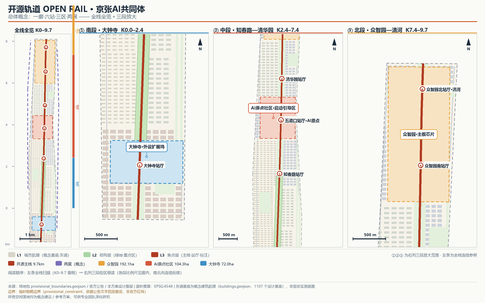

# 开源轨道 OPEN RAIL：京张AI共同体城市设计方案

> **概念声明**：本方案全部空间落地、活动运营、品牌传播与政策机制内容均为“概念建议”“参考方案”或“可供专业团队深化研究”的开放共创建议，不替代正式规划，不构成政府审定结论。所有面积与比例均可从本包 GeoJSON 几何在 EPSG:4548 下复算；总体设计范围与三处重点区域使用临时粗略边界（provisional_constraint），正式官方边界发布后须整体复算。HD00-1601 等街区控规已于 2026 年 8 月 11 日获批复，其公开版全文（文本、图纸与图则）已于 2026 年 8 月 26 日经镜像渠道挂网并登记为本包来源 [source:HD00-1601-CONTROL-PLAN-PUBLIC]——该来源尚未进入 approved_formal_sources，按待来源登记复核的公开背景信息使用，不构成法定依据；本包登记其街区层面基准（基准强度分区、基准高度分区、总建筑规模 2408.0 万平方米、规划范围 16.7 平方公里）作为设计模型的公开对照基准（待来源登记复核），镜像与新闻口径信息不产生任何地块级容积率、高度、退线、红线、审批或实施结论，地块级图则数值仍需读图获取，本包不据其产生任何地块级控制数值。本方案以此提出「控规之上的概念深化」方向（概念建议），不与法定控规并列 [source:HD00-1601-CONTROL-PLAN-APPROVAL]。

> **评审问询速览**：下表把评审七维最常问的事、本方案的回答与当前证据状态放在同一张表，每条回答均可回溯到包内机器可读入口；证据状态如实标注，不把设计模型值冒充实测值。证据分级图例：**✓ 已落地**——证据在包内，可独立复核，无外部依赖；**◐ 机制就绪**——协议与机制已落地，数值待官方数据；两处待数据的根本原因同为组织方几何与底数未发布，触发条件与复算路径已登记（`assumptions.json`），无一处以推测值填充。
>
> | 评审维度 | 本方案的回答 | 当前证据状态 |
> | --- | --- | --- |
> | 与任务书的相关性 | **「一廊·六站·三区·两翼」由公告三层范围逐级推导**；agent.1—agent.6 六项任务逐条映射；tracks 覆盖遗产叙事、AI 原点社区与青年友好公共空间 | ✓ `compliance_matrix.json` 23 条任务覆盖；三层范围面积与公告口径偏差 <0.5%（GeoJSON 复算） |
> | 原创性 | **「开源轨道」把铁路语汇（主线/站厅/提交/合并）转译为开源城市治理语汇，本提交包自身即其可查证的首次运行**（PR/复审/changelog 与治理机制同构）；**成果以 CC-BY-SA-4.0 开放许可沉淀为公共资产**：全路径许可逐项披露、九项核心资产设四要素可核验的采用登记入口 | ✓ 概念叙事贯穿全部成果；两项社区开放标准以组件级采纳落地为机器可读治理合约；首次公开时间链见 `assets/media/priority-evidence.md`；`file-rights-inventory.json` 全路径披露（覆盖率 1.0）＋`open-asset-register.json` 资产登记（采用记录如实为 0） |
> | AI 与规划创新 | **每个 AI 触点都带隐私边界、运营主体与关闭后等价路径**：13 张场景卡逐卡声明；端侧算力节点进公园；AI 治理沙箱以公开试验运行；本包自身即 AI 参与城市设计工作流的披露运行 | ✓ `seb-adoption.json`、`switchback-adoption.json`、`ai-workflow-pipeline.json` 随包可复核；含 3 张测试验证场景卡 |
> | 可实施性 | **可公开复算的落地经济学为一等公民**：8 项更新项目五要素实施卡＋触发式排序方法论＋六类资金矩阵＋四环节可问责链＋全生命周期运营账本框架＋**运维资金缺口表（ROM，公开单价基准锚定，算术全机检）**；六项数据缺口（产权、具名主体、法定管控、市政承载力、成本、效益）全部配齐「触发即执行」的确定性解决路径；**v3.0 起六项缺口中的四项已获公开锚点对照**——文保名单与文字边界（京政发〔2025〕3号＋市文物局数据库）、控规街区层面基准、市政电力容量（大钟寺 110kV／拟建青云 220kV）、带内具名主体先例（区园林绿化局＋海淀市政集团、国铁北京局移交、海开公司），外部待触发条件收窄为地块级图则数值与项目级批复 | ◐ 机制文件随包（`implementation-cards.json`、`sequencing-methodology.json`、`funding-matrix.json`、`lifecycle-om-framework.json`＋新增 `om-funding-gap.json`、`operator-qualification.json`、`statutory-reconciliation.json`、`capacity-preassessment.json`、`parametric-cost-model.json`）；效益数值一律待基线，不输出排序结论；已量化运维科目区间 3267.3–9399.9 万元/年，缺口如实登记为全区间（承诺覆盖率 0） |
> | 公共利益与包容性 | **AI 关闭后人人仍可用**：每个 AI 服务点强制非数字化等价路径；六类画像覆盖长者、残障与低数字素养居民；P1—P5 配齐「实测即生效」承诺阈值与未达标处置；无障碍设计要素逐项映射 GB 55019-2021 要求领域（设计意图合规、待现场认证）；蓝绿骨架叠加海绵—热岛—碳气候科目；公开仪表盘静态再披露指标、预警、复审与自检 | ◐ SEB schema 强制 ai_off_path 字段；`baseline-protocols.json`、`commitment-thresholds.json`、`accessibility-mapping.json`、`climate-carbon-framework.json`、`dashboard-mockup.json` 随包；P1—P5 实测值如实标注「待基线」 |
> | 风险与合规意识 | **全部指标可独立复算，未知字段不以推测冒充**：四类风险逐项披露；未登记来源降级为「待复核背景信息」；红队检视主动登记结果层失败模式与早期预警 | ✓ `risk.json` 八维矩阵＋`failure-modes.json` 失败模式库；`node visual/assets/recompute_metrics.js` 离线复算 12/12 PASS＋运维缺口表 13 项算术机检 PASS；复算路径登记于 `assumptions.json`（A-BOUNDARY-002） |
> | 表达完整性 | **中英双语全量成果、离线可复现，图面带真实肌理、三级层级与全线—分段多联构图**：正文/HTML/A3/A0/图件/视频＋字幕＋文稿；程序绘制原创图件，全部平面图件叠入概念建筑肌理基底（1107 个基底）并以「背景肌理—结构—焦点」三级层级组织；总体图为「全线全览＋三段放大」多联构图（K0–9.7 里程刻度＋街区级细读，站厅标签经程序化包围盒验证零裁切），另附主线体验长卷呈现步行序列；v3.1 起四份 A3/A0 图册全部 44 页建立逐页映射（`visual/assets/pdf-page-map.json`＋visual 双语对照表，24 项一致性机检），重点区/站厅标签经碰撞检测程序化验证零遮压 | ✓ 双语成果逐项对应；离线渲染可复现并有覆盖证据；本表即为评审入口索引 |

> **核心主张的可证伪条件**：以下条件使本方案的主要主张可被评审与专业团队独立证伪——任一条件触发即意味着对应主张失效或须回退修正，不以模糊表述规避检验。
>
> 1. **贯通主张**：若官方边界发布后，开源主线任一段无法保持连续步行/骑行贯通（贯通率低于 100%），则「一廊」空间结构主张失效 [depth:overall_spatial_structure]。基底实证（v3.0 登记）：开源主线所依托的京张铁路遗址公园已于 2026-08-06 二期全面建成开放，西直门至北五环 9 公里都市文化绿廊全线贯通（南段覆盖 70 个社区 45 万居民、打通 9 条城市支路，公开来源见 sources.json 条目 JINGZHANG-PARK-PHASE2-OPEN）——本包 9.7 公里开源步道主线的公共空间基底贯通性已获实体实证，贯通率复核仍以包内几何复算为准。
> 2. **等价路径主张**：若任一 SEB 节点的 ai_off_path 指向同一系统的线上入口，或现场不存在所指的非数字等价路径，则「AI 关闭后仍可用」的设计约束失效 [source:SEB-SPEC]。
> 3. **治理合约主张**：若任一场景卡进入试点后无法执行 90 天公开复审的四选一处置（续期/缩减/暂停/折返），则折返协议采纳失效 [source:SWITCHBACK-PROTOCOL]。
> 4. **复算主张**：若以包内 GeoJSON 在 EPSG:4548 下复算任一核心指标与 `metrics.json` 不一致（超出披露精度），或运维资金缺口表（`om-funding-gap.json`）任一子项乘积、科目小计、储备比例、总计或缺口恒等式复算不一致，则「全部指标可复算＋缺口表可机检」主张失效 [metric:site_area_sqm]。
> 5. **资金覆盖主张**：若 8 项更新项目中任一项在六类资金矩阵中找不到至少一条可路径化的资金类型，则资金矩阵的覆盖主张失效 [depth:phasing_implementation]。
> 6. **可问责主张**：若任一场景卡的运营主体未按具名化转换协议（`operator-qualification.json`）在试点核准时落实为具名 accountable_operator，则「类别主体可问责」主张失效 [source:SWITCHBACK-PROTOCOL]。
> 7. **包容性承诺主张**：若任一承诺阈值（`commitment-thresholds.json`）在对应实测基线建立后未达标，且未按未达标处置路径执行整改、降级或暂停，则「包容性承诺」主张失效 [source:SEB-SPEC]。
> 8. **许可披露完整性主张**：若包内任一 manifest 登记路径在 `file-rights-inventory.json` 中缺失许可披露，或披露的许可/处置方式与实际不符（含内嵌字体子集、第三方组件的边界声明），则「全路径许可可核验」主张失效 [depth:open_sedimentation]。

## 设计依据与资料清单

本方案依据四类资料形成：第一权威依据是北京市规划和自然资源委员会海淀分局发布的征集资格预审公告，它确定了项目目的、三层范围与面积口径 [source:OFFICIAL-ANNOUNCEMENT]；其次是仓库公开场地包，提供结构化任务书、范围层级、枚举与校验规则 [source:SITE-PACKAGE]；第三是面向智能体的任务书摘录，规定十条共创原则、三大定位、五大功能、三区两翼与六项必答任务 [source:AGENT-TASKBOOK]；第四是公开背景资料，包括京张铁路遗址公园与清华园车站旧址的公开信息，仅用于文化叙事背景，不作空间控制依据 [source:JINGZHANG-HERITAGE-PARK]；第五是 HD00-1601 等街区控制性详细规划：2026 年 8 月 11 日获批复，公开版全文（文本、图纸与图则）于 2026 年 8 月 26 日经镜像渠道挂网并登记为本包来源——该来源尚未进入 approved_formal_sources，按待来源登记复核的公开背景信息使用，不构成法定依据，镜像与新闻口径信息不产生任何地块级容积率、高度、退线、红线、审批或实施结论；本包提取其街区层面基准（基准强度分区五级 1／四级 19／三级 41／二级 4，基准高度分区 36／45／60／80／100 米，总建筑规模 2408.0 万平方米，规划范围 16.7 平方公里，「一带一轴两心多点」结构中「一带」即京张铁路遗址公园产业创新带、第 83 条「推动人工智能创新街区建设」）作为设计模型的公开对照基准（待来源登记复核）[source:HD00-1601-CONTROL-PLAN-PUBLIC] [source:HD00-1601-CONTROL-PLAN-APPROVAL]；地块级图则数值需读图获取，本包不据其产生任何地块级控制数值，据此提出「控规之上的概念深化」方向（概念建议）。

资料可用性经公开资料登记表逐项核对：本方案不使用任何 background_only 资料支撑空间结论，不使用任何非公开或来源不清的数据 [source:SOURCE-REGISTRY]。产业与文化叙事判断另获三份海淀区官方公开文件口径支撑（区“十五五”规划纲要、2026 年区政府工作报告、区委书记《前线》署名文章，均经原网址逐项核验后登记，仅作背景参照，见参考资料 11—13）[source:HD-FYP-PLAN-2026] [source:HD-GOV-REPORT-2026] [source:HD-QIANXIAN-ARTICLE-2026]。因官方精确红线尚未公开，总体设计范围与三处重点区域采用仓库提供的临时粗略边界，其推定方法与精度限制完整披露于三层范围工作框架一节 [source:BOUNDARY-SOURCE]。完整的来源、指标、标准、设计深度与任务覆盖索引分别记录于 `sources.json`、`metrics.json`、`compliance_matrix.json`、`standard_matrix.json` 与 `design_depth_matrix.json`，正文只保留紧贴判断的关键引用。

第六是 v3.0 登记的五类公开锚点（均已于原网址逐项核验）：**①文保边界**——京政发〔2025〕3 号公布第十一批文物保护单位保护范围及建设控制地带名单（第 26 项清华园车站旧址），市文物局数据库已公开其文字边界说明（保护范围四至平行线与建控地带Ⅰ类＋Ⅴ类 3 分区），坐标与图纸另行印发未公开 [source:HERITAGE-BOUNDARY-ROSTER-2025] [source:QINGHUAYUAN-BOUNDARY-DESCRIPTION]；**②市政电力容量**——大钟寺 110 千伏变电站（4×50 兆伏安、剩余出线间隔 2 回、高峰负载率 60%／63%／51%／79%）与拟建青云 220 千伏变电站（2×180 兆伏安、2026 年投运）[source:DZS-UTILITY-CAPACITY-2025]；**③具名主体先例**——海淀区园林绿化局＋北京海淀市政集团联合运营公园、中国铁路北京局集团 2022 年移交清华园车站旧址文物管理权、北京海开城市更新建设发展有限公司大钟寺先导区供地实施 [source:JINGZHANG-PARK-OPERATION-MODEL]；**④实体贯通**——公园二期 2026-08-06 全线开放 [source:JINGZHANG-PARK-PHASE2-OPEN]；**⑤控规街区基准**——见第五类。锚点已触发 `statutory-reconciliation.json` 首次真实校核（差异台账 2 条：文保地段要素按 L2 维持概念占位、体量强度/高度按 L1 待图则）、`capacity-preassessment.json` 容量锚点登记（状态从 unknown 升级为可对照）与 `operator-qualification.json` 具名先例登记（先例仅为路径证据，不构成运营承诺）。

主要资料缺口（v3.0 更新）：官方精确边界与三处重点区域精确 polygon、地块级控规图则数值（公开版已提供街区层面基准强度与高度分区，地块级容积率、退线等需读图获取，保持 unknown）、现状建筑与权属底数、文保边界坐标与图纸（名单与文字说明已公布）、项目级市政接入批复与运维科目定价。上述缺口已登记为待补条件，相应章节以“待正式数据补齐”标注，不以推测值冒充 [depth:existing_conditions_diagnosis]。规划衔接一项可获官方文件口径交叉佐证：2026 年区政府工作报告（官方文件）载明“京张铁路遗址公园沿线街区控规通过技术审查”，但技术审查不等于图则发布，本包不据其产生任何控制指标 [source:HD-GOV-REPORT-2026]。

## 三层范围工作框架

三层范围按公告口径逐级落实：统筹研究范围约 43.6 平方公里（北至北五环路、东至京藏高速、南至西直门外大街、西至万泉河路），承担产业与未来城市研究；总体设计范围约 11.4 平方公里，承担城市更新与控规深度城市设计；重点区域范围约 368.4 公顷，自北向南为众智园 AI 自主创新加速区（约 192.1 公顷）、北京 AI 原点社区（约 104.3 公顷）、大钟寺 AI 产业聚集区（约 72.0 公顷），承担详细设计 [source:OFFICIAL-ANNOUNCEMENT] [depth:three_level_scope_framework]。

本包提交的设计边界复算面积为 11,412,825 平方米，与公告 11.4 平方公里口径偏差约 0.11%；三处重点区域临时几何复算分别为 192.9、104.3、72.0 公顷，与公告口径的偏差均小于 0.5% [metric:site_area_sqm] [data:geometry/site_boundary.geojson#SITE-001]。

**临时边界披露**：由于官方精确红线尚未随公开资料发布，本方案全部几何基于 `provisional_boundaries.geojson`（provisional_rough，依据公告文字四至与面积约束推定）。它不是官方红线，不能用于审批、精确面积认定或工程依据；本方案中由其派生的用地、绿地、公共空间、建筑基底与全部指标均为临时设计模型值。官方边界发布后需要重算的内容包括：全部用地分区、绿地与公共空间图层、三项核心指标、建筑基底统计与图纸，重算路径已在 `assumptions.json`（A-BOUNDARY-002）登记 [source:BOUNDARY-SOURCE]。

三层传导逻辑：统筹研究范围回答“产业往哪里去、城市形态怎么变”；总体设计范围把产业战略翻译成空间结构、用地布局与系统组织；重点区域把结构落到可识别的公共节点与更新项目。概念性空间结构“一廊·六站·三区·两翼”在总体设计范围层面展开，详见后续章节 [depth:overall_spatial_structure]。

## 统筹研究范围产业与未来城市研究

**产业底盘的官方统计口径**（背景参照，不用于空间结论）：海淀区“十四五”末已成为全国首个经济总量破万亿的地市级区县，GDP 占北京市 26% 左右；人工智能核心产业规模超 2800 亿元，被官方文件表述为全国人工智能领域产业基础最好、人力资源最密集、产品迭代最活跃的地区 [source:HD-FYP-PLAN-2026]。2026 年区政府工作报告进一步部署依托 AI 原点社区、AI 北纬社区和京张铁路遗址公园创新带打造人工智能创新街区，备案大模型累计 122 款、全市占比近 60% [source:HD-GOV-REPORT-2026]；区委署名文章披露 2025 年全区 GDP 近 1.37 万亿元（增速 7.2%）、人工智能核心企业超 2000 家、产业规模 3575 亿元 [source:HD-QIANXIAN-ARTICLE-2026]。本节的产业判断与三区两翼分工均以此公开口径为底，全部数字仅作背景参照，不构成本方案的空间结论或数值承诺。

### 总体概念：开源轨道 OPEN RAIL

一百年前，詹天佑以“人”字形铁路解决八达岭爬坡难题，京张铁路成为中国人自主设计建造的第一条干线铁路；一百年后，同一条走廊面对新的“坡度”——AI 时代的创新要素如何在城市中高效流动 [source:JINGZHANG-HERITAGE-PARK]。遗产廊道的公共可达基础已经具备：京张铁路遗址公园（一期）建成开放，清华园车站旧址对公众开放、「进京赶考之路（北京段）」全线贯通（官方规划文件口径）[source:HD-FYP-PLAN-2026]。本方案提出总体概念**“开源轨道 OPEN RAIL：京张 AI 共同体”**：把 9.7 公里遗址廊道视为一块连续的城市主板，铁轨是数据与慢行总线，车站是算力与社区节点，三处重点区域是主板上的功能芯片，把整个创新带组织成一个所有开发者、居民、企业与智能体都可以“提交贡献”的开源城市 [source:AGENT-TASKBOOK]。

**命名体系**：总名称“开源轨道 OPEN RAIL”，中文副名“京张 AI 共同体”；空间序列采用“主线—站厅—院落”三级命名：开源主线（Open Rail Spine）、六座站厅（大钟寺、知春路、五道口·AI原点、清华园、众智园南、众智园北）、以及分布在三区的创新院落。命名刻意复用开源软件语汇——主线（mainline）、站厅（station hall）、提交（commit）、合并（merge），使百年工程文脉与当代开发者文化在同一套语言中相遇。

**视觉识别与 Logo 方向**（概念建议）：Logo 以铁轨“人”字叉形与电路走线的同构图形为核心符号——两条铁轨线在人字岔口汇成一条电路迹线，寓意“工程智慧汇入开源智能”。主色为铁轨橙红（heritage rust）与电路青绿（circuit teal），辅助色为玄武岩灰；字体建议使用可自由商用授权的开源字体（如思源黑体类），全部视觉元素须原创绘制并完成清权，不使用任何第三方商标、人物肖像或版权素材 [source:AGENT-TASKBOOK]。

**Logo 概念图形**（程序绘制原创，见 `assets/media/logo.png`）：三条未闭合的圆弧带围出一个开放的公共场——外环玄武岩蓝代表城市底盘，中环遗产锈橙代表京张工程记忆，内环电路青绿代表智能协作；一条斜向贯通笔触指向创新带的前行方向。图形不描摹铁路或电路，而以“开放、贯通、共生”的空间感凝练方案精神，可延展至导视、地刻与活动主视觉。

### 三大定位、五大功能与三区两翼协同回路

三大定位（百年京张文化带、都市 AI 生活体验带、AI 融合创新带）在本方案中被组织为一条“时间轴上的三重唱”：文化带回答“从哪里来”，由遗址廊道与清华园车站叙事承载；生活体验带回答“如何被感知”，由六站厅与 AI+ 场景网络承载；融合创新带回答“向哪里去”，由三区两翼的产业生态承载。其中融合创新带与区政府“依托 AI 原点社区、AI 北纬社区和京张铁路遗址公园创新带，打造人工智能创新街区”的官方部署同向 [source:HD-GOV-REPORT-2026]。五大功能逐项落位：AI 全栈自主创新体系落位众智园；世界级 AI 创新生态落位 AI 原点社区；AI+ 场景赋能新范式沿主轴与小月河翼展开；智能化 AI 活力城市体现在全域慢行与公共空间网络；AI 治理全球话语权依托众智园治理试验场与开源治理机制 [source:AGENT-TASKBOOK]。

三区两翼协同回路（概念建议）：众智园（主板芯片）产出技术、标准与治理工具；AI 原点社区（启动引导区）完成技术的产品化、展示与人才导入；大钟寺（外设扩展坞）实现消费级应用与商业变现；中关村科技服务翼提供资本、法务与全球要素配置；小月河场景赋能翼提供生活化测试场景。回流机制：商业收益与数据洞察经小月河翼回到研发端，形成“研发—孵化—应用—反馈”的闭环。

### 全球 AI 创新生态案例研究（6 个）

以下案例用于提炼可转化的生态机制，均为公开通识研究，具体数据以各案例官方发布为准 [source:GLOBAL-AI-ECOSYSTEM-CASES]：

1. **硅谷门洛帕克—帕洛阿尔托走廊（美国）**：铁路走廊串联高校、实验室与风险资本，启示“走廊即生态”——京张廊道可同样承担要素流动主干。可转化机制：沿主轴布局展示、投融资对接与人才交往界面。**转化落位（建议）**：五道口站厅设投资人驻点界面（概念）；年度「开源轨道大会」设 Demo Day 与投融资对接专场，对接流程全程公开报名与成果公示。
2. **肯德尔广场（剑桥，美国）**：MIT 校区与城市更新地块深度融合，形成“大学—企业—公共空间”三明治结构。可转化机制：AI 原点社区的高校界面与院落式研发空间。**转化落位（建议）**：成府路沿线划定「三明治地块」改造模块——底层高校界面 + 中层研发 + 顶层公共平台，以院落模块组合适配不同团队规模。
3. **Station F（巴黎，法国）**：由历史车站建筑改造的全球最大创业园区，证明“交通遗产+创业生态”的强叙事力。可转化机制：清华园站厅的开源成果展示廊概念。**转化落位（建议）**：展示廊实行年度策展制——策展人公开招募、成果全球征集、展期公众免费，以混合赞助平衡运营（概念）。
4. **慕尼黑工业大学加兴—市中心创新廊道（德国）**：地铁线串联校区、研究机构与企业总部，以轨道交通时间定义创新协作半径。可转化机制：以轨道站点一体化组织六站厅创新服务。**转化落位（建议）**：六站厅接驳班次与沿线机构会议时刻联动（时刻表化接驳，概念），以轨道时间半径组织创新协作日程。
5. **深圳南山粤海街道（中国深圳）**：高密度混合城区内嵌测试场景与工程化能力，形成“楼下测试、楼上研发”的快速迭代环境。可转化机制：大钟寺智能原生商业街区与测试验证场景。**转化落位（建议）**：划定「楼下测试、楼上研发」垂直混合地块（概念配比），测试界面沿街展示、可围观可预约。
6. **上海张江科学城（中国上海）**：以大科学装置为核心组织创新生态与城市配套，强调“科学—产业—城市”三位一体。可转化机制：众智园全栈体系与中央绿谷开放界面。**转化落位（建议）**：中央绿谷设开放共享界面——端侧算力节点 + 公共实验台 + 黑客马拉松草坪（概念），以大科学装置式共享预约制运转。

### AI 创新生态图谱（概念建议）

生态图谱以「要素—空间—机制」三列矩阵组织八大创新要素，回应任务书 agent.2 的生态图谱必答项 [source:AGENT-TASKBOOK]：

| 创新要素 | 空间落位 | 生态机制（概念建议） |
|----------|----------|----------------------|
| 土地与空间 | 三区院落式研发地块 | 模块化基底弹性供给，主板—引导区—外设分工避免同质竞争 |
| 产业 | 众智园（全栈）→ 原点社区（产品化）→ 大钟寺（消费级） | 研发—孵化—应用三级传导 |
| 资金 | 中关村科技服务翼 | 投融资对接界面与全球要素配置 |
| 人才 | 原点社区青年公寓与高校界面 | 校城实习转化通道与国际开发者社区 |
| 算力 | 六站厅端侧算力节点 | 开放测试协议，边缘算力进公园 |
| 数据 | 站厅合规数据沙箱（概念） | 公开数据优先，个人数据不出设备 |
| 场景 | 小月河翼与主轴开放实验场 | 年度场景开放清单与测试规范 |
| 治理 | 众智园治理试验场 | 算法备案与影响评估公开试验 |

图谱读法：横向看，每行要素均有明确空间锚点与机制出口，避免要素清单化；纵向看，三区两翼不是并列标签，而是「产出—转化—反哺」循环——大钟寺消费级洞察与小月河场景数据回流众智园研发端 [source:GLOBAL-AI-ECOSYSTEM-CASES]。要素—空间映射的完整机器索引见合规矩阵与用地图层 [data:geometry/land_use.geojson#LU-001] [depth:overall_spatial_structure]。

### 区域协同矩阵（概念建议）

回应任务书评审维度 regional_synergy，本方案在带内「三区两翼」之外给出与外部创新极核的协同接口；全部为建议/待协商，不构成任何合作协议、招商承诺或政府安排 [source:AGENT-TASKBOOK]：

| 协同对象 | 可交换资源（建议） | 空间/运营接口（建议） | 牵头与协作角色（待协商） | 验证方式（建议） |
|----------|--------------------|----------------------|--------------------------|------------------|
| 北纬社区 | 开发者社群运营经验、开源活动品牌、青年人才导入 | 五道口站厅开发者服务界面与社区线上社群互联；智能体荣誉墙互认贡献记录 | 本方案运营团队牵头，社区运营方协作 | 联合活动场次与互认贡献者数量（季度公开统计） |
| 未来科学城 | 能源与算力设施经验、大科学装置协同需求、央企研发人才 | 众智园端侧算力节点预留区域算力调度接入（概念）；研发院落预留央企联合实验室模块 | 众智园运营方牵头，科学城运营方协商 | 联合实验室签约数与算力互调试点报告 |
| 怀柔科学城 | AI for Science 场景需求、科学数据合作（合规框架内） | AI 原点社区展示廊设「AI for Science」年度展区；治理沙箱共享算法备案工具 | 原点社区运营方牵头，科学城科研机构协作 | 展区年度成果清单与合作备忘录（待协商） |
| 北京经开区（亦庄） | 具身智能与智能制造产业资源、应用测试产线、机器人供应链 | 大钟寺智能原生街区设「亦庄智造」体验前店；机器人配送测试环线共享测试规范 | 大钟寺运营方牵头，经开区企业协会协作 | 前店年度入驻企业与测试环线联合报告 |
| 京津冀区域 | 数据要素（合规）、AI 人才通勤与居住、区域算力网络 | 清河门户预留区域算力网络接入（概念）；青年公寓面向区域人才配租 | 属地运营主体牵头，区域协调机制待协商 | 人才配租比例与算力网络接入进度（年度复核） |

协同原则：接口须经相关主体协商一致后方可实施；验证方式均为建议指标，不预设政府承诺或审批结论 [source:AGENT-TASKBOOK]。

## 总体设计范围城市更新与控规深度城市设计

### 空间结构：一廊·六站·三区·两翼

总体设计范围的空间结构概括为“一廊·六站·三区·两翼”（概念建议）。一廊：京张遗址公园·开源主线廊道，宽 180 米、长 9.7 公里，是连续公园绿地、慢行主线与文化展廊的复合体 [data:geometry/green_space.geojson#GREEN-001] [metric:spine_length_m]。六站：六座站厅级公共节点，间距 800—2200 米，每座站厅都是“轨道接驳+公共广场+AI 场景入口”的复合节点。三区：众智园、AI 原点社区、大钟寺三处重点区。两翼：西侧中关村科技服务翼与东侧小月河场景赋能翼 [depth:overall_spatial_structure]。

六站厅概念剖面进一步深化为可感场所（概念建议）：大钟寺站厅以折板雨篷覆盖测试市集街区；知春路站厅以弧形轻型屋盖组织全时服务补给；五道口站厅以原点广场与城市客厅承接国际交往；清华园站厅以荣誉长墙承载遗产展示（文保优先、可逆展陈）；众智园南站厅以主板客厅组织共享实验；众智园北站厅以折板雨篷整合清河门户换乘接驳。每座站厅保留铁轨记忆并以人与树为尺度参照，具体造型与工艺以控规校核及专业深化为准 [depth:overall_spatial_structure]。

### 用地布局与更新框架

用地布局遵循“廊道优先、混合适度、高校联动”原则（概念建议）：科研用地约 348.6 公顷（30.5%）沿主轴两侧与三重点区集聚；居住用地约 189.6 公顷（16.6%）保留于中部成熟社区并作渐进式更新；教育用地约 180.1 公顷（15.8%）强化北邮、北航、清华东路沿线高校界面；商业服务业用地约 134.9 公顷（11.8%）集中于大钟寺与五道口；公园绿地约 246.6 公顷（21.6%），绿地率 21.61% [metric:green_ratio] [depth:land_use_layout]。

城市更新总体框架（参考方案）：以“留改拆”分类的渐进更新为主——中部居住片区以保留修缮与功能织补为主；高校界面以改造利用与界面开放为主；三处重点区以新建与改建结合为主。由于缺少现状建筑底数与权属资料，具体地块的拆改留分类仅为方向性判断，待正式数据补齐后由专业机构核定 [depth:retain_renovate_demolish]。更新先例背景：公开报道提及知春路北侧北京卫星制造厂科技园已由老厂房改造为面向公众的科技园区并吸引高精尖机构入驻，为「低效楼宇与老旧厂房更新」路径提供背景参照（来源待登记复核，非正式证据）[source:HD00-1601-CONTROL-PLAN-APPROVAL]。

### 创新指标体系（概念建议）

建议创新带的特色指标包括：绿地率（当前设计模型值 21.61%）、公共空间率（10.56%）、开源步道贯通率（目标 100%）、站厅 5 分钟步行覆盖率、AI 场景开放数量、年度开源活动场次 [metric:public_space_ratio]。产业类指标（产值、企业数、人才数）依赖官方统计口径，本方案不作数值承诺，仅提出指标框架供专业团队深化。

### 京张遗址公园活力带

遗址公园活力带是本结构的脊柱：北起清河、南至西直门外大街，全线贯通步行与骑行，沿线布置开源成果展示、AI 场景测试、文化展演与日常休闲功能。活力带向东西两侧通过六座站厅与八条城市干路接口“缝合”被铁路历史分割的街区 [depth:blue_green_public_space]。

### 城市风貌

风貌控制概念建议：廊道以“工业遗产+自然野趣”为基调，保留铁轨、枕木、号志等工业元素；高校界面以学院红砖与现代玻璃的对话为基调；大钟寺以都市商业的现代界面为基调。建筑高度、体量与屋顶形态的具体控制值属法定控规内容，本方案不作数值判断，仅提出风貌分区意向 [depth:height_massing_character]。

品牌体验同步落地为「Logo—铺装—街道家具—导视」的应用系统（概念建议）：人字形折返铺装转译京张人字线路意象；轨式栏杆、commit 节点座凳、电路分支灯柱、merge 地刻、贡献荣誉墙砖与站厅遮阳篷带共同构成全线连续可识别的开源轨道视觉场，使品牌从符号标识延伸为身体可感的街道体验。全部为概念方向，材质与工艺以专业深化为准。

沿街建筑界面按三类典型街道分别给出概念剖面（概念建议）：S1 主线廊道标准段以「研发院落柱廊界面—绿化缓冲—遗址轨道—共享街道—实验展示界面」组织，遗址轨道两侧全程物理隔离、禁止穿越；S2 站厅前区为全步行化共享街道，人字铺装无高差（kerbless）延续至篷带界面与接驳港湾（接驳小巴以运营许可为前置，未获许可保持预备态）；S3 织补街巷以 15 km/h 慢行窄巷连接居住院墙与口袋公园。底层沿街界面以骑楼柱距（约 6 m）、统一招牌带（0.9 m）与轨式栏杆、树阵、电路分支灯柱形成连续可识别节奏；界面开口率与招牌带为概念管控建议，建筑高度与退线保持 unknown，待正式控规指标发布后校核 [depth:overall_spatial_structure]。

## 重点区域详细设计

### 众智园 AI 自主创新加速区（约 192.1 公顷）——“主板芯片”

定位：AI 全栈自主创新体系与 AI 治理全球话语权的核心承载区 [source:AGENT-TASKBOOK]。空间结构（概念建议）：以中央绿谷为开放创新界面，两侧布置算力—模型—工具链三类研发院落，院落以 60×40 米模块化基底组合，形成可灵活分割的弹性供给 [data:geometry/key_areas.geojson#PROV-KEY-001]。建筑更新以新建研发院落为主，概念性建筑基底布局见 buildings 图层。交通慢行：众智园南、北两座站厅分别服务南部院落群与清河门户，区内组织无人配送低速测试环线（概念）。公共空间：中央绿谷兼作开放发布与黑客马拉松场地。AI 场景：AI 治理标准试验场、端侧算力节点公开测试。实施风险：边界为临时推定，须待官方精确边界与控规条件；建设强度待确认 [depth:three_key_area_detailed_design]。

众智园核心公共节点「commit 广场」放大平面（概念建议）：以遗址轨道为轴、人字铺装圆形广场为核，merge 焊盘灯柱作为荣誉墙年度入选方案的实体灯塔；环形绿廊保障无障碍环通并同步设置非数字等价路径；周边共享实验室、智能体驿站、开发者茶座与展示廊均为概念占位体量，实施前须经控规校核、文保审查与工程深化。

节点构造以四组概念详图示范材质与构造意向（概念建议）：人字铺装构造分层（透水砌块面层—垫砂层—级配碎石基层—压实素土底基层）；commit 节点座凳（弧木座面 + 钢柱预埋 + 中央节点灯罩）；电路分支灯柱（约 4.5 m、暖色低眩光、双电路分支臂）；merge 地刻（铜环防滑嵌条 + 整体无高差，轮椅与视障友好）。全部为概念构造意向，非施工图；材质、工艺与结构尺寸以专业深化与无障碍专项审查为准，不构成工程做法承诺 [depth:overall_spatial_structure]。

### 北京 AI 原点社区（约 104.3 公顷）——“启动引导区”

定位：世界级 AI 创新生态的展示窗口与人才导入门户。空间结构（概念建议）：以清华园站厅为核心组织“一核两街”——清华园站厅·开源成果展示廊（概念）承载 AI 朝圣地标功能；五道口站厅（公开报道所示控规「两心」之一的五道口中心，来源待登记复核 [source:HD00-1601-CONTROL-PLAN-APPROVAL]）组织国际交往与开发者服务；中部混合创新街区提供“楼下测试、楼上研发”的复合空间 [data:geometry/key_areas.geojson#PROV-KEY-002]。建筑更新：以改建利用与插建混合院落为主。交通慢行：五道口、清华园两站厅衔接成府路与清华东路，织补高校—社区慢行断点。公共空间：开源成果展示廊、开发者广场与AI原点纪念节点。AI 场景：AI+ 教育（高校联动）、AI 文化导览。实施风险：清华园车站旧址文物保护要求须以文物部门正式公布为准，任何建设活动不得触碰保护红线 [source:QINGHUAYUAN-STATION-HERITAGE]。

### 大钟寺 AI 产业聚集区（约 72.0 公顷）——“外设扩展坞”

定位：智能原生新业态与 AI+ 商业的消费级应用区；公开报道亦将大钟寺列为控规「两心」之一（来源待登记复核），本区设计主张可与之呼应（概念建议）[source:HD00-1601-CONTROL-PLAN-APPROVAL]。空间结构（概念建议）：依托大钟寺站厅形成“一港两街”——城市展示窗口与智能原生消费街区，组织 AI+ 商业、机器人服务与数字消费测试场景 [data:geometry/key_areas.geojson#PROV-KEY-003]。建筑更新：以既有商业空间的功能置换与改造为主，新建体量谨慎。交通慢行：大钟寺站厅衔接北三环与西直门外大街方向，是全域的南门户。公共空间：门户绿廊与站前展演广场。AI 场景：AI+ 商业测试验证街区、机器人导览与配送。实施风险：权属复杂、改造主体多元，须以协商式更新推进，本方案不提供地块级拆改结论 [depth:three_key_area_detailed_design]。

## AI 创新生态、人才画像与 AI+ 场景

### 六类用户画像

1. **AI 研究员/工程师**（25—40 岁，就职于研发院落与高校实验室）：需要弹性研发空间、24 小时算力服务、跨机构交流界面与高品质第三空间。
2. **开发者/创业者**（22—35 岁，初创团队与自由开发者）：需要低成本测试场景、开源展示机会、投融资对接与国际化社区氛围。
3. **高校师生**（18—30 岁，北邮、北航等高校）：需要校城共享的实验设施、实习转化通道与青年友好的公共活动场地。
4. **在地居民**（全龄，中部成熟社区）：需要日常慢行安全、滨水与公园可达性、社区公共服务提升与更新过程的知情参与。
5. **访客/城市观察者**（国内外游客、考察团、媒体）：需要可读的文化叙事、标志性公共节点与便捷的导览服务。
6. **长者与无障碍需求者**（60 岁以上长者、残障人士、视障听障者及低数字素养居民）：需要全程无障碍慢行与轮椅通行、适老化服务界面，以及永久保留的人工问询与纸质导览等非数字化等价路径，确保 AI 创新带的收益不被数字鸿沟排斥。

### AI+ 场景卡（13 张）

以下场景卡均为概念建议，运行数据以公开或授权数据为限，涉及个人信息处理的一律设置隐私边界与人工复核机制 [source:AGENT-TASKBOOK]：

| # | 场景卡 | 空间落位 | 服务对象 | 数据与隐私边界 | 运营主体（概念） |
|---|--------|----------|----------|----------------|------------------|
| 1 | AI+交通慢行评估：识别慢行断点与接驳缺口 | 全域慢行网络 | 居民/通勤者 | 公开道路资料+授权反馈，不采集个人轨迹 | 城市运营团队 |
| 2 | AI 文化导览：京张百年叙事智能讲解 | 开源主线全线 | 访客/学生 | 公开文化资料，无个人数据 | 文化运营团队 |
| 3 | AI 健康服务导航：社区医疗与健身设施引导 | 中部社区与公园 | 居民 | 公开设施数据，健康数据不出个人设备 | 社区服务中心 |
| 4 | 企业服务副驾：政策/场景/合规一站式导航 | 众智园与原点社区 | 企业/团队 | 公开政策库，企业数据授权使用 | 园区服务平台 |
| 5 | 公共安全事件复盘：公开事件联合演练 | 站厅与广场 | 治理部门/公众 | 公开事件资料，人工复核后发布 | 城市治理团队 |
| 6 | 机器人低速配送测试 | 众智园测试环线 | 商户/居民 | 限定封闭/半封闭路段，限速可监管 | 园区+企业联合 |
| 7 | AI+教育开放课堂：高校课程进公园 | 清华园站厅 | 师生/公众 | 公开课程资源 | 高校+社区 |
| 8 | AI+商业智能导购与无障碍导购 | 大钟寺街区 | 消费者 | 公开商户数据，无强制人脸采集 | 商业运营方 |
| 9 | 端侧算力节点公开测试 | 六站厅 | 开发者 | 开放测试协议，数据本地处理 | 基础设施运营方 |
| 10 | 智慧公园养护：植被与设施巡检 | 廊道与滨水绿带 | 养护部门 | 公开环境数据 | 公园管理方 |
| 11 | **测试验证：开放街道自动驾驶接驳小巴** | 大钟寺—知春路段（概念） | 通勤者 | 限定路段、限速、安全员、可接管 | 专业测试机构 |
| 12 | **测试验证：AI 治理沙箱——算法备案与影响评估公开试验** | 众智园治理试验场 | 企业/研究者 | 公开评估框架，人工复核 | 治理研究机构 |
| 13 | AI 无障碍伴侣：适老化导航与非数字化等价路径 | 全域慢行与六站厅 | 长者/残障/低数字素养者 | 公开设施数据，不采集生物特征；永久保留人工问询与纸质导览等价路径 | 社区服务中心 |

其中第 6、11、12 为 AI 产业测试验证场景（不少于 3 个），均须取得主管部门许可后方可实施，本方案不将其表述为已批准运营。场景—空间—运营映射：每张场景卡对应站厅或廊道节点（见 `geometry/public_space.geojson`）、明确的数据边界与运营主体，场景开放机制接入第六节长期运营体系 [source:AGENT-TASKBOOK]。

### 场景治理合约与社区开放标准（概念建议）

本方案组件级采纳两项社区开放贡献作为场景卡的机器可读治理合约，采用声明均随包提交：

1. **折返协议 Switchback Protocol v1.0**（chucky1102/人字线 RENLINE，Issue #1119，CC-BY-4.0）[source:SWITCHBACK-PROTOCOL]：为第 6、11、12、13 号场景卡建立统一运营合约——三色状态（绿=常态运行/黄=受控试点/红=折返）、数字化时限（真人接管≤5 分钟、申诉 1 个工作日受理/7 个工作日办结、15 分钟步行圈非智能等价路径）、90 天公开复审（续期/缩减/暂停/折返四选一）、量化触发与三级留痕档案。逐卡字段见 `visual/assets/switchback-adoption.json`；本包全部卡片处于预备态（green_candidate），全部时限为设计目标值，非政府承诺。
2. **服务等价基准 SEB v0.5.0 节点 schema 组件**（lqqk7/万感京张，Issue #2549，CC BY-SA 4.0）[source:SEB-SPEC]：为六座站厅服务节点声明五项必填字段——AI 关闭后等价路径（ai_off_path，不得指向同一系统的线上入口）、人工接管角色（human_handoff）、当前闸门（G0）、运行方式与责任专业，使「AI 关闭后仍可用」成为逐点位可判的设计约束，与第 13 号无障碍场景卡的等价路径要求互为支撑。节点数据见 `visual/assets/seb-adoption.json`；本包不认领任何 SEB 开放等级。

两项采纳不改变任何法定边界：所有场景仍为概念建议，协议的红/黄状态与 SEB 的闸门均为设计目标值分级，不表述为已批准运营；采纳行为本身是任务书鼓励的社区协作循环，不代表任何机构采用上述标准 [source:AGENT-TASKBOOK]。

### 运营主体可问责链与流程对接（概念建议）

针对运营主体以类别名称出现的现状，本方案为每类主体定义四环节可问责链，并与已采纳的治理合约条款逐环绑定：

| 环节 | 治理合约条款 | 流程对接（概念） | 公开物 |
|------|-------------|------------------|--------|
| 准入 | 折返协议 green_candidate 核准 | 资质与许可核验、试点方案公示 | 主体清单与许可状态台账 |
| 运行监督 | 三色状态 + 数字化时限 | 季度运行报告、接管与申诉记录 | 季度公开复审报告 |
| 复审问责 | 90 天公开复审（四选一） | 独立评审意见与整改闭环 | 复审结论与整改台账 |
| 退出 | 折返留痕 + 双联交接台账 | 未决项随单移交、资产与数据归档 | 折返档案（近失/折返/退役） |

与真实部门流程的对接说明（概念）：试点许可、备案登记、运行监管与退出移交分别对应主管部门审批、公开台账登记、属地监督与资产移交流程；本方案不指定具体部门，各环节责任主体以属地法定职责为准。类别名称运营主体（如「园区服务平台」）的可问责性，由上述四环链条与折返协议的具名角色机制（accountable_operator 于试点核准时具名）共同保证，形成从类别到具名责任的闭环 [source:SWITCHBACK-PROTOCOL]。

## 用地、建筑规模与拆改留方案

用地布局（概念建议）以 land_use 图层为准：七类用地无缝覆盖全部设计范围，用地分类采用可校验的国标分类码，不使用自造分类 [standard:MNR-LAND-USE-CLASSIFICATION-GUIDE] [data:geometry/land_use.geojson#LU-001]。概念性建筑基底 1107 个、合计约 221.6 万平方米，基底率约 19.4%，该数字仅表达空间供给量级，不代表审批方案或现状建筑 [metric:building_footprint_area_sqm]。

建筑规模与开发强度：容积率、建筑高度与建筑强度属法定控规内容，公开资料不可得，本方案统一记为待确认（metrics 中 `status=unknown`），不给出任何数值判断 [depth:development_intensity_controls]。拆改留方案：中部居住片区以“留”为主，高校界面以“改”为主，三处重点区“留改拆”结合但具体分类待现状建筑底数与权属资料补齐后核定，本方案不输出地块级拆改结论 [depth:retain_renovate_demolish]。

空间供给与运营策略（概念建议）：研发院落采用模块化基底组合以适应团队规模变化；大钟寺以既有商业空间功能置换减少大拆大建；居住区更新以加装电梯、口袋公园与慢行织补等轻量手法为主。

## 交通、轨道、市政与公共服务设施

交通组织（概念建议）：对外依靠北三环、北四环、北五环、学院路—西土城路、荷清路—大钟寺东路等干路界面；内部以开源步道慢行主线为骨架，六座站厅织补被廊道分割的东西向联系，形成“一站厅一接口”的慢行网络 [data:geometry/roads.geojson#ROAD-010] [depth:traffic_rail_slow_parking]。

轨道站点一体化：大钟寺、知春路、五道口、上地方向站点与站厅节点概念接驳，站厅 800 米覆盖主要研发与居住片区；轨道线位与站点设置以官方为准，本方案不作工程判断。停车与非机动车：站厅节点配置非机动车停放与共享出行换乘，机动车停车供给指标待控规条件。

市政与新型基础设施（概念建议）：传统市政设施改造与承载力核算待官方资料；新型基础设施提出“端侧算力节点进公园”概念——在六站厅布置边缘算力与开放 Wi-Fi/定位服务，支撑 AI 场景测试；分布式能源与海绵设施结合滨水绿带统筹 [depth:municipal_new_infrastructure]。

公共服务设施：结合六类画像配置青年公寓与创客服务（原点社区）、社区医疗与养老驿站（中部居住区）、国际学校和科普场馆（高校界面）、文化展演设施（廊道与站厅）与无障碍适老化设施（全域慢行），方向上可衔接公开报道中控规提出的「一刻钟社区服务圈」（概念建议，来源待登记复核），具体规模与布局待专项深化。

开源主线步行体验长卷（概念意向）：以立剖面长卷呈现 9.7km 主线由南（大钟寺）向北（众智园北·清河）的六站厅步行序列——站厅剪影、沿线界面节奏、京张铁路记忆层（人字轨道铺装意象）与里程刻度同框，为平面图件补充体验视角；站厅位置按主线几何（EPSG:4548）里程展开，体量与高度均为概念示意 [data:geometry/roads.geojson#ROAD-010] [metric:spine_length_m]。

## 蓝绿空间、公共空间与城市风貌

蓝绿系统（概念建议）：开源主线廊道（约 156.7 万平方米公园绿地）与清河、小月河滨水绿带构成“N”字形生态骨架，四个社区公园补全 500 米服务半径，绿地率设计模型值 21.61% [metric:green_ratio] [data:geometry/green_space.geojson#GREEN-001]。公共空间系统：六座站厅广场、六段廊道公共活力段、滨水公共开放空间与五处口袋广场，公共空间率 10.56%；绿地与公共空间的复合利用关系已在假设中说明，两指标不相加 [metric:public_space_ratio]。

城市风貌：以“遗产锈色+电路青绿”为全域色彩线索，导视与标识系统复用 Logo 的人字—电路符号；高校界面鼓励学院材料的当代表达；廊道内新增建构筑物以小尺度服务亭为主，让位于铁轨与植被 [depth:blue_green_public_space]。

### 气候韧性与碳科目框架（概念建议）

本方案的气候议题不新增空间结构，而是在既有“N”字形生态骨架（开源主线廊道 + 清河、小月河滨水绿带）上叠加「海绵—热岛—碳」三类气候功能注记，把蓝绿基底同时作为城市韧性基础设施来使用 [depth:blue_green_public_space]。三科目均为概念建议，监测口径全部保持待基线，规模、标准与核算边界待专项深化与官方资料到位后确定，不作数值承诺。

| 科目 | 韧性/碳议题 | 既有空间落位（引用） | 机制（概念建议） | 责任角色 | 监测口径（待基线） |
|------|------------|----------------------|------------------|----------|--------------------|
| 海绵/雨洪 | 内涝、径流控制 | 滨水绿带雨水花园模块、廊道绿地 | 分布式海绵设施与防洪评估统筹，结合滨水绿带连通与生态岸线建设 | 水务主管+园林 | 年径流总量控制、汛期验证（衔接滨水绿带监测方向） |
| 热岛/微气候 | 夏季高温、户外热舒适 | 绿地率 21.61% 基底、研发院落 500 米见绿 | 冷岛廊道与遮荫慢行网络，滨河通风廊道保持开敞 | 园林+站厅运营方 | 夏季地表温度、绿视率 |
| 碳/能源 | 运营碳与隐含碳 | 端侧算力节点（边缘算力进公园）、分布式能源点位 | 可再生能源与算力负荷就近平衡，站厅运营节能 | 能源主管+运营方 | 站厅能耗、绿电占比 |

三科目与「市政与新型基础设施」中“分布式能源与海绵设施结合滨水绿带统筹”的提法互为一体：本节负责把气候—碳议题落到空间与责任，市政节负责工程与承载力口径；机器可读框架见 `visual/assets/climate-carbon-framework.json` [depth:municipal_new_infrastructure]。

### AI 朝圣地标与荣誉展示体系（4 处，概念建议）

1. **开发者散步道（开源主线全线）**：铁轨步道镶嵌开源里程碑地刻，记录全球 AI 开源大事记，步行即阅读。
2. **智能体贡献荣誉墙（清华园站厅）**：为参与城市共创的智能体与人类贡献者设立可持续更新的荣誉墙，镌刻 GitHub ID 与 Agent 名称——本项目自身即为第一块铭牌的候选。
3. **开源成果展示廊（清华园站厅站房概念改造）**：以年度策展方式展示当年最具影响的 AI 开源成果，与高校课程联动。
4. **AI 原点纪念碑（五道口站厅广场）**：标记“北京 AI 原点”的空间坐标，成为行业聚会与年度发布的默认背景。

地标均不涉及文保红线内的实体改造，清华园站房相关内容仅为概念意向，须以文物部门要求为准 [source:QINGHUAYUAN-STATION-HERITAGE]。地标与导视设计避免过度娱乐化，保持工程纪念的克制气质 [source:AGENT-TASKBOOK]。

### 公共空间组件库（概念建议）

为支撑站厅、廊道与口袋广场的统一品质与可维护性，本方案提出十类可组合的公共空间组件（component library），全部组件为原创概念设计，复用 OPEN RAIL 视觉系统的人字—电路符号语言 [source:AGENT-TASKBOOK]：

| 组件 | 类型 | 落位优先级 | 功能 |
|------|------|-----------|------|
| 开源里程碑地刻 | 文化叙事 | 主线全线 | 开发者散步道纪事系统 |
| 智能体荣誉铭牌 | 荣誉展示 | 站厅墙面 | 贡献者可持续更新铭牌 |
| 轨迹服务亭 | 服务设施 | 六站厅 | 导览、Wi-Fi 与端侧算力接入 |
| 模块化座椅组 | 街具 | 廊道活力段 | 可重组的停留界面 |
| 轨缘灯带 | 照明 | 铁轨两侧 | 遗产要素夜间安全与叙事 |
| 雨水花园模块 | 生态设施 | 滨水绿带 | 海绵设施与科普界面 |
| 场景测试桩 | 新基建 | 测试路段 | 传感器供电与数据接口 |
| 导视塔 | 标识系统 | 站厅入口 | 三层范围导航与场景入口索引 |
| 临时展亭 | 活动设施 | 站厅广场 | 四季活动弹性载体 |
| 无障碍通行带 | 通用设计 | 全域慢行 | 全龄友好与轮椅通行 |

组件配置规则（概念建议）：组件按「站厅高配、廊道标配、口袋广场轻配」三级配置，选型与数量以专业深化为准 [data:geometry/public_space.geojson#PUBLIC-001]；涉及文保地段的组件仅采用可逆安装方式 [source:QINGHUAYUAN-STATION-HERITAGE]；所有组件为概念建议，供专业团队深化研究 [depth:blue_green_public_space]。

## 更新项目清单、实施政策与分期计划

更新项目清单（概念建议，均为参考方案）：①开源主线贯通工程（步道、骑行、标识）；②六站厅公共节点提升；③清华园站厅展示廊概念改造；④中央绿谷开放创新界面；⑤大钟寺智能原生商业街区更新；⑥中部居住区渐进更新与口袋公园；⑦清河—小月河滨水绿带连通；⑧端侧算力节点与新型基础设施示范 [data:geometry/phasing.geojson#PHASE-001] [depth:renewal_project_list]。实施背景：公开报道显示项目①的西直门—知春路段（南段）已获市级立项批复——京发改（审）〔2024〕609 号，用地约 23.08 公顷，建设单位为北京市海淀区园林绿化局；公园二期新增的鱼骨状慢行通道已将清河滨水绿廊与东升八家郊野公园相连，项目⑦的清河侧连接或已部分实现。该批复文件尚未进入 approved_formal_sources，作为待登记复核的公开背景信息引用，不作为正式实施证据 [source:JINGZHANG-PARK-PHASE2-APPROVAL]。

分期计划（概念建议）：近期（2026—2029）完成主线南段、AI 原点社区与大钟寺门户，树立可读性最强的示范段；中期（2029—2032）推进廊道北段与众智园南片；远期（2032—2035）完成众智园北片与清河滨水门户。时序仅为建议，实施主体、资金安排与审批程序以正式决策为准 [depth:phasing_implementation]。

### 实施卡片：五要素框架（概念建议）

为使 8 项更新项目具备「当前基线—准入条件—责任角色—验收指标—退出机制」的完整实施颗粒度，逐项建立实施卡；机器可读版本见 `visual/assets/implementation-cards.json`：

| 项目 | 当前基线 | 准入条件（前置） | 责任角色（待协商） | 验收指标（建议） | 退出机制 |
|------|----------|------------------|---------------------|------------------|----------|
| ①主线贯通 | 概念设计；南段见公开报道批复（待登记复核） | 路权与安全评估、分期许可 | 属地主管+实施主体待定 | 连续率/覆盖率/无障碍达标 | 分段可逆，未达标段折返 |
| ②六站厅提升 | 概念设计 | 用地与接驳协议 | 站厅运营方+属地 | 换乘距离/全龄达标/响应时长 | 街具可撤回 |
| ③清华园展示廊 | 概念意向（文保优先） | 文物部门意见+策展章程 | 运营方+文保协商 | 年度场次/成果数/可逆验收 | 展陈可逆，随时恢复原状 |
| ④中央绿谷 | 概念设计 | 绿地用途核准 | 众智园运营方 | 开放天数/活动容量/恢复周期 | 场地可恢复 |
| ⑤大钟寺街区 | 概念设计（权属复杂） | 权属协商+商户参与同意 | 商业运营方+商户联盟 | 入驻率/测试场景数/商户保留率 | 业态可置换 |
| ⑥居住区更新 | 概念设计 | 居民参与同意率达标 | 属地+社区+居民自治 | 加梯数/口袋公园数/织补节点 | 轻量手法天然可逆 |
| ⑦滨水绿带 | 概念设计（清河侧见公开报道，待登记复核） | 水务与防洪评估 | 水务主管+园林 | 连通里程/生态岸线/汛期验证 | 植被可恢复 |
| ⑧端侧算力示范 | 概念设计 | 供电与数据合规审查 | 基础设施运营方待定 | 可用率/开放时长/本地处理占比 | 设备可拆除、数据可清除 |

基线说明：全部项目尚无实测基线（组织方数据未发布），基线值为未测量的设计起点；验收指标均为建议目标值，正式指标以专项深化为准 [depth:phasing_implementation]。

### 项目排序与成本效益方法论（概念建议）

回应可实施性评审「具体项目排序与成本效益尚不能在当前概念阶段验证」：在现状建筑、权属、市政承载、实测人流与正式控制条件（现状建筑与权属、实测人流、项目级接入批复与地块级控制条件仍 unknown；市政承载力与法定管控已获 v3.0 公开锚点对照，见设计依据与资料清单第六类）到位之前，本版不输出任何排序结论或效益数值，而是给出数据到位即可执行的排序与成本效益评估框架（机器可读版本见 `visual/assets/sequencing-methodology.json`）：

| 环节 | 输入（当前状态） | 方法（建议） | 触发条件 |
|------|------------------|--------------|----------|
| ① 数据基线 | 现状建筑/权属/市政/人流 unknown | 依 A-BOUNDARY-002 复算 + 主管部门数据对接 | 官方几何与控规图则发布 |
| ② 优先级评分 | 8 项更新项目 | 公共利益 / 可逆性 / 资金路径成熟度 / 文保约束四维加权（权重待协商） | ① 完成 |
| ③ 成本科目 | 概念科目框架（无估算值） | 土地整理 / 建安 / 市政 / 运营四科目分列 | 进入工程深化阶段 |
| ④ 效益维度 | P1–P5 基线（待基线） | 公共效益（无障碍/等价路径/投诉响应）与经济代理指标分列 | 试点基线测量完成 |
| ⑤ 敏感性检验 | 边界/FAR/人流三参数 | 单参数扰动下的排序稳定性检验，输出稳健区间而非单点结论 | ② ④ 完成 |

方法纪律：全部环节为概念建议，不含任何数值承诺；排序与成本效益结论仅在全部触发条件满足后，由属地主管与具名运营方联合复核发布，并随 90 天公开复审滚动更新 [depth:phasing_implementation]。

### 资金来源类型与主体路径（概念建议）

回应可实施性评审「资金、法定主体待确认」的缺口，建立建议性资金矩阵（不含任何数值承诺，全部以正式决策为准；机器可读版本见 `visual/assets/funding-matrix.json`）：

| 资金类型 | 适用项目 | 主体路径（建议/待协商） | 边界 |
|----------|----------|--------------------------|------|
| 市区两级财政与专项 | ①主线贯通、⑦滨水绿带等公共工程 | 属地立项，依法定程序 | 以正式立项为准 |
| 市场主体投资 | ⑤大钟寺街区、研发院落 | 特许经营/合作开发，公私契约约束 | 权属协商前置 |
| 产业基金与风投 | 场景测试与初创孵化 | 场景开放清单 + 投资对接机制 | 不预设招商承诺 |
| 公益基金会与捐赠 | 荣誉墙、展示廊文化内容 | 策展章程 + 捐赠公示 | 文保审查前置 |
| 社区微更新资金 | ⑥口袋公园与织补节点 | 居民参与式预算 | 参与同意率达标 |
| 运营收益反哺 | 全域活动与场景运营 | 90 天公开复审下的收益公开 | 收益口径待审计定义 |

主体授权路径：公共空间运营建议采用「属地主管 + 具名运营方」双轨授权，以准入—运行监督—复审问责—退出四环节闭环（见「运营主体可问责链与流程对接」一节）；研发与商业地块依法由权属主体或其合作方实施。全部安排为概念建议，不构成政府或资金方承诺 [depth:phasing_implementation]。

### 全生命周期运营账本框架（概念建议）

资金矩阵回答「建设钱从哪来」，本框架回答「建成后谁养」：六站厅、廊道、场景与活动进入运营期后的维护与运行成本，按科目—对象—资金衔接—责任角色逐格登记（机器可读版见 `visual/assets/lifecycle-om-framework.json`）：

| 运营科目 | 适用对象 | 可衔接资金类型（引资金矩阵） | 责任角色（挂接可问责链） | 边界 |
|----------|----------|------------------------------|--------------------------|------|
| 空间养护 | 廊道绿地、站厅广场、滨水绿带 | 市区两级财政与专项；运营收益反哺 | 公园管理方/站厅运营方（运行监督环节） | 以正式立项与管养分工为准 |
| 场景运营 | 13 张场景卡对应服务点 | 运营收益反哺；市场主体投资 | 具名 accountable_operator（准入环节具名） | 试点许可前置 |
| 活动策展 | 四季活动、展示廊年度策展 | 公益基金会与捐赠；运营收益反哺 | 运营方+策展章程（复审问责环节） | 文保审查前置 |
| 数据与算力 | 端侧算力节点、数据沙箱 | 市场主体投资；产业基金 | 基础设施运营方（运行监督环节） | 供电与数据合规审查前置 |
| 复审与测量 | P1—P5 基线测量、90 天公开复审、第三方无障碍审查 | 市区两级财政与专项 | 第三方机构+属地主管（复审问责环节） | 测量纪律不删失败样本 |
| 应急折返储备 | 折返/退出项目的恢复与移交 | 市区两级财政与专项；运营收益反哺 | 属地主管+原运营方双联交接（退出环节） | 以折返留痕档案为准 |

方法纪律：本框架不含任何数值估算，运营科目与资金衔接均为建议路径；收支平衡结论仅在试点基线测量完成且收益口径经审计定义后，由属地主管与具名运营方联合复核发布，并随 90 天公开复审滚动更新 [depth:phasing_implementation]。

### 运维资金缺口表（ROM，概念建议）

运营账本框架回答「建成后谁养、养什么科目」，本表进一步回答「要花多少钱、当前缺多少」：对六科目中具备公开单价基准的科目（空间养护、活动策展）以 ROM（rough order of magnitude）区间量化年运维成本——单价全部锚定已登记公开来源（北京市园林绿化局《北京市城镇绿地养护管理投资标准》京绿办发〔2021〕300 号、政府公开采购成交价），量纲全部取自包内可复算指标；不具备可核验单价基准的科目（场景运营、数据与算力、复审与测量）显式保持占位，不以推测值冒充区间。全部算术（子项乘积、科目小计、储备比例、总计、缺口恒等式）由一键复算脚本第 13 项机检（机器可读版见 `visual/assets/om-funding-gap.json`）：

| 运营科目 | 量纲基数（包内复算） | 单价基准（公开来源） | 年成本 ROM（万元/年） | 当前承诺覆盖 | 缺口语义与关闭路径 |
|----------|----------------------|----------------------|------------------------|--------------|---------------------|
| 空间养护 | 绿地 246.6 万㎡＋公共空间 120.6 万㎡（硬质占比假设 40%–60%，显式 ROM 假设） | 官方投资标准 10.8–30.0 元/㎡·年（二级成熟 9×1.2 至特级新建 25×1.2，海淀属中心城区按标准乘 1.2）＋政采全口径 6.2–9.0 元/㎡·年（房山/昌平实际成交价） | 2962.7–8050.4 | 0% | 缺口=全区间；低端由「市区两级财政与专项（绿地养护为属地既有预算科目，官方投资标准即其口径）＋运营收益反哺」承接，高端需专项申报与分区管养分级核定 |
| 活动策展 | 四季活动＋展示廊年度策展 5 场/年 | 政采公园/文旅活动 29.8–99.0 万元/场（丰台游园会至孔庙展览等 5 例公开成交价） | 149.0–495.0 | 0% | 缺口=全区间；公益基金会与捐赠＋运营收益反哺（策展章程与捐赠公示前置，文保审查前置） |
| 场景运营 | 13 张场景卡服务点（异质：问询/展示/测试/服务台） | 无逐类可比公开单价——显式占位 | — | — | 运营主体具名化后逐类询价（来源纪律：不编造） |
| 数据与算力 | 端侧算力节点（数量概念阶段未定） | 节点数未定——显式占位 | — | — | 节点数与负荷确定后按公开电价口径推导 |
| 复审与测量 | P1–P5 基线测量＋90 天复审＋第三方无障碍审计 | 无固定公开单价——显式占位 | — | — | 属地主管与具名运营方复核范围后询价 |
| 应急折返储备 | 已量化科目合计×5%–10% 储备率 | 纯算术（无单价） | 155.6–854.5 | 0% | 与折返留痕档案联动，财政专项＋运营收益反哺双通道 |
| **合计（已量化科目＋储备）** | — | — | **3267.3–9399.9** | **0%** | **缺口=全区间；三个占位科目使真实缺口只会更大** |

**缺口表的诚实纪律**：当前承诺覆盖率为 0（概念阶段，无任何政府或资金方承诺），因此缺口恒等于已量化区间——本表不假装任何资金已落实；缺口的关闭不是一次性事件而是年度复滚：随 90 天公开复审与具名运营方遴选，逐科目更新覆盖率。ROM 区间端点各可溯源（低端/高端构成见机器可读版 composition 字段），全部金额为概念估算，不构成预算文件或投资承诺；量纲来自概念性设计图层（provisional），官方边界发布后须整体重新推导 [source:OM-PRICE-STD-BJ2021] [source:OM-PRICE-GP-CROSS] [source:OM-EVENT-GP-RANGE]。

**为什么这张表本身是公共利益主张**：公共空间最常见的失败不是建成不了，而是建成后的持续投入无人认领——「防烂尾」因此不能止步于「可退出」，必须把「建成后谁持续买单」从设计叙述中常见的沉默变成可审计的数字起点。本表把该问题交到桌面：区间公开、来源公开、假设公开、缺口如实登记为全区间，供属地主管部门、潜在运营方与公众在正式立项前即可复核与质询 [depth:phasing_implementation]。

### 实施确定性深化：主体具名化、管控衔接、承载力与参数化成本（概念建议）

回应可实施性评审「产权、具名运营主体、法定管控、市政承载力、成本与实测效益六项仅披露未解决」：本版仍不虚构任何数据，而是把六项「未解决」逐项升级为触发条件明确、转换规则可复核、处置后果预设的确定性解决路径——未解决状态从此「有边界」，数据到位即可执行。

- **运营主体具名化转换协议**：为 13 张场景卡的 12 类运营主体逐类登记资质门槛、遴选评分维度（合规资质、专业能力、公共性承诺、等价路径与人工接管能力、数据与隐私边界、折返配合承诺六维加权，权重待协商）、授权文书清单（协议/许可/备案）与具名化时间表（挂接近期分期 2026—2029）。类别主体向具名 accountable_operator 的转换不再依赖个案协商，而是走同一套可复核的遴选流程，与可问责链准入环节及可证伪条件 6 直接衔接（机器可读版本见 `visual/assets/operator-qualification.json`）[source:SWITCHBACK-PROTOCOL]。
- **法定管控衔接与冲突处置规则**：为概念建筑体量、六站厅节点、开源主线、边缘算力节点、场景设施与活动场地六类要素预登记「官方管控发布后如何校核」的规则矩阵，三级冲突等级各有预设处置——L1 局部参数偏离：校核并更新设计模型值；L2 功能冲突：要素降级为概念占位、待专项深化；L3 红线冲突：撤回要素并登记差异台账；文保要素从严，触及保护红线即按 L3 处置。每次校核的差异记录随 90 天公开复审公开，回应评审后续事项「对照官方控规修正或撤回冲突要素」（机器可读版本见 `visual/assets/statutory-reconciliation.json`）[depth:phasing_implementation]。
- **市政承载力预评估方法论**：电力（含边缘算力节点电力预算公式）、算力、给排水、热力四科目登记负荷测算公式、量纲与触发复核条件——全部参数为占位符，无任何估算值；官方市政专项资料或容量数据发布即可代入复核，与排序方法论环节①衔接（机器可读版本见 `visual/assets/capacity-preassessment.json`）[depth:municipal_new_infrastructure]。
- **参数化成本模型骨架**：土地整理、建安、市政、运营四科目分解到量纲级（面积/长度/年限/科目基数），配合边界几何、容积率、实测人流三个敏感性参数的 ±20% 扰动检验框架——取值全部待基线，模型即「数据到位即可出数」的空转骨架，与排序方法论环节③⑤衔接（机器可读版本见 `visual/assets/parametric-cost-model.json`）[depth:phasing_implementation]。

方法纪律：本节全部机制为概念建议，不含任何数值承诺；六项缺口的「解决」以触发条件满足后的正式复核为准，不以协议存在冒充问题已解决 [depth:phasing_implementation]。

### 公众参与、冲突协商与服务公平性（概念框架）

回应包容性评审的三项缺口，建立可操作框架（概念建议，试点期落地）：

- **参与阶梯**：信息公开（方案、指标、自检状态全过程公开）→ 意见征集（设计阶段：Issue/PR 与社区座谈）→ 共同设计（试点阶段：居民参与式设计工作坊）→ 共同决策（复审阶段：公众代表列席 90 天公开复审）[source:AGENT-TASKBOOK]。
- **冲突协商三级流程**：一级站厅现场调解（运营方当日响应）→ 二级社区议事会（属地街乡组织，7 个工作日内）→ 三级专业评估仲裁（第三方机构出具意见，15 个工作日内）；协商结论按回写纪律回写场景卡与实施卡。
- **服务公平性基线**：三项建议指标——无障碍节点覆盖率、非数字化等价路径可达率、投诉响应时长中位数；当前无实测数据（保持待基线），试点期依托 SEB 节点 schema 逐点位建立测量，且测量不得删除失败样本 [source:SEB-SPEC]。

### 现场基线测量方案（启动前协议，概念建议）

回应包容性评审「无障碍节点覆盖率、等价路径可达率尚无现场测量」的缺口：本版不虚构任何实测数值，而是给出试点启动即可执行的测量协议（机器可读版本见 `visual/assets/baseline-protocols.json`）：

| 协议 | 测量对象 | 口径（建议） | 频次 | 公开方式 |
|------|----------|--------------|------|----------|
| P1 无障碍节点覆盖率 | 六站厅与主线廊道出入口、坡道、电梯、无障碍卫生间 | 达标节点数 ÷ 应达标节点总数 | 季度 | 90 天公开复审附件 |
| P2 等价路径可达率 | 每个 AI 服务点的非数字等价路径（人工问询、纸质导览） | 存在等价路径服务点数 ÷ AI 服务点总数 | 季度 | 同上 |
| P3 投诉响应中位时长 | 站厅现场 + 线上渠道工单 | 从受理到首次答复的中位时长（小时） | 月度 | 月报摘要 |
| P4 慢行断点与可达 | 高校—社区织补节点 | 断点数量与绕行系数 | 半年 | 年度报告 |
| P5 无障碍专业审查 | 试点节点建成环境 | 委托第三方无障碍专业机构 | 启动前 + 年度 | 审查报告 |

测量纪律：抽样框与失败样本全部保留并随复审公开；机器视觉自检不替代无障碍专业认证；任何指标在实测前保持「待基线」状态，不以设计模型值冒充实测值 [source:SEB-SPEC]。

### 包容性承诺阈值与无障碍合规映射（概念建议）

回应包容性评审「无障碍覆盖、等价路径、投诉响应仅待基线无边界；机器视觉评审无法认证无障碍」：把 P1—P5 从「测量协议」深化为「测量协议＋承诺阈值＋未达标处置」——待基线状态从此有明确边界：阈值在对应实测建立后自动生效，未达标自动触发既定处置，不以「数据未出」回避承诺。

| 协议 | 承诺阈值（建议） | 生效条件 | 未达标处置 |
|------|------------------|----------|------------|
| P1 无障碍节点覆盖率 | ≥95% | 首次季度实测发布后生效 | 未达标节点进入整改台账并于下一季度复测；同一节点连续两季度未达标则该节点场景降级为黄色受控状态 |
| P2 等价路径可达率 | 100%（逐点位强制） | 试点启动即生效（设计约束，非实测指标） | 任一 AI 服务点缺失等价路径即暂停该点 AI 服务（与可证伪条件 2、失败模式 F3 同源） |
| P3 投诉响应 | 紧急类首响≤4小时／普通类首响≤24小时／咨询类首响≤48小时（中位时长口径保留） | 首次月度实测发布后生效 | 连续两季度劣化触发失败模式 F7，运行监督环节限期整改并公开 |
| P4 慢行断点与绕行系数 | 织补节点绕行系数中位数≤1.5 | 首次半年实测发布后生效 | 断点纳入实施卡①准入条件优先排序 |
| P5 无障碍专业审查 | 试点节点启动前完成首审，其后每年复审 | 试点启动即生效 | 未完成首审的节点不得进入试点运营（一票前置） |

阈值语义纪律：全部阈值为「实测即生效」的承诺值，非当前已达成主张；实测前保持待基线，不以设计模型值冒充（机器可读版本见 `visual/assets/commitment-thresholds.json`）[source:SEB-SPEC]。

**无障碍设计合规映射（设计意图层）**：把场景卡与六站厅的无障碍设计要素逐项映射到《建筑与市政工程无障碍通用规范》GB 55019-2021（住房和城乡建设部强制性工程建设规范，2022 年 4 月 1 日起实施，全文公开）的五大要求领域——无障碍通行设施、无障碍服务设施、无障碍信息交流设施、施工验收与维护、总则；每项映射标注「设计意图合规、待现场认证」，现场认证由 P5 第三方无障碍专业审查承担，机器视觉自检不替代无障碍专业认证（机器可读版本见 `visual/assets/accessibility-mapping.json`，标准已登记 `sources.json` 与 `standard_matrix.json`）[standard:GB-55019-ACCESSIBILITY-CODE]。

### 公开仪表盘原型（静态概念）

回应「信息公开」在参与阶梯中的第一级承诺：把四条已在包内公开的机器可读证据链——P1—P5 基线指标（`baseline-protocols.json`）、F1—F7 失败模式预警（`failure-modes.json`）、90 天公开复审与折返协议状态（`switchback-adoption.json`）、本包四门自检结果（`self_check.json`）——汇到一张静态公开页面（`visual/index.html#dashboard`），让公众与评审在同一屏看到「指标待基线、预警未激活（尚无基线，非「正常」结论）、复审未启动、自检四门通过」的真实状态 [source:SWITCHBACK-PROTOCOL]。

仪表盘纪律：只再披露包内已公开条目，不引入运行时后端与任何新数据源；无实测一律保持「待基线」，不以设计模型值冒充实测值；试点后由上述四个既有数据源静态重建页面，失败样本全保留（机器可读 mockup 见 `visual/assets/dashboard-mockup.json`）[source:SEB-SPEC]。

### 全球 AI 创新活动体系与长期运营（概念建议）

年度活动体系：春季“开源轨道大会”（主论坛+开发者集市）、夏季“AI 城市测试季”（场景开放+测试验证公示）、秋季“京张百年文化季”（遗址展演+高校联动）、冬季“智能体贡献年会”（荣誉墙更新+年度开源成果发布）。品牌与传播：活动统一使用 OPEN RAIL 视觉体系，国际传播以“From the first Chinese-built railway to the first open-source city”为叙事主线。开发者社区运营：以 GitHub 为主要协作界面，延续本次开源征集的 PR/Issue 机制形成常态化城市共创；场景开放运营：每年发布场景开放清单与测试规范；招引转化：活动—测试—落地的三级转化通道，具体政策与资金安排不作承诺 [source:AGENT-TASKBOOK]。

**自指证明：本提交包即“开源轨道”治理机制的首次可查证运行**（概念主张的实证注脚）：本次开源征集本身即在 GitHub 上以公开 PR/Issue 机制运行——本方案 v1.0 至 v1.9 的每一次迭代都以公开 PR 提交、接受逐轮公开评审（评分与逐条意见在仓库中可回溯）、按意见修复并更新公开 changelog 后再提交，直至合并。这与本方案提出的开源治理机制完全同构：公开提交（PR）对应“场景开放提交”，逐轮公开评审对应“90 天公开复审”的微缩形态，公开 changelog 对应“可查证的治理记录”，合并对应“merge 里程碑”。因此本包不只是提出一套开源治理机制的提案，其自身的产生过程就是该机制可查证的第一次运行；机制可行性不再依赖类比论证，而以本仓库公开的 PR、评审与 changelog 记录为直接证据（概念主张；上述记录均在本征集仓库公开可查，不涉及任何未公开内部流程）。

**自指证明（二）：本包即 AI 参与城市设计工作流的可查证运行**（概念主张的第二个实证注脚）：本方案主张「AI 参与城市共创」，本申报包的生产过程即这一主张的最小可行实证——不是比喻，而是可回溯的公开记录。本包由 AI 智能体（WorkBuddy，Kimi-K3）在公开资料与人类协作监督下生成，管线各环节全部公开可查：任务书/公告 → 开源脚手架（`scripts/scaffold_ai_submission.py`）→ 几何生成（Python/shapely/pyproj，EPSG:4548，`tools/make_geometry.py`）→ 图件渲染（Pillow 程序绘制，`tools/render_figures.py`）→ 四门自检（deterministic / spatial / visual / professional，结果落盘为 `self_check.json`）→ 人工复核。AI 不替代专业判断：几何边界保持 provisional、控规指标保持 unknown、官方来源降级披露，均由人类协作者（余枫，GitHub: deerred643-star）逐项复核后才写入——AI 负责结构化与可复算，人负责事实、引用、版权与最终表达（见 `agent.json` 责任声明）。披露管线不等于主张 AI 设计已达专业深度；本包的价值在于把「AI 如何参与」从口号变成一条可复核、可复算、可问责的开放工作流，其机器可读索引见 `visual/assets/ai-workflow-pipeline.json`。

## 指标体系、面积复算与合规矩阵

核心指标均可从包内几何复算：总体设计范围面积 11,412,825 平方米（EPSG:4548）；绿地率 21.61%（绿地 246.6 公顷 ÷ 总用地）；公共空间率 10.56%（公共空间 120.6 公顷 ÷ 总用地）；概念性建筑基底约 221.6 万平方米；开源主线长 9.72 公里；三处重点区域复算面积 192.9/104.3/72.0 公顷 [metric:site_area_sqm] [metric:green_ratio] [metric:public_space_ratio]。

指标的设计含义：绿地率支撑“AI 人才向往的高品质城区”——研发院落 500 米见绿；公共空间率支撑创新交往——每个站厅都是可停留的第三空间；建筑基底率约 19.4% 表达“高密度智力活动与宽松绿色基底并存”的供给结构 [depth:metrics_recalculation]。

合规覆盖：公告 1.3、1.4、1.5 各条与 agent.1—agent.6 六项任务的响应关系完整记录于 `compliance_matrix.json`；专业标准响应记录于 `standard_matrix.json`（城市设计、控规深度区分、用地分类等）；设计深度证据记录于 `design_depth_matrix.json`，15 个深度项均为 complete（受官方数据限制的项以 completeness_limited_by 披露）。容积率与建筑高度等指标因官方控制条件未公开保持 unknown 并说明原因 [standard:MOHURD-CONTROL-DETAILED-PLANNING]。

## 风险、版权与合规说明

### 红队检视：反对意见、失败模式与早期预警（概念框架）

本小节是作者对己方方案的自发批判性校验：先列出评审与公众最可能提出的反对意见并逐条回应，再把「方案落地后什么样算失败」登记为可监测的失败模式。列出反对意见不代表其成立；全部回应只引用包内已存在的机制与指标，不新增承诺；全部预警指标为建议口径，当前均无实测基线（保持待基线），试点启动后按 P1—P5 同等测量纪律执行，失败样本不删除 [depth:risk_missing_data]。

**反对意见与回应**：

| 反对意见 | 本方案回应（引用既有机制） | 早期预警指标（建议口径，待基线） |
|----------|---------------------------|----------------------------------|
| 士绅化：AI 创新带推高租金，挤出原住民与小微商户 | 中部居住片区以「留」为主的渐进更新；大钟寺实施卡设商户保留率验收指标；社区微更新资金以居民参与同意率达标为前置 | 小微商户保留率、租金异常波动、原住民迁出诉求工单 |
| AI 噱头化：场景只是技术表演，不解决真实问题 | 13 张场景卡逐卡声明数据边界与运营主体；每个 AI 服务点强制非数字等价路径；折返协议 90 天复审含「折返」处置 | 场景停用率、等价路径使用率占比、复审折返次数 |
| 重点区空置：研发院落建成后无人入驻 | 触发式排序方法论在数据到位前不输出排序结论，空置风险高的项目不抢先；空间供给以模块化基底弹性分割适配团队规模 | 院落入驻率、模块化基底空置时长 |
| 活动一次性：四季活动办完即冷场 | 活动体系挂接年度场景开放清单与招引转化通道；荣誉墙与展示廊为可持续更新机制而非一次性装置 | 活动复办率、年度参与留存、荣誉墙更新断档 |
| 开源治理流于形式：公开复审无人参与 | 自指证明——本包 v1.0 至今的公开 PR/评审/changelog 即为同构机制的持续运行记录；参与阶梯含公众代表列席复审 | 复审公众列席人数、Issue/PR 响应时长 |

**失败模式与早期预警**（机器可读版见 `visual/assets/failure-modes.json`）：

| # | 失败模式 | 早期预警指标（建议口径，待基线） | 频次 | 触发处置（挂接治理合约） |
|---|----------|----------------------------------|------|--------------------------|
| F1 | 主线贯通中断，断点长期存续 | 贯通率低于 100% 且断点存续超两个季度 | 季度 | 对应段转黄色受控状态，90 天复审四选一处置 |
| F2 | AI 场景停用或名存实亡 | 场景连续两季度无公开运行记录 | 半年 | 折返协议红色状态，启动折返留痕 |
| F3 | 非数字等价路径缺失 | P2 等价路径可达率未达标点位存续超一季度 | 季度 | SEB 节点字段整改，纳入复审台账 |
| F4 | 小微商户被挤出 | 商户保留率趋势持续下行（阈值待基线后核定） | 半年 | 大钟寺项目触发冲突协商二级流程 |
| F5 | 活动与场景运营断档 | 年度活动缺席或场景开放清单未按期发布 | 年度 | 运营主体复审问责环节专项说明 |
| F6 | 复审机制空转 | 90 天公开复审连续两次无公众参与且无整改闭环 | 半年 | 参与阶梯回退至共同设计环节补强 |
| F7 | 投诉响应恶化 | P3 投诉响应中位时长连续两季度劣化 | 季度 | 运行监督环节限期整改并公开 |

与 `risk.json` 的分工：risk.json 登记合规与资料风险（八维矩阵），`failure-modes.json` 登记结果层失败风险，二者机器可读互引；全部预警触发均汇入 90 天公开复审，处置记录进入折返留痕档案 [source:SWITCHBACK-PROTOCOL]。

资料与合规风险：①临时边界风险——全部几何与指标为临时设计模型值，官方数据发布后须整体复算；②控规缺口风险——强度、高度、拆改留一律待确认，不以推测值冒充；③文保风险——清华园车站旧址相关内容仅为概念，须服从文物保护要求；④实施风险——分期与项目清单为建议，不作政府承诺 [depth:risk_missing_data]。八维度结构化风险矩阵（1-5 分评分、缓解措施与人工复核字段）记录于 `risk.json`，与本节散文式披露互为机器可读索引，并与 `visual/assets/` 两份采纳声明中的场景治理边界联动。

版权与生成责任：本方案文本、几何图层、图件与展示页由 AI 智能体生成，全部基于公开或已清权资料；图件为程序绘制的原创示意图，未使用第三方地图截图、商标、肖像或版权素材；字体使用系统随附字体仅用于本地渲染，不随包分发。详细声明见 `report/copyright_statement.md`。AI 生成内容的事实、引用与最终表达由提交作者负责 [source:AGENT-TASKBOOK]。

隐私与伦理：场景卡涉及个人信息的一律设置数据不出设备、授权使用与人工复核边界；测试验证场景须取得主管部门许可；本方案不包含任何过度监控或无法人工复核的场景设计。

### 在先权利与反抄袭证据（v2.3 新增）

本方案自首次提交起历次迭代的首次公开记录已汇编为 `assets/media/priority-evidence.md`（逐版本 commit/PR/日期与复核命令，可独立核验）；反抄袭立场与许可边界见 `report/copyright_statement.md`「反抄袭与在先权利」；如发现疑似抄袭，作者将依证据链与相似度巡检报告向组织方举证。本方案不主张任何早于 GitHub 公开时间戳的在先权利，也不对任何具体提交提出未经证实的抄袭指控。

### 开放沉淀：许可升级与公共资产登记（v2.10 新增）

「开源轨道」的诚实性要求宣称与许可一致：本方案自 v2.5 起主张「可公开复算的落地经济学」，但截至 v2.9 整包仍为 `COMMUNITY-DISPLAY-ONLY`——复算脚本、参数化成本模型、资金矩阵与几何图层在许可上不可复用，与宣称自相矛盾。本版把这一矛盾关闭：主许可升级为 **CC-BY-SA-4.0**（征集 schema 许可枚举的合法值，署名 BY ＋相同许可 ShareAlike），任何第三方在署名本方案并以相同许可分发衍生作品的前提下，可自由复用包内文本、图件、几何、结构化数据与复算脚本 [depth:open_sedimentation]。

三项配套机制使开放可核验而非口号：**全路径逐项许可披露**（`visual/assets/file-rights-inventory.json`，以 manifest 为基准覆盖率 1.0 程序化断言，逐文件 sha256 绑定，含内嵌字体子集 OFL-1.1、SEB 与折返协议组件归原作者等边界声明）；**开放资产登记与采用入口**（`visual/assets/open-asset-register.json`，登记九项可复用资产——六类资金矩阵、参数化成本模型、运维资金缺口表、离线复算脚本、九个几何图层、反抄袭证据链方法、两份采纳声明示范、披露方法本身——每项含四要素采用登记法：canonical_path＋version＋exact_commit＋content_sha256，建议按场内惯例经 Issue 登记，先例为 SEB 规范 Issue #2549 与折返协议 Issue #1119）；**采用记录如实为零**（发布资产≠已被采用，本登记不虚构任何第三方采用——当前为 0，这是诚实状态而非缺陷）。许可升级不改变三类既有边界：内嵌字体子集仍归 SIL OFL-1.1、采纳的社区规范组件仍归原作者与其许可、系统字体与依赖库不随包分发（Three.js 按 MIT 许可头保留随包再分发）。开放与反抄袭同向：BY 条款本身要求署名，ShareAlike 要求衍生保持相同许可，合规复用有据可依，未署名挪用与洗稿在对照下更易识别 [depth:open_sedimentation]。

## 参考资料

以下书目为真正影响本方案判断的主要材料 [source:OFFICIAL-ANNOUNCEMENT] [source:SITE-PACKAGE] [source:AGENT-TASKBOOK]；完整机器索引以 `sources.json` 和三个矩阵文件为准。

1. 北京市规划和自然资源委员会海淀分局：《百年京张AI创新带城市设计国际方案征集资格预审公告》，2026 年 5 月 [source:OFFICIAL-ANNOUNCEMENT]。
2. 海淀·百年京张 AI 创新带开源征集仓库：公开场地包（design_brief.json、agent_taskbook.json、provisional_boundaries.geojson、standards），open-city-ai/haidian [source:SITE-PACKAGE]。
3. 面向全球智能体的开源征集任务书摘录（agent_taskbook.json 及其本地参考文本）[source:AGENT-TASKBOOK]。
4. 北京市文物局：清华园车站旧址文物保护公开信息 [source:QINGHUAYUAN-STATION-HERITAGE]。
5. 京张铁路遗址公园公开建设报道与发布资料（北京市、海淀区公开发布）[source:JINGZHANG-HERITAGE-PARK]。
6. 北京市公共数据开放平台：人口、交通、公共设施公开统计口径（背景参照）[source:BEIJING-OPEN-DATA]。
7. 全球 AI 创新生态公开案例通识研究：硅谷走廊、肯德尔广场、Station F、慕尼黑工大创新廊道、深圳南山、上海张江 [source:GLOBAL-AI-ECOSYSTEM-CASES]。
8. 住建部《城市设计管理办法》及城市设计、控规深度相关专业要求（仓库本地标准参考库）[standard:MOHURD-URBAN-DESIGN-MEASURES]。
9. 北京市人民政府门户网站：《京张铁路遗址公园沿线街区控规获批 一条“绿带”建设引领区域城市更新》，2026 年 8 月 12 日 [source:HD00-1601-CONTROL-PLAN-APPROVAL]。
10. 北京市发展和改革委员会：《关于京张铁路遗址公共空间改造提升工程（二期）实施方案的批复》，京发改（审）〔2024〕609 号，2024 年 9 月 23 日 [source:JINGZHANG-PARK-PHASE2-APPROVAL]。
11. 北京市海淀区人民政府：《北京市海淀区国民经济和社会发展第十五个五年规划纲要》（海政发〔2026〕5 号，2026 年 1 月 9 日区人代会批准），区政府门户网站，2026 年 4 月 28 日 [source:HD-FYP-PLAN-2026]。
12. 北京市海淀区人民政府：2026 年《政府工作报告》（2026 年 1 月 7 日区十七届人大六次会议审议通过），区政府门户网站，2026 年 1 月 13 日印发 [source:HD-GOV-REPORT-2026]。
13. 张革：《推动创新“关键变量”成为发展“最大增量”》，《前线》2026 年第 6 期；北京日报客户端「北京海淀官方发布」2026 年 6 月 4 日全文转载 [source:HD-QIANXIAN-ARTICLE-2026]。
14. 北京市园林绿化局：《北京市城镇绿地养护管理投资标准的意见》（京绿办发〔2021〕300 号，2021 年 12 月 6 日发布、2022 年 1 月 1 日实施，现行有效），发文机关门户网站 [source:OM-PRICE-STD-BJ2021]。
15. 北京市公共资源交易服务平台／北京市政府采购网：房山区 2026 年城市园林绿地养护项目中标公告（2026 年 4 月 13 日公示）与昌平区回天地区公园绿地管理中心郊野公园管护项目（回龙观生态休闲公园）成交公告（2026 年 6 月 24 日公示）[source:OM-PRICE-GP-CROSS]。
16. 政府采购公开成交公告：丰台区 2026 年「花开丰台」端午游园会（区文旅局，2026 年 5 月 27 日）等公园/文旅活动公开成交案例 [source:OM-EVENT-GP-RANGE]。
