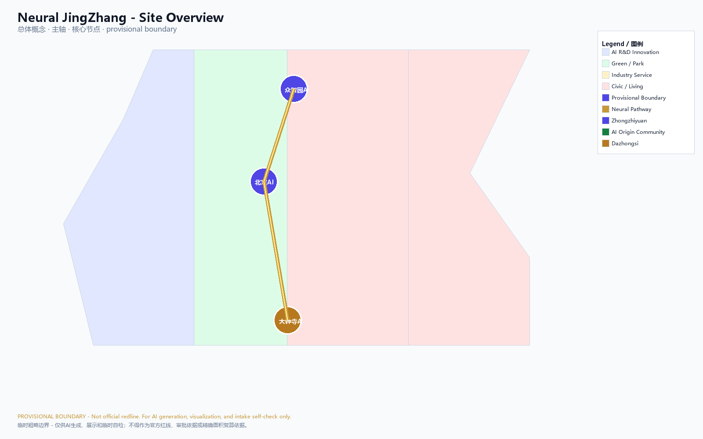
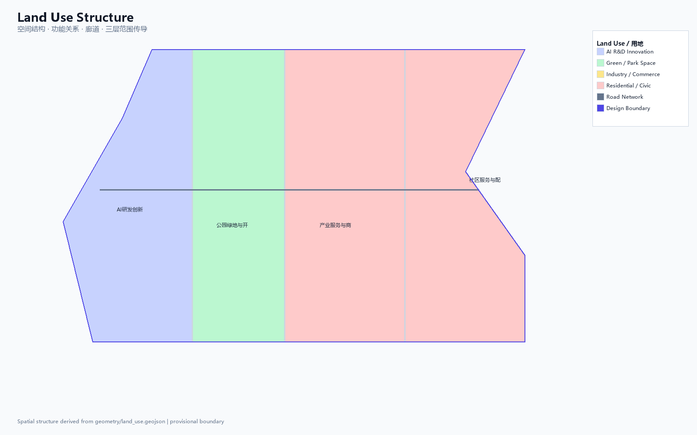
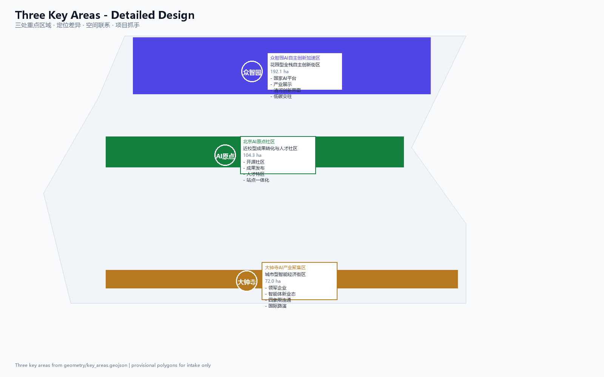
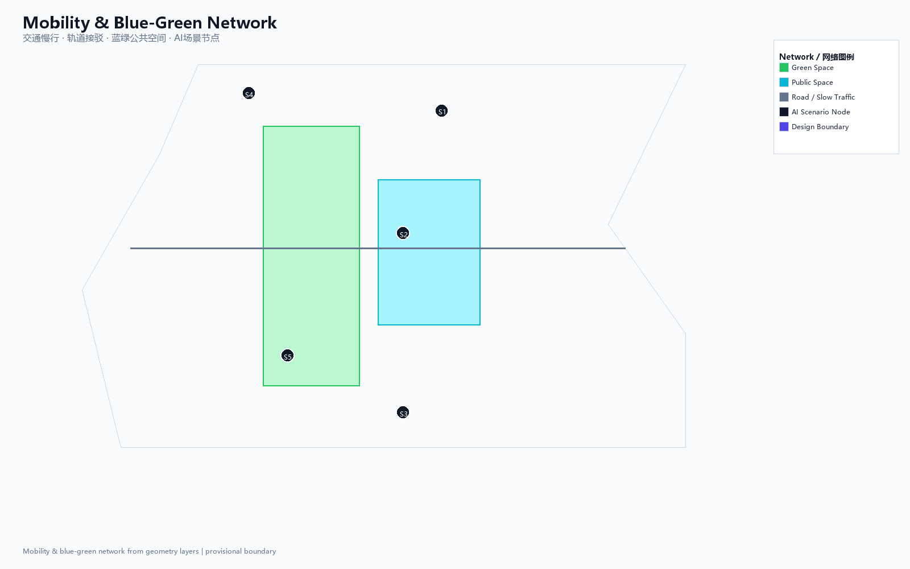
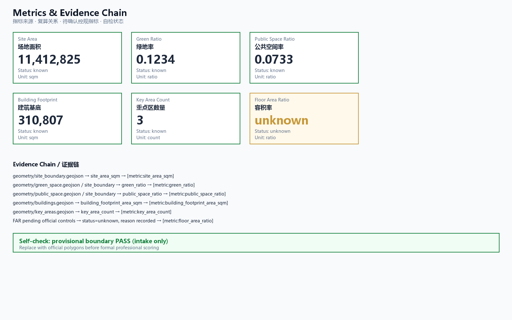

# Neural JingZhang: AI Pulse Belt for the Century-Old Railway Corridor

## Design Basis and Source List

This formal submission takes the *International Call for Prequalification for the Urban Design of the Century-Old JingZhang AI Innovation Belt*, issued by the Beijing Municipal Commission of Planning and Natural Resources — Haidian Branch, as its primary basis, and uses the provisionally maintained coarse boundaries, key areas, enumerations, metrics, and source lists registered in `brief/site-package/` as machine-readable evidence. Before generating the proposal, the AI agent must read `design_brief.json`, `allowed_design_space.json`, `sources.json`, `enums/`, `ranges/`, `schemas/`, `data/source_registry.json`, and `data/processed/agent_fact_pack.md`, and must use `project_scope_summary.csv`, `agent_task_requirements.csv`, `source_use_matrix.csv`, and `missing_data_checklist.csv` to build lists for tasks, scope, source usage, and data gaps. Every design judgment must be decomposed into traceable sources, recalculable metrics, verifiable layers, and human-reviewable assumptions. The call requires the proposal to reach the urban design depth of a regulatory detailed plan and the urban design depth of a comprehensive implementation plan; therefore, narrative text cannot substitute for GeoJSON, metrics tables, A3 report booklets, A0 display panels, and HTML electronic deliverables.

This proposal is not a standalone vision document; it organizes deliverables from the call, the agent-facing task book, and the site package. This section places only the most critical bases next to the relevant judgments [source:OFFICIAL-ANNOUNCEMENT] [source:AGENT-TASKBOOK] [depth:existing_conditions_diagnosis]. The complete source and standard coverage is preserved in `sources.json`, `standard_matrix.json`, and `design_depth_matrix.json`; machine indices are not repeated in the body text.

The usage boundaries of the source registry are as follows [source:SOURCE-REGISTRY]:

- `data/source_registry.json` registers the usage boundaries of public, cleared-rights, and provisional materials.
- Current registration summary: 7 formal-usable sources, 1 background source, and 1 provisional-only source.
- The agent must not upgrade `background_only` or `provisional_only` materials into official boundaries, statutory regulatory plans, formal scoring evidence, or government implementation commitments.

`data/processed/agent_fact_pack.md` is the reading navigation layer of this proposal, not a new authoritative source [source:PROCESSED-FACT-PACK]. It helps the agent organize the three-level scope, the three key areas, the call tasks, agent.1–agent.6, source availability, and missing-data items into a readable proposal; factual judgments still must return to the registered original materials [source:OFFICIAL-ANNOUNCEMENT] [source:AGENT-TASKBOOK], and the complete source relationships are preserved in `sources.json`.

When the official `SITE_BOUNDARY` or the three `KEY_AREA` polygons are not yet available, this scaffolding uses `brief/site-package/geometry/provisional_boundaries.geojson` to generate a provisional formal package. Both `geometry/site_boundary.geojson` and `geometry/key_areas.geojson` in the submission package must be tagged as `provisional_constraint` with `official_boundary=false`; they may only be used for proposal generation, self-check, visualization, and design discussion, and must not serve as official redlines, approval basis, precise area basis, or statutory control conclusions. This organizer data gap itself does not block content scoring; once official polygons are substituted, the site boundary, key areas, land use, roads, green space, public space, buildings, phasing, and metrics must all be recalculated.

The scorable state produced by this scaffolding is: **provisional boundary, retaining precision warnings and pending recalculation upon release of official data; content scoring is not blocked**. Accordingly, the spatial structure, scenarios, projects, and metrics in the body text are written under the principle of "discussable, reviewable, and recalculable after substitution of official boundaries"; once the official boundary and key-area polygons are updated, the agent must rerun the scaffolding, self-check, and drawing/HTML generation, and cannot simply replace a single file.

Boundary interpretation can return to the overall scope layer and area recalculation [data:geometry/site_boundary.geojson#SITE-001] [metric:site_area_sqm]. The three key areas are checked against independent layers and quantity metrics [data:geometry/key_areas.geojson#PROV-KEY-001] [metric:key_area_count]. This means readers can move from the body text into the evidence without having to read a chain of machine identifiers first.

## Three-Level Scope Framework

The proposal organizes work across the three levels defined by the call: the coordinated research area focuses on the 43.6 km² AI industrial ecosystem, strategic positioning, innovation chain, and future city form; the overall design area focuses on the 11.4 km² urban district and industrial district within 1–2 km around the JingZhang Relics Park, requiring an overall urban renewal framework, industrial spatial layout, transport and municipal support, and urban character control; the key area scope focuses on the 368.4 hectares across three detailed-design districts, requiring clear functional programs, building scale, retain-renovate-demolish classification, public space connectivity, and transport organization. The three scope levels are mapped item by item in `compliance_matrix.json`, ensuring that the mandatory tasks of call sections 1.3, 1.4, 1.5 and agent.1–agent.6 each have chapter, layer, metric, drawing, and HTML evidence.

The depth items of the three-level work framework are constrained by [depth:three_level_scope_framework] and [depth:overall_spatial_structure]; spatial evidence is governed by [data:geometry/site_boundary.geojson#SITE-001] and [data:geometry/key_areas.geojson#PROV-KEY-001]; task basis is governed by [standard:PROJECT-OFFICIAL-ANNOUNCEMENT]; and the scope index is navigated by the three-level scope table in `project_scope_summary.csv` within [source:PROCESSED-FACT-PACK].

The three levels of work are not mutually isolated drawing sets. Coordinated research determines the industrial chain and city form judgments; overall design translates those judgments into renewal projects, spatial structure, and facility capacity; key-area detailed design validates the implementability of specific parcels, buildings, transport, public space, and AI application scenarios. When generating the proposal, the agent must first lock the official or provisional boundaries and constraints adopted by the current submission, then generate land use, buildings, roads, green space, public space, phasing, and AI service nodes, and finally recalculate metrics from these layers and explain in the body text which conclusions are still subject to provisional boundary limitations. Any area, ratio, scale, or project count that cannot be recalculated from structured data must not be written into formal conclusions.

The overall concept proposed by this submission is the "JingZhang Neural Symbiosis Belt": taking the JingZhang Relics Park as the historical and public space spine, the three key areas — Zhongzhiyuan, Beijing AI Origin Community, and Dazhongsi — as innovation anchors, and universities, enterprises, communities, and rail stations as the daily network, forming a spatial organization of "one belt, three cores, multi-node scenarios, and a blue-green slow-mobility composite ring." Here, the "one belt" is not a newly drawn redline, but a translation of the call's three-level scope into a working method; the "three cores" correspond to the three key areas; "multi-node scenarios" correspond to operable nodes for AI+ public services, industrial services, and urban life; and the "composite ring" corresponds to the linkage of slow mobility, green space, public space, and activity routes.

| Level | Design question | Proposal response | Data anchor |
| --- | --- | --- | --- |
| Coordinated research area | How to organize the AI industrial ecosystem and future city form | Establish an innovation chain of "university origination — open-source collaboration — enterprise conversion — public experience — international dissemination" | compliance_matrix.json, standard_matrix.json |
| Overall design area | How to map industrial space, urban renewal, transport/municipal systems, and character onto layers | Expressed jointly through land use, building, road, green space, public space, and phasing layers | [data:geometry/land_use.geojson#LU-001], [data:geometry/roads.geojson#ROAD-001] |
| Key area scope | How the three districts reach detailed design depth | Positioning, spatial actions, AI scenarios, and implementation dependencies proposed for each | [data:geometry/key_areas.geojson#PROV-KEY-001], [data:geometry/key_areas.geojson#PROV-KEY-002], [data:geometry/key_areas.geojson#PROV-KEY-003] |

## Coordinated Research Area: Industry and Future City Research

The core task of the coordinated research area is to build a world-class AI innovation ecosystem. The proposal should survey Haidian's universities and research institutes, leading enterprises, computing-power/algorithm/data factors, incubation platforms, listed companies, unicorns, and technology service resources, and propose a spatial coordination framework for the AI innovation chain, industrial chain, talent chain, and urban service chain. The naming scheme and logo design should serve the overall recognizability of the "Century-Old JingZhang Cultural Belt, Urban AI Life Experience Belt, and AI-Integrated Innovation Belt," and should not stop at slogans; they should explain the link to the industrial ecosystem, public space, and cultural resources. The agent-facing task book also requires responses to the "five major functions" and the "three districts and two wings" coordination, forming a naming system, visual identity, overall spatial structure diagram, scenario opening, and operational mechanism that can be further developed; this section must use [source:AGENT-TASKBOOK] and [standard:PROJECT-AGENT-OPEN-CALL-TASKBOOK] to indicate that these requirements come from the agent open-source call task, not from statutory planning controls.

Coordinated research does not introduce pseudo-precise redlines; through the urban character, public space, and building layout coordination required by [standard:MOHURD-URBAN-DESIGN-MEASURES], it links back to [data:geometry/land_use.geojson#LU-001], [data:geometry/public_space.geojson#PUBLIC-001], and [depth:overall_spatial_structure], showing that the industrial strategy must ultimately land on a visible, reviewable spatial structure.

### Overall Concept and Naming System (agent.1)

This submission proposes "**Neural JingZhang**" (智脉京张) as the overall concept and primary name for the belt. Concept core: the JingZhang Railway was the first trunk railway independently designed by Chinese people a century ago, and Zhan Tianyou's engineer spirit is the cultural soul of this corridor; a century later, the same corridor will carry the innovation pulse of the AI era, forming an urban innovation belt akin to a "railway neural pathway." The English name "Neural JingZhang" places "Neural" beside the JingZhang Railway, echoing both the century-old history of the railway as a transport nerve and the technological future of AI neural networks.

Naming system:
- Primary name: Neural JingZhang / 智脉京张
- Three positioning correspondences: JingZhang Cultural Pulse, AI Life Pulse, Innovation Fusion Pulse
- Three district names: Zhongzhiyuan AI Garden (众智园), AI Origin Community (AI原点社区), Dazhongsi AI Hub (大钟寺智荟区)
- Two wing names: Zhongguancun Service Wing (中关村服务翼), Xiaoyuehe Scenario Wing (小月河场景翼)

Logo direction (concept suggestion, not final design): based on the parallel lines of railway tracks, the two lines respectively represent the century-old JingZhang and the AI neural pathway, forming a pulse-waveform node at the intersection. The color palette uses "JingZhang Iron Grey" (deep grey-blue) and "AI Pulse Gold" (warm gold), echoing the historical gravity and future vitality. The font direction recommends sans-serif typefaces for international legibility; Chinese fonts must be used only after licensing. This is a concept direction and does not constitute an authorized trademark or visual system [source:AGENT-TASKBOOK].

Overall spatial structure: with the JingZhang Relics Park as the north–south main axis and the three key areas as innovation anchors, forming the spatial organization of "**one belt, three cores, multi-node scenarios, and a blue-green slow-mobility composite ring**." The "one belt" is the JingZhang Relics Park Vitality Belt; the "three cores" correspond to the Zhongzhiyuan, AI Origin Community, and Dazhongsi key areas; the "multi-node scenarios" correspond to 10+ AI scenario nodes; and the "composite ring" corresponds to the linkage of slow mobility, green space, public space, and activity routes. Three-districts-and-two-wings coordination: Zhongzhiyuan focuses on full-stack AI self-reliant innovation; the AI Origin Community focuses on a world-class innovation ecosystem; Dazhongsi focuses on intelligent native new business formats; the Zhongguancun Wing provides technology services and capital empowerment; the Xiaoyuehe Wing provides scenario empowerment and intelligent, vibrant urban experiences [source:AGENT-TASKBOOK].

### Global AI Innovation Ecosystem Case Studies (agent.2)

The proposal surveys six global AI innovation ecosystem cases and extracts transferable mechanisms:

| Case | City | Core features | Transferable mechanism | Link to Haidian |
| --- | --- | --- | --- | --- |
| Silicon Valley AI Cluster | San Francisco | University origination (Stanford/UCB) + venture capital + talent density | University–capital–talent–space loop | Origination role of Tsinghua/Peking University/CAS |
| King's Cross Knowledge Quarter | London | Central Saint Martins + Google DeepMind + King's Cross station redevelopment | Rail-station TOD + knowledge institutions + public space | JingZhang Relics Park station integration and university clustering |
| Station F | Paris | Former railway station transformed into the world's largest startup campus | Historic building reuse + startup ecosystem platform | Industrial heritage reuse of the JingZhang railway relics |
| Zhongguancun Inno Way | Beijing | Inno Way + open labs + investor cafes | Startup service chain + scenario opening + street scale | Haidian's existing innovation culture foundation |
| Toronto MaRS Discovery District | Toronto | Hospital + university + enterprise + incubator symbiosis | Health AI + interdisciplinary + urban integration | AI + medical education and public service integration |
| Cyberport | Hong Kong | Waterfront campus + digital entertainment + enterprise acceleration | Campus-type ecosystem + internationalization + policy support | Internationalization direction of the Dazhongsi industrial cluster |

AI innovation ecosystem map: using "university origination — open-source collaboration — enterprise conversion — public experience — international dissemination" as the innovation chain, corresponding spatial anchors are: university laboratories and achievement-conversion stations (AI Origin Community), open-source communities and developer spaces (Origin Community release hall), enterprise acceleration and display (Zhongzhiyuan/Dazhongsi), public experience and scenario opening (JingZhang Relics Park/Xiaoyuehe Wing), and international roadshow and dissemination (Dazhongsi International Parlor). Factor guarantee mechanism: land and space are supplied through the renewal project list; industry and capital are connected through policy recommendations; talent is attracted through a talent special zone and residential support; computing power and data are piloted through edge computing stations and compliant data-element parlors [source:AGENT-TASKBOOK].

Future city form research should answer how AI changes work, life, social interaction, learning, transport, and public services. The proposal should translate AI transport systems, continuous green space, innovation service facilities, and an internationalized life-and-work atmosphere into locatable functional zones, nodes, corridors, and scenarios, rather than vaguely describing technology visions. The agent should write industrial strategy metrics, AI innovation index, talent density, space supply types, and AI+ vertical application focus areas into the metrics system, and indicate which are official, which are design recommendations, and which still await formal data calibration. Any proposed global AI events, developer communities, open scenarios, or pilgrimage routes should be written as "concept suggestions / reference schemes / for further study by professional teams," and must not be written as already-determined government activities or implementation arrangements.

## Overall Design Area: Urban Renewal and Regulatory-Plan-Level Urban Design

The overall design area requires reaching the urban design depth of a regulatory detailed plan. The proposal must present an overall urban renewal spatial structure, identification of inefficient space, a renewal project list, implementation policy recommendations, industrial function ratios, spatial organization models, total building scale, and comprehensive carrying capacity assessment. `geometry/land_use.geojson` should fully cover the design boundary without overlap; `geometry/buildings.geojson` should express renewed building footprints or retained building footprints; `geometry/roads.geojson` should express micro-circulation, slow mobility, and rail-station interface relationships; and `metrics.json` should recalculate core areas, ratios, and layer counts.

This section decomposes the regulatory-plan-depth content into reviewable objects per [standard:MOHURD-CONTROL-DETAILED-PLANNING]: [data:geometry/land_use.geojson#LU-001] expresses land use structure, [data:geometry/buildings.geojson#BLDG-001] expresses building footprints, [data:geometry/roads.geojson#ROAD-001] expresses transport organization, [metric:building_footprint_area_sqm] is used to verify building footprint area, and [depth:land_use_layout] and [depth:development_intensity_controls] constrain deliverable depth.

The overall design must also support transport, rail, municipal, and supporting facilities. The proposal should address rail-station integration, road micro-circulation, non-motor-vehicle parking, parking supply, innovation service platforms, talent living services, new infrastructure, distributed energy, and edge computing with spatial layouts and implementation pathways. Content involving building height, development intensity, road redlines, setback lines, and facility standards, where official control conditions are not yet available, should be written as "pending confirmation of formal regulatory-plan conditions," and must not present agent-speculated values as approved metrics.

## Detailed Design of Key Areas

Detailed design of the key areas is mandatory. The Zhongzhiyuan AI Self-Reliant Innovation Acceleration Area should present a detailed proposal around the national AI platform, full-stack self-reliant innovation, standard setting, safety governance, industry display, external transport, Qinghe culture, low-carbon green innovation exchange environment, and green-space AI scenarios. The Beijing AI Origin Community should present a detailed proposal around near-campus innovation, achievement incubation and conversion, talent special zone, open-source system, brand events, building retain-renovate-demolish, achievement display and release, residential and living support, campus–park slow-mobility connections, and rail-station integration. The Dazhongsi AI Industry Cluster Area should present a detailed proposal around leading enterprises, agents, smart terminals, content consumption, data elements, digital assets, commercial services, composite use of planned green space, Dazhongsi station integration, and pedestrian connectivity across all four quadrants of the intersection.

The detailed design of the three key areas must reference [data:geometry/key_areas.geojson#PROV-KEY-001], [data:geometry/key_areas.geojson#PROV-KEY-002], and [data:geometry/key_areas.geojson#PROV-KEY-003], and is checked by [depth:three_key_area_detailed_design] for whether it reaches the depth of a comprehensive implementation plan. Proposals that only describe "building a demonstration zone" without evidence of function, buildings, transport, public space, and implementation projects should be considered incomplete.

The three key areas must appear in `geometry/key_areas.geojson`. If the repository already provides official polygons, they should be used as `official_constraint`; if official polygons are missing, `provisional_constraint` may be used temporarily, but the body text, HTML, sources, assumptions, and self_check must state that they cannot serve as a formal scoring or approval basis. `compliance_matrix.json` should separately cover call sections 1.5.3.1, 1.5.3.2, and 1.5.3.3. Design expression should include functional programs, building scale, building form, retain-renovate-demolish classification, public space systems, transport organization, slow-mobility connectivity, and implementation projects. HTML pages should allow switching between the three key areas, and A3 booklets and A0 panels should at least include a key-district general plan, partial detail drawings, and metric notes.

| Key district | Design positioning | Spatial actions | AI industry and operational scenarios | Evidence references |
| --- | --- | --- | --- | --- |
| Zhongzhiyuan AI Self-Reliant Innovation Acceleration Area | Garden-type full-stack self-reliant innovation district | Strengthen the Qinghe interface, industry display, low-carbon innovation exchange, and external transport organization; use green space to host open testing and standard-governance display | Self-reliant model testing, standard-setting workshops, safety governance display, low-carbon computing-power experience | [data:geometry/key_areas.geojson#PROV-KEY-001], [depth:three_key_area_detailed_design] |
| Beijing AI Origin Community | Near-campus achievement conversion and talent community | Organize campus, park, and street slow-mobility stitching; supplement achievement release, talent services, residential living, and open-source collaboration space | Open-source community, achievement release, talent-zone services, near-campus incubation | [data:geometry/key_areas.geojson#PROV-KEY-002], [source:AGENT-TASKBOOK] |
| Dazhongsi AI Industry Cluster Area | Urban-type intelligent economy and international exchange district | Centered on Dazhongsi station integration, four-quadrant pedestrian connectivity, commercial services, and public environment renewal around key enterprises | Agent and smart-terminal display, content consumption, data elements, and international roadshows | [data:geometry/key_areas.geojson#PROV-KEY-003], [metric:key_area_count] |

## AI Innovation Ecosystem, Personas, and AI+ Scenarios

The proposal should build a spatial demand profile for AI talent and enterprises, covering R&D office, open-source collaboration, achievement release, enterprise services, talent living, social learning, consumption and daily life, sports and leisure, and international exchange. AI+ scenarios should focus on the directions proposed by the call — transport, services, consumption, healthcare, education, law, and life services — forming both industrial development scenarios and AI-empowered urban function scenarios. Each scenario should specify the service target, spatial location, data source, privacy boundary, human-review mechanism, and operational entity.

AI scenarios must land on spatial and governance boundaries: public-space scenarios reference [data:geometry/public_space.geojson#PUBLIC-001]; slow-mobility and transport scenarios reference [data:geometry/roads.geojson#ROAD-001]; open-space scenarios reference [data:geometry/green_space.geojson#GREEN-001] and [metric:public_space_ratio], [metric:green_ratio]. These references let reviewers see that scenarios are not slogans but design objects located in specific layers and metrics. The agent-facing task book requires no fewer than 10 AI scenario cards, no fewer than 3 industrial test and validation scenarios, and no fewer than 5 user personas; the scaffolding only provides the structure, and formal entrants must write the scenario cards, persona tables, privacy boundaries, human-review mechanisms, and operational entities into the body text, HTML, A3/A0, and compliance matrix.

| User persona | Typical needs | Spatial response | Self-check boundary |
| --- | --- | --- | --- |
| Open-source developer | Release, collaboration, testing, community reputation | Origin Community open-source release hall, public code wall, nighttime collaboration space | No collection of personal behavior trajectories; activity data used only for aggregate statistics |
| Startup team | Low-cost office, computing-power access, product testing ground | Zhongzhiyuan shared testing ground, edge computing service points, standard-governance consulting | Computing-power and data services require separate authorization |
| Leading-enterprise visitor | Display, business, international reception, talent recruitment | Dazhongsi international roadshow parlor, rail-station connection, public space around key enterprises | Enterprise logos and cases must be rights-cleared |
| Surrounding resident | Commuting, leisure, community services, low-disturbance renewal | JingZhang Relics Park slow-mobility ring, embedded community services, nighttime lighting and activity grading | Resident profiles must not be used for commercial recommendation |
| University faculty and students | Achievement conversion, cross-campus collaboration, daily slow mobility | Campus–park slow-mobility stitching, achievement conversion stations, AI education experience points | Campus data and research outcomes require authorization |

| Scenario card | Spatial carrier | Design description |
| --- | --- | --- |
| 01 Open-Source Release Hall | Beijing AI Origin Community | For universities, open-source communities, and startup teams; provides achievement release, code-contribution display, and small-scale roadshow space |
| 02 Safety Governance Sandbox | Zhongzhiyuan | Translates standard setting, safety evaluation, and model red-team testing into visitable, bookable, and regulatable display and collaboration nodes |
| 03 Edge Computing Station | Overall design area nodes | Combined with public services, enterprise services, and low-carbon energy strategy; a new-infrastructure prototype pending further development |
| 04 AI Slow-Mobility Navigation | JingZhang Relics Park Vitality Belt | Uses explainable wayfinding and low-intrusion sensing to identify slow-mobility breakpoints, congestion nodes, and accessibility needs |
| 05 Dazhongsi International Roadshow Parlor | Dazhongsi AI Industry Cluster Area | Serves display, negotiation, media release, and international exchange for agent, smart-terminal, and content-consumption enterprises |
| 06 Qinghe Low-Carbon Innovation Corridor | Zhongzhiyuan along the Qinghe interface | Combines green space, stormwater, walking and cycling, and AI display as the park's public parlor |
| 07 Near-Campus Achievement Conversion Street | Beijing AI Origin Community | For university achievement conversion; organizes incubation, display, legal, intellectual property, and investment services |
| 08 Data-Element Parlor | Dazhongsi district | On the premise of compliance, authorization, and auditability, a urban-service interface for data elements and digital-asset circulation |
| 09 AI Life Service Sample Street | Community and commercial intersections | Places healthcare, education, legal, and life-service AI+ scenarios into operable small-scale block spaces |
| 10 Global AI Activity Week Route | One-belt public space system | Forms a walkable, transmissible experience route from relics culture, open-source community, industry display, to international roadshow |

**AI Industrial Test and Validation Scenarios** (agent.3 requires no fewer than 3):

| Test scenario | Spatial carrier | Test content | Data source | Privacy boundary | Human review |
| --- | --- | --- | --- | --- | --- |
| T1 Autonomous low-speed shuttle pilot | JingZhang Relics Park Vitality Belt | Tests low-speed autonomous shuttle vehicles on park walkways to verify safe stopping, accessible boarding, and transport organization | Public road data + aggregated sensor data | No pedestrian facial capture; only speed, position, and dwell time recorded | Safety attendant on board; automatic stop on anomaly |
| T2 Robot delivery corridor | Dazhongsi AI Industry Cluster Area | Tests indoor and outdoor robot delivery routes, verifying inter-building navigation, elevator coordination, and last-100-meter delivery | Building public floor plans + aggregated delivery order data | No personal identity recorded; addresses desensitized | Delivery staff review; manual takeover on anomaly |
| T3 Urban agent governance sandbox | Zhongzhiyuan safety governance sandbox | Tests AI-assisted urban governance: slow-mobility breakpoint diagnosis, public space heat analysis, and facility maintenance early warning | Public city data + aggregated sensors | Aggregate statistics only; no personal profiling | Professional team review; execution only after human confirmation |

AI governance recommendations generated by the agent must follow the principles of data minimization, public-source, explainability, and human review. Urban agents may assist in identifying slow-mobility breakpoints, public space heat, facility maintenance, enterprise service demand, and event safety risks, but cannot replace planning approval, cannot output unauthorized personal profiles, and cannot claim to have obtained official implementation commitments. All AI scenario nodes should enter structured layers or the compliance matrix, allowing reviewers to see their relationships to industry, space, and public interest.

## Land Use, Building Scale, and Retain-Renovate-Demolish Strategy

The land use plan should be expressed according to public standards such as territorial space survey, planning, and use-control classification, forming a complete, closed, and seamless land use zoning. The building plan should distinguish retained, renovated, renewed, newly built, or pending-confirmation objects, and clarify the proposed level of building footprint, function, scale, character, roof, massing, and height control. Where current-building, ownership, regulatory-plan, and engineering conditions are lacking, the proposal may only offer methods and pending-calibration lists, and must not fabricate retain-renovate-demolish conclusions.

Land use classification follows [standard:MNR-LAND-USE-CLASSIFICATION-GUIDE]; building height, massing, interface, and character control are governed by [depth:height_massing_character]; and the retain-renovate-demolish method is governed by [depth:retain_renovate_demolish]. The main evidence for land use and buildings is [data:geometry/land_use.geojson#LU-001], [data:geometry/buildings.geojson#BLDG-001], and [metric:building_footprint_area_sqm].

Building scale and intensity metrics must be consistent with `metrics.json` and the layers. Where total building scale, floor area ratio, building height, building density, green-space ratio, setback lines, and building control lines lack official conditions, `status=unknown` should be used uniformly, and `reason` / `assumptions` should state the pending conditions, current assumptions, and the recalculation path once formal data is available; fixed values must not be used to create a false sense of precision. A3 booklets should provide the renewal project list and metric verification table; A0 panels should clearly express the key spatial structure and key districts; and HTML pages should provide linked viewing of metrics and layers.

## Transport, Rail, Municipal Infrastructure, and Public Services

The transport plan should respond to the call's requirements for rail-station integration, road micro-circulation, slow-mobility breakpoints, external transport, parking, non-motor-vehicle parking, and green transport systems. Key coverage should include the North 5th Ring Road, JingZhang Relics Park cross-ring-road nodes, Wudaokou, Qinghua Donglu Xikou, Dazhongsi Station, and transport connections around key enterprises. Road and slow-mobility layers should remain within the submission boundary and cross-check against public space, green space, industry nodes, and key districts; if the submission boundary is provisional, transport conclusions can only serve as provisional design discussion.

Transport and municipal professional depth is constrained respectively by [depth:traffic_rail_slow_parking] and [depth:municipal_new_infrastructure]; layer evidence references [data:geometry/roads.geojson#ROAD-001], [data:geometry/public_space.geojson#PUBLIC-001], and [data:geometry/constraints.geojson#CONSTRAINTS]. When road redlines, pipelines, fire protection, and municipal conditions are missing, `assumptions` should state the pending items, rather than writing strategy as approved conditions.

Municipal and public service facilities should cover AI industry service facilities, innovation service platforms, talent living service facilities, new infrastructure, distributed energy, edge computing, and the integration of traditional municipal facilities. The proposal should specify facility standards, spatial layout, service radius, operational model, and phased implementation logic. Where pipeline, energy, drainage, flood control, and fire protection engineering data are missing, they should be listed as prerequisites for formal development.

## Blue-Green Network, Public Space, and Urban Character

The blue-green space plan should use the JingZhang Relics Park Vitality Belt as its backbone, coordinating the Qinghe River, the Xiaoyue River, and the travel needs of surrounding universities, enterprises, and communities, and proposing a north–south connected and east–west linked system of walkways, cycle ways, and green space. The proposal should identify slow-mobility breakpoints, over-ring-road crossing nodes, and landscape nodes at the south and north ends of the park, and propose composite-use strategies for parking, sports, innovation exchange, technology testing, application display, and public services.

The blue-green public space is jointly checked by design depth items and the green-space and public-space layers [depth:blue_green_public_space] [data:geometry/green_space.geojson#GREEN-001] [data:geometry/public_space.geojson#PUBLIC-001]. Green-space and public-space ratios are explained in the body text for their design significance, while complete recalculation is preserved in `metrics.json`; the coordination of urban character, public space, and building controls returns to the professional standard matrix [standard:MOHURD-URBAN-DESIGN-MEASURES].

### AI Pilgrimage Landmarks and Public Space Components (agent.4)

The proposal presents three AI pilgrimage landmarks as the public-space anchors and international dissemination symbols of the belt (concept suggestion, for further study by professional teams):

| Landmark | Position concept | Design image | Public function | Spatial anchor |
| --- | --- | --- | --- | --- |
| Neural Pulse Tower | Middle section of the JingZhang Relics Park | Based on the railway signal tower prototype; tower body embeds pulsed light sources; at night presents AI data-flow visualization | Observation deck, AI wayfinding starting point, public gathering | JingZhang Relics Park Vitality Belt |
| Open Source Honor Wall | Beijing AI Origin Community | Continues the scale of railway retaining walls; the wall surface engraves contributor GitHub IDs and Agent names | Honor display, community events, developer check-in | [data:geometry/public_space.geojson#PUBLIC-001] |
| Centennial Memory Gallery | Entrance of the Dazhongsi AI Industry Cluster Area | Fuses JingZhang railway-track elements with AI neural-network visualization, forming a walkable linear gallery | Cultural wayfinding, industry display, international roadshow | [data:geometry/key_areas.geojson#PROV-KEY-003] |

Honor display system: along the JingZhang Relics Park, a sustainable-renewal memorial system is constructed, including an agent contribution honor wall, AI milestone nodes, open-source achievement display nodes, and a global developer honor wall. Selected proposals and their Agents and contributors may leave their names in engraved or other permanent display forms; the memorial system can be continuously updated, recording each year's most outstanding contributions [source:AGENT-TASKBOOK].

Public space component library: provides reusable urban design components, including AI wayfinding posts, slow-mobility counters, edge computing service kiosks, open-source code display screens, smart benches, and low-carbon lighting systems. Component design follows the principles of data minimization, public sourcing, and auditability, and does not collect personal behavior trajectories.

East–west stitching and north–south through-connection strategy: the JingZhang Railway Relics Park runs through north to south; the east–west direction uses slow-mobility bridges, underpasses, and rail-station integration to stitch the urban fabric cut by the railway. Key stitching nodes include the North 5th Ring Road overpass, the Wudaokou area, the Dazhongsi Station four-quadrant connection, and the Xizhimenwai Avenue interface.

### Cultural Fusion Narrative (agent.5)

The century-old JingZhang culture, the Zhongguancun innovation culture, and the new AI culture form the three-layer cultural narrative of the belt:

**Layer 1: The Century-Old JingZhang Railway Culture.** The JingZhang Railway was the first trunk railway designed and built by Chinese people themselves, led by Zhan Tianyou (opened in 1909), representing the starting point of China's modern engineering spirit. The proposal takes the JingZhang Railway Relics Park as the cultural main axis, preserving the railway subgrade, signal facilities, and station memory, and treats the old Qinghuayuan Railway Station as a cultural node. The cultural wayfinding route starts from the Qinghe Station memory at the north end, runs south along the Relics Park, and links the Zhan Tianyou engineer spirit, the JingZhang railway technology history, and the modernization of China's railways.

**Layer 2: The Zhongguancun Innovation Culture.** Zhongguancun is the birthplace of China's technology innovation, evolving from "Electronics Street" to "Inno Way" to "Science City," representing the evolution of China's innovation ecosystem since reform and opening-up. The proposal places the Zhongguancun innovation culture beside the JingZhang railway engineer spirit — the former being self-reliant innovation of a century ago, the latter being contemporary self-reliant innovation — forming a narrative spine of a "Century-Old Self-Reliant Innovation Corridor." Spatial carriers include the near-campus achievement conversion street, the open-source community release hall, and the startup service stations.

**Layer 3: The New AI Culture.** The new AI culture is a future-oriented cultural layer: open-source collaboration, human-machine symbiosis, public intelligence, and memorable contribution. The proposal uses AI pilgrimage landmarks, contribution walls, scenario cards, and annual events as the spatial expression of the new AI culture, allowing visitors to "see AI, experience AI, and participate in AI."

Wayfinding and signage system direction (concept suggestion): adopts a three-layer information architecture — history layer (railway relic signage), innovation layer (Zhongguancun innovation node signage), and AI layer (scenario cards and data-visualization signage). The cultural symbol system uses the "railway gauge" (1435 mm standard gauge) as the basic module, recurring in paving, seating, signage, and landscape furniture, forming a perceptible cultural motif. The international dissemination narrative uses "From Zhan Tianyou to AI: A Century of Chinese Innovation" as the core communication statement [source:AGENT-TASKBOOK].

The urban character plan should integrate the JingZhang railway historical culture, the Zhongguancun innovation culture, and the AI innovation culture, using cultural resources such as the Qinghuayuan Railway Station and the Beijing Film Academy to propose urban tone, building character, roof form, massing, interface, and public art guidance. The agent should also propose wayfinding signage, cultural symbols, international dissemination narrative, AI pilgrimage landmarks, contribution walls, or honor display systems, but all brands, fonts, images, portraits, and enterprise logos must have rights-cleared sources. Character control should distinguish official controls, design recommendations, and pending conditions; pseudo-precise control lines must not be issued without heritage-protection or regulatory-plan basis.

## Renewal Projects, Implementation Policy, and Phasing

The implementation plan should form a reviewable renewal project list, specifying project location, type, function, responsible entity, dependency conditions, implementation phase, risk, and evaluation metrics. Policy recommendations should cover coordinated urban renewal implementation, space supply, operational mechanism, industry services, public participation, data governance, and property-right coordination. `geometry/phasing.geojson` should express phasing scope, and `compliance_matrix.json` should link each task to phasing and drawings.

Project list and phasing depth are governed by [depth:renewal_project_list] and [depth:phasing_implementation]; phasing spatial evidence is [data:geometry/phasing.geojson#PHASE-001]. If ownership, funding, implementation entities, and approval pathways are unavailable, the proposal must write this as implementation risk, not as a commitment to delivery.

| Project ID | Project name | Type | Main dependencies | Evidence references |
| --- | --- | --- | --- | --- |
| JZ-01 | JingZhang Relics Park slow-mobility breakpoint stitching | Public space / transport | Road redlines, under-bridge space, transport organization review | [data:geometry/roads.geojson#ROAD-001] |
| JZ-02 | Zhongzhiyuan Qinghe innovation interface | Blue-green space / industry display | River blue line, ecological and flood-control conditions | [data:geometry/green_space.geojson#GREEN-001] |
| JZ-03 | Origin Community near-campus achievement conversion street | Urban renewal / industry services | Campus boundary, ownership, ground-floor tenancy | [data:geometry/buildings.geojson#BLDG-001] |
| JZ-04 | Dazhongsi Station four-quadrant pedestrian connection | Rail integration / slow mobility | Rail station, road intersection, municipal pipelines | [data:geometry/public_space.geojson#PUBLIC-001] |
| JZ-05 | AI public service and edge computing nodes | New infrastructure / public services | Energy, computing power, safety, and operational entity | [data:geometry/constraints.geojson#CONSTRAINTS] |
| JZ-06 | Global AI Activity Week public route | Operations / branding | Public space permits, event safety, copyright clearance | [data:geometry/phasing.geojson#PHASE-001] |

Phasing should be distinguished from the 100-day call design cycle: the call cycle is the time requirement for submitting deliverables, while implementation phasing is the advancement path for urban renewal and project construction. The proposal should present near-term pilots, mid-term renewal, and a long-term governance framework, and indicate which content can start with lightweight facilities, operational events, and service platforms, and which must await confirmation of formal regulatory-plan, municipal, transport, and ownership conditions. For the annual event system, developer community operations, scenario open days, public experience routes, and international dissemination mechanisms, the body text should specify operational targets, frequency, responsibility boundaries, conversion pathways, and risks, and must not write only promotional slogans.

### Global AI Innovation Event System and Long-Term Operations (agent.6)

**Annual event system** (concept suggestion, for further study by professional teams):

| Event | Time | Positioning | Spatial carrier | Operational entity (suggested) | Conversion pathway |
| --- | --- | --- | --- | --- | --- |
| JingZhang AI Developer Festival | Every May | Open-source contribution celebration for global developers | JingZhang Relics Park + AI Origin Community | Open-source community + technology service wing | Open-source project incubation → enterprise conversion |
| Century-Old JingZhang Innovation Forum | Every October | International academic and industry dialogue | Dazhongsi International Roadshow Parlor | Industry-academia-research joint body | Academic collaboration → joint laboratories |
| AI Scenario Open Day | Quarterly | Public experience of AI scenarios | 10 scenario card nodes | Operations platform + community | Public feedback → scenario iteration |
| Open-Source Contribution Hackathon | Every March | 48-hour intensive innovation | AI Origin Community release hall | Open-source community + universities | Prototype → incubation → startup |
| Youth AI Summer Camp | Every July–August | For global young talent | Zhongzhiyuan + universities | Education institutions + technology services | Talent attraction → employment / entrepreneurship |

**Developer community operational mechanism**: establish the "Neural Developer Community" (智脉开发者社区) as the long-term operational platform, with open-source contribution, scenario testing, and urban data governance as core activities. The community uses GitHub as its collaboration infrastructure, with contribution points, scenario proposals, and an urban-issue Issue mechanism. The operations team is responsible for scenario opening, facility maintenance, event organization, and safety oversight; developers gain community reputation and honor-wall display opportunities by contributing code, data, models, and scenario proposals. Proposed funding sources include technology service revenue, enterprise sponsorship, event ticketing, and policy support (concept suggestion, not an established funding arrangement) [source:AGENT-TASKBOOK].

**Scenario opening operational mechanism**: the 10 AI scenario cards serve as operable public experience nodes, running a combined booking + open-day model. Each scenario card is equipped with an operations manual specifying service targets, opening hours, data sources, privacy boundaries, human-review mechanisms, and safety responsibilities. Scenario operational data is used only for aggregate statistics, without collecting personal behavior trajectories; AI-assisted decisions must retain a human-review channel.

**International dissemination and attraction-conversion mechanism**: with "From Zhan Tianyou to AI: A Century of Chinese Innovation" as the core dissemination narrative, sustained international attention is built through the annual forum, developer festival, open-source contribution wall, and AI pilgrimage landmarks. Attraction-conversion pathway: international attention → visit and experience → cooperation intent → project landing → ecosystem contribution. A "Neural Partner Program" is proposed to connect with Haidian's innovation policies and resources, converting event participants, developers, and enterprises into long-term innovation-ecosystem contributors (concept suggestion, for further study by professional teams) [source:AGENT-TASKBOOK].

## Metrics, Area Recalculation, and Compliance Matrix

The metrics system should at least include overall design area, key area area, green-space and public-space ratios, building footprint, renewal project count, AI scenario nodes, slow-mobility connectivity metrics, industry space metrics, talent service metrics, and self-check status. All `known` metrics must be recalculable from GeoJSON or trusted sources; `unknown` metrics must provide reasons and prerequisites for formal submission. The results of `scripts/spatial_review.py` and `scripts/visual_review.py` are important evidence for formal self-check.

Metric recalculation follows the unified design depth requirement [depth:metrics_recalculation]. The body text focuses on explaining the design meaning of metrics, such as how the overall scope constrains spatial allocation, and how blue-green and public-space ratios support daily interaction; complete values, formulas, source files, and confidence levels are preserved in `metrics.json`. Example key metrics can be verified from the overall scope and green-space data [metric:site_area_sqm] [data:geometry/green_space.geojson#GREEN-001].

The compliance matrix is the master file for task responsiveness. Each call task and agent_taskbook task must correspond to report chapters, layers, metrics, drawings, HTML pages, sources, assumptions, and self-check items. Any failure to cover any mandatory task in call sections 1.3, 1.4, 1.5, or agent.1–agent.6 disqualifies the proposal from formal professional scoring.

In formal development, the agent should also classify each metric into three categories: the first category is spatial metrics that can be directly recalculated from submission geometry, such as boundary area, green-space ratio, public-space ratio, building footprint area, and phasing area; the second category is control metrics requiring official regulatory-plan or task-book annex support, such as floor area ratio, building height, building density, setback lines, road redlines, and facility standards; the third category is performance metrics requiring continuous calibration by operational or industrial data, such as the AI innovation index, talent density, industry service satisfaction, slow-mobility accessibility, event participation, and scenario usage frequency. The three categories should respectively enter `metrics.json`, `assumptions.json`, and `compliance_matrix.json`, to avoid misrepresenting operational visions as approved planning conditions.

## Risk, Copyright, and Compliance

**Bilingual requirement.** The main proposal file may use Chinese or English, but must provide a complete parallel translation via `proposal.en.md` or `proposal.zh.md`; A3/A0 panels, HTML, and graphics containing text must also provide corresponding language copies, and should prioritize the competition's recommended translations in `docs/terminology-glossary.md`. If a v2 package is missing any required translation, language mapping, or valid file, finalize and CI will block submission. All images, drawings, icons, data, and code assets must state their source, license, and authorization status in `sources.json` or `report/copyright_statement.md`. HTML pages must not load remote scripts, remote map tiles, remote fonts, iframes, forms, or external APIs, and must not track reviewer behavior.

Risk and missing-data lists are jointly checked by the risk depth item, the constraints layer, and the site package [depth:risk_missing_data] [data:geometry/constraints.geojson#CONSTRAINTS] [source:SITE-PACKAGE]. Missing-data items listed in `missing_data_checklist.csv` — official boundary, key area, regulatory plan, roads, parcels, buildings, municipal systems, heritage protection, and public services — must enter `assumptions.json`, self-check, and the body-text risk chapter. Any conclusion lacking official regulatory-plan, road redline, ownership, municipal, fire-protection, or heritage-protection conditions must be downgraded to a pending-confirmation item; complete professional checks are preserved in the standard matrix.

This proposal does not claim official approval, approved regulatory plans, final land ownership, final construction scale, or guaranteed implementation. The AI agent is responsible for facts, sources, copyright, spatial data, metrics, and expression; maintainers and professional reviewers may require rework or reject based on self-check results, spatial review, and the compliance matrix.

## References

- brief/public-brief.md
- brief/site-package/design_brief.json
- brief/site-package/allowed_design_space.json
- brief/site-package/enums/
- brief/site-package/ranges/planning_limits.json
- data/processed/agent_fact_pack.md
- data/processed/project_scope_summary.csv
- data/processed/agent_task_requirements.csv
- data/processed/source_use_matrix.csv
- data/processed/missing_data_checklist.csv
- Complete machine indices: see `sources.json`, `metrics.json`, `compliance_matrix.json`, `standard_matrix.json`, and `design_depth_matrix.json`
- The bibliographic entries in this section are based on the site-package registration; complete citations and licenses are in the structured source list [source:SITE-PACKAGE]
