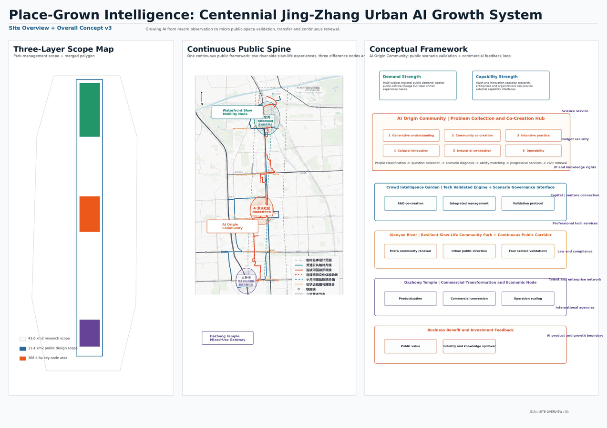
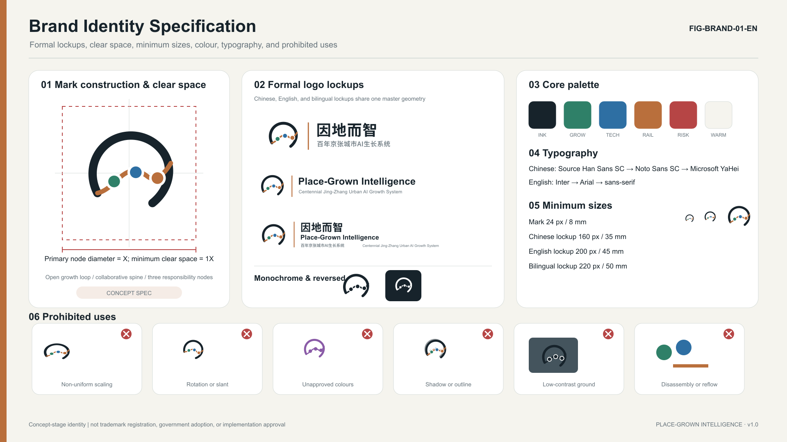
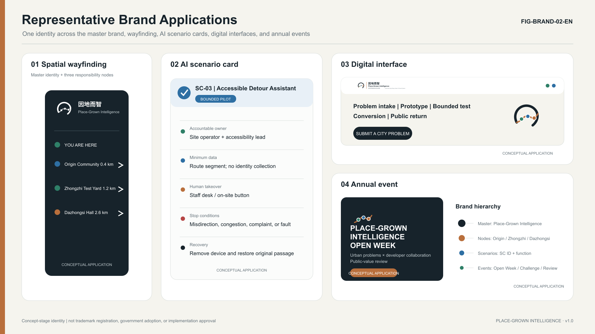
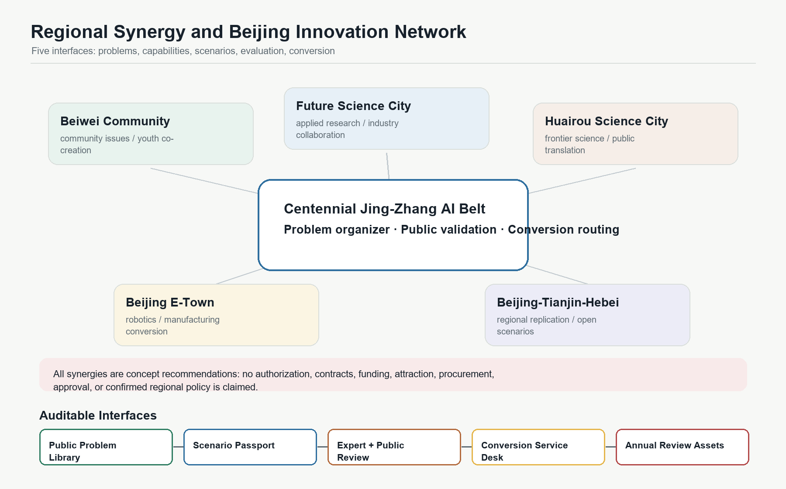
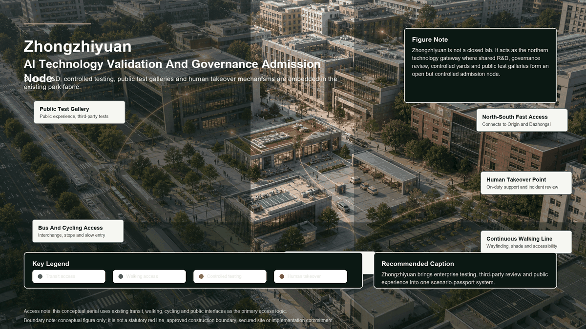
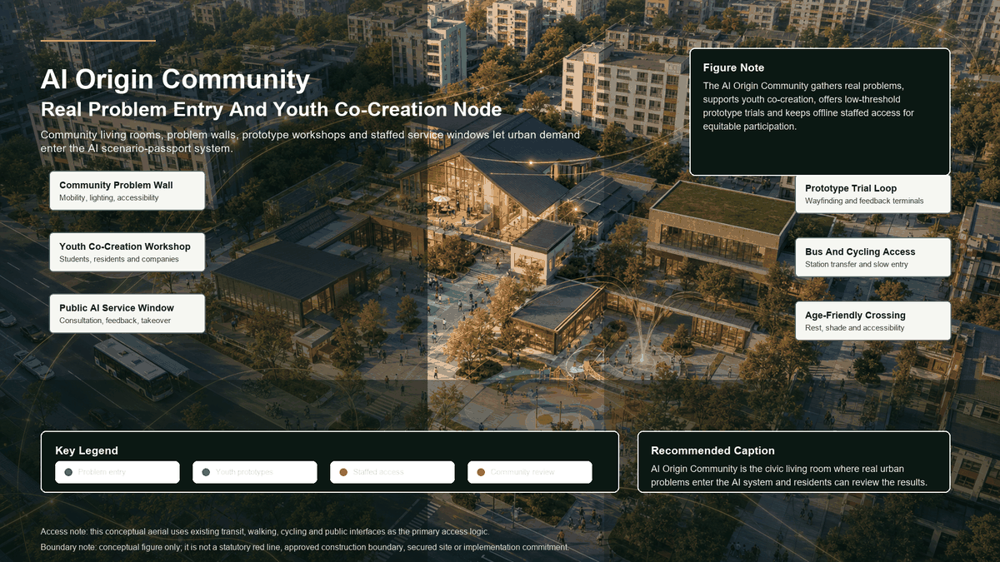
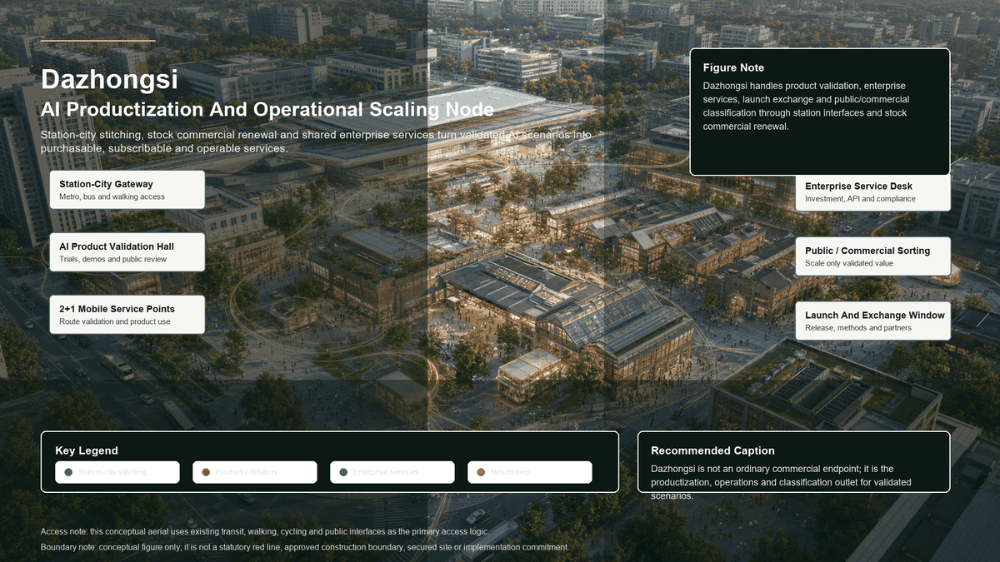
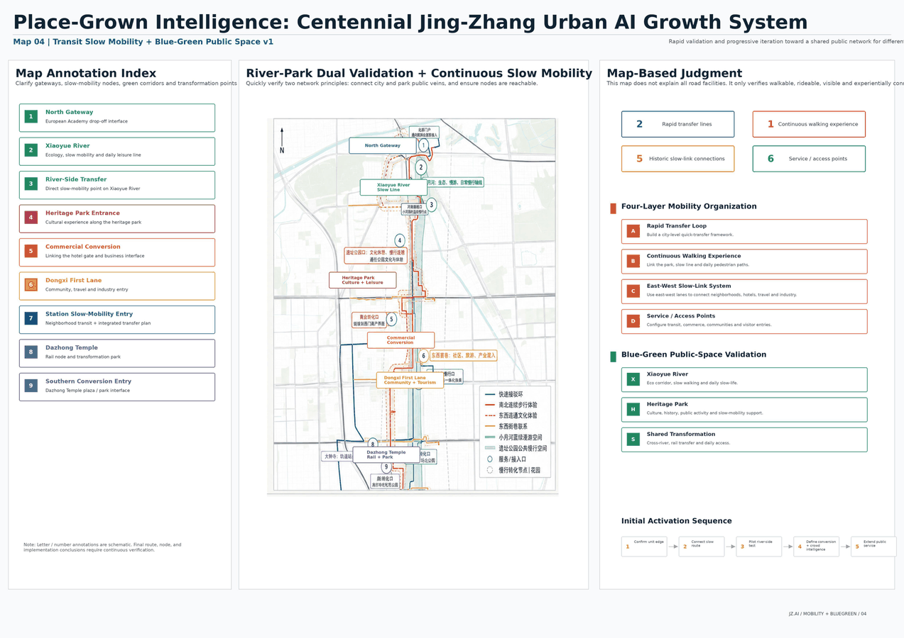
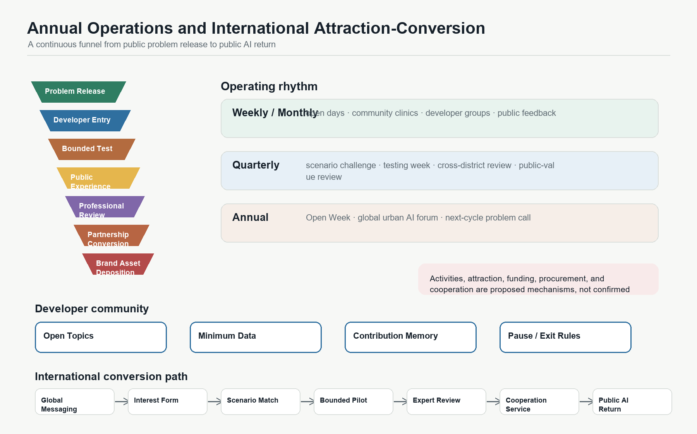
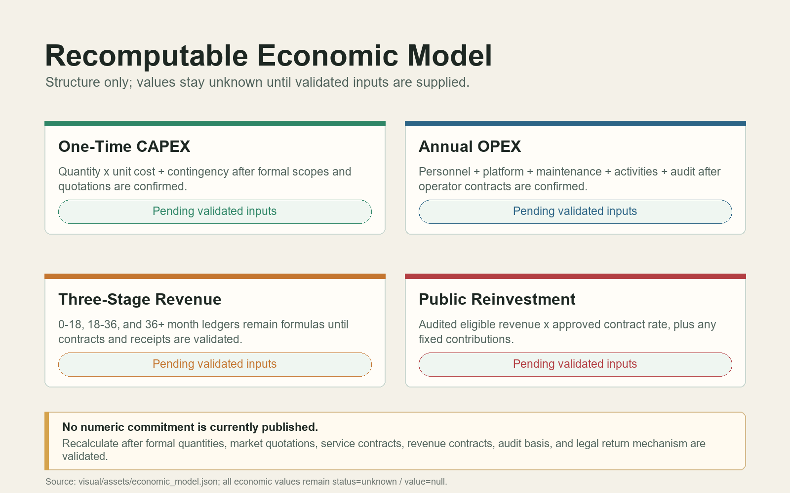

# Place-Grown Intelligence: Centennial Jing-Zhang Urban AI Growth System

## Design Basis and Source List

This proposal uses the official announcement, the agent taskbook, the site package, the source registry, and the processed fact pack as its evidence base [source:OFFICIAL-ANNOUNCEMENT] [source:AGENT-TASKBOOK] [source:SOURCE-REGISTRY]. The current boundary is the provisional boundary supplied through the official repository. It supports generation, review, and discussion, but is not an official redline, approval basis, or precise-area basis [data:geometry/site_boundary.geojson#SITE-001].

The core position is simple: grow AI intelligence from local urban problems, so the city becomes intelligent because it is grounded in place. This is not a one-time technology exhibition corridor. It is a traceable, reviewable, human-takeover-ready, and sustainable urban AI growth system that connects community problems, Haidian innovation capacity, public-space validation, and industrial conversion.

## Three-Level Scope Framework

The three scope levels carry different responsibilities. The coordinated research area studies the AI industrial ecosystem, future urban form, talent attraction, and international activities. The overall design area translates the corridor around the Jing-Zhang Railway Heritage Park into urban renewal, mobility, municipal support, public space, and character strategies. The detailed key areas test whether Zhongzhi Park, the AI Origin Community, and Dazhongsi can reach detailed design depth [standard:PROJECT-OFFICIAL-ANNOUNCEMENT] [depth:three_level_scope_framework].

The design is organized as one urban AI growth chain: origin intake, Zhongzhi development, river-park validation, and Dazhongsi conversion. Residents, young people, visitors, enterprises, and operators raise real problems through staffed desks, co-creation tables, and public terminals. Research teams and enterprises turn those problems into prototypes and pass rights, data, safety, human-takeover, and exit-condition review. Xiaoyue River and the heritage park provide parallel real-world environments. Validated projects then enter either public continuation or commercial scaling.

## Brand Identity and International Communication System

The proposal includes a complete concept-stage brand identity specification for the open-call submission, covering formal logo lockups, monochrome and reversed versions, clear space, minimum sizes, typography, colour rules, prohibited uses, brand hierarchy, and representative applications. It communicates the proposal's identity and wayfinding logic; it does not imply trademark registration, government adoption, or approval for on-site implementation [source:AGENT-TASKBOOK].

The main Chinese name is `因地而智`, with the descriptor `百年京张城市 AI 生长系统`. The main English name is `Place-Grown Intelligence`, with the descriptor `Centennial Jing-Zhang Urban AI Growth System`. The short title may be `Jing-Zhang AI Growth Belt`. The mark condenses the continuous Jing-Zhang Railway line, the river-park curve, and three AI responsibility nodes into a compact open growth loop, expressing problem gathering, collaborative research and development, public validation, conversion, and public return. It must not be reduced to a map, a metro-line graphic, a closed badge, a robot head, a chip, a brain, or generic AI sparkle imagery.

The source specification is recorded in `visual/assets/brand_identity_spec.json`. It defines the standalone mark, Chinese lockup, English lockup, bilingual lockup, black monochrome version, reversed version, and 32/64/512 px icons. Clear space uses the primary node diameter as `X`, with at least `1X` around the logo. The standalone mark should not be smaller than 24 px on screen; the Chinese lockup should not be smaller than 160 px; the bilingual lockup should not be smaller than 220 px. The palette uses Jing-Zhang ink, river-park growth green, collaborative technology blue, railway copper, risk red, and warm white. Risk red is reserved for stop, human takeover, complaint, and safety boundaries.

The hierarchy has four levels: master brand, three nodes, scenarios/services, and annual activities. The master brand identifies the full belt. The three nodes correspond to Zhongzhi Park AI Acceleration Area, Beijing AI Origin Community, and Dazhongsi AI Industry Cluster. Scenario and service brands include the Urban Problem Desk, Trusted Agent Governance Sandbox, and AI Product Launch and Public-Value Hall. Annual activity brands support open weeks, developer challenges, and public AI review days. The cultural wayfinding system, event brands, and the belt's master logo are managed separately and should not be merged into one symbol system.

For international communication, the English name emphasizes `place-grown`, reducing the risk that the proposal is read as a purely technical park or surveillance-oriented city. External messaging should explain human takeover, data minimization, public feedback, and reversible pilots so international developers, urban researchers, and public audiences understand the governance boundary. All communication must distinguish submitted, reviewed, selected, and implemented status.

## Coordinated Research Area: Industry and Future City Research

The coordinated research area is not another closed industrial park boundary. It is an innovation chain that connects university sources, open collaboration, enterprise conversion, public experience, and international communication. The AI Origin Community receives problems; Zhongzhi Park makes technology reliable; Xiaoyue River and the Jing-Zhang Railway Heritage Park validate services in real scenes; Dazhongsi classifies public and commercial conversion; and a compliant public AI return mechanism supports the next round of public-service renewal.

The future-city idea is not to fill nine kilometers with AI devices. It layers five functional systems onto the existing city: a continuous public framework, a river-park public validation belt, short loops around communities, campuses, and industry, three AI focus areas, and the Zhongguancun technology service network. These systems translate AI capacity into space, service, responsibility, and operating rules [depth:overall_spatial_structure].

## Regional Synergy and Beijing Innovation Network

Regional synergy is not about drawing another closed boundary. It is about interfaces for problems, capabilities, scenarios, evaluation, and conversion. The Centennial Jing-Zhang AI Innovation Belt acts as an organizer of real urban problems, a provider of public validation scenes, and a distributor of conversion services. Beiwei Community, Future Science City, Huairou Science City, Beijing Economic-Technological Development Area, and the Beijing-Tianjin-Hebei innovation network are treated as concept-level collaboration counterparts that may provide community problems, research capacity, frontier science, manufacturing and industrialization support, and cross-region replication interfaces. The following mechanisms are concept recommendations and require responsible entities, policy conditions, cooperation agreements, and professional review before implementation [source:AGENT-TASKBOOK].

| Counterpart | Synergy Role | Input | Project Interface | Output | Boundary |
|---|---|---|---|---|---|
| Beiwei Community | Community problem intake and youth co-creation | Daily service pain points, community feedback, public issues | AI Origin Community, staffed desk, co-creation table, community review room | Verifiable problem list, participation record, low-barrier prototypes | No claim of authorization; no excessive personal-data collection |
| Future Science City | Applied research, talent, and industrial collaboration | Research teams, industrial needs, technology validation topics | Zhongzhi testing yard, trusted-agent governance sandbox, public testing corridor | Prototype validation topics, testing-standard suggestions, talent exchange themes | No claim of signed cooperation or committed project intake |
| Huairou Science City | Frontier science and large-science-facility spillover | Basic research directions, scientific-computing questions, interdisciplinary topics | Public problem library, expert review pool, model and data governance topics | Urban-application directions, public science communication content | No invented research outcome, data license, or institution commitment |
| Beijing E-Town | Robotics, intelligent manufacturing, and industrialization | Product prototyping, manufacturing supply chain, scenario equipment | Dazhongsi product validation hall, enterprise service desk, smart-terminal testing street | Post-test conversion path, manufacturing adaptation checklist, service procurement suggestions | No commitment on investment attraction, purchase orders, or funding |
| Beijing-Tianjin-Hebei | Cross-region replication and open-scenario network | Multi-city public problems, mobility and industrial collaboration needs | Scenario passport, evaluation toolkit, public AI case library | Replicable toolkit, cross-city pilot topics, annual review outputs | No claim of confirmed regional policy or cross-jurisdiction approval |

The mechanism contains five auditable interfaces. First, a public problem library records source, applicable scene, privacy boundary, and responsible party for each cross-regional topic. Second, a scenario passport explains where a prototype operates, what data it collects, who is on duty, and how it pauses or exits. Third, expert and public evaluation run together, so technical performance cannot replace public value, accessibility, complaint handling, and human takeover. Fourth, a conversion service desk classifies validated projects into public continuation, commercial scaling, further modification, or pause-and-exit. Fifth, the annual review records failures, corrections, reusable tools, and transfer conditions as next-cycle open assets, not just publicity outputs.

## Overall Design Area: Urban Renewal and Regulatory-Plan-Level Urban Design

The overall design area follows a low-disturbance renewal strategy. Reuse existing stations, roads, open spaces, and adaptable buildings first. Start with markings, wayfinding, movable facilities, active ground floors, and small public-space repairs. Scenario equipment must be replaceable and removable, and failed pilots must return the place to normal public use. Land use, buildings, roads, green space, public space, and phasing are expressed as GeoJSON so metrics can be recalculated [data:geometry/land_use.geojson#LU-001] [data:geometry/buildings.geojson#BLDG-001] [metric:building_footprint_area_sqm].

The first condition for transport and municipal support is not screens or algorithms, but real access, maintenance, and human takeover. The proposal uses two north-south systems: fast connection and continuous walking experience. AI infrastructure is split into four layers: physical connection, digital platform, trusted governance, and continuous operations. Road redlines, tunnels, pipelines, building height, FAR, and investment approvals remain concept recommendations until official planning and engineering information is available.

## Detailed Design of Key Areas

The three key areas are not isolated districts. They are three responsibility nodes in the same urban AI growth chain [data:geometry/key_areas.geojson#PROV-KEY-001] [data:geometry/key_areas.geojson#PROV-KEY-002] [data:geometry/key_areas.geojson#PROV-KEY-003] [depth:three_key_area_detailed_design].

Zhongzhi Park AI Acceleration Area is responsible for technical reliability and governance admission. Its sequence includes research rooms, controlled testing courtyards, public observation corridors, governance review rooms, and maintenance back-of-house. First actions include a shared governance sandbox, embodied-device and terminal testing yards, and a public testing corridor.

Beijing AI Origin Community is responsible for real-problem intake and youth co-creation. Its sequence includes street entries, staffed desks, co-creation tables, prototype workshops, community review rooms, and daily-life pilots. Participation must not require payment, expert vocabulary, or excessive personal data. Offline staffed access remains necessary.

Dazhongsi AI Industry Cluster is responsible for productization, commercial classification, and international exchange. Its sequence includes a metro gateway, four-quadrant walking repair, movable service points, active ground-floor validation halls, shared enterprise services, international exchange, and operations back-of-house. The main site remains a conditional candidate, not a claim of space, approval, investment, or enterprise commitment.

The following labeled effect images explain spatial character and use scenarios only. They do not replace boundaries, metrics, statutory planning, approvals, construction quantities, or investment commitments.

## AI Innovation Ecosystem, Personas, and AI+ Scenarios

The global case benchmark uses the eight AI innovation district cases supplemented by the user as reference material. It extracts transferable mechanisms only; overseas cases are not used as proof that Haidian already has the same institutional, funding, or land conditions [source:GLOBAL-AI-DISTRICT-CASES].

| Case | Core Mechanism | Spatial Carrier | Transferable Practice for Jing-Zhang | Non-Transferable Boundary |
|---|---|---|---|---|
| London Knowledge Quarter + King's Cross | Railway-station renewal, knowledge-institution alliance, public cultural events | Railway heritage, walkable district, universities and cultural facilities | Use the Jing-Zhang Heritage Park as a knowledge-exchange spine and build an open alliance of universities, enterprises, research bodies, culture, and communities | Mature international-institution density and high-rent commercial renewal cannot be copied directly |
| Toronto MaRS + Vector Institute | AI institute, university, hospitals, incubator, and capital loop | Downtown innovation complex and conversion platform | Build an enterprise-question, university-research, scenario-validation, capital-follow-up, and procurement chain | Medical data, capital-market, and institutional cooperation conditions need local compliance review |
| Singapore one-north + Kampong AI | Long-term public-platform operation, startup community, work-live integration | Adaptive reuse, startup space, talent housing, activity space | Use the AI Origin Community for young talent, startup service, shared living, and 24-hour collaboration | Centralized public development and housing provision cannot be assumed |
| Pittsburgh Robotics Row + Hazelwood Green | University prototypes, industrial heritage, pilot testing, public-sector scenarios | Waterfront brownfield, robotics testing space, industrial reuse | Build an embodied-intelligence open testing corridor with observable and pausable urban testing | Autonomous and robotic testing require safety responsibility, insurance, and public notice |
| Montreal Mila + Mile-Ex | Cross-university research platform, technology transfer, responsible AI | AI research institute, startup community, public lecture space | Build a shared cross-university AI platform, ethics and safety lab, and technology-transfer front desk | Avoid relying on star scientists or a single institution's endorsement |
| Cambridge Kendall Square | University, corporate R&D, venture capital, and professional services in high density | Dense district, transit gateway, active ground floors | Open campus-enterprise-city interfaces and provide innovation lobbies, shared meetings, and everyday exchange space | High-end clustering may raise rents and living costs |
| Paris-Saclay + DataIA | Distributed science city, unified platform, national AI cluster | Multi-node science city, shared research facilities, technology transfer | Support Haidian's three areas and two wings as a complementary innovation network | Distributed systems need strong public space and frequent activities to avoid weak collaboration |
| Pangyo Techno Valley | Public development, ICT/AI cluster, phased implementation, enterprise service platform | Industrial carriers, R&D facilities, conference/training space, smart-city scenes | Build unified enterprise service, policy matching, international cooperation, and phased evaluation platforms | Policy support, attraction results, procurement, and funding cannot be stated as commitments |

The most useful lesson for Haidian is not to copy one global model, but to combine four mechanisms: London for railway heritage and knowledge alliance, Toronto for research conversion and capital interfaces, Singapore for young-talent community and long-term operation, and Pittsburgh for robotics and embodied-intelligence testing. Mila, Kendall Square, Paris-Saclay, and Pangyo then supplement cross-university research, district-level exchange, three-area/two-wing coordination, and phased enterprise services.

Twelve scenarios turn AI from a concept into verifiable urban services. Public intake and co-creation include SC-01 Urban Problem Desk and SC-02 Youth One-Day Prototype Workshop. Public-space and daily-service scenarios include SC-03 Accessible Walking Detour, SC-04 Xiaoyue River Ecological Co-Management, and SC-06 Night Safety and Human Assistance. Culture and content include SC-05 Jing-Zhang Memory Co-Creation Station and SC-11 AI Content and Copyright Lab. Industry testing includes SC-07 Embodied Device Shared-Route Testing Yard, SC-08 Trusted Agent Governance Sandbox, SC-09 Smart Terminal Public Testing Street, and SC-10 Enterprise Agent Deployment Desk. Long-term operation is SC-12 Public AI Operations and Feedback Room [metric:ai_scenario_count].

Every scenario must answer who uses it, what data it collects, who is responsible, how it stops, how humans take over, and how the place recovers after failure. The four validation dimensions are public value, community acceptance, technical effect, and operational feasibility.

## Land Use, Building Scale, and Retain-Renovate-Demolish Strategy

Land use expresses five overlapping functional systems, not statutory parcel approval. The building strategy retains and lightly upgrades useful existing assets first, opens ground-floor public interfaces first, and tests services with movable facilities before heavier engineering decisions. FAR and other statutory intensity controls remain unknown where official control-plan data are unavailable.

## Transport, Rail, Municipal Infrastructure, and Public Services

The mobility system is built around real access: rail connection, continuous walking, accessible detours, low-speed device testing, night assistance, and event-day traffic organization. Municipal and digital systems support maintenance and takeover: fiber and wireless links, power supply, edge nodes, mounting points, operational sensing, service passages, scenario passports, identity permissions, data catalogs, model versions, logs, and emergency stop rules.

## Blue-Green Network, Public Space, and Urban Character

Xiaoyue River and the Jing-Zhang Railway Heritage Park form parallel real-world validation environments. Xiaoyue River focuses on ecological, health, everyday-life, accessibility, and public-service AI. The heritage park focuses on culture, social interaction, youth activities, city display, and public participation. Green ratio and public-space ratio are recalculated from submitted geometry and must be recalculated when official boundaries are available [metric:green_ratio] [metric:public_space_ratio].

Urban character extends the engineering spirit of the centennial railway into a trustworthy AI city image. Three functional landmarks are proposed: a public testing corridor, an urban problem wall with prototype tables, and an AI product launch and public-value hall.

## Renewal Projects, Implementation Policy, and Phasing

Renewal projects follow a low-disturbance, node-by-node validation path rather than a one-time buildout across the full corridor. The first package prioritizes four reversible project types: walking continuity and wayfinding repairs, staffed community intake and co-creation desks, controlled testing yards at Zhongzhi Park, and movable service points plus active ground-floor validation halls at Dazhongsi. Each project type must keep stop conditions, human takeover, post-failure recovery, and responsible-party records [data:geometry/phasing.geojson#PHASE-001] [depth:implementation_phasing]. At this stage, formal quantities, valid Beijing market quotations, procurement scope, staffing plan, platform service contracts, revenue contracts, audited eligible revenue basis, and a lawful public-reinvestment mechanism are unavailable. Therefore, the precise ranges previously displayed for one-time CAPEX, annual OPEX, three-stage revenue, and public reinvestment have been withdrawn. This draft retains only a recomputable parameter model: CAPEX is calculated as quantity times unit cost plus contingency, OPEX is calculated from personnel, platform, maintenance, activity, and audit contracts, revenue is calculated through three stages and five categories, and public reinvestment is calculated from audited eligible revenue and contract rules. Until all required inputs are confirmed, related metrics remain unknown with value=null and do not constitute budgets, financing, leasing, procurement, revenue, or public-reinvestment commitments [data:visual/assets/economic_model.json] [source:ECONOMIC-WORKING-BASIS].

## Annual Operations and International Attraction-Conversion System

Annual operation is not a festival list. It is a continuous funnel: public problem release -> developer participation -> bounded validation -> public experience -> professional evaluation -> enterprise or partnership conversion -> method and brand-asset deposition. It combines the agent.6 requirements for global activities, activity brand, developer community, scenario opening, landmark operation, international communication, and attraction-conversion into one operating mechanism. All activities and partnerships are recommended organization methods only, not confirmed schedules, budgets, organizers, government commitments, or enterprise settlements.

| Cycle | Activity and Community Action | Spatial Carrier | Main Participants | Output | Audit Boundary |
|---|---|---|---|---|---|
| Weekly / Monthly | Urban problem open day, community AI clinic, developer groups, public feedback hours | AI Origin Community, staffed desk, co-creation table, public terminal | Residents, students, developers, operators | Problem cards, scenario pre-screening, complaint and correction records | No default identity collection; comments are not treated as statistical public opinion |
| Quarterly | Jing-Zhang AI Scenario Challenge, testing week, cross-district review, public-value review | Zhongzhi testing yard, public testing corridor, Xiaoyue River validation belt | Developers, enterprises, experts, community representatives | Prototype test report, risk list, continue-or-pause suggestion | Testing is not full deployment; review is not approval |
| Annual | Place-Grown Intelligence Open Week, global urban AI forum, result release, next-cycle problem call | Jing-Zhang Heritage Park, Dazhongsi product validation hall, international exchange window | Domestic and international teams, urban researchers, investment and service institutions, public audiences | Method toolkit, annual case library, conversion candidate list | No commitment on attraction results, investment amount, or policy treatment |

The developer community uses open topics, controlled resources, contribution memory, and exit rules. Developers select topics from the public problem library and submit data needs, model capability, risk boundary, and human-takeover plan. The operator opens only minimum necessary data, testing time slots, and spatial interfaces. Each contribution records author, method, version, license, and reuse terms. Over-collection, unexplainable risk, lack of human takeover, public disturbance, or unclear copyright triggers pause or exit. The goal is not just participation volume, but better problem quality, prototype reliability, public acceptance, and reusable assets.

Scenario opening is graded. Level 1 is observation and display, where the public can understand and comment. Level 2 is a bounded sandbox with clear space, time, data, and staffed oversight. Level 3 is public experience, requiring low risk, complaint access, opt-out, and recovery. Level 4 is conversion evaluation through Dazhongsi enterprise services, procurement consultation, copyright lab, training, activity cooperation, or international exchange. Every scenario keeps stop conditions, responsible owner, maintenance-cost basis, and public-space recovery method.

The international attraction-conversion path has six steps: international communication release, online interest registration, scenario matching, bounded pilot, third-party or expert evaluation, and cooperation service with public AI return. Public-service outcomes enter public continuation review. Commercializable outcomes enter product validation, subscription or licensing, procurement consultation, training, activity cooperation, or enterprise service channels. Qualified incremental benefits created by this project's public spaces, shared facilities, public brand, scenario opening, and governance evaluation should conceptually return to a public AI renewal account or equivalent mechanism through contracts, audit, and trusteeship. Specific percentages, entities, and legal vehicles must be confirmed during implementation.

Implementation follows low-disturbance testing, professional deepening, and graded expansion. Early actions focus on wayfinding, active ground floors, movable facilities, problem intake, governance sandboxes, and small public-service pilots. Mid-term work expands industrial and public scenarios around the three key areas. Long-term operation uses audit, public feedback, and professional assessment to retain, expand, pause, or retire services. All policy, funding, and event proposals are concept recommendations.

## Metrics, Area Recalculation, and Compliance Matrix

The submission must prove that drawings, metrics, sources, assumptions, bilingual files, copyright statements, and self-check results align. Recalculated spatial metrics include site area, green ratio, public-space ratio, building footprint area, and key-area count [metric:site_area_sqm] [metric:key_area_count]. Financial metrics no longer publish any range or point value; one-time CAPEX, annual OPEX, three-stage commercial AI revenue, and public AI reinvestment are registered by `visual/assets/economic_model.json` and its recalculation report as unknown with value=null [metric:one_time_capex_range_cny] [metric:annual_opex_range_cny]. Three-stage revenue retains only formulas and missing-input lists until contracts, audit, and eligible-revenue rules are available [metric:commercial_ai_revenue_stage_1_cny] [metric:commercial_ai_revenue_stage_2_cny] [metric:commercial_ai_revenue_stage_3_cny]. Public AI reinvestment also remains unknown with value=null and declares no fixed amount or percentage [metric:steady_public_ai_reflow_range_cny].

## Risk, Copyright, and Compliance

Current missing data include official redline, official key-area polygons, road redlines, regulatory indicators, building height, ownership, heritage controls, municipal pipelines, traffic sections, site flow counts, and real community research. Related conclusions are marked as provisional, hypothesis, unknown, or concept recommendation, with recalculation triggers after official data are supplied. Copyright, toolchain, and community display permissions are recorded in `report/copyright_statement.md`.

## References

References are recorded in `sources.json`, including the official announcement, agent taskbook, site package, source registry, processed fact pack, provisional boundaries, and submitted structured geometry and metrics.
