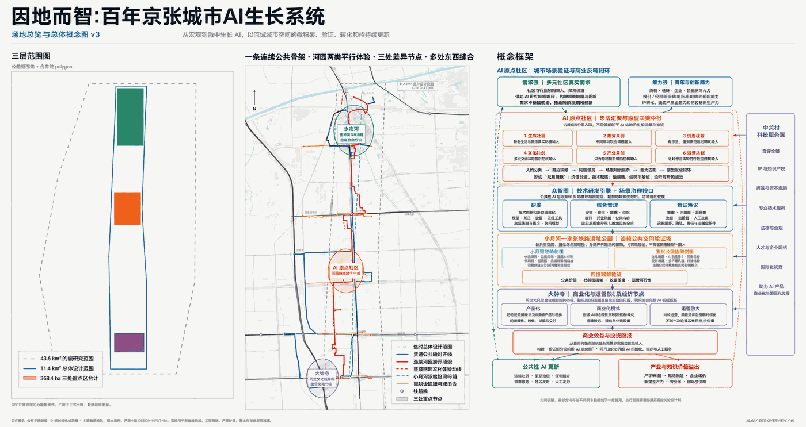
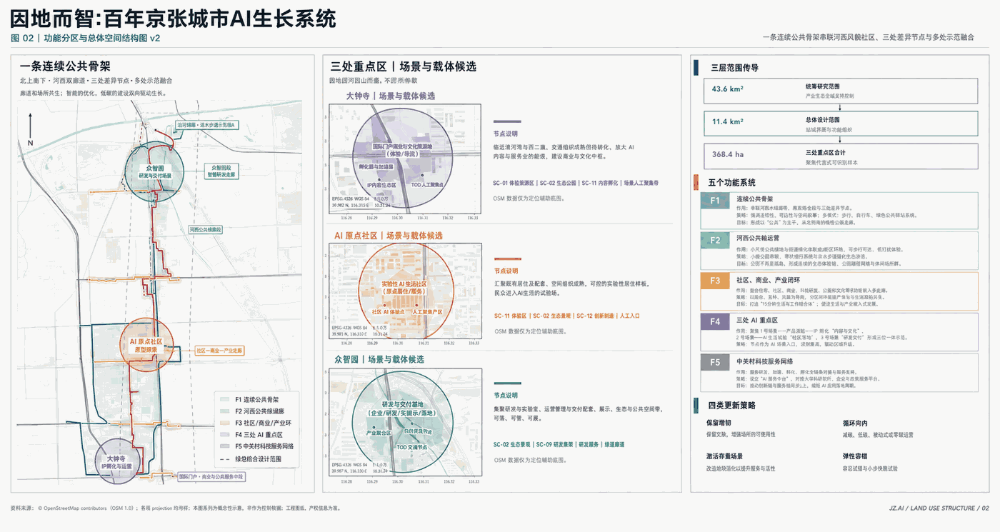
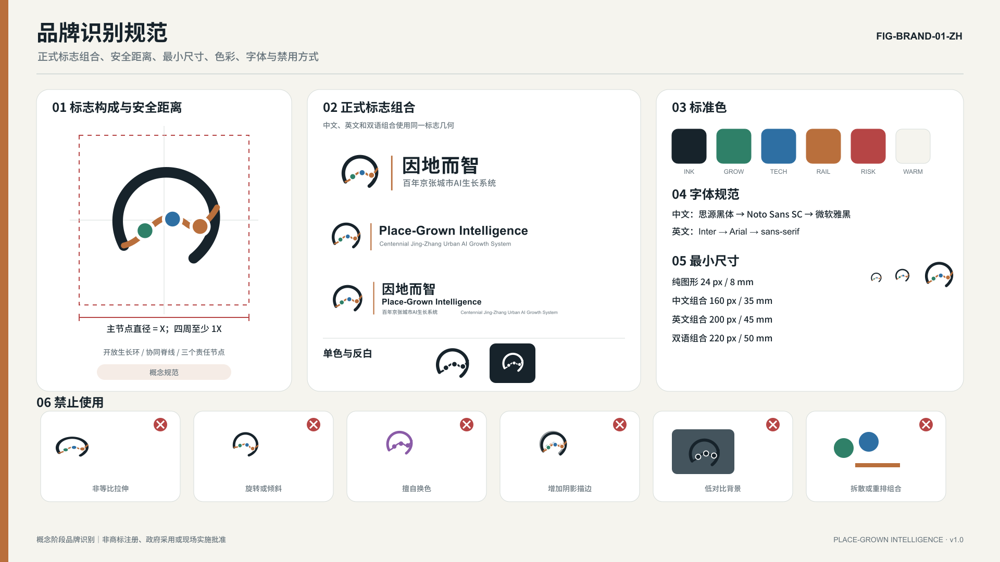
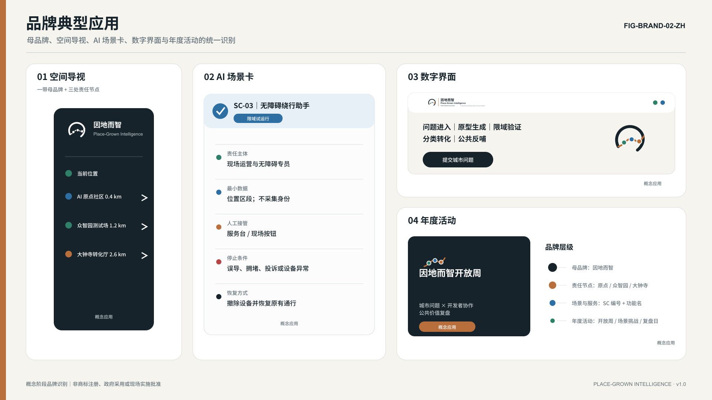
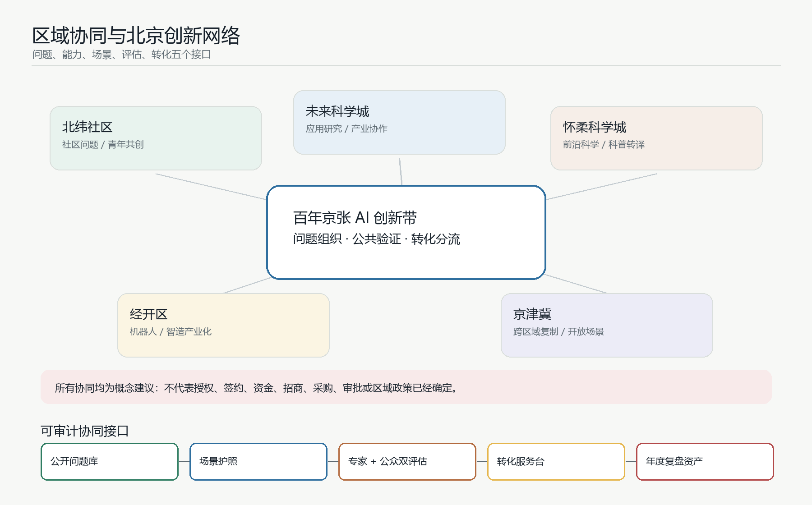
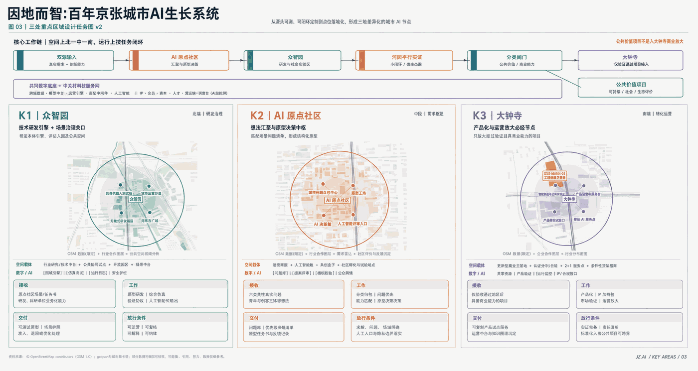
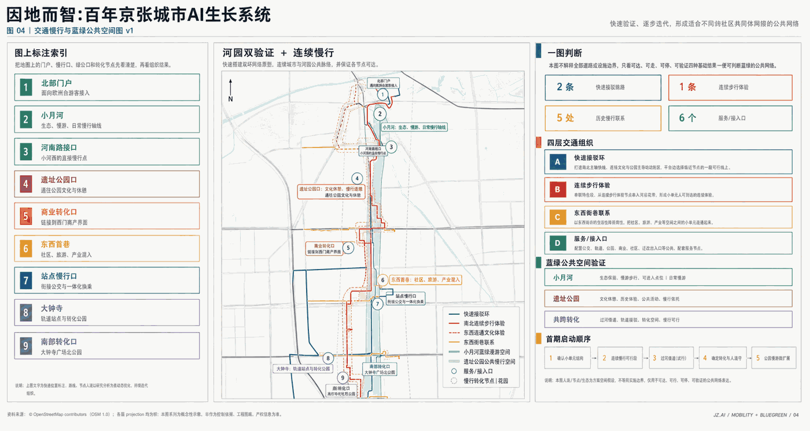
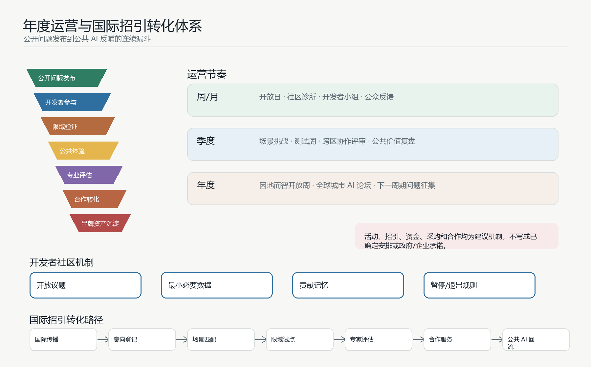

# 因地而智：百年京张城市AI生长系统

## 设计依据与资料清单

本方案以官方公告、智能体任务书、站点资料包、来源登记表和处理后的事实包为依据，形成一个可以被人阅读、也可以被机器复核的正式提交包 [source:OFFICIAL-ANNOUNCEMENT] [source:AGENT-TASKBOOK] [source:SOURCE-REGISTRY]。

当前边界采用官方仓库提供的 provisional boundary，只用于方案生成、自检和讨论，不作为 official redline、审批依据或精确面积依据 [data:geometry/site_boundary.geojson#SITE-001]。

方案的核心判断是：从在地问题中，长出 AI 智能，让城市因地而智。它不把百年京张理解为一次性技术展示走廊，而是把沿线真实社区问题、海淀创新能力、公共空间验证和产业转化组织成一套可追溯、可复核、可接管、可持续的城市 AI 生长系统。完整资料索引见 `sources.json`，指标见 `metrics.json`，任务响应见 `compliance_matrix.json`，标准和深度响应见 `standard_matrix.json` 与 `design_depth_matrix.json`。

## 三层范围工作框架

三层范围分别承担不同责任。统筹研究范围回答 AI 产业生态、未来城市形态、人才和国际活动如何组织；总体设计范围回答京张遗址公园周边 1-2 公里的城市更新、交通、市政、风貌和公共空间如何落图；重点区域范围回答众智园、AI 原点社区、大钟寺三个节点如何达到详细设计深度 [standard:PROJECT-OFFICIAL-ANNOUNCEMENT] [depth:three_level_scope_framework]。

本方案把三层工作压缩成一条城市 AI 生长链：原点汇需、众智研发、河园实证、钟寺转化。居民、青年、穿行者、文化参与者、企业和运营者通过人工窗口、共创桌和公共终端提出真实问题；高校、科研团队、开发者和企业把问题转成原型，并接受权限、数据、安全、人工接管和退出条件审查；小月河与京张铁路遗址公园提供生态、日常、文化、交往和公共服务的平行验证环境；通过验证的项目进入公共持续或商业放大两条路径。

## 品牌识别与国际传播系统

本方案已形成面向征集阶段的完整品牌识别规范，包括正式标志组合、单色与反白版本、安全距离、最小尺寸、字体与色彩规则、禁用方式、品牌层级及典型应用。该识别系统用于说明方案的传播与空间导视逻辑，属于概念阶段设计成果，不代表商标已经注册、政府已经采用或现场应用已经获批 [source:AGENT-TASKBOOK]。

品牌主名称为“因地而智”，说明名为“百年京张城市 AI 生长系统”，英文主名称为 `Place-Grown Intelligence`，英文说明名为 `Centennial Jing-Zhang Urban AI Growth System`。可用于短标题的名称为“京张 AI 生长带 / Jing-Zhang AI Growth Belt”。标志从京张铁路连续线、河园曲线和三个 AI 责任节点提炼为一个紧凑的开放生长回路，表达“需求汇集、协同研发、公共实证、转化反哺”的连续关系。标志不能画成地图或普通地铁线路图，也不使用封闭徽章、机器人头像、芯片、大脑或泛化 AI 星芒。

VI 规范以 `visual/assets/brand_identity_spec.json` 为结构化源文件说明，明确图形标志、中文组合、英文组合、双语组合、黑色单色版、反白版和 32/64/512 px 图标的使用方式。安全距离以主节点直径 `X` 为基准，四周至少保留 `1X`；纯图形屏幕不小于 24 px，中文组合屏幕不小于 160 px，双语组合屏幕不小于 220 px。标准色包括京张墨黑、河园生长绿、协同科技蓝、铁路铜棕、风险提示红和暖白；风险提示红只用于停止、人工接管、投诉和安全边界。

品牌层级分为母品牌、三处节点、场景/服务和年度活动四级。母品牌负责一带整体识别；三处节点分别对应众智园 AI 自主创新加速区、北京 AI 原点社区和大钟寺 AI 产业集聚区；场景/服务承接城市问题采集台、可信智能体治理沙盒、AI 产品首发与公共价值厅等具体功能；年度活动承接开放周、开发者挑战和公共 AI 复盘等运营动作。文化导视系统、活动品牌和一带整体 Logo 分开管理，不把三者混成同一套符号。

国际传播中，英文名称强调 `place-grown`，避免被理解为纯技术园区或监控型城市。传播文本优先解释 human takeover、data minimization、public feedback 和 reversible pilots，使海外开发者、城市研究者和公众能理解方案的治理边界。所有对外传播均区分 submitted、reviewed、selected、implemented 四种状态，不把概念方案写成已获批准或已经建成。

## 统筹研究范围产业与未来城市研究

统筹研究不是另画一条封闭产业园边界，而是建立“高校策源、开源协作、企业转化、公共体验、国际传播”的创新链。AI 原点社区负责让问题进入，众智园负责让技术可靠，小月河与京张铁路遗址公园负责真实场景验证，大钟寺负责产品化与公共/商业分类，最终通过合规的公共 AI 反哺机制支持下一轮公共服务更新。

未来城市形态的重点不是铺满 9 公里的 AI 装置，而是在既有城市底盘上叠合五类功能系统：连续公共骨架、河园公共验证带、社区/高校/产业短环、三处 AI 重点区、中关村科技服务网络。这些系统把 AI 从抽象能力转译为空间、服务、责任和运营规则 [depth:overall_spatial_structure]。

## 区域协同与北京创新网络

区域协同不以新增封闭边界为目标，而以“问题、能力、场景、评估、转化”的接口为目标。百年京张 AI 创新带承担城市真实问题的组织者、公共验证场的提供者和转化服务的分流者；北纬社区、未来科学城、怀柔科学城、经开区及京津冀创新网络作为概念协同对象，分别提供社区问题、科研能力、前沿科学、制造与产业化、跨区域复制等外部接口。以下机制均为概念建议，需由后续责任主体、政策条件、合作协议和专业团队确认后才能实施 [source:AGENT-TASKBOOK]。

| 协同对象 | 协同角色 | 输入 | 本项目承接界面 | 输出 | 边界 |
|---|---|---|---|---|---|
| 北纬社区 | 社区真实问题与青年共创入口 | 日常服务痛点、社区反馈、公共议题 | AI 原点社区、人工服务台、共创桌、社区评议厅 | 可验证问题清单、公共参与记录、低门槛场景原型 | 不代表已取得社区授权，不采集过量个人数据 |
| 未来科学城 | 应用研究、人才与产业协作接口 | 科研团队、产业需求、技术验证议题 | 众智园测试庭院、可信智能体治理沙盒、公开测试廊 | 原型验证议题、测试标准建议、人才交流主题 | 不写成已签合作或已确定导入项目 |
| 怀柔科学城 | 前沿科学与大科学装置外溢接口 | 基础研究方向、科学计算问题、交叉学科议题 | 公开问题库、专家评审池、模型与数据治理议题 | 可转译的城市应用方向、科普与公共理解内容 | 不虚构技术成果、数据授权或科研机构承诺 |
| 经开区 | 机器人、智能制造和产业化接口 | 产品试制、制造供应链、场景设备 | 大钟寺产品验证厅、企业服务台、智能终端测试街 | 测试后转化路径、制造适配清单、服务采购建议 | 不承诺招商落地、采购订单或资金安排 |
| 京津冀 | 跨区域复制与开放场景网络 | 多城市公共问题、交通与产业协同需求 | 场景护照、评估方法包、公共 AI 案例库 | 可复制工具包、跨城试点议题、年度复盘成果 | 不代表区域政策确定或跨域审批完成 |

协同机制由五个可审计接口组成。第一，建立公开问题库，所有跨区议题先记录问题来源、适用场景、隐私边界和责任主体。第二，建立场景护照，说明一个原型在哪个空间、采集什么数据、由谁值守、如何暂停和退出。第三，建立专家与公众双评估，技术性能不能替代公共价值、无障碍、投诉和人工接管。第四，建立转化服务台，把通过验证的项目分为公共持续、商业放大、继续修改和暂停退出四类。第五，建立年度复盘，把失败、纠错、复用工具和可迁移条件沉淀为下一周期开放资产，而不是只发布宣传成果。

## 总体设计范围城市更新与控规深度城市设计

总体设计范围采用低扰动城市更新策略。先复用现有站点、道路、开放空间和存量建筑；先做标线、导视、可移动设施、开放首层和小尺度空间修补；场景设备必须可替换、可撤除，失败后恢复公共空间。用地、建筑、道路、绿地、公共空间和分期均以 GeoJSON 表达，支持指标复算 [data:geometry/land_use.geojson#LU-001] [data:geometry/buildings.geojson#BLDG-001] [metric:building_footprint_area_sqm]。

交通和市政支撑的第一条件不是屏幕和算法，而是可到达、可维护、可接管。方案提出南北快速联系和南北连续步行体验两套贯通关系，并把 AI 基础设施拆成四层：物理连接、数字平台、可信治理、持续运营。涉及道路红线、桥隧、管线、建筑高度、容积率和投资审批的内容，均作为概念建议，待正式控规和工程资料确认。

## 重点区域详细设计

三处重点区不是三个孤立片区，而是同一条城市 AI 生长链的三个责任节点 [data:geometry/key_areas.geojson#PROV-KEY-001] [data:geometry/key_areas.geojson#PROV-KEY-002] [data:geometry/key_areas.geojson#PROV-KEY-003]。

其详细设计深度由 `design_depth_matrix.json` 中的重点区域条目复核 [depth:three_key_area_detailed_design]。

众智园 AI 自主创新加速区承担技术可靠性与治理准入。空间序列为研发室、受控测试庭院、开放观察廊、治理评审室和维护后台。首期动作包括共享治理沙盒、具身/终端测试庭院、公开测试廊。公众可以观察和理解测试，但不能误入高风险区域；成熟技术也不能绕过治理审查。

北京 AI 原点社区承担真实问题入口与青年共创。空间序列为街道入口、人工服务台、共创桌、原型工坊、社区评议厅和日常生活试点。参与不以付费、专业术语或交出过量个人数据为前提，必须保留线下人工入口。

大钟寺 AI 产业聚集区承担产品化、商业分类与国际交流。空间序列为地铁门户、四象限步行缝合、可移动服务点、开放首层验证厅、企业共享服务、国际交流和运营后台。主场地仍为条件性候选，不代表取得空间、审批、招商或企业承诺。

## AI 创新生态、人才画像与 AI+ 场景

全球案例对标采用用户补充的 8 个 AI 创新城区案例作为参考素材，并只提取可迁移机制，不把海外案例当作海淀已具备同等制度、资金或土地条件的证明 [source:GLOBAL-AI-DISTRICT-CASES]。

| 案例 | 关键机制 | 空间载体 | 可迁移到百年京张的做法 | 不能直接照搬 |
|---|---|---|---|---|
| 伦敦 Knowledge Quarter + King's Cross | 铁路枢纽更新、知识机构联盟、公共文化活动 | 铁路遗产、步行街区、大学与文化设施 | 把京张遗址公园作为知识交流主轴，建立高校、企业、科研、文化和社区的开放联盟 | 高租金商业更新和成熟国际机构密度不能直接复制 |
| 多伦多 MaRS + Vector Institute | AI 研究院、大学、医院、孵化器和资本闭环 | 城市中心创新综合体、转化平台 | 建立企业出题、高校研究、场景验证、资本跟投和市场采购的转化链 | 医疗数据、资本市场和机构合作条件需本地合规确认 |
| 新加坡 one-north + Kampong AI | 政府平台长期运营、创业社区、职住一体 | 存量建筑改造、创业空间、人才居住和活动空间 | 用 AI 原点社区承接青年人才、创业服务、共享生活和 24 小时协作 | 政府集中开发和住房供给机制不能直接假设 |
| 匹兹堡 Robotics Row + Hazelwood Green | 大学原型、工业遗产、中试测试和公共部门场景 | 滨水棕地、机器人测试空间、旧工业场地 | 建设具身智能开放测试廊道和可观察、可暂停的城市测试体系 | 自动驾驶和机器人测试需安全责任、保险和公众告知 |
| 蒙特利尔 Mila + Mile-Ex | 跨高校公共研究平台、技术转移、负责任 AI | AI 研究机构、创业社区、公共讲堂 | 建立跨高校共享 AI 研究平台、伦理安全实验室和技术转移前台 | 不依赖明星科学家或单一机构背书 |
| 剑桥 Kendall Square | 顶尖大学、企业研发、风投和专业服务高密度共存 | 高密度街区、地铁门户、开放首层 | 打开高校、企业和城市街区界面，配置创新门厅、共享会议和日常交流空间 | 高端化带来的租金和生活成本上升需提前防控 |
| 巴黎 Paris-Saclay + DataIA | 分布式科学城、统一平台、国家 AI 集群 | 多节点科学城、共享科研设施、技术转移服务 | 支撑海淀“三区两翼”形成分工明确、功能互补的创新网络 | 分布式结构容易通勤长、协作弱，需要公共空间和高频活动补强 |
| 韩国 Pangyo Techno Valley | 政府开发、ICT/AI 集群、分期实施和企业服务平台 | 产业载体、研发设施、会议培训和智慧城市场景 | 建立统一企业服务、政策匹配、国际合作和分期评估平台 | 不把政策、招商、采购和资金支持写成确定承诺 |

对海淀最有价值的不是复制某一个案例形态，而是组合四类机制：用伦敦案例处理铁路遗产与知识联盟，用多伦多案例处理科研转化和资本接口，用新加坡案例处理青年人才社区和长期运营，用匹兹堡案例处理机器人与具身智能测试；再用 Mila、Kendall Square、Paris-Saclay 和 Pangyo 分别补足跨高校研究、街区交流、三区两翼协同和分期运营服务。

12 个场景把 AI 从概念变成可验证的城市服务。公共入口与共创包括 SC-01 城市问题采集台、SC-02 青年一日原型工坊；公共空间与日常服务包括 SC-03 南北步行陪伴与无障碍绕行、SC-04 小月河生态共管、SC-06 夜间安全与人工求助；文化与内容包括 SC-05 京张记忆共创站、SC-11 AI 内容消费与版权实验场；产业测试验证包括 SC-07 具身设备共路测试庭院、SC-08 可信智能体治理沙盒、SC-09 智能终端公共测试街、SC-10 企业智能体部署与服务台；长期运营包括 SC-12 公共 AI 运行与反馈室 [metric:ai_scenario_count]。

每个 AI 场景都必须回答：谁使用、收什么数据、谁负责、如何停止、人工如何接管、失败后如何恢复。四维验证包括公共价值、社群接受度、技术效果和运维可行性。公共价值显著但直接投资回报不足的项目进入公共持续评估；具备商业转化潜力的项目进入大钟寺产品化与企业服务通道。

## 用地、建筑规模与拆改留方案

用地方案表达五类功能系统的叠合，而不是法定地块审批结果。建筑策略优先保留和轻改可用存量，优先开放首层和公共界面，优先用可移动设施验证服务，再决定是否进入更重的工程阶段。当前 `floor_area_ratio` 等控规强度指标因缺少正式数据保持 unknown，不以 AI 推测值冒充审批结论 [data:geometry/land_use.geojson#LU-001] [metric:floor_area_ratio]。

拆改留判断遵循“先公共价值、再工程代价、再运营责任”的顺序。可服务步行网络、社区服务、创新展示和低扰动改造的存量建筑，优先列为保留或更新候选；影响连续慢行、安全通行、公共界面和基础设施维护的空间，再进入专业团队的现场核查清单。提交包中的 `buildings.geojson` 只表达概念级建筑基底和更新意图，不替代权属、结构安全、消防、文保、市政容量和审批条件。正式红线、控规图则和权属资料到位后，应以同一套规则重新复核建筑规模、保留比例、改造强度和公共服务承载能力 [data:geometry/buildings.geojson#BLDG-001] [depth:retain_renovate_demolish_strategy]。

## 交通、轨道、市政与公共服务设施

交通慢行系统服务于真实到达：轨道接驳、连续步行、无障碍绕行、低速设备测试、夜间求助和活动日交通组织。市政与数字设施服务于可维护和可接管：光纤/无线、供配电、边缘节点、设备挂载、运行感知、检修通道、场景护照、身份权限、数据目录、模型版本、日志归档和紧急停止 [data:geometry/roads.geojson#ROAD-001]。

交通方案不预设新建一条贯穿全带的城市大道，而是把既有轨道、公交、骑行、步行、河园空间和站点门户组织为可分段进入的连续体验。跨主路、铁路、河道和校园边界的位置被列为现场核查点，后续需要由交通、市政、无障碍和运营团队共同确认。AI 设备和公共服务点必须能被运维人员到达，能在异常时人工接管，也能在活动日、雨雪天或高峰时段切换到低技术运行方式。提交几何只说明概念路线和公共服务组织，不作为道路红线、管线迁改或交通组织批准 [depth:transport_and_municipal_support]。

## 蓝绿空间、公共空间与城市风貌

小月河与京张铁路遗址公园共同构成 AI 场景的平行真实世界验证环境。小月河侧重生态、健康、日常生活、无障碍和公共服务类 AI；京张遗址公园侧重文化、交往、青年活动、城市展示和公共参与类 AI。绿色空间和公共空间比例由提交几何复算，后续需随官方边界更新 [metric:green_ratio] [metric:public_space_ratio]。

城市风貌从百年工程精神延伸到可信 AI 城市气质。三个功能型地标包括公开测试廊、城市问题墙与原型桌、AI 产品首发与公共价值厅。它们展示技术如何测试、何时停止、谁来接管、结果是否通过，也展示失败案例和运营数据。

蓝绿公共空间不是装饰背景，而是 AI 服务能否被公众理解、拒绝、反馈和审计的公共界面。小月河适合低功耗环境感知、设施维护、健康步行、夜间求助和生态共管；京张遗址公园适合可追溯导览、公共讨论、青年共创、活动组织和城市创新展示。所有设备布置都应低扰动、可维护、可撤除，并保留无技术状态下的基本公共空间品质。`green_space.geojson` 和 `public_space.geojson` 的面积只作为概念方案复算依据，正式绿线、河道蓝线、文保控制、树木保护和公园管理要求到位后必须重新校核 [data:geometry/green_space.geojson#GREEN-001] [data:geometry/public_space.geojson#PUBLIC-001] [depth:blue_green_public_space]。

## 更新项目清单、实施政策与分期计划

更新项目采用“低扰动先行、节点同步验证、通过后扩展”的实施口径，而不是一次性铺满全带。首期先做四类可回退项目：连续步行与导视修补、社区人工入口和共创桌、众智园受控测试庭院、大钟寺可移动服务点和开放首层验证厅；每一类都必须保留停止条件、人工接管、撤场恢复和责任主体记录 [data:geometry/phasing.geojson#PHASE-001] [depth:implementation_phasing]。

现阶段不具备正式工程量、北京地区有效市场询价、采购范围、运营人员计划、平台服务合同、收入合同、审计后的合格收入基数及公共回流法律机制。因此，上一版本展示的一次性投入、年度运营、三阶段收入和公共回流精确区间已撤回。本稿仅保留可复算参数模型：投入按“数量×单价+不可预见费”计算，运营按人员、平台、维护、活动和审计合同计算，收入按三阶段五科目计算，公共回流按审计后的合格收入和合同规则计算 [data:visual/assets/economic_model.json] [source:ECONOMIC-WORKING-BASIS]。

在全部必要输入得到确认前，相关指标保持 unknown 和 value=null，不构成预算、融资、招商、采购、收入或公共回流承诺。

## 年度运营与国际招引转化体系

年度运营不是节庆清单，而是一条连续漏斗：公开问题发布 -> 开发者参与 -> 限域验证 -> 公共体验 -> 专业评估 -> 企业/合作转化 -> 方法和品牌资产沉淀。它把 agent.6 的全球活动、活动品牌、开发者社区、场景开放、地标运营、国际传播和招引转化合成同一套机制。所有活动和合作均为建议性组织方式，不代表已确定排期、预算、承办方、政府承诺或企业入驻。

| 周期 | 活动与社区动作 | 空间载体 | 主要参与者 | 产出 | 审计边界 |
|---|---|---|---|---|---|
| 周/月 | 城市问题开放日、社区 AI 诊所、开发者小组、公众反馈时段 | AI 原点社区、人工服务台、共创桌、公共终端 | 居民、学生、开发者、运营者 | 问题卡、场景初筛、投诉与纠错记录 | 不默认采集身份，不把意见当作民意统计 |
| 季度 | 京张 AI 场景挑战、测试周、跨区协作评审、公共价值复盘 | 众智园测试庭院、公开测试廊、小月河验证带 | 开发者、企业、专家、社区代表 | 原型测试报告、风险清单、继续/暂停建议 | 测试不等于全面部署，评审不等于审批 |
| 年度 | 因地而智开放周、全球城市 AI 论坛、成果发布与下一周期问题征集 | 京张遗址公园、大钟寺产品验证厅、国际交流窗口 | 国内外团队、城市研究者、投资与服务机构、公众 | 方法工具包、年度案例库、转化候选清单 | 不承诺招商结果、投资金额或政策待遇 |

开发者社区采用“开放议题 + 受控资源 + 贡献记忆 + 退出规则”的结构。开发者从公开问题库选择议题，提交数据需求、模型能力、风险边界和人工接管方案；运营方只开放最小必要数据、测试时段和空间接口；每次贡献记录作者、方法、版本、许可和复用条件；出现过度采集、不可解释风险、无法人工接管、骚扰公众或版权不清时，项目进入暂停或退出。社区运营的核心不是提高参与数量，而是提高问题质量、原型可靠性、公共接受度和可复用资产质量。

场景开放采用分级机制。一级为观察和展示，只允许公众理解流程和反馈问题；二级为限域沙盒，只在明确空间、时段、数据和人工值守条件下测试；三级为公共体验，需要低风险、可投诉、可退出和可恢复；四级为转化评估，进入大钟寺企业服务、采购咨询、版权实验、培训或国际交流接口。任何场景都必须保留停止条件、责任主体、维护费用口径和失败后的公共空间恢复方式。

国际招引转化路径分为六步：国际传播材料发布、线上意向登记、场景匹配、限域试点、第三方或专家评估、合作服务与公共 AI 回流。适合公共服务的成果进入公共持续评估，适合商业化的成果进入产品验证、订阅授权、采购咨询、培训、活动合作或企业服务通道。使用本项目公共空间、共享设施、公共品牌、场景开放和治理评测形成的合格增量收益，建议通过合同、审计和托管规则回流公共 AI 更新专账或等效机制，但具体比例、主体和法律载体必须在实施阶段另行确认。

实施顺序采用“先低扰动验证、再专业深化、再分级扩展”的方式。首期以导视、开放首层、可移动设施、问题入口、治理沙盒和小尺度公共服务为主；中期围绕三处重点区扩大产业和公共场景；远期根据审计、公众反馈和专业评估决定保留、扩展、暂停或退出。所有政策、资金和活动安排均为概念建议或参考方案 [data:geometry/phasing.geojson#PHASE-001]。

更新项目清单应围绕责任而不是围绕工程规模排序。第一类是公共入口项目，包括城市问题采集台、线下人工入口、社区共创桌和低门槛导视；第二类是验证项目，包括公开测试廊、具身设备共路测试庭院、智能终端公共测试街和可信智能体治理沙盒；第三类是转化项目，包括企业智能体部署服务台、AI 产品首发与公共价值厅、版权实验场和国际交流节点；第四类是运营项目，包括公共 AI 运行与反馈室、审计台账、退出恢复机制和年度公共价值评估。每一类项目都要保留停止条件、接管责任和费用来源说明，不能把试点写成已经批准的建设计划 [depth:implementation_phasing]。

## 指标体系、面积复算与合规矩阵

正式投稿不只看概念是否成立，还要证明图件、指标、来源、假设、双语、版权和自检能够互相对上。当前空间复算指标包括 site area、green ratio、public space ratio、building footprint area 和 key area count [metric:site_area_sqm] [metric:key_area_count]。

财务指标不再发布任何区间或点值；一次性投入、年度运营、三阶段商业 AI 收入和公共 AI 回流均由 `visual/assets/economic_model.json` 与复算报告登记为 unknown/value=null [metric:one_time_capex_range_cny] [metric:annual_opex_range_cny]。

三阶段收入仅保留公式和缺失输入清单，待合同、审计和合格收入规则成立后再复算 [metric:commercial_ai_revenue_stage_1_cny] [metric:commercial_ai_revenue_stage_2_cny] [metric:commercial_ai_revenue_stage_3_cny]。

公共 AI 回流同样保持 unknown/value=null，不声明固定金额或比例 [metric:steady_public_ai_reflow_range_cny]。

## 风险、版权与合规说明

当前缺少 official redline、official key-area polygons、道路红线、控规指标、建筑高度、权属、文保控制线、市政管线、交通断面、现场客流和真实社群调研。对应结论必须写为 provisional、hypothesis、unknown 或 concept recommendation，并列明正式资料到位后的复算触发条件。版权、工具链和公共展示授权见 `report/copyright_statement.md` [source:SOURCE-REGISTRY]。

合规边界必须写进方案本身，而不是只放在 JSON。第一，所有空间落地建议均为概念建议或可供专业团队深化研究的参考方案，不代表政府承诺、审批结果或工程实施安排。第二，生成图像和展板只作为说明层，权威复核以 GeoJSON、metrics、sources、assumptions、三类矩阵和自检结果为准。第三，涉及个人数据、公共安全、内容版权、设备采集和企业服务的 AI 场景，必须执行最小必要、知情同意、人工接管、可投诉、可退出和可审计原则。第四，任何边界或指标更新都会触发整体复算，而不是只替换单张图 [depth:risk_copyright_compliance]。

## 参考资料

参考资料以 `sources.json` 为准，包括官方公告、智能体任务书、site package、source registry、processed fact pack、provisional boundaries 以及提交包内的结构化几何与指标文件 [source:OFFICIAL-ANNOUNCEMENT]。

正文只在具体判断后保留少量直接相关的证据标记，避免把机器索引堆成不可读文本。完整来源关系由 `sources.json` 保存，面积和比例由 `metrics.json` 保存，任务响应由 `compliance_matrix.json` 保存，标准响应由 `standard_matrix.json` 保存，深度响应由 `design_depth_matrix.json` 保存，自检结果由 `self_check.json` 保存。评审者可以从 Markdown 和 HTML 直接理解方案，也可以沿证据标记回到结构化文件复核每一项主张。若后续官方文件补齐，应先登记来源与哈希，再替换几何和指标，最后重新渲染 HTML、刷新 manifest 并运行自检 [source:AGENT-TASKBOOK] [depth:evidence_traceability]。
