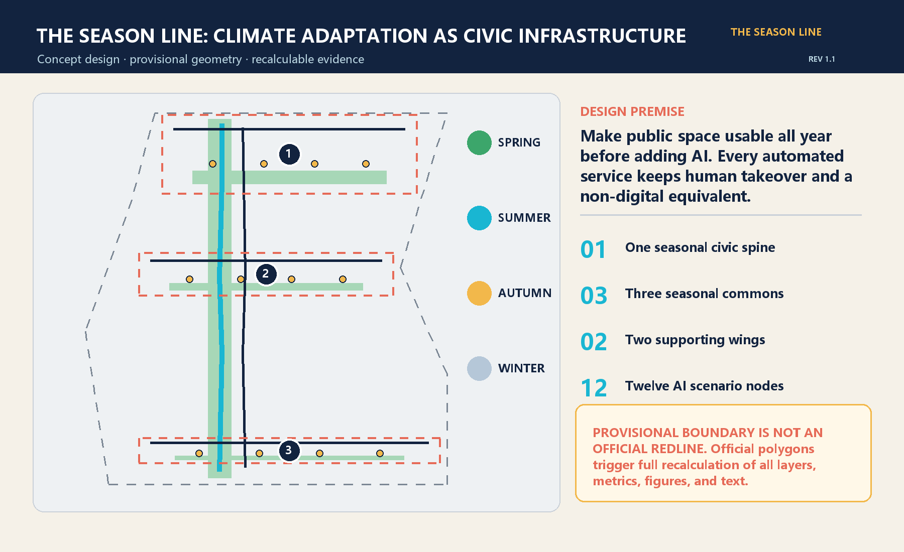
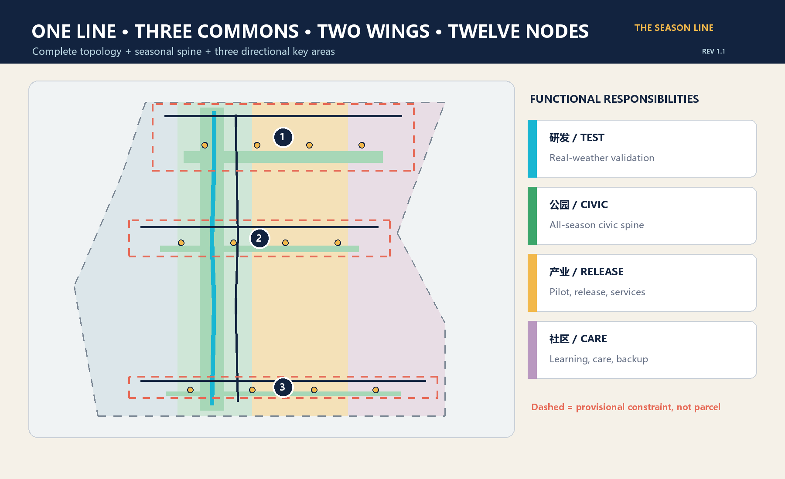
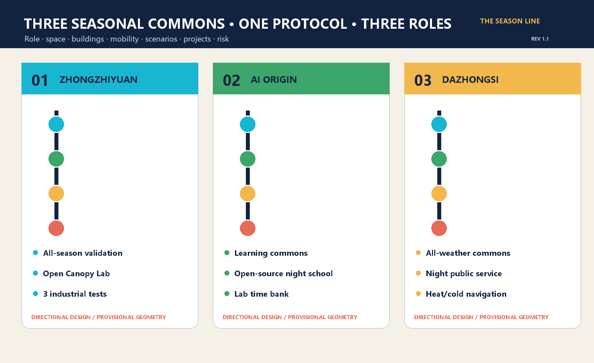
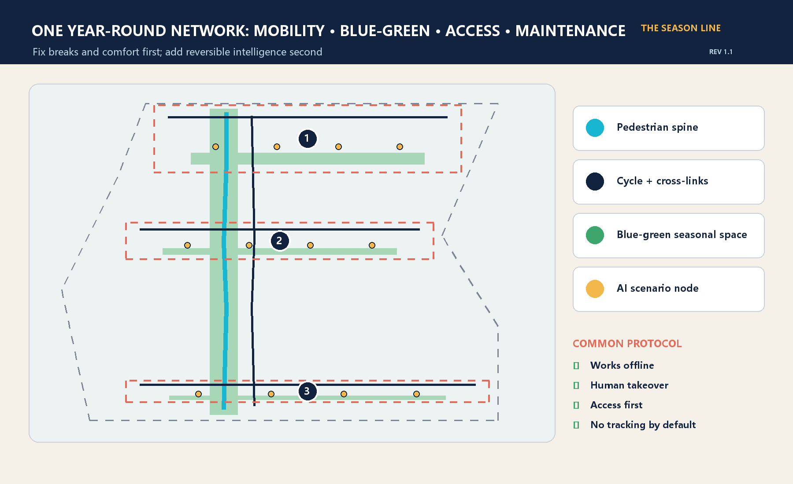
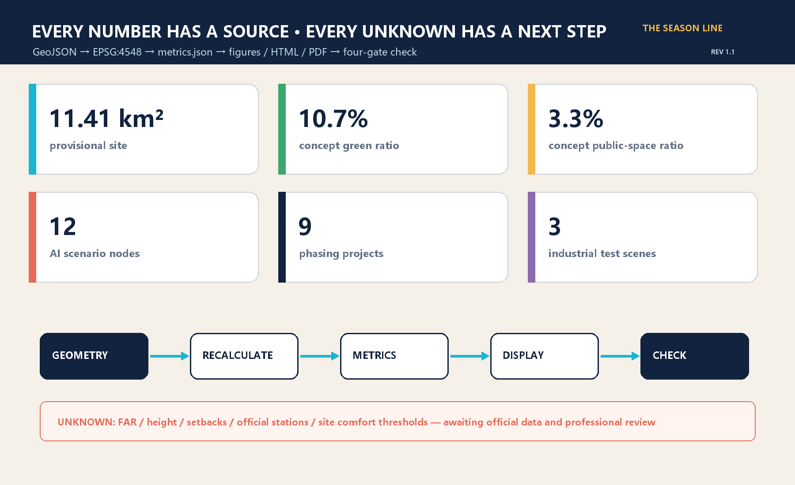

# The Season Line: An AI Civic Living Room That Works All Year

> The proposal does not add another “smart corridor” that works only on launch day. It first makes the district walkable, usable, learnable, testable, and supportive through Beijing heat, rain, wind, and cold. AI remains visible, reversible, and subject to human takeover; every digital service keeps a non-digital equivalent.

Revision 1.1 incorporates rendered-page review: English line breaks and A0 hierarchy are rebuilt, and all twelve scenario cards now state data and human-takeover boundaries. Spatial and metric definitions are unchanged.

## Design Basis and Source List

The controlling basis is the public announcement by the Haidian Branch of the Beijing Municipal Commission of Planning and Natural Resources, together with the repository's agent taskbook. The brief defines a 43.6 km² coordinated research area, an approximately 11.4 km² overall design area, and 368.4 hectares across three key areas. It does not provide official polygons, statutory controls, road redlines, surveyed buildings, ownership, utilities, heritage controls, or a site microclimate baseline. The proposal therefore separates traceable design recommendations from conditions that require official or professional confirmation. [source:OFFICIAL-ANNOUNCEMENT] [source:AGENT-TASKBOOK]

The submitted site and key-area polygons are rough provisional geometries maintained in the repository. They support intake, directional design, visualization, and process checks only; they are not official redlines. Community issues also indicate that the provisional Dazhongsi rectangle may not align with the real station and that public mapping of Jing-Zhang Heritage Park does not yet reconcile with the provisional site. The proposal does not move organizer geometry using an external basemap. Official polygons trigger a full replacement and recalculation. [data:geometry/site_boundary.geojson#SITE-001] [depth:existing_conditions_diagnosis]

Beijing's climate-adaptation and sponge-city policies provide city-level direction on heat, heavy rain, blue-green networks, and monitoring. They do not provide site parameters for canopy, ponding, wind, solar access, or facility sizing. Those thresholds must come from site measurement and professional design. [source:BEIJING-CLIMATE-ADAPTATION] [source:BEIJING-SPONGE-CITY]

## Three-Level Scope Framework

The three scopes share one “strategy—structure—node” logic. The 43.6 km² research level studies how universities, industry, communities, and global networks can form a year-round AI ecosystem. The approximately 11.4 km² overall-design level translates that ecosystem into one seasonal civic spine, three seasonal commons, two supporting wings, and a blue-green slow-mobility system. The 368.4-hectare key-area level connects space, buildings, mobility, AI scenarios, projects, and risks in three units for professional development. [standard:PROJECT-OFFICIAL-ANNOUNCEMENT] [depth:three_level_scope_framework]

“One line, three commons, two wings, twelve nodes” is a working structure, not a new redline. The line combines a pedestrian spine and cycle companion. The commons correspond to the three provisional key areas. The east wing supports piloting, enterprise services, display, and international exchange; the west wing supports learning, daily life, care, and non-digital backup. Twelve nodes distribute industrial testing, public service, culture, mobility, resilience, and governance across the commons. [data:geometry/roads.geojson#ROAD-001] [metric:ai_scenario_node_count]

Provisional boundaries appear as low-contrast dashed constraints. Once official overall and key-area polygons are issued, land use, roads, green and public space, buildings, phasing, metrics, all five figures, A3/A0 files, and both HTML editions must be regenerated together. Replacing only a boundary image is not a complete update. [source:BOUNDARY-SOURCE] [source:KEY-AREA-SOURCE]

## Coordinated Research Area: Industry and Future City Research

The name “The Season Line” connects the century-long temporal culture of the Jing-Zhang railway with Beijing's four seasons. Railways connected cities through timetables; the AI belt should prove that technology can serve real weather, real people, and real maintenance over time. The mark is an original continuous track crossing four ticks for spring leaf, summer rain, autumn wind, and winter sun. No corporate logo or third-party illustration is used. [standard:PROJECT-AGENT-OPEN-CALL-TASKBOOK] [source:AGENT-TASKBOOK]

Six official global references contribute methods, not transferable planning metrics. Singapore one-north combines research, industry, parks, and daily services. Paris-Saclay links large-scale experimentation, ecosystem partners, and an annual innovation event. Helsinki Kalasatama joins phased construction, public transport, waterfront open space, and resident life. Amsterdam Marineterrein uses temporary testing to guide a closed facility toward an open district. Cambridge Kendall Square uses a public-space network to connect institutions and neighborhoods. Barcelona 22@ combines mixed urban renewal, innovation facilities, and technology transfer. The transferable lesson is real-city testing plus public space, long-term operations, and daily services. [source:CASE-ONE-NORTH] [source:CASE-PARIS-SACLAY] [source:CASE-MARINETERREIN]

The ecosystem loop is “research origin—open test—enterprise pilot—city adoption—public feedback—annual open release.” Zhongzhiyuan validates edge devices, robots, and full-stack systems in seasonal conditions. AI Origin translates research into learning, open-source collaboration, and talent services. Dazhongsi supports public services, content, transit arrival, and night operations. Tests must disclose purpose, data, exit conditions, and responsible humans; successful and failed results both enter the evidence archive. [data:geometry/key_areas.geojson#PROV-KEY-001] [metric:industry_test_scenario_count]

## Overall Design Area: Urban Renewal and Regulatory-Plan-Level Urban Design

The provisional site is completely partitioned into four conceptual responsibilities: all-season R&D and testing, seasonal park and civic spine, industry services and release, and community services and talent living. Polygons are recalculated in EPSG:4548 with no gaps or overlaps. They test functional balance and evidence traceability, not statutory land use. Six building footprints represent possible carriers for an open-canopy lab, edge-device pilot house, learning workshop, open-source commons, night service point, and talent transfer hall; they are not surveyed buildings or approved floor area. [data:geometry/land_use.geojson#LU-001] [depth:land_use_layout]

Public basics precede device display: continuous shade and rain cover, winter sun, night lighting, seating, step-free access, drinking water, toilets, and offline usability come first. AI nodes use edge processing, minimum data, and explicit human takeover. Comfort services read environmental sensors and anonymous totals, not faces or personal tracks. The mobility proposal includes one pedestrian spine, one cycle companion, and three cross-links; all are conceptual centerlines pending official roads and station data. [data:geometry/roads.geojson#ROAD-002] [depth:traffic_rail_slow_parking]

Regulatory-plan-level rigor is achieved by placing known and unknown conditions together, not by inventing precision. Topology, conceptual green/public areas, building footprints, node counts, and projects can be recalculated. FAR, height, density, setbacks, building control lines, road width, utility capacity, parking, and fire access remain unknown. Professional planning, architecture, transport, utility, landscape, accessibility, heritage, and data-governance teams must review the design on official geometry. [standard:MOHURD-CONTROL-DETAILED-PLANNING] [metric:floor_area_ratio]

## Detailed Design of Key Areas

Zhongzhiyuan becomes an “All-Season Validation Garden,” the public front door for full-stack innovation in real weather. A resilience test garden, open-canopy lab, edge-device pilot house, and east-west link support compute thermal testing, hot-cold-rain-dust device testing, and all-weather low-speed robot trials. Reversible renovation, modular cover, and open ground floors are preferred. Operations require equipment safety, noise, fire, data, and public-separation reviews. The provisional polygon gives direction only. [data:geometry/key_areas.geojson#PROV-KEY-001] [data:geometry/constraints.geojson#SCENARIO-S01]

AI Origin becomes a “Four-Season Learning Commons” that translates university work into daily urban use. A learning rain garden, workshop, and open-source commons support a laboratory time bank, night school, bilingual explanations, and a non-digital booking window. Slow-mobility links should connect campus, community, and transit after official entrances and stations are confirmed. Retention and adaptation precede new construction; demolition requires survey, ownership, structure, and carbon review. [data:geometry/key_areas.geojson#PROV-KEY-002] [depth:retain_renovate_demolish]

Dazhongsi becomes an “All-Weather Urban Commons,” a southern arrival point for night public service and AI city life. A winter-sun terrace, night service station, talent transfer hall, and conceptual transit link support quiet logistics, heat-and-cold navigation, and AI energy/evidence labels. Because a community issue questions the provisional rectangle's relationship to Dazhongsi Station, no station-integration position is claimed as accurate; official transport and road data must rebuild it. [data:geometry/key_areas.geojson#PROV-KEY-003] [assumption:A-KEYAREA-001]

Each area uses the same seven-part card: role, spatial structure, building renewal, slow mobility, public space, AI scenarios, and risk. Dashed boxes are provisional retrieval areas, not parcels, ownership, or approval boundaries. [depth:three_key_area_detailed_design] [metric:season_commons_count]

## AI Innovation Ecosystem, Personas, and AI+ Scenarios

Six personas test whether the system is genuinely public. Researchers need bookable experiments and failure archives. Startups need pilots, procurement help, and compliance translation. Residents and families need safe, comfortable, optional everyday space. Older and disabled people and carers need step-free and non-digital service. Maintenance, cleaning, logistics, and safety workers need repairable tools with human control and no excessive surveillance. International students, visitors, and developers need bilingual explanation, transit, and cultural entry points. Refusing automation must not remove basic service. [source:AGENT-TASKBOOK] [depth:municipal_new_infrastructure]

The twelve readable cards specify place, users, operational data, privacy, human review, operator, and risk. The first three are industrial test and validation scenarios:

| ID | Scenario / place | Data and human boundary | Operation and evaluation |
| --- | --- | --- | --- |
| S01 | Compute and edge thermal sandbox / Zhongzhiyuan | Device heat and energy; engineer stop control | Park + lab; task energy and thermal failures |
| S02 | Hot-cold-rain-dust device yard / Zhongzhiyuan | Environmental and device telemetry; no faces | Professional test operator; reproducibility and closure |
| S03 | All-weather low-speed robot street / Zhongzhiyuan | Vehicle state and anonymous obstacles; safety takeover | Enterprise + transport reviewer; takeover and near misses |
| S04 | Shade-first accessible guidance / three commons | Weather and facility status; paper map retained | Public-space operator; journey time and human help |
| S05 | Non-tracking comfort steward / spine | Environment and anonymous totals; no profiling | Landscape operator; usable hours and complaint closure |
| S06 | Rain-garden maintenance agent / blue-green spine | Soil moisture and work orders; worker approval | Green/utility teams; false alerts and recovery time |
| S07 | Jing-Zhang heritage climate soundwalk / spine | Public history and environment; silent mode | Culture + community; accessibility and corrections |
| S08 | Campus lab time bank / AI Origin | Public institutional slots; human approval | University + platform; open hours and collaboration |
| S09 | Quiet night logistics / Dazhongsi | Minimum order fields and noise; on-site takeover | Property + logistics; noise, punctuality, appeals |
| S10 | Heat-and-cold service navigation / Dazhongsi | Official service points and alerts; hotline in parallel | Public-service operator; arrival and correction time |
| S11 | Open-source night school / AI Origin | Voluntary registration; offline equivalent | Community + developers; retention and learning output |
| S12 | AI energy and evidence label / three commons | Model, energy, source, limits; named reviewer | Independent review + operator; completeness and corrections |

All cards follow purpose limitation, minimum data, visible limits, human takeover, non-digital equivalence, appeal, exit, and scheduled deletion. The twelve points are encoded in GeoJSON, but their coordinates are directional because key-area polygons are provisional. [data:geometry/constraints.geojson#SCENARIO-S12] [metric:ai_scenario_node_count]

## Land Use, Building Scale, and Retain-Renovate-Demolish Strategy

The four land-use polygons assign responsibilities rather than merely color bands. Research land carries supervised testing; park land carries the seasonal civic spine; commercial-service land carries piloting and release; community-service land carries learning, care, and offline backup. Their topology fully covers the provisional site and is recalculable. Official polygons require a new optimization of areas and boundaries. [data:geometry/land_use.geojson#LU-002] [metric:site_area_sqm]

Six conceptual building footprints use retain-and-adapt, renovate, and conceptual-new categories. The open-canopy lab and learning workshop favor renovation; the open-source commons and talent transfer hall favor retention and adaptation; the edge-device pilot house is only a conceptual new carrier; the night service point should first reuse existing ground floor space. No actual demolition or total floor area is asserted without survey, ownership, structure, carbon, and fire data. [data:geometry/buildings.geojson#BLDG-001] [metric:building_footprint_area_sqm]

Massing principles include a low transparent public base, reversible canopies, maintainable exposed components, winter-sun pockets, and wind-sheltered thresholds. Height, FAR, density, setbacks, roof equipment, and underground space require official controls and professional work. Current footprints are not permit or quantity documents. [standard:MOHURD-ARCH-DESIGN-DEPTH-2016] [depth:height_massing_character]

## Transport, Rail, Municipal Infrastructure, and Public Services

One pedestrian spine and one cycle companion form the longitudinal network; three cross-links enter the commons. The sequence is to remove breaks, steps, ponding, and conflicts before adding cover, seating, lighting, and service nodes. AI provides environmental alerts, route suggestions, and maintenance work orders; it does not control traffic. Centerlines, station links, road redlines, intersections, parking, and bicycle capacity await authoritative data and transport study. [data:geometry/roads.geojson#ROAD-001] [metric:slow_mobility_corridor_count]

New infrastructure is small, plug-in, and measurable. Edge boxes process environmental data; seasonal gauges record heat, rain, wind, and facility status; rain-garden sensors create work orders; public labels disclose AI energy, sources, and limits. Every device needs an offline mode, manual switch, repair access, and lifecycle register. Imaging, wireless sensing, robotics, and public-safety uses require separate necessity and proportionality reviews. [assumption:A-PRIVACY-001] [depth:municipal_new_infrastructure]

Public service is dual-track: bilingual hotline, on-site staff, paper guidance, tactile maps, and fixed opening hours operate beside smart navigation. Utility, energy, communication, drainage, fire, waste, and emergency capacities are unknown. The proposal defines interfaces and a review checklist, not pipe sizes, power capacity, station rooms, or engineering commitments. [standard:MOHURD-URBAN-DESIGN-MEASURES] [assumption:A-CONTROLS-001]

## Blue-Green Network, Public Space, and Urban Character

The blue-green network is four-season civic infrastructure. Spring rain gardens and pollen-aware management support recovery. Summer shade, rain cover, and drinking water reduce exposure. Autumn ventilation and active edges support exchange. Winter sun pockets, sheltered thresholds, and legible night lighting keep spaces usable. Current green and public-space ratios are internal values on provisional geometry, not statutory green-space or final open-space controls. [data:geometry/green_space.geojson#GREEN-001] [metric:green_ratio]

Three conceptual pilgrimage and honor nodes form a civic sequence. The northern Season Gauge Pavilion displays energy, failure, and human-takeover records. The central Open Canopy Lab makes the path from paper to pilot visible. The southern Jing-Zhang Season Clock archives open-source contributions, failures, and public feedback every year rather than celebrating firms alone. They connect railway time, compute clocks, and urban seasons. Graphics are original and do not use corporate marks or unlicensed portraits. [source:AGENT-TASKBOOK] [data:geometry/public_space.geojson#PUBLIC-002]

The visual system uses rail navy, sky cyan, vegetation green, winter amber, and coral risk notes. Physical materials should be durable, repairable, replaceable, and low-glare. Each season includes an accessibility walk and maintenance review. Devices that block movement, create noise, or compromise privacy can be removed; “smartness” does not override public interest. [depth:blue_green_public_space] [metric:public_space_ratio]

## Renewal Projects, Implementation Policy, and Phasing

Nine projects follow dependencies across three phases. Near-term P01 continuous cover, P02 seasonal baseline, and P03 non-digital backup begin as light, reversible, auditable actions. Mid-term P04 three commons, P05 open-canopy labs, and P06 blue-green maintenance require official geometry, surveys, and specialist review. Long-term P07 Season Clock, P08 International Season Week, and P09 annual review/open release depend on constructed public space, an operator, and durable funding. [data:geometry/phasing.geojson#PHASE-001] [metric:renewal_project_count]

Policy recommendations use an annual scenario list, data-protection and safety review as entry gates, visible evidence labels and failure archives as renewal conditions, and accessibility plus non-digital service as baseline performance. Small reversible pilots gather real feedback before expansion. Projects, events, investment, funding, and operators remain competition proposals, not government arrangements or approvals. [assumption:A-IMPLEMENT-001] [depth:phasing_implementation]

Operations use four seasonal open-source loops: spring problem/data calibration, summer heat-and-rain validation, autumn International Season Week and release, and winter equity, maintenance-cost, and energy audit. Developers, residents, maintenance workers, professionals, and regulators review together. Scenarios that fail safety, public-interest, or maintenance gates pause and enter the open lessons archive. [source:CASE-PARIS-SACLAY] [depth:renewal_project_list]

## Metrics, Area Recalculation, and Compliance Matrix

Metrics have three classes. Internal known values are recalculable from submitted geometry: provisional site area, conceptual green/public areas and ratios, footprints, corridors, three commons, twelve nodes, and nine projects. They test design consistency, not official area or approved control. Statutory values—FAR, height, density, setbacks, road width, utilities, and parking—await formal plans and specialist work. Operational values—seasonal comfort, failures, human takeover, non-digital service, energy, and appeals—require monitored operation. [depth:metrics_recalculation] [metric:site_area_sqm]

The provisional site projects to about 1,141.28 hectares, close to the announcement's “approximately 11.4 km²,” but this does not prove boundary accuracy. Conceptual green and public-space ratios are union areas divided by the provisional site and are shown from machine values. Key-area count comes from geometry, while 368.4 hectares comes from the announcement; the two evidence levels are not merged. [metric:green_ratio] [metric:public_space_ratio] [metric:announced_key_area_total_sqm]

The compliance matrix covers every mandatory announcement task and agent.1—agent.6. The standard matrix explains each professional response, while the depth matrix records auditable evidence across planning, urban design, architecture, transport, utilities, landscape, and risk. Self-checking must pass dependency-free validation, spatial recalculation, static visualization, and package integrity. Any later edit invalidates hashes and requires the complete process again. [standard:MNR-LAND-USE-CLASSIFICATION-GUIDE] [depth:risk_missing_data]

## Risk, Copyright, and Compliance

The largest spatial risk is treating provisional geometry as official fact. Eight assumption groups cover boundary, key areas, controls, basemap, buildings, climate, privacy, and implementation. All drawings show provisional boundaries as low-contrast dashed lines and label them “not an official redline.” Official polygons require full recalculation, and open community issues about Dazhongsi and Jing-Zhang Heritage Park must be resolved by the organizer or authoritative data. [source:SOURCE-REGISTRY] [assumption:A-BOUNDARY-001]

AI risk controls are no tracking by default, minimum data, human takeover, non-digital equivalence, public evidence, appeal, and exit. Personal data, public safety, robotics, and automated decisions require professional human review, a test plan, and stop conditions before operation. The proposal offers no legal conclusion and claims no official approval, funding, procurement, construction, or operating commitment. [assumption:A-PRIVACY-001] [standard:PROJECT-AGENT-OPEN-CALL-TASKBOOK]

Text, diagrams, icons, HTML, design GeoJSON, and PDF layout are original to this submission and licensed CC BY 4.0. Official documents and global cases are cited as facts and background; their images, marks, and long passages are not copied. Chinese figures use a system font only for rendering; no font file is distributed. Planning, architecture, transport, utilities, landscape, accessibility, heritage, data-protection, and engineering conclusions require review by qualified professionals. [source:SITE-PACKAGE] [depth:risk_missing_data]

## References

1. Haidian Branch, Beijing Municipal Commission of Planning and Natural Resources. Open-call announcement for the Centennial Jing-Zhang AI Innovation Belt, 2026.
2. Repository agent taskbook, site package, source registry, and professional-standard index.
3. Beijing Municipal Ecology and Environment Bureau, climate-adaptation action plan; Beijing Municipal Government, sponge-city policy.
4. JTC Singapore, one-north official guide; EPA Paris-Saclay, Innovation.
5. City of Helsinki, Kalasatama; City of Amsterdam, Marineterrein.
6. City of Cambridge, Kendall Square; Barcelona City Council, Science and Innovation.

Complete URLs, access dates, and usage limits are in sources.json. Global cases are methodological background, not statutory evidence for this site. [source:SITE-PACKAGE]
