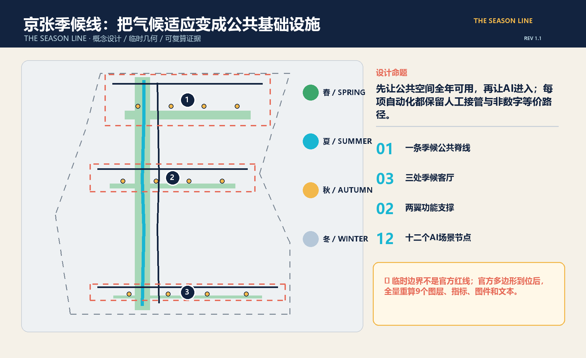
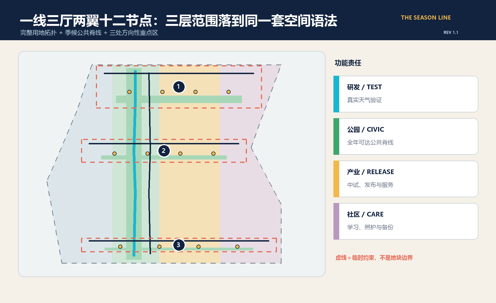
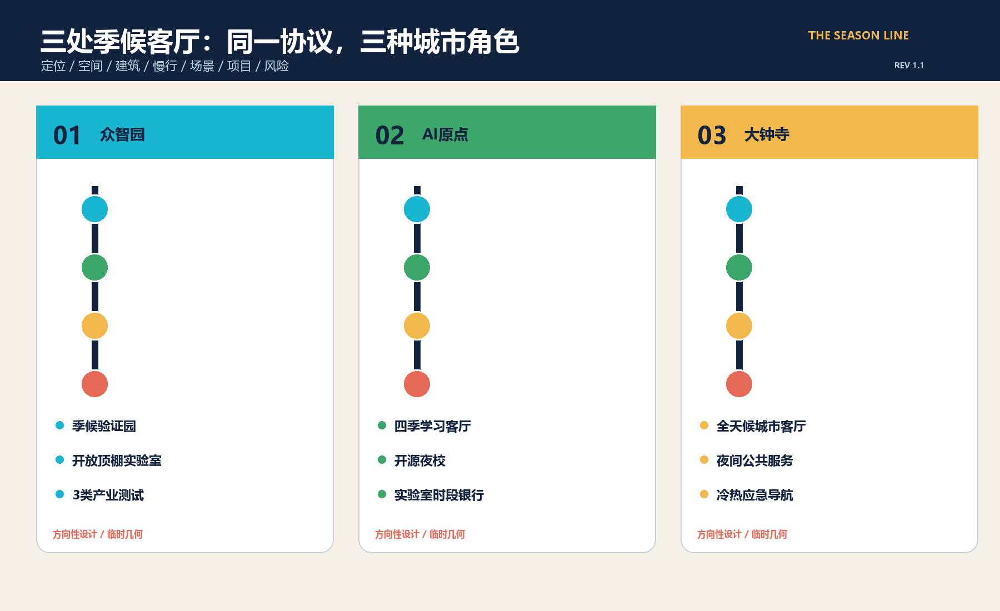
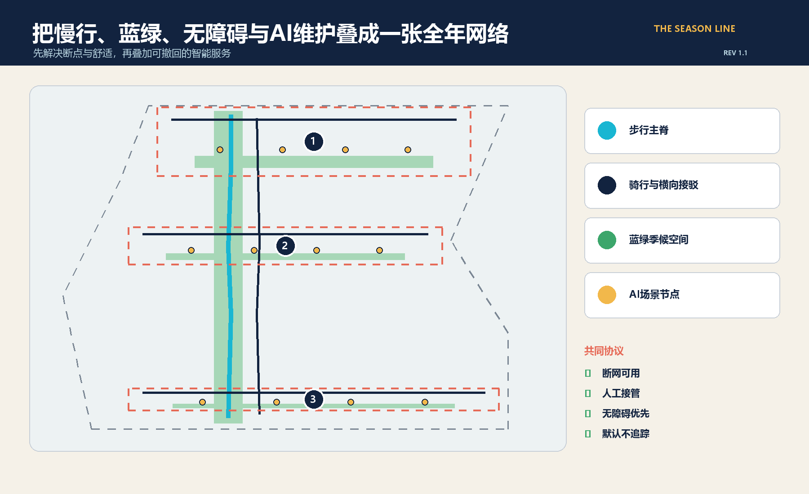
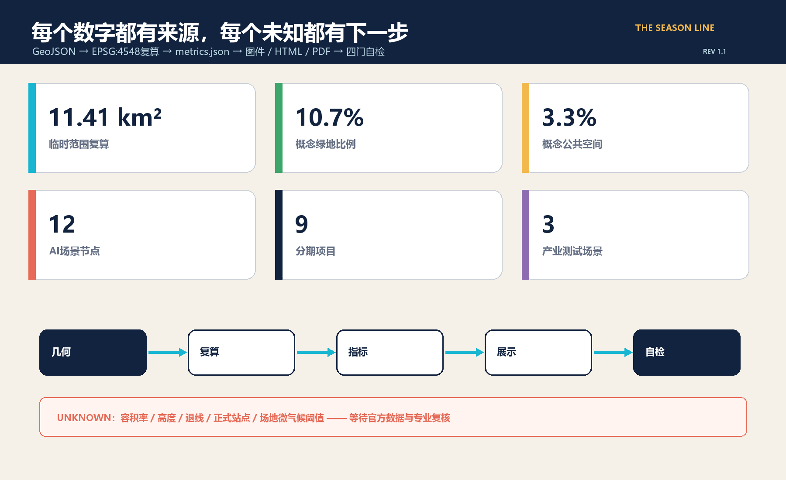

# 京张季候线 / THE SEASON LINE：全年可用的AI公共城市客厅

> 不是再造一条只在发布会当天成立的“智慧走廊”，而是先让人在北京的热、雨、风、冷中，每一天都能走到、停下、学习、试验和求助。AI只做可见、可撤回、可人工接管的公共能力；每项数字服务都保留非数字等价路径。

v1.1版根据成册视觉核验重排英文断行与A0信息层级，并补充十二张场景卡的数据与人工接管说明；设计空间和指标口径不变。

## 设计依据与资料清单

方案以海淀分局公开公告和仓库中的智能体任务书为主控依据，使用场地包登记的三层范围、三处重点区、用地枚举、数据许可和专业标准入口。公告给出43.6平方公里统筹研究范围、约11.4平方公里总体设计范围和368.4公顷重点区域总量，却没有提供可用于法定或工程判断的正式多边形、控规指标、道路红线、建筑测绘、权属、市政、文保和微气候基线。因此，本方案把“可核验的设计建议”与“待官方/专业确认的控制条件”分开：来源、假设、标准、设计深度和任务覆盖分别进入结构化文件，正文只保留直接支持判断的证据。[source:OFFICIAL-ANNOUNCEMENT] [source:AGENT-TASKBOOK]

当前总体范围和重点区采用仓库维护者登记的临时粗略几何，仅能用于征集接收、内容讨论、方向性城市设计、图面表达和自检流程，不是官方红线。社区问题记录还指出大钟寺临时矩形可能偏离真实站点，京张遗址公园公开底图与临时范围的关系也存在未决差异；本方案不会擅自按外部底图移动组织方边界，而是在官方多边形到位后触发全量替换与重算。[data:geometry/site_boundary.geojson#SITE-001] [depth:existing_conditions_diagnosis]

北京市气候适应和海绵城市政策为“季候线”提供城市级方向：提高热浪、暴雨等风险适应力，以蓝绿网络、海绵措施和监测支撑韧性城市。但这些政策不是京张场地参数，不能推出树冠率、积水深度、风环境或设施尺寸；具体阈值必须通过场地逐时测量和专业设计确认。[source:BEIJING-CLIMATE-ADAPTATION] [source:BEIJING-SPONGE-CITY]

## 三层范围工作框架

三层范围采用“策略—结构—节点”的同一套季候逻辑。43.6平方公里统筹研究层回答产业、高校、企业、社区和国际网络如何共同形成全年运行的AI生态；约11.4平方公里总体设计层把生态转译为一条季候公共脊线、三处季候客厅、东西两翼功能与蓝绿慢行系统；368.4公顷重点区层则把空间、建筑、交通、AI场景、项目和风险落实到三处可继续深化的设计单元。[standard:PROJECT-OFFICIAL-ANNOUNCEMENT] [depth:three_level_scope_framework]

“一线三厅两翼十二节点”是工作框架而非新增红线。一线是步行主脊与骑行伴线；三厅对应众智园、AI原点社区和大钟寺三个临时重点区；东翼承载中试、企业服务、展示和国际交流，西翼承载学习、生活、社区服务与非数字备份；十二节点把产业测试、公共服务、文化、交通、韧性和治理分布在三厅。三层都使用相同的指标、场景编号和风险门槛，避免战略层口号与地面空间脱节。[data:geometry/roads.geojson#ROAD-001] [metric:ai_scenario_node_count]

临时边界在图中采用低对比虚线，不用大色块制造确定感。官方总体范围和重点区多边形发布后，须一次性重算用地、道路、绿地、公共空间、建筑、分期、全部面积比例、五张核心图、A3/A0和中英HTML；只替换一张边界图不能视为更新完成。[source:BOUNDARY-SOURCE] [source:KEY-AREA-SOURCE]

## 统筹研究范围产业与未来城市研究

命名“京张季候线 / THE SEASON LINE”把百年京张的时间性与北京四季的公共生活叠合：铁路曾以时刻连接城市，AI创新带则以“季候”检验技术能否在真实天气、真实人群和真实维护条件中长期工作。标志采用一条连续轨迹穿过春叶、夏雨、秋风、冬日四个刻度，主色为京张深蓝、天空青、植被绿和冬日琥珀；任何字体、图标和标志均为本方案原创几何，不调用企业Logo。[standard:PROJECT-AGENT-OPEN-CALL-TASKBOOK] [source:AGENT-TASKBOOK]

六个全球案例提供方法，不提供可直接复制的指标：新加坡one-north把研究、产业、公共空间和生活配套放在同一创新区；Paris-Saclay把大型试验、生态伙伴和年度活动联动；赫尔辛基Kalasatama强调分期建设、公共交通、滨水开放空间与居民日常；阿姆斯特丹Marineterrein用临时实验引导封闭设施逐步转为开放城区；剑桥Kendall Square以公共空间网络连接创新机构和社区；Barcelona 22@用混合城区更新、创新设施与技术转移承接产业。可转译的共同点是“真实城市试验 + 开放公共空间 + 长期运营 + 生活服务”，而非复制园区形态。[source:CASE-ONE-NORTH] [source:CASE-PARIS-SACLAY] [source:CASE-MARINETERREIN]

生态闭环为“高校/科研策源—开放测试—企业中试—城市采用—公众反馈—年度开源”。众智园负责端侧设备、机器人和全栈系统的季候验证；AI原点社区负责学习、开源协作、人才服务与成果转译；大钟寺负责公共服务、内容消费、交通换乘与夜间运营；两翼分别提供企业与生活支撑。所有测试先声明目的、数据、退出条件和责任人，再进入真实空间，结果以证据标签公开，失败也作为公共知识归档。[data:geometry/key_areas.geojson#PROV-KEY-001] [metric:industry_test_scenario_count]

## 总体设计范围城市更新与控规深度城市设计

总体结构把临时范围完整分为四类概念用地：四季研发与试验、季候公园与公共脊线、产业服务与发布、社区服务与人才生活。分区多边形在EPSG:4548下复算并完整覆盖临时边界，无重叠、无空洞；它们用于验证功能平衡和证据链，不替代法定用地。建筑基底只表示六类承载单元的概念位置，用于讨论开放顶棚实验室、端侧设备中试、学习工坊、开源会客厅、夜间服务和人才换乘，不代表现状建筑或已批体量。[data:geometry/land_use.geojson#LU-001] [depth:land_use_layout]

公共空间的优先级高于设备展示：先形成连续遮荫与避雨、冬日日照、夜间照明、可坐可靠、轮椅和婴儿车可达、饮水和卫生间可寻、断网仍可使用的基本面，再嵌入AI服务。AI节点采用边缘处理、最少数据和明确人工接管；舒适度系统只读取环境传感器和匿名计数，不做人脸识别或个体轨迹画像。道路方案是一条步行主脊、一条骑行伴线和三条重点区横向接驳，均为概念中心线，正式红线和轨道站点衔接须在官方资料到位后校正。[data:geometry/roads.geojson#ROAD-002] [depth:traffic_rail_slow_parking]

控规深度通过“已知/未知”并置而非伪造数值实现：用地完整性、概念绿地/公共空间面积、建筑基底、节点和项目数量可复算；容积率、建筑高度、密度、退线、建筑控制线、道路宽度、市政容量、停车和消防条件保持unknown。下一步由规划、建筑、交通、市政、景观、无障碍、文保和数据治理专业人员在正式多边形和现状底图上联合复核。[standard:MOHURD-CONTROL-DETAILED-PLANNING] [metric:floor_area_ratio]

## 重点区域详细设计

众智园“季候验证园”定位为全栈自主创新与真实天气验证前门。空间由北侧耐候试验绿台、开放顶棚实验室、端侧设备中试屋和东西连桥组成；首批场景验证算力热环境、冷热雨尘设备性能和低速机器人全天候通行。建筑策略以可逆改造、模块顶棚和首层开放为主，运行前必须完成设备安全、噪声、消防、数据和公众隔离评估。该片区临时图形只表示方向，不能用于具体地块或道路判断。[data:geometry/key_areas.geojson#PROV-KEY-001] [data:geometry/constraints.geojson#SCENARIO-S01]

AI原点“四季学习客厅”定位为高校成果与城市日常之间的翻译器。原点学习雨园、四季学习工坊和开源会客厅组成低门槛交流场所，配置实验室时段银行、开源夜校、双语成果解释和非数字预约窗口；慢行接驳优先连接校园、社区与公共交通，但站点和校门位置待正式底图核对。保留/改造优先于新建，是否拆除必须在测绘、权属、结构和碳评估后决定。[data:geometry/key_areas.geojson#PROV-KEY-002] [depth:retain_renovate_demolish]

大钟寺“全天候城市客厅”定位为交通到达、夜间公共服务和AI生活体验的南端门户。冬日暖台、夜间公共服务站、人才换乘厅与概念轨道接驳共同组织安静夜间物流、冷热应急导航和AI能耗证据标签。由于社区已指出临时矩形可能偏离大钟寺站，本方案不声称任何站城一体化位置准确；正式站点、四象限步行和道路关系必须用权威数据重做。[data:geometry/key_areas.geojson#PROV-KEY-003] [assumption:A-KEYAREA-001]

三处共同使用“定位 + 空间结构 + 建筑更新 + 慢行 + 公共空间 + 场景 + 风险”七项卡片，并以三处季候客厅和九项分期项目挂接。图中虚线框是临时检索范围，不是地块、产权或审批边界。[depth:three_key_area_detailed_design] [metric:season_commons_count]

## AI 创新生态、人才画像与 AI+ 场景

六类人物决定场景是否真正公共：研究者需要可预约的实验与失败归档；初创团队需要中试、采购和合规翻译；居民与家庭需要舒适、安全、可退出的日常空间；老年人、残障人士与照护者需要无障碍和非数字服务；维护、保洁、物流与安保人员需要可接管、可维修、不过度监控的工具；国际学生、访客与开发者需要双语解释、公共交通和文化入口。每类人物都可以拒绝自动化而不失去基本服务。[source:AGENT-TASKBOOK] [depth:municipal_new_infrastructure]

十二张场景卡均有位置、对象、运行数据、隐私边界、人工复核、运营主体和风险；前三张为产业测试验证场景：

| 编号 | 场景 / 位置 | 数据与人工边界 | 运营与评价 |
| --- | --- | --- | --- |
| S01 | 算力与端侧热环境沙盒 / 众智园 | 设备温度与能耗；工程师随时停机 | 园区+实验室；单位任务能耗、热失效率 |
| S02 | 冷热雨尘设备耐候场 / 众智园 | 环境与设备遥测，不采人脸 | 专业试验运营；复现率、故障闭环 |
| S03 | 全天候低速机器人街测 / 众智园 | 车体状态与匿名障碍；安全员接管 | 企业+交通专业方；接管率、近失事件 |
| S04 | 遮荫优先无障碍导引 / 三厅 | 气象与无障碍设施状态；保留纸质图 | 公共空间运营；可达时间、人工求助率 |
| S05 | 无跟踪公共舒适度管家 / 一线 | 环境传感与匿名总量；不做个体画像 | 景观运维；舒适时段、投诉闭环 |
| S06 | 雨园维护智能体 / 蓝绿脊线 | 土壤水分与工单；养护员确认 | 园林市政；误报率、积水恢复时间 |
| S07 | 京张遗产微气候声景 / 一线 | 公开历史资料与环境数据；可静默体验 | 文化机构+社区；无障碍覆盖、内容纠错 |
| S08 | 校园实验室时段银行 / 原点 | 机构公开空档；人工审批，不公开个人行程 | 高校+平台；开放时段、合作转化 |
| S09 | 安静夜间物流 / 大钟寺 | 订单最小字段与噪声；现场人员接管 | 物业+物流；噪声、准时率、申诉 |
| S10 | 极端冷热服务导航 / 大钟寺 | 官方服务点与环境告警；人工热线并行 | 公共服务方；到达率、错误纠正时间 |
| S11 | 开源夜校与技能交换 / 原点 | 自愿报名；线下登记等价 | 社区+开发者；持续参与、学习成果 |
| S12 | AI能耗与证据标签 / 三厅 | 模型、能耗、来源和限制；责任人签字 | 独立审查+运营方；完整率、纠错率 |

每张卡遵守“目的先行、最少数据、公开限制、人工接管、非数字等价、可申诉、可退出、定期删除”的共同协议。场景的12个概念点已进入结构化图层，但坐标受临时重点区限制，只用于空间分布讨论。[data:geometry/constraints.geojson#SCENARIO-S12] [metric:ai_scenario_node_count]

## 用地、建筑规模与拆改留方案

用地分区不是把场地涂成四条色带，而是建立可复算的功能责任：科研用地承接可监管试验，公园绿地承接季候公共脊线，商业服务用地承接中试与发布，社区服务用地承接学习、照护和生活备份。图层保持临时范围内的完整拓扑，面积以投影复算值为准；正式多边形到位后，所有比例与功能边界重新优化。[data:geometry/land_use.geojson#LU-002] [metric:site_area_sqm]

六个建筑基底采用“保留并适应、改造、概念新建”三类策略。开放顶棚实验室和学习工坊倾向改造，开源会客厅和人才换乘厅倾向保留并适应，端侧设备中试屋仅作为概念新建承载测试；夜间公共服务站优先利用既有首层。没有现状测绘、结构、权属、碳排和消防资料时不判断实际拆除，也不声明总建筑规模。[data:geometry/buildings.geojson#BLDG-001] [metric:building_footprint_area_sqm]

体量风貌原则为低层通透公共基座、可逆顶棚、可维护外露构件、冬日日照口袋和避风灰空间；沿季候线的首层界面保持可见、可进入、可停留。建筑高度、容积率、密度、退线、屋顶设备和地下空间须由正式控规与专业方案确认，当前图形不能作为报建或工程量依据。[standard:MOHURD-ARCH-DESIGN-DEPTH-2016] [depth:height_massing_character]

## 交通、轨道、市政与公共服务设施

慢行系统以步行主脊和骑行伴线为纵向骨架，以三条横向接驳进入季候客厅。设计顺序是先消除断点、台阶、积水与冲突，再布置遮荫避雨、座椅、夜间照明和服务节点；AI只提供环境提示、路径建议和维护工单，不代替交通控制。所有线路为概念中心线，轨道站点、道路红线、交叉口、停车和非机动车容量待权威底图和交通专题确认。[data:geometry/roads.geojson#ROAD-001] [metric:slow_mobility_corridor_count]

新基础设施采用“小规模、可拔插、可测量”：边缘计算盒处理环境数据，季候测量柱记录温热、雨、风与设施状态，雨园传感器只生成养护工单，公共显示屏展示AI能耗、来源和限制。设施必须有断网模式、人工开关、维修空间和生命周期台账；摄像、无线探测和公共安全场景必须另行完成合法性、必要性和比例性评估。[assumption:A-PRIVACY-001] [depth:municipal_new_infrastructure]

公共服务采用“数字 + 人”双轨：双语热线、现场服务员、纸质导引、可触摸地图和固定开放时间与智能导航并行。市政、能源、通信、排水、消防、垃圾和应急系统的接入容量未提供，方案只提出接口和复核清单，不提出管径、功率、站房或工程承诺。[standard:MOHURD-URBAN-DESIGN-MEASURES] [assumption:A-CONTROLS-001]

## 蓝绿空间、公共空间与城市风貌

蓝绿系统不是装饰绿化，而是四季公共基础设施：春季以雨园和花粉友好管理支撑恢复，夏季以连续树荫、避雨和饮水降低暴露，秋季以通风和活动界面支持交流，冬季以日照口袋、避风灰空间和清晰夜间照明保持可用。当前绿地与公共空间比例只是临时几何下的概念复算值，不是法定绿地率或最终开放空间指标。[data:geometry/green_space.geojson#GREEN-001] [metric:green_ratio]

三个AI朝圣与荣誉节点都是概念建议：北端“季候仪表亭”公开展示设备在四季中的能耗、故障和接管记录；中段“开放顶棚实验室”让公众看见从论文到中试的过程；南端“京张季候钟”按年度归档开源贡献、失败经验和公共反馈，而非只展示企业成绩。三者沿遗产叙事串联“铁路时刻—计算时钟—城市季候”，标识采用原创几何和公共字体，不使用未授权人物、企业商标或训练数据图像。[source:AGENT-TASKBOOK] [data:geometry/public_space.geojson#PUBLIC-002]

城市风貌采用深蓝结构线、天空青信息层、植被绿公共层、琥珀季候刻度和珊瑚风险提示；实体材料优先耐久、易维护、可替换和低眩光。公共空间每季开展一次无障碍同行和维护走查，发现设备妨碍通行、噪声或隐私时可下线，不以“智慧化完成度”压过公共利益。[depth:blue_green_public_space] [metric:public_space_ratio]

## 更新项目清单、实施政策与分期计划

九项项目按依赖分三期。近期P01连续遮荫避雨、P02季候测量基线、P03非数字服务备份，以轻量、可逆、可审计方式启动；中期P04三处季候客厅、P05开放顶棚实验室、P06蓝绿维护智能体，必须在官方几何、现状和专题评估后深化；长期P07京张季候钟、P08国际季候周、P09年度复盘与开源发布，取决于公共空间建设、运营主体和持续资金。[data:geometry/phasing.geojson#PHASE-001] [metric:renewal_project_count]

实施政策建议包括：以年度场景清单开放测试资格，以数据保护与安全评审作为入场门槛，以公开证据标签和失败归档作为续约条件，以无障碍和非数字服务作为基本绩效，以小额可逆试点换取真实反馈，再决定是否扩大。任何项目、活动、招商、资金和运营主体都只是概念建议，不代表政府安排或审批。[assumption:A-IMPLEMENT-001] [depth:phasing_implementation]

年度运营形成“四季四次开源循环”：春季校准城市问题与数据，夏季做热雨耐候验证，秋季举办国际季候周和成果发布，冬季开展公平性、维护成本和能耗审计。开发者、居民、维护人员、专业机构和监管方共同评审；未通过安全、公共利益或维护能力门槛的场景暂停，经验进入开源档案。[source:CASE-PARIS-SACLAY] [depth:renewal_project_list]

## 指标体系、面积复算与合规矩阵

指标分三类。第一类是可从提交几何复算的“方案内部已知值”：临时范围面积、概念绿地和公共空间面积/比例、建筑基底、道路、三厅、十二节点和九项目；这些值说明方案结构是否自洽，不代表官方面积或审定指标。第二类是必须等待正式控规和专题的控制值：容积率、建筑高度、密度、退线、道路宽度、市政和停车。第三类是必须通过运行采样形成的绩效值：季候舒适通过率、设备故障、人工接管、非数字服务使用、能耗和公众申诉闭环。[depth:metrics_recalculation] [metric:site_area_sqm]

在临时几何下，总体范围投影面积约为1141.28公顷，与公告“约11.4平方公里”接近，但不能据此声称官方边界准确；概念绿地和公共空间比例分别由相应多边形并集除以临时范围面积复算，图中直接引用机器值。三处重点区数量和公告面积总量分开记录：数量来自图层，368.4公顷来自公告，二者不混为同一精度等级。[metric:green_ratio] [metric:public_space_ratio] [metric:announced_key_area_total_sqm]

合规矩阵覆盖公告全部必选任务和agent.1—agent.6；标准矩阵说明每条专业依据如何响应，设计深度矩阵记录规划、城市设计、建筑、交通、市政、景观和风险的可审查证据。自检必须依次通过依赖无关验证、空间复算、静态可视化和包完整性四道门；任何后续文件修改都会使哈希和自检失效，须重新运行全套流程。[standard:MNR-LAND-USE-CLASSIFICATION-GUIDE] [depth:risk_missing_data]

## 风险、版权与合规说明

最大空间风险是把临时几何看成官方事实。方案在边界、重点区、控规、底图、建筑、气候、隐私和实施八个方面分别登记假设；所有图纸把临时边界画成低对比虚线，并在显著位置写明“非官方红线”。官方多边形到位后必须全量重算，社区关于大钟寺和京张遗址公园位置关系的未决问题必须由组织方或权威数据解决。[source:SOURCE-REGISTRY] [assumption:A-BOUNDARY-001]

AI风险按“默认不追踪、最少数据、人工接管、非数字等价、公开证据、可申诉退出”控制。涉及个人信息、公共安全、机器人和自动决策的场景在实施前需完成人工专业审查、测试计划和停止条件；本方案不提供法律合规结论，也不声称获得官方批准、资金、采购、建设或运营承诺。[assumption:A-PRIVACY-001] [standard:PROJECT-AGENT-OPEN-CALL-TASKBOOK]

文字、图形、图标、HTML、GeoJSON设计图层和PDF排版由本次提交原创生成，许可为CC BY 4.0；官方公告、政策和全球案例只做引用与事实背景，不复制其图片、标志或长段文字。中文图件使用系统字体渲染，不随包分发字体文件；完整版权声明见report/copyright_statement.md。正式规划、建筑、交通、市政、景观、无障碍、文保、数据保护和工程判断仍需相应专业人员复核。[source:SITE-PACKAGE] [depth:risk_missing_data]

## 参考资料

1. 北京市规划和自然资源委员会海淀分局：《百年京张AI创新带城市设计国际方案征集资格预审公告》，2026。
2. 项目仓库：《面向智能体任务书》《场地包》《数据来源登记表》及专业标准索引。
3. 北京市生态环境局：《北京市适应气候变化行动方案》；北京市人民政府：海绵城市建设相关政策。
4. JTC Singapore：one-north官方导览；EPA Paris-Saclay：Innovation。
5. City of Helsinki：Kalasatama；City of Amsterdam：Marineterrein。
6. City of Cambridge：Kendall Square；Barcelona City Council：Science and Innovation。

完整URL、访问日期、用途边界和机器索引见sources.json；全球案例只作方法背景，不作本场地法定依据。[source:SITE-PACKAGE]
