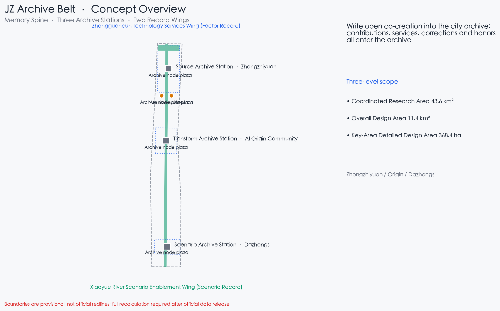
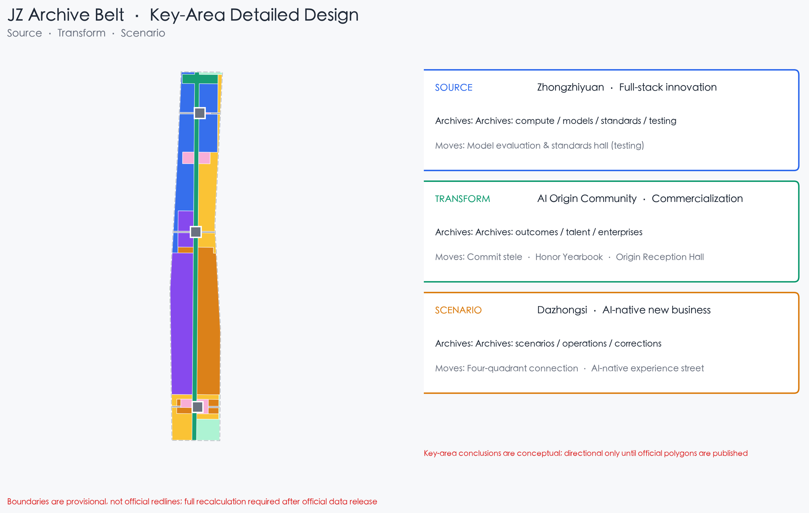
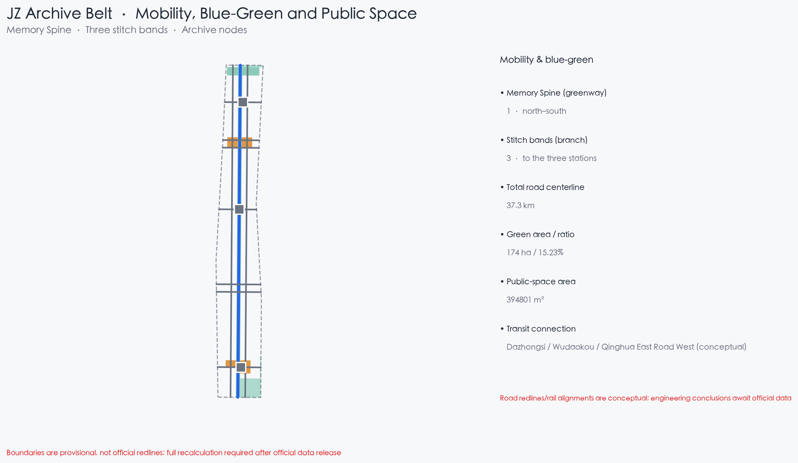
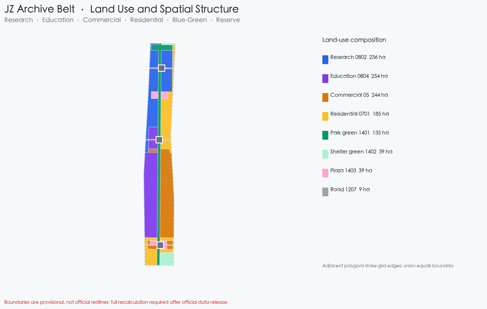
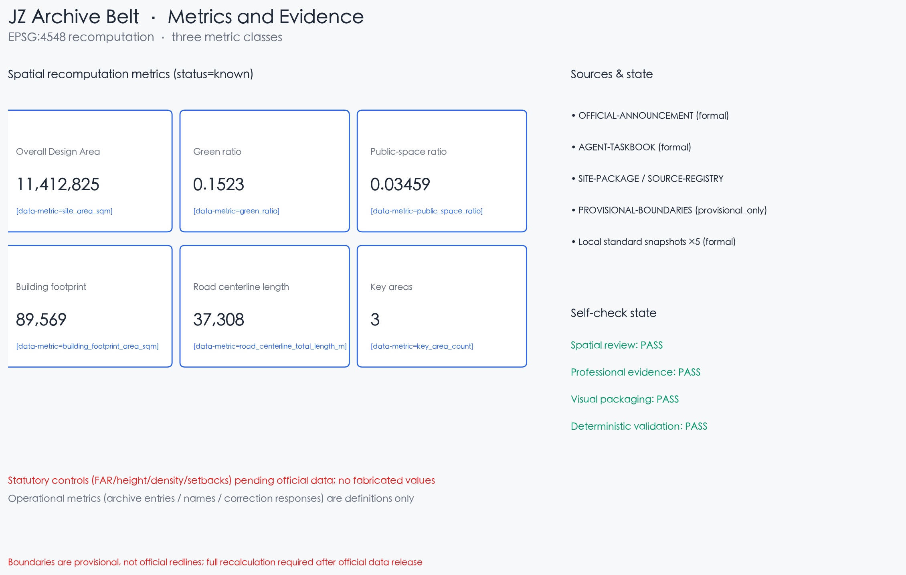

# JZ Archive Belt: Write Open Co-Creation into the City Archive

## Design Basis and Source List

This proposal takes as its primary basis the Qualification Pre-Announcement for the International Open Call for Urban Design of the Centennial Jing-Zhang AI Innovation Belt, issued by the Haidian Branch of the Beijing Municipal Commission of Planning and Natural Resources, which defines the project purpose, the three-level scope, the three key areas, the design tasks, and the required depth [source:OFFICIAL-ANNOUNCEMENT] [standard:PROJECT-OFFICIAL-ANNOUNCEMENT]. The Agent Open-Call Taskbook excerpt (version 0518) adds the ten co-creation principles, the three positionings, the five functions, the Three Zones and Two Wings, the six agent tasks, and the unified boundary clause [source:AGENT-TASKBOOK] [standard:PROJECT-AGENT-OPEN-CALL-TASKBOOK].

Before generation, the site package (design brief, allowed design space, enums, ranges, schemas, provisional geometry, and standards) and the public source registry were read, and all materials were classified as formal / background / provisional [source:SITE-PACKAGE] [source:SOURCE-REGISTRY]. `data/processed/agent_fact_pack.md` is only a reading navigation layer; factual judgments return to the registered primary materials [source:PROCESSED-FACT-PACK].

All spatial proposals are based on the repository's provisional rough boundaries (`brief/site-package/geometry/provisional_boundaries.geojson`) and are **conceptual recommendations, reference schemes, and material for professional teams to deepen**; they do not replace statutory planning and do not constitute approved government conclusions [source:BOUNDARY-SOURCE] [source:KEY-AREA-SOURCE]. Official planning controls (floor area ratio, building height, building density, green ratio, setbacks) are missing from the package and are treated as data gaps; no pseudo-precise values are invented [depth:existing_conditions_diagnosis] [depth:development_intensity_controls].

## Three-Level Scope Framework

The proposal is organized on the announced three-level scope: the Coordinated Research Area (approx. 43.6 km²) answers how the AI innovation ecosystem and future city form should be organized; the Overall Design Area (approx. 11.4 km²) translates those judgments into urban renewal and regulatory-plan-level design; and the Key-Area Detailed Design Area (approx. 368.4 ha) provides detailed design for Zhongzhiyuan, the Beijing AI Origin Community, and Dazhongsi [source:OFFICIAL-ANNOUNCEMENT] [depth:three_level_scope_framework].

| Level | Announced scale | Core question | Archive Belt answer |
|:---|:---|:---|:---|
| Coordinated Research Area | approx. 43.6 km² | AI ecosystem and future city form | Archive network and regional synergy: who records, who can search, how to exchange |
| Overall Design Area | approx. 11.4 km² | Renewal structure, land use, transport, blue-green, character | Memory Spine, three archive stations, two record wings, projects |
| Key-Area Detailed Design Area | approx. 368.4 ha | How the three areas are implemented | Detailed design of the Source / Transform / Scenario stations |

The three levels are not isolated drawings: the research level answers why the belt exists, the design level turns industrial and renewal judgments into recomputable land use and projects, and the key-area level verifies the implementability of the three archive stations [depth:overall_spatial_structure]. No area, ratio, or count that cannot be recomputed from structured data enters a formal conclusion; conclusions affected by the provisional boundary are explicitly noted in the text and assumptions [data:geometry/site_boundary.geojson#SITE-001] [metric:site_area_sqm].

## Coordinated Research Area: Industry and Future City Research

**Overall concept: the Jing-Zhang Archive Belt.** The Jing-Zhang Railway is the birthplace of modern Chinese engineering archives and operational discipline—drawings, running logs, and bridge ledgers turned a self-built railway into a traceable century of memory. Zhongguancun is the birthplace of Chinese innovation records and entrepreneurship archives—from Electronics Street to the National Innovation Demonstration Zone, every milestone has a verifiable record. In the AI era, this belt is best positioned to answer the question: **when agents and humans co-create the city, how do contributions become visible, remembered, and passed on?** [source:AGENT-TASKBOOK]

The Archive Belt treats the archive as a public institution and spatial language: **contributions enter the archive, services keep archives, corrections amend archives, and honors are archives**. This is inherently aligned with the official requirements of "evidence chain, recomputability, and memorable contributions." The three positionings translate as follows: the Centennial Jing-Zhang Culture Belt becomes the century-long archive narrative on the Memory Spine; the Urban AI Living Experience Belt makes every public AI service carry a readable "service archive card"; and the AI Integration Innovation Belt records, names, and inherits the contributions of human-agent co-creation [source:AGENT-TASKBOOK].

The five functions translate as follows: the Full-Stack Independent AI Innovation System is archived at the Source Archive Station (compute, models, standards, testing); the World-Class AI Innovation Ecosystem at the Transform Archive Station (outcomes, talent, enterprises); the AI+ Scenario Enablement paradigm at the Scenario Archive Station and the Xiaoyue River wing (operations and corrections); the Smart AI Vitality City through archive facilities and searchable urban memory in public space; and the Global Voice in AI Governance through the Archive Charter itself—an open, correctable, inheritable governance interface [source:AGENT-TASKBOOK].

**Naming system and visual identity direction (agent.1)**: the main name follows the official "Centennial Jing-Zhang AI Innovation Belt (JZ-AI Belt)"; the spatial naming system is "Memory Spine — Source / Transform / Scenario Archive Station — Record Wings"; the Logo direction uses an "archive card × rail sleeper" motif—archive cards arranged along the rails, each bearing an "archiving line," with space above the line always awaiting new contributions; the identity language uses the three archive-status colors (in archive / pending review / corrected) across wayfinding, scenario cards, and public interfaces, homologous with railway signal culture. All logos, fonts, and graphics must be rights-cleared before use [source:AGENT-TASKBOOK].

### Global cases: mechanisms only, no borrowed numbers

Six global cases fall into two families—**memory/archive institutions** and **open collaboration platforms**—and the proposal's core judgment is the convergence of the two (case information is taken from public sources as background material; no performance numbers are cited and no local analogy is made):

| Case | Transferable mechanism | Archive Belt application |
|:---|:---|:---|
| International Council on Archives (ICA) | Openness, searchability, long-term preservation standards | Archive Charter principles 1–2 |
| US National Archives Citizen Archivist program | Public participation in description and correction | Contribution desks and correction review |
| Wikipedia contributor system | Version history, dispute arbitration, reputation | Commit stele and Honor Yearbook |
| Open-source foundations (e.g., Linux Foundation) | Commit–review–merge contribution records | Open-source commit stele |
| City memory programs (oral-history archives) | Archives as public cultural assets | Memory era installations on the spine |
| Open data portals | Tiered open data with provenance | Archive data platform (JZA-13) |

### Conceptual differentiation from adjacent peer themes (originality argument)

The archive axis is unoccupied among merged peer proposals, but adjacent families exist; this proposal therefore states its distinctions explicitly (comparisons are based on public catalog summaries, not evaluations):

- **Archive ≠ provenance**: some proposals turn "provenance" into full-element attribution tags (every object answers who proposed it, on what evidence, reviewed by whom); the Archive Belt instead builds "contribution archives"—searchable, correctable, inheritable records and honors for people who join open co-creation. Provenance answers "where did this come from"; the archive answers "who did what, and who remembers."
- **Archive ≠ memory chains**: some proposals attach a memory link to every AI action (a governance ledger); the Archive Belt makes the archive a public institution and spatial ritual—three archive stations, the Archive Charter, the Honor Yearbook, and commit steles—serving agent.4 recognition, agent.5 cultural narrative, and agent.6 long-term brand assets.
- **Archive ≠ milestone inscriptions**: some proposals build a walkable milestone memorial system; the Archive Belt elevates recognition into an institution (open archiving / searchability / corrections / human-final honors) and aligns it with the official "evidence chain, reproducibility, memorable contributions" culture—**the archive is the evidence**, with a longer time horizon and a more complete governance interface.
- **Archive ≠ ledger receipts**: some proposals give every service a readable receipt (a service voucher); the Archive Belt emphasizes long-term accumulation and corrective re-archiving (errant records are append-only; corrections enter the archive alongside originals)—a brand asset for decade-scale operations, not a single-transaction voucher.

### Regional synergy: the archive entry as the smallest exchangeable object

Regional collaboration does not invent agreements or lists; it defines the smallest exchangeable object—**the archive entry itself**: the Beigong community contributes resident issues and lived-experience records; Future Science City exchanges testing and pilot-production archives; Huairou Science City exchanges measurement and evaluation-method archives; the Economic-Technological Development Area exchanges engineering and scale-up feedback; and the Jing-Jin-Ji region reuses location-free archive format rules [source:AGENT-TASKBOOK]. Effectiveness is measured not by signed agreements but by archive volume, correction-response rates, and honor-grant completeness (operational-performance metrics: definitions only, no fabricated values).

| Partner | Conceptual input | Smallest exchangeable object (archive entry) |
|:---|:---|:---|
| Beigong community | Resident issues and lived experience | De-identified issue cards, archive-node feedback |
| Future Science City | Testing and pilot-production direction | Benchmark test protocols, failure taxonomy |
| Huairou Science City | Measurement and evaluation methods | Evaluation and calibration method archives |
| E-Town | Engineering and scale-up feedback | Interoperability records, recall conditions |
| Jing-Jin-Ji | Cross-city rule reuse | Location-free archive format |

## Overall Design Area: Urban Renewal and Regulatory-Plan-Level Urban Design

The spatial structure of the Overall Design Area is "**one belt, three stations, two wings, multiple points, two networks**" [depth:overall_spatial_structure]:

- **Memory Spine**: an archive promenade along the Jing-Zhang heritage park; "record ticks" are embedded in the sleepers, with a decade archive every hundred steps—the promenade is itself a readable archive belt [data:geometry/green_space.geojson#GREEN-001];
- **Three archive stations**: Source (Zhongzhiyuan), Transform (AI Origin Community), Scenario (Dazhongsi), carried by the three key areas [data:geometry/key_areas.geojson#PROV-KEY-001];
- **Two record wings**: the Zhongguancun Technology Services Wing archives factors (IP, capital, services); the Xiaoyue River Scenario Enablement Wing archives use and corrections;
- **Multiple points**: name walls, Honor Yearbook nodes, open-source commit steles, and service archive boards as public archive facilities [data:geometry/public_space.geojson#PUBLIC-001];
- **Two networks**: a walking/blue-green network carrying the spine and stitch corridors, and an archive retrieval network of public facilities that explicitly collects no personal trajectories.

Same-topic benchmark (background reference, no endorsement implied): public reports on the 2020 Jing-Zhang Railway Heritage Park international open call show its expert-review dimensions of culture, openness, intensiveness, ecology, and implementability, together with publicly reported delivery figures (20 dead-end roads connected, 9.3+ km of walking/cycling paths, 79 ha of green gardens) and the Wudaokou starter-zone demonstration [source:JZ-PARK-2020-BENCHMARK]. The Memory Spine responds on the same terms: a continuous spine of about 9.7 km, three east–west stitch bands and eight conceptual permeability corridors, with archive nodes and service facilities configured at both the 15-minute and 5–10-minute life-circle levels (conceptual values pending official road and facility data). An "Archive Starter Zone" is proposed (analogous to the Wudaokou starter zone, located on the AI Origin Community segment) to demonstrate contribution desks, service archive boards, and memory-installation prototypes within 1–2 years [depth:phasing_implementation].

The urban renewal framework adopts **archive-based renewal units** (conceptual recommendation): the first layer is the renewal units anchored on the three archive stations; the second layer is micro-renewal along the spine—pocket archive nodes, connection points, and ground-floor function swaps—with low disturbance, phasing, and reversibility [depth:retain_renovate_demolish]. Development intensity and building height are marked "pending official regulatory-plan confirmation" because official controls are missing; no inferred values are presented as approved indicators [standard:MOHURD-CONTROL-DETAILED-PLANNING] [assumption:A-CONTROLS-001].

## Detailed Design of Key Areas

The three key areas (PROV-KEY-001/002/003) receive directional detailed design on provisional polygons; the ranges are provisional constraints, and no parcel-level conclusions are made before official polygons are published [data:geometry/key_areas.geojson#PROV-KEY-001] [depth:three_key_area_detailed_design].

**Source Archive Station · Zhongzhiyuan AI Independent Innovation Acceleration Area (approx. 192.1 ha).** Positioned as a garden-type full-stack innovation district: research land dominates, hosting the model evaluation and standards hall (a testing and validation scenario) and conceptual carriers for compute and training clusters; a low-carbon innovation corridor organizes the Qinghe riverfront; external transport proposes conceptual improvements tied to Fifth Ring Road integration, with alignments pending engineering data.

**Transform Archive Station · Beijing AI Origin Community (approx. 104.3 ha).** Positioned as a university-adjacent innovation and commercialization district: the first move is the campus–park–neighborhood slow-traffic stitch; the core cultural move translates Qinghuayuan Station memory into an "Origin Reception Hall + Memory Hall" (conceptual renovation), complemented by the open-source commit stele, Honor Yearbook node, and AI talent apartments (conceptual new builds); low-disturbance organic renewal is recommended over large-scale demolition.

**Scenario Archive Station · Dazhongsi AI Industry Cluster (approx. 72.0 ha).** Positioned as an urban AI-native consumption district: the four-quadrant pedestrian connection around Dazhongsi station is the first public move (conceptual); business clusters around agents, smart terminals, and content consumption; intersection traffic organization and station integration require a formal transport study and are listed as pending. All spatial conclusions in the three areas remain directional.

## AI Innovation Ecosystem, Personas, and AI+ Scenarios

### Archive Charter (seven principles)

1. **Open archiving**: AI services in public space and open co-creation outputs are archived by default and publicly readable;
2. **Searchable**: archive entries carry machine-readable identifiers—anyone can look up who did what, when;
3. **Corrections**: any resident may request review of a service reading that affects them; corrections enter the archive alongside the original record;
4. **Privacy boundary**: contributions only, no trajectories; no identity or behavioral profiling; data classified per the source registry;
5. **Honor rules**: naming and honors are granted by human and professional final judgment; AI does not self-award [source:AGENT-TASKBOOK];
6. **Archive as evidence**: metrics, sources, assumptions, and self-check records enter the archive; full recalculation is archived when official boundaries are released.
7. **Non-AI equivalent paths**: every AI service entering public space must retain a non-AI equivalent path (paper, human window, phone, or on-site service); on device failure or staff shortage, services degrade to human fallback—digital access is not the only door [standard:BARRIER-FREE-ENVIRONMENT-LAW].

### Personas (6)

| Persona | Core need | Spatial response | Data boundary |
|:---|:---|:---|:---|
| Global AI developers/founders | Contribute and be recognized | Contribution desks, commit stele | Submission metadata by consent |
| University faculty/students | Commercialization archives | Transform station, campus stitching | Research data by authorization |
| Industry and capital | Factor and project archives | Zhongguancun factor record wing | Case IDs and logos rights-cleared |
| Residents and older adults | Readable, correctable services with human fallback | Service archive boards, civic hubs | No trajectories; anonymous corrections |
| Visitors and families | Read the city archive along the spine | Memory installations, cultural guide | No personal data |
| International media/academics | Archives as communication material | Open Season, multilingual guide | Explainable, correctable content |

### AI scenario archive cards (12, including 3 testing and validation scenarios)

Each card follows 8 fields: positioning / user journey / input data / AI capability / infrastructure / operating entity / failure mode / privacy and human review (full set in the scenario archive):

| No. | Scenario | Type | Spatial carrier |
|:---|:---|:---|:---|
| S01 | Contribution archiving desk | Public/operation | Memory Spine |
| S02 | Service archive board | Public/governance | Neighborhood nodes |
| S03 | Memory era installations | Culture | Heritage park |
| S04 | Honor Yearbook node | Culture/honor | AI Origin Community |
| S05 | Open-source commit stele | Culture/honor | AI Origin Community |
| S06 | Scenario test block | **Testing/validation** | Zhongzhiyuan–Dazhongsi |
| S07 | Model evaluation & standards hall | **Testing/validation** | Zhongzhiyuan |
| S08 | AI cultural guide | Culture | Spine/Xiaoyue |
| S09 | Smart civic service hub | Service | Neighborhood nodes |
| S10 | AI-native consumption block | Consumption | Dazhongsi |
| S11 | Xiaoyue experience path | Experience | Xiaoyue wing |
| S12 | Archive Open Season venue | **Testing/validation/operations** | Belt public space |

Testing and validation scenarios (S06/S07/S12) specify operating-entity ideas, risk control, human-review points, and data boundaries; they are not written as approved operations. The generative-service scenario (S08) follows the clause-level boundaries of the Interim Measures for Generative AI Services: complaint channels respond promptly without inventing statutory deadlines, and security-assessment/filing duties are not generalized to every scenario [standard:GENERATIVE-AI-INTERIM-MEASURES]. Medical, social-security, financial, and living-payment service venues retain on-site guidance and human service [standard:BARRIER-FREE-ENVIRONMENT-LAW]. Every scenario card adds three spatial-quality check items: PPS place qualities (access, comfort, uses, sociability), the four accessibility principles (safe and convenient, practical and easy to use, broadly beneficial, combined with age-friendliness), and two-tier life-circle reachability (15-minute / 5–10-minute) [source:PPS-PLACEMAKING] [standard:BARRIER-FREE-ENVIRONMENT-LAW].

## Land Use, Building Scale, and Retain-Renovate-Demolish Strategy

Land use takes the provisional Overall Design Area as its single boundary and is partitioned by one set of cut lines (LU-001 to LU-004 and beyond: full coverage, no overlap, shared adjacent edges) [data:geometry/land_use.geojson#LU-001] [depth:land_use_layout]. Codes follow the site-package land-use subset (research, education, commercial, residential, green, plaza, road, reserve); no self-made classifications are used [standard:MNR-LAND-USE-CLASSIFICATION-GUIDE]. Green ratio and public-space ratio are design-recommendation scopes recomputed from the layers, not official control values [metric:green_ratio].

Buildings are expressed as exemplary conceptual footprints with a retain–renovate–new-build logic: **retain**—the heritage protection belt and historic station buildings (no changes); **renovate**—function swaps and image renewal around the three stations; **new-build**—archive facilities, stitch nodes, and public-space carriers. No specific demolition targets are designated: current building stock, ownership, and structural-safety data are missing, and any demolition conclusion must await a formal existing-condition survey [depth:retain_renovate_demolish]. Footprint area is an exemplary conceptual value, not a floor-area commitment [metric:building_footprint_area_sqm]; FAR and height distribution are all pending official controls [metric:floor_area_ratio].

## Transport, Rail, Municipal Infrastructure, and Public Services

Transport strategy is organized around "continuous slow traffic, integrated transit connection, and microcirculation completion"; all alignments are conceptual [depth:traffic_rail_slow_parking] [data:geometry/roads.geojson#ROAD-001]. The Memory Spine carries north–south slow-traffic continuity; three east–west stitch bands connect the Dazhongsi four quadrants, Wudaokou–Qinghua East Road West, and Xueyuan Road–Xiaoyue River. Transit-station integration is proposed conceptually as "station plaza + interchange facilities + non-motorized parking demonstration"; rail alignments and stations are locked existing elements and are not changed. Road redlines, cross-sections, and slow-traffic gap engineering conditions await official data; no engineering conclusions are drawn [assumption:A-CONTROLS-001].

Municipal and new infrastructure combines "archive terminals + edge nodes + conventional municipal systems"; archive facilities and boards use local edge nodes; energy and municipal capacity receive no engineering estimates and are listed as prerequisites for formal deepening [depth:municipal_new_infrastructure]. Public services—archive hubs, health cabins, and digital-literacy classrooms—are embedded in neighborhood nodes; facility scale and standards are marked conceptual pending official supporting standards [standard:MOHURD-URBAN-DESIGN-MEASURES].

## Blue-Green Network, Public Space, and Urban Character

The blue-green skeleton consists of the "Memory Spine + Xiaoyue River scenario record greenway + node green spaces" [depth:blue_green_public_space] [data:geometry/green_space.geojson#GREEN-001]. The Memory Spine combines slow traffic, cultural narrative, archive display, and ecological regulation; the Xiaoyue greenway carries scenario-experience paths; node green spaces follow a sponge-city direction conceptually (flood-control and drainage pending special studies). The green ratio of 15.2% (approx. 173.8 ha) is a design-recommendation scope recomputed from the green layers on the provisional boundary, consistent with the "city park belt" narrative—the spine green band and park nodes together—and is not an official green-ratio control [metric:green_ratio].

Public space is organized as "Memory Spine + three archive-station plazas + community archive nodes along the spine + stitch squares"; the layer contains the three station plazas and the community archive nodes as conceptual polygons that do not overlap the blue-green skeleton [data:geometry/public_space.geojson#PUBLIC-001] [metric:public_space_ratio]. **AI pilgrimage landmarks (conceptual, at least 3)**: ① the Source Archive Stele (Zhongzhiyuan—where technology comes from); ② the Origin Reception Hall (Qinghuayuan station memory—the narrative start of transformation); ③ the Scenario Archive Folio (Dazhongsi—how AI is used). The honor system consists of the name wall, the Honor Yearbook, and the open-source commit stele; all graphics, fonts, and identifiers must be rights-cleared.

Archive facilities and public space follow the Barrier-Free Environment Law's principles of "safe and convenient, practical and easy to use, broadly beneficial," combined with age-friendly adaptation; every archive terminal and board retains human fallback and correction channels. Archive nodes are configured at the two-tier life-circle level (15-minute / 5–10-minute; basic guarantee / quality improvement / characteristic guidance), avoiding "big nodes only" at the expense of everyday reachability [standard:BARRIER-FREE-ENVIRONMENT-LAW]. The archive narrative is aligned with the professional judgment that "the city is a museum that keeps representative witnesses of each era" (expert-view citation; no endorsement implied) [source:WANG-JIANGUO-VIEW]; every archive anchor provides both static preservation and activated experience, rather than display only.

The urban-character tone is "rail memory, archive order, everyday innovation": industrial-heritage materials and track texture are retained; the archiving line, record ticks, and three status colors (in archive / pending review / corrected) form a unified sign language homologous with railway signal culture [standard:MOHURD-URBAN-DESIGN-MEASURES]. Character controls are expressed in three classes—official controls, design recommendations, and pending items—without pseudo-precise control lines [depth:height_massing_character].

## Renewal Projects, Implementation Policy, and Phasing

Renewal projects follow "archive anchors + spine stitching + blue-green upgrade + service embedding"; the 13 conceptual projects (JZA-01–JZA-13) are listed in the implementation matrix; the summary follows [depth:renewal_project_list]:

| Phase | Representative projects | Rollback triggers |
|:---|:---|:---|
| Phase 1 (0–3y) | Memory Spine south connection, contribution-desk pilots, service archive boards, Honor Yearbook node, commit stele, Dazhongsi four-quadrant connection, Archive Open Season operations | Heritage/ecology/privacy |
| Phase 2 (3–6y) | Scenario test block, model evaluation hall, Xiaoyue greenway, archive data platform and charter | Safety/data |
| Phase 3 (6–10y) | Zhongzhiyuan Source Archive Station, Dazhongsi Scenario Archive Station | Economy/energy |

The implementation mechanism uses "project library + annual action plan + dynamic adjustment" language (conceptual recommendation): it aligns with the Beijing Urban Renewal Ordinance's retain-renovate-demolish principle, survey-before-renewal, a two-tier project library with routine application and dynamic adjustment, and incentive tools such as building-scale incentives, a five-year transition period, and flexible land tenure [source:BEIJING-URBAN-RENEWAL-REG]; the involvement of the Haidian district-planner "1+1+N" system and block-survey mechanisms is proposed for implementation oversight [source:HAIDIAN-PLANNER-MECHANISM].

Phasing as learning: rolling progression through "Archive Starter Zone → full-line skeleton → node deepening," with each phase's findings written into the archive (aligned with the High Line's four-phase, learn-while-building practice [source:HIGH-LINE-PHASING]) [depth:phasing_implementation] [data:geometry/phasing.geojson#PHASE-001].

**Long-term operations (agent.6 response)**: the annual "JZ Archive Open Season"—spring: Global Developer Archive Open Week; summer: Scenario Archive Testing Month; autumn: outcome roadshows and industry matchmaking; winter: Honor Yearbook publication and award ceremony. The developer community accumulates reputation through the commit stele and contribution archiving; scenario access follows a four-step mechanism of "application–assessment–public notice–review"; the conversion pathway covers talent, enterprises, and developers. All activities, policies, and funding statements are conceptual recommendations, not confirmed government arrangements [source:AGENT-TASKBOOK].

## Metrics, Area Recalculation, and Compliance Matrix

Metrics are managed in three classes [depth:metrics_recalculation]:

1. **Spatial recomputation metrics**: all recomputed from submitted geometry in EPSG:4548—Overall Design Area area [metric:site_area_sqm], key-area count [metric:key_area_count], green ratio [metric:green_ratio], public-space ratio [metric:public_space_ratio], building footprint [metric:building_footprint_area_sqm];
2. **Statutory control metrics**: FAR [metric:floor_area_ratio], height, density, green-ratio controls, and setbacks have no official basis and are all marked "pending official data" [assumption:A-CONTROLS-001];
3. **Operational-performance metrics**: archive entries, names recorded, correction-response rates, event participation—definitions only, no fabricated values.

Area recalculation: all areas are computed directly from polygon geometry under the EPSG:4548 projection; ratio metrics are layer area divided by submission area; provisional values retain precision warnings [depth:metrics_recalculation]. Compliance coverage maps the announcement tasks and agent.1–agent.6 one by one to sections, layers, metrics, drawings, and self-check items in `compliance_matrix.json`; mandatory professional standards and design-depth items are registered in `standard_matrix.json` and `design_depth_matrix.json` [standard:PROJECT-OFFICIAL-ANNOUNCEMENT] [standard:PROJECT-AGENT-OPEN-CALL-TASKBOOK].

## Risk, Copyright, and Compliance

**Boundary precision risk**: all spatial conclusions are based on provisional boundaries; when official redlines are released, the whole package must be recalculated (site boundary, key areas, land use, roads, green space, public space, buildings, phasing, and all known metrics)—not just a single file [source:BOUNDARY-SOURCE] [depth:risk_missing_data]. The proposal is not used for precise areas, statutory controls, or ownership claims.

**Data gaps**: official planning controls, road redlines, ownership, heritage, municipal, and public-facility baselines are missing; related conclusions are conceptual and listed in the assumptions [assumption:A-CONTROLS-001] [depth:risk_missing_data]. Two adverse records from peers and maintainers (Issue #846 boundary–park discrepancy; Issue #1029 Dazhongsi centroid deviation) are registered; key-area conclusions remain directional and will not be upgraded to parcel-level conclusions before official polygons are available.

**Conceptual constraints layer**: the package includes `geometry/constraints.geojson`—the provisional site and key-area polygons, Qinghe and Xiaoyue River (conceptual positions), the Jing-Zhang Railway Heritage Park axis, the North 5th Ring expressway, and the Qinghuayuan station site (conceptual positions) are all registered as `provisional_constraint`; blue lines, red lines, and heritage ranges follow official sources and must not be used as engineering or approval bases [data:geometry/constraints.geojson#CONSTRAINT-PROVISIONAL-SITE] [data:geometry/constraints.geojson#CONSTRAINT-RAIL-SPINE] [data:geometry/constraints.geojson#CONSTRAINT-WATER-QINGHE].

**AI governance boundary**: archive facilities record contributions and service status only and collect no personal trajectories; AI judgments do not directly become dispositions against residents; honor grants and archive corrections are subject to human final judgment [standard:GENERATIVE-AI-INTERIM-MEASURES] [standard:BARRIER-FREE-ENVIRONMENT-LAW]. Processing of personal information follows the Personal Information Protection Law's principles of minimal necessity, informed consent, and rights of access and correction [source:PIPL]; the archiving system itself is not deployed as an outward-facing generative-AI service, and if any archiving or scenario service falls under Article 2 of the Interim Measures for Generative AI Services and has public-opinion or social-mobilization capacity, security assessment and filing are completed before launch (conceptual recommendation, clause-level scope).

**Copyright**: license=COMMUNITY-DISPLAY-ONLY; the proposal is generated by an AI agent using only repository-registered or public rights-cleared material, with no unauthorized trademarks, fonts, images, or portraits; `report/copyright_statement.md` provides the full statement. Visualization pages are offline static files with no remote resources or tracking code [source:SOURCE-REGISTRY].

**Compliance**: the proposal does not claim official approval, approved regulatory plans, final ownership, final construction scale, or implementation commitments; all spatial recommendations remain conceptual [source:AGENT-TASKBOOK].

## References

1. Haidian Branch, Beijing Municipal Commission of Planning and Natural Resources: Qualification Pre-Announcement for the International Open Call for Urban Design of the Centennial Jing-Zhang AI Innovation Belt, 2026-05-09 [source:OFFICIAL-ANNOUNCEMENT].
2. Agent Open-Call Taskbook excerpt for the Centennial Jing-Zhang AI Innovation Belt (user-provided cleared summary), 2026-05-18 [source:AGENT-TASKBOOK].
3. Repository site package: `brief/site-package/` (brief, design space, enums, ranges, schemas, provisional geometry, basis notes) [source:SITE-PACKAGE].
4. Source registry and processed materials: `data/source_registry.json`, `data/processed/agent_fact_pack.md` [source:SOURCE-REGISTRY] [source:PROCESSED-FACT-PACK].
5. Provisional geometry: `brief/site-package/geometry/provisional_boundaries.geojson` (PROV-SITE-001, PROV-KEY-001/002/003) [source:BOUNDARY-SOURCE] [source:KEY-AREA-SOURCE].
6. Professional standards: Urban Design Measures, Regulatory Detailed Planning Measures, Land-Use Classification Guide, Generative AI Interim Measures, Barrier-Free Environment Law, Personal Information Protection Law, etc. (local snapshots) [standard:MOHURD-URBAN-DESIGN-MEASURES] [standard:MOHURD-CONTROL-DETAILED-PLANNING] [standard:MNR-LAND-USE-CLASSIFICATION-GUIDE].
7. Complete machine indexes: `sources.json`, `metrics.json`, `compliance_matrix.json`, `standard_matrix.json`, `design_depth_matrix.json`.
8. Background benchmark and mechanism references: 2020 Jing-Zhang Railway Heritage Park open-call public reports (background, no endorsement) [source:JZ-PARK-2020-BENCHMARK]; Beijing Urban Renewal Ordinance (policy-mechanism reference) [source:BEIJING-URBAN-RENEWAL-REG]; Wang Jianguo interview (expert-view citation) [source:WANG-JIANGUO-VIEW]; High Line phasing (background) [source:HIGH-LINE-PHASING]; PPS placemaking guide (background) [source:PPS-PLACEMAKING]; Haidian district-planner mechanism (background case) [source:HAIDIAN-PLANNER-MECHANISM].
