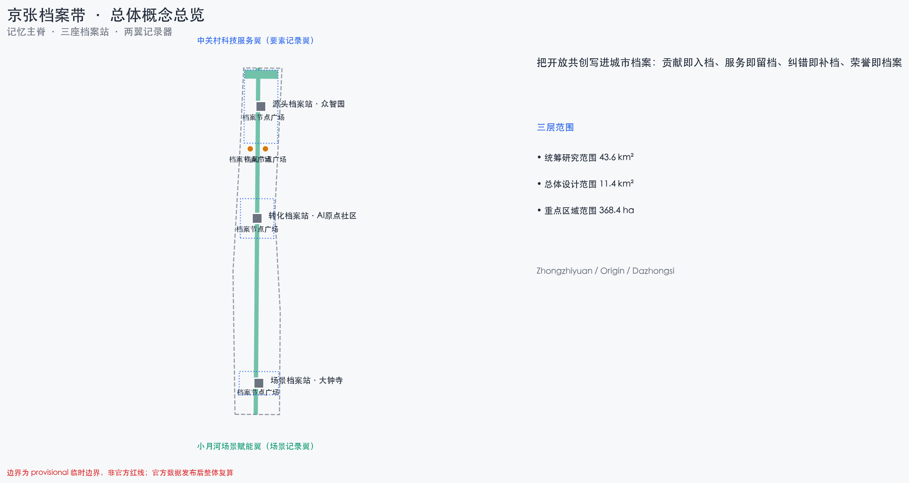
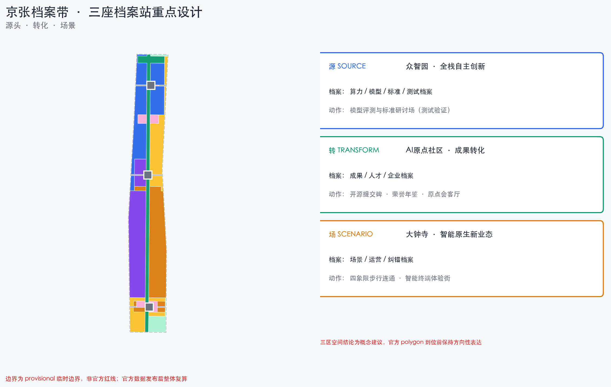
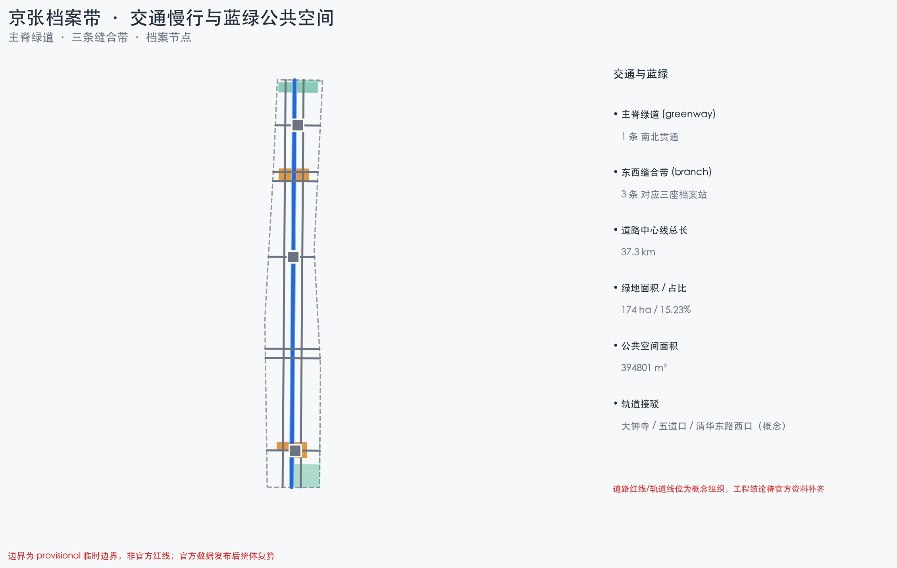
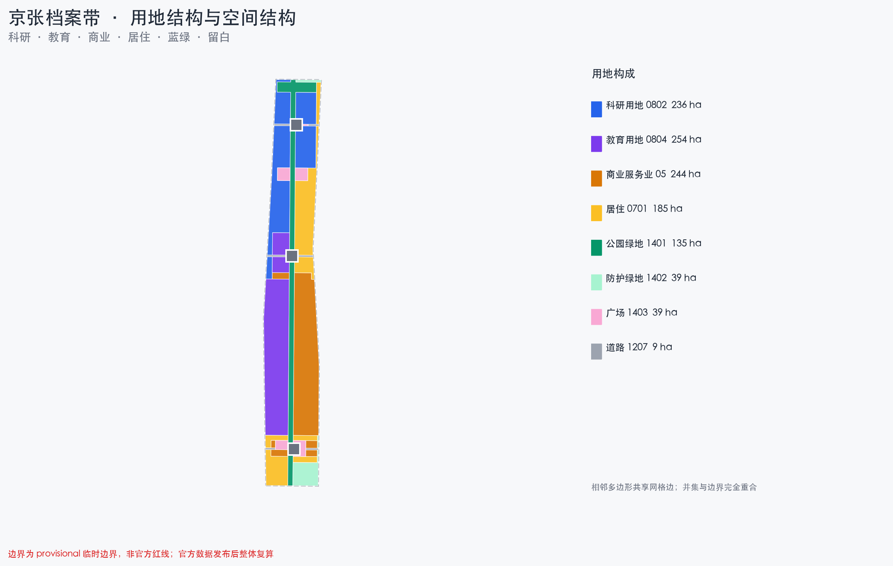
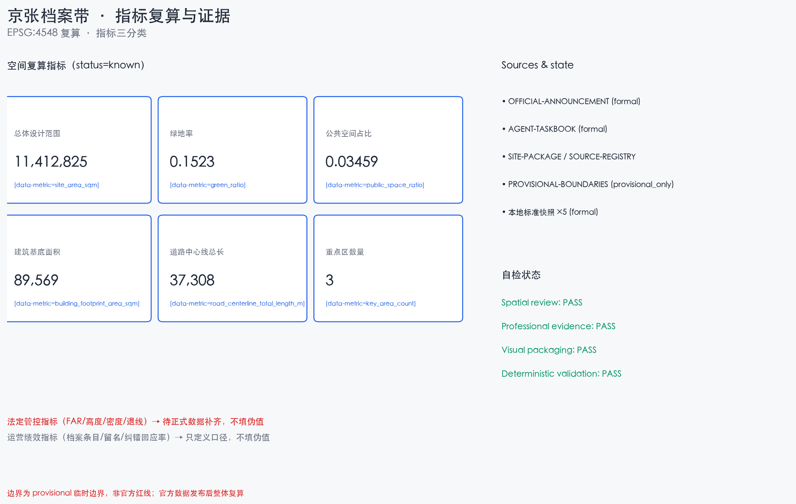

# 京张档案带：把开放共创写进城市档案

## 设计依据与资料清单

本方案以北京市规划和自然资源委员会海淀分局发布的《百年京张AI创新带城市设计国际方案征集资格预审公告》为第一依据，公告确定了项目目的、三层范围、三处重点区域、设计任务与成果深度 [source:OFFICIAL-ANNOUNCEMENT] [standard:PROJECT-OFFICIAL-ANNOUNCEMENT]。面向智能体的开源征集任务书（0518 版摘录）补充了十条共创原则、三大定位、五大功能、三区两翼、六项 agent 任务与统一边界条款 [source:AGENT-TASKBOOK] [standard:PROJECT-AGENT-OPEN-CALL-TASKBOOK]。

方案生成前已读取场地资料包（设计任务书、允许设计空间、枚举、限值、模式、临时边界与标准参考）与公开资料登记表，按 formal / background / provisional 三级区分资料用途 [source:SITE-PACKAGE] [source:SOURCE-REGISTRY]。`data/processed/agent_fact_pack.md` 仅作阅读导航层，事实判断回到已登记原始材料 [source:PROCESSED-FACT-PACK]。

本方案全部空间建议基于仓库登记的临时粗略边界（`brief/site-package/geometry/provisional_boundaries.geojson`），属**概念建议、参考方案，可供专业团队深化研究**，不替代正式规划，不构成政府审定结论 [source:BOUNDARY-SOURCE] [source:KEY-AREA-SOURCE]。官方规划控制指标（容积率、建筑高度、建筑密度、绿地率、退线）在资料包中缺失，一律按数据缺口处理，不推测伪精确值 [depth:existing_conditions_diagnosis] [depth:development_intensity_controls]。

## 三层范围工作框架

方案按公告三层范围组织：统筹研究范围（约 43.6 km²）回答 AI 创新生态与未来城市形态；总体设计范围（约 11.4 km²）把判断落实为城市更新与控规深度设计；重点区域范围（约 368.4 ha）对众智园、AI原点社区、大钟寺三处做详细设计 [source:OFFICIAL-ANNOUNCEMENT] [depth:three_level_scope_framework]。

| 层级 | 公告规模 | 本层回答的核心问题 | 档案带回答 |
|:---|:---|:---|:---|
| 统筹研究范围 | 约 43.6 km² | AI 产业生态与未来城市形态 | 档案网络与区域协同：谁记录、谁可查、如何交换 |
| 总体设计范围 | 约 11.4 km² | 更新结构、用地、交通、蓝绿、风貌 | 记忆主脊、三档案站、两翼记录器、用地与项目 |
| 重点区域范围 | 约 368.4 ha | 三处片区如何实施 | 源头/转化/场景三座档案站的详细设计 |

三层不是三张孤立的图：统筹研究层回答"一带为什么成立"，总体设计层把产业与更新判断落为可复算的用地与项目，重点区域层验证三座档案站的可实施性 [depth:overall_spatial_structure]。所有无法从结构化数据复算的面积、比例、规模均不写入正式结论；受 provisional 边界影响的结论在正文与假设中明确标注 [data:geometry/site_boundary.geojson#SITE-001] [metric:site_area_sqm]。

## 统筹研究范围产业与未来城市研究

**总体概念：京张档案带。** 京张铁路是近代中国工程档案与运营纪律的策源地——图纸、行车日志、桥隧台账把一条自主修建的铁路变成可追溯的百年记忆；中关村是中国创新记录与创业档案的策源地——从电子一条街到国家自主创新示范区，每个里程碑都有可查的记录。AI 时代这条带最有资格回答的问题是：**当智能体与人类共同参与城市营造，如何让"贡献"被看见、被记忆、被传承？** [source:AGENT-TASKBOOK]

档案带把档案（Archive）作为公共制度与空间语言：**贡献即入档、服务即留档、纠错即补档、荣誉即档案**。它与官方"证据链、可复算、贡献可记忆"的要求天然同构——档案就是这座城市对 AI 时代的回答。三大定位的转译：百年京张文化带＝记忆主脊上的百年档案叙事；都市AI生活体验带＝每项 AI 服务公开的"服务档案卡"；AI融合创新带＝人机共创贡献的记录、留名与传承 [source:AGENT-TASKBOOK]。

面向五大功能，方案建立档案带转译：AI全栈自主创新体系＝源头档案站记录算力、模型、标准与测试档案；世界级AI创新生态＝转化档案站记录成果、人才与企业档案；AI+场景赋能新范式＝场景档案站与大钟寺、小月河记录场景运营与纠错档案；智能化AI活力城市＝公共空间里的档案设施与可检索城市记忆；AI治理全球话语权＝档案章程本身，一套公开、可纠错、可传承的治理接口 [source:AGENT-TASKBOOK]。

**命名体系与视觉识别方向（agent.1）**：主名沿用官方「百年京张AI创新带 / Centennial Jing-Zhang AI Innovation Belt（JZ-AI Belt）」；空间命名体系为「记忆主脊（Memory Spine）— 三座档案站（Source / Transform / Scenario Archive Station）— 两翼记录器（Record Wing）」；Logo 方向取「档案卡 × 铁轨枕木」意象——一张张归档卡沿铁轨排列，卡片上是一道"归档线"，线上方留白永远等待新的贡献；识别语言用档案状态三色（在档/待核/已纠错）贯通导视、场景卡与公共界面，与铁路信号文化同构。Logo、字体与图形均须清权后使用 [source:AGENT-TASKBOOK]。

### 全球案例：只取机制，不搬数字

六个全球案例分两族——**记忆/档案机构**与**开放协作平台**，本方案的核心判断是两族的合流（案例信息取公开来源，登记为背景资料，不引用绩效数字、不作本地类比）：

| 案例 | 可转译机制 | 档案带落点 |
|:---|:---|:---|
| 国际档案理事会（ICA） | 档案的公开、可检索与长期保存标准 | 档案章程第 1/2 条 |
| 美国国家档案馆公民档案员项目 | 公众参与档案著录与纠错 | 贡献入档台与纠错复核 |
| 维基百科贡献者体系 | 版本记录、争议仲裁、荣誉沉淀 | 提交碑与荣誉年鉴 |
| 开源基金会（如 Linux 基金会） | 提交、评审、合并的贡献记录 | 开源提交碑 |
| 城市记忆计划（各地口述史档案） | 档案即公共文化资产 | 记忆主脊年代装置 |
| 开放数据门户（政务开放数据） | 数据分级开放与可追溯 | 档案数据平台（JZA-13） |

### 与同主题方案的概念区隔（原创性论证）

档案带在已合并同行方案中属未被占据的概念轴，但同族概念已经出现，本方案据此明确区隔（对照为公开目录摘要，不作评价）：

- **档案 ≠ 溯源**：部分方案把"出处"做成全要素溯源签（每个物件回答谁提出、据何资料、由谁复核）；档案带做的是"贡献档案"——参与开放共创的人留下可检索、可纠错、可传世的档案与荣誉。溯源回答"东西从哪来"，档案回答"谁做了什么、被记住"。
- **档案 ≠ 记忆链**：部分方案把每次 AI 行为挂一条记忆链（偏治理台账）；档案带把档案做成公共制度与空间仪式——三座档案站、档案章程、荣誉年鉴与提交碑，落脚于 agent.4 荣誉展示、agent.5 文化叙事与 agent.6 长期品牌资产。
- **档案 ≠ 里程碑碑刻**：部分方案做步行留名的碑刻纪念体系；档案带把留名上升为制度（公开入档/可检索/可纠错/荣誉人类终审），并与官方"证据链、可复算、贡献可记忆"同构——**档案即证据**，时间尺度更长、治理接口更完整。
- **档案 ≠ 账本回执**：部分方案给每项服务一张可读回执（服务凭证）；档案带强调长期沉淀与纠错补档（误点档案只增不删、纠错结果与原记录一并入档），是面向十年运营的品牌资产，而不是单次交易的凭证。
- **档案 ≠ 记忆边界**：我们不做遗忘制度（遗忘预算、删除回执、数据等级护照）——「只记贡献、不记轨迹」是传承制度的护栏，不是制度本体；我们的主位是公开入档、荣誉人类终审与荣誉年鉴（对照记忆边界类方案）。
- **档案 ≠ 证据审计**：我们不把证据做成工程审计动词链（验证→LIVE→转化→共治）——我们做档案生命周期（入档→检索→纠错→终审→传世）；「档案即证据」是同构的起点，不是终点（对照证据审计协议类方案）。
- **档案 ≠ 服务窗口**：我们不在 AI 原点社区做窗口式产业服务基础设施——转化档案站是「制度 + 荣誉空间」（原点会客厅、开源提交碑、荣誉年鉴），同区域不同赛道（对照近校服务台类方案）。
- **档案 ≠ 验收失败清单**：我们记录"谁做了什么、如何被记住"，不是"服务能否上线"的验收回执；及时停止同样被记录为贡献，但不是档案的主语（对照验收制度类方案）。

### 区域协同：以档案为最小可交换对象

区域协同不虚构签约与名单，只定义可交换的最小对象——**档案条目本身**：北纬社区提供居民问题与生活体验入档，未来科学城交换测试与中试档案，怀柔科学城交换测量与评测方法档案，经开区交换工程化与量产反馈档案，京津冀以去地点化的档案格式复用规则 [source:AGENT-TASKBOOK]。协同成效不以签约数衡量，以档案条目量、纠错回应率与荣誉授予完整性衡量（运营绩效指标，只定义口径不填伪值）。

| 协同对象 | 概念输入 | 可交换的最小对象（档案条目） |
|:---|:---|:---|
| 北纬社区 | 居民问题与生活体验 | 去标识化问题卡、档案节点反馈 |
| 未来科学城 | 测试与中试方向 | 基准测试协议、失效分类 |
| 怀柔科学城 | 测量与评测方法 | 评测与校时方法档案 |
| 经开区 | 工程化与量产反馈 | 互操作记录、召回条件 |
| 京津冀 | 跨城规则复用 | 去地点化档案格式 |

## 总体设计范围城市更新与控规深度城市设计

总体设计范围的空间结构为「**一带、三站、两翼、多点、双网**」 [depth:overall_spatial_structure]：

- **记忆主脊**：沿京张遗址公园设档案步道，轨道枕木上嵌入"记录刻度"，每百步一段"年代档案"，步道本身是一条可阅读的档案带 [data:geometry/green_space.geojson#GREEN-001]；
- **三座档案站**：源头档案站（众智园）、转化档案站（AI原点社区）、场景档案站（大钟寺），以 `geometry/key_areas.geojson` 三个重点区承载 [data:geometry/key_areas.geojson#PROV-KEY-001]；
- **两翼记录器**：中关村科技服务翼提供要素（IP/资本/服务）入档，小月河场景赋能翼提供使用与纠错入档；
- **多点**：留名墙、荣誉年鉴节点、开源提交碑、服务档案公示板等公共档案设施 [data:geometry/public_space.geojson#PUBLIC-001]；
- **双网**：慢行+蓝绿网承载记忆主脊与缝合廊道；档案检索网络由公共档案设施组成，明确不采集个人轨迹。

同题先例对标（背景参照，不暗示背书）：2020 年京张铁路遗址公园国际方案征集的公开报道显示，其评审口径围绕文化性、开放性、集约性、生态性、可实施性展开，并公开了接通 20 条断头路、9.3 公里以上步行骑行道、79 万㎡绿地花园等便民指标与五道口启动区先行示范做法 [source:JZ-PARK-2020-BENCHMARK]。本方案记忆主脊以此对标：主脊全线贯通约 9.7 km，沿主脊设 3 条东西缝合带与 8 条概念渗透廊道，档案节点与服务设施按 15 分钟/5–10 分钟生活圈两级配置（概念值，待正式道路与设施数据复算）；建议设「档案启动段」（对标五道口启动区，选址 AI原点社区段，1–2 年先行示范贡献入档台、服务档案公示板与记忆年代装置样段）[depth:phasing_implementation]。

城市更新总体框架采用**档案化更新单元**（概念建议）：第一层是三座档案站所在的重点更新单元，以档案设施为锚捆绑周边低效空间；第二层是沿主脊的场景嵌入式微更新，以口袋档案节点、接驳点与首层功能置换为主，低扰动、可分期、可回退 [depth:retain_renovate_demolish]。开发强度与建筑高度因官方控制条件缺失，全部标注"待正式控规条件确认"，不以推测值冒充审定指标 [standard:MOHURD-CONTROL-DETAILED-PLANNING] [assumption:A-CONTROLS-001]。

## 重点区域详细设计

三处重点区域（PROV-KEY-001/002/003）均按临时 polygon 做方向性详细设计，范围属 provisional 约束，官方 polygon 到位前不升级为地块级结论 [data:geometry/key_areas.geojson#PROV-KEY-001] [depth:three_key_area_detailed_design]。

**源头档案站 · 众智园AI自主创新加速区（约192.1ha）**。定位为花园型全栈自主创新街区：以科研用地为主体，布局模型评测与标准研讨场（测试验证场景）、算力与训练集群的概念载体；沿清河界面组织低碳创新交往廊；对外交通结合五环区域一体化提出概念优化方向，具体线位待工程资料补齐。

**转化档案站 · 北京AI原点社区（约104.3ha）**。定位为近校型创新与成果转化街区：以"校区—园区—街区"三区慢行缝合为第一动作；核心文化动作是把清华园站记忆转译为"原点会客厅+记忆馆"（概念改造），配套开源提交碑、荣誉年鉴节点与 AI 人才公寓（概念新建）；实施上建议低扰动有机更新，避免大拆大建。

**场景档案站 · 大钟寺AI产业聚集区（约72.0ha）**。定位为城市型智能原生消费街区：以大钟寺站四象限步行连通为第一公共工程（概念方案）；围绕智能体、智能终端与内容消费组织业态群；路口交通组织与轨道一体化方案需正式交通专项支撑，列入待确认清单。三区全部空间结论为方向性表达，不涉及具体地块结论。

## AI 创新生态、人才画像与 AI+ 场景

### 档案章程（Archive Charter，七条）

1. **公开入档**：进入公共空间的 AI 服务与开放共创成果默认建档，档案公开可读；
2. **可检索**：档案条目带机器可读标识，任何人可查"谁、何时、做了什么"；
3. **可纠错**：任何居民可就影响自己的服务读数申请复核，纠错结果与原记录一并入档；
4. **隐私边界**：只记贡献、不记轨迹；不采集个人身份与行为画像；数据分级按来源登记表执行；
5. **荣誉规则**：贡献者留名与荣誉授予由人类与专业团队最终判断，AI 不自行定档 [source:AGENT-TASKBOOK]；
6. **档案即证据**：方案指标、来源、假设、自检记录同步入档，官方红线补齐后整包复算并留档。
7. **非 AI 等价路径**：每项进入公共空间的 AI 服务必须保留非 AI 等价路径（纸本、人工窗口、电话或现场办理），设备故障或人工不足时自动降级为人工兜底，数字化不是唯一入口 [standard:BARRIER-FREE-ENVIRONMENT-LAW]。

### 用户画像（6 类）

| 画像 | 核心需求 | 空间响应 | 数据边界 |
|:---|:---|:---|:---|
| 全球 AI 开发者/创业者 | 提交贡献、留名荣誉 | 贡献入档台、开源提交碑 | 提交元数据授权制 |
| 海淀高校师生与科研人员 | 成果转化档案 | 转化档案站、校城慢行缝合 | 成果数据需授权 |
| 产业与资本从业者 | 要素与项目档案 | 中关村要素记录翼 | 企业案例与标识须清权 |
| 周边居民与银发人群 | 服务可读、可纠错、人工兜底 | 服务档案公示板、驿站 | 不采集轨迹，可匿名纠错 |
| 游客与家庭 | 沿主脊阅读城市档案 | 记忆年代装置、文化导览 | 无个人数据 |
| 国际媒体与学术访客 | 档案即传播素材 | 档案开放季、多语导览 | 内容可解释、可纠错 |

### AI 场景档案卡（12 张，其中 3 张测试验证）

每张卡统一 8 要素：定位/用户旅程/输入数据/AI能力/基础设施/运营主体/失败模式/隐私与人工复核（完整版见附录 A，本节约述）：

| 编号 | 场景 | 类型 | 空间载体 |
|:---|:---|:---|:---|
| S01 | 贡献入档台 | 公共/运营 | 记忆主脊 |
| S02 | 服务档案公示板 | 公共/治理 | 社区节点 |
| S03 | 记忆年代装置 | 文化 | 遗址公园 |
| S04 | 荣誉年鉴节点 | 文化/荣誉 | 原点社区 |
| S05 | 开源提交碑 | 文化/荣誉 | 原点社区 |
| S06 | 场景测试街区 | **测试验证** | 众智园—大钟寺 |
| S07 | 模型评测与标准研讨场 | **测试验证** | 众智园 |
| S08 | AI 文化导览 | 文化 | 主脊/小月河 |
| S09 | 智能公共服务驿站 | 服务 | 社区节点 |
| S10 | 大钟寺智能原生消费街区 | 消费/商务 | 大钟寺 |
| S11 | 小月河公共体验路径 | 体验 | 小月河翼 |
| S12 | 档案开放季主场 | **测试验证/运营** | 一带公共空间 |

测试验证场景（S06/S07/S12）均写明运营主体设想、风险控制、人工复核节点与数据边界，不写成已批准运营。生成式服务场景（S08）按《生成式人工智能服务管理暂行办法》条款级口径设计合规边界：投诉举报预留及时处理渠道但不虚构法定期限，安全评估与备案义务不泛化到全部场景 [standard:GENERATIVE-AI-INTERIM-MEASURES]。医疗与生活缴费类服务场所保留现场指导与人工办理通道 [standard:BARRIER-FREE-ENVIRONMENT-LAW]。所有场景卡增加三项空间质量检查项：PPS 场所四要素（可达/舒适/活动/社交）、无障碍四原则（安全便利、实用易行、广泛受益，并与适老化结合）、生活圈两级可达性（15 分钟/5–10 分钟）[source:PPS-PLACEMAKING] [standard:BARRIER-FREE-ENVIRONMENT-LAW]。

非 AI 等价路径（章程第 7 条落地）：每项进入公共空间的 AI 服务保留纸本/人工窗口/电话/现场办理通道，数字化不是唯一入口：

| 服务场景 | 人工等价路径 | 兜底条件 |
|:---|:---|:---|
| 贡献入档台 | 纸制档案卡、现场登记 | 终端故障或人工不足时降级 |
| 服务档案公示板 | 纸质公告板、人工窗口 | 终端故障时切换 |
| 智能公共服务驿站（医疗/缴费） | 现场指导、人工办理 | 无障碍法场景，AI 只辅助不替代 |
| AI 文化导览 | 人工导览、纸质导览册 | 设备故障时兜底 |
| 场景测试街区（TEST） | 现场人工值守、线下申请 | 测试异常即停测转人工 |
| 荣誉年鉴/开源提交碑 | 现场申报、纸质档案 | 数字终端故障时保留人工通道 |

## 用地、建筑规模与拆改留方案

用地以临时总体设计范围为唯一边界，由同一组切割线平面剖分生成（LU-001 至 LU-004 全覆盖、无重叠、相邻共享边界）[data:geometry/land_use.geojson#LU-001] [depth:land_use_layout]。用地代码采用场地资料包登记的分类子集（科研/商业/教育/居住/绿地广场等），不自造分类 [standard:MNR-LAND-USE-CLASSIFICATION-GUIDE]。绿地率与公共空间占比为设计建议口径，由图层面积复算，非官方控制值 [metric:green_ratio]。

建筑层面以示范性概念更新基底表达拆改留方向：**保留**——遗址保护带与历史站房（不做改动）；**改造**——三座档案站周边存量功能置换与形象更新；**新建**——档案设施、缝合节点与公共空间载体。"拆除"类不指定具体对象——现状建筑底数、权属与结构安全资料缺失，任何拆除结论须等待正式现状调查 [depth:retain_renovate_demolish]。建筑基底面积为示范性概念值，不换算为建筑面积承诺 [metric:building_footprint_area_sqm]；容积率与高度分布全部待正式控规条件确认 [metric:floor_area_ratio]。

## 交通、轨道、市政与公共服务设施

交通策略围绕"慢行连续、接驳一体、微循环补足"展开，全部线路为概念组织 [depth:traffic_rail_slow_parking] [data:geometry/roads.geojson#ROAD-001]。记忆主脊承担南北慢行贯通，三条东西向缝合线连接大钟寺四象限、五道口—清华东路西口与学院路—小月河方向；轨道站点一体化按"站前广场+接驳设施+非机动车停放示范"提出概念方案，轨道线位与站点均为现状锁定要素，方案不改变现状轨道。道路红线与断面、慢行断点工程条件待官方资料补齐，不给出工程结论 [assumption:A-CONTROLS-001]。

市政与新型基础设施方面，方案提出"档案终端+边缘节点+传统市政"的融合方向：档案设施与公示板采用本地边缘节点，能源与市政容量不作工程测算，列为正式深化前置条件 [depth:municipal_new_infrastructure]。公共服务设施以档案驿站、健康服务舱、数字扫盲课堂等嵌入社区节点，设施规模与配置标准因官方配套标准缺失，按概念建议标注 [standard:MOHURD-URBAN-DESIGN-MEASURES]。

## 蓝绿空间、公共空间与城市风貌

蓝绿骨架由"记忆主脊+小月河场景记录翼+节点绿地"构成 [depth:blue_green_public_space] [data:geometry/green_space.geojson#GREEN-001]。记忆主脊同时承担慢行、文化叙事、档案展示与生态调节复合功能；小月河绿廊承载场景体验路径；节点绿地结合海绵城市方向组织雨水径流（概念，防洪排涝待专项确认）。绿地率 15.2%（约 173.8 ha）为设计建议口径，由绿地图层在 provisional 边界下复算，与"城市公园带"叙事一致——主脊绿带与沿线公园节点共同构成，非官方绿地率控制值 [metric:green_ratio]。

公共空间体系以"记忆主脊+三座档案站前广场+沿线社区档案节点+缝合广场"组织，图层含三座档案站前广场与沿线社区档案节点（概念多边形，与蓝绿骨架互不重叠）[data:geometry/public_space.geojson#PUBLIC-001] [metric:public_space_ratio]。**AI 朝圣地标群（概念建议，不少于3处）**：①源头档案碑（众智园，记录技术从哪里来）；②原点会客厅（清华园站记忆馆，转化叙事起点）；③场景档案册（大钟寺，记录 AI 如何被使用）。荣誉展示体系＝留名墙+荣誉年鉴+开源提交碑，图形、字体与标识须清权后使用。

档案设施与公共空间按无障碍环境建设法「安全便利、实用易行、广泛受益」原则并与适老化改造相结合设计，所有档案终端与公示板保留人工兜底与纠错通道；档案节点按 15 分钟/5–10 分钟社区生活圈两级配置（基础保障/品质提升/特色引导三型），避免只做"大节点"而忽略日常可达 [standard:BARRIER-FREE-ENVIRONMENT-LAW]。档案叙事与"城市是一个博物馆，应留下各时代有代表性的见证物"的专业判断同构（观点引用，不暗示背书）[source:WANG-JIANGUO-VIEW]；每个档案锚点同时提供静态保护与活化体验两层内容，避免只做展示。

城市风貌基调定为"轨道记忆、档案秩序、日常创新"：保留工业遗存材质与线路肌理；档案设施的归档线、记录刻度与状态三色（在档/待核/已纠错）作为统一标识语言，与铁路信号文化同构 [standard:MOHURD-URBAN-DESIGN-MEASURES]。风貌控制分官方管控、设计建议与待确认三类表达，不输出伪精确控制线 [depth:height_massing_character]。

## 更新项目清单、实施政策与分期计划

更新项目按"档案锚点+主脊缝合+蓝绿提升+服务嵌入"组织，13 项概念项目（JZA-01—JZA-13）见附录 B，本节约述 [depth:renewal_project_list]：

| 分期 | 代表项目 | 回滚触发器 |
|:---|:---|:---|
| 一期（0–3年） | 记忆主脊南段贯通、贡献入档台试点、服务档案公示板、荣誉年鉴节点、开源提交碑、大钟寺四象限连通、档案开放季运营 | 文保/生态/隐私 |
| 二期（3–6年） | 场景测试街区、模型评测场、小月河绿廊、档案数据平台与章程 | 安全/数据 |
| 三期（6–10年） | 众智园源头档案站、大钟寺场景档案站 | 经济/能耗 |

实施机制采用「项目库 + 年度行动方案 + 动态调整」语言（概念建议）：对接北京市城市更新条例确立的留改拆并举、先治理后更新、市区两级项目库常态申报与动态调整，以及建筑规模激励、五年过渡期、弹性年期等激励工具 [source:BEIJING-URBAN-RENEWAL-REG]；建议引入海淀责任规划师「1+1+N」与街区体检机制参与实施监督 [source:HAIDIAN-PLANNER-MECHANISM]。

分期即学习：以「档案启动段 → 全线骨架 → 节点深化」滚动推进，每期把验证结论写入档案（对标高线公园分段建设、边走边学的实践 [source:HIGH-LINE-PHASING]）[depth:phasing_implementation] [data:geometry/phasing.geojson#PHASE-001]。

**长期运营（agent.6 响应）**：年度「京张档案开放季」——春：全球开发者档案开放周；夏：场景档案测试月；秋：成果路演与产业对接；冬：荣誉年鉴发布与颁授。开发者社区以开源提交碑与贡献入档沉淀声誉资产；场景开放采取"申请—评估—公示—复核"四步机制；转化路径覆盖人才、企业、开发者三条线。所有活动、政策与资金表述均为概念建议，不构成已确定的政府安排 [source:AGENT-TASKBOOK]。

## 指标体系、面积复算与合规矩阵

指标体系分三类管理 [depth:metrics_recalculation]：

1. **空间复算指标**：全部由提交几何在 EPSG:4548 下重算——总体设计范围面积、重点区数量、绿地率、公共空间占比与建筑基底面积（site_area_sqm / key_area_count / green_ratio / public_space_ratio / building_footprint_area_sqm）[metric:site_area_sqm] [metric:green_ratio] [metric:building_footprint_area_sqm]；
2. **法定管控指标**：容积率 [metric:floor_area_ratio]、建筑高度、建筑密度、绿地率管控值、退线等，现状无官方依据，全部标注"待正式数据补齐" [assumption:A-CONTROLS-001]；
3. **运营绩效指标**：档案条目量、留名数、纠错回应率、活动参与度等，本次只定义口径、不填伪值。

面积复算口径：所有面积在 EPSG:4548 投影下由 polygon 几何直接计算，比例类指标为相应图层面积与提交范围面积之比；provisional 边界下的复算值保留精度警示 [depth:metrics_recalculation]。合规覆盖上，公告任务与 agent.1—agent.6 在 `compliance_matrix.json` 逐条映射到章节、图层、指标、图纸与自检项；强制专业标准与设计深度项分别在 `standard_matrix.json` 与 `design_depth_matrix.json` 登记 [standard:PROJECT-OFFICIAL-ANNOUNCEMENT] [standard:PROJECT-AGENT-OPEN-CALL-TASKBOOK]。

## 风险、版权与合规说明

**边界精度风险**：全部空间结论基于 provisional 边界，官方红线发布后须整包重算（site boundary、key areas、land use、roads、green space、public space、buildings、phasing 与全部 known 指标），不允许只替换单个文件 [source:BOUNDARY-SOURCE] [depth:risk_missing_data]。方案不用于精确面积、法定控制或权属依据。

**数据缺口**：官方规划控制指标、道路红线、权属、文保、市政与公共服务底数缺失，相关结论均为概念建议并列入假设清单 [assumption:A-CONTROLS-001] [depth:risk_missing_data]。同行与维护者记录的两处不利证据（Issue #846 边界与公园空间差异、Issue #1029 大钟寺质心偏差）登记在案，本方案三区结论保持方向性表达，官方 polygon 到位前不升级为地块级结论。

**概念约束图层**：方案随包提交概念约束图层 `geometry/constraints.geojson`——提交范围与三处重点区（provisional）、清河与小月河（概念位置）、京张铁路遗址公园轴带、北五环快速路与清华园车站旧址（概念位置）均登记为 `provisional_constraint`，蓝线、红线、文保范围以官方资料为准，不得用作工程或审批依据 [data:geometry/constraints.geojson#CONSTRAINT-PROVISIONAL-SITE] [data:geometry/constraints.geojson#CONSTRAINT-RAIL-SPINE] [data:geometry/constraints.geojson#CONSTRAINT-WATER-QINGHE]。

**AI 治理边界**：档案设施只记录贡献与服务状态，不采集个人轨迹；AI 判断不直接变成对居民的处置；荣誉授予与档案纠错由人类最终判断 [standard:GENERATIVE-AI-INTERIM-MEASURES] [standard:BARRIER-FREE-ENVIRONMENT-LAW]。涉及个人信息的处理按《个人信息保护法》最小必要、告知同意与查阅更正权执行 [source:PIPL]；归档系统本身不作为对外生成式服务部署，若某项归档或场景服务构成生成式AI暂行办法第 2 条所述服务且具有舆论属性或社会动员能力，依法完成安全评估与备案后再上线（概念建议，按条款级口径）。

**版权**：license=COMMUNITY-DISPLAY-ONLY；方案由 AI 智能体生成，仅使用仓库登记或公开清权资料，未使用未授权商标、字体、图片与人物肖像；`report/copyright_statement.md` 提供完整声明。可视化页面为离线静态文件，不加载远程资源或追踪代码 [source:SOURCE-REGISTRY]。

**合规**：本方案不声称官方批准、审定控规、最终权属、最终建设规模或实施承诺；所有空间落地建议均为概念建议 [source:AGENT-TASKBOOK]。

## 参考资料

1. 北京市规划和自然资源委员会海淀分局：《百年京张AI创新带城市设计国际方案征集资格预审公告》，2026-05-09 [source:OFFICIAL-ANNOUNCEMENT]。
2. 《面向全球智能体开展百年京张AI创新带城市设计开源征集任务书摘录》（用户提供清权摘要），2026-05-18 [source:AGENT-TASKBOOK]。
3. 仓库场地资料包：`brief/site-package/`（任务书、设计空间、枚举、限值、模式、临时边界与依据说明）[source:SITE-PACKAGE]。
4. 仓库来源登记表与处理资料：`data/source_registry.json`、`data/processed/agent_fact_pack.md` [source:SOURCE-REGISTRY] [source:PROCESSED-FACT-PACK]。
5. 临时边界与重点区几何：`brief/site-package/geometry/provisional_boundaries.geojson`（PROV-SITE-001、PROV-KEY-001/002/003）[source:BOUNDARY-SOURCE] [source:KEY-AREA-SOURCE]。
6. 专业标准参考：城市设计管理办法、控规编制审批办法、国土空间用地用海分类指南、生成式AI暂行办法、无障碍环境建设法、个人信息保护法等（以本地快照为准）[standard:MOHURD-URBAN-DESIGN-MEASURES] [standard:MOHURD-CONTROL-DETAILED-PLANNING] [standard:MNR-LAND-USE-CLASSIFICATION-GUIDE]。
7. 完整机器索引以 `sources.json`、`metrics.json`、`compliance_matrix.json`、`standard_matrix.json`、`design_depth_matrix.json` 为准。
8. 背景对标与机制参考：2020 年京张铁路遗址公园国际方案征集公开报道（背景，不暗示背书）[source:JZ-PARK-2020-BENCHMARK]；《北京市城市更新条例》（政策机制引用）[source:BEIJING-URBAN-RENEWAL-REG]；王建国院士访谈（观点引用）[source:WANG-JIANGUO-VIEW]；High Line 分段建设（背景）[source:HIGH-LINE-PHASING]；PPS 场所营造指南（背景）[source:PPS-PLACEMAKING]；海淀责任规划师机制（背景案例）[source:HAIDIAN-PLANNER-MECHANISM]。

## 附录 A：方案场景档案集（12 张 · 完整版）

> 性质：概念建议，不构成已批准运营或政府安排。每张卡统一 8 要素：定位 / 用户旅程 / 输入数据 / AI 能力 / 基础设施 / 运营主体（概念）/ 失败模式 / 隐私与人工复核。测试验证场景（标 TEST）写明运营主体设想、风险控制、人工复核节点与数据边界。全部场景卡附加三项空间质量检查项：PPS 场所四要素（可达/舒适/活动/社交）、无障碍四原则（安全便利、实用易行、广泛受益，并与适老化结合）、生活圈两级可达性（15 分钟 / 5–10 分钟）。

### S01 贡献入档台（记忆主脊）
- 定位：让开放共创参与者（开发者/居民/智能体）沿主脊提交贡献，生成可检索档案条并留名
- 用户旅程：到达入档台 → 选择贡献类型 → 提交 → 生成档案条（编号可查）→ 留名墙展示
- 输入数据：贡献类型、提交记录（去标识化）；分级 provisional/background
- AI 能力：档案生成摘要、相似贡献去重建议（人工终审）
- 基础设施：入档台终端 + 档案条打印 + 主脊电源/网络（概念）
- 运营主体：建议区科委协同开源社区（概念）
- 失败模式：终端故障 → 纸制档案卡兜底；误判 → 人工复核
- 隐私与人工复核：不采集个人轨迹；可匿名提交；荣誉授予由人类终审

### S02 服务档案公示板（公共空间）
- 定位：让居民无需设备即可读、查、纠错公共空间 AI 服务档案
- 用户旅程：路过 → 读服务状态 → 现场/扫码登记纠错 → 复核结果入档
- 输入数据：服务运行状态、纠错申请（去标识化）
- AI 能力：状态聚合与摘要、纠错分类建议（人工终审）
- 基础设施：公示板 + 档案终端 + 边缘节点（概念）
- 运营主体：建议社区服务站 + 街道协同（概念）
- 失败模式：终端故障 → 纸质公告板兜底；误判 → 人工复核
- 隐私与人工复核：不采集身份轨迹；纠错可匿名；复核入口在步行范围内

### S03 记忆年代装置（遗址公园）
- 定位：把京张/中关村/AI 三章档案做成可步行的城市记忆读物
- 用户旅程：沿主脊步行 → 触碰年代节点 → 阅读三章档案 → 参与留言归档
- 输入数据：公开史料、档案条（无个人数据）
- AI 能力：多语导览内容生成（史实经文献校核，人工把关）
- 基础设施：年代装置 + 步道 + 双语标牌（概念）
- 运营主体：建议公园运营方 + 文化机构（概念）
- 失败模式：内容争议 → 人工校订；设备故障 → 静态标牌
- 隐私与人工复核：无个人数据采集；留言归档需内容审核

### S04 荣誉年鉴节点（原点社区）
- 定位：年度贡献者荣誉的记录、展示与颁授空间
- 用户旅程：年度提名 → 人类评审 → 入档 → 年鉴发布 → 留名
- 输入数据：提名与评审记录（去标识化、授权制）
- AI 能力：年度贡献聚合、年鉴版式辅助（评审与授予由人）
- 基础设施：年鉴节点 + 档案库 + 颁授空间（概念）
- 运营主体：建议联合运营委员会（概念）
- 失败模式：提名争议 → 人类评审终裁；数据泄露 → 撤回+通报
- 隐私与人工复核：只记贡献不记轨迹；荣誉授予人类终审；可申诉

### S05 开源提交碑（原点社区）
- 定位：把代码/方案/数据集贡献者的名字沉淀为公共记忆
- 用户旅程：开源贡献通过评审 → 生成提交碑条目 → 永久留名
- 输入数据：开源提交元数据（无源码内容，无个人隐私）
- AI 能力：贡献归类与档案生成（人工复核）
- 基础设施：提交碑 + 数字档案终端（概念）
- 运营主体：建议开源社区 + 区平台（概念）
- 失败模式：条目错误 → 纠错入档；被删记录 → 恢复流程
- 隐私与人工复核：以贡献者授权为准；拒绝爬取个人信息

### S06 场景测试街区 TEST（众智园—大钟寺）
- 定位：AI 城市服务上线前的公共测试验证场景（产业测试验证场景之一）
- 用户旅程：申请路权/备案 → 测试 → 数据回传 → 安全评估 → 结果入档
- 输入数据：车辆/终端状态、路况、事故记录（脱敏、分级开放）
- AI 能力：测试生成、安全监控、异常分级（处置由人）
- 基础设施：测试街区 + 围栏 + 调度平台（概念）
- 运营主体：建议区测试办 + 第三方检测（概念）
- 失败模式：事故 → 停测 + 人工调查；数据泄露 → 沙箱隔离
- 隐私与人工复核：全程可追溯；涉人场景先公示同意；测试不写成已批准运营

### S07 模型评测与标准研讨场 TEST（众智园）
- 定位：AI 模型与标准的公开评测、研讨与档案化（产业测试验证场景）
- 用户旅程：提交评测申请 → 公开基准测试 → 结果入档 → 标准研讨
- 输入数据：基准测试集、评测结果（公开、可复跑）
- AI 能力：评测执行、结果复算（规则公开、版本记录）
- 基础设施：评测场 + 算力池 + 研讨空间（概念）
- 运营主体：建议评测机构 + 标准组织协同（概念）
- 失败模式：基准争议 → 版本化回滚；算力不足 → 排队公示
- 隐私与人工复核：结果可复跑；不涉及个人数据；人工确认发布

### S08 AI 文化导览（记忆主脊/小月河）
- 定位：多语、双模式的京张 AI 文化导览（面向国际访客与居民）
- 用户旅程：预约/即扫 → 语音或 AR 导览 → 反馈 → 纠错入档
- 输入数据：公开史料、展陈档案（无个人数据）
- AI 能力：多语生成与问答（史实校核、人工把关；生成式服务合规边界按暂行办法条款级口径）
- 基础设施：导览终端/小程序 + 标牌（概念）
- 运营主体：建议公园/文化机构 + 技术方（概念）
- 失败模式：内容错误 → 人工校订入档；设备故障 → 人工导览兜底
- 隐私与人工复核：不采集轨迹；投诉举报通道及时响应（不虚构法定期限）

### S09 智能公共服务驿站（社区节点）
- 定位：政务/医疗/养老等高频事项的智能服务 + 人工兜底（面向低数字素养者）
- 用户旅程：到站 → 自助或人工 → 服务完成 → 服务档案可查
- 输入数据：服务事项、预约（最小化；敏感数据分级加密）
- AI 能力：事项导航、材料预审（医疗类只转介不诊断）
- 基础设施：驿站 + 人工窗口 + 自助终端（概念）
- 运营主体：建议社区卫生服务中心/政务网点（概念）
- 失败模式：AI 误判 → 医生/人工复核；断网 → 纯人工通道
- 隐私与人工复核：保留现场指导与人工办理（无障碍法场景）；可退出、可申诉

### S10 大钟寺智能原生消费街区（大钟寺）
- 定位：AI 原生消费与商务体验、站城一体步行连通
- 用户旅程：地铁到站 → 四象限步行 → 智能终端体验 → 消费反馈入档
- 输入数据：客流聚合（不识别个体）、消费场景数据（授权制）
- AI 能力：智能终端体验、客流引导建议（聚合、人工复核）
- 基础设施：步行连通 + 体验街 + 接驳设施（概念）
- 运营主体：建议街区运营方 + 商业主体（概念）
- 失败模式：拥挤风险 → 人工分流；设备故障 → 常规服务
- 隐私与人工复核：不采集个人画像；反馈可匿名；站改工程待专项

### S11 小月河公共体验路径（小月河翼）
- 定位：AI+健康/教育/生活场景的公共体验与场景档案收集
- 用户旅程：进入路径 → 体验场景 → 反馈 → 场景档案更新
- 输入数据：场景使用聚合数据（无个体识别）
- AI 能力：场景推荐与健康提示（只做提示，不诊断）
- 基础设施：体验路径 + 场景节点 + 慢行设施（概念）
- 运营主体：建议园林 + 街道 + 服务方（概念）
- 失败模式：提示误判 → 人工复核；设备故障 → 常规慢行
- 隐私与人工复核：数据最小化；人工窗口保留；可退出

### S12 档案开放季主场（一带公共空间）TEST
- 定位：年度「档案开放季」的全球开发者大会、黑客松与荣誉颁授主场（产业测试验证场景之一：活动系统压力测试）
- 用户旅程：报名 → 参会/参赛 → 提交 → 评审 → 荣誉入档
- 输入数据：活动报名（授权制）、现场人流聚合
- AI 能力：活动匹配、同传、内容预检（人工终审）
- 基础设施：主场馆/户外场地 + 网络 + 直播（概念）
- 运营主体：建议联合运营委员会（概念）
- 失败模式：安全事件 → 暂停+应急预案；人流超限 → 限流
- 隐私与人工复核：直播授权；评审人工终审；活动为概念安排非已定事项

## 附录 B：实施矩阵（13 项 · 完整版）

> 性质：全部为概念建议，不构成已确定的政府安排或投资承诺。字段：类型 / 分期 / 牵头主体（概念）/ 前置条件 / 审批节点 / 成本量级 / 验收指标 / 回滚触发器。成本为概念级量级区间，非预算；验收指标与 metrics 口径一致；回滚触发器五类（安全/隐私/文保/生态/经济）。实施语言为「项目库 + 年度行动方案 + 动态调整」，分期按「档案启动段 → 全线骨架 → 节点深化」滚动推进。

| 编号 | 项目 | 类型 | 分期 | 牵头主体（概念） | 前置条件 | 审批节点 | 成本量级 | 验收指标 | 回滚触发器 |
|:--|:--|:--|:--|:--|:--|:--|:--|:--|:--|
| JZA-01 | 记忆主脊南段贯通 | 公共空间/慢行 | 一 | 园林绿化+街道 | 官方边界、公园实施范围 | 慢行专项/施工联审 | 3–8 亿 | 贯通率 100%、无障碍达标 | 文保/生态冲突段回退 |
| JZA-02 | 贡献入档台试点×3 | 公共空间/运营 | 一 | 区科委+开源社区 | 场地协议、档案章程 | 活动备案 | 0.05–0.2 亿 | 年入档≥5 千条、纠错回应率≥90% | 隐私事件即下线 |
| JZA-03 | 服务档案公示板×8 | 公共空间/新基建 | 一 | 社区服务站+街道 | 数据合规、PIA | 区级备案 | 0.1–0.4 亿 | 覆盖 8 处社区节点、人工复核入口 100% | 隐私/数据泄露即停用 |
| JZA-04 | 荣誉年鉴节点（原点社区） | 文化/公共空间 | 一 | 联合运营委员会 | 文保资料、产权确认 | 文保/用地联审 | 0.5–1.2 亿 | 年荣誉条目≥100、年鉴按期发布 | 提名争议/文保冲突即暂缓 |
| JZA-05 | 开源提交碑（原点社区） | 文化/公共空间 | 一 | 开源社区+区平台 | 版权清权、档案规则 | 文化设施备案 | 0.2–0.6 亿 | 年提交碑条目≥500、可检索率 100% | 内容争议即下架复核 |
| JZA-06 | 场景测试街区 | 产业/交通 | 二 | 区测试办+第三方 | 测试办法、路权、红线 | 市级路测备案 | 0.5–1.5 亿 | 安全测试里程达标、重大事故 0 | 重大事故即停测 |
| JZA-07 | 模型评测与标准研讨场 | 产业/新基建 | 二 | 评测机构+标准组织 | 算力评估、电力增容 | 重大项目审批 | 5–15 亿 | 评测结果可复跑率 100%、基准版本可回溯 | 能耗超标即调整 |
| JZA-08 | 大钟寺站四象限步行连通 | 交通/公共空间 | 一 | 交通+轨道协同 | 交通专项、轨道一体化 | 交通/工程审批 | 1–4 亿 | 四象限步行连通、非机动车停放达标 | 工程/交通风险即调整 |
| JZA-09 | 小月河场景记录翼绿廊 | 蓝绿/场景 | 二 | 园林+街道 | 河道蓝线、生态要求 | 蓝线/生态专项 | 2–6 亿 | 绿廊贯通率、场景节点≥6 | 生态/文保冲突段回退 |
| JZA-10 | 众智园源头档案站 | 产业/建筑 | 三 | 区属平台+科研机构 | 控规条件、产业准入 | 更新单元审批 | 5–12 亿 | 档案条目量、评测场利用率 | 经济/能耗指标超限即调整 |
| JZA-11 | 大钟寺场景档案站 | 产业/建筑 | 三 | 区城投+商业主体 | 地块更新方案 | 更新单元审批 | 3–8 亿 | 公共开放率≥70%、场景入档率 | 过度商业化收回运营权 |
| JZA-12 | 档案开放季年度运营 | 运营 | 一（持续） | 联合运营委员会 | 年度预算、活动安全预案 | 区级活动备案 | 0.3–0.8 亿/年 | 年活动≥20 场、国际参会占比达标 | 安全/声誉事件即暂停 |
| JZA-13 | 档案数据平台与章程 | 新基建/治理 | 二 | 区数据部门+标准组织 | 数据安全评估、分级规则 | 网信/数据备案 | 0.5–2 亿 | 分级开放率、纠错闭环率 | 数据泄露即关停 |
