# Ordinary City First: AI Spatial Depth (Design Candidate)

> **ORDINARY CITY FIRST**\
> AI of different types, public exposure, and risk enters the ordinary city at different spatial depths.\
> This is a study-level design candidate, not a statutory plan, engineering design, approved project, investment commitment, or implementation timetable.

## 1. Design Basis and Source List

The official call's three scope levels, three areas and two wings, and formal deliverable requirements define the task boundary. The six tasks in the Agent taskbook define the content checklist. The announced overall design scope is approximately 1,140 hectares, while the three published key-area magnitudes are approximately 192.1, 104.3, and 72.0 hectares. These are published textual facts, not precise area evidence for the current provisional polygons. [source:official-announcement] [source:agent-taskbook] [metric:published_overall_design_scope_area_sqm]

The authority layer uses four statuses: traceable public facts, source-backed site context, design candidates, and pending official data. The nine GeoJSON layers remain the machine-audit layer. Site and key-area polygons are explicitly provisional rough constraints. OSM supports only road, blue-green, and auxiliary-anchor research; it does not establish ownership, entrances, accessible continuity, project locations, or approvals. [source:provisional-boundaries] [source:openstreetmap-context-20260811] [data:geometry/site_boundary.geojson#SITE-PROV-001]

Official Haidian sources support the policy context for technology transfer, innovation and talent services at AI Origin, renewal context at Zhongzhiyuan and Dazhongsi, completion of the Jingzhang Phase II supporting works, and one real retail embodied-system case. They do not prove available rooms, responsible organisations, facility capacity, or merchant consent for this proposal. [source:haidian-tech-transfer-policy] [source:ai-origin-community] [source:jingzhang-phase-two-completion]

AI in public-facing space must meet accessibility, non-digital alternative, human takeover, maintenance, and exit requirements. Where the official architectural-depth file is unavailable, the proposal does not claim engineering completeness; later professional teams must verify building, fire, structure, MEP, and operating capacity. [source:accessibility-law] [standard:MOHURD-ARCH-DESIGN-DEPTH-2016] [depth:risk_missing_data]

## 2. Three-Level Scope Framework

The three scope levels are not three competing schemes. The coordinated research scope asks how land, space, industry, funding, talent, computing, data, and scenarios cooperate. The overall design scope asks how the ordinary-city base stays continuous. The key areas show how one Spatial Depth principle produces three different spatial grammars. [standard:PROJECT-OFFICIAL-ANNOUNCEMENT] [depth:three_level_scope_framework]

The hierarchy has only three levels. L1 is Ordinary City First. L2 contains four invariants: Ordinary Continuity, Human Takeover, Recovery & Removal, and Evidence Status. L3 is `Pilot → Measure → Human Review → Keep / Adjust / Remove → Separately Consider Scale`. Evidence First is the evidence method across the hierarchy, not a second brand, and software A/B testing is not equated with urban planning.

The ordinary-city base includes walking, cycling, transit, commerce, culture, rest, shade, accessibility, human help, and maintenance. Daily-use elements in the diagrams are a conceptual urban-use layer, not claims that the current site already provides them. Basic city functions must remain when every AI node is closed. [data:geometry/roads.geojson#ROAD-OSM-PRIMARY] [depth:existing_conditions_diagnosis]

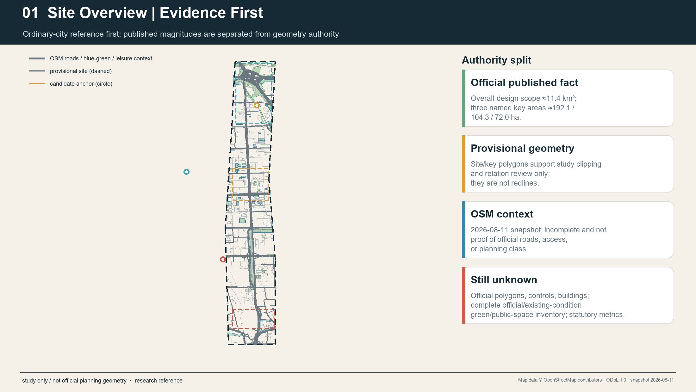

No final proposal name is locked. “Ordinary City First / AI Spatial Depth” is used only as a `design_candidate` descriptor. “JINGZHANG TRANSITIONS / 京张·转场” and “JINGZHANG COMMON CITY / 京张·共城” remain candidates requiring bilingual comprehension, trademark, and public-language testing.

## 3. Coordinated Research Area: Industry and Future City Research

The AI innovation ecosystem uses eight elements without invented metrics. Land supplies legally verifiable spatial conditions. Space separates public interface, controlled work, professional validation, and service/recovery support. Industry distinguishes validation obligations for software, fixed devices, and embodied systems. Funding is only a transparent candidate support mechanism. Talent includes researchers, transfer teams, maintenance workers, and frontline service workers. Computing and data retain controlled interfaces. Scenarios enter the city only after responsibility, failure, and exit review. [source:haidian-tech-transfer-policy] [depth:overall_spatial_structure]

Six primary cases transfer mechanisms rather than forms. Helsinki shows short real-environment pilots that may end in assessment rather than automatic adoption. Punggol highlights everyday district operations and data boundaries. Smart Mobility Living Lab London highlights controlled validation, isolation, and recovery gradients. Cornell Tech places public ground beside controlled innovation spaces. Woven City differentiates test environments by physical agency. Quayside shows that digital systems in public space require accountability and separability. Waterfront Toronto sources separately establish that digital governance, privacy, and public accountability entered review, and that Sidewalk Labs later withdrew; this proposal makes no single-cause claim. [source:C-SRC-101] [source:C-SRC-201] [source:C-SRC-301]

Cornell's public-space and innovation-building relation is supported by official university pages. Woven City descriptions come from its operator and do not prove that an open Beijing district may become a test course. Quayside remains a governance and exit caution only. [source:C-SRC-502] [source:C-SRC-702] [source:C-SRC-801]

Kashiwa-no-ha and aspern Seestadt are two extended cases. The first suggests that a standing public-private-academic interface may matter more than a technology monument. The second shows that domain-specific labs can coexist with everyday district life rather than making a whole city one testbed. None of the eight cases proves Jingzhang site availability, actor capacity, funding, consent, or institutional transferability. [source:C-SRC-401] [source:C-SRC-402] [source:C-SRC-601]

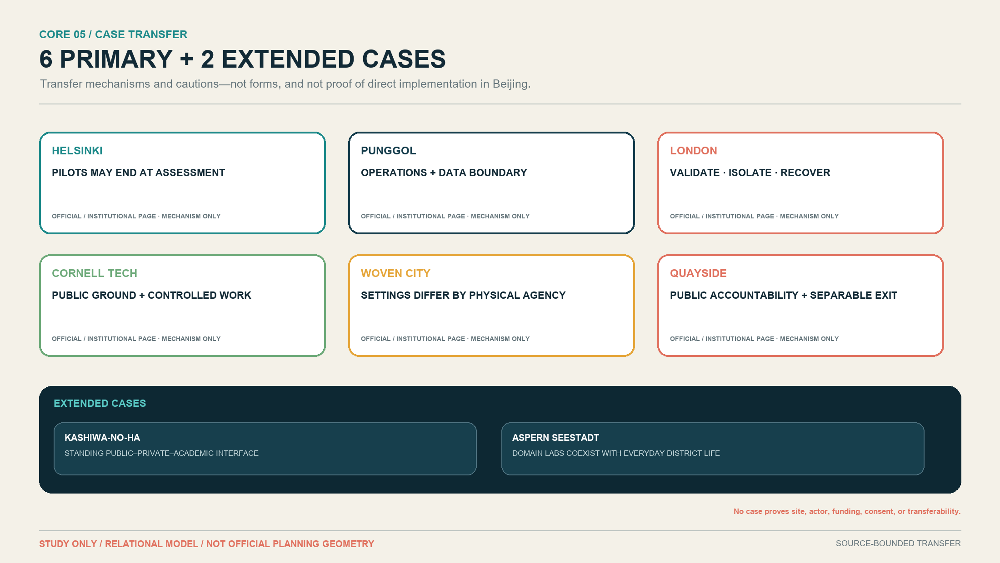

AI Spatial Depth uses D0–D4: D0 Ordinary City, D1 Public Interface, D2 Optional AI, D3 Controlled Work, and D4 Professional Validation. **Service / Recovery Support is a transversal back-of-house layer, not D5 and not an upgrade endpoint.** D2, D3, and D4 must each return to maintenance, repair, recovery, replacement, or removal. Different lines for software, fixed devices, and embodied systems express spatial burden and recovery obligations, not value or maturity.

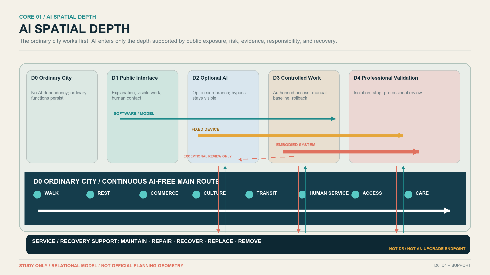

## 4. Overall Design Area: Urban Renewal and Regulatory-Plan-Level Urban Design

The overall strategy protects the ordinary-city network before deciding how deeply AI may enter. Road, slow-mobility, public-space, blue-green, and existing-use layers identify research questions. Because official parcels, road redlines, buildings, and regulatory controls are absent, the proposal provides no new road alignment, FAR, height, building volume, demolition footprint, or precise development intensity. [standard:MOHURD-CONTROL-DETAILED-PLANNING] [depth:land_use_layout] [metric:site_area_sqm]

The current `land_use.geojson` is a complete research-level coverage of the provisional site, not statutory land use. The buildings layer honestly remains unknown/empty. [data:geometry/land_use.geojson#LU-PROV-001] [data:geometry/buildings.geojson#BUILDING-DATA-GAP]

Formal Green/Public geometry is the complete set of participant-authored provisional metric-bearing polygons actually asserted by this proposal; it is neither an existing-green inventory for the full 11.4 km² nor a register of all legally confirmed public space in Haidian. Existing OSM context is separated from metric geometry and retained only as traceable research context. The resulting `green_ratio` and `public_space_ratio` are deterministic, reproducible, low-confidence design-model outputs, not statutory or official planning controls. [metric:green_ratio] [metric:public_space_ratio]

For Public polygons, `public_access_status=proposed_public` states future design intent only; it does not prove existing legal access or accessibility. Three cross-component ordinary-access links remain `CONNECTIVITY_EVIDENCE_BLOCKED`: AI Origin ↔ Xiaoyue, Xiaoyue ↔ Zhongzhiyuan, and Zhongzhiyuan ↔ Dongsheng. Mapped routes establish AI-free ordinary access only within components and along the drawn segments, not a proven belt-wide continuous AI-free route. These three LineString evidence gaps do not enter `green_ratio` or `public_space_ratio`.

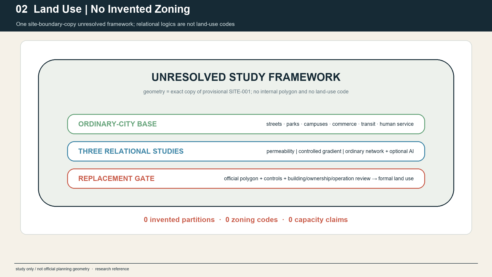

Four invariants test every interface: a continuous AI-free path; visible AI and evidence status; human completion of basic tasks when output is wrong, participation is refused, or networks fail; and a return path from installed equipment to support and restoration. These apply to ground floors, streets, public space, and service access without presuming a specific building retrofit.

## 5. Detailed Design of Key Areas

The three key areas share D0–D4 and service/recovery support but not the same composition. Their polygons remain provisional context, and published area magnitudes are not converted into precise redlines by the conceptual diagrams. [data:geometry/key_areas.geojson#PROV-KEY-001] [metric:key_area_count] [depth:three_key_area_detailed_design]

**AI Origin / Permeability.** Ordinary life surrounds an open public edge. Visible Work Edge allows selected work to be seen and explained; optional AI stays at D1–D2 and controlled project work recedes to D3. Multiple ordinary entrances, rest, orientation, and physical information continue after AI closes. Official sources support an innovation, service, and display context but do not prove that a particular building edge can open. [source:ai-origin-community] [source:ai-origin-talent-service]

**Zhongzhiyuan / Controlled Gradient.** An urban or ecological edge first offers an understandable public interface, followed by D3 controlled R&D and D4 professional validation. Software, fixed devices, and embodied systems have different stop, isolation, and recovery conditions. Validation Threshold makes public, controlled, paused, and unavailable states legible without granting public access to controlled validation. [source:zhongzhiyuan-renewal] [source:tencent-xuezhiyuan]

**Dazhongsi / Ordinary Network First + Optional AI Branch.** Transit, commerce, culture, and human service form the main network. Dazhongsi Branch Court is only a closable side branch that can return to ordinary use. AI cannot become the gate to travel, shopping, rest, culture, or help. Official renewal context and a retail AI case justify study, not participation by any merchant or site. [source:dazhongsi-renewal] [source:galbot-g1-haidian]

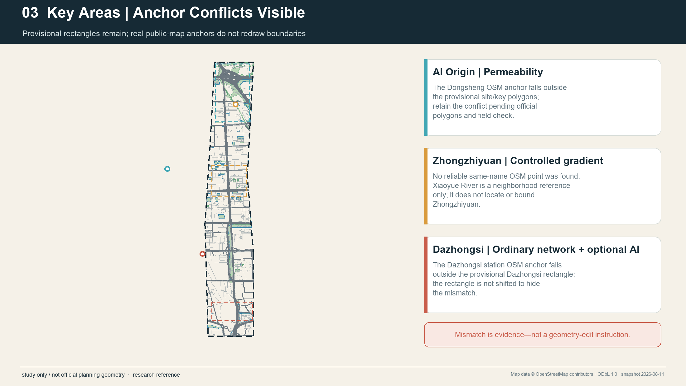

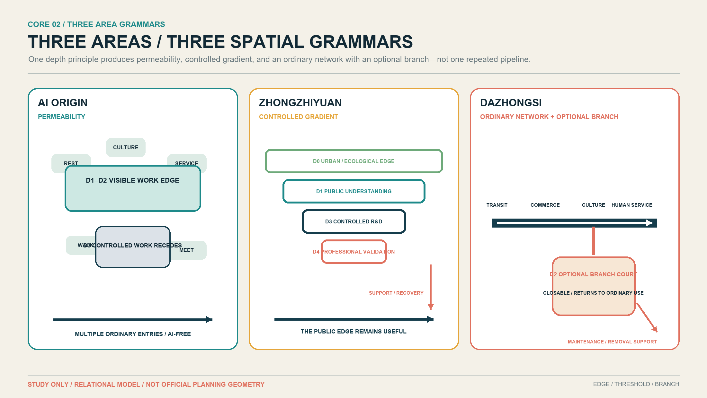

The Zhongguancun technology-service wing hosts evidence clinics, resource referral, and knowledge services. The Xiaoyue River scenario wing hosts reversible readiness audits. Both are service/method networks, not new key-area polygons and not automatic projects.

## 6. AI Innovation Ecosystem, Personas, and AI+ Scenarios

The twelve scenarios are grouped into **8 Spatial + 4 System**. Spatial scenarios directly change public/controlled boundaries, equipment placement, test settings, or recovery relations. System scenarios change feedback, evidence, continuity, or governance and are not disguised as buildings. The three industrial validations are SCN-03 software/model, SCN-04 fixed device, and SCN-10 embodied system. [standard:PROJECT-AGENT-OPEN-CALL-TASKBOOK] [depth:municipal_new_infrastructure]

| ID | Class and scenario | Area / depth | Human takeover and exit |
| --- | --- | --- | --- |
| SCN-01 | Spatial: project visibility | AI Origin, D0–D3 | Steward corrects claims; digital layer leaves while ordinary entrance and physical explanation remain |
| SCN-02 | System: community feedback | AI Origin + remote, D0–D2 | Humans read originals; paper, phone, and in-person channels continue |
| SCN-03 | Spatial / IND-TEST-01: controlled software R&D | Zhongzhiyuan, D3–D4 | Domain reviewer stops the model and restores the manual baseline |
| SCN-04 | Spatial / IND-TEST-02: fixed-device testing | Zhongzhiyuan, D2–D4 + support | Observer/maintainer isolates power/network, removes equipment, and restores surface/path |
| SCN-05 | Spatial: commerce and culture service | Dazhongsi, D0–D2 | Frontline worker bypasses AI and completes ordinary service |
| SCN-06 | Spatial: voluntary-host retail application | Dazhongsi, D2–D4 + support | Authorised staff stop equipment and restore the ordinary retail layout |
| SCN-07 | System: transfer evidence clinic | Zhongguancun wing, D1–D3 | Human adviser checks the dossier; no automated eligibility, funding, or approval decision |
| SCN-08 | Spatial: reversible readiness audit | Xiaoyue River wing, D0–D3 | Field/manual record prevails; temporary equipment is removed and the place restored |
| SCN-09 | Spatial: correctable cultural interpretation | Jingzhang public culture interface, D0–D3 | Content curator disables and corrects; physical route and sourced narrative remain |
| SCN-10 | Spatial / IND-TEST-03: embodied recovery drill | Zhongzhiyuan, D3–D4 + support | Trained role performs stop, safe approach, isolation, recovery, and removal |
| SCN-11 | System: AI-free continuity drill | Belt-wide, D0–D4 | Ordinary service activates; if continuity fails, AI stays closed or is removed |
| SCN-12 | System: bilingual open-evidence review | Rotating/remote, D1–D3 | Human translator and curator correct; archive records kept, adjusted, or exited status |

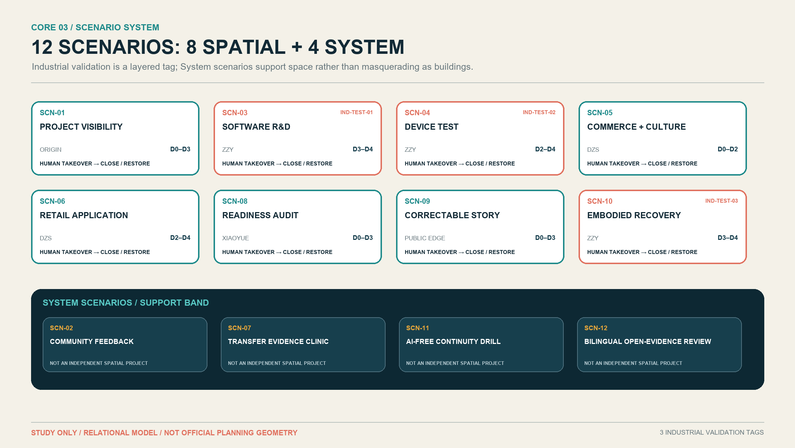

The roles are not surveyed people. Seven User/Worker roles are: researcher, startup/transfer team, resident/ordinary city user, facility maintenance worker, visitor/student/public-culture user, frontline commerce/human-service worker, and accessibility-sensitive user with companion. PER-08 is a separate steward/governance role with duties to correct, pause, close, and record reasons rather than an ordinary persona. [source:accessibility-law]

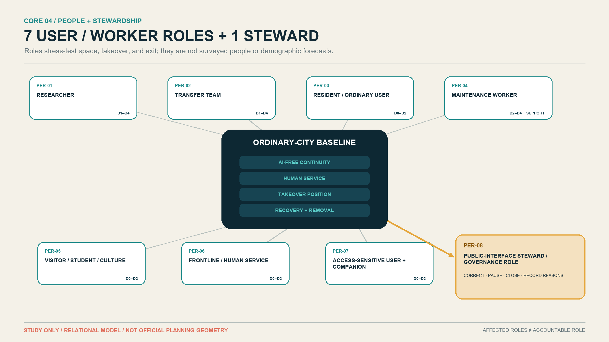

Every scenario asks whether basic city function survives the complete removal of AI. AI-native value exists only in verifiable recognition, simulation, dynamic adjustment, controlled validation, or cross-resource coordination. If ordinary or human service performs better, retaining the ordinary solution or removing AI is a successful outcome.

## 7. Land Use, Building Scale, and Retain-Renovate-Demolish Strategy

Precise buildings, ownership, regulatory, and engineering evidence are unavailable, so Spatial Depth is not drawn as a building plan, floor height, or area schedule. D0–D4 are relational spatial roles. Support may take the form of digital rollback, a controlled room, a service route, or recovery space; exact form, capacity, and location await field and professional verification. [standard:MOHURD-URBAN-DESIGN-MEASURES] [depth:development_intensity_controls] [depth:height_massing_character]

Retain, renovate, demolish, and build remain pending official data. Current decisions are limited to retaining ordinary movement, commerce, culture, rest, and human service; preferring reversible interfaces; refusing demolition decisions from conceptual diagrams; and keeping any fixed or embodied system closed until maintenance and recovery capacity are proved. [depth:retain_renovate_demolish] [metric:building_density]

Land-use expression continues to use machine-checkable formal classifications rather than inventing “AI land” as a substitute. AI enters through reversible uses, interfaces, controlled work, and operating duties, not through an unapproved land-use category. [standard:MNR-LAND-USE-CLASSIFICATION-GUIDE]

## 8. Transport, Rail, Municipal Infrastructure, and Public Services

After completion of the Jingzhang Phase II supporting works, historical railway separation cannot be presented as a general current fact. OSM roads, waterways, and POIs are a research snapshot only; they do not establish width, gradient, opening hours, lawful crossing, accessibility, or service access. Any residual break or time cost requires multi-time field, mapped-route, and professional verification. [source:jingzhang-phase-two-completion] [data:geometry/roads.geojson#ROAD-OSM-PRIMARY] [depth:traffic_rail_slow_parking]

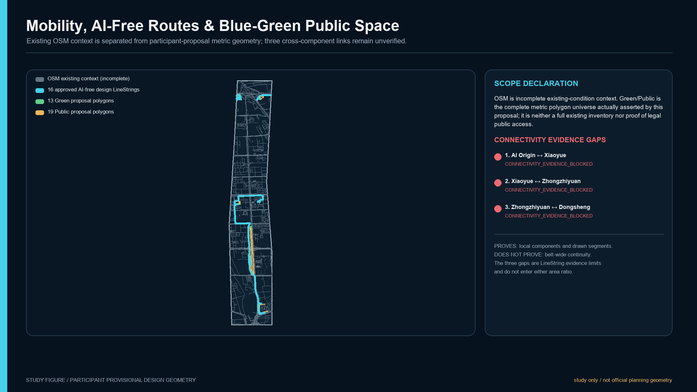

The AI-free path is a design requirement, not an existing-condition claim. It needs no account, phone, sensing permission, or test participation and remains continuous during outage, error, maintenance, and permanent removal. Fixed devices cannot occupy required clear width. Embodied systems begin in D3–D4 controlled settings; any exceptional D2 public pilot requires separate review of non-participants, accessibility, labour, emergency stop, and recovery.

Public service uses an ordinary entrance, human takeover, and optional AI side branch. Municipal interfaces list power, network, low-voltage, charging, isolation, cleaning, and removal as questions only. The proposal claims no capacity and does not hide maintenance labour.

## 9. Blue-Green Network, Public Space, and Urban Character

Blue-green and public space first serve rest, shade, walking, cycling, culture, ecology, and human help. AI may occupy only a closable side branch, interpretive edge, or authorised temporary test position. The main route and public value cannot depend on equipment. [data:geometry/green_space.geojson#GREEN-OSM-COVERAGE] [data:geometry/public_space.geojson#PUBLIC-OSM-COVERAGE] [depth:blue_green_public_space]

The three primary landmarks are not technology spectacles. They are three spatial memories: **Visible Work Edge** at AI Origin, **Validation Threshold** at Zhongzhiyuan, and **Dazhongsi Branch Court** at Dazhongsi. The first two are retained and the third is a recommended design candidate. None has an exact site, dimension, material, building, or operating commitment.

Human Service Anchor is downgraded to a **Public Space Component** across interfaces. Three-Layer Story Stop is downgraded to a distributed **Heritage Public Interface**. The component library includes Human Service Point, Non-Digital Panel, Optional AI Entry, AI-Free/Bypass Marker, Takeover/Assistance Marker, Maintenance Access Cue, Recovery/Removal Interface, and Accessible Rest/Waiting. They are concept types, not a product schedule or installed inventory.

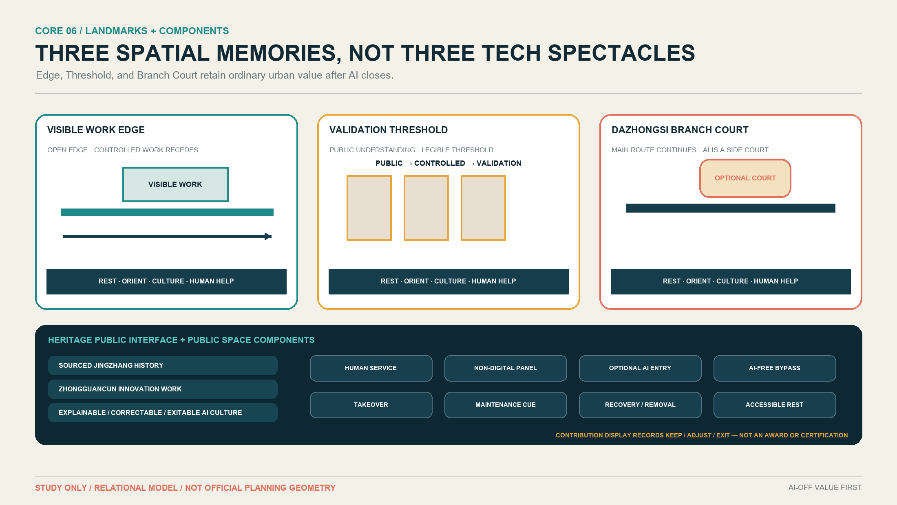

The cultural narrative has three layers: sourced Jingzhang railway history and current public-space facts; Zhongguancun innovation work and technology transfer; and an AI culture of explanation, correction, takeover, and exit. Physical sourced narrative comes first and optional digital layers enter later. The design does not equate railway form with AI or invent people, events, or official interpretations. [source:agent-taskbook] [source:jingzhang-phase-two-completion]

The Open Contribution Display records contribution, source, public value, review/pilot status, maintenance contribution, recovery/removal outcome, and contributor credit. Kept, adjusted, and exited candidates can all be recorded. It is not an award, certification, procurement endorsement, or government honour.

## 10. Renewal Projects, Implementation Policy, and Phasing

The candidate portfolio has three types: seven Spatial Projects (CP-01, 03, 04, 05, 06, 07, 10), two Operational Programmes (CP-09, 11), and two Governance / Service Systems (CP-02, 08). “Project” no longer covers every mechanism. Only inherently spatial candidates with authoritative location evidence may later enter GeoJSON. [depth:renewal_project_list]

| Type | Candidates | Geometry eligibility |
| --- | --- | --- |
| Spatial Projects | Visible Work Edge; Validation Threshold; Software/Model Shadow Cell; Fixed-Device Test Bay; Embodied Recovery Yard / Room; Ordinary Service + Optional AI Branch; Heritage Public Interfaces | CP-01/03/05/06 = YES; CP-04/07/10 = MAYBE; none authorises current drawing |
| Operational Programmes | Reversible Scenario Readiness Walks; Open Evidence Cycle & Archive | NO |
| Governance / Service Systems | Community Feedback Interface; Transfer Evidence Clinic Network | CP-02 = NO; CP-08 = MAYBE only for future verified service points |

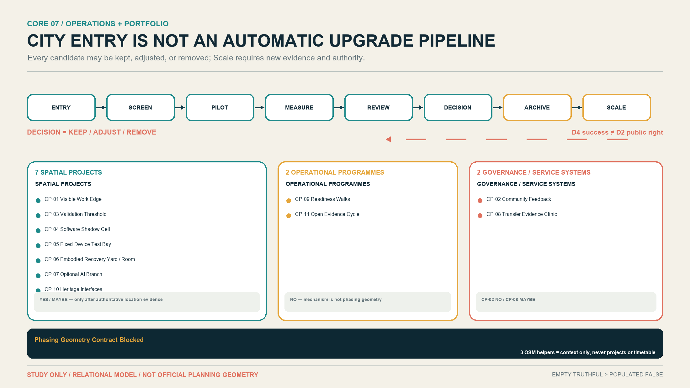

The operating method is `ENTRY → SCREEN → PILOT → MEASURE → REVIEW → DECISION → ARCHIVE → SCALE`. Scale is not automatic. D4 validation success does not grant D2 public deployment; public effects, ordinary continuity, accessibility, frontline labour, maintenance, site rights, and exit require a new review. Staying deeper, pausing, or removal are legitimate decisions. [source:C-SRC-101] [source:C-SRC-302] [depth:phasing_implementation]

The three OSM points in `phasing.geojson` are analysis helpers only, not projects, phases, schedules, or landmarks. The latest validator requires a nonempty formal phasing layer, so the external empty-layer test triggers a contract blocker. This phase therefore preserves the original file and records **Phasing Geometry Contract Blocked**. Design sequencing expresses dependencies only and gives no dates, budgets, or government commitments. [data:geometry/phasing.geojson#PHASE-CAND-001]

Annual operation remains a candidate mechanism: open calls and evidence clinics, developer/maintainer collaboration, scenario opening, public experience, bilingual review, exit archive, international communication, and conversion pathways. Brand, venue, calendar, budget, procurement, partners, and outcomes remain unresolved; no investment, funding, or policy support is stated as committed.

## 11. Metrics, Area Recalculation, and Compliance Matrix

Known metrics include `site_area_sqm=11,412,825.385553982 m²`, recomputed from provisional `SITE-001`. [metric:site_area_sqm] The union area of 13 participant-proposed Green polygons is `209,504.8649792572 m²`, with `green_ratio ≈ 1.84%`. [metric:green_ratio] The union area of 19 participant-proposed Public polygons is `192,272.2098199374 m²`, with `public_space_ratio ≈ 1.68%`. [metric:public_space_ratio] `key_area_count=3`. [metric:key_area_count]

All three required metrics are low-confidence, submission-derived, provisional design-model outputs, not official areas or statutory controls. The published overall magnitude `11,400,000 m²` is a version/precision reference only and is not used to tune a polygon. [depth:metrics_recalculation]

Building area, FAR, building density, height, setbacks, the exact official site polygon, and other metrics dependent on unavailable official controls remain unknown. Green/Public areas and ratios are stored as known, low-confidence values derived from the participant proposal geometry and must be recalculated when official boundaries or design geometry change. This does not weaken the official-data limitation or elevate design-model values into approval evidence. [metric:green_ratio] [metric:public_space_ratio] [metric:floor_area_ratio]

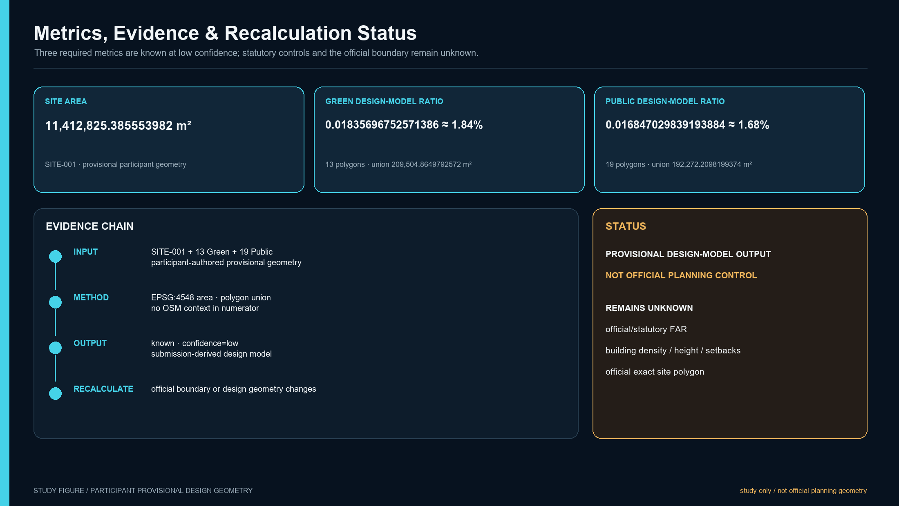

`compliance_matrix.json` maps official tasks and agent.1–agent.6 to sections, layers, metrics, drawings, sources, assumptions, and HTML. `standard_matrix.json` records only genuine standards. `design_depth_matrix.json` places Spatial Depth, the three areas, scenarios, culture, operations, the candidate portfolio, and professional follow-up within an evidence chain. Matrix completeness is not approval, engineering feasibility, or a passing formal self-check.

## 12. Risk, Copyright, and Compliance

The largest professional risk is using attractive spatial precision to conceal missing authority for boundaries, buildings, responsibility, and capacity. Remaining unknowns include official site/key-area polygons, parcels and road redlines, buildings/ground floors/ownership/leases, fire/structure/MEP, accessible continuity, support/service routes, specific operators and maintainers, SLA, funding, event resources, test thresholds, and legal permission. [depth:risk_missing_data]

Every spatial move is a “conceptual suggestion,” “reference scheme,” or “material for professional teams to deepen.” It does not authorise demolition, construction, installation, closure, testing, procurement, investment attraction, or events. D0–D4 are urban-design relations, not legal risk, technology maturity, certification, or approval classes.

Text, figures, PDFs, and offline HTML are generated within this Agent workflow. Public facts are listed in `sources.json`. Cases are paraphrased and compared at mechanism level; no case image, logo, drawing, trademark, or substantial text is reused. Local system fonts are embedded for PDFs; rights and build notes appear in `report/copyright_statement.md`.

Formal submission readiness is controlled by the machine-readable `manifest.json` and `self_check.json`; this proposal and its figures do not assert approval, selection, or implementation status.

## 13. References

The complete 28-record formal/site/case registry appears in `sources.json` with publisher, URL, date, use, limitation, and reuse note. Eighteen deduplicated assumptions appear in `assumptions.json`. Case evidence includes Helsinki city-innovation pages, Punggol government-agency project and testing pages, London testbed-operator pages, Cornell Tech university pages, Woven City operator pages, Waterfront Toronto public-agency statements, the Kashiwa project page, and the Seestadt district page. [source:C-SRC-102] [source:C-SRC-202] [source:C-SRC-501]

Supplementary case pages cross-support methods and spatial relations without proving Beijing transfer: London private trials, Cornell campus, Woven Inventors, the Waterfront Toronto withdrawal statement, and the current Seestadt urban-lab page retain their individual limitations. [source:C-SRC-302] [source:C-SRC-701] [source:C-SRC-802]

The authority order remains GeoJSON → metrics → three matrices → manifest/sources/assumptions/self-check → proposal → figures → HTML/PDF. If official polygons, controls, buildings, or responsibility evidence arrive, the workflow must recalculate from the authority layer and update every display artifact rather than editing one attractive diagram. [standard:PROJECT-AGENT-OPEN-CALL-TASKBOOK]
